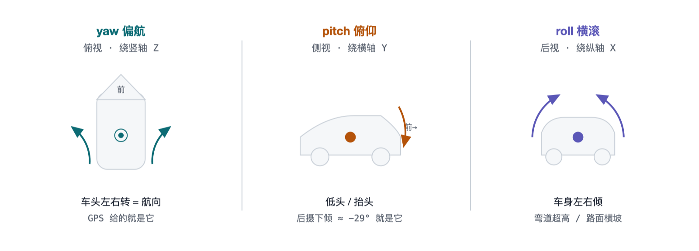
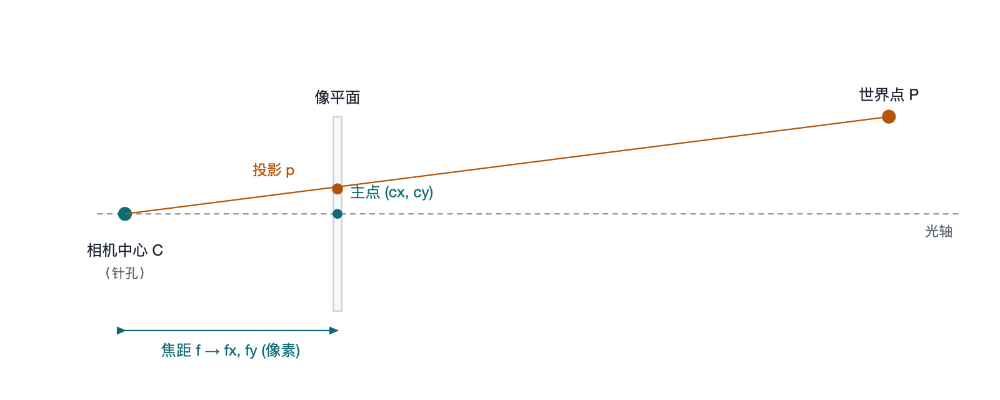
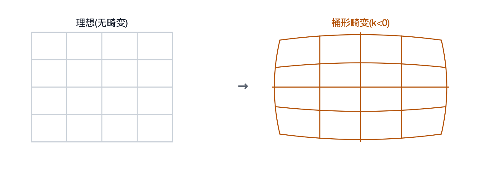
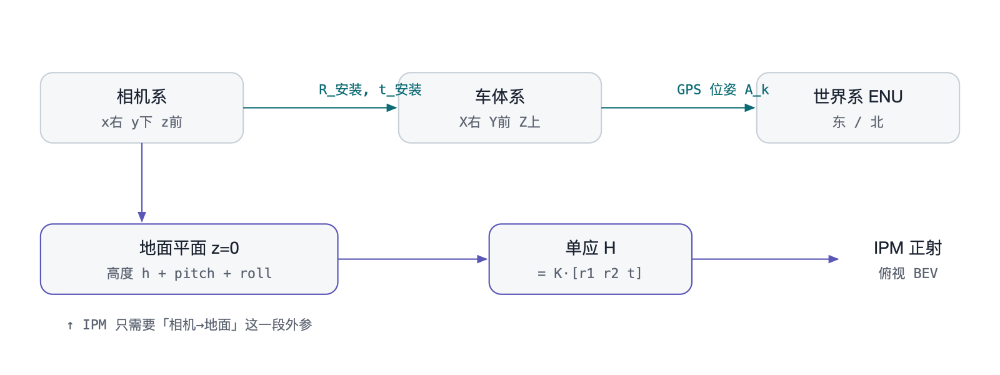

## 0. 总览：相机参数只分三类

所有标定参数只回答两个问题——**「相机自己长什么样」**和**「相机装在哪、朝哪」**。

| 类别 | 符号 | 是什么 | 何时固定 |
|---|---|---|---|
| **内参 K** | `fx fy cx cy` | 把相机系里的 3D 点投到像素平面 | 出厂固定，与安装无关 |
| **畸变 D** | `k1 k2 k3 p1 p2` | 真实镜头把直线拉弯的修正 | 出厂固定，标内参时一起出 |
| **外参 R, t** | `roll pitch yaw · tx ty tz` | 相机相对车/地/世界的姿态与位置 | 随安装 + 行车变化 |

**关键分界：**

- 内参 + 畸变是**相机的「身份证」**，一次标定终身有效（除非换镜头或改分辨率）。
- **外参里的旋转就是 roll / pitch / yaw**——安装角固定，但行车中还会随坡度、刹车、弯道超高逐帧抖动。
- IPM 做正射，靠的正是「**内参 K + 畸变 D + 相机对地面的外参（高度 h + pitch + roll）**」这一整套。

---

## 1. roll / pitch / yaw 是什么

三个旋转，各绕车体的一根轴。约定：**X = 前进方向（纵轴），Y = 车身右（横轴），Z = 朝上（竖轴）**。



*三个旋转，三根轴。yaw 绕竖轴（车头左右转，= 航向，GPS 直接给）；pitch 绕横轴（低头抬头，后摄的固定下倾角就是一个大 pitch）；roll 绕纵轴（车身左右倾，直道≈0、弯道有横坡）。对相机而言 roll 让整幅画面在平面内转，pitch 改变地平线高低，yaw 改变朝向。*

### 汇总表

| 旋转 | 绕哪根轴 | 直观 | 对图像的影响 | 怎么测 |
|---|---|---|---|---|
| **yaw 偏航 ψ** | 竖轴 Z | 车头左右转 / 航向 | 画面朝向变，横向平移 | GPS 航迹角、轨迹切线；磁罗盘；INS |
| **pitch 俯仰 θ** | 横轴 Y | 低头 / 抬头 / 下倾 | 地平线上下移，远近尺度变 | **消失点** `atan((cy−v_vp)/fy)`；IMU 重力；倾角仪；棋盘格 |
| **roll 横滚 φ** | 纵轴 X | 车身左右倾 | 整幅画面平面内旋转 | **IMU 重力矢量**；地平线倾斜；车道线对称；直道设 0 |

### 安装角 vs 行车姿态

- **安装角**：相机拧在支架上的固定角度（后摄的 pitch≈−29°、roll≈0、yaw≈180° 朝后）——标一次就固定。
- **行车姿态**：开起来后每帧还叠加的小抖动（刹车点头 = 动态 pitch，弯道超高 = 动态 roll）——需要 IMU 或逐帧视觉才拿得到。
- IPM 对 pitch **极敏感**：`0.3°` 误差 → 接缝错位 `5.7 cm`。

---

## 2. 内参 K：相机怎么把 3D 点变成像素

针孔模型的四个数，装进一个 3×3 矩阵。



*世界点 P 与相机中心 C 的连线穿过像平面，交点就是像素坐标 p。焦距 f（以像素计 = fx, fy）决定放大率，主点 (cx, cy) 是光轴与像平面的交点、即图像的「真中心」——通常不完全等于 W/2, H/2。*

| 符号 | 名字 | 含义 | 本项目值（@1920×1080） |
|---|---|---|---|
| `fx, fy` | 焦距（像素） | 放大率；fx≠fy 表示像素非正方形。越大视野越窄、地面 GSD 越细 | `1222.76 / 1217.53` |
| `cx, cy` | 主点 | 光轴打在图像上的点，图像真正的中心 | `969.97 / 534.15` |
| `s` | 斜切 skew | 像素轴不垂直的修正，现代相机≈0，一般忽略 | `0` |

装进矩阵就是：

```
K = | fx   s   cx |
    |  0  fy   cy |
    |  0   0    1 |
```

像素坐标 = `K · (相机系 3D 点 / 深度)`。

---

## 3. 畸变 D：真镜头会把直线拉弯

内参假设完美针孔，畸变系数补回真实镜头的弯曲。**标定内参时一起出。**



*桶形 vs 枕形。广角、下倾的相机远场畸变尤其明显。缺畸变系数会让 IPM 远场横向尺度偏 ~10%——这正是本项目条带目前只能取到近场 3.8 m 的原因之一。*

| 符号 | 类型 | 作用 |
|---|---|---|
| `k1, k2, k3` | 径向畸变 | 桶形/枕形，离中心越远越弯（主要项） |
| `p1, p2` | 切向畸变 | 镜头与传感器不平行导致的偏移（次要项） |

- OpenCV 的畸变向量通常是 `[k1, k2, p1, p2, k3]` 五个数。
- 拿到后直接填 `config.dist` 即可，一行改动。

---

## 4. 外参 R, t：相机装在哪、朝哪

旋转 **R**（= roll · pitch · yaw 三个角合成的 3×3 矩阵）+ 平移 **t**（相机位置）。是一串坐标系变换。



*外参是一串变换。拼接需要「相机→车→世界」整条链（上排）；而 IPM 正射只需要「相机→地面平面」这一段（下排）——由安装高度 h、下倾 pitch、侧倾 roll 决定，和内参 K 一起构成单应矩阵 H。*

| 符号 | 名字 | 本项目怎么理解 |
|---|---|---|
| `roll φ` | 侧倾角 | 相机绕光轴/纵轴转；装正≈0 |
| `pitch θ` | 下倾角 | 后摄朝下的那个角 ≈ −29°，**IPM 最关键的量** |
| `yaw ψ` | 偏航角 | 相机水平朝向；后摄相对车头 = 180° |
| `tx ty tz` | 平移（位置） | 相机在车/世界里的位置；对地面 IPM 主要是**安装高度 h** |

---

## 5. 标定数据种类：每样参数靠什么数据标出来

「要标什么」决定「要采什么数据、用什么方法」。

| 要标定 | 方法 | 需要的数据 | 工具 / 函数 |
|---|---|---|---|
| **内参 K + 畸变 D** | 张氏标定法 | **棋盘格 / ChArUco 靶标**，多角度拍 15–30 张 | `cv2.calibrateCamera` |
| **相机→地面外参**（pitch, roll, h） | PnP 位姿求解 | 地面上**已知尺寸的靶标/标定布**（角点世界坐标已知） | `cv2.solvePnP` |
| **pitch / yaw**（无靶标） | 消失点法 | **带平行车道线的道路图**（本项目现有数据即可） | 光流 FoE / 直线拟合 |
| **逐帧 roll / pitch** + yaw 变化率 | 惯性测量 | **IMU**：加速度计（重力→roll/pitch）+ 陀螺（角速度） | IMU / INS |
| **位置 / 航向 / 尺度** | 卫星定位 | **GPS / RTK 轨迹**（经纬度 + 航向 + 时戳） | GPS · RTK/PPK |
| **安装高度 h** | 直接量 / 尺度反推 | 卷尺；或 GPS 帧间真实距离 ÷ BEV 测得位移 | 卷尺 / `solve_height` |
| **名义安装角** | 机械图纸 | 支架安装图 / 倾角仪读数 | 机械 / 倾角仪 |

### 5.1 为什么 IMU 是测 roll/pitch 的「标准答案」

静止或匀速时，加速度计感受到的只有**重力**——重力永远指向地心，于是它像一根铅垂线，直接给出相机相对水平面的
**roll 和 pitch 的绝对值**。陀螺仪测角速度，补上快速运动时的动态。

唯独 **yaw** 重力管不着（绕竖轴转不改变重力方向），要靠磁罗盘或 GPS 航向补。这就是
**「GPS 基本只给 yaw、roll/pitch 得另找 IMU 或视觉」**的根本原因。

### 5.2 没有 IMU 时，视觉能顶一部分

- **pitch / yaw** ← 车道线/道路的**消失点**：平行线在图像里交于一点，该点位置直接反解俯仰和偏航。本项目现有道路图就能标。
- **roll** ← 地平线倾斜、或车道线左右对称性。
- 代价：算得出「安装 + 缓变」的姿态，但抓不住高频抖动（那仍需 IMU）。
