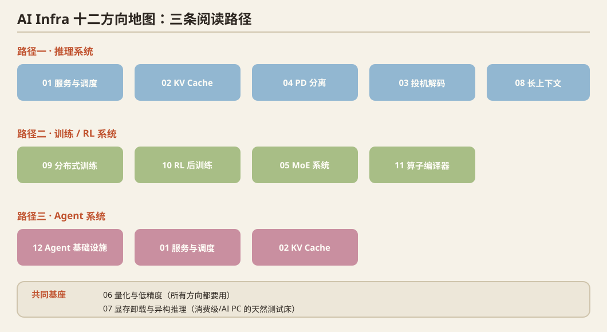

## 这个合集是什么

这是对 AI-Infra 十二个方向的**逐方向展开版**调研：每个方向覆盖「问题定义 → 历史脉络（奠基论文 + 会议/年份）→ 2025–2026 最新前沿 → 开放问题 → 论文速查」。

数据源：arXiv 12 方向 × 20 篇（2026-07~09）+ MLSys 2026 全量 + OSDI 2025 + SOSP 2025 + NSDI 2026 Spring，合计 500+ 篇。

## 目录

| # | 篇目 | 一句话 |
|---|---|---|
| 01 | [推理服务与调度](/notes/infra-survey-01-serving/) | 从 Orca 连续批处理到多租户公平性与测量学 |
| 02 | [KV Cache 管理](/notes/infra-survey-02-kvcache/) | PagedAttention 起家的主战场：分配/压缩/驱逐/卸载/恢复 |
| 03 | [投机解码](/notes/infra-survey-03-speculative/) | draft-verify 十年集大成：Medusa/EAGLE → 控制 → RL |
| 04 | [PD 分离与推理架构](/notes/infra-survey-04-pd/) | Splitwise/DistServe/Mooncake → 算子级与功率维度 |
| 05 | [MoE 系统](/notes/infra-survey-05-moe/) | GShard 到 DeepEP；MLSys'26 最热子方向 |
| 06 | [量化与低精度](/notes/infra-survey-06-quant/) | GPTQ/AWQ → FP8 → NVFP4；质量测量学 |
| 07 | [显存卸载与异构推理](/notes/infra-survey-07-offload/) | llama.cpp/PowerInfer → 张量级/SSD 原生/PIM/晶圆级 |
| 08 | [长上下文与高效注意力](/notes/infra-survey-08-longctx/) | FlashAttention → 原生稀疏（NSA/MoBA）→ 线性注意力 |
| 09 | [分布式训练与并行](/notes/infra-survey-09-training/) | ZeRO/FSDP → 零 I/O 容错、静默错误、训练验证 |
| 10 | [RL 后训练基础设施](/notes/infra-survey-10-rl/) | HybridFlow/veRL → MinT LoRA 服务化、投机进 rollout |
| 11 | [GPU 算子与编译器](/notes/infra-survey-11-kernels/) | Triton → 超优化/LLM 写 kernel/megakernel |
| 12 | [Agent 基础设施](/notes/infra-survey-12-agent/) | 2026 最大增量：沙箱投机、进度感知 KV、回放测试 |

**专题深读**：[PD 分离全景](/notes/infra-survey-13-pd-panorama/) · [PD 奠基论文](/notes/infra-survey-14-pd-foundations/) · [PD 2025–26 前沿](/notes/infra-survey-15-pd-frontier/) · [KV 准入决策](/notes/infra-survey-16-kv-admission/) · [顶会论文清单](/notes/infra-survey-17-paper-index/)

## 三条阅读路径

- **做推理系统研究**：01 → 02 → 04 → 03 → 08，再读 PD 三部曲与 KV 准入专题
- **做训练/RL 系统**：09 → 10 → 05 → 11
- **做 Agent 系统**：12 → 01 → 02

## 姊妹系列

[MLSys 失败实验复盘](/notes/series/mlsys-failures/)系列从**实验复盘**的角度记录了九个方向上的失败尝试（预注册判据、数据、教训），与本系列的**文献综述**视角互为补充。
