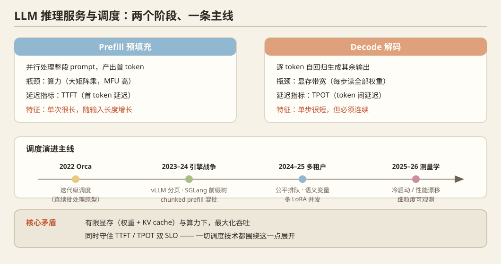

## 一、问题定义

LLM 推理分两个阶段：**prefill**（并行处理输入 prompt，算力 bound）和 **decode**（逐 token 自回归生成，访存 bound）。服务系统的核心矛盾是：在有限 GPU 显存（权重 + KV cache）与算力下，最大化吞吐的同时满足 TTFT（首 token 延迟）/ TPOT（token 间延迟）的 SLO。

## 二、历史脉络

### 前 vLLM 时代（2020–2022）
- **FasterTransformer**（NVIDIA, 2019–）：最早的工业级推理加速库，手写 CUDA + 层融合。
- **Orca**（OSDI 2022，首尔国立大学/FriendliAI）：**里程碑**。提出 iteration-level scheduling（迭代级调度，即 continuous batching 的学术原型），打破"一个 batch 必须等所有请求完成"的批处理范式，吞吐提升一个数量级。后续所有引擎（vLLM/TGI/TensorRT-LLM）都建立在此之上。

### 引擎战争时代（2023–2024）
- **vLLM**（SOSP 2023，UC Berkeley）：PagedAttention——借鉴 OS 虚拟内存分页管理 KV cache，消除碎片，配合 continuous batching 成为事实标准。2024 年发布 V1 架构（分离式 scheduler、多进程执行器）。
- **SGLang**（2024，LMSYS/Stanford）：RadixAttention 基数树前缀共享 + 结构化生成约束解码 + 前后端分离架构，在 agent/复杂 prompt 场景优于 vLLM。
- **TensorRT-LLM**（NVIDIA, 2023–）：编译期优化路线，kernel 全手写/自动生成，单卡极限性能最强。
- **Sarathi-Serve**（OSDI 2024，Microsoft Research India）：**chunked prefill**——把 prefill 切块与 decode 混批，stall-free 调度，解决 prefill 抢占 decode 造成的延迟毛刺。此技术后被 vLLM/SGLang 全面吸收。
- **ServerlessLLM**（OSDI 2024）：checkpoint 快速加载 + 局部性感知调度，把 LLM 推理做成 serverless，冷启动从分钟级降到秒级。
- **SpotServe**（ASPLOS 2024）：可抢占实例（spot GPU）上的弹性 serving。
- **Llumnix**（2024）：以 KV cache 迁移为核心的跨实例动态调度/碎片整理。

### 多租户与公平性（2024–2025）
- **VTC**（2024）：token 级公平排队，类比网络中的公平队列。
- **Parrot**（OSDI 2024）：Semantic Variable，暴露应用层语义给调度器做请求间优化。
- **多 LoRA serving**：Punica（2023，多 LoRA 共享基座 kernel）→ S-LoRA（2024，数千 LoRA 并发）→ dLoRA / LoRAX。2025 年后与 MinT 式"基座驻留+适配器流转"汇合（见方向 10）。

## 三、2025–2026 最新前沿

- **公平性隔离**：`Token Latency Fairness`（arXiv 2609.18112, 2026-09）：多租户下以 token 延迟公平性为目标的性能隔离，解决高负载租户挤占他人 SLO。
- **测量学转向**：MLSys 2026 `Breaking the Ice: Analyzing Cold Start Latency in vLLM`（首次系统分解 vLLM 冷启动各环节）；`DriftBench: Measuring and Predicting Infrastructure Drift in LLM Serving Systems`（服务基础设施性能漂移的测量与预测）。
- **容错 serving**：MLSys 2026 `Adaptive Erasure Coding for Fault-Tolerant LLM Serving with Continuous Batching`——用纠删码在连续批处理下做容错。
- **企业级自动化优化**：MLSys 2026 `OptiKIT`：自动化满足 SLO 同时压缩 GPU 小时数。
- **细粒度剖析**：MLSys 2026 `ProfInfer`：eBPF 的细粒度推理 profiler（无侵入观测成为新工具链）。
- **边缘编排**：`DRLM`（Globecom 2026）：深度强化学习在 64 节点边缘集群上做多模型/多量化档位的查询路由，延迟降 51%。
- **LLM 优化 LLM**：MLSys 2026 `Optimizing PyTorch Inference with LLM-Based Multi-Agent Systems`。

## 四、开放问题

1. 混合负载（chat + reasoning + agent）共存时的统一调度理论仍空白；现有系统为单一负载形态调优。
2. 抢占/迁移的代价模型粗糙——KV 迁移带宽 vs 重算开销的实时决策。
3. 多租户强隔离（性能+安全）与 GPU 高利用率的根本矛盾。
4. 消费级/异构硬件上的调度研究稀缺（现有工作几乎全在 A100/H100 同构池上验证）——**消费级/异构硬件是可切入的缝隙**。

## 五、代表论文速查

Orca (OSDI'22) · vLLM (SOSP'23) · Sarathi-Serve (OSDI'24) · Parrot (OSDI'24) · ServerlessLLM (OSDI'24) · SpotServe (ASPLOS'24) · S-LoRA ('24) · SGLang ('24) · VTC ('24) · Llumnix ('24) · Token Latency Fairness (2609.18112) · py-kvcache (2609.11744) · MLSys'26: REMIX / Cold Start / DriftBench / ProfInfer / OptiKIT / Adaptive Erasure Coding