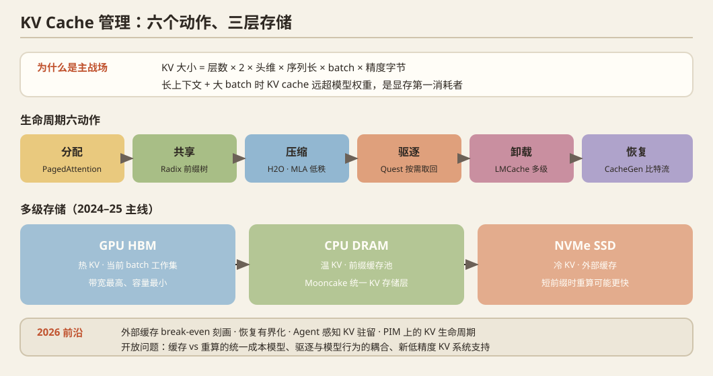

## 一、问题定义

自回归推理中，每个 token 的 Key/Value 向量需缓存以避免重复计算。KV cache 大小 = 层数 × 2 × 头维 × 序列长 × batch × 精度字节数。对长上下文+大 batch，KV cache 远超模型权重，成为显存第一消耗者。核心问题：**分配、共享、压缩、驱逐、卸载、恢复**。

## 二、历史脉络

### 阶段 1：内存管理（2023）
- **vLLM / PagedAttention**（SOSP 2023）：OS 分页思想，block 化分配，显存利用率从 ~40% 提到 ~96%。一切的地基。

### 阶段 2：驱逐与压缩（2023–2024）
- **H2O**（NeurIPS 2023）：注意力分数指示"重要 token"，驱逐低分 KV，20% 缓存保住大部分精度。
- **StreamingLLM**（ICLR 2024）：attention sink 现象（前几个 token 吸走注意力），保留 sink + 滑窗即可无限流式。
- **SnapKV**（2024）：prompt 末尾观察窗投票选出重要前缀位置。
- **PyramidKV**（2024）：层间金字塔分配——浅层分散、深层集中。
- **Quest**（2024）：**query 感知**的选择性加载，page 级元数据估计重要性，驱逐改为"按需取回"。
- **DuoAttention**（2024）：检索头 vs 流式头二分，不同头不同缓存策略。
- **模型架构侧**：GQA（2023, Llama2）→ **MLA**（DeepSeek-V2/V3，低秩压缩 KV 到 latent 向量，KV 缩小一个数量级）——架构与系统协同压缩的代表。

### 阶段 3：前缀缓存与多级存储（2024–2025）
- **RadixAttention**（SGLang, 2024）：基数树管理共享前缀，多轮对话/agent 场景的标配。
- **CacheGen**（SIGCOMM 2024）：KV cache 压缩成比特流跨网络传输，省 prefill 的算力消耗。
- **LMCache**（2024–2025）：GPU→CPU→Disk 多级 KV 缓存层，vLLM 生态标准组件。
- **Mooncake**（FAST 2025 最佳论文，Moonshot AI）：**以 KVCache 为中心的分离式架构**，GPU 间 KV 传输池化，生产级验证（Kimi）。
- **DéjàVu / CacheBlend / Prompt Cache**（2024）：跨请求 KV 复用、非前缀位置复用（RAG 场景）。

## 三、2025–2026 最新前沿

1. **外部缓存的 break-even 刻画**：`py-kvcache`（2609.11744）——NVMe 外部缓存的性能特征化，关键发现：**对短前缀或快 GPU，重算比读缓存更快**；提出异步 direct I/O + 调度器感知预加载（请求排队时就开始读盘），80K token 比 LMCache 快 2.0×。结论"外部 KV 缓存应视为因部署而异的准入决策"。
2. **恢复有界化**：`Bounded-State Restoration`（2608.17826）——把"恢复本地工作集(RWS)"从状态大小解耦，O(W) 常数窗口，512K 恢复 TTFT 43.1s→17.6s。
3. **KV 压缩逼近极限**：`DeepSeek-V4.1-Flash`（2609.19969）——面向 agent 时代输入重型负载的 KV 压缩；MLSys 2026 `NeSyKV`（神经符号架构感知驱逐）。
4. **Agent 感知 KV 管理**：`Ask the Tool, Don't Guess`（2609.18849）——工具执行期间 KV 驻留决策不靠猜，让工具上报进度，p90 TTFT 降 20.7%；MLSys'26 `ForeCache`（coding agent 负载的 KV 管理）；`AgenticCache`、`HiServe`（混合模型的前缀缓存）。
5. **PIM 上的 KV 生命周期**：`PATTON`（2609.11392）——在存内计算设备上支持生产级 KV 分配/共享/回收，GEMV 效率与单 token 写入的根本矛盾用层次化 granule 解决。
6. **长上下文训练侧**：SOSP'25 `DCP`（动态上下文并行）等见方向 08/09。

## 四、开放问题

1. **"缓存 vs 重算"的统一成本模型**缺失——随硬件（GPU 带宽/SSD 速度/PCIe 代际）剧烈变化，消费级平台上完全未被刻画（机会！）。
2. 驱逐策略与**模型行为**的耦合：压缩后的模型在长链推理上的退化缺乏校准测量。
3. 多模态/agent 负载下 KV 的结构（图像块、工具输出块）与复用模式未被充分利用。
4. NVFP4 等新低精度 KV 的系统支持刚起步。

## 五、代表论文速查

PagedAttention (SOSP'23) · H2O (NeurIPS'23) · StreamingLLM (ICLR'24) · SnapKV · Quest · DuoAttention · CacheGen (SIGCOMM'24) · RadixAttention · LMCache · Mooncake (FAST'25) · MLA (DeepSeek-V2/V3) · DeepSeek-V4.1-Flash (2609.19969) · py-kvcache (2609.11744) · BSR (2608.17826) · Ask the Tool (2609.18849) · PATTON (2609.11392) · MLSys'26: NeSyKV / ForeCache / ContextPilot / HiServe / AgenticCache