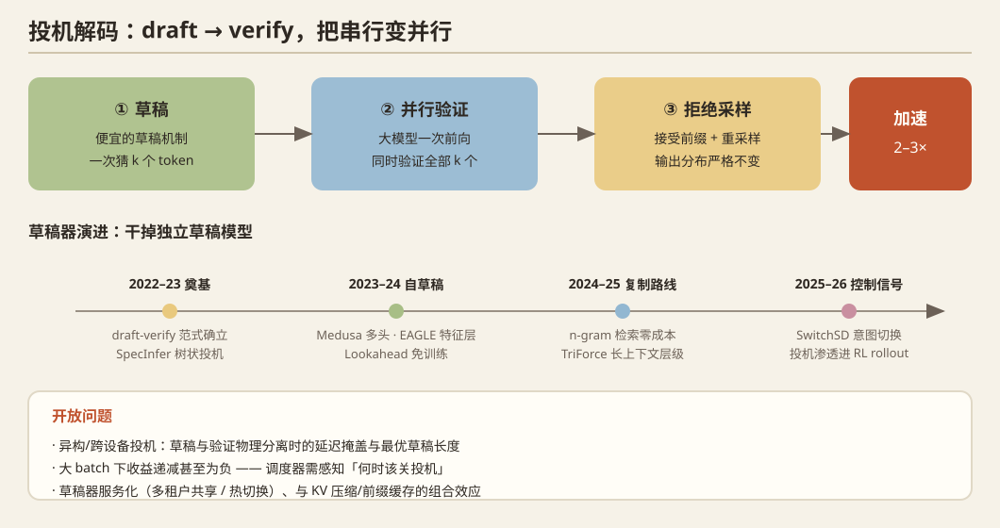

## 一、问题定义

Decode 阶段逐 token 串行，GPU 算力利用率极低（访存 bound）。投机解码用一个便宜的"草稿"机制一次猜 k 个 token，再由大模型**一次前向并行验证**，数学上保证输出分布不变（拒绝采样），把串行变并行，典型加速 2–3×。

## 二、历史脉络

### 奠基（2022–2023）
- **Leviathan et al.**（Google, ICML 2023）与 **Chen et al.**（DeepMind, 2023）：两篇独立同期工作确立"draft-verify + 拒绝采样"范式。
- **SpecInfer**（ASPLOS 2024，CMU）：**树状投机**——一次验证整棵 token 树，tree attention 掩码成为标准实现。

### 自草稿化（2023–2024）：干掉独立草稿模型
- **Medusa**（2024）：冻结基座，加多个 LM 头分别预测 t+1, t+2… 各位置，简单有效。
- **EAGLE**（ICML 2024）：用基座的**特征层（hidden state）+ 单解码层**自回归起草稿，接受率大幅领先。**EAGLE-2**（2024）引入动态草稿树（按置信度调整树形）；**EAGLE-3**（2025，NeurIPS）放弃特征约束改用多层特征融合 + training-time test，成为当前开源最强草稿器之一。
- **Lookahead Decoding**（2024）：Jacobi 迭代式并行解码，无需草稿模型、无需训练。
- **自投机**：用模型自身的早退层/稀疏化版本当草稿（Draft&Verify、Kangaroo 等）。

### 上下文复制与免训练路线（2024–2025）
- **Prompt Lookup Decoding / n-gram 复制**：从输入/已生成文本中检索 n-gram 匹配当草稿，对代码编辑、RAG 等"高复制"负载极有效、零成本。
- **Ouroboros / GLIDE / CAPE**：草稿器复用目标模型的 KV/词表，提升接受率。
- **TriForce**（2024）：面向长上下文，层级投机（小 KV 缓存草稿 → 大 KV 验证）。
- **MagicDec**：投机解码用于大 batch（发现 batch 大时投机反而变慢的反直觉现象）。

### 系统融合（2024–2025）
- vLLM/SGLang/TensorRT-LLM 全面集成 EAGLE/Medusa/n-gram；投机解码与 continuous batching、PD 分离的交互成为工程难点（验证步的 token 数不定长，与静态批处理冲突）。

## 三、2025–2026 最新前沿

- **草稿 = 控制信号**：`SwitchSD`（2609.20186）——在目标模型内部表征上训探针识别"复制意图"（AUC>0.99），在 EAGLE 神经草稿与 n-gram 复制间动态切换，比 EAGLE-3 再快 15%。**把复制从噪声启发式变成模型感知的解码机制**。
- **目标无关草稿预训练**：`Osprey`（EMNLP 2026）——现成预训练小模型剪枝成浅层 backbone，跨目标迁移（Qwen3-8B +16.1%、Llama-3.3-70B +21.2%、MiniMax-M2.5 229B +22.7% 接受长度），解决"每个目标模型都要重训草稿"的成本。
- **MoE 专用投机**：MLSys'26 `Cascade`（效用驱动的 MoE 投机解码）。
- **分层/异构投机**：MLSys'26 `HiSpec`（分层投机）；`SD-HC`（AI PC 上 NPU/GPU/CPU 功能流水线的投机解码——**异构硬件+投机是明确的新方向**）。
- **RL 训练侧的投机**：MLSys'26 `Beat the long tail`（分布感知投机解码加速 RL rollout 长尾）、`ReSpec`（RL 系统中的投机优化）——**投机从推理渗透进训练 rollout**。
- **安全交叉**：`SpecGuard`（2609.11xxx）——接受率异常作为后门触发的免费检测信号。
- **能效交叉**：`PELM`（SenSys'26）——DVFS 调频 + 投机解码 + 可变验证深度的端侧能效联合优化，能耗降 52.4%。
- **扩散 LM 替代路线**：`Zarya`（2609.19868）等混合 AR-扩散模型提供"并行解码"的另一条路径。

## 四、开放问题

1. **异构/跨设备投机**：草稿与验证在不同 GPU/NPU 上物理分离时的延迟掩盖、最优草稿长度——无 NVLink 消费卡集群上完全没人做（机会！）。
2. 大 batch 下投机收益递减甚至为负——调度器需要感知"何时该关投机"。
3. 草稿器的服务化：多租户共享草稿模型、草稿器随目标模型热切换。
4. 投机与 KV 压缩/前缀缓存的组合效应缺乏系统研究。

## 五、代表论文速查

Leviathan/Chen (ICML'23) · SpecInfer (ASPLOS'24) · Medusa · EAGLE (ICML'24) / EAGLE-2 / EAGLE-3 (NeurIPS'25) · Lookahead · TriForce · MagicDec · SwitchSD (2609.20186) · Osprey (2609.09338) · PELM (SenSys'26) · SpecGuard · MLSys'26: Cascade / HiSpec / SD-HC / ReSpec / Distribution-Aware SD for RL / Self-Speculative Seed Injection