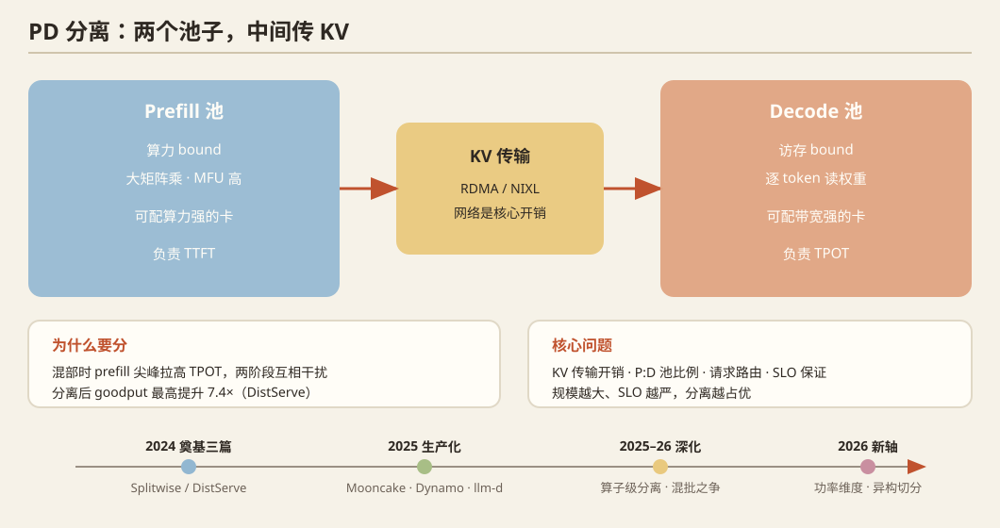

## 一、问题定义

Prefill（算力 bound）与 Decode（访存 bound）对硬件的需求完全不同。混部在同一 GPU 上会互相干扰（prefill 尖峰拉高 TPOT）。**PD 分离**：把两阶段放到不同 GPU 池，中间通过网络传输 KV cache。核心问题：KV 传输开销、两池的比例配置、请求路由、SLO 保证。

## 二、历史脉络

### 奠基三篇（2024）
- **Splitwise**（ISCA 2024，Microsoft）：**首次系统论证 PD 分离**——在异构硬件上分别优化 prefill/decode 池的成本效率，按 token 生成阶段弹性扩缩容。
- **DistServe**（OSDI 2024，北大等）：提出 **goodput** 指标（同时满足 TTFT 和 TPOT SLO 的最大请求率），分离后 goodput 提升最高 7.4×，确立分离的主流叙事。
- **Mooncake**（FAST 2025 最佳论文，Moonshot AI）：**KVCache 为中心**的分离架构——GPU 集群的显存/SSD 池化成统一 KV 存储层，prefill 与 decode 节点经 RDMA 交换 KV；承载 Kimi 生产流量，证明分离在大规模生产可行。

### 工业界跟进（2025）
- **NVIDIA Dynamo**（2025）：官方分离式推理框架，含 KV-aware 路由、NIXL 高速 KV 传输库、GPU/主机/SSD 多级 KV。
- **llm-d**（RedHat/Google/CoreWeave, 2025）：Kubernetes 原生的分离式 serving 栈。
- **AIBrix**（ByteDance, 2025）：云原生分离式 serving 控制面。
- **SGLang/vLLM**：原生支持 PD 分离部署 + LMCache/NIXL 连接器生态。

### 深化方向（2025）
- **TetriInfer**：prefill 内部再做两级调度避免长度偏斜。
- ** chunked-prefill 与分离的关系**：Sarathi 系混批路线与分离路线的之争——结论是**规模越大、SLO 越严，分离越占优**；小规模/单卡混批更省。
- **Attention/FFN 分离**：更激进的算子级拆分开始出现。

## 三、2025–2026 最新前沿

1. **算子级分离**：`OpWeave`（2609.14237）——"灵活的算子分离"，不再把模型切两刀，而是把算子 DAG 在异构设备间细粒度编织（weave）；MICRO 2026 `DOPS`（动态算子调度 + 权重布局仲裁，NPU+PIM 异构上 1.20–2.23× 加速）。
2. **功率维度**：`Phase-Decoupled Power Control`（2609.11133）——**数据中心功耗成为推理容量的第一约束**，在 B200 分离式部署上做分相功率封顶，Max-Q 档位的系统研究。
3. **细粒度异构 serving**：MLSys'26 `REMIX`（细粒度异构 LLM serving 的动态切分）——异构 GPU 混合部署开始进入主流视野。
4. **KV 传输层**：NIXL（NVIDIA 开源 KV 传输抽象）、SOSP'25 `Mercury`（远程显存调度做多 GPU 算子优化，思路相通）。
5. **纠删码容错**：MLSys'26 `Adaptive Erasure Coding` 把存储容错思想引入分离式 serving 的 KV 层。

## 四、开放问题

1. **消费级异构硬件的 PD 分离**：现有工作默认 NVLink/InfiniBand 同构池；"2×5090+2×5080、PCIe 5.0 only" 这类真实配置下 KV 传输成为瓶颈，调度与切分策略要重设计——**几乎空白，最推荐切入点**。
2. prefill:decode 池比例的在线自适应（负载漂移下静态比例失效）。
3. 分离粒度谱系（请求级 → 层级 → 算子级）每一层的 break-even 分析。
4. KV 传输与 NVMe 分级缓存的统一抽象（传输 vs 存储，本质是同一个层级化问题）。

## 五、代表论文速查

Splitwise (ISCA'24) · DistServe (OSDI'24) · Mooncake (FAST'25) · Dynamo / NIXL / llm-d / AIBrix ('25) · TetriInfer · OpWeave (2609.14237) · Phase-Decoupled Power (2609.11133) · DOPS (MICRO'26) · MLSys'26 REMIX · SOSP'25 Mercury