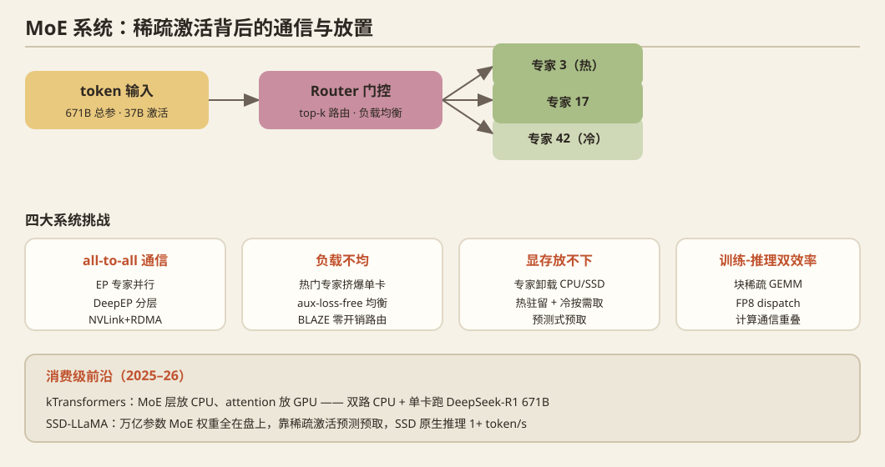

## 一、问题定义

MoE 用"每 token 只激活少数专家"把参数量与计算量解耦（如 DeepSeek-V3：671B 总参、37B 激活）。系统挑战：**专家并行（EP）的 all-to-all 通信、专家负载不均（热门专家挤爆单卡）、显存放不下全部专家、训练-推理双重效率**。

## 二、历史脉络

### 模型与早期系统（2020–2022）
- **GShard**（ICLR 2021，Google）：首个大规模 MoE 训练系统，top-2 路由 + 专家并行。
- **Switch Transformer**（JMLR 2022）：top-1 路由简化通信，容量因子与丢 token 问题。
- **BASE layers / Hash routing**：负载均衡的算法侧尝试。

### 训练系统成熟（2023–2024）
- **Tutel**（MLSys 2023，Microsoft）：自适应 all-to-all 优化。
- **MegaBlocks**（MLSys 2023）：块稀疏 GEMM 干掉 token padding/dropping。
- **SmartMoE**（ATC 2023）：训练期专家放置与并行策略自动搜索。
- **DeepSeek 系列**（2024–2025）：DeepSeekMoE 细粒度专家 + 共享专家；V3 的**auxiliary-loss-free 负载均衡**（bias 调整）+ 节点受限路由；**DeepEP**（2025）开源 all-to-all EP 通信库（NVLink/RDMA 分层、计算通信重叠、FP8 dispatch），成为社区标准。

### 推理系统（2024–2025）
- **Fiddler**（2024）：CPU-GPU 混合 MoE 推理——专家权重放 CPU 内存，按需取。
- **MoE-Lightning / EdgeMoE**：高并发/边缘 MoE serving。
- **专家卸载与缓存**：热门专家驻留 GPU、冷门专家卸载，LRU/预测式预取成为主线。
- **ExFlow / Klotski / ProMoE**：专家放置、预取与调度的组合优化（2024–2025 arXiv 密集产出）。

## 三、2025–2026 最新前沿（MLSys 2026 密集产出，MoE 是当期最热子方向之一）

- **训练侧**：`MoEBlaze`（打破 MoE 训练的显存墙）；`FP8-Flow-MoE`（免 cast 的 FP8 训练配方，消除双重量化误差）。
- **推理调度**：`From Tokens to Layers`（层级 prefill 实现 MoE serving 无停顿调度）；`Demystifying the Mixture of Experts Serving Tax`（**MoE serving 各项开销的解构测量**——测量学潮流的体现）；`On the Diminishing Returns of Expert Load Balancing in MoE LLM Serving`（**专家负载均衡收益递减的反直觉研究**）。
- **专家放置/路由**：`CRAFT`（细粒度成本感知专家复制）；`LYNX`（负载无关的专家重映射）；`BLAZE`（偏置驱动的零开销负载感知路由）；`Shortcut-connected Expert Parallelism`（加速 MoE 推理的 EP 结构改造）。
- **消费级/SSD 原生**：`SSD-LLaMA`（2609.18110）——**万亿参数 MoE 在消费 PC 上 SSD 原生推理 1+ token/s**，权重全在盘上，靠专家稀疏激活做 I/O 预测预取。
- **kTransformers**（2025，清华）持续演进：MoE 层放 CPU（大内存）、attention 放 GPU 的异构框架，让 DeepSeek-R1 671B 能在双路 CPU+单卡上跑——**消费级 MoE 的标志性系统**。

## 四、开放问题

1. 专家热度的**工作负载依赖性**（不同任务/语言激活不同专家）→ 在线放置调整。
2. 卸载场景下的 **I/O 感知路由**（路由决策与预取协同，routing-for-cache）。
3. EP × TP × PP 的组合在大 batch serving 下的最优形态（训练的经验不直接适用）。
4. 消费级平台上 MoE 推理的**完整刻画**（PCIe 带宽、DDR5 带宽、SSD 随机读 vs 专家粒度）——大内存消费级机器可直接做。
5. 细粒度专家 + FP4 量化的交互（低比特下路由误差累积）。

## 五、代表论文速查

GShard (ICLR'21) · Switch (JMLR'22) · Tutel (MLSys'23) · MegaBlocks (MLSys'23) · SmartMoE (ATC'23) · DeepSeekMoE/V3 · DeepEP ('25) · Fiddler · kTransformers ('25) · SSD-LLaMA (2609.18110) · MLSys'26: MoEBlaze / FP8-Flow-MoE / CRAFT / LYNX / BLAZE / From Tokens to Layers / Demystifying MoE Serving Tax / Shortcut-EP / Cascade(投机)