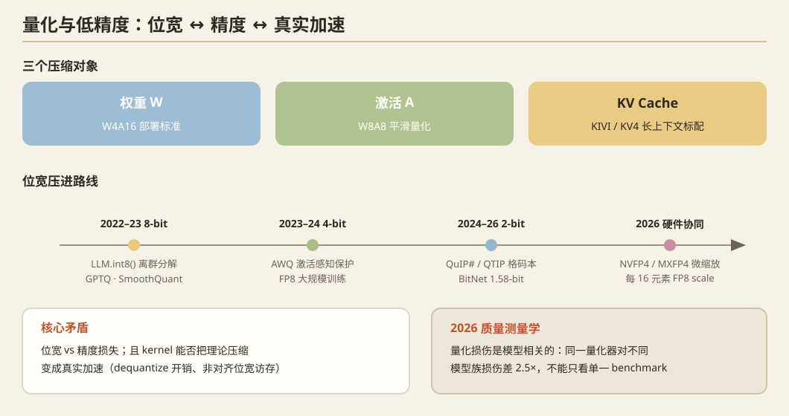

## 一、问题定义

把 FP16/BF16 的权重、激活、KV cache 压到 8/4/2 bit（乃至 FP4），换取显存减半、带宽减半、吞吐翻倍。核心矛盾：**位宽 vs 精度损失**，以及**kernel 能否把理论压缩变成真实加速**（dequantize 开销、非对齐位宽的访存）。

## 二、历史脉络

### 奠基（2022–2023）
- **LLM.int8()**（NeurIPS 2022）：离群特征分解 + int8 GEMM，首次在 175B 上无损 8-bit。
- **GPTQ**（ICLR 2023）：基于二阶信息（Hessian 近似）逐层误差补偿的 4-bit 权重量化，post-training 量化的范式。
- **SmoothQuant**（ICML 2023）：激活离群值迁移到权重上，W8A8 平滑量化。
- **AWQ**（MLSys 2024）：**激活感知**的权重保护（0.1–1% 显著权重保 FP16 缩放），W4A16 成为部署标准，vLLM/TensorRT-LLM 全线支持。

### 压向极低位宽（2023–2025）
- **SpQR**（2023）：稀疏离群值 + 3–4 bit，近无损。
- **QuIP**（NeurIPS 2023）→ **QuIP# / QTIP**：格码本/trellis 码本的 2-bit 量化，信息论上更优；2026 年最新工作给出 trellis GEMV 的完整 serving 刻画：比服务布局少读 2.40× 字节、快 2.27×，但码本展开是代价。
- **KV cache 量化**：KIVI（2024，per-channel key / per-token value）、KVQuant、Atom（W4A4KV4）；2025 后 KV4 成为长上下文 serving 标配。
- **FP8 训练**：DeepSeek-V3（2024）**首个大规模 FP8 混合精度训练**（分块缩放 + 高精度累加）；Hopper 的 FP8 tensor core 被真正用起来。

### 硬件协同（2024–2026）
- **Blackwell NVFP4 / MXFP4**：微缩放 4-bit 浮点（E2M1 + 每 16 元素一个 FP8 scale）。5090/5080 原生支持，**FP4 推理的 kernel/量化协同设计是 2026 年的系统富矿**。
- 训练侧：MLSys'26 `FP8-Flow-MoE`（免 cast FP8）、`IntAttention`（全整数注意力流水线，边缘设备）。

## 三、2025–2026 最新前沿

1. **质量测量学**：`A Calibrated Instrument`（2609.18005）——给推理优化（量化/早退/投机）建立**可校准的统一质量测量**：4-bit 在散文上不可区分（±0.3 分辨率），3-bit 在中文损失 0.9、数学 1.1；**同一量化器对 Alibaba vs Meta 模型损伤差 2.5 倍**——量化损伤是模型相关的，不能只看单一 benchmark。
2. **Flash 存储推理**：`LLM Inference in a Flash!`（2609.16161）——延续 Apple 的 "LLM in a flash" 思路，SSD 上按需加载权重的最新进展。
3. **低比特 GEMV 服务化**：trellis/码本量化的端到端 serving 实测（4B 模型 87 tok/s @ 2.60GB）。
4. **KV 压缩极限**：`DeepSeek-V4.1-Flash`（2609.19969）。
5. **非结构化稀疏实用化**：MLSys'26 `Practical Unstructured Sparsity for Efficient LLM Inference`。

## 四、开放问题

1. **NVFP4 的系统刻画空白**：kernel 效率、混合精度边界（哪些层必须 FP8/FP16）、与 KV 量化的联合——5090/5080 独占窗口（机会！）。
2. 量化 × 投机解码：低比特草稿模型的接受率变化。
3. 量化损伤的**任务相关性**（数学 vs 散文 vs 代码）需要部署期自适应位宽。
4. W2/W1.58（BitNet 谱系）的 kernel 成熟度和硬件映射。

## 五、代表论文速查

LLM.int8() (NeurIPS'22) · GPTQ (ICLR'23) · SmoothQuant (ICML'23) · AWQ (MLSys'24) · SpQR · QuIP/QuIP#/QTIP · KIVI · KVQuant · Atom · DeepSeek-V3 FP8 ('24) · BitNet (1.58-bit) · Calibrated Instrument (2609.18005) · LLM in a Flash 系 · MLSys'26 IntAttention / FP8-Flow-MoE / Practical Unstructured Sparsity