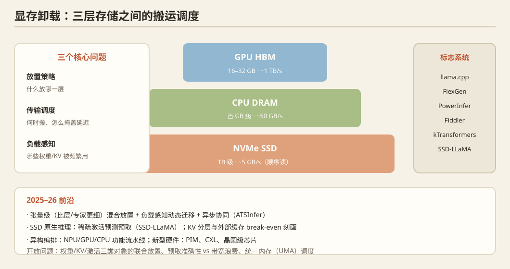

## 一、问题定义

当模型权重 + KV cache 超过 GPU 显存时，必须把数据在 **GPU HBM ↔ CPU DRAM ↔ NVMe SSD** 之间动态搬运。核心问题：**放置策略（什么放哪）、传输调度（何时搬、怎么掩盖延迟）、负载感知（哪些权重/KV 被频繁使用）**。消费级 GPU（显存小、无 NVLink）与 AI PC 是这一方向的天然测试床。

## 二、历史脉络

### 训练侧先行（2020–2022）
- **ZeRO-Offload**（ATC 2021）/ **ZeRO-Infinity**（SC 2021，Microsoft）：把优化器状态/梯度/参数分层卸载到 CPU/NVMe，训练超出显存的大模型。
- **FlexGen**（ICML 2023，Stanford）：**离线推理**（如大 batch 评测）下的最优放置规划——把 GPU/CPU/Disk 三层配置成 ILP 问题，175B 单卡也能跑。

### 消费级推理爆发（2023–2024）
- **llama.cpp / GGML**（2023–）：georgi gerganov 的个人项目引爆社区——量化到 4-bit 的权重直接放内存/显存，CPU+GPU 混跑，成为"人人都能跑 LLM"的地基。后续有 GGUF 格式、iCloud 级优化生态。
- **ExLlama / vLLM CPU offload / ollama**：消费级生态工具链成熟。
- **PowerInfer**（SOSP 2024，上海交大 IPADS）：**热点感知推理**——利用激活幂律分布，"热神经元"驻留 GPU、"冷神经元"放 CPU，权重的 GPU/CPU 混合预加载；后续 PowerInfer-2 做到手机上。
- **HeteGen / STI / FastDecode**：CPU-GPU 协同 decode，利用 CPU 的多核并行大 batch GEMV。

### MoE 时代的 CPU-GPU 混合（2024–2025）
- **Fiddler**（2024）：MoE 专家权重放 CPU，attention 放 GPU。
- **kTransformers**（2025，清华）：显存只需 ~20GB 即可跑 DeepSeek-R1 671B（CPU 跑 FFN+量化），**消费级跑大 MoE 的标志性系统**。
- **Mixture-of-Depths / 专家级放置**：按激活频率决定专家驻留层级。

## 三、2025–2026 最新前沿

1. **张量粒度调度**：`ATSInfer`（2607.10183）——消费设备上**张量级**（比层/专家更细）的 CPU-GPU 混合推理，静态放置 + 负载感知动态迁移 + 异步协同，适应硬件负载变化。
2. **SSD 原生推理**：`SSD-LLaMA`（2609.18110）——万亿参数 MoE 全部权重驻留 SSD，靠稀疏激活预测预取，1+ token/s；`LLM Inference in a Flash!`（2609.16161，Apple 系）。
3. **KV 分层**：`py-kvcache`（2609.11744）NVMe KV 外部缓存的系统刻画（见方向 02）；`Bounded-State Restoration`（2608.17826）恢复工作集有界化。
4. **异构编排**：MLSys'26 `SD-HC`（AI PC 上 NPU/GPU/CPU 功能流水线投机解码）、`Efficient VRAM-Constrained xLM Inference on Clients`；`Agentic CPU-GPU Scheduling`（2607.22242，19 种 AI 工具的设备放置，LLM agent + 运行时监控协同调度）。
5. **新型硬件接入**：`PATTON`（2609.11392，商用 PIM 接入生产 serving）；OSDI'25 `FineMem`（细粒度解聚内存的分配开销 vs 浪费困境）、`Tigon`（CXL Pod 上的分布式数据库）、`WaferLLM`（**晶圆级 AI 芯片上的 LLM 推理**，Cerebras WSE 的系统研究）。
6. **能效**：`PELM`（SenSys'26）DVFS + 投机解码的端侧能效优化。

## 四、开放问题

1. **消费级异构多卡集群**（如 5080×2 + 5090×2）的放置与调度：显存非对称（16/16/32/32）、无 NVLink、PCIe 5.0 P2P——现有系统都假设同构，**这是最贴近消费级硬件的空白**。
2. 权重/KV/激活三类对象在三层存储的**联合放置**（现有工作只优化其中一两类）。
3. 预取的准确性 vs 带宽浪费：MoE 专家预取的负载预测仍很粗糙。
4. AI PC 统一内存（UMA）架构下的调度（MLSys'26 已有终端 agent 调度工作，说明学界开始关注）。

## 五、代表论文速查

ZeRO-Offload (ATC'21) · ZeRO-Infinity (SC'21) · FlexGen (ICML'23) · llama.cpp · PowerInfer (SOSP'24) / PowerInfer-2 · Fiddler · kTransformers ('25) · ATSInfer (2607.10183) · SSD-LLaMA (2609.18110) · LLM in a Flash (2609.16161) · Agentic CPU-GPU Scheduling (2607.22242) · PATTON (2609.11392) · OSDI'25 FineMem / Tigon / WaferLLM · MLSys'26 SD-HC / VRAM-Constrained xLM