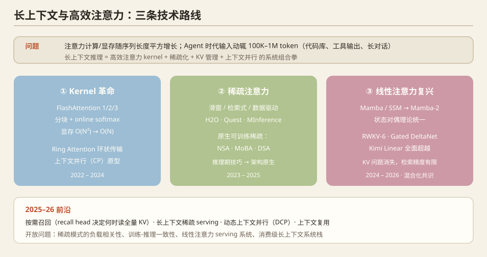

## 一、问题定义

Transformer 注意力计算/显存随序列长度平方增长。Agent 时代输入动辄 100K–1M token（代码库、工具输出、长对话），长上下文推理 = **高效注意力 kernel + 稀疏化 + KV 管理 + 训练侧上下文并行**的系统组合拳。

## 二、历史脉络

### Kernel 革命（2022–2024）
- **FlashAttention**（NeurIPS 2022，Stanford）：分块 + online softmax，IO 感知设计，精确注意力从 O(N²) 显存降到 O(N)，成为所有引擎的标配。
- **FlashAttention-2**（2023）：并行度重排，A100 利用率 ~70%。
- **FlashAttention-3**（2024）：面向 Hopper 的 warp 特化 + FP8 + 异步流水线。
- **Ring Attention**（2023，Berkeley）：分块注意力跨设备环状传输，把上下文扩展到百万 token——**上下文并行（CP）的原型**。
- **DeepSpeed Ulysses / USP**（2024）：序列并行的两种切法（head 维 vs 序列维）统一。

### 稀疏注意力（2023–2025）
- **检索式/固定模式**：Mistral 滑窗、Longformer 早期工作。
- **数据驱动稀疏**：H2O、SnapKV、PyramidKV、Quest（query 感知）、MInference（NeurIPS 2024，预填充阶段动态稀疏模式识别）、XAttention / FlexPrefill（2025）。
- **原生稀疏架构**：**NSA**（DeepSeek，2025，硬件对齐的原生可训练稀疏注意力）、**MoBA**（Kimi，2025，混合块注意力）、**DSA**（DeepSeek-V3.2 采纳的稀疏注意力）——**稀疏从"推理期技巧"变成"架构原生"**，这是 2025 年最重要的架构转折。
- **混合架构**：Jamba、Gemma-2/3（滑窗+全局交错层）、MiniMax 等——每几层才放一层全注意力。

### 线性注意力复兴（2024–2026）
- **Mamba/SSM**（ICLR 2024）→ **Mamba-2**（ICML 2024，与注意力统一的状态对偶理论）；RWKV-6、Gated DeltaNet、**Kimi Linear**（2025，3B 线性注意力混合模型全面超越同尺寸 Transformer）——线性注意力的固定状态让 KV 问题消失，但检索精度有限，混合化是共识。

## 三、2025–2026 最新前沿

1. **按需召回**：`On-Demand Attention`（2609.20734）——预训练模型的解码状态可预测"全局注意力对本步的收益"，轻量 recall head 决定何时读全量 KV，只训 recall head + vLLM 条件执行实现。
2. **KV 压缩极限**：`DeepSeek-V4.1-Flash`（2609.19969）面向 agent 输入重型负载。
3. **稀疏 serving**：MLSys'26 `Kascade`（实用的长上下文稀疏注意力方法）、`BLASST`（softmax 阈值的动态块稀疏）、`db-SP`（视觉生成模型稀疏注意力的序列并行）。
4. **训练侧**：SOSP'25 `DCP`（动态上下文并行应对输入长度抖动——长上下文训练的输入 dynamism 被正式提出并解决）；MLSys'26 `FCP`（可扩展上下文并行预训练）。
5. **上下文复用**：MLSys'26 `ContextPilot`（上下文复用的快速长上下文推理）、`HiServe`。
6. **跨领域扩展**：MLSys'26 `Efficient Systems for Long-Context ASR`；`Recency Forcing`（2609.19729，AR 视频生成的 KV 驱逐失配问题——**长上下文问题扩散到视频生成**）；`OneLA`（2609.12399，线性注意力大 beam 解码，生成式推荐场景）。

## 四、开放问题

1. 稀疏模式的**负载相关性**：agent/代码/多模态的最优稀疏模式不同，自适应机制仍粗糙。
2. 稀疏注意力的**训练-推理一致性问题**（训练时全量、推理时稀疏的失配）——视频生成已出现（Recency Forcing），语言侧同样存在。
3. 线性注意力的 serving 系统：状态管理、beam search 下的状态共享（OneLA 是开端）。
4. 消费级 GPU 上的长上下文：64GB 显存跑 1M token 的系统栈（稀疏+KV 量化+分级存储的组合）未被系统研究。

## 五、代表论文速查

FlashAttention (NeurIPS'22) / FA-2 ('23) / FA-3 ('24) · Ring Attention ('23) · MInference (NeurIPS'24) · Quest ('24) · NSA / MoBA / DSA ('25) · Mamba (ICLR'24) / Mamba-2 (ICML'24) · Kimi Linear ('25) · On-Demand Attention (2609.20734) · DeepSeek-V4.1-Flash (2609.19969) · Recency Forcing (2609.19729) · OneLA (2609.12399) · SOSP'25 DCP · MLSys'26 Kascade / BLASST / db-SP / ContextPilot / FCP