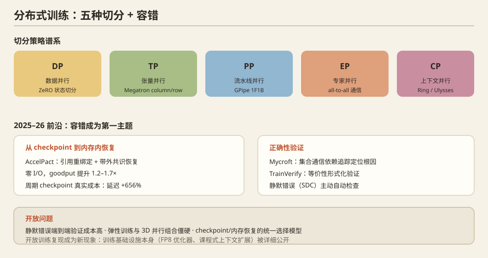

## 一、问题定义

把万卡集群的算力无损地喂给一个模型：切分策略（DP/TP/PP/EP/CP 组合）、通信优化、显存优化、**容错与弹性**（万卡日必然出故障）、以及**训练正确性**（静默错误）。

## 二、历史脉络

### 并行策略奠基（2018–2022）
- **GPipe**（NeurIPS 2018）：流水线并行原型（1F1B 前身）。
- **PipeDream**（SOSP 2019）：自动流水线切分 + 后向重排。
- **Megatron-LM**（2019/2021，NVIDIA）：张量并行（TP）的标准实现，column/row 切分公式。
- **ZeRO**（SC 2020，Microsoft）：数据并行下的状态切分（ZeRO-1/2/3），解决 DP 显存冗余。
- **Alpa**（OSDI 2022）：算子间+算子内两级并行的自动搜索；**Colossal-AI**（2022）工程化跟进。
- **PyTorch FSDP**（2023）：ZeRO-3 思想进入官方生态；2024–2025 的 **FSDP2**（per-parameter DTensor）成为 HuggingFace 默认。

### 大模型时代（2022–2024）
- **Megatron-DeepSpeed 组合拳**（3D 并行）成为预训练事实标准。
- **通信优化**：overlap 计算与通信（Gloo/NCCL 调优、SHARP in-network reduction）。
- **Checkpoint 与弹性**：TorchElastic、冷启动 checkpoint 恢复；**ServerlessLLM 的 checkpoint 加载技术**反向输入训练。
- **MoE 训练系统**：见方向 05（GShard→Tutel→MegaBlocks→DeepEP）。
- **长上下文训练**：Ring Attention → Ulysses/USP → Megatron CP。

## 三、2025–2026 最新前沿

### 容错：从 checkpoint 到"内存内恢复"
- **AccelPact**（2609.18178）：**零 I/O 内存内故障恢复**——量化周期性 checkpoint 的真实成本（延迟 +656%、32.5GiB 主存、3.39TB/h 存储流量）后，提出通信失败时设备内存其实未损坏，只是 FSDP 缓存的通信句柄失效；用**引用重绑定** + 带外 Gloo 共识恢复，16×RTX 5880 训 Mistral-7B，goodput 提升 1.2–1.7×，16 rank 位级一致。
- **SOSP'25 Mycroft**（ByteDance）：集合通信的依赖追踪，定位训练故障根因。
- **SOSP'25 TrainVerify**（Microsoft）：**分布式训练的等价性形式化验证**。
- **OSDI'25 Training with Confidence**：静默错误（silent data corruption）的主动自动检查。
- **MLSys'26 GUARD**：大规模训练的 straggler 检测与节点健康管理。
- **MLSys'26 veScale-FSDP**：规模化 FSDP 的灵活高性能实现。

### 负载与弹性
- **SOSP'25 DCP**：动态上下文并行——长上下文训练中输入长度抖动的正式解法。
- **MLSys'26 Flexo**：用户可控的分布式训练系统（可干预性成为新卖点）。
- **MLSys'26 FreeScale**：序列推荐模型的低成本分布式训练。
- **MLSys'26 BOOST**：低秩 LLM 的瓶颈优化训练框架。
- **MLSys'26 HetRL / 异构环境**（见方向 10）。
- **MLSys'26 ParallelKittens**：多 GPU AI kernel 的系统化简化（训练-推理共用的多卡 kernel 抽象）。

### 开放训练复现（新现象）
- **OPEN-1B**（2609.17380，"A Fully Auditable Training Run"）、**ZGCM-1**（2609.13356，7B 全开源训练含 FP8 Muon optimizer + 256K 上下文 + agent 化研发流程）——**训练基础设施本身成为开源复现的对象**，系统 recipe（FP8 优化器、课程式上下文扩展、MDP 化交互数据）被详细公开。

## 四、开放问题

1. 万卡训练的**静默错误**仍靠抽样检测，端到端验证成本高（TrainVerify 是开端）。
2. 弹性训练（节点动态加入/退出）与 3D 并行的组合仍很僵硬。
3. checkpoint → 内存内恢复的谱系：多大故障率下哪种策略最优缺乏统一模型。
4. **消费级/PCIe-only 集群的训练**：NCCL 行为、故障模式、容错策略与 NVLink 集群显著不同（AccelPact 用 RTX 5880 但仍是数据中心卡）——机会点。

## 五、代表论文速查

GPipe (NeurIPS'18) · PipeDream (SOSP'19) · Megatron-LM ('19/'21) · ZeRO (SC'20) / Offload (ATC'21) / Infinity (SC'21) · Alpa (OSDI'22) · FSDP/FSDP2 · DeepEP ('25) · AccelPact (2609.18178) · SOSP'25 Mycroft / TrainVerify / DCP · OSDI'25 Training with Confidence / BlitzScale · MLSys'26 GUARD / veScale-FSDP / Flexo / FCP / ParallelKittens / OPEN-1B