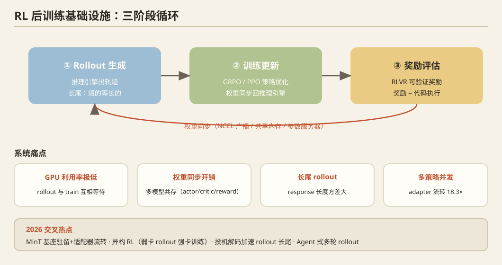

## 一、问题定义

RL 后训练（RLHF/GRPO/RLVR）的工作流 = **rollout 生成（推理）+ 训练更新 + 奖励评估**三阶段循环，涉及推理引擎与训练引擎的反复切换、权重同步、多模型共存（actor/critic/reward/reference）。系统痛点：**GPU 利用率极低**（rollout 与 train 互相等待）、权重同步开销、长尾 rollout、多策略并发。

## 二、历史脉络

### 框架萌芽（2023）
- **DeepSpeed-Chat**（2023）：首个开源 RLHF 训练系统（ZeRO 基座）。
- **TRL / NeMo-Aligner**（2023）：HuggingFace / NVIDIA 的 RLHF 训练库。

### 系统化重构（2024）
- **OpenRLHF**（2024）：vLLM + DeepSpeed 组合，3D 并行 rollout，成为社区主流。
- **HybridFlow**（EuroSys 2025，字节）：** RLHF 数据流的混合编程模型**——单控制器（灵活表达算法）+ 多控制器（高效执行），统一表达 RLHF 数据流；其开源实现即 **veRL**（2024–2025，已成为事实标准之一）。
- **ReaLHF / AReaL**（2024–2025）：参数在 rollout/训练实例间**动态再分配**、异步并行 RL。
- **算法侧对系统的影响**：GRPO（DeepSeekMath，2024）去掉 critic 减少模型数；RLVR（可验证奖励）让奖励计算变成代码执行——**负载形态改变**。

### 2025：全面爆发
- **slime**（THUDM/Zhipu，2025）：SGLang 深度耦合的 RL 训练框架，agent 式多轮 rollout 友好。
- **AReaL**（2025）：全异步 RL，decoupled PPO。
- **Rollout 长尾问题**：response 长度方差大 → 短的等长的 → idle；**投机解码进入 rollout**（MLSys'26 两篇）。
- **权重同步**：NCCL 广播 vs 共享内存 vs 参数服务器路线并存。

## 三、2025–2026 最新前沿

1. **LoRA-RL 服务化**：`MinT`（2605.13779，MinLab Toolkit）——**基座驻留 + LoRA 适配器流转**：rollout、更新、导出、评估、serving、回滚全链路把 adapter 当一等公民（rank-1 adapter 可 <1% 基座大小），adapter-only 切换加速 18.3×，并发多策略 GRPO 缩短 1.77×，验证到 1T 参数（含 MLA/DSA 注意力路径）。
2. **异构 RL**：MLSys'26 `HetRL`——异构环境下 LLM RL 的高效执行（rollout 在弱卡、训练在强卡）。
3. **RL 中的投机解码**：MLSys'26 `Beat the long tail`（分布感知投机加速 rollout 长尾）、`ReSpec`（RL 系统投机优化）——**两个最热方向（投机解码 × RL infra）的交叉**。
4. **Agent 式 RL 的系统需求**：多轮工具调用 rollout 使"rollout"变成有状态长任务，KV 保留、沙箱、环境并行成为新约束（slime 谱系 + MLSys'26 agent 论文群）。
5. **评测与 reward 基础设施**：`Prediction-Powered Smoothing`（2609.20758，离散化 AI 评测的统计估计）；MLSys'26 `MLCommons Chakra`（标准化执行 trace，训练/推理性能协同设计的基准格式）。

## 四、开放问题

1. **同步 vs 异步 RL 的收益边界**：staleness 对训练质量的影响缺乏系统刻画。
2. rollout-train 权重同步在**消费级/异构多卡**上的优化（PCIe 带宽下 adapter-only 同步的意义更大）。
3. 长尾 rollout 的调度（早停、投机、动态 batch 组合）。
4. 多轮 agent RL 的环境并行与沙箱管理——系统层几乎空白。
5. 显存受限单机的**多策略并发 RL**（缩微版 MinT）——单机多卡（96GB 级）即可原样复现。

## 五、代表论文速查

DeepSpeed-Chat ('23) · OpenRLHF ('24) · HybridFlow (EuroSys'25) / veRL · ReaLHF / AReaL ('24-'25) · slime ('25) · MinT (2605.13779) · MLSys'26 HetRL / ReSpec / Distribution-Aware SD for RL / Chakra · GRPO (DeepSeekMath '24) · RLVR