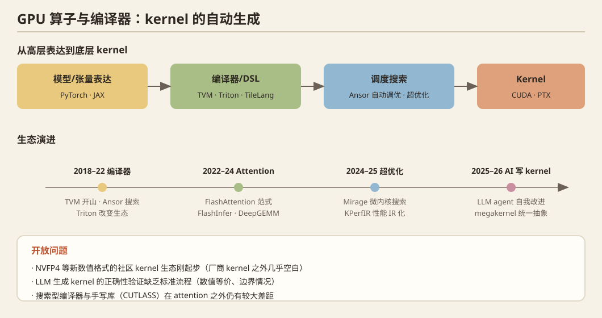

## 一、问题定义

模型性能的最后一公里是 kernel：attention/GEMM/量化 GEMV 等算子的硬件利用率。核心问题：**如何自动生成/优化高性能 kernel**（自动调优、超优化、LLM 生成）、**如何为新硬件/新数值格式快速补齐算子**、**如何观测性能**（profiler）。

## 二、历史脉络

### 编译器谱系（2018–2022）
- **TVM**（OSDI 2018）：端到端张量编译器开山之作。
- **Ansor**（OSDI 2020）：自动调度搜索（auto-scheduling），摆脱手工模板。
- **Triton**（OpenAI，2019–2021）：**Python 式 block 级编程**，让研究者不写 CUDA 也能写出接近 cuBLAS 性能的 kernel——**改变了领域生态**（FlashAttention 的开源实现全靠它）。
- **JAX/XLA、torch.compile (Inductor)**（2023）：图级编译进入主流训练/推理。
- **CUTLASS / ThunderKittens**：模板库路线（NVIDIA / Stanford HazyResearch），专家手写极限性能。

### Attention kernel 时代（2022–2024）
- **FlashAttention 1/2/3**（见方向 08）：IO 感知 kernel 设计的典范。
- **FlashInfer**（2024–2025）：面向 serving 的 attention/context kernel 库（vLLM/SGLang 底层依赖）。
- **DeepGEMM**（DeepSeek, 2025）：FP8 GEMM 的极简高性能实现（JIT 编译），开源后成为 FP8 训练/推理标配。
- **TileLang**（2025）：tile 级 DSL，进一步降低写高性能 kernel 的门槛。

### AI 编译器新阶段（2024–2025）
- **Mirage**（OSDI 2025）：**张量程序的多级超优化器**（superoptimizer，微内核空间搜索）。
- **KPerfIR**（OSDI 2025）：**开源的、以编译器为中心的 GPU kernel 性能工具链生态**（性能观测的 IR 化）。
- **QiMeng-Xpiler**（OSDI 2025）：神经-符号方法跨 DL 系统（如 CUDA→别的平台）转译张量程序。

## 三、2025–2026 最新前沿

1. **超优化**：`EqiForge`（2609.12330）——equality saturation（等价饱和）统一 IR 表示高层张量表达式与 tiled 计算，**直接从表达式推出 FlashAttention 式融合 kernel**，子图组合扩展搜索空间。
2. **LLM 写 kernel**：MLSys'26 `AccelOpt`（自我改进的 LLM agent 做加速器 kernel 优化）、`Agentic Operator Generation for ML ASICs`（为 ML ASIC 自动生成算子）——**AI 系统的自我自举（用 LLM 优化 LLM 的 kernel）**。
3. **编译抽象创新**：MLSys'26 `Wave`（高性能 ML 的符号化 Python DSL+编译器）、`Event Tensor`（**动态 megakernel 的统一编译抽象**——megakernel 是 2025 年 HazyResearch 提出的把整层乃至整模型编成单个 kernel 的路线）。
4. **多 GPU kernel**：MLSys'26 `ParallelKittens`（多 GPU kernel 的系统化简化）；SOSP'25 `Mercury`（**远程显存调度**解锁多 GPU 算子优化——把邻居卡的显存当可调度资源）。
5. **领域/可移植 kernel**：MLSys'26 `BioTriton`（跨厂商 GPU 的 Triton 生物信息 kernel）、`From 805ms to 23ms`（ICU 实时监测 SSM 的融合 Triton kernel）——**Triton 生态向非 LLM 领域渗透**。
6. **profiler 工具链**：MLSys'26 `ProfInfer`（eBPF 细粒度推理剖析）、`Neutrino`（OSDI'25，可编程 probing 的细粒度 kernel profiler）。

## 四、开放问题

1. **NVFP4/新数值格式的 kernel 生态**：5090/5080 的 FP4 tensor core 只有厂商 kernel 支持，社区 kernel（Triton FP4）刚起步——写开源 FP4 kernel 是**立即可做且高引用**的工作。
2. LLM 生成 kernel 的**正确性验证**（数值等价、边界情况）缺乏标准流程。
3. 搜索型编译器（EqiForge/Mirage）与手写库（CUTLASS）的性能差距在 attention 之外的算子上仍然很大。
4. 消费级 GPU（不同 SM 数/显存带宽）上的自动调优——云端调优配置不可迁移。

## 五、代表论文速查

TVM (OSDI'18) · Ansor (OSDI'20) · Triton · FlashAttention 1-3 · FlashInfer · DeepGEMM ('25) · TileLang · Mirage (OSDI'25) · KPerfIR (OSDI'25) · QiMeng-Xpiler (OSDI'25) · Neutrino (OSDI'25) · EqiForge (2609.12330) · SOSP'25 Mercury · MLSys'26 Wave / Event Tensor / ParallelKittens / AccelOpt / BioTriton / ProfInfer