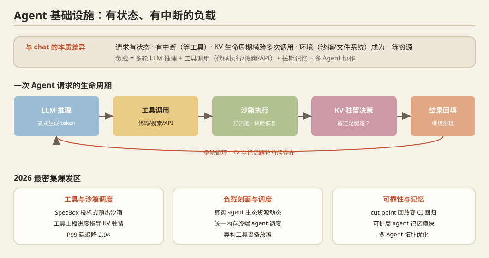

## 一、问题定义

Agent 工作负载 = **多轮 LLM 推理 + 工具调用（代码执行/搜索/API）+ 长期记忆 + 多 Agent 协作**。与 chat 服务的本质差异：请求有状态、有中断（等工具）、KV 生命周期横跨多次调用、环境（沙箱/文件系统）成为一等资源。**2026 年 AI-Infra 最大的增量赛道**。

## 二、历史脉络

### 应用框架时代（2023–2024）
- **LangChain / LlamaIndex**（2022–2023）：编排胶水层。
- **AutoGPT / BabyAGI**（2023）：自主 agent 的早期尝试（效率极低，但验证了需求）。
- **ReAct**（2023）：推理+行动交替的范式。
- **AutoGen / MetaGPT / CrewAI / OpenAI Swarm**（2023–2024）：多 Agent 编排框架，但没有系统层优化。
- **MCP**（Anthropic, 2024-11）：Model Context Protocol——工具/资源/提示的**标准化接入协议**，迅速成为事实标准，为系统层研究提供了统一接口。

### 系统化起步（2024–2025）
- **AIOS / LLM-OS 概念**（2024）：提出"agent 操作系统"抽象（调度、内存、工具管理）。
- **SGLang/vLLM 的 agent 支持**：多轮对话的前缀缓存（RadixAttention）天然适配 agent 多轮。
- **Parrot**（OSDI'24）：语义变量打通应用与推理引擎。
- **沙箱技术**：gVisor/Firecracker → e2b/Daytona 等 agent 沙箱服务。
- **评测基准**：SWE-bench（软件工程 agent）、AgentBench、WebArena、OSWorld——为系统研究提供了负载来源。

## 三、2025–2026 最新前沿（当前最密集的爆发区）

### 工具与沙箱调度
- **`SpecBox`**（2607.23933）：**投机式沙箱调度**——在 LLM 流式生成 token 的中途就用关键词+语义嵌入预判工具需求，预热沙箱（意图驱动的 prewarming），并按沙箱依赖图做随机预取；P99 延迟降 2.9×，峰值内存降 45.9%。
- **`Ask the Tool, Don't Guess`**（2609.18849）：工具调用期间 KV cache 占着显存等工具返回；证明**调用前的任何时长估计都不行**，而工具自己知道进度——让工具上报进度来指导 KV 驻留/驱逐，p90 TTFT 降 20.7%，接近 oracle。
- **MLSys'26 `ForeCache`**：coding agent 负载的 KV cache 管理优化。
- **MLSys'26 `AgenticCache`**：缓存驱动的异步 agent 执行。

### 负载刻画与调度
- **`Not All AI Agents Are Equal`**（2609.19947）：对真实 agent 生态的资源/性能动态刻画（延迟、本地资源、容器瓶颈的混合）。
- **MLSys'26 `Impact of Scheduling for Terminal Agent Workloads on Unified-Memory Workstations`**：**统一内存工作站上的终端 agent 调度**——直接相关于消费级硬件研究。
- **`Agentic CPU-GPU Scheduling`**（2607.22242）：agent 编排的异构工具（GPU 能力不一）的设备放置。
- **MLSys'26 `OSWorld-Human`**：computer-use agent 的效率基准。

### Agent 记忆与缓存
- **MLSys'26 `Hippocampus`**：可扩展的 agent 记忆模块。
- 长期记忆 × KV 管理 × RAG 的系统融合开始出现。

### 可靠性与工程化
- **`Chronicle`**（2609.20625）：agent 运行的 **cut-point 回放**——在非确定性边界记录，重放时可选择哪些边界用录像、哪些用新代码实跑，把线上事故变成 CI 回归测试。
- **`SpecGuard`**：投机解码信号检测后门（安全×推理系统交叉）。
- **多 Agent 拓扑优化**：`Codebook Agent`（2609.02xxx，VQ 压缩拓扑+摊销式选择）、`OrchSLM`（小模型编排的系统性探针）。

### 数据与训练
- **MLSys'26 `Matrix`**：P2P 多 agent 合成数据生成——agent 也是**数据基础设施**（合成数据工厂）。

## 四、开放问题

1. **Agent SLO 的定义**：端到端任务时延由 LLM + 工具 + 网络共同决定，如何分解与预算分配（tail-at-the-front 风格的级联预算）没有公认框架。
2. **KV 的跨轮生命周期**：多轮 agent 会话中 KV 保留/压缩/再计算的统一策略（Ask-the-Tool 是第一个信号源，远未解决）。
3. **沙箱资源调度**：预热池大小、快照恢复（CRIU）、按 MCP 依赖图的预取。
4. **单机多 agent 隔离**：GPU 显存/算力在多 agent 间的隔离与公平性（消费级四卡机的直接机会）。
5. agent 时代的 **trace 公开**程度远超 chat 时代——系统研究的可复现性故事好讲。

## 五、代表论文速查

ReAct ('23) · AutoGen ('23) · Parrot (OSDI'24) · MCP ('24) · AIOS ('24) · SpecBox (2607.23933) · Ask the Tool (2609.18849) · Chronicle (2609.20625) · Not All Agents Are Equal (2609.19947) · Codebook Agent · MLSys'26 ForeCache / AgenticCache / Hippocampus / OSWorld-Human / Matrix / Terminal Agent Scheduling