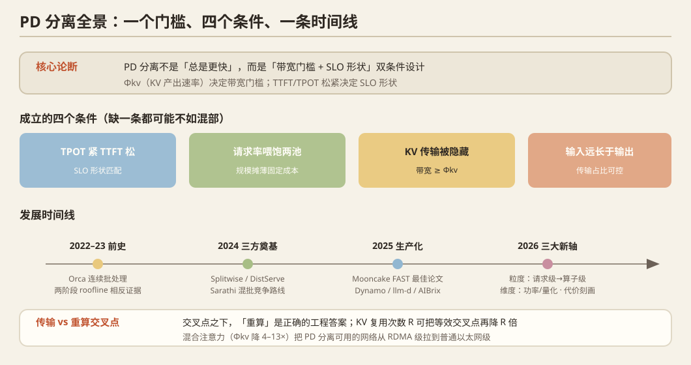

> 调研日期：2026-09-29 · 基于 arXiv 检索（约 30 组查询）+ 一手论文全文
> 奠基论文的逐篇技术摘要见[《PD 分离奠基论文技术摘要》](/notes/infra-survey-14-pd-foundations/)，
> 2025–2026 增量见[《PD 分离 2025–2026 前沿》](/notes/infra-survey-15-pd-frontier/)。



---

## 0. 先给结论

1. **PD 分离不是一个"总是更快"的优化，而是一个"带宽门槛 + SLO 形状"双条件设计。** 它在 (a) TPOT 紧而 TTFT 松、(b) 规模大到能同时喂饱两个池、(c) KV 传输能被计算隐藏、(d) 输入远长于输出 四条同时成立时才明确划算。缺一条都可能反而不如混部。
2. **2026 年真正的转折点不是调度器，而是模型架构。** 混合注意力（线性注意力 + SWA，只留少量全注意力层）把 KV 产出速率 Φkv 降低了 4–13×，直接把 PD 分离可用的网络从 RDMA 级拉到了**普通以太网**级——这是 Mooncake 团队在 PrfaaS 中明确论证的（[arXiv:2604.15039](https://arxiv.org/abs/2604.15039)）。
3. **分离粒度已经从"请求级一刀"演化到"算子级编织"**：请求级（Splitwise/DistServe）→ 请求内分段（micro-request）→ 注意力/FFN 分离（AFD）→ 算子 DAG 级（OpWeave、DOPS）。
4. **"带宽到底要多少"已经被解析地回答了。** 2026-08 的 [arXiv:2608.14967](https://arxiv.org/abs/2608.14967) 给出**与上下文无关的"传输 vs 重算"交叉点**：70B MHA 需 74–111 Gbps、70B GQA-1/8 需 9.3 Gbps、8B 需 130–194 Gbps（注意：**模型越大交叉点越低**）。交叉点之下，"重算是正确的工程答案"。行业经验值（100 GbE 起）与之吻合。
5. **低带宽链路上的量级判断**：冷请求下重算稳定胜出，差距 3–6 倍（以 7B–32B GQA 模型为例，传输 vs 重算交叉点在 3–6 Gbps，1GbE 低于此门槛）。唯一能翻盘的是**KV 复用次数 R**——R≳4–6 时等效交叉点降到 1 Gbps 以下。**所以低带宽场景的命题不是"让 PD 变快"，而是"识别并放大 R，并据此在线决定传还是算"**。详见第五节（**5.3b 是关键**，那里也修正了一个容易被误用的数字）。

---

## 1. 物理基础：为什么会有 PD 分离

这一段是把后面所有论文的前提讲清楚，跳过它就只能背结论。

### 1.1 一次请求的两个阶段，roofline 相反

LLM 推理一次请求分两段：

| | **Prefill**（预填充） | **Decode**（解码） |
|---|---|---|
| 做什么 | 并行处理整段输入 prompt，产出第一个 token | 逐 token 自回归生成剩余输出 |
| 并行度 | 高（l 个 token 并行） | 低（每步 1 个 token/请求） |
| 瓶颈 | **算力**（大矩阵乘，MFU 高） | **显存带宽**（每步要把全部权重读一遍） |
| 延迟特征 | 单次很长、随输入长度增长 | 单步很短但必须连续 |
| 显存诉求 | 峰值高（中间激活） | KV cache 持续驻留 |

**最早的定量证据**是 Pope et al. 2022（[arXiv:2211.05102](https://arxiv.org/abs/2211.05102)）：大 batch 处理输入 token 时 MFU 可达 76%，而生成阶段是 29ms/token 的低 batch 延迟瓶颈。**两阶段硬件特性相反**这个观察，是后面一切的起点。

一句话记忆：**Prefill 吃算力，Decode 吃带宽。** 所以"给两个阶段配不同硬件、独立扩缩容"在物理上是天然合理的。

### 1.2 两个延迟指标：TTFT 与 TPOT

- **TTFT**（Time To First Token）：从请求发出到第一个 token 出来。由 **prefill + 排队**决定。
- **TPOT**（Time Per Output Token）也叫 **TBT**（Time Between Tokens）：相邻输出 token 的时间间隔。由 **decode 步长**决定，直接决定用户看到的"打字是否流畅"。

关键：**用户同时感知这两个，但它们由不同资源决定。** 这就是为什么一个统一的资源池很难同时优化两者——也是整个 PD 分离的研究动机。

### 1.3 混部（colocation）的两类干扰

现有系统（vLLM/SGLang 默认）把 prefill 和 decode 放在同一张卡、同一个 batch 里：

- **prefill → decode 干扰**：一条长 prefill 插进 batch，会把这一轮迭代拉得很长，正在 decode 的请求 TPOT 出现尖峰。DistServe 实测：LLAMA-13B 上一条 1024-token 的 prompt 可把 decode step **拉长 12×**；Sarathi-Serve 测到朴素混批会让 TBT 恶化最高 **28.3×**。DistServe 作者复盘里的论断更狠：**"即使有 chunked prefill，单个大 prefill 仍能把 TPOT 放大 2~30 倍"**。
- **资源分配与并行策略耦合**：prefill 想要 intra-op（张量并行）以压低 TTFT；decode 的最优并行度取决于 running batch size。一套配置必须两头妥协 → 只能超配。

### 1.4 关键状态：KV cache

Transformer 注意力需要历史的 Key/Value 向量。生成过程中每个 token 的 K/V 都要留着，这就是 **KV cache**。

KV 大小公式（这是本报告后面反复用到的）：

```
KV 字节/token = 2 × L × H_kv × d_head × bytes_per_element
                ↑   ↑     ↑        ↑
              K和V  层数  KV头数   头维度
```

**KV cache 是 PD 分离里唯一必须跨机器搬的东西**——权重两边各自有一份，只有这个状态是 prefill 阶段"生产"、decode 阶段"消费"的。所以 PD 分离的所有工程难点，本质上都是"**怎么把这份状态搬过去**"。

---

## 2. 发展脉络（时间线）

### 2.0 前史（2022 – 2023.08）：基础设施就位

| 时间 | 工作 | 贡献 |
|---|---|---|
| 2022 | **Orca**（OSDI'22） | iteration-level scheduling（连续批处理原型），奠定"请求可在 batch 内动态进出"的调度底座 |
| 2022-11 | **Pope et al.**（[arXiv:2211.05102](https://arxiv.org/abs/2211.05102)） | 定量刻画两阶段特性相反，但**没提分离** |
| 2023 | **vLLM / PagedAttention**（SOSP'23） | KV cache 分页管理，消除碎片——KV 可被高效搬运的前提 |
| **2023-08** | **SARATHI**（[arXiv:2308.16369](https://arxiv.org/abs/2308.16369)） | **第一次正面攻击 prefill/decode 干扰**，方案是 chunked-prefill + decode-maximal batching（**留在同一卡上混批**）。decode 吞吐最高 10× |

**重要判断：PD 分离没有更早的学术前身。** SARATHI 是"混部"与"分离"两条路线**共同的祖先**——它提出了问题，但选择了混批这条路。

### 2.1 三方独立奠基（2023-11 ~ 2024-01，6 周内先后上线）

这三家是**同期独立**工作，都在解决同一个问题，但切口不同：

**① Splitwise**（ISCA 2024，Microsoft）— [arXiv:2311.18677](https://arxiv.org/abs/2311.18677)
- **第一篇**把 prompt 阶段与 token 生成阶段拆到**不同机器**的系统论文（2023-11-30）。
- 核心卖点是**异构硬件 + 成本/功耗**：prompt 机用 H100、token 机用 A100（Splitwise-HA）。发现 **decode 阶段功率封顶 50% 几乎不掉延迟，而 prompt 阶段对功耗极敏感**。
- KV 传输：小 prompt 串行传、大 prompt **逐层异步传**（layer-wise，每层算完就异步发出，与下一层计算重叠）。优化后固定非重叠开销仅 **~8ms（A100）/ ~5ms（H100）**，第二个 token 的额外延迟从 64% 降到 **16.5%**。
- 结果：**1.4× 吞吐且成本低 20%**；或同成本同功耗 **2.35× 吞吐**。
- **关键前提被写死在假设里：机器间是 InfiniBand（200/400 Gbps）。** 对低带宽场景是致命的。

**② DistServe**（OSDI 2024，北大/UC San Diego）— [arXiv:2401.09670](https://arxiv.org/abs/2401.09670)
- 提出了这一领域的**标准指标 goodput**，并把"资源分配 + 并行策略 + 放置"三者联合优化。
- 结果：**7.4× 请求率**（对照组 DeepSpeed-MII）或 **12.6× 更严 SLO**（对照组 vLLM）。注意这两个数字**对照组不同**，常被误读为同一次比较。
- 给出了**最硬的带宽门槛数字**：单条 512-token 请求在 OPT-66B 上 KV ≈ **1.13 GB**；若平均到达率 10 rps，需要 **11.3 GB/s ≈ 90 Gbps** 才能让传输开销"不可见"。而 A100 节点内 NVLink 是 600 GB/s（可忽略），测试床跨节点只有 25 Gbps → 只能用 low node-affinity 放置（强制同节点内传）。
- 自述局限：**只有几卡甚至单卡时"设计空间被严重压缩，挣扎甚至失败"**，此时非分离更合理。

**③ TetriInfer**（[arXiv:2401.11181](https://arxiv.org/abs/2401.11181)，华为；期刊版更名 ShuffleInfer, ACM TOS）— 2024-01-20
- 三类干扰都治：prefill↔decode、prefill↔prefill（长度不均导致 GPU 未饱和）、decode↔decode。
- **固定尺寸 chunked prefill + pad**，让加速器始终跑在计算饱和临界点附近；关键区别：因为已分离，它跑的是 **prefill-only chunk**，而 Sarathi 跑的是 mixed chunk。
- **两级调度 + 长度预测器**：在每个 prefill 实例上跑一个小 LLM（OPT-125M 给 OPT-13B 用）把输出长度分桶，用于估计 decode 资源占用、避免 decode 热点。
- 结果：少用 38% 资源，平均 TTFT −97%、JCT −47%、perf/$ 2.4×。
- **它自己给了反例**：某配置下 TTFT/JCT 改善 9%/23%，但资源用量 **+43%**，perf/$ 反而**不如 vLLM 14%**。→ **分离不总是划算**，这是论文自己承认的。

### 2.2 竞争路线：Sarathi-Serve（OSDI 2024，MSR India）

[arXiv:2403.02310](https://arxiv.org/abs/2403.02310)

- 不开新机器，而是**在同一张卡内**把干扰"限制住"：chunked-prefills（把 prefill 切块）+ **stall-free batching**。
- 调度逻辑很干净：按 SLO 先算出本轮 **token budget**（单批最多处理多少 token）→ 先填满正在运行的 decode token（保证 decode 永不停顿）→ 再放未完成 prefill 的下一块 → 最后才接纳新请求。于是**每轮计算量有上界且几乎与 prompt 总长无关**，decode 的 TBT 不再被长 prompt 拖爆。
- 结果：2.6×（Mistral-7B/1×A100）、3.7×（Yi-34B/2×A100）、5.6×（Falcon-180B + PP）。切块开销：chunk 512 时最多 25%，budget 2048 时几乎可忽略。
- **代价**：chunked prefill 比 full prefill 慢 → 为换 TPOT 会牺牲一部分 TTFT。干扰是被 **bound（限制）** 而非 **eliminate（消除）**。
- 它留了一句关键的话：**"我们与分离方案的定量比较留待未来工作"**——即原始论文层面就已经是条件性结论。

### 2.3 生产化：Mooncake（FAST 2025 最佳论文）

[arXiv:2407.00079](https://arxiv.org/abs/2407.00079)（Moonshot AI + 清华）

- **KVCache-centric**：不只是 P/D 分离，还把 GPU 集群里闲置的 **CPU/DRAM/SSD 池化**成统一的 KV 存储层。
  - **Messenger**：基于 (GPUDirect) RDMA 的传输组件。
  - **Conductor**：全局调度器，KV-cache-aware 地选实例（看前缀命中长度），并做热点 block 复制。
- **主动过载治理**：学术假设"所有请求都会被处理"在生产不成立。Mooncake 论证了朴素早期拒绝会导致 P/D 负载**四阶段振荡**，改成系统级预测 + 预测式早期拒绝（SLO 不可达直接 429）。
- 结果：模拟场景吞吐最高 **+525%**；真实负载让 Kimi **多处理约 75% 请求**（TBT 达标率 ≈100% vs vLLM 57%）。
- **生产 trace 的形态极关键**：平均输入 **7,590** tokens、平均输出 **182** tokens，比例约 **720:1**。这是 PD 分离最理想的形态（TTFT 是主要矛盾、输出短）。
- 局限：**P:D 配比是预设的**（论文称真实集群两池需求"某些时段内稳定"）；请求级输出长度预测明确留作 future work。

### 2.4 整合期（2025）：从"要不要分"到"怎么分"

这一阶段的主题是**把混部与分离统一起来**，按条件动态选择：

| 系统 | 编号 | 核心思路 |
|---|---|---|
| **DynaServe** | [2504.09285](https://arxiv.org/abs/2504.09285) | **micro-request 抽象**：把请求在任意 token 边界切成最多两段，全局调度器按 prefill/decode 时间比与负载选切点，两级调度统一两种范式 |
| **semi-PD** | [2504.19867](https://arxiv.org/abs/2504.19867) | **计算分离、存储统一**：阶段性分离计算但共享存储，治"两阶段权重副本重复 + KV 迁移困难 + 存储不均" |
| **DuetServe** | [2511.04791](https://arxiv.org/abs/2511.04791) | 默认聚合，**预测到 TBT 要退化时才激活 SM 级空间复用**做阶段隔离——"只在需要时分离" |
| **RAPID-Serve** | [2601.11822](https://arxiv.org/abs/2601.11822) | **GPU 内**同时跑 prefill 和 decode，用 CU masking 做细粒度计算单元划分 |
| **Arrow** | [2505.11916](https://arxiv.org/abs/2505.11916) | 无状态实例 + 延迟特征，**按实时指标动态调整 P/D 实例数**，治静态配比失衡 |
| **Cronus** | [2509.17357](https://arxiv.org/abs/2509.17357) | 异构 GPU 集群下的**部分分离 prefill**：前半段在低端卡、后半段与前面请求的 decode 在高端卡重叠 |

### 2.5 裁判与再评估（2025-08 ~ 2026）

**① TaiChi（[arXiv:2508.01989](https://arxiv.org/abs/2508.01989)）——"终结这场争论"**

给出了最干净的判据（4 节点 × 8×A100，Llama-2-70B，90% attainment）：

| TTFT & TPOT SLO | 聚合（混部） | 分离 |
|---|---|---|
| 宽松 TTFT & **严格 TPOT**（16s, 60ms） | 7% | **98%** |
| **严格 TTFT** & 宽松 TPOT（5s, 250ms） | **97%** | 42% |
| 均衡（6s, 100ms） | 16% | 50% |

**结论：判据是 SLO 的形状，不是规模。** 聚合在"TTFT 紧 + TPOT 松"最优；分离在"TPOT 紧 + TTFT 松"最优；**均衡时两者都不优**（需要 hybrid）。TaiChi 的统一架构拿到 goodput 相对 SOTA 最高 **+77%**。

这解释了为什么 DistServe 在 code completion（TTFT 紧）上收益（5.7×/1.4×）小于 summarization（TTFT 松、TPOT 紧）上的（4.3×/12.6×）。

**② 2601.08833 —— 用公平基线证伪"分离必然更优"**

[Revisiting Disaggregated LLM Serving for Performance and Energy Implications](https://arxiv.org/abs/2601.08833)

在 **2×A100-40GB、同一 PCIe Gen3 桥**上，加入了一个此前缺失的**"等价 2 卡混部"公平基线**后发现：
- **分离的性能收益并非必然**，取决于请求负载与 KV 传输介质；
- 等价 GPU 资源下分离会让**每 GPU 请求量翻倍**，高负载时反而**恶化 TTFT**；
- 在这套 PCIe 环境下**分离并不总是赢**；
- **分离的能耗本质上更高**，且"分阶段独立 DVFS"**并没有带来节能**。

→ **这是支持你"消费级/PCIe-only/低带宽"切入点最直接的文献。**

### 2.6 2026 现状：三个方向同时展开

- **纵向：算子级分离**（不再只切一刀两刀，而是切算子）→ OpWeave、DOPS、PDAF
- **横向：跨数据中心 / 跨集群**（把 prefill 变成一种可远程购买的服务）→ PrfaaS、PDD
- **约束维度：功率、能耗、成本**（数据中心功耗成为第一约束）→ Phase-Decoupled Power、DualScale、PD-Provision

详见第四节。

---

## 3. 核心知识点逐个讲清

### 3.1 指标口径——跨论文比较前必须校准的坑

这一节很重要，因为**"x 倍提升"在不同论文里不是一回事**：

| 论文 | 主指标 | 定义特征 |
|---|---|---|
| **DistServe** | **per-GPU goodput** | *"在 90% 请求同时满足 TTFT 与 TPOT 的前提下，每张已部署 GPU 每秒能扛多少请求"*（requests/s/GPU）。同时惩罚"只堆吞吐"和"靠过配换延迟" |
| Splitwise | throughput / cost / power | SLO = 相对无争用 DGX-A100 单请求的 **slowdown** |
| Sarathi-Serve | serving capacity | token budget 约束下的容量 |
| TetriInfer | TTFT / **JCT** / **perf/$** | 不用 goodput |
| Mooncake | TTFT / **TBT** 的 **P90 倍数** + overall effective throughput | 用 P90 倍数定义（如 TTFT_P90 = 4×） |
| TaiChi | goodput（沿用 DistServe 口径） | 但其基线自建，数字与 DistServe 不同源 |

**记忆要点：**
- goodput = 只计入**满足 SLO** 的请求率。举例：throughput 10 rps 但只有 3 rps 在 SLO 内 → goodput = 3 rps。**高吞吐 ≠ 高 goodput。**
- **SLO attainment** = 同时满足 TTFT 且满足 TPOT 的请求比例（DistServe 默认 90%，附录有 99%）。
- DistServe 的 goodput **没有解析闭式**：用「解析性能模型 + 离散事件仿真 + 二分搜索」求，仿真与真实误差 **<2%**。工作负载从历史 trace 拟合长度分布再重采样。

### 3.2 ★ Φkv：PD 分离的"带宽需求"物理量

这是我认为**最值得你记住的一个公式**，来自 Mooncake 团队的 PrfaaS（[arXiv:2604.15039](https://arxiv.org/abs/2604.15039)）：

```
Φkv(l) = Skv(l) / Tprefill(l)
         ↑           ↑
   该请求的KV大小   该请求的prefill耗时
```

**物理含义：prefill 阶段"生产" KV 的速率。** 这是必须跨网络搬运的流量速率，因此它直接和可用网络带宽对比。

展开一下（这一步是本报告的推导，公式本身是 PrfaaS 的）：

```
Φkv ≈ (KV字节/token) × (prefill吞吐 tokens/s)
```

**注意一个反直觉的推论：Φkv 与上下文长度无关。** 因为 KV 大小和 prefill 耗时都随 l 线性增长，l 被约掉了。

所以：
```
传输时间 / prefill时间 = (Skv/BW) / Tprefill = Φkv / BW
```
**相对开销是常数，不随上下文长度变化。** 那"长上下文有利于分离"是怎么回事？——**因为干扰的绝对损失变大了**（一条更长的 prefill 是一个更大的 stall 事件），而不是因为传输开销占比变小了。很多二手资料把这一点讲错了，值得注意。

PrfaaS 给出的实测 Φkv（8×H200，32K 输入）：

| 模型 | 注意力类型 | Φkv @32K |
|---|---|---|
| MiniMax-M2.5（dense + GQA） | 全注意力 | **59.93 Gbps** |
| Qwen3-235B（dense） | 全注意力 | 33.35 Gbps |
| Qwen3.5-397B | 混合（3:1 线性:全） | **8.25 Gbps**（4× 降） |
| MiMo-V2-Flash | 混合（5:1 SWA:全） | **4.66 Gbps**（**13× 降**） |

Ring-2.5-1T 的例子更极端：MLA 相对 GQA 约 4.5× 压缩，7:1 混合比例再贡献约 8×，**合计 KV 内存节省约 36×**。

**这就是 2026 年最重要的一句话：模型架构（混合注意力）正在把 PD 分离的可用网络边界从 RDMA 拉到普通以太网。**

### 3.2b ★★ 传输 vs 重算：交叉点带宽（决定"要不要分离"的那条线）

上面说的 Φkv 回答的是"传输**能不能**被隐藏"。但还有一个更根本的问题：**与其传 KV，为什么不直接在 decode 侧把 prefill 重算一遍？**

这正是 **Lightstorm《When Does Distributed AI Inference Need More Wide-Area Bandwidth?》**（[arXiv:2608.14967](https://arxiv.org/abs/2608.14967)，2026-08）做的事。它是目前我找到的**对"带宽到底需要多少"回答得最完整的一篇**，而且作者立场诚实（明确说自己的若干发现"削弱了我们自己论文的朴素版本"）。

**它给出的模型（两个公式，都随 context 线性增长）：**

```
重算成本：Tprefill = 2 · params · context / (TFLOPS · MFU)
传输成本：KVbytes · 8 / bandwidth  +  propagation
```

因为两者都对 context 线性，**交叉点带宽与上下文长度无关**（这独立印证了 3.2 节我的推导）。

**Table 1：注意力架构如何移动交叉点（70B 几何，4K 上下文，dense BF16）**

| 注意力类型 | KV/token | KV @4K | 40ms TTFT 预算下的需求 | **交叉点 @50% MFU** |
|---|---|---|---|---|
| **MHA** | 2.62 MB | 10.74 GB | 2,147 Gbps | **74 Gbps** |
| **GQA 1/4** | 0.66 MB | 2.68 GB | 537 Gbps | **18.5 Gbps** |
| **GQA 1/8** | 0.33 MB | 1.34 GB | 268 Gbps | **9.3 Gbps** |
| **MLA**（DeepSeek-V3，70.3 KB/token） | 0.07 MB | 0.29 GB | 58 Gbps | n/a（671B 模型，不可比） |

**按模型规模的交叉点：**

| 模型规模 | 交叉点带宽 |
|---|---|
| **8B** | **130–194 Gbps** |
| **70B** | **74–111 Gbps**（50% / 75% MFU） |
| **405B** | **40–60 Gbps** |

注意这个反直觉的方向：**模型越大，交叉点带宽越低。** 原因是重算成本 ∝ 参数量，而 KV 大小 ∝ KV 头数×层数——大模型的 prefill 更贵，所以"传"更容易赢过"算"。

**这条线的含义（对本报告至关重要）：**

> **交叉点之下，重算是正确的工程答案，"任何网络主张都不成立"（论文原话）。**

**经济性边界（同样重要）：**
- 按 \$2.50/hr 的 GPU 价格，**盈亏平衡的网络价格是 \$0.04–0.14 /TB**（8B–405B，MHA）。
- 而真实的广域网络成本约 **\$0.2–1.5 /TB** → **按标价算，重算更便宜，诚实的成本模型必须承认这一点。**
- 传输要靠三个乘数才能赢：
  - **k — GPU 稀缺度**：繁忙集群里一个 prefill GPU-秒挤掉的是有收入的 decode token，所以有效 GPU 成本是边际 token 收入而非标价；
  - **R — KV 复用次数**：一次传输可以替代 **R 次**重算（跨智能体多步、跨共享前缀）；
  - **注意力架构**：GQA 用 8× 更少的字节换同一个被避免的 GPU-秒，把盈亏平衡抬到 **≈\$0.60/TB**，此时填充良好的广域容量已经能打赢。
- **结论：带宽的经济性论证是有区制边界的——热集群、高复用、现代注意力，也就是 GPU 稀缺市场与智能体负载。**

**另外两个工程事实：**
- **丢包/抖动会击穿有效带宽**：56ms RTT + 1e-5 丢包下，单条流被限制在 **~0.5 Gbps**。
- **排队在接近容量时接管一切**：p99 排队等待在 60% 利用率时约为传输时间的 **5×**，到 90% 利用率时 **>20×**。此时只有两个解法：永久预留余量（过配）或改变"点亮容量"（光层弹性）。

**它明确留下的空白（原文）**：
> "在传输与重算之间还有第三种选择，本文没有建模：把 KV checkpoint 到存储。"

→ 这把"checkpoint 到存储"这一支明确标记为未建模，是低带宽决策中仍然开放的一块。

### 3.3 PD 分离成立的四个条件

综合 Splitwise / DistServe / Sarathi-Serve / Mooncake / TaiChi / 2601.08833：

| # | 条件 | 不满足会怎样 |
|---|---|---|
| **(a)** | **TPOT 紧、TTFT 相对松** | 用混部 + chunked prefill 更优（TaiChi：紧 TTFT+松 TPOT 时混部 97% vs 分离 42%） |
| **(b)** | **请求率足以同时喂饱两个池** | 两池碎片化，分离反而更差。DistServe 自述"几卡甚至单卡时挣扎甚至失败" |
| **(c)** | **KV 传输能被计算隐藏**（高带宽互联，或 KV 极小） | 传输成为新瓶颈。DistServe 门槛：10 rps + OPT-66B 512token 需要 **≈90 Gbps** |
| **(d)** | **输入远长于输出**（传输量线性，prefill 计算平方） | 传输相对占比上升 |

补充：**异构硬件与功耗优化是分离的"附加红利"，不是它的成立条件。**

### 3.4 chunked prefill 与 PD 分离的真实关系

这是被问得最多、也最容易被讲错的地方。**它们不是对手。**

**原始论文里双方都主动承认对方的主场：**
- Sarathi-Serve 承认：分离能**完全消除**干扰、能以最大效率跑 prefill（TTFT 更好）；但分离需要高带宽互联迁移 KV，且**浪费 prefill 副本的显存容量**（只有 decode 副本存 KV）。并明确"定量比较留待未来工作"。
- DistServe 承认：**纯吞吐优化场景**（离线、不敏感延迟）下"分离的效果可能会被削弱"，此时 chunked-prefill + piggyback 更优；**资源受限场景**下非分离更合理。
- DistServe 作者复盘（[18 Months Later](https://haoailab.com/blogs/distserve-retro/)）的量化论断：**"即使有了 chunked prefill，单个大 prefill 仍然可以把 TPOT 放大 2~30 倍。"**

**我的综合结论（5 条）：**

1. **"谁替代谁"是伪问题。** chunked prefill 在**单一资源池**内把吞吐-延迟曲线整体外推（**bound** 干扰）；PD 分离把问题变成**两个可独立伸缩、可独立选硬件的资源池**（**eliminate** 干扰 + 解耦扩缩容）。
2. **判据是 SLO 形状，不是规模本身。** 经验说法"规模越大、SLO 越严分离越占优"**只在"严"指 TPOT 时才严格成立**。规模大是摊薄分离固定成本的**必要条件，不是充分条件**。
3. **chunked prefill 是分离架构的内部组件，不是竞争方案。** DistServe 自己也用 chunking（为减少流水线气泡）；TetriInfer 用 fixed-size prefill-only chunk；Mooncake 用 CPP。decode 侧的 TPOT 保护同样依赖批内 token 预算。
4. **真正的分歧点是 KV 传输与显存利用。** Sarathi-Serve 指出的"prefill 副本显存被浪费"是分离的**结构性代价**（不是能优化掉的实现细节）；而 Sarathi-Serve 自己付出的是"chunked prefill 比 full prefill 慢 → TTFT 变差"。这是**对称的代价交换**，交换比率由网络带宽与 prompt 长度决定。
5. **2025-2026 的 TaiChi 只是把双方的条件性结论形式化并工程化。**

### 3.5 分离粒度的谱系

从粗到细，每一层都有自己的 break-even：

```
请求级（Splitwise/DistServe）        ← 一刀切两半，KV 整份搬
   ↓
请求内分段（DynaServe micro-request） ← 任意 token 边界切成 ≤2 段
   ↓
阶段内再分离（TetriInfer 两级调度）    ← prefill 池内部再均衡
   ↓
注意力 / FFN 分离（AFD）              ← 解码内部再切一刀
   ↓
算子 DAG 级（OpWeave / DOPS）         ← 算子在不同设备间细粒度编织
```

**⚠️ 还有一条不在"谱系"上的轴：往 GPU 内部走，而不是往网络走。**
- **Nexus**（[arXiv:2507.06608](https://arxiv.org/abs/2507.06608)，"Proactive Intra-GPU Disaggregation"）：**在单张 GPU 内部做主动分离**，而不是跨网络分离。vs vLLM 吞吐最高 **2.2×**、TTFT 低 **20×**、TBT 低 **2.5×**；**匹配或超过分离式 vLLM，且完全没有 KV 传输成本**。
- **Tropical**（DAC 2025，[2606.16264](https://arxiv.org/abs/2606.16264)）：**PD 分离不是二选一**，做 SLO-aware 的混合复用。90% SLO 下请求数最多 **2.09×**；对比分离式 **P90 TTFT 改善 9×**（只损失 15% P90 TPOT）；对比非分离 **P90 TPOT 改善 2.8×** 且 P90 TTFT 持平。

**这两条的启示**：它们代表了 2026 年的一种主流判断——**当网络不够快时，正确的答案是"不要跨网络分离"，而不是"把跨网络分离做得更好"。**

- **AFD（Attention-FFN Disaggregation）** 的思路：decode 阶段 attention 是访存密集、FFN/MoE 是计算密集，可以放不同设备。Frontier 仿真器把它与 PDD、colocation 并列为三种拓扑（[2605.21312](https://arxiv.org/abs/2605.21312)）。
- **OpWeave**（[2609.14237](https://arxiv.org/abs/2609.14237)）：指出**现有系统固定算子边界，且缺少"何时分离能降低成本"的统一刻画**，于是提供解析成本模型给出同构/异构 ODS 相对混部的收益上界，并用 regularity-aware planner 联合优化算子划分与部署配置。结果：同构集群成本降 1.78×、异构 1.89×。
- **DOPS**（[2607.25498](https://arxiv.org/abs/2607.25498)）：认为"PD 分离 + roofline 放置"在实践中不够，因为端到端延迟还取决于 workload shape、运行时设备争用、以及**持久权重布局**。构造 stage-aware DAG + Bifocal 调度器 + 权重布局仲裁器（WLA）。相对 PD 基线 1.20–2.23×。（**venue 说明**：其 arXiv 原文自述 "To appear in MICRO 2026"，但**会议录用列表未见一手确认**，引用时宜写"作者自述"。）

**⚠️ 2026 年真正在推进的是算子级分离，而且有一批新工作（均经一手核验）：**

- **《How Far Can Disaggregation Go?》**（[2605.28302](https://arxiv.org/abs/2605.28302)）：把分离谱系正式写成 `chunked-prefill aggregation → P/D → operator-level AFD`。严格 TTFT/TPOT SLO 下，**AFD 在 DeepSeek-V3.2 上维持 ~4k tokens/s 系统吞吐，而非 AFD 部署在该 SLO 下 infeasible**。
- **SQD（SubQuadratic Disaggregation）**（[2609.13134](https://arxiv.org/abs/2609.13134)）：**不按算子切，而是按 quadratic vs subquadratic attention 切 decode**。8×B200 异构代理上 tokens/J 提升：GLM 5.2 **+53%**、Nemotron 3 Ultra +31%、Gemma 4 31B +56%；Rubin+LPX 解析模型（固定功耗预算）下延迟紧 **1.2–1.5×**、吞吐最高 **3.6×** 于最强 attention-FFN 分离基线。
- **AFD provisioning**（[2601.21351](https://arxiv.org/abs/2601.21351)）：**rA–1F** 拓扑 + renewal-reward，单统计量 θ 主导配比，给出闭式 mean-field 最优 A/F 规则（attention/通信/FFN 三体制）。**预测最优配比与仿真最优相差 <10%**。
- **MegaScale-Infer**（[2504.02263](https://arxiv.org/abs/2504.02263)，2025）：层内 attention/FFN 分离 + ping-pong pipeline parallelism + M2N 通信库，**每 GPU 吞吐 up to 1.90×**。
- **xDeepServe / Transformerless**（华为，[2508.02520](https://arxiv.org/abs/2508.02520)）：生产系统，把 transformer 推理分解为 attention / feedforward / MoE 模块单元，支持 disaggregated Prefill-Decode **和** MoE-Attention 两种分离部署。

> **⚠️ 重要限定**：AFD 是 **per-step communication**（每一步都要通信），不是一次性搬 KV。**因此 AFD 对低带宽的惩罚远大于请求级 PD 分离——在 1GbE 上 AFD 比 PD 更不可行。** 引文见[《PD 分离 2025–2026 前沿》](/notes/infra-survey-15-pd-frontier/)。

### 3.6 P:D 比例与资源分配

- **静态配比的困境**：Mooncake 明确说配比是预设的（真实集群两池需求"某些时段内稳定"），配比失衡会立刻伤 TTFT（其 2P+2D 的 TTFT 反而不如 3P+1D）。
- **自适应方向**：Arrow 按实时指标动态调整实例数；DynaServe 按 prefill/decode 时间比选切点。
- **解析化方向**：
  - **PrfaaS**：优化目标就是**路由阈值 t + P:D 比例**两个参数联合最大化吞吐（因为只有"足够长"的请求才值得送去远端 prefill）。
  - **PD-Provision**（[2609.24639](https://arxiv.org/abs/2609.24639)）：解析框架，从输入-输出长度联合分布 + 硬件算力/内存上限导出服务容量模型，**显式刻画 KV 预留造成的 P/D 耦合**与排队影响，给出「容量-功率 Pareto 前沿」。
  - **SARA**（[2609.26763](https://arxiv.org/abs/2609.26763)）：把 prefill / KV 传输 / decode 三阶段分别建模为 **M/G/k 队列 / M/G/1 队列 / 广义生灭过程**，导出尾行为，SLO 预测平均误差 <5%，goodput 比 SOTA 平均 +26.6%。

### 3.7 KV 传输优化的完整技术栈

这是 PD 分离工程量最大的一块。按层次分：

**① 传输时机 / 重叠**
- **layer-wise（逐层）异步传输**（Splitwise、DistServe）：第 i 层算完立刻发出，与第 i+1 层计算重叠。这是标准做法。
- **chunk-level**（TetriInfer 提出但未实现）：用 chunked prefill 时 KV 逐 chunk 产生，可逐 chunk 发、与 prefill 并行。
- **CPP（chunked pipeline parallelism）**（Mooncake）：长上下文 prefill 把一个请求的 chunk 分到多节点并行，压 TTFT；只在 TTFT SLO 必要时才启用。
- **RelayDecode（PDD，跨数据中心）**：在源集群放一个 **RLD** 实例先接收 KV 并开始解码，把跨集群 TCP 传输与解码**重叠**掉，再把 KV + 已生成 token 一起交给主集群的 MD 实例续跑（[2609.13161](https://arxiv.org/abs/2609.13161)）。

**② 传输方向 / 控制**
- **pull-based（DistServe）**：decode worker 主动 pull，**而不是 prefill push**——目的很具体：防止 decode worker 被尖峰 prefill 淹没（背压控制）。
- **push + 分层路径（SmartGen）**：[2607.28150](https://arxiv.org/abs/2607.28150)，三条路径：profile 驱动的**主动传输**（prefill 阶段就推必需条目）+ 并行的**按需拉取**（decode 时同时取远端与本地）+ **投机传输**（最终补齐全部 KV）。针对"租用云实例、网络带宽有限"的自建部署。结果：time-to-second-token 最高降 **4.3×**，后续解码性能与精度相当。

**③ 压缩 / 选择性传输（低带宽场景的关键）**
- **SplitZip**（[2605.01708](https://arxiv.org/abs/2605.01708)）：**GPU 友好的无损** KV 压缩。利用 KV 激活的**浮点指数量化冗余**——高频指数用定长码，稀有指数走稀疏 escape 流；离线标定的 top-16 指数码本消除在线直方图统计。指标非常亮眼：压缩吞吐 **613.3 GB/s**、解压吞吐 **2181.8 GB/s**。端到端：BF16 KV 传输 1.32× 加速、TTFT 1.30× 加速、请求吞吐 +1.23×。对 FP8 KV 相对原生 E5M2 有 1.14× 压缩。
  - **注意量级**：无损压缩只给 1.3× 左右。**在你 1GbE 差 5–7× 的场景里，无损压缩不足以救场。**
- **选择性传输 / KV 稀疏**：只传"重要"的 KV 条目。这是能拿到数量级收益的路线，但**有损**——必须评估质量。
- 相关：MLSys'26 **Adaptive Erasure Coding** 把存储容错思想引入分离式 serving 的 KV 层。

**④ 存储分层**
- Mooncake：CPU/DRAM/SSD 池化成统一 KV 存储。
- **CXL 共享内存**（[2609.10790](https://arxiv.org/abs/2609.10790)）：把可组合 CXL 内存做成 Kubernetes 可调度资源，跨节点前缀复用让 TTFT 降 5.5×–36.6×（外部命中率 95.4–99.5%）；而**节点本地分层（GPU 前缀缓存、CPU-DRAM 卸载）在跨节点场景下退化为完整重算**。

### 3.8 路由与调度

**KV-cache-aware routing 是 PD 分离的"第二战场"** ——分离本身只是把资源切开，**谁来保证请求落到对的地方**是另一个问题。

- **Mooncake Conductor**：选 prefill 实例时不只看负载，还看**该实例的前缀缓存命中长度与可复用 block 分布**；估计 `TTFT ≈ T_transfer + T_queue + T_prefill`，选最小者。
- **Calibrate, Then Route**（[2609.16206](https://arxiv.org/abs/2609.16206)）：用**精确 prompt 长度 + 预测输出长度 + 准入后 KV 压力 + SLO 类别**估计每个实例上的额外完成时间，在 8×A40 + NIXL 上验证。关键发现很有价值：
  - 校准路由器平均 goodput 0.864 vs round-robin/least-loaded/长度启发式 0.835–0.847；
  - **硬件校准很重要**：用仿真器导出的常数会损失 **4.5 个 goodput 点**和约 **40% 的尾延迟优势**，把打分器退化成了"数队列长度"；
  - **收益随 decode 池规模和流量异质性增长，但在只有 3 个实例的池里消失**（队列计数就够了）；
  - **极端稀缺时，贪心最小化成本会把请求堆到最便宜的那个实例上，盲目铺开反而更好。**
- **MAPS**（ICML 2026，[2609.15359](https://arxiv.org/abs/2609.15359)）：设备侧**投机预测输出长度**并与云端 prefill 重叠，再用**不确定性感知校准**导出有覆盖保证的长度上界，做全局-局部两级调度治队头阻塞。
- **Prefill deflection**（[2607.02043](https://arxiv.org/abs/2607.02043)）：一个很有信息量的实测——在 2P2D 的 A100 集群上，**prefill 执行只占 P95 TTFT 的 2–23%**，剩下全是排队和跨节点 KV 传输。于是提出让 decode 节点以 chunked-prefill 步骤**反向承接**一部分 prefill，估算"在 prefill 节点上的 TTFT" vs "在 decode 节点上不破坏 TBT 的最大 chunk 调度"，哪个好走哪边。
- **ConServe**（[2606.01839](https://arxiv.org/abs/2606.01839)）：把调度单元从**单轮**提升到**整段对话**，把轮级不规则性转成稳定的两阶段结构（第 1 轮 compute-bound prefill + 长 memory-bound 尾），于是放置决策只需读**直接可观测**的首轮输入长度与 per-decoder KV 占用，不再需要预测。

### 3.9 显存经济学：分离的结构性代价

- **权重副本重复**：分离后两池各自要装一份完整模型权重。semi-PD 把这个列为四大存储问题之首。
- **prefill 副本的 KV 显存被浪费**：Sarathi-Serve 明确指出——只有 decode 副本在存 KV，prefill 副本的显存容量被结构性浪费。
- **存储不均衡**：semi-PD 指出会导致 GPU 容量大量浪费。
- **MoE 放大了这个问题**：ExpertPlex（[2607.18002](https://arxiv.org/abs/2607.18002)）指出，当 MoE 权重增长到每个实例要横跨数十到上百张 GPU 时，**"实例级 P/D 分离"的资源配置粒度变得太粗**，预设的 prefill-to-decode 比例经常与需求错配，一边过配一边过载。

→ **推论**：两卡小规模做请求级 PD 分离，意味着每张卡各装一份完整模型，**有效显存直接减半**。这在 32GB×2 的预算下是极昂贵的代价。

### 3.10 功率与能效维度（2026 新增长点）

- **Phase-Decoupled Power Control**（[2609.11133](https://arxiv.org/abs/2609.11133)）：在分离式 B200 上部署 NVIDIA Max-Q profile，发现收益有限（+8.6% tokens/J）、**模型相关**、且带来平均 +5.2% 端到端延迟代价（纯吞吐评测看不出来）；而且它**给 prefill 和 decode 用同一个设置，而两者处在相反的硬件区制**。提出分相、按模型标定的控制器：prefill 走 SM 时钟窗口（下限即延迟保证），decode 走**自动标定在吞吐/延迟悬崖上方**的功率封顶。8×B200 + Qwen3-Coder-480B(FP8) 智能体负载下：+20.4% tokens/J 且端到端只 +3.5%（对比 Max-Q 的 +8.6% / +5.2%）。三天连续运行省下**一对 lane 32.3% 的电费**。**关键限定：两个模型都是 MoE；换成 dense 模型收益约少 5 倍，作者明确把结论限定在 MoE serving。**
- **DualScale**（[2602.18755](https://arxiv.org/abs/2602.18755)）：两级能耗优化，粗时间尺度算分相放置+基线频率，细时间尺度做逐迭代 DVFS（prefill 用 MPC 考虑队列演化与未来 TTFT 影响，decode 用轻量控制）。
- **对比证据**：2601.08833 发现分离的能耗**本质上更高**，分阶段 DVFS **并没有带来节能**。→ 说明能效结论高度依赖硬件与实现，**必须实测**。

---

## 4. 2026 最新前沿

### 4.1 算子级分离（ODS / AFD / PDAF）

- **OpWeave**（[2609.14237](https://arxiv.org/abs/2609.14237)，2026-09）：首个端到端异构 ODS 框架，提供**成本模型给出收益上界**（这是最被缺的东西），regularity-aware planner 保持搜索可行。1.78×（同构）/1.89×（异构）。
- **DOPS**（MICRO 2026，[2607.25498](https://arxiv.org/abs/2607.25498)）：stage-aware DAG + Bifocal + 权重布局仲裁。1.20–2.23×。
- **HeteroPanacea**（[2608.03741](https://arxiv.org/abs/2608.03741)）：*"When Does Disaggregation Pay?"* 仿真框架，覆盖三维：分离式量化、自动 intra/inter-device 并行调度、**PDAF（prefill-decode-attention-FFN）NPU 架构异构**。结论：PD 分离相比传统 serving 吞吐最高 +75%；**四路 PDAF 分离在不同模型上表现最一致**。
- **ExpertPlex**（[2607.18002](https://arxiv.org/abs/2607.18002)）：MoE 专用高 goodput 分离系统 + 自适应持久 kernel，针对"实例级分离粒度太粗"的问题。
- **HMA-Serve**（[2606.29986](https://arxiv.org/abs/2606.29986)，"HBM Is Not All You Need"）：**内存异构加速器**之间的分离——prefill 用 GDDR 加速器（HBM 带宽在 prefill 期间几乎全闲置），decode 用 HBM GPU。推到最经济形态时天然是**跨厂商**的，于是打破两个假设：两端原生消费同一种 KV 格式、共享同一套软件栈。

### 4.2 跨数据中心 / Prefill-as-a-Service

**这是 2026 年最重要的新范式之一。**

**① PrfaaS**（[2604.15039](https://arxiv.org/abs/2604.15039)，Moonshot AI + 清华，即 Mooncake 团队）
- 核心主张：**PD 分离的部署边界由 KVCache 传输决定**，而混合注意力把 KV 产出速率降下来后，**跨数据中心搬运 KV 变得可行**。
- 架构：把长上下文 prefill **选择性**卸载到独立的、算力密集的 prefill 集群（PrfaaS cluster），KV 经**普通以太网**传到本地 PD 集群解码。**不再要求异构加速器共享同一个低延迟 RDMA fabric。**
- 三个机制配合：模型侧 KV 效率 + 系统侧选择性卸载 + 带宽感知调度 + cache-aware 放置。
- **关键的负面对照**：naive 异构 PD（所有 prefill 都给 H200、所有 decode 都给 H20，不做长度路由与负载均衡）只比同构基线好 1.16×，比 PrfaaS 低 25%。→ **"异构 prefill 当成通用路径"是错的，必须只卸载真正受益的请求。**
- 案例数据（内部 1T 参数混合模型）：32×H200 做 PrfaaS + 64×H20 做本地 PD，对比 96×H20 同构 PD 基线 → **吞吐 +54%、P90 TTFT −64%**；等成本下吞吐增益约 15%。路由阈值 t=19.4K 时 49.6% 请求被卸载，PrfaaS 集群平均出口负载仅 **13 Gbps，占用 100 Gbps 以太网链路的 13%**。

**② PDD**（[2609.13161](https://arxiv.org/abs/2609.13161)）：三层分离（Prefill / RelayDecode / MainDecode）跨数据中心，针对**智能体负载**（长上下文、高缓存命中率、短输出）设计。三个机制：Decode 侧 RadixCache 缓解带宽瓶颈、Extend-Decode Handoff 做平滑控制迁移、多阶段流水线编排。H100 做计算密集、H200 做带宽优化的异构映射，SLA 合规 goodput 的收益成本比最高高 **37.5%**。

**③ 跨集群的现实约束**：PrfaaS 明确指出——**较小的 KV 本身不足以让异构跨数据中心 PD 变得实用**，因为真实负载仍然突发、请求长度高度偏斜、前缀缓存分布不均、**集群间带宽会波动**。朴素地完全外部化 prefill 仍会遭遇拥塞、队列不稳与低利用率。

### 4.3 ★★ 混合注意力正在改写部署边界

这是我认为对你**最有价值**的一个判断，值得单独强调：

**传统 dense attention（MHA/GQA）**：KV 随上下文线性增长、可达数十 GB。32K 请求下单实例 KV 产出速率约 **60 Gbps**，远超跨数据中心以太网容量 → **PD 分离在运营上被绑死在紧耦合网络域内**。

**混合注意力（线性注意力 / SWA 与少量全注意力层交错）**：
- 只有全注意力层产生随序列长度增长的 KV；线性复杂度层维持**固定大小的循环状态**，长上下文下footprint 可忽略。
- 代表：Qwen3.5-397B（3:1）、MiMo-V2-Flash（5:1 SWA:全）、Ring-2.5-1T（7:1）。
- 效果：Φkv 降 4–13×，Ring-2.5-1T 整体 KV 内存省约 36×。

**PrfaaS 的结论原话大意：这不只是降低推理成本，而是把 PD 分离可部署的网络边界从 RDMA 级移动到了普通以太网。** 但注意它同时说：**这并不意味着跨数据中心 PD 便宜到可以无差别传输**，而是打开了一个"对**部分**请求可行、因此值得在系统层面优化"的新区制。

**启示**：低带宽场景下，**换模型架构（混合注意力）比优化调度器更根本**。这是一个被 2026 年文献明确支持的判断。

### 4.4 控制面与仿真

- **From Inference Engine to Inference Control Plane**（[2609.23130](https://arxiv.org/abs/2609.23130)，2026-09，综述/研究议程）：把 vLLM 与 llm-d 视为互补层——引擎通过 PagedAttention/连续批处理/kernel/量化/并行优化**执行**，而**控制面**优化"在哪里、何时、按什么策略执行"。核心论断：**现代推理的稀缺资源正在从原始 FLOPs 转向受管状态、放置、网络搬运、可靠性与决策质量。** 提出 **Inference Execution Planner**：不只选 endpoint，而是选**可行的执行计划**（聚合 vs 分离拓扑、KV 来源与传输动作、硬件变体、路由/准入策略、较慢的扩缩容决策），并给出 source-local benchmark atlas、瓶颈迁移分类、SLO-goodput 评估框架。
- **Frontier**（[2605.21312](https://arxiv.org/abs/2605.21312)，开源 [NetX-lab/Frontier](https://github.com/NetX-lab/Frontier)）：离散事件仿真器，**分离式抽象**（colocation / PDD / AFD 三种角色化 cluster worker），把 CUDA Graph、投机解码等运行时优化纳入调度-批-引擎环，支持有状态请求与 RL 后训练重构实验，误差 <4%。**对只有两张卡的你，这是做大规模网格实验的可行替代。**
- **异构/边缘 SLO 分离**：SLO-Aware Disaggregated LLM Serving Over Heterogeneous Edge-Cloud Clusters（IEEE）。

### 4.5 工业界系统（2025-2026）

这一节的材料来自**一手文档**（Dynamo 文档、llm-d 公告、AIBrix 发布博客），不是二手转述。

**① NVIDIA Dynamo**（[官方文档](https://docs.dynamo.nvidia.com/dynamo/v-0-9-0/design-docs/disaggregated-serving)）

分离执行三步：prefill engine 算 KV → 把 KV 传给 decode engine → decode engine 解码。

- **KV 传输用 NIXL 做 VRAM→VRAM 直传**，且**非阻塞**——传输期间 GPU 可以继续服务其他请求的前向。
- 编排者是 **`PrefillRouter`**：先选 prefill worker（用 **KV-aware routing**，依据 cache overlap score 与负载，或简单负载均衡），拿到 `disaggregated_params`，再选 decode worker。
- **后端行为有实质差异（这点很少被提到）**：
  - **SGLang**：用 `bootstrap_info`（host/port/room_id）做 RDMA bootstrap 协调 → **prefill 可作为后台任务运行，decode 阶段可以立刻开始，与 KV 传输并行**。
  - **vLLM / TensorRT-LLM**：分别是 `kv_transfer_params`（block IDs + 远端连接信息）和 `opaque_state` → **prefill 同步执行，decode 必须等 prefill 完成**。
- **运行时可变 xPyD**：x 个 prefill worker、y 个 decode worker 可在运行时增删（worker 注册时发布含 KV 容量的 `RuntimeConfig`，下线时先 drain）。
- 官方给出的动机之一：**decode 用更大 TP、prefill 用更小 TP**，让两阶段各自高效——这正是 DistServe"解耦并行策略"的工程落地。

**② llm-d**（RedHat/Google/CoreWeave，[公告](https://llm-d.ai/blog/llm-d-announce)）

- 通过 **vLLM 的 pluggable KV Connector API** 做分离式 serving，传输用 **NIXL**；同样的 API 也用于**分离式前缀缓存**（卸载到 host / 远端存储 / LMCache）。
- **Endpoint Picker Protocol (EPP)**：定义可定制"智能"负载均衡的过滤与打分算法，覆盖 **disaggregated serving、prefix-cache-awareness、load-awareness** 三件事——这是"KV 感知路由"的标准化尝试。
- **按流量组合算实例配比**：用近期 QPS、QoS、shape 分布**计算 prefill / decode / 延迟容忍 三类实例的最优混合比例**。
- **一条非常有价值的实测口径**：llm-d 的 P/D 分离初始实现"在 **prefill-heavy（20:1 ISL|OSL）** 负载上给出可观加速"——**输入:输出 = 20:1**。这是对 3.3 节条件 (d) 的独立工程印证。他们还提到 Google 在 TPU 上做分离式 serving 以获得更好的首 token 延迟，以及 **DeepSeek 公开的推理系统设计"激进地使用分离与 KV 缓存"**。
- 下一步重点：异构 TP、P/D + EP↔DP 支撑大规模 MoE、DP-aware 负载均衡。

**③ AIBrix**（ByteDance，[发布博客](https://vllm.ai/blog/2025-02-21-aibrix-release)，已在字节多个业务上线 6+ 个月）

- 定位是 **vLLM 的 Kubernetes 控制面**：LoRA 管理、LLM Gateway 路由、按需扩缩容、统一 runtime、分布式推理、**分布式 KV Cache（跨引擎 KV 复用）**、**成本有效的异构 serving（混合 GPU + SLO 保证）**、GPU 故障检测。
- 明确把"**扩展分布式 KV cache 以支持 P&D 聚合、请求迁移、跨实例 KV 复用**"列为下一步——即它把"聚合 vs 分离"当成**可切换**的形态，而不是二选一。
- 路线包含 "**roofline-based profiling**" 与把 QoS/Priority/Fairness 引入 LLM 推理做请求级多租户。

**④ 其他生产系统**

| 系统 | 来源 | 要点 |
|---|---|---|
| **SGLang / vLLM** | 开源 | 原生 PD 分离部署 + LMCache/NIXL 连接器生态。SGLang 近期加入 **shm_pinned backend 用于单节点 PCIe 传输**（[PR #23318](https://github.com/sgl-project/sglang/pull/23318)）——**这正是"同机两卡做 PD"的工业实现路径**，与 5.4 节的论文互相印证 |
| **RTP-LLM** | 阿里（[2605.29639](https://arxiv.org/abs/2605.29639)） | 服务 1 亿+用户；PD 分离 + 分层多级 KV 管理 + 模块化投机解码 + 自适应 KV 量化 |
| **xDeepServe / Transformerless** | 华为 CloudMatrix384（[2508.02520](https://arxiv.org/abs/2508.02520)） | 分解为 attention/FFN/MoE 模块单元，支持 P/D 分离**与** MoE-Attention 分离；自研 XCCL 内存语义通信层 |
| **Mooncake** | Moonshot（[2407.00079](https://arxiv.org/abs/2407.00079)） | 见 2.3 |
| **ARK** | SIGCOMM 2026 | 避免 KV cache 传输的**路由冲突**。论文确实存在（DOI 10.1145/3789240.3828750），但 **ACM DL 返回 403，abstract 与数字未取得——不要引用其数字** |
| **Mercury** | SOSP 2025 | ⚠️**核验纠正**：主题是**远程显存调度的多 GPU 算子优化**，**不是 KV 传输库**（此前的归类不准确） |

**⑤ 从工业界材料里提炼的两条判断**

1. **"分离"已经不是一个二元选择，而是一个可调的旋钮**：Dynamo 的运行时 xPyD、AIBrix 的"P&D 聚合 + 跨实例复用"、llm-d 的"按流量算最优实例混合"，都在把聚合/分离/混合做成在线可配置的策略空间。这印证了 4.4 节控制面的论断。
2. **分离的实际收益场景被工业界反复确认为"prefill-heavy / 长输入短输出"**：llm-d 报 20:1 ISL|OSL，Mooncake 生产 trace 是 720:1，PrfaaS/PDD 都针对长上下文智能体负载。**反过来说，如果你关心的负载不是这个形状，PD 分离的收益会很有限。**

---

## 5. 案例推演：1GbE 低带宽链路的可行性

这一节基于以上全部材料做一次完整推算，**说明"低带宽下 PD 分离的边界在哪里"**。

### 5.1 1GbE 到底是多少

```
1 GbE  = 1 Gbps 理论 = 125 MB/s
       ≈ 110–118 MB/s 实测（TCP/IP + 协议开销）
       ≈ 0.11 GB/s
```

和另外两条路径对比（这是必须讲清的物理事实）：

| 路径 | 带宽 | 相对 1GbE |
|---|---|---|
| **跨机 1GbE** | ~0.11 GB/s (≈0.9 Gbps) | 1× |
| **锁页内存拷贝**（实测） | ~28 GB/s (≈224 Gbps) | **~250×** |
| **PCIe 5.0 x16** | ~64 GB/s (≈512 Gbps) | **~580×** |
| A100 节点内 NVLink | 600 GB/s | ~5400× |
| 数据中心 RDMA | 800 Gbps | ~890× |

**结论：这类跨机路径比论文里假设的环境慢 2–3 个数量级。** 这不是"稍微差一点"，而是**不同的物理区制**。

### 5.2 算一遍：Φkv vs 1 Gbps

按 3.2 的公式 `Φkv ≈ (KV字节/token) × (prefill吞吐)`。

先算 KV 字节/token（按公开配置估算，**请以你实际模型的 config.json 为准**）：

| 模型 | 层数 | KV 头数 | 头维度 | KV/token (BF16) |
|---|---|---|---|---|
| Qwen2.5-7B | 28 | 4 | 128 | **≈56 KB** |
| Qwen2.5-14B | 48 | 8 | 128 | **≈192 KB** |
| Qwen2.5-32B | 64 | 8 | 128 | **≈256 KB** |
| Llama-3.1-70B | 80 | 8 | 128 | **≈320 KB** |

再估 5090 上的 prefill 吞吐（算力密集；7B 保守取 10,000 tok/s，大模型按比例降）：

| 模型 | prefill 吞吐（估） | **Φkv（估）** | vs 1 Gbps |
|---|---|---|---|
| Qwen2.5-7B | ~10,000 tok/s | **≈573 MB/s ≈ 4.6 Gbps** | **4.6× 超** |
| Qwen2.5-14B | ~4,000 tok/s | ≈786 MB/s ≈ **6.3 Gbps** | **6.3× 超** |
| Qwen2.5-32B | ~2,000 tok/s | ≈524 MB/s ≈ **4.2 Gbps** | **4.2× 超** |

反过来看传输绝对时间（取 1GbE 有效带宽 ≈110 MB/s，这是最直观的）：

| 场景 | KV 总量 | 1GbE 传输时间 | prefill 计算时间 | 比值 |
|---|---|---|---|---|
| 7B / 8K 上下文 | 8192 × 57,344 B ≈ **470 MB** | **≈4.3 s** | ≈0.8 s | 5.2× |
| 14B / 32K 上下文 | 32768 × 196,608 B ≈ **6.4 GB** | **≈59 s** | ≈8.2 s | 7.1× |
| 32B / 32K 上下文 | 32768 × 262,144 B ≈ **8.6 GB** | **≈78 s** | ≈16 s | 4.8× |

**结论非常明确：dense 注意力模型在 1GbE 上做跨机 PD 分离，传输时间是 prefill 计算时间的 5–7 倍。** 这跟 DistServe 给的"需要 ≈90 Gbps 才能让开销不可见"是完全一致的量级判断——**你缺的是约 5–7× 的带宽（或等价地，5–7× 的 KV 缩减）。**

### 5.3 哪些配置可行 / 不可行

要让传输**不超过** prefill 时间，需要 `Φkv < 1 Gbps`；要让它**被隐藏**（不成为关键路径），需要 `Φkv < ~0.3 Gbps`。

**给 7B 级模型（Φkv ≈ 4.5 Gbps）的缩减路径：**

| 手段 | 缩减倍数 | 剩余 Φkv | 判定 |
|---|---|---|---|
| 无 | 1× | 4.5 Gbps | ❌ 不可行 |
| **KV 量化 INT4/FP4**（方向 5/6） | 4× | 1.1 Gbps | ⚠️ 勉强（传输≈prefill） |
| **KV 量化 INT4 + 选择性传输**（只传 25% token，方向 6） | 16× | **0.28 Gbps** | ✅ **可行**（但有损，必须评质量） |
| **无损压缩 SplitZip**（方向 10） | 1.3× | 3.5 Gbps | ❌ 单独不够 |
| **换混合注意力模型**（线性/SWA，方向 10） | 4–13× | **0.35–1.1 Gbps** | ✅ **可行且无损** |

**这张表就是低带宽 PD 的设计空间。** 它同时说明了：
- **无损压缩单独不够**（1.3× vs 需要的 5–7×）——不要把 SplitZip 类工作当成解决方案；
- **量化的作用被低估了**：KV 量化不只是"省显存"，它直接按比例压低 Φkv，是低带宽 PD 的**第一性手段**；
- **换模型架构是最根本的手段**，而且 2026 年文献已经明确论证了这条路径（PrfaaS）。

### 5.3b 用 3.2b 的交叉点检验：1GbE 到底差多远

**先修正一个容易踩的坑**：3.2b 里"8B → 130–194 Gbps"这个数字**不能直接套到 GQA 模型上**。反推一下会发现，那篇论文的 8B 行用的是 **MHA 几何**（KV ≈ 512 KB/token，即 Llama-2-7B 那种 32 个 KV 头的配置）。而 Qwen 系列是 **GQA**，KV 只有其 1/8 左右。交叉点对注意力类型**极其敏感**（这正是那篇论文 §2.2 的核心论点），所以必须按实际模型重算。

**用 3.2b 的公式自己算：**
```
交叉点带宽 B* = (KV字节/token) × (TFLOPS × MFU) / (2 × 参数量)
```
（推导：令 `KV/B* = Tprefill = 2·params·context/(TFLOPS·MFU)`，context 约掉。）

代入 **RTX 5090（BF16 dense ≈ 2×10¹⁴ FLOPS 量级）× MFU 50%**，得到你在 1GbE 上的真实处境：

| 模型 | KV/token | 参数量 | **交叉点 B*（估）** | 1 GbE vs B* | 判定 |
|---|---|---|---|---|---|
| Qwen2.5-7B（GQA-4） | 56 KB | 7.6B | **≈3.2 Gbps** | 差 **3.2×** | ❌ 重算胜 |
| Qwen2.5-14B（GQA-8） | 192 KB | 14.7B | **≈5.6 Gbps** | 差 **5.6×** | ❌ 重算胜 |
| Qwen2.5-32B（GQA-8） | 256 KB | 32.5B | **≈3.4 Gbps** | 差 **3.4×** | ❌ 重算胜 |

**结论（比 5.2 的结论更精确，但方向一致）：对 7B–32B GQA 模型，交叉点在 3–6 Gbps，1GbE 比它低 3–6 倍。所以冷请求下重算稳定胜出，差距 3–6 倍。**

**注意 MFU 的方向性**：MFU 越高（prefill 越快），交叉点越高，越不利于传输。上表按 50% MFU；若实测 MFU 是 75%，交叉点要乘 1.5。**这三个数必须用实测 prefill 吞吐来校准**，不要直接引用。

行业经验值也印证同一结论——[ServerGurus 的网络容量指南](https://servergurus.com/blog/ai-inference-networking)（2026-08）的结论表里，"Disaggregated prefill/decode"最低要求 **100 Gigabit RoCE v2**、推荐 200Gb/s InfiniBand NDR；而"单 GPU 单模型"最低只要 **1 Gigabit**。**1GbE 恰好落在"单体推理够用、PD 分离差两个数量级"的那一格。**

**但是——交叉点公式里有一个乘数能改变结论，而且它是一个系统问题：**

上面的 B* 假设"一次传输替代一次重算"。如果这份 KV 会被**复用 R 次**，传输成本就被摊薄 R 倍，等效交叉点降为 `B* / R`：

| KV 复用次数 R | 7B 的等效交叉点 | 1GbE 下是否可行 |
|---|---|---|
| R = 1（冷请求） | 3.2 Gbps | ❌ |
| **R = 4** | **0.80 Gbps** | ✅ **跨过 1 Gbps** |
| R = 8 | 0.40 Gbps | ✅ 有余量 |
| 1GbE 直接对照（14B） | R = 6 → 0.93 Gbps | ✅ |

**所以低带宽场景的结论应该这样表述：**

> 在 1GbE 上，跨机转移推理状态**只在 KV 会被复用足够多次（R ≳ 4–6）时才理性**。因此问题不是"怎么把 1GbE 变快"，而是"**怎么识别高 R 的请求、把 R 做大、并让传输成本随 R 摊薄**"。

**R 从哪来？** 全部来自真实负载的机制，而它们恰好是**没被 2608.14967 建模**的部分：
- 多轮智能体会话（同一前缀反复预填充）；
- 共享前缀 / RAG 文档（一次 prefill，多请求复用）；
- 前缀缓存命中（这时真正要传的只是**增量 KV**，不是整份）；
- KV checkpoint 到存储后反复回读（**2608.14967 明确说这一支它没建模**）。

这就把问题从"证明千兆很慢"（信息量低）升级成"**高复用条件下低带宽 PD 的可行性边界与调度**"（定义了明确的适用区制）。

**诚实的边界**：R 的摊薄论证有一个前提——**这份 KV 必须真的被复用，而且复用发生在对端**。如果负载是"一次性、无共享前缀"的（比如单轮独立问答），那么 R≈1，**在 1GbE 上做 PD 分离就是纯粹的错误工程决策**。评估时必须把这两种负载分开测，否则结论会被稀释成"有时候行有时候不行"。

### 5.4 已经有人用两张 5090 做了 intra-node PD —— 这是好消息也是警告

**OSDI '26**：*Achieving Cloud-Grade SLOs for Local Mixture-of-Experts Inference through CPU–GPU Hybrid Design*（[arXiv:2606.10493](https://arxiv.org/abs/2606.10493)，清华 + 星云智联）

这篇论文的测试平台就是 **两张 RTX 5090（32GB）**，做了 **intra-node prefill–decode 分离**：

- **stream-loading prefill (SLP)**：把 prefill 完全 pipeline 化到 GPU，单卡 1,200 tokens/s，32K prompt <30s；
- **DSLP + SmallEP**（分布式流式加载 + 小专家并行）：**两张 RTX 5090 上 1,800 tokens/s prefill，45K prompt 30 秒内**；
- **intra-node PD 分离 + zero-copy 共享权重 + dual-batch attention–MoE overlap**：One GPU 做 prefill、另一 GPU 做 decode（或 chunked prefill），**避免在 DRAM 里重复存两份权重**，进程间用 experts ring buffer 实现**零内存拷贝**；
- 并发结果：**TTFT 在 1P/1P+1D 下稳定**（分离隔离了 prefill）；TPOT 在所有负载下稳定，最多 +1.54×，而 KTransformers 最多恶化 **2.45×**；
- 调度策略：短请求（<2K）用 chunked prefill；长请求且 5 分钟窗口内无 decode → 走 DSLP 最大化吞吐，否则走分离 SLP 保 decode 延迟。

**为什么这能成立，而跨机低带宽方案不能——这是关键区分：**

> 它是 **intra-node（节点内）** 分离，KV 与权重走 **PCIe 5.0 / 主机内存**，带宽比 1GbE 高 **2–3 个数量级**；而且它用**共享权重**消掉了"两份权重副本"这个分离最大的显存代价。
>
> 换句话说：**这篇论文证明了"两张 5090 上做阶段隔离"是可行的，但它恰恰是通过避免跨机 KV 传输来实现的。** 它的价值是：(1) 提供了同硬件的强基线；(2) 反证了跨机低带宽才是瓶颈所在。

**结论**："intra-node 阶段隔离"已被 OSDI'26 占位；跨机、受限带宽才是它明确绕开的场景。

### 5.5 小结：低带宽 PD 的可行性边界

低带宽链路上做 PD 分离的正确姿势不是"把传输做得更快"，而是**识别并放大 KV 复用次数 R，并据此在线决定传还是算**。传输/重算/存储 checkpoint/混合的在线决策、以及 KV 预算（量化位数 × 选择比例 × 传输量）的联合优化，是这个方向上仍未被系统化的位置。

---

## 6. 按优先级的阅读清单

**第一层：必读原文（建立正确心智模型）**
1. **DistServe**（OSDI'24）— [arXiv:2401.09670](https://arxiv.org/abs/2401.09670)｜goodput 定义、带宽门槛、pull-based 传输
2. **Splitwise**（ISCA'24）— [arXiv:2311.18677](https://arxiv.org/abs/2311.18677)｜phase splitting 的原始论证、layer-wise 传输、功耗红利
3. **Sarathi-Serve**（OSDI'24）— [arXiv:2403.02310](https://arxiv.org/abs/2403.02310)｜chunked prefill / token budget，必须懂竞争路线
4. **TaiChi**— [arXiv:2508.01989](https://arxiv.org/abs/2508.01989)｜SLO 形状判据表，**这一篇能帮你省掉很多试错**
5. **PrfaaS**— [arXiv:2604.15039](https://arxiv.org/abs/2604.15039)｜**Φkv 公式 + 混合注意力改变网络边界 + 选择性卸载**，对你最关键的一篇
6. **When Does Distributed AI Inference Need More Wide-Area Bandwidth?**— [arXiv:2608.14967](https://arxiv.org/abs/2608.14967)｜**"传输 vs 重算"的解析交叉点 + 经济性 k·R 乘数 + 明确的未建模空白**。这一篇直接决定了你该怎么做题，必读

**第二层：与你硬件/场景直接相关**
7. **2601.08833** — PCIe Gen3 上的公平再评估，证伪"分离必然更优"
8. **OSDI'26 CPU-GPU Hybrid MoE**— [arXiv:2606.10493](https://arxiv.org/abs/2606.10493)｜**两张 5090 的 intra-node PD**，同硬件基线
9. **SmartGen**— [arXiv:2607.28150](https://arxiv.org/abs/2607.28150)｜受限带宽下的选择性 KV 传输（4.3× TTST）
10. **SplitZip**— [arXiv:2605.01708](https://arxiv.org/abs/2605.01708)｜GPU 无损 KV 压缩（注意：只有 1.3×）
11. **Prefill deflection**— [arXiv:2607.02043](https://arxiv.org/abs/2607.02043)｜"prefill 只占 P95 TTFT 的 2–23%"
12. **Dynamo / llm-d / AIBrix 一手文档** — 见 4.5 节链接｜工业界的实际做法与配比思路

**第三层：扩展视野（2026 新范式）**
13. **Control Plane 综述**— [arXiv:2609.23130](https://arxiv.org/abs/2609.23130)｜瓶颈迁移分类 + 研究议程
14. **OpWeave**— [arXiv:2609.14237](https://arxiv.org/abs/2609.14237)｜算子级分离的成本模型
15. **PDD**— [arXiv:2609.13161](https://arxiv.org/abs/2609.13161)｜跨数据中心三层分离
16. **SARA**— [arXiv:2609.26763](https://arxiv.org/abs/2609.26763)｜排队论建模三阶段
17. **Frontier**— [arXiv:2605.21312](https://arxiv.org/abs/2605.21312)｜开源仿真器，替代大规模网格实验
18. **HeteroPanacea**— [arXiv:2608.03741](https://arxiv.org/abs/2608.03741)｜"何时分离才划算"的仿真研究
19. **KVServe** — SIGCOMM 2026（[ACM DL](https://dl.acm.org/doi/pdf/10.1145/3789240.3829139)）｜在远程 KV 池上做前缀缓存的状态分离，超出 PD 分离范围

**第四层（如果你考虑"不跨网络分离"这条替代路线，必读）**
20. **Nexus**— [arXiv:2507.06608](https://arxiv.org/abs/2507.06608)｜GPU 内主动分离，零 KV 传输成本，匹配/超过分离式 vLLM
21. **Tropical**— [arXiv:2606.16264](https://arxiv.org/abs/2606.16264)｜PD 分离不是二选一，SLO-aware 混合复用（DAC 2025）
22. **How Far Can Disaggregation Go?**— [arXiv:2605.28302](https://arxiv.org/abs/2605.28302)｜分离谱系的系统化刻画
23. **SQD**— [arXiv:2609.13134](https://arxiv.org/abs/2609.13134)｜按 quadratic/subquadratic attention 切
24. **Disaggregated Quantization**— [arXiv:2609.26333](https://arxiv.org/abs/2609.26333)｜ODP 从 SSD 流式加载 prefill 权重，TTFT 1.78×

**辅助：** Mooncake（[2407.00079](https://arxiv.org/abs/2407.00079)）｜DynaServe（[2504.09285](https://arxiv.org/abs/2504.09285)）｜semi-PD（[2504.19867](https://arxiv.org/abs/2504.19867)）｜TetriInfer（[2401.11181](https://arxiv.org/abs/2401.11181)）｜HMA-Serve（[2606.29986](https://arxiv.org/abs/2606.29986)）｜Phase-Decoupled Power（[2609.11133](https://arxiv.org/abs/2609.11133)）

---

## 7. 未确认项 / 需二次核验

| 条目 | 状态 |
|---|---|
| 5.2 节表格里 5090 的 prefill 吞吐（10,000 / 4,000 / 2,000 tok/s） | **我的估算**，不是实测。必须用真机实测校准 |
| 5.2 节 KV/token 数值 | 按公开配置**推算**（公式：2×L×H_kv×d_head×2B）。请以实际模型 `config.json` 为准 |
| 5.3b 节的交叉点 B*（3.2 / 5.6 / 3.4 Gbps） | **我按 2608.14967 的公式自算**，假设 RTX 5090 BF16 dense ≈2×10¹⁴ FLOPS、MFU 50%。**这是估算，必须用实测 prefill 吞吐校准**（MFU 每 +25%，B* 约 ×1.5） |
| 3.2b 中 8B = 130–194 Gbps 的适用性 | 该行的 KV 几何对应 **MHA（≈512 KB/token）**，**不适用于 GQA 模型**；我在 5.3b 已修正。原文未逐行说明各规模使用的注意力类型，此推断基于公式反推 |
| 2604.15039（PrfaaS）的 Table 3 完整数值 | 我只捕取了摘要中的对比数字（4.66/59.93/8.25/33.35 Gbps），完整表未逐行核验 |
| Splitwise ISCA 具体页码 | 未确认（DOI 已核验：10.1109/ISCA59077.2024.00019） |
| TetriInfer 的会议收录；ShuffleInfer 卷期年份 | 未确认（DOI 10.1145/3732941 已核验） |
| TaiChi 正式 venue | 未确认（arXiv:2508.01989） |
| DéjàVu（2403.01876）是否算 PD 分离前身 | DistServe 正文如此归类，但 DéjàVu 主题是 KV streaming + 容错，**归类偏宽，未核验原文** |
| 2608.14967（广域带宽论文）的完整模型细节 | 我读了摘要 + §2（交叉点）+ §3.2（经济性），**Table 1 与交叉点数字已核验**；其五条 sensitivity 轴的后三条、以及三站点测量计划细节**未逐节核验** |
| 2608.14967 的 8B/405B 交叉点（130–194 / 40–60 Gbps） | 来自 §2.1 正文表述，**未核验其 Table 2** |
| ServerGurus 网络指南（100 GbE for PD） | 厂商博客，**工程经验值而非实测论文**，仅作旁证 |
| KVServe | 仅见检索片段，**未读正文** |
| ARK / Mercury 的具体机制细节 | ⚠️**已核验纠正**：ARK 论文存在但 **ACM DL 403，数字未取得（勿引用）**；**Mercury 主题是远程显存调度的多 GPU 算子优化，不是 KV 传输库**（Dynamo / llm-d / AIBrix 已升级为一手文档核验，见 4.5） |
| REMIX（MLSys 2026）、Adaptive Erasure Coding（MLSys 2026） | **均未能一手验证**（MLSys 2026 检索限流返回空）。**不要引用其数字** |
| DOPS 的 MICRO 2026 会场 | arXiv 原文自述 "To appear in MICRO 2026"，**但会议录用列表未见一手确认** |
| 「面向 1GbE / 纯 TCP / 无 NVLink 的 PD 分离工作」 | **未找到任何专门工作**（部分检索因 429 限流未完成 → 属"未找到"而非"确认不存在"）。**注意：这个空白大概率是"算下来不划算所以没人做"，而非机会** |
| SGLang 官方 PD 文档的细节 | transfer engine 只有 **Mooncake / NIXL**；**辅助数据仍需走 TCP**；TP 不一致时的 GPU staging buffer 在高并发下比默认 per-token slice 吞吐 **2–5×**，与同构 TP 基线差约 5% 内（来源：[SGLang 官方文档](https://docs.sglang.io/docs/advanced_features/pd_disaggregation)） |
| 2601.08833 的编号与日期不自洽（页面显示 2601.08833v1 / 14 Nov 2025） | 编号以页面显示为准 |
| 混合注意力模型在具体模型族上的 Φkv | 未实测 |

---

> 注：文中数字凡标注"估算/推算"者均需以真机实测校准；标注"未确认"的条目引用时需谨慎。
