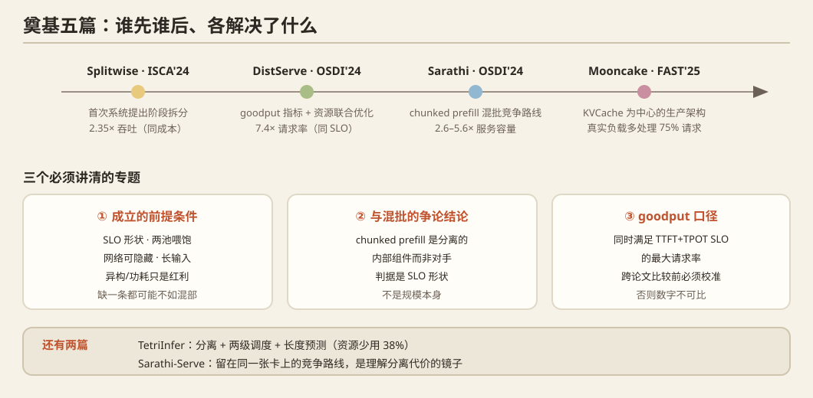

# PD 分离（Prefill–Decode Disaggregation）奠基论文技术摘要

> 调研日期：2026-09-29 · 证据来源：arXiv 官方全文（HTML/PDF）+ USENIX/ACM/IEEE 官方页面链接。
> 说明：所有外部内容仅作为数据使用；下文数字凡标注「未确认」者，均指本次未能从一手正文/官方页面直接核验。

---

## 0. 一页速览

| 论文 | 会议/年份 | 机构 | 编号 | 一句话贡献 | 最硬的一个数字 |
|---|---|---|---|---|---|
| **Splitwise** | ISCA 2024 | Microsoft（Azure Research）等 | arXiv:2311.18677；DOI 10.1109/ISCA59077.2024.00019 | **首次系统提出**把 prompt 阶段与 token 生成阶段拆到**不同机器**上，按阶段独立配置异构硬件 | 同成本/同功耗下 2.35× 吞吐；或 1.4× 吞吐且成本 −20% |
| **DistServe** | OSDI 2024 | 北京大学、UC San Diego 等 | arXiv:2401.09670 | 提出 **per-GPU goodput** 指标，并把"资源分配 + 并行策略 + 放置"一起优化 | 7.4× 请求率 或 12.6× 更严 SLO |
| **Mooncake** | FAST 2025（**最佳论文**） | Moonshot AI、清华大学等 | arXiv:2407.00079 | **KVCache 为中心**的分离架构 + 过载导向调度，承载 Kimi 生产流量 | 真实负载下多处理 75% 请求；模拟场景吞吐最高 +525% |
| **Sarathi-Serve** | OSDI 2024 | Microsoft Research India | arXiv:2403.02310 | 竞争路线：**chunked-prefill + stall-free 混批**，不做机器切分 | 服务容量 2.6×（Mistral-7B/1×A100）～5.6×（Falcon-180B+PP） |
| **TetriInfer** | arXiv 2024-01（期刊版 ShuffleInfer, ACM TOS, DOI 10.1145/3732941） | 华为等 | arXiv:2401.11181 | 分离 + **两级调度** + 长度预测，治 decode 端热点 | 资源少用 38%，平均 TTFT −97%、JCT −47%，perf/$ 2.4× |
| 早期思想来源 | — | — | Orca(OSDI'22)、Pope et al. 2022(arXiv:2211.05102)、**SARATHI**(arXiv:2308.16369, 2023-08) | Orca 给连续批处理；Pope 给"两阶段 roofline 相反"的定量观测；**SARATHI 是分离与混部两条路线共同的祖先** | SARATHI：decode 吞吐最高 10×，端到端 1.33× |

---

## 1. 时间线与"奠基"关系（谁先谁后）

| 时间 | 事件 | 出处 |
|---|---|---|
| 2022 | **Orca**（OSDI'22）提出 iteration-level scheduling（连续批处理原型），奠定此后所有引擎的基线 | [USENIX Orca](https://www.usenix.org/conference/osdi22/presentation/yu) |
| 2022-11 | **Pope et al., "Efficiently Scaling Transformer Inference"**：定量刻画"大 batch 处理输入 token 时 MFU 76%、而生成阶段是 29ms/token 的低 batch 延迟瓶颈"——**两阶段硬件特性相反的最早定量证据**（但未提分离） | [arXiv:2211.05102](https://arxiv.org/abs/2211.05102) |
| 2023-08 | **SARATHI**：首次正面攻击 prefill/decode 干扰，方案是 chunked-prefills + decode-maximal batching（**留在同一卡上混批**） | [arXiv:2308.16369](https://arxiv.org/abs/2308.16369) |
| **2023-11-30** | **Splitwise** 上 arXiv —— **已知最早的"把两阶段放到不同机器"的系统论证** | [arXiv:2311.18677](https://arxiv.org/abs/2311.18677) |
| 2023-12-08 | DistServe 投稿（据 Hao AI Lab 的 DistServe primer 幻灯片；arXiv 正式上线为 2024-01-18） | [UCSD primer PDF](https://cseweb.ucsd.edu/~yiying/cse291a-fall25/reading/pd-disagg.pdf)（第三方，待核） |
| 2024-01-18 | **DistServe** 上 arXiv，形式化 goodput | [arXiv:2401.09670](https://arxiv.org/abs/2401.09670) |
| 2024-01-20 | **TetriInfer** 上 arXiv（华为） | [arXiv:2401.11181](https://arxiv.org/abs/2401.11181) |
| 2024-03 | **Sarathi-Serve**（OSDI'24）：chunked-prefill 路线成熟态 | [arXiv:2403.02310](https://arxiv.org/abs/2403.02310) |
| 2024-06 → 2025-09 | **Mooncake**（FAST'25 最佳论文；v4 更新至 2025-09） | [arXiv:2407.00079](https://arxiv.org/abs/2407.00079) |
| 2025-08 | **TaiChi**（arXiv:2508.01989）：主张"聚合 vs 分离"应按 SLO 形状选择，并统一两者 | [arXiv:2508.01989](https://arxiv.org/abs/2508.01989) |
| 2025-11-03 | DistServe 作者复盘《Disaggregated Inference: 18 Months Later》 | [Hao AI Lab](https://haoailab.com/blogs/distserve-retro/) |

**关于"早期思想来源"（任务第 6 项）的结论**：PD 分离**没有更早的学术前身**；Splitwise 是第一个把它写成系统论文的工作，DistServe 与 TetriInfer 是**同期独立**的并行工作（三家在 6 周内先后上线）。真正更早的"源头"是三条更基础的观测/系统：Orca 的连续批处理（提供了"批内可动态进出"的调度底座）、Pope et al. 2022 的两阶段特性定量刻画、以及 SARATHI 2023-08 对 prefill/decode 干扰的首次正面攻击（它选了混批，而 Splitwise/DistServe 选了分离）。

另有一条需要打问号的归类：DistServe 正文把 **DéjàVu**（arXiv:2403.01876，ICML 2024）列为"采用类似分离思路的同期工作"。但按标题与已知内容，DéjàVu 做的是 **KV-cache streaming / 卸载与容错**，并非把 prefill 与 decode 放到不同 GPU 池。**这条归类偏宽，建议以 DéjàVu 原文二次核验**（我未打开其正文）。见 [DéjàVu ICML 2024](https://dl.acm.org/doi/10.5555/3692070.3693972)。

---

## 2. Splitwise（ISCA 2024）

**标题 / 会议 / 机构 / 编号**
- *Splitwise: Efficient Generative LLM Inference Using Phase Splitting*，ISCA 2024。
- 作者：Pratyush Patel, Esha Choukse, Chaojie Zhang, Aashaka Shah, Íñigo Goiri, Saeed Maleki, Ricardo Bianchini（Microsoft，Azure 方向）。
- [arXiv:2311.18677](https://arxiv.org/abs/2311.18677)（v1 2023-11-30，v2 2024-05-20）；DOI [10.1109/ISCA59077.2024.00019](https://doi.org/10.1109/ISCA59077.2024.00019)（解析到 [IEEE Xplore 10609649](https://ieeexplore.ieee.org/document/10609649/)）。

**核心问题**
基于对两条生产 trace（coding / conversation，各 20 分钟，median prompt 1500 / 1020 tokens）的 characterization：一次请求分两个阶段——**prompt computation**（算力密集）与 **token generation**（访存/带宽密集）。二者延迟、吞吐、显存、**功耗**特性完全不同。现状（request-level / iteration-level / mixed continuous batching）把两者混在一张卡上：token 阶段**浪费算力**（不需要最新 GPU 的算力，却占用着它），且 prompt 尖峰抬高 TBT。

**核心方法（具体）**
1. **Phase splitting**：把请求切开，prompt 阶段与 token 阶段跑在**不同机器**上；两个独立机器池（prompt pool / token pool）。
2. **KV-cache 传输**：prompt 机器算出 KV 后传给 token 机器。两级策略——小 prompt 用**串行传输**，大 prompt 用**逐层异步传输**（layer-wise，每层算完立刻异步发出，与下一层计算重叠）；实现基于 vLLM + MSCCL++，用 zero-copy one-sided 通信，按 KV block 连续性合并传输。
3. **Mixed pool（混合池）**：机器保留自己是 prompt 机还是 token 机的身份，但可被临时移入 mixed pool 执行"相反角色"的任务，以缓解高负载下两池之间的碎片化；任务清空后回到原池。混合池机器就是普通的 mixed-batching 机器。
4. **调度**：Cluster-level scheduler（CLS）管理三个池并做池间迁移；Machine-level scheduler（MLS）做批内调度——prompt 侧 FCFS **且限制单批 prompt token ≤ 2048**（因为 characterization 显示 prompt 吞吐在 2048 token 后下降）；token 侧连续批处理、batch 尽量大（吞吐随 batch 线性涨到 OOM）。
5. **指标**：三种目标 —— **throughput / cost / power**；SLO 定义为"相对于 DGX-A100 上无争用单请求的 slowdown"。

**关键实验结论（带数字）**
- 总体：**1.4× 更高吞吐且成本低 20%**；或 **同成本同功耗下 2.35× 吞吐**（摘要原话）。
- iso-cost（同成本）：Splitwise-AA（全 A100）比 Baseline-H100 **吞吐 1.4×**，代价是功耗 +25%、占用空间 2×（即用更老更易得的 GPU 换 40% 吞吐）。
- iso-throughput power-optimized：**Splitwise-HHcap 用同成本同空间达到 Baseline-H100 的吞吐，功耗低 25%**（H100 功耗封顶 50% 对 token 阶段几乎无延迟影响，而 prompt 阶段对功耗极敏感）。
- iso-throughput cost-optimized：Splitwise-AA **同吞吐、成本低 25%**。
- 相对 Baseline-A100：Splitwise-AA 交付 **2.15×** 吞吐。
- 机型组合：AA（A100+A100）、HH（H100+H100）、**HA（H100 做 prompt，A100 做 token）**、HHcap；power budget 下 40 台 DGX-H100 ≡ 70 台 DGX-A100。coding trace 最优配比 (35P, 5T)，conversation trace (25P, 15T)，另一个例子里 (27P, 3T) 达成 70 RPS 最低成本。
- KV 传输开销：优化后的逐层传输**固定非重叠时间约 8ms（A100）/ 约 5ms（H100）**（对应 200 vs 400 Gbps InfiniBand）；相比串行传输，第二个 token 的额外延迟从 **64% 降到 16.5%**；大 prompt 下串行传输对 E2E 影响最高 3%。结论：用户几乎感知不到。

**局限性**
- **强依赖高带宽互联**；论文明确假设 prompt 与 token 机器之间是 InfiniBand（不同带宽档位）——2023 年的 IB 假设在 PCIe-only 的消费级/异构机器上不成立。
- 故障恢复"从零重启请求"，KV checkpoint 只是设想，**安全高效的容错被明确列为 out of scope**。
- 假设模型可在单机内以张量并行放下（机器内通信），未处理跨节点大模型。
- 对负载分布偏离初始假设的处理只是**粗粒度**机器池调整；配比是离线按 trace 优化出来的。
- 未处理多模型、未处理前缀缓存复用。
- 其 SLO 定义（相对无争用 A100 的 slowdown）与 DistServe 的 TTFT/TPOT 双约束口径**不同**，两者数字不可直接横比。

**关键概念/术语**
`prompt computation phase` / `token generation phase`；**phase splitting**；`prompt machine` / `token machine` / **`mixed pool`**；layer-wise（逐层）KV-cache transfer；iso-power / iso-cost / iso-throughput cluster 设计；SLO = slowdown vs 无争用 A100。

---

## 3. DistServe（OSDI 2024）

**标题 / 会议 / 机构 / 编号**
- *DistServe: Disaggregating Prefill and Decoding for Goodput-optimized Large Language Model Serving*，OSDI 2024。
- 作者：Yinmin Zhong, Shengyu Liu, Junda Chen, Jianbo Hu, Yibo Zhu, Xuanzhe Liu, Xin Jin, Hao Zhang（北京大学、UC San Diego 等；第三方复述为 PKU + UCSD + Microsoft Research，**作者单位归属建议以论文首页为准**）。
- [arXiv:2401.09670](https://arxiv.org/abs/2401.09670)；[USENIX OSDI'24 PDF](https://www.usenix.org/system/files/osdi24-zhong-yinmin.pdf)；[USENIX 会议页](https://www.usenix.org/conference/osdi24/presentation/zhong-yinmin)；[OSDI'24 幻灯片](https://www.usenix.org/system/files/osdi24_slides-zhong-yinmin.pdf)；代码 [LLMServe/DistServe](https://github.com/LLMServe/DistServe)。

**核心问题**
混部（colocation）有两个根本问题：(1) **prefill–decoding interference**——prefill 迭代会拖长 decode 的 TPOT（论文测得 LLAMA-13B 上一条 1024 长 prompt 可把 decode step 拉长 12x）；(2) **资源分配与并行策略耦合**——prefill 想要 intra-op（TP）以压 TTFT，decode 的最优并行取决于 running batch size，一套配置必须两头妥协 → 超额配置。在严格的 TTFT **和** TPOT 双约束下，混部系统必须牺牲其一，或过配资源。

**核心方法（具体）**
1. **阶段级切分**：prefill 与 decoding 分配到**不同 GPU**，彻底消除干扰。
2. **两阶段解耦优化**：给定应用的 TTFT/TPOT 要求，分别对 prefill 实例与 decoding 实例**联合优化 GPU 数量 + 并行策略**（intra-op / inter-op / 复制），使各自达到**阶段级最优 per-GPU goodput**；再用 replication 匹配用户要求的总流量：`n = ⌈R / config_p.goodput⌉`，`m = ⌈R / config_d.goodput⌉`。
3. **带宽感知的放置算法**：KV 传输会走网络，因此按集群带宽拓扑放置。两种模式：高 node-affinity（同节点内 NVLink）与 low node-affinity（受限跨节点带宽时，**强制同一 stage 的 prefill 与 decode 段放在同一节点**，从而只走节点内 NVLink）。跨节点带宽只有 25 Gbps 的测试床上用的是 low-affinity 算法。
4. **KV 传输实现**：CUDA kernel + NCCL；初始化时 prefill 侧打开 IPC、把 handler 拷给 decode；传输时 **decode worker 主动 pull（pull-based）** prefill 的 GPU 显存 —— 用 pull 而非 push 来防止 decode worker 被尖峰 prefill 淹没。按层重叠传输。
5. **容量搜索引擎**：没有解析公式能算 SLO attainment，于是用**离散事件仿真器**（从历史 trace 拟合输入/输出长度分布并重采样）+ **二分搜索**枚举并行配置，找满足 attainment 目标的最大速率。仿真与真实系统误差 < 2%。
6. **指标**：per-GPU goodput（见第 9 节专题）。

**关键实验结论（带数字）**
- 抽象结论：可比 SOTA 服务 **7.4× 更多请求**，或在同样达标率下承受 **12.6× 更严的 SLO**，同时 >90% 请求满足延迟约束（附录含 99% attainment 结果）。
- 单卡示例（**13B 模型**，工作负载与两个延迟约束按"为文章生成简短摘要"设定；Figure 1）：混部单张 A100 的 per-GPU goodput ≈ **1.6 rps**；分离后 prefill 5.6 rps、decode 10 rps → 2 卡 prefill + 1 卡 decode 整体 10 rps，折合 **3.3 rps/GPU = 2.1×**。
- Chatbot（ShareGPT）：相对 DeepSpeed-MII **1.6×–7.4× 更高请求率**；SLO 上比 vLLM 严 **1.8×–3.2×**，比 DeepSpeed-MII 严 1.7×–1.8×。
- Code completion（OPT-66B）：vs vLLM **5.7× 请求率 + 1.4× 更严 SLO**；vs DeepSpeed-MII 1.6× + 1.4×。
- Summarization（OPT-66B / LongBench，长输入）：vs vLLM **4.3× 请求率 + 12.6× 更严 SLO**；vs DeepSpeed-MII 1.8× + 2.6×。
- 找到的最优配比示例（OPT-175B）：prefill 实例 inter-op=3、intra-op=3；decode 实例 inter-op=3、intra-op=4——手工很难找到，说明搜索算法有效。
- **关键的前提数字（KV 传输带宽门槛）**：单个 512-token 请求在 OPT-66B 上的 KV cache 约 **1.13 GB**；若平均到达率 10 rps，需要 **11.3 GB/s ≈ 90 Gbps** 才能让传输开销"不可见"。A100 节点内 NVLink 峰值 600 GB/s（可忽略）；测试床跨节点仅 25 Gbps 所以用 low-affinity。实测 >95% 请求的传输延迟 < 30ms。
- 测试床：4 节点 × 8 张 A100-80GB SXM，节点内 NVLink，跨节点 25 Gbps。

**局限性**
- **放置是离线一次性规划**（部署前跑一次，分钟级），负载形态漂移需要重新规划；作者在复盘中把"在线重规划"列为开放问题。
- 强依赖仿真器的准确度与**工作负载先验分布**（需要已知到达过程与输入/输出长度分布）。
- **资源受限场景失效**：只有几卡甚至单卡时，并行策略与资源分配的设计空间被压缩到"挣扎甚至失败"，此时非分离架构更合理（作者自述）。
- **纯吞吐优化（离线、不敏感延迟）场景下分离可能不划算**，此时 chunked-prefill + piggyback 更优（作者自述）。
- 长上下文场景：传输量随 prompt 线性增长，但 prefill 计算量是**平方**增长，所以相对开销反而下降——作者认为长上下文下分离依然有利（这是一条支持性论证，不是负面限制）。
- 未含准入控制、磁盘 KV 池、多模型支持（第三方复述，[DistServe retro 笔记](https://raw.githubusercontent.com/qfc-network/ai-infra/main/foundational/distserve/en.md)）。

**关键概念/术语**
**per-GPU goodput**；**SLO attainment**；**prefill–decoding interference**；**解耦的资源分配与并行策略**；intra-op / inter-op parallelism；node-affinity 放置；**pull-based KV transfer**；`config.goodput` / `config.num_gpus`。

---

## 4. Mooncake（FAST 2025，最佳论文）

**标题 / 会议 / 机构 / 编号**
- *Mooncake: A KVCache-centric Disaggregated Architecture for LLM Serving*，FAST 2025 **最佳论文**。
- 作者：Ruoyu Qin, Zheming Li, Weiran He, Mingxing Zhang, Yongwei Wu, Weimin Zheng, Xinran Xu（Moonshot AI + 清华大学等）。
- [arXiv:2407.00079](https://arxiv.org/abs/2407.00079)（v1 2024-06-24，v4 2025-09-03）；[USENIX FAST'25 PDF](https://www.usenix.org/system/files/fast25-qin.pdf)；[清华获奖新闻](https://www.tsinghua.edu.cn/info/1175/117420.htm)；开源 [kvcache-ai/Mooncake](https://github.com/kvcache-ai/Mooncake)。

**核心问题**
Kimi 的生产负载有三个特征：(1) **极长上下文**（生产 trace 平均输入 **7,590 tokens**、平均输出 **182 tokens**，输入输出比约 **720:1**）→ TTFT 是主要矛盾；(2) **前缀高度可复用**，但复用远程 KVCache 会拉长 TTFT，而大 batch 又会拉长 TBT；(3) **长期过载**——GPU 供给跟不上请求增长，"假设所有请求都会被处理"的学术假设不成立，必须**主动拒绝**请求。目标函数是"在满足 TTFT/TBT SLO 前提下最大化 overall effective throughput（≈goodput）"。

**核心方法（具体）**
1. **KVCache-centric 分离架构**：prefill 集群与 decoding 集群分离；同时把 GPU 集群里**闲置的 CPU、DRAM、SSD 池化**成一个 disaggregated KVCache（CPU 内存按 paged block 存储，LRU/LFU/请求特征驱逐）。
2. **两个核心组件**：
   - **Messenger**：基于 (GPUDirect) RDMA 的传输组件，每个节点一个独立进程，负责跨机 KVCache block 搬运。
   - **Conductor**：全局调度器，决定请求落到哪对 (prefill, decode) 实例，以及 KVCache block 的**复制/换出**（hot-spot migration，复制热点 block，无需精确预测未来使用）。
3. **CPP（chunked pipeline parallelism）**：长上下文 prefill 把一个请求的 chunk 分到多个节点并行处理以压 TTFT；相比传统 sequence parallelism（SP）**减少网络消耗、避免频繁弹性伸缩**；配合 **layer-wise prefill** 做 KVCache 流式传输与重叠。该机制只在满足 TTFT SLO 必要时才启用 SP 组。
4. **KVCache-aware 全局调度**：选 prefill 实例时**不只看负载**，还看该实例的前缀缓存命中长度与可复用 block 分布；Conductor 估计每个候选实例的 `TTFT ≈ T_transfer + T_queue + T_prefill`（用离线测试数据拟合的预测模型估计 prefill 时长），选 TTFT 最小者；**SLO 不可达就直接返回 HTTP 429**，把准入控制上推到上层。decode 节点由 Conductor 预选以保证 TBT，本地调度器再复核一次（复核失败则该请求被拒，**prefill 成本白费**）。
5. **过载导向调度 + 基于预测的早期拒绝**：先论证"朴素的早期拒绝会导致 prefill/decode 负载**剧烈振荡**"（四阶段振荡），再改为**系统级预测**（不做逐请求完成时间预测，而是预测一段时间后的整体 batch 数 / TBT 状态），配合请求优先级分类。

**关键实验结论（带数字）**
- 模拟场景：相比 baseline，在满足 SLO 前提下吞吐**最高 +525%**；整体区间为 **+50% ~ +525%**。
- 真实负载：Mooncake 让 Kimi **多处理约 75% 的请求**（Mooncake-[10P+10D] vs vLLM-[20M]）；TTFT 分布几乎相同（近 100% 达标），但 **TBT 达标率 ≈100% vs vLLM 仅 57%**（TTFT 上限 30s，TBT 上限 0.1s/token）。
- 公开数据集端到端：Mooncake-[3P+1D] 在 **ArXiv Summarization 上吞吐 +20%**、**L-Eval 上 +40%**（对比 vLLM-[4M]），且 L-Eval 上 prefix caching 进一步提升。
- 调度消融：8 prefill + 8 decode 实例、回放 **23,000 条真实请求**，KVCache-centric 调度在平均 TTFT 与 TTFT SLO 达标率上均优于 random 与 load-balancing。
- 过载实验：同样 8P+8D、23,000 条真实 trace、**2× 速度回放**制造过载。
- 测试床：8× NVIDIA A800-SXM4-80GB/节点（NVLink 互联），节点间 RDMA **800 Gbps**。
- KVCache 可复用率：当前线上负载理论最高只能复用约 **50%**（即使存储容量与 TTFT SLO 无限），但某些场景（如 chat-to-paper）可达 **90%**。

**局限性**
- **P:D 配比是预设的**：论文明确说真实集群中两池需求在"某些时段内稳定"，所以比例可以预设，**更灵活的部署/角色转换留给未来工作**；配比失衡会立刻伤 TTFT（例如 Mooncake-[2P+2D] 的 TTFT 反而不如 Mooncake-[3P+1D]）。
- **输出长度预测仍是难题**：只做系统级预测，**请求级预测明确留作 future work**（理由是成本高/精度低）。
- 拒绝策略有浪费：prefill 完成后被本地调度器拒绝的请求，其 prefill 成本白费。
- 依赖较重的资源前提：RDMA 网络 + 可池化的 CPU/DRAM/SSD + 前缀命中率。KVCache 复用率对应用场景高度敏感（50%~90%）。
- 论文把**异构加速器**（GDDR/LPDDR/PIM/混合键合）与**把 attention 算子从其他线性算子中进一步拆出**（即后来所谓 AFD）都列为 future work——即当前版本只在 P/D 这一刀上做了切分。

**关键概念/术语**
**KVCache-centric disaggregated architecture**；**Conductor**（全局调度器）；**Messenger**（RDMA 传输组件）；**CPP / chunked pipeline parallelism**；**layer-wise prefill**（流式 KVCache 传输）；**prediction-based early rejection**；**overload-oriented scheduling**；**hot-spot migration**；goodput / TTFT / TBT（Mooncake 用 **TBT**，与 DistServe 的 TPOT 同义）；SLO 用 **P90 倍数**定义（如 `TTFT_P90 = 4×`、`TTFT_P90 = 10×` 表示相对无干扰单请求的倍数）。

---

## 5. Sarathi-Serve（OSDI 2024）—— 与 PD 分离竞争的技术路线

**标题 / 会议 / 机构 / 编号**
- *Taming Throughput–Latency Tradeoff in LLM Inference with Sarathi-Serve*，OSDI 2024。
- 作者：Amey Agrawal, Nitin Kedia, Ashish Panwar, Jayashree Mohan, Nipun Kwatra, Bhargav S. Gulavani, Alexey Tumanov, Ramachandran Ramjee（**Microsoft Research India**）。
- [arXiv:2403.02310](https://arxiv.org/abs/2403.02310)（v1 2024-03-04）；[USENIX OSDI'24 会议页](https://www.usenix.org/conference/osdi24/presentation/agrawal)；[USENIX PDF](https://www.usenix.org/system/files/osdi24-agrawal.pdf)；代码 [microsoft/sarathi-serve](https://github.com/microsoft/sarathi-serve)。

**核心问题**
batch 多个请求会**交错 prefill 与 decode 迭代**，于是"高吞吐"与"低延迟"不可兼得：优先 prefill → TBT 尾延迟炸（论文称 **generation stall**）；优先 decode → 吞吐掉。要同时拿到高吞吐和低 TBT 尾延迟。

**核心方法（具体）**
1. **chunked-prefills**：把一条 prefill 请求切成近似等大的 chunk。
2. **stall-free batching（无停顿批调度）**：按用户指定 SLO 先算出一次迭代的 **token budget**（单批最多处理多少 token）；批次先填满**正在运行的 decode token**（保证 decode 永不停顿），再放入**未完成 prefill 的下一块**，最后才在剩余预算内**接纳新请求**。由此每次迭代的计算量有上界，且**几乎与输入 prompt 总长无关** → decode 的 TBT 不再被长 prompt 拖爆。
3. **token budget 的选取**是核心工程决策，两个方向拉扯：预算小 → TBT 低，但过度切块带来 (a) GPU 利用率下降 (b) attention 反复访问 KV-cache 的固定开销（kernel launch 等）；预算大 → 迭代时长波动大、**流水线气泡**多。作者用 **Vidur**（LLM 推理 profiler/simulator）离线 profiling 决定 token budget。
4. **uniform batches → 减少流水线气泡**：混合批次计算量近似均匀，配合 pipeline parallelism 可做均衡的 micro-batching 调度。

**关键实验结论（带数字）**
- **2.6×** 服务容量：Mistral-7B，单张 A100（对比 vLLM）。
- **3.7×** 服务容量：Yi-34B，2× A100（2-way TP）。
- **5.6×** 端到端服务容量：Falcon-180B，8× A100（2-way PP × 4-way TP，**走普通以太网**），收益主要来自减少流水线气泡。
- 严格 SLO 下：100ms SLO、Mistral-7B，用小 token budget 512 时对 vLLM 达 **3.5× 容量**；放宽 SLO 用 budget 2048 时约 **1.65×**。
- **朴素 hybrid batching**（不切块的混批）会导致 TBT 最高 **+28.3×** 的恶化——这是"必须切块"的量化论据。
- 切块的开销（消融）：chunk size 512 时 prefill 吞吐开销**最多 25%**；budget 2048 时开销**几乎可忽略**。（另一个细节：chunk size 257 相比 256 在某些情况下会让 prefill 时间 **+32%**，说明 chunk 大小要与硬件/kernel 对齐。）
- 两技术必须合用（Table 4，Yi-34B/2×A100，budget 1024）：只用 hybrid-batching → P50 TTFT 0.53s / P99 TBT 3.78s；只用 chunked-prefills → 1.04s / 0.17s；**合起来 0.76s / 0.14s**（两维同时改善）。

**局限性（作者自述 + 可推断）**
- **chunked prefill 比 full prefill 慢**，因此为换 TPOT 会牺牲一部分 TTFT —— DistServe 的实验也独立复现了这一点（DeepSpeed-MII 采用 chunked prefill，在大模型上表现更好，但"struggles to meet the TTFT SLO as a sacrifice for better TPOT"）。
- token budget 需要针对 SLO / 并行配置 / 硬件**一次性离线 profiling** 来定；论文把"按负载动态调整 token budget"列为 future work。
- 干扰是被**限制（bound）**而非**消除**。
- 对分离路线的评价（原文 Related Work，见第 8 节"争论结论"）：分离能彻底消除干扰，但需要高带宽互联迁移 KV，且**浪费 prefill 副本的显存容量**（只有 decode 副本在存 KV）。
- 论文**明确放弃**与分离方案的定量对比："We leave a quantitative comparison between Sarathi-Serve and disaggregation-based solutions for future work."

**关键概念/术语**
**chunked-prefills**；**stall-free batching**；**token budget**；**generation stall**；**hybrid batch（prefill+decode 混批）**；decode-maximal batching（前身 SARATHI 的术语）；TBT（time-between-tokens，即 TPOT）；pipeline bubbles。

---

## 6. TetriInfer（arXiv 2024-01；期刊版 ShuffleInfer, ACM TOS）

**标题 / 会议 / 机构 / 编号**
- *Inference without Interference: Disaggregate LLM Inference for Mixed Downstream Workloads*（系统名 **TetriInfer**）。
- 作者：Cunchen Hu, Heyang Huang, Liangliang Xu, Xusheng Chen, Jiang Xu, Shuang Chen, Hao Feng, Chenxi Wang, Sa Wang, Yungang Bao, Ninghui Sun, Yizhou Shan（**华为**等）。
- [arXiv:2401.11181](https://arxiv.org/abs/2401.11181)（v1 2024-01-20）。
- 期刊版/改名为 **ShuffleInfer: Disaggregate LLM Inference for Mixed Downstream Workloads**, *ACM Transactions on Storage*, DOI [10.1145/3732941](https://doi.org/10.1145/3732941)（[ACM DL](https://dl.acm.org/doi/10.1145/3732941)）。**卷期/年份未确认**（检索线索指向 TOS Vol. 22 No. 4）。

**核心问题**
混合下游负载（长短 prompt、长短输出混在一起）下，有三类干扰：prefill↔decode 互相干扰、prefill↔prefill（长度极不均衡导致 GPU 远未饱和）、decode↔decode（长短输出混在一台 decode 实例上互相拖慢）。作者强调请求长度差异跨**三个数量级**。

**核心方法（具体）**
1. **固定尺寸 chunked prefill（partition + pad）**：把 prompt 切成固定大小 chunk 并 padding，让加速器**始终运行在"计算饱和临界点"附近**。注意与 Sarathi-Serve 的关键差别：TetriInfer 跑的是 **prefill-only chunk**（因为已把 prefill 与 decode 分离到不同实例），而 Sarathi-Serve 跑的是 **prefill-decode-mixed chunk**。prefill 侧还支持 FCFS / **SJF** / LJF 策略，并用 "prefill scheduling batch" 防止长/短请求**饿死**。
2. **PD 分离**：prefill 实例与 decode 实例分离，各自独立运行。
3. **两级调度（two-level scheduling）**：
   - **第一级（prefill 侧）**：本地 scheduler + 长度预测器 + dispatcher。
   - **第二级（decode 侧）**：**decentralized dispatcher** 基于**预测的资源使用**选择 decode 实例，避免 decode 调度热点（hotspot）。
4. **长度预测器**：在**每个 prefill 实例**上跑一个**小 LLM 分类模型**（实验中是 **OPT-125M** 为 **OPT-13B** 目标模型做预测），把输出长度分类到固定大小的 bucket（粒度可调），用于估计 decode 阶段的资源占用。刻意选小模型：放在 prefill 实例上跑，成本要低、不能影响主模型；用巨型 LLM 做预测在本场景不可行。
5. **KV 传输**：因为用了 chunked prefill，KV 是逐 chunk 产生的；论文讨论 **chunk-level transfer（逐 chunk 发，可与 prefill 并行）** vs **request-level transfer（全部 prefill 完再整包发，网络传输次数少）**，并指出 Sarathi 的 layer-wise 思路与 chunk-level 一致、两者可叠加。**本文实现只做了 request-level，chunk-level 留作 future work。**
6. **指标**：**TTFT**、**JCT（job completion time）**、**perf/$（performance per dollar）** —— 注意它**不用 goodput**。

**关键实验结论（带数字）**
- 摘要级结论：**少用 38% 资源**，同时平均 **TTFT −97%**、平均 **JCT −47%**。
- 轻 prefill / 重 decode 负载：**perf/$ 提升 2.4×**。
- 常见混合负载：平均 TTFT −85%、JCT −50%。
- 硬件仿真配置下 vs vLLM：平均 TTFT −44%、JCT −40%；虽然用了**两倍**硬件卡数，但完成速度快近两倍，资源占用时间与 vanilla vLLM 相当 → **perf/$ 1.4×**。
- 把 decode 阶段的固定 batch 换成可变 batch：平均 JCT −47%、硬件资源少用 38% → **perf/$ 2.4×**。
- 单看 chunked prefill 的收益：相比 vLLM 的固定 batch prefill，chunked prefill + FCFS 让**平均 prefill 延迟降低 86.4%**；再加 SJF 调度策略**再降 7.8%** 平均等待时间。
- 128 请求场景：TTFT −85%、JCT −50%、资源 −21% → **perf/$ 1.9×**。
- 长度预测精度的价值：当前精度下 reserve-dynamic/reserve-static 与 vLLM greedy 持平；**理想预测精度**下可再降平均 JCT **10%~12%**。
- **反例（很重要）**：在某个配置下 TetriInfer 虽把平均 TTFT/JCT 改善 9%/23%，但资源用量 **+43%**，导致 **perf/$ 反而不如 vLLM 14%**。

**局限性**
- 有明确的反例场景（上面最后一条）：**分离不总是划算**，取决于负载形态与预测精度。
- 长度预测器的精度直接决定调度收益上限（理想精度也只多拿 10%~12% JCT）。
- 只实现 request-level KV 传输，chunk-level 留作 future work；未做 layer-wise。
- 只探索**非抢占**调度策略（论文提到 chunked prefill 已为抢占/乱序（如 SRTF）打开大门，但留作 future work）。
- 部分实验基于**硬件仿真**（emulated hardware setups）。
- 预测器方案有其取舍：放在 decode 实例上无法规避所测到的干扰；放在全局调度器前会让全局调度器成为瓶颈。

**关键概念/术语**
**two-level scheduling**；**length predictor**（小 LLM 分类 → 长度 bucket）；**decentralized dispatcher**；**decode scheduling hotspot**；**fixed-size chunked prefill（partition + pad）**；**prefill-only chunk** vs Sarathi 的 mixed chunk；**perf/$**；JCT；reserve-dynamic / reserve-static 调度策略。

---

## 7. 专题一：PD 分离**成立的前提条件**是什么？

这一节综合 Splitwise / DistServe / Sarathi-Serve / Mooncake / TaiChi / 以及 2026 年的再评估论文 2601.08833。

### 7.1 SLO 形状（最重要的一个条件）

**TaiChi（arXiv:2508.01989）用统一实验给出了最干净的判据**（4 节点 8-GPU A100-DGX，Llama-2-70B，TP4，QPS=12，90% attainment 口径下的 SLO 达标率）：

| TTFT & TPOT SLO | PD 聚合（混部） | PD 分离 |
|---|---|---|
| 宽松 TTFT & 严格 TPOT（16s, 60ms） | **7%** | **98%** |
| 严格 TTFT & 宽松 TPOT（5s, 250ms） | **97%** | **42%** |
| 均衡 TTFT & TPOT（6s, 100ms） | 16% | 50% |

结论（TaiChi 的 Observation 1）：**PD 聚合在"TTFT 紧 + TPOT 松"时最优；PD 分离在"TPOT 紧 + TTFT 松"时最优；两者均衡时谁都不优**（此时需要 hybrid）。原因很直白：聚合会被 decode 干扰而违反 TPOT；分离时只有一部分实例在扛 prefill，容易违反 TTFT。
→ 这直接解释了为什么 Splitwise/DistServe/Mooncake 的收益场景都是 **TTFT 可松（长输入、离线/半离线摘要、长上下文问答）、TPOT 必须紧（流式输出体验）**，以及为什么 DistServe 在 **code completion（TTFT 紧）** 上收益明显小于 **summarization（TTFT 松、TPOT 紧）**（5.7×/1.4× vs 4.3×/12.6×）。

### 7.2 规模与负载：两池都要喂饱

- **DistServe 自述**：只有几卡甚至单卡时"设计空间被显著限制，挣扎甚至失败"，此时非分离更简单更高效。其最小可行配比示例是 **2 prefill + 1 decode**。
- **Splitwise** 的集群例子是数十台机器量级（例如 40 台 H100 的功耗预算 ≡ 70 台 A100；coding trace 最优 35P+5T，conversation 25P+15T，另有 27P+3T 达成 70 RPS 的最低成本方案）。低负载时 prompt 机会被闲置、碎片化严重。
- **Mooncake 自述**：真实集群中两池需求"在某些时段内稳定，只有轻微临时失衡"，所以**比例可以预设**——反过来说，如果负载在 P/D 之间剧烈漂移，预设比例会失效（其 [2P+2D] 的 TTFT 就不如 [3P+1D]）。
- **DistServe 复盘（Hao AI Lab）**：2024 年社区大量反对、一年内没被广泛采用，**2025 年突然成为默认**——原因正是"模型更大、流量更高，推理要扩到几百到几千张 GPU"，这个规模下分离才真正闪光。

### 7.3 网络：KV 传输必须能被隐藏

这是最硬的技术门槛，三家给出的量化边界高度一致：

| 来源 | 量化 |
|---|---|
| DistServe | 单条 512-token 请求在 OPT-66B 上 KV ≈ **1.13 GB**；10 rps 需要 **≈90 Gbps** 才能让开销"不可见"。A100 节点内 NVLink **600 GB/s**（完全可忽略）；其测试床跨节点仅 **25 Gbps**，故采用 low node-affinity 放置（强制同节点内传输），实测 >95% 请求传输 <30ms |
| Splitwise | 假设机器间 InfiniBand（**200 Gbps(A100) / 400 Gbps(H100)**）；逐层异步传输后固定非重叠开销仅 **~8ms / ~5ms**，第二个 token 额外延迟从 64% 降到 **16.5%**；否则串行传输对大 prompt 可吃掉 3% E2E |
| Sarathi-Serve | "**在没有高带宽互联的情况下**，把每个请求的 KV cache 在 prefill 完成时迁移到 decode 副本是有挑战的" |
| TaiChi | KV 传输时间"**在高速互联下通常可忽略**"（明确引用 NVLink 600 GB/s、InfiniBand 800 Gbps、以及 GQA/MLA 降低 KV 体积） |
| Mooncake | 生产级用 **800 Gbps RDMA**，并且把 CPU/DRAM/SSD 也做成 KVCache 池来兜底 |

**反向证据（关键）**：2026 年的再评估论文 *"性能增益取决于请求负载与 KV 传输介质"*（[arXiv:2601.08833](https://arxiv.org/abs/2601.08833)）在 **2×A100-40GB、同一 PCIe Gen3 桥**上做了公平对照（新增了一个"2 卡各跑一半请求、都做混合"的**等价资源混部基线**），结论：
- **"PD 分离的性能收益并非必然，取决于请求负载与 KV 传输介质"**；
- 等价 GPU 资源下，分离会让**每 GPU 的请求量翻倍，从而在高负载时反而恶化 TTFT**；而混部在大 batch（KV 超出显存配额）时因 KV 驱逐/重算而恶化 TPOT；
- 在这套 PCIe 环境下，**分离并不总是赢**；
- 分离的**能耗本质上更高**，且"分离天然允许的分阶段独立频率调节（DVFS）**并没有带来节能**"。

→ **对"真实消费级/PCIe-only 异构机器"的推论**：满足 7.3 的门槛通常**不成立**，所以不能默认照搬 A100/H100 + NVLink/IB 上的结论——这与本仓库 `04-PD分离与推理架构.md` 里"最推荐切入点"的判断一致。

### 7.4 上下文长度 / prompt:output 比例

- **KV 传输量 ∝ prompt 长度（线性），prefill 计算量 ∝ 长度²（平方）** → 上下文越长，**传输的相对占比越低，而干扰越严重**。DistServe 与 Mooncake 都在此逻辑下认为长上下文是分离的最佳场景。
- Mooncake 的生产 trace（平均输入 **7,590** / 输出 **182**，比例约 **720:1**）就是极端理想形态；论文明确"对这类长上下文请求，优化 TTFT 至关重要"。
- 另外，**MLAttention/GQA/MLA 这类降 KV 体积的模型侧改动会直接放宽分离的网络门槛**（TaiChi 明确把 GQA、MLA 列为"使传输开销可忽略"的原因之一）。

### 7.5 硬件异构与功耗（分离的"第二红利"）

- Splitwise 的核心卖点其实是**异构 + 成本/功耗**：prefill 用 H100、decode 用 A100（Splitwise-HA）；decode 阶段功率封顶 50% 几乎不掉延迟，而 prompt 阶段对功耗极敏感 → 同吞吐省 25% 功耗 / 同吞吐省 25% 成本。
- Mooncake 与 DistServe 也把"可以为两阶段各自选最适合的硬件"列为分离的结构性收益；Mooncake 的 future work 直接指向 GDDR/LPDDR/PIM 等带宽导向器件。

### 7.6 前缀缓存与 KV 复用（Mooncake 类系统的额外前提）

Mooncake 的 KVCache 池要求 **CPU/DRAM/SSD 可池化 + RDMA 网络 + 应用有前缀重叠**。其复用率对场景极敏感：当前线上负载理论最高只能复用 ≈**50%**，部分场景（chat-to-paper）可达 **90%**。前缀命中率高时，分离 + 缓存池的联合收益最大（L-Eval 上 prefix caching 进一步抬升吞吐）。

### 7.7 一句话总结前提条件

> PD 分离在 **(a) TPOT 紧、TTFT 相对松；(b) 请求率高到足以同时喂饱 prefill 与 decode 两个池（数十卡以上规模）；(c) 有 NVLink/IB 级高带宽互联（或 KV 体积被 GQA/MLA 压得很小），使 KV 传输能被计算隐藏；(d) prompt 远长于 output，KV 传输量相对 prefill 计算量可以忽略** 四个条件同时成立时才明确划算。缺 (a) → 用混部 + chunked prefill 更优；缺 (b) → 两池碎片化，分离反而更差；缺 (c) → 传输成为新瓶颈（PCIe-only 场景已被 2601.08833 证伪"必然更优"）。**异构硬件与功耗优化是分离的附加红利，不是它的成立条件。**

---

## 8. 专题二：Sarathi 系 chunked prefill 与 PD 分离的**争论结论**

### 8.1 双方在论文里的原始表述（重要：这是"互留余地"而非"互相否定"）

**Sarathi-Serve 对分离的评价**（OSDI'24, Related Work，原文）：
- 分离（Splitwise、DistServe、TetriInfer）可以**完全消除** prefill 与 decode 之间的干扰；
- 但分离需要把每个请求的 KV cache 在 prefill 完成时迁移过去，**在没有高带宽互联时这是有挑战的**；
- 而且分离**浪费了 prefill 副本的 GPU 显存容量**——只有 decode 副本负责存 KV cache；
- 正面看，分离能**以最大效率执行 prefill（因此 TTFT 更好）**，而 chunked prefill 比 full prefill 慢一些；
- 明确声明：**"我们与分离方案的定量比较留待未来工作"**。

**DistServe 对 chunked prefill 的评价**（OSDI'24, Discussion / Experiments，原文）：
- **吞吐优化场景**（离线、不敏感延迟）：目标从 goodput 转为总吞吐，"分离的效果可能会被削弱"，此时**chunked-prefill + piggyback 可能更受青睐**，因为它能把每个 batch 填到算力饱和阈值，保持每轮迭代的高利用率；
- **资源受限场景**：只有几张卡甚至一张卡时，分离的并行策略与资源分配设计空间被严重压缩，"挣扎甚至失败"，此时**非分离架构**（[32, 3]）能降低部署复杂度、优化运维效率；
- 实验中：DeepSpeed-MII（chunked prefill）在**更大模型上表现更好**，因为 prefill job 更大、chunked-prefill 在一定程度上缓解了干扰；但**"chunked prefill 比 full prefill 慢，所以它为了更好的 TPOT 而在 TTFT SLO 上挣扎"**；
- 长上下文场景：传输量随 prompt 线性增长，但 prefill 计算是平方增长 → 分离依然有前景。

### 8.2 产业界的复盘结论

**DistServe 作者复盘**（[18 Months Later, 2025-11-03](https://haoailab.com/blogs/distserve-retro/)）：
- 承认 2024 年遭到开源社区大量反对、未被广泛采用；
- **"即使有了 chunked prefill 这样的缓解手段，单个大 prefill 仍然可以把 TPOT 放大 2~30 倍，在突发负载下尤为严重"**——这是判 chunked prefill 不足以独当一面的关键量化论断；
- 2025 年形势突变的原因：业务规模化后延迟成为"生死问题"；模型变大、流量变高迫使系统扩到几百~几千 GPU；**分离带来可组合的架构**（KV 存储、传输、硬件特化都能各自演进）；
- 值得注意：DistServe **自己也用 chunking**（其设计四问之一是"如何减少流水线气泡 → Chunking"），说明 chunked prefill **不是对立面，而是分离架构内部的标准组件**（用于把单次迭代的计算量限住，以保护 TPOT）。

**学术界的裁判结论**（TaiChi, [arXiv:2508.01989](https://arxiv.org/abs/2508.01989)）：
- 明确指出这是在"end this debate"；
- **Observation 1**：聚合在"TTFT 紧 + TPOT 松"最优，分离在"TPOT 紧 + TTFT 松"最优，**均衡时两者都不最优**；
- 因此提出统一架构（P-heavy / D-heavy 差异化能力实例 + 三个 slider：两池比例、两侧 chunk size），按 SLO 形状在 aggregation / disaggregation / hybrid 之间连续变形；
- 效果：**goodput 相对 SOTA 最高 +77%**；相对 PD 聚合 +9%~47%，相对 PD 分离 +29%~77%（不同 workload / SLO 下）；均衡 SLO 下 +20%~47%（vs 聚合）与 +30%~77%（vs 分离）。

### 8.3 争论结论（我的综合）

1. **"谁替代谁"是伪问题。** 两者优化的目标函数维度不同：chunked prefill 在**单一资源池**内把"吞吐-延迟"权衡曲线整体外推（**bound** 干扰）；PD 分离把问题变成**两个可独立伸缩、可独立选硬件的资源池**（**eliminate** 干扰 + 解耦扩缩容）。
2. **判据是 SLO 形状而非规模本身。** 严格说：**TPOT 紧、TTFT 松 → 分离占优；TTFT 紧、TPOT 松 → 混部 + chunked prefill 占优；两者都紧（均衡）→ 两者都不优，需要 hybrid 或按请求分流。** 经验性表述"规模越大、SLO 越严，分离越占优"在**"严"指 TPOT**时才严格成立（规模大是使分离的固定成本被摊薄的必要条件，不是充分条件）。
3. **chunked prefill 是分离的组件，不是对手。** 分离后 prefill 侧仍需要限制单次迭代工作量（DistServe 的 chunking、TetriInfer 的 fixed-size prefill-only chunk、Mooncake 的 CPP），decode 侧的 TPOT 保护也依赖批内 token 预算（Sarathi-Serve 的 token budget）。
4. **成本上真正的分歧点是 KV 传输与显存利用。** Sarathi-Serve 指出的"prefill 副本显存被浪费"是分离的**结构性代价**（不是可优化掉的实现细节）；而 Sarathi-Serve 自己付出的代价是"chunked prefill 比 full prefill 慢 → TTFT 变差"。两者是**对称的代价交换**，交换比率由网络带宽与 prompt 长度决定。
5. **双方都在论文里主动承认对方的主场**（Sarathi-Serve 留白定量比较、DistServe 明确指出吞吐优化与资源受限场景下混部更优）——所以这场"争论"在原始论文层面其实已经是**条件性结论**，2025-2026 的 TaiChi 只是把它形式化并工程化。

---

## 9. 专题三：DistServe 的 **goodput** 如何定义与计算

### 9.1 定义（论文原文口径）

DistServe 的定义：

> **per-GPU goodput**：*"the maximum request rate that can be served adhering to the SLO attainment goal (say, 90%) for each GPU provisioned – higher per-GPU goodput directly translates into lower cost per query."*

拆开看有三层：
1. **goodput（系统级）** = 请求率（requests/s），但**只计入同时满足 TTFT 与 TPOT 两个 SLO 约束的请求**；
2. **SLO attainment** = 满足 TTFT **且** 满足 TPOT 的请求比例（论文默认取 **90%** 作为目标，附录给了 **99%** 的结果）；
3. **per-GPU goodput** = 上述 goodput 除以**已部署的 GPU 总数**（单位：requests/s/GPU）。

直白说：**"在 90% 请求都达标的服务品质下，每张卡每秒能扛多少请求"**。它刻意同时惩罚两头——只堆吞吐不管延迟的系统、以及靠过配资源换延迟的系统，在这个指标上都吃亏。这也是为什么论文说 "higher per-GPU goodput directly translates into lower cost per query"。

与 throughput 的区别（Hao AI Lab primer 的直观例子）：一个系统 throughput = 10 rps，但只有 3 rps 的请求在 SLO 内 → **goodput = 3 rps**。高吞吐 ≠ 高 goodput。

### 9.2 计算方式（怎么算出来的）

因为 `config.goodput` 没有解析闭式，DistServe 的做法是 **解析性能模型 + 离散事件仿真 + 二分搜索 + 两级放置优化**：

1. **阶段级单独优化**（两阶段独立，可并行搜索）：
   - 对 prefill 实例：给定并行配置 `G_p` 与工作负载 `W`，用 `simu_prefill(G_p, W)` 估算 **SLO attainment**，二分搜索最大速率使 attainment ≥ 目标 → 得到 `config_p.goodput`；
   - 对 decoding 实例：同样 `simu_decode(G_d, W)` → `config_d.goodput`；
   - 择优判据是**每卡 goodput**：`config_p.goodput / config_p.num_gpus` 最大化（伪码里就是 `if config_p.goodput/config_p.num_gpus < config.goodput/config.num_gpus then 替换`）。
2. **复制以匹配总流量**：得到最优阶段配置后
   `n = ⌈R / config_p.goodput⌉`，`m = ⌈R / config_d.goodput⌉`
   其中 `R` 是用户要求的总请求率。
3. **工作负载采样**：从历史 trace 拟合输入/输出长度分布，再重采样生成仿真用的请求序列（假设已知到达过程）。
4. **仿真器精度**：论文报告仿真与真实系统的 SLO attainment 误差 **< 2%**，这是整个 goodput 优化可信度的基石。
5. **低带宽部署的额外约束**：若跨节点带宽不足，则强制"同一 stage 的 prefill 与 decode 段在同一节点内"（low node-affinity），此时需枚举节点内所有可行并行组合，因此搜索时间更长（"Dist-Low" 比 "Dist-High" 慢），但仍在**分钟级**，且只需在每次重新部署前跑一次。

### 9.3 口径注意事项（跨论文比较时容易踩的坑）

- **TetriInfer 不用 goodput**，用 TTFT / JCT / perf/$；**Splitwise 用的是自定义 slowdown SLO + throughput/cost/power**；**Mooncake 用 TTFT/TBT 的 P90 倍数 + "overall effective throughput"**，并把 goodput 称为"其他研究里的概念"。→ **跨论文的 "x 倍提升" 不可直接横比。**
- DistServe 的 **7.4×** 是相对 **DeepSpeed-MII** 的请求率提升；**12.6×** 是相对 **vLLM** 的 SLO 严格度提升（正文 Table/图口径）。抽象里写作"7.4× more requests or 12.6× tighter SLO"，容易被误读为同一个对照组。
- TaiChi 沿用 "90% SLO attainment 下的最大 goodput" 口径，因此其"相对 PD 分离 +30%~77%"与 DistServe 的自报数字**不同源**，不可混用。

---

## 10. 未确认 / 需二次核验的条目

| 条目 | 状态 |
|---|---|
| Splitwise 在 ISCA 2024 的**具体页码** | 未确认（DOI 10.1109/ISCA59077.2024.00019 已核验，解析到 IEEE Xplore 10609649） |
| Splitwise 的作者单位细目 | 作者名单来自 arXiv 元数据；"Microsoft Azure Research"为通行说法，**未从论文首页核验** |
| DistServe 作者单位 | 第三方（Hao AI Lab 笔记）复述为 PKU + UCSD + Microsoft Research；**未从论文首页核验** |
| DistServe 投稿日 2023-12-08 | 来自 UCSD primer 幻灯片（第三方）；arXiv 上线日为 2024-01-18 |
| TetriInfer 的**会议**收录情况 | 未确认。arXiv v1 仅见 cs.DC，无 comments 字段；期刊版为 ShuffleInfer（ACM TOS, DOI 10.1145/3732941），**卷期/年份未确认** |
| ShuffleInfer 与 TetriInfer 是否为同一系统的更名/扩展版 | 高度可能（题名与主题一致、作者团队一致），**未从 ShuffleInfer 正文直接核验** |
| DéjàVu（arXiv:2403.01876, ICML 2024）是否算 PD 分离的"前身/同期" | DistServe 正文如此归类，但 DéjàVu 的主题是 KV-cache streaming 与容错；**归类偏宽，未核验原文** |
| TaiChi 的正式发表 venue | 未确认（arXiv:2508.01989, 2025-08） |
| Splitwise 是否在论文中自述"1.4× / 2.35×"对应的具体 trace 与机器配比 | 数字已在正文核验（含 iso-cost/iso-power/iso-throughput 三组细分），但摘要级两个数字与细分场景的精确一一对应关系未逐条核验 |
| Mooncake 的 FAST'25 页码 | 未确认（最佳论文已由清华官方新闻核验） |
| 2601.08833 的编号与日期一致性 | 该页显示 `arXiv:2601.08833v1 [cs.PF] 14 Nov 2025`，编号与日期不自洽，**编号以页面显示为准** |

---

## 11. 引用链接汇总

**一手论文**
- Splitwise: [arXiv:2311.18677](https://arxiv.org/abs/2311.18677) · [DOI 10.1109/ISCA59077.2024.00019](https://doi.org/10.1109/ISCA59077.2024.00019) · [IEEE Xplore](https://ieeexplore.ieee.org/document/10609649/) · [CMU 课程 slides](https://www.cs.cmu.edu/~18742/lectures/19-splitwise.pdf)
- DistServe: [arXiv:2401.09670](https://arxiv.org/abs/2401.09670) · [USENIX PDF](https://www.usenix.org/system/files/osdi24-zhong-yinmin.pdf) · [会议页](https://www.usenix.org/conference/osdi24/presentation/zhong-yinmin) · [slides](https://www.usenix.org/system/files/osdi24_slides-zhong-yinmin.pdf) · [arXiv HTML v3](https://arxiv.org/html/2401.09670v3) · [代码](https://github.com/LLMServe/DistServe)
- Mooncake: [arXiv:2407.00079](https://arxiv.org/abs/2407.00079) · [USENIX FAST'25 PDF](https://www.usenix.org/system/files/fast25-qin.pdf) · [清华 FAST'25 最佳论文新闻](https://www.tsinghua.edu.cn/info/1175/117420.htm) · [英文新闻](https://www.tsinghua.edu.cn/en/info/1245/14138.htm) · [代码](https://github.com/kvcache-ai/Mooncake)
- Sarathi-Serve: [arXiv:2403.02310](https://arxiv.org/abs/2403.02310) · [USENIX 会议页](https://www.usenix.org/conference/osdi24/presentation/agrawal) · [USENIX PDF](https://www.usenix.org/system/files/osdi24-agrawal.pdf) · [代码](https://github.com/microsoft/sarathi-serve)
- TetriInfer: [arXiv:2401.11181](https://arxiv.org/abs/2401.11181) · ShuffleInfer 期刊版 [DOI 10.1145/3732941](https://doi.org/10.1145/3732941)
- SARATHI（前身）: [arXiv:2308.16369](https://arxiv.org/abs/2308.16369)
- Pope et al. 2022（两阶段特性定量刻画）: [arXiv:2211.05102](https://arxiv.org/abs/2211.05102)
- Orca（连续批处理）: [USENIX OSDI'22](https://www.usenix.org/conference/osdi22/presentation/yu)
- DéjàVu: [ICML 2024](https://dl.acm.org/doi/10.5555/3692070.3693972) · [arXiv:2403.01876](https://arxiv.org/abs/2403.01876)

**争论 / 判据 / 复盘**
- TaiChi《Prefill-Decode Aggregation or Disaggregation? Unifying Both for Goodput-Optimized LLM Serving》: [arXiv:2508.01989](https://arxiv.org/abs/2508.01989)
- 《Performance gains from PD disaggregation depends on the request load and KV transfer medium》: [arXiv:2601.08833](https://arxiv.org/abs/2601.08833)
- DistServe 作者复盘《Disaggregated Inference: 18 Months Later》（Hao AI Lab, 2025-11-03）: [haoailab.com](https://haoailab.com/blogs/distserve-retro/)
- Hao AI Lab 教学 primer《Prefill-Decode Disaggregation: Past, Present, and Future》: [UCSD PDF](https://cseweb.ucsd.edu/~yiying/cse291a-fall25/reading/pd-disagg.pdf)
- 第三方笔记（DistServe 导读）: [qfc-network/ai-infra](https://github.com/qfc-network/ai-infra/blob/main/foundational/distserve/en.md)
