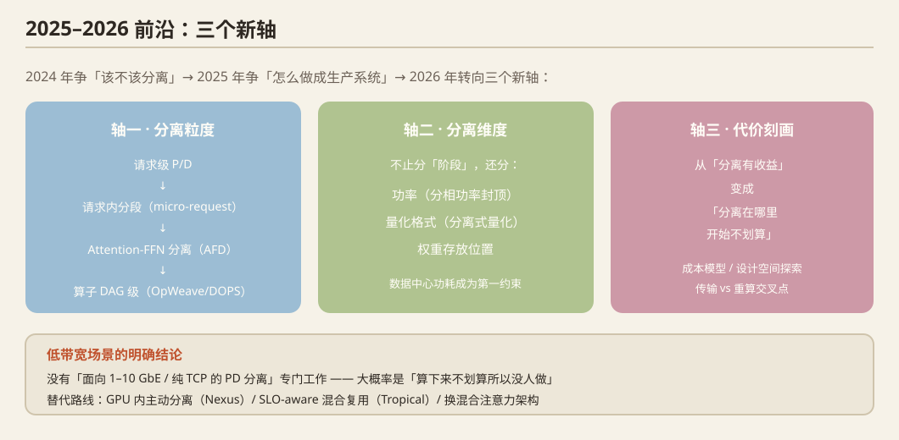

# PD 分离 2025–2026 前沿（增量版）

> 调研日期：2026-09-29 · 定位：**只写增量**——奠基论文逐篇摘要与技术全景见本系列前两篇，本文只补充 2025–2026 新材料，并在 §7 给出**核验状态纠偏**。
> 证据分级：**A** = 一手来源（arXiv abstract / 官方文档页 / 官方会议 accepted 列表）；**B** = 二手（搜索结果摘要、第三方页面）；**C** = 仅标题级线索。
> 所有数字均来自 A 级来源原文；未能验证的一律标注【未能验证】；自行推算标注【自行推算】。

---

## 0. 一句话结论

2024 年争的是「**该不该分离**」（Splitwise/DistServe），2025 年争的是「**怎么把它做成生产系统**」（Mooncake/Dynamo/llm-d + KV-aware 路由），2026 年的前沿已经转向**三个新轴**：
1. **分离粒度**：请求级 P/D → **算子级/层类型级**（Attention-FFN、quadratic/subquadratic attention、PDAF 四段式）；
2. **分离维度**：不止分离「阶段」，还分离**功率**、**量化格式**、**权重存放位置**；
3. **分离的代价刻画**：从「分离有收益」变成「**分离在哪里开始不划算**」的成本模型/设计空间刻画。

---

## 1. 算子级分离的一手细节（AFD / PDAF / SQD）

### 1.1 分离粒度的演进被一篇论文明确写成谱系
[How Far Can Disaggregation Go? A Design-Space Exploration of Attention-FFN Disaggregation for Efficient MoE LLM Serving](https://arxiv.org/abs/2605.28302)（arXiv 2605.28302, 2026）— 证据 **A**

- 原文谱系：`chunked-prefill aggregation → prefill-decode (P/D) disaggregation → operator-level Attention-FFN Disaggregation (AFD)`。
- 核心：MoE 场景下「访存受限的 attention」「计算密集的 expert FFN」「dispatch/combine 通信」三者资源需求完全不同，AFD 把 attention 与 MoE-FFN 放到**不同 GPU 组**。
- 方法：把 on-device kernel 实测 + 高保真网络仿真融合成一个评估框架（避免真机组网）。
- **关键数字**：严格 TTFT/TPOT SLO 下，AFD 在 **DeepSeek-V3.2** 上维持 **~4k tokens/s 系统吞吐**，而**非 AFD 部署在该 SLO 下不可行（infeasible）**。
- 增量：不是「再快一点」，而是给出了 **attention/FFN 该怎么切（按 workload 与模型架构）** 的设计原则。

### 1.2 「按算子类型切」之外的另一条路：按 attention 的数学性质切
[Rethinking Heterogeneous System Disaggregation for Subquadratic Attention](https://arxiv.org/abs/2609.13134)（arXiv 2609.13134, 2026，方案名 **SQD**）— 证据 **A**

- 核心：不按算子类型切，而是**按 quadratic / subquadratic attention 切 decode**：稀疏注意力切成「top-k 选择（需索引全量 KV）」+「top-k attention 与 FFN（静态显存占用）」；线性/滑窗注意力切成「dense attention 层」+「subquadratic attention 层 + FFN」。
- **关键数字（8×B200 异构代理系统）**：tokens/J 相比最强 GPU-only 基线平均提升 **GLM 5.2 +53%、Nemotron 3 Ultra +31%、Gemma 4 31B +56%**。
- **关键数字（Rubin + LPX 解析模型、固定功耗预算）**：可达延迟紧 **1.2×–1.5×**，吞吐最高 **3.6×** 于最强 **attention-FFN 分离**基线。
- 增量：把「分离的对象」从算子换成**算术强度/显存足迹**，说明 2026 年的分离单位正在从「层类型」走向「workload 特征」。

### 1.3 AFD 的「配比怎么定」开始被解析化
[Analytical Provisioning for Attention-FFN Disaggregated LLM Serving under Stochastic Workloads](https://arxiv.org/abs/2601.21351)（arXiv 2601.21351, 2026）— 证据 **A**

- 设定：**rA–1F** 拓扑（r 个 Attention worker : 1 个 FFN worker），随机负载（KV 随请求增长、请求随机补充、跨 worker 同步 barrier 由最慢者决定）。
- 方法：用 **renewal-reward** 刻画每 slot 的稳态 token 负载，找到**单一统计量 θ** 主导 provisioning，并给出闭式 mean-field 最优 A/F 配比规则（分解为 Attention-瓶颈 / 通信-瓶颈 / FFN-瓶颈三种体制）+ 高斯 barrier 修正。
- **关键数字**：trace 校准的 AFD 模拟器上，**预测最优配比与仿真最优相差 <10%**。
- 增量：把 AFD 的 A/F 配比从「调参」变成「可标定的解析式」，这是 2025 年 P:D 比例靠经验/在线反馈（Arrow）之后的方法论升级。

### 1.4 四段式 PDAF 与「分离的收益上界」
[When Does Disaggregation Pay? Simulating Prefill–Decode–Attention–FFN Specialization for Agentic LLM Inference](https://arxiv.org/abs/2608.03741)（arXiv 2608.03741，模拟器 **HeteroPanacea**）— 证据 **A**（已有综述覆盖 HeteroPanacea，此处仅补数字口径）

- **关键数字**：在当前 GPU 上，P/D 分离相对传统 serving **吞吐最高 +75%**；**四段式 PDAF 在不同模型上最稳定**——但前提是**假设存在定制 NPU**（论文自述），属于前瞻性结论而非现有硬件实测。

### 1.5 Attention/FFN 分离在 2025 年就已经有生产级先例
[MegaScale-Infer](https://arxiv.org/abs/2504.02263)（arXiv 2504.02263, 2025）— 证据 **A**

- 核心：**在每一层内**把 attention 与 FFN 拆开，各自独立扩缩容、各自选并行策略；为对抗 MoE 稀疏性引入 **ping-pong pipeline parallelism**（把请求批次切 micro-batch 在 attention 与 FFN 间来回穿梭）；配 M2N 通信库消除 GPU→CPU 拷贝与组初始化开销。
- **关键数字**：每 GPU 吞吐比 SOTA 高 **up to 1.90×**。
- 增量：说明「层/算子级分离」在 MoE 已不是纸面想法，且**通信库**是其成败关键（与 §5 的 NIXL/ARK 同一问题域）。

---

## 2. 功率与能效维度（本次最有增量的部分之一）

### 2.1 Phase-Decoupled, Model-Calibrated Power Control
[Phase-Decoupled, Model-Calibrated Power Control for Disaggregated LLM Serving](https://arxiv.org/abs/2609.11133)（arXiv 2609.11133, 2026-09-10）— 证据 **A**

- 问题：数据中心 GPU **功耗已成为推理容量的binding constraint**，而生产已转向 PD 分离；NVIDIA **Max-Q** profile 在分离式 B200 上「一个设置在两种相反硬件体制的 GPU 上共用」。
- **对 Max-Q 的实测否定（关键数字）**：在分离式 B200 上 Max-Q 收益**仅 +8.6% tokens/J**、且**模型相关**、并带来**平均端到端延迟 +5.2% 的代价**（纯吞吐评测看不到这一代价）。
- 主张：最优功率设置是 **(模型, 量化, 引擎, 硬件) 组合的属性**，不是 GPU 类别的属性；每条 lane 需要自己的 profile；把 SLO 余量换成能量必须**延迟门控标定**。
- 方案：prefill lane 用 **SM-clock 窗口（下界即延迟保证）**；decode lane 用**自动标定把 power cap 放在吞吐/延迟悬崖稍上方**。因为分离式 decode lane 功耗平坦且访存受限，cap **持续生效**，因此 POLCA 当年否定 capping 的「反应式超调」缺陷在 pd 分离下不存在。
- **关键数字（8×B200、Qwen3-Coder-480B FP8、agentic 负载）**：
  - 平衡模式 **+20.4% tokens/J @ 平均 e2e +3.5%**，对比 Max-Q 的 **+8.6% @ +5.2%** → **两轴同时占优（Pareto improvement）**。
  - Qwen3-235B-A22B（NVFP4）：本文所有模式**每次都满足 ITL-p99 SLO**；而**两个厂商 profile 都 miss**。
  - decode 执行器 A/B：标定 cap **优于静态锁频**。
  - **三天持续运行节省一对 lane 电量的 32.3%**。
  - 局限（作者自述）：两个模型都是 MoE；**dense 模型收益约少 5×**，结论 scope 限定在 MoE serving。

### 2.2 能效与「分离不一定赚」的系统性 benchmark
[Revisiting Disaggregated Large Language Model Serving for Performance and Energy Implications](https://arxiv.org/abs/2601.08833)（arXiv 2601.08833；**EuroMLSys@EuroSys 2025**，DOI [10.1145/3805621.3807662](https://doi.org/10.1145/3805621.3807662)；作者 Jiaxi Li, Yue Zhu, Bo Chen, Eun Kyung Lee, Klara Nahrstedt）— 证据 **A**

- **定性结论（原文，无具体百分数进 abstract，故不编数字）**：
  1. **PD 分离的性能收益不是必然的**，取决于 **workload 特征、KV 传输介质、模型规模**；
  2. **KV 传输带宽超过某个阈值后收益递减**（diminishing returns）——这条对低带宽/高带宽选型都关键；
  3. **对 prefill 与 decode GPU 分别独立做 DVFS（stage-wise independent frequency scaling）**能在满足 SLO 前提下进一步省能；
  4. 提出一个 SLO-aware 能效 serving 原型框架与评测方法论。
- 增量：这是**唯一**一篇把「KV 传输路径 × 能耗」做系统对照的论文；它把 2.1 的 power cap 思路的**动机**（阶段独立调节）提前一年讲清楚了。

---

## 3. 低带宽 / 消费级 / 无 NVLink 场景（**最重要，结论偏负面但明确**）

### 3.1 直接结论：**没有**找到任何一篇「面向 1–10 GbE / 纯 TCP / 无 RDMA 无 NVLink 的 PD 分离」专门工作
- 本次检索覆盖：arXiv API 检索（`abs:"low bandwidth" AND abs:"KV cache"` 因 429 限流最终未返回可用结果，属**未完成检索**，非「确认不存在」）、Semantic Scholar、web 搜索。
- 与低带宽最接近的**已核实**成果只有以下几条，**没有一条是 1GbE 场景的实测**：
  1. **[Disaggregated Quantization](https://arxiv.org/abs/2609.26333)**（arXiv 2609.26333, 2026）— 唯一涉及 **llama.cpp** 的 PD 类工作：提出 **ODP（offloaded disaggregated prefill）**把 prefill 权重从 **SSD 流式加载**，在 **27B 模型 8K prompt 下比 weight-only 基线 TTFT 快 1.78×**；另有 NVFP4 prefiller 使 1-bit 精度在 MMLU-Pro **+32.5 分**、MMMU-Pro **+35.3 分**。**注意**：它解决的是「权重搬运/量化」而非「KV 走 1GbE」，但**是消费级（llama.cpp/GGUF）生态里唯一可对齐的增量**。
  2. **[SGLang PD 官方文档](https://docs.sglang.io/docs/advanced_features/pd_disaggregation)**（证据 **A**，实抓）— 传输后端只有 **Mooncake** 与 **NIXL**；Mooncake 提供 **EFA** 与 TCP 路径，但**辅助数据（auxiliary data）仍需走 TCP**（文档原文）；给出了 **TP 不一致时的 GPU staging buffer**：先聚合成连续 buffer 再批量 RDMA，再 scatter 回 decode 侧 KV page，**高并发下比默认 per-token slice 方式吞吐 2–5×**，并与同构 TP 基线相差 **~5% 以内**。→ 这说明**「TP 布局不匹配」本身就是巨大的传输开销来源**，小规模部署尤其容易踩。
  3. **[vLLM NixlConnector 文档](https://docs.vllm.ai/en/v0.15.1/features/nixl_connector_usage/)**（证据 **B**，仅见官方文档 URL 与搜索摘要）— vLLM 的分离式 prefill 主线 KV 传输连接器是 NIXL。
  4. 二手线索（证据 **C**，**未验证**）：有中文技术博客称「vLLM 更推荐 PP 并行，因为压根不需要 RDMA 网络，CPU 上插一张网卡即可」——**该说法未在一手文档中核实，不要直接引用**。

### 3.2 「干脆不要跨网络分离」的替代路线（这才是 2 卡消费级该看的）
- **[Nexus: Proactive Intra-GPU Disaggregation of Prefill and Decode in LLM Serving](https://arxiv.org/abs/2507.06608)**（arXiv 2507.06608, 2025）— 证据 **A**
  - 核心：**GPU 内部**主动切分 prefill/decode 资源（联合考虑算力、显存占用、**显存带宽争用**），不跨网络。
  - **关键数字**：相比 vLLM **吞吐最高 2.2×、TTFT 低 20×、TBT 低 2.5×**；相比 SGLang 最高 **2×**；并且**匹配或超过「分离式 vLLM」**。
  - 对用户的直接意义：**「不做网络分离」也能拿到分离的大部分好处**，且没有 KV 传输成本。
- **[Tropical: Enhancing SLO Attainment in Disaggregated LLM Serving via SLO-Aware Multiplexing](https://arxiv.org/abs/2606.16264)**（arXiv 2606.16264；**DAC 2025**，DOI 10.1109/DAC63849.2025.11132617）— 证据 **A**
  - 核心：把「非分离（低排队、高干扰）」与「分离（低干扰、高排队）」**复用混合**，按 SLO 动态选。
  - **关键数字**：90% SLO 满足度下**请求数最多 2.09×**；对比分离式系统 **P90 TTFT 改善 9×，仅损失 15% P90 TPOT**；对比非分离系统 **P90 TPOT 改善 2.8×，P90 TTFT 持平**。
  - 意义：这是「**PD 分离不是二选一**」的最强实证，也是低带宽场景的直接出路——把需要低 TTFT 的长 prompt 走本地混批，把可容忍排队的走分离。

### 3.3 1GbE 到底有多致命【自行推算】
假设（按公开模型配置手算，非论文数字）：1 GbE 实用吞吐 ~110 MB/s。
| 模型 | KV/token【推算】 | 4K prompt 的 KV 总量 | 1GbE 传输耗时【推算】 |
|---|---|---|---|
| Qwen2.5-7B（28 层 × 4 KV head × 128 dim × fp16） | ~56 KiB | ~224 MiB | **~2.1 s** |
| Llama-3.1-8B（32 层 × 8 KV head × 128 dim × fp16） | ~128 KiB | ~512 MiB | **~4.9 s** |
| Llama-3.1-70B（80 层 × 8 KV head × 128 dim × fp16） | ~320 KiB | ~1.25 GiB | **~12.2 s** |

对照：同一 4K prompt 在消费级 GPU 上做 prefill 本身约数百毫秒量级（8B 模型约 0.4 s 量级，同样为推算）。
→ **结论【自行推算 + 有文献支撑】**：**跨 1GbE 的请求级 PD 分离在当前公开方案下不可行**，KV 传输会主导 TTFT（比 prefill 计算大一个数量级）。2.2 的「超过某带宽阈值后收益递减」反过来说明：**1GbE 处在阈值之下很远的位置**。
→ **可执行的取舍**：
  1. 若两张卡在**同一台机器**：走 PCIe P2P（PCIe 4.0 x16 ≈ 数十 GB/s 量级），**不要走 1GbE 网卡**；此场景下 Nexus（intra-GPU 分离）与 Tropical（混合复用）比 PD 分离更优。
  2. 若必须**跨机器**且只有 1GbE：可做的组合只有「**层/算子级流式传输 + KV 压缩/量化 + 长 prompt**」，且需要 prefill 与 decode 的流水重叠来隐藏延迟；**本次未找到任何已发表的该场景工作 → 这是真实的空白**（与 04 号文档 §4 判断一致）。
  3. Attention/FFN 分离（§1）在此场景反而**更不可行**：它要求**每一步 decode 都通信**（2601.21351 原文「connected by per-step communication」），对 1GbE 的惩罚远大于一次性的 KV 搬运。

---

## 4. 路由与调度

### 4.1 Calibrate, Then Route
[Calibrate, Then Route: A Measured Study of Learned Request Routing for Disaggregated LLM Serving](https://arxiv.org/abs/2609.16206)（arXiv 2609.16206, 2026-09-14；作者 Srikanta Datta Tumkur 等）— 证据 **A**

- 核心：路由器用**精确 prompt 长度 + 预测输出长度 + 准入后 KV 压力 + SLO class**估计每个实例上的额外完成时间；**策略先在离散事件模拟器里开发，再在真机验证**。
- 实验口径：**8×NVIDIA A40**，每卡一个 vLLM engine，**NIXL 在池间传 KV**；所有 workload 跑在**实测饱和点**；3 条混合、突发到达 trace。
- **关键数字**：
  - 平均 goodput **0.864**（本文），对比 round robin / least loaded / length heuristic 的 **0.835–0.847**；**跨 trace 方差最小**；3 条 trace 上都胜过 RR 与 length heuristic，2 条胜过 least loaded，第 3 条落后 **0.003（在 run-to-run 噪声内）**。
  - **硬件标定至关重要**：用「模拟器推导的常数」会损失 **4.5 个 goodput 点**和约 **40% 的尾延迟优势**，把 scorer 退化成「数队列长度」。
  - 收益随 **decode 池规模**与**流量异构性**增长，但在**只有 3 个实例的池里消失**（数队列就够了）。
  - 极端稀缺时，贪心最小化成本会把请求**集中**到最便宜的实例，此时**盲撒（blind spreading）反而更好**。
  - 标定后，该路由器用 **6 张 GPU 达到 round robin 用 7 张 GPU 的 goodput**。
- 增量：把「KV-aware 路由」这类工程说法**第一次做成有对照的测量研究**，并给出「小池子里花哨路由无收益」的边界——**对 2 卡部署是直接的负面证据**。

### 4.2 自适应 P:D 比例（静态切分的反面）
[Arrow: Adaptive Scheduling Mechanisms for Disaggregated LLM Inference Architecture](https://arxiv.org/abs/2505.11916)（arXiv 2505.11916, 2025）— 证据 **A**
- 核心：按实时集群指标动态调整 prefill/decode 实例数，利用实例无状态特性。
- **关键数字**：相比 SOTA PD 分离系统，**请求服务率最高 2.55×**。

---

## 5. KV 传输层与网络（含两处**框架性纠偏**）

- **NIXL**：另补一条 A 级事实：**Calibrate Then Route（2609.16206）在真机实验中就是用 NIXL 在池间传 KV**，说明 NIXL 已是学术实测的默认传输层之一（另一手证据见 [SGLang 文档](https://docs.sglang.io/docs/advanced_features/pd_disaggregation)：NIXL 与 Mooncake 并列为其两个 transfer engine）。
- **Mercury —— 纠偏【重要】**：[SOSP 2025 官方 accepted 列表](https://sigops.org/s/conferences/sosp/2025/accepted.html)（证据 **A**）确认存在 *“Mercury: Unlocking Multi-GPU Operator Optimization for LLMs via Remote Memory Scheduling”*。但它是**「通过远程显存调度做多 GPU 算子优化」**，**不是 KV cache 传输库，也不是网络协议**。把 Mercury 归到「KV 传输层与网络」是**误归类**；它属于算子/编译器方向。
- **ARK —— 确认存在，细节未能验证**：[ACM DL 条目](https://dl.acm.org/doi/abs/10.1145/3789240.3828750)确认 *“ARK: Avoiding Routing Collisions for KV Cache Transfer in Disaggregated LLM Inference”* 发表于 **ACM SIGCOMM 2026**（DOI 10.1145/3789240.3828750）。证据等级 **B**（ACM DL 对本次抓取返回 **HTTP 403**，未能读取 abstract）；**具体机制、拓扑设定与实验数字全部【未能验证】，请勿引用任何 ARK 数字**。
- **「Adaptive Erasure Coding for Fault-Tolerant LLM Serving with Continuous Batching」**：**未能验证**。本次通过 arXiv API 与 Semantic Scholar 检索（`abs:"erasure coding" AND abs:"LLM"`）均未取得该文条目（后者因限流返回空结果）。工作区笔记（`前沿调研2026/01-推理服务与调度.md`、`ai_infra_survey_2026.md`）把它标为 MLSys 2026，属**内部笔记传承，非一手核验**。**同领域可核实的邻近线索**：[GhostServe: A Lightweight Checkpointing System in the Shadow for Fault-Tolerant LLM Serving](https://par.nsf.gov/biblio/10691708)（NSF PAR 条目，证据 **B**，未读全文）。
- **REMIX（MLSys 2026）**：**未能验证**。本次 Semantic Scholar 标题检索因限流返回空；工作区笔记的标题为 *“REMIX: Dynamic Partitioning for Fine-Grained Heterogeneous LLM Serving”*，属**未核验传承**。MLSys 2026 确有论文接收（如第三方院系新闻页与 `26MLSYS-*` 仓库，见 [Paderborn 新闻](https://en.cs.uni-paderborn.de/de/cn/newsfolder/news/paper-accepted-to-mlsys-2026)），但**未覆盖 REMIX**。

---

## 6. 综述类

- **[From Inference Engine to Inference Control Plane](https://arxiv.org/abs/2609.23130)**（arXiv 2609.23130, 2026-09-19, Twinkll Sisodia, 17 页）— 证据 **A**。此前的综述已覆盖基础内容，此处仅补三条**一手细节**：
  1. 作者**明确声明不做新测量**（comment 原文：“No new experimental measurements are claimed; empirical and organization-reported results are attributed to the cited sources”）→ **引用它时必须回溯原始来源，不能把它的转述当一手数字**；
  2. 它提出 **Inference Execution Planner**：选择的不是 endpoint，而是**完整执行计划**（aggregated vs disaggregated 拓扑、KV 来源与传输动作、硬件变体、路由/准入策略、以及更慢的扩缩容决策）；
  3. 产出物包括 **source-local benchmark atlas**、**bottleneck-migration taxonomy**、基于 **SLO-goodput** 的评测框架——可当作 2026 年做 PD 分离 benchmark 的**口径模板**。
- **「From Monolith to Microservices」分布式架构演化综述**：找到真实标题片段 *“A Survey on the Distributed Architecture Evolution of Large Language Model Inference Serving: From Monolith to Microservices and …”*（[作者页 PDF](https://www.minxianxu.info/_files/ugd/f62ed4_c8f3ae507a9a487b8015ed5de8b12074.pdf)，证据 **C**，仅搜索摘要，**arXiv 号与完整标题【未能验证】**，且因该 PDF 未能解析，**内容未读**）。
- **其余 2026 PD 分离论文池（本次新发现、可作为补充检索入口）**：PrefillShare 2602.12029、Disaggregated Quantization 2609.26333、Tropical 2606.16264、Revisiting Disaggregated 2601.08833、AFD 设计空间 2605.28302、SQD 2609.13134、AFD provisioning 2601.21351、HeteroPanacea 2608.03741。

---

## 7. 核验状态纠偏（笔记流传说法 → 一手核验）

| 条目 | 既有的说法 | 本次核验（A 级） | 处置建议 |
|---|---|---|---|
| OpWeave | 2609.14237，算子级分离 | ✅ 真实，标题 *OpWeave: Flexible Operator Disaggregation for Heterogeneous LLM Serving*，2026-09-13。收益 **≤1.78×（同构）/ ≤1.89×（异构）** serving cost 下降 | 数字可用，注意是 **cost 下降**而非吞吐提升 |
| DOPS | MICRO 2026，NPU+PIM **1.20–2.23×** | ⚠️ 存在两个真实条目：[Zenodo: *DOPS: Dynamic OPerator Sorting for Heterogeneous NPU-PIM LLM Inference*](https://zenodo.org/records/21320085)、[arXiv 2607.25498 *Beyond Prefill-Decode Disaggregation: Dissecting LLM Inference for Heterogeneous Platforms via Dynamic Operator Scheduling*](https://ui.adsabs.harvard.edu/abs/2026arXiv260725498Y/abstract)。**MICRO 2026 会场与 1.20–2.23× 两个数字均【未能验证】** | 引用前必须回一手；把「MICRO 2026」降级为待核 |
| Mercury | SOSP 2025（KV 传输/网络方向） | ✅ SOSP 2025 确认；❌ **主题是远程显存调度的多 GPU 算子优化，不是 KV 传输** | 从「KV 传输层」章节移到「算子/编译器」 |
| ARK | SIGCOMM 2026，避免 KV 路由冲突 | ✅ 论文与会场确认；❌ **abstract 与数字未取得（ACM 403）** | 只写存在性与标题，禁止写数字 |
| REMIX | MLSys 2026 | ❌ **未验证** | 标为待核 |
| Adaptive Erasure Coding | MLSys 2026 | ❌ **未验证** | 标为待核 |
| Control-Plane 综述 | 2609.23130 | ✅ 真实；且**作者声明无新测量** | 引用需回溯原始来源 |
| Phase-Decoupled Power | 2609.11133，B200 分相功耗封顶 | ✅ 真实，**全部关键数字见 §2.1** | 可直接用于「功率维度」论证 |
| Calibrate Then Route | 2609.16206 | ✅ 真实，**见 §4.1** | 可直接引用 |
| 能效综述 | — | ✅ 真实：2601.08833，**EuroMLSys@EuroSys 2025** | 注意年份是 **2025**，不要写成 2026 |
| Monolith→Microservices | 综述 | ⚠️ 标题片段确认，**arXiv 号未验证** | 待核 |

---

## 8. 研究重心转移（2024 → 2026）

| 时期 | 核心问题 | 代表证据 |
|---|---|---|
| 2024 | **该不该分离**：分离消除 P/D 干扰，goodput 提升 | DistServe（[2401.09670](https://arxiv.org/abs/2401.09670)，OSDI'24）**7.4× 请求数 / 12.6× 更紧 SLO**；Splitwise（ISCA'24） |
| 2025 | **怎么建成生产系统**：KV 中心架构、控制面、自适应比例、能效可行性 | Mooncake（[2407.00079](https://arxiv.org/abs/2407.00079)，ACM ToS，**+59%~498% 有效请求容量**、A800/H800 上 **+115%/+107%**、日产 **>1000 亿 token**）；Arrow **2.55×**；2601.08833「收益不保证 + 带宽收益递减」 |
| 2026 | **怎么分离得更好**：粒度（AFD/PDAF/SQD）、维度（功率/量化）、**代价模型与边界**、把「是否分离」变成运行时决策 | 2605.28302（AFD **~4k tok/s**，非 AFD infeasible）；2609.13134（**+53%/+31%/+56% tokens/J**）；2609.11133（**+20.4% tokens/J @ +3.5% e2e**）；Tropical（**2.09×** 请求数，**9× P90 TTFT**）；2609.23130（引擎→控制面） |

**分离粒度谱系**：请求级 P/D（DistServe/Splitwise）→ 层内 attention/FFN（MegaScale-Infer, **1.90×**）→ 算子级 ODS/AFD（OpWeave；2605.28302）→ 按数学性质切（SQD：quadratic vs subquadratic）→ 四段式 PDAF（HeteroPanacea，**+75%**，需定制 NPU）。**同时存在反向潮流**：intra-GPU 分离（Nexus，无网络成本）与混合复用（Tropical）——粒度越细，**通信频率越高**，这是 1GbE 场景的致命点。

---

## 9. 开放问题（含本次新识别）

1. **低带宽/消费级/无 NVLink 的 PD 分离**：本次**未找到任何**面向 1GbE/纯 TCP 的专门工作；1GbE 下请求级分离在算术上不可行（§3.3）。**空白仍成立，且是本次检索最扎实的负面结论之一**。
2. **「分离的守卫条件」缺统一口径**：2605.28302 要「何时各层分离才划算」，2601.08833 要「带宽阈值在哪」，2609.23130 要「执行计划选择」——三者尚未收敛成一个可复用的判定框架。
3. **算子级分离的通信代价未进 SLO 模型**：AFD 是 **per-step communication**（2601.21351 原文），现有 SLO/goodput 口径（DistServe 系）基本假设一次性 KV 搬运，**需要新的 goodput 定义**。
4. **小规模/少实例下路由与调度集体失效**：2609.16206 明确「3 实例池里路由收益消失」、「极端稀缺时盲撒更好」；Nexus/Tropical 又说明「不分离」常常更优——**小规模 PD 分离的适用边界缺少系统研究**。
5. **功率 × 分离的耦合**：2609.11133 结论只在 MoE 成立（dense 收益少 ~5×），**dense 模型与消费级功耗域（插座/散热约束）几乎空白**。
6. **容错/纠删码 × 分离**：本次**未能验证**该方向的具体论文（§5），该方向是否已有系统工作存疑，需重新检索确认。
7. **异构 + 混合显存 + PCIe-only P2P** 的真实配置（如 2 张消费卡）仍无人做，与 04 号文档 §4.1 判断一致。

---

## 10. 本次未完成 / 未验证清单（诚实边界）

- 因 **arXiv 官方 API 触发 HTTP 429 限流**，以下检索**未完成**（不等于「不存在」）：`abs:"low bandwidth" AND abs:"KV cache"`、`abs:"erasure coding" AND abs:"LLM"`、`abs:"disaggregated" AND abs:"edge"`、`abs:"KV cache" AND abs:"routing" AND abs:"disaggregated"`、`abs:"fine-grained heterogeneous" AND abs:"LLM serving"`、`ti:"Revisiting Disaggregated"`、`abs:"monolith" AND abs:"microservices"`。
- 因 **Semantic Scholar 标题检索返回空（限流）**：REMIX、Adaptive Erasure Coding、ARK 细节、DOPS 细节、Monolith→Microservices 综述**均未取得一手摘要**。
- 因 **ACM DL 返回 HTTP 403**：ARK（SIGCOMM 2026）abstract 未读取。
- 因 **arXiv 2609.27085** *Crossflow: Prefill-Decode Elasticity for Agentic LLM Serving* 仅出现在搜索摘要中（证据 **C**），**本次未读取**，但值得作为「弹性」方向的下一条线索。
