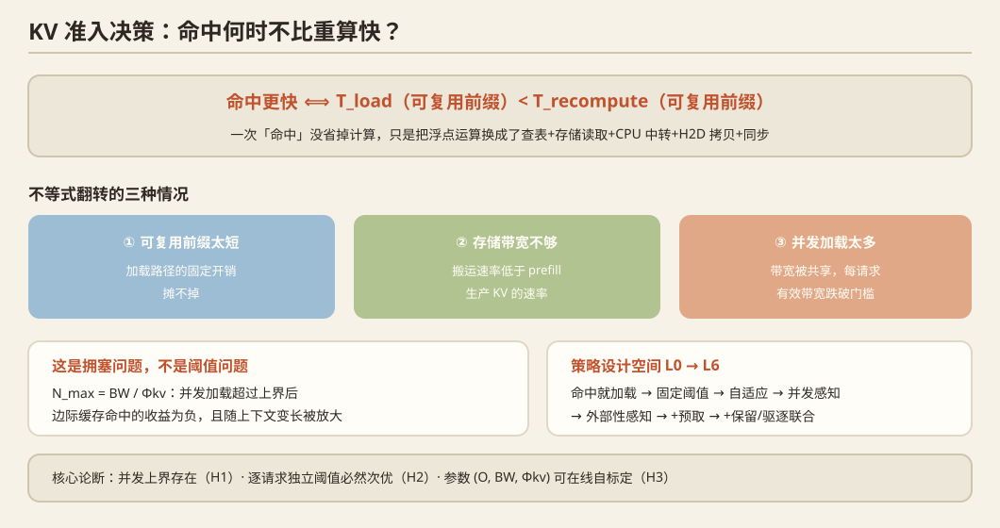

# KV Cache 准入决策：全链路知识讲解

> 撰写日期：2026-09-29
> 目的：把"命中不一定比重算快"这件事从**物理层到策略层**讲透
> 一手材料：py-kvcache 全文、Where Should the KV Cache Live 全文、vLLM/SGLang/llm-d 官方文档
> 配套：一个可运行的解析 break-even 计算器模型
> 标注约定：**【事实】**= 有一手来源；**【推导】**= 我推的，需要你验证；**【待核】**= 未确认

---

## 第 0 章 一句话概览

一次"缓存命中"并没有省掉计算，它只是**把 GPU 上的浮点运算，换成了"查表 + 存储读取 + CPU 中转 + H2D 拷贝 + 同步"这一串操作**。

所以"命中"与"更快"之间隔着一个不等式：

```
命中是否更快  ⟺  T_load(可复用前缀)  <  T_recompute(可复用前缀)
```

这个不等式**不是恒真的**。它在三种情况下会翻转：

1. **可复用前缀太短**——加载路径的固定开销摊不掉；
2. **存储带宽低于 prefill 生产 KV 的速率**——搬运天然比算慢；
3. **并发加载太多**——带宽被共享，每请求有效带宽跌破门槛。

第 3 条是**最重要、也最少被处理的**，它是准入决策问题的立足点。

---

## 第 1 章 物理基础：KV cache 到底是什么、为什么存在

### 1.1 为什么需要 KV cache

自回归生成第 t 个 token 时，注意力需要 attend 到前面 t−1 个位置的 Key 和 Value。若不做缓存，每生成一个 token 都要把整个前缀重算一遍，代价 O(t) 每步、O(T²) 每序列。

KV cache 的做法：**把每层每个已处理 token 的 K/V 向量存下来**，生成新 token 时只算新 token 的 K/V，与历史拼起来。

代价从 O(T²) 降到 O(T)（每步），但需要 O(T) 的**显存**。

### 1.2 KV cache 有多大（这是后面一切的关键量）

**【事实/公式】** 对层数 `L`、KV 头数 `H_kv`、头维度 `d`、精度 `b` 字节：

```
KV 字节/token = 2 × L × H_kv × d × b
                ↑
             K 和 V 各一份
```

注意一个**极易混淆的点**：**KV 大小由 `H_kv`（KV 头数）决定，不由 `H_q`（Q 头数）决定。** 这正是 GQA/MQA 的整个意义——用少量 KV 头服务多个 Q 头。

**【事实】** 实际数字（BF16，2 字节）：

| 模型 | 层数 | KV 头 | 头维 | KV/token | 128K 上下文的 KV |
|---|---|---|---|---|---|
| Qwen2.5-0.5B | 24 | 2 | 64 | 12 KiB | 1.5 GiB |
| Qwen2.5-1.5B | 28 | 2 | 128 | 28 KiB | 3.5 GiB |
| Qwen2.5-3B | 36 | 2 | 128 | 36 KiB | 4.5 GiB |
| **Qwen2.5-7B** | 28 | 4 | 128 | **56 KiB** | **7.0 GiB** |
| **Qwen2.5-14B** | 48 | 8 | 128 | **192 KiB** | **24 GiB** |
| **Qwen2.5-32B** | 64 | 8 | 128 | **256 KiB** | **32 GiB** |
| Llama-3.2-3B | 28 | 8 | 128 | 112 KiB | 14 GiB |

**这张表有两个直接后果：**

1. **32K 上下文下，14B 模型的 KV 就是 6 GiB**——在一张 32GB 的 5090 D 上，权重（FP8 约 15GB）加 KV，并发能力极其有限。
2. **长上下文时 KV 会超过权重成为显存第一消耗者**。**【事实】** 2609.16215 原文："For a single long context the cache already rivals the model weights."

→ 这就是为什么会有"把 KV 放到 CPU/SSD"这条技术路线。

### 1.3 谁在生产 KV、谁在消费 KV

- **Prefill 阶段**：并行处理 D 个输入 token，**生产** D 个位置的 KV。算力密集。
- **Decode 阶段**：每步生成 1 个 token，**读取**全部历史 KV。访存密集。

**关键：一个 token 的 KV，在生产端只被算一次，在消费端每步都被读一次。** 所以"把 KV 搬到别处"的收益，取决于它能被复用（读）多少次。

---

## 第 2 章 全链路：一次请求从到达到出 token，KV 经历的每一层

这是你要的"全链路"。我按**时间顺序**拆，每一步都标出**成本属于加载路径还是计算路径**。

### 2.1 阶段 A：请求到达与前缀匹配（决定"有没有命中"）

```
用户请求 → tokenize → 计算 block 哈希 → 前缀树查找 → 得到"匹配前缀长度 m"
```

**【事实】** 现代引擎的实现方式：

- **vLLM / PagedAttention**：KV 按固定大小的 **block**（常见 16 或 256 token）管理，每个 block 有哈希。前缀缓存 = 按 block 哈希查表。
- **SGLang / RadixAttention**：用**基数树（radix tree）** 组织前缀，支持任意长度前缀的共享与匹配——比 block 哈希更细粒度。
- **llm-d / LMCache / vLLM KV Offload**：通过 **KV Connector API** 把"块存储"扩展到文件系统、远端等。

**这一步的成本**：哈希计算 + 树查找，通常亚毫秒到几毫秒级。**属于加载路径的固定开销 O 的一部分。**

**输出**：`m` = 可复用前缀长度（tokens）。**这是后面决策的核心输入。**

> ⚠️ **一个容易被忽略的细节**：block 粒度会浪费匹配。**【事实】** py-kvcache 提到"partially matching block must still be recomputed"——如果块大小是 256 token，而实际只匹配了 200 token，那这 200 token 的 KV **不能用**，必须整体重算。所以有效 `m` 是**向下取整到块边界**的。这在小前缀场景里会显著抬高 L\*。

### 2.2 阶段 B：准入决策（← 本文主角）

```
给定 m（可复用前缀长度）、当前负载、当前带宽争用状态
决策：  (1) 加载这 m 个 token 的 KV？
       (2) 放弃缓存，直接重算？
       (3) 先推迟，做投机预取（preload）？
       (4) 部分加载（只加载前 m' < m 个 token）？
```

**【事实】** 现有系统的默认策略是：**命中就加载**。py-kvcache 的原文批评很直接：

> "they provide mechanisms for storing and retrieving KV blocks from larger tiers, but pair them with **a fixed policy that treats every prefix hit as a win**. What is missing is a policy that decides when a lookup pays for itself."

**这就是准入决策的问题定义。**

### 2.3 阶段 C1：加载路径的完整成本栈（命中时）

如果决策是"加载"，实际发生的是：

| # | 操作 | 成本性质 | 量级（待实测） |
|---|---|---|---|
| 1 | 查表/确认匹配块 | 固定开销 | <1 ms |
| 2 | **分配 GPU block**（可能需驱逐换出） | 固定开销 + 可能触发额外写 | 1–10 ms |
| 3 | **分配 CPU staging buffer**（锁页内存） | 固定开销 | 1–5 ms |
| 4 | **发起存储读取**（io_uring / pread / direct I/O） | **随数据量线性** | 取决于盘 |
| 5 | **磁盘 → CPU DRAM 写入** | 同上（与 4 重叠） | — |
| 6 | **CPU → GPU 拷贝（H2D）** | **随数据量线性** | PCIe 带宽 |
| 7 | 同步 / 事件等待 | 固定开销 | 1–10 ms |
| 8 | 更新 block table，跳到 token m+1 继续 prefill | 固定开销 | <1 ms |

**关键观察**：成本 = **固定项 O + 线性项 L·k/BW**。固定项 O 是**第 1–3、7、8 步之和**，它与前缀长度无关。

**【事实】** py-kvcache 显式建模了这个结构（其式子的形式）：
```
max_io(D) = f(D) − (g(D) − t_copy(D))
```
其中 `f(D)` 是重算 D token 的时间，`g(D)` 是命中路径的 TTFT，`t_copy` 是搬运时间。`g(D) − t_copy(D)` 就是**非搬运部分**——即固定开销 O 的实测代理。

**【事实】** 他们实测到 O 的量级不小：Llama-3.2-3B 在 1k token 时，要求存储达到 **23.2 GB/s** 才能打平；而同模型在 80k token 时只要求 **3.5 GB/s**。用我的模型反推：1k 时 KV 只有 117 MB，23.2 GB/s 意味着**时间预算只有 5 ms**——即非搬运开销吃掉了绝大部分预算。

### 2.4 阶段 C2：重算路径的完整成本（放弃缓存时）

```
直接对全部 D 个 token 做 prefill（m 个被跳过的部分不省）
成本 = FLOPs 总量 / 有效算力
```

**【推导】** prefill 的 FLOPs 有两项：

```
FLOPs(D) ≈ 2·N·D          （权重项，线性：N = 参数量）
         + c_attn·D²       （注意力项，二次）
其中 c_attn ≈ 2·L·H_q·d_head（因果注意力约再乘 0.5）
```

**这两项的比值决定了 prefill 成本随长度的增长方式，而这会显著改变 break-even 的形状。** 见 2.5。

### 2.5 关键：prefill 成本是"超线性"还是"线性"？

**【推导】** 对 Qwen2.5-7B（28 层，28 Q 头，d=128）：

| 上下文 D | 权重项 FLOPs | 注意力项 FLOPs | 注意力占比 |
|---|---|---|---|
| 8K | 1.22e14 | 6.4e12 | **5%** |
| 32K | 4.86e14 | 1.0e14 | **17%** |
| 128K | 1.95e15 | 1.7e15 | **47%** |

**结论：8B 级别以上的模型在 32K 以内，prefill 基本是线性的；到 128K 时注意力项才接近一半。**

**这个结论很重要**，因为它决定了两件事：

- **若 prefill 近似线性** → `Φkv = k·r` 近似是常数 → break-even 带宽**与上下文长度无关**。
- **若 prefill 超线性**（小模型、超长上下文）→ 重算变得更贵 → **长上下文下加载更容易赢**。

→ **这直接挑战"长上下文下命中更容易失效"的直觉。** 见第 4 章。

---

## 第 3 章 核心不等式：命中何时不快？

### 3.1 单请求的解析模型

**【推导】** 设：
- `L` = 可复用前缀长度（tokens）
- `k` = KV 字节/token
- `BW` = **该请求实际获得**的搬运带宽（B/s）
- `r` = prefill 吞吐（tokens/s）
- `O` = 加载路径固定开销（s）

两条路径处理**同样那 L 个 token**：

```
加载:   T_load(L)   = O + L·k/BW
重算:   T_recomp(L) = L/r
```

令两者相等，解出 **break-even 前缀长度**：

```
        O            O · r · BW
L* = ──────────  = ──────────────
     1/r − k/BW      BW − k·r
```

**由此得到两个互相独立的条件：**

```
条件 1（带宽条件）:  BW > k·r  ≡  BW > Φkv
   否则分母为负 → 无论前缀多长，加载永远不可能赢。

条件 2（长度条件）:  L > L*
   即使带宽够快，前缀太短则固定开销 O 摊不掉，加载仍然更慢。
```

**`Φkv ≡ k·r` 的物理含义：prefill 生产 KV 的速率。** 存储只要比它快，搬运就不会是根本瓶颈。

> 这个 `Φkv` 与我在 PD 分离报告里从 PrfaaS（[2604.15039](https://arxiv.org/abs/2604.15039)）引来的量是**同一个东西**——只是那里的"对端"是另一台机器，这里的"对端"是 SSD/DRAM。**同一个物理量统治了两类问题**，这是我认为很漂亮的一点。

### 3.2 代入实际数字算一遍

**【推导】** 代入 RTX 5090（BF16 dense 2.09e14 FLOPS，MFU 50%）算：

| 模型 | KV/token | prefill (tok/s) | **Φkv** | Φkv (Gbps) |
|---|---|---|---|---|
| Qwen2.5-0.5B | 12 KiB | 106,633 | **1.31 GB/s** | 10.5 |
| Qwen2.5-1.5B | 28 KiB | 33,929 | **0.97 GB/s** | 7.8 |
| Qwen2.5-3B | 36 KiB | 16,909 | **0.62 GB/s** | 5.0 |
| **Qwen2.5-7B** | 56 KiB | 6,857 | **0.39 GB/s** | 3.2 |
| **Qwen2.5-14B** | 192 KiB | 3,554 | **0.70 GB/s** | 5.6 |
| **Qwen2.5-32B** | 256 KiB | 1,608 | **0.42 GB/s** | 3.4 |
| Llama-3.2-3B | 112 KiB | 16,277 | **1.87 GB/s** | 14.9 |

**Break-even 前缀长度 L\*（O = 20 ms）：**

| 模型 | 3.5 GB/s 盘 | 7 GB/s 盘 | 12 GB/s 盘 | 1 GB/s 盘 |
|---|---|---|---|---|
| Qwen2.5-0.5B | 3,409 | 2,624 | 2,394 | ∞ 不可行 |
| Qwen2.5-7B | 154 | 145 | 142 | 226 |
| Qwen2.5-14B | 89 | 79 | 75 | 236 |
| Qwen2.5-32B | 37 | 34 | 33 | 56 |
| Llama-3.2-3B | 698 | 444 | 386 | ∞ 不可行 |

**三个重要读法：**

1. **模型越大，L\* 越小**（32B 只要 33–56 token）。因为大模型 prefill 慢，重算很贵，所以加载容易赢。
2. **小模型 + 快 GPU 时 L\* 很大**（0.5B 要 2,400–3,400 token）。因为重算太快了。
3. **Φkv 的量级（0.4–1.9 GB/s）远低于现代 NVMe（3–12 GB/s）**——所以**单请求下，命中几乎总是赢**。

> **这修正了你题目的一个隐患**：如果只讲"单请求命中可能比重算慢"，那在 7B–32B 模型 + 现代 NVMe 上**结论是不成立的**（除非前缀短到几十个 token，而那被 block 粒度吃掉了）。
>
> **真正的失效区在并发。** 见下一节。

### 3.3 ★ 并发：真正让"命中变慢"的机制

**【推导】** 关键洞察：**`BW` 不是请求私有的，它是被并发加载共享的。**

若同时有 N 个请求在加载，且公平共享，则每请求有效带宽退化为 `BW/N`：

```
条件 1':  BW/N > Φkv        →        N < N_max ≡ BW / Φkv
条件 2':  L* 随 N 增大而增大：L*(N) = O / (1/r − N·k/BW)
```

**`N_max = BW / Φkv` —— 可同时获利的加载请求数上界。超过它，加载严格劣于重算，不论前缀多长。**

**【推导】** 对 Qwen2.5-7B：

| 总带宽 | N_max（可并发获利的加载数） |
|---|---|
| 3.5 GB/s | **8.9** |
| 7 GB/s | **17.8** |
| 12 GB/s | **30.5** |
| 1 GB/s（慢盘/随机读） | **2.5** |

**并发退化曲线（Qwen2.5-7B，5 GB/s 盘，O = 20 ms）：**

| 并发加载数 N | 每请求有效 BW | L\* | 占 8K 文档比例 |
|---|---|---|---|
| 1 | 5.00 GB/s | 149 | 1.8% |
| 2 | 2.50 GB/s | 163 | 2.0% |
| 4 | 1.25 GB/s | 200 | 2.4% |
| 6 | 0.83 GB/s | 260 | 3.2% |
| 8 | 0.62 GB/s | 370 | 4.5% |
| 12 | 0.42 GB/s | **2,436** | **29.7%** |
| **13** | 0.38 GB/s | **∞** | **必须改走重算** |

**这张表就是核心证据。** 它说明：

> **"命中"与"获利"之间有一条由 (O, BW, Φkv) 决定的边界，而这条边界本身是并发数 N 的函数。**
> 单个请求的命中总是划算；**一群请求同时命中时，边际那一发命中就是负收益。**

### 3.4 为什么这是一个"拥塞"问题而不是"阈值"问题

**【推导】** 更严格的建模：加载请求 i 不仅消耗带宽，还**延长了所有其他加载请求的时间**（负外部性）。

设总带宽 W，N 个并发加载，请求 j 的加载时间：
```
T_load,j = O + (L_j·k) · N / W        （公平共享下）
```
请求 i 加入后，请求 j 的增量延迟：
```
ΔT_j = L_j·k / W      （每多一个加载者，所有其他人的搬运时间 +L_j·k/W）
```
**请求 i 的"社会成本" = 它自己的延迟 + 它对所有其他人的延迟增量。**

```
社会成本(i) = O + L_i·k·N/W  +  Σ_{j≠i} L_j·k/W
            = O + k/W · (N·L_i + Σ_{j≠i} L_j)
```

**这说明一个关键的策略含义：**

> **准入决策不该只看"我这个请求命中多少"，还要看"我的加载会拖慢其他命中多少"。**
> 在带宽紧张时，正确的做法是**按"每字节节省的计算时间"排序，优先放行性价比最高的请求**——这是一个**背包/优先队列问题，不是一个阈值问题**。

**【事实】** py-kvcache 自己把这条列为 future work，原文：
> "Preload selection could similarly move beyond a single request, to **a small priority queue governed by explicit memory and I/O budgets**."
> "A dynamic serving engine could **continuously estimate prefill time, tier bandwidth, queue delay, and promotion success**, then update store, load, and defer decisions as the workload changes."

**这是它主动交出来的缺口。**

---

## 第 4 章 长上下文这个设定：它到底特殊在哪

**这里有一个关于"面向长上下文"的反直觉结论，必须讲清楚**。

### 4.1 反直觉事实：长上下文让**单个**命中更容易获利

**【事实】** py-kvcache 实测（Llama-3.2-3B）：**8k prompt 需要 77.8% 的前缀复用才能打平；而 80k 时只需 7.8%。** 要求带宽从 1k 时的 23.2 GB/s 降到 80k 时的 3.5 GB/s。

**原因**：加载路径的固定开销 O 是**常数**，而重算成本 `f(D)` 随 D 增长。所以 D 越大，O 被摊得越薄，加载越容易赢。

→ **"长上下文下命中更可能失效"这个直觉是错的**（至少对单请求）。

### 4.2 但长上下文让**并发**失效更容易发生

**【推导】** 长上下文通过三条路径**放大**并发失效：

1. **每个加载的字节量 ∝ D**。N 个并发加载的总需求 ∝ N·D。所以达到带宽饱和所需的 N 随 D 线性下降——**上下文越长，越少并发就能打爆存储**。
   - 7B @ 8K：单请求 KV 470 MB；5 GB/s 盘上一个加载要 94 ms
   - 7B @ 128K：单请求 KV 7.0 GB；一个加载要 1.4 s，**两个并发就超预算**

2. **显存压力 ∝ D** → 驱逐率上升 → 重载次数上升 → 有效加载流量上升。KV 越大，GPU 越装不下，被驱逐再重载的循环越频繁。

3. **固定开销被摊薄的"红利"被并发吃掉**：4.1 的红利前提是 `BW` 足够。一旦 `BW/N < Φkv`，红利消失，且 L\* 会从几十 token 暴涨到数千。

**【事实】** 2609.16215 的负结果从另一个角度印证："at batch one decode is compute-bound, so the placement policy barely moves throughput; what it moves is PCIe migration traffic and TTFT." —— **单请求时策略几乎不影响吞吐，它影响的是搬运流量和 TTFT。** 而一旦并发起来，搬运流量本身变成瓶颈。

### 4.3 所以"长上下文"的正确论述方式

**❌ 不要写**："长上下文下 KV 很大，所以加载很慢，往往不如重算。"（会被 4.1 的数据打脸）

**✅ 应该写**："长上下文使每条 KV 搬运的字节量线性增长，因此在固定存储带宽下，**能同时获利的并发加载数按 1/D 下降**。长上下文把'单请求的带宽问题'转化为'多请求的带宽分配问题'——而这正是现有系统没有处理的。"

---

## 第 5 章 现有系统做了什么、缺什么

### 5.1 存储/传输机制：已基本解决

**【事实】** 机制层已经很成熟：

| 系统 | 层级 | 做什么 |
|---|---|---|
| **PagedAttention**（vLLM） | GPU | 分页管理 KV，消除碎片 |
| **RadixAttention**（SGLang） | GPU | 基数树前缀共享 |
| **LMCache** | GPU/DRAM/disk | 跨层 KV 存储与复用 |
| **vLLM KV Offload connector** | GPU/DRAM/disk | 官方卸载接口 |
| **Mooncake** | HBM/DRAM/SSD | KVCache-centric 池化（分布式） |
| **AttentionStore** | DRAM-SSD | 多轮会话的 KV 持久化 |
| **Cache-dAttention** | DRAM | 层粒度预加载 + 异步保存 |
| **HyMCache** | CXL 混合内存 | 设备侧 DRAM 预置 |
| **FlexGen / InfiniGen** | CPU/SSD | 权重与 KV 卸载、预测式预取 |

**【事实】** 2609.16215 的判断最简洁：**"The mechanism is largely solved; the hard part is the policy."**

### 5.2 策略层：三个已占位者

| 工作 | 决策对象 | 粒度/方式 | 关键数字 |
|---|---|---|---|
| **py-kvcache**（[2609.11744](https://arxiv.org/abs/2609.11744)，VU Amsterdam + IBM Zurich） | **要不要加载**（load vs recompute） | 请求级，**离线实测的 break-even 阈值**（生成"a small file holding the break-even prefix"） | 8k 需 77.8% 前缀复用；80k 只需 7.8%；Bailian trace 在 H100 上**平均请求低于 break-even，外存缓存相比纯 GPU 前缀缓存无收益** |
| **Bidaw**（**FAST '26**，清华 + 中国地质大学 + 中国电信，[USENIX](https://www.usenix.org/conference/fast26/presentation/hu-shipeng)） | **保留什么 + 请求执行顺序** | 双层存储（host memory + SSD）；**双队列分离**（ready / preparing）+ **按 KV 大小重排序**；用 LM 生成的回复预测用户访问模式来改进淘汰 | 现有方案从双层加载 KV 使延迟 **最高 3.8×**、吞吐 **最高降 2.0×**（对比"全部驻留内存"的理想）；Bidaw 降延迟最高 **3.58×**、吞吐最高 **1.83×**。**关键：Bidaw 不拒绝加载、不选择重算**——它只重排序（"only reorders requests... which does not affect LM response accuracy"） |
| **Where Should the KV Cache Live?**（[2609.16215](https://arxiv.org/abs/2609.16215)，Vizuara） | **放哪一层**（placement） | 仿真，recency / reuse-frequency / predicted-reuse + prefetch | 四条负结果：73× 增益是容量倍数而非策略效果；batch=1 时策略几乎不影响吞吐；predicted-reuse **逐字节等于 recency**；**prefetch 付不起自己的带宽**（"连能读未来的 oracle 都没赢过 no-prefetch"） |

**【事实】** py-kvcache 原文对 Bidaw 的定位很清晰：
> "**Bidaw selects what to keep, while py-kvcache decides whether a load already matched in the cache is worth placing on the critical path** against the cost of recomputing the same prefix."

### 5.3 缺口清单（py-kvcache 自己列的 future work，即它承认没做的）

**【事实】** 原文 future work 逐条：

1. **"A dynamic serving engine could continuously estimate prefill time, tier bandwidth, queue delay, and promotion success, then update store, load, and defer decisions as the workload changes."** ← **在线、动态、联合决策**
2. **"Preload selection could similarly move beyond a single request, to a small priority queue governed by explicit memory and I/O budgets."** ← **多请求、带预算的预取准入**
3. "The lookahead signal could also be pushed below the serving engine." ← 信号下沉到存储层
4. "combining external caching with KV quantization or compression" ← 与压缩联合
5. "testing remote and distributed filesystems"
6. "evaluating multi node, multi GPU and small cluster configurations to test cache sharing under failures and **contention**"
7. "A broader evaluation should include **tail TTFT**, throughput, **fairness**, energy, and cost"

**【事实】** 它的结论句把总目标写得很明确：
> "Together, these extensions would turn the central result of this work into **a general policy determining when and how KV data moves or whether it should move at all**."

### 5.4 py-kvcache 的实测局限（即空白点）

**【事实】** 它自述的 limitations：

- 只覆盖 **2 类硬件**、少量模型
- **只用 FP16 KV**、只生成 1 个输出 token（为隔离 prefill 与搬运）
- **只用单一 block size = 256 token**
- **所有测量都走 CPU 中转的 I/O 路径**（承认"dramatically change our conclusions"的替代路径存在）
- **不做 networked/RAID 配置**
- **不做 multi-GPU**
- **没有多节点**

→ **"只用一种 block size"和"不做 multi-GPU"正是缺口所在**：多机/多卡上的"缓存共享 + 争用"实验目前缺失。

---

## 第 6 章 参数测量清单（动手前需要先测什么）

**【推导】** 模型的四个参数各有独立的测量方法，**这是把模型做成"可标定、可移植"的关键**：

| 参数 | 含义 | 怎么测 | 难点 |
|---|---|---|---|
| `k` | KV 字节/token | 从模型 config 直接算（第 1.2 节公式） | 无（但要确认 dtype 与 block size 对齐后的**有效**值） |
| `r` | prefill 吞吐 (tok/s) | 空载下扫上下文长度测 prefill 时间 | **随 batch、随长度变化**；长上下文有二次项 |
| `BW` | 有效搬运带宽 | 单独测：固定大小 KV 从盘到 GPU 的端到端时间斜率 | **随并发、随块大小、随 page cache 状态变化**；顺序 vs 随机差别大 |
| `O` | 加载路径固定开销 | 外推到 L→0 的截距 | 难分离：要区分查表/分配/同步各自多少 |

**测量陷阱（必须避开）：**

1. **page cache**：如果文件被内核缓存了，你测的是 DRAM 不是 SSD。**【事实】** py-kvcache 明确为此用了 **direct I/O**（"the tests were run on our fork with direct I/O support to avoid page-cache effects"）。
2. **块大小**：256 token 的块 vs 16 token 的块，顺序性与元数据开销完全不同。**【事实】** py-kvcache 承认只测了 256。
3. **并发干扰**：要测"每请求有效带宽"，必须在 N 个并发下测，而不是单请求带宽除以 N。真实存储的公平性不是理想的。
4. **首次 vs 稳态**：io_uring 队列深度、文件描述符缓存、GPU 内存池都会有冷启动效应。

---

## 第 7 章 策略设计空间（从最简单到最强）

**【推导 + 事实混合】** 把可能的策略按能力排开：

| 级别 | 策略 | 输入 | 缺点 |
|---|---|---|---|
| L0 | 命中就加载 | 无 | 现有默认；在并发下会退化 |
| L1 | 固定阈值：L > L*_static 就加载 | 离线标定的 L* | **py-kvcache 已做**；阈值是常数，不随并发变化 |
| L2 | 单请求自适应阈值 | 在线估计 O, BW, r | 仍假设 BW 是请求私有的 |
| **L3** | **并发感知阈值**：`L > L*(N)`，N = 当前在飞加载数 | N 可观测 | 只看自己，忽略外部性 |
| **L4** | **外部性感知准入**：按"每字节节省的计算时间"排序，在 I/O 预算下选子集 | 所有等待请求的 (L_i, 优先级) | 需要全局视野 + 预算管理，实现复杂 |
| L5 | L4 + **投机预取 + 可中止**：对可能被准入的请求提早读，发现争用就中止 | 调度队列 + 争用信号 | 预取本身消耗带宽（负结果警告！见 5.2） |
| L6 | L4 + **与保留/驱逐联合**：准入与"该不该留"耦合 | 全局 KV 生命周期 | 最完整也最难 |

**⚠️ 一个必须正视的负结果**：**【事实】** 2609.16215 发现"prefetch as recommended does not pay for its bandwidth: across a policy × cache-size grid, even a future-reading oracle beats no-prefetch in none of the cells."

**这把 L5 的投机预取置于风险中。** 但注意它的限定条件：那是**仿真**研究，且是"as recommended / as implemented"的特定预取策略。**【推导】** 我认为预取的结论高度依赖于：(a) 预取与需求是否竞争同一条路径（若存储带宽空闲则预取近乎免费）；(b) 预取命中率（预取错了就是纯浪费）。**这两点都可以设计实验来分辨——这本身就是一个值得做的消融。**

---

## 第 8 章 核心结论小结

**【推导】** 综合全部材料，可以把这套知识收束成三个可检验的论断：

> **H1（并发条件）**：在共享存储/PCIe 路径上，存在一个由 `N_max = BW/Φkv` 决定的并发加载上界；超过它之后，**边际缓存命中的收益为负**，且负收益的幅度随上下文长度增长而放大（因为每次加载的字节量 ∝ D）。
>
> **H2（外部性）**：加载请求之间存在显著的负外部性（一个请求的加载延长其他加载请求的时间）；因此**逐请求独立的阈值策略必然次优**，而按"单位字节节省的计算时间"排序的准入能显著降低均值与尾 TTFT。
>
> **H3（可标定）**：`(O, BW, Φkv)` 三个参数可以在线自标定，且基于它们的策略能跨 (模型, GPU, 存储) 迁移——**不需要像 py-kvcache 那样每套配置做一次离线扫描**。

**H1 和 H2 是这套知识的学术内核；H3 是让它具备"一般性"的工程内核。**

---

## 第 9 章 未决问题

1. `N_max = BW/Φkv` 的公平共享假设在真实 NVMe 上成立吗？（NVMe 有多队列，可能不按请求数均分）
2. 在多机部署中，"共享存储路径"是网络盘还是本地 NVMe？这决定实验设计。
3. 预取到底划不划算？（需要消融，与 2609.16215 的负结果正面对话）
4. block size 对有效 `m` 的截断损失有多大？（可能显著抬高 L\*）
5. CPU 中转路径 vs GPUDirect Storage：**【事实】** py-kvcache 承认前者"dramatically change our conclusions"（引用 [20,26]）——**如果 GPUDirect Storage 可用，O 和 BW 都会变，整个边界会移动**。这是必须做的一个对照。

---

## 附：本讲解引用的关键一手来源

- **py-kvcache**（[arXiv:2609.11744](https://arxiv.org/abs/2609.11744)）｜VU Amsterdam + IBM Research Zurich
- **Where Should the KV Cache Live?**（[arXiv:2609.16215](https://arxiv.org/abs/2609.16215)）｜Vizuara
- **PrfaaS（Φkv 的来源）**：[arXiv:2604.15039](https://arxiv.org/abs/2604.15039)｜Moonshot AI + 清华
- 另见本系列的[KV Cache 管理](/notes/infra-survey-02-kvcache/)与[PD 分离全景](/notes/infra-survey-13-pd-panorama/)。
