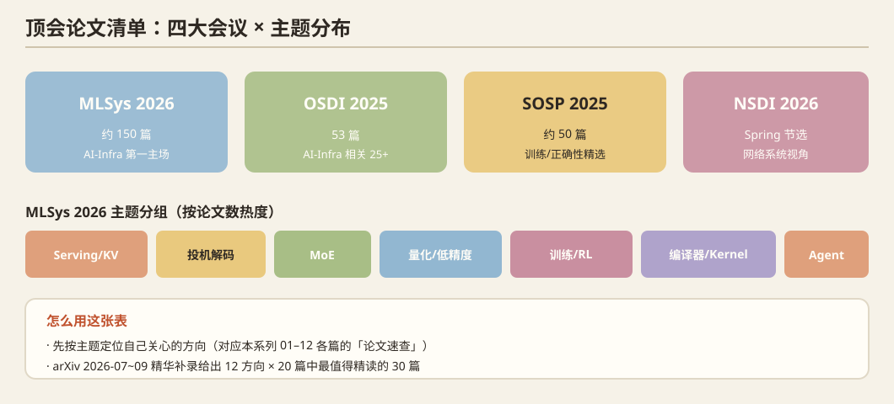

# 顶会论文清单（MLSys 2026 / OSDI 2025 / SOSP 2025 / NSDI 2026）

## 一、MLSys 2026（约 150 篇，AI-Infra 第一主场）

### 推理 Serving / 调度 / KV
- Meeting SLOs, Slashing Hours: Automated Enterprise LLM Optimization with OptiKIT
- From Tokens to Layers: Redefining Stall-Free Scheduling for MoE Serving with Layered Prefill
- Breaking the Ice: Analyzing Cold Start Latency in vLLM
- ProfInfer: An eBPF-based Fine-Grained LLM Inference Profiler
- DriftBench: Measuring and Predicting Infrastructure Drift in LLM Serving Systems
- Token-level 多租户公平/隔离类：Adaptive Erasure Coding for Fault-Tolerant LLM Serving with Continuous Batching
- ContextPilot: Fast Long-Context Inference via Context Reuse
- HiServe: A Prefix Cache Serving System for Hybrid LLMs
- ForeCache: Understanding Workloads and Optimizing KVCache Management for Efficiently Serving LLM Coding Agents
- AgenticCache: Cache-Driven Asynchronous Agent（agent serving 系列）
- NeSyKV: Neuro-Symbolic Architecture-Specific KV-Cache Eviction for LLM Inference
- SHIP: SRAM-Based Huge Inference Pipelines for Fast LLM Serving
- REMIX: Dynamic Partitioning for Fine-Grained Heterogeneous LLM Serving
- On the Diminishing Returns of Expert Load Balancing in MoE LLM Serving
- Demystifying the Mixture of Experts Serving Tax
- Efficient, VRAM-Constrained xLM Inference on Clients
- Impact of Scheduling for Terminal Agent Workloads on Unified-Memory Workstations
- SD-HC: Heterogeneous Functional Pipelining for Speculative LLM Decoding on AI PCs
- Locality-Aware Beam Scheduling for Efficient Test-Time Compute with a Consumer-grade GPU
- HADIS: Hybrid Adaptive Diffusion Model Serving for Efficient Text-to-Image Generation

### 投机解码
- Accelerating Large-Scale Reasoning Model Inference with Sparse Self-Speculative Decoding
- Accelerating LLM Inference: Self-Speculative Decoding via Learned Seed Injection
- HiSpec: Hierarchical Speculative Decoding for LLMs
- Cascade: Utility-Driven Speculative Decoding for Mixture-of-Experts
- Beat the long tail: Distribution-Aware Speculative Decoding for RL Training
- ReSpec: Towards Optimizing Speculative Decoding in Reinforcement Learning Systems

### MoE
- MoEBlaze: Breaking the Memory Wall for Efficient MoE Training on Modern GPUs
- FP8-Flow-MoE: A Casting-Free FP8 Recipe without Double Quantization Error
- CRAFT: Fine-Grained Cost-Aware Expert Replication For Efficient Mixture-of-Experts Serving
- LYNX: Workload-Agnostic Expert Remapping for Efficient MoE Inference
- BLAZE: Bias-Driven Load-Aware Zero-Overhead Expert Routing
- Shortcut-connected Expert Parallelism for Accelerating Mixture of Experts

### 量化/低精度/稀疏
- IntAttention: A Fully Integer Attention Pipeline for Efficient Edge Inference
- Practical Unstructured Sparsity for Efficient LLM Inference
- Attribution-based Sparse Activation in Large Language Models

### 训练系统 / RL
- HetRL: Efficient Reinforcement Learning for LLMs in Heterogeneous Environments
- BOOST: BOttleneck-Optimized Scalable Training Framework for Low-Rank LLMs
- veScale-FSDP: Flexible and High-Performance FSDP at Scale
- GUARD: Scalable Straggler Detection and Node Health Management for Large-Scale Training
- Unleashing Scalable Context Parallelism for Foundation Models Pre-Training via FCP
- FreeScale: Distributed Training for Sequence Recommendation Models
- Flexo: A User-Controllable Distributed Training System
- MLCommons Chakra: Advancing Performance Benchmarking and Co-design using Standardized Execution Traces
- Sparing Strategies to Minimize Reliability Impact On Large Training Jobs
- Designing Communication-Efficient AI Systems: An Interconnect-Aware HPC Perspective
- SAKURAONE: An Open Ethernet–Based AI HPC System（国产开源 AI 集群）
- Matrix: Peer-to-Peer Multi-Agent Synthetic Data Generation Framework

### 编译器 / Kernel / 硬件
- Wave: A Symbolic Python DSL And Compiler for High-Performance Machine Learning
- ParallelKittens: Systematic and Practical Simplification of Multi-GPU AI Kernels
- Event Tensor: A Unified Abstraction for Compiling Dynamic Megakernel
- AccelOpt: A Self-Improving LLM Agentic System for AI Accelerator Kernel Optimization
- Agentic Operator Generation for ML ASICs
- KPerfIR 风格工具链与 profiler（ProfInfer 前述）
- SwiftGS: Algorithm and System Co-Optimization for Fast 3D Gaussian Splatting on GPUs
- From 805 ms to 23 ms: Accelerating State-Space Models for Real-Time ICU Monitoring with Fused Triton Kernels
- BioTriton: Portable Cross-Vendor GPU Kernels for High-Throughput Bioinformatics via OpenAI Triton
- Dataflow Is All You Need
- A Framework for Evaluating Neural Network Deployability on Analog In-Memory Computing Hardware
- Leveraging ASIC AI Chips for Homomorphic Encryption
- Toward a Small ML Runtime Stack for Raspberry Pi 5 QPUs

### Agent / 应用系统
- OSWorld-Human: Benchmarking the Efficiency of Computer-Use Agents
- Hippocampus: An Efficient and Scalable Memory Module for Agentic AI
- VeriMoA: A Mixture-of-Agents Framework for Spec-to-HDL Generation
- Optimizing PyTorch Inference with LLM-Based Multi-Agent Systems
- Tiered Autonomy Framework for Human–Agent Collaboration in Mission-Critical Cyber-Physical Systems

### 其他
- LEANN: A Low-Storage Overhead Vector Index
- When Enough is Enough: Rank-Aware Early Termination for Vector Search
- When Machine Learning Isn't Sure: Building Resilient ML-Based Computer Systems by Embracing Uncertainty
- Blueprint, Bootstrap, and Bridge: A Security Look at NVIDIA GPU Confidential Computing（GPU 机密计算的系统安全视角）
- ExecuTorch - A Unified PyTorch Solution to Run ML Models On-Device
- Spira（点云稀疏卷积）、db-SP（稀疏注意力序列并行）、SONAR（去中心化学习基准）、BLASST（动态块稀疏注意力）
- ov_training_kit（AI PC 本地训练/推理套件，华为生态）

---

## 二、OSDI 2025（53 篇，节选与 AI-Infra 相关的 25+ 篇）

- **WaferLLM: Large Language Model Inference at Wafer Scale**——晶圆级 AI 芯片（Cerebras 式）上的 LLM 推理系统。
- **Mirage: A Multi-Level Superoptimizer for Tensor Programs**——张量程序超优化器。
- **KPerfIR: Towards an Open and Compiler-centric Ecosystem for GPU Kernel Performance Tooling on Modern AI Workloads**——GPU kernel 性能工具链的 IR 生态。
- **QiMeng-Xpiler: Transcompiling Tensor Programs for Deep Learning Systems with a Neural-Symbolic Approach**——跨 DL 系统的张量程序转译。
- **Neutrino: Fine-grained GPU Kernel Profiling via Programmable Probing**——可编程探针的细粒度 kernel profiler。
- **BlitzScale: Fast and Live Large Model Autoscaling with O(1) Host Caching**——大模型自动扩缩容。
- **Training with Confidence: Catching Silent Errors in Deep Learning Training with Automated Proactive Checks**——训练静默错误主动检查。
- **Bayesian Code Diffusion for Efficient Automatic Deep Learning Program Optimization**——贝叶斯代码扩散自动优化。
- **FuseLink: Enabling Efficient GPU Communication over Multiple NICs**——多网卡 GPU 通信。
- **FineMem: Breaking the Allocation Overhead vs. Memory Waste Dilemma in Fine-Grained Disaggregated Memory Management**——细粒度解聚内存。
- **Tigon: A Distributed Database for a CXL Pod**——CXL 集群上的分布式数据库。
- **Scalio: Scaling up DPU-based JBOF Key-value Store with NVMe-oF Target Offload**——DPU 存储扩展。
- **Quake: Adaptive Indexing for Vector Search** / **Achieving Low-Latency Graph-Based Vector Search via Aligning Best-First Search Algorithm with SSD**——向量检索系统（RAG 底座）。
- **Skybridge: Bounded Staleness for Distributed Caches** / **Mako: Speculative Distributed Transactions with Geo-Replication**——分布式缓存/事务。
- 其余经典系统方向：Basilisk（协议证明）、T2C（语义检查器）、Picsou、μTPS、Söze、DeDe、Loom、Tiga、Sandman、Dandelion、Spirit、Demeter、Moirai——遥测、资源分配、弹性等思想可迁移 AI infra。

---

## 三、SOSP 2025（约 50 篇，AI-Infra 相关精选）

- **Mercury: Unlocking Multi-GPU Operator Optimization for LLMs via Remote Memory Scheduling**（UCSD/Meta）——远程显存调度的多 GPU 算子优化。
- **Mycroft: Tracing Dependencies in Collective Communication Towards Reliable LLM Training**（ByteDance + CUHK + Harvard）——集合通信依赖追踪，训练可靠性。
- **TrainVerify: Equivalence-Based Verification for Distributed LLM Training**（Microsoft + UMich）——分布式训练等价性形式化验证。
- **DCP: Addressing Input Dynamism In Long-Context Training via Dynamic Context Parallelism**（HKU + AWS）——动态上下文并行。
- **HedraRAG: Co-Optimizing Generation and Retrieval for Heterogeneous RAG Workflows**（UCSD）——RAG 生成与检索协同优化。
- **METIS: Fast Quality-Aware RAG Systems with Configuration Adaptation**（UChicago + Princeton + Microsoft）——RAG 配置自适应。
- **SAND: A New Programming Abstraction for Video-based Deep Learning**（KAIST）——视频 DL 编程抽象。
- **Characterizing Mobile SoC for Accelerating Heterogeneous LLM Inference**（SJTU 等）——移动 SoC 异构 LLM 推理刻画。
- **How to Copy Memory? Coordinated Asynchronous Copy as a First-Class OS Service**（SJTU + Huawei）——内存拷贝系统化（GPU 时代的 memcpy 重新设计）。
- **GoFS: Managing Scalable Direct Storage Accesses for GPUs**（UIUC）——GPU 直连存储管理。
- **Demeter**（虚拟化云分层内存）、**Spirit**（远端内存公平分配）、**Moirai / Dandelion / COpter**（混合云放置/弹性/大规模资源分配）。
- 经典系统：μTPS、Picsou、FlexGuard、TickTock、Loom、Tiga、Sandman、Söze。

---

## 四、NSDI 2026 Spring（节选）

- **AVA: Towards Agentic Video Analytics with Vision Language Models**（MSR + 浙大）——VLM agent 视频分析，Event Knowledge Graph 索引 + agentic 检索生成。
- **SLATE: Service Layer Traffic Engineering**（UIUC + xAI）——微服务全局流量工程（全局优化+本地探索混合）。
- **Mortise: Auto-tuning Congestion Control to Optimize QoE**（清华 + 字节）——网络感知参数自调优（思想可迁移 serving 参数调优）。
- **LADR: Tackling Packet Losses in Large-scale Cloud Gaming**（腾讯）——生产测量驱动的系统叙事范本。
- 其余为网络/存储方向；NSDI 的 AI 化在 2026 秋季轮更明显。

---

## 五、arXiv 2026-07~09 精华补录（12 方向 × 20 中最值得精读的 30 篇）

- 2609.18112 Token Latency Fairness: Performance Isolation for Multi-Tenant LLM Serving
- 2609.14237 OpWeave: Flexible Operator Disaggregation for Heterogeneous LLM Serving
- 2609.11133 Phase-Decoupled, Model-Calibrated Power Control for Disaggregated LLM Serving
- 2609.11744 py-kvcache: A Performance Characterization of External KV Caching for vLLM with NVMe SSDs
- 2608.17826 Bounded-State Restoration: Decoupling Local Restore Capacity from External LLM State
- 2609.19969 DeepSeek-V4.1-Flash: Pushing the Limits of KV Cache Compression
- 2609.20734 On-Demand Attention: Language Models Know When to Recall
- 2609.18849 Ask the Tool, Don't Guess: Agent Tool Calls Hold Their Progress, and the Serving System Should Read It
- 2607.23933 SpecBox: Speculative Sandbox Scheduling for Efficient LLM Agent Serving
- 2609.20625 Chronicle: Cut-Point Replay for Regression Testing of LLM Agents
- 2609.19947 Not All AI Agents Are Equal: Characterizing Resource and Performance Dynamics
- 2609.20186 SwitchSD: Controlling Speculative Decoding via Intrinsic Model Signals
- 2609.09338 Osprey: Target-agnostic Pre-training Makes Stronger Drafters (EMNLP'26)
- 2609.19868 Zarya: A Hybrid Autoregressive–Masked Diffusion Language Model
- 2609.11392 PATTON: Enabling Commodity PIM for Production LLM Serving
- 2609.18110 SSD-LLaMA: SSD-Native Inference for Trillion-Parameter MoE at 1+ Token/s on a Consumer PC
- 2609.16161 LLM Inference in a Flash!
- 2607.10183 ATSInfer: Automated Tensor Scheduling for Hybrid CPU-GPU LLM Inference on Consumer Devices
- 2607.22242 Agentic CPU-GPU Scheduling for Heterogeneous AI Workloads
- 2609.18005 A Calibrated Instrument for Measuring How Inference Optimizations Affect Output Quality
- 2609.12330 EqiForge: Unleashing the Power of Equality Saturation for Tensor Program Superoptimization
- 2609.12399 OneLA: Scaling Linear-Attention Decoding to Large Beams in Generative Recommendation
- 2609.19729 Recency Forcing: Bridging the Long-Horizon Gap in Autoregressive Video Generation
- 2609.18178 AccelPact: Zero-I/O Fault Recovery for Sharded Deep Learning
- 2605.13779 MinT: Managed Infrastructure for Training and Serving Millions of LLMs
- 2609.17380 OPEN-1B: A Fully Auditable Training Run
- 2609.13356 ZGCM-1: A Fully Open and Extremely Efficient Foundation Model for Math and Agentic Search
- 2609.20758 Prediction-Powered Smoothing and Validation for Disaggregated AI Evaluation
- 2609.00442 DRLM: Deep RL-Based LLM Query Orchestration in Edge Environments (Globecom'26)
- 2609.05221 Verifier-Guided Explainable Reasoning（RLVR 系统应用）
