> **TL;DR**
>
> - **问题**：给一张没测过的 GPU，能不能不在上面做实验，就算出 vLLM 的 `max_num_seqs`（同时在飞的序列数，下文记作 b）该设多大？我借用流体力学的**相似律**：造飞机不必造真飞机测风阻，缩尺模型只要雷诺数对上，结果就能搬过去。我想找 LLM 服务的「雷诺数」。
> - **做法**：在一张 RTX 5080 上用 `nvidia-smi` 锁 SM 频率和显存频率，造出 6 个「假卡」；按 decode 的物理写出 5 个无量纲组；先预注册三条会杀死项目的判据（L1–L3），再用两套独立实现的 goodput 工具测量。
> - **结果**：**搁置**，没有正式的 KILL 记录。Phase 0 的闸门没有一道把项目挡下（G0.2′、G0.3′ 按条文 FAIL：前者经一个事先冻结判定规则的诊断被接受，后者按预定路线改了 $\Pi_\text{fix}$ 的定义；其余通过），但三件事把主张削到只剩一根柱子：① L1 的结构性结论一年前已经发表（Pagoda）；② 每步的「固定开销」其实是约 250 万个 GPU 周期，于是在锁频网格上 $\Pi_\text{fix}/\Pi_c$ 近乎常数，**风洞只张开了 5 个组里的 2 个**；③ 同型号两张 5090 在同样负载下持续时钟差 23%。Phase 1 计划约 38 GPU 小时，只跑完第 1 个设置（56 组全部有效），并发现 3 个判定格的 goodput 重复 CV 超标（21%、43%、15%，标记线 1.8%）。写完第 33 条判据变更（09-27 08:00）之后，下一段锁频再没开跑，P1–P3 一次也没判过。
> - **过程**：33 条判据变更，每条都注明写的时候看没看过相关数据（6 条写在看过数据之后，原 FAIL 全部保留）；两次「判据挽救结论」（区间读法、升降温双梯）；一次避开了「数据越糟越容易过关」的空洞化陷阱。
> - **附带**：几条可以复用的第一方测量：5080 的时钟有三个状态（240 / 约 2662 / 约 2840 MHz）；CUDA graph 模式下 t_fix 与 SM 频率成反比；5080 的三种带宽口径互不相同；两套独立实现的 goodput 工具在同卡上差 ≤ 0.29%（吞吐）/ ≤ 1.00%（P90 TPOT）。

---

## 0. 读法

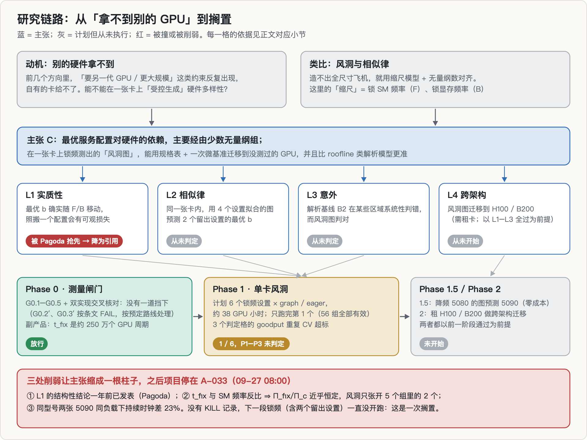

| 部分 | 内容 |
|---|---|
| 1–2 | 背景：LLM 服务的两种延迟与 goodput；GPU 的频率旋钮、roofline、三种时钟状态 |
| 3–5 | 原理：量纲分析与 Buckingham Π 定理、风洞、五个无量纲组、解析基线 B2 |
| 6–8 | 动机与假设链、这个题是怎么来的、预注册（判据、留出集、噪声门） |
| 9–10 | Phase 0 的每一道闸门，以及只跑完一个设置的 Phase 1 |
| 11 | 死因：撞车、降维、可迁移性被削弱、平凡基线、最后停在哪 |
| 12–16 | 仍然有效的测量、错误与更正、教训、局限、复现 |

**数字来源**：所有测量数字都来自项目的 append-only trace（`g02.jsonl` 锁频微基准、`g05.jsonl` 每步时间、`g04.jsonl` 同卡可重复性、`phase1.jsonl` 主扫描、`thermal_watch.jsonl` 与 `g05_fixture_TP3.jsonl` 时钟和温度），以及 `EXPERIMENTS.md`、`amendments.md` 的登记；图由脚本直接从这些文件读出。Phase 1 的 goodput、区间和 CV 用的是项目自己冻结的分析代码 `analyze_phase1.py`，与登记的数字逐一对得上。

**三种标注**（项目里的规矩，这里沿用）：**实测**（指向 trace）；**引用**（别人论文里的数，注明出处）；**推导**（从实测数用公式算出来的，不当作实测）。本文新算、项目登记里没有的数，标「探索性」，不参与任何判定。

**关于「我」**：这个项目由两个并行的 AI 会话推进，主会话负责判据、闸门和主实验，协作会话独立写了第二套测量工具，做了撞车核查和热测量；另有一个会话做外部审阅（另一个 AI 助手）。锁频、持久模式这类 root 操作由我本人执行。下文的「我」指整个项目。

---

## 1. 背景一：LLM 服务在 GPU 上发生了什么

### 1.1 prefill 与 decode：一个算力密集，一个访存密集

一次请求分两个阶段：

- **prefill**：把整段 prompt 一次读进去。几十到几百个 token 并行处理，是大矩阵乘，GPU 的算力被喂得很饱。
- **decode**：一个 token 一个 token 地往外吐。每一步只算一个 token，却要**把整个模型的权重从显存搬到计算单元一遍**。算得少、搬得多，瓶颈是带宽。

把「搬一遍权重的时间」记作

$$
t_W = \frac{W}{B}
$$

其中 $W$ 是 decode 每步要读的权重字节，$B$ 是显存带宽。本项目的模型是 Qwen3-1.7B（bf16）。它的权重文件一共 4.06 GB，但 decode 每步真正要读的是 **3.441 GB**（transformer 2.819 GB，加上 lm_head 0.622 GB；embedding 表每步只查一行）。后面锁频实验里，用这个加性模型从每步时间反推出来的 $W$ 是 3.447 / 3.370 / 3.417 GB，和 3.441 GB 相差不到 2.1%（实测）。

RTX 5080 满频时 SM 流式读带宽实测 902 GB/s，于是 $t_W \approx 3.8$ ms（推导）。**它是整个项目的基本时间单位**，后面所有无量纲组都拿它当分母。

### 1.2 批处理、KV cache 与 `max_num_seqs`

既然每一步都要把权重搬一遍，那同时给多个请求各生成一个 token，权重只需搬一次，大家共用。这就是批处理：b 从 1 加到几十，吞吐能涨几十倍，每个请求只慢一点。

但 b 不能无限大，原因是 KV cache。每个请求都要缓存自己前面所有 token 的 Key / Value，它随上下文变长而变大：

1. **装不下**：5080 上 vLLM 报告的 KV 容量是 89,456 个 token（实测）。按平均上下文 384 个 token 算，最多同时装约 233 条序列，落到网格 {4, 8, …, 256} 上就是 **b_cap = 128**。
2. **每步变慢**：b 越大，每步除了读权重，还要读 b 条序列的 KV。

b 加大时总吞吐上升、单个请求变慢。**最优的 b 取决于硬件**，这正是本项目想预测的量。vLLM 里对应的参数是 `max_num_seqs`，默认 256。

### 1.3 TTFT、TPOT、SLO 与 goodput

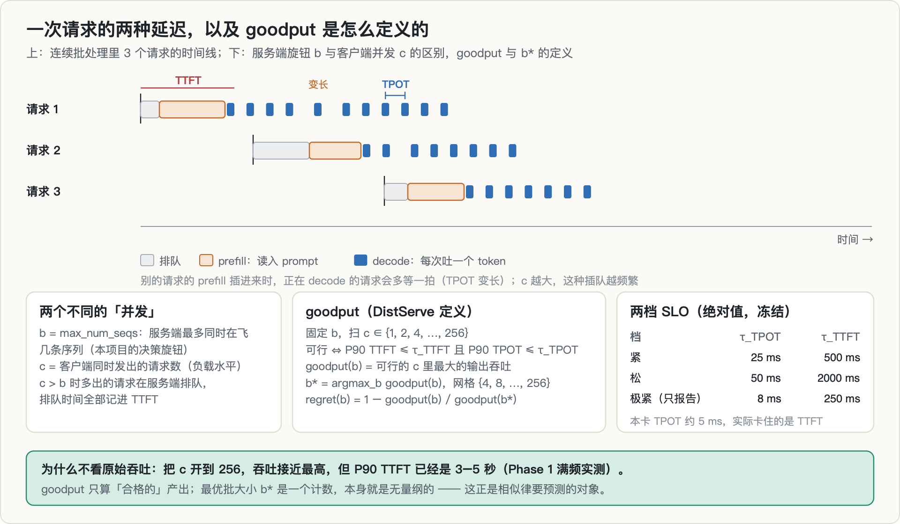

| 指标 | 含义 | 用户的感受 |
|---|---|---|
| **TTFT**（time to first token） | 从发出请求到看到第一个 token，包括排队和 prefill | 「它卡住了吗」 |
| **TPOT**（time per output token） | 之后每个 token 的间隔 | 「它打字有多快」 |
| **SLO** | 承诺给用户的上限，比如 P90 TPOT ≤ 25 ms | 服务质量合同 |

**goodput**（DistServe 的定义）是「满足 SLO 的前提下能拿到的最大吞吐」。本项目的具体算法是：固定服务端的 b，让客户端并发 c 从 1 扫到 256；某个 c 下 P90 TTFT 和 P90 TPOT 都满足 SLO 才算可行；**goodput(b) = 可行的 c 里最大的输出吞吐**，最优批大小 $b^* = \arg\max_b \text{goodput}(b)$，某个 b 的 regret 是 $1 - \text{goodput}(b)/\text{goodput}(b^*)$。

注意这里有两个「并发」：b 是服务端的旋钮，限制同时在飞的序列数；c 是负载水平。c 大于 b 时，多出来的请求在服务端排队，排队时间全部算进 TTFT。

为什么不直接看吞吐？把 c 开到 256，吞吐接近最高，但 P90 TTFT 已经是 3–5 秒（Phase 1 满频实测），没人会用。goodput 只算「合格的」产出。另外，$b^*$ 是一个计数，本身就是无量纲的，这一点在第 3 节会很重要。

预注册冻结了两档 SLO：**紧档** TPOT 25 ms / TTFT 500 ms，**松档** TPOT 50 ms / TTFT 2000 ms。后来发现本卡的 TPOT 只有 5 ms 左右，TPOT 约束基本不会生效，卡住的都是 TTFT，于是又加了一档只报告、不判定的**极紧档**（8 ms / 250 ms，A-007）。冻结的两档没有改：看到 $b^*$ 落在哪以后再调 SLO，就是事后找显著。

---

## 2. 背景二：GPU 的旋钮、roofline 与三种时钟状态

### 2.1 F、B、C，以及可以锁的两个时钟

| 符号 | 含义 | RTX 5080（实测） |
|---|---|---|
| **F** | 算力，bf16 GEMM 8192³ | 119 TFLOPS（满频） |
| **B** | 显存带宽，SM 流式读 1 GiB | 902 GB/s（满频） |
| **C** | 显存容量 | 16 GB（KV 可用约 89,456 token） |

GPU 有两个时钟：**SM 频率**决定 F，**显存频率**决定 B。两者都能用 root 权限锁住：`nvidia-smi -lgc` 锁 SM，`-lmc` 锁显存。锁 5080 的显存到 7001 MHz，SM 流式读带宽从 902 GB/s 掉到 426 GB/s；锁 SM 到 1417 MHz，GEMM 算力从 119 掉到 59.5 TFLOPS。GEMM 吞吐与锁定的 SM 频率严格成正比，每 MHz 分别是 0.04194、0.04192、0.04199 TFLOPS（实测）。

于是一张卡在数学上可以变成「带宽 426 GB/s、算力 119 TFLOPS」这类现实里并不存在的假卡。**这就是「风洞」的全部机关。**这种调频手段在文献里叫 DVFS，本身不是新东西，第 11 节会再回到这一点。

锁频也有副作用，都是实测踩出来的：

- **降显存频率也改变延迟**：指针追逐延迟从 322 ns 升到 411 ns（+28%），不只是带宽变了。
- **F、B 不独立**：显存 14801 档下把 SM 降到 1417 MHz，SM 流式读带宽也从 902 掉到 699 GB/s。所以分析一律用实测的 F 和 B，不用名义锁频值（A-011）。
- **「满速」不是 `clocks.max`**：5080 的 `clocks.max.sm` 是 3150 MHz（boost 档上限），负载下实际持续在约 2840 MHz；显存名义 15001 MHz，负载下回读是 14801 MHz。锁频档位因此冻结为显存 {14801, 7001} × SM {2842, 1987, 1417}（A-008）。

### 2.2 roofline：算术强度就是一个无量纲数

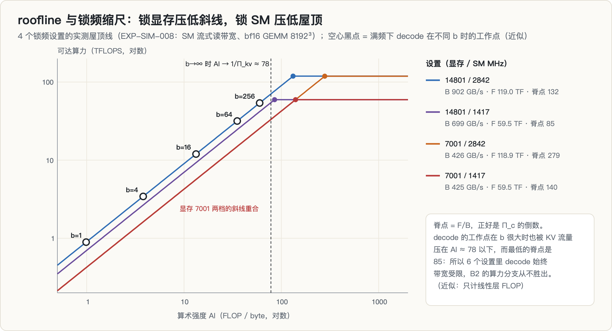

**🖼 怎么读这张图（相似律实验的物理基础）**
>
> 这是整个「风洞」想法能不能成立的关键一张。四条屋顶线来自**同一张 5080** 的四个锁频设置：
>
> - **锁显存频率 → 压低斜线**（带宽变小，访存斜坡变缓）
> - **锁 SM 频率 → 压低屋顶**（峰值算力变小，水平段下移）
>
> **两个旋钮独立地改变屋顶线的两个几何参数**——这正是「造假卡」的全部依据：如果一张卡的性能行为由 $(B, P_\text{峰值})$ 这两个数刻画，那么调频就能在一张物理卡上**合成出别的卡的屋顶线**。
>
> **但要盯着 decode 的工作点在哪。** 图上标出的满频 decode 工作点远在斜坡左侧——这意味着：
>
> 1. 它**只受带宽支配**，锁 SM 频率对它几乎没有影响；
> 2. 于是四个设置里真正能拉开差距的**只有显存频率这一个旋钮**；
> 3. 而这个旋钮的可调范围有限。
>
> **这就是 §「整个 (F, B) 矩形落在同一条线上」那句话的图形来源**——本来想用两个自由度张成一个平面，实际只拿到一条线。相似律需要在多个无量纲组上独立变化才能拟合，只有一条线时，拟合出的关系无法与「巧合」区分。**风洞造出来了，但只有一个风速档。**

roofline 模型说：一个计算任务的速度要么被算力卡住，要么被带宽卡住，取决于它的**算术强度** AI（FLOP / byte）。可达算力是

$$
\text{Perf}(\text{AI}) = \min(\text{AI} \times B,\; F)
$$

两条线的交点叫脊点，位置是 $F/B$。AI 低于脊点就是带宽受限。

decode 的算术强度可以粗算：b 条序列每步做约 $2P \cdot b$ 次浮点运算（$P$ 是参数量，只计线性层），要读 $W + b\,\bar S k$ 字节（权重加上 b 条序列的 KV，$k$ 是每 token 的 KV 字节，$\bar S$ 是平均上下文长度）。bf16 下 $W = 2P$，于是

$$
\text{AI}(b) \approx \frac{b}{1 + b \cdot \bar S k / W}
$$

b 趋于无穷时 AI 趋于 $W/(\bar S k) \approx 78$（推导）。而 6 个锁频设置里最低的脊点是 85（14801 / 1417 档）。**所以本项目的负载在所有设置下都是带宽受限的，计算那条线从来碰不到。**

还要注意一件事：**算术强度本身就是一个无量纲数，roofline 本身就是一种无量纲分析。**「用无量纲组描述性能」并不新，这一点后来成了审稿视角下的主要问题之一。

### 2.3 三种时钟状态（实测踩坑）

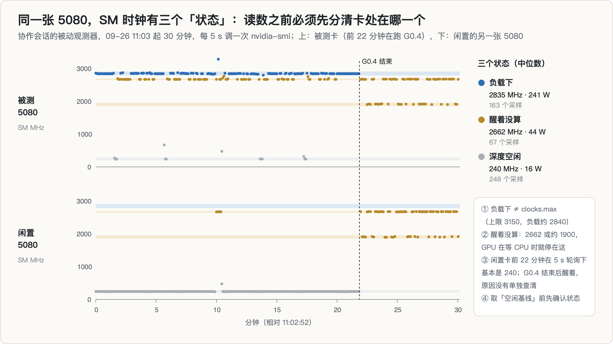

这是项目里反复造成误判的细节。同一张 5080，SM 时钟至少有三个稳定的状态（实测，`thermal_watch.jsonl`，30 分钟、每 5 秒一个采样）：

| 状态 | SM 时钟（中位数） | 功耗（中位数） | 什么时候出现 |
|---|---|---|---|
| 负载下 | 2835 MHz | 241 W | 真在计算 |
| 醒着没算 | 2662 MHz（有时约 1900） | 44 W | 有 CUDA 进程打开着设备、GPU 在等 CPU |
| 深度空闲 | 240 MHz | 16 W | 长时间没人碰 |

它造成过的误判：

1. **G0.4 的停顿点**：第一次同卡可重复性测试里，发生停顿的测量点 SM 中位数是 2662 MHz，其余点是 2835。这说明停顿期间 GPU 醒着在等，卡在 CPU 一侧。
2. **拿空闲回读当 F**：`server_up` 时读到的 2662 是空闲值，拿它当算力分母会把 5080 低估约 8%。
3. **观测者效应**：协作会话的被动观测器每 5 秒调一次 `nvidia-smi`。项目记录（A-025）把闲置卡停在约 2670 MHz 归因于轮询本身，并据此把冷却检查的轮询间隔从 10 秒放宽到 60 秒。但同一份 trace 的前 22 分钟里，闲置卡在同样的轮询下基本一直是 240 MHz，直到另一张卡上的 G0.4 结束后才醒着不再回落。所以「轮询会唤醒卡」这句话，这份数据只能部分支持。
4. **一个 CUDA 客户端会打开所有可见设备节点**（协作会话用 `/proc` 第一方核实），所以别的进程也会让这张卡处于「醒着」的状态。

教训很具体：**任何「空闲基线」「满频分母」，读数之前先确认卡处在哪个状态。**

---

## 3. 相似律与风洞

### 3.1 量纲分析与 Buckingham Π 定理

流体的行为不取决于尺寸和速度各自的绝对值，而取决于它们组成的无量纲比值。这件事的一般形式是 **Buckingham Π 定理**：

> 一个问题涉及 $n$ 个物理量、$k$ 个基本量纲，就能化成 $n - k$ 个无量纲组 $\Pi_1, \dots, \Pi_{n-k}$，系统的行为只依赖这些组之间的关系。

经典例子是小球在流体里受的阻力。相关的量有阻力 $F_D$、流体密度 $\rho$、速度 $V$、尺寸 $L$、黏度 $\mu$，共 5 个；基本量纲是质量、长度、时间，共 3 个。于是只剩 2 个无量纲组：

$$
C_D = \frac{F_D}{\tfrac12 \rho V^2 L^2}, \qquad \text{Re} = \frac{\rho V L}{\mu}, \qquad C_D = f(\text{Re})
$$

测一条 $C_D$–Re 曲线，就覆盖了所有尺寸、所有流体。变量从 5 个降到 2 个，而且这两个组**完整**决定了系统行为。

### 3.2 风洞

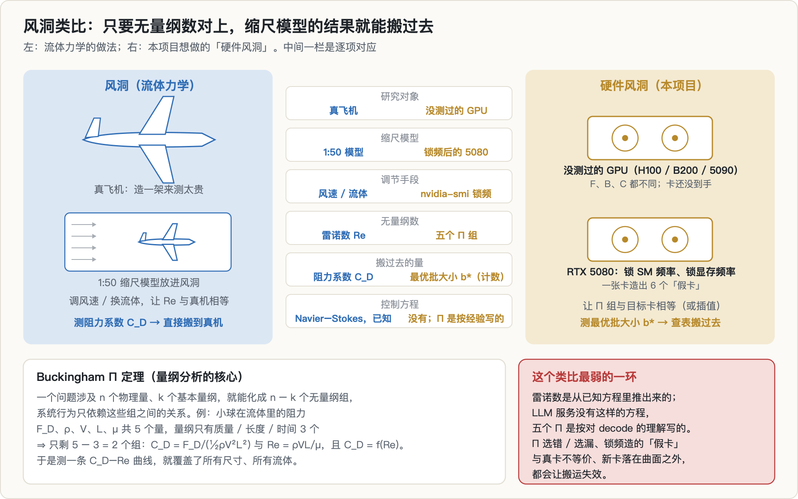

造飞机时做一个 1:50 的缩尺模型放进风洞，调风速或者换流体，让模型的雷诺数与真机相等（这叫**相似律**，similitude），测出的无量纲阻力系数就能直接搬到真机上。

### 3.3 搬到 GPU 上：「硬件风洞」

| 流体力学 | 本项目 |
|---|---|
| 真飞机 | 一张没测过的 GPU（H100、B200、5090） |
| 缩尺模型 | 锁频后的 5080 |
| 调风速 | 锁 SM 频率、锁显存频率 |
| 雷诺数 | 五个无量纲组 |
| 阻力系数 | 最优批大小 $b^*$（计数，本身无量纲） |

完整的逻辑链：在一张卡上用锁频造出多个 (F, B) 组合 → 在每个组合上实测 $b^*$ → 得到「$b^*$ 随 Π 变化」的曲面（风洞图，记作 WT）→ 对一张新卡，用规格表算出它的 Π，在曲面上查出 $b^*$。

这个类比最弱的一环一开始就摆在明处：雷诺数是从已知的 Navier–Stokes 方程里推出来的，**LLM 服务没有这样的方程**，五个 Π 是按对 decode 的理解写出来的。Π 选错或选漏、锁频造出的假卡与真卡不等价、新卡落在曲面之外，都会让搬运失效。后面会看到，第一条和第三条都以某种形式出现了，第二条则从未被检验。

---

## 4. 五个无量纲组

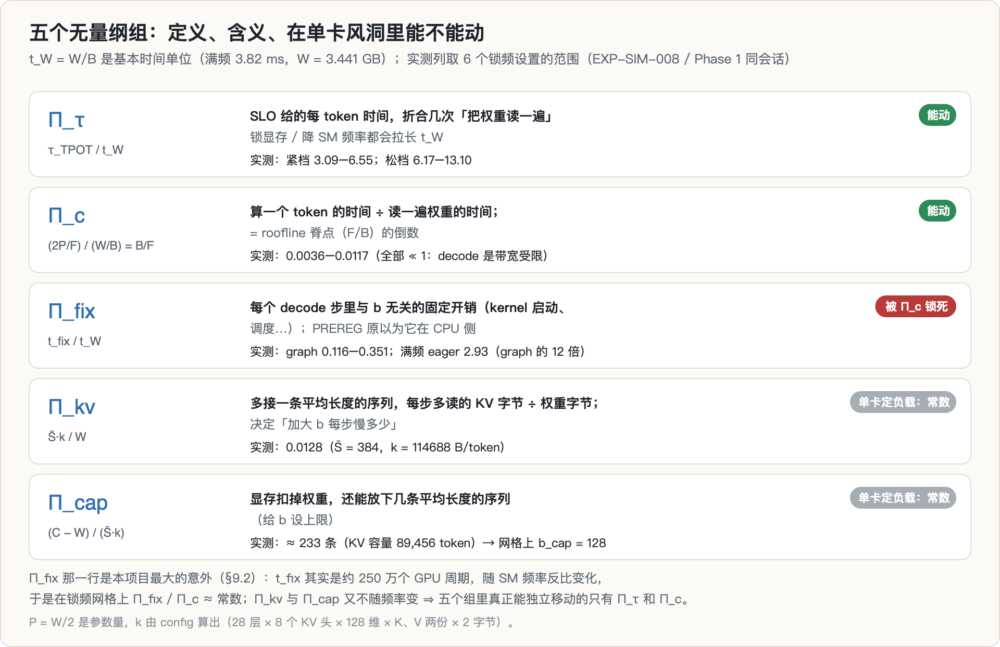

所有组都是「某个时间或字节数」除以 $t_W$ 或 $W$。

**$\Pi_\tau = \tau_\text{TPOT} / t_W$**：SLO 允许的每 token 时间，折合几次「把权重读一遍」。$\Pi_\tau = 6.55$ 的意思是，紧档 25 ms 的预算够读 6.55 遍权重。锁显存或降 SM 频率都会拉长 $t_W$，使它变小。6 个设置上紧档 3.09–6.55，松档 6.17–13.10（推导自实测 $t_W$）。

**$\Pi_c = \dfrac{2P/F}{W/B}$**：算一个 token 的时间 ÷ 读一遍权重的时间。bf16 下 $W = 2P$ 字节、一个 token 约 $2P$ 次浮点运算，两者约掉，$\Pi_c = B/F$，正好是 roofline 脊点的倒数。6 个设置上是 0.0036–0.0117，全部远小于 1，与上一节「始终带宽受限」一致。

**$\Pi_\text{fix} = t_\text{fix} / t_W$**：每个 decode 步里与 b 无关的固定开销（kernel 启动、调度等）。PREREG 写的是「t_fix 主要在 CPU 端、与 GPU 时钟无关」，这是整个 roofline 里没有的一项，也是本项目最初的新颖点。第 9 节会看到这个前提是错的。

**$\Pi_\text{kv} = \bar S k / W$**：多接一条平均长度的序列，每步要多读的 KV 字节相对于权重字节。$k$ 由模型配置算出：28 层 × 8 个 KV 头 × 128 维 × K、V 两份 × 2 字节 = 114,688 B/token；$\bar S = 384$（random 256/256 负载在 decode 期间的平均上下文）。$\Pi_\text{kv} = 0.0128$。**它决定「加大 b 每步慢多少」，也就决定了最优的 b 在哪。**

**$\Pi_\text{cap} = (C - W)/(\bar S k)$**：显存扣掉权重，还能放下几条平均长度的序列。实际用 vLLM 报告的 KV 容量来算：89,456 / 384 ≈ 233 条，网格上 $b_\text{cap} = 128$。

---

## 5. B2：把 Π 组拼成一个解析模型

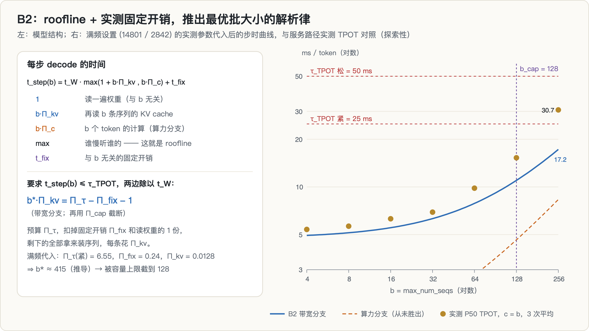

有了这些组，每步 decode 的时间可以写成

$$
t_\text{step}(b) = t_W \cdot \max\big(1 + b\,\Pi_\text{kv},\; b\,\Pi_c\big) + t_\text{fix}
$$

- $1$：读一遍权重；$b\,\Pi_\text{kv}$：再读 b 条序列的 KV；两者相加是带宽受限时的时间；
- $b\,\Pi_c$：b 个 token 的计算，是算力受限时的时间；
- $\max$：谁慢听谁的，这就是 roofline；
- $t_\text{fix}$：固定开销。

两边除以 $t_W$，要求 $t_\text{step} \le \tau_\text{TPOT}$，在带宽分支下解出

$$
b^* \cdot \Pi_\text{kv} = \Pi_\tau - \Pi_\text{fix} - 1 \qquad (\text{再用 } \Pi_\text{cap} \text{ 截断})
$$

读法很直观：时间预算 $\Pi_\tau$，扣掉固定开销 $\Pi_\text{fix}$ 和读权重的 1 份，**剩下的全部拿来装序列，每条花 $\Pi_\text{kv}$**。而且它完全由无量纲数决定，正是相似律要的形式。这个模型叫 **B2**，是本项目要打败的解析基线，分两版：F、B 取规格表值的 **B2-spec**，取实测值的 **B2-measured**；判定时取两版里较好的一版，对基线从宽。

满频代入（推导）：$\Pi_\tau = 6.55$（紧档），$\Pi_\text{fix} = 0.24$，$\Pi_\text{kv} = 0.0128$，得到 $b^* \approx 415$，被容量上限截到 128。

图右侧把 B2 的步时曲线与 Phase 1 满频设置下服务路径的实测 P50 TPOT（c = b，3 次重复平均）放在一起。这是探索性的对照，不属于任何预注册判定：b ≤ 32 时实测比 B2 高 9–14%（服务路径本来就比离线路径慢约 4%，EXP-SIM-002），b = 256 时实测 30.7 ms、B2 给出 17.2 ms。实测里混进了新请求的 prefill，B2 没有这一项。**风洞要检验的，本来就是真实的 $b^*$ 偏离这条解析律的方式。**

除了 B2，预注册还定义了另外几个预测器：

| 记号 | 做法 | 目标卡上要测什么 |
|---|---|---|
| **B0** | 在满频设置上调好的 $b^*$ 直接挪过去（从业者的真实做法） | 不测 |
| **B1** | vLLM 默认值 `max_num_seqs = 256` | 不测 |
| **B2** | 上面的解析律，规格表 / 实测两版 | 一次 t_fix 微基准 |
| **B3** | 目标卡上测 2 个点做线性内插（A-016，回答「为什么不直接 profile」） | 两个点 |
| **WT** | 风洞图：在 Π 空间里对拟合设置的实测 $b^*$ 插值 | 一次 t_fix 微基准 |

WT 的插值方法在任何 $b^*$ 数据之前冻结为三选一（幂律 / 最近邻 / 反距离加权），用拟合点上的留一交叉验证预先选定，事后不得替换（A-021）。

---

## 6. 动机与假设链：主张 C 与 L1–L4

**为什么觉得值得做。** 前面几个方向里，「需要另一代 GPU」「需要更大规模」这类约束反复出现，自有的四张消费卡给不了。协作会话在第一份评审里统计：此前五次死亡里，这类约束触发了三次；比如 [SM120 FP4 悬崖那篇](../sm120-fp4-cliff/)，最后是租 B200 做的对照。#9 是第一个**不绕开、而是溶解**这条约束的方向：把「硬件多样性」从必须拥有的资源，变成可以在一张卡上受控生成的参数。用那份评审的话说，这也是这一轮里第一次真正引入一个外部学科的方法，而不是把系统术语换个说法。

**总主张 C**（PREREG §0）：LLM 服务最优调度配置对硬件的依赖，主要经由少数无量纲组；在同一张卡上锁频做受控实验，能测出最优决策在无量纲空间里的真实曲面，并据此迁移到没见过的 GPU，比规格表解析模型更准。

「零 profiling」这个说法在第一天就被改了口径（A-005）：$t_\text{fix}$ 是「宿主机 + 引擎」的量，规格表里没有，迁移到新机器必须在目标上测。改后的主张是「**目标机只需一次数十秒的微基准 + 规格表 F / B，替代整张逐 GPU 扫描表**」。

主张 C 太大，没法直接验证，拆成四条，每条都有能杀死它的判据：

| 编号 | 子主张 | 在哪检验 |
|---|---|---|
| **L1 实质性** | 最优配置确实随 F / B 实质移动；照搬一个配置会付出可观损失 | Phase 1 |
| **L2 相似律** | 同一张卡内，用部分设置拟合的风洞图能预测**留出**设置的最优配置 | Phase 1 |
| **L3 意外** | 最好的简单解析模型（B2）在某些区域系统性判错，而风洞图判对 | Phase 1 |
| L4 跨架构 | 风洞图能迁移到 SM90 / SM100（租 H100 / B200） | Phase 2，仅当 L1–L3 全过 |

**原来的规矩**：L1–L3 任一不成立，当天终止，按阴性结果记录。L3 专门回答审稿人最可能的反驳「这不就是换了名字的 roofline」。

后来又加了一个免费的中间测试 **Phase 1.5**（采纳协作会话的评审，A-005）：用降频 5080 拟合的图预测**同一台机器上的 RTX 5090**。这一对恰好改变了降频改不了的两个维度（SM 数 84 → 170，2.02 倍；L2 67.1 → 100.7 MB，1.50 倍），又把 ISA、驱动、CPU、宿主机都按住。它失败了，就不必花钱租卡。

**先验写在前面**（README）：「P3 通过的先验约 1/4，#9 约有 75% 的概率在 P3 终止。那是预期内的结局，不是意外。」Phase 0/1 只花一张卡约一天、不花钱，期望值仍然为正。

---

## 7. 这个题是怎么来的

09-25 那天按完整的选题门规程跑了一轮：**10 个候选，0 个干净过门**，多数撞在 2026 年 5–9 月刚出现的工作上。#9 当时的判词是「6.5（组合型空白）」：技术本身不新（同时调核心与显存频率做表征，DVFS 文献早已有之，Pagoda 就在 Jetson 上做过），目标（最优配置）和框架（算术强度即 roofline 的无量纲量）也都已知，剩下的只是组合，体量是 note。

同一天我更正了这个判定。6.5 针对的是**演绎型**组合：没写出来的部分是已发表事实的逻辑推论，不用做实验就能知道真假。#9 没写出来的部分是一个经验问题，「最优服务决策能否经由无量纲组迁移到没见过的 GPU」，答案只有做实验才知道。按「我这个具体主张是否已被发表」重新检查，最近的三个邻居都没有发表它：

- **WattGPU**（2607.02391）：只用规格表预测没见过的 GPU 上的 ITL 与功耗，不求最优配置，不做受控调频；
- **OmniPilot**（2607.01579）：学习型代价模型，超出训练分布时误差 24–46%，新硬件要重训；
- **AIConfigurator**（2601.06288）：跨框架最优配置搜索，但依赖每款 GPU 事先 profiling 的数据库。

于是 #9 在「具体主张」这一问下存活，**风险原样保留**：锁频需要 root（当时未验证）；「现有预测器系统性判错最优决策」这个意外，我估计先验约 1/4；审稿人可能认为它是换了名字的 roofline。选题门文档第 35 行还把 **Pagoda** 列为警告项，这一条后来变得很关键。

这个方向和专栏里其它几个方向是并行推进的：它的第一个真实负载噪声测量，正赶上两张 5090 在跑 [rollout 半衰期](../rollout-half-life/) 那个项目的 LoRA-GRPO 训练和打分；vLLM 0.30.0 的环境只读复用了 [verl 探针](../verl-on-sm120/) 那边的虚拟环境。

---

## 8. 预注册：在看到任何数据之前写死的东西

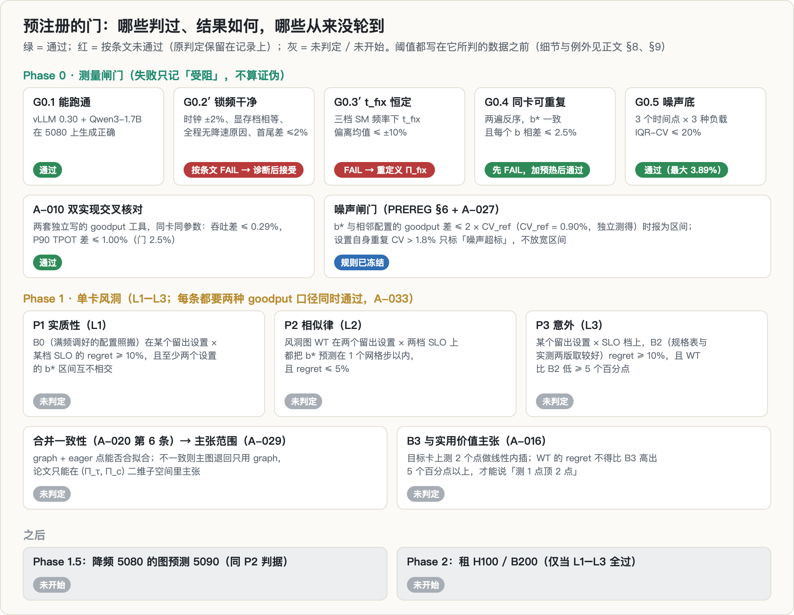

PREREG 冻结于 09-25 14:09（提交 `738a73a`），在任何一次带数据的运行之前。此后的修改只能追加到 `amendments.md`，并写明「是否在看到相关结果之前」。

**决策与目标**：旋钮是 `max_num_seqs`，网格 {4, 8, 16, 32, 64, 128, 256}；目标是按上面的定义算出的 goodput，两档 SLO。

**Phase 0 闸门**（任何一关失败都只记「受阻」，不算证伪）：

| 闸门 | 检查什么 | 判据 |
|---|---|---|
| G0.1 | vLLM 0.30 在 5080 上跑通 Qwen3-1.7B | 生成正确 |
| G0.2 | 锁频可用且干净 | 时钟回读误差 ≤ 2%、显存档相等、测量期间无降速原因、首尾复测差 ≤ 2% |
| G0.3 | t_fix 的前提 | 三档 SM 频率下 t_fix 偏离均值 ≤ ±10% |
| G0.4 | 同卡可重复性（自检必须可能失败） | 两遍（启动顺序相反）$b^*$ 一致，且每个 b 的 goodput 相差 ≤ 2.5% |
| G0.5 | t_fix 的噪声底（A-001 新增） | IQR-CV 不超过 20% |

2.5% 这个数不是随手定的：它是 P3 所需 5 个百分点差距的一半，goodput 噪声若超过它，P3 的差距在测量上就无法分辨。

**Phase 1 判据**：

- **P1（L1）**：B0 在至少一个留出设置 × 一档 SLO 上 regret ≥ 10%，**且**至少两个设置的 $b^*$ 相差 ≥ 1 个网格步。不满足：死。
- **P2（L2，必须可能失败）**：WT 在两个留出设置上都把 $b^*$ 预测在 1 个网格步以内，**且** regret 在两档 SLO 下都 ≤ 5%。不满足：死。
- **P3（L3）**：至少一个「留出设置 × SLO 档」上，B2 的 regret ≥ 10%，**且** WT 比 B2 低 ≥ 5 个百分点。不满足：退化为「roofline + 固定开销就够了」，停止。
- **噪声门**：只有当 $b^*$ 与相邻配置的 goodput 差 > 2 × 重复 CV 时才认定 $b^*$ 唯一，否则报为区间；预测器之间的差若落在噪声内，一律按「不比对方好」计。

### 8.1 留出集

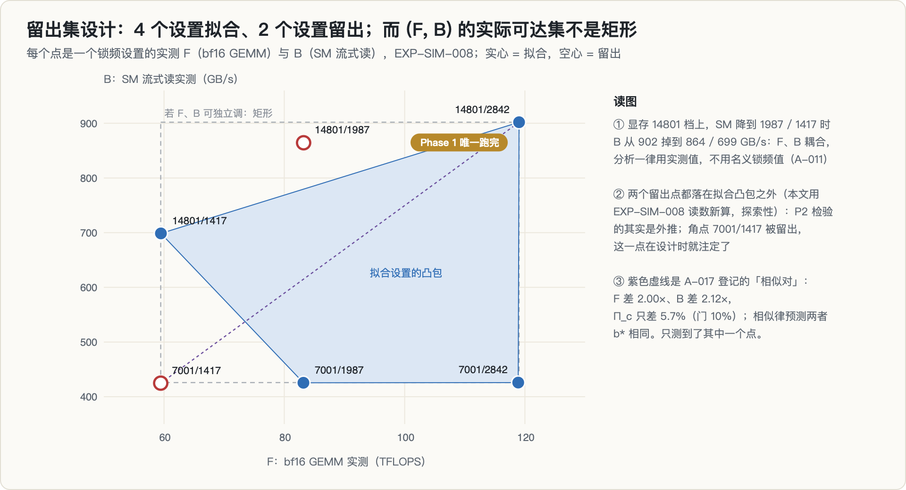

机器学习的基本纪律：用全部数据拟合一个模型，再拿同样的数据说「看，很准」，是循环论证。所以 6 个锁频设置里挑 4 个拟合、2 个藏起来：**留出 (14801, 1987) 与 (7001, 1417)**。而且拟合方法必须在看到留出数据之前冻结（A-021），分析代码也必须在读取任何留出结果之前写好并提交（A-032）。否则人会不自觉地一直换方法，直到留出数据也好看，这叫**分叉路径**（forking paths）。

图里有两件事是项目当时没来得及算、本文用锁频会话的读数新算的（探索性）：

1. **(F, B) 的可达集不是矩形**。显存 14801 档下 SM 一降，带宽也跟着掉，所以 6 个点不在网格的格点上。
2. **两个留出点都在拟合设置的凸包之外**，在 (log F, log B) 平面和 (log Π_τ, log Π_c) 平面里都是（用项目分析代码里的凸包函数算）。角点 (7001, 1417) 被留出，从设计上就注定了它是外推。项目早就要求「内插还是外推必须明示」（A-005、A-011），这个检查排在分析报告里，但一直没轮到。

A-017 还登记了一个只报告的「**相似对**」：(14801, 2842) 与 (7001, 1417) 的 F 差 2.00 倍、B 差 2.12 倍，$\Pi_c$ 只差 5.7%（门是 10%）。相似律预测两者在按比例缩放的 SLO 下 $b^*$ 相同。这一对只测到了一半。

### 8.2 33 条判据变更

最后一共追加了 **33 条**修正条目（A-001 到 A-033）。按条目自己写的「当时看过什么数据」分三类：写于任何运行之前 4 条；写于它所约束的那类数据之前 23 条；**写在看过相关数据之后 6 条**（A-018、A-019、A-024、A-026、A-027、A-033）。这 6 条都在条目里写明了当时已经看过哪些数据，涉及的原 FAIL 判定都保留在记录上，没有改写。第 13 节的时间线图把它们一一标了出来。

---

## 9. Phase 0：测量基础设施

这一阶段是整个项目最有价值、也最反直觉的部分：**花在「确保没骗自己」上的力气，比花在测量本身上的更多。**

### 9.1 锁频能用吗：G0.2 → G0.2′ → 诊断 → 接受

- **第一次锁频会话（EXP-SIM-004）作废**：用户磁盘配额顶到硬限，起因是下载 Qwen3-8B 前只看了 `df`、没查用户配额；trace 在 4096 字节处被截断，另外 6 个设置的记录全部丢失。更糟的是，脚本用 `grep … || true` 过滤输出，**把 Python 的失败吞掉了**，锁频会话看起来正常走完。
- **第二次（EXP-SIM-005）**：28 项里 27 项通过，按条文 FAIL。但事后发现两处设计缺陷（A-012）：时钟是在计时循环**结束之后**才采样的，根本没测到「测量期间」；带宽用的是 `dst.copy_(src)`，它走拷贝引擎（DMA），拷贝期间 SM 停在 240 MHz、功耗 20 W，而 decode 读权重是 SM 发出的访存。于是新增了测量期间 50 ms 一次的 NVML 采样器，和 SM 流式读带宽（满频 901.8 GB/s，DMA 拷贝是 815.4 GB/s）。
- **第三次（EXP-SIM-008），G0.2′ 仍按条文 FAIL**，只差第 (iii) 项：显存 14801 + SM ≤ 1987 这个角落，SM 流式读期间出现了 `sw_power_cap` 标志（其中一个设置 14 个采样全部带标志）。但每个采样的 SM 时钟都等于锁定值，功耗只有 118–123 W，离 360 W 的功耗墙很远。
- **先写诊断规则、再诊断（A-018，看过 EXP-SIM-008 之后写，诊断运行之前冻结）**：带标志与不带标志两组迭代的中位数相差须 ≤ 0.5%。实测相差 −0.18%、−0.21%、+0.003%，复现差 ≤ 0.52%，判为「标志无害」。**A-019 依此接受锁频可用，原 G0.2′ = FAIL 保留在记录上**，并强制 Phase 1 的每个结论都并报「去掉这两个设置」的敏感性版本。

### 9.2 t_fix 是常数吗：不是，而且这件事让风洞降了维

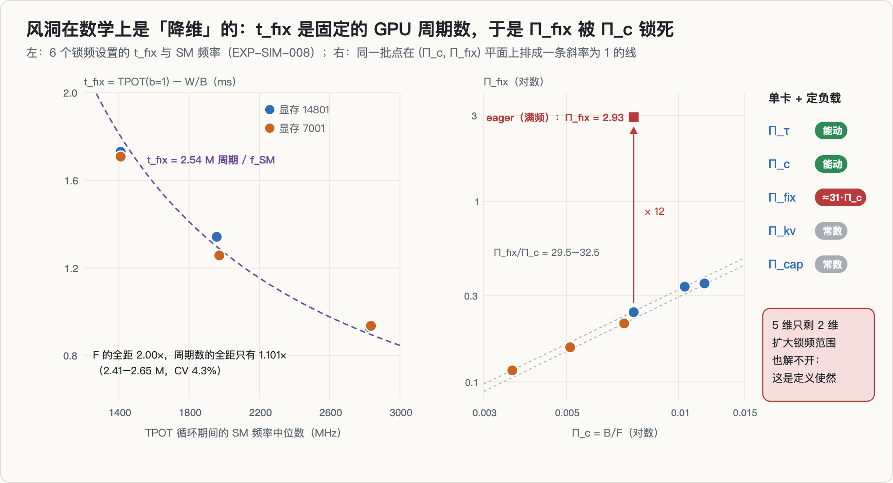

G0.3′ 在每个设置上用 $t_\text{fix} = \text{TPOT}(b{=}1) - W/B$ 求固定开销（实测）：

| 显存 / SM（MHz） | 2842 | 1987 | 1417 |
|---|---|---|---|
| 14801 | 0.929 ms | 1.342 ms | 1.731 ms |
| 7001 | 0.936 ms | 1.258 ms | 1.709 ms |

$t_\text{fix}$ 几乎不随显存频率变，却随 SM 频率大幅变化，**G0.3′ FAIL**。先排除「分母错了」：同一推导反算出的 $W$ 与检查点的独立估计差 +0.2% / −2.1% / −0.7%，加性模型本身是对的。换个单位看，把 $t_\text{fix}$ 乘以测量期间的 SM 频率：

$$
t_\text{fix} \times f_\text{SM} = 2.41\text{–}2.65 \text{ M 个周期}
$$

六个设置上 F 的全距是 2.00 倍，周期数的全距只有 1.101 倍（CV 4.3%）。**「固定开销」不是固定的时间，而是固定的 GPU 周期数，约 250 万个。它的主体在 GPU 侧，不在 CPU 侧。** PREREG 的前提是错的。

这本来只是一条修正（A-020 重定义了 $\Pi_\text{fix}$），但它的推论很要命。看两个组的比值：

$$
\frac{\Pi_\text{fix}}{\Pi_c} = \frac{t_\text{fix}/t_W}{(2P/F)/t_W} = \frac{t_\text{fix} \cdot F}{2P}
$$

$B$ 在代数上约掉了。再代入 $t_\text{fix} = N/f_\text{SM}$、$F \propto f_\text{SM}$，$f_\text{SM}$ 也约掉，比值是常数 $\propto N/W$。实测 6 个设置上 $\Pi_\text{fix}/\Pi_c = 29.5\text{–}32.5$。外部审阅独立验算了这个恒等式，结论相同。

再加上：单卡、固定负载时 $\Pi_\text{kv}$ 和 $\Pi_\text{cap}$ 本来就是常数。于是：

> **只用默认的 CUDA graph 模式，风洞实际只张开了 $(\Pi_\tau, \Pi_c)$ 两维，5 个组里的 2 个。**

这是定义使然，扩大锁频范围解不开：整个 (F, B) 矩形落在同一条线上。按协作会话的估算，第二个组的系数标准误会被放大约 65 倍（推导）。

能解开它的杠杆只有一个可行的：**eager 模式**（关掉 CUDA graph）。eager 下每步开销约 10 ms，主要在 CPU 侧；满频时 eager 的 $\Pi_\text{fix} = 2.93$，是 graph 的约 12 倍（Phase 1 同会话实测；外部审阅用 G0.5 的数字算出约 11.5 倍），而其它四个组不变（A-020 第 5 条，我裁决采纳）。代价是 eager 同时改变了算子融合，所以必须配一个「合并一致性检验」：graph 点和 eager 点合在一起拟合，留一误差超出预定范围就判合并不一致，主图退回只用 graph。**合并不一致时论文能主张什么，也在任何 Phase 1 数据之前写死了**（A-029）：只能说「在 $(\Pi_\tau, \Pi_c)$ 二维子空间内可以插值预测」，不得提出「最优服务决策主要经由少数无量纲组迁移」这一一般性表述。

分析代码在合成数据上自检时还暴露了一个更深的局限（EXP-SIM-017）：如果 eager 与 graph 之间只是**均匀**偏移了几格，合并图会把它吸收成「$\Pi_\text{fix}$ 的作用」，一致性检验发现不了。也就是说，「$\Pi_\text{fix}$ 解释了 eager 与 graph 的差异」这一说法，在 Phase 1 内部无法与「eager 另有一个常数偏移」区分开。真正独立的检验只能是 Phase 1.5：按预测，5090 的 $\Pi_\text{fix}/\Pi_c$ 约为风洞的 2 倍（推导，A-020 第 4 条）。

另一个杠杆「换模型规模」在本机不可行：三个本地模型层数都是 28、权重只差 1.14 倍；Qwen3-8B 的 bf16 权重约 16 GB，装不进 5080；本机也没有外网下新模型。

### 9.3 同卡可重复性：G0.4、冷启动，以及区间读法

**第一次（EXP-SIM-011）FAIL**：每个 b 两遍的 goodput 相差最多 91.6%（紧档）/ 208.7%（松档），远超 2.5%。诊断看逐请求延迟：失败的运行里，**第一批 c 个请求**的端到端延迟被多加了 2–5 秒，其余请求全部正常。第一批请求占总数的 12.5%–25%，超过 10%，P90 TTFT 恰好落在它们身上。停顿期间 SM 中位数是 2662 MHz，GPU 醒着在等。

**修正（A-024，看过 EXP-SIM-011 之后）**：判据不变，只改方法，每个 (b, c) 点先用同样的压测参数、不同的 seed 预热一轮。没有用 vLLM 自带的 `--num-warmups`，因为它把正式测量的第一条 prompt 原样重复 N 次，会命中前缀缓存，走的不是同一个 prefill 形状。

**重跑（EXP-SIM-012）**：每个 b 两遍相差 0.48% / 0.37% / 1.26%，全部 ≤ 2.5%。但点值 $b^*$ 一遍是 64、另一遍是 256，**按字面不一致**。原因是结构性的：c = 256 时 P90 TTFT 有 3–8 秒，不可行，可行的最大并发是 64，此时 b = 64 和 b = 256 的服务行为完全一样（最多 64 条在飞），goodput 只差 0.79% 和 0.11%，名次被噪声交换了。按预注册 §6 的噪声门，两遍的 $b^*$ 都是区间 **[64, 256]**，一致。我确认采用区间读法（A-026），G0.4 = PASS；同一读法下第一次运行仍是 FAIL，说明它不是空口放行。

**这条区间读法后来在真实判定运行上又救了一次**：同卡交叉核对时，协作会话自己工具的两遍点值也是 64 对 256。如果没有区间读法，一次完全正常的测量会被判成失败。

### 9.4 空洞化陷阱：CV 不能由被评估的数据自己估

噪声门写的是「差异超过 2 × 重复 CV 才算真差异」。如果 CV 用被比较的那两遍数据自己来估：

> 两遍分歧越大 → 估出的 CV 越大 → 区间越宽 → 越容易判「一致」。**数据越糟，越容易过关。**

实例：EXP-SIM-011 那次失败的运行，用自身数据估出的 CV 是 119–132%，容差会把整个网格吞进去。修法（A-027，采纳协作会话）是把 CV **固定为独立测得的参照值 CV_ref = 0.90%**（取自 G0.4 重跑），此后凡是用到区间的地方一律用它；某个设置自己的重复 CV 超过 2 × CV_ref = 1.8% 时，只标「噪声超标」，**区间不会因为自身方差大而放宽**。另外两个细节：

- 0.90% 是从「两遍相对差 1.26%」换算来的。**相对差不是 CV**，两个样本时 CV ≈ 相对差 / √2。协作会话最初想直接用 1.26，会让容差凭空宽出 41%，是被另一个会话纠正的。
- 分析脚本加了单位守卫：误传 90 而不是 0.90，门会变成 180%，区间吞掉整个网格，自检**静默通过而不报错**。

### 9.5 噪声底与双实现交叉核对

**G0.5（EXP-SIM-014）通过**：三个时间点（跨约 24 小时）、三种负载条件（真实负载、无负载、GEMM 夹具负载）下，最大 IQR-CV 3.89%，远低于 20% 的兜底阈值。graph 模式的 TPOT(b=1) 全距只有 0.59%。eager 的全距是 4.8% / 5.0% / 6.2%，对宿主机负载明显更敏感，这正是它能当 $\Pi_\text{fix}$ 杠杆的原因，也预示了它在 Phase 1 里会很吵。

**双实现交叉核对（EXP-SIM-013）通过**：两个会话各自独立写了一套 goodput 测量工具，在同一张卡、逐字相同的参数下背靠背运行。先过三道门：前后三次探针的 TPOT 漂移（b = 1 最大 0.28%，门 0.65%；b = 32 最大 0.81%，门 1.6%）、测量期间 SM 中位数配对（15/15 通过）、宿主机 loadavg 配对（只有 6/15 通过）。在有效配对上，**吞吐差 ≤ 0.29%，P90 TPOT 差 ≤ 1.00%**，门是 2.5%。被 loadavg 门排除的 9 个点，工具差值也都 ≤ 1.21%，所以结论不依赖排除了哪些点。

loadavg 门排掉 9 个点的原因后来也查清了：loadavg 是 1 分钟均值，而服务启动（模型加载 + CUDA graph 捕获）是 CPU 重活，每个 b 的第一个点紧跟启动。修正被**有意推迟**：在看到自己的点不过门之后改门，属于事后放宽，所以这一轮按原规则判，修正（启动后先等 60 秒）只用于 Phase 1。

对齐两套工具的参数本身就抓出了 10 处不一致（其中 3 处可能影响性能），包括「两次重复共用一个服务进程」，这会低估重复性方差。

### 9.6 环境里的坑

- **后端变量被静默忽略**：vLLM 0.30.0 不认识 `VLLM_ATTENTION_BACKEND` 和 `VLLM_FLASH_ATTN_VERSION`，日志里写着 `Unknown vLLM environment variable`。此前「钉死 TRITON_ATTN」的所有运行，实际都是引擎自动选的 FLASH_ATTN + FA2。A-013 把后端重新钉死为 FLASH_ATTN + FA2，**执行方式改成断言日志，而不是设变量**。
- **客户端卡在外网 16 分钟**：`vllm bench serve` 没传 `--tokenizer`，客户端拿服务名当 HF 仓库去取 tokenizer，本机无外网，一个请求都没发出去；GPU 全程 240 MHz。
- **UUID 映射**：本机 `nvidia-smi` 的编号 0/1 是 5080，PyTorch 的编号 0/1 却是 5090。项目守住了「只用 UUID 指代 GPU」的红线，却没有核对每个 UUID 对应哪张卡，结果把两张 5080 当成了跨型号比较。**光用 UUID 不够，UUID → 型号的映射本身也要实测一次。**
- **「卡是空闲的」要多个字段一起看**：两张 5090 显存只占 3 MiB，读起来很干净，但利用率 100%、时钟停在约 2970 MHz、功耗 120–140 W，而且 `--query-compute-apps` 查不到任何进程。先怀疑的是另一个项目遗留的两个孤儿 vLLM 进程，终止后卡仍然不动，最可能的触发反而是主会话自己：G0.5 里用 SIGTERM 中途杀掉了负载夹具，夹具没有正常收尾。root 重置被拒，因为机器上另一位用户的一个常驻 Web 服务（已运行约 50 天）一直开着这两张卡的设备文件，而非 root 的工具看不到它。
- **锁频在持久模式关闭时会丢**：Phase 1 第一次尝试，root 脚本报告锁频成功，测量时锁却不在（SM 2865 MHz 高于锁定值）。原因是持久模式关闭时，只要没有任何客户端打开这张卡，驱动就会撤下它的状态；此前三次锁频会话之所以有效，是因为上面那个常驻服务一直替我们开着设备。这次的数据整批隔离（A-030），之后每个设置开跑前都要读数核验锁频，而且这个核验在默认时钟下会判 FAIL，证明它可能失败。

---

## 10. Phase 1：只跑完了一个设置

### 10.1 执行协议（A-028，在任何 Phase 1 数据之前冻结）

- 6 个锁频设置都跑 graph；4 个拟合设置另跑 eager。
- 主负载 W2（random 256/256），主模型 Qwen3-1.7B；b ∈ {4, …, 256}，c ∈ {1, 2, …, 256}；每个点先预热。
- 重复次数：graph 3 次、eager 2 次（我裁决；从约 46 小时缩到约 38 小时，粗估）。每次重复都重启服务，b 的顺序交替升降。
- 提前终止：某个 c 的 P90 TTFT > 4 s 或 P90 TPOT > 100 ms（松档的 2 倍），更高的 c 不再测，记为两档都不可行。
- 每个点的有效性：测量期间 SM 在锁定值 ±2% 内、显存档相等、没有功耗上限以外的降速原因。
- 相邻卡保持空闲（两张 5090 满载时，能把空闲的相邻卡加热 13 ℃）；启动前后台 CPU 不超过 2.3 核。
- 翻转项 smoke（只报告）：换模型（R1-Distill-Qwen-1.5B）、换负载（W1：GSM8K 的 1536 条问题，输出中位 234 token）、换 `max_num_batched_tokens`。最后这一项后来发现写错了默认值（服务路径默认就是 2048，A-031），2048 的单元与主扫描同配置，补测 8192 的单元一直没跑。

### 10.2 结果

![Phase 1 满频设置 (14801 / 2842) 的 goodput 随 b 变化：graph 紧档 b* ∈ [64, 128]、重复 CV 21.0%，松档 b* ∈ [128, 256]、CV 0.4%；eager 紧档 b* = 256、CV 43.3%，松档 b* = 128、CV 15.4%；容量上限 128 落在 graph 两档的区间里](diagrams/fig11_phase1.png)

**第一个设置 (14801, 2842)** 从 09-26 15:03 跑到 22:52（EXP-SIM-018）。计划中的 56 组全部完整（翻转项 smoke 21 组、graph 3 × 7 组、eager 2 × 7 组），0 组作废，0 个无效点；414 个有效测量点，90 个被提前终止跳过；12 个点带功耗上限标志但 SM 没有降；相邻卡忙的点 0 个；后台 CPU 最大 0.99 核。KV 容量 graph 85,696–89,584、eager 88,592–90,000 token，两种模式的 $b_\text{cap}$ 都是 128。

按冻结的定义（每次重复各算 goodput，再对重复取平均）：

| 模式 | 紧档 | 松档 | 极紧档（只报告） |
|---|---|---|---|
| graph | $b^* \in$ [64, 128]，重复 CV **21.0%**（噪声超标） | [128, 256]，CV 0.4% | 64 |
| eager | 256，CV **43.3%**（噪声超标） | 128，CV **15.4%**（噪声超标） | 全网格不可行 |

这是一个**拟合设置**，本身不产生任何 P1–P3 判定。两个留出设置一个点都没有测。

翻转项 smoke 各跑了 1 次，只报告；本文用项目的分析函数算了一下它们的区间（探索性）：换成 R1-Distill 后两档的 $b^*$ 都是 256；换成 W1 负载后紧档 [128, 256]、松档 256（离散口径）。模型和负载确实会移动 $b^*$，与翻转清单的预期一致。

### 10.3 goodput 为什么会「抛硬币」

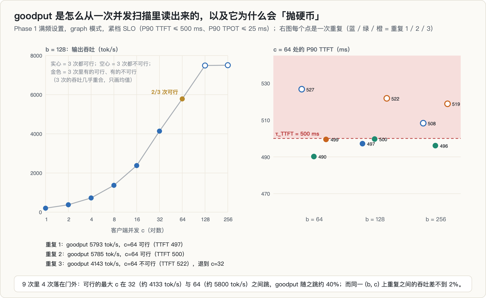

graph 紧档那个 21% 的 CV 是怎么来的？看逐点数据：

- 同一个 (b, c) 上，重复之间的吞吐差 ≤ 1.9%，P90 TPOT 差 ≤ 1.7%，测量本身很稳。
- 但 b ≥ 64 时，c = 64 的 P90 TTFT **恰好落在 500 ms 附近**：9 次里 4 次在门外（508、519、522、527 ms），5 次在门内（490–500 ms）。
- 于是「可行的最大 c」在 32 和 64 之间抛硬币，goodput 随之在约 4100 和约 5800 tok/s 之间跳，差约 40%。

**这不是测量噪声，是 c 网格按 2 倍步进造成的离散化。** goodput 的定义只取「已测的可行点」，SLO 边界又恰好落在两个网格点之间。

它对判定有多大影响，可以用同一份数据算一个探索性的例子：vLLM 默认值 B1（b = 256）在紧档的 regret，离散口径下是 **10.7%**，按下面 A-033 的插值口径是 **0.1%**。P1 的门槛正好是 10%。

### 10.4 CV 超标意味着什么

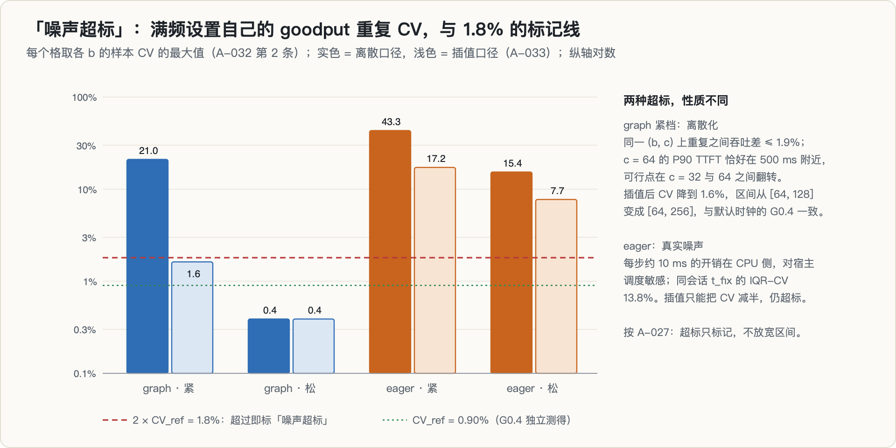

两种超标性质不同：

1. **graph 紧档是离散化**。插值之后 CV 从 21.0% 降到 1.6%，区间从 [64, 128] 变成 [64, 256]，与默认时钟下 G0.4 的 [64, 256] 一致。
2. **eager 是真实噪声**。同一 (b, c) 上重复之间的吞吐差可达 24%，P90 TPOT 差可达 46%。eager 每步约 10 ms 的开销在 CPU 侧，对宿主机调度敏感；同会话 t_fix 的 IQR-CV 是 13.8%，与此一致。插值只能把它的 CV 减半（43.3% → 17.2%，15.4% → 7.7%），仍然超标。

按 A-027 的规则，超标只做标记，区间不放宽。但它的含义比一个标记重：

- **打破共线的唯一杠杆，恰恰是最吵的数据。** Π_fix 这一维只能靠 eager 点撑起来，而 eager 只有 2 次重复、CV 两位数。合并一致性检验允许「|误差| > 1 个网格步的点」最多一个，eager 点每个都可能因为噪声偏一格。按事先冻结的规则，这很可能把主图推回只用 graph 的二维版本（这是我的推断，不是登记的结果）。
- **离散口径下，P1–P3 的门槛可能由抛硬币决定。** 上面 B1 的 regret 在 10.7% 和 0.1% 之间，就是例子。
- **这是一个拟合设置**。留出设置上会不会出现同样的边界巧合，没有人知道。

### 10.5 A-033：两种口径都过才算过

看完这个设置之后、任何留出数据之前，我裁决了第 33 条修正（09-27 08:00，看过数据之后写）：

- 新增**插值 goodput**：在最后一个可行 c 与下一个已测的不可行 c 之间，对先被违反的约束按 log–log 线性插值到 SLO 交点，吞吐在同一位置插值；只在已测点之间插，不外推。
- **整条分析流程在离散、插值两种口径下各跑一遍，P1、P2、P3、实用价值主张和合并一致性都要求两种口径同时通过。** 只在插值口径下成立的结论不得宣称。
- 代价写在条目里：离散口径的随机翻转可能让本来成立的结论被判不通过，这条规则偏保守。
- eager 维持 2 次重复。

分析代码的自检从 66 项扩到 83 项，全部通过。**这是项目的最后一次提交。**

---

## 11. 死因

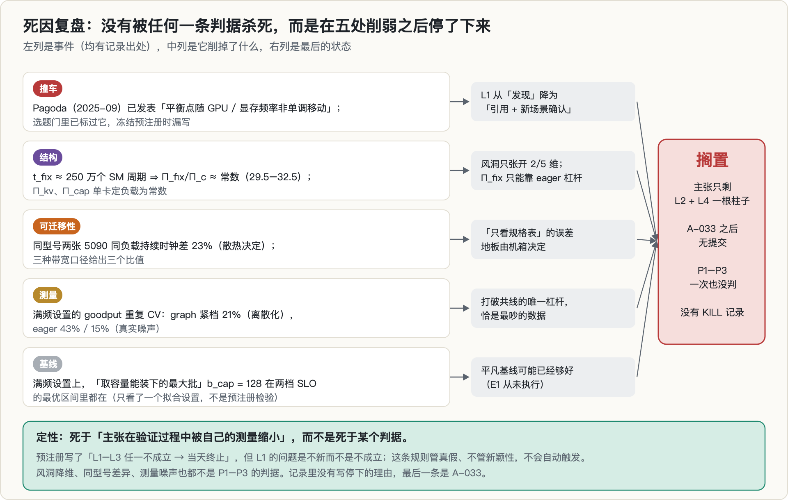

### 11.1 撞车：L1 被 Pagoda 抢先一年

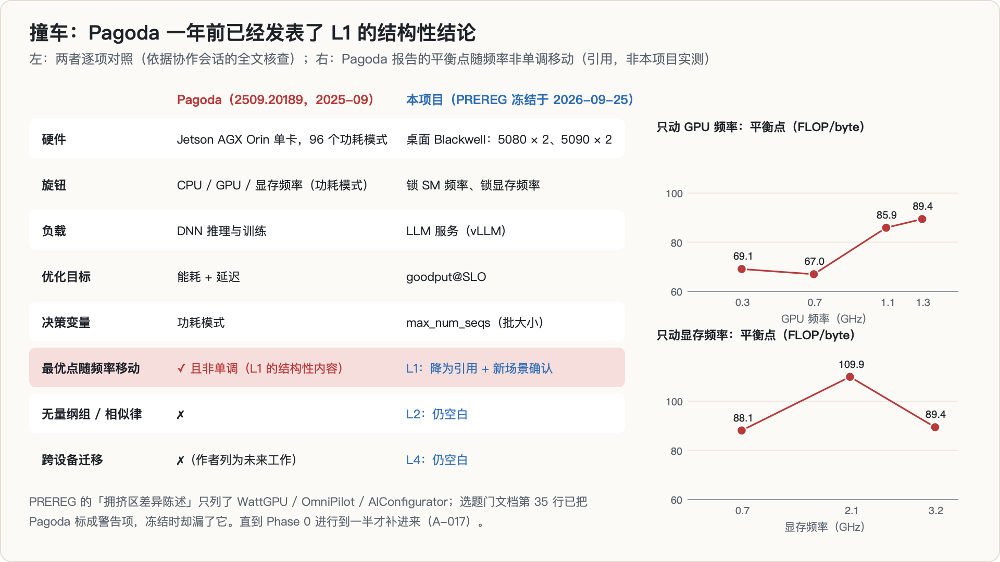

Phase 0 进行到一半（09-26 09:44），协作会话读完了 **Pagoda**（arXiv 2509.20189，2025-09-24）的全文。它在 Jetson AGX Orin 上为各功耗模式建时间与能耗的 roofline，正文里有一句话几乎就是 L1：

> "The balance points do not shift monotonically with variation in GPU and memory frequencies."

还带了具体数字（引用）：GPU 频率 1.3 → 1.1 → 0.7 GHz 时平衡点 89.4 → 85.9 → 67.0 FLOP/byte，降到 0.3 GHz 反而右移到 69.1；显存频率 3.2 → 2.1 GHz 时右移到 109.9，降到 0.7 GHz 又左移回 88.1。另外，默认功耗模式并不是最省能的。

**这就是 L1 的结构性内容，早了一年。** 严格说，Pagoda 移动的是 roofline 平衡点和最优功耗模式，L1 说的是 LLM 服务的最优批大小对 goodput@SLO 的移动，负载、目标、决策变量都不同，所以 L1 不是逐字被抢，但它已经从「发现」降为「新场景里的确认」。Pagoda 为每个功耗模式单独建一条 roofline，这也正是 B2-measured 的做法，说明 L3 要打败的基线就是领域的常规做法。

更扎心的是发现过程：选题门文档第 35 行**已经把 Pagoda 标为警告项**，冻结预注册时，「拥挤区差异陈述」那一节却只列了 WattGPU / OmniPilot / AIConfigurator。**最近的邻居在冻结时被漏掉了。**我裁决：不改任何判据、不终止，把 Pagoda 补进差异陈述，L1 降为引用（A-017）。

还有一点值得记下：预注册写的是「L1–L3 任一不成立 → 当天终止」，**但 L1 的问题不是不成立，而是不新。这条终止规则管真假，不管新颖性，所以它不会自动触发。**是否继续变成了一个需要人拍板的判断。

### 11.2 结构：风洞是降维的

第 9.2 节已经讲过：graph 模式下 $\Pi_\text{fix}/\Pi_c$ 近乎恒定，$\Pi_\text{kv}$、$\Pi_\text{cap}$ 在单卡定负载下是常数，风洞只张开 2 维。eager 杠杆能撑起第三维，但它同时改变算子融合，而且在 Phase 1 里是最吵的数据；一个均匀的模式偏移又会被合并图误读成 $\Pi_\text{fix}$ 的作用。

它的直接后果是：对一张会独立移动 $\Pi_\text{fix}$ 的新卡（按预测，5090 的 $\Pi_\text{fix}/\Pi_c$ 约为风洞的 2 倍），查表就不是插值而是**外推**，而量纲分析并不许可外推。它许可的只是「有了正确的组之后，曲线会塌到一起」。

### 11.3 可迁移性：被自己的数据削弱

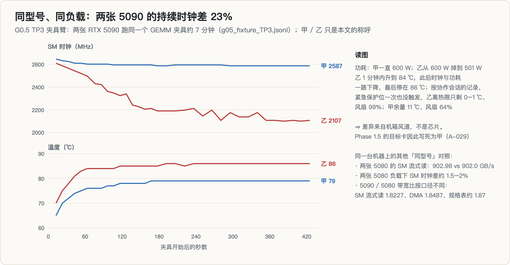

G0.5 的第三个时间点里，两张 5090 跑同一个 GEMM 夹具约 7 分钟，**持续时钟一张是 2587 MHz、另一张约 2100 MHz，相差 23%**（实测）。按协作会话的记录，慢的那张离热限只剩 0–1 ℃、风扇 99%，快的那张余量 11 ℃、风扇 64%，两张都没有触发紧急保护位。**差异来自机箱风道，不是芯片。**

这对任何「只看规格表就预测」的方法都是一个误差地板：它由个体卡加机箱散热决定，而不是由模型决定。项目据此把 Phase 1.5 的目标卡写死为较凉的那张（A-029），否则 Phase 1.5 会变成在测机箱风道。

同一类证据还有两条：

- **三种带宽口径给出三个比值**：5090 / 5080 的 SM 流式读是 1645.9 / 902.98 GB/s，比值 1.8227；DMA 拷贝是 1503 / 813，比值 1.8487；规格表约 1.87。零 profiling 的场景里实践者只有规格表，而口径选择会让 $t_W$ 差约 1.4%。
- 两张 5080 之间就小得多：SM 流式读 902.98 对 902.0 GB/s（两个会话、两套代码，差 0.1%），负载下 SM 时钟差约 1.5–2%。

另外，5080 → 5090 同为 SM120 架构、同 ISA、同驱动，在审稿人眼里基本是「同一款卡的大号版本」，这是跨硬件证据里最弱的一档。真正的测试是 L4 的 H100 / B200，而 L4 以 L1–L3 全过为前提。

### 11.4 基线：平凡的启发式可能已经够好

协作会话在给我的全景讲解里指出了最可能致命、又最便宜能检验的一条：Phase 0 测出的 $b_\text{cap} = 128$，落在默认时钟下的最优区间 [64, 256] 里（那次网格没测 128）。在 Phase 1 满频设置上，128 在 graph 两档的区间 [64, 128] 和 [128, 256] 里也都在（探索性，只看了一个拟合设置）。也就是说，「取容量能装下的最大批」这个只需要规格表和模型配置、真正零成本的启发式，很可能直接命中最优区间。默认时钟下 G0.4 的数据也说明了收益集中在哪：b = 16 的 goodput 约 2340–2350 tok/s，b = 64 与 256 都在 5830–5910 tok/s，两遍里两者分别只差 0.79% 和 0.11%。**这个决策的收益几乎全部来自「别选小的」，区间内部的精细区分在噪声量级。**

建议是：在投入剩余机时之前，先补测 b = 128 并加上四个平凡基线（$b_\text{cap}$、框架默认、从源卡照搬、B2-spec），事先冻结判据，逐留出设置报 regret。**这个实验（E1）从未执行。**

### 11.5 最后停在哪里

- git 历史的最后一个提交是 **A-033（09-27 08:00）**，写于满频设置跑完、任何留出数据之前；
- 下一段锁频（包括两个留出设置）**从未开跑**，P1–P3、合并一致性、Phase 1.5 **一次也没判过**；
- 项目里**没有 KILL 记录**，也没有写明为什么停。此后的提交都发生在别的方向上。

所以如实的说法是：**没有被任何一条预注册判据杀死，而是在 L1 被抢先、风洞被证明只有二维、可迁移性被自有数据削弱之后，不再推进。**死法是「主张在验证过程中被自己的测量缩小」，而不是「被某个判据证伪」。

---

## 12. 真的部分

这些测量本身是有效的，可以复用：

1. **t_fix 是固定的 GPU 周期数**（CUDA graph 模式、单卡 5080、vLLM 0.30、Qwen3-1.7B）：约 2.41–2.65 M 个 SM 周期，跨 2 倍的 F 只变 1.101 倍。由此推出的「单卡 DVFS 风洞里 $\Pi_\text{fix}/\Pi_c$ 近乎恒等」，有干净的代数和实测支持。它告诉任何想用调频来模拟别的硬件、做跨平台预测的人，**哪些参数在原理上分不开**。协作会话的判断是，这可能是整个项目里最硬的一个结果，而且不怕被抢发、不怕平凡基线。
2. **5080 的时钟有三个状态**，以及它们对「空闲基线」「满频分母」的影响。
3. **带宽口径**：SM 流式读、DMA 拷贝、规格表三者不同；decode 走的是 SM 流式读，DMA 拷贝期间 SM 停在 240 MHz。
4. **graph 与 eager 的每步时间**：b = 1 时 4.73 ms 对 14.99 ms（3.2 倍），eager 对宿主机负载敏感得多。
5. **同卡双实现的 goodput 工具**差 ≤ 0.29% / ≤ 1.00%；同型号两张 5080 在同参数下吞吐差中位数 +0.45%。
6. **热耦合量级**：两张 5090 合计约 600 W 跑 3 分钟，空闲的相邻卡升温 2–3 ℃；约 1100 W 持续运行，升温 13 ℃（51 → 64 ℃）；相邻 5080 跑锁频作业，约 6 ℃。
7. **温度敏感度只有上界**：20 ℃ 温度摆动下，时钟变化上界 0.187%、带宽 0.164%、GEMV 0.499%（第一版，按自己冻结的前置条件判为 inconclusive，但上界可用）。第二版用了升温、降温两条梯，结果两条梯的斜率**符号相反**（SM 时钟 −0.22 对 +1.56 %/℃），把「疑似混杂」变成了「证实混杂」。第一版只有升温梯，它会给出一个斜率，我们很可能就把它报出去了。
8. **一套完整的服务测量协议**：逐点预热、测量期间采样、后端断言、锁频读数核验（可能失败）、区间读法、独立 CV 参照，以及 83 项自检的分析代码。

---

## 13. 过程中的错误与更正

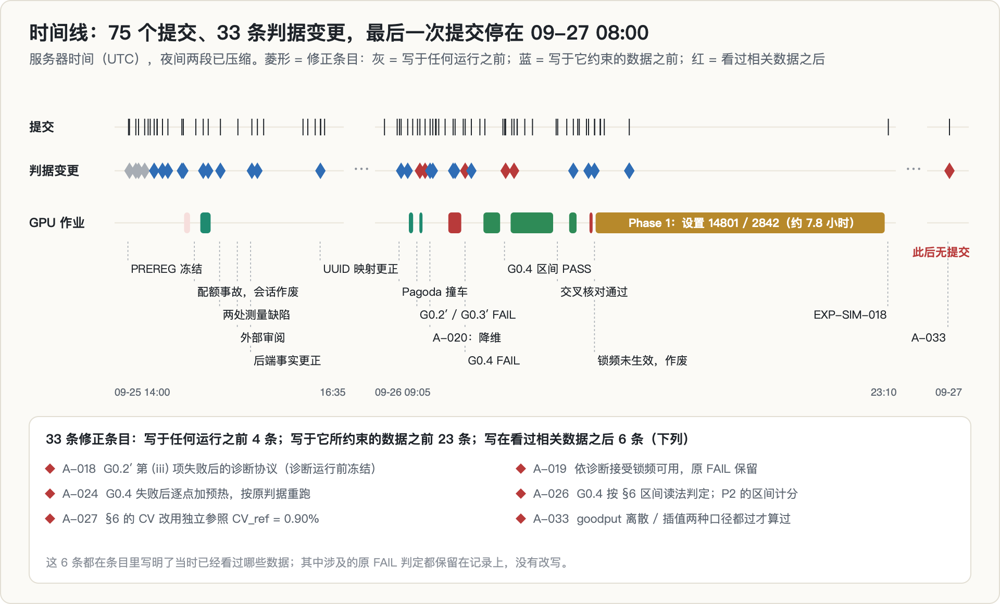

| 错误 | 后果 | 怎么发现的 | 处理 |
|---|---|---|---|
| 下载大模型前只看了 `df`，没查用户配额 | 第一次锁频会话的 trace 被截断，6 个设置的记录丢失 | 写入失败 | 会话作废、数据隔离；锁频前加配额预检 |
| 脚本用 `grep … \|\| true`，吞掉了 Python 的失败 | 失败的锁频会话看起来正常走完 | 事后查 trace | `set -o pipefail`；完整输出落日志 |
| 时钟在计时循环结束后才采样；带宽用了 DMA 拷贝 | G0.2 没测到「测量期间」；G0.3 的 t_fix 用错分母（隐含 W 随 SM 频率漂移） | 工具检查发现拷贝期间 SM 停在 240 MHz | A-012：测量期间 NVML 采样 + SM 流式读；原 FAIL 保留 |
| 以为「t_fix 在 CPU 侧、与 GPU 时钟无关」 | Π_fix 的定义与风洞的维数都建立在错前提上 | G0.3′ FAIL，W 交叉核对排除分母错误 | A-020 重定义 Π_fix；加 eager 杠杆与合并一致性检验 |
| 以为已钉死 TRITON_ATTN / FA2 后端 | 所有运行实际是 FLASH_ATTN + FA2 | 读日志里的 `Unknown vLLM environment variable` | A-013：改为断言日志 |
| 以为 Qwen3-8B 已在缓存里 | Phase 1b 的前提不成立 | 核查目录内容：0 个权重文件 | A-006 更正，Phase 1b 需要下载 |
| 服务路径 `max_num_batched_tokens` 默认值写成 8192 | 一个翻转项给不出第二个取值 | 读 vLLM 源码与日志：服务路径默认 2048 | A-031 更正，补测 8192 |
| G0.4 第一次运行没有预热 | 冷启动停顿主导 P90 TTFT，FAIL | 看逐请求延迟 | A-024：逐点预热，按原判据重跑 |
| 点值读法会把平局判成不可重复 | 一次正常的测量会被判失败 | 真实判定运行上两遍 64 对 256 | A-026：按预注册 §6 的区间读法 |
| 若用被评估数据自估 CV，数据越糟越容易过关 | 自检空洞化 | 协作会话指出 | A-027：CV_ref = 0.90% 固定 |
| 持久模式关闭时锁频会丢 | Phase 1 第一次尝试的数据无效 | 测量期间 SM 2865 MHz 高于锁定值 | A-030：开持久模式、读数核验锁频；数据隔离 |
| 冻结预注册时漏写 Pagoda | L1 的最近邻居在冻结时缺席 | 协作会话的全文撞车核查 | A-017 补入；L1 降为引用 |
| 自检因错误原因失败（生成长度 48 截断了答案） | 另一半测量没跑 | 看生成文本 | 生成长度改为 160 |
| 用 SIGTERM 中途杀掉 GEMM 负载夹具 | 两张 5090 卡在 100% 利用率（最可能的触发），后续 5090 上的测量暂停 | trace 缺收尾记录；终止孤儿进程后卡仍不动 | 夹具改为按时自然结束；空闲判定改为四张卡多次采样 |

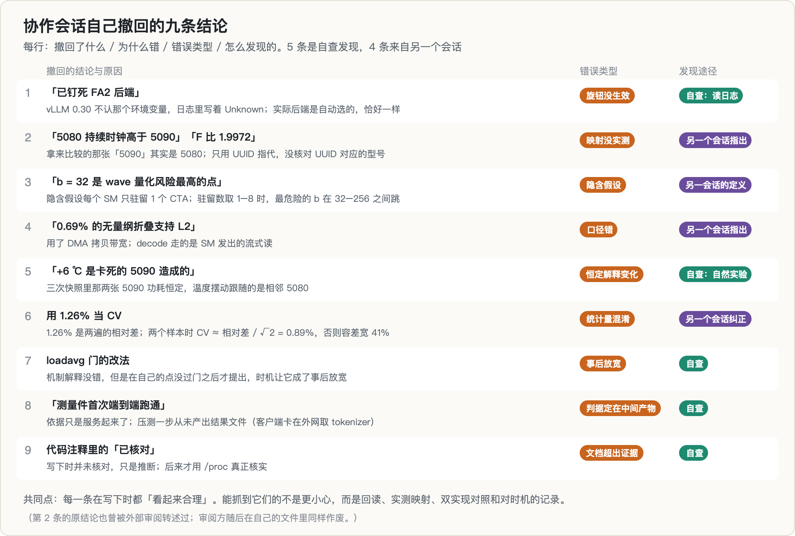

协作会话把自己撤回的九条结论完整列了出来（上图）。每一条在写下时都「看起来合理」。能抓到它们的不是更小心，而是几件机械的事：回读、实测映射、双实现对照、记录每次修改的时机。其中一条是代码注释里的「已核对」三个字：写下时并没有核对，只是推断，后来才用 `/proc` 真正核实。**文档不能超出证据，哪怕只是一行注释。**

外部审阅（另一个 AI 助手）也有撤回：它最初说解析基线 B2 是稻草人，依据是只读了摘要的 2605.04178；主会话读了全文后指出，B2-measured 用的已经是实测峰值，只有 B2-spec 才是那种误差 95% 的基线，审阅方随即撤回。它还说 wave 量化的风险「零成本就能算出」，但 tile 形状由 cuBLAS 启发式或 Triton autotune 在运行时决定，事先算不出来，要抓 kernel 才知道。这与 [投机解码那篇](../spec-decoding-rl-mismatch/) 里的经验是同一条：**每一条事实论断都要回到原文核对，不管是谁提出的。**

---

## 14. 我学到了什么

1. **预注册的终止规则要同时管真假和新颖性。**「L1–L3 任一不成立就终止」挡不住「L1 成立但不新」。项目没有被任何规则杀死，只是一步步失去了继续投入的理由。下次应该事先写下：最近的邻居发表了什么，就降级到什么、在什么条件下停。
2. **冻结之前，把选题门里标过的每一个警告项都写进差异陈述。** Pagoda 在选题门文档里是明文警告，冻结时却漏了。
3. **「这个维度能不能动」要在设计时就推一遍代数，而不是等数据告诉你。** $\Pi_\text{fix}/\Pi_c = t_\text{fix}F/(2P)$ 是三行代数，只要知道 t_fix 与 SM 频率的关系，就能提前看到风洞只有两维。
4. **留出一个角点，就是在测外推。** 设计留出集时应该先画出实际可达集和拟合凸包，再决定留谁。
5. **goodput 这类「取最大可行点」的指标，在 SLO 边界附近是离散的。** 同一份数据，B1 的 regret 可以是 10.7%，也可以是 0.1%。下次应该在预注册里就写好插值口径，或者把 c 网格在 SLO 附近加密。
6. **自检必须可能失败，也不能因为错误的原因失败。** 区间读法、独立 CV 参照、锁频核验的反向对照，都是先证明「它会失败」，再拿来判。
7. **「卡是空闲的」「锁频生效了」「后端钉死了」都要回读，而且要多个字段一起看。** 本项目里每一个看起来干净的单一字段，都骗过我们一次。
8. **便宜的致命实验先做。** 全景讲解里的 E1（补测 b = 128 加四个平凡基线）只要几小时、不用租卡，它要么清掉最大的威胁，要么告诉你现在止损。它是在 Phase 1 已经开跑之后才被提出的，建议「在投入剩余机时之前先做」，结果一直没做。这类检验应该在预注册时就排在最前面。

---

## 15. 局限与开放问题

**测过的范围**：一张 RTX 5080（SM120），6 个锁频设置里只有满频 (14801, 2842) 跑完了主扫描；vLLM 0.30.0，FLASH_ATTN + FA2；Qwen3-1.7B（bf16），翻转项有 R1-Distill-Qwen-1.5B；负载 W2（random 256/256）与 W1（GSM8K 长度分布）；CUDA graph 与 eager；两档 SLO 加一档只报告的极紧档；决策旋钮只有 `max_num_seqs`。

**没测过的**（本文的任何结论都不能外推到这里）：

- 两个留出设置、其余三个拟合设置，因此 **L1–L3 没有任何判定**；
- Phase 1.5（5080 → 5090）和 Phase 2（H100 / B200）；
- 平凡基线 E1、B3 与实用价值主张、相似对检验、wave 量化的 kernel 抓取；
- 更大的模型、多卡、其它推理框架。

**开放问题**：

- 协作会话提出过一个**免费、留在 graph 模式**的杠杆：扫负载长度 $\bar S$。$\Pi_\text{kv}$ 和 $\Pi_\text{cap}$ 都依赖 $\bar S$，而 $\bar S$ 是负载旋钮、不是硬件旋钮；扫它会移动这两个组，而 $\Pi_\tau$、$\Pi_c$、$\Pi_\text{fix}$ 都不动，能把风洞从 2 维扩到 4 维。它没有被预注册，要做必须作为新问题重新冻结。
- 「单卡 DVFS 风洞里 $\Pi_\text{fix}$ 与 $\Pi_c$ 不可识别」这一结构性结论，在别的 GPU、别的引擎上是否同样成立（它依赖于 t_fix 由固定的 GPU 周期主导），值得单独检验。
- 如果要重启这个方向，应该先跑 E1；它不通过，就没有必要再投 38 GPU 小时。

---

## 16. 复现

- **环境**：vLLM 0.30.0（只读复用另一个项目的虚拟环境），attention 后端以日志断言为准（FLASH_ATTN + FA2），`VLLM_USE_FLASHINFER_SAMPLER=0`；GPU 只用 UUID 指代，`CUDA_DEVICE_ORDER=PCI_BUS_ID`；锁频与持久模式由本人以 root 执行，用完复位。
- **代码**：`g02_measure.py`（锁频微基准：SM 流式读、DMA 拷贝、GEMM、指针追逐）、`nvml_sampler.py`（测量期间采样）、`g05_tfix.py`（每步时间原语）、`g04_goodput.py`（唯一判定用的 goodput 工具）、`goodput.py`（协作会话的独立实现）、`lock_check.py`（锁频读数核验）、`phase1_run.py`（Phase 1 扫描）、`analyze_phase1.py`（冻结的分析代码，自检 `test_analyze_phase1.py` 83 项）、`eval_g02.py` / `eval_g02_diag.py` / `eval_g04.py` / `eval_xcheck.py`（各闸门的判定脚本）。
- **记录**：预注册在第一个提交 `738a73a`；Π_fix 重定义与降维在 `c42e984`（A-020）；Phase 1 满频设置在 `ed26f20`（EXP-SIM-018）；最后一个提交 `9bf04c0`（A-033）。共 75 个提交、33 条修正条目、19 条主实验记录（EXP-SIM-000 到 018）与 11 条协作会话的记录；作废数据在 `traces/quarantine/`，每份都附了原因。
- **trace**：`g02.jsonl`、`g02_diag.jsonl`、`g04.jsonl`、`g05.jsonl`、`g05_canary.jsonl`、`g05_fixture_TP3.jsonl`、`phase1.jsonl`、`phase1_tfix.jsonl`、`phase1_lockcheck.jsonl`、`thermal_watch.jsonl`、`thermal_sens*.jsonl`，全部 append-only。
- **本文的图**：由只用 Python 标准库的脚本从上述 trace 和文档直接生成（SVG 再转 PNG）；Phase 1 的数字直接调用项目冻结的 `analyze_phase1.py` 计算。

---

## 参考

按「做了什么、关键结论、和本篇什么关系」逐条展开。标 ⭐ 的三篇分别对应本篇的方法论、竞争对手和测量学警告。

### A. ⭐ 性能建模与 roofline：本篇方法论的来源

**⭐ Microbenchmark-Driven Analytical Performance Modeling Across Modern GPU Architectures** · [arXiv 2605.04178](https://arxiv.org/abs/2605.04178)
为 Blackwell（B200）和 AMD CDNA3（MI300A）建立解析性能模型，基础是系统性的微基准表征。Blackwell 侧显式建模 TMEM、TMA 和第五代 tensor core。出发点：**理论峰值与可达性能的差距在持续拉大**。
**与本篇的关系**：**这是本篇最直接的方法论参照**——都是「用微基准反推参数，再用解析模型外推」。区别在于它建的是绝对性能模型，本篇想建的是**无量纲的相似律**：不预测绝对值，只预测最优批大小在不同卡之间怎么迁移。

**Pagoda: An Energy and Time Roofline Study for DNN Workloads on Edge Accelerators** · [arXiv 2509.20189](https://arxiv.org/abs/2509.20189)
在 Nvidia Jetson 边缘设备上做**能耗与时间双 roofline** 研究。这类设备在 70W 功耗包线内有 2000+ CUDA 核，并提供**上千种功耗模式**来定制 CPU / GPU / 内存频率，功耗–性能权衡差异很大。
**与本篇的关系**：**「上千种功耗模式」正是本篇「锁频造假卡」这个想法的先例。** 它证明了通过调频在一张物理卡上扫出一整片性能空间是可行的、且被严肃研究采用的方法。本篇 Phase 1 的设计直接建立在这个前提上。

**From Roofline to Ruggedness** · [arXiv 2605.29752](https://arxiv.org/abs/2605.29752)（见[第 2 篇](../sm120-fp4-cliff/)的详细注释）
相邻 GEMM 只差 128 个元素就可能有 30% 吞吐差异，roofline 看不见这种「崎岖度」。
**与本篇的关系**：对「用少数几个测点拟合一条光滑曲线」这个做法的直接警告。相似律要求性能曲面足够规则，而这篇说明它不是。

### B. ⭐ 竞争对手：预测最优配置这件事已经有人做了

**⭐ AIConfigurator: Lightning-Fast Configuration Optimization for Multi-Framework LLM Serving** · [arXiv 2601.06288](https://arxiv.org/abs/2601.06288)
生产系统里优化 LLM 推理越来越难：负载动态、延迟/吞吐目标严格、配置空间快速膨胀。这个空间不只包括分布式并行策略（张量/流水/专家），还包括**框架特定的运行时参数**（如是否启用 CUDA graph 之类）。
**与本篇的关系**：**这是本篇主张的直接竞争对手。** 我想用相似律预测最优批大小，而它已经在做「快速搜出最优配置」——而且覆盖的维度多得多。§ 判据变更到第 33 条时，很大一部分压力来自这类工作把可声称的贡献挤没了。

**⭐ WattGPU: Predicting Inference Power and Latency on Unseen GPUs and LLMs** · [arXiv 2607.02391](https://arxiv.org/abs/2607.02391)
标题就是本篇想做的事：**在没见过的 GPU 和 LLM 上预测**功耗与延迟。作者指出已有预测模型**仍然需要 profiling 数据，且泛化能力有限**。
**与本篇的关系**：**这篇和本篇的主张几乎重合**——都是「测几张卡，外推到没测过的卡」。差别只在我用无量纲组、它用别的建模方式。这是主张被削到只剩一根柱子的主要原因之一。

**OmniPilot: An Uncertainty-Aware LLM Inference Advisor for Heterogeneous GPU Clusters** · [arXiv 2607.01579](https://arxiv.org/abs/2607.01579)
在共享异构集群上，用户必须在投入机时前选好 GPU 型号、并行度和精度，而有效吞吐、启动成功率、集群需求与利用率持续波动，**静态配方抓不住**。
**与本篇的关系**：「不确定性感知」这个角度是本篇缺的——我的相似律给点预测，没给区间。而在一个持续波动的系统里，点预测的实用价值有限。

### C. ⭐ 测量学：本篇最该早读的一篇

**⭐ AutoTuneBench: Trustworthy Measurement for Agent Auto-Tuning of LLM Serving Engines** · [arXiv 2609.18123](https://arxiv.org/abs/2609.18123)
从一份为期四天、619 次模型调用的试点语料里，刻画出**四种失败模式**：稻草人基线制造出虚假加速、**绝对时间无法跨机器迁移**、饱和的任务让比较失去意义、以及基础设施噪声。
**与本篇的关系**：**第二条就是本篇的立身之本，第三条是本篇的死因。** 我的整个设计就是为了绕开「绝对时间不可迁移」（所以用无量纲组），但没料到会撞上第三条——当测点落在饱和区，不同设置之间的比较本身就不成立。§ Phase 1 只跑完 6 个设置里的第 1 个就停了，这篇讲的正是那种情形。

### D. 本专栏内部

- [第 2 篇：消费级 Blackwell 的 FP4「架构悬崖」是真的吗？](../sm120-fp4-cliff/) —— 同样用锁频/对照机做归因，也同样撞上「测在地板上」。
- [第 4 篇：量化、KV 并发和投机解码在抢同一份显存吗？](../vram-budget-composition/) —— 另一个停在 smoke 的候选，两篇的共同教训是**先确认测点不在固定成本区**。
