> **TL;DR**
>
> - **问题**：投机解码能省多少时间，取决于 draft 提议的 token 被接受的概率 α。我想知道：**有没有一种量化配置，准确率几乎不掉，α 却悄悄掉很多？** 我把它叫作「沉默税」。并行的另一个会话刚测出：FP8 / INT8 对 α 零影响，NVFP4 让 α 从 0.8256 跌到 0.0644。零影响和灾难之间，看起来一定有一条边界。
> - **做法**：先写死判据（H1 沉默税窗口、H2 机制签名、H3 回本，外加 kill 条件），再在 Qwen3-1.7B 加一个 EAGLE 式 draft 上扫 7 个量化臂。每个臂测两样东西：teacher forcing 下精确计算的 α（155,757 个位置），和 GSM8K 100 题的准确率。
> - **结果**：**先死于 bug，再按预注册 KILL。** NVFP4 的「悬崖」来自假量化器本身：它在只有非负幅值的 E2M1 网格上，对带符号的数找最近点，于是**所有负权重都被清零**，模型报废。修复后，NVFP4 的 α 是 0.7998（−3.1%），准确率 0.74（基线 0.83）。没有任何臂落进 H1 窗口，按预注册 kill。建在这个 bug 上的论文 idea（记录里叫 Idea A''）主命题不成立，前后 **19 个臂作废**（并行会话 16 个，本项目 3 个）。
> - **过程**：bug 的签名一直摆在数据里：准确率 0.00；100 道题的输出全是冒号；α 在四个位置桶里小数点后四位完全相同；模型和它自己的 4-bit 版本之间，分布重合度是 0.0000。同一台机器上的另一个项目，在 bug 第一次出现前 38 分钟就已经有一份正确实现。从第一次读出 0.0644 到打上补丁，用了约 15.5 小时。
> - **更正**：原 bug 报告还列了第三个签名：「保护 lm_head 毫无变化」。写这篇时我发现它不成立：INT4 对照臂保护 lm_head 同样毫无变化，100 道题的生成文本逐字相同。原因是加载 draft 时，BF16 的 lm_head 被原样写回了 target，**所以任何一个臂的 lm_head 其实都没被量化过**。这是同一条流水线里的第二个静默 bug。
> - **附带**：α 和准确率可以完全脱钩。INT4 per-channel 的 α 只降了 6.6%，准确率却从 0.83 掉到 0.33。

---

## 0. 读法

| 部分 | 内容 |
|---|---|
| 1–3 | 背景与原理：α 怎么测；FP4 E2M1 与 NVFP4；假量化怎么实现；bug 的机制，为什么模型会「死」，为什么 α 会和位置无关 |
| 4–6 | 动机与假设链、这个题在选题链里的位置、预注册 |
| 7–9 | S2-A 边界扫描与三个签名、发现与修复、死因与判决 |
| 10–13 | 真的部分、时间线与更正、复盘、教训 |
| 14–15 | 局限、复现 |

**数字来源**：本项目的 `s2_boundary.jsonl`（α 分桶与准确率汇总）和 `s2_acc.jsonl`（逐题输出）；并行会话的 `s1_precision.jsonl`、`s3_selfcast.jsonl`（只引用，不复跑）；另一个项目的 `evt_probe.jsonl`；以及三份驱动日志。图都由脚本直接从这些文件画出。

文中的数字按来源分四类：**实测**（trace / 日志里有）、**文档记录**（只写在 `BUG-SIGN-001.md` 里、没有对应 trace 的，例如修复自检的 SQNR）、**推导**（我自己算的，未在服务器上验证）、**引用**（外部资料）。标「探索性」的数字不参与判定。原项目没有写出正式判决书，H1–H3 的判决是我按预注册原文，对修复后的数据套用出来的。

时间一律用服务器时间（UTC），与同专栏其它篇一致。事件从 09-24 晚上持续到 09-25 上午；按北京时间算，全部落在 09-25 这一天。

---

## 1. 背景：投机解码的接受率 α 怎么测

### 1.1 α 与 τ

投机解码里，一个小的 draft 先猜几个 token，大模型（target）用一次前向检查它们，再按拒绝采样决定接受几个。拒绝采样为什么「无损」，[第 9 篇](../spec-decoding-rl-mismatch/)的第 2 节有完整推导；这里只需要一个量。

设 target 在位置 $t$ 的分布是 $p_t$，draft 的分布是 $q_t$。draft 提议 $x \sim q_t$，以概率 $\min(1, p_t(x)/q_t(x))$ 接受。于是这个位置的接受概率是

$$
\alpha_t = \sum_x q_t(x)\,\min\!\Big(1, \frac{p_t(x)}{q_t(x)}\Big) = \sum_v \min\big(p_t(v),\, q_t(v)\big) = 1 - \mathrm{TV}(p_t, q_t)
$$

也就是两个分布**重合部分的面积**。α 越大，每次 verify 能多接受几个 token。若 draft 一次猜 $K$ 个，并把 α 近似看成常数，那么每次 verify 期望产出的 token 数是

$$
\tau = 1 + \alpha + \alpha^2 + \dots + \alpha^K = \frac{1 - \alpha^{K+1}}{1 - \alpha}
$$

本项目取 $K = 5$。基线 α = 0.8256 对应 τ = 3.918；α 掉到 0.0644 时，τ 只剩 1.0688，投机解码基本等于没开。

### 1.2 本项目的测法

α 不是靠真的跑投机解码去统计的，而是用 **teacher forcing 精确算出来**：

1. 取 100 条固定的真实 rollout（[第 1 篇](../rl-spec-draft-maintenance/)那个项目里 Qwen3-1.7B 在 GSM8K heldout 题上以 T = 0.6 生成的），截到 2048 个 token；
2. target 对整条序列做一次前向，拿到每个位置的 $p_t$；
3. draft 是前一个项目训练好的 EAGLE 式 draft head（`draft_v7b`），输入是 **target 倒数第二层的隐藏状态**加上当前 token 的词嵌入，输出 $q_t$；它和 target 共用词嵌入与 lm_head；
4. 逐位置算 $\sum_v \min(p_t, q_t)$，不做任何采样。

100 条序列一共 155,757 个位置，按位置分成四个桶：1–64、65–256、257–1024、1025–2048。无量化基线（实测）是 **0.5505 → 0.7061 → 0.8275 → 0.8954**：越往后 α 越高。直觉上的解释是，解题写到后面，数字和套话都在重复，draft 更好猜；开头上下文少，最难猜。这个解释我没有单独验证。

有一点后面会用到：**draft 吃的是（量化后的）target 自己的隐藏状态。** 所以 α 衡量的是「draft 能不能跟上这个量化后的 target」，而不是「量化后的 target 离原模型有多远」。

---

## 2. 原理：FP4 E2M1、NVFP4 与假量化

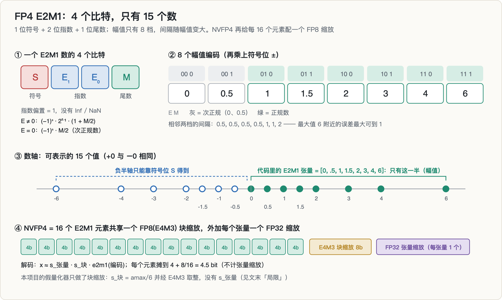

### 2.1 E2M1：4 个比特，15 个数

FP4 的 E2M1 格式有 1 位符号 S、2 位指数 E、1 位尾数 M，指数偏置为 1，没有 Inf 和 NaN：

- $E \ne 0$ 时是正规数：$(-1)^S \cdot 2^{E-1} \cdot (1 + M/2)$，得到 1、1.5、2、3、4、6；
- $E = 0$ 时是次正规数：$(-1)^S \cdot M/2$，得到 0 和 0.5。

所以幅值只有 8 档：**{0, 0.5, 1, 1.5, 2, 3, 4, 6}**，再配上符号，共 15 个不同的值（+0 与 −0 相同）。相邻两档的间隔依次是 0.5、0.5、0.5、0.5、1、1、2：越靠近最大值 6，间隔越大，最坏情况下舍入误差可到 1。

要记住的是：**这 8 个数是幅值，不是全部可表示值。** 负半轴是符号位给的。代码里常见的写法 `E2M1 = [0, .5, 1, 1.5, 2, 3, 4, 6]` 只存了右半边，用它的人必须自己处理符号。

### 2.2 NVFP4：16 元素块 + FP8 缩放

光有 15 个数，没法直接表示一个真实的权重矩阵，所以要配缩放因子。NVIDIA 的 NVFP4 用两级缩放（引用自 NVIDIA 技术博客）：

- **块缩放**：每 16 个元素共享一个 FP8（E4M3）缩放因子。E4M3 能表示非 2 的幂的缩放，比 MXFP4 用的 2 的幂缩放更细；
- **张量缩放**：每个张量再乘一个 FP32 标量，把整体分布挪到 E4M3 好用的范围里。

解码就是 $x \approx s_\text{张量} \cdot s_\text{块} \cdot \text{e2m1}(\text{编码})$，摊下来每个元素约 4.5 bit。对照一下，OCP 的 MXFP4 用 32 元素块和 2 的幂缩放。按 NVIDIA 博客的说法，NVFP4 在其基准任务上相对 FP8 的精度下降在 1% 左右或以内。这个参照点在后面很重要。

### 2.3 假量化（fake quant）是什么

研究量化对模型行为的影响时，常常不去跑真正的 FP4 kernel，而是做**假量化**：把每个权重「量化再反量化」，结果仍以 BF16 存回模型。数值上，它等价于模型只能用那些可表示值；计算上，走的还是原来的 BF16 路径。本项目 NVFP4 臂的做法是：

1. 把权重摊平，补零到 16 的倍数，切成 16 个一组；
2. 每组取 $\text{amax} = \max|w|$，块缩放 $s = \text{amax}/6$，再把 $s$ 舍入到 E4M3；
3. $g = w / s$，在 E2M1 网格上找最近点，乘回 $s$，写回 BF16。

这里**没有**实现 FP32 张量缩放（见第 14 节局限）。

假量化的好处是便宜、可控。代价是：**量化器是你自己写的代码，没有任何 kernel 或库替你检查它。** INT8 和 INT4 的假量化是 `clamp(round(x/s), -127, 127) * s` 这种一行式，天然带符号；FP4 要在一张查找表上找最近点，符号就得手动处理。

---

## 3. bug 的机制

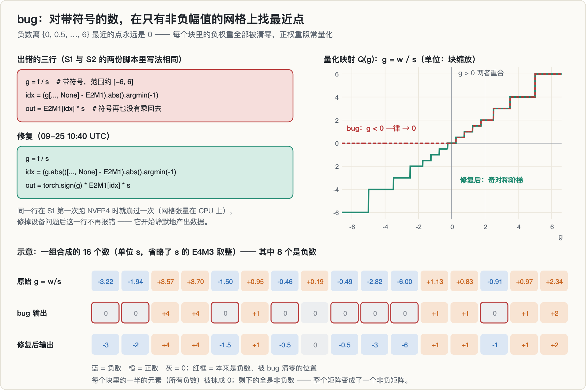

### 3.1 出错的三行

```python
E2M1 = torch.tensor([0., .5, 1., 1.5, 2., 3., 4., 6.])   # 幅值网格，全为非负
g   = f / s                                                # 带符号，范围约 [-6, 6]
idx = (g.unsqueeze(-1) - E2M1.view(1, 1, -1)).abs().argmin(-1)
out = E2M1[idx] * s                                        # 符号再也没有乘回去
```

修复只改两处：先对 $|g|$ 找最近点，再乘回 `torch.sign(g)`。

### 3.2 为什么负数全都变成 0

对任意负数 $g < 0$，它到网格点 0 的距离是 $|g|$，到任何其他网格点 $v > 0$ 的距离是 $|g| + v$，一定更大。所以 **argmin 永远选 0**。

原 bug 报告写的是「负权重被映射到 0 或 +0.5」。按上面的推导，其实只会是 0，不会是 +0.5（这是一处小更正）。正数一侧的量化是对的。结果就是：**每个 16 元素块里，约一半的元素（所有负数）被抹成 0，剩下的全是非负数。** 被量化的每一个线性层都变成了非负矩阵。

同一个文件里的 INT8 和 INT4 per-channel 量化器都是带符号的 `clamp(round(x/s))`，没有这个问题。所以这个项目里所谓的「量化器设计悬崖」，真实内容是**一个正确的量化器和一个坏掉的量化器之间的差别**。

### 3.3 为什么模型会「死」得这么彻底（推导）

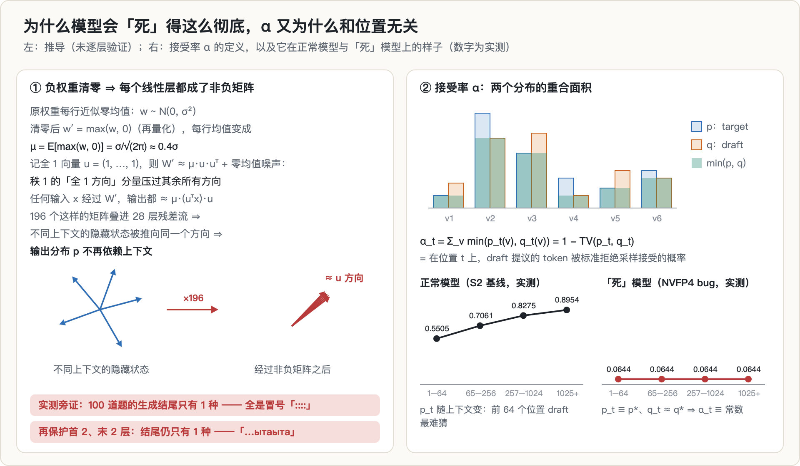

**🖼 怎么读这张图**
>
> **左半边**讲「模型为什么死」：负权重清零后，每个线性层都变成**非负矩阵**。非负矩阵有一个很强的性质——它的主奇异方向接近全 1 向量 $u$（Perron–Frobenius 的直觉版本）。于是矩阵可以拆成「秩 1 的 $\mu uu^\top$ + 零均值噪声」，而图上要看的就是**这两部分的量级比**：817σ vs 53σ，相差 15 倍。任何输入经过它都被投影到同一个方向上，28 层叠下来，**不同上下文的隐藏状态收敛到同一点**。
>
> **右半边**讲「这件事在 α 上留下什么指纹」：α 是 $p$ 与 $q$ 两条分布的重合面积。正常模型的 α 随位置**从 0.5505 爬到 0.8954**（上下文越多，draft 越好猜）；坏模型四个桶**全是 0.0644**，一条水平线。
>
> **关键在于「平」这个特征，而不是「低」。** 低只说明退化严重，平说明 $p_t$ 已经不随上下文变化了——也就是模型不再看输入。这是把「量化损伤」和「模型死亡」区分开的判据，也是 §3.4 那组天然对照（只量化 target / 都量化 / 只量化 draft）能定位 bug 的原因。
>
> 如果只记一件事：**看到一个指标在所有分桶上小数点后四位完全相同，先怀疑尺子，不要急着解释现象。**

这一节是推导，我没有在服务器上逐层验证。

设某一行权重近似 $w \sim \mathcal{N}(0, \sigma^2)$，均值为 0。负数清零之后，$w' = \max(w, 0)$，这一行的均值变成

$$
\mu = \mathbb{E}[\max(w, 0)] = \frac{\sigma}{\sqrt{2\pi}} \approx 0.4\,\sigma
$$

记全 1 向量为 $u$，整个矩阵就可以写成 $W' \approx \mu\, u u^\top + \text{零均值噪声}$。对一个 $2048 \times 2048$ 的矩阵，秩 1 部分的算子范数约为 $\mu n \approx 817\sigma$；噪声部分的标准差约 $0.58\sigma$，算子范数约 $2 \times 0.58\sigma \times \sqrt{n} \approx 53\sigma$。前者大约是后者的 15 倍。

这意味着，任何输入 $x$ 经过 $W'$ 之后都约等于 $\mu (u^\top x)\, u$，只剩「全 1 方向」上的一个标量。196 个这样的矩阵叠进 28 层残差流，不同上下文的隐藏状态都被推向同一个方向，最后一层 RMSNorm 之后几乎一样，于是**输出分布不再依赖输入**。

两条实测旁证：

- NVFP4（bug）臂在 100 道 GSM8K 题上，生成文本的最后 160 个字符**只有 1 种**：全是冒号；
- 额外保护首末各 2 层之后（仍有 24 层是坏的），100 道题的结尾仍然只有 1 种，换成了一串重复的「ыта」。

### 3.4 为什么「死」模型的 α 和位置无关

α 随位置变化，是因为 $p_t$ 和 $q_t$ 都随上下文变化，而它们的重合程度又和上下文的多少有关。一旦 target「死」了，$p_t$ 就恒等于某个固定分布 $p^*$；draft 的输入又来自这个死掉的 target 的隐藏状态，所以 $q_t$ 也近似固定为 $q^*$。于是

$$
\alpha_t = \sum_v \min\big(p^*(v),\, q^*(v)\big) = \text{常数}
$$

实测：NVFP4（bug）臂四个桶的 α 都是 **0.0644**，样本数从 6,400 到 74,143 不等，小数点后四位完全相同。基线则是 0.5505 → 0.8954。

并行会话在 bug 期间恰好跑过一组天然对照（见第 7.4 节的图）：

- 只量化 target：四个桶都是 0.0644，**平**；
- target 和 draft 都量化：四个桶都是 0.3560，**平**；
- 只量化 draft：0.0013 → 0.0001 → 0.0001 → 0.0000，**接近 0 但不平**，因为这时 $p_t$ 还活着，还在随上下文变。

**只有 target 死的时候，α 才会平。** 所以恒定的 α 不是「退化得很厉害」的读数，而是「模型已经不看输入了」的指纹。

### 3.5 「保护 lm_head 零变化」本来想说明什么

原 bug 报告里的第三个签名是：NVFP4 臂加上「lm_head 不量化」之后，α 仍然是 0.0644，毫无变化。它的推理是：如果损伤是 197 层各自贡献一点、分布式累积起来的，那么把最大的一层（lm_head，151936 × 2048）恢复成高精度，至少应该挽回一点；零变化说明模型在 lm_head 之前就已经死透了。

这个推理本身没错，前提是「保护」真的生效了。第 7.5 节会说明，在这条流水线里它没有生效。所以这个签名什么也说明不了。

---

## 4. 动机与假设链

### 4.1 S1 给了什么

并行的另一个会话在做 S1：精度 → 接受率的机制链，详见[第 3 篇](../quant-spec-interaction/)。我这边做的 S2 只引用它的数据。到我写预注册为止，S1 的结果是（实测）：

| S1 臂（teacher forcing） | α（ALL） | 相对基线 |
|---|---|---|
| 无量化 | 0.8256 | — |
| target FP8（E4M3，per-channel） | 0.8259 | +0.04% |
| target INT8（per-channel） | 0.8253 | −0.04% |
| target NVFP4（假量化） | 0.0644 | −92.2% |
| draft NVFP4（假量化） | 0.0001 | −99.99% |

S1 自己的 I-A 判定表写于 09-24 19:08，只含 FP8 / INT8 两臂，结论是「机制链断」。NVFP4 臂恰好在那一刻第一次运行，在做 argmin 的那一行上因为网格张量留在 CPU 上而崩溃；19:11 的重跑读出了 0.0644，19:14 之后设备问题彻底修好，这一行再也没有报过错。

### 4.2 我从中读出的问题

我在 S2 预注册的「已有数据」一栏里写的是：**FP8 / INT8 双侧零影响；NVFP4 双侧灾难。** 从「零」到「灾难」，中间似乎必然有一条边界。于是问题变成：边界附近，有没有这样一种量化配置——

- **准确率几乎不掉**，部署的人会觉得「量化没问题」，于是放心地开投机解码；
- **α 却掉了很多**，投机解码的加速悄悄缩水。

这就是「沉默税」。它若存在，就有直接的决策价值：量化和投机解码是部署时一起选的，而 α 是一个很便宜的在线指标。

### 4.3 假设链

- **H1（沉默税窗口）**：存在某个量化臂，准确率 ≥ 基线 × 95%，且 α 相对下降 ≥ 20%。
- **H2（机制签名）**：权重量化造成的 α 退化在位置桶上是平的；KV 量化造成的退化随位置累积、是斜的。这条是为了以后能从分桶曲线反推「税」来自哪里。
- **H3（回本）**：在 H1 窗口里最重的那个臂上，把 draft 对着量化后的 target 重新对齐，≤ 200 步能恢复 ≥ 80% 的 α 损失，由此给出回本所需的 token 数。

回头看，这条链的第一环（「NVFP4 双侧灾难」）就是 bug 的产物。后面三环都架在它上面。

---

## 5. 这个题是怎么来的

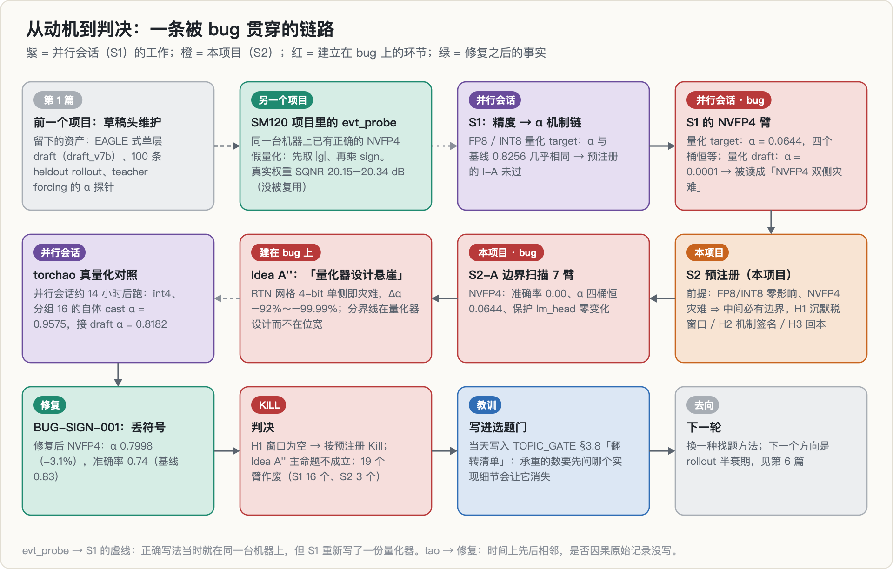

- **继承自[第 1 篇](../rl-spec-draft-maintenance/)**：训练好的 EAGLE 式 draft head、100 条 heldout rollout、teacher forcing 的 α 探针。那个方向本身死于撞车，工具链留了下来。协同纪律也来自那里：两个会话曾经同时向同一个日志写入、互相挤占显存，所以这次写了一份 `COORDINATION.md`，约定 S2 只读 S1 的目录、错开 GPU、每次实验登记、长任务的日志加唯一后缀。
- **同一台机器、同一晚**：[SM120 FP4](../sm120-fp4-cliff/) 那个项目的目录里，09-24 18:33 跑过一个 `evt_probe.py`，用来研究块缩放格式的量化误差。它的 NVFP4 假量化写得是对的：先对 $|q|$ 找最近点，再乘 `sign(q)`。29 个真实权重张量的 SQNR 在 20.15–20.34 dB 之间。这份代码没有被 S1 复用，S1 自己重写了一份。
- **S1 → S2 的分工**：S1 管机制链，S2 管边界、机制签名和回本。S2 的目录里原样复制了 S1 的 `s1_precision_alpha.py` 和 `draft_head.py`；S2 自己的 `s2_boundary.py` 里另有一份量化器，NVFP4 那一段的注释写着「与对方 s1 口径一致」。
- **之后**：S1、S2 的数据被拼成一个论文 idea（记录里叫 Idea A''，第 9.2 节）；bug 被发现后，这个方向在当天（09-25 13:16）被写进选题门文档 `TOPIC_GATE.md` 的 §3.8，成为「五次死亡的共同根因」表里的一行。下一个方向换了一种找题方法，是 [rollout 半衰期](../rollout-half-life/)。

---

## 6. 预注册：跑之前写死了什么

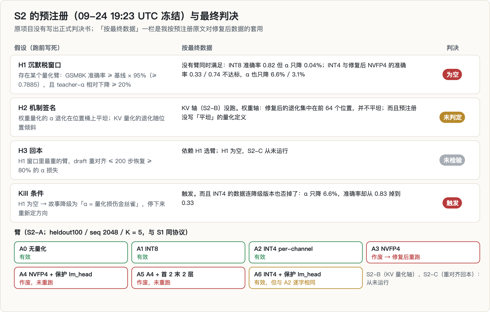

`S2_PLAN.md` 冻结于 09-24 19:23，**在 S2 的任何数据之前，但在 S1 的 NVFP4 数据之后**（它的前提就是那组数据）。里面写死了：

| 项 | 内容 |
|---|---|
| 协议 | 与 S1 完全相同：heldout100 rollout、seq 2048、K = 5、teacher forcing 精确 α、四个位置桶 |
| 准确率 | heldout100 同一批 GSM8K 题；chat 模板、关闭 thinking、greedy、max_new = 512；抽取 `####` 后的数字，没有就取最后一个数字 |
| H1 | 准确率 ≥ 基线 × 95%（= 0.7885），且 teacher-α 相对下降 ≥ 20% |
| H2 | 权重量化分桶平坦、KV 量化分桶倾斜 |
| H3 | H1 窗口内最重的臂，draft 重对齐 ≤ 200 步恢复 ≥ 80% 的 α 损失 |
| Kill | H1 为空 → 故事降级为「α = 量化损伤的金丝雀」，停下来重新定方向 |
| 臂 | A0 无量化 / A1 INT8 / A2 INT4 per-channel RTN / A3 NVFP4（「复刻对方口径交叉验证」）/ A4 NVFP4 + 保护 lm_head / A5 A4 + 保护首末各 2 层 / A6 INT4 + 保护 lm_head |
| 后续 | S2-B：KV 量化轴（检验 H2 的另一半）；S2-C：重对齐回本（检验 H3） |
| 纪律 | 每次实验登记 `EXPERIMENTS.md`；trace 只增不改；实测 / 引用分开标注 |

预注册之后没有任何判据变更记录。另一方面，`EXPERIMENTS.md` 也从来没有被创建过（见第 11 节）。

---

## 7. 实验：S2-A 边界扫描

### 7.1 设计

每个臂的流程都一样：加载模型 → 按臂量化 target 的线性层 → 加载 draft → 测 α → 测准确率。INT8 与 INT4 都是按输出通道对称量化（缩放分别是 amax/127 与 amax/7，INT4 共 15 档）；NVFP4 按第 2.3 节。7 个臂在一张 RTX 5090 或 5080 上跑完（计划文件和协同文件对 `cuda:1` 是哪张卡的说法不一致，日志没有记录型号），19:32 开始，19:45 结束，一共 13 分钟。

19:28 的第一次驱动 1 秒内就全部失败：驱动脚本没有把 tag 传给 Python，7 个臂都报「缺少 `--tag`」，退出码 2。4 分钟后脚本修好，再没出过这个问题。

### 7.2 自检：有什么，缺什么

**有的**：一次 smoke（只跑无量化臂，准确率只测 8 题），α 的四个桶和 S1 的基线**逐位相同**。这证明两边的协议确实一致。

**缺的**：**没有任何针对量化器本身的测试。** 预注册里 A3 被写成「复刻对方口径交叉验证」，但「复刻」的方式是复制同一份代码。所以 A3 读出 0.0644、与 S1 完全吻合时，它看起来像一次通过的交叉验证，其实是同一个 bug 跑了第二遍。**一份代码和它自己比对，不可能失败。**

### 7.3 签名一：准确率 0.00，输出全是冒号

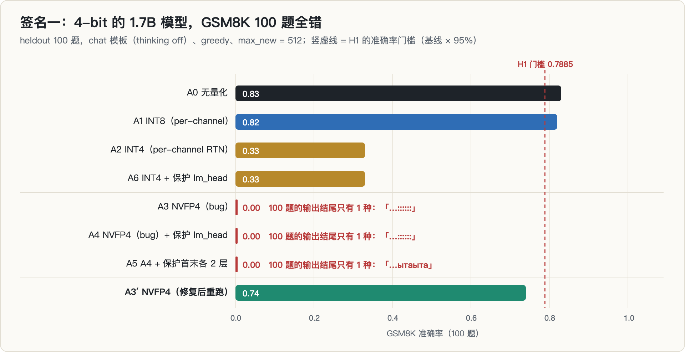

| 臂 | α（ALL） | Δα | τ | 准确率 |
|---|---|---|---|---|
| A0 无量化 | 0.8256 | — | 3.918 | 0.83 |
| A1 INT8 | 0.8253 | −0.04% | 3.916 | 0.82 |
| A2 INT4 per-channel | 0.7712 | −6.6% | 3.451 | 0.33 |
| A3 NVFP4（bug） | 0.0644 | −92.2% | 1.069 | **0.00** |
| A4 NVFP4（bug）+ 保护 lm_head | 0.0644 | −92.2% | 1.069 | **0.00** |
| A5 A4 + 保护首末各 2 层 | 0.0515 | −93.8% | 1.054 | **0.00** |
| A6 INT4 + 保护 lm_head | 0.7712 | −6.6% | 3.451 | 0.33 |

一个 1.7B 的模型量化到 4 bit，GSM8K 不可能一题都做不对。只要打开 `s2_acc.jsonl` 看一眼，就能看到 100 道题的 `gen_tail` 字段是同一串冒号。这个数 19:39 就已经写进了 trace。

### 7.4 签名二：α 在四个位置桶里一模一样

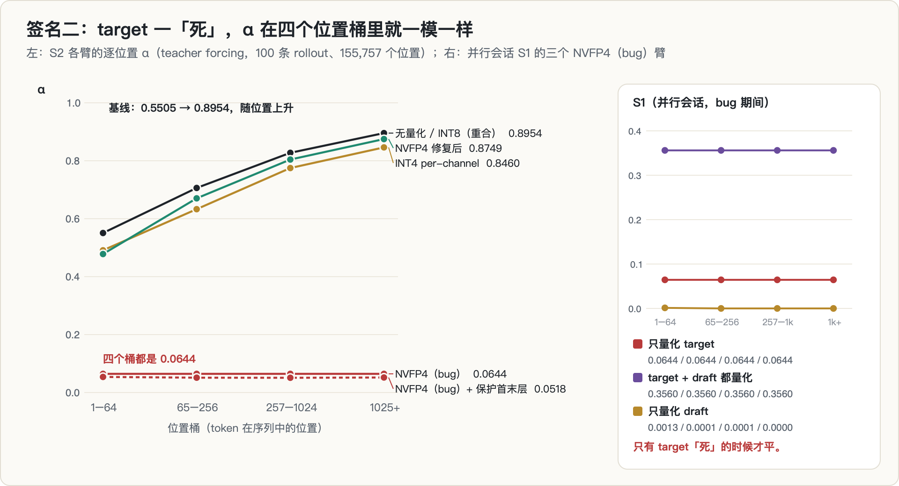

一个正常的量化模型，α 应该和基线一样随位置上升，只是整体低一些。INT4 和修复后的 NVFP4 都是这样。NVFP4（bug）臂却是四个一样的 0.0644，τ 的逐桶值也全是 1.0688。第 3.4 节解释过：这是输出与输入无关的指纹。

这个签名比准确率还早：19:11，S1 的 NVFP4 臂第一次读出来就是这样。

### 7.5 签名三：「保护 lm_head 零变化」——其实是另一个 bug

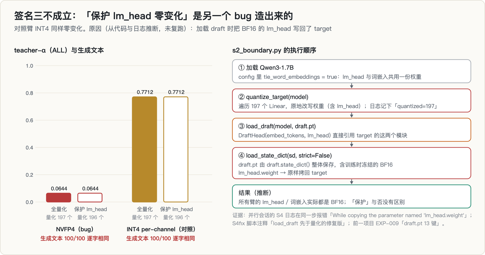

原 bug 报告把「A4 与 A3 一样」列为第三个签名。但预注册里还有一个对照臂：**A6（INT4 + 保护 lm_head）与 A2（INT4）也一模一样。** α 四个桶逐位相同，准确率都是 0.33，100 道题的生成文本逐字相同。INT4 的模型是活的；如果它的 lm_head 真的被量化成了每行 15 档，不可能对输出毫无影响。所以不是「模型已经死透了」，而是**「保护」这个操作本身没有造成任何差别**。

对照代码和日志，原因可以定位到执行顺序（推断，没有在服务器上复跑）：

1. Qwen3-1.7B 的配置里 `tie_word_embeddings = true`：lm_head 与词嵌入共用一份权重；
2. `quantize_target` 遍历 197 个线性层，原地改写权重，其中包括 lm_head。日志里记下的是 `quantized=197`（保护臂是 196）；
3. 然后 `load_draft` 构造 `DraftHead(model.model.embed_tokens, model.lm_head)`，**直接引用 target 的这两个模块**；
4. 再执行 `load_state_dict(sd, strict=False)`。而 `draft.pt` 是在前一个项目里用 `draft.state_dict()` 整体保存的，里面带着训练时冻结的 BF16 `lm_head.weight`。这份权重被原样拷回了 target。

结果是：**所有臂的 lm_head 和词嵌入实际上都是 BF16**，保护与否没有区别。三条旁证：

- 并行会话后来用 torchao 量化 target 时，恰好在这一步报错：`While copying the parameter named "lm_head.weight" ...`；
- 它随后的补跑脚本注释写着「load_draft 先于量化的修复版」；
- 前一个项目的记录里写着「draft.pt 13 键加载正常」。单层 draft 自己的参数只有 11 个张量，多出来的两个正是词嵌入和 lm_head。

这是同一条流水线里的**第二个静默 bug**。它的后果有三条：签名三作废；A4 ≡ A3、A6 ≡ A2，预注册里的两个「保护」臂没有提供任何信息；本文所有「量化」臂，严格说都是「除 lm_head / 词嵌入外的 196 个线性层」被量化。S1、S1b、S1c 的 target 量化臂用的是同一个加载顺序（S1 的脚本直到 09-25 10:21 才把加载 draft 挪到量化之前），也受影响。

要区分的是 S1 的另一组「自体 cast」实验（S3）。它直接比较 BF16 模型和它的量化版本，不加载 draft，所以那里的「不量化 lm_head」是真的生效了：FP8 的自体 α 从 0.9873 变成 0.9879。NVFP4（bug）在那里是 0.0000 → 0.0000，这个「零变化」是有效的读数，但它能说明的也只是「模型在 lm_head 之前就已经死了」。[第 3 篇](../quant-spec-interaction/)引用的「保护 lm_head 零效果」是这一组。

---

## 8. 发现与修复

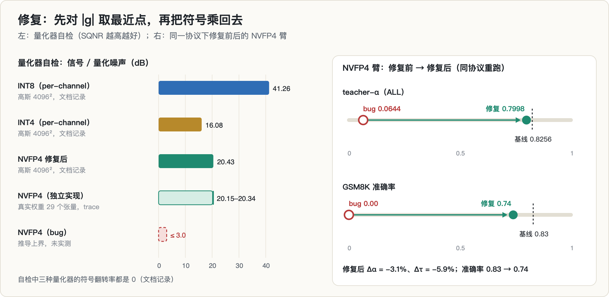

### 8.1 怎么发现的

`BUG-SIGN-001.md` 没有写发现过程。能确定的只有时间顺序：

- 约 14 小时后，09-25 10:05–10:13，并行会话用 torchao 的真实量化器做交叉验证。int4、分组 16 的「自体 cast」α（模型和它自己的量化版本之间的重合度）是 **0.9575**，而 NVFP4 假量化是 **0.0000**。
- 10:18–10:24，它又跑了假量化的块长扫描（32 / 64 / 128，仍然全是 0.0000），以及 torchao int4 接 draft 的 α（**0.8182**，相对基线 −0.9%）。
- 10:40，S2 目录里两份脚本同时被打补丁；10:40–10:43 重跑 NVFP4 与 INT4 对照；10:43 写下 `BUG-SIGN-001.md`。

值得注意的是，Idea A'' 的两条主张——「校准仿射安全、RTN 危险」「块长 32/64/128 救不了」——正是来自 10:05–10:24 这几组数据。也就是说，**独立实现给出的矛盾读数，一开始被吸收成了论文的论据，而不是被当成警报**，直到 10:40 才被翻过来。它们之间是不是因果，原始记录没有写。

### 8.2 修复与自检

修复见第 3.1 节。修复后的自检（**文档记录**，4096 × 4096 高斯随机矩阵，没有对应的 trace）：

| 量化器 | SQNR | 符号翻转率 |
|---|---|---|
| INT8 per-channel | 41.26 dB | 0 |
| INT4 per-channel | 16.08 dB | 0 |
| NVFP4（修复后） | 20.43 dB | 0 |

NVFP4 比 INT4 高约 4 dB，这符合预期：每 16 个元素一个缩放，比每行一个缩放细得多。这个值也和那份独立实现在 29 个真实权重张量上的 20.15–20.34 dB（实测）对得上。

作为对照，bug 版的 SQNR 可以直接推导：负半边的误差就是信号本身，占总能量的一半，所以 $\text{SQNR} \le 10\log_{10} 2 \approx 3.0$ dB。**这样一个秒级的单元测试，在写代码的那一刻就会报警。**

### 8.3 重跑

| 臂 | α（ALL） | 分桶 α | Δα | Δτ | 准确率 |
|---|---|---|---|---|---|
| 无量化（基线） | 0.8256 | 0.5505 / 0.7061 / 0.8275 / 0.8954 | — | — | 0.83 |
| NVFP4（bug） | 0.0644 | 0.0644 × 4 | −92.2% | −72.7% | 0.00 |
| **NVFP4（修复后）** | **0.7998** | 0.4781 / 0.6702 / 0.8043 / 0.8749 | **−3.1%** | −5.9% | **0.74** |
| INT4 per-channel（修复后重跑） | 0.7712 | 0.4910 / 0.6329 / 0.7747 / 0.8460 | −6.6% | −11.9% | 0.33 |

INT4 的重跑与修复前逐字相同（100/100），说明补丁没有碰到 INT4 的路径。A4、A5，以及 S1 那边的全部 NVFP4 臂（draft 侧、双侧、自体 cast、块长扫描、第二个模型）**都没有用修复后的量化器重跑**。

---

## 9. 死因与判决

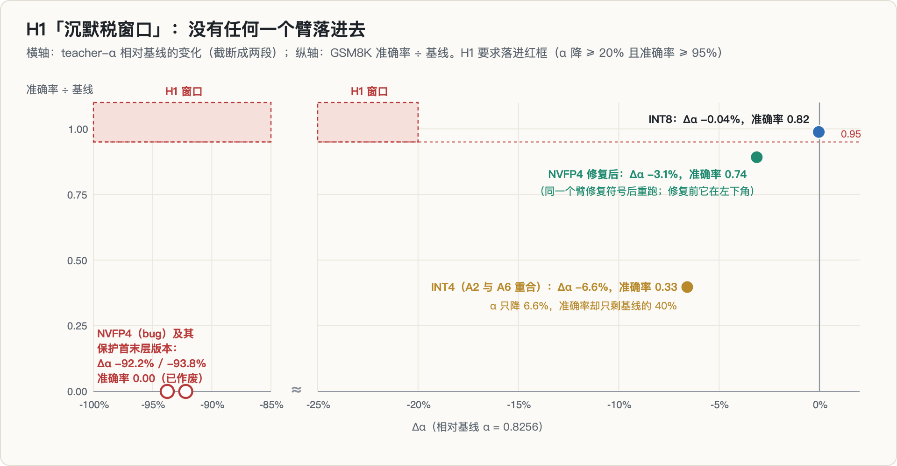

### 9.1 判决

**死因分两层：承重的数死于 bug；bug 修掉之后，按预注册的 kill 条件终止。**

- **H1：为空。** INT8 准确率够了，但 α 只降 0.04%；INT4 和修复后的 NVFP4，α 只降 6.6% 与 3.1%，准确率 0.33 与 0.74 也都不到 0.7885。没有一个臂同时满足两个条件。即使用 bug 版的数据，NVFP4 也因为准确率 0.00 不在窗口里。
- **H2：未判定。** KV 量化轴（S2-B）从来没跑。权重轴上，修复后 NVFP4 的相对损失集中在前 64 个位置（逐桶 −13.2% / −5.1% / −2.8% / −2.3%，探索性），并不平坦；而且预注册没写「平坦」的量化定义，这一半也判不了。
- **H3：未检验。** 它依赖 H1 选臂，S2-C 从未运行。
- **Kill：触发。** 预注册的降级方案是「α = 量化损伤的金丝雀」，但 INT4 的数据连这个降级版本也否掉了：α 只降 6.6% 时，准确率已经从 0.83 掉到 0.33。一个在模型损失六成准确率时只响 6.6% 的金丝雀，不能当金丝雀用。

### 9.2 Idea A'' 被推翻

Idea A'' 的原始文档我在服务器和本地都没有找到。它的主张只保留在 `BUG-SIGN-001.md` 第 5 节里。逐条对照修复后的数据：

| Idea A'' 的主张 | 修复后 |
|---|---|
| 「naive RTN 网格量化 4-bit，单侧即灾难，Δα −92% ～ −99.99%」 | target 侧 Δα = −3.1%；draft 侧没有重测 |
| 「同一 4-bit 位宽下，差两个数量级」 | NVFP4 −3.1% 对 INT4 −6.6%，差 2 倍，不是 100 倍 |
| 「校准仿射安全、RTN 危险」 | 顺序反过来：NVFP4（块 16 的 RTN）优于 INT4（per-channel RTN） |
| 「分界线在量化器设计，不在位宽」 | 分界线在代码正确性 |
| 「块长 32/64/128 救不了，元凶是网格 + 无校准」 | 块长扫描是在一个坏掉的量化器上做的消融 |

`BUG-SIGN-001.md` 的结论是：主命题不成立，idea 的三张图里，敏感度地图和机制图的数据全部来自这个 bug。选题门文档 `TOPIC_GATE.md` 里记作「EVT / SD-safe 量化」、承重数「Δα −92%」的那一行，指的应该就是它（两处引用的是同一个 −92%，这是我的推断）。

### 9.3 对 S1 的影响

这个 bug 作废了 S1 那边 16 个臂：target 侧、draft 侧、双侧、混合精度、自体 cast、块长扫描和第二个模型上的 NVFP4 臂。S1 的 FP8 / INT8 臂不受符号 bug 影响，但受第 7.5 节加载顺序的影响（lm_head 实际是 BF16）。

另外，S1 目录里的 `s1_precision_alpha.py` 在服务器上**至今没有打符号补丁**：修复只落在了 S2 目录里的两份脚本上。

修复后同协议的 NVFP4 target 臂是 Δα = −3.13%、Δτ = −5.89%（实测），前 64 个位置损失最大。按 S1 预注册的 I-A 初始阈值（|Δα| ≥ 3% 或 |Δτ| ≥ 5%，且分桶非均匀），两条门槛都刚好越过。[第 3 篇](../quant-spec-interaction/)据此给出的最终表述是：**I-A 在 8-bit 上的 kill 有效，4-bit 这一格没有有效答案。** 理由是 S1 自己预注册的 4-bit 臂全部作废，能用的 4-bit 数据来自非预注册的臂和本项目，而且不同的 4-bit 量化器恰好落在门槛两侧：torchao INT4 的 Δα 是 −0.9%，修复后的 NVFP4 是 −3.1%。

---

## 10. 真的部分

下面这些测量本身有效，可以复用（适用范围见第 14 节）：

1. **Qwen3-1.7B + 这个 draft 的 α 位置曲线**：0.5505 → 0.7061 → 0.8275 → 0.8954，ALL = 0.8256，τ = 3.918。S1、S2 两边各跑一次，结果逐位相同（两边用的是同一份探针代码，所以这只说明结果可重复，不算独立验证）。
2. **INT8 per-channel 对 α 没有可见影响**：Δα = −0.04%，准确率 0.82 对 0.83（逐题配对：原来答对、现在答错的 3 题；反过来的 2 题）。
3. **修复后的 NVFP4 权重假量化**（lm_head / 词嵌入实际为 BF16）：Δα = −3.1%，Δτ = −5.9%，损失集中在前 64 个位置；准确率 0.74（逐题配对：丢了 13 题、多对了 4 题）。样本只有 100 题，标为探索性。
4. **α 与准确率可以完全脱钩**：INT4 per-channel 的 α 只降 6.6%，准确率却从 0.83 掉到 0.33（逐题配对：丢了 51 题、多对了 1 题）。原因很可能就是第 1.2 节说的测法：draft 吃的是量化后 target 自己的特征，所以 α 衡量的是「draft 能不能跟上这个量化模型」，不是「这个量化模型还像不像原模型」。后者要用自体 cast α 来测。S1 测过：FP8 0.9873，INT8 0.9914，torchao int4 分组 16 为 0.9575。这个观察本身是真的，但它否定、而不是支持「用 α 当量化安全指标」的框架，而且太小、太可预期，撑不起一篇论文。
5. **一个诊断方法**：看 α 在位置桶上平不平。平 = target 的输出已经不依赖输入；接近 0 但不平 = 只有 draft 坏了。这是 S1 的三个 bug 臂恰好给出的一组天然对照。

---

## 11. 时间线、错误与更正

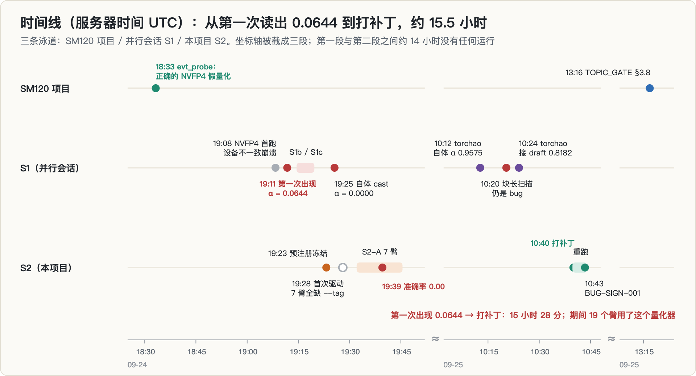

| 错误 | 后果 | 怎么发现的 | 处理 |
|---|---|---|---|
| **NVFP4 假量化对带符号值在非负幅值网格上 argmin，负权重全部清零** | 19 个臂作废；S2 的前提、Idea A'' 的主命题都建在它上面 | 原始记录没写；时间上紧跟在 torchao 真实量化器的对照之后 | 两份 S2 脚本打补丁（先取绝对值，再乘符号），重跑 NVFP4 与 INT4 对照，写 `BUG-SIGN-001.md` |
| A3 的「交叉验证」复制的是同一份代码 | 0.0644 与 S1 吻合，被当成确认 | 写这篇时对照代码来源 | 记为教训：交叉验证必须用独立实现 |
| **加载 draft 时把 BF16 lm_head 写回 target** | 所有臂的 lm_head / 词嵌入实际未量化；A4 ≡ A3，A6 ≡ A2；「保护 lm_head 零变化」这个签名不成立 | 写这篇时，发现 INT4 对照臂保护前后 100/100 逐字相同，再对照代码与 S4 日志 | 本文更正 `BUG-SIGN-001.md` 第 2 节第 3 条；未复跑（draft 权重目录已不在服务器上） |
| bug 报告写「负权重映射到 0 或 +0.5」 | 措辞不准 | 写这篇时推导 | 实际只会映射到 0，本文按「全部清零」写 |
| S1 目录里的量化器没有同步修复 | 重跑 S1 的脚本会复现 bug | 写这篇时 diff 两份脚本 | 只记录；服务器只读，未改动 |
| 首次驱动 7 个臂全部缺 `--tag` 失败 | 浪费 4 分钟，无数据污染 | 退出码 2 | 修驱动脚本 |
| 预注册要求逐次登记，但 `EXPERIMENTS.md` 从未创建；`reports/` 为空 | 没有正式判决书；H1–H3 的判决只能事后按原文套用 | 写这篇时盘点目录 | 本文第 9.1 节按预注册原文套用，并标明 |

最后一行值得多说一句：**预注册只写了「跑之前」，没写「跑之后必须留下什么」。** 修复之后，这个项目没有任何一个文件写着「H1 为空，按预注册 kill」。

---

## 12. 复盘：本该拦住它的检查

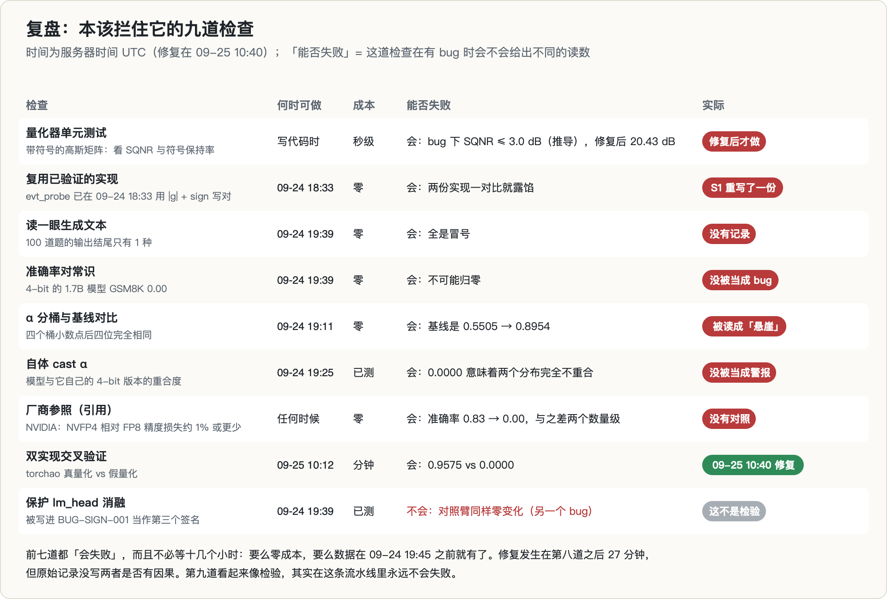

把九道检查按「能不能失败」排开，模式很清楚：

- **前七道都会失败，而且都很便宜。** 零成本的有五道（读生成文本、准确率对常识、α 分桶对比、厂商参照、复用已有实现），剩下两道是秒级的单元测试和早已测完的自体 cast。其中四道的数据，在 09-24 19:45 之前就已经在 trace 里了。
- **第八道（换一个独立实现）是离修复最近的一道**，但它的结果一开始被读成了论据。
- **第九道看起来像检验，其实永远不会失败。** 它还被写进了 bug 报告，当作 bug 的证据。

这和 `TOPIC_GATE.md` 里的规则是对得上的：

- **§3.8「翻转清单」**在 bug 修复当天就把这次死亡列为五次死亡之一，根因写的是「量化器实现」；清单模板里有一格是「实现细节（量化网格、采样截断、分词、精度）」，其中的「量化网格」对应的就是这一次。
- **§3.7「测量有效性四条」**并不是从这次事故来的：(a)「自检必须可能失败」源自 rollout 半衰期那个项目里一个「自己和自己比」的 lag0 自检，(c)「测试数据必须包含会触发分歧的病态情形」源自一次 top-p 重写。但这次事故是它们的又一个实例：A3 的「交叉验证」和「保护 lm_head」都不可能失败；而对 FP4 量化器来说，「负数」就是那个必须出现在测试数据里的病态情形。

---

## 13. 我学到了什么

1. **反常大的效应，先按 bug 查。** 按 NVIDIA 的说法，NVFP4 相对 FP8 的精度损失在 1% 左右或以内；我们读出的准确率是从 0.83 到 0.00。差两个数量级的时候，第一假设应该是代码错了，而不是发现了悬崖。
2. **交叉验证必须是独立实现。** 复制同一份代码去「复刻对方口径」，得到的吻合只说明代码是确定性的。同一台机器上本来就有一份独立的正确实现，而且早了 38 分钟。
3. **恒定是死亡的指纹，不是程度的读数。** 跨位置恒定的 α、跨题目恒定的输出、与自身 0.0000 的重合度，说的都是「输出已经不依赖输入」。应该先把它们当成流水线故障去查，而不是当成效应的大小去解释。
4. **消融要先确认自己生效了。** 「保护 lm_head 零变化」只有在对照臂上会变的时候才有信息量。对照臂也不变，说明消融本身没做成。预注册里其实有这个对照臂（A6），只是没人拿它和 A2 比。
5. **共享模块会带来远距离的副作用。** draft 直接引用 target 的 lm_head，再用 `load_state_dict(strict=False)` 加载一个带着这些键的 checkpoint，就会悄悄改写 target。加载顺序也是实验变量。
6. **修掉一个会报错的 bug 之后，要重新怀疑同一行。** NVFP4 第一次运行，就是在那一行 argmin 上因为设备不一致崩掉的。修好设备问题以后，这一行不再报错，开始静默地产出数据。
7. **读原始输出，比读汇总指标便宜得多。** `s2_acc.jsonl` 里每题都存了生成文本的结尾。只要打开一次，就能看到 100 行一样的冒号。
8. **α 不是质量的安全指标，这是由它的测法决定的。** draft 吃的是量化后 target 的特征，它会跟着量化模型一起偏。想知道量化模型离原模型多远，要看自体 cast α 或任务指标。
9. **预注册要写「跑完之后留下什么」。** 判决书、实验登记、修复后的重跑范围，都应该在跑之前定下来，否则 kill 就不会留下任何书面记录。

---

## 14. 局限与开放问题

**测过的范围**：Qwen3-1.7B（稠密，词嵌入与 lm_head 共享）；一个 EAGLE 式 draft head（`draft_v7b`）；teacher forcing 精确 α，K = 5，100 条 heldout rollout、155,757 个位置；GSM8K 100 题、greedy；只量化权重（激活仍为 BF16），而且 lm_head / 词嵌入实际上没有被量化（第 7.5 节）。

**修复后的 NVFP4 与真实 NVFP4 仍有差别**：

- **没有 FP32 张量缩放，块缩放直接转成 E4M3**（读代码确认）。推导：E4M3 的最小正规数是 $2^{-6} \approx 0.0156$，最小次正规数是 $2^{-9} \approx 0.00195$。amax/6 小于 $2^{-10}$ 的块（块内最大值小于约 0.0059），缩放会被舍入成 0，整块权重变成 0；amax/6 落在次正规区的块，缩放只能取 $2^{-9}$ 的整数倍。按 `evt_probe` 记录的 16 元素块最大值均值（各张量在 0.059–0.082 之间），典型的块缩放约为 0.0098–0.0137，正好落在次正规区，缩放本身有大约 7%–10% 的舍入误差。整块归零的块应该很少，但我没有统计。这会让修复后的 −3.1% 比真实 NVFP4 略微偏悲观；不过 `evt_probe` 用的正是同样的缩放方式，它在真实权重上的 SQNR（20.15–20.34 dB）与高斯自检（20.43 dB）相差不到 0.3 dB，所以影响应该不大；
- argmin 遇到平局时取较小的幅值，舍入规则可能与硬件不同；
- 没有走任何真实的 FP4 kernel。

**没测过、或修复后没重测的**：

- draft 侧与双侧的 NVFP4、保护臂（A4 / A5）、块长扫描、第二个模型——这些全都只有 bug 版的数据；
- KV 量化轴（H2 的另一半）、draft 重对齐回本（H3）；
- 真实的量化方法（GPTQ / AWQ / 真实 NVFP4 kernel）、更大的模型、MoE、其他 draft 结构。

**统计上**：准确率只有 100 题，0.74 对 0.83 的差别只相当于 13 题对 4 题的配对翻转，标为探索性。

**开放问题**：α 与准确率的脱钩在多大范围内成立？如果把 draft 的输入换成原模型的特征（而不是量化模型的），α 会不会变成一个像样的质量指标？要回答这些，必须作为**新问题**重新预注册，而不是拿来挽救这次的 kill。

---

## 15. 复现

- **目录**：`~/mlsys_qaccept_s2`（没有 git）。
- **代码**：`scripts/s2_boundary.py`（S2-A 边界扫描，含修复后的 NVFP4 量化器与保护模式）、`scripts/s1_precision_alpha.py`（从 S1 复制，已打补丁）、`scripts/draft_head.py`（从 S1 复制）、`scripts/run_s2a.sh`（7 臂驱动）。
- **记录**：`S2_PLAN.md`（预注册）、`BUG-SIGN-001.md`（bug 报告，含修复自检表）、`COORDINATION.md`（双会话协同约定）。
- **trace**：`traces/s2_boundary.jsonl`（每臂 4 个桶 + ALL + ACC）、`traces/s2_acc.jsonl`（逐题的预测与生成结尾），都是 append-only。关键配置哈希：无量化 `f7cf9b79bc`，NVFP4（bug）`b3be02a791`，NVFP4（修复后）`710a588001`。
- **日志**：`logs/s2a_driver_1927.log`（缺 `--tag` 的那次）、`logs/s2a_driver_v2.log`（S2-A 7 臂）、`logs/signfix.log`（修复后重跑）。
- **依赖前一个项目的资产**：Qwen3-1.7B 权重、100 条 heldout rollout、GSM8K 题与答案、`draft_v7b` 权重。其中 `draft_v7b` 所在的目录**现在已经不在服务器上了**，所以 α 的数字不能原样复现。
- **环境**（按服务器上该环境当前的包信息读出）：Python 3.14、PyTorch 2.12.0、transformers 5.17.0；S1 的 torchao 对照用 torchao 0.18.0。
- **本文的图**：由只用 Python 标准库的脚本直接从上述 trace、日志和文档生成（SVG 再转 PNG），数字不经手抄。

---

## 参考

本篇的主体是一个 bug 的机制分析，参考不多，但每一条都直接支撑推导的某一步。

### A. 数值格式：bug 发生的地方

**⭐ Microscaling Data Formats for Deep Learning（MX 格式规范）** · [arXiv 2310.10537](https://arxiv.org/abs/2310.10537)
评估 Microscaling（MX）数据格式：**每块一个缩放因子 + 块内窄浮点/整数类型**。作者强调 MX 是在硬件效率、模型精度、用户改动成本这三者之间取平衡。
**与本篇的关系**：**§2.2「NVFP4：16 元素块 + FP8 缩放」的规范来源。** 理解「块 + 缩放」这个两级结构，才能看懂 §3.1 那三行代码错在哪——错的不是 E2M1 的量化本身，而是**缩放/反缩放这一步把符号丢了**。这也解释了为什么 §3.2 里「所有负权重变成 0」而不是「变成错误的负数」。

### B. 投机解码：被这个 bug 污染的观测量

**Fast Inference from Transformers via Speculative Decoding** · [arXiv 2211.17192](https://arxiv.org/abs/2211.17192)
投机解码原始论文，给出接受规则与无损性证明。
**与本篇的关系**：§1.1 的 $\alpha$ 与 $\tau$ 定义来自这里。理解 $\alpha = \sum_x \min(p,q)$ 这个形式，才能看懂 §3.4 的推导——**为什么一个「死」模型的 α 会和位置无关**：当 $p$ 塌缩成一个与上下文无关的固定分布时，$\min(p,q)$ 的期望自然不随位置变化。这个「位置无关」正是识破 bug 的关键信号。

**EAGLE: Speculative Sampling Requires Rethinking Feature Uncertainty** · [arXiv 2401.15077](https://arxiv.org/abs/2401.15077)
在特征层而非 token 层做自回归，并显式处理特征层自回归的固有不确定性。
**与本篇的关系**：本篇用的 draft 是 EAGLE 式的。§3.5「保护 lm_head 零变化本来想说明什么」——那个设计的意图是隔离「特征通路被量化」与「输出头被量化」两条影响路径，而 EAGLE 的结构正好让这两条路径可分。

### C. 量化方法：预注册时的对照组

**GPTQ、AWQ** —— 权重量化的两个标准基线（本篇正文提到但未展开实验）。
**与本篇的关系**：预注册的边界扫描原本要在这两者与 NVFP4 之间找「准确率几乎不掉、接受率却大跌」的窗口。bug 修复后 α 只降 3.1%，**这个窗口是空的**，扫描失去了对象。

### D. 本专栏内部

- [第 3 篇：把 target 量化成 FP8 / INT8，投机解码的接受率会变吗？](../quant-spec-interaction/) —— **那篇的 4-bit 臂用的就是本篇描述的这个坏量化器，数据全部作废。** 两篇是同一条机制链上的上下游，必须对照读。
- [第 4 篇：量化、KV 并发和投机解码在抢同一份显存吗？](../vram-budget-composition/) —— 另一个被「假量化器/固定成本」误导的例子：那篇 R3-A 测到的「量化 GEMM 慢 1.8–3.4 倍」同样不是量化本身的性质。
- [第 2 篇：消费级 Blackwell 的 FP4「架构悬崖」是真的吗？](../sm120-fp4-cliff/) —— 同一时期、同一套 FP4 格式，但测的是性能而非精度；那篇的死因（测在启动开销地板上）和本篇的死因（测在坏量化器上）属于同一类：**先确认尺子是对的，再读数**。
