> **TL;DR**
>
> - **问题**：部署一个模型时，「权重用什么精度」和「开不开投机解码」是两个最常拧的旋钮，而且拧的是同一个 target。我想画一张「交互符号地图」：**把 target 量化成 FP8 / INT8 / 4-bit 之后，投机解码的接受率 α 和期望接受长度 τ 会怎么变？这种影响的正负号会不会随性能区制（launch 地板 / L2 / HBM / 算力）翻转？**
> - **做法**：继承上一个项目的 draft 头和精确 α 探针，先写死判据：第一环 I-A 要求 |Δα| ≥ 3% 或 |Δτ| ≥ 5%，且按位置分桶有非均匀结构；不过线就走 kill 出口。然后在 100 条 GSM8K rollout、155,757 个位置上逐位置精确计算 α = Σ min(p, q)。
> - **结果**：**KILL，死法是被数据证伪**。FP8 E4M3 和 INT8（都是逐通道）在 teacher 和递归两种口径下，|Δα| ≤ 0.21%、|Δτ| ≤ 0.13%，离门槛差一个数量级以上。随后的自体对照给出原因：8-bit 量化把 target 自己的分布只挪了约 1%（TV），而 draft 离 target 有 17%（teacher）到 61%（递归）；三角不等式说明，teacher 口径下 8-bit 能挪动 α 的上限本来就不到 1.6%。
> - **过程**：判定报告在开跑不到 3 分钟时写成，当时 4-bit（NVFP4）臂还没跑完（两秒后因设备错误崩溃）。修好之后它给出 α = 0.0644 的「悬崖」，我围着它又跑了几轮实验；并行的另一个会话后来查明，是假量化器把所有负权重抹成了 0。**本项目的 NVFP4 臂全部作废**（见 [第 5 篇](../nvfp4-sign-bug/)）。第二环（区制翻转）从头到尾没测，「符号地图」一格都没画出来。
> - **附带**：量化扰动集中在前几十个位置（FP8 在 1–64 位的 TV 是 9.3%，1025 位之后只有 0.2%），但 α 在那里同样几乎不动；torchao 的真 INT4（组大小 16，kill 之后追加，非预注册）在本项目里 Δα 为 −0.9%（teacher）/ −2.4%（递归），仍在门槛内。4-bit 这一格按最终状态看**没有有效答案**。

---

## 0. 读法

| 部分 | 内容 |
|---|---|
| 1–3 | 原理：接受率从哪来、权重量化怎么挪动分布、四区制性能模型 |
| 4–5 | 动机与假设链；这个题在选题链里的位置 |
| 6 | 预注册：跑之前写死了什么 |
| 7–8 | S1（量化 target 后的 Δα、Δτ）和 S3（自体对照：为什么 α 不动） |
| 9 | 4-bit 臂：一个假悬崖 |
| 10–14 | 死因、真的部分、错误与更正、教训、局限 |
| 15 | 复现 |

**数字来源**：本项目的 `traces/s1_precision.jsonl`、`traces/s3_selfcast.jsonl`（append-only 的 JSONL）和 8 份驱动日志；图由脚本直接从这些文件读数画出。文中用三种标记区分数字的性质：

- **实测**：本项目 trace 里的数；
- **推导**：由公式或实测数算出来的量（比如上界、弹性），不是测量；
- **引用**：别处的数，主要是并行会话的 S2（`~/mlsys_qaccept_s2`，[第 5 篇](../nvfp4-sign-bug/)）和上一个项目的登记簿。

另外两种标注：**非预注册**（kill 之后追加的臂，没有写进立项文件）和**作废**（NVFP4 假量化臂）。文中时间一律是服务器时间（UTC）。

一个容易混淆的命名：立项文件里的「S2」本来是计时实验（没有运行）；本文说「S2」时，指的都是并行会话的那个项目。

---

## 1. 背景：投机解码的接受率从哪来

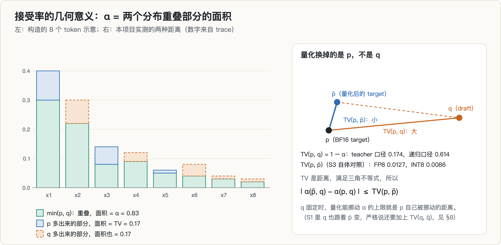

### 1.1 一步投机解码

投机解码让一个便宜的 draft 先猜 K 个 token，再让 target 用一次前向检查这 K 个位置（外加一个 bonus 位置），按拒绝采样逐个接受或拒绝。拒绝采样保证发出的 token 精确服从 target 的分布，所以它只影响速度、不影响输出（[Leviathan 等](https://arxiv.org/abs/2211.17192)、[Chen 等](https://arxiv.org/abs/2302.01318)；推导过程在 [第 9 篇](../spec-decoding-rl-mismatch/) 的 §2 里写过）。

本项目的 draft 是 [EAGLE](https://arxiv.org/abs/2401.15077) 式的小头：它读 target 倒数第二层的隐状态 $h_2$ 和当前 token 的 embedding，经过一个融合层和 2 层 decoder，再用 **target 自己的 lm_head** 出分布。这一点后面很重要：draft 和 target 共用输出头和 embedding。

### 1.2 接受率 α = Σ min(p, q) = 1 − TV(p, q)

设某个位置上 target 的分布是 $p$，draft 的分布是 $q$。draft 提出 $x \sim q$，以概率 $\min(1, p(x)/q(x))$ 接受，所以这个位置被接受的概率是

$$
\alpha = \sum_x q(x)\,\min\!\Big(1, \frac{p(x)}{q(x)}\Big) = \sum_x \min\big(p(x), q(x)\big).
$$

因为 $\min(a, b) = \tfrac{1}{2}(a + b - |a - b|)$，对全词表求和得到

$$
\alpha = 1 - \tfrac{1}{2}\sum_x |p(x) - q(x)| = 1 - \mathrm{TV}(p, q).
$$

几何上，α 就是两张直方图**重叠部分的面积**（图 1 左）；TV（全变差距离）是 $p$ 多出来那部分的面积，也等于 $q$ 多出来那部分的面积。本文的 α 都是这样**逐位置精确算出来的**（对 151,936 个 token 的完整词表求和，温度 1），不是采样估计。

TV 是一个距离，满足三角不等式。量化 target 等于把 $p$ 换成 $\tilde p$；如果 $q$ 不变，就有

$$
\big|\alpha(\tilde p, q) - \alpha(p, q)\big| = \big|\mathrm{TV}(\tilde p, q) - \mathrm{TV}(p, q)\big| \le \mathrm{TV}(p, \tilde p). \tag{1}
$$

**量化能挪动 α 的上限，就是 target 自己被挪动的距离。** 这个不等式是整篇文章的主线，§8 会用实测把它填满。

### 1.3 期望接受长度 τ，以及它怎么放大 α

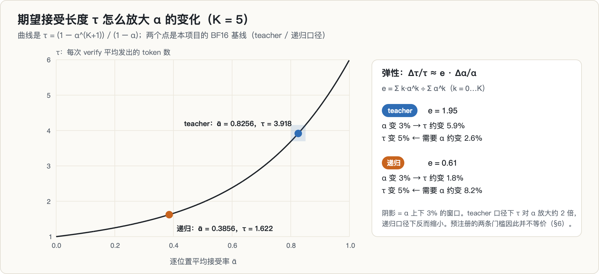

每轮起草 K 个 token。如果每个位置的接受率都是 ᾱ 且互相独立，一轮 verify 平均发出的 token 数是

$$
\tau = 1 + \bar\alpha + \bar\alpha^2 + \dots + \bar\alpha^K = \frac{1 - \bar\alpha^{K+1}}{1 - \bar\alpha}.
$$

> **τ 这个式子怎么来的**
>
> 设第 $i$ 个 draft token 被接受的事件为 $A_i$，独立同概率 $\bar\alpha$。**前 $k$ 个都被接受**的概率是 $\bar\alpha^k$。一轮 verify 发出的 token 数 $N$ 满足
>
> $$N = 1 + \#\{\text{被接受的 draft token}\}$$
>
> 那个 $1$ 是**必定前进的一步**：即使第一个 draft 就被拒，target 也会在那个位置重采一个 token（这正是拒绝采样保证无损的机制）。于是
>
> $$\mathbb{E}[N] = 1 + \sum_{k=1}^{K}\Pr[\text{前 } k \text{ 个都接受}] = 1 + \sum_{k=1}^{K}\bar\alpha^k = \sum_{k=0}^{K}\bar\alpha^k = \frac{1-\bar\alpha^{K+1}}{1-\bar\alpha}$$
>
> 用的是「非负整数随机变量的期望等于尾概率之和」这个恒等式 $\mathbb{E}[N]=\sum_k \Pr[N>k]$。
>
> **两个边界值值得记住**：$\bar\alpha\to 1$ 时 $\tau\to K+1$（全接受，一轮走完整条 draft）；$\bar\alpha\to 0$ 时 $\tau\to 1$（等于没投机）。所以 $\tau$ 的**可用区间是 $[1, K+1]$ 而不是 $[0, K+1]$**——这正是 [第 6 篇](../rollout-half-life/) §1.6 提到的「下界不是 0」那个坑。

本项目 K = 5（ᾱ = 0.8256 时 τ = 3.918，与 trace 记录一致）。τ 对 α 的敏感度用弹性表示：

$$
\frac{\Delta\tau}{\tau} \approx e \cdot \frac{\Delta\bar\alpha}{\bar\alpha}, \qquad e = \frac{\sum_{k=0}^{K} k\,\bar\alpha^k}{\sum_{k=0}^{K} \bar\alpha^k}.
$$

> **弹性式子的推导**
>
> 令 $f(\bar\alpha)=\sum_{k=0}^{K}\bar\alpha^k$。弹性的定义是对数导数：
>
> $$e = \frac{\mathrm{d}\ln\tau}{\mathrm{d}\ln\bar\alpha} = \frac{\bar\alpha}{f}\cdot\frac{\mathrm{d}f}{\mathrm{d}\bar\alpha} = \frac{\bar\alpha \sum_{k=1}^{K} k\,\bar\alpha^{k-1}}{\sum_{k=0}^{K}\bar\alpha^k} = \frac{\sum_{k=0}^{K} k\,\bar\alpha^{k}}{\sum_{k=0}^{K}\bar\alpha^{k}}$$
>
> 最后那个形式有一个漂亮的读法：**它就是「接受链长度」在几何权重 $\bar\alpha^k$ 下的加权平均**，即 $\mathbb{E}[k]$。所以弹性 = 平均接受了几个 token。
>
> 这立刻给出两个极限：$\bar\alpha\to 1$ 时各项权重相等，$e\to K/2$（$K=5$ 给 2.5）；$\bar\alpha\to 0$ 时只有 $k=0$ 项存活，$e\to 0$。

ᾱ 高时，接受链长，α 的小变化会被放大；ᾱ 低时，链一两步就断，τ 反而迟钝。本项目的两个工作点上，teacher 口径 e = 1.95，递归口径 e = 0.61（推导）。这意味着预注册的两条门槛并不等价：teacher 口径下「τ 变 5%」大约只需要「α 变 2.6%」，递归口径下却需要 α 变 8.2%。§6 还会用到这一点。

### 1.4 两种口径，按位置分桶

α 的测法继承自上一个项目的 `alpha_probe`：一次 teacher forcing 前向，拿到每个位置上 target 与 draft 的完整分布，直接算 Σ min(p, q)。有两种口径：

- **teacher 口径**：draft 在每个位置读的都是 target 的**真实**特征 $h_2$。这对应一轮投机里的第 1 个草稿 token，是乐观估计。
- **递归口径**：draft 读的是它**自己上一步预测出来的**特征（draft 训练时有一个特征回归目标，就是为了这个）。这对应第 2 个及以后的草稿 token，是悲观估计。

真实投机介于两者之间。同一个 draft，两种口径的 α 可以差很多：本项目的 BF16 基线是 0.8256 对 0.3856（实测）。

另外，α 按「被预测 token 的位置」分四个桶：1–64、65–256、257–1024、1025–2048。位置 1–64 大部分落在题目文本里（题目加指令的长度中位数是 305 个字符），投机解码实际不会在那里起草；它更像一个「高熵区」的对照。

---

## 2. 背景：权重量化怎么挪动 target 的分布

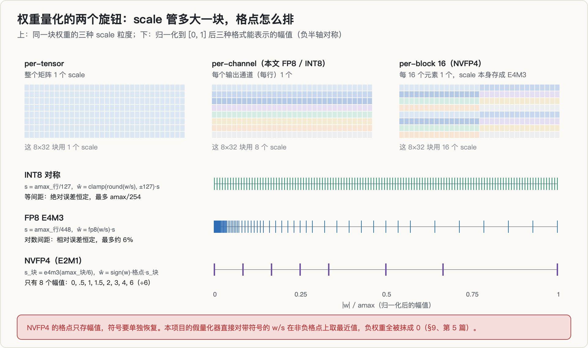

### 2.1 scale 管多大一块

权重量化 = 先除以一个 scale，把数压进低精度格式能表示的范围，舍入到最近的格点，再乘回 scale（「量化-反量化」，本文的假量化就是这么做的）。scale 覆盖的范围叫粒度：

- **per-tensor**：整个矩阵一个 scale。最省元数据，但一个异常大的权重会让其它所有权重都落在很粗的格子上。
- **per-channel**：每个输出通道（每行）一个 scale。本项目的 FP8 和 INT8 臂都是这种。
- **per-block**：每 16 或 32 个元素一个 scale。NVFP4 是每 16 个元素一个，scale 本身再用 FP8 E4M3 存，折合每个权重 4 + 8/16 = 4.5 bit。

### 2.2 三种格式

本项目 `s1_precision_alpha.py` 里的假量化规格如下（amax 是该行 row 或该块 blk 的绝对值最大值）：

| 格式 | scale | 反量化后的权重 | 误差特点 |
|---|---|---|---|
| INT8 对称 | $s = \text{amax}_\text{row}/127$ | $\hat w = \mathrm{clamp}(\mathrm{round}(w/s), -127, 127)\cdot s$ | 等间距，绝对误差最多 $s/2$ |
| FP8 E4M3 | $s = \text{amax}_\text{row}/448$ | $\hat w = \mathrm{fp8}(w/s)\cdot s$ | 对数间距，相对误差最多约 6%（3 位尾数） |
| NVFP4（E2M1） | $s_\text{blk} = \mathrm{e4m3}(\text{amax}_\text{blk}/6)$ | $\hat w = \mathrm{sign}(w)\cdot g\cdot s_\text{blk}$，$g \in \{0, 0.5, 1, 1.5, 2, 3, 4, 6\}$ | 只有 8 个幅值，靠细粒度 scale 补 |

448 和 6 分别是 E4M3 和 E2M1 能表示的最大值。量化对象是模型里全部 197 个 `nn.Linear`（28 层 × 7 个投影 + lm_head）。

注意 NVFP4 那一行：E2M1 的格点只是**幅值**，符号要单独取出来再乘回去。本项目的实现漏掉了这一步，§9 会讲它的后果。

给一个量级感（引用，并行会话在 4096×4096 高斯随机矩阵上测的信号量化噪声比）：INT8 41.26 dB，INT4 逐通道 16.08 dB，NVFP4（修复后）20.43 dB。

### 2.3 从权重误差到分布挪动

![同样大小的 logit 扰动，落在自信的位置上只挪动 2.8% 的概率，落在犹豫的位置上挪动 10.8%；一阶近似 TV ≈ ½·E_p|δ − E_p[δ]|](diagrams/fig04_logit_tv.png)

权重多了误差 $\varepsilon$，每一层的输出都会多一点噪声，一路传到最后，logit 变成 $\tilde z = z + \delta$。softmax 之后（推导，一阶展开）：

$$
\tilde p_i \approx p_i\big(1 + \delta_i - \mathbb{E}_p[\delta]\big)
\quad\Longrightarrow\quad
\mathrm{TV}(p, \tilde p) \approx \tfrac{1}{2}\,\mathbb{E}_p\big|\delta - \mathbb{E}_p[\delta]\big|.
$$

这个式子说了两件事：

1. **分布挪多远，取决于 logit 扰动的起伏，而不是整体平移。** 所有 logit 同加一个常数，分布不变。
2. **自信的位置几乎不受影响。** 概率压在一个 token 上时，$\mathbb{E}_p|\delta - \mathbb{E}_p\delta|$ 很小；分布平坦（高熵）时，同样的 δ 能挪走更多概率。图 4 是一个构造的例子：同一组 δ，自信位置的 TV 是 0.028，犹豫位置是 0.108。

所以量化对 target 的影响不是均匀的：它集中在模型本来就犹豫的位置。§8 的分桶数据会印证这一点。

---

## 3. 背景：四区制性能模型

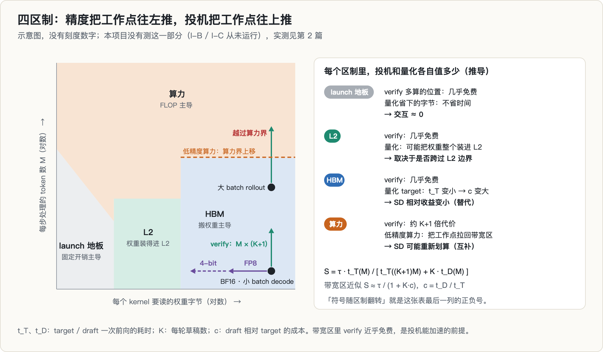

**🖼 怎么读这张图**
>
> 横轴是**每个 kernel 要读的权重字节**（往左 = 精度更低），纵轴是**每步处理的 token 数 M**（往上 = batch 更大或投机 verify 更宽）。平面被切成四块，每块由不同的瓶颈主导。
>
> 关键是看**两个旋钮把工作点往哪个方向推**：
>
> - **量化 = 往左推**（字节少）。在 HBM 区往左走是省时间的；但一直往左会掉进**左下角的 launch 地板**——那里字节再少也不省时间，因为耗时由 kernel 启动的固定开销决定。[第 2 篇](../sm120-fp4-cliff/)和[第 4 篇](../vram-budget-composition/)都是在这个角落里测出了假信号。
> - **投机 = 往上推**（verify 一次处理 $(K+1)M$ 个位置）。在带宽区往上走几乎免费——这是投机能加速的**全部前提**；越过右上的算力界之后，往上走要按比例付钱。
>
> 所以两个旋钮的交互符号，取决于**推完之后落在哪一块**：在 HBM 区它们互相替代（量化削弱投机的相对收益），在算力区可能互补（低精度 tensor core 把算力界抬高，让投机重新划算）。
>
> 图右侧那一列就是每个区制里这两笔账各值多少的推导。

α 只是投机收益的一半。另一半是时间：一次 target 前向要多久、draft 要多久。这部分在本项目里**一次也没有测**，这里只把命题需要的推导讲清楚；实测和这套框架的来历见 [第 2 篇](../sm120-fp4-cliff/)。

一次前向的耗时，由四种瓶颈里最慢的那个决定：

1. **launch 地板**：矩阵太小，时间花在 kernel 启动和调度的固定开销上。字节少一半、FLOP 少一半都不省时间。
2. **L2**：权重装得进 L2 cache，搬运带宽是 L2 的。
3. **HBM**：权重装不进 L2，每一步都要从显存搬一遍。时间 ≈ 权重字节 ÷ HBM 带宽，与这一步处理几个 token 几乎无关。
4. **算力**：每步 token 数 M 足够大，时间 ≈ FLOP ÷ 峰值算力，与 M 成正比。

投机解码的净加速比：

$$
S = \frac{\tau \cdot t_T(M)}{t_T\big((K+1)M\big) + K \cdot t_D(M)}
$$

其中 $t_T$、$t_D$ 是 target 和 draft 一次前向的耗时。

> **这个式子怎么来的**
>
> **分母 = 一轮投机的实际耗时。** 一轮里发生两件事：draft 自回归地跑 $K$ 步（每步处理 $M$ 个序列，共 $K\cdot t_D(M)$）；target 做**一次**前向验证，但要同时算 $K+1$ 个位置（原位置 + $K$ 个 draft 位置），所以批维度是 $(K+1)M$，耗时 $t_T((K+1)M)$。
>
> **分子 = 同样产出用非投机解码要花的时间。** 一轮投机平均发出 $\tau$ 个 token，而非投机每发一个 token 要一次 target 前向 $t_T(M)$，所以是 $\tau\cdot t_T(M)$。
>
> 两者相除就是加速比。**两个特例可以自检**：
>
> - $K=0$（不投机）：$\tau=1$，$S = t_T(M)/t_T(M) = 1$ ✓
> - **带宽区**（$t_T$ 与 batch 几乎无关，$t_T((K+1)M)\approx t_T(M)$），令 $c = t_D/t_T$：
>   $$S \approx \frac{\tau}{1 + Kc}$$
>   这就是正文反复出现的 $1+Kc$。**它成立的前提是「verify 几乎免费」**——一旦离开带宽区，$t_T((K+1)M)$ 会涨到约 $(K+1)t_T(M)$，分母变成 $(K+1) + Kc$，而分子最多 $K+1$，$S$ 掉到 1 以下，**投机开始亏本**。
>
> 这正是「符号随区制翻转」的数学来源：**同一个 $\tau$，在带宽区给加速，在算力区给减速**。两个旋钮在这张图上的作用方向不同：

- **精度往左推**：权重字节变少。在 HBM 区，量化 target 让 $t_T$ 变小，但 draft 没变，于是 draft 的相对成本 $c = t_D / t_T$ 变大，$S \approx \tau/(1 + Kc)$ 变小——**量化和投机互相替代**。如果字节少到进了 launch 地板，量化就不再省时间。
- **投机往上推**：verify 一次处理 $(K+1)M$ 个位置。在带宽区这几乎免费，这是投机能加速的前提；一旦越过算力界，verify 的代价约为 K+1 倍，投机开始亏。低精度 tensor core 把算力界往上推，又可能让投机重新划算——**互补**。

「符号随区制翻转」说的就是：同样是「量化 target」，在带宽区削弱投机的收益，在算力区可能增强它。上一个项目有一个同方向的实测（引用，登记簿 EXP-031）：同一个 draft、同样的 τ，在 RTX 5080 上 $1 + Kc = 1.22$，在更快的 RTX 5090 上是 1.55——verify 变快以后，draft 往返的相对成本上升了。

---

## 4. 动机与假设链

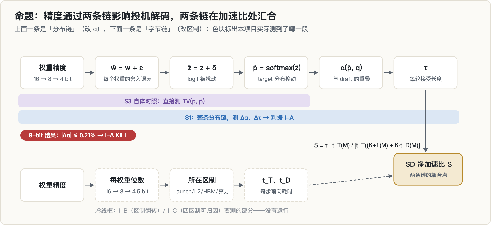

立项文件里的命题是：

> 权重精度是一条被量化、投机、serving 三个社区分开研究，但从未与投机解码做受控交互测量的维度：量化 target 如何改变接受率 α 与投机收益？该影响的符号 / 强度是否随性能区制翻转？

它依赖两条链：

- **分布链**：精度 → $\tilde p$ 相对 $p$ 的移动 → $\alpha(\tilde p, q)$ → τ。draft 是照着 BF16 的 target 训练的；target 一量化，draft「对着的靶子」挪了，α 有可能掉。
- **字节链**：精度 → 字节数 → 所在区制 → $t_T$、$t_D$。

两条链在加速比 S 处汇合，四区制模型就是用来描述这个耦合点的。如果两条链都成立，就能回答一个部署者真正关心的问题：**这个部署该不该开投机，配什么精度**。

我当时觉得它值得做，依据是立项文件里记录的一轮文献查新（引用；原始调研文档不在我手上，这里只转述结论，未复核）：MagicDec、[ReSpec](https://arxiv.org/abs/2510.26475) 等投机系统论文全文没有涉及精度维度；[OmniPilot](https://arxiv.org/abs/2607.01579) 观察到精度对 serving 成本的影响非单调，但没有投机维度。

回头看，这个「空白」的边界要说清楚：**把量化后的模型当 draft** 的方向早就有人做了，比如 [QSpec](https://arxiv.org/abs/2410.11305)、[ML-SpecQD](https://arxiv.org/abs/2503.13565)、[SpecQuant](https://arxiv.org/abs/2609.21704)；本项目 S3 的脚本注释里也点名了 ML-SpecQD。立项文件想占的是另一格：**量化的是 target，draft 不变**。

最关键的是链的顺序。如果第一环（精度改变 α）不成立，分布链就断了，整个「交互」退化成字节链上的吞吐测量——这正是预注册里 I-A 的 kill 出口。

---

## 5. 这个题是怎么来的

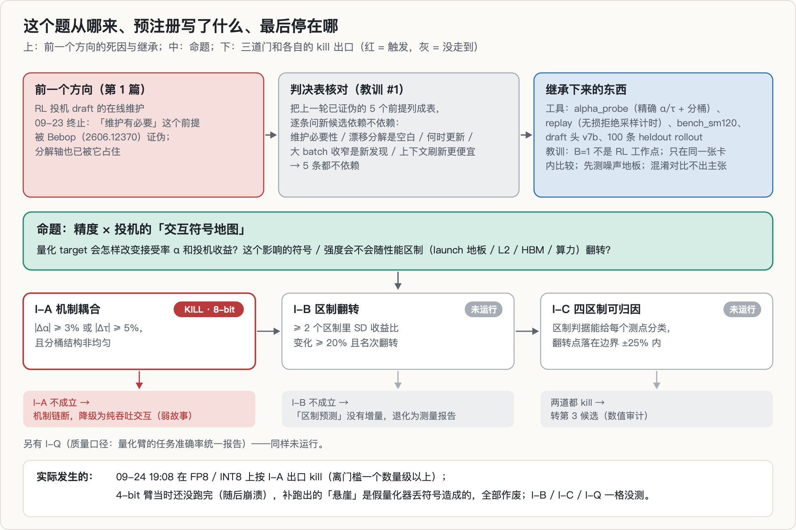

本项目是 [第 1 篇](../rl-spec-draft-maintenance/)（RL 投机 draft 的在线维护）终止之后的第 2 轮候选。那个方向撞上了 Qwen 的 Bebop（[2606.12370](https://arxiv.org/abs/2606.12370)）：「draft 需要随 RL 在线维护」这个前提被它证伪，α 的分解轴也已被它占住。它留下的第一条教训是「决策传导检查」：新计划必须先过一道判决表核对，确认不依赖任何已被证伪的前提。

立项文件第 0 节就是这张表：

| 已被证伪的前提 | 本候选是否依赖 |
|---|---|
| 维护必要性（Bebop：RL 前对齐一次即够） | 不依赖 |
| 漂移分解是空白（Bebop 已分解熵 / 失配轴） | 不依赖 |
| 「何时更新」是真问题 | 不依赖 |
| 大 batch 收益收窄是新发现（ReSpec 已发） | 不作为新发现，只当已知格 |
| 上下文刷新比梯度更新便宜 | 不依赖 |

继承下来的东西：

- **工具**：`alpha_probe`（精确 α / τ 和分桶）、`replay`（无损拒绝采样计时）、`bench_sm120`（SM120 的 roofline 实测台）、上一个项目最后一版 draft 头 v7b、100 条留出 rollout。
- **教训**：B = 1 不是 RL 的工作点，批量口径必须进主判据；加速比只在同一张卡内比较；先测噪声地板；混淆对比不产出主张。

后两条教训都属于字节链（I-B），最终一条都没用上。

---

## 6. 预注册：跑之前写死了什么

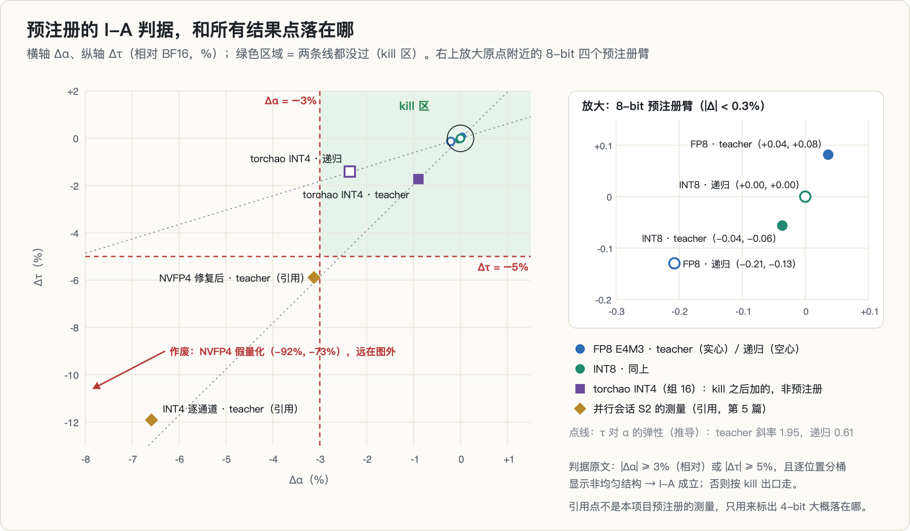

立项文件 `PREREG_23号立项.md` 的第 2 节写了四道判据和出口：

| 判据 | 条件 | 判定什么 |
|---|---|---|
| **I-A** 机制耦合 | 量化 target 相对 BF16 的 Δα ≥ 3%（相对）或 Δτ ≥ 5%，**且**逐位置分桶显示非均匀结构 | 精度 → 接受率这条链是否存在 |
| **I-B** 区制翻转 | ≥ 2 个区制里测投机净收益比，变化 ≥ 20% 且出现名次翻转 | 「符号由区制决定」是否成立 |
| **I-C** 四区制可归因 | 区制判据能给每个测点正确分类，翻转点落在边界 ±25% 内 | 四区制模型有没有预测力 |
| **I-Q** 质量口径 | 量化臂的任务质量用统一评测报告 | 防止「吞吐赢了、质量崩了」 |
| **Kill** | I-A 不成立 → 机制链断，降级为纯吞吐交互（弱故事）；I-B 不成立 → 退化为测量报告；两者都 kill → 转第 3 候选（数值审计） | 出口 |

3% 和 5% 标为「初值，噪声地板实测后可以登记变更上调」。计划的矩阵是 S1（I-A）、S2（计时，I-B）、S3（区制标注，I-C）、S4（重复与质量），先跑一到两天。

**冻结的证据只有文件时间戳。** 立项文件最后修改于 09-24 19:05:39，早于第一条 trace（19:06:10），之后没再改过。但这个目录做过 `git init` 却**一次提交都没有**，也没有变更记录（amendments）和实验登记簿。上一个项目「无记录 = 未做」的纪律，在这里断了。§12 会列出它的后果。

事后看这张判据表，有两处值得指出：

1. **两条门槛不等价**（§1.3）。teacher 口径下 Δτ 的 5% 门槛比 Δα 的 3% 更容易过；递归口径下反过来，总是 Δα 先过线。
2. **「分桶非均匀」这个附加条件，本来会把后来的 NVFP4 假结果挡在门外**：一个坏掉的模型给出的 α 在四个桶里完全相同（§9）。

---

## 7. 实验 S1：量化 target 之后，α 和 τ 变了多少

### 7.1 设计

- **target**：Qwen3-1.7B（28 层，隐藏维 2048，词表 151,936），BF16。
- **draft**：上一个项目的 v7b 头，2 层 decoder，约 1.09 亿可训练参数，用 KL 损失在 1,400 条 rollout 上训了 400 步（训练 trace 记录了第 400 步和保存）。
- **数据**：上一个项目用 Qwen3-1.7B 在 GSM8K 题目上生成的 100 条留出 rollout（题目 + 回答），截到 2048 个 token，共 155,757 个被预测位置。
- **臂**：target 做 FP8 E4M3 / INT8 / NVFP4 假量化，draft 自己的参数保持 BF16；每个臂跑 teacher 和递归两种口径。K = 5，batch 4。
- **机器**：一张 RTX 5090，每条臂约 25 秒。

有一个细节决定了这个实验测的到底是什么。draft 和 target **共用** embedding 和 lm_head，而 Qwen3-1.7B 的 `tie_word_embeddings` 为 true，这两者在 HF 里是同一个张量。按设计，量化 target 时：

- draft 读的 $h_2$ 来自**量化后**的 target；
- draft 的 token embedding 和输出头，也应该是**量化后**的那一份。

但脚本的执行顺序是**先量化 target、后加载 draft**，而 `load_draft` 用 `load_state_dict(strict=False)` 把 `draft.pt` 里 BF16 的 `lm_head.weight` 写回了这个共享张量。所以 S1 的 target 臂里，lm_head 和 embedding 实际上被**恢复成了 BF16**，被量化的只有 decoder 各层（这是[第 5 篇](../nvfp4-sign-bug/)作者读代码和日志得出的推断，没有复跑）。S3 的自体对照不加载 draft，不受这一点影响。换句话说，S1 测的是「量化 decoder、保留 BF16 输出头」这一种部署，而不是全量化；这不改变 8-bit 臂 |Δα| ≤ 0.2% 的结论，但结论的适用范围要按这个口径理解。

### 7.2 自检

这个项目没有像 [第 9 篇](../spec-decoding-rl-mismatch/) 那样先做 CPU float64 的正负对照自测。能拿出来的自检只有两条：

- **重复运行逐位一致**（实测）：S1 跑完后又原样重跑了一遍（日志 `r2_s1_driver.log`），基线与 FP8 / INT8 共六条臂的每个桶、每个 n 都与第一遍逐位相同（到 trace 记录的 4 位小数）。后来 torchao INT8 的自体对照也跑了 5 次，结果完全相同。
- **基线被独立复现**（引用）：并行会话用自己的脚本、按同一协议（同一份 100 条数据、截到 2048、K = 5）得到的 BF16 基线同样是 α = 0.8256、τ = 3.918，四个桶也逐位相同。

逐位一致说明这里没有运行间噪声，但它不是统计意义上的置信区间。本项目没有做按序列的 bootstrap，这一点我放在局限里。

### 7.3 结果

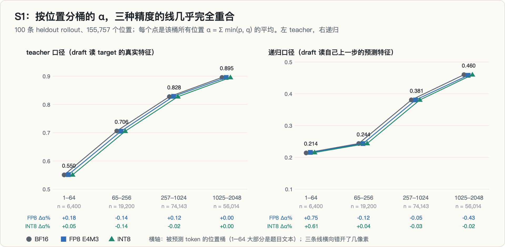

| 口径 | 精度 | α（全部位置） | Δα | τ | Δτ | 分桶 Δα（1–64 / 65–256 / 257–1024 / 1025+） |
|---|---|---|---|---|---|---|
| teacher | BF16 | 0.8256 | — | 3.918 | — | — |
| teacher | FP8 E4M3 | 0.8259 | +0.036% | 3.9212 | +0.082% | +0.18 / −0.14 / +0.12 / 0.00 |
| teacher | INT8 | 0.8253 | −0.036% | 3.9158 | −0.056% | +0.05 / −0.14 / −0.02 / 0.00 |
| 递归 | BF16 | 0.3856 | — | 1.6222 | — | — |
| 递归 | FP8 E4M3 | 0.3848 | −0.207% | 1.6201 | −0.129% | +0.75 / −0.12 / −0.05 / −0.43 |
| 递归 | INT8 | 0.3856 | 0.000% | 1.6222 | 0.000% | +0.61 / +0.04 / −0.03 / −0.02 |

（全部实测；Δ 都是相对 BF16 的相对变化。）

四个预注册臂里最大的 |Δα| 是 0.21%，最大的 |Δτ| 是 0.13%，分别是门槛的 1/14 和 1/38。分桶结构也没有：变化的正负号在桶之间来回跳，量级都在 1% 以下。

kill 之后我又追加了几条臂（非预注册），结论一样：

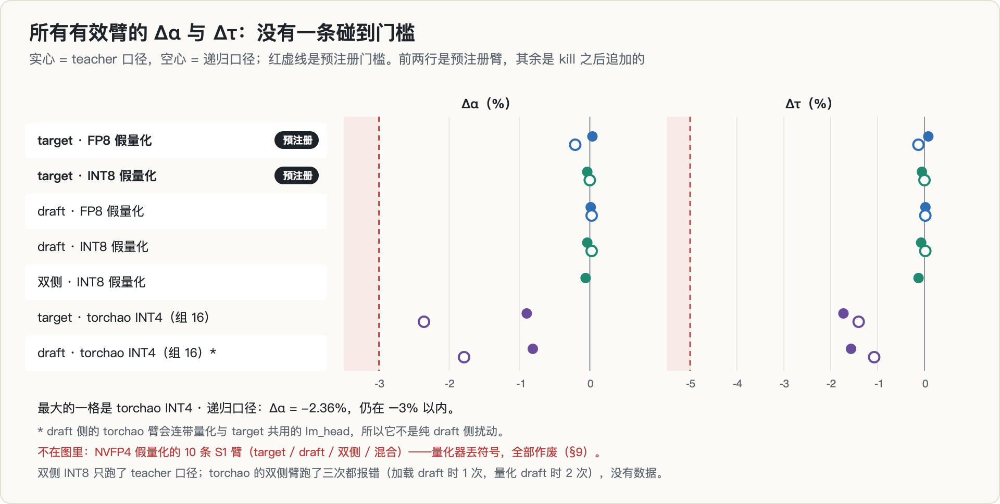

- **draft 侧量化**（draft 自己的 15 个权重张量做 FP8 / INT8 假量化，target 不动）：|Δα| ≤ 0.04%。
- **双侧 INT8**（teacher）：Δα = −0.06%，Δτ = −0.13%。
- **torchao 真 INT4**（`IntxWeightOnlyConfig`，int4，组大小 16，量化全部线性层）：target 侧 Δα = −0.90%（teacher）/ −2.36%（递归），Δτ = −1.73% / −1.41%；draft 侧 −0.81% / −1.79%。draft 侧这两条会连带量化共用的 lm_head，所以不是纯 draft 侧扰动。

INT4 的分桶有结构：target 侧 teacher 口径下，1–64 位掉了 7.43%，1025 位之后只掉 0.42%（递归口径是 −14.57% 到 −1.59%）。但损失集中的前 64 位大部分是题目文本，投机解码实际不会在那里起草。

### 7.4 判定：KILL（限 8-bit）

判定报告 `reports/s1_verdict.md` 写于 19:08:16，距 S1 开跑不到 3 分钟：四个 8-bit 臂都没过线，「I-A 总判：全臂在阈值内 → 机制链断，按预注册 kill 出口走」。

需要补一句当时没写进报告的话：**写这份报告时，预注册里的第三个格式 NVFP4 还在跑**——它的两条臂在 19:08:18 和 19:08:23 相继因设备不一致报错退出，都晚于报告。也就是说，判定没有等预注册的全部格式跑完。所以这个 kill 的覆盖范围是 8-bit，不是「精度」整体。本文按这个范围写结论。

---

## 8. 实验 S3：为什么 α 几乎不动

S1 只告诉我「没变」。要知道「为什么没变」，需要把公式 (1) 右边的 $\mathrm{TV}(p, \tilde p)$ 单独量出来。

### 8.1 设计：自体 cast

把同一个模型加载两份，一份 BF16，一份量化，然后在同样的 155,757 个位置上算

$$
\alpha(p, \tilde p) = \sum_x \min\big(p(x), \tilde p(x)\big) = 1 - \mathrm{TV}(p, \tilde p).
$$

这里没有 draft，测的是**纯粹的量化位移**。这个量还有一层直接的含义：如果拿量化后的模型当自己的 draft（ML-SpecQD、QSpec 的思路），它就是单步接受率。

自检：不量化时 α(p, p̃) 恰好等于 1.0000（实测，两个模型、两次运行都是）。

### 8.2 结果：量化扰动比 draft 差距小一个数量级以上

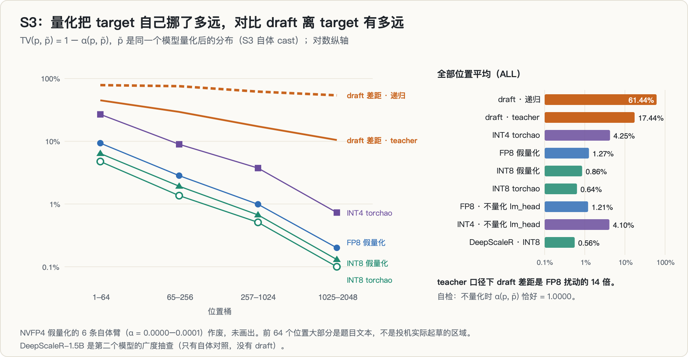

| 量化器 | α(p, p̃) | TV(p, p̃) | 分桶 TV（1–64 / 65–256 / 257–1024 / 1025+） |
|---|---|---|---|
| FP8 E4M3 假量化 | 0.9873 | 1.27% | 9.32% / 2.83% / 0.99% / 0.20% |
| FP8，不量化 lm_head | 0.9879 | 1.21% | — |
| INT8 假量化 | 0.9914 | 0.86% | 6.38% / 1.92% / 0.67% / 0.13% |
| INT8 torchao（组 128） | 0.9936 | 0.64% | 4.76% / 1.36% / 0.51% / 0.10% |
| INT4 torchao（组 16） | 0.9575 | 4.25% | 26.84% / 8.95% / 3.74% / 0.73% |
| INT4 torchao，不量化 lm_head | 0.9590 | 4.10% | — |
| **对照：draft 离 target（teacher）** | 0.8256 | **17.44%** | 44.95% / 29.39% / 17.25% / 10.46% |
| **对照：draft 离 target（递归）** | 0.3856 | **61.44%** | — |

（全部实测。「不量化 lm_head」同时也不量化与它绑定的 embedding。）

三个观察：

1. **量级差距**。teacher 口径下，draft 与 target 的距离是 FP8 量化位移的约 14 倍、INT8 的约 20 倍；递归口径下是 48 倍和 71 倍（推导）。
2. **位置结构**。量化位移集中在前 64 个位置：FP8 在那里是 9.3%，1025 位之后只有 0.2%。这与 §2.3 的一阶分析一致——早期位置的预测更犹豫——但本项目没有测熵，这只是一个相容的解释。
3. **lm_head 不是主要来源**。不量化 lm_head（以及绑定的 embedding），FP8 的 TV 只从 1.27% 降到 1.21%，INT4 从 4.25% 降到 4.10%。

广度抽查（实测）：第二个模型 DeepScaleR-1.5B 的 INT8 自体 TV 是 0.56%，与 Qwen3-1.7B 同一量级。它没有配套的 draft，所以只有这一个数。

### 8.3 上界与抵消

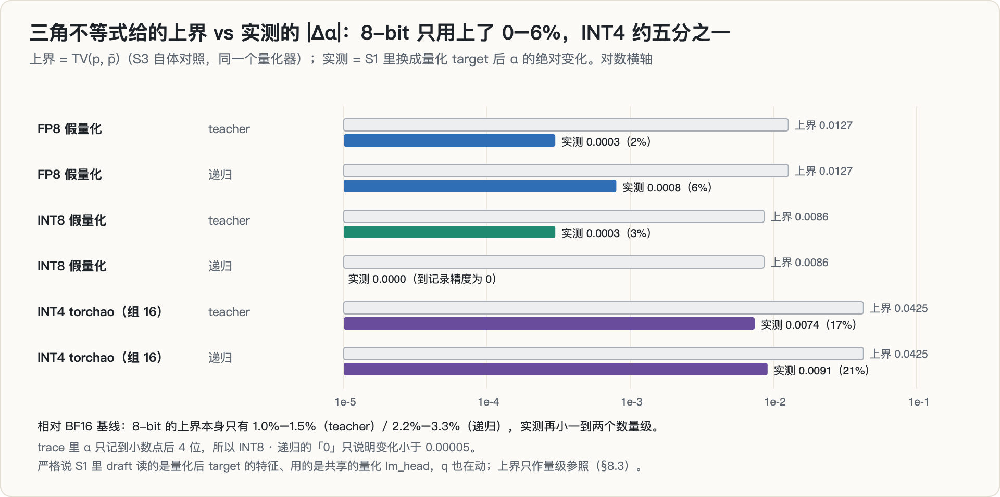

把 S3 的 TV 代进公式 (1)，就得到量化能挪动 α 的上限（推导）：

| 量化器 | 口径 | 上界 \|Δα\| | 上界（相对基线） | 实测 \|Δα\| | 实测 / 上界 |
|---|---|---|---|---|---|
| FP8 | teacher | 0.0127 | 1.54% | 0.0003 | 2% |
| FP8 | 递归 | 0.0127 | 3.29% | 0.0008 | 6% |
| INT8 | teacher | 0.0086 | 1.04% | 0.0003 | 3% |
| INT8 | 递归 | 0.0086 | 2.23% | 0（到 4 位小数） | 0% |
| INT4 torchao | teacher | 0.0425 | 5.15% | 0.0074 | 17% |
| INT4 torchao | 递归 | 0.0425 | 11.02% | 0.0091 | 21% |

有两层意思。

**第一层：teacher 口径下，8-bit 从一开始就不可能过 3% 的门槛**，因为它能挪动 α 的上限只有 1.0%–1.5%。如果先跑 S3（每条臂不到半分钟），S1 的 teacher 结论可以提前预测出来。递归口径下 FP8 的上限是 3.29%，理论上还够得着门槛，实测只用了其中 6%。

**第二层：实测远小于上界，是因为量化的挪动方向与 draft 的误差方向几乎无关。** 把 α 写成（推导，q 固定、p 小幅变化时）

$$
\Delta\alpha \approx \sum_{x \in A} \Delta p(x), \qquad A = \{x : p(x) < q(x)\},
$$

也就是说，α 只关心量化往「draft 高估的那些 token」里**净**挪进了多少概率。上界对应的是最坏情况：所有增加的概率都挪进 A、所有减少的都来自 A 之外。实际上量化并不知道 draft 在哪里高估，挪进和挪出 A 的量大致相抵。前 64 个位置最能说明问题：FP8 在那里把 target 挪动了 9.3%，相当于该桶基线 α 的 17%，但 teacher 口径下那一桶的 α 只变了 +0.18%。

扰动变大以后，这种抵消不再完全：INT4 用掉了上界的五分之一左右，损失也集中在扰动最大的前几个桶。

要说明的是，S1 里 q 并不固定——draft 读的是量化后的特征，用的是量化后的共享输出头。严格的界应该是 $\mathrm{TV}(p, \tilde p) + \mathrm{TV}(q, \tilde q)$，后一项我没有测。所以上表的上界只能当量级参照，不是严格的界。q 跟着 p̃ 一起动，大概也是 α 更难变的原因之一，但这一点没有单独隔离。

---

## 9. 4-bit 臂：一个假悬崖

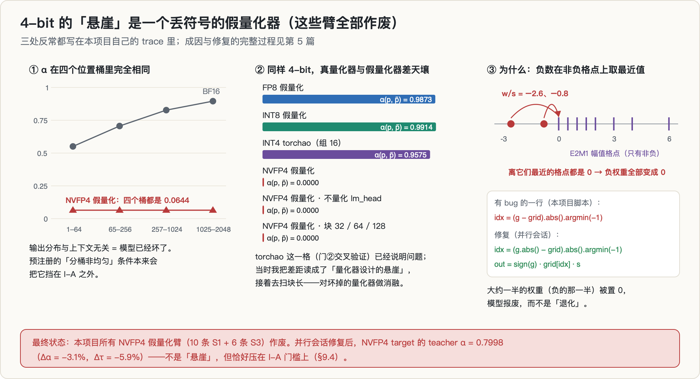

### 9.1 从崩溃到「悬崖」

S1 的两条 NVFP4 臂一开始就崩了：E2M1 格点张量建在 CPU 上，权重在 GPU 上。修掉设备问题之后，重跑里的 NVFP4 teacher 臂在 19:11:44 给出了一个很醒目的数（后来作废）：α = 0.0644，τ = 1.0688。相对 BF16，这是 −92% 的 Δα。

### 9.2 我围着它又跑了几轮

从脚本注释和日志看，接下来的实验都在试图解释这个「悬崖」：

- **S1b**（19:14–19:17）：target 侧 NVFP4 两种口径各跑一遍；draft 侧 FP8 / INT8 / NVFP4；双侧 INT8。draft 侧 NVFP4 的 α 是 0.0001（作废）。
- **S1c**（19:17–19:19）：注释里的假设是「接受率悬崖由 draft / target 量化失配决定，配对同格可恢复」。双侧 NVFP4 给出 0.356，而且四个桶还是完全相同（作废）。
- **S3**（19:24–19:26）：自体对照，NVFP4 自体 α = 0.0000，不量化 lm_head 也是 0.0000（作废）。
- **S3b / S4 / S4fix**（09-25 10:05–10:24）：torchao 真量化交叉验证；块长 32 / 64 / 128 扫描（全部 0.0000，作废）；第二个模型 DeepScaleR（NVFP4 0.0001，作废）；torchao 真 INT4 的 target 侧臂。

同一时间，并行的另一个会话在自己的目录里围绕同一个现象立了一个新方向（量化到接受率的边界），也复现了 0.0644。

### 9.3 本该拦住它的三个信号

这三个信号都写在本项目自己的 trace 里：

1. **α 在四个位置桶里完全相同**：0.0644 / 0.0644 / 0.0644 / 0.0644，每个桶的位置数从 6,400 到 74,143 不等，小数点后四位一样。输出分布与上下文无关，意味着模型已经坏了。预注册的「分桶非均匀」条件如果被机械执行，会直接把它判为不满足 I-A。
2. **不量化 lm_head 毫无效果**：0.0000 → 0.0000。如果误差是分布在各层的，保护输出层不可能零效果。
3. **真量化器与假量化器差天壤**：S3b 的 torchao INT4（组 16）自体 α 是 0.9575，而假量化 NVFP4 是 0.0000。同样是 4-bit，差这么多，第一反应应该是查假量化器。我当时的读法是「量化器设计造成的悬崖」，于是去扫块长——对一个坏掉的量化器做消融。

### 9.4 真相与最终状态

并行会话在 09-25 10:43 写成了 `BUG-SIGN-001.md`：E2M1 格点只有非负幅值，而实现直接对带符号的 $w/s$ 在这些格点上取最近值。对任何负数，最近的非负格点都是 0，于是**所有负权重被抹成 0**，大约一半的权重信息丢失。修复是对 $|w/s|$ 取最近格点，再乘回符号。bug 的完整来龙去脉在 [第 5 篇](../nvfp4-sign-bug/)。

最终状态：

- 本项目所有 NVFP4 假量化臂（S1 系列 10 条、S3 系列 6 条）**作废**，不作任何结论。修复只写进了并行会话的脚本副本，本项目目录里的脚本至今仍是有 bug 的版本。
- 那 4-bit 到底怎样？本项目里唯一有效的 4-bit 数据是 torchao INT4（非预注册）：Δα = −0.9% / −2.4%，在门槛以内。
- 并行会话修复之后的 NVFP4（引用，teacher 口径）：α = 0.7998，**Δα = −3.1%，Δτ = −5.9%**，分桶是 −13.2% / −5.1% / −2.8% / −2.3%。两条门槛都刚好越过，分桶也有结构。同一批数据里，INT4 逐通道 RTN 是 Δα = −6.6%、Δτ = −11.9%。

所以按最终状态，**I-A 在 8-bit 上 kill 是有效的，4-bit 这一格则没有有效答案**：本项目预注册的 4-bit 臂被 bug 污染；可用的数据来自非预注册的臂和另一个项目，而且不同 4-bit 量化器正好落在门槛两侧。如果当时的量化器是对的，I-A 在 NVFP4 上很可能不会 kill——但它也不会是一个「悬崖」，而是一个贴着门槛的小效应。

并行会话还报告了一个与此相关的观察（引用）：INT4 逐通道让 GSM8K 准确率从 0.83 掉到 0.33，α 却只掉 6.6%；修复后的 NVFP4 准确率 0.74。α 衡量的是分布重叠，不是任务能力；I-Q（质量口径）在本项目里从未运行。

---

## 10. 死因

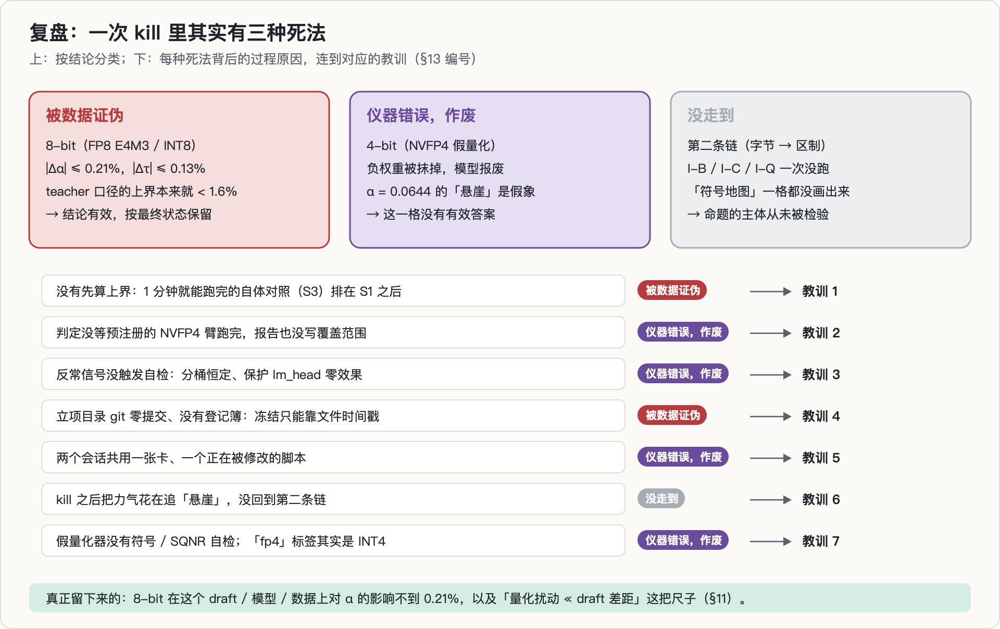

这次 kill 其实包含三种不同的死法：

1. **被数据证伪（8-bit）**。FP8 / INT8 量化 target 对 α、τ 的影响不到 0.21%，比门槛小一个数量级以上；S3 说明了原因：量化扰动比 draft 差距小一个数量级，方向又与 draft 的误差无关。这部分结论有效。
2. **仪器错误（4-bit）**。NVFP4 假量化器丢符号，相关臂全部作废。kill 之后的大部分实验时间，都花在了这个不存在的现象上。
3. **没走到（第二条链）**。I-B、I-C、I-Q 一次都没有运行。命题的主体——「符号随区制翻转」——从未被检验。按预注册，I-A 不成立时候选降级为「纯吞吐交互」；我没有做这个降级版本，也没有按「两者全 kill」的出口去执行第 3 候选，项目就在 09-25 10:24 的最后一条 trace 之后停了。

如果只看第 1 种，这是一次干净的 kill：3 分钟、判据清楚、结论与第一性原理一致。但第 2、第 3 种让它不那么干净：kill 的覆盖范围比报告写的窄，之后的时间花在了错误的方向上。

---

## 11. 真的部分

以下测量本身有效，可以复用：

1. **8-bit 量化 target 对 EAGLE 式 draft 的接受率几乎没有影响**（实测）：Qwen3-1.7B + 2 层 draft 头 + GSM8K rollout，FP8 E4M3 / INT8 逐通道，teacher 和递归两种口径下 |Δα| ≤ 0.21%、|Δτ| ≤ 0.13%；draft 侧和双侧 8-bit 同样贴着 0。
2. **一把尺子：量化位移 TV(p, p̃)**（实测）。FP8 1.27%、INT8 0.86%（torchao 组 128 为 0.64%）、torchao INT4（组 16）4.25%；集中在前 64 个位置。任何「量化会不会改变某个依赖输出分布的量」的问题，都可以先用它和那个量自己的尺度比一比。
3. **一个上界论证**（推导）：|Δα| ≤ TV(p, p̃)（q 固定时）。它在 teacher 口径下就足以预言 8-bit 的 kill；实测只用了上界的 0–6%（8-bit）和约 20%（INT4）。
4. **重复运行逐位一致**（实测）：同一配置两次运行，α 到 4 位小数完全相同；torchao INT8 自体对照 5 次相同。在这套设置里，运行间噪声不是需要担心的量级。
5. **附带，未做撞车核验，不作主张**：如果把量化后的模型当作它自己的 draft（ML-SpecQD / QSpec 的思路），单步、温度 1、teacher forcing 下的接受率是 FP8 0.987、INT8 0.991、INT4（torchao 组 16）0.958。

---

## 12. 过程中的错误与更正

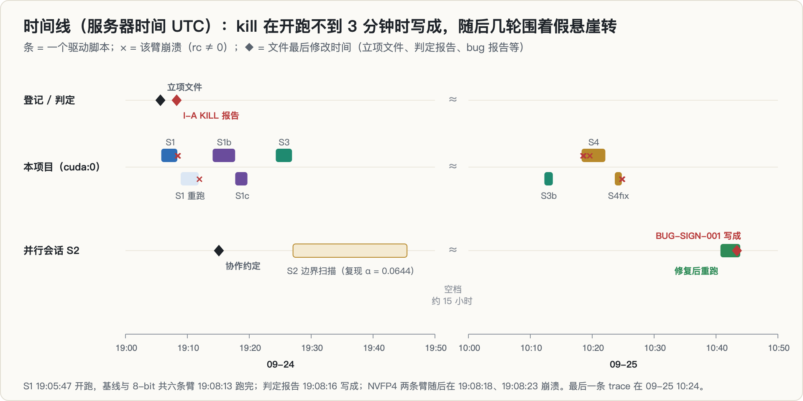

| 错误 | 后果 | 怎么发现的 | 处理 |
|---|---|---|---|
| NVFP4 假量化的格点张量建在 CPU 上 | S1 的两条 NVFP4 臂崩溃，没有数据 | traceback | 改成与权重同设备同 dtype |
| 判定报告在 NVFP4 臂跑完之前写成，也没有写覆盖范围 | 「I-A 总判 kill」读起来像是覆盖所有精度 | 写这篇时对照报告与日志的时间 | 本文把 kill 限定为 8-bit |
| **NVFP4 假量化丢符号** | 16 条臂报废；α = 0.0644 被当成「悬崖」追了几轮 | 并行会话（任务准确率 0.00、分桶恒定、保护 lm_head 零效果） | 全部作废；修复在并行会话的副本里，本项目脚本仍是旧版 |
| torchao 臂的标签写成 `fp4`，脚本注释写 Float4WeightOnly | 实际是 `IntxWeightOnlyConfig(int4, 组 16)`，容易误读成真 FP4 | 读代码 | 本文一律称 INT4 |
| target 侧 torchao 量化放在加载 draft 之前 | 加载 draft 时往已量化的 lm_head 写权重失败，S4 的三条臂崩溃 | traceback | S4fix 调换顺序；双侧臂又在量化 draft 时报错，最终没有双侧 INT4 数据 |
| 两个会话共用一张卡和同一个正在修改的脚本 | 重跑里相邻两条 NVFP4 臂一条成功、一条又撞上同一个设备错误；traceback 里 `main()` 的行号 19:08 是 178、19:11 是 189、次日是 215 | 日志 | 加了等对方进程退出的守卫脚本；并行会话 19:15 写了协作约定 |
| trace 的记录里没有 `draft_quant`、`lib` 字段，判定脚本按「(target 精度, 口径) 的最后一条」取数 | 如果今天重跑判定脚本，「BF16 基线」会取到 torchao 的 draft 侧 INT4 臂（0.8189），「FP8」会取到一条混合 NVFP4 臂（0.0001） | 写这篇时在本地拷贝上模拟 | 本文的所有数字按 tag 直接取，不经过判定脚本 |
| 立项目录 git 零提交，没有登记簿和 amendments | 冻结只能靠文件时间戳；S1b 之后的实验既没预注册也没登记 | 写这篇时 | S1b 之后的臂一律标「非预注册」 |
| 以为 S1 的 target 臂量化了 lm_head / embedding | 先量化、后加载 draft，`load_draft` 把 BF16 的 lm_head 写回了共享张量，实际只量化了 decoder 层 | 写第 5 篇时读代码与日志（推断，未复跑） | 按实际范围描述 S1 的口径 |
| 上一个项目的登记簿说 v7b「约 100/400 步时终止」 | 本项目所用 draft 的训练状态有两种说法 | 对照训练 trace（有第 400 步和保存记录） | 按 trace 写 |

最后一个会话层面的问题值得单独说：并行会话以「NVFP4 灾难」为出发点立了一个新方向，按它自己的 bug 报告，那个方向核心图表的数据都来自这个 bug。我这边的 S3b 其实已经把矛盾摆在眼前（真 INT4 0.9575 对假 NVFP4 0.0000），但被我读成了「设计差异」。**两个会话互相复现了同一个错误，复现本身并不能证明任何东西。**

---

## 13. 我学到了什么

1. **测「X 会不会改变 M」之前，先测 X 把 M 的输入挪了多远。** S3 每条臂不到半分钟，给出的上界在 teacher 口径下就足以预言 8-bit 的 kill。它应该排在 S1 前面，而不是后面。
2. **等预注册的臂跑完再判定，或者写清覆盖范围。** 「全臂在阈值内」只对跑完的臂成立；NVFP4 还没跑完时写下的 kill，本该是「8-bit kill，4-bit 待定」。
3. **反常数字先当 bug 查。** α 在四个桶里小数点后四位相同、保护输出层零效果、同位宽两个量化器差 0.96——这些都是「模型坏了」的签名，不是「现象很强」的签名。把这类自检写进预注册，比事后回想便宜得多。
4. **纪律要落在工具上。** `git init` 却零提交，预注册的冻结就只剩文件时间戳；没有登记簿，kill 之后的几轮实验就既没有判据也没有记录。上一个项目「无记录 = 未做」的教训，这次没有执行。
5. **并行会话要隔离代码，而不只是错开 GPU。** 共用一个正在修改的脚本，同一驱动里相邻两条臂可能跑的是不同版本的代码。
6. **kill 之后要么回到命题主体，要么停下。** I-A 断了以后，预注册给的出口是「降级为纯吞吐交互」或「转第 3 候选」；我做的是围着一个意外数字转，两个出口都没走。
7. **假量化器要有自己的单元测试，名字要诚实。** 一个随机矩阵上的信噪比和符号翻转率就能抓到丢符号；标签写 `fp4`、代码跑 INT4，会让读 trace 的人（包括几天后的自己）得出错误结论。

---

## 14. 局限与开放问题

**测过的范围**：Qwen3-1.7B（稠密）；2 层 EAGLE 式 draft 头（共用 target 的 embedding 和 lm_head）；100 条 GSM8K rollout，截到 2048 token；K = 5；温度 1 下的精确 α；teacher 和递归两种口径；权重量化为假量化（FP8 E4M3 逐通道、INT8 逐通道）和 torchao 权重量化（INT8 组 128、INT4 组 16）；一张 RTX 5090。

**没测过的**（结论不能外推）：

- **真实低精度 kernel**。假量化只模拟了权重的舍入误差，计算仍是 BF16；真 FP8 GEMM 的激活量化和累加顺序会带来额外扰动。
- **激活量化、KV cache 量化**。并行会话的计划里有 KV 量化轴，本项目没有涉及。
- **独立的小模型 draft**（而不是共用输出头的 EAGLE 头）。q 不随 p̃ 变时，抵消是否同样充分，没有测。
- **4-bit**。见 §9.4：本项目没有有效的预注册 4-bit 测量；已知的数据落在门槛两侧，取决于量化器。
- **置信区间**。判定没有按序列做 bootstrap。8-bit 的效应比门槛小一个数量级以上，我不认为区间会改变结论，但 INT4 的递归臂（−2.36%）离门槛不远，那里需要区间。
- **第二条链的全部**：不同 batch 和序列长度下的计时（I-B）、区制标注（I-C）、任务质量（I-Q）。「符号随区制翻转」仍然只是 §3 的一个推导。

如果要重新检验其中任何一项，应该作为新问题重新预注册，而不是拿来挽救这次的 kill。

---

## 15. 复现

- **环境**：Python 3.14、torch 2.12.0、torchao 0.18.0（立项当天安装；同时装了 bitsandbytes 0.50.2，未使用）；一张 RTX 5090。transformers 的版本没有记录进 trace。
- **模型与数据**：Qwen3-1.7B（BF16）；第二个模型 DeepScaleR-1.5B（只用于自体对照）；上一个项目的 `rollout_heldout100.jsonl`；draft 头 v7b（2 层，109,062,144 个可训练参数）。**写这篇时（09-29），这个 draft 的 checkpoint 已不在原路径**，完全复现需要按上一个项目的配置重训。
- **脚本**：`s1_precision_alpha.py`（S1 / S1b / S1c / S4 / S4fix，α 与 τ 的精确计算）、`s3_selfcast.py`（自体对照）、`s1_report.py`（I-A 判定表；有 §12 所述的取数问题）、`draft_head.py`（draft 结构与加载）、`run_s1.sh` 等 8 个驱动脚本。注意本项目目录里的 NVFP4 假量化仍是有 bug 的版本。
- **记录**：`traces/s1_precision.jsonl`（155 行）、`traces/s3_selfcast.jsonl`（95 行）、`logs/*_driver.log`、`reports/s1_verdict.md`、`PREREG_23号立项.md`。项目目录没有 git 提交，只能用 trace 里的 `config_hash` 区分配置。
- **本文的图**：由只用 Python 标准库的脚本直接从上述 trace 和日志生成（SVG 再转 PNG），数字不经手抄。

---

## 参考

按「做了什么、关键结论、和本篇什么关系」逐条展开。标 ⭐ 的三篇最接近本篇的机制链。

### A. 投机解码的地基

**Fast Inference from Transformers via Speculative Decoding** · [arXiv 2211.17192](https://arxiv.org/abs/2211.17192)
投机解码原始论文。两条观察：困难任务里嵌着能被小模型近似的简单子任务；配合改造过的采样方法，并行算出的多个 token 与逐个采样**在分布上完全等价**。
**与本篇的关系**：§1.2 的 $\alpha = \sum_x \min(p,q) = 1 - \mathrm{TV}(p,q)$ 就来自这里的接受规则。本篇整条机制链的第一环——「权重精度改变 $p$ → 改变 TV → 改变 $\alpha$」——成立的前提就是这个恒等式。

**Accelerating LLM Decoding with Speculative Sampling** · [arXiv 2302.01318](https://arxiv.org/abs/2302.01318)
DeepMind 同期独立工作，措辞上明确无损性成立于 *within hardware numerics*。
**与本篇的关系**：这条限定说明**数值精度本来就会动分布**，本篇要问的正是「动到什么程度」。

**EAGLE: Speculative Sampling Requires Rethinking Feature Uncertainty** · [arXiv 2401.15077](https://arxiv.org/abs/2401.15077)
两条关键观察：在**特征层（次顶层）**做自回归比在 token 层更直接；但特征层自回归**固有的不确定性**限制了性能。EAGLE 的做法是把这份不确定性显式建模进去。
**与本篇的关系**：本篇用 EAGLE 式 draft。§8.2 测到「量化扰动比 draft 与 target 的固有差距小一个数量级以上」——那个「固有差距」的来源正是这篇讲的特征不确定性。这也是为什么量化这一环的信号被淹没了。

### B. ⭐ 量化 × 投机：本篇的正题

**⭐ QSpec: Speculative Decoding with Complementary Quantization Schemes** · [arXiv 2410.11305](https://arxiv.org/abs/2410.11305)
激活–权重联合量化能做高效低精度解码，但在**多步推理任务上性能下降明显**。QSpec 把效率与质量解耦：用两套**互补的**量化方案——低精度的那套当 draft 快速生成，高精度的那套做验证。
**与本篇的关系**：**这是「量化会不会影响 α」这个问题的正面答案之一**——它不但影响，而且这个影响可以被设计成收益（让量化模型当 draft）。本篇问的是反方向：量化 **target** 会怎样。两者合起来才是完整的二维空间。

**⭐ ML-SpecQD: Multi-Level Speculative Decoding with Quantized Drafts** · [arXiv 2503.13565](https://arxiv.org/abs/2503.13565)
典型 SD 里 draft 是全精度的小模型。这篇用**量化后的模型当 draft**，并做成多级结构（draft 自己也有 draft）。效果高度依赖接受率。
**与本篇的关系**：和 QSpec 同一方向——量化进 draft 侧。本篇 §8.1 的「自体 cast」实验（把同一个模型量化后和自己比）在设计上和它同源，只是目的相反：我是想孤立出量化扰动的大小，它是想利用这个扰动换速度。

**⭐ SpecQuant: Speculative Decoding with Multi-Parent Quantization for Adaptive LLM Inference** · [arXiv 2609.21704](https://arxiv.org/abs/2609.21704)
消费级硬件上跑本地 LLM 受算力和显存限制。量化、投机解码、自适应推理这几项加速技术通常需要**重训、逐架构调优或额外的 draft 模型**；SpecQuant 是一个**免训练**框架，把它们组合起来。
**与本篇的关系**：「三者组合」正是本篇假设的那个交互空间。它用工程方式利用这个交互，本篇想先测清楚交互的**符号和量级**——而 §7.4 的结论是，在 8-bit 上这个量级小到（Δα ≤ 0.21%）不值得建模。

### C. RL 场景下的投机（本篇机制链的下游）

**ReSpec: Towards Optimizing Speculative Decoding in RL Systems** · [arXiv 2510.26475](https://arxiv.org/abs/2510.26475)
点出三个缺口：大 batch 下加速递减、actor 持续更新导致 drafter 陈旧、drafter 引起策略退化。
**与本篇的关系**：第一条与本篇 §3 的「四区制性能模型」直接相关——投机的收益强烈依赖所处区制，而量化会改变模型落在哪个区制。这正是本篇假设「影响符号会随区制翻转」的由来。

**Breaking Entropy Bounds: MTP with Rejection Sampling（Qwen Bebop）** · [arXiv 2606.12370](https://arxiv.org/abs/2606.12370)
系统研究 MTP 在后训练里的行为，并从熵的角度解释接受率的上界。
**与本篇的关系**：「接受率有熵上界」这个结论提示，$\alpha$ 的可动空间本身有限——这是本篇测到 Δα 很小的一个可能解释。

### D. 部署决策：区制模型的现实版本

**OmniPilot: An Uncertainty-Aware LLM Inference Advisor for Heterogeneous GPU Clusters** · [arXiv 2607.01579](https://arxiv.org/abs/2607.01579)
在共享异构集群上服务 LLM，用户必须在投入机时**之前**就选好 GPU 型号、张量并行度和精度。难点在于有效吞吐、启动成功率、集群需求与利用率都在持续波动，**静态配置配方抓不住这些**。
**与本篇的关系**：**「精度」在这里是一个和 GPU 型号、并行度并列的部署决策变量**——这正是本篇想给出定量依据的地方。如果量化真能通过 α 影响端到端吞吐，这类顾问系统就该把这一项建模进去；本篇的阴性结果说明（至少在 8-bit 上）不必。

### E. 本专栏内部

- [第 5 篇：NVFP4 真会让投机解码的接受率暴跌 92% 吗？](../nvfp4-sign-bug/) —— **本篇 4-bit 臂的全部数据都被那篇描述的丢符号 bug 污染了**，两篇必须对照着读。
- [第 1 篇：RL 里的投机 draft 什么时候值得维护？](../rl-spec-draft-maintenance/) —— 同样以 α 为核心观测量，那篇关心它随策略漂移怎么掉，本篇关心它随权重精度怎么动。
- [第 4 篇：量化、KV 并发和投机解码在抢同一份显存吗？](../vram-budget-composition/) —— 本篇的四区制模型在那篇里以显存预算的形式再次出现。
