> **TL;DR**
>
> - **问题**：RL 后训练用投机解码给 rollout 提速，但策略每一步都在变，draft 会变旧。一次 draft「维护」（重新蒸馏）能省下多少 rollout 墙钟？这份收益能维持几步？训练只剩有限步数时，这次维护还能不能回本？我把它写成 $V(H)=\sum_h b_h - C_\text{exposed}$，想测出里面的每一项。
> - **做法**：Qwen3-1.7B，加一个自己训练的 EAGLE 式单层 draft 头（58.7M 参数），跑一条 80 步的 LoRA-GRPO 轨迹，全部在四张消费级 Blackwell 卡上完成。判据先写死再跑：三个主假设之前还有两道前置门，一道管 draft 能不能用（M5-R），一道管策略有没有漂移（E1-R）。
> - **结果**：**终止**。死因是前提塌方加撞车，不是被数据证伪。两道前置门都没过。真实投机的接受长度 τ_rec 最高只有 1.58，门槛是 2.5；换到 5090 上用同卡基线重测，加速比只剩 0.95–1.02×。80 步 RL 之后，冻结 draft 的 α 反而上升了 0.8%–1.1%，而策略自身的平均 TV 位移是 0.07。这是一个「被混淆的零」。与此同时，Qwen 的 Bebop（2606.12370）已经回答了「要不要维护」：RL 之前训练一次，之后全程稳定。于是 $b_h$、$\rho$、$C_\text{exposed}$ 一个都没测到，项目就按预注册的纪律终止了。
> - **过程**：三天里主张收缩了五次（从「五个创新点」到一个章节，再到零）。其间经历两轮外部审查和一次判决反转：kill 条款用错了分母，差点杀掉唯一有效的修复。还有一个主张在当天被采纳、又在当天被撤回。
> - **附带**：几个仍然成立的测量。同一个 draft，按 teacher forcing 和按真实投机记的 α 差近 50 倍（换成可比口径仍有约 10 倍）；递归链坍塌后被 unroll 训练修好；1+Kc 随服务栈从 1.22 移到 1.55；在 T = 0.6 下做了分布级的无损闭环检验。写这篇时我回头复核 trace，还发现原记录里有两处站不住：「熵 +18%」的起点来自 dry run；记作「中途终止」的 v7 其实已经训完了。

---

## 0. 读法

| 部分 | 内容 |
|---|---|
| 1 | 原理：RL 里的投机 rollout、拒绝采样为什么无损、α 与 τ、EAGLE 式 draft 头的递归链、策略漂移与 α 的关系、维护的回本边界 |
| 2–4 | 动机、这个题是怎么来的（五次收缩）、预注册的判据 |
| 5 | 八组实验：环境、d₀ 基线、回放器与 α 的口径、递归链、E1 漂移扫描、回本表、同卡基线、无损检验 |
| 6–7 | 两轮外部审查、三次判决、死因 |
| 8–11 | 仍然成立的部分、错误与更正、教训、局限 |
| 12 | 复现 |

数字来源：服务器项目目录里的 append-only JSONL trace（`alpha_probe`、`replay`、`traj_log`、`drift_tv`、`draft_train`、`e0_env`）、训练日志和 git 提交记录。图都由脚本直接读这些文件画出。原项目区分「实测 / 推导 / 引用」三类数字，这里沿用：不加标注的是实测；标「推导」的是用实测值算出来的；标「引用」的来自论文或项目的调研文档。标「复核」的是我写这篇时回读 trace 新发现的问题，原项目记录里没有。时间一律用服务器 UTC，本地时间要加 8 小时。

---

## 1. 背景与原理

### 1.1 RL 后训练里的投机 rollout

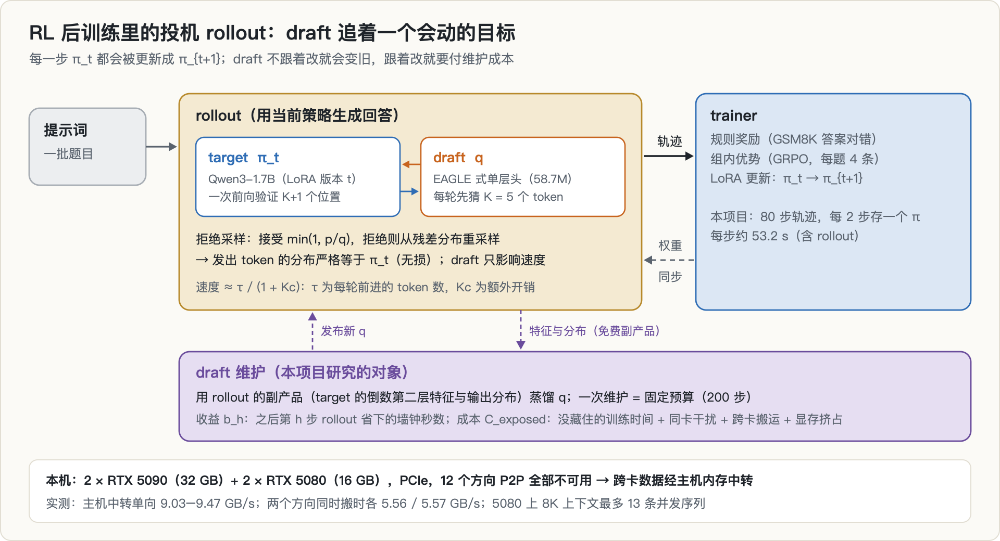

GRPO 这类 RL 后训练，每一步都分三段：先用当前策略 $\pi_t$ 给一批题目生成回答（rollout）；再按规则打分、在组内算优势；最后更新得到 $\pi_{t+1}$，同步回推理引擎。生成是逐 token 的，很慢，于是投机解码被搬进了训练循环：一个便宜的 draft 先猜 $K$ 个 token，target 用一次前向同时检查这 $K$ 个位置，再按拒绝采样决定接受几个。

serving 里的 target 是固定的，draft 训练一次就能一直用。RL 里的 target 每一步都在变，draft 会慢慢「变旧」，要么放着不管，要么定期重新对齐。后者就是本文说的**维护**。维护要花 GPU 时间，花在哪里、花多少、值不值，是这个项目想回答的问题。

### 1.2 拒绝采样：为什么「无损」

设 target 在某个位置的分布是 $p$，draft 的分布是 $q$。draft 提出 $x\sim q$，以概率 $\min(1, p(x)/q(x))$ 接受；被拒就从 $\max(0,p-q)$ 归一化后重采样。于是

$$
P(\text{发出 } x) = \min\big(p(x), q(x)\big) + \Big(1-\sum_y \min(p(y),q(y))\Big)\cdot\frac{\max(0,\,p(x)-q(x))}{\sum_y \max(0,\,p(y)-q(y))} = p(x).
$$

分母恰好等于 $1-\sum_y\min(p(y),q(y))$，第二项化简成 $p(x)-\min(p(x),q(x))$，两项相加就是 $p(x)$（推导细节见[本专栏第 9 篇](../spec-decoding-rl-mismatch/)的 §2）。**draft 再差也不改变输出分布，只影响速度。** 所以维护 draft 不会伤到训练本身，它纯粹是一笔「花时间换时间」的账。

### 1.3 α 与 τ：重叠面积和每轮前进几步

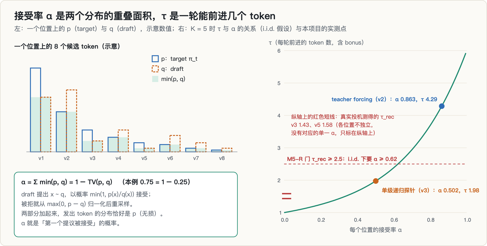

在一个上下文 $c$ 上，「第一个提议被接受」的概率是

$$
\alpha(c) = \sum_v \min\big(p(v\mid c),\, q(v\mid c)\big) = 1 - \mathrm{TV}\big(p(\cdot\mid c),\, q(\cdot\mid c)\big).
$$

它是两个分布的重叠面积，也等于 1 减去总变差距离。如果每个位置都独立地以 $\alpha$ 被接受，那么一轮（$K$ 个提议，全接受时再加一个 bonus token）平均前进

$$
\tau(K,\alpha) = 1+\alpha+\alpha^2+\cdots+\alpha^K = \frac{1-\alpha^{K+1}}{1-\alpha}.
$$

真实情况下各位置并不独立。更准确的写法是 $\tau = 1 + \sum_{k=1}^{K} \text{reach}_k$，其中 $\text{reach}_k$ 是前 $k$ 个提议全被接受的概率，等于各位「条件接受率」的连乘。这个区别在 §5.4 里差点酿成一次误判。

速度则取决于每轮的额外开销。以 AR（自回归，每次一个 token）走一步的耗时为单位，把投机一轮的耗时记作 $1+K_c$，那么

$$
\text{加速比} \approx \frac{\tau}{1+K_c}.
$$

$K_c$ 包括 $K$ 次 draft 前向、verify 比单步前向多出来的部分，以及调度开销。$\alpha = 0.5$ 时，$K$ 取多大 $\tau$ 都到不了 2；按 i.i.d. 公式，$K=5$ 要达到 $\tau=2.5$ 需要 $\alpha\approx 0.62$（推导）。

### 1.4 EAGLE 式 draft 头：训练口径与推理口径

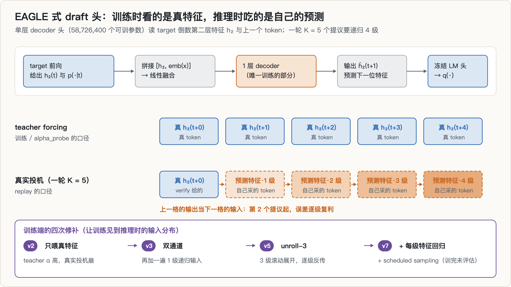

Qwen3 的稠密模型没有预训练好的 MTP 头，于是我按 EAGLE-1 的思路写了一个单层 draft 头：输入是 target 倒数第二层的特征 $h_2$ 和上一个 token 的 embedding，经过一层 decoder，输出下一位特征的预测 $\hat h_2$，再过 target 冻结的 LM 头得到 $q$。可训参数 58,726,400 个。

这种头有一个结构性的陷阱。训练时（以及用 teacher forcing 测 α 时），每个位置拿到的都是 target 算出的**真实**特征；真实投机时，一轮里只有第 1 个提议能拿到 verify 给的真实特征，第 2 到第 5 个提议只能吃上一格**自己预测的**特征，要递归 4 级。训练没见过这种输入，误差会逐级放大。§5.3 和 §5.4 讲的就是这个陷阱，以及修补它的过程。

### 1.5 策略漂移怎样影响 α

固定一个上下文 $c$ 和一个固定的 $q$。把策略从 $\pi_0$ 换成 $\pi_t$，由 $\alpha = 1-\mathrm{TV}(p,q)$ 和三角不等式，有

$$
\big|\alpha_t(c) - \alpha_0(c)\big| = \big|\mathrm{TV}(p_0,q) - \mathrm{TV}(p_t,q)\big| \le \mathrm{TV}\big(p_t(\cdot\mid c),\, p_0(\cdot\mid c)\big).
$$

**策略自己挪动的 TV 是 α 变化的上界，但 α 可以不动，甚至上升**，这取决于策略往哪个方向挪。这条不等式有两处需要小心：

1. 对 EAGLE 式头，冻结的是参数，不是 $q$：$q$ 依赖 target 的特征，特征随 $\pi_t$ 一起变。所以上式只能当量级参照（这一点在项目开工前的全文核验文档里就写过）。
2. RL 里上下文本身也在变：策略会走到新的前缀上。原项目把 α 的变化拆成两项，称为 G1 恒等式：

$$
\alpha(d_t,p_t) - \alpha(d_0,p_0) = \underbrace{\big[\alpha(d_t,p_0) - \alpha(d_0,p_0)\big]}_{\text{上下文漂移：策略走到了新地方}} + \underbrace{\big[\alpha(d_t,p_t) - \alpha(d_t,p_0)\big]}_{\text{条件漂移：同一前缀，回答变了}}
$$

其中 $d_t$ 是 $\pi_t$ 自己生成的上下文分布。后面的 E1 实验只在固定的 $d_0$ 上测，也就是只测了「条件漂移」这一项。这个限制后来决定了一个主张的生死（§6.2）。

### 1.6 维护的回本边界

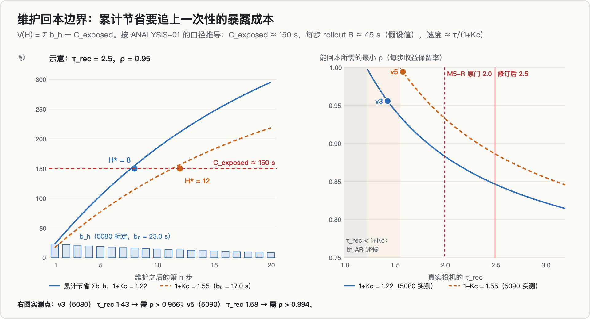

**🖼 怎么读这张图**
>
> **左图是回本曲线**。一次「维护」（重训 draft）要先付一笔固定成本，之后每一步省下 $b_h$ 的墙钟。但 $b_h$ 会随策略漂移**按 $\rho^h$ 衰减**——draft 越来越跟不上 target。所以累计节省是一条**逐渐变平的曲线**，而成本是一条水平线；两者的交点就是**回本步数**。
>
> 要看的是这条曲线**会不会与成本线相交**：若 $\rho$ 太小（漂移快），曲线在追上之前就趋平，**永远回不了本**；若衰减慢，交点很早出现，维护就该做。
>
> **右图把它变成一张判定表**：横轴漂移速度、纵轴单次维护成本，平面被分成「值得维护 / 不值得」两块。
>
> **本项目卡在哪里**：这张图需要两个输入——真实的 $\tau_\text{rec}$ 和真实的 $\rho$。§5 显示两者都拿不到：真实投机的接受长度过不了预设门槛（$\tau$ 太低），而我能造出的 RL 设置里策略几乎不漂移（$\rho\approx 1$）。**曲线的两个参数都测不出来，图就只能停在示意。**

把一次维护当作一笔会折旧的投资。它在关键路径上暴露的成本是 $C_\text{exposed}$；之后第 $h$ 步 rollout 省下的墙钟是 $b_h$（注意是秒，不是接受率）；训练还剩 $H$ 步。这次维护的净价值是

$$
V(H) = \sum_{h=1}^{H} b_h - C_\text{exposed}.
$$

如果收益按几何级数衰减，$b_h = b_0\rho^{h-1}$，那么

$$
V(H) = b_0\,\frac{1-\rho^H}{1-\rho} - C_\text{exposed}, \qquad
H^{*} = \left\lceil \frac{\ln\!\big(1 - C_\text{exposed}(1-\rho)/b_0\big)}{\ln\rho} \right\rceil \quad \big(0 < C_\text{exposed}(1-\rho)/b_0 < 1\big).
$$

$V(H)$ 随 $H$ 单调上升并饱和于 $V_\infty = b_0/(1-\rho) - C_\text{exposed}$。$V_\infty \le 0$ 时，训多久都回不了本；$b_0 > C_\text{exposed}$ 时每步都值得维护；两者之间存在唯一的翻转点 $H^{*}$：剩余步数少于它就别维护，多于它才值得。

这个公式就是标准的净现值，没有任何新意，原项目也明确不主张形式新颖。**它全部的研究价值押在一件事上：$b_0$、$\rho$、$C_\text{exposed}$ 在 RL 加投机这个场景里从没被可靠地测过。** 右图说明了为什么「服务栈」也会进入这笔账：$b_0 = R(1 - 1/s)$，而加速比 $s \approx \tau/(1+K_c)$。同样的 $\tau$，$1+K_c$ 越大，$b_0$ 越小，要回本就需要更大的 $\rho$。

---

## 2. 动机与假设链

2026 年，投机 rollout 已经进了主流 RL 栈，但「draft 要不要在线维护」这个问题，各家给出的经验结论互相矛盾（引用，数字均取自各论文，口径各不相同）：

| 立场 | 工作 | 关键证据 |
|---|---|---|
| 必须管 | TLT（2511.16665） | 在 base 模型上训练的 draft 用到 RL 之后的模型上，接受长度 6.53 → 4.59 |
| 必须管 | FastGRPO（2509.21792） | 每个 iteration 都无条件更新 draft，开销约 2–3%；去掉在线学习，Gen SR 2.78 → 1.94 |
| 必须管 | ReSpec（2510.26475）、MTP-RL（ACL'26） | 点名「持续更新的 actor 让 drafter 变旧」；MTP-RL 在线对齐时接受长度 2.49 → 2.56，冻结时 2.48 → 2.32 |
| 基本不用管 | NeMo-RL（2604.26779） | draft 初始化得好时，在线更新只把加速比从 1.77× 提到 1.78×；初始化差时 1.51× → 1.63× |
| 基本不用管 | Bebop（2606.12370） | 接受率下降主要来自策略熵上升，权重变化带来的失配可以忽略；RL 之前训练一次，全程稳定 |

我当时的读法：两派分歧的关键可能不是「漂移大不大」，而是 draft 的起点在 RL 上下文上对齐得怎么样。更要紧的是，**所有人都在回答「要不要维护」，没有人回答「这一次维护到底回不回本」**。于是有了三个假设，都写成可以被数据判死的形式：

- **H-A 收益持续期非平凡**：一次固定预算的维护，省下的 rollout 墙钟在后续几步里可测，既不是一步就消失，也不是永久保持；
- **H-B 暴露成本非零**：维护和 rollout 在这台机器上会争抢真实的资源（「空闲不等于免费」只是假设）；
- **H-C 剩余步数有决策价值**：同一状态下，不同的 $H$ 会导致不同的最优动作，而且只用当时可得的信息就能预测出来。

为什么觉得这台机器适合做：两种型号各两张，12 个方向的 P2P 全部不可用，16 GB 的 5080 显存很紧。这些约束让 $C_\text{exposed}$ 有明确的价格，而不是一个可以假设为零的量。

---

## 3. 这个题是怎么来的

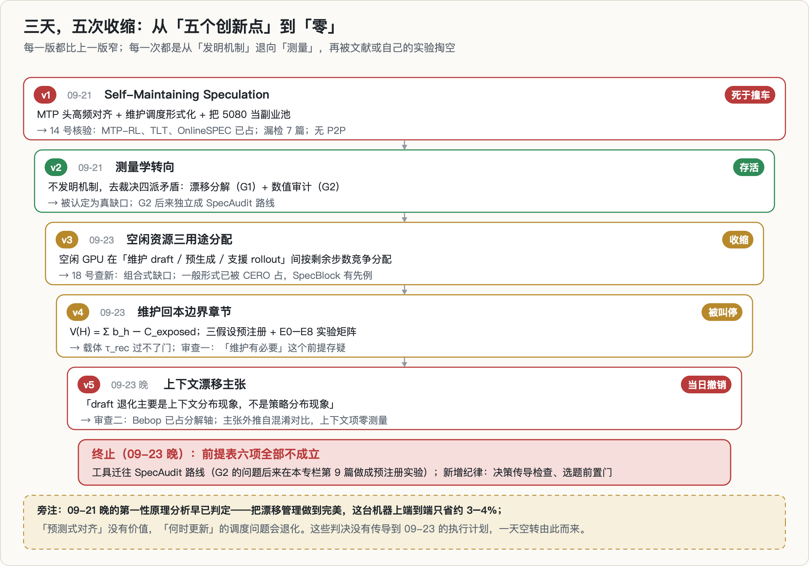

这是本专栏九个方向里的第一个，时间上也最早。[第 9 篇](../spec-decoding-rl-mismatch/)的选题漏斗把它概括为「撞车：Qwen Bebop 已把接受率退化拆解清楚，并给出了处理办法」。这句话没错，但只是最后一幕。完整的过程是五次收缩：

1. **v1「Self-Maintaining Speculation」（09-21）**：MTP 头高频对齐、维护调度的形式化、把两张 5080 当副业池。当天的核验就发现漏掉了 7 篇直接威胁新颖性的论文，其中 MTP-RL 已经做掉了「MTP 头在线重对齐」，TLT、OnlineSPEC 占住了调度；硬件判断也有错（GeForce 没有 P2P，7B 全参 RL 放不下）。
2. **v2 测量学转向（09-21）**：不再发明机制，而是去裁决四派的矛盾：漂移分解（G1）加数值审计（G2）。这一版活了下来。G2 后来独立成一条线，最终在[第 9 篇](../spec-decoding-rl-mismatch/)里做成了一次预注册实验。
3. **v3 空闲资源三用途分配（09-23）**：空闲 GPU 在「维护 draft / 预生成下一轮 / 支援当前 rollout」之间按剩余步数竞争分配。查新的结论是组合式缺口：一般形式已被 CERO（2606.05606）占住，「增益大于成本才更新」有 SpecBlock（2605.07243）的先例。于是收缩成一个章节。
4. **v4 维护回本边界（09-23）**：$V(H)$、三个假设、E0–E8 实验矩阵、五个控制器。这是方案的巅峰。那份 61 KB 的方案介绍当天 08:08（UTC）入库、09:05 定稿，当时只完成了环境验收和第一版 draft。
5. **v5 上下文漂移主张（09-23 晚）**：采纳第一轮外部审查的建议，把主张改成「draft 退化主要是上下文现象，不是策略现象」，当天就被第二轮审查推翻（§6.2）。

**回头看最刺眼的是图下方的旁注。** 09-21 晚写成的第一性原理分析已经算过：在这台机器上，训练和 rollout 大约各占一半，把漂移管理做到完美，端到端也只省约 3–4%（推导）；「用 ΔW、熵预测 α」没有价值，因为 α 在 rollout 中本来就能免费实时测量，预测最多只比测量早一步，能多拿到的不超过一步的 TV；「何时更新」的调度问题也会退化：draft 小到可以每步都更新时，就不需要决策；需要决策时，说明 draft 大到每步更新不划算。第二天上午，另一份全文核验文档又把「维护调度」恢复成了候选主线，而 09-23 的执行计划两份都没有回头读。第二轮审查的原话是：昨天的你比今天的你清醒。

这个项目终止之后，留下了两样东西：一道选题前置门（写代码之前先问「结论要成立，需要什么我没有的东西」），和一个意外的交接：终止提交里顺带提交了一个 SM120 基准脚本 `bench_sm120.py`，而下一个方向（[第 2 篇](../sm120-fp4-cliff/)）正是从测 SM120 开始的。

---

## 4. 预注册与判据

方案文档里写死的判据：

| 项 | 内容 |
|---|---|
| H-A | $b_1 \ge 3\%$ 单步墙钟，且 $\rho$ 的 95% CI 上界 $< 0.995$，且 $b_3 > 1\%$ |
| H-B | $C_\text{exposed} \ge 2\%$ 单步墙钟，或 draft 驻留挤掉并发槽位带来的每步时间增量 $\ge 2\%$ |
| H-C | 出现动作翻转且 $H^{*}$ 落在剩余步数分布的 [P10, P90] 内；HorizonAware 控制器比离线最优的固定周期多省 $\ge 3\%$ 总墙钟，达到 oracle 收益的 $\ge 80\%$ |
| 门控 | H-A 与 H-B 同时成立，才开 H-C 的实验 |
| kill | 控制器可省的总墙钟 < 3–5%，或固定 target 的对照显示衰减主要来自 serving 侧 → 降级为测量记录 |
| M5 | 载体可用：teacher forcing 口径下 $\tau \ge 2.0$ |
| 纪律 | α/τ 用 teacher forcing 一次前向精确计算；≥ 3 个种子加 bootstrap 95% CI；先测噪声地板；一切按 GPU UUID 记录；判据的任何变更都要登记 |

跑的过程中，变更登记簿（amendments）里加了三条。三条都是在看过相关数据之后写的，而且都是**收紧**而不是放宽：

| 时间（UTC） | 变更 | 写时是否已看数据 |
|---|---|---|
| 10:04 | 新增 **M5-R**：E2 之前，真实投机口径下 $\tau_\text{rec} \ge 2.0$。原 M5 在 teacher 口径下的「通过」保留不动 | 是（真实投机 $\tau_\text{rec}$ 只有 1.43） |
| 10:47 | 新增 **E1-R**：E2 之前，冻结 draft 的 α 相对下降要 $\ge 5\%$，否则没有漂移可测 | 是（E1 测得 +1.1%） |
| 10:47 | **M5-R 门槛 2.0 → 2.5**，依据是回本表（§5.6） | 是 |

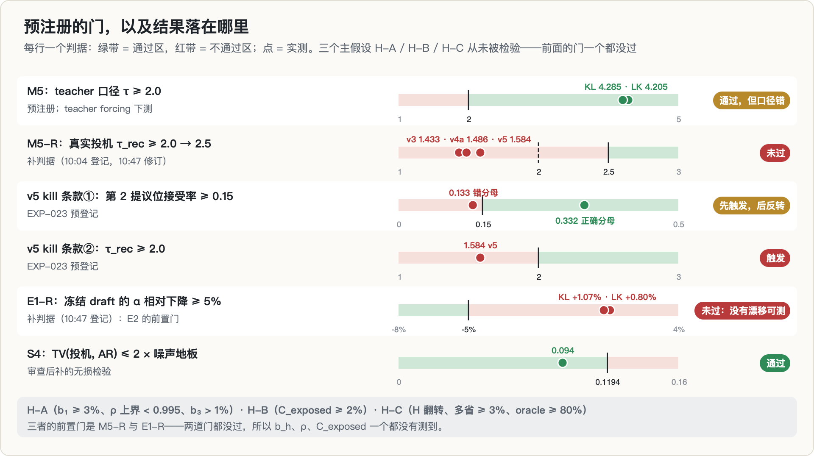

从这张图能直接读出项目的结局：**三个主假设一个都没有进入检验**，拦住它们的是后来补上的两道前置门。

---

## 5. 实验

### 5.1 E0：先看清这台机器

| 项 | 实测 |
|---|---|
| GPU | 2 × RTX 5090（32607 MiB，600 W）+ 2 × RTX 5080（16303 MiB，360 W），计算能力 12.0 |
| 编号 | nvidia-smi 的 0/1 是 5080，PyTorch 的 0/1 却是 5090。所有脚本按 UUID 绑卡 |
| P2P | `can_device_access_peer` 12 个方向全部是 false |
| 卡间拷贝（64 MiB） | 12.81–14.13 GB/s；另有一个方向记到 165.88 GB/s，物理上不可能（5 次里 4 次约 0.4 ms、1 次 4.9 ms，疑似异步计时的伪值），始终没有复测，不引用 |
| 经主机中转 | 单向 9.03 / 9.47 GB/s；两个方向同时搬时各 5.56 / 5.57 GB/s |
| 5080 容量 | Qwen3-1.7B BF16 加载后剩 12278 MiB；8K 上下文每条序列 KV 为 939,524,096 字节，最多 13 条并发 |
| 软件 | 驱动 580.173.02；Python 3.14.5、torch 2.12.0（CUDA 13.0）、transformers 5.17.0，装在隔离的 venv 里 |

数据：GSM8K 训练集 7473 行，按种子 20260923 洗牌，取 200 条训练、100 条留出（heldout100）。π₀ 在 T = 0.6、top_p = 0.95 下为这 300 条题各采一条回答，两张 5090 各跑 150 条，分别用 765 s 和 788 s；后来又补了 1200 条，合成 1400 条对齐数据。

### 5.2 d₀ 基线，和第一个静默杀手

第一版 draft（v1，KL 与 LK 两种损失各一个，预算 200 步、lr 1e-4、batch 8）训完，teacher forcing 测出的 α 只有 **0.0004**，而且两个独立训练的检查点测出了完全相同的数。这个「同值」比 α 低本身更可疑。

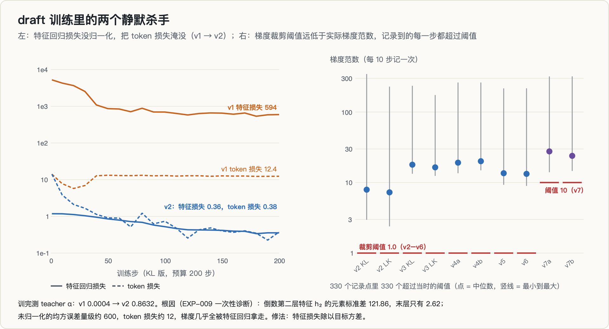

诊断（EXP-009）分两步。先排除一个错误的修复方向：`lm_head(h[-1])` 与模型输出的 logits 最大差为 0.0，transformers 的最后一层隐状态已经过了 final norm，所以 $p$ 的口径没问题。再看特征：倒数第二层 $h_2$ 的元素标准差是 121.86，最后一层只有 2.62。未归一化的特征均方误差量级约 600，token 损失约 12，梯度几乎全被特征回归拿走，KL 和 LK 两个版本「同归于尽」，所以同值。修法是把特征损失除以目标方差，不去手调权重。

修复后的 v2：

| 位置桶 | KL：α / τ | LK：α / τ |
|---|---|---|
| 1–64 | 0.6774 / 2.93 | 0.6596 / 2.78 |
| 65–256 | 0.8068 / 3.92 | 0.7945 / 3.82 |
| 257–1024 | 0.8938 / 4.80 | 0.8880 / 4.76 |
| **全部** | **0.8632 / 4.29** | **0.8553 / 4.21** |

teacher 口径的 M5（$\tau\ge 2.0$）大幅通过。一次维护（200 步）实测耗时 146.3 s（KL）和 162.4 s（LK），这就是后面 $C \approx 150$ s 的来源。

这一阶段有两个结论后来被撤回：「本预算下 KL 略胜 LK（0.008）」，以及 v4 时代的「特征权重 ×2 无益」。原因是右图：第一轮外部审查指出（B3），裁剪阈值 1.0 远低于实际梯度范数，每一步都被裁，有效学习率等于名义值除以裁剪比，而这个比值在各配置间不同，消融差异无法归因。**复核**：修复版 v7 把阈值改成了 10，但 v7a、v7b 记录到的梯度范数最小值分别是 14.03 和 14.61，仍然每个记录点都在被裁（日志每 10 步记一次，共 41 个点）。这个「修复」本身也没有达到目的。

表里还有一个覆盖问题（B4）：`alpha_probe` 当时按 1024 截断，而 heldout100 里 95% 的序列超过 1024 个 token，因为 α 随位置上升，截断会系统性地压低 α。所以 0.8632 其实是低估。

### 5.3 回放器，以及 50 倍的口径差

`replay.py` 是一个纯 torch 的无损投机解码回放器：每轮让 target 对 [上一个 token, $K$ 个提议] 做一次融合前向，得到 $K$ 个验证分布、一个 bonus 分布和各位置的 $h_2$；接受规则是 $\min(1, p/q)$，拒绝后从残差分布采样；top_p = 1.0，逐题顺序跑（B = 1），种子固定为 20260923 + 题号。三项自检（同种子逐 token 复现、近贪心下投机与 AR 逐 token 相同、统计量合理）全部通过。

AR 基线（heldout100 前 8 题 × 256 token，5080）：62.0824 s / 2048 token，每 token 30.31 ms。

v2 draft 的第一次真实投机：**125.8569 s，比 AR 慢 2.03 倍**，$\tau = 1.0876$，α = **0.0175**（9420 个提议里接受了 165 个）。draft 段花了 60.0 s，verify 段 48.4 s。其中 draft 段的开销来自冗余的 LM 头计算和在 CPU 上对约 15 万个类别做采样，改成只跑 trunk、在 CUDA 上采样之后降到约 11 s。但 α 的问题更深。

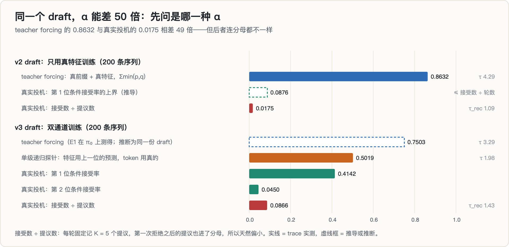

原记录把 0.863 对 0.017 称作「同一模型两个口径差 50 倍」，并以此作为 train/serve 失配的定量刻画。事情是真的，但这两个数的分母不一样：

- teacher forcing 的 α 是每个位置上 $\sum\min(p,q)$ 的平均，前缀和特征都是真的；
- replay 记的 α 是「接受数 ÷ 提议数」，每轮固定记 5 个提议，第一次拒绝之后的提议也进了分母，天然偏小。

换成可比的口径：v2 那次运行共 1884 轮，第 1 位的条件接受率不会超过 165 ÷ 1884 = 0.0876（推导）。差距约 10 倍，而不是 50 倍，但坍塌确实存在。

修法是让训练见到推理时的输入：v3 在训练里加了一遍「1 级递归」输入（特征用上一位的输出，教师通道和递归通道的 token 损失各占一半）。结果：5080 上 53.38 s 和 52.37 s，对 AR 是 **1.16× 和 1.19×**，$\tau_\text{rec}$ 为 1.42 和 1.45，方向翻正了。但 1.4 距离 teacher 口径推算的 4.3 还很远。

### 5.4 递归链坍塌、扩数据、unroll，以及一个差点杀掉修复的分母

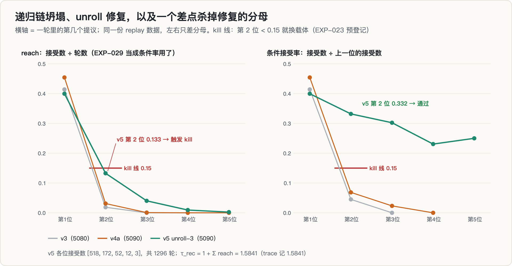

给 replay 加上按位置的接受计数（6 题 × 192 token，5080）后，v3 的形状很清楚：804 轮里第 1 位接受 333 次、第 2 位 15 次，第 3 位起为 0。按条件接受率算，第 1 位 0.414，**第 2 位 0.045**：链条从第二个提议开始就断了。新加的单级递归探针给出 α = 0.5019，介于 teacher 口径和真实投机之间。

随后的三步：

1. **扩数据（v4a / v4b，1400 条序列、400 步）**：单级探针从 0.50 升到 0.58（v4a）/ 0.55（v4b），但真实投机的 $\tau_\text{rec}$ 只有 1.4862，条件接受率 [0.454, 0.069, 0.023, 0]，**坍塌的形状没变**。M5-R 判定未过。病根也清楚了：训练只暴露 1 级递归，推理要 $K-1 = 4$ 级。这时预登记了 kill 条款：unroll 之后若第 2 位 < 0.15 或 $\tau_\text{rec} < 2.0$，就换载体，载体工程到此为止。
2. **unroll-3（v5）**：训练时自递归展开 3 级、逐级反传，训练用了 768.5 s。$\tau_\text{rec}$ = 1.5841，各位接受数 [518, 172, 52, 12, 3]，共 1296 轮。**链条第一次在所有深度上都有接受**，条件接受率拉平在 0.40 / 0.33 / 0.30 / 0.23 / 0.25。单级探针反而降到 0.4758，说明单层 trunk 的容量成了新瓶颈。
3. **kill 判决（11:57）**：trace 里名为 `alpha_by_pos` 的字段，第 2 位是 0.1327 < 0.15；$\tau_\text{rec}$ = 1.58 < 2.0。记为「kill 条件双触发」，按预注册换载体，开训 2 层 trunk 的 v6（109,062,144 个参数）。

问题出在 `alpha_by_pos` 的定义：它是「第 $k$ 位接受数 ÷ 轮数」，也就是 §1.3 里的 $\text{reach}_k$。可 kill 条款、代码注释和判读都把它当作条件接受率在用。第一轮外部审查指出了这一点（B1）。因为 trace 里存着原始计数，正确的条件接受率可以直接重算：第 2 位是 172 ÷ 518 = **0.332**，远高于 0.15。12:06 **判决反转**：条款①大幅通过，递归链的坍塌已被 unroll 修复；条款②（$\tau_\text{rec} < 2.0$）仍然触发，但诊断改成「条件接受率的水平只有 0.3–0.4，需要提高」，而不再是「递归坍塌」。换载体的前提失效，v6 改为容量对照实验。代码从此同时输出 `reach_by_pos` 和 `alpha_by_pos_cond` 两个口径。

后续的 v6、v7a、v7b（修复组合：裁剪阈值 10、每级都加特征回归、scheduled sampling 0.25、序列长度 2048）都训练完了，但**一次评估也没有做**。原记录把 v7 写作「中途终止（约 120/400、100/400 步）」，但训练 trace 显示两者分别在 12:33 和 12:40 跑满 400 步并存盘，早于 12:48 的终止提交（复核）。所以「修好所有已知问题之后，$\tau_\text{rec}$ 能不能到 2.5」这个问题没有答案。

v4 这一轮还出过一次工程事故：两个会话窗口同时执行了同一条启动命令，两对 v4a/v4b 进程写同一个日志、挤同一张卡。trace 里这一段有 68 条步记录，却只有 34 个不同的步号。72 行作废数据被隔离，v4 在单窗口下干净重跑。同一次事故里还发现，一个后台下载的「完成」标记是无条件 `echo` 出来的，下载其实失败了。

### 5.5 80 步轨迹，与 E1「被混淆的零」

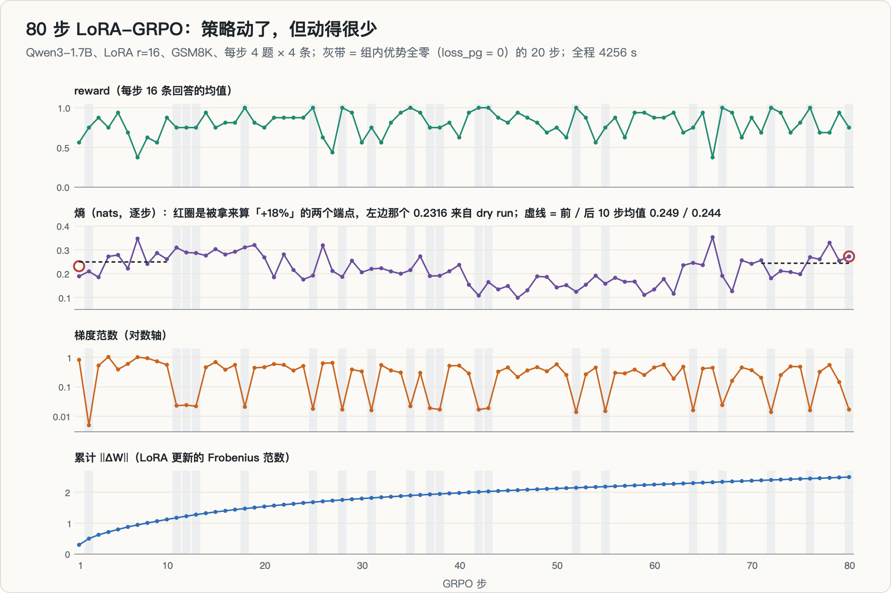

策略序列来自一条自己跑的 LoRA-GRPO 轨迹：Qwen3-1.7B，LoRA r = 16、α = 32，每步 4 题 × 4 条回答，max_new 1024，lr 5e-5，KL 系数 0.02，T = 0.6，每 2 步存一个检查点。80 步共 4255.8 s，每步约 53 s。reward 在 0.375–1.0 之间跳动，没有趋势；累计 ‖ΔW‖ 平稳增长到 2.4935；最后一步梯度范数 0.017。

GSM8K 对 1.7B 模型偏容易。原记录先用「reward 标准差为 0」数出 10 个零优势步，审查（B5）指出这漏掉了「每组内部全对或全错、但组间不同」的情况；按 `loss_pg == 0` 数是 **20/80**，有效漂移步大约只有 60 步。

然后是 E1：冻结 draft，逐个换上 π₀、π₄ … π₈₀ 这 21 个策略，在 heldout100（前 1024 位）上用 teacher forcing 测 α。KL 和 LK 两个 draft 各扫一遍，10:23–10:33 跑完。

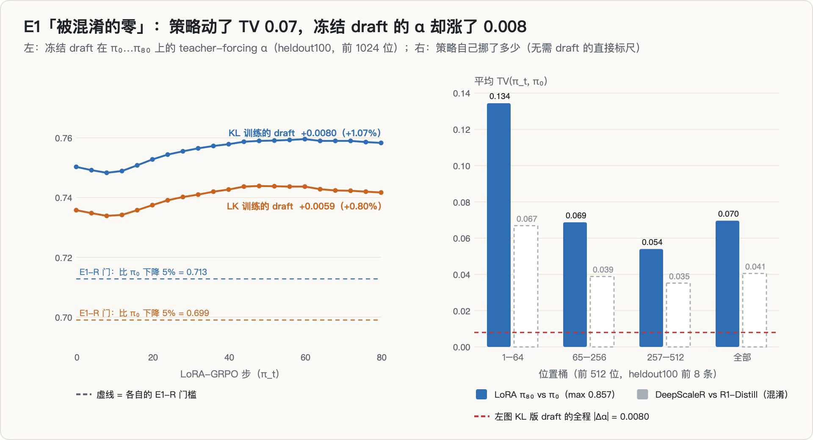

| draft | α(π₀) | α(π₈₀) | 变化 |
|---|---|---|---|
| KL | 0.7503 | 0.7583 | +0.0080（+1.07%） |
| LK | 0.7358 | 0.7417 | +0.0059（+0.80%） |

冻结的 draft 在 80 步之后不但没有退化，还略微变好了。E1-R 要求下降 ≥ 5%，没过。

这不能写成「不需要维护」。同一条轨迹的证据显示策略几乎没怎么被训：20 步零优势、reward 没有趋势、最后一步梯度范数只有 0.017。为了把这个判断定量化，又加了一个不需要 draft 的标尺 `drift_tv`，直接测 π₈₀ 相对 π₀ 的逐位置 TV（heldout100 前 8 题 × 前 512 位，共 4088 个位置）：平均 **0.0696**，前 64 位 0.134，单个位置最大 0.857。**策略确实动了，但动的方向与 draft 的重合度基本无关。** 按 §1.5 的不等式，TV 允许 α 变化到 0.07 的量级，实际只动了 0.008，而且方向是正的。审查一给这个结果起的名字是「被混淆的零」：在一个策略几乎没动的 regime 里，测不出漂移是预料之中，它只能说明「这个 regime 测不出」。

三处需要说明的地方：

- E1 在 π₀ 上的 α（0.7503）低于 v2 的 0.8632。trace 没有记下 E1 用的是哪个 draft 文件。按训练记录，`draft_kl_v0` 这个路径在 09:42 已被 v3（双通道）覆盖，而 E1 从 10:23 开始跑，所以它测的很可能是 v3 draft（推断）。
- TV 只在 8 题 × 512 位上测，E1 在 100 题 × 1024 位上测，两者的上下文集合不同；再加上 §1.5 说的「$q$ 随特征变化」，这里的对比只是量级参照。
- 同一时段，用公开的 DeepScaleR-1.5B 对 R1-Distill-Qwen-1.5B（约 1100 步全参 RL 的前后）测出的平均 TV 是 0.0405，比我的 LoRA 80 步还小。原项目据此推断「上下文漂移主导、条件漂移温和」，一度把它当作裁决四派矛盾的答案。审查指出这是混淆对比（两个模型不同基座族、上下文对它们是分布外、截断在 512 而它们的工作区间是 8K–24K、n = 8），降级为假设（§6）。

**复核：「熵 +18% 而 α 微升」站不住。** 原记录的第二个发现是：同一轨迹上熵从 0.2316 升到 0.2724（+18%），α 却微升，与 Bebop 的「熵升 → α 降」相反，并由此存档了一个可证伪命题。回读 `traj_log` 发现，0.2316 是 dry run（2 题 × 2 条、32 token 的冒烟运行）的第 1 步，不是正式轨迹。正式轨迹第 1 步的熵是 0.1891，逐步熵在 0.099–0.353 之间跳动，标准差 0.061；前 10 步均值 0.249，后 10 步均值 0.244；逐步线性拟合的斜率是负的（−0.00076 / 步）。拿两个端点相比，得不出任何趋势。熵的计算公式本身是对的（EXP-025 用 `Categorical.entropy()` 互验过，差 2e-6），错在取点。

### 5.6 回本表：载体是生死线

第一轮审查给了一张回本表（ANALYSIS-01，推导）：用 5080 上的两个实测点标定 $1+K_c \approx 1.22$，取 $C \approx 150$ s（v2 实测 146–162 s）、每步 rollout $R \approx 45$ s（假设值，取自轨迹每步 53.2 s 里 rollout 的部分），$b_0 = R(1-1/s)$：

| τ_rec | 外推加速比 | $b_0$ | ρ = 1 时回本步数 | 能回本需要 |
|---|---|---|---|---|
| 1.43（当时） | 1.16× | ≈ 6.2 s | ≈ 24 步 | ρ > 0.96 |
| 2.0（M5-R 原门槛） | ≈ 1.63× | ≈ 17.4 s | ≈ 8.6 步 | ρ > 0.884 |
| **2.5** | ≈ 2.05× | ≈ 23.0 s | ≈ 6.5 步 | ρ > 0.847 |
| 3.0 | ≈ 2.45× | ≈ 26.6 s | ≈ 5.6 步 | ρ > 0.823 |

结论是：载体太弱时（τ_rec = 1.43），维护几乎永远回不了本。但那是「假出口」，因为 draft 本身没做好，而不是维护不值得。只有 τ_rec 到 2.5 左右，翻转点才会落在 80 步轨迹的中段。于是 M5-R 从 2.0 收紧到 2.5。原项目对这张表的判读是：论文的价值恰好活在 $0 < C_\text{exposed} < b_0/(1-\rho)$ 这个窗口里，而窗口的两端都可以测。

这张表建立在 5080 的 $1+K_c = 1.22$ 上，而下一节表明这个数会随服务栈移动。

### 5.7 同卡基线：1+Kc 随服务栈移动

v4a 和 v5 的投机跑在 5090 上，当时报的加速比 1.26× 和 1.36×，分母却是 5080 上的 AR（B2，跨卡对比）。在同一张 5090 上补跑 AR：46.8495 s / 2048 token，每 token 22.88 ms。

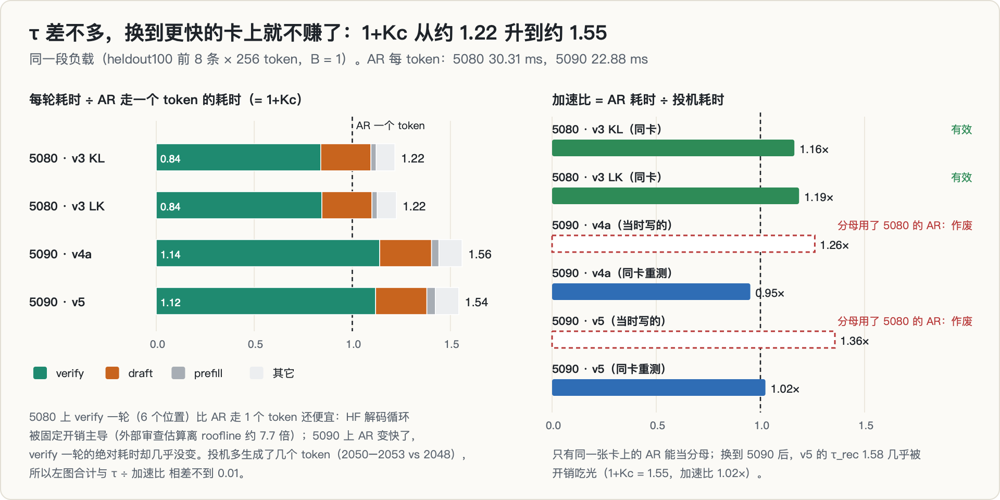

| 卡 | AR | 投机 | 加速比 | 1+Kc（= τ ÷ 加速比） |
|---|---|---|---|---|
| 5080（v3，同卡，有效） | 62.08 s | 53.38 / 52.37 s | 1.16× / 1.19× | 1.22 / 1.23 |
| 5090（v4a / v5，同卡重测） | 46.85 s | 49.24 / 45.74 s | **0.95× / 1.02×** | 1.56 / 1.55 |

v5 好不容易修出来的 τ_rec = 1.58，在 5090 上被开销吃光了。拆开每一轮的耗时（左图）：5080 上 verify 一轮（6 个位置）只相当于 AR 走一个 token 的 0.84 倍，因为这个 HF 解码循环被固定开销主导，外部审查估算它离 roofline 约 7.7 倍（推导）；5090 上 AR 每 token 快了约四分之一，verify 一轮的绝对耗时却几乎没变，相对成本就升到了 1.12–1.14。

这是审查一「$K_c$ 随服务栈优化程度移动」的预言得到的第一个实测证据，也意味着回本边界会跟着移动。图 4 左边的示意里，同样是 τ_rec = 2.5、ρ = 0.95，把 $1+K_c$ 从 1.22 换成 1.55，$H^{*}$ 从 8 步右移到 12 步（推导）。原记录写的是「回本步数在快卡上翻倍」，这要看 $R$ 怎么取：$R$ 保持 45 s 不变时，ρ = 1 的回本步数从 6.5 变成 8.8（×1.35）；若 $R$ 也按 5090 的 AR 速度缩到约 34 s，则变成 11.7（×1.8）（推导）。

两处局限：两张卡上的 draft 版本不同（5080 上是 v3，5090 上是 v4a / v5）；B = 1 是投机收益最大的工作点，而真实 RL rollout 是 16 条左右并发（审查 M2），批量一大，verify 更接近算力受限，投机的净收益会收窄。这两件事都没来得及测。

### 5.8 无损性闭环

最早的无损证据是「近贪心（T = 0.02）下投机与 AR 逐 token 相同」。审查（S4）指出这太弱：接受规则写错了也能过。第三次复跑时（11:55）它还报了一次 false，定性为测试容差缺陷：T = 0.02 的分布并非严格 one-hot，残差采样有小尾巴。于是补了一个 T = 0.6 的分布级检验 `lossless_check.py`，两条腿：

1. **拒绝规则对账**：逐个提议累计理论接受概率 $\sum\min(1,p/q)$，与实际接受数比较，要求落在二项分布 3σ 以内；
2. **端到端分布**：投机与 AR 各采一批，比较逐位置的经验 token 分布 TV，并与「AR 对 AR」的噪声地板比较，要求不超过地板的 2 倍。

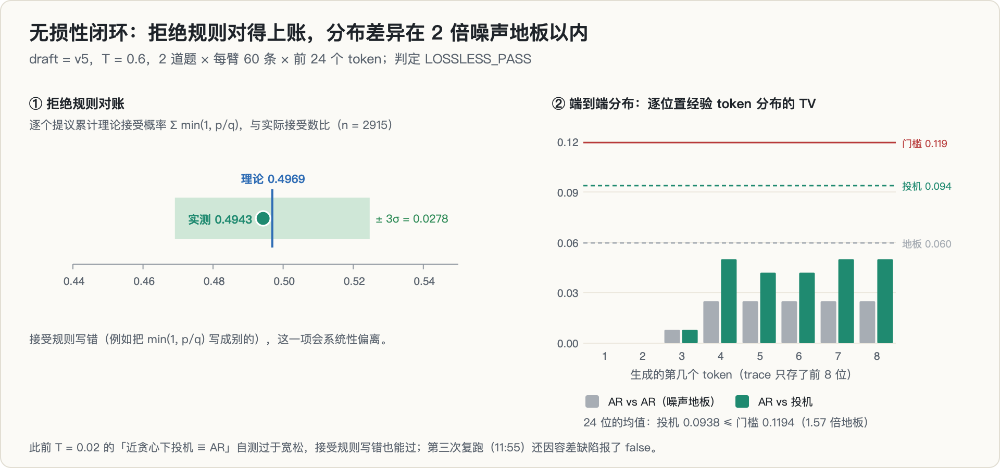

用 v5 draft、T = 0.6、2 道题、每臂每题 60 条、前 24 个 token：理论接受率 0.4969，实测 **0.4943**（n = 2915，3σ = 0.0278）；TV 均值 **0.0938**，噪声地板 0.0597，是地板的 1.57 倍，在 2 倍之内。判定 `LOSSLESS_PASS`。这一项在终止决议里被特意保留下来跑完。

要说明的是：样本很小，「2 倍地板」也是个宽松的门槛。真正有分量的是第一条腿：接受规则只要写错，实测接受率就会系统性偏离理论值。

---

## 6. 两轮外部审查与三次判决

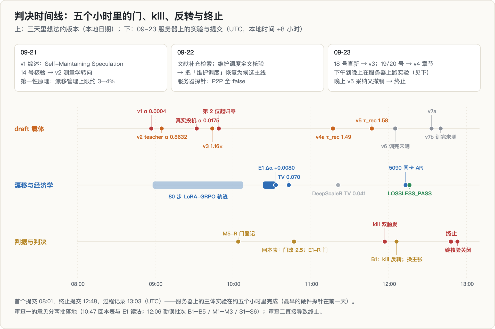

服务器上的第一个提交在 08:01，终止提交在 12:48（UTC）。主体实验都在这五个小时里。

### 6.1 审查一：勘误，外加一条没核验过的建议

第一轮审查的意见分两批落地（10:47 与 12:06）。它的三个大判断事后都成立：

- **E1 是「被混淆的零」**：不能写「不需要维护」，只能写「本 regime 测不出」；
- **载体是生死线**：回本表（§5.6），M5-R 收紧到 2.5；
- **测量栈的三个硬伤**：HF 循环离 roofline 约 7.7 倍（M1）；B = 1 是投机的最佳点而不是 RL 的工作点（M2）；统计纪律形同虚设，1 个种子、8 道题、没有 CI、没有噪声地板（M3）。

逐条勘误里，B1（分母）、B2（跨卡）、B3（裁剪）、B4（截断）、B5（零优势步数）在上文各节都已交代，此外还有：`--recursive` 探针的 α 与 replay 的 α 不可比（S3）；token 层面的 exposure bias 与 unroll 级缺少特征监督（S5）；`is_causal` 在「有 KV cache 且一次多个 token」时会静默变成双向注意力（P2，加了报错防护）；decode 再 encode 的往返会丢 EOS、造成错位（P3，改为直接传采样出的 id）。

它同时给了一条 6 周路线，和一个**换主张**的建议：把论文改成「draft 退化主要是上下文分布现象」，证据是 E1（冻结 draft 的 α 不降）加 TV（策略确实动了）加 DeepScaleR 那次对比。**这条建议没有经过文献核验。**

**判决 1（12:06，反转）**：B1 修正后，v5 的 kill 条款①从「触发」变成「大幅通过」（§5.4）。

**判决 2（12:06 采纳，12:48 撤回）**：主张重定位为上下文漂移论，E4（固定 target 对照）升格为主实验，「回本边界」降为一节。

### 6.2 审查二：前提表全部不成立

第二轮审查专做文献核验，结论是一张前提表：

| 前提 | 状态 | 依据 |
|---|---|---|
| 维护是必要的 | 不成立 | Bebop：RL 前用端到端 TV 损失加拒绝采样对齐一次，全程 α 稳定，明确说不需要代价高昂的在线更新（引用） |
| 漂移分解是空白 | 不成立 | Bebop 已经做了分解（熵对失配） |
| 「何时更新」是真问题 | 不成立 | 自己 09-21 的判决：draft 小则无需决策，大则每步更新不成立 |
| 预测 $b_h$ 有价值 | 不成立 | 自己 09-21 的判决：α 免费实时可测，预测的价值上界是一步漂移 |
| 大 batch 下收益收窄是新发现 | 不成立 | ReSpec 已发表 |
| 刷新上下文比梯度更新便宜 | 不成立 | DAS 的机制就是这个 |
| 09-23 的重定位主张 | **撤回** | E1 只测了条件项；上下文项从来没测过；主张外推自混淆对比 |

**判决 3（12:48，终止）**：不执行 6 周路线。停掉 v7a / v7b（如 §5.4 所述，训练其实已经完成，只是不再评估）和 2 万条的数据扩量：两个分片最后一条进度记录分别是 1080/3436 和 120/3437，原记录估计省下约 15 GPU·h。保留并跑完无损检验。

### 6.3 最后一条缝：Bebop 做没做过固定前缀的配对对照？

终止之前，还核验了最后一条缝（EXP-033）：Bebop 有没有单独隔离上下文项 $\alpha(d_t,p_0) - \alpha(d_0,p_0)$？从目录、图注和归因措辞三方面看（引用）：它的分解轴是「熵对失配」，两者都属于条件分布层面；关键的散点图是「每个点代表一个 RL 步」的训练流观察口径；干预实验比较的是 TV 损失与 CE 损失下熵对 α 的斜率（−1.68 → −0.06），干预的是失配结构而不是上下文。结论：**固定前缀的配对对照确实不存在**，上下文项没有被单独隔离。

但这条缝不值钱：Bebop 的配方在真实的 $d_t$ 演化流上 α 全程稳定，说明上下文漂移同样被这个配方免疫，处方不会变（RL 前用 TV 训一次）；处方的另一半（刷新上下文）又被 DAS 占着；剩下的只有「熵律是否部分是上下文漂移的代理」这一点归因修正，天花板是 workshop 或 artifact。**终止决议维持。**

这次核验有一个自己写明的置信边界：PDF 解析失败，HTML 全文在 50k 字符处被截断，§5.1 的正文没有逐字读到，判定依据是上述三方面的证据。另外，被存档的那个可证伪命题（「Bebop 的熵律在弱配方下部分是上下文漂移的代理」），它的种子正是 §5.5 那个「熵 +18%」，而这个数已经不成立了。

---

## 7. 死因

按从表到里的顺序：

1. **撞车（表层）**：「要不要维护」这个问题在立项前三个月就被 Bebop 回答了，答案是：起点对齐好了就不用管。其余的机制空间被十几个邻居分食。

   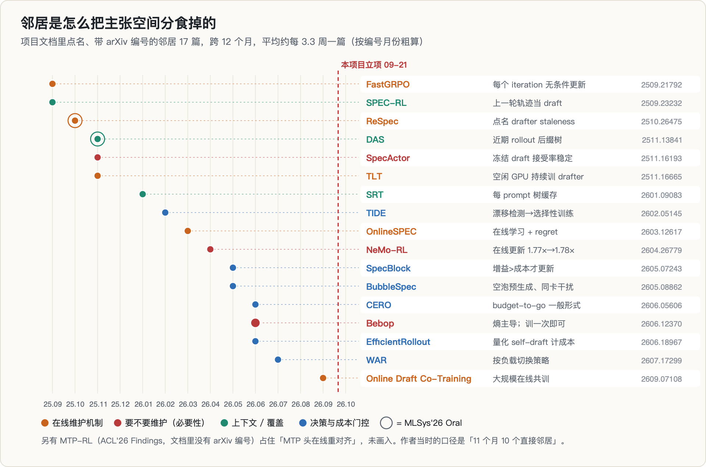

   原记录的说法是「11 个月 10 个直接邻居、约每 6 周一个」。按项目文档里实际点名、带编号的邻居数，是 17 篇、12 个月，平均约 3.3 周一篇。口径更宽，结论相同。
2. **前提塌方**：整条假设链的地基是「维护有必要、而且有代价」。外部证据（Bebop、NeMo-RL）说起点对齐好就不必维护；自己的数据在我造得出的 regime 里测不出漂移（E1），也造不出一个能用的载体（τ_rec 最高 1.58）。H-A、H-B、H-C 一个都没有被检验，所以这不是「被数据证伪」，而是「还没走到检验那一步，前提就没了」。
3. **缺少决策后果（根因）**：后来写选题前置门时，这个项目的死因被概括成一句话：**测了但没人在乎**。就算 $b_h$、$\rho$、$C_\text{exposed}$ 全测出来了，在这台机器上，完美的漂移管理也只值约 3–4% 的端到端时间（推导）；而 Qwen 和 NVIDIA 已经给出了「RL 之前对齐好、之后冻结」的做法。没有人会因为这组数字而改变做法。
4. **过程上的原因**：09-21 已经做出的判决没有传导到 09-23 的执行计划，白白空转了一天；每次收缩都是从「发明机制」往回退一步，却没有先问退到的那一步值不值得做。

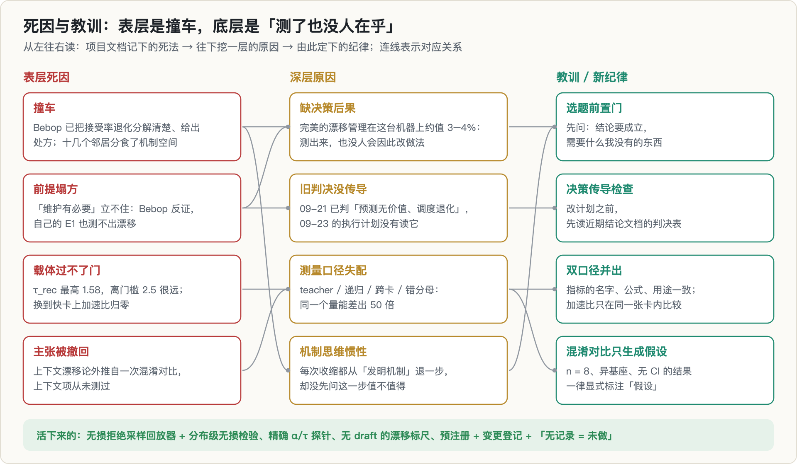

---

## 8. 仍然成立的部分

这些测量与项目是否立项无关，数据和工具都保留了：

1. **无损投机回放器与分布级无损检验**：拒绝规则对账（0.4943 对 0.4969，n = 2915）和 T = 0.6 下的分布比较（TV 0.0938 对地板 0.0597），可以直接当作检查任何投机实现的最小套件。
2. **α 的口径表**：同一个 draft，teacher forcing、单级递归探针、真实投机第 1 位条件接受率、接受数 ÷ 提议数，可以从 0.86 一路落到 0.02（§5.3）。报告投机接受率的时候，必须写明是哪一种。
3. **递归链坍塌与修复**：只在真实特征上训练的 EAGLE 式头，真实投机时从第 2 个提议起坍塌（条件接受率 0.045）；扩 7 倍数据不改变形状；unroll-3 把条件接受率拉平到 0.23–0.40。
4. **1+Kc 随服务栈移动**：同一段负载，5080 上 1.22，5090 上 1.55；verify 一轮的绝对耗时在两张卡上几乎相同。在 HF 这类开销主导的循环里，「换张快卡」可以让投机的收益归零。
5. **被混淆的零**：LoRA 80 步里策略的平均 TV 是 0.07，冻结 draft 的 α 却 +0.008。「α 没掉」和「策略没动」是两回事，要用一把不依赖 draft 的尺子（`drift_tv`）把它们分开。
6. **硬件事实**：消费级 Blackwell 四卡之间 P2P 全部不可用；经主机中转时，两个方向同时搬，每个方向只剩约 60%（5.56 / 5.57 对 9.0–9.5 GB/s）。
7. **纪律**：B1 被指出之后，正确的条件接受率可以直接从 trace 里的原始接受计数重算出来，因为 trace 存的是计数，而不只是一个算好的比值。「无记录 = 未做」加上「只增不改的 trace」，比任何一个主张都活得久。

---

## 9. 过程中的错误与更正

| 错误 | 后果 | 怎么发现的 | 处理 |
|---|---|---|---|
| 特征回归损失没归一化（$h_2$ 标准差 121.86） | α = 0.0004，两个 draft 同值 | 两个独立检查点测出相同的 α | 除以目标方差；α 升到 0.8632 |
| 只在真实特征上训练 draft | 真实投机比 AR 慢 2 倍 | replay 的第一次对照 | 双通道 → unroll-3 |
| 把 0.863 对 0.017 称作「50 倍」 | 两个数分母不同，夸大了差距 | 写这篇时对口径 | 可比口径下约 10 倍（推导，§5.3） |
| **`alpha_by_pos` 用了 reach 当条件率（B1）** | kill 误触发，差点放弃唯一有效的修复 | 外部审查 | 从 trace 重算后反转判决；双口径输出 |
| 加速比跨卡比较（B2） | 1.26× / 1.36× 作废 | 核对 trace 里的 GPU UUID | 同卡补跑：0.95× / 1.02× |
| 裁剪阈值 1.0 每步都裁（B3） | 两个消融结论作废 | 外部审查 | 阈值改为 10；**复核**：v7 的梯度仍全部高于 10 |
| 探针按 1024 截断（B4） | α 被系统性低估 | 外部审查 | 默认长度改为 2048 |
| 零优势步按 reward 标准差数（B5） | 10/80 应为 20/80 | 外部审查 | 改按 `loss_pg == 0` |
| 近贪心自检太弱（S4） | 接受规则写错也能过 | 外部审查 | 补 T = 0.6 分布级检验，PASS |
| 两个会话窗口同时启动同一批训练 | 日志互写，34 组重复步 | 日志里 OOM 栈和步记录拼在一行 | 隔离 72 行，单窗口重跑 |
| 下载链的「完成」标记无条件打印 | 以为权重已下载好 | 目录其实不存在 | 改成带退出码和文件校验的链 |
| `cd X && nohup … &` 把整条链放进后台 | 一个数据分片静默没跑 | `wc -l` 核对产出 | 绝对路径，产出必核对行数 |
| 日志在写入时才读 git commit | 同一条轨迹记了 8 个不同 commit | 核对 trace | 证实只是记录侧漂移；加进程启动时的代码指纹 |
| 旧格式检查点的键名不匹配 | 可能静默加载成随机权重 | 兼容层审查 | 统一加载函数，按层数推断 |
| 从混淆对比外推出主张（EXP-028） | 主张被采纳又撤回 | 外部审查二 | 降级为假设；上下文项需配对测量 |
| 09-21 的判决没传导到 09-23 的计划 | 空转一天 | 外部审查二 | 新纪律：改计划前先读判决表 |
| **（复核）「熵 +18%」的起点来自 dry run** | 一个「与 Bebop 不符」的发现和一个存档命题失去依据 | 写这篇时回读 `traj_log` | 本文撤回该发现 |
| **（复核）v7 记作「中途终止」** | 实际已训完、只是没评估 | 训练 trace 的保存记录 | 按 trace 写 |
| **（复核）E1 没记下 draft 文件** | 无法确认 E1 用的是 v2 还是 v3 | E1 与 v2 在 π₀ 上的 α 对不上 | 按检查点覆盖时间推断为 v3 |

最后三行是我回头读 trace 时才发现的。当时的记录纪律已经很严（每个实验登记、数字从 trace 抄），可只要取点或写结论时没有回到原始行，错误照样能溜进去。

---

## 10. 我学到了什么

1. **先找决策后果，再找测量对象。** 选题时先问：这个数测出来，谁会因此改变做法？这个项目的每一次收缩，都是在一个「测出来也没人会改」的问题上越挖越深。
2. **结论文档到执行计划之间要有一道核对。** 09-21 已经判了「预测无价值、调度退化」，09-23 的计划照样按旧思路写。现在改计划之前，我会先读最近几份结论文档的判决表。
3. **指标的名字、公式、用途必须一致，分母要写进名字里。** `alpha_by_pos` 这个名字暗示它是条件接受率，公式却是 reach，而 kill 条款按条件率在用。
4. **先问是哪一种 α，再看数字。** teacher forcing、递归探针、真实投机，同一个 draft 能差出几十倍；只有和最终用途同口径的那个数，才能拿来做判据。
5. **加速比只在同一张卡上比，而且要记住它会随服务栈移动。** $1+K_c$ 从 1.22 变成 1.55，回本边界就跟着右移。任何「投机能省多少」的结论，都要带上服务栈。
6. **做消融之前，先看裁剪比。** 每一步都被裁时，有效学习率由裁剪比决定，消融测到的是噪声。改完阈值之后还要回头确认，裁剪是不是真的停了。
7. **「测不出」不等于「不存在」。** α 没掉，先确认策略到底动了没有。要用一把独立于被测对象的尺子。
8. **混淆对比只能生成假设。** n = 8、异基座、分布外上下文、没有 CI 的结果，写下来的时候就标上「假设」，而不是等别人来降级。
9. **trace 要记完整的命令行和输入文件。** E1 用的是哪个 draft，今天已经无法确认，只能推断。
10. **外部审查值得，但不能替代自己回到原始数据。** 两轮审查分别贡献了「回本表」和「前提证伪」，而我写这篇时回读 trace，又翻出三处问题。

---

## 11. 局限与开放问题

**测过的范围**：Qwen3-1.7B BF16；自己训练的 EAGLE 式单层头（后期还有两层版，但没评估）；K = 5；LoRA r = 16、80 步、GSM8K（偏易，有效漂移步约 60）；单个种子；teacher forcing 探针截断在 1024 位；TV 标尺只测了 8 题 × 512 位；投机计时只在 HF 循环、B = 1、8 题 × 256 token 上做过；RTX 5080 / 5090。

**没测过的**（本文结论不能外推到这些情形）：

- 全参数 RL、更难的数据（让策略真正漂移起来的 regime）；
- 固定前缀的配对对照，即 G1 恒等式里的上下文项。它从来没被测过，所以「上下文漂移主导」至今仍是假设；
- 真实推理引擎（vLLM / SGLang）、批量大于 1、MTP 头或官方 EAGLE 头；
- $b_h$、$\rho$、$C_\text{exposed}$ 本身。这是项目的核心测量，一个都没有做。

如果将来遇到一个「draft 确实会显著退化、维护又确实很贵」的 regime（比如长链全参 RL、只能在关键路径上维护的大 draft），这笔账可能重新变得有意义。但那应该作为一个新问题重新走选题前置门，而不是拿来挽救这次的终止。

---

## 12. 复现

- **环境**：Python 3.14.5、torch 2.12.0（CUDA 13.0）、transformers 5.17.0、accelerate 1.15.0，驱动 580.173.02；模型 Qwen3-1.7B（BF16），对照用 DeepScaleR-1.5B 与 R1-Distill-Qwen-1.5B。
- **脚本**：`e0_env_check.py`（环境验收）、`make_prompts.py` / `gen_rollout_data.py`（数据）、`draft_head.py` / `train_draft.py`（draft 与维护）、`alpha_probe.py`（teacher forcing / 递归探针）、`lora_grpo_traj.py`（策略轨迹）、`replay.py` / `timing.py`（无损投机回放与计时）、`drift_tv.py`（无 draft 的漂移标尺）、`lossless_check.py`（分布级无损检验）；配置在 `configs/draft_train*.yaml`。
- **提交**：首个提交 `7dc8aa9`；修复特征损失 `c02f41e`；回放器与失配诊断 `c9e4416`；B1 反转 `a7101b3`；同卡基线 `682c4c9`；终止 `55d1cbb`；Bebop 缝核验 `72154e7`；过程记录 `29eb7fa`。24 个提交，全部在 09-23 08:01–13:03（UTC）。
- **记录**：实验登记 EXP-001 到 EXP-033 在 `EXPERIMENTS.md`，判据变更在 `reports/amendments.md`，作废数据在 `logs_quarantine/`；trace 为 `traces/{e0_env,alpha_probe,draft_train,replay,traj_log,drift_tv}.jsonl`，只增不改。
- **本文的图**：由只用 Python 标准库的脚本（`data.py`、`figs_concept.py`、`figs_data.py`）直接从上述 trace 和日志读数生成；少数只能取自文档的数字（$h_2$ 的标准差、回本表的 $C$ 和 $R$、roofline 估算）在脚本里注明了出处。

---

## 参考

下面每条都写清楚「这篇做了什么、关键结论是什么、和本篇什么关系」。标 ⭐ 的是直接决定本项目命运的四篇。

### A. 投机解码的地基

**Fast Inference from Transformers via Speculative Decoding** · [arXiv 2211.17192](https://arxiv.org/abs/2211.17192)
投机解码的原始论文（Leviathan et al.）。核心观察有两条：困难的语言建模任务里往往嵌着能被小模型近似的简单子任务；配合一套改造过的采样方法，可以让并行计算出的多个 token **在分布上与逐个采样完全等价**。这就是「无损」的来源。
**与本篇的关系**：§1.2 的拒绝采样推导直接来自这里。本篇所有「维护 draft 能省多少」的讨论，前提都是接受/拒绝这一步不改变输出分布——否则省下的时间就不是白捡的。

**Accelerating Large Language Model Decoding with Speculative Sampling** · [arXiv 2302.01318](https://arxiv.org/abs/2302.01318)
DeepMind 同期的独立工作。关键措辞是它的 modified rejection sampling *preserves the distribution of the target model **within hardware numerics***——无损性是在硬件数值精度**之内**成立的。
**与本篇的关系**：这句限定是[第 9 篇](../spec-decoding-rl-mismatch/)整篇文章的起点，也是 §5.8「无损性闭环」要验的东西。两篇论文同时给出同一个算法，说明这个想法在当时是「悬在空中等人摘」的。

**EAGLE-3: Scaling up Inference Acceleration of LLMs via Training-Time Test** · [arXiv 2503.01840](https://arxiv.org/abs/2503.01840)
EAGLE 系列在特征层而非 token 层做自回归，复用 target 顶层特征。EAGLE-3 解决的问题很具体：**给 EAGLE 加训练数据，收益很快饱和**。作者把瓶颈归到「特征预测」这个约束上，去掉它并引入训练时测试（training-time test）来对齐多步草拟的行为。
**与本篇的关系**：§1.4 讲的「训练口径与推理口径不一致」就是 EAGLE-3 要修的那个问题。本项目用的 draft 头是 EAGLE 式的，它的 α 上限、以及「多步草拟时误差累积」的行为都由这条线决定。

### B. ⭐ 决定本项目命运的四篇

**⭐ Breaking Entropy Bounds: Accelerating RL Training via MTP with Rejection Sampling（Qwen Bebop）** · [arXiv 2606.12370](https://arxiv.org/abs/2606.12370)
**这篇直接回答了本项目想问的问题，是终止的主因。** 它系统研究了 MTP 在后训练里的行为：很多工作观察到**RL 训练过程中 MTP 接受率会显著退化**，导致加速有限；Bebop 给出把 MTP 整合进 RL 的实践配方，并从熵的角度解释了接受率的上界。
**与本篇的关系**：我想测「draft 什么时候值得维护」，而 Bebop 已经给出了「要不要维护、怎么维护」的答案。§6 三次判决里，这一篇是让主张从「测回本边界」收缩到无处可去的那一击。

**⭐ ReSpec: Towards Optimizing Speculative Decoding in Reinforcement Learning Systems** · [arXiv 2510.26475](https://arxiv.org/abs/2510.26475)
明确点出了朴素地把 SD 塞进 RL 的**三个缺口**：大 batch 下加速收益递减、actor 持续更新导致 **drafter staleness**、以及 drafter 会引起策略退化。
**与本篇的关系**：第二条就是本篇的整个主题（漂移让 α 掉，于是需要维护）。第一条是我在 §5.7 撞上的「1+Kc 随服务栈移动」——大 batch 下投机的收益本来就在缩水，维护的回本窗口也跟着变窄。

**⭐ FastGRPO: Accelerating Policy Optimization via Concurrency-aware Speculative Decoding and Online Draft Learning** · [arXiv 2509.21792](https://arxiv.org/abs/2509.21792)
把两件事合在一起做：按并发度自适应地决定要不要投机，以及**在线学习 draft**。它给出的正是本项目想要的那条「维护」路径的一个完整实现。
**与本篇的关系**：我的主张「维护能省多少墙钟、多久回本」在这里已经被当作工程默认项实现了。它和 Bebop 一起构成了 novelty 下移的两块石头。

**⭐ Speculative Decoding: Performance or Illusion?** · [arXiv 2601.11580](https://arxiv.org/abs/2601.11580)
第一份在**生产级引擎（vLLM）**上系统评测 SD 的工作，覆盖 n-gram / EAGLE / EAGLE-3 / Draft-Model / MTP 多种变体，跨不同负载、模型规模和 batch size。它的出发点就是质疑：过去的评测大多基于研究原型和**不切实际的小 batch**。
**与本篇的关系**：这是 §5.7「同卡基线：1+Kc 随服务栈移动」的外部佐证。我在自己机器上量到的那条基线之所以会动，正是因为它依赖服务栈和 batch——而我最初把它当成了常数。这也是本篇「载体是生死线」这个结论的来源。

### C. 在线维护 draft：本项目想做的事，别人已经做了

**Taming the Long-Tail: Efficient Reasoning RL Training with Adaptive Drafter（TLT）** · [arXiv 2511.16665](https://arxiv.org/abs/2511.16665)
瞄准推理 RL 的**长尾**问题：少数极长回答主导了执行时间。TLT 用自适应 drafter 无损地加速这类训练。
**与本篇的关系**：它和下面几篇共同说明——「在 RL 里持续更新 draft」这件事已经有多个完整系统，本项目再做只能是复现。

**When Drafts Evolve: Speculative Decoding Meets Online Learning** · [arXiv 2603.12617](https://arxiv.org/abs/2603.12617)
指出一个「已存在但没被利用」的信号：**投机解码本身就在持续产生验证反馈**，这个反馈量化了 draft 与 target 的偏离程度。把它当作在线学习的监督信号，就能让 draft 边服务边改进。
**与本篇的关系**：这正是「维护」最廉价的实现方式——不需要额外的 target 前向，反馈是免费的副产品。我在 §1.6 算回本边界时，成本项假设的是「重新训练 draft 要单独花算力」；这篇说明那个假设本身就偏保守。

**TIDE: Temporal Incremental Draft Engine for Self-Improving LLM Inference** · [arXiv 2602.05145](https://arxiv.org/abs/2602.05145)
把在线 draft 适配做进服务引擎内部：复用 target 推理时已经产生的中间隐状态作为训练信号，**不增加额外的 target 计算和服务时开销**。
**与本篇的关系**：和上一篇同一思路的工程化版本。两篇合起来把「维护成本」压到接近零，这让我原本要测的「回本时间」这个量失去了意义。

**Online Draft Co-Training for Speculative Decoding in Large-Scale, Long-Context RL Post-Training** · [arXiv 2609.07108](https://arxiv.org/abs/2609.07108)
把在线 co-training 推到大模型 + 长上下文的规模，解决了两个具体的并行化障碍：**标准因果上下文并行（CP）不支持 branch attention**，以及 target 特征跨流水并行（PP）阶段分布。
**与本篇的关系**：说明这条路线已经走到了「解决大规模工程细节」的阶段，而不是「还在验证想法」的阶段。

### D. 用历史 rollout 当 draft：另一条绕开维护的路

**SPEC-RL: Accelerating On-Policy RL with Speculative Rollouts** · [arXiv 2509.23232](https://arxiv.org/abs/2509.23232)
观察到**相邻训练 epoch 的 rollout 有大量重叠**，于是直接把上一轮的 rollout 当 draft 复用，跳过重复生成。
**与本篇的关系**：这是「不维护 draft 也能拿到投机收益」的思路——draft 不是一个需要训练的模型，而是历史数据。[第 6 篇](../rollout-half-life/)量的就是这条路上 draft 用途能撑多久。

**SRT: Accelerating RL via Speculative Rollout with Tree-Structured Cache** · [arXiv 2601.09083](https://arxiv.org/abs/2601.09083)
同一思路的 **model-free** 版本：把同一 prompt 在历次训练步产生的续写存进每 prompt 的树形缓存，当前策略直接拿这棵树做 draft，并持续刷新缓存。
**与本篇的关系**：「model-free」三个字很关键——它连 draft 模型都不需要，自然也不存在「要不要维护」的问题。这是对本篇选题的一种釜底抽薪。

**Beat the long tail: Distribution-Aware Speculative Decoding for RL Training（DAS）** · [arXiv 2511.13841](https://arxiv.org/abs/2511.13841)
同时利用两件事：rollout 长度的**长尾分布**（少数长生成主导墙钟），以及历史 rollout 里**跨 epoch 稳定的 prompt 级模式**。
**与本篇的关系**：长尾这个角度本篇没有覆盖。它提示「维护 draft」未必是提升墙钟的最优杠杆——把资源花在长尾那几条上可能更划算。

### E. 系统侧：投机在 RL 里的放置与调度

**Accelerating RL Post-Training Rollouts via System-Integrated Speculative Decoding（NVIDIA NeMo-RL）** · [arXiv 2604.26779](https://arxiv.org/abs/2604.26779)
把 SD 当作**无损加速原语**放进 NeMo-RL + vLLM，强调它与那些「改变 rollout 或优化区制」的方法（off-policy 执行、replay、低精度生成）不同——**不改变 target 的输出分布**。
**与本篇的关系**：这是本项目最初设想的载体形态。「无损」这个定位也是 §5.8 要闭环验证的性质。

**Fast LLM Post-training via Decoupled and Fastest-of-N Speculation（SpecActor）** · [arXiv 2511.16193](https://arxiv.org/abs/2511.16193)
两个机制：**解耦的投机方法**绕开草拟本身的计算瓶颈，以及 fastest-of-N 的选择策略。
**与本篇的关系**：属于「怎么把投机放进 RL 系统」这一层的工作，和「draft 质量要不要维护」是正交的两个维度。

**BubbleSpec: Turning Long-Tail Bubbles into Speculative Rollout Drafts** · [arXiv 2605.08862](https://arxiv.org/abs/2605.08862)
同步 RL 里，数据并行各 rank 的长尾会让快的 GPU 空等慢的。已有方案（partial rollout、异步 RL）都以**牺牲严格同步性**为代价；BubbleSpec 反过来，把这些气泡用来做投机草拟。
**与本篇的关系**：一个很漂亮的「免费算力」论证——维护 draft 的成本如果能落在本来就空闲的气泡里，回本时间可以趋近于零。这再次削弱了本篇要测的那个量。

**EfficientRollout: System-Aware Self-Speculative Decoding for RL Rollouts** · [arXiv 2606.18967](https://arxiv.org/abs/2606.18967)
用 **self-speculative**（模型自己当自己的 draft）来处理 rollout 长尾，强调系统感知。
**与本篇的关系**：self-speculative 意味着没有独立的 draft 模型，「维护」这个动作本身不存在。

**WAR: Workload-Aware Rollouts for Synchronous Agentic RL** · [arXiv 2607.17299](https://arxiv.org/abs/2607.17299)
针对智能体 RL 的长时程 rollout（动辄几万 token），联合优化解码与调度。核心观察是**最优的 rollout 优化策略取决于运行时负载**。
**与本篇的关系**：又一条「载体依赖」的证据，和 §5.7 的结论一致——脱离具体负载谈「投机能省多少」是没有意义的。

**Cross-Epoch Adaptive Rollout Optimization（CERO）** · [arXiv 2606.05606](https://arxiv.org/abs/2606.05606)
换一个角度省 rollout：大多数方法给每个 prompt 固定的 rollout 预算，但不同 prompt 提供的训练信号差别很大。CERO 用 Beta 后验建模每个 prompt 的成功概率，做**自适应预算分配**。
**与本篇的关系**：提醒「省 rollout 墙钟」有多条互相竞争的路径，投机只是其中一条，未必是杠杆最大的那条。

### F. 训练目标与能效

**LK Losses: Direct Acceptance Rate Optimization for Speculative Decoding** · [arXiv 2602.23881](https://arxiv.org/abs/2602.23881)
一个容易被忽略的错配：训练 draft 时标准做法是最小化 **KL 散度**，但真正想要的是**最大化接受率**。两者全局最优点相同，可小 draft 容量有限，往往收敛到「KL 降下去了但接受率没最大化」的次优解。
**与本篇的关系**：这直指 §1.4「训练口径 vs 推理口径」。我在 §5.2 撞到的那个静默杀手——d₀ 基线的 α 上不去——很可能就属于这一类：优化的目标不是我真正在乎的那个量。

**SpecBlock: Block-Iterative Speculative Decoding with Dynamic Tree Drafting** · [arXiv 2605.07243](https://arxiv.org/abs/2605.07243)
把两类 drafter 的短板摊开：自回归 drafter（如 EAGLE-3）保住了路径内依赖，但**每层树深要调用一次 drafter**，草拟本身占掉可观延迟；并行 drafter 一次前向预测多个位置，但各位置互相看不见，产出 verifier 一看就否的路径。
**与本篇的关系**：解释了 §1.6 回本公式里「草拟成本」那一项为什么不能当成小量——它和树深成正比。

**PAFT: 相位感知的 GPU 调频** · [arXiv 2609.24205](https://arxiv.org/abs/2609.24205)
训练流水线里的瓶颈期其实是**节能机会**：PAFT 按相位动态调频，在几乎不损失性能的前提下降低能耗。
**与本篇的关系**：和本篇主题相隔较远，是选题阶段扫描「rollout 阶段还能怎么省」时收进来的。它的思路——把空闲/瓶颈期当资源而非损失——和 BubbleSpec 同源。

### G. 本专栏内部

- [第 2 篇：消费级 Blackwell 的 FP4「架构悬崖」是真的吗？](../sm120-fp4-cliff/) —— 同一套「先冻结判据再测」的纪律，以及租对照机做归因闭合的做法。
- [第 6 篇：一条 rollout 能用多久，取决于谁来用吗？](../rollout-half-life/) —— 把「历史 rollout 当 draft」这条路量化到了半衰期尺度，是 D 组那几篇的实测版。
- [第 9 篇：投机解码会悄悄改变 RL 的行为策略吗？](../spec-decoding-rl-mismatch/) —— 拒绝采样无损性的完整推导，本篇 §5.8 依赖它。
