> **TL;DR**
>
> - **问题**：RL 后训练里的 replay / staleness 控制，都把「这条旧 rollout 还能不能用」压成一个标量和一个阈值。我怀疑这是错的抽象：同一条 rollout 的 token 序列、$\log\pi_\text{old}$、advantage、成功前缀各有各的陈旧机制，**给策略梯度用可能几步就废，给投机解码当 draft 却能用上百步**，所以阈值应该按用途设。
> - **做法**：先冻结判据（两种用途的半衰期之比 ≥ 10，且所有 anchor 同时成立），再在 Qwen3-1.7B + LoRA-GRPO 的轨迹上，用同一份逐 token 对数比 $\Delta_t$ 同时算出梯度用途、draft 用途的价值随 lag 的衰减。
> - **结果**：**证伪，死于算子选择**。第一轮看起来很漂亮：梯度用途的归一化半衰期只有 2.4 步，draft 在 lag 80 仍保住 88.6% 的投机收益，比值 ≥ 32.8。但梯度那一侧用的是「序列级重要性权重的有效样本量」，一个 GRPO / PPO / DAPO 都不用的算子。换成它们实际用的 token 级 clip，lag 80 时梯度保 0.870、draft 保 0.939，**同一量级**。之后跑完的高分辨率一轮（3 个 anchor × 33 个 lag × 每题 8 条）**冻结判据三个 anchor 全部 PASS**（比值 ≥ 118.7 / 34.7 / 30.5），主张依然是死的：错在判据选的那个量。
> - **过程**：反证那一列（token 级 clip 存活）从第一张结果表起就在，我还把它当成解析预言的验证来庆祝；是并行的另一个会话指出来的。撞车核验又发现 SPEC-RL、PrefixRL、REGEN 三组人已经在利用「非梯度用途更耐旧」这个前提，贡献只剩「共同标尺」，门槛随之抬高。从冻结判据到判 FAIL 用了 120 分钟。
> - **附带**：在 LoRA 轨迹和一个真实全参 RL 后训练对的漂移量级下，token 级的量只掉 2–13%；四个测量缺陷的修正幅度都比效应小；HF 的 top-p 在 bf16 并列处的取舍陷阱；`pgrep -f` 匹配到自己导致的死锁。选题门由此新增了一条红名单 **X8：算子 / 指标选择**，以及一个写代码之前就要做的「翻转清单」。

---

## 0. 读法

| 部分 | 内容 |
|---|---|
| 1 | 原理：rollout 由什么组成、off-policy 与重要性比、同一份 $\Delta_t$ 的四种聚合方式、投机 draft 的接受长度、半衰期怎么估 |
| 2–3 | 动机与假设链；这个题在选题链里的位置 |
| 4 | 预注册：跑之前写死了什么，之后改过什么 |
| 5–10 | 按时间顺序：承重实验、四轮撞车核验、四个测量缺陷、排序反转检验、重新判读、高分辨率重跑 |
| 11 | 死因：为什么「冻结判据 PASS」而主张仍然是死的 |
| 12–15 | 哪些测量是真的、全部错误与更正、教训、局限 |
| 16 | 复现 |

**数字来源**：全部来自项目的 append-only trace（`traces/*.jsonl`）和脚本生成的报告（`reports/*.md`），图由脚本直接从这些文件画出。原项目要求每条主张标注 MEASURED / CITED / DERIVED，这里沿用：正文里标「推导」的是从公式推出来的，标「引用」的来自论文正文（我在撞车核验时读过并摘录），不标的是实测。标「探索性」的是写这篇时补查的，不参与任何判定。

**实验编号**：项目登记簿里的编号和计划里的叫法混用过一次（见 §13），本文统一如下：

| 本文 | 登记簿编号 | 内容 |
|---|---|---|
| EXP-000 | EXP-RHL-000 | smoke，8 条 rollout |
| EXP-001 | EXP-RHL-001 | 承重实验，80 步轨迹，anchor 0 / 40 |
| 跨模型点 | EXP-RHL-002 | R1-Distill-1.5B → DeepScaleR-1.5B |
| EXP-003 | EXP-RHL-003 | 排序反转检验（并行会话执行） |
| EXP-004 | EXP-RHL-004 | 用已有数据重新判读，无新跑动 |
| EXP-002 | EXP-RHL-005a / 005b | 160 步新轨迹，3 anchor × 33 lag × g = 8 |

---

## 1. 背景与原理

### 1.1 一条 rollout 里有什么

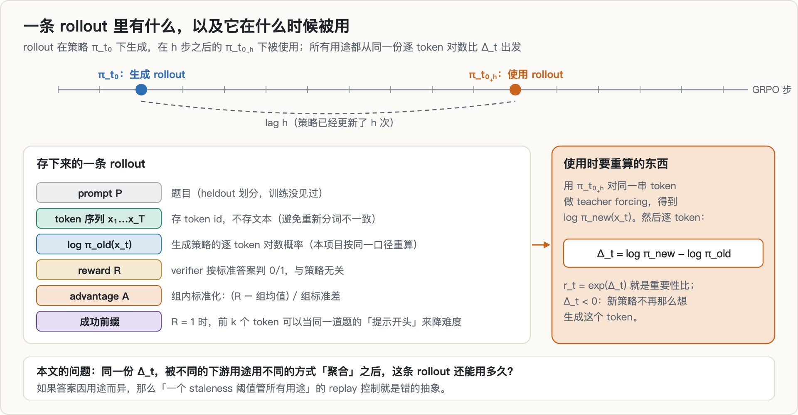

GRPO 这类 RL 后训练，每一步都要让当前策略对一批题目各采 $G$ 条回答（一组），用 verifier 判对错，再用这些回答算梯度。一条 rollout 存下来的东西不止一种：

- **prompt 和 token 序列**：生成出来的文本本身。项目里存的是 token id 而不是文本，因为 decode 再重新分词不一定还原出同一串 id。
- **$\log \pi_\text{old}(x_t)$**：生成策略给每个 token 的对数概率。
- **reward**：可验证任务里由标准答案判定，和策略无关。
- **advantage**：组内标准化 $A_i = (R_i - \bar R)/\sigma_R$，只在同一组里有意义。
- **成功前缀**：$R = 1$ 的回答的前 $k$ 个 token，可以当同一道题的「提示开头」来降低难度。

这些成分的「陈旧」方式不一样。reward 永远不会过期；token 序列作为文本也不会；$\log\pi_\text{old}$ 和 advantage 却是为某一个策略算的，策略一更新就开始失效。

### 1.2 off-policy、staleness 与重要性比

rollout 在策略 $\pi_{t_0}$ 下生成，如果 $h$ 步之后才被使用，这时的策略已经是 $\pi_{t_0+h}$，二者之差 $h$ 就是 **lag**（或 staleness）。对每个 token 定义对数比

$$
\Delta_t = \log \pi_\text{new}(x_t \mid x_{<t}) - \log \pi_\text{old}(x_t \mid x_{<t}), \qquad r_t = e^{\Delta_t}
$$

$r_t$ 就是这个 token 上的**重要性比**：新策略比旧策略更想（$r_t>1$）还是更不想（$r_t<1$）生成它。项目里 $\log\pi_\text{old}$ 和 $\log\pi_\text{new}$ 都用同一条 teacher forcing 路径重算，不用生成时缓存的值，免得把数值路径差异混进来。

用旧策略的样本去估计新策略下的期望，严格无偏的做法是乘上**整条序列**的似然比：

$$
w = \prod_{t=1}^{T} r_t = \exp\Big(\sum_{t=1}^{T} \Delta_t\Big)
$$

问题在于它的方差随 $T$ 指数增长。衡量一组权重还剩多少「有效样本」，常用 Kish 的有效样本量，除以组大小后落在 $[1/G, 1]$：

$$
\text{ESS}/G = \frac{\big(\sum_{i=1}^{G} w_i\big)^2}{G \sum_{i=1}^{G} w_i^2}
$$

权重完全相等时是 1；一条样本独占全部权重时是 $1/G$。

### 1.3 同一份 $\Delta_t$，四种聚合方式

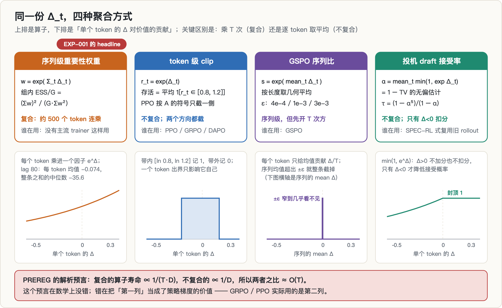

这篇文章的核心就在这张图里。同一份 $\Delta_t$，下游用途不同，聚合方式就不同：

**① 序列级重要性权重**（上面的 $w$ 和 ESS/G）。复合：$T$ 个 token 的 $\Delta$ 先求和再进指数。**没有主流 trainer 这样用**，因为方差太大。

**② token 级 clip**。PPO / GRPO / DAPO 的目标函数是逐 token 的

$$
L_t = \min\big(r_t A,\ \mathrm{clip}(r_t, 1-\epsilon, 1+\epsilon)\,A\big)
$$

比值出了 $[1-\epsilon, 1+\epsilon]$ 带、且方向与 $A$ 同号时，这个 token 的梯度被截成 0。一个简单的代理是「带内 token 的比例」，即 clip 存活率 $\frac{1}{T}\sum_t \mathbf{1}[r_t \in [0.8, 1.2]]$（$\epsilon=0.2$）。不复合，两个方向都截。

**③ GSPO 的序列比**：$s = \exp\big(\frac{1}{T}\sum_t \Delta_t\big)$，先按长度开 $T$ 次方，再用很窄的 $\epsilon$（项目里扫了 4e-4 / 1e-3 / 3e-3）做序列级截断。

**④ 投机 draft 的接受率**。把旧 rollout 的 token 当 draft，交给新策略按拒绝采样检查：draft token $x \sim q$ 以概率 $\min(1, p(x)/q(x))$ 被接受。当 draft 就是旧策略采出来的（$q = \pi_\text{old}$，$p = \pi_\text{new}$）时，

$$
\alpha = \mathbb{E}_{x\sim q}\Big[\min\Big(1, \tfrac{p(x)}{q(x)}\Big)\Big] = \sum_x \min\big(p(x), q(x)\big) = 1 - \mathrm{TV}(p, q)
$$

在实际采出的 token 上取平均 $\hat\alpha = \frac1T\sum_t \min(1, e^{\Delta_t})$ 就是它的无偏估计，前提是 $p$、$q$ 都是**真正用来采样的那个分布**（温度、top-k、top-p 之后的）。这一点第一轮就做错了，见 §7。它不复合，而且**单边**：$\Delta_t>0$ 的 token 封顶在 1，只有 $\Delta_t<0$ 才扣分。

拒绝采样为什么「无损」、verify pass 长什么样，专栏里的[投机解码与 RL 失配那一篇](../spec-decoding-rl-mismatch/)第 2 节有推导，这里不重复。

### 1.4 为什么序列级的量几步就崩

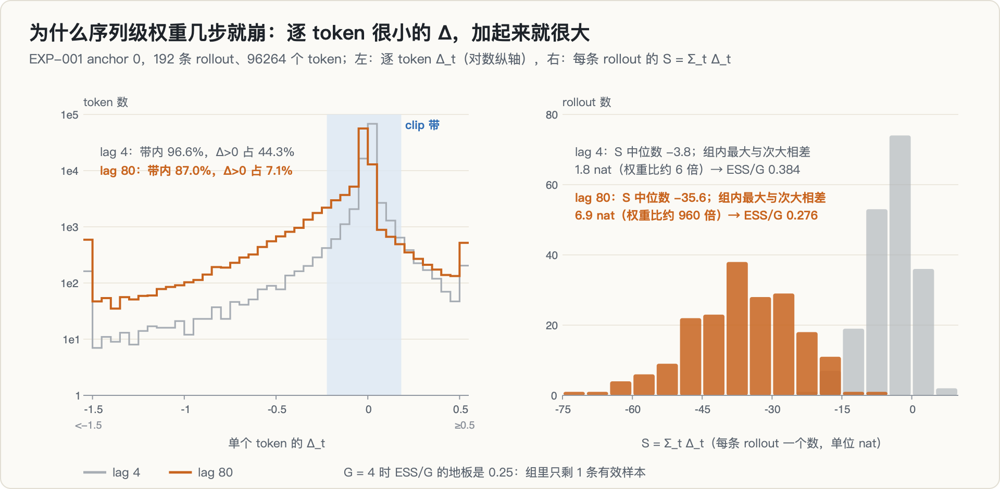

逐 token 看，$\Delta_t$ 很小：lag 4 时 96.6% 的 token 在 clip 带内，lag 80 时仍有 87.0%。但一条 rollout 平均约 500 个 token，小数加起来就不小了：lag 80 时每条 rollout 的 $S = \sum_t \Delta_t$ 中位数是 −35.6，同组 4 条里权重最大的一条和第二大的一条，$S$ 的差中位数约 6.9 nat，也就是权重差近千倍。一组 4 条只剩 1 条「有效」，ESS/G 就贴到了地板 0.25。

这就是 PREREG 里写下的解析预言（推导）：设每个 token 的散度量级为 $D$，序列级量的半衰期 $\propto 1/(T\cdot D)$，token 级量的半衰期 $\propto 1/D$，两者之比 $\approx O(T)$。$T \approx 500$ 时，预言比值在 $10^2$–$10^3$。**这个推导本身没有错。** 后面会看到，错在我把第一种算子当成了策略梯度的价值。

### 1.5 投机 draft 的价值：每次 verify 前进几个 token

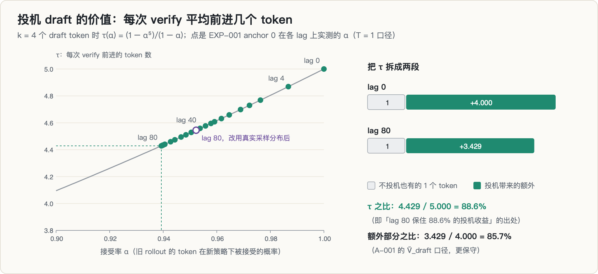

接受率还不是 draft 用途的价值本身。每次 verify 提交 $k$ 个 draft token，若每个 token 独立地以概率 $\alpha$ 被接受，一次 verify 平均前进

$$
\tau(\alpha, k) = \frac{1 - \alpha^{k+1}}{1 - \alpha}
$$

个 token（第一次拒绝后，那个位置由目标模型重采，也算前进 1 个）。$k = 4$ 时，$\alpha = 1$ 给出 $\tau = 5$，$\alpha = 0$ 给出 $\tau = 1$（等于没投机）。

「lag 80 保住 88.6%」这个数就是 $\tau$ 之比：EXP-001 anchor 0 在 lag 80 实测 $\alpha = 0.93929$，$\tau = 4.429$，$4.429 / 5.000 = 88.6\%$。它有一个更保守的读法：扣掉不投机也有的那 1 个 token，额外收益从 4.000 降到 3.429，保住 85.7%，这正是后面 A-001 归一化用的口径。

### 1.6 半衰期：定义、估计与下界

对某个用途的指标 $m(h)$，定义归一化价值 $V(h) = m(h)/m(0)$，**半衰期 $h_{1/2}$ 是 $V$ 第一次 $\le 0.5$ 的 lag**，在相邻两个测点之间线性插值。如果整个量程内 $V$ 都没跌破 0.5，就只能记「$> h_\text{max}$」，取 $h_\text{max}$ 当下界。

这个定义有两个坑，项目里都踩到了。

**第一，下界不同的指标，0.5 的含义不同。** ESS/G 的下界是 $1/G$（$G=4$ 时是 0.25），所以「腰斩」被压缩；$\tau$ 的下界是 1 而不是 0。第一次 smoke 就暴露了这一点，于是在看到正式结果之前补了一套「可用区间归一」（A-001），两套并列报告，结论不一致就记 AMBIGUOUS：

$$
\tilde V_\text{grad} = \frac{\text{ESS}/G - 1/G}{1 - 1/G}, \qquad \tilde V_\text{draft} = \frac{\tau(\alpha, 4) - 1}{4}
$$

**第二，一边永远不腰斩时，比值只是下界。** draft 那一侧在所有实验里都没有跌破 0.5，所以每一个「比值」都是 $h_\text{max} / h_{1/2}(\text{grad})$，量程越短，下界越低。

---

## 2. 动机与假设链

### 2.1 现有的 replay 控制把 staleness 压成一个数

2026 年的 RL 系统里，复用旧 rollout 的做法很多（引用，均为撞车核验时读到的正文）：

- **Headroom-Drift**（[2609.03941](https://arxiv.org/abs/2609.03941)）用 $\text{Drift} = \text{mean}(\Delta^2)$ 做 group 级 replay 的门控，一个阈值；
- **PER-GRPO**（[2606.04560](https://arxiv.org/abs/2606.04560)）按训练步数 $\tau_\text{max}$ 淘汰旧样本；
- **SPEC-RL**（[2509.23232](https://arxiv.org/abs/2509.23232)）拿上一个 epoch 的 rollout 当投机 draft 前缀，结论是「永远用最新的」；
- 系统层的 **StaleFlow**（[2601.12784](https://arxiv.org/abs/2601.12784)）对所有消费者施加同一个 staleness 预算。

它们都隐含一个假设：「这条 rollout 还能不能用」有唯一答案。

### 2.2 成分 × 用途矩阵

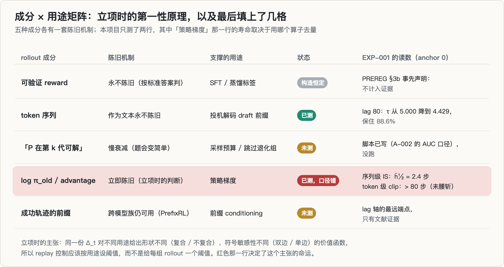

我的第一性原理是这张矩阵。如果每一行的寿命真的不同，那么正确的归档策略就是：**token id 长期保留（便宜，draft 和前缀还能用），$\log\pi_\text{old}$ 和 advantage 很快淘汰**；replay 控制也该按用途设阈值，而不是给每组 rollout 一个阈值。

另外还有一条机制层面的推导：Headroom-Drift 的 $\Delta^2$ 是对称的，但 draft 用途对 $\Delta$ 是单边的（$\Delta>0$ 免费），梯度用途是双边的，所以用对称门控管 draft 用途会系统性地过度保守。

项目只测了其中两行。reward 那一行按 PREREG §3b 事先声明「构造恒定，不计入证据」；「P 在第 k 代可解」和成功前缀两行，脚本和判据都写好了，还没跑方向就死了。

### 2.3 承重主张与它的决策价值

PREREG 里写下的承重主张是：

> 一条 rollout 的价值不是一条衰减率，而是**每种下游用途一条**。on-policy RL 按最短命用途（策略梯度）的半衰期丢弃 rollout，而其最长命用途的半衰期要长 **≥ 1 个数量级**。若「≥ 1 个数量级」不成立，主张当天否掉。

「≥ 1 个数量级」是故意写得很硬的：只有差这么多，per-use 阈值才有设计价值；差 30% 的话，一个阈值加一点余量就够了。

### 2.4 整条链路

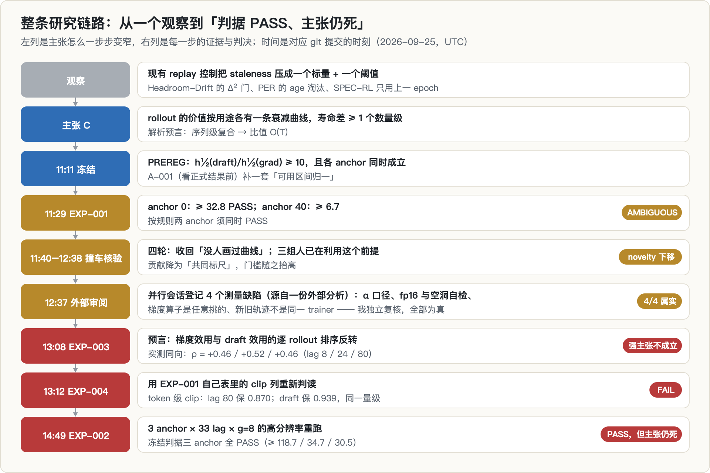

先把全貌放在这里。后面每一节对应图里的一行。

---

## 3. 这个题是怎么来的

这是专栏时间线上的第六个方向。它继承了前面几个方向的三样东西：

- **轨迹**。EXP-001 直接复用了[草稿维护那个项目](../rl-spec-draft-maintenance/)的 LoRA-GRPO 轨迹（Qwen3-1.7B，LoRA r = 16，80 步，每 2 步存一个 checkpoint），以及它下载好的 R1-Distill-Qwen-1.5B / DeepScaleR-1.5B 这对模型。
- **选题门的规则**。[SM120 FP4 悬崖](../sm120-fp4-cliff/)那一篇的原始数字死于单一问题规模（X7），所以这次把 anchor 当作 X7 控制项：曲线形状不能依赖起点，判据要求所有 anchor 同时成立。撞车核验按「先扫会议体裁、再关键词」的顺序做（选题门 §6b）。
- **一个换找法的念头**。项目当时的 STATUS 里写着：前四轮（SM120 悬崖、EVT、SD-safe 量化、上下文漂移，其中量化那条见[符号 bug 那一篇](../nvfp4-sign-bug/)）都是「我推断出缺口」，然后被文献或自己的红名单打死。这一轮的缺口是**领域综述自己点名的**：[2609.25463](https://arxiv.org/abs/2609.25463)（80 个方法、7 个家族）把「Lag–quality curves not established for any task family」列为开放问题，另一篇综述 [2605.02913](https://arxiv.org/abs/2605.02913) 的 replay 三轴里也没有「同一 rollout 对不同用途价值不同」这一维。

后来证明，「综述点名的缺口」也不可靠：那句话本身就过强（§6）。

---

## 4. 预注册：跑之前写死了什么

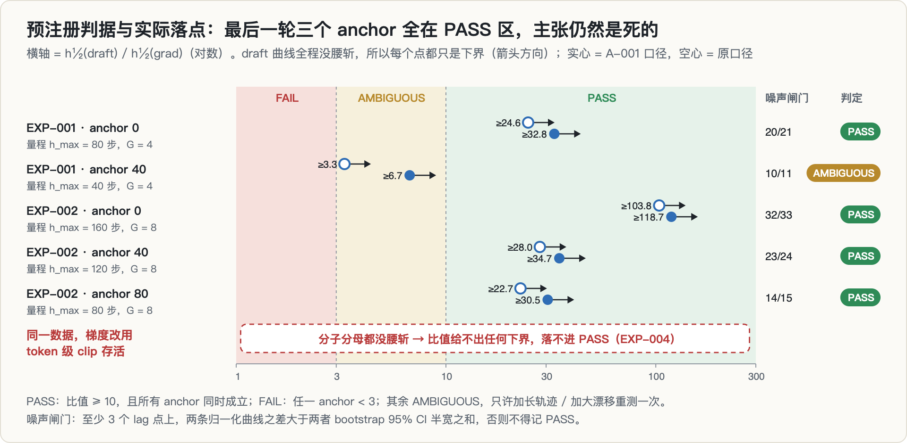

项目的第一个提交就是 PREREG（11:11），先于任何带数据的运行：

| 项 | 内容 |
|---|---|
| 自变量 | policy lag $h$（GRPO 步数差）；anchor $t_0 \in \{0, 40\}$ 作为 X7 控制 |
| 梯度用途 U_grad | 组内序列 ESS/G（主）；token 级 clip 存活率（并列的 U_grad′） |
| draft 用途 U_draft | 接受率 $\alpha$（主）；期望前进步数 $\tau(\alpha, 4)$（U_draft′） |
| 其它用途 | U_sft（标签有效性，**事先声明不计入证据**）、U_diff（难度信号的秩保持） |
| PASS | $h_{1/2}(\text{draft}) / h_{1/2}(\text{grad}) \ge 10$，且**所有 anchor 同时成立** |
| FAIL | 任一 anchor 的比值 $< 3$ → 当天终止方向 |
| AMBIGUOUS | 3–10 → 只允许加长轨迹 / 加大漂移后重测一次 |
| 噪声闸门 | 至少 3 个 lag 点上，两条归一化曲线之差大于两者 bootstrap 95% CI 半宽之和 |
| 作废条件 | lag 0 不等于理论值；重新分词；$\pi_\text{old}$ 用缓存值；按 nvidia-smi 的裸序号指代 GPU（这台机器上 nvidia-smi 和 torch 的编号顺序不一致） |

请注意表的第二行：**token 级 clip 存活从第一天起就在预注册里，只是被放在「并列」的位置上，判据用的是 ESS/G。** 这一点决定了后面的一切。

之后的每一次口径变更都追加在 `amendments.md`，并写明「写的时候是否已看过相关数据」：

| 编号 | 内容 | 写时是否已看数据 |
|---|---|---|
| A-001 | 并列加一套「可用区间归一」$\tilde V$；两套不一致记 AMBIGUOUS，阈值不动 | 否（只看过 n = 8 的 smoke） |
| A-002 | 难度信号的饱和混杂：主指标改用 AUC，并加同代对照 | 否 |
| A-003 | SFT 用途必须测下游实际增益，并预言它可能转负 | 否 |
| A-004 | 漂移是次扩散的；x 轴并列报实测漂移；写下对 EXP-002 的事前预言 | 否（轨迹跑到约 42 / 160 步） |
| A-005a | 放弃「让 α 腰斩」，改报真实漂移区间内的存活比例；加跨模型漂移点 | 否 |
| A-005b | （并行会话）排序反转检验的预注册 + 四个测量缺陷 | 排序反转的数据：否 |
| A-006 | 独立复核四个缺陷：全部为真 | 部分（诊断数据） |
| A-007 | 复核并行会话的两处纠正：全部为真 | 部分（诊断数据） |

---

## 5. EXP-001：承重实验

### 5.1 设计

- **轨迹**：Qwen3-1.7B + LoRA（r = 16，α = 32）的 GRPO，80 步。heldout 通过率从 π₀ 的 0.594 升到 π₄₀ 的 0.839（其中一部分是格式学习，见 §15），π₈₀ 相对 π₀ 的 $\|\Delta W\|_F = 2.49$，漂移是真的。
- **rollout**：每个 anchor 取 heldout 划分（训练只用 train 划分）的前 48 道题，每题 $g = 4$ 条，T = 0.6、top-p = 0.95、max_new = 512；两个 anchor 共 384 条、194096 个 token，平均每条 505 个。
- **打分**：π₀, π₄, …, π₈₀ 共 21 个策略，对同一批 token id 做 teacher forcing。生成 427 秒，打分 196 秒，一块 RTX 5090。
- **自检**：lag 0 时 ESS/G = 1、α = 1、τ = 5（后来发现这个自检是空洞的，见 §7）。

### 5.2 结果

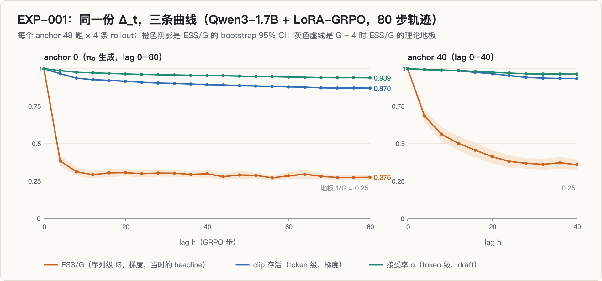

anchor 0 的主表（摘自 `reports/halflife.md`）：

| lag | 每 token $\Delta$ | ESS/G（序列级） | clip 存活（token 级） | α（draft） | τ(α, 4) |
|---|---|---|---|---|---|
| 0 | 0 | 1.0000 | 1.0000 | 1.00000 | 5.000 |
| 4 | −0.00951 | **0.3841** | 0.9664 | 0.98673 | 4.869 |
| 8 | −0.02730 | 0.3120 | 0.9368 | 0.97631 | 4.769 |
| 16 | −0.03896 | 0.3051 | 0.9215 | 0.96889 | 4.698 |
| 40 | −0.05630 | 0.2988 | 0.8930 | 0.95378 | 4.559 |
| 80 | −0.07415 | **0.2755** | **0.8701** | **0.93929** | **4.429** |

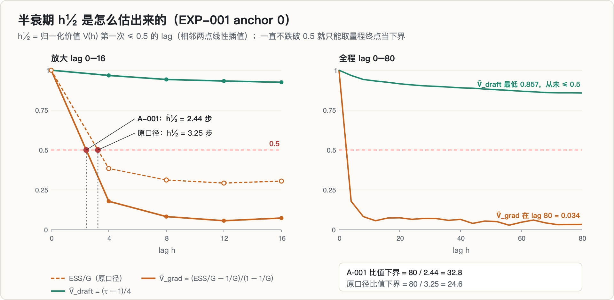

| anchor | $h_{1/2}$（梯度，原口径） | $\tilde h_{1/2}$（梯度，A-001） | draft | 比值（原 / A-001） | 噪声闸门 | 判定 |
|---|---|---|---|---|---|---|
| 0 | 3.2 步 | **2.4 步** | > 80（未腰斩） | ≥ 24.6 / **≥ 32.8** | 20 / 21 | PASS |
| 40 | 12.2 步 | 6.0 步 | > 40（未腰斩） | ≥ 3.3 / ≥ 6.7 | 10 / 11 | AMBIGUOUS |

**总判定 AMBIGUOUS**：PREREG 要求所有 anchor 同时 PASS。anchor 40 的下界低，是因为 80 步的轨迹只给它留了 40 步量程，下界被截断，不是效应变弱。但我没有用这个理由翻案，按规则只允许「加长轨迹后重测一次」，于是起跑了一条 160 步的新轨迹（EXP-002）。没有从 π₈₀ 续训，是因为原 trainer 不存优化器状态，续训会在第 80 步引入一次 Adam 冷启动的瞬变，而它恰好落在 anchor 40 的 lag 40 和 anchor 0 的 lag 80 上；同配方同种子重跑没有这个混杂。

「logπ_old / advantage 半衰期 2.4 步」「lag 80 保住 88.6%」这两个在项目文档里反复出现的数字，都出自这一轮的 anchor 0。

### 5.3 当时的读法

回头看这一轮，我当时最得意的不是比值，而是 PREREG §4 的解析预言「三项同时落位」：

- 序列级的 ESS/G → 崩到地板（复合）；
- token 级的 α → 0.939（不复合）；
- token 级的 clip 存活 → 0.870（不复合）。

**我把 clip 存活那一列当成了预言的第三个验证点来庆祝。** 它确实验证了「token 级的量不复合」，但它同时是梯度用途在真实 trainer 里的价值。这个问题我在 §9 才被迫回答。

---

## 6. 撞车核验：四轮，一轮比一轮窄

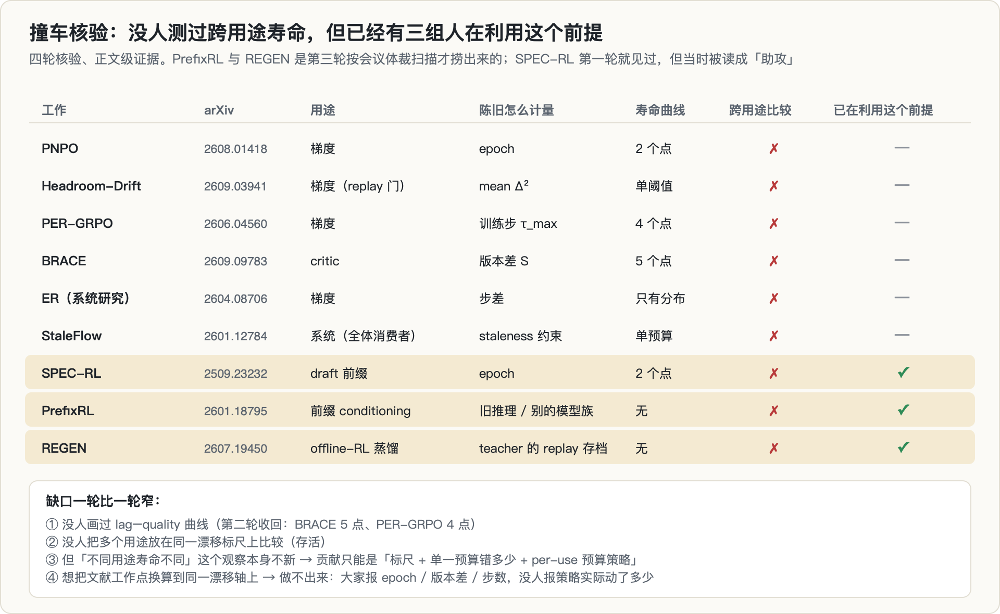

EXP-001 跑的同时开始撞车核验，按选题门的规程：判为「不冲突」的最近邻必须有正文证据，不能只看摘要。

**第一轮（11:15–11:32）**：10 篇最近邻，8 篇拿到正文。标题最像的 PNPO（[2608.01418](https://arxiv.org/abs/2608.01418)）只有 1 / 4 epoch 两个工作点；最危险的 Headroom-Drift 的 Drift 与我的 $\Delta_t$ 是同一原语，但单标量、单阈值、单用途。SPEC-RL 的 Table 2 有一个「Delayed Reuse」：滞后 2 个 epoch 后加速比从 2.29× 降到 1.44×（引用）。这是文献里唯一的 draft-lag 测量，**我当时把它读成了「助攻」**。

**第二轮（11:40）：收回一句话。** 综述里那句「没有任何任务族建立过 lag–quality 曲线」过强：BRACE（[2609.09783](https://arxiv.org/abs/2609.09783)）Fig 4(d) 有 5 个 staleness 点（S = 5 → 0.39，S = 10 → 0.35，S = 15…50 平台在 0.29–0.31，引用），PER-GRPO 有 4 个点。缺口收窄为：**单用途的粗曲线已有，没人把多个用途放在同一漂移标尺上比较。**

**第三轮（11:55）：novelty 下移一档。** 按会议体裁重新扫，捞出两篇关键词检索没找到的工作，再加上第一轮就见过的 SPEC-RL，一共三组人**已经在利用这个前提**：

| 工作 | 用什么陈旧数据 | 用来干什么（非梯度） | 测了寿命吗 |
|---|---|---|---|
| SPEC-RL | 上一 epoch 的 rollout | 投机 draft 前缀 | 只有 2 个点 |
| PrefixRL（[2601.18795](https://arxiv.org/abs/2601.18795)） | 旧推理或 RL 训练留下的 off-policy trace，**甚至来自别的模型族** | 前缀 conditioning，用前缀长度调难度 | 无 |
| REGEN（[2607.19450](https://arxiv.org/abs/2607.19450)） | 多个 teacher 专项 RL 训练留下的 replay 存档 | offline-RL 蒸馏 | 无 |

「不同用途寿命不同」这个观察因此不新，不能作为贡献。剩下的说法是：三条路线各自挑了一个 ad-hoc 的工作点，没人测寿命、没人跨用途比较，系统层仍在用单一预算，所以**贡献改为「提供共同标尺 + 量化单一预算错多少 + per-use 预算策略」**。当时的类比是 roofline：roofline 没有发现 kernel 会访存受限，它提供了标尺。

**第四轮（12:38）：标尺的第一个交付物做不出来。** A-004 计划把 SPEC-RL、BRACE、PER-GRPO 的工作点换算到同一漂移轴上。逐篇查它们报的单位：epoch、参数版本差、训练步数、生成步与当前步之差……**没有一篇报告策略实际动了多少**。唯一报了漂移量的 Headroom-Drift 是二阶对称量，也没给数值范围。这个交付物只能划掉。

### 6.1 「标尺」类贡献为什么门槛高

第三轮之后我其实已经知道处境变了，但当时把「做不出来」解读成了「这正是标尺的价值」。现在回头看，roofline 这个类比恰好说明了门槛在哪里：

- **roofline 的横轴是任何 kernel 都有、谁都能量的量**（算术强度），纵轴是真实硬件上的上限。它有价值，是因为任何一篇论文里的 kernel 都能被放到图上，而且放上去之后能直接告诉你该优化什么。
- 一把「staleness 标尺」要达到同样的地位，至少要满足四条：
  1. **横轴通用**：用策略实际动了多少（逐 token 的 KL / TV、$\|\Delta W\|_F$），而不是步数。第四轮已经说明，现有文献没法放到这根轴上。
  2. **纵轴是真实消费者的价值**：每个用途都要用它的真实消费者实际计算的那个量，最好是端到端收益（replay 带来的训练增益、真实投机加速比），而不是代理。**这一条正是后来的死因。**
  3. **跨模型、跨任务、跨规模都成立**：我手上只有 1.7B、一个 GSM8K 式任务。
  4. **有设计后果**：给出 per-use 预算策略，并测出系统收益。

当时写的「审稿人视角」自评也是这么说的：没有构建任何系统、没有端到端数字、规模只有 1.7B / 505 token、trainer 是自己写的 REINFORCE（这一条是并行会话帮我发现的，见下一节）。一个「发现型」贡献只需要一个站得住的意外；一个「标尺型」贡献要四条同时站住，而我连第 2 条都没有。

---

## 7. 外部审阅：四个测量缺陷，全部属实

12:37，并行的另一个会话（它在同一个仓库里做「排序反转」检验）在修正记录 A-005b 里登记了四个测量缺陷。这四条最初来自一份外部分析，那个会话核实后认了账；我再逐条独立复核（A-006），四条都是真的：

**缺陷 1：α 用错了分布。** 我算 $\alpha$ 用的是 T = 1 的全词表 softmax，但真实的采样分布是 $\mathrm{TopP}_{0.95}(\mathrm{TopK}_{20}(\mathrm{softmax}(z/0.6)))$。Qwen3 的 `generation_config.json` 自带 `top_k: 20`，调 `generate()` 不传 top_k 也会生效。修正后：

| lag | α（T = 1） | α（真实采样分布） | 硬零占比 |
|---|---|---|---|
| 4 | 0.9867 | 0.9830 | 0.37% |
| 16 | 0.9689 | 0.9648 | 0.99% |
| 40 | 0.9538 | 0.9560 | 0.85% |
| 80 | 0.9393 | **0.9523** | 0.68% |

方向和直觉相反：大 lag 处修正后 $\alpha$ 反而更高。T = 0.6 让分布更尖，两个策略在头部 token 上更一致，这个收益盖过了截断造成的硬零。

**缺陷 2：分数存成了 float16，而 lag 0 自检对此是瞎的。** 数值那一半可以关掉：同一份 float32 结果降成 float16 再升回，lag 80 的 $\alpha$ 只差 5e-7。但「自检是瞎的」完全正确：lag 0 时 old 和 new 是**同一个缓存对象**，$\Delta$ 恒为 0，$\alpha = 1$、ESS = 1 是构造出来的，任何实现错误都进不来。换成「同一个 π₀ 的两次独立前向」之后，立刻看到一个原来看不见的噪声底：采样分布口径下 $\alpha = 0.999451$，硬零 0.055%（支持集边界上的翻转）。

**缺陷 3：梯度算子是任意挑的。** 复核 trainer 源码，损失是

```python
lc_pg = -(adv * (logp * mask).sum(1) / n_tok).mean()   # 另加 k3 KL 到 π₀
```

REINFORCE 加组基线，**没有重要性比，也没有 clip**。也就是说，我当 headline 的「序列级 IS 的 ESS」连本项目自己的 trainer 都不算；本地 trainer 只是漂移发生器，不是这个量的消费者。我当时的更正写的是「U_grad 度量的是标准 clipped-ratio 目标下的校正代价」，这句话本身仍然不对（clipped-ratio 目标用的是 token 级比值），它要到 §9 才被彻底改掉。

**缺陷 4：新旧轨迹不是同一个 trainer。** 原 80 步轨迹的日志里没有代码哈希字段，160 步新轨迹的 trainer 代码已经改过。我撤回了「新轨迹前 80 步是对原轨迹的独立复现」的说法，改记为「不同代码版本的同配方轨迹」（第 1 步的 $\|\Delta W\|_F$：新轨迹 0.3004，原轨迹 0.3005，统计量接近，但不是同一份代码）。

随后并行会话又纠正了我两处（A-007）：

- **自写 top-p 在并列处与 HF 不一致。** 我原来用 float32 的 `torch.randn` 做对照，几乎不产生并列，所以测出「完全一致」。换成 bf16 量化后的 logits（真实 `lm_head` 的输出口径，并列很多）：**8 处支持集不一致，最大 $|\Delta p| = 0.0325$**。根因是 HF 的 `TopPLogitsWarper` 升序排序，我降序，并列时留谁删谁不同。并行会话还测到 HF 自己的 top-p 在 CPU 和 CUDA 上也不一致（bf16 下 5–27% 的位置不同），所以改成直接调 HF 的 warper 类，并在 logits 所在的设备上跑。
- **我引用的两个 TV 不可比。** 为了论证「真实后训练的漂移就这么大」，我引用了上游项目里的两个 TV：LoRA 那一对 0.0696，全参 RL 那一对（R1-Distill vs DeepScaleR）0.0405。但那个脚本的默认 `--data` 是 Qwen3-1.7B 生成的文本：对 LoRA 那一对是 on-policy，对另一对是**外来文本**。原证据作废，换成在各自策略自己的 rollout 上测的数（§10.4）。

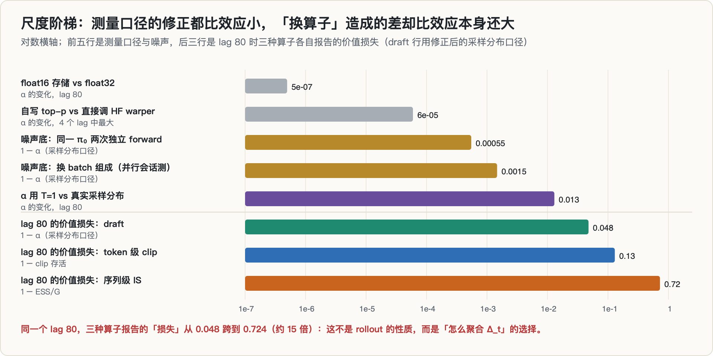

把这些修正放到同一根对数轴上看：所有测量口径的修正都比效应小，其中最大的一项（T = 1 与采样分布之差，0.013）也只有 draft 效应的四分之一左右。**真正比效应还大的，是「用哪个算子」**：同一个 lag 80，三种算子报告的价值损失从 0.048 跨到 0.724。这张图是在复盘时画的；当时如果把它画出来，判 FAIL 大概可以提前一个多小时。

---

## 8. EXP-003：排序反转检验

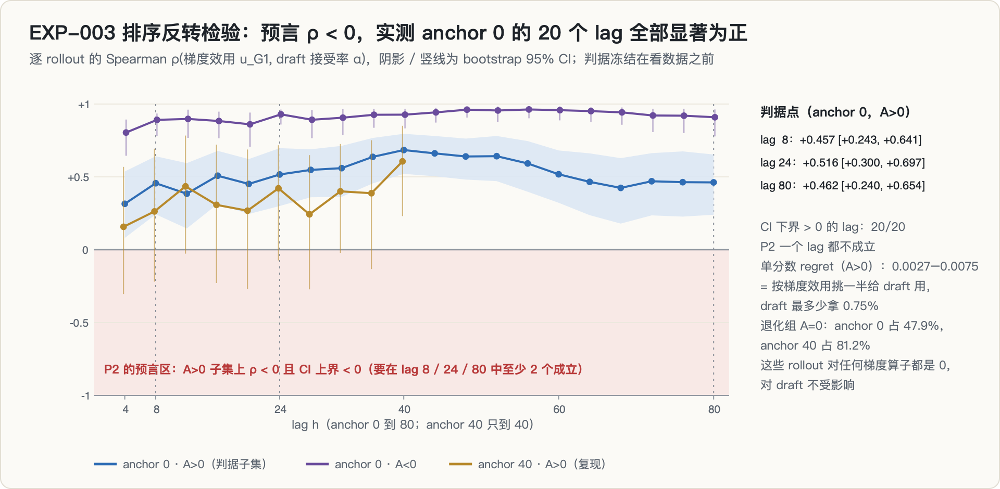

并行会话在 A-005b 里预注册了一个更强的主张：不但寿命不同，**逐 rollout 的排序也会反转**。在 $A>0$ 的 rollout 上，新策略更喜欢的 token（$\Delta>0$）会在梯度侧被 clip，在 draft 侧却是免费的，所以「对梯度最有用的 rollout」和「对 draft 最有用的 rollout」可能正好相反。如果成立，per-use 阈值就不只是阈值不同，而是**选哪些 rollout** 都不同。

算子定义（全部在真实采样分布、FP32 下重算）：

- G1：token 级 PPO-clip（$\epsilon = 0.2$），按 advantage 符号只截一侧：$A>0$ 看 $r_t \le 1+\epsilon$ 的比例，$A<0$ 看 $r_t \ge 1-\epsilon$ 的比例，$A=0$ 恒为 0；
- G2：GSPO 的序列比；
- D1：draft 接受率 $\alpha$；D2：点质量 draft $\beta = \text{mean}_t\, q_\text{new}(x_t)$。

判据：$A>0$ 子集上 $\rho(u_{G1}, \alpha) < 0$ 且 CI 上界 < 0，在 lag 8 / 24 / 80 中至少 2 个成立。

结果：**同向，而且显著。** anchor 0 的 20 个 lag 上 CI 下界全部大于 0，lag 8 / 24 / 80 为 +0.457 [+0.243, +0.641]、+0.516 [+0.300, +0.697]、+0.462 [+0.240, +0.654]。按梯度效用挑一半 rollout 给 draft 用，draft 最多只少拿 0.75%。失败机制正是 A-005b 预先写下的那一种：rollout 之间的差异主要是 $\Delta$ 的**离散度**而不是方向，漂移大的 rollout 同时有更多上尾（被 clip）和更多下尾（被拒），两个效用一起降。

几个附带读数（描述性，不是判据）：

- **退化组很多**：$A=0$（组内全对或全错）的 rollout 在 anchor 0 占 47.9%，anchor 40 占 81.2%。它们对任何梯度算子都是 0，对 draft 却不受影响。
- **GSPO 的寿命按 advantage 符号分裂**：anchor 0 上 lag ≥ 8 时，$A>0$ 的 rollout 在三个 $\epsilon$ 下几乎全部通过，$A<0$ 的几乎全部被截。又是一个算子给出一种完全不同的「寿命」。
- **token 级 clip 下，梯度用途并不比 draft 短命**：lag 80 时 $A>0$ 的 $u_{G1} = 0.9798$、$\alpha = 0.9554$；$A<0$ 的 $u_{G1} = 0.8893$、$\alpha = 0.9523$。并行会话在报告里同时提醒：$u_{G1}$ 对 $A>0$ 是弱代理，「没被 clip」不等于「有用」，真正的梯度效用要用 replay 训练增益来量，这一步没做。
- 按长度分桶做不出来：192 条里 188 条落在 257–512 token（max_new = 512 封顶）。

---

## 9. EXP-004：反证一直在我自己的表里

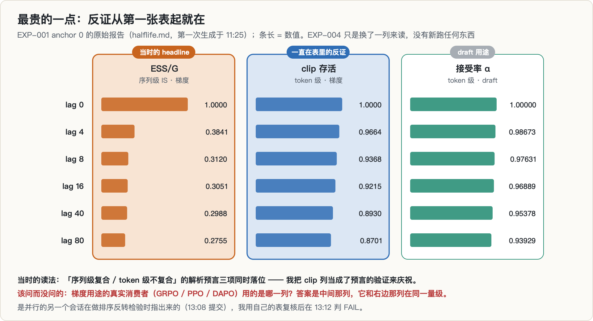

13:12，我用 EXP-001 自己的 trace 复核并行会话的附带结论。**没有新跑任何东西**，只是换一列来读：

| lag | ESS/G（序列级 IS） | clip 存活（token 级） | α（draft） |
|---|---|---|---|
| 4 | **0.3841** | 0.9664 | 0.98673 |
| 40 | 0.2988 | 0.8930 | 0.95378 |
| 80 | **0.2755** | **0.8701** | 0.93929 |

结论：

- 在 GRPO / PPO / DAPO 实际使用的 token 级 clip 下，梯度用途 lag 80 保 0.870，draft 保 0.939，**同一量级，两者在整个量程内都没有腰斩**；
- 「梯度 2.4 步崩到地板」只在序列级 IS 下成立，而那正是从业者因为指数方差刻意不用的算子；
- **承重主张「per-use 寿命差 ≥ 1 个数量级」是算子选择的产物，不是 rollout 的性质。**

判 FAIL，按 PREREG 的 FAIL 出口停止投入，记为阴性结果。这里有一个需要说清楚的地方：严格按 PREREG 的文字，token 级 clip 下两条曲线都没腰斩，比值无定义，既不是 PASS 也不是字面意义上的「< 3」。判 FAIL 依据的是主张本身：EXP-001 的整个量程（lag 0–80）内，两条 token 级曲线的值相差不到 8%，不存在「≥ 1 个数量级」的寿命差，而主张在 PREREG §1 里写明了「若不成立，当天否掉」。

登记簿里我写下的原话是：clip 存活那一列从 EXP-001 就在我的表里，我甚至把它当作解析预言的验证，**却把 ESS 当了 headline**。正确的判读是：两个用途都是 token 级的消费者，本来就在同一区间。

---

## 10. EXP-002：冻结判据 PASS，但主张仍然是死的

判 FAIL 的时候，两条 160 步的新轨迹已经分别跑了一个半小时和一个小时。EXP-002 照计划跑完，起跑后就在登记簿里写明：headline 已作废，只作高分辨率的证伪记录，不得作为成果引用。

### 10.1 配置与一次死锁

- **轨迹**：run-A，seed 0，160 步，每 2 步一个 checkpoint，8286 秒跑完，第 160 步的 $\|\Delta W\|_F = 3.597$。
- **rollout**：anchor ∈ {0, 40, 80}，每个 anchor 48 题 × $g = 8$，共 1152 条；$g$ 从 4 加到 8 是为了把 ESS/G 的地板从 0.25 降到 0.125。
- **打分**：33 个策略，lag 网格按 anchor 加密（0, 2, 4, 6, 8, 12, 16, 24, 32, 40 之后转粗），因为梯度的半衰期只有两三步；$\alpha$ 用真实采样分布、直接调 HF warper；FP32 存储。
- **自检换血**：lag 0 的 ESS = 1 明确标注为「构造使然」；新增**重建保真度门**：旧策略自己采出的 token，在重建的 $q_\text{old}$ 下概率必须大于 0，比例超过 0.1% 则 $\alpha$ 不得解读。

轨迹 13:52 就跑完了，EXP-002 却到 13:56 还没启动。链式脚本是这样等的：

```bash
while pgrep -f run_traj160.py; do sleep 60; done   # 永远为真
```

创建这个脚本的那条 ssh 命令，其 `bash -c` 命令行里含 heredoc 全文，也就包含字面量 `run_traj160.py`；那个包装进程一直不退，`pgrep -f` 就一直匹配到它，脚本在等一个幻影。EXP-002 最后是手动起的。修法是等 PID（`kill -0 $PID`，没有字符串匹配），或者用字符类破坏自匹配（`pgrep -f "[r]un_traj160.py"`）。**这是同一个陷阱当天第三次出现**：前两次（一次检查假阳性、一次把状态误报成 RUNNING）我只在对话里记了教训，没回头检查已经部署的脚本。写下教训不等于修掉存量。

### 10.2 结果：三个 anchor 全部 PASS

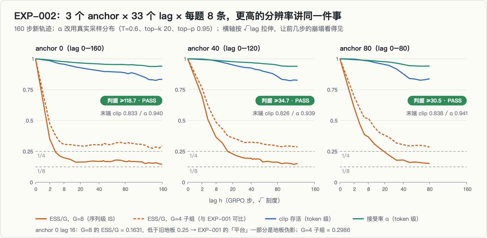

| anchor | $h_{1/2}$（ESS/G） | $\tilde h_{1/2}$ | draft | 比值（原 / A-001） | 噪声闸门 | 判定 |
|---|---|---|---|---|---|---|
| 0 | 1.5 步 | 1.3 步 | > 160 | ≥ 103.8 / **≥ 118.7** | 32 / 33 | PASS |
| 40 | 4.3 步 | 3.5 步 | > 120 | ≥ 28.0 / **≥ 34.7** | 23 / 24 | PASS |
| 80 | 3.5 步 | 2.6 步 | > 80 | ≥ 22.7 / **≥ 30.5** | 14 / 15 | PASS |

**按冻结判据，这是一个干净的 PASS**：三个 anchor 同时成立，噪声闸门几乎每个点都过。脚本自动生成的报告最后一行甚至印着「承重主张成立」。

同一份报告的 summary 行（anchor 0）是这样的：

```
U_grad  (ESS/G, 序列级 IS) ：h½ = 1.5 步
U_grad′ (clip,  token 级)  ：h½ = > 160 步（全程未腰斩）
U_draft (α)                ：h½ = > 160 步（全程未腰斩）
```

lag 40 时 clip 存活 0.9031、$\alpha$ 0.95818；lag 160 时 0.8332 和 0.94004。**那个 ≥ 118.7 的比值，分子和分母属于两个聚合层级。** 把梯度用途也用 token 级算子衡量，分离就消失了。EXP-002 没有推翻 EXP-004，而是用 3 × 33 × 8 的分辨率确认了它。

### 10.3 两个副产物

**ESS 的「平台」一部分是地板伪影。** $g = 8$ 之后，anchor 0 lag 16 的 ESS/G 是 0.1631，低于 EXP-001 的旧地板 0.25。同一份数据按 4 条一组算的子组 ESS 是 0.2986，与 EXP-001 的 0.3051 吻合（差 2%），说明子组这个可比性设计是有效的。这也削弱了我在第二轮撞车核验里写的一条「交叉印证」：当时说 BRACE 的曲线「快降后平台」与我的 ESS/G 形状一致；现在看，我那边的平台有一部分只是 $1/G$。

**非空洞的自检第一次真的失败了，而且失败得对。** lag 0 的 $\alpha = 0.99953$，不是 1；$\tau = 4.9953$，不是 5。原因是 $\alpha$ 现在算的是真实采样分布，含硬零（lag 0 时 0.05%），这正是 §7 里两次独立前向测到的那个 5.5e-4 噪声底。重建保真度最大 0.047%，过门。原来那个「恒为真」的自检被真实噪声打破，说明换血生效了。

### 10.4 漂移：加长轨迹拿不到大漂移

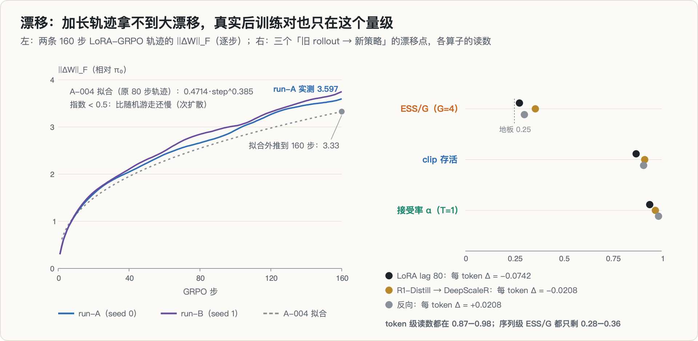

A-004 在 EXP-002 之前写下了三条事前预言：

1. **漂移是次扩散的**。原 80 步轨迹上拟合 $\|\Delta W\|_F \approx 0.4714 \cdot \text{step}^{0.385}$（指数小于随机游走的 0.5），80 → 160 步只多 31% 的漂移，翻倍要约 490 步。所以 lag 160 时 $\alpha$ 大约只掉到 0.92 左右，draft 仍然不会腰斩。**应验**：T = 1 口径下 lag 160 的 $\alpha$ 是 0.92244（改用采样分布后是 0.94004）。实测漂移比外推还高一些（run-A 在第 160 步是 3.597，外推是 3.33），但次扩散这个定性结论不变。
2. **anchor 80 可能仍是 AMBIGUOUS**，因为越靠后的 anchor 漂移越慢、量程越短，下界被双重挤压。**落空**：anchor 80 的比值是 ≥ 30.5。$g = 8$ 让 ESS 塌得更快，分母变小的幅度盖过了量程变短。
3. 若前两条成立，不得再用「加长轨迹」来救。

「漂移轴靠别的办法延长」的另一条路是跨模型点：R1-Distill-Qwen-1.5B 是基座，DeepScaleR-1.5B 是它的全参 RL 后训练版本。两者词表逐项相同，独立分词的唯一差别是 DeepScaleR 多一个 BOS（id 151646），去掉后完全相等；项目存的是 token id，所以可以直接拿 R1-Distill 的 rollout 给 DeepScaleR 打分：

| 方向 | 每 token $\Delta$ | ESS/G（G = 4） | clip 存活 | α（T = 1） |
|---|---|---|---|---|
| LoRA 80 步，lag 80（EXP-001） | −0.0742 | 0.276 | 0.870 | 0.939 |
| R1-Distill 的 rollout 给 DeepScaleR 用 | −0.0208 | 0.356 | 0.914 | 0.968 |
| 反向 | +0.0208 | 0.301 | 0.908 | 0.984 |

一个真实的全参 RL 后训练对，每 token 的漂移比我 80 步的 LoRA 还小。于是「让 $\alpha$ 腰斩」在真实后训练的漂移区间里根本不会发生，A-005a 据此放弃了这个目标。当时我把它包装成了一个更强的说法：「二者寿命比在实际出现的区间内无上界」。这句话和 ≥ 118.7 一样，只在序列级 IS 下成立。

（跨模型这两行有两个注意点：R1-Distill 的这批 rollout 几乎没有被判对，trace 里的通过率只有 0.0052，平均回答 587 个 token，原因我没有细查，它不影响基于 $\Delta$ 的量；另外它的 A-vs-A 自检同样是「同一对象比同一对象」，是构造性的。）

---

## 11. 死因

### 11.1 主因：X8，算子 / 指标选择

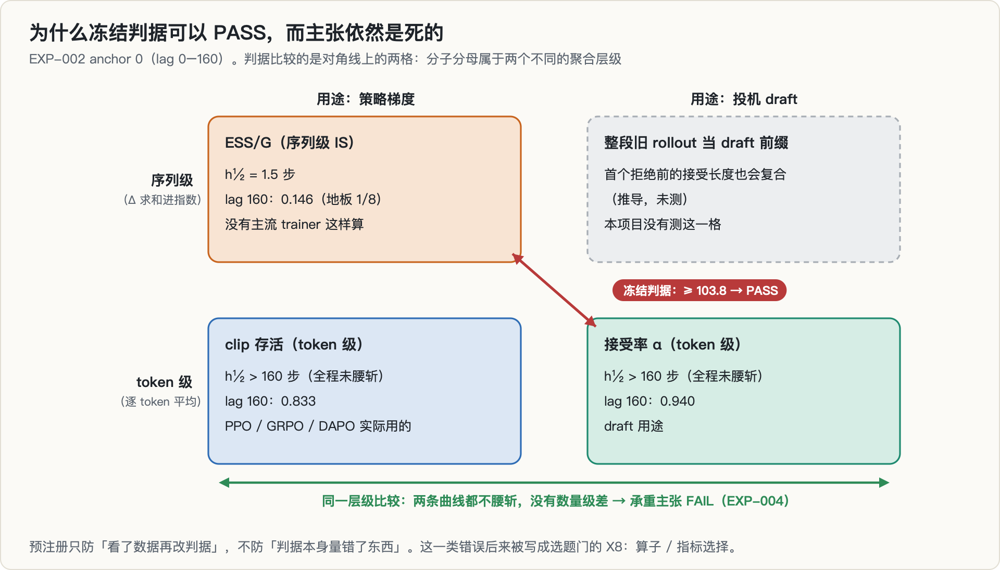

一句话：**整个数量级差是算子选择的产物，不是被测对象的性质。**

把两个用途和两种聚合层级画成 2 × 2，事情就很清楚了。冻结判据比较的是对角线：序列级的梯度（ESS/G）对 token 级的 draft（$\alpha$）。只要一个复合、一个不复合，按 §1.4 的推导，比值就是 $O(T)$，和 rollout 本身几乎无关。同一层级比较（token 级 clip 对 token 级 $\alpha$），两条曲线都不腰斩。

还有对称的一格我没有测：如果旧 rollout 是作为**整段前缀**给投机解码用（在第一次拒绝处截断，后面的 token 就对不上了），那么 draft 用途的价值是「第一次拒绝前接受了多长」，它同样会复合（推导，未测）。按独立同分布粗算，接受前缀的期望长度约 $\alpha/(1-\alpha)$，EXP-001 的 lag 4 约 74 个 token，lag 80 约 15 个。也就是说，draft 那一侧用 $\tau(\alpha, 4)$ 也是一种选择；换一种合理的用法，它也可能「几步就崩」。这一格不影响判决，但它说明「按用途的寿命」这个说法，在写清楚每个用途的算子之前是没有定义的。

### 11.2 为什么「冻结判据 PASS」和「主张已死」可以同时为真

这是这次复盘里我觉得最值得写清楚的一点。

预注册防的是**分析者自由度**：看到数据之后改阈值、换统计量、挑 anchor、加样本加到显著为止。这次它确实防住了几样东西：A-001 在看正式结果之前写下，并规定「两套口径不一致就记 AMBIGUOUS，不许择优」；EXP-001 的 anchor 40 没有因为「量程被截断」而被翻案；EXP-002 的 headline 在起跑时就被标注作废。

但预注册**也冻结了构念**。PREREG 里「U_grad = 组内序列 ESS/G」这一行，冻结的不只是一个阈值，还有一个关于「梯度用途的价值是什么」的判断。判据可以被完美地执行、完美地通过，而那个判断从一开始就是错的。

所以两条记录都要留着，不能让一条覆盖另一条：**按冻结判据，EXP-002 的判定是 PASS；按主张，判定是 FAIL。** 登记簿里就是这样写的：「PASS 的是一个围绕错误算子冻结的判据。」

### 11.3 最贵的一点：反证一直在我自己的表里

选题门 §3.6 里有一段，我照录：

> `clip 存活` 那一列从第一次实验起就在同一张表里，我甚至把它当作「序列级复合 / token 级不复合」这条**解析预言的验证**来庆祝 —— 却没问它是否**否证 headline**。是另一个并行 session 指出来的。

这不是缺数据，也不是缺资源。clip 存活在 PREREG 里就有，在 EXP-001 的第一张表里就有；它不需要任何新实验，只需要回答一个问题：**哪个真实系统会算我当 headline 的那个量？** 翻一下 trainer 的损失函数（它连比值都没有），或者翻一下 GRPO / PPO 的目标函数（token 级 clip），答案都是「没有」。这个检查的成本是零。

### 11.4 次因：novelty 下移，剩下的贡献门槛太高

即使没有 X8，这个方向也已经很难：第三轮撞车核验之后，「不同用途寿命不同」不再是贡献，剩下的「共同标尺」要四条同时站住（§6.1）。X8 打掉的恰好是其中最核心的一条：纵轴必须是真实消费者的价值。

### 11.5 它在选题门里留下了什么

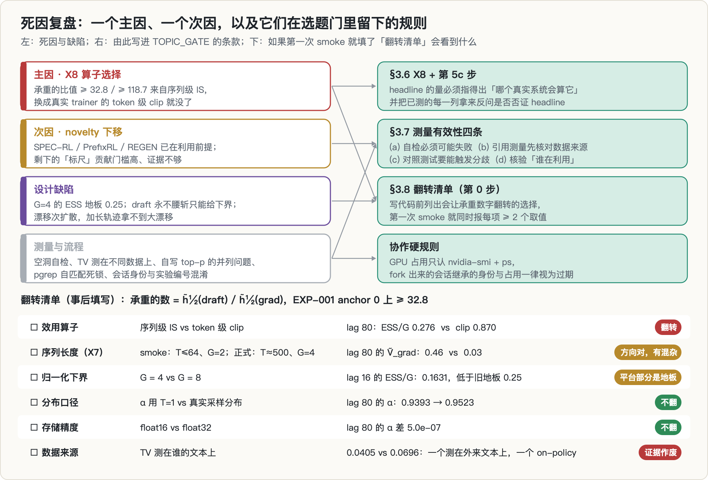

这个项目给选题门（`TOPIC_GATE.md`）留下了三节：

- **§3.6 X8：算子 / 指标选择**，以及规程第 5c 步：「在把任何量当 headline 之前，先回答：哪个真实系统会算这个量？给出实现与行号。答不出，这个量只能进附录。」并且「把该实验已经测到的每一列都拿来反问：它是否否证 headline」。
- **§3.7 测量有效性四条**，同一轮里各被违反一次：(a) 自检必须可能失败（lag 0 的同一对象）；(b) 引用任何测量，先核对它测在什么数据上（TV 的默认 `--data`）；(c) 验证重写的实现时，测试数据要能触发分歧（bf16 并列）；(d) novelty 核验要问「谁已经在利用这个现象」，不只问「谁测过」（SPEC-RL / PrefixRL / REGEN）。
- **§3.8 翻转清单**，放在规程的第 0 步：写第一行代码之前，写下承重的那个数，列出所有可能让它翻转的选择，第一次 smoke 就同时报每一项的至少两个取值。选题门里把这次和另外几次死亡放在一起看：SM120 悬崖的 28.9%（问题规模）、时钟满频比（分母口径）、SD-safe 量化的 Δα −92%（量化器实现）、这里的 2.4 步（算子），**根因完全相同**：先选了一个不起眼的默认值，在它上面测出一个漂亮的数，拿它当 headline，事后发现换个选择数就没了。

图下半部分是我事后填的翻转清单。「效用算子」一项直接翻转；「序列长度」一项在 smoke 里其实已经露过面：smoke 的回答不超过 64 个 token，lag 80 的 ESS/G 还有 0.731（换算成 $\tilde V$ 约 0.46），正式轮 500 个 token 时只剩 0.276（$\tilde V$ 约 0.03）。不过 smoke 同时改了组大小（$G = 2$），这一项有混杂。选题门里的反例算术是：**如果第一次 smoke 就把 token 级 clip 和序列级 IS 两个算子并排报出来，「0.94 对 0.38」的差异第一天上午就会逼我问「哪个才是真实算子」。**

---

## 12. 真的部分

下面这些测量本身是有效的，和主张的死活无关：

1. **测量流水线**：存 token id、同一口径 teacher forcing 重算两侧、在 logits 所在设备上直接调 HF warper 重建真实采样分布、重建保真度门、FP32 存储、按 anchor 加密的 lag 网格、bootstrap CI。
2. **一条经验事实**：三个漂移点（80 步 LoRA 的 lag 80，以及 R1-Distill 与 DeepScaleR 之间的两个方向）上，每 token 平均 $\Delta$ 的绝对值在 0.02 到 0.08 之间；在这个量级的漂移下，token 级的量（clip 存活、接受率）只掉 2–13%，而序列级 IS 的 ESS/G 只剩 0.28–0.36，在 LoRA 轨迹上几步之内就跌到这个水平。对任何想在旧数据上做序列级重要性加权的人，这是一个可以直接用的数。
3. **噪声底**：同一策略两次独立前向，采样分布口径下 $\alpha = 0.999451$；换 batch 组成，逐 token 的 $\log\pi$ 差标准差 1.48e-2，最大 0.58（并行会话测，RTX 5080）。
4. **两个工程事实**：自写 top-p 在 bf16 并列处和 HF 不一致；HF 自己的 top-p 在 CPU 和 CUDA 上也不一致。
5. **GSPO 的符号分裂**（§8）和**次扩散的漂移**（§10.4），都是少数几条轨迹上的描述性结果。
6. **一条文献观察**：staleness 相关的工作几乎都用实现相关的计步单位（epoch、版本差、步数）报结果，没有一篇报告策略实际动了多少，因此彼此不可比。
7. **一批干净的数据**：33 个策略 × 2304 个键的 FP32 打分、3 个 anchor 共 1152 条存 token id 的 rollout，重建保真度全过。

---

## 13. 过程中的错误与更正

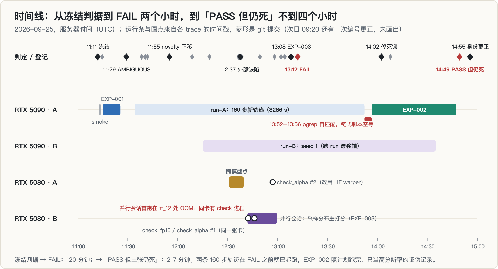

| 错误 | 后果 | 怎么发现的 | 处理 |
|---|---|---|---|
| **把序列级 IS 的 ESS 当成梯度用途的价值** | 承重比值 ≥ 32.8 / ≥ 118.7 全是算子的产物 | 并行会话在排序反转检验里指出；我用自己的表复核 | EXP-004 判 FAIL；写进选题门 X8 |
| 把 clip 存活当成解析预言的「验证」来庆祝 | 反证在表里躺了近两个小时 | 同上 | 选题门第 5c 步：每一列都要反问是否否证 headline |
| lag 0 自检比较的是同一个缓存对象 | 自检不可能失败，存储与实现错误都进不来 | 外部审阅 | 换成两次独立前向；lag 0 标注为构造使然；加重建保真度门 |
| $\alpha$ 用了 T = 1 而不是真实采样分布（漏了 top-k 20） | lag 80 的 $\alpha$ 低估 0.013 | 外部审阅 | 改用采样分布；结论方向不变 |
| 自写 top-p 用 float32 随机数验证，宣布「完全一致」 | bf16 下 8 处支持集不一致 | 并行会话的单测 | 改为直接调 HF warper，同设备 |
| 引用的两个 TV 一个 on-policy、一个外来文本 | 「全参 RL 漂移更小」的证据作废 | 并行会话复核脚本默认参数 | 换成跨模型点在各自 rollout 上的数；结论成立 |
| 把新轨迹称作原轨迹的「独立复现」 | 夸大了可复现性 | 外部审阅（trainer 代码已改） | 撤回，改记为同配方的不同版本 |
| A-006 仍写「U_grad 度量 clipped-ratio 目标下的校正代价」 | 口径更正本身又错了一次 | 复盘时发现 | 以 EXP-004 为准 |
| A-005a 把「α 不腰斩」包装成「寿命比无上界」 | 一个更强、同样依赖错误算子的说法 | EXP-004 | 随主张一并作废 |
| 跨模型点跑完约 30 分钟后才登记 | 违反「没有记录 = 没做过」 | 并行会话指出 | 如实补记；此后改为「起跑即记」 |
| 把跨模型点的正反不对称当排序反转的旁证 | 聚合层的不对称不等于逐 rollout 排序反转 | 并行会话指出 | 撤回该旁证 |
| `pgrep -f` 匹配到创建脚本的命令自己 | 链式脚本空等，EXP-002 手动启动 | 状态迟迟不变 | 改为等 PID；同一陷阱当天第三次，提交说明里记下「写下教训不等于修掉存量」 |
| A-004 预言「anchor 80 可能仍 AMBIGUOUS」 | 落空（≥ 30.5 PASS） | EXP-002 结果 | 如实记录 |
| 修正条目 A-005 被两个会话在一分钟内同时使用 | 编号撞车 | 协作文档核对 | 拆成 A-005a / A-005b；写新条目前先查现有编号 |
| EXP-RHL-005 一个编号同时登记配置和结果；「EXP-002」这个计划名又和登记簿里的 EXP-RHL-002 撞名 | 读记录时容易拿错；结果报告的标题还印着 EXP-RHL-001、末行印着「承重主张成立」（模板文字） | 次日复查 | 拆成 005a / 005b，不删原文；本文 §0 给出对照表 |
| 协作记录里出过一次身份混淆 | 见下 | 负责交叉核验的会话发现 | 定为硬规则 |
| 我在选题门里把这次的代价写成「3 天」 | 与 git 时间戳不符 | 写这篇时核对 | 以时间戳为准：冻结到 FAIL 120 分钟，到最后一条结果 217 分钟 |

**关于身份混淆**：这个仓库同时有多个 AI 会话在提交。其中一个会话是从另一个会话 fork 出来的，连同对话历史一起继承了对方在协作文档里的身份标签和 GPU 占用声明，结果两个会话自称同一个身份、声称占着同两张卡。用 `nvidia-smi` 和 `ps` 核实后，其中一张卡上正在跑另一个项目的服务吞吐测量（vLLM 服务加压测，还锁了频，见[相似律那一篇](../llm-serving-similitude/)）。如果按记忆在那张卡上起下一阶段的任务，就会污染那次测量。由此定下的硬规则是：**GPU 占用只认 nvidia-smi 加 ps，不认对话记忆；fork 出来的会话继承的身份与占用声明，默认一律过期。**

---

## 14. 我学到了什么

1. **当 headline 的量，必须指得出「哪个真实系统会算它」，给出实现和行号。** 这次的 headline 连本项目自己的 trainer 都不算（它没有比值）。这一步的成本是翻一下损失函数。
2. **把已经测到的每一列都拿来反问「它是否否证 headline」，尤其是那些你正在当作「验证」来庆祝的列。** 支持你的列和否证你的列，常常是同一列。
3. **预注册冻结的不只是阈值，还有构念。** PASS 只说明判据被诚实地执行了，不说明判据量的是对的东西。两条记录都要留。
4. **「按用途的寿命」在写清楚每个用途的算子之前没有定义。** 复合的算子和不复合的算子之比天然是 $O(T)$；比较寿命之前，先确认两边在同一个聚合层级上。
5. **自检要能失败。** 写下任何自检后，先问「什么情况下它会失败」。答不出，它就不是检验。这次换成两次独立前向之后，第一次看到了真实的噪声底。
6. **引用测量先核对它测在什么数据上，包括三天前的自己。** 默认参数是最容易被忽略的口径。
7. **对照测试的数据要能触发分歧。** float32 随机数测不出并列；更好的办法是别重写，直接调库。
8. **撞车核验要问「谁已经在利用这个现象」。** 「谁测过」只能判断测量有没有被做过；「谁在用」才能判断这个观察还算不算新。
9. **「标尺」型贡献要先确认文献能被放到你的尺子上。** 如果现有工作报的量彼此不可比，标尺的第一个交付物就做不出来；这不一定是标尺的价值，也可能是门槛。
10. **把教训落到存量代码上。** `pgrep -f` 的陷阱当天出现了三次，前两次只记在对话里。
11. **多会话协作时，共享状态以系统为准。** GPU 占用看 nvidia-smi，编号写前先查，实验起跑即记。

---

## 15. 局限与开放问题

**测过的范围**：Qwen3-1.7B + LoRA r = 16 的 GRPO（自写 trainer：REINFORCE 加组基线加 k3 KL，无比值无 clip），GSM8K 式题目，80 步和 160 步两条轨迹，T = 0.6 / top-k 20 / top-p 0.95，max_new = 512，每个 anchor 48 题、每题 4 或 8 条；一个跨模型点（R1-Distill-Qwen-1.5B → DeepScaleR-1.5B）。

**没测过的**（结论不能外推）：

- **真正的梯度效用**：clip 存活只是代理，「没被截」不等于「有用」；应该用 replay 训练的实际增益来量。
- **真正的 draft 效用**：没有在引擎里跑过用旧 rollout 当 drafter 的端到端加速；$\tau(\alpha, 4)$ 假设每个 token 独立接受，而整段前缀式的用法会复合（§11.1，推导）。
- **另外两种用途**：难度信号（A-002 的 AUC 口径）和 SFT 的实际增益（A-003 预言可能转负），脚本写好了，没跑。
- **规模与框架**：更大的模型、更长的回答（数千 token 时序列级只会塌得更快）、别的任务、真实 RL 框架（有比值有 clip 的 GRPO）。
- **探索性（写这篇时补查，不参与任何判定）**：anchor 0 的 78 条 reward = 0 的 rollout 里，有 32 条在 `\boxed{}` 里写对了答案，只是没有按 verifier 要求的 `#### 数字` 格式给出；anchor 40 只有 1 条。也就是说，0.594 → 0.839 的通过率上升里有一部分是格式学习。这不影响任何基于 $\Delta$ 的量，但影响「漂移是真的」那条旁证的解读，也影响 EXP-003 里 $A>0$ / $A<0$ 的分组。另外，384 条里有 372 条顶到了 512 的长度上限。

如果要重新打开这个方向，必须作为新问题重新预注册，而且第一步是先填翻转清单：每个用途的真实消费者用什么算子、在什么长度上。我对「同一聚合层级下仍有数量级差」的先验不高。

---

## 16. 复现

- **环境**：Python 3.14、torch 2.12.0、transformers 5.17.0；两块 RTX 5090、两块 RTX 5080（SM120）。模型：Qwen3-1.7B（LoRA 轨迹）、R1-Distill-Qwen-1.5B 与 DeepScaleR-1.5B（跨模型点）。
- **脚本**：`gen_anchor.py`（从 anchor 策略采样，存 token id）、`score_logp.py`（teacher forcing 打分，同时存 T = 1 的 logπ 与采样分布的 logq）、`analyze.py`（各用途指标、两套判据、重建保真度门、bootstrap）、`grid.py`（按 anchor 加密的 lag 网格）、`run_exp002.sh` / `chain_exp002.sh`（EXP-002 流水线）、`run_traj160.py` / `run_traj_b.py`（两条 160 步轨迹）、`cross_model.py`（跨模型点）、`check_alpha.py` / `check_fp16.py`（两个诊断）；并行会话的 `score_logq.py`、`order_reversal.py`、`test_warper*.py`。
- **提交**：PREREG 冻结 `7994549`；A-001 `6c5702f`；EXP-001 `2baac00`；EXP-003 `9984159`；EXP-004（FAIL）`fde8e92`；死锁修复 `f686866`；EXP-002 结果 `a33ff61`；身份更正 `8638d75`；编号更正 `b114d8c`。共 23 个提交。
- **trace**：`analyze.jsonl`（按 `git_commit` 区分：`6c5702f` 是 EXP-001，`8fe931e` 是 EXP-002，`7994549` 是 smoke）、`order_reversal.jsonl`、`cross_model.jsonl`、`check_alpha.jsonl`、`check_fp16.jsonl`、`traj_log.jsonl` / `traj_log_runB.jsonl`、`gen_anchor.jsonl`、`score_logp.jsonl`、`score_logq.jsonl`；报告 `halflife.md`、`halflife_exp002.md`、`order_reversal_a000.md` / `_a040.md`、`amendments.md`。全部 append-only。
- **本文的图**：由一个只用 Python 标准库的脚本直接从上述 trace、报告和 EXP-001 的逐 token 打分文件生成（SVG 再转 PNG），数字不经手抄。

---

## 参考

- 综述：Rollout Efficiency in RL for Reasoning LLMs [arXiv 2609.25463](https://arxiv.org/abs/2609.25463)；Generate, Filter, Control, Replay [arXiv 2605.02913](https://arxiv.org/abs/2605.02913)
- 已在利用前提的三组工作：SPEC-RL [arXiv 2509.23232](https://arxiv.org/abs/2509.23232)；PrefixRL [arXiv 2601.18795](https://arxiv.org/abs/2601.18795)；REGEN [arXiv 2607.19450](https://arxiv.org/abs/2607.19450)
- 梯度 / critic 用途的 staleness 工作：PNPO（Reusing Rollouts under Policy Lag）[arXiv 2608.01418](https://arxiv.org/abs/2608.01418)；Headroom-Drift Replay [arXiv 2609.03941](https://arxiv.org/abs/2609.03941)；Rollout-Level Advantage-Prioritized ER for GRPO [arXiv 2606.04560](https://arxiv.org/abs/2606.04560)；BRACE [arXiv 2609.09783](https://arxiv.org/abs/2609.09783)；Efficient RL Training with Experience Replay [arXiv 2604.08706](https://arxiv.org/abs/2604.08706)；Freshness-Aware PER [arXiv 2604.16918](https://arxiv.org/abs/2604.16918)；CERO [arXiv 2606.05606](https://arxiv.org/abs/2606.05606)；Prompt replay [arXiv 2603.21177](https://arxiv.org/abs/2603.21177)
- 系统侧：StaleFlow [arXiv 2601.12784](https://arxiv.org/abs/2601.12784)
- 投机解码进 RL rollout：System-Integrated SD for RL Rollouts [arXiv 2604.26779](https://arxiv.org/abs/2604.26779)；Online Draft Co-Training [arXiv 2609.07108](https://arxiv.org/abs/2609.07108)
- 同专栏：[投机解码会悄悄改变 RL 的行为策略吗？](../spec-decoding-rl-mismatch/)（拒绝采样的无损性推导）
