> **TL;DR**
>
> - **问题**：RTX 5090 / 5080 属于消费级 Blackwell（SM120）。它有 FP4 张量核，却没有数据中心 Blackwell（SM100，B200）的 TMEM 和 tcgen05 指令，每个 block 能申请的共享内存也只有 99 KiB（B200 是 227 KiB）。我想知道：这个「混合体」在低精度推理上，是不是有一道**软件修不好的架构悬崖**？
> - **做法**：先写死判据，在自有的 2 张 5090、2 张 5080 上跑同一套测量台。本机分不清「架构问题」和「kernel 还不成熟」，于是租了一台 B200 做对照，判据在开机前一天冻结。
> - **结果**：**被对照实验证伪**。在判据规定的测点（N=K=4096、M=1）上，B200 的 NVFP4 访存达成率只有 **8.5%**，比 5090 的 28.8% 还低，连 BF16 的耗时都「对 M 完全平坦」。两台机器测到的都是每次调用十几微秒的**固定开销地板**，不是架构。在这之前，smoke 阶段的「NVFP4 比 BF16 还慢」已经在清场复测后撤回（H1 失败），「attention 选错后端代价大」被 107 个配置否掉（H2），「99 KiB 悬崖」只过了一半（H3）。
> - **第二次生命**：我把残骸改写成一篇「99 KiB 上限的代价」预印本（headline：把 B200 限到 99 KiB 会损失 25.4%）。第二次租机之前，先在本机零机时把它拆了：记账公式差一（43 个配置其实是 35 个）、测点落在 L2 里、跨架构「反转」随分母翻转。09-27 又发现标题本身是错的：**99 KiB 是消费级显卡从 Ampere 起三代没动过的常数，不是 Blackwell 的分叉**。外部核验认定脊梁全部是已有工作，现稿放弃。
> - **过程亮点**：判据冻结让 B200 那一跑没有任何解释空间；开机前，ptxas 探测抓到一个会把结论判反的假阴性；第二次租卡前，零机时拆掉了自己的 headline。
> - **附带**：SM120 上「tcgen05 是指令集层面不能用、MXFP4 是框架层面不让用」的第一手对照；PyTorch 默认的 SDPA 派发在两种架构上都已近乎最优；以及一个可以直接复用的教训：**在「典型层尺寸」上给低精度 decode 做基准，测到的是启动开销，不是带宽。**

---

## 0. 读法

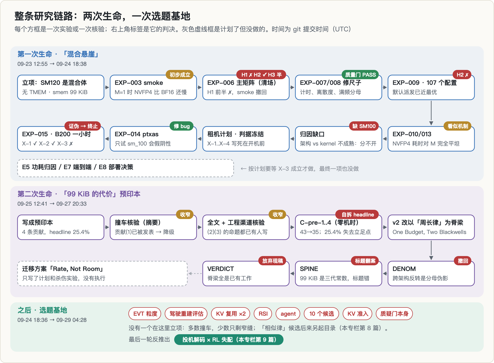

这个项目活了两次，所以文章比同专栏其它篇长一些：

| 部分 | 内容 |
|---|---|
| 1–2 | 背景与原理：两种 Blackwell、FP4 格式、roofline 与启动开销地板、99 KiB 与 tile、归因闭合 |
| 3–5 | 动机、这个题从哪来、跑之前写死了什么 |
| 6–9 | 第一次生命的四组实验，一直到 B200 的判决 |
| 10 | 第二次生命：「99 KiB 的代价」是怎么被自己拆掉的 |
| 11–12 | 死因；悬崖死后这个目录又试过什么 |
| 13–17 | 真的部分、错误与更正、教训、局限、复现 |

**数字来源**：本机 trace（`bench_sm120.jsonl`，740 行）、B200 trace（367 行）、四个 C-pre trace，以及项目的登记簿和 git log。所有图都由脚本直接从这些文件画出来，不经手抄。项目当时就把每个数分成三类，这里沿用：**实测**（有 trace 行）、**引用**（别人的结论，我没复现）、**推导**（从别的数算出来）。推导出来的数不参与任何结论。

有几处我按 trace 重算的值和项目登记簿差 0.1–0.4 个百分点，原因是两边取的带宽分母来自不同的运行。正文一律用重算值，第一次出现时注明登记值。时间一律用 git 提交时间（UTC）；项目文档文件名里的日期是本地日期，有时会差一天。

---

## 1. 背景：两种 Blackwell

### 1.1 一次矩阵乘在 GPU 上怎么做

先用最少的概念把后文要用的东西讲清楚。

- **SM**（streaming multiprocessor）是 GPU 的基本计算单元。5090 有 170 个，5080 有 84 个，B200 有 148 个（实测）。
- 每个 SM 里有**张量核**，专门做小块矩阵乘；有一片**共享内存**（shared memory，下文简称 smem），给同一个线程块（block / CTA）里的线程共享；还有**寄存器**，每个线程自己用。
- SM 之外是所有 SM 共享的 **L2 缓存**（5090 实测 96 MiB，B200 126.5 MiB），再往外是显存（B200 是 HBM，RTX 50 系是 GDDR7）。

算 $C = A \cdot B$（$A$ 是 $M \times K$，$B$ 是 $K \times N$）时，高性能 kernel 都做**分块**：每个 CTA 负责 $C$ 的一块 $BM \times BN$，沿 $K$ 方向每次推进 $BK$。每推进一步，都要把 $A$ 的一块 $BM \times BK$ 和 $B$ 的一块 $BK \times BN$ 从显存搬进 smem，再交给张量核。为了让「搬下一块」和「算这一块」重叠，kernel 会在 smem 里同时放好几级缓冲，这叫**软件流水**，级数记作 $NS$（num_stages）。

LLM 推理里，**decode** 阶段每步只处理很少的 token，$M$ 通常是 1 到几十。$M=1$ 时矩阵乘退化成矩阵乘向量（GEMV）：每个权重只被读一次、用一次，速度几乎完全由「把权重从显存读出来要多久」决定。低精度格式（FP8、FP4）在 decode 上的核心卖点，就是**权重字节少，读得快**。

### 1.2 SM120 与 SM100：同名，不同的数据通路

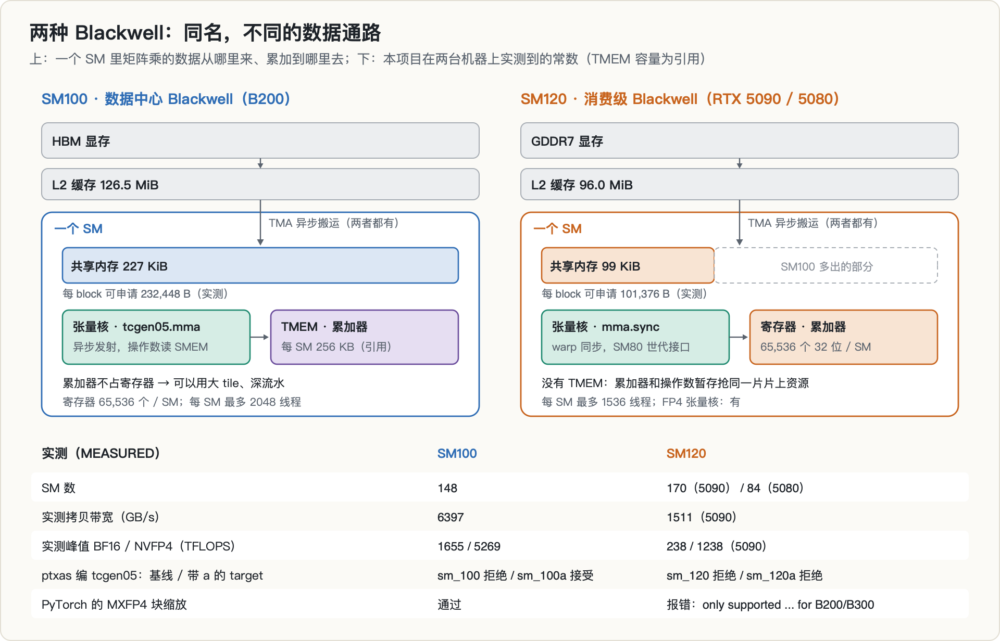

NVIDIA 用同一个 Blackwell 品牌卖了两种结构不同的 SM：

| | SM100（B200，数据中心） | SM120（RTX 5090 / 5080，消费级） |
|---|---|---|
| 张量核指令 | `tcgen05.mma`，异步发射 | `mma.sync`，warp 同步，SM80 世代的接口 |
| 累加器放在哪 | **TMEM**，每 SM 256 KB 的专用片上存储（引用） | 寄存器 |
| 每 block 可申请的 smem | 232,448 B = 227 KiB（实测） | 101,376 B = 99 KiB（实测） |
| 每 SM 最多线程 | 2048（实测） | 1536（实测） |
| TMA 异步搬运 | 有 | 有 |
| FP4 张量核 | 有 | 有 |

TMEM 的数据来自 Colfax Research 的 CUTLASS 教程：累加器必须放在 TMEM，操作数 B 必须在 smem，操作数 A 两处都可以。它的直接后果是，为 SM100 写的高性能 kernel（FlashAttention-4、CUTLASS 的 SM100 collectives、DeepGEMM）在 SM120 上编译不过。Colfax 的原话是 SM10x 的 GEMM kernel 与 SM12x「completely incompatible」。

「SM120 没有 tcgen05」这一条我在本机直接验证过：用 `ptxas` 编一段只含 `tcgen05.wait` 的 PTX，`sm_120` 和 `sm_120a` 都报 `not supported`，同一个 ptxas 编 `sm_100a` 则通过。`ptxas` 判断指令集支持性时不需要硬件在场，所以这一条在本机就能闭合。这个结论并不新（论文 2507.10789 已经写过 sm_120a 不支持 tcgen05），这里算是第一手确认。

### 1.3 FP4 的两种格式：NVFP4 与 MXFP4

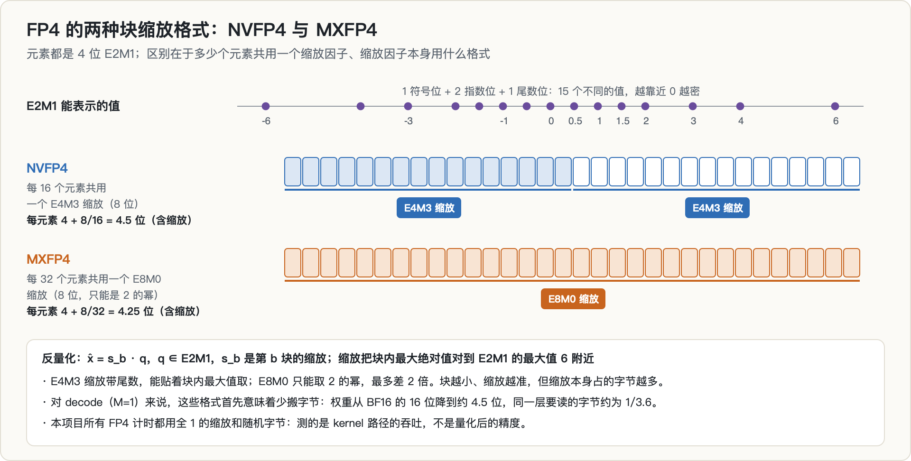

4 位浮点 E2M1 只能表示 0、±0.5、±1、±1.5、±2、±3、±4、±6，一共 15 个值。要用它表示真实权重，就得给每一小块元素配一个缩放因子：

$$
\hat{x}_i = s_b \cdot q_i, \qquad q_i \in \text{E2M1}
$$

$s_b$ 是第 $b$ 块的缩放，大致把块内最大绝对值对到 E2M1 的最大值 6 附近。两种主流格式的区别在于块多大、缩放用什么格式：

- **NVFP4**：每 16 个元素一个 E4M3 缩放（8 位，带尾数），平均每元素 $4 + 8/16 = 4.5$ 位；
- **MXFP4**：每 32 个元素一个 E8M0 缩放（8 位，只能取 2 的幂），平均每元素 4.25 位。

和 BF16 的 16 位相比，同一层要读的字节大约只有 1/3.6。

本机探测到的能力面（实测，PyTorch 2.12 的 `torch._scaled_mm_v2`）：NVFP4 可用，但缩放张量必须是 `SWIZZLE_32_4_4` 布局，否则报错；MXFP4 直接抛 `NotImplementedError: MXFP4 scaling only supported in CUDA for B200/B300`。硬件有 FP4 张量核，框架却关掉了一半的 FP4 格式空间。后面在 B200 上，同一个调用通过了。

**口径局限**：本文所有 FP4 计时都用全 1 的缩放和随机字节，测的是 kernel 路径的吞吐，不是量化后的精度。

---

## 2. 原理：roofline、启动开销地板、99 KiB 与归因

### 2.1 roofline 与达成率

roofline 模型说，一个 kernel 能达到的吞吐受两个上限约束：

$$
P_\text{可达}(I) = \min\big(I \cdot B,\ P_\text{峰值}\big)
$$

其中 $B$ 是显存带宽，$I$ 是**算术强度**（每搬一个字节做多少次浮点运算）。$M=1$ 的 GEMV 做 $2NK$ 次运算、搬约 $NK \cdot b$ 字节权重（$b$ 是每元素字节数），所以 $I \approx 2/b$：BF16 是 1，FP8 是 2，FP4 约是 4。拿 5090 实测的 1511 GB/s 算，BF16 GEMV 的上限只有约 1.5 TFLOPS，离 238 TFLOPS 的实测峰值差两个数量级。decode 牢牢地是**访存界**。

于是衡量 decode kernel 好不好，看的是**访存达成率**：

$$
\eta = \frac{t_\text{理想}}{t_\text{实测}}, \qquad t_\text{理想} = \frac{\text{权重字节}}{B}
$$

这里有两个口径问题，后面都会咬人：**分母 $B$ 用哪个带宽**（厂商标称、实测拷贝、实测只读），以及**字节算不算缩放和激活**。项目的约定是：分母只用实测带宽（冲掉 L2 后的拷贝带宽），字节只计权重。

### 2.2 启动开销地板：为什么小尺寸会制造假悬崖

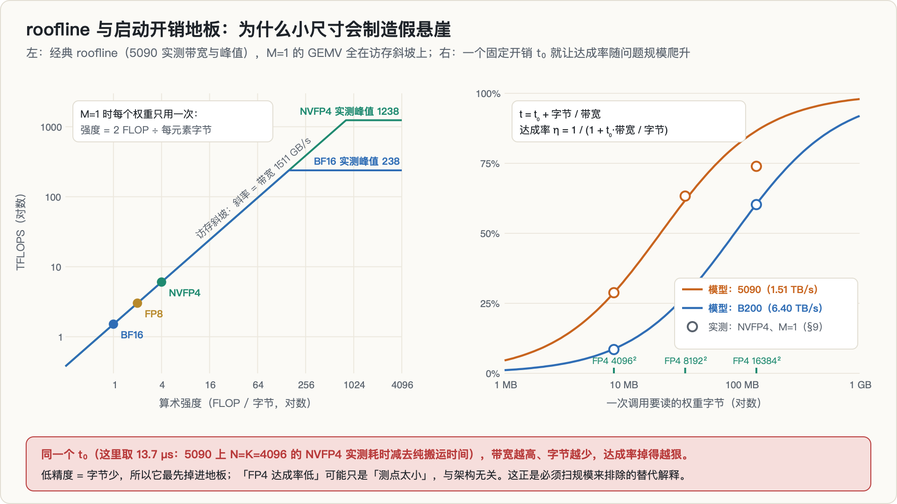

真实的 kernel 调用除了搬数据，还有一段与问题规模无关的固定成本 $t_0$，包括 launch、调度，以及 kernel 里的固定工作（项目没有进一步拆分）。于是：

$$
t = t_0 + \frac{\text{字节}}{B}, \qquad \eta = \frac{1}{1 + t_0 B / \text{字节}}
$$

这个式子说明了三件事：

1. **字节越少，$\eta$ 越低。** 同样一段 $t_0$，BF16 的权重是 FP4 的 4 倍，被摊得更薄。所以「精度越低，达成率越低」在地板区里是**自动成立**的，不需要任何架构原因。
2. **带宽越高，$\eta$ 越低。** B200 的带宽是 5090 的 4 倍多，同一个 $t_0$ 对它伤害更大。
3. **只要问题规模够大，$\eta$ 就会爬回去。** 所以要判断一个「低达成率」是不是真现象，最便宜的办法就是把规模放大几倍再测一次。

拿实测数字代进去：5090 上 N=K=4096 的 NVFP4 权重是 8.4 MB，纯搬运 5.55 µs，实测 19.29 µs，$t_0 \approx 13.7$ µs，$\eta = 28.8\%$。同一个 $t_0$ 放到 B200 上，模型预测 $\eta \approx 8.7\%$，实测是 8.5%。这就是后面整件事的谜底：**本机看到的「悬崖」，是一个在两台机器上都存在的地板。**

### 2.3 99 KiB 共享内存怎么限制 tile

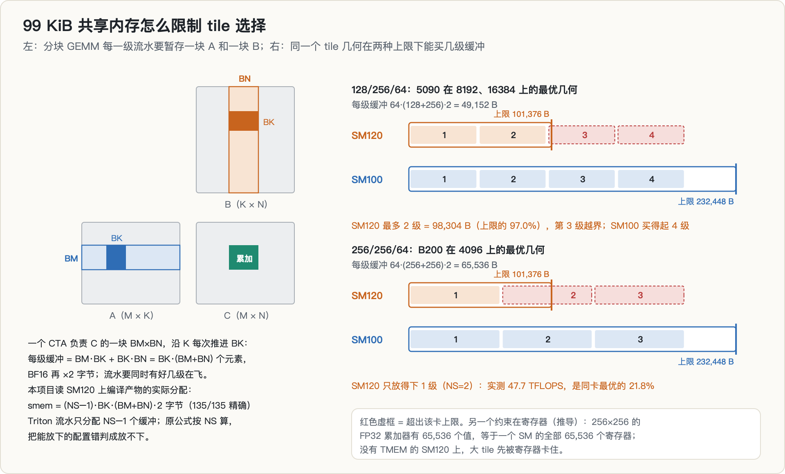

每一级流水要暂存 $BM \cdot BK + BK \cdot BN = BK(BM+BN)$ 个元素。BF16 每元素 2 字节，同时在飞的缓冲数是 $NS-1$（这一点后面会讲，是在 SM120 上读编译产物实测出来的），所以：

$$
\text{smem} = (NS-1) \cdot BK \cdot (BM+BN) \cdot 2 \ \text{字节} \ \le\ 101{,}376
$$

另一方面，一个 tile 每一级做 $2 \cdot BM \cdot BN \cdot BK$ 次运算，所以它的算术强度正比于 $\frac{BM \cdot BN}{BM + BN}$，也就是面积除以周长。大 tile 强度高、对显存友好，但周长也大，吃 smem；深流水能藏延迟，但每多一级就多一份周长。**99 KiB 限制的是「周长 × 深度」这个乘积。** 这两条代数是 GEMM 分块的教科书内容（Volkov & Demmel 2008；Goto & van de Geijn 2008），不是本项目的发现。项目一度把它当成发现写进了论文标题，§10 会讲。

SM120 上还有第二道约束：没有 TMEM，累加器只能放寄存器。256×256 的 FP32 累加器有 65,536 个值，正好等于一个 SM 的全部 65,536 个寄存器（推导）。所以大 tile 在 SM120 上很可能先被寄存器卡住，而不是先被 smem 卡住。

### 2.4 归因闭合：为什么没有对照机就下不了结论

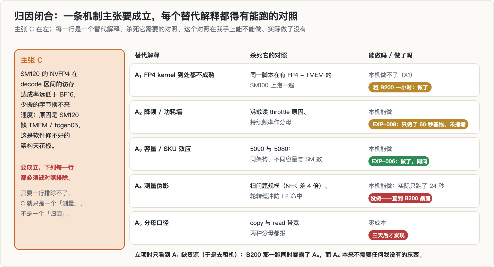

项目第一天下午写出了一道选题前置门，叫「归因闭合」。对一条机制主张 C：

1. 写下 C 的机制陈述（X 导致 Y，因为 Z）；
2. 列出评审会提的全部替代解释 $A_1, \dots, A_n$；
3. 对每个 $A_i$，写出杀死它的对照实验 $E_i$；
4. **只要有一个 $E_i$ 在我手上跑不了，这个主张就只是一个「测量」，不是一个「归因」。**

本项目的主张是「SM120 的 FP4 decode 达成率低，是因为缺 TMEM」。最显眼的替代解释是 $A_1$：FP4 kernel 在所有架构上都还不成熟（vLLM 与 LLM-Compressor 的文档本来就建议 decode 用 W4A16 而不是 W4A4）。杀死 $A_1$ 需要在一台有 FP4 又有 TMEM 的机器上跑同一份脚本，本机只有 SM120，做不到。这就是这个方向后来在选题门里的定性：**测出来了，但归因不了**。

图里的教训在最后一行：立项时我只盯着 $A_1$ 这一行缺资源，于是去租机器；而真正先杀死 C 的是 $A_4$（测量伪影），它本来不需要任何我没有的东西。

---

## 3. 动机与假设链

立项（09-23）时的想法是这样一条链：

- **已知**：SM120 不是 SM100 的子集。它有 SM90 的 TMA、SM80 世代的 `mma.sync`，没有 TMEM，smem 只有 99 KiB。为 SM100 写的 kernel 在它上面用不了。
- **已知**：FP4 权重的字节是 BF16 的约 1/3.6，decode 是访存界，理论上 FP4 应该快好几倍。
- **smoke 读数**：本机 5090 上，$M=1$ 时 NVFP4 的吞吐只有 BF16 的 0.864 倍，**比 BF16 还慢**；$M=8192$ 时则是 5.318 倍。
- **推论**：SM120 有 FP4 张量核，却在 decode 区间拿不到 FP4 应得的带宽收益；如果原因是缺 TMEM，那这一整类卡（16 GB 的 5080 到 96 GB 的 RTX PRO 6000）在低精度推理上就有一道软件修不好的天花板。

**为什么觉得值得做**：这类卡承担了大量本地推理，而当时我以为「有 B200 的人没动机做、有 A100 / H100 的实验室没有这张卡、有这张卡的人不写论文」。投稿目标是 MLSys 2027（截稿 2026-10-30）。后来证明这个判断是错的：2507.10789 已经用 RTX 5080 对比过 H100，zartbot 有一份 SM120 的周期级表征，2604.23466 在同一套 harness 下跑过 RTX PRO 6000、B200 和 H100（§10）。

**计划本身写得很清楚哪些东西不是新的**：「W4A4 在 decode 上不划算」是实践圈的已知现象，TMEM 缺失是别人公开过的事实。项目的新东西只能是「在 SM120 上的定量刻画 + 架构归因」。所以归因能不能闭合，从一开始就是生死线。

---

## 4. 这个题是怎么来的

这是这一轮选题的第二个方向。第一个方向（[投机 rollout 的草稿头维护](../rl-spec-draft-maintenance/)）的死法是「测了，但没人在乎」：测出来的量不改变任何人的任何决定。这个项目直接继承了三样东西：

1. **决策后果前置**。计划把「这些测量改变什么部署决策」（E8）写成分水岭：没有 E8 就只是一张表格，不是论文。
2. **纪律**：预注册判据、判据变更要登记（amendments）、trace 只追加不修改、失败路径也要记录完整异常。
3. **硬件**：同一台机器上的 2 张 5090 和 2 张 5080，以及上一个项目留下的 Python 环境。

它在整个选题链里的位置也很特别：**选题前置门 `TOPIC_GATE.md` 就诞生在这个目录里**。它开头就把前两次撞墙总结为「测了但没人在乎」和「测出来了但归因不了（缺 SM100 对照机）」，并且在后来的几天里一条条长出了 X7（单一参数点）、X8（算子选择）、X9（空隙的分母）、X11（推导不进结论）这些规则，多数都是从本项目的错误里来的。范文 [投机解码 × RL 失配](../spec-decoding-rl-mismatch/) §4 的选题漏斗里，这个方向记作「被实验证伪」。

---

## 5. 预注册：跑之前写死了什么

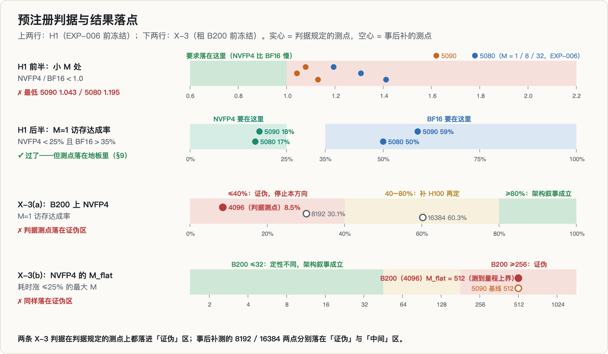

主矩阵开跑之前（09-23），`EXPERIMENTS_PLAN.md` 冻结了 H1–H7：

| 编号 | 问题 | 判据（冻结） | 结果 |
|---|---|---|---|
| H1 | GEMM 的低精度收益是否随 M 反转 | 存在 M\*：M < M\* 时 NVFP4/BF16 < 1.0，M > M\* 时 > 2.0；且 M=1 处 NVFP4 达成率 < 25%、BF16 > 35% | 前半 **失败**，后半通过 |
| H2 | decode attention 的后端选择是不是真问题 | 达成率 < 50%，且后端间差距 > 1.5× | 当时判「强成立」，随后被 EXP-009 否掉 |
| H3 | 99 KiB 是否挡掉了有用的 tile 配置 | 「SM100 能开、SM120 开不了」的配置 ≥ 20 个，**且**其中至少一个是有用的 | 数量过，「有用」没证据 |
| H4 | gap 是架构性的还是功耗性的 | 满频窗口内重测 gap 仍 ≥ 2× | 没做（E5） |
| H5 | 5090 与 5080 结论是否一致 | 反转点同向、曲线形状 Spearman > 0.8 | 只看了同向 |
| H6 | micro-bench 能否预测端到端 | 方向一致、误差 < 20% | 没做（E7） |
| H7 | 至少一条部署规则与默认做法不同 | 三条规则里至少一条 | 没做（E8） |

计划里还有一张 kill 条件表，例如「E5 显示 gap 主要来自降频」「2026-10-09 仍给不出 E8 的决策规则」等，任一命中就换题或降级。

租 B200 之前（09-23 14:39，写进 `RENTAL_PLAN.md`），又冻结了四个跨架构问题：

| 编号 | 问题 | 判读 |
|---|---|---|
| X-1 | tcgen05 的门控是硬件的吗 | SM100 上 ptxas 接受 → 硬件门控坐实 |
| X-2 | MXFP4 的门控是软件的吗 | B200 上通过 → 软件门控坐实 |
| **X-3** | **NVFP4 的低达成率是 SM120 特有的吗** | **B200 ≥ 80% → 架构叙事成立；≤ 40% → 证伪，立即停止本方向；40–80% → 补 H100 再定** |
| X-4 | 99 KiB 悬崖是否绑定 | B200 的最优配置 > 99 KiB → 悬崖真实 |

X-3 后来又加了一条判据 (b)：看 NVFP4 耗时「对 M 平坦」到多大的 M（M_flat）。B200 上若 M_flat ≤ 32 就说明定性不同、架构叙事成立，≥ 256 则证伪。这一条是在 B200 开机前 21 分钟提交的，仍在任何 B200 数据之前。

---

## 6. 实验一：主矩阵 EXP-006（H1 / H2 / H3）

### 6.1 设计

测量台是一个脚本 `bench_sm120.py`，分成若干相位：`selftest`（计时台自检）、`probe`（能力面，含失败路径的完整异常）、`bw`（实测带宽，roofline 的分母）、`gemm`（28 个形状 × 4 种精度）、`attn`（60 个 attention 配置 × 4 个 SDPA 后端）、`smem`（135 个 tile 配置）。主矩阵串行跑：先 5090-A，再 5080-A，一次只占一张卡，repeat=30，开跑前确认四张卡都空闲。

### 6.2 H1：smoke 的「NVFP4 比 BF16 慢」不复现

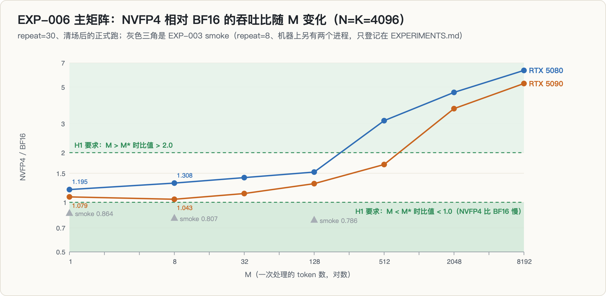

| M | 5090 BF16（TFLOPS） | 5090 NVFP4 | 5090 NVFP4/BF16 | 5080 NVFP4/BF16 |
|---|---|---|---|---|
| 1 | 0.89 | 0.96 | **1.079** | 1.195 |
| 8 | 2.53 | 2.64 | **1.043** | 1.308 |
| 32 | 10.27 | 11.61 | 1.130 | 1.412 |
| 128 | 40.81 | 52.99 | 1.298 | 1.526 |
| 512 | 125.88 | 213.38 | 1.695 | 3.128 |
| 2048 | 191.53 | 708.74 | 3.700 | 4.643 |
| 8192 | 228.23 | 1199.21 | 5.254 | 6.310 |

H1 前半要求小 M 处比值 < 1.0，实测最低是 1.043（5090）和 1.195（5080），**从未低于 1.0**。smoke 那组 0.68–0.86 是 repeat=8、并且机器上另有两个我自己的进程（分别占着 5080-A 95%、5090-B 65%）时测的。按纪律，H1 前半判失败、不改阈值，smoke 结论撤回，登记在 amendments。

H1 后半（M=1 达成率）过了：NVFP4 18%（5090）/ 17%（5080），BF16 59% / 50%。项目当时把表述改成「NVFP4 在 decode 区间只拿到 1.08–1.20 倍，而权重流量少了约 4 倍：收益不是负的，是几乎不存在」。

### 6.3 H2 与 H3

**H2**：在 HQ=32、HKV=8、D=128 这组 decode 形状上，KV=16384 时 CUDNN 后端的访存达成率是 19.6%，EFFICIENT 只有 4.1%，后端之间差好几倍。当时判为「强成立」：在 SM120 上选错 attention 后端要付几倍代价。（写这篇时我核对发现，「达成率 < 50%」这个区间只在这一组形状上成立；扫过的全部 decode 形状里，5090 最高到 57.8%，5080 到 73.3%。这不影响结论，因为 H2 很快就被 §7.3 整体否掉了。）

**H3**：135 个 tile 配置里，按公式有 43 个「SM100 能开、SM120 开不了」，数量判据过了。但 5090 的实测最优配置 BM128/BN64/BK64/NS3 按公式只要 72 KiB，5080 的最优只要 24 KiB，都远在 99 KiB 之内。**99 KiB 在 BF16 GEMM 上并不绑定**，「被挡掉的配置有用」没有证据，H3 只算过一半。（§10 会讲，这里的「43」「72 KiB」都是一个记账公式的产物，后来改成了 35 和 48 KiB。）

### 6.4 数据质量：先不能用

同一轮还暴露了两个质量问题：55.4% 的 gemm 测点变异系数（CV）超过 5%，attention 是 40.8%；全程 SM 频率只有标称上限的 0.80–0.92。前者违反了「CV > 5% 的点不得用于对比」的红线，后者让 H4 的「满频窗口」根本不可达。所以这一轮的对比结论在修好计时之前都不能进论文。

### 6.5 回头看：同一个测点，比值在 1 两侧来回翻

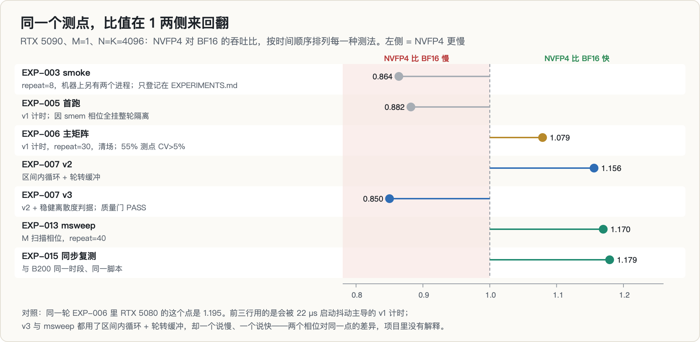

写这篇文章时，我把项目里所有测过「5090、M=1、N=K=4096」这个点的记录都找了出来，按时间排好。比值在 0.85 和 1.18 之间来回翻：

- smoke（0.864）被 EXP-006（1.079）推翻、撤回；
- 但 EXP-006 用的是会被 22 µs 启动抖动主导的 v1 计时，55% 的测点 CV 超标；
- 修好计时后的 v3（§7.1）又测到 **0.850**，而且 STATUS 文档把 v3 这一行（BF16 1.27、FP8 1.23、NVFP4 1.08 TFLOPS，「不升反降」）当成了租 B200 之前的头号证据；
- 同样用了修好的计时、专门扫 M 的 msweep 相位，对同一个点给出的却是 1.17–1.18。

项目里没有人把 smoke 的撤回和 v3 的 0.85 对上，也没有解释 gemm 相位和 msweep 相位为什么对同一个点给出相反的方向。现在看，这张图本身就是答案：**一个测点的方向取决于测法而不是硬件时，它就在地板里。**

---

## 7. 实验二：修尺子，和 H2 的决定性实验

### 7.1 EXP-007：计时方案修复

小 kernel 只跑几十微秒，而空 kernel 的单次计时地板就有 22 µs（selftest 实测）。修法有三条：

1. **区间内循环**：一次 `cuda.Event` 计时区间里连续调用 inner 次，自动选 inner 让区间 ≥ 2 ms；
2. **轮转权重缓冲**：inner 次调用轮流用不同的权重缓冲，总量 > 2×L2，保证不命中 L2（否则会把显存读测成 L2 读）；
3. **稳健离散度**：CV 对单个离群样本太敏感（出现过 median/min = 1.01 而 CV = 0.27 的点），判据改成 IQR-CV < 0.05 且 median/min < 1.10，相位里不稳定点占比 ≤ 20% 才算过质量门。

结果：gemm 的原始 CV 中位数从 0.054 降到 0.0124，不稳定点占比 19.6%，质量门 PASS。同时落盘了**实测**算力峰值（5090：BF16 238.4、FP8 693.6、NVFP4 1238.1 TFLOPS），roofline 分母改成 $\min(I \cdot B,\ \text{实测峰值})$，整个项目不再用任何厂商标称数。

### 7.2 EXP-008：「满频」到底是多少

`clocks.max.sm` 报的 3150 MHz 是 boost 档位上限，不是能持续的频率。60 秒 BF16 满载实测：持续频率 2887 MHz，温度 49 → 61 °C，功耗 407 W（上限 600 W），145 个采样里只有 5 个带 `sw_power_cap`。EXP-006 的「全程未达满频」是分母选错了，撤回；满频判据改为直接读 throttle 原因。

这只是 60 秒、只有 BF16、只在 5090 上。计划里的 E5（两张卡、FP4 负载、2 小时热浸泡）一直没做。

### 7.3 EXP-009：H2 被 107 个配置否掉

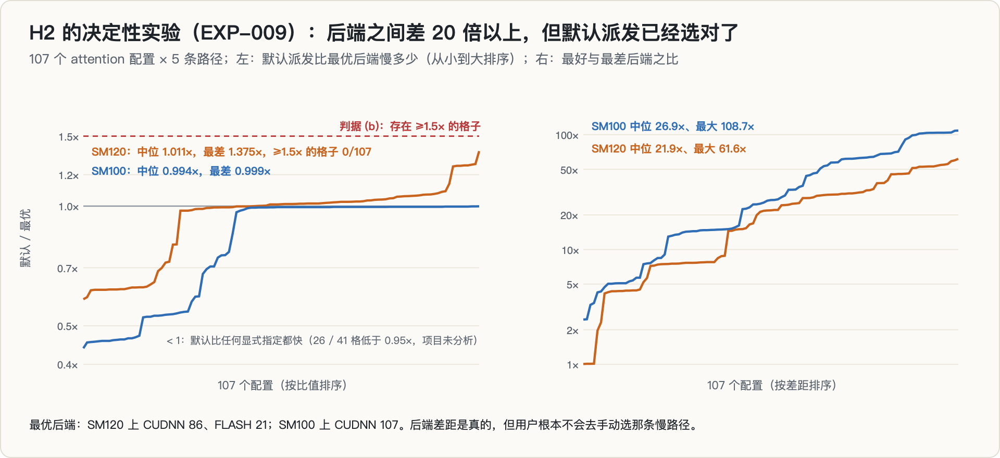

H2 只看了 3 个形状，于是预注册了一个更硬的版本 H2b：107 个配置（batch × GQA 比例 × head_dim × KV 长度 × decode/prefill），每个配置跑默认派发和 4 个显式后端。两条判据都要过：(a) 非主导后端胜出 ≥ 15%；(b) 存在默认派发比最优后端慢 ≥ 1.5 倍的格子。

- (a) 过了：CUDNN 赢 86 个，FLASH 赢 21 个（19.6%）；
- (b) 没过：默认派发比最优后端**中位只慢 1.1%，最差 1.375 倍，0/107 个格子达到 1.5 倍**。

后端之间确实差 20–60 倍，但 PyTorch 的默认派发已经替用户避开了慢路径。「选错后端要付几倍代价」字面上是真的，实践上是空的：没有人会手动去选 EFFICIENT 或 MATH。**H2 撑不起论文主线。**

还有一个项目没分析的现象：SM120 上 26 个、B200 上 41 个格子里，默认派发比任何一个显式指定的后端都快 5% 以上。我没有去追。

---

## 8. 实验三：「NVFP4 对 M 完全平坦」与归因缺口

修好尺子以后，项目把注意力集中到 decode 区间的 NVFP4 上。

**v3 的读数**（N=K=4096，M=1，5090）：BF16 1.27 TFLOPS，访存达成率 84.7%；FP8 1.23，41.0%；NVFP4 1.08，20.3%。精度每降一档，达成率几乎等比例塌掉，绝对吞吐不升反降。

**EXP-010（M 扫描）**：同一个形状上把 M 从 1 扫到 256，NVFP4 的耗时一直在 20.06–20.37 µs 之间，**对 M 完全平坦**；BF16 则从 22.87 µs 涨到 48.42 µs。按字节折算，NVFP4 的有效带宽只有实测带宽的约 28%，BF16 是约 98%。

**EXP-013（相位化 + 独立复现）**：把扫描做成正式相位、repeat 提到 40，与原来的临时脚本吻合到 2% 以内。NVFP4 的 M_flat（耗时比 M=1 涨不到 25% 的最大 M）是 512，也就是测到量程上界还是平的，全程极差 2.3%；BF16 的 M_flat 是 64，极差 265%。

这看起来像一个干净的机制：**FP4 kernel 被某个与 M 无关的固定成本卡住，根本没进入「搬权重」的工作状态；而 SM120 恰好缺 TMEM。** 但项目当天就写下了它的承重缺口：本机只有 SM120，**无法区分**「这是 SM120 的架构限制」和「这是 NVFP4 kernel 还没针对 SM120 优化」。后者正是 vLLM 文档里现成的解释。

接下来两件事是在同一个下午发生的：

1. 09-23 14:09，`TOPIC_GATE.md` 立起来，第一条就是归因闭合（§2.4）；
2. 半小时后发现，红名单上的「另一代 GPU」**是可以买的**：B200 在云上按小时租，全矩阵约 2 机时。于是写了 `RENTAL_PLAN.md`、部署脚本和 `compare_arch.py`，X-1 到 X-4 在开机前冻结（§5）。

**开机前抓到的一个 bug（EXP-014）**：tcgen05 探测原来只试基线 target（`sm_100`）。但 ptxas 区分 `sm_100` 和带 `a` 的 `sm_100a`，tcgen05 只在后者上可用。如果带着原脚本去跑 B200，会得到「SM100 也不支持 tcgen05」，X-1 就判反了。修法是两个 target 都试。修完在本机交叉编译验证：`sm_120` 和 `sm_120a` 都拒绝，`sm_100a` 接受。

---

## 9. 实验四：租一小时 B200（EXP-015）

### 9.1 机器与一跑下来的样子

租来的是一台云上容器：B200，compute capability 10.0，148 个 SM，182,624 MiB 显存，driver 595.91.07，CUDA 12.8。bootstrap 脚本在上面装的是 **torch 2.11.0+cu128 + triton 3.8.0**，和本机的 torch 2.12 + triton 3.7.0 **不是同一套工具链**（这一点项目当时没注意，预印本里还写成了 PyTorch 2.12）。从第一条到最后一条 trace 只用了 8 分钟。

### 9.2 X-1、X-2：确认

- **X-1**：B200 上 `sm_100` 拒绝、`sm_100a` 接受 tcgen05；SM120 两个 target 都拒绝。**指令集层面的门控坐实。** EXP-014 的修复在这里救了一次：只试基线 target 的话，B200 也会返回 False。
- **X-2**：同一个 MXFP4 调用在 B200 上通过，在 SM120 上报 `only supported ... for B200/B300`。**「不能」（指令集）和「不让」（框架）的分界坐实。**

### 9.3 X-3：第一个信号是 BF16 也平了

B200 上的 gemm 相位首先没过自己的质量门：52.1% 的测点不稳定。selftest 的拷贝带宽 CV 也有 15%，判定为 CHECK（本机是 PASS）。然后 M 扫描给出了决定性的信号：**在 N=K=4096 上，B200 连 BF16 都对 M 平坦到 512。** B200 的带宽是 6.4 TB/s，33.5 MB 的 BF16 权重纯搬运只要 5.25 µs，实测却是 13.79 µs。整个扫描区间都在固定开销的地板里。

测试形状是按 1.5 TB/s 的机器挑的，放到 6.4 TB/s 上就太小了。于是两台机器当场补跑了递增的问题规模（N=K ∈ {4096, 8192, 16384}，repeat=40）：

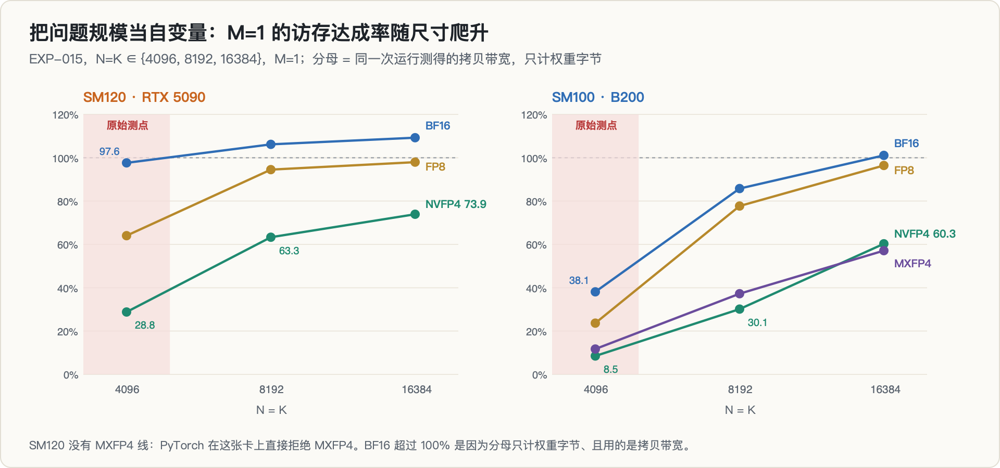

| N=K | 架构 | BF16 | FP8 | **NVFP4** | MXFP4 |
|---|---|---|---|---|---|
| 4096 | SM120 | 97.6% | 64.0% | **28.8%** | 被框架拒绝 |
| 4096 | SM100 | 38.1% | 23.7% | **8.5%** | 11.7% |
| 8192 | SM120 | 106.2% | 94.5% | **63.3%** | 被框架拒绝 |
| 8192 | SM100 | 85.8% | 77.7% | **30.1%** | 37.2% |
| 16384 | SM120 | 109.3% | 98.0% | **73.9%** | 被框架拒绝 |
| 16384 | SM100 | 101.1% | 96.5% | **60.3%** | 57.1% |

（M=1；分母是同一次运行里测得的拷贝带宽，只计权重字节。SM120 这一列项目登记的是 28.9 / 63.6 / 74.3%，因为用了另一次运行测的 1503.1 GB/s。BF16 超过 100% 是因为分母只计权重字节，而且用的是拷贝带宽，偏保守。）

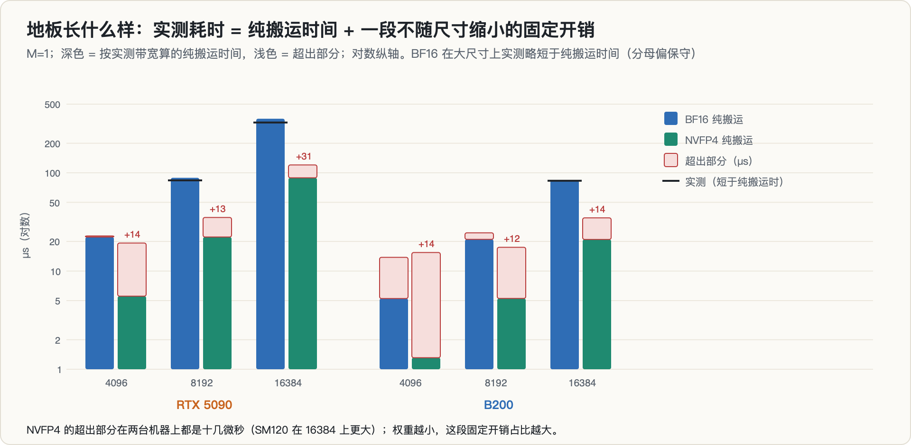

把实测耗时拆成「纯搬运 + 超出部分」，NVFP4 的超出部分在 B200 上是 14.1 / 12.2 / 13.8 µs，在 5090 上是 13.7 / 12.9 / 31.3 µs。N=K≈4096 大致是 4B–8B 模型单层投影的尺寸，在这个尺寸上，这段固定开销支配了总耗时。

### 9.4 判决

按开机前冻结的判据，在判据规定的测点（N=K=4096、M=1）上：

- X-3(a)：B200 的 NVFP4 达成率 **8.5% ≤ 40% → 证伪**；
- X-3(b)：B200 的 NVFP4 M_flat = **512 ≥ 256 → 证伪**。

要说明的是，判据测点本身（B200、4096、NVFP4、M=1）在 M 扫描里被标成了「不稳定」：同一次扫描的 15 个 M 点里，NVFP4 有 13 个没过稳定性门。但它离 40% 的阈值差了将近 5 倍，不稳定改变不了判决。

低精度达成率塌陷**不是 SM120 特有的**；原来的「发现」是一个在单一问题规模上测到的地板。项目按预注册出口立即停止了这个方向，不投 MLSys 2027，同时撤回了两条结论：「NVFP4 只有约 20–28% 带宽效率」和「NVFP4 耗时对 M 完全平坦」是架构证据。花费大约 1 小时 B200 机时。

当时项目还多写了一句：在两台机器都真正进入访存界的 16384 上，SM120 的 NVFP4（74%）反而**高于** SM100（60%），出现「跨架构反转」。这是判据之外补测出来的，三天后被证明只是分母的产物（§10.4）。好在判决并不依赖它：在判据规定的测点上，两条 X-3 判据都落在证伪区，而且换任何分母都还在证伪区（B200 在 4096 上换成只读带宽也只有 9.9%）。

### 9.5 一个本来 24 秒就能发现的错误

回头看，最该记住的不是「没有 B200 所以归因不了」，而是：**从 EXP-006 到 EXP-013，所有结论都建在同一个问题规模 N=K=4096 上，从头到尾没做过规模敏感性检查。** 这件事不需要任何我没有的东西。5090 上三个规模的 M 扫描，从第一条到最后一条 trace 只用了 24 秒。

`TOPIC_GATE.md` 当天加上了 X7：**单一参数点不构成测量**。任何「在配置 C 上测到现象 P」的结论，都必须在至少一个正交维度上扫过量程，证明 P 不是 C 的伪影；尤其要检查当前取值是否落在某个「地板区」（launch 开销、L2 容量、tile 量化、最小 batch）。

---

## 10. 第二次生命：「99 KiB 的代价」是怎么被自己拆掉的

### 10.1 为什么还要再试一次

终止之后第二天（09-25），我把能留下来的东西写成了一篇博客草稿和一篇预印本。预印本有四条贡献：(1) 指令集门控与框架门控的能力面；(2) **把 B200 限制到 SM120 的 99 KiB 预算，Triton BF16 GEMM 的最优吞吐从 1353.3 降到 1009.9 TFLOPS，损失 25.4%**；(3) 低精度 GEMV 的问题规模陷阱；(4) 原假设被证伪这个阴性结果。

同一天，选题门的第 6 步被拆成了两问：(i)「我这个具体主张是否已被发表」可以直接判死，(ii)「这个领域是否拥挤」只作风险权重、不判死。按新规则重判，预印本看起来又活了。

### 10.2 两轮撞车核验：每一条都收窄

- **第一轮（只读摘要，09-25）**：贡献 (1) 降级。2608.11693 已经提出「一种量化格式能不能用，是整条软件栈的性质，而不是模型或规格表的性质」，我们只是这个命题在另一条轴上的又一个实例。贡献 (2)(3) 判为「干净」。
- **第二轮（读全文和工程渠道，09-26）**：两个「干净」都过宽。99 KB 这个常数，2507.10789 已经实测过（GB203 约 99 KB/SM，GH100 约 227 KB/SM），zartbot 的 SM120 表征也写了；「单一规模会误导、roofline 看不见」这个命题属于 2605.29752；「host 侧固定开销支配 decode」属于 2603.12465，2512.02189 在 B200 上也写过一句。另外，我们的 74% 只是 **PyTorch 默认派发路径在 M=1 上的达成率**，调优过的 CUTLASS kernel 在 SM120 的大方阵上报过 80.7%（zartbot）和 83%（Colfax Part 2），不能写成 SM120 的 FP4 上限。
- 这一轮还抓到一个**编造的细节**：第一轮核验写「zartbot 把 SM100 验证列为它自己的 future work "Direction 01"」，全文根本搜不到。它来自一次网页摘要，没回原文核实就写进了文件，还向我转述过两次。作废。

### 10.3 PREREG_TMEM 与 C-pre：租第二次之前，先在本机拆自己

剩下的 headline 只有 25.4%。它有一个明显的反驳：Triton 生成的是 `mma.sync` 路径，用不上 TMEM，那 25.4% 会不会只是 Triton 的性质？于是 09-26 冻结了 `PREREG_TMEM.md`：租 B200 用 CUTLASS 的 tcgen05 路径做对照，承重量是 $R = T_{99} / T_\text{free}$，≤ 0.85 说明 headline 跨框架成立，≥ 0.95 说明是 Triton 伪影，中间则两个框架并报。租卡前要先在本机做完三项 C-pre 检查。结果它们先把 headline 拆了：

- **C-pre-1：记账公式差一。** 读 135 个配置编译后的实际 smem，135/135 精确满足 $(NS-1) \cdot BK(BM+BN) \cdot 2$，而项目一直用的是 $NS \cdot BK(BM+BN) \cdot 2$。后果：能装进 SM120 的配置从 55 个变成 76 个，能装进 SM100 的从 98 个变成 111 个，「SM100 能开、SM120 开不了」从 **43 个变成 35 个**；5090 的最优从「72 KiB」变成 48 KiB。更糟的是，`phase_smem` 在公式判定超限时直接 `continue`，**21 个其实装得下的配置从来没被尝试过**，trace 里的失败原因写的是 `exceeds_device_smem_predicted`。
- **C-pre-2：规模陷阱打在自己身上。** 在 5090 上用实测记账扫三个规模：

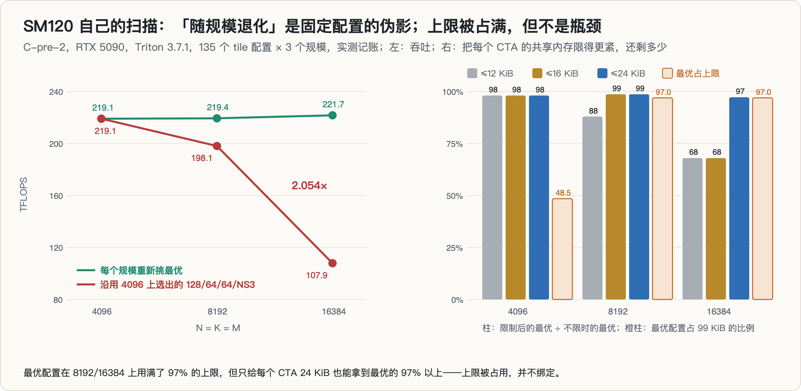

  每个规模重新挑最优，吞吐几乎持平（219.1 → 219.4 → 221.7 TFLOPS）；沿用 4096 上选出的配置，则看起来「随规模腰斩」（219.1 → 198.1 → 107.9），在 16384 上差了 **2.054 倍**。预印本 §4.3 批评别人的单点测量，§4.2 自己就是单点测量。同时，最优配置占 smem 上限的比例从 4096 的 48.5% 升到 8192 / 16384 的 97.0%。至于 25.4%：$T_{99}$ 是从公式放行的 55 个配置里挑的（实测能装 76 个），$T_\text{free}$ 是从 98 个里挑的（实测 111 个），两端都被同一个差一截断，**净方向都说不准，这个数没有立足点了**。
- **C-pre-3：两个 cache 区制。** `phase_smem` 没用轮转缓冲，而 4096 的 A+B+C 工作集是 96 MiB：在 B200 上是 L2 的 0.76 倍（完全驻留），在 5090 上正好 1.00 倍。**跨架构比较横跨了两种 cache 区制。**
- **C-pre-4：TMEM 对照在预算内不可行。** CUTLASS 的 Python DSL 在 SM120 上 0.09 秒就能 JIT 编译、数值正确，`tcgen05` 模块里有 144 个原语，但**没有成品的 GEMM kernel**。要在 B200 上跑一个可控 tile、可读 smem 的 tcgen05 GEMM，得从零手写，是数天的活，40 分钟的硬上限会在开机后立刻触发。于是 C1 延期，记为「未建立」。

这一轮还做了三次「性能机制」尝试：「大 tile 更快」只在 ≥ 8192 成立；「NS=2 没有双缓冲所以慢」在 4096 成立、到 16384 反转；「周长定价会把最优推向方形 tile」反转得最彻底，强度最高的 256×256 方形在两端都只有最优的 39%。于是项目把主张收缩到**分配层**（编译器算出来的 smem 用量这类确定性事实），性能只报测量、不附机制。

### 10.4 v2、分母、标题：三次翻案

09-26 中午，预印本以「周长律」为脊梁重写成 v2，标题叫 *One Budget, Two Blackwells*。接下来一天半里，它被连续翻了三次。

**分母（DENOM，09-27）。** roofline 的分母一直是拷贝带宽，其实 `bw` 相位每次也测了只读（归约）带宽，只是没被聚合进分母。两种带宽之比在两种架构上**符号相反**：B200 上只读比拷贝低 14%（0.86），5090 上高 5%（1.05），而且随缓冲大小剧烈变化。

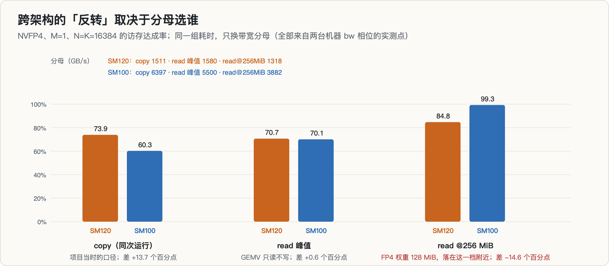

同一组耗时，只换分母：拷贝带宽下 SM120 领先 13.7 个百分点；只读峰值下几乎相等（+0.6）；FP4 权重是 128 MiB，落在 64–256 MiB 那一档，用 256 MiB 缓冲的只读带宽，**反转直接翻过来**（−14.6）。「跨架构反转」撤回。

**标题（SPINE，09-27）。** 查 CUDA 计算能力表：

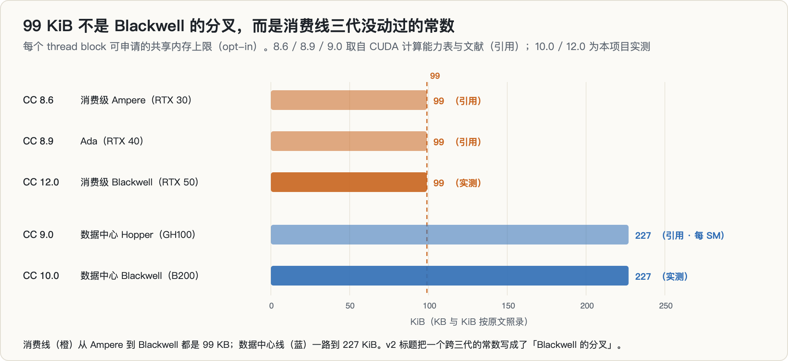

每 block 可申请的 smem，CC 8.6（RTX 30）、8.9（RTX 40）、12.0（RTX 50）都是 99 KB（引用）。**99 KiB 是消费线从 Ampere 起三代没动过的常数，不是 Blackwell 的分叉。** 标题错了，改成 *The Cap Didn't Move, the Kernels Did*（上限没变，是 kernel 变了）。同一天还承认，周长代数是教科书内容，贡献只剩实测系数 $NS-1$、在 99 KiB 下的界，以及 48.5% → 97.0% 这条轨迹。

**脊梁（VERDICT，09-28 本地日期）。** 最后一轮是一次完整的外部核验：另一个 AI 会话调了 10 个只读子代理，分别读教科书、Triton 源码、工程渠道和会议全文。结论是现稿不成立：

- $NS-1$ 系数是 Triton 流水器在同步 MMA 目标上的既有规则；sglang 的 PR #28038 已经给出了逐字节相同的估算式，并在一张 SM120 的 RTX PRO 6000 上验证过；gemlite 从 2026 年 3 月起也在用 `max(NS-1, 1)`。周长代数属于 Volkov & Demmel 和 Goto & van de Geijn。
- 「上限绑定」的解读被**自己的 trace** 反驳：只给每个 CTA 24 KiB，在 16384 上就能拿到最优的 97.2%（8192 上 16 KiB 就到 98.7%）。上限是被**占满**了，不是**绑住**了。而 97.0% 只是网格里所有分配量（都是 4 KiB 的整数倍）在 101,376 以下能取到的最大值 98,304。
- 所有 SM100 侧的分配数字（「128 KiB 最优」「111 个装得下」「35 个独占」）都是把 SM120 上实测的规则**移植**过去的。B200 上从没记录过实际分配；按 Triton 源码里 SM100 路径的流水规则，可能是另一回事。PREREG_TMEM 的前提「Triton 用不了 TMEM」也不对：Triton 3.7.1 / 3.8.0 在 cc 100–119 上会选 tcgen05 路径（MMAv5）。
- 25.4% 本身取决于这个没测过的记账方式：

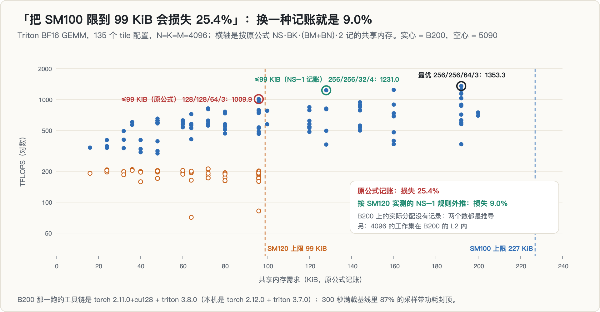

  按原公式是 25.4%，按 $NS-1$ 外推只有 9.0%。再加上 B200 那一跑工具链不一致、测点在 L2 里，以及 300 秒满载基线里 87% 的采样带功耗封顶（持续 1597 MHz，档位上限 1965 MHz）。
- 「没有人把两种 Blackwell 互比」也不对：2604.23466 在同一套 harness 下跑过 RTX PRO 6000（sm_120）、B200 和 H100 上的 Triton 与 cuBLAS GEMM，并写明 sm_120 较小的 smem 限制了 tile 大小和双缓冲。只剩「把 SM100 限到 99 KiB」这个反事实还没人发表，而我们的数据恰好测不准它。

建议是放弃现稿，迁移到一个新问题（固定的 smem 上限在多大的每 SM 操作数字节需求下开始吃掉吞吐），先跑一个单卡杀伤实验。这个迁移方案只写了计划，**没有执行**。第二次生命到此结束。

---

## 11. 死因

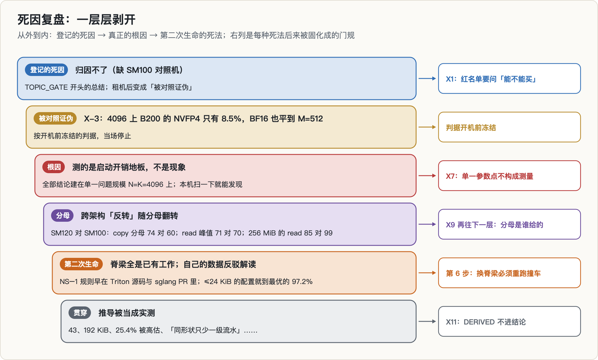

一层层剥开：

1. **登记的死因：归因不了。** 选题门给的定性是「测出来了但归因不了（缺 SM100 对照机）」。这一条后来被「买对照机」解决了。
2. **正式的死法：被对照实验证伪。** 冻结的 X-3 两条判据，在判据规定的测点上都落进证伪区。按出口规则当场停止，没有调阈值、没有「再换个角度试试」。
3. **真正的根因：测的是地板，不是现象。** 全部结论建在一个恰好落在固定开销区的问题规模上。低精度字节少，所以最先掉进地板；「精度越低达成率越低」在地板里是自动成立的。这个错误不需要任何额外硬件就能发现。
4. **第二次生命的死法：撞车，加上自己的数据反驳自己的解读。** 脊梁上的每条主张都已经在教科书、Triton 源码或工程渠道的 PR 里；「上限绑定」被自己 trace 里的 97.2% 反驳；标题把一个三代常数写成了代际分叉。
5. **贯穿始终的：把推导当实测。** 「43 个配置」「SM100 最优 192 KiB」「25.4% 被高估」「SM120 能跑同一个 tile、只少一级流水」都是从公式或单边推理得来的，每一条被实测后都变了。

用专栏的分类说：第一次生命是**被数据证伪**，第二次是**撞车**。两次的共同点是：决定生死的证据都是我自己已有、或者几分钟就能拿到的，只是没有先去拿。

---

## 12. 悬崖死后：这个目录又当了几天选题基地

终止之后，`~/mlsys_sm120_cliff` 没有被关掉，反而成了接下来几天选题的工作台。这里只列一下试过什么、怎么死的，细节在范文 §4 的选题漏斗里：

- **EVT 粒度**（09-24）：用极值吸引域解释 block 缩放格式的最优粒度。首轮 15 分钟的实测支持它，撞车核验第三条就撞上 ICLR 2026 的 *Is Finer Better?*，那篇已经把理论、实验和新格式都做了。前后约 45 分钟。
- **驾驶重建的评估效度**（09-24）：换到视觉方向，四条撞车核验后框架被四篇论文分别占据，只剩「单目行车记录仪这个采集模态」一条窄缝，没有继续。
- **KV 复用**（09-25）：两个候选（「名义节省 vs 实际节省」审计、KV 能耗账）分别撞上 MLSys 2025 的 2503.24000 和 HotCarbon 2026 的工作。
- **能力面反推 / 全景扫描 / agent 方向 / RSI**（09-25）：异构消费级多卡被 2606.29708 占了；SM120 表征被 zartbot 占了；agent 方向效率和可信度两条线都饱和；「SM120 FP4 路径的可寻址空隙」死于 X5，因为我们的 74% 的基线只是 PyTorch 默认路径。
- **一次完整的门规运行**（09-25）：10 个候选，0 个干净过门。其中第 9 号「相似律 / 硬件风洞」后来按 (i)/(ii) 规则重判存活，另起目录做了（[本专栏第 8 篇](../llm-serving-similitude/)）；同一天这里还写了在 SM120 上装 verl 的可行性评估（[第 7 篇](../verl-on-sm120/)）。
- **KV 准入**（09-29）：候选的撞车不在方法层，在 framing 层（PrefixPlace、Marconi、KVServe）；第三方 AI 给的「收窄一级」版本逐项对上 CacheFlow 的动机段。选题门因此加了一条：把死掉的 framing 收窄一级救不活它。
- **质疑门本身 → 反推**（09-29）：先承认「找未被占的题」这条路在结构上已经关闭，「4 张 SM120」也不是资产；改成在已被占的题上找证据最薄的一环，最后反推出 [投机解码 × RL 失配](../spec-decoding-rl-mismatch/)，也就是专栏的第 9 篇。

---

## 13. 真的部分

下面这些测量本身是有效的，可以复用：

1. **指令集门控 vs 框架门控的第一手对照**：ptxas 两个 target 的结果（`sm_120` / `sm_120a` 拒绝，`sm_100a` 接受），MXFP4 在 SM120 上被 PyTorch 拒绝、在 B200 上放行。结论并不新（2507.10789、2608.11693），但证据是第一手、可复现的。附带一个坑：**只试基线 target 会得到假阴性。**
2. **PyTorch 默认 SDPA 派发在两种架构上都已近乎最优**：107 个配置，0 个格子慢到 1.5 倍（SM120 中位 1.011，SM100 中位 0.994）。
3. **低精度 GEMV 的固定开销**：M=1 时 NVFP4 每次调用多出十几微秒（B200 12–14 µs，5090 13–31 µs），在 N=K=4096 这种「典型层尺寸」上支配总耗时。在这个尺寸上做低精度 decode 基准，测到的是开销，不是格式。
4. **SM120 上 Triton BF16 GEMM 的调优结论**：每个规模重新挑最优，吞吐在 219–222 TFLOPS 之间几乎持平；沿用一个规模上选出的配置，最多差 2.05 倍。同一张卡上 cuBLAS（`torch.matmul`，EXP-016 的本机 dry-run，带轮转缓冲）是 219.2 / 224.8 / 224.1 TFLOPS，同一个量级。
5. **拷贝带宽与只读带宽之比随架构和缓冲大小变化很大**（B200 0.52–0.86，5090 0.83–1.05）。拿拷贝带宽当 GEMV 的分母，跨架构比较时要格外小心。
6. **测量台**：区间内循环 + 轮转缓冲防 L2、稳健离散度质量门、实测峰值当分母、读 throttle 原因判满频，一条命令部署到云上任意架构。
7. **记录本身**：预注册、20 条判据变更登记（13 条 + EXP-016 的 7 条）、多次撤回、只追加的 trace、包括所有失败路径的完整异常。

---

## 14. 过程中的错误与更正

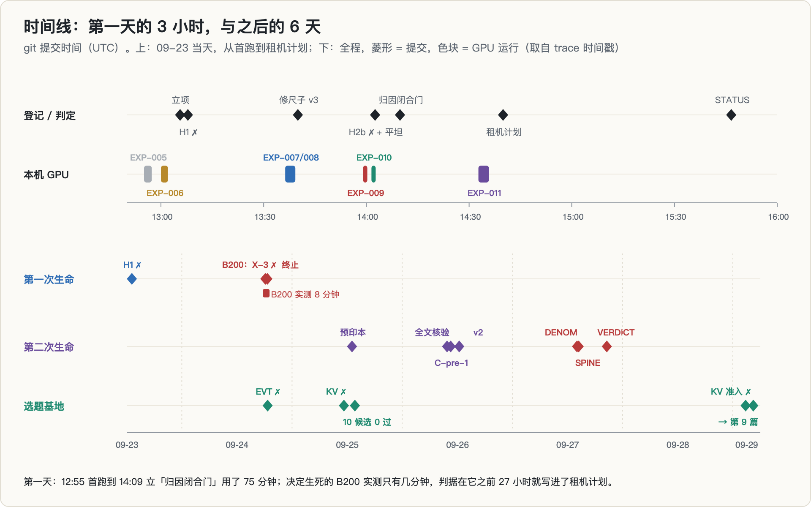

| 错误 | 后果 | 怎么发现的 | 处理 |
|---|---|---|---|
| smoke（repeat=8、机器上另有进程）当成 H1 的 teaser | 「NVFP4 在 decode 比 BF16 还慢」 | EXP-006 清场复测 | 撤回；但见 §6.5，修好计时后又测到 0.85，这个点本身在地板里 |
| 用 boost 档位上限 3150 MHz 当满频分母 | 「全程未达满频」 | EXP-008 满载基线 | 撤回；改读 throttle 原因 |
| 大 M 用纯访存上限当 roofline 分母 | 「BF16 达成率 9%」这类无意义数字 | EXP-006 判读 | 分母改为 min(强度 × 带宽, 实测峰值) |
| H2 只看 3 个形状，而且「< 50%」只对一组形状成立 | 「选错后端付几倍代价」 | EXP-009 的 107 个配置 | H2 放弃；区间问题是写这篇时发现的 |
| tcgen05 探测只试基线 target | 会在 B200 上把 X-1 判反 | EXP-014（开机前） | 两个 target 都试 |
| 全部结论建在 N=K=4096 一个规模上 | 「NVFP4 只有 20–28% 带宽效率」「对 M 平坦」被当成架构证据 | B200 上 BF16 也平 | 撤回；立 X7 |
| M 扫描 repeat=15 | BF16@M=8 测成 57.9 µs（真值 24.0） | 与独立实现对照 | repeat 定死 ≥ 40 |
| smem 记账用 NS 而不是 NS−1 | 「43 个」「72 KiB」「SM100 最优 192 KiB」；21 个配置从未被尝试 | C-pre-1 读编译产物 | 改为 35、48 KiB；SM100 侧仍是推导 |
| 「差一只是化妆性的」（只在 4096 上验证） | 低估了截断的影响 | C-pre-2 的三个规模 | 撤回 |
| 「25.4% 被高估」（只算了一边） | 方向判断错误 | 外部审阅（另一个 AI 会话） | 改为「没有立足点」 |
| 「SM120 能跑 SM100 的最优 tile、只少一级流水」（从公式推的） | 以为找到了机制 | 实测：47.7 TFLOPS，只有同卡最优的 21.8% | 「能分配，但没用」 |
| 跨架构「反转」74 > 60 | 预印本贡献 (3) 的剩余一半 | DENOM 换分母 | 撤回 |
| DENOM 称 16384 那一行「无法从 trace 复现」 | 会让人以为数据有问题 | **写这篇时核对**：它来自 msweep 相位的 M=1 点，不在 gemm 相位 | 可以复现，偏差 ≤ 0.4 个百分点（分母取值不同） |
| 编造的引用细节「Direction 01」 | 撞车核验的论据不实 | 全文检索 | 作废 |
| 「没有人把两种 Blackwell 互比」 | 高估新颖性 | VERDICT（2604.23466） | 撤回 |
| 标题把 99 KiB 写成 Blackwell 的分叉 | 核心叙事错误 | SPINE 查计算能力表 | 改标题，随后整篇放弃 |
| 把 triton#8182 的 131072 读成我们的 256/256/64/NS3 | 虚假的「野生佐证」 | VERDICT：那是另一个 kernel，已被维护者以 not a bug 关闭 | 撤回 |
| 预印本写 B200 用的是 PyTorch 2.12 | 工具链不一致被掩盖 | VERDICT 读 run.log | 实际是 torch 2.11 + triton 3.8 |

有两类错误值得多说一句。

第一类是**外部审阅本身出错**：评审会话提出过「25.4% 被高估」的反面（它说是只算了一边，对的），也提出过「同一个 tile 只少一级流水」（它自己标注了是推导，要求先实测，实测后不成立）。和范文里遇到的情况一样，**每一条事实论断都要回到原文或 trace 核对，不管是谁提出的，包括我自己。**

第二类是**核验者自己的漏检**：DENOM 为了核对 16384 那一行，穷举了 gemm 相位的全部 196 行，没找到，于是写下「无法复现」。但那一行本来就来自 msweep 相位。核验也会犯「只看了一个看起来对的地方」的错。

---

## 15. 我学到了什么

1. **单一参数点不构成测量。** 结论依赖的每个数值参数（问题规模、batch、精度、repeat），都至少扫三个点、跨一个数量级。这件事在 5090 上只要 24 秒。
2. **测点的方向随测法翻转，就说明它在地板里。** 同一个点在七种测法下从 0.85 翻到 1.18。与其争论哪次测法对，不如把规模放大四倍再看。
3. **对照机可以买，但先把本机能排除的排除掉。** 租机器解决了 $A_1$，同时暴露了 $A_4$；而 $A_4$ 本来零成本。另外，租来的机器要和本机用同一套工具链，上机后先做满载基线。B200 那一跑 torch 和 triton 版本都不一致，5 分钟满载里 87% 的采样带功耗封顶，这些都削弱了它能回答的问题。
4. **判据冻结的价值，在于结果出来那一刻没有解释空间。** 但冻结判据之外补的测点（8192 / 16384、跨架构反转）要当探索性处理。本项目后来被撤回的，正是这部分。
5. **分母是主张的一部分。** 拷贝带宽还是只读带宽，按 CTA 算还是按 SM 算，公式记账还是实测记账，PyTorch 默认路径还是最好的公开实现。本项目在每一种分母上都翻过一次。
6. **推导不是实测。** 一天之内，六条推导出来的主张被实测改写。标成「推导」的东西，一次查询就能验；写成结论，就要由审稿人来验。
7. **撞车核验要读全文，要看工程渠道，而且脊梁一换就要重跑。** 决定性的证据在 Triton 源码、sglang 的 PR 和 CUDA 计算能力表里，不在会议论文的摘要里；v2 的新脊梁从头到尾没有过撞车核验。
8. **先用自己的数据反驳自己。** C-pre 零机时拆掉了 headline，省下一次租卡；VERDICT 用来否定「上限绑定」的 97.2%，就躺在我自己的 trace 里。
9. **「为什么只有我们能做」这句话本身要核验。** 4 张消费级 Blackwell 不是护城河：2507.10789、zartbot、2604.23466 都在做同一类测量。真正的资产是能快速、干净地证伪一个主张的纪律。

---

## 16. 局限与开放问题

**测过的范围**：RTX 5090 / 5080（SM120）；租用约 1 小时的 B200（SM100）；PyTorch 默认的 `_scaled_mm_v2` 路径，缩放全为 1、权重是随机字节；M = 1 到 512，N=K 从 4096 到 16384；135 个 Triton BF16 tile 配置；107 个 SDPA 配置。本机工具链为 torch 2.12 + triton 3.7.0（C-pre 阶段是 torch 2.13 + triton 3.7.1），B200 为 torch 2.11 + triton 3.8.0。

**没测过的**（结论不能外推到这些情形）：

- FP4 的数值正确性（缩放全为 1，没有验证 swizzle 布局下的数值）；
- 调优过的 CUTLASS / cuBLASLt FP4 kernel；H100（没有 FP4）；96 GB 的 RTX PRO 6000；
- 计划里的 E5（2 小时热浸泡）、E7（真实模型端到端）、E8（部署决策规则），一项都没做；
- B200 上 Triton 实际分配的 smem（没有记录 `metadata.shared`），以及关掉 tcgen05 路径（`DISABLE_MMA_V5`）的对照；
- 256/256/64/NS2 在 SM120 上只有 47.7 TFLOPS 的原因至今没有解释。外部核验给出的候选是寄存器溢出（256×256 在 8 个 warp 下每线程要 256 个累加寄存器，超过 255 的上限），也是推导，没测。

外部核验留下的开放问题是：固定的 smem 上限，在每 SM 的操作数字节需求达到多大时开始吃掉 GEMM 吞吐？如果要做，它必须作为**新问题**重新预注册，而不是拿来救这次的结论。

---

## 17. 复现

- **环境**：本机 Python 3.14.5、torch 2.12.0+cu13、triton 3.7.0、driver 580.173.02；C-pre 阶段 torch 2.13.0+cu130、triton 3.7.1、CUDA 13.0；B200 为 Python 3.12.14、torch 2.11.0+cu128、triton 3.8.0、driver 595.91.07、CUDA 12.8。triton JIT 需要的驱动 API 头文件和 `ptxas` 都随仓库一起提供，不向系统装任何包。
- **代码**：`bench_sm120.py`（相位 selftest / probe / bw / gemm / attn / attn2 / smem / msweep / capsweep / clockbase）、`smem_kernel.py`（Triton 分块 GEMM）、`run_primary.sh`（主矩阵串行）、`deploy_remote.sh` + `remote_bootstrap.sh`（一条命令部署到云上）、`compare_arch.py`（自动判 X-1..X-4）、`cpre1_smem_probe.py`、`cpre1b_resweep.py`、`cpre2_sizesweep.py`、`cpre3_cutlass_probe.py`、`exp016_rental.py`。
- **trace**：`traces/bench_sm120.jsonl`（本机，740 行）、`traces/remote_b200/traces/bench_sm120.jsonl`（B200，367 行）、`traces/quarantine/`（被隔离的首跑，不删）、`cpre1_smem_actual.jsonl`、`cpre1b_resweep.jsonl`、`cpre2_sizesweep.jsonl`、`cpre3_cutlass.jsonl`、`exp016_dryrun.jsonl`。全部只追加。
- **记录**：`EXPERIMENTS.md`（EXP-001..015 和 4 个 bug）、`reports/amendments.md`、`PREREG_TMEM.md`、`CPRE1..4_FINDING.md`、`DENOM_FINDING.md`、`SPINE_FINDING.md`、`VERDICT_2026-09-28.md`。关键提交：立项 `b95e692`，EXP-006 `2fc9eff`，B200 判决 `54b46ed`，终止 `0fd71b4`，SPINE `5910793`，VERDICT `6cee6c7`，共 73 个提交。
- **本文的图**：一个只用 Python 标准库的脚本直接从上面这些文件生成（SVG 再转 PNG），数字不经手抄。

---

## 参考

- Blackwell 微基准：[arXiv 2507.10789](https://arxiv.org/abs/2507.10789)（RTX 5080 vs H100）、[arXiv 2512.02189](https://arxiv.org/abs/2512.02189)（B200 vs H200）、[arXiv 2604.23466](https://arxiv.org/abs/2604.23466)（RTX PRO 6000、B200、H100 同一 harness）、[arXiv 2605.04178](https://arxiv.org/abs/2605.04178)（B200 解析模型）
- 量化格式的可用性是整条栈的性质：[arXiv 2608.11693](https://arxiv.org/abs/2608.11693)
- 单一规模会误导：[arXiv 2605.29752](https://arxiv.org/abs/2605.29752)；host 侧开销分解 TaxBreak：[arXiv 2603.12465](https://arxiv.org/abs/2603.12465)
- 量化表征与消费级 Blackwell 部署：[arXiv 2508.16712](https://arxiv.org/abs/2508.16712)、[arXiv 2605.00519](https://arxiv.org/abs/2605.00519)、[arXiv 2601.09527](https://arxiv.org/abs/2601.09527)、[arXiv 2603.08747](https://arxiv.org/abs/2603.08747)
- 工程渠道：Colfax Research 的 CUTLASS TMEM 教程，以及 SM12x NVFP4 blockscaled GEMM 系列（Part 1、Part 2）；zartbot《Dissecting the SM_120》；[triton-lang/triton #8182](https://github.com/triton-lang/triton/issues/8182)；[sgl-project/sglang PR #28038](https://github.com/sgl-project/sglang/pull/28038)
- 教科书：V. Volkov, J. Demmel, *Benchmarking GPUs to Tune Dense Linear Algebra*, SC 2008；K. Goto, R. van de Geijn, *Anatomy of High-Performance Matrix Multiplication*, ACM TOMS 2008
- 选题基地阶段撞上的工作：*Is Finer Better? The Limits of Microscaling Formats in Large Language Models*（ICLR 2026）、[arXiv 2503.24000](https://arxiv.org/abs/2503.24000)、[arXiv 2606.29708](https://arxiv.org/abs/2606.29708)、PrefixPlace [arXiv 2608.01655](https://arxiv.org/abs/2608.01655)、KVServe [arXiv 2605.13734](https://arxiv.org/abs/2605.13734)、CacheFlow [arXiv 2604.25080](https://arxiv.org/abs/2604.25080)
