> **TL;DR**
>
> - **问题**：NVIDIA NeMo RL 和 Qwen 都说，投机解码进入 RL rollout 后「不改变采样分布」。定理层面这没错。但在 GPU 上，投机解码的 verify pass 是一次「多位置」前向，普通 rollout 是「单位置」前向，两者走的 kernel 不同。我想知道：**开投机之后，rollout 与 trainer 之间的数值失配会不会变？**
> - **做法**：先写死判据（预注册），再在自有的 RTX 5090 / 5080 上做两层实验：纯 PyTorch 的机制实验，和真实 vLLM 引擎实验。
> - **结果**：**KILL**。判定轮（96 题 × 8 采样）里，开 / 关投机的失配比值是 **1.021、1.000、1.000**，95% 置信区间全部落在 [0.93, 1.09] 内。在我测的范围里，**投机解码对训练–推理失配的影响小到测不出来**，与 NVIDIA 和 Qwen 的断言一致；他们没给测量，现在有了。
> - **过程**：从提交预注册到判定轮跑完**不到两小时**。中途有三个信号差点把我带偏（smoke 的 2.5 倍、第一轮的 1.113、剔除离群后的 1.06–1.08），都被事先写死的门槛挡住了。
> - **附带**：几个没做撞车核验、因此不作主张的测量，包括「trainer 自己换个 batch 就能产生同量级的失配」和「极少数 token 上，不同数值路径对同一个 token 的判断相差可达 20 nat」。

---

## 0. 读法

这篇文章按一条完整的研究链路组织：

| 部分 | 内容 |
|---|---|
| 1–3 | 背景与动机：RL 里的两个引擎、「无损」到底保证了什么、为什么怀疑它在 GPU 上不成立 |
| 4 | 这个题是怎么来的：前面七个方向是怎么死的 |
| 5 | 预注册：在看到数据之前写死了什么 |
| 6–9 | 两层实验、一段插曲、一次错误诊断，以及最后的 KILL |
| 10–13 | 附带测量、全部错误与更正、教训、局限 |
| 14 | 复现 |

所有数字都来自实验 trace（append-only 的 JSONL），图也是从 trace 直接画出来的。标「探索性」的数字不参与判定。

---

## 1. 背景：RL 后训练里的两个引擎

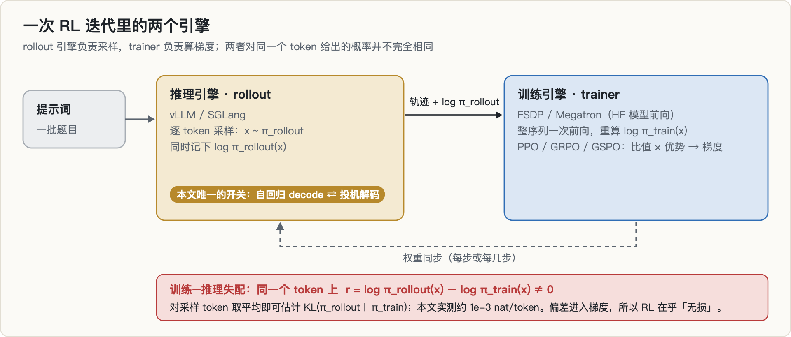

### 1.1 rollout 为什么慢，投机解码为什么被请进来

GRPO / PPO 这类 RL 后训练，每一步都要先让当前策略生成一大批回答（rollout），再用这些回答算梯度。生成是逐 token 的自回归过程，而且长尾很长，**rollout 通常占掉一步里的大部分时间**。

投机解码是现成的加速手段：一个小的 draft 模型先猜 K 个 token，大模型用一次前向检查它们，按拒绝采样决定接受几个。2026 年它已经进入主流 RL 栈：

- NVIDIA NeMo RL 的 [2604.26779](https://arxiv.org/abs/2604.26779)（GB200，EAGLE-3）；
- Qwen 的 Bebop [2606.12370](https://arxiv.org/abs/2606.12370)（SGLang + veRL，MTP）；
- 我装的 verl 0.9.1，rollout 配置里已经带了 MTP / EAGLE 选项。

它们都依赖同一个论断：**拒绝采样保证输出分布等于目标模型的分布，所以只提速、不改分布。**

### 1.2 训练–推理失配

RL 系统里其实有两份「策略」：

- **rollout 引擎**（vLLM / SGLang）按它算出来的概率 $\pi_\text{rollout}$ 采样；
- **trainer**（FSDP / Megatron，底层是 HF 模型前向）对同一批 token 重算概率 $\pi_\text{train}$，用来算比值和梯度。

两边用的是同一份权重，但 kernel、归约顺序、精度处理不同，所以对同一个 token 给出的概率并不完全相同。对每个采样 token 定义

$$
r(x) = \log \pi_\text{rollout}(x) - \log \pi_\text{train}(x)
$$

它的分布就刻画了失配。本文用 $k_3$ 估计量来度量平均失配：

$$
k_3 = e^{-r} - 1 + r \;\ge\; 0, \qquad \mathbb{E}_{x \sim \pi_\text{rollout}}[k_3] = \mathrm{KL}(\pi_\text{rollout} \,\|\, \pi_\text{train})
$$

**RL 为什么在乎**：策略梯度的无偏性取决于「样本到底从哪个分布采出来」。样本来自 $\pi_\text{rollout}$，目标却按 $\pi_\text{train}$ 计算，这就是离策略偏差。2025–26 年有一整串工作在对付它：截断重要性采样（TIS / MIS）、ByteDance 的 [VeXact](https://arxiv.org/abs/2605.14220)（把 rollout 做到与 trainer 逐位一致）、[CIS](https://arxiv.org/abs/2609.32444)（按置信度截断）、FP16 训练等。它们对付的量级大约是每 token 1e-3 到 1e-2 nat。

---

## 2. 投机解码的「无损」到底保证了什么

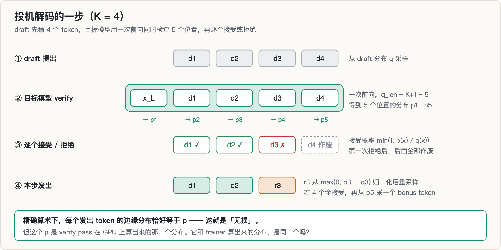

设目标模型在某个位置的分布是 $p$，draft 的分布是 $q$。draft 提出 token $x \sim q$，以概率 $\min(1, p(x)/q(x))$ 接受；拒绝时从残差 $\max(0, p - q)$ 归一化后重采样。于是：

$$
P(\text{发出 } x) = \underbrace{\min\big(q(x), p(x)\big)}_{\text{draft 被接受}} + \underbrace{\Big(1 - \sum_y \min(p(y), q(y))\Big) \cdot \frac{\max(0,\, p(x) - q(x))}{\sum_y \max(0,\, p(y) - q(y))}}_{\text{拒绝后重采样}} = p(x)
$$

因为 $\sum_y \max(0, p(y)-q(y)) = 1 - \sum_y \min(p(y), q(y))$，第二项恰好化简为 $p(x) - \min(p(x), q(x))$，两项相加就是 $p(x)$。**不管 draft 多差，发出 token 的边缘分布都精确等于 $p$。** 这就是「无损」。

但请注意这个 $p$ 是谁算的：**它是 verify pass 在 GPU 上算出来的那一个分布。** 定理保证的是「输出分布 = verify pass 的分布」，而不是「= trainer 的分布」。

---

## 3. 动机：两个已知事实 + 一个没人测过的断言

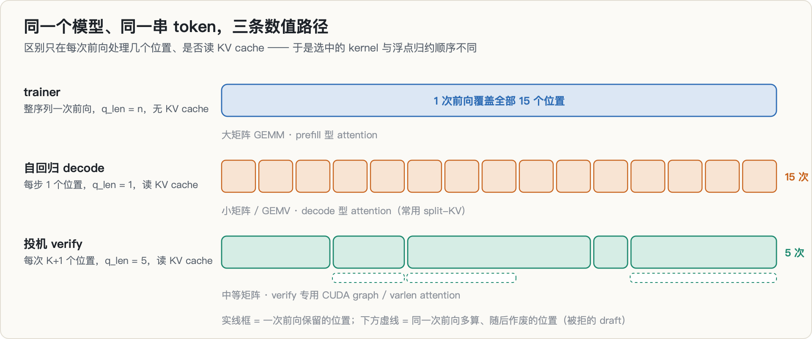

**🖼 怎么读这张图（本篇最该看懂的一张）**
>
> 三条路径**输入完全相同**——同一份权重、同一串 token——但走的算子不同：
>
> | 路径 | 怎么算 | 并行形状 |
> |---|---|---|
> | **trainer 一次前向** | teacher forcing，所有位置一次算完 | 整条序列并行 |
> | **自回归 decode** | 每次只算 1 个新位置，历史走 KV cache | 逐 token 串行 |
> | **投机 verify** | 一次算 $K+1$ 个位置 | 小批并行 |
>
> **三条路径在数学上应当给出同一个 logprob，在浮点下不会。** 原因是归约顺序不同：矩阵乘的累加次序随并行形状变化，而浮点加法**不满足结合律**。
>
> 所以本篇问的不是「有没有差异」（一定有），而是**「投机这条路径带来的额外差异，是否大于 decode 与 trainer 本来就有的差异」**。图里要盯的是**两两之间的差**，不是任何单条路径的绝对值。
>
> 这也解释了实验设计为什么必须**同时**跑三条：只比投机和 trainer，测到的差异里混着「自回归 vs 一次前向」这个本来就存在的成分，归因不了。

**事实 A：decode 路径与 prefill 路径的数值不同。** 这在工程渠道里早有记录：

- [vLLM #54035](https://github.com/vllm-project/vllm/issues/54035)：H100 的 FA3 kernel 在 decode 形状下用 `kBlockN=96`，在 prefill 形状下用 `kBlockN=192`，online softmax 的归约顺序因此不同。这个 issue 里有两类数字，**不能混着比**：
  - kernel 级（同一组 Q/K/V 直接调 `flash_attn_varlen_func`）：FP8 KV 下 28 个长度里 19 个不一致，最大差约 9.8e-3；BF16 下 28 个里 3 个，最大约 2e-3。
  - 端到端（FP8 KV，已开 batch invariance，生成 vs 整段重打分）：224 个 token 里 115–117 个不一致，最大 |Δlogprob| 约 0.50（英文 prompt）/ 0.40（中文 prompt）。
- AMD 的 [logprob 调试博客](https://rocm.blogs.amd.com/software-tools-optimization/logprob-debug/README.html)：在它的一个案例里，生成时记录的 logprob 与 teacher forcing 重打分相比，来自 prefill 的第 0 个响应位置平均绝对差只有 8e-6，来自 decode 的后续位置则是 0.10。
- [slime / Miles 的失配教程](https://github.com/zhaochenyang20/Awesome-ML-SYS-Tutorial/blob/main/rlhf/slime/mismatch/blog-en.md) 直接写出了机制：rollout 是逐 token 的小矩阵，训练是整序列的大矩阵。

**事实 B：verify pass 是 q_len = K+1 的前向。** 精确算术下，每个发出 token 的分布都等于 verify pass 算出的 $p$。

**断言 C：「投机解码不改变 RL 的采样分布」。** NeMo RL 的论文和研究博客都这么说，还专门拿它和「低精度 rollout 会引入失配」做对比；Bebop 也这么说。两者给出的证据都只有「开 / 关投机的验证曲线重合」，**没有报告逐 token 的失配**。

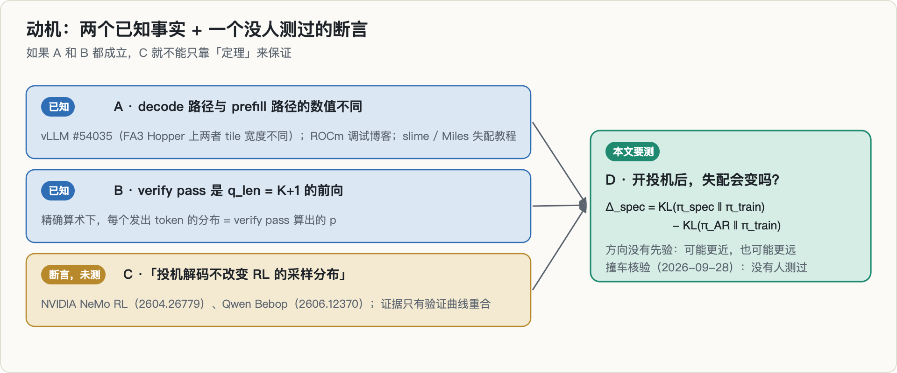

**推论 D**：如果 A 和 B 都成立，开投机就等于把 rollout 的采样分布从「decode 路径算出的 $p$」换成「verify 路径算出的 $p$」。它离 trainer 的距离可能变近（verify 更像 trainer 的整序列前向），也可能变远。我要测的就是

$$
\Delta_\text{spec} = \mathrm{KL}(\pi_\text{spec} \,\|\, \pi_\text{train}) - \mathrm{KL}(\pi_\text{AR} \,\|\, \pi_\text{train})
$$

**为什么这个量有决策价值**：

1. 如果开投机本身就让失配变小，那开了投机以后，也许就不必再为 batch-invariant kernel 付 10–20% 的吞吐；
2. GSPO 这类方法的裁剪区间是否被触发，取决于失配的绝对水平；
3. RL 投机解码论文用「验证曲线重合」论证等价，如果数值路径不同，这种比较就把「速度」和「失配」混在了一起。

撞车核验里（截至 2026-09-29），我查了 NeMo RL 论文与博客、Bebop 全文、VeXact 全文、CIS、verl 源码、slime / ServiceNow / ROCm 的工程博客、vLLM 的相关 issue，以及本地 400 篇候选论文的元数据，**没有找到测量过 $\Delta_\text{spec}$ 的公开工作**。

---

## 4. 这个题是怎么来的

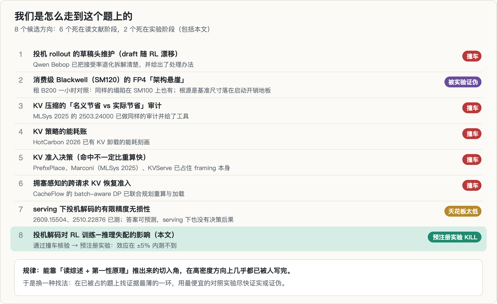

这是我这一轮选题的第八个方向。前七个的死法，本身就是这次实验设计的来源：

- **撞车最多**：KV Cache 方向从「审计」「能耗」「准入决策」到「拥塞感知的恢复准入」，每一次收窄，都能在最近几个月的论文里找到逐项对上的工作。最狠的一次是整个 framing（「命中不一定比重算快」）就写在 PrefixPlace 摘要的第二句。
- **一个教训**：**能靠「读综述 + 第一性原理」在一个下午推出来的切入角，在高密度方向上几乎都已被人写完**；把一个死掉的 framing「收窄一级」也救不活它，因为领域本身就是靠「收窄一级」前进的。
- **于是换了找法**：不再问「哪里有空白」，而是在已被占的题上找**证据最薄的一环**。第七个方向（serving 下投机解码的有限精度无损性）已经有两篇论文，但它们都停在 serving、贪心解码和轨迹匹配上。「无损」只有在 RL 里才真正有决策后果，所以我把问题搬到了 RL 的训练–推理失配上。

---

## 5. 预注册：在看到任何数据之前写死的东西

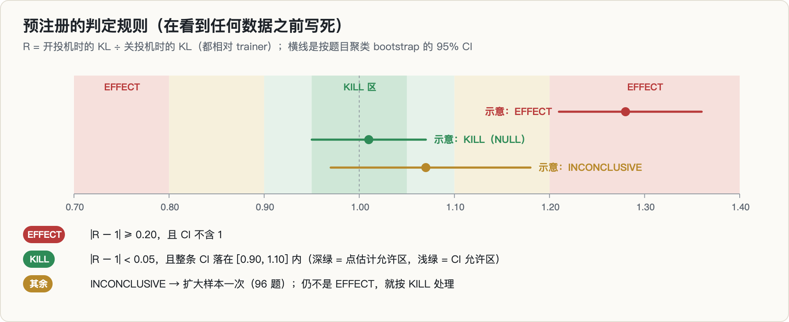

项目的第一个 git 提交就是预注册文件，**先于任何数据**。里面写死了：

| 项 | 内容 |
|---|---|
| 主指标 | 引擎层：$k_3$（上面的 KL 估计量）；HF 机制层：逐位置完整词表 KL |
| 主对比 | $R = $ 开投机时的 KL ÷ 关投机时的 KL |
| 置信区间 | 按题目聚类的 bootstrap，B = 10,000，固定种子 |
| EFFECT | $\lvert R-1\rvert \ge 0.20$，且 95% CI 不含 1 |
| KILL | $\lvert R-1\rvert < 0.05$，且整条 CI 落在 [0.90, 1.10] 内 |
| 其余 | INCONCLUSIVE → **扩大样本一次**（96 题）；仍不是 EFFECT，按 KILL 处理 |
| 自测 | CPU float64 下所有路径必须与 trainer 相差 < 1e-8，且两个故意放进去的 bug 必须被检出，否则不准跑 GPU |

之后的每一次判据变更都先写进变更记录（amendments），并注明「写的时候是否已看过相关数据」：

| 编号 | 内容 | 写时是否已看数据 |
|---|---|---|
| A-001 | 主处理组从 ngram 改为 draft_model（理由见 §7.2）；配置矩阵由引擎枚举决定 | 否（只看过枚举结果） |
| A-002 | 外部审阅后改写机制与后果的操作定义 | 否 |
| A-003 | 执行预注册的扩大样本；FLASH_ATTN 改为 eager 配对（**后来证明诊断错误**） | 是（第一轮结果） |
| A-004 | 撤回 A-003 的错误诊断；扩大样本移到 32 GB 的卡上完成 | 是（但不改阈值和主统计量） |

---

## 6. 实验一 M1a：纯 PyTorch 的机制实验

### 6.1 设计

M1a 只隔离一个变量：**每次前向处理几个位置**。轨迹是固定的，所以任何差异都只能来自数值路径。

- **数据**：前一个项目里 Qwen3-1.7B 基座策略 π₀ 在 48 道 GSM8K 式题目上采出的真实 GRPO rollout（T = 0.6），每题一条，响应长度 135–512。模型和 [2609.15504](https://arxiv.org/abs/2609.15504) 用的是同一个，方便对照。
- **路径**：trainer 整序列前向（参照）；自回归 decode（K = 0）；verify 形状（K = 1, 2, 4, 8，全接受 / 零接受 / 几何接受）；外加三个对照：trainer 重算一次、经 KV cache 的整段前向、trainer 与另外 3 条轨迹同 batch。
- **指标**：每个响应位置上，完整词表分布相对 trainer 的 KL，在 float64 下计算。
- **backend**：HF 的 `sdpa` 和 `eager` 两种 attention 实现；GPU 为 RTX 5090。

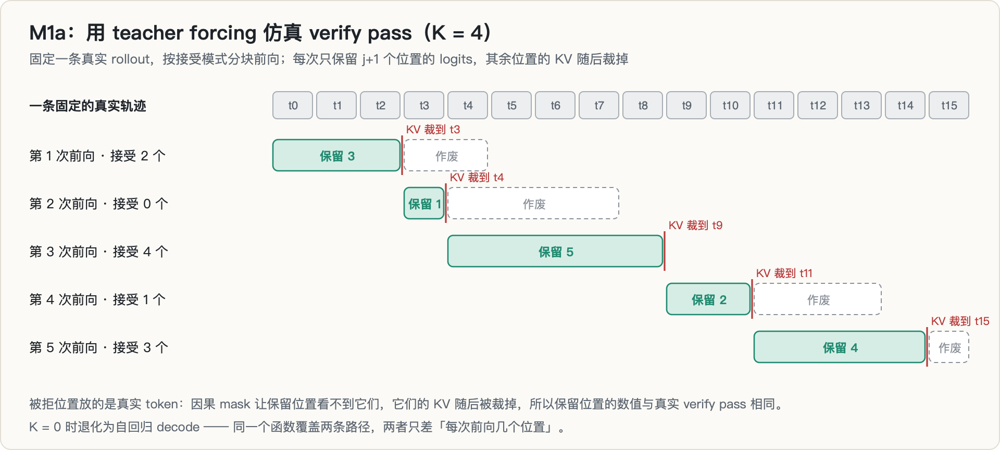

仿真 verify pass 时，被拒位置上放的是真实 token，而不是被拒的 draft。这不影响结果：因果 mask 让保留位置看不到它们，这些位置的 KV 随后也会被裁掉，而 GEMM 的各行彼此独立。K = 0 时这个函数就退化成自回归 decode，所以两条路径只差「每次前向几个位置」。

### 6.2 先证明仿真没有 bug

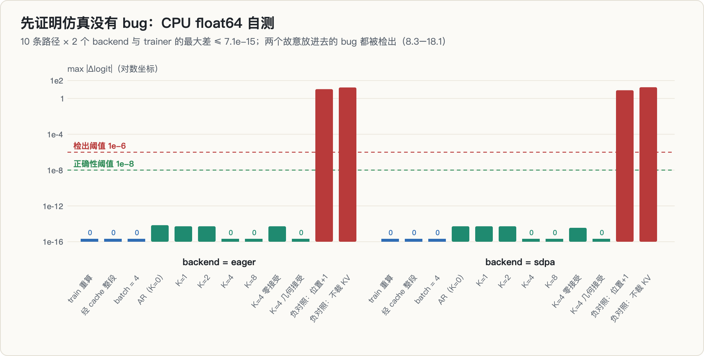

在 CPU 上用 float64 跑一个随机初始化的小 Qwen3：

- 10 条路径 × 2 个 backend，与 trainer 的最大差 **≤ 7.1e-15**；
- 两个负对照（位置偏移 1、不裁剪被拒位置的 KV），差值 **8.3–18.1**，全部检出。

正负两组相隔约 15 个数量级。所以 GPU 上看到的任何差异都只能来自 BF16 数值，不可能来自仿真逻辑。

### 6.3 结果：G1a = NULL

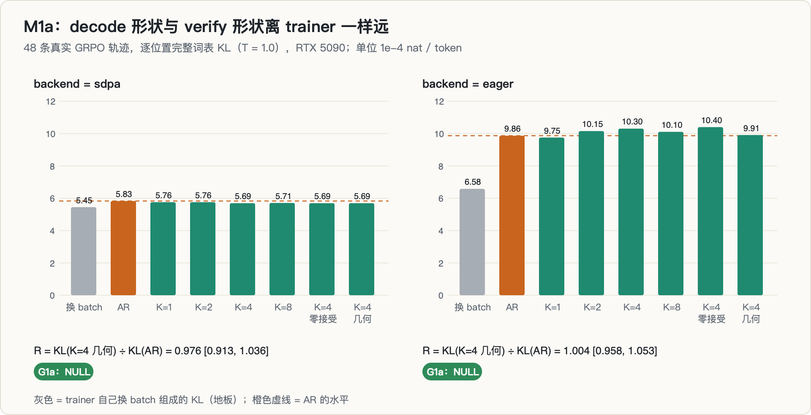

| backend | R = KL(K=4 几何接受) ÷ KL(AR) | 95% CI | 判定 |
|---|---|---|---|
| sdpa | 0.976 | [0.913, 1.036] | **NULL** |
| eager | 1.004 | [0.958, 1.053] | **NULL** |

三个观察：

1. **decode 形状和 verify 形状离 trainer 一样远。** 前向的 q_len 不是关键变量。
2. **trainer 自己也不稳定。** 只把同一条轨迹和另外 3 条放进同一个 batch，trainer 的 KL 变化就有 5.4e-4（sdpa）/ 6.6e-4（eager），相当于整个 AR–trainer 失配的 **93% / 67%**。
3. 在 sdpa 上，K = 4 的三种接受模式给出**逐位相等**的结果；在 eager 上则不相等。「数值只由 K 决定、与接受了哪些 draft 无关」这个性质依赖 backend。

我原本还预注册了一条机制规则：失配大小应随「与 trainer 共享的 kernel 集合」单调变化（用 profiler 抓 kernel 名称算 Jaccard）。实测 Spearman 相关只有 −0.05 和 +0.22，远没达到预注册的 ≤ −0.5，**这条机制主张撤回**。

---

## 7. 实验二 M1b：真实 vLLM 引擎

M1a 是 HF 的机制层，不能代表真实 rollout 引擎。vLLM 的 verify pass 有专门的执行形态（例如 [#49918](https://github.com/vllm-project/vllm/issues/49918) 里提到的 FULL spec-verify CUDA graph），所以真正的检验必须在引擎里做。

### 7.1 SM120 上 vLLM 能跑什么

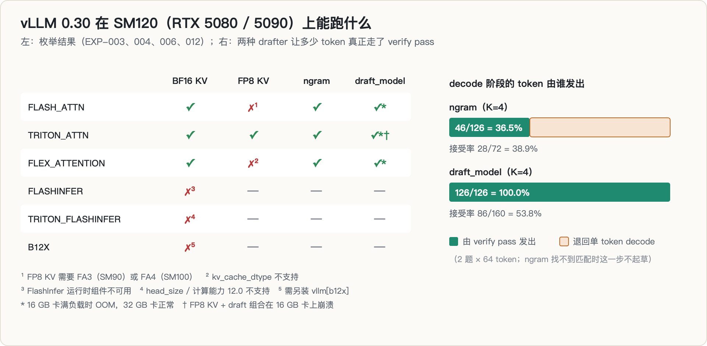

开跑前先枚举（结果写进 A-001 之后才跑数据）：

- **能用**：`FLASH_ATTN`、`TRITON_ATTN`、`FLEX_ATTENTION`；所有能用的配置都逐 token 返回了 logprob，开投机时也一样。
- **不能用**：FlashInfer（运行时组件不可用）、TRITON_FLASHINFER（不支持计算能力 12.0）、B12X（需要另装包）。我没去修，因为修就要往另一个项目的环境里装包。
- **FP8 KV** 只有 TRITON 能用；FlashAttention 的报错原文是 FP8 KV 需要 SM90 上的 FA3 或 SM100 上的 FA4。**所以 #54035 描述的那种 FP8 分叉，在消费级 Blackwell 上根本测不到。**

### 7.2 为什么主处理组从 ngram 换成 draft_model

ngram（prompt lookup）是最省事的 drafter，但它**找不到匹配时这一步就不起草**，直接退回单 token decode。枚举时的计数很清楚：128 个 token 里，ngram 只起草了 18 次，**只有 36.5% 的 decode 阶段 token 真正经过 verify pass**。这样测到的是一个被稀释的效应。

draft_model 每一步都起草。我用本地已有的 DeepScaleR-1.5B 当 draft，它和 Qwen3-1.7B 的词表完全相同（151936）。拒绝采样对任意 $q$ 都无损，draft 的质量只影响接受率（实测约 0.54–0.68），不影响 verify pass 的形状。这个变更（A-001）写于任何主实验数据之前。

### 7.3 流水线

1. **生成**：vLLM（`enforce_eager=False`，与 verl 0.9.1 的 rollout 默认值一致）按 T = 0.6、top_p = 1.0 采样，记录每个 token 的 processed logprob。top_p 设为 1.0 是为了排除截断带来的失配，那是另一个已经被研究过的问题。
2. **重打分**：用 HF 的 trainer 路径（sdpa、整序列、batch = 1）对同一条序列重算 logprob，得到每个 token 的 $r$。
3. **统计**：每个配置算 $k_3$，再按题目聚类 bootstrap 得到 $R_\text{eng} = k_3(\text{开投机}) / k_3(\text{关投机})$。

smoke 阶段顺便验证了记账：所有 $|r|$ 都小于 0.5。如果 vLLM 返回的是 draft 模型的 logprob 或残差分布的 logprob，$|r|$ 会常常达到好几个 nat。

### 7.4 第一轮（48 题 × 8 采样，RTX 5080）：INCONCLUSIVE

| 主组合（BF16） | $R_\text{eng}$ | 95% CI |
|---|---|---|
| FLEX_ATTENTION | 1.113 | [1.001, 1.264] |
| TRITON_ATTN | 1.040 | [0.899, 1.165] |
| FLASH_ATTN | 生成阶段崩溃 | — |

没有一个主组合同时满足「CI 不含 1」和「偏离 ≥ 20%」，所以不是 EFFECT；TRITON 的 CI 超出 [0.90, 1.10]，所以也不是 KILL。按预注册，扩大样本一次。

---

## 8. 插曲：「刀刃」token

第一轮里有两个 token 的 $|r|$ 达到 8.9 和 10.7。正常的 BF16 数值噪声做不到这么大，而 $k_3$ 对这种离群值很敏感：$r = 10.7$ 的一个 token 贡献约 9.7，而整个配置 19 万个 token 的 $k_3$ 总和才约 200。**一个 token 就能让 R 摆动约 5%。**

我先确认它们不是流水线 bug，办法是用 FP32 做高精度参照，在完全相同的输入前缀上用 6 条路径重算：

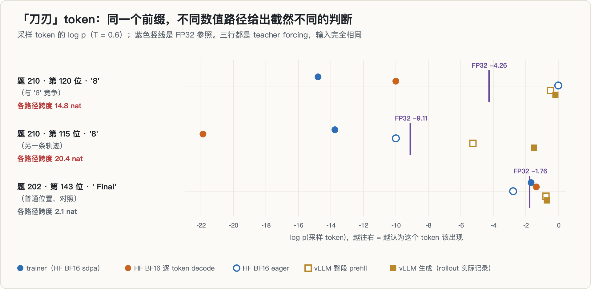

| 位置 | HF BF16 sdpa（trainer） | HF BF16 decode | HF BF16 eager | **HF FP32** | vLLM prefill | vLLM 生成 |
|---|---|---|---|---|---|---|
| 题 210 第 120 位 `'8'` | −14.79 | −10.00 | **−0.001** | −4.26 | −0.47 | −0.17 |
| 题 210 第 115 位 `'8'` | −13.75 | −21.88 | −10.00 | −9.11 | −5.26 | −1.50 |
| 题 202 第 143 位 `' Final'`（对照） | −1.67 | −1.35 | −2.78 | −1.77 | −0.76 | −0.71 |

（采样 token 的 log p，T = 0.6。）

1. **这不是 bug。** 模型在这两个位置要在 '6' 和 '8' 之间做选择，**只把 HF 的 attention 从 sdpa 换成 eager，两者的 logit 差就摆动约 13 个单位**。这是网络内部在某个「刀刃」上下文里把微小的数值差异放大成了完全不同的预测。
2. **在这些位置，trainer 的 BF16 值并不比 rollout 更接近 FP32。** 第一个位置 trainer 离 FP32 10.5 nat，vLLM 生成离 FP32 4.1 nat；第二个位置方向相反。
3. 这类位置非常少见：第一轮 6 个 BF16 配置共 1,156,720 个 token，$|r| > 5$ 的只有 2 个，$|r| > 2$ 的有 7 个；开投机和关投机的组里都有，与投机开关无关。

我没有对这个现象做撞车核验（它和 [MarginGate](https://arxiv.org/abs/2605.30218) 的「低 margin 处容易翻转」相关），所以这里只报告测量，不作主张。

---

## 9. 扩大样本、一次错误诊断，以及 KILL

### 9.1 5080 上全部崩溃，我先诊断错了

第一次扩大样本（96 题 × 8，768 个请求）在 RTX 5080 上跑，**三个 draft 组全部在生成第一步崩溃**。第一轮里 FLASH 也是这样崩的，而枚举时（eager 模式、只有 2 个 prompt）它是好的，于是我当时认定是 CUDA graph 的问题，在 A-003 里把 FLASH 改成了 eager 配对。

这个诊断是错的：eager 模式的 FLASH 在这一轮里一样崩了。抓到 EngineCore 的完整栈之后，根因很清楚：

```
torch.OutOfMemoryError: CUDA out of memory. Tried to allocate 742.00 MiB.
GPU 0 has a total capacity of 15.47 GiB of which 627.62 MiB is free.
```

742 MiB 正好对应 verify 阶段的一个 fp32 张量：

$$
256\ (\text{默认最大并发序列}) \times 5\ (K+1) \times 151936\ (\text{词表}) \times 4\ \text{B} = 777{,}912{,}320\ \text{B} \approx 741.9\ \text{MiB}
$$

vLLM 的显存预估没有算进这一块，而 16 GB 的卡上同时装着目标模型和 draft 模型。并发一旦涨到上限就会爆，小规模时并发低，所以不崩。

A-004 撤回了 A-003 的错误诊断，把整轮扩大样本（包括所有 off 组）移到 32 GB 的 RTX 5090 上重跑，**不为绕开 OOM 改任何引擎参数**。5080 上那一轮没有产出任何 draft 数据，所以这是把同一次扩大样本跑完，而不是第二次扩大样本。

### 9.2 判定轮（96 题 × 8，RTX 5090）：KILL

| 组合（BF16） | $R_\text{eng}$ | 95% CI |
|---|---|---|
| FLASH_ATTN（CUDA graph） | **1.021** | [0.958, 1.087] |
| FLEX_ATTENTION | **1.000** | [0.938, 1.062] |
| TRITON_ATTN | **1.000** | [0.946, 1.058] |
| FLASH_ATTN（eager，次要） | **0.986** | [0.934, 1.041] |

四个组合都满足 KILL 条件：$|R-1| < 0.05$，且 CI 在 [0.90, 1.10] 内。这一轮没有任何配置崩溃，draft 接受率约 0.68。

### 9.3 预注册挡住的三个信号

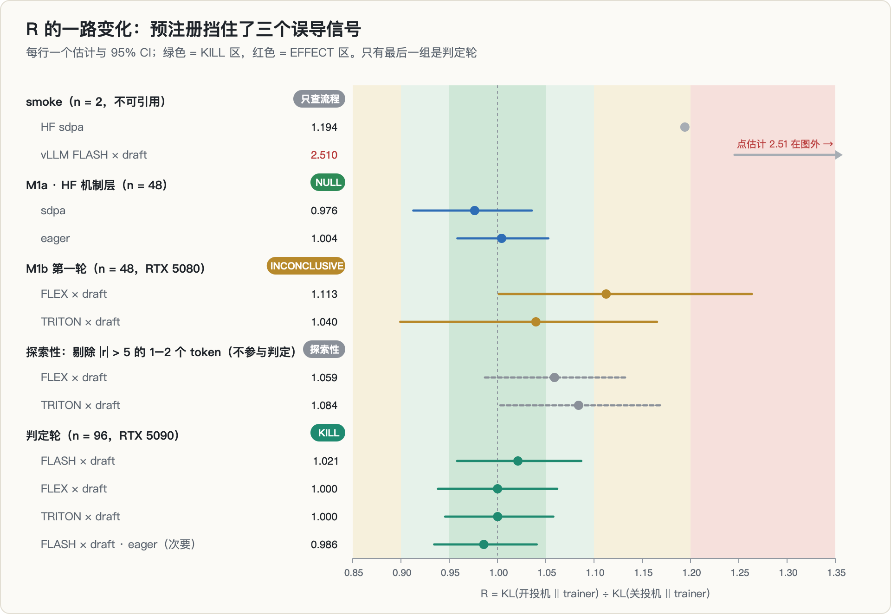

回头看，有三个时刻很容易被写成「发现」：

1. **smoke 的 2.5 倍**（vLLM，2 道题）；
2. **第一轮 FLEX 的 1.113**，CI 下界 1.001，刚好不含 1；
3. **剔除离群 token 后的 1.06–1.08**，两个 backend 方向一致。

它们都没有在判定轮复现。如果没有事先写死的门槛（20%）和「只扩大样本一次」的规则，我很可能会在第 2 或第 3 个时刻停下来，写一篇「投机解码让失配增加 6–10%」的文章。

---

## 10. 附带测量（未做撞车核验，不作主张）

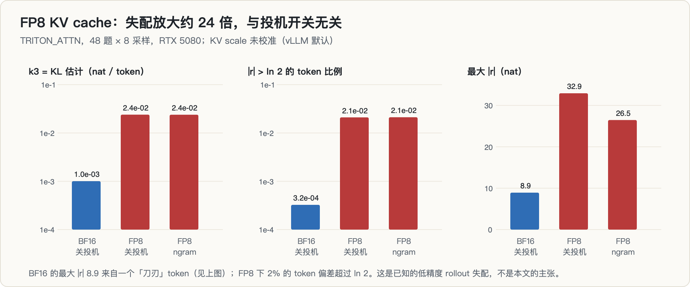

1. **trainer 自身不是稳定参照。** 同一条轨迹放进不同的 batch，trainer 的 logprob 变化就相当于 rollout–trainer 失配的 67–93%（§6.3）。现有的失配修正方法大多默认 trainer 是「真值」。
2. **「刀刃」token。** 约 116 万个 token 里 $|r| > 5$ 的只有 2 个，但在这些位置上不同数值路径相差可达 20 nat，而且 trainer 并不更接近 FP32（§8）。单个这样的 token 就能明显推动基于 $k_3$ 的统计量。
3. **FP8 KV cache（scale 未校准，vLLM 默认）。** rollout–trainer 的 $k_3$ 从 1.0e-3 升到 2.4e-2，约 **24 倍**；2% 的 token 偏差超过 ln 2，最大 $|r|$ 达 33 nat。开不开投机都一样。这属于已知的「低精度 rollout 失配」。
4. **工程**：vLLM 0.30 在 SM120 上的可用矩阵（§7.1）；以及 draft_model 投机解码在 16 GB 卡上满负载 OOM（§9.1），可以作为 issue 反馈给 vLLM。

---

## 11. 过程中的错误与更正

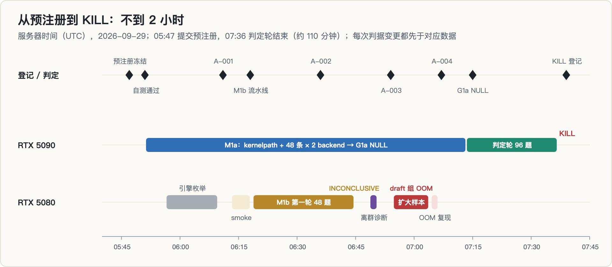

这次犯的错不少，全部记录在案：

| 错误 | 后果 | 怎么发现的 | 处理 |
|---|---|---|---|
| 模型校验把 SHA256SUMS 里的绝对路径剥成相对路径 | 出处记录显示校验失败 | 看出处字段 | `sha256sum -c` 核实权重无误；修复并追加更正记录 |
| git commit 在每次写日志时才读取 | 运行中途提交会让后续记录标错 commit | 代码审查 | 改为进程启动时读一次 |
| 链式运行中途改了源文件 | 链里后启动的进程载入了新代码；我写的出处说明也因此写错 | 核对 trace 里的 commit 标签 | 追加更正；规定运行中不改脚本 |
| **把 draft 组的崩溃归因于 CUDA graph** | A-003 做了一个多余的 eager 替代 | 抓 EngineCore 完整栈 | A-004 撤回；根因是 OOM |
| 方案里把 #54035 的 kernel 级数字和端到端数字并列，还把 0.50 写成 0.56 | 引用失真 | 外部审阅指出 | 按原文分开并改正 |
| （外部审阅的错误）称 CIS 有「引擎 prefill 对照」 | 若采信会误判存在性风险 | 全文两次检索 | CIS 只有 v1，全文与附录都没有这个实验，不采纳 |

最后一行值得多说一句：那份外部审阅（另一个 AI 助手写的）质量很高，抓到了我的真实错误；但它最关键的一条证据，引用的论文里并没有那个内容。这是我这一轮第二次遇到同类情况。**每一条事实论断都要回到原文核对，不管是谁提出的，包括我自己。**

---

## 12. 我学到了什么

1. **机制存在 ≠ 效应可测。** decode 与 prefill 走不同 kernel，这是真的；但在系统层面，引擎与 trainer 的实现差异、trainer 自己的 batch 组成才是主要的失配来源，它们把「形状」这个变量淹没了。
2. **小样本 smoke 不含方向信息。** 两次 n = 2 的 smoke 分别给出 1.19 和 2.5，到 n = 48 / 96 都没有留下。
3. **比值统计量要当心单个 token。** 一个「刀刃」token 就能让 R 摆动 5%。下次做类似比较，应该在预注册里同时写一个稳健统计量。
4. **预注册的价值在「不舒服的时刻」。** 真正有用的是那几次想提前停下来宣布发现的时刻，门槛和扩大样本规则挡住了它们。
5. **便宜的 kill 实验比漂亮的方案更值钱。** 从预注册到 KILL 不到两小时，全部用的是自有的两张消费级显卡。

---

## 13. 局限与开放问题

**测过的范围**：Qwen3-1.7B（稠密）；vLLM 0.30.0；RTX 5090 / 5080（SM120）；BF16 KV；FLASH_ATTN、FLEX_ATTENTION、TRITON_ATTN；CUDA graph 开 / 关；draft_model（K = 4，标准拒绝采样）；T = 0.6、top_p = 1.0。

**没测过的**（结论不能外推）：

- Hopper 的 FA3、数据中心 Blackwell 的 FA4，以及它们上面的 FP8 KV（#54035 的分叉就在这里）；
- EAGLE-3 / MTP 头；MoE 模型（路由对扰动敏感，可能放大差异）；更大的模型；FlashInfer。

如果要检验其中任何一项，必须作为**新问题**重新预注册，而不是拿来挽救这次的 KILL。考虑到 HF 层和引擎层都是零效应，我对这些情形的先验也不高。

---

## 14. 复现

- **环境**：Python 3.12、torch 2.13.0+cu130、transformers 5.17.0、vLLM 0.30.0；模型 Qwen3-1.7B，draft 为 DeepScaleR-1.5B。
- **代码**：`m1_paths.py`（M1a 多路径仿真，含自测与 kernel 抓取）、`m1_analyze.py`（G1a 判定）、`m1b_engine.py`（引擎枚举、生成、trainer 重打分）、`m1b_analyze.py`（G1b 判定）、`diag_outlier.py`（FP32 参照诊断）。
- **记录**：预注册在第一个提交（`877b44c`），KILL 登记在 `997eb71`；四次判据变更、13 条登记（EXP-000 到 EXP-012）和 3 个 bug 都写在项目的 `EXPERIMENTS.md` 与 `amendments.md` 里；trace 全部是 append-only 的 JSONL。
- **本文的图**：由一个只用 Python 标准库的脚本直接从 trace 生成（SVG 再转 PNG），数字不经手抄。

---

## 参考

按「做了什么、关键结论、和本篇什么关系」逐条展开。标 ⭐ 的四篇直接界定了本篇要测的那个效应存不存在。

### A. ⭐ 训练–推理失配：本篇假设的直接对手

**⭐ Diagnosing Training Inference Mismatch in LLM Reinforcement Learning（VeXact）** · [arXiv 2605.14220](https://arxiv.org/abs/2605.14220)
现代 RL 系统把 rollout 生成和策略优化**分在两个引擎里**，两者本应对同一序列给出完全相同的 token 概率。但实现差异会让**同一份权重下两边算出不同的值**，这就是 Training-Inference Mismatch（TIM）。TIM 难以检查，因为它和 off-policy 漂移、以及各种稳定化机制**纠缠在一起**。
**与本篇的关系**：这篇定义了本篇要问的那个问题的「基线版本」——两个引擎本身就有失配。本篇追问的是它的一个特例：**再加上投机解码，失配会不会变大**。「纠缠」这个词也解释了为什么本篇必须先冻结判据：不先把 off-policy 漂移分离出来，测到的任何差异都归因不明。

**⭐ Rethinking Training-Inference Mismatch in LLM RL: Where It Arises and How to Correct It（CIS）** · [arXiv 2609.32444](https://arxiv.org/abs/2609.32444)
同一问题的后续：rollout 由推理引擎采样、梯度由训练引擎计算，两个引擎给同样的 token **不同的概率**。提出**校准重要性采样（CIS）**来在策略更新里吸收这个差异。
**与本篇的关系**：给出了「失配存在时怎么修」的方案。本篇的结论是「在 ±5% 内测不到投机带来的额外失配」——如果本篇测出了效应，CIS 就是现成的修法；测不到，说明投机这一项不需要单独校正。

**⭐ Evaluating Losslessness in Speculative Decoding Under Finite-Precision Inference** · [arXiv 2609.15504](https://arxiv.org/abs/2609.15504)
投机解码的「无损」通常在**算法层**定义：验证过程保证精确保留自回归参考模型的输出轨迹。但实际神经推理用的是**有限精度浮点**，而离散的 token 选择会**放大微小的数值差异**。
**与本篇的关系**：**这是本篇的理论核心。** §2 推导无损性时，那句「within hardware numerics」的限定就是这篇要量化的东西。本篇实测「±5% 内没有效应」，和它从原理上指出的「差异存在但可能很小」是一致的。

**⭐ Correctness Forensics for Batch Speculative Decoding: Diagnosing the Ragged Tensor Problem** · [arXiv 2510.22876](https://arxiv.org/abs/2510.22876)
推理优化通常**只用吞吐评测，不验证输出正确性**。作者对批量投机解码做取证分析，发现多个广泛使用的实现会**静默产生损坏输出**（重复 token、`<unk>` 符号），同时报告有竞争力的速度——这些失败连 ROUGE 这类指标都看不出来。根因是 **ragged tensor 问题**：batch 内各序列接受长度不同导致的变长张量处理。
**与本篇的关系**：这是对本篇方法论最重要的一条警示——**不能只看速度，必须验证分布**。它也提示本篇的阴性结果有一个前提：我用的那个实现恰好没有这类 bug。§5 的自检就是为了排除这种可能。

### B. 投机解码进 RL：本篇的场景

**Accelerating RL Post-Training Rollouts via System-Integrated Speculative Decoding（NVIDIA NeMo-RL）** · [arXiv 2604.26779](https://arxiv.org/abs/2604.26779)
把投机解码当作**无损加速原语**放进 NeMo-RL + vLLM。作者特意把它和那些「改变 rollout 或优化区制」的方法（off-policy 执行、replay、低精度生成）区分开——后者会动分布，投机解码不会。
**与本篇的关系**：这是本篇怀疑的对象。它声称无损，本篇去验这个声称在真实数值下还成不成立。也见 [研究博客](https://research.nvidia.com/labs/nemotron/rl-speculative-decoding/)。

**Breaking Entropy Bounds: Accelerating RL Training via MTP with Rejection Sampling（Qwen Bebop）** · [arXiv 2606.12370](https://arxiv.org/abs/2606.12370)
系统研究 MTP 在后训练里的行为，给出把 MTP 整合进 RL 的实践配方，并从熵的角度解释接受率上界。
**与本篇的关系**：另一个「投机进 RL」的生产级实现。它关心的是加速效果，本篇关心的是分布保真——两者是同一件事的两面。

### C. 确定性与批不变性：失配的另一个来源

**LLM-42: Enabling Determinism in LLM Inference with Verified Speculation** · [arXiv 2601.17768](https://arxiv.org/abs/2601.17768)
同一 prompt 在不同运行下可能给出不同输出。系统层面的根因是**浮点非结合性**叠加**动态 batching**，以及归约顺序随 batch size 变化的 GPU 内核。直接关掉动态 batching 能消除非确定性，但吞吐会严重下降；LLM-42 用「带验证的投机」来同时拿到确定性和吞吐。
**与本篇的关系**：非常关键的一条——它说明**同一个 batch size 的变化就足以改变 token 概率**，与投机解码无关。本篇如果不控制 batch，测到的「投机导致的失配」可能只是 batch 效应。这也是 §4 判据里要固定 batch 的原因。

**MarginGate: Sparse Margin-Triggered Verification for Batch-Invariant LLM Inference** · [arXiv 2605.30218](https://arxiv.org/abs/2605.30218)
温度为 0 的 BF16 推理常被当作可复现的，但**同一请求单独解码和放进大 batch 解码可能吐出不同 token**。已有修法（批不变算子、LLM-42 的逐 token 验证）在大多数步骤本来就稳定时也要付出代价。MarginGate 发现 batch 引起的 token 翻转是**稀疏**的，于是只对翻转的 token 做验证。
**与本篇的关系**：「翻转是稀疏的」这个实测结论，和本篇「±5% 内测不到效应」互相支持——数值差异真实存在，但影响到最终 token 的比例很低。

### D. 选题阶段撞上的工作（KV 缓存方向）

这一组是选题基地阶段扫描时撞上的，说明 KV 缓存这条路线已经很拥挤，最终没选。

- **Marconi: Prefix Caching for the Era of Hybrid LLMs** · [arXiv 2411.19379](https://arxiv.org/abs/2411.19379) —— 混合模型（Attention + 循环层/SSM）的独特性质让前缀缓存这类优化难以直接套用，Marconi 处理这个问题。
- **Rethinking KV Cache Compression Techniques for LLM Serving** · [arXiv 2503.24000](https://arxiv.org/abs/2503.24000) —— 从实践角度重审主流 KV 压缩，追问为什么算法多、落地少。
- **KVServe** · [arXiv 2605.13734](https://arxiv.org/abs/2605.13734) —— 分离式服务把 KV 变成跨网络的显式载荷；已有压缩是静态配置，而生产负载随时间变化。
- **CacheFlow** · [arXiv 2604.25080](https://arxiv.org/abs/2604.25080) —— 长上下文里 KV 恢复成为主导瓶颈，已有方案没利用跨 token、跨层的并行性。
- **PrefixPlace** · [arXiv 2608.01655](https://arxiv.org/abs/2608.01655) —— 前缀 KV 复用时，「重算 vs 取副本」的相对代价随硬件和前缀深度变化，只看命中率来放置是次优的。
- **py-kvcache** · [arXiv 2609.11744](https://arxiv.org/abs/2609.11744) —— 在 vLLM 上表征 GPU / CPU / NVMe 三级外部 KV 缓存。一个反直觉的结论：**前缀短或 GPU 快时，重算比从外部缓存加载更快**。

### E. 工程一手材料

- Thinking Machines，[Defeating Nondeterminism in LLM Inference](https://thinkingmachines.ai/blog/defeating-nondeterminism-in-llm-inference/) —— 把「批不变性」这个概念讲清楚的那篇博客，本篇 §2 的数值路径分析受它影响很大。
- vLLM issue [#54035](https://github.com/vllm-project/vllm/issues/54035)、[#49918](https://github.com/vllm-project/vllm/issues/49918)、[#55524](https://github.com/vllm-project/vllm/issues/55524) —— 三条与投机解码数值行为直接相关的一手记录。
- [AMD ROCm logprob 调试](https://rocm.blogs.amd.com/software-tools-optimization/logprob-debug/README.html) —— 跨厂商看同一类问题。
- [slime / Miles 失配教程](https://github.com/zhaochenyang20/Awesome-ML-SYS-Tutorial/blob/main/rlhf/slime/mismatch/blog-en.md) —— 中文社区对 TIM 最系统的工程笔记。
- [ServiceNow：Correctness Before Corrections](https://huggingface.co/blog/ServiceNow-AI/correctness-before-corrections) —— 论点与 §D 的 Correctness Forensics 一致：先验正确性，再谈修正。

### F. 本专栏内部

- [第 1 篇：RL 里的投机 draft 什么时候值得维护？](../rl-spec-draft-maintenance/) —— 它的 §5.8「无损性闭环」依赖本篇 §2 的推导。
- [第 6 篇：一条 rollout 能用多久，取决于谁来用吗？](../rollout-half-life/) —— 同一份逐 token 对数比 $\Delta_t$，本篇用它衡量失配，第 6 篇用它衡量陈旧。
