> SUSTech · STA-5007 Advanced NLP · Lecture 2

陈冠华老师《Basics of Transformer》全 83 页课件的逐页拆解：**每一页都配了原始课件截图**，图下先给原文要点，再补上推导细节、维度核对、直觉解释与易错点。关键图示附「🖼 逐元素图解」，讲清每条线、每个方块是什么；每个模块末尾有带详解的练习；文末三个附录分别是手算自注意力、其他可手算的量、面试高频 20 问。

*83 页 · 83 张课件截图 · 51 组逐元素图解 · 26 道练习 · 20 道面试题 · 南方科技大学 统计与数据科学系*


## 开篇：为什么是 Transformer

`Part 1 · P1–P4`

四页把全课的目标钉住——一个只靠注意力、不用 RNN/CNN 的序列模型。

#### P1　课程封面

*STA-5007: Advanced Natural Language Processing — Lecture 2: Basics of Transformer*

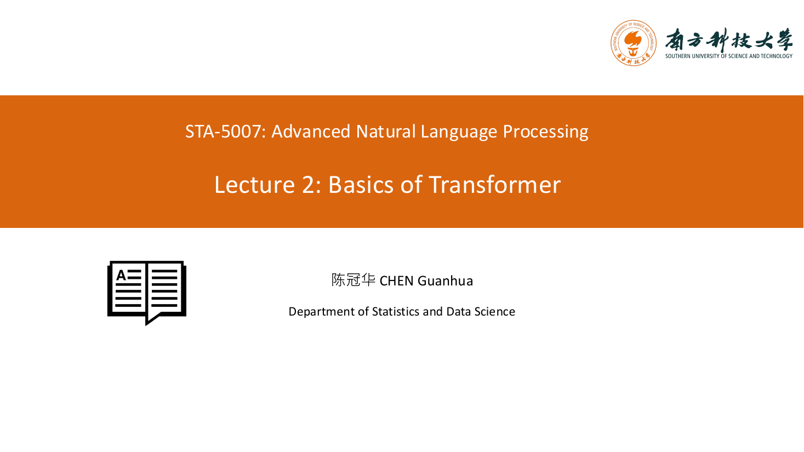

南方科技大学统计与数据科学系，陈冠华老师。课程编号 STA-5007 属于研究生层次的「高级自然语言处理」，这一讲是整门课的地基：把 Transformer 拆到能自己从零写一遍的程度。

注意这一讲的标题叫 *Basics*，意味着后面还会有 Lecture 3 讲预训练范式（BERT/GPT）、位置编码变体（RoPE/ALiBi）等。本讲只负责「结构本身」。

#### P2　本讲目录

*Content*

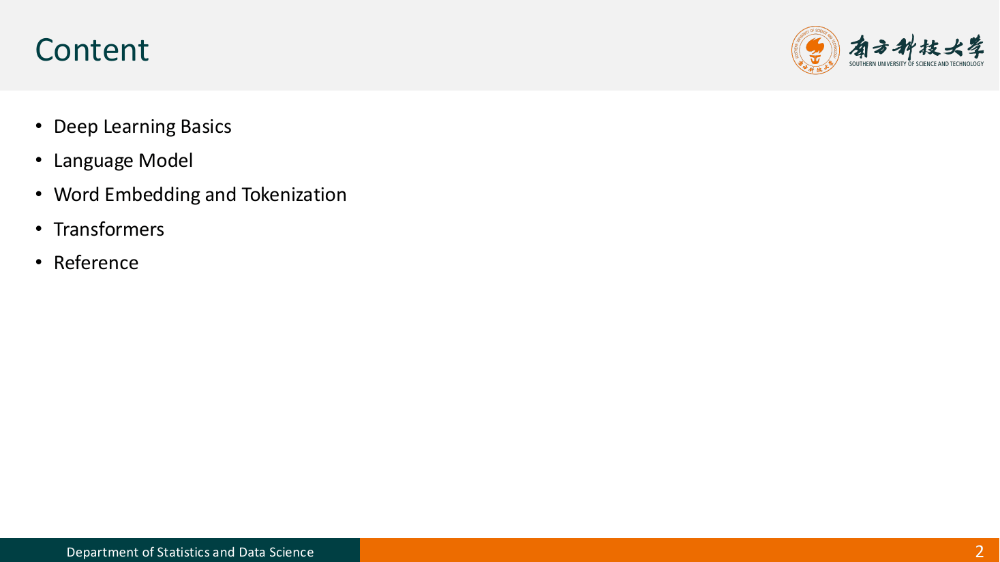

五个板块：

1. **Deep Learning Basics**（P5–36）——前馈网络、激活函数、损失、反向传播、优化器。占了全篇近 40%，因为后面所有模块都是这些零件的组合。
2. **Language Model**（穿插在 P18–23）——语言建模任务定义与困惑度。
3. **Word Embedding and Tokenization**（P37–38）——文本怎么变成向量。
4. **Transformers**（P39–81）——注意力、自注意力、多头、编解码器、参数量。
5. **Reference**（P35–36、P82）。

> **💡 读法建议**
>
> 这份课件的编排是「先零件、后整机」。如果你已经有深度学习基础，可以先跳到 P45 看整机图，再回头补 P5–36 的零件；如果是第一次接触，就按顺序走，因为 P59 的矩阵形式要用到 P10 的 $\mathbf{h}=f(\mathbf{Wx}+\mathbf{b})$ 这套记号。

#### P3　Transformer：注意力真的够了吗？

*Transformer: Is Attention All We Need?*


2017 年 Google Brain 的 *Attention Is All You Need*（Vaswani 等八人，第一作者 Ashish Vaswani，注意所有作者都带 `*`，表示贡献均等）。原始目标其实很朴素：**把机器翻译做得又快又好**。当时的 SOTA 是「RNN/LSTM + 注意力」，训练慢在 RNN 的时序依赖上——第 $t$ 步必须等第 $t-1$ 步算完。

论文的赌注是：把 RNN 整个拿掉，只留注意力。结果不仅翻译质量更好，训练还能在序列维度上完全并行。

今天它的影响面：几乎所有 NLP SOTA 模型、CV 里的 ViT/DETR、蛋白质结构的 AlphaFold（Evoformer）、音乐与音频生成模型，底座都是 Transformer。右下角那张变形金刚剧照是个双关梗（Transformer = 变形金刚）。

> **🔭 题目里的反问**
>
> 标题写的是 "Is Attention All We *Need*?"——这是老师故意加的问号。后续研究给出的答案是「不全是」：纯注意力层其实会以双指数速度退化成秩 1 矩阵（token 全都变得一样），是**残差连接和 FFN** 阻止了这件事发生（Dong et al., 2021, *Attention is Not All You Need*）。所以 P68 的 FFN 和 P74 的残差不是配角。

#### P4　Transformer 结构总览

*Transformer*

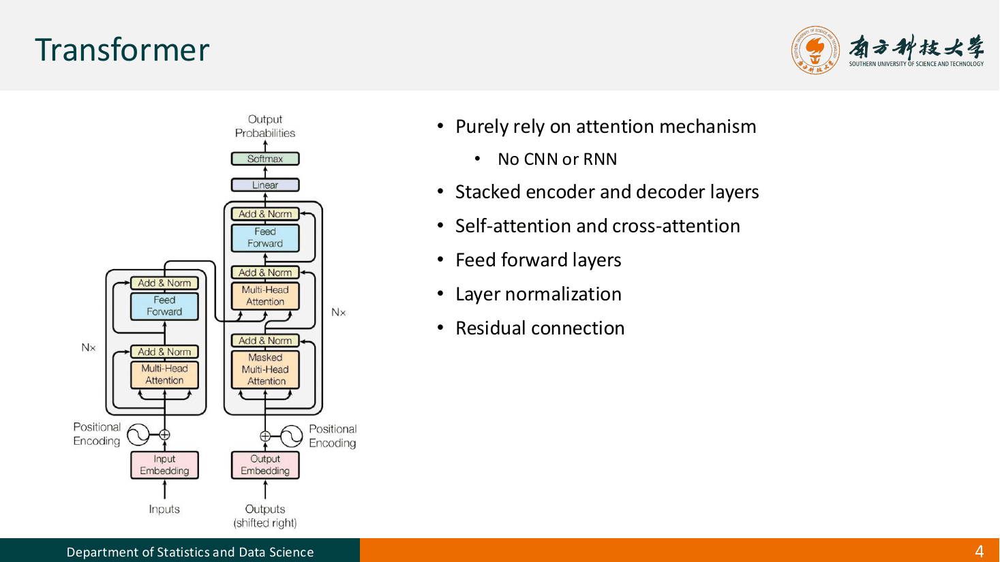

**🖼 逐元素图解：整张架构图怎么读**

先记住颜色约定，全图靠它分区：

| 颜色 | 模块 | 作用 |
| --- | --- | --- |
| 粉色 | Input / Output Embedding | 查词表，把 token id 变成向量 |
| 无框 + 波浪符号 ∿ | Positional Encoding | 位置信息，用 ⊕ 加到嵌入上 |
| 橙色 | Multi-Head Attention（含 Masked） | 唯一在 token 之间搬运信息的模块 |
| 黄色 | Add & Norm | 残差相加 + 层归一化 |
| 蓝色 | Feed Forward | 逐位置的两层 MLP |
| 紫色 | Linear | 把 d 维投影到词表大小 \|V\| |
| 绿色 | Softmax | 变成概率分布 |

**左柱（编码器）从下往上**：`Inputs` → 粉色 `Input Embedding` → ⊕ 位置编码 → 进入灰色大框（就是「一层」）→ 框内是 `Multi-Head Attention` → `Add & Norm` → `Feed Forward` → `Add & Norm` → 框左边标的 `N×` 表示这个灰框整体重复 N 次。

**右柱（解码器）从下往上**：`Outputs (shifted right)` → `Output Embedding` → ⊕ 位置编码 → 灰框内 `Masked Multi-Head Attention` → `Add & Norm` → `Multi-Head Attention`（交叉注意力）→ `Add & Norm` → `Feed Forward` → `Add & Norm`，同样 `N×`。出框后 → 紫色 `Linear` → 绿色 `Softmax` → `Output Probabilities`。

**最容易看漏的三个细节**：

1. **中间那条横跨左右的长箭头**。它从编码器顶部出发，拐到右柱中间那个橙色 `Multi-Head Attention` 的左侧——这就是交叉注意力的 K 和 V 的来源。注意它是从**编码器最后一层**出来的，不是逐层对应。
2. **每个橙色注意力框下方的箭头数量**。编码器的和解码器最底下那个都是**三个箭头从同一处分叉**（Q=K=V，自注意力）；解码器中间那个是**两个箭头从左边来、一个从下面来**（K、V 来自编码器，Q 来自下方），这是图上区分自注意力和交叉注意力的唯一标志。
3. **每个 `Add & Norm` 左右两侧那条绕过子层的细线**。那是残差连接——子层的输入不经过任何计算，直接绕到输出处相加。

左边这张图是全课最重要的一张，后面会反复回来。六条要点：

- **纯注意力**：没有 CNN、没有 RNN。唯一做 token 之间信息交换的算子就是注意力。
- **堆叠的编码器与解码器**：图上 `N×` 表示同构的层重复 N 次（原论文 base 版 N=6）。注意每层参数**不共享**。
- **自注意力与交叉注意力**：编码器内部是自注意力；解码器里既有（带掩码的）自注意力，也有对编码器输出的交叉注意力。
- **前馈层**：每个位置独立过一个两层 MLP。
- **层归一化**。
- **残差连接**——图上每个 `Add & Norm` 里的 "Add" 就是它。

顺着图从下往上读一遍数据流：输入侧 `Inputs → Input Embedding → + Positional Encoding →`（编码器 ×N：`Multi-Head Attention → Add&Norm → Feed Forward → Add&Norm`）`→` 编码器输出。输出侧 `Outputs(shifted right) → Output Embedding → + Positional Encoding →`（解码器 ×N：`Masked MHA → Add&Norm → 交叉 MHA（K,V 来自编码器）→ Add&Norm → FFN → Add&Norm`）`→ Linear → Softmax → Output Probabilities`。

> **⚠️ 容易看漏的细节**
>
> 图中 `Outputs (shifted right)` 的「右移」是指：解码器第 $t$ 个位置的输入是**第 $t-1$ 个目标词**，开头补一个 `<bos>`。这保证了训练时预测第 $t$ 个词不会看到它自己——这叫 **teacher forcing**，配合 P63 的因果掩码一起才完整。

## 深度学习基础

`Part 2 · P5–P36`

三十二页把「造模型 → 算损失 → 反传 → 更新」这条回路讲透。课件用同一张 *Deep Learning Algorithm Sketch* 反复回到主线，每次高亮其中一步。

### 训练流程与数据划分 · P5–P9

#### P5　深度学习算法骨架

*Deep Learning Algorithm Sketch*

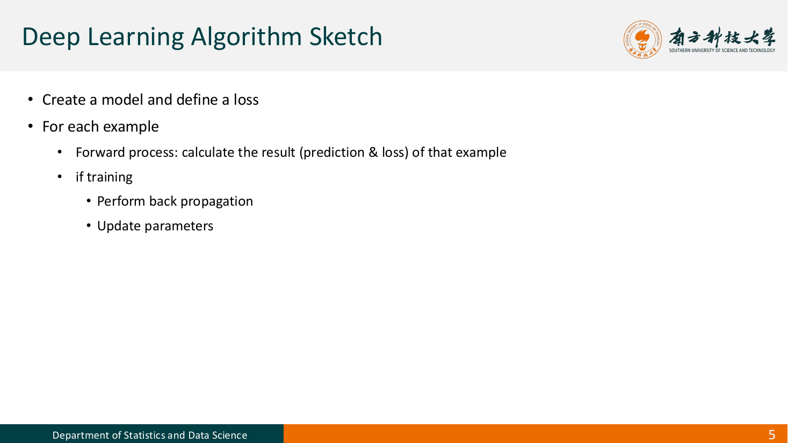

整个深度学习就这么一段伪代码：

```
创建模型，定义损失
for 每个样本（实际是每个 mini-batch）：
    前向：算出预测和损失
    if 训练模式：
        反向传播，求梯度
        用优化器更新参数
```

这一页是「路标页」。课件在 P8、P24、P27 会把同一张表重新贴出来，每次用蓝色/红色高亮当前正在讲的那一行。看到这张表再次出现，就知道换主题了。

#### P6　训练回路的工程视图

*Forward Pass / Backward Pass / Optimizer*

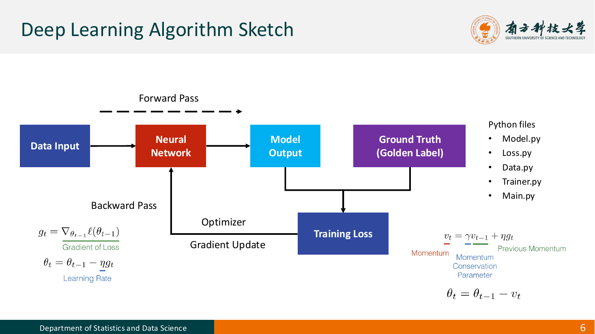

**🖼 逐元素图解**

- **上半条横线是前向（Forward Pass，虚线箭头指向右）**：深蓝 `Data Input` → 红色 `Neural Network` → 青色 `Model Output`。紫色 `Ground Truth (Golden Label)` 不经过网络，它从数据里直接来。
- **两条线汇合**：`Model Output` 和 `Ground Truth` 各自向下走，在 `Training Loss`（深蓝方块）处汇合——损失函数就是这个「比较器」。
- **下半条是反向（Backward Pass）**：从 `Training Loss` 出发，经 `Optimizer` / `Gradient Update` 标注的那条折线，绕回到红色 `Neural Network` 的底部。注意箭头方向是**从右往左**，与前向相反。
- **左下角公式**对应「Backward Pass」这个标签：$g_t$ 是梯度，$\theta_t=\theta_{t-1}-\eta g_t$ 是更新；下划线标出的 `Gradient of Loss` 和 `Learning Rate` 分别指向这两项。
- **右下角公式**是动量版本，$v_t$ 被拆成三段颜色标注：红色 `Momentum`（$v_t$ 本身）、蓝色 `Momentum Conservation Parameter`（$\gamma$）、绿色 `Previous Momentum`（$v_{t-1}$）。

看这张图的正确顺序是：**先沿上面的实线走一遍（数据怎么变成损失），再沿下面的折线走一遍（损失怎么变成参数更新）**。这两条路径合起来就是一个训练 step。

上半部分是数据流：`Data Input → Neural Network → Model Output`，与 `Ground Truth` 一起送进 `Training Loss`；下半部分是梯度流：Loss 沿虚线反向回到网络，优化器据此更新参数。

左下是最朴素的 SGD：

$$
g_t=\nabla_{\theta_{t-1}}\ell(\theta_{t-1}),\qquad \theta_t=\theta_{t-1}-\eta\, g_t
$$

$g_t$ 是损失对参数的梯度，$\eta$ 是学习率。右下是带动量（momentum）的版本：

$$
v_t=\gamma v_{t-1}+\eta g_t,\qquad \theta_t=\theta_{t-1}-v_t
$$

$\gamma$ 叫动量守恒系数（常取 0.9）。直觉：把参数想成一个在损失曲面上滚的小球，$\gamma v_{t-1}$ 是它上一步的惯性。好处是在**狭长峡谷型**的损失面上（P72 左图那种椭圆等高线），纯 SGD 会在陡的方向来回震荡、在平的方向爬得极慢；动量会把震荡方向的正负梯度抵消掉，把平缓方向的同号梯度累加起来。

> **💡 工程习惯**
>
> 右侧列的 `Model.py / Loss.py / Data.py / Trainer.py / Main.py` 是老师在示范一个训练项目的标准文件划分：模型定义、损失定义、数据加载、训练循环、入口脚本各自独立。写课程 project 时按这个分，debug 会轻松很多。

#### P7　数据集划分

*Dataset Split*

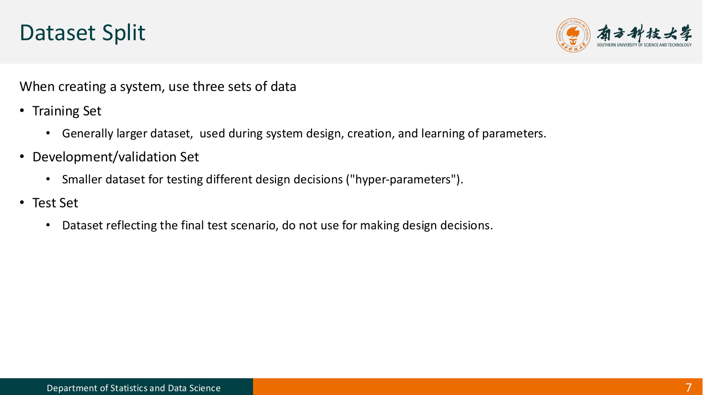

| 集合 | 规模 | 用途 | 能否据此调整模型 |
| --- | --- | --- | --- |
| Training Set 训练集 | 最大 | 学参数（权重） | — |
| Dev / Validation Set 验证集 | 较小 | 选**超参数**（层数、学习率、dropout 率…）、早停 | 可以 |
| Test Set 测试集 | 较小 | 报告最终性能 | *绝对不可以* |

关键区分：**参数**由训练集通过梯度下降学出来；**超参数**是你手动设定的，只能靠验证集试。

> **⚠️ 为什么测试集不能碰**
>
> 只要你根据测试集分数改过一次模型，测试集就变成了另一个验证集，它报出来的数字就不再是「模型在没见过的数据上的表现」。这种泄漏在论文里叫 *test-set overfitting*，学术圈常见的翻车方式。正确做法：测试集只在全部设计定稿后跑**一次**。

#### P8　路标：现在讲「建模型 + 定损失」

*Create a model and define a loss*

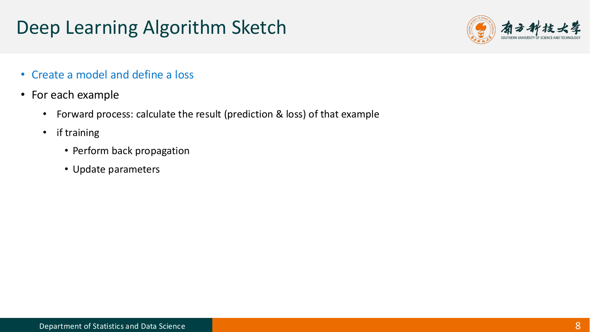

骨架图重现，第一行被高亮成蓝色。接下来 P9–P17 都在回答这一行：模型长什么样、损失怎么选。

#### P9　四种典型网络结构

*Different Model Structures*

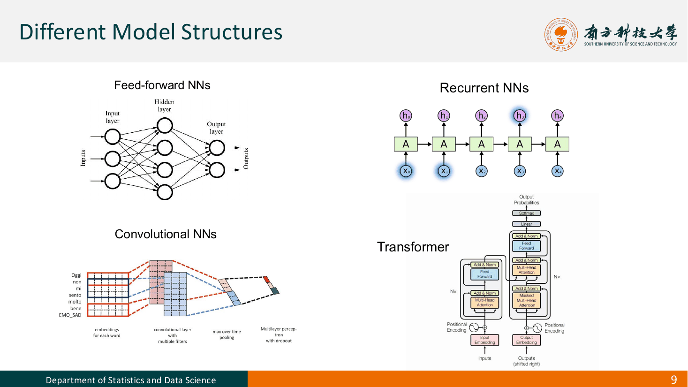

**🖼 逐元素图解：四张小图各自在说什么**

**左上 Feed-forward NN**：三列圆圈，左列 `Input layer`、中间 `Hidden layer`、右列 `Output layer`。每个圆圈是一个神经元，每条线是一个权重。所有线都从左指向右，**没有任何线往回走**——这就是「feed-forward」的字面意思。

**右上 Recurrent NN**：绿色方块 `A` 是同一个单元被画了 5 次（**不是 5 个不同的单元，是同一组权重在 5 个时刻**）。蓝色圆 $x_0..x_4$ 在下方是每个时刻的输入，紫色圆 $h_0..h_4$ 在上方是输出。**关键是方块之间那条横向箭头**——隐状态沿时间传递。图里 $x_0$ 和 $h_3$ 被蓝色光晕高亮，是在提示你：$x_0$ 的信息要影响 $h_3$，必须依次穿过 4 个 `A`，每穿一次就乘一遍权重矩阵。这就是长程依赖会衰减的原因。

**左下 Convolutional NN**：从左到右四段。①最左边竖排的意大利语句子 `Oggi / non / mi / sento / molto / bene` 及标签 `EMO_SAD`，每行是一个词的嵌入向量，整句拼成一个矩阵。②红色和蓝色虚线框是**两种不同宽度的卷积核**（红框盖 3 行=3-gram，蓝框盖 2 行=2-gram），在句子上从上往下滑动。③中间粉色和蓝色的窄条是卷积输出的特征图。④`max over time pooling` 把每个特征图压成一个数（取最大值），最后过 `Multilayer perceptron with dropout` 得到绿色的分类结果。

**右下 Transformer**：就是 P4 那张图的缩略版，放在这里是为了和前三种并排比较。

| 结构 | 信息如何流动 | 能否并行 | 长程依赖 |
| --- | --- | --- | --- |
| Feed-forward NN（全连接） | 层与层之间全连，无循环 | 能 | 输入必须定长，天然不处理序列 |
| Convolutional NN | 局部滑窗 + 池化 | 能 | 感受野随层数**线性**增长，远距离要堆很多层 |
| Recurrent NN | 沿时间步传隐状态 $h_t=A(h_{t-1},x_t)$ | *不能*（第 t 步依赖 t−1） | 理论上无限，实际受梯度消失限制 |
| Transformer | 注意力，任意两位置直接相连 | 能 | 路径长度 $O(1)$ |

这张对比表是理解 Transformer 动机的核心。RNN 那张图里 $x_0$ 的信息要传到 $h_4$，必须经过 4 个 `A` 单元，每经过一次就乘一遍权重矩阵——这是梯度消失/爆炸的根源。CNN 的图（那张意大利语情感分类的例子）展示的是「词嵌入 → 多个卷积核 → max-over-time 池化 → MLP」这条经典路线（Kim, 2014）。

> **💡 一句话记忆**
>
> 三种结构的「任意两 token 之间的最短路径长度」：RNN 是 $O(n)$，CNN 是 $O(\log_k n)$（空洞卷积）或 $O(n/k)$，Self-Attention 是 $O(1)$。代价是 Self-Attention 的计算量是 $O(n^2 d)$，序列一长就贵。

### 前馈网络与激活函数 · P10–P15

#### P10　前馈神经网络：定义与代码

*Feed-Forward Neural Network*

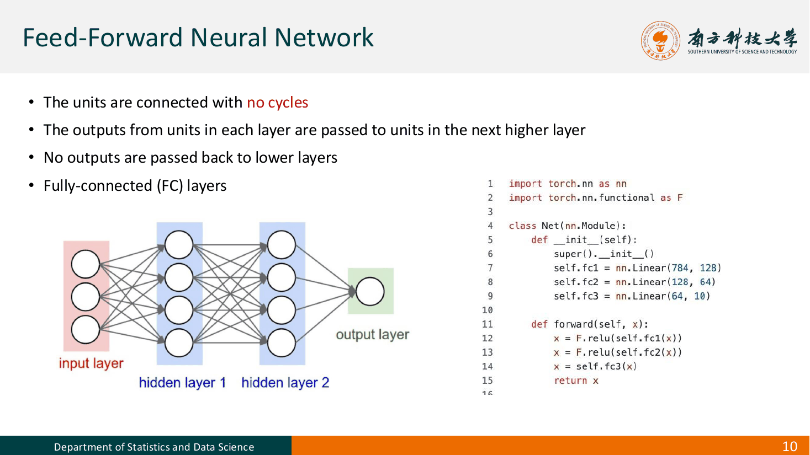

**🖼 逐元素图解**

左图用三种底色分区：**粉色 = input layer**（3 个圆）、**蓝色 = hidden layer 1 / hidden layer 2**（各 4 个圆）、**绿色 = output layer**（1 个圆）。灰色箭头把相邻两层的每一对圆都连起来——4×3 + 4×4 + 1×4 条线，每条线就是一个待学习的权重。

右图代码与左图的对应关系：`nn.Linear(784, 128)` 对应「第一组箭头」，`nn.Linear(128, 64)` 对应「第二组箭头」，`nn.Linear(64, 10)` 对应「最后一组箭头」。**圆圈的数量 = Linear 的维度参数**，图和代码说的是同一件事。

三个定义性特征：单元之间*无环*；每层输出只传给更高的层；不往回传。全连接层（Fully-Connected / Linear / Dense，三个词同义）。

右边的 PyTorch 代码是 MNIST 的标准写法：

```python
self.fc1 = nn.Linear(784, 128)   # 28×28 展平 → 128
self.fc2 = nn.Linear(128, 64)
self.fc3 = nn.Linear(64, 10)     # 10 类

def forward(self, x):
    x = F.relu(self.fc1(x))
    x = F.relu(self.fc2(x))
    x = self.fc3(x)              # 注意最后一层不加激活
    return x
```

> **⚠️ 最后一层为什么不加 ReLU**
>
> 因为 `nn.CrossEntropyLoss` 内部已经包含了 `log_softmax`。如果你在这里再加一个 ReLU 或 softmax，就变成了「softmax 套 softmax」，梯度会被严重压缩。PyTorch 里的约定是：**最后一层输出 logits（未归一化分数），归一化交给损失函数做**。这是初学者最常见的 bug 之一。

#### P11　前馈网络的矩阵形式

*Layer-wise formulation*

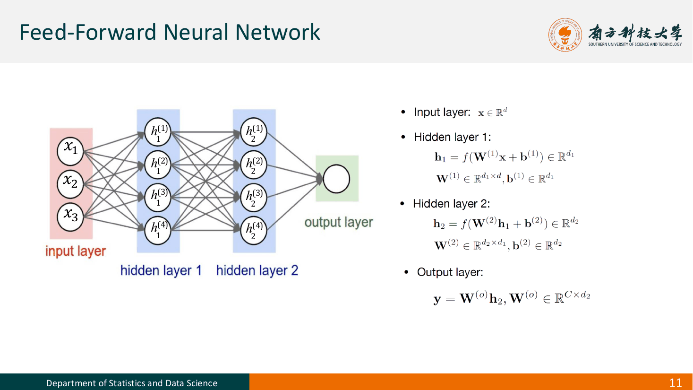

**🖼 逐元素图解**

和 P10 是同一张图，但圆圈里写上了名字，这才是重点：

- 粉色层三个圆分别写 $x_1,x_2,x_3$ —— 输入向量 $\mathbf{x}$ 的三个分量。
- 第一个蓝色层四个圆写 $h_1^{(1)},h_1^{(2)},h_1^{(3)},h_1^{(4)}$ —— **注意下标 1 是「第 1 个隐层」，上标括号里的 (1)(2)(3)(4) 是「该层第几个神经元」**。
- 第二个蓝色层同理写 $h_2^{(j)}$。

右侧公式逐行对应左图的一「组箭头」：$\mathbf{h}_1=f(\mathbf{W}^{(1)}\mathbf{x}+\mathbf{b}^{(1)})$ 就是粉→蓝1 那束线，$\mathbf{W}^{(1)}\in\mathbb{R}^{d_1\times d}$ 的 $d_1=4$（蓝1 的圆数）、$d=3$（粉的圆数）。**权重矩阵的行数 = 箭头指向的那层圆数，列数 = 箭头出发的那层圆数。**记住这条，你再也不会写反维度。

$$
\mathbf{x}\in\mathbb{R}^{d}
$$

$$
\mathbf{h}_1=f\!\left(\mathbf{W}^{(1)}\mathbf{x}+\mathbf{b}^{(1)}\right)\in\mathbb{R}^{d_1},\quad \mathbf{W}^{(1)}\in\mathbb{R}^{d_1\times d},\ \mathbf{b}^{(1)}\in\mathbb{R}^{d_1}
$$

$$
\mathbf{h}_2=f\!\left(\mathbf{W}^{(2)}\mathbf{h}_1+\mathbf{b}^{(2)}\right)\in\mathbb{R}^{d_2},\quad \mathbf{W}^{(2)}\in\mathbb{R}^{d_2\times d_1}
$$

$$
\mathbf{y}=\mathbf{W}^{(o)}\mathbf{h}_2,\quad \mathbf{W}^{(o)}\in\mathbb{R}^{C\times d_2}
$$

请务必养成**核对维度**的习惯：权重矩阵的形状永远是 `(输出维度, 输入维度)`，因为它左乘一个列向量。图上输入层 3 个圆圈（$d=3$）、两个隐层各 4 个（$d_1=d_2=4$）、输出 1 个。

> **⚠️ 数学记号 vs PyTorch**
>
> 数学上写 $\mathbf{W}\mathbf{x}$（$\mathbf{x}$ 是**列**向量，$\mathbf{W}\in\mathbb{R}^{d_{out}\times d_{in}}$）；PyTorch 的 `nn.Linear(in, out)` 实际算的是 $xA^\top+b$，其中 $x$ 是**行**向量、batch 在第一维。两者互为转置。这个「行/列约定」差异会在 P55–P61 讲自注意力时再次咬人，先记住。

#### P12　写成标量形式

*Element-wise view*

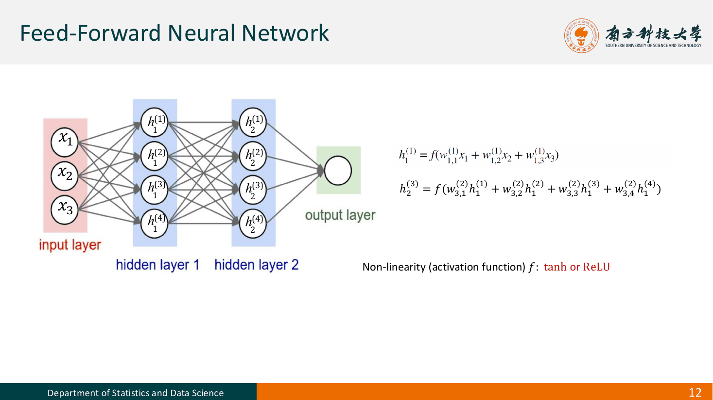

**🖼 逐元素图解**

这次图上只画了两条计算路径，是在做「放大特写」：

- 第一行公式 $h_1^{(1)}=f(w_{1,1}^{(1)}x_1+w_{1,2}^{(1)}x_2+w_{1,3}^{(1)}x_3)$ 对应的是「**所有指向蓝1 第一个圆的箭头**」——3 条线，3 个权重，加起来再过激活函数。
- 第二行 $h_2^{(3)}$ 对应「**所有指向蓝2 第三个圆的箭头**」——4 条线，4 个权重。

对照着看：矩阵形式（P11）是把一层的所有圆一次算完，标量形式（P12）是把一个圆单独拎出来算。**同一件事的两种粒度。**

$$
h_1^{(1)}=f\!\left(w_{1,1}^{(1)}x_1+w_{1,2}^{(1)}x_2+w_{1,3}^{(1)}x_3\right)
$$

$$
h_2^{(3)}=f\!\left(w_{3,1}^{(2)}h_1^{(1)}+w_{3,2}^{(2)}h_1^{(2)}+w_{3,3}^{(2)}h_1^{(3)}+w_{3,4}^{(2)}h_1^{(4)}\right)
$$

下标读法：$w^{(l)}_{i,j}$ 表示第 $l$ 层中「第 $j$ 个输入单元 → 第 $i$ 个输出单元」的权重。上标括号里的数字是**层号**（在 $w$ 上）或**单元编号**（在 $h$ 上），课件混用了两种上标含义，读的时候看位置区分。

非线性 $f$ 可取 tanh 或 ReLU。**为什么必须有非线性**：若 $f$ 是恒等映射，则 $\mathbf{W}^{(2)}(\mathbf{W}^{(1)}\mathbf{x})=(\mathbf{W}^{(2)}\mathbf{W}^{(1)})\mathbf{x}$，无论堆多少层都等价于**一个**线性层。非线性是「深度」产生价值的前提。

#### P13　用前馈网络做分类

*FFN for Classification & softmax*

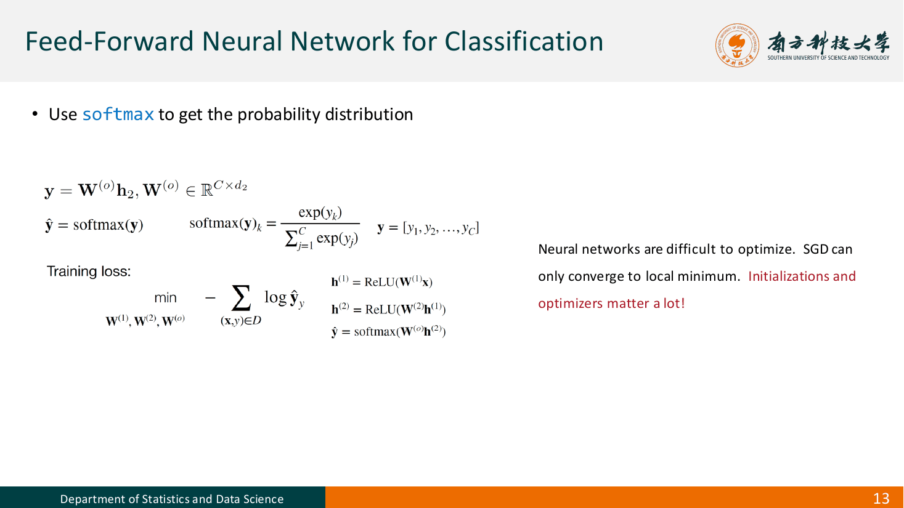

输出层给出 $C$ 个实数 logits，用 softmax 转成概率分布：

$$
\hat{\mathbf{y}}=\mathrm{softmax}(\mathbf{y}),\qquad \mathrm{softmax}(\mathbf{y})_k=\frac{\exp(y_k)}{\sum_{j=1}^{C}\exp(y_j)}
$$

softmax 的三个性质：输出全为正；和为 1；**平移不变**——$\mathrm{softmax}(\mathbf{y}+c)=\mathrm{softmax}(\mathbf{y})$。最后一条是数值稳定实现的依据：实际代码里会先减去 $\max_j y_j$ 再取指数，防止 $\exp$ 上溢。

训练损失是负对数似然（在整个数据集 $D$ 上求和）：

$$
\min_{\mathbf{W}^{(1)},\mathbf{W}^{(2)},\mathbf{W}^{(o)}}\ -\sum_{(\mathbf{x},y)\in D}\log \hat{\mathbf{y}}_y
$$

其中 $\hat{\mathbf{y}}_y$ 表示预测分布中**正确类别 $y$** 对应的那一项。右侧三行是整个前向过程的压缩写法：$\mathbf{h}^{(1)}=\mathrm{ReLU}(\mathbf{W}^{(1)}\mathbf{x})$、$\mathbf{h}^{(2)}=\mathrm{ReLU}(\mathbf{W}^{(2)}\mathbf{h}^{(1)})$、$\hat{\mathbf{y}}=\mathrm{softmax}(\mathbf{W}^{(o)}\mathbf{h}^{(2)})$。

> **💡 红字那句话**
>
> 「神经网络很难优化，SGD 只能收敛到局部极小值，**初始化和优化器非常重要**」。神经网络的损失函数是高度非凸的，没有全局最优的保证。实践中真正救命的是：合适的初始化（Xavier/He）、归一化层、自适应优化器、学习率调度。这四件事在后面 P29–P31、P69–P72 都会讲到。

#### P14　激活函数：Sigmoid 与 ReLU

*Activation Functions*

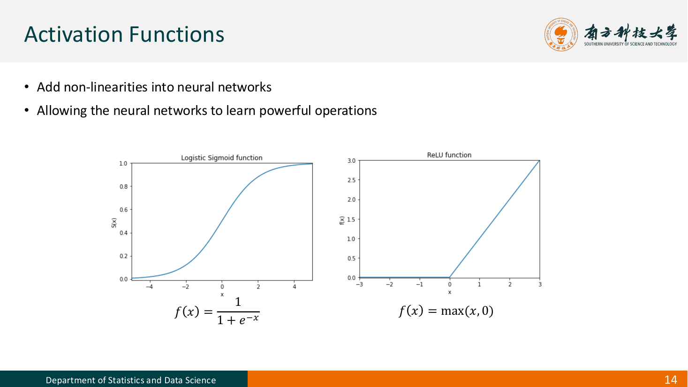

**🖼 逐元素图解：两条曲线的读法**

**左图 Logistic Sigmoid**：横轴 x 从 −5 到 5，纵轴 S(x) 从 0 到 1。看三个位置——
① x=0 时 S=0.5（曲线正好穿过中点）；
② |x| > 4 之后曲线几乎变平（这就是**饱和区**，切线斜率≈0，梯度消失就发生在这里）；
③ 曲线最陡的地方在 x=0，斜率是 0.25——**这是 sigmoid 导数的最大值**，意味着每经过一层，梯度最多只剩四分之一。

**右图 ReLU**：横轴 −3 到 3。x<0 的部分是一条**完全贴着 0 的水平线**（导数恒为 0，这里的神经元一旦落进来就再也不更新，即「死亡 ReLU」）；x>0 是一条**斜率恰好为 1 的直线**（导数恒为 1，梯度原样通过，不衰减）。两段在原点拼接，那个折角处不可导。

把两张图并排看，ReLU 胜出的理由一目了然：**正半轴的斜率，一个是 ≤0.25 且会趋近 0，一个恒为 1。**

$$
\sigma(x)=\frac{1}{1+e^{-x}}\qquad\qquad \mathrm{ReLU}(x)=\max(x,0)
$$

|   | Sigmoid | ReLU |
| --- | --- | --- |
| 值域 | (0, 1) | [0, +∞) |
| 导数 | $\sigma(1-\sigma)$，最大仅 0.25 | 1（x>0）或 0（x<0） |
| 主要问题 | *梯度消失*：$\vert x\vert $ 大时导数趋近 0；输出非零均值 | *死亡 ReLU*：落到负半轴后梯度恒为 0，该单元再也不更新 |
| 计算成本 | 有 exp | 一次比较，极快 |

为什么 ReLU 在深层网络里胜出：把 $L$ 层的 sigmoid 串起来，梯度里会出现 $0.25^L$ 这样的连乘，十层以后就基本没有梯度了。ReLU 在正半轴导数恒为 1，不会衰减。

#### P15　GeLU

*Gaussian Error Linear Unit*

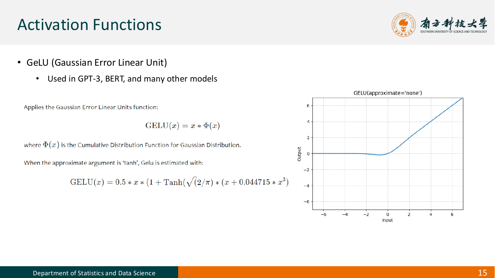

**🖼 逐元素图解**

横轴 −6 到 7，纵轴 −6 到 7。三个要看的地方：

1. **x 很大时**，曲线几乎与 ReLU 重合（$\Phi(x)\to 1$，所以 $x\Phi(x)\to x$）。
2. **x 很小（很负）时**，曲线趋近 0（$\Phi(x)\to 0$）。
3. **x ≈ −0.75 附近有一个小凹坑**，最低点约 −0.17 —— 这是 GeLU 和 ReLU 唯一的实质区别。它让函数在 0 附近**处处光滑可导**，而且允许小幅度的负输出，梯度不会像 ReLU 那样在负半轴被硬生生截断成 0。

放大看原点附近：ReLU 是一个尖角，GeLU 是一段平滑的 S 形过渡。**这个「软化」就是它在深层模型里表现更好的全部原因。**

$$
\mathrm{GELU}(x)=x\cdot\Phi(x)
$$

$\Phi(x)$ 是标准正态分布的**累积分布函数**（CDF）。直觉解读：ReLU 是「硬门」——按 $x>0$ 与否决定 0/1；GeLU 是「软门」——用 $\Phi(x)$（即「一个标准正态随机变量小于 $x$ 的概率」）作为保留比例。所以 GeLU 可以看成随机正则化（类似 dropout）的期望形式。

tanh 近似版（`approximate='tanh'`，速度更快）：

$$
\mathrm{GELU}(x)\approx 0.5x\left(1+\tanh\!\left(\sqrt{2/\pi}\,\left(x+0.044715x^3\right)\right)\right)
$$

右图关键细节：曲线在 $x\approx-0.75$ 处有个**小凹陷（负值区）**，最低约 −0.17。这是 GeLU 与 ReLU 最直观的区别——它在 0 附近处处可导且允许小的负输出，梯度不会在 $x=0$ 处断掉。GPT-3、BERT 用的都是它。

> **🔭 往后一步**
>
> 当代大模型的 FFN 多已改用 **SwiGLU**（LLaMA、PaLM 系列）：$\mathrm{SwiGLU}(x)=\mathrm{Swish}(xW_1)\odot(xW_3)$，用门控机制代替单一激活。参数多了 1.5 倍，所以通常把 $d_{ff}$ 从 $4d$ 降到 $\tfrac{8}{3}d$ 来保持总量。

### 损失函数 · P16–P17

#### P16　损失函数总览

*Loss Functions*

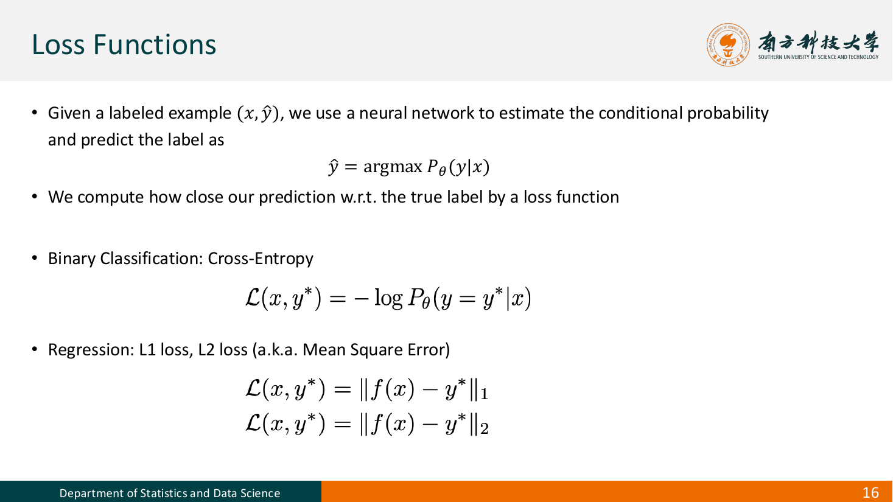

给定带标注样本，网络估计条件概率并给出预测：

$$
\hat{y}=\arg\max_y P_\theta(y\mid x)
$$

**分类：交叉熵**（这里写的是「取出真实标签那一项的负对数」这种形式）

$$
\mathcal{L}(x,y^*)=-\log P_\theta(y=y^*\mid x)
$$

**回归：L1 / L2**

$$
\mathcal{L}(x,y^*)=\|f(x)-y^*\|_1,\qquad \mathcal{L}(x,y^*)=\|f(x)-y^*\|_2
$$

| 损失 | 对离群点 | 梯度性质 | 常见场景 |
| --- | --- | --- | --- |
| L1（MAE） | 稳健 | 恒为 ±1，接近最优点时不减小，收敛可能抖 | 目标框回归、稳健回归 |
| L2（MSE） | 敏感，一个离群点能主导损失 | 正比于误差，接近最优点自动减小 | 一般回归、重建 |
| 交叉熵 | — | 与 softmax 配合时梯度恰为 $\hat{p}-t$，非常干净 | 所有分类、语言建模 |

> **⚠️ 记号提醒**
>
> 课件第一行写的是「given a labeled example $(x,\hat{y})$」，把 **$\hat{y}$ 当成了真实标签**；但下一行又用 $\hat{y}=\arg\max$ 表示**预测**。同一页里 $\hat{y}$ 有两种含义。后文 P21 还会再撞一次。通行约定是：$y^*$ 或 $t$ 表示真值，$\hat{y}$ 表示预测。读课件时按上下文判断即可。

#### P17　损失函数的实战例子：AlphaFold-2

*Regression loss in the wild*

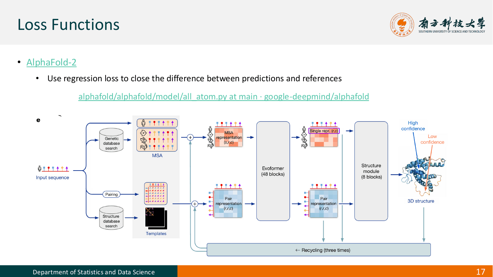

举这个例子是想说明：**损失函数的设计本身就是研究工作**。AlphaFold-2 的主损失 FAPE（Frame-Aligned Point Error）本质是一个回归损失——把预测的原子坐标与真实结构对齐后算距离，再做截断（clamp）。

图中的流程（供理解结构，非本讲考点）：输入序列 → 检索同源序列构成 MSA、检索已知结构作为模板 → 两条表示（MSA 表示 $(s,r,c)$、残基对表示 $(r,r,c)$）送进 48 层 **Evoformer** → 结构模块 8 层输出 3D 坐标 → **Recycling** 把输出再喂回输入重复三次。Evoformer 本身就是 Transformer 的变体，这也是「Transformer 不只属于 NLP」的最好证据。

### 语言模型与困惑度 · P18–P23

#### P18　语言建模

*Language Modeling*

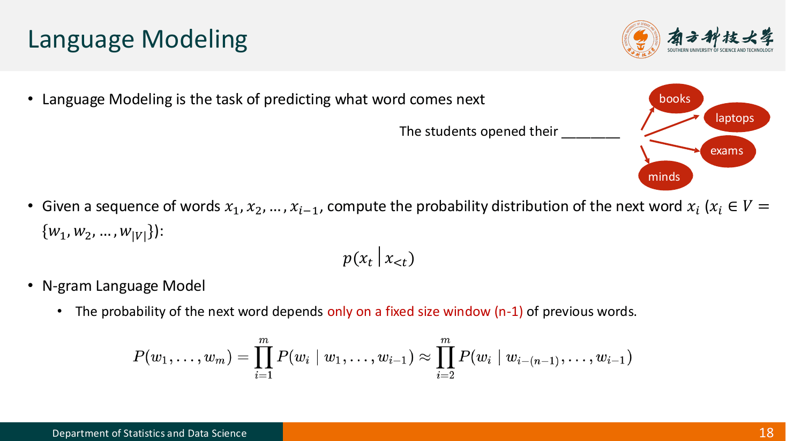

**🖼 逐元素图解**

图右上角四个红色椭圆 `books` / `laptops` / `exams` / `minds` 从同一个点发散出去，对应左边那句 "The students opened their ______"。

这张图想传达的是：**语言模型的输出不是一个词，而是整个词表上的一个概率分布**。四个候选都合语法，但概率不同（books 最高，minds 最低但也说得通）。箭头的发散形状就是在画这个分布。真实模型里这样的候选有几万个，只是画不下。

任务定义只有一句：**预测下一个词**。例子 "The students opened their ____"，候选是 books / laptops / exams / minds。

形式化：给定前文 $x_1,\dots,x_{i-1}$，在词表 $V=\{w_1,\dots,w_{|V|}\}$ 上算出下一个词的概率分布

$$
p(x_t\mid x_{<t})
$$

这是一个 $|V|$ 类的分类问题——词表通常是 3 万到 15 万，所以是个「超多类」的分类。

**N-gram 语言模型**：假设下一个词只依赖*固定窗口的前 n−1 个词*（马尔可夫假设）：

$$
P(w_1,\dots,w_m)=\prod_{i=1}^{m}P(w_i\mid w_1,\dots,w_{i-1})\approx\prod_{i}P(w_i\mid w_{i-(n-1)},\dots,w_{i-1})
$$

概率用计数估计：$P(w_i\mid w_{i-1})=\dfrac{\mathrm{count}(w_{i-1},w_i)}{\mathrm{count}(w_{i-1})}$。

> **⚠️ N-gram 的两个致命伤**
>
> **稀疏性**：只要某个 n-gram 在语料里没出现过，概率就是 0，整句概率变 0（需要平滑 smoothing / 回退 backoff 来救）。**存储爆炸**：可能的 n-gram 数量是 $|V|^n$，n 稍大就存不下。神经语言模型的价值正是：用**稠密向量**代替计数，语义相近的上下文自动共享统计强度。

#### P19　语言模型的两种用法

*Score a sentence / Generate a sentence*

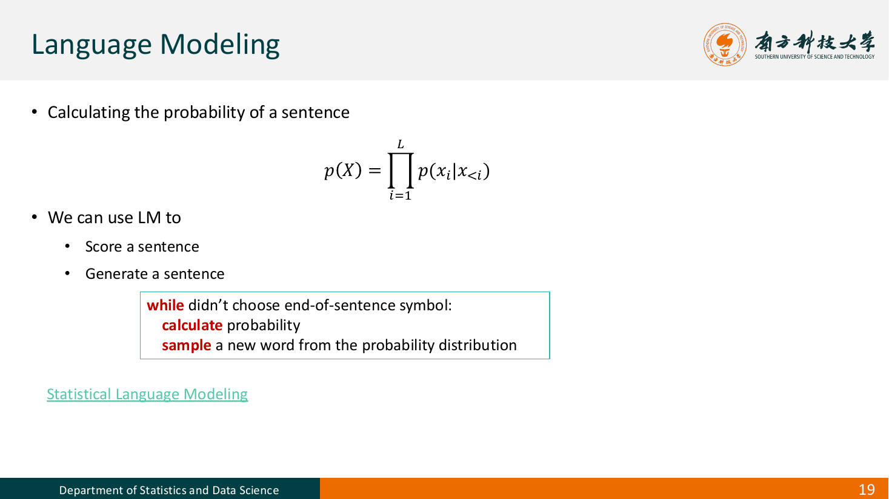

整句概率由**链式法则**分解（这是恒等式，不是近似）：

$$
p(X)=\prod_{i=1}^{L}p(x_i\mid x_{<i})
$$

- **打分**：给一个句子算 $p(X)$，用来比较「哪句更像人话」。语音识别、拼写纠错、机器翻译重排序都靠它。
- **生成**：伪代码是`while 还没采到句末符号 <eos>:计算下一个词的概率分布从该分布中采样一个新词`

> **💡 采样策略**
>
> 课件写的是「sample a new word from the probability distribution」，即纯随机采样。实际生成时还有：**greedy**（每步取 argmax，易重复）、**beam search**（保留 k 条候选路径，翻译常用）、**top-k / top-p(nucleus)**（只在概率最高的一小撮里采，开放式生成常用）、以及**温度** $T$：$p_i\propto\exp(y_i/T)$，$T<1$ 变尖锐、$T>1$ 变平坦。这是后续课程的内容，但用 ChatGPT 时调的就是这些旋钮。

#### P20　评估语言模型：困惑度

*Perplexity*

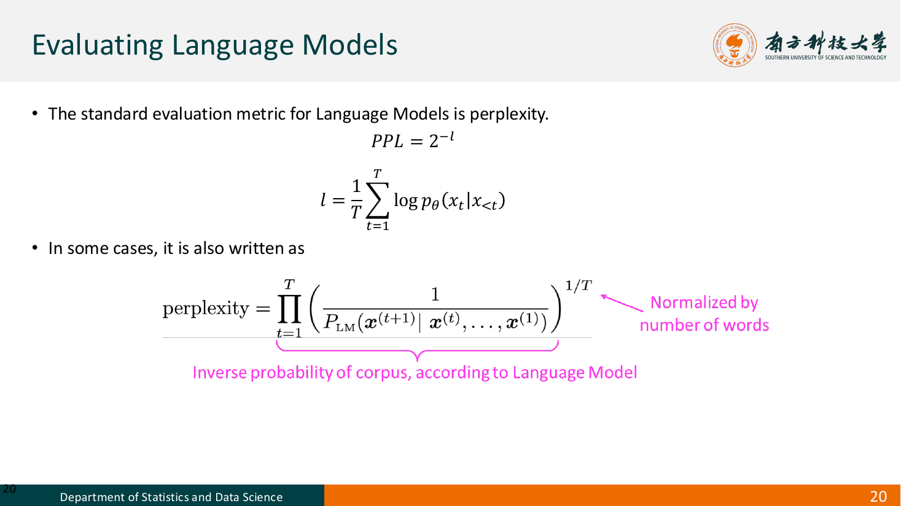

$$
\mathrm{PPL}=2^{-l},\qquad l=\frac{1}{T}\sum_{t=1}^{T}\log p_\theta(x_t\mid x_{<t})
$$

另一种等价写法：

$$
\mathrm{perplexity}=\prod_{t=1}^{T}\left(\frac{1}{P_{\mathrm{LM}}(x^{(t+1)}\mid x^{(t)},\dots,x^{(1)})}\right)^{1/T}
$$

拆开读：括号里是「模型给正确词的概率的**倒数**」，连乘是整个语料的逆概率，外面的 $1/T$ 次方是**按词数归一化**（否则长文档的 PPL 必然更大，无法比较）。所以 PPL 就是逆概率的**几何平均**。

> **⚠️ 底数必须对上**
>
> $\mathrm{PPL}=2^{-l}$ 里的 2 与 $l$ 中的 $\log$ 必须是**同一个底**。课件写 $2^{-l}$，意味着 $\log=\log_2$（单位是 bit）。而 PyTorch 的 `CrossEntropyLoss` 用的是自然对数，所以代码里通常写 `ppl = math.exp(loss)`。两者等价：$2^{-l_2}=e^{-l_e}$。写作业时用哪个都行，但别混。

> **💡 PPL 的直觉**
>
> PPL 可以理解成「模型在每一步平均要在多少个词里犹豫」。均匀猜 1 万词表 → PPL = 10000；完美预测 → PPL = 1。GPT-2 在 WikiText-103 上约 18，现代大模型在个位数到十几之间。**PPL 只能在同一词表、同一分词方式下横向比较**——换了 tokenizer，数字就没有可比性。

#### P21　困惑度 = 交叉熵的指数

*PPL and cross-entropy*

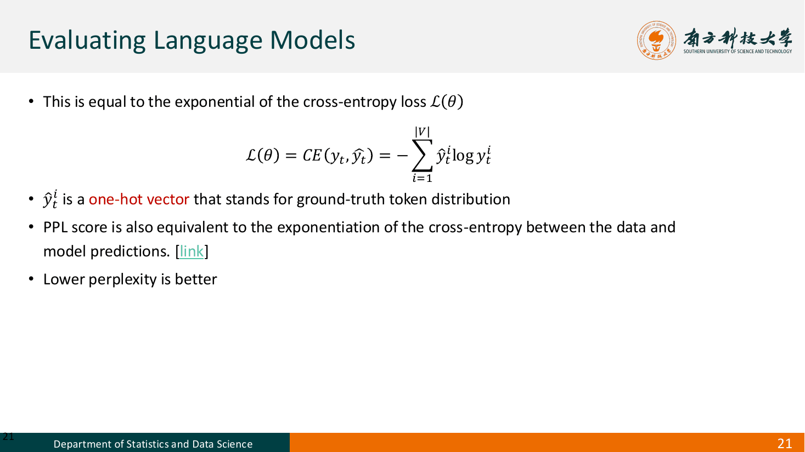

$$
\mathcal{L}(\theta)=CE(y_t,\hat{y}_t)=-\sum_{i=1}^{|V|}\hat{y}^i_t\log y^i_t
$$

这里 $\hat{y}^i_t$ 是**one-hot 向量**（真实词那一位为 1，其余为 0）。因为是 one-hot，求和里只有一项活着，交叉熵直接退化成「正确词概率的负对数」「$-\log p$ （正确词的概率）」——这就是为什么 P20 的 $l$ 和这里的 $\mathcal{L}$ 是同一个量的正负号关系，于是 $\mathrm{PPL}=\exp(\mathcal{L})$。

结论：**PPL 越低越好**，而且降低 PPL 与最小化交叉熵损失是完全同一件事。所以训练曲线上的 loss 和 PPL 是一一对应的。

> **⚠️ 又是记号问题**
>
> 这一页把带帽的 $\hat{y}$ 当成了**真实**分布、不带帽的 $y$ 当成**预测**分布，与 P13、P22 正好相反。理解公式时抓住本质：**log 里面放的永远是模型预测的概率**，log 外面的权重永远是真实分布。

#### P22　交叉熵损失

*Cross-Entropy Loss*

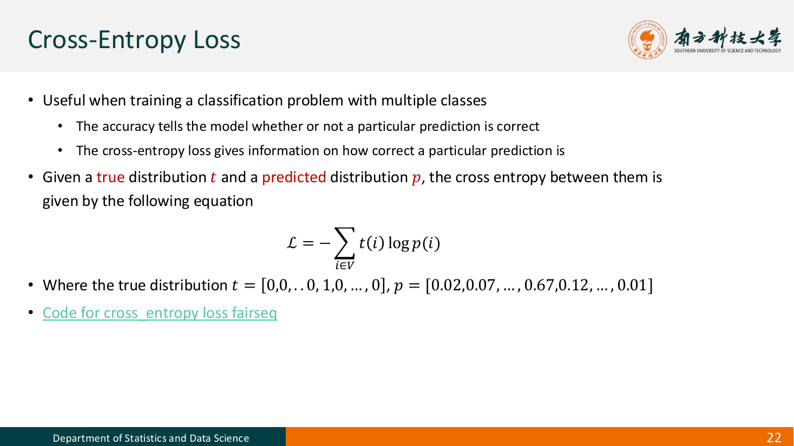

$$
\mathcal{L}=-\sum_{i\in V}t(i)\log p(i)
$$

$t$ 是真实分布（如 $[0,0,\dots,1,0,\dots,0]$），$p$ 是预测分布（如 $[0.02, 0.07,\dots,0.67, 0.12,\dots,0.01]$）。

课件强调的那句话值得记：**准确率只告诉模型「对还是错」，交叉熵告诉模型「有多对」**。预测正确类概率 0.51 和 0.99 在准确率上完全一样，但交叉熵分别是 0.67 和 0.01——差了 60 多倍的惩罚。正因为如此，交叉熵可导、能提供有意义的梯度，而准确率不能拿来做损失。

> **💡 为什么 softmax + CE 的梯度这么干净**
>
> 设 logits 为 $z$，$p=\mathrm{softmax}(z)$，真实 one-hot 为 $t$。可以推出
>
> $$\frac{\partial \mathcal{L}}{\partial z}=p-t$$
>
> ——预测概率减去真实分布，仅此而已。这个极简形式正是 softmax 与交叉熵被绑定使用的原因：中间的 $\exp$ 和 $\log$ 互相抵消，梯度既不消失也不爆炸。值得自己动手推一遍，是笔试常考题。

#### P23　交叉熵在翻译中的一步

*One step for one training example*

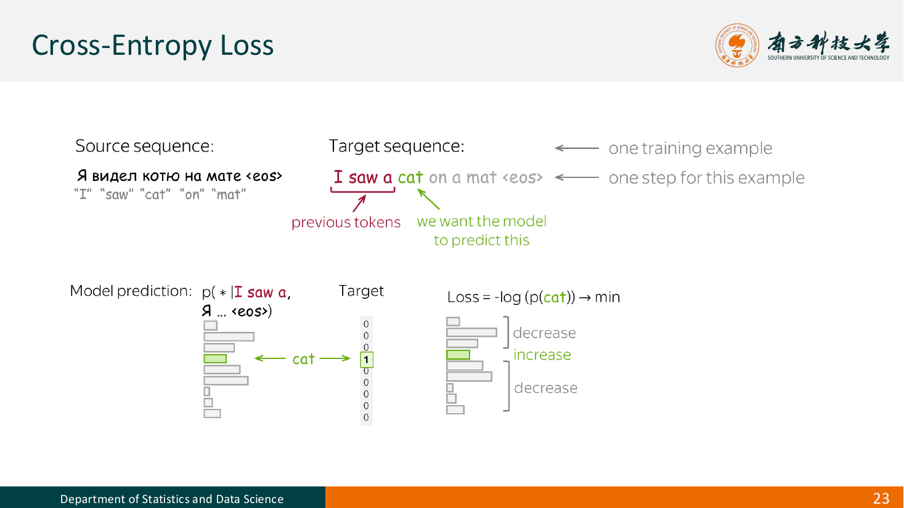

**🖼 逐元素图解：这张图信息量很大，分四块看**

**第①块（左上）源句**：`Я видел котю на мате <eos>`，下面用引号标了对应的英文词义 "I" "saw" "cat" "on" "mat"。注意句尾有 `<eos>`——句子结束符是词表里一个真实的 token。

**第②块（右上）目标句**：`I saw a cat on a mat <eos>`。上方两个灰色箭头分别标注：整行是 **one training example**（一个训练样本），而其中一个位置是 **one step for this example**（这个样本里的一步）。这是本页最重要的概念区分。

**第③块（中间）颜色编码**：`I saw a` 是**深红色**并被红色大括号框住，标注 `previous tokens`（已知的前文）；`cat` 是**绿色**，绿色箭头标注 `we want the model to predict this`（要预测的目标）；后面的 `on a mat <eos>` 是**浅灰色**——表示「本步还没轮到它们」。

**第④块（下方）三列柱状图**，从左到右：
- 第一列 `Model prediction`：模型算出的 $p(\ast\mid\text{I saw a};\ \text{source})$，一排长短不一的灰条，其中 cat 那条被标成**绿色**。
- 第二列 `Target`：一列 0，只有 cat 那一位是 **1**（绿框标出）——这就是 one-hot 真值。
- 第三列 `Loss`：同样的柱子，但用括号标出了梯度方向——cat 那条旁边写 **increase**（绿色），上下所有其他条旁边写 **decrease**（灰色）。

**整张图的结论就在第④块**：softmax 的归一化约束让「抬高正确词」和「压低所有其他词」必然同时发生，这就是交叉熵损失在参数空间里推动模型的方式。

这张图把「一个训练样本」和「一个训练步」的关系画清楚了。源句（俄语）"Я видел котю на мате <eos>"，目标句 "I saw a cat on a mat <eos>"。

- **一个训练样本** = 一对完整的句子。
- **一步** = 在这一对句子里预测**一个位置**。图里已知前缀 "I saw a"，要预测 "cat"。

模型输出 $p(\ast\mid \text{I saw a};\ \text{source})$，一个 $|V|$ 维分布；目标是 one-hot（cat 那位为 1）；损失 $=-\log p(\text{cat})\rightarrow\min$。

右侧柱状图非常传神：梯度下降的效果是「把 cat 这一根柱子往上推（*increase*），把其他所有柱子往下压（*decrease*）」。softmax 的归一化约束让这两件事天然耦合——抬高一个必然压低其余。

> **💡 并行的关键**
>
> 虽然概念上是「一步预测一个词」，但训练时所有位置是**同时**算的：一个长度 $L$ 的句子会一次性产生 $L$ 个预测和 $L$ 个损失项，再取平均。能这么做，全靠 P63 的因果掩码保证每个位置看不到自己的答案。这正是 Transformer 比 RNN 快的根本原因。

### 反向传播与优化器 · P24–P36

#### P24　路标：前向过程与反向传播

*Forward process / Back propagation*

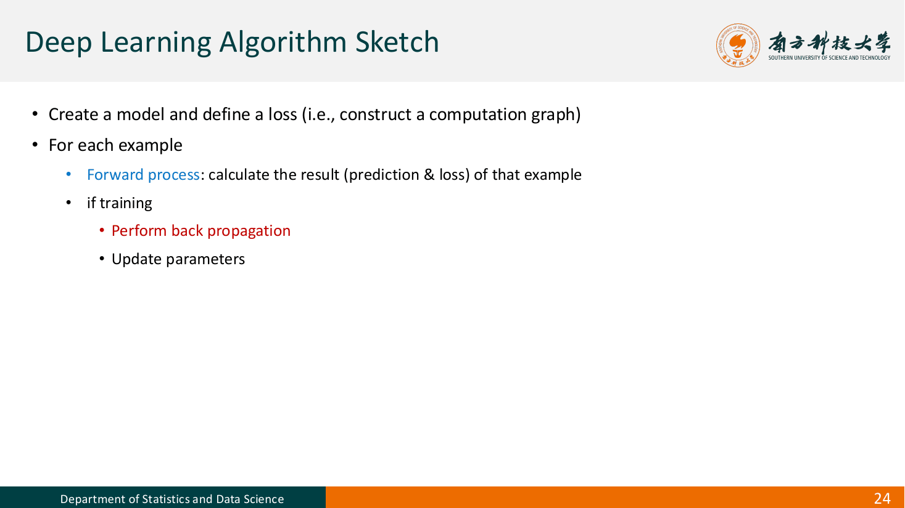

骨架图第三次出现，这次高亮的是「Forward process」（蓝）与「Perform back propagation」（红）。同时补了一个重要括号：**创建模型和损失 = 构建一张计算图（computation graph）**。这句话是 PyTorch/TensorFlow 的世界观——你写的每一行前向代码，框架都在背后记录成一个有向无环图，反向传播就是在这张图上跑链式法则。

#### P25　反向传播算法

*Back-Propagation 反向传播算法*

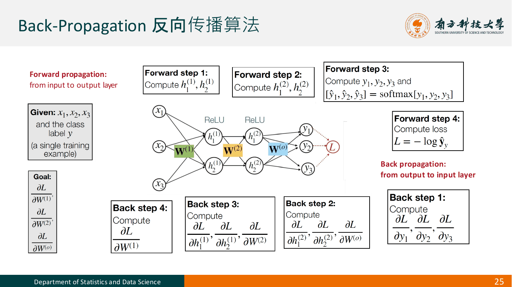

**🖼 逐元素图解：这张图要按编号走两遍**

**中间是网络本体**：左边三个圆 $x_1,x_2,x_3$；然后 **绿色方块 $W^{(1)}$** → 两个圆 $h_1^{(1)},h_2^{(1)}$（上方标 `ReLU`）；**黄色方块 $W^{(2)}$** → 两个圆 $h_1^{(2)},h_2^{(2)}$（上方标 `ReLU`）；**蓝色方块 $W^{(o)}$** → 三个圆 $y_1,y_2,y_3$；最后红色虚线箭头汇入红圈 $L$。三个彩色方块就是三组待求梯度的参数。

**上方四个白框是前向（红字 Forward propagation: from input to output layer）**，从左往右读：
Forward step 1 → 2 → 3 → 4，分别是算第一隐层、算第二隐层、算 logits 并 softmax、算损失。

**下方四个白框是反向（红字 Back propagation: from output to input layer）**，注意它们在页面上是**从右往左排列的**：最右边是 `Back step 1`，最左边是 `Back step 4`。这个排版是刻意的——**反向传播的步骤顺序与页面上的空间顺序一致，都是从输出端往输入端走**。

**左侧两个灰框**是题设和目标：`Given` 一个训练样本和标签，`Goal` 是求 $\partial L/\partial W^{(1)}$、$\partial L/\partial W^{(2)}$、$\partial L/\partial W^{(o)}$ 三个梯度。

**读图练习**：用手指沿着 $x_1\to h^{(1)}\to h^{(2)}\to y\to L$ 走一遍（前向），再倒着走一遍（反向），你会发现反向每一步用到的中间量，恰好是前向那一步刚算出来的东西——**这就是为什么必须先做完整的前向、并把中间结果存下来，才能反向。**

给定单个样本 $x_1,x_2,x_3$ 和类别标签 $y$，目标是求 $\dfrac{\partial L}{\partial W^{(1)}},\dfrac{\partial L}{\partial W^{(2)}},\dfrac{\partial L}{\partial W^{(o)}}$。

**前向四步（输入 → 输出）**

1. 算第一隐层 $h^{(1)}_1,h^{(1)}_2$（经 ReLU）
2. 算第二隐层 $h^{(2)}_1,h^{(2)}_2$（经 ReLU）
3. 算 logits $y_1,y_2,y_3$，再 softmax 得 $[\hat{y}_1,\hat{y}_2,\hat{y}_3]$
4. 算损失 $L=-\log\hat{\mathbf{y}}_y$

**反向四步（输出 → 输入，顺序正好颠倒）**

1. 算 $\partial L/\partial y_1,\partial L/\partial y_2,\partial L/\partial y_3$（就是 P22 的 $p-t$）
2. 算 $\partial L/\partial h^{(2)}_i$ 和 $\partial L/\partial W^{(o)}$
3. 算 $\partial L/\partial h^{(1)}_i$ 和 $\partial L/\partial W^{(2)}$
4. 算 $\partial L/\partial W^{(1)}$

> **💡 反向传播到底是什么**
>
> 它**不是**一种新的求导方法，就是**链式法则 + 动态规划**。关键洞见：$\partial L/\partial h^{(1)}$ 在计算 $\partial L/\partial W^{(1)}$ 和 $\partial L/\partial W^{(2)}$ 时都要用到，所以算一次存下来重复使用，避免指数级的重复计算。这就是「反向」的必要性——必须从输出往回走，才能自然复用这些中间结果。
>
> 每一层的通用模式：拿到上游传来的 $\delta=\partial L/\partial(\text{layer output})$，则对参数的梯度 $=\delta\cdot(\text{layer input})^\top$；继续往下传的 $=W^\top\delta$（再乘激活函数的导数）。

#### P26　PyTorch 里的反向传播

*Back-Propagation in PyTorch*

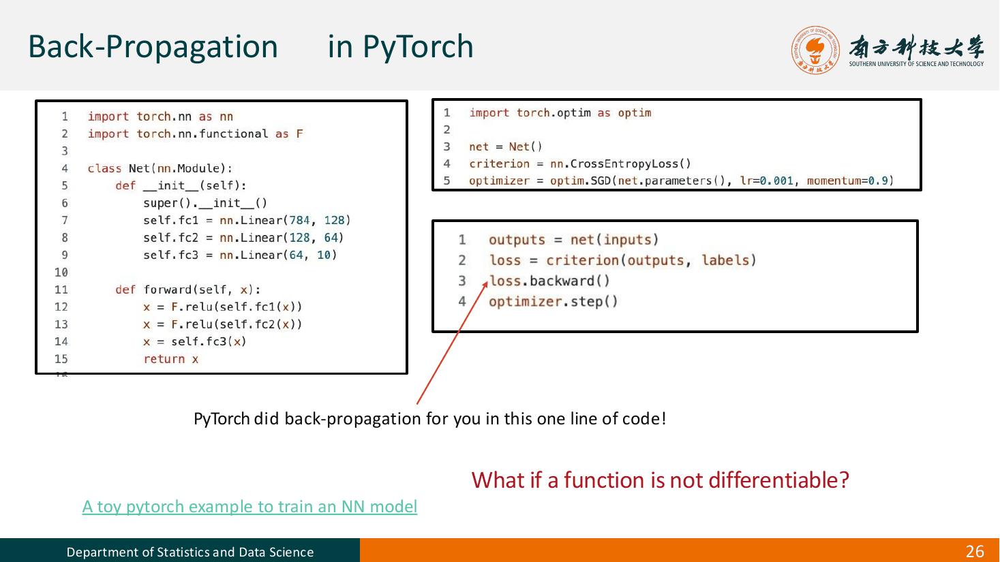

```python
net = Net()
criterion = nn.CrossEntropyLoss()
optimizer = optim.SGD(net.parameters(), lr=0.001, momentum=0.9)

outputs = net(inputs)            # 前向，同时构建计算图
loss = criterion(outputs, labels)
loss.backward()                  # ← 上一页那四步全在这一行里
optimizer.step()                 # 用梯度更新参数
```

「PyTorch 用一行代码替你做完了反向传播」——这是**自动微分（autograd）**的功劳。每个 tensor 带 `requires_grad` 标志和 `grad_fn` 指针，前向时框架把这些节点串成图，`backward()` 逆拓扑序遍历该图。

> **⚠️ 漏了一行**
>
> 课件这段代码**少了 `optimizer.zero_grad()`**。PyTorch 的梯度是**累加**的，不清零的话第二个 batch 的梯度会加到第一个上去。标准循环必须是：
>
> ```python
> optimizer.zero_grad()
> loss = criterion(net(inputs), labels)
> loss.backward()
> optimizer.step()
> ```
>
> （累加特性也有正面用途：梯度累积（gradient accumulation）——显存装不下大 batch 时，跑几个小 batch 再 step 一次，等效于大 batch。）

底部红字提问 **"What if a function is not differentiable?"** 这是留给你想的：ReLU 在 0 点不可导（实践中约定导数取 0 或 1，叫次梯度 subgradient）；采样、argmax 这类离散操作完全不可导，需要 Gumbel-Softmax、直通估计器（STE）或强化学习（REINFORCE）绕过。

#### P27　路标：更新参数

*Update parameters*

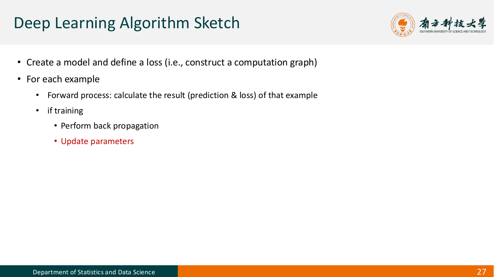

骨架图第四次出现，这次高亮最后一行。接下来 P28–P31 讲优化器。

#### P28　optimizer.step() 做了什么

*Optimizer Update*

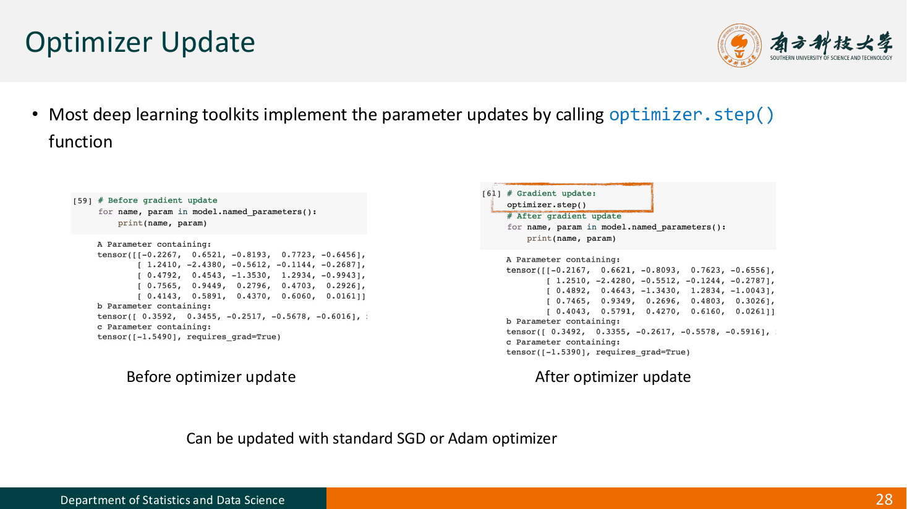

**🖼 逐元素图解**

两张 Jupyter/Colab 截图，左边标 `Before optimizer update`，右边标 `After optimizer update`。

- 两张都是在遍历 `model.named_parameters()` 并打印。输出里有三个参数：一个 5×5 的矩阵 `A`、一个 5 维向量 `b`、一个标量 `c`。
- 右图顶部多了一行被**橙色框圈出来的 `optimizer.step()`** —— 这是两张图之间唯一发生的事。
- 逐个数字对比：A 的第一个元素 `-0.2267 → -0.2167`，b 的第一个 `0.3592 → 0.3492`，c 由 `-1.5490 → -1.5390`。**每个都变了，变化量各不相同，但都在 0.01 量级。**

这张图的教学目的就一句话：**「训练」在物理上不是什么玄学，就是一堆浮点数被小步长地反复加减。**

两张截图对比 `optimizer.step()` 前后 `model.named_parameters()` 的数值。以第一个元素为例：−0.2267 → −0.2167，变化 0.01。参数 `b`：0.3592 → 0.3492；`c`：−1.5490 → −1.5390。

三个观察：所有参数都在变；每个参数的变化量不同（因为梯度不同）；变化量的数量级由学习率决定。这就是训练的全部物理现实——**不断地对一大堆数字做微小加减**。

> **💡 自己动手**
>
> 把这段代码抄下来跑一遍，打印 `param.grad`，验证 $\Delta\theta=-\eta\cdot g$。亲手看到「梯度 × 学习率 = 参数变化量」这个等式成立，比读十页公式管用。

#### P29　标准 SGD

*Standard Stochastic Gradient Descent*

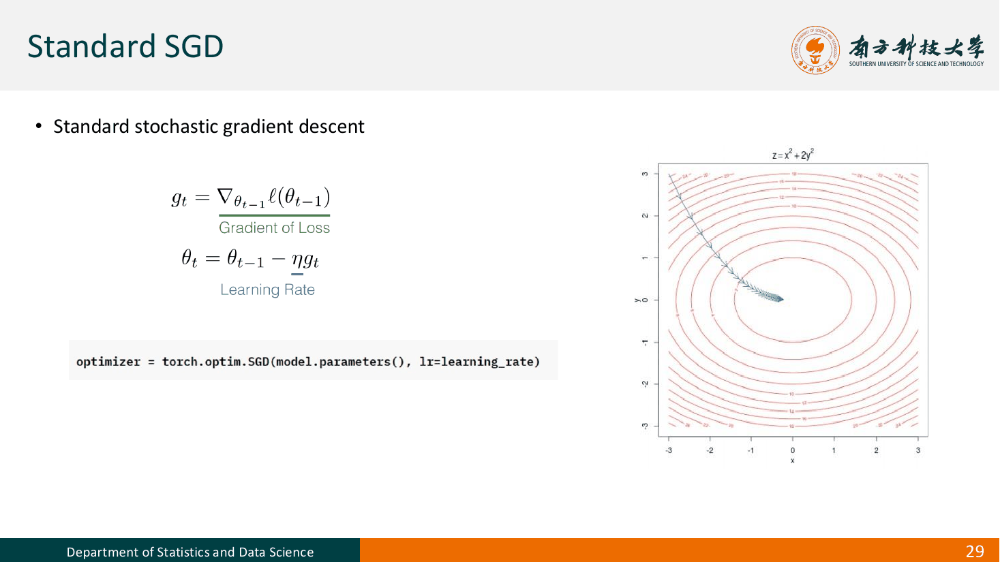

**🖼 逐元素图解**

图标题是 $z=x^2+2y^2$。红色同心椭圆是**等高线**（同一条线上 z 相同），中心是最优点 (0,0)。蓝色折线带箭头的是**优化轨迹**，从左上角 (−3, 3) 附近出发。

看三个特征：
1. **椭圆是扁的，不是圆的**——因为 y 前面的系数是 2，y 方向的曲率是 x 方向的两倍。
2. **轨迹一开始几乎垂直向下**——梯度在 y 方向大得多，所以先把 y 降下来。
3. **后半段箭头变得又密又短，沿着 x 轴慢慢爬向中心**——y 已经接近 0，只剩 x 方向的小梯度，走得很慢。

这正是「**单一学习率无法同时适配不同曲率方向**」的可视化。把这张图和 P72 左边那张扁椭圆放在一起看：**Adam 的解法是给每个方向不同的步长，归一化的解法是把椭圆掰圆。**

$$
g_t=\nabla_{\theta_{t-1}}\ell(\theta_{t-1}),\qquad \theta_t=\theta_{t-1}-\eta g_t
$$

`optimizer = torch.optim.SGD(model.parameters(), lr=learning_rate)`

「Stochastic（随机）」指的是：$\ell$ 不是整个数据集的损失，而是**一个 mini-batch 上的损失**——它是全量梯度的一个无偏但有噪声的估计。这个噪声不全是坏事，它能帮助模型逃离尖锐的局部极小和鞍点。

右图是 $z=x^2+2y^2$ 的等高线与优化轨迹。注意轨迹在 $y$ 方向（系数 2，更陡）先快速下降，再沿 $x$ 方向慢慢靠近原点——**各方向曲率不同时，单一学习率必然顾此失彼**。这正是 Adam 要解决的问题。

#### P30　Adam 优化器

*Adam Optimizer*

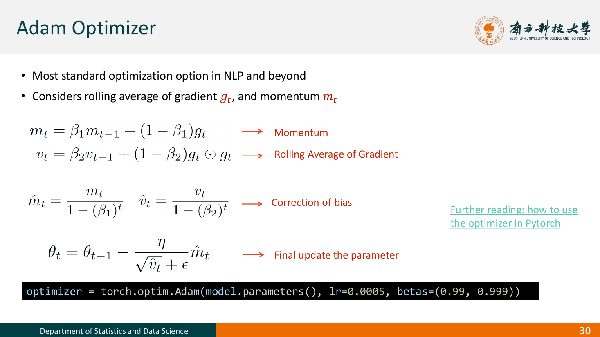

$$
m_t=\beta_1 m_{t-1}+(1-\beta_1)g_t
$$

一阶矩 · 动量

$$
v_t=\beta_2 v_{t-1}+(1-\beta_2)\,g_t\odot g_t
$$

二阶矩 · 梯度平方的滑动平均

$$
\hat{m}_t=\frac{m_t}{1-\beta_1^{\,t}},\qquad \hat{v}_t=\frac{v_t}{1-\beta_2^{\,t}}
$$

偏差校正

$$
\theta_t=\theta_{t-1}-\frac{\eta}{\sqrt{\hat{v}_t}+\epsilon}\hat{m}_t
$$

最终的参数更新

Adam = **Ada**ptive **M**oment estimation。逐条理解：

- $m_t$：梯度的指数滑动平均，起**动量**作用，平滑掉 mini-batch 噪声。
- $v_t$：**梯度平方**的滑动平均（$\odot$ 是逐元素乘）。它衡量每个参数最近梯度的「幅度」。
- 最后一行的 $\eta/(\sqrt{\hat{v}_t}+\epsilon)$ 是**逐参数的有效学习率**：某个参数梯度一直很大 → $\sqrt{v}$ 大 → 步子自动变小；梯度一直很小 → 步子自动变大。这正好治了 P29 那张椭圆等高线图的病。
- **偏差校正**：$m_0=v_0=0$，前几步的滑动平均会被 0 严重拉低。除以 $1-\beta_1^t$ 把它拉回正确尺度；$t$ 大了以后 $\beta^t\to0$，校正自动失效。

> **⚠️ 两处需要修正**
>
> ① 课件把 $v_t$ 标注成 "Rolling Average of Gradient"，准确说法应是「梯度**平方**的滑动平均」（二阶矩）；$m_t$ 才是梯度本身的滑动平均。② 代码里写的 `betas=(0.99, 0.999)` 与常用默认值 `(0.9, 0.999)` 不同。$\beta_1=0.9$ 对应约 10 步的记忆窗口，$\beta_1=0.99$ 则是约 100 步——训练 Transformer 时多数论文用 0.9（或 0.98，见原 Transformer 论文）。

> **🔭 往后一步**
>
> 实际训练大模型用的是 **AdamW**：把 L2 正则从梯度里拿出来，直接作用在参数上（decoupled weight decay）。区别在于 Adam 里的 L2 会被 $\sqrt{v}$ 除掉一部分，导致大梯度参数被正则得更弱。`torch.optim.AdamW` 已是 HuggingFace 的默认。另外 Adam 需要为每个参数存 $m,v$ 两份状态，**优化器显存 ≈ 2 倍模型参数**，这是训练显存估算的重要一项。

#### P31　学习率

*Learning Rate*

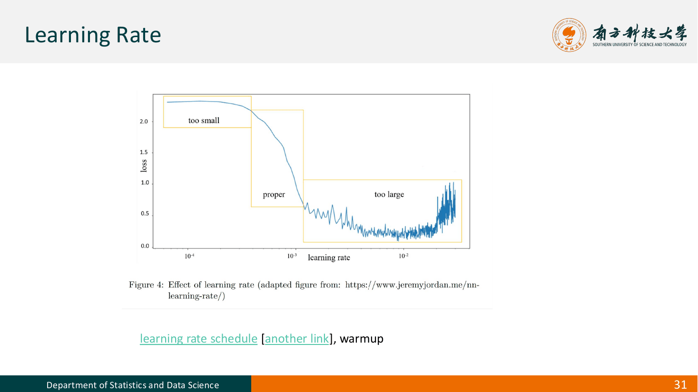

**🖼 逐元素图解**

横轴是**学习率**（对数刻度，从 $10^{-4}$ 到约 $3\times10^{-2}$），纵轴是 loss。曲线从左到右被三个黄色方框分成三段：

- 左框 `too small`：曲线基本是水平的，loss 一直停在 2.3 左右（10 分类随机猜的 $\ln 10\approx2.30$——**模型根本没学到东西**）。
- 中框 `proper`：曲线急剧下降，从 2.0 掉到 0.6。这一段的**下降最陡处**就是最佳学习率的位置。
- 右框 `too large`：曲线先在 0.2–0.6 之间剧烈抖动（每一步都在最优点附近来回跳），最后在最右端**向上翘起并剧烈震荡**——彻底发散。

**注意横轴是 loss 随学习率变化，不是随训练步数变化**。这条曲线是通过「一个 batch 换一个学习率、指数级增大」跑出来的，叫 **LR range test**，是选学习率最快的实用方法。

横轴是学习率（对数刻度 $10^{-4}\to10^{-2}$），纵轴是损失。三个区域：

- **too small**（$<3\times10^{-4}$）：损失几乎不动，训练极慢。
- **proper**（约 $3\times10^{-4}\sim10^{-3}$）：损失陡降，这一段是甜区。
- **too large**（$>10^{-2}$）：曲线剧烈震荡并最终发散上扬。

这张图其实是 **LR range test** 的产物：从极小学习率开始，每个 batch 指数级增大学习率并记录 loss，然后选「下降最陡处」附近的值。是个非常实用的调参技巧。

底部两个链接指向 **learning rate schedule** 和 **warmup**：

- **Warmup**：前几千步把学习率从 0 线性升到峰值。原因是训练初期 Adam 的 $\hat{v}$ 估计还不可靠，直接用大学习率容易崩。训练 Transformer 几乎必备。
- **Decay**：之后按 cosine 或 $1/\sqrt{t}$ 衰减。原论文的公式是 $\eta=d_{model}^{-0.5}\cdot\min(t^{-0.5},\ t\cdot\text{warmup}^{-1.5})$——先线性升、后按 $t^{-0.5}$ 降。

#### P32　效率技巧：Mini-batching

*Efficiency Tricks: Mini-batching*

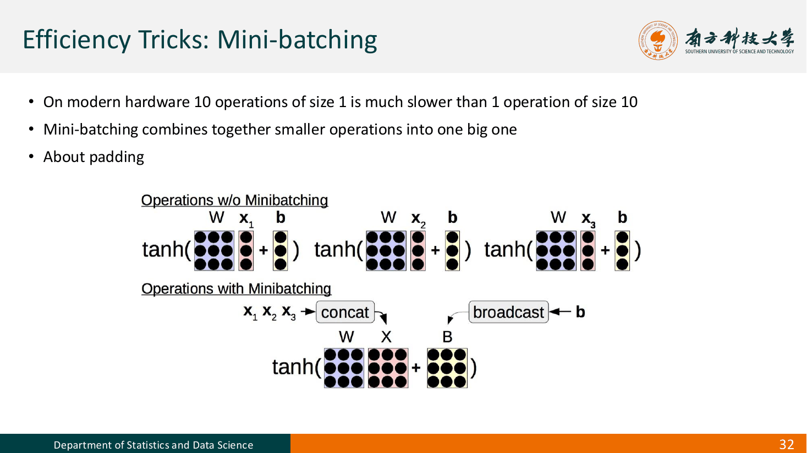

**🖼 逐元素图解**

图分上下两排，黑色小圆点代表矩阵/向量里的一个元素。

**上排 `Operations w/o Minibatching`**：三个独立的表达式 $\tanh(W\mathbf{x}_i+\mathbf{b})$，$i=1,2,3$。每个里面：紫框的 3×3 点阵是 `W`，粉框的 3×1 是 $\mathbf{x}_i$，黄框的 3×1 是 $\mathbf{b}$。**同一个 W 和 b 被画了三遍**——它们每次都要重新从显存搬到计算单元一次。

**下排 `Operations with Minibatching`**：
- 左边标 `concat`：$\mathbf{x}_1,\mathbf{x}_2,\mathbf{x}_3$ 三个列向量被**横向拼**成一个 3×3 的粉色矩阵 `X`。
- 右边标 `broadcast`：一个 3×1 的 $\mathbf{b}$ 被**复制三列**变成 3×3 的黄色矩阵 `B`。
- 结果是一次 $\tanh(WX+B)$。

**数学结果与上排逐字相同，但 GPU 上的耗时可能差一个数量级。**这就是所有深度学习框架都以 batch 为单位组织计算的原因。顺带一提，`broadcast` 在 PyTorch/NumPy 里是自动的，你写 `W @ X + b` 就已经在做图里那件事了。

核心事实：**现代硬件上，做 10 次 size-1 的运算，远慢于做 1 次 size-10 的运算**。GPU 有上万个核心，小矩阵乘法根本喂不饱，瓶颈全在 kernel 启动和访存开销上。

图上对比很直观：不做 mini-batch 时是三次独立的 $\tanh(Wx_i+b)$；做 mini-batch 时，把 $x_1,x_2,x_3$ **concat** 成矩阵 $X$，把 $b$ **broadcast** 成 $B$，一次 $\tanh(WX+B)$ 搞定。数学结果完全相同，速度差一个数量级。

**关于 padding**：句子长度不同，要 concat 成矩阵就必须补齐到同一长度（补 `<pad>`）。这带来两个必须处理的问题：

- **注意力要屏蔽 pad 位**：给 padding 位置的注意力分数加 $-\infty$（padding mask），否则真实 token 会去「注意」无意义的填充。*注意这与 P63 的因果掩码是两件不同的 mask，实际实现中要按位或起来。*
- **损失要忽略 pad 位**：`nn.CrossEntropyLoss(ignore_index=pad_id)`。

> **💡 实用技巧**
>
> 把长度相近的句子放进同一个 batch（**bucketing / length-grouped sampling**），能大幅减少 padding 浪费。HuggingFace 的 `group_by_length=True` 就是干这个的。

#### P33　训练配方

*A Recipe for Training Neural Networks*


骨架图最后一次出现，顶上加了 Andrej Karpathy 的经典博文链接。那篇文章的核心主张值得抄下来：

1. **先和数据成为一体**——肉眼过数据，找重复、找标注错误、找分布偏移。
2. **搭端到端骨架 + 无脑基线**——固定随机种子，先跑通流程，拿到一个「傻瓜基线」（比如永远预测最高频类）的分数。
3. **先过拟合一个小样本**——拿 2 个样本训练，如果 loss 降不到 0，说明代码有 bug，而不是模型不行。这是最有用的一条调试法则。
4. **再正则化**——加数据、加 dropout、加 weight decay、早停。
5. **最后调超参 / 集成**。

本页还重贴了 SGD 与动量的公式，它们在 P6 已经讲过。

#### P34　代码实践：PyTorch 官方语言模型示例

*Coding Practice*

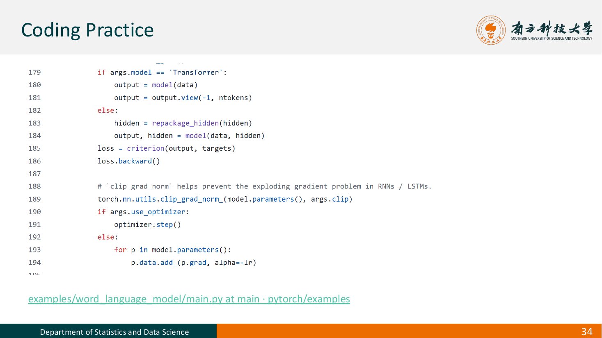

```python
if args.model == 'Transformer':
    output = model(data)
    output = output.view(-1, ntokens)     # (B*L, |V|) 展平后算 CE
else:
    hidden = repackage_hidden(hidden)     # RNN 路线：切断历史计算图
    output, hidden = model(data, hidden)
loss = criterion(output, targets)
loss.backward()

# clip_grad_norm 缓解 RNN/LSTM 的梯度爆炸
torch.nn.utils.clip_grad_norm_(model.parameters(), args.clip)
if args.use_optimizer:
    optimizer.step()
else:
    for p in model.parameters():
        p.data.add_(p.grad, alpha=-lr)    # 手写 SGD：θ ← θ - lr·g
```

三个值得学的点：

- `output.view(-1, ntokens)`：把 `(batch, seq_len, |V|)` 压成 `(batch*seq_len, |V|)`，因为 `CrossEntropyLoss` 要求二维输入。这是序列任务算损失的标准动作。
- `repackage_hidden`：RNN 分支才需要，作用是把隐状态从计算图上摘下来（`detach`），否则反向传播会一路回溯到第一个 batch。Transformer 分支不需要——它没有跨 batch 的状态。
- `clip_grad_norm_`：把所有参数的梯度看作一个大向量，如果它的 L2 范数超过阈值就等比缩放。注意**方向不变、只缩长度**。必须放在 `backward()` 之后、`step()` 之前。虽然注释说是给 RNN 用的，训练 Transformer 时同样是标配（常用阈值 1.0）。
- 最后那两行手写 SGD 展示了「优化器无非就是这行加减法」，与 P28 的截图互相印证。

#### P35　延伸阅读：优化

*Further Reading*

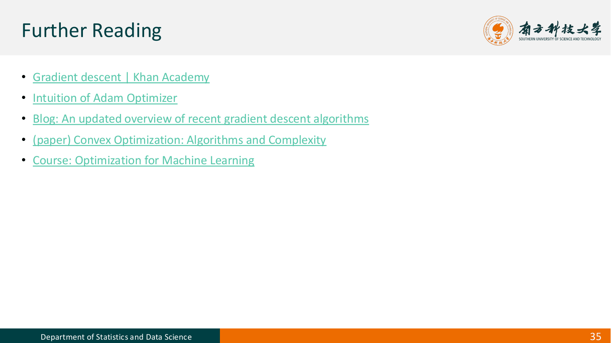

Khan Academy 的梯度下降入门、Adam 的直觉解读、梯度下降算法综述博客、凸优化的算法与复杂度（论文）、机器学习优化课程。

按你的基础挑：只想会用 → 看 Adam 直觉那篇；想系统理解各优化器差异 → 看那篇综述（Sebastian Ruder 的 overview 是经典）；想做理论 → Bubeck 的凸优化。

#### P36　延伸阅读：深度学习入门

*Further Reading*


《Information Theory From Coding to Learning》、Karpathy 的 **Neural Networks: Zero to Hero**、两门深度学习导论课（含 MIT 的）、GitHub 学生免费资源、以及两本中文面试书《百面机器学习》《百面深度学习》。

> **💡 强烈推荐**
>
> Karpathy 的 *Zero to Hero* 系列里有一集叫 **"Let's build GPT: from scratch, in code, spelled out"**，两小时内从零手写一个能跑的 GPT。看完这一讲课件之后立刻去跟着敲一遍，本讲 P45–P81 的所有模块都会在代码里一一对应上，理解会从「看懂」跳到「会写」。


### 📝 本模块练习（P5–P36）

先自己写答案，再看解析。带 ★ 的是常见笔试/面试题。

**1. ★** 一个三层全连接网络，输入 784 维，两个隐层分别 256 和 128 维，输出 10 类。不算 bias，总共多少参数？算上 bias 呢？

<details><summary>解析</summary>

不算 bias：$784\times256+256\times128+128\times10=200704+32768+1280=234752$。

算上 bias：每层的 bias 维度等于该层输出维度，共 $256+128+10=394$，总计 **235146**。

**解题模板**：全连接层参数 = 输入维 × 输出维 + 输出维。维度永远写成 `(out, in)`，写代码时 `nn.Linear(in, out)` 的顺序正好相反，别弄混。
</details>

**2.** 如果把网络里所有激活函数都换成恒等映射 $f(x)=x$，这个 10 层网络还能表达什么？

<details><summary>解析</summary>

只能表达一个线性映射。因为 $W_{10}(W_9(\cdots W_1x))=(W_{10}W_9\cdots W_1)x=Wx$，10 个矩阵的乘积仍然是一个矩阵。

**推论**：深度带来的表达力完全依赖非线性。这也是为什么 P68 强调 FFN 给注意力「提供非线性」——注意力本身是加权平均，是线性的。
</details>

**3. ★** 推导 softmax + 交叉熵对 logits 的梯度，证明它等于 $p-t$。

<details><summary>解析</summary>

设 $p_k=\frac{e^{z_k}}{\sum_j e^{z_j}}$，真实类别为 $c$，$\mathcal{L}=-\log p_c$。

先求 softmax 的导数：当 $k=i$ 时 $\frac{\partial p_k}{\partial z_i}=p_k(1-p_k)$；当 $k\ne i$ 时 $\frac{\partial p_k}{\partial z_i}=-p_kp_i$。合并写成 $\frac{\partial p_k}{\partial z_i}=p_k(\delta_{ki}-p_i)$。

于是

$$
\frac{\partial\mathcal{L}}{\partial z_i}=-\frac{1}{p_c}\cdot\frac{\partial p_c}{\partial z_i}=-\frac{1}{p_c}p_c(\delta_{ci}-p_i)=p_i-\delta_{ci}
$$

写成向量就是 $p-t$，$t$ 是 one-hot。具体数值可见附录 B 第 2 节。
</details>

**4.** 为什么 PyTorch 的 `nn.CrossEntropyLoss` 要求你传入 logits 而不是 softmax 之后的概率？

<details><summary>解析</summary>

两个理由：

① **数值稳定**。直接算 $\log(\mathrm{softmax}(z))$ 会先求 $e^{z}$ 再求 $\log$，$z$ 稍大就上溢。内部用的是 log-sum-exp 技巧：$\log p_c=z_c-\max_j z_j-\log\sum_j e^{z_j-\max_j z_j}$，全程不会溢出。

② **梯度更干净**。融合实现可以直接输出 $p-t$，不必经过两次链式求导。

所以模型最后一层不要加 softmax，这是第 3 题结论的工程体现。
</details>

**5. ★** Adam 的偏差校正为什么必要？如果去掉会怎样？

<details><summary>解析</summary>

因为 $m_0=v_0=0$。第一步时 $m_1=(1-\beta_1)g_1$，若 $\beta_1=0.9$ 则 $m_1=0.1g_1$——只有真实梯度的十分之一。同理 $v_1=0.001 g_1^2$（$\beta_2=0.999$），严重偏小。

若不校正：$\frac{m_1}{\sqrt{v_1}}=\frac{0.1g}{\sqrt{0.001}|g|}=\frac{0.1}{0.0316}\approx 3.16$，**第一步的有效步长会是学习率的 3 倍多**，训练初期极易发散。

校正后：$\hat{m}_1=\frac{0.1g}{1-0.9}=g$，$\hat{v}_1=\frac{0.001g^2}{1-0.999}=g^2$，比值恰为 1，步长正好是 $\eta$。

随着 $t$ 增大，$\beta^t\to0$，分母趋近 1，校正自动退出。
</details>

**6.** 一个 batch 里有三句话，长度分别是 5、12、7。若直接 padding 到 12，浪费了多少比例的计算？如果先按长度分桶再组 batch，能省多少？

<details><summary>解析</summary>

有效 token 数 $5+12+7=24$，padding 后是 $3\times12=36$，浪费 $12/36=33\%$。注意自注意力的代价是 $O(n^2)$，按 token 对计算浪费更大：$3\times12^2=432$ vs $25+144+49=218$，浪费 **50%**。

分桶（把 5 和 7 放一个 batch、12 单独）后浪费降到 $(2\times7-12)/14\approx14\%$。这就是 `group_by_length` 的价值。
</details>

**7. ★** 训练时 loss 突然变成 `NaN`，列出至少四个排查方向。

<details><summary>解析</summary>

① **学习率过大**——最常见，先把 lr 降十倍试。
② **梯度爆炸**——加 `clip_grad_norm_`，并打印梯度范数看是否在某一步骤突然飙升。
③ **除零或 log(0)**——自定义损失里出现 $\log 0$、$0/0$；LayerNorm 的 eps 被设成 0；softmax 某一行被全部 mask 成 $-\infty$。
④ **混合精度溢出**——FP16 的最大值约 65504，注意力分数不缩放很容易超。用 `-1e9` 代替 `-inf` 也是为了这个。
⑤ **数据里有脏值**——NaN/Inf 混进输入，或标签越界（大于类别数）。

**排查顺序建议**：先把 lr 降到 1/10 看是否复现（区分 ①②）；再用 `torch.autograd.set_detect_anomaly(True)` 定位到具体算子。
</details>

**8.** 为什么 `model.eval()` 不能替代 `torch.no_grad()`，反过来也不行？

<details><summary>解析</summary>

它们管的是**两件正交的事**：

- `model.eval()` 改变**模块的行为**：dropout 停止丢弃，BatchNorm 改用滑动统计量。但计算图照样构建，显存照样涨。
- `torch.no_grad()` 改变**是否记录计算图**：省显存、提速，但 dropout 仍然在随机丢东西。

评估时必须两个都用。写成 `with torch.no_grad(): model.eval(); ...` 也可以，但更稳妥的是在循环外调 `model.eval()`，评估结束后记得 `model.train()` 切回去。
</details>

## 词嵌入与分词

`Part 3 · P37–P38`

两页解决一个问题：一串字符怎么变成神经网络能吃的实数向量。

#### P37　词嵌入

*Word Embedding*

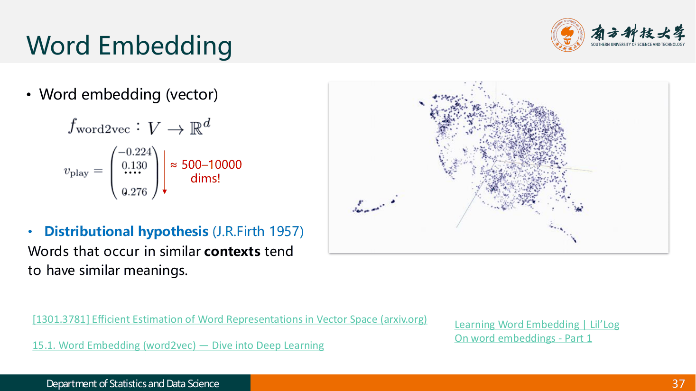

**🖼 逐元素图解**

右边那张散点图是把高维词向量用降维算法（t-SNE 或 UMAP）压到二维后画出来的，每个蓝点是一个词。

看两件事：
1. **点不是均匀撒开的，而是结成一团一团**。每个团就是一个语义簇——数字、国家名、动词过去式等等会各自聚在一起。
2. **有几条淡色的长线从主团伸出去**。那通常是某类特殊 token（罕见词、数字序列、标点）形成的「细丝」结构。

这张图是分布假说的**实证**：训练时没有任何人告诉模型「苹果和梨是一类」，但因为它们出现的上下文相似，向量就自然靠到了一起。

$$
f_{\mathrm{word2vec}}:V\rightarrow\mathbb{R}^{d}
$$

一个词被映射成一个 $d$ 维稠密向量，例如 $v_{\text{play}}=(-0.224,\,0.130,\,\dots,\,0.276)^\top$。课件标注维度 ≈ 500–10000。

**分布假说（Distributional Hypothesis，J.R. Firth 1957）：出现在相似上下文中的词，意义也相似。**原话是 "You shall know a word by the company it keeps."——这一句话撑起了整个现代 NLP。word2vec、GloVe、BERT、GPT 的训练目标本质上都是它的不同实现。

为什么不用 one-hot：one-hot 是 $|V|$ 维、极度稀疏，而且任意两个词的内积都是 0——"cat" 和 "kitten" 与 "cat" 和 "database" 一样远，向量本身不携带任何语义。稠密嵌入把语义编码进了几何结构里，于是有了著名的 $v_{king}-v_{man}+v_{woman}\approx v_{queen}$。

右图是嵌入空间降维（t-SNE/UMAP）后的散点，能看到明显的簇——那些簇就是语义类别。

> **💡 从静态到动态**
>
> word2vec 是**静态**嵌入：一个词永远一个向量，"bank"（银行/河岸）只能有一个表示。Transformer 的嵌入层虽然也是静态查表，但经过若干层自注意力之后，每个位置的表示就变成了**上下文相关**的——这正是 P48 自注意力要做的事。可以说：**嵌入层给出词的先验含义，注意力层根据上下文把它改写成实际含义。**
>
> 另外，课件写的 500–10000 维偏大。word2vec 常用 300 维；Transformer base 的 $d_{model}=512$；GPT-3 175B 是 12288 维（见 P81 的表）。

#### P38　分词

*Tokenization: BPE / WordPiece / SentencePiece*

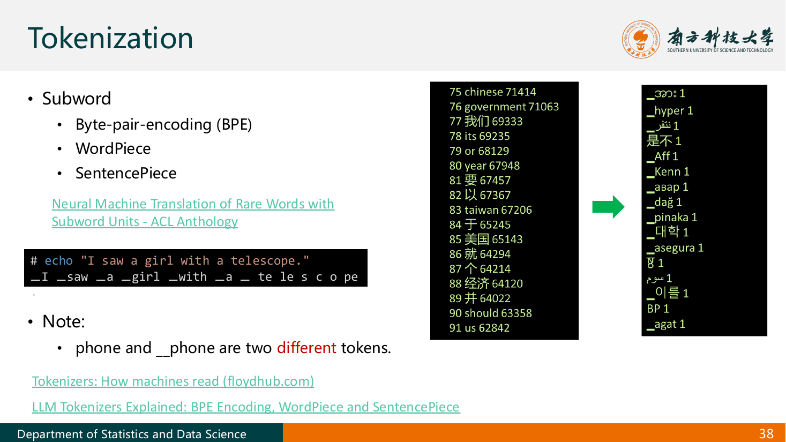

**🖼 逐元素图解：三块内容**

**左中黑底框**是分词示例：输入 `"I saw a girl with a telescope."`，输出 `_I _saw _a _girl _with _a _ te le s c o pe`。逐个数：前六个 token 都带前缀下划线且是完整单词；`telescope` 被切成了 `te le s c o pe` 六片，且只有第一片带下划线。**下划线的位置告诉你「词从这里开始」，这是解码时还原空格的依据。**

**右侧两张黑底截图是词表按频次排序的两端**：
- 左边那张是**高频区**（排名 75–91）：`chinese 71414`、`government 71063`、`我们 69333`、`its 69235`… 数字是该 token 在语料里出现的次数，都是几万次。
- 右边那张是**长尾区**：每个 token 后面的数字都是 **1**，而且混杂了缅甸语、阿拉伯语、韩语、土耳其语、西班牙语的碎片。

中间那个绿色大箭头连接两张图，意思是「同一个词表，从头翻到尾」。**两张图放在一起就是 Zipf 定律的实物照片**：极少数 token 占掉绝大部分出现次数，而海量 token 只出现一次。BPE 的全部工作，就是决定「哪些串值得占一个词表位置」。

**为什么需要子词（subword）**：按词切分会遇到 OOV（未登录词）——测试时出现训练里没见过的词就没法处理，而且词表会爆炸（形态丰富的语言尤其严重）。按字符切分没有 OOV，但序列太长、单个字符语义太弱。子词是折中：**常见词保持完整，罕见词拆成有意义的片段。**

课件的例子：

```
# echo "I saw a girl with a telescope."
_I _saw _a _girl _with _a _ te le s c o pe
```

读出三件事：常见词 "I / saw / a / girl / with" 都是完整 token；罕见词 "telescope" 被拆成 `te le s c o pe` 六片；下划线 `_`（实际是 ▁，U+2581）标记**词首**，这样解码时能无损还原空格。

> **⚠️ 课件特别强调的坑**
>
> `phone` 和 `_phone` 是**两个不同的 token**，有各自独立的嵌入向量。这解释了很多实际现象：为什么 prompt 结尾多一个空格会让模型行为变化；为什么 `" Paris"` 和 `"Paris"` 的 logits 不一样。写 prompt、做 token 级评测时务必注意。

**三种算法的区别**

| 算法 | 合并准则 | 代表模型 |
| --- | --- | --- |
| BPE（Byte-Pair Encoding） | 反复合并语料中**出现频次最高**的相邻符号对，直到词表达到目标大小 | GPT-2/3/4、RoBERTa |
| WordPiece | 合并能让语料**似然增益最大**的对（近似为 $\frac{\mathrm{count}(xy)}{\mathrm{count}(x)\mathrm{count}(y)}$ 最大） | BERT |
| SentencePiece | 不是独立算法，而是一个**框架**：直接在原始字节流上跑 BPE 或 Unigram，**不依赖空格预切分**，因此对中日韩等无空格语言友好 | T5、LLaMA、多数多语言模型 |

右侧两张截图是词频表：左边是按频次排序的词（"chinese 71414"、"我们 69333"、"经济 64120"…），右边是频次只有 1 的长尾词（缅甸语、阿拉伯语、韩语、土耳其语…）。这直观展示了 **Zipf 定律**——少数词占据绝大多数出现次数，海量词只出现一次。BPE 要做的就是：把左边那些高频词整个保留，把右边那些长尾拆成可复用的片段。

参考文献是 Sennrich 等 2016 的 *Neural Machine Translation of Rare Words with Subword Units*——BPE 引入 NLP 的奠基论文。


### 📝 本模块练习（P37–P38）

**1.** 为什么子词分词能同时解决 OOV 和词表爆炸两个问题？

<details><summary>解析</summary>

**OOV**：任何字符串最坏情况下都能拆成单个字符，而字符集是有限且完全覆盖的，所以永远不会遇到「无法表示」的输入（字节级 BPE 更彻底，直接在 256 个字节上操作，理论上零 OOV）。

**词表爆炸**：词表大小由你指定（比如 32k），BPE 只把最值得的那 32k 个串收进来。形态变化（run/running/runner）共享词根片段，不必各占一个词表位。
</details>

**2. ★** 手动跑一遍 BPE。语料是 `low low low low low lower lower newest newest newest widest widest`，初始按字符切分（词尾加 `</w>`）。前三次合并是什么？

<details><summary>解析</summary>

统计相邻符号对的频次（按词频加权）：

- `l o` 出现在 low(5) + lower(2) = **7**
- `o w` 同样 **7**
- `e s` 出现在 newest(3) + widest(2) = **5**
- `s t` 同样 **5**
- `e r` 出现在 lower(2) = 2

第 1 次合并 `l o → lo`（并列最高，按实现取先出现的）。
第 2 次：现在 `lo w` 频次 7，仍最高 → 合并成 `low`。
第 3 次：`e s` 频次 5 最高 → 合并成 `es`。

再往下会得到 `est`、`est</w>` 等。**规律**：BPE 自动发现了 `low` 这个词根和 `est` 这个后缀，没有任何语言学知识输入。
</details>

**3.** 为什么 `"Paris"` 和 `" Paris"`（前面带空格）在 GPT 类模型里是不同的 token？这会带来什么实际影响？

<details><summary>解析</summary>

因为 BPE 把「词首空格」并入了 token 本身（SentencePiece 用 ▁ 显式标记）。这样解码时不需要额外规则就能还原空格。

**实际影响**：
- prompt 结尾多一个空格，会改变下一个 token 的候选分布，有时导致明显的质量下降。
- 做 token 级约束生成或打分时，必须确认自己比较的是同一个 token（带空格的 vs 不带的）。
- few-shot 示例里格式要统一，否则模型会被空格模式带偏。
</details>

## 注意力机制的由来

`Part 4 · P39–P44`

六页讲清楚：注意力最初是为了解决 RNN 翻译的「信息瓶颈」，后来才被抽象成一个通用算子。理解这段历史，才知道 Q/K/V 三个名字是怎么来的。

#### P39　注意力机制：解决瓶颈问题

*Attention Mechanism*

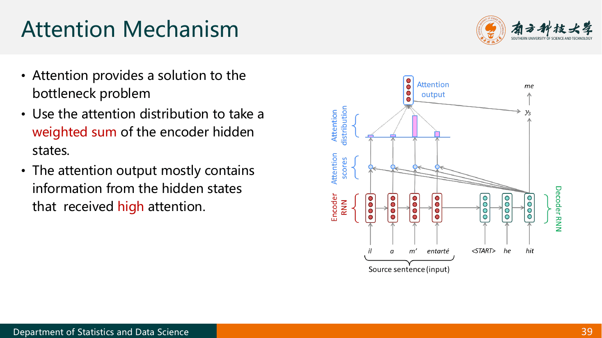

**🖼 逐元素图解：这张图 P39–P41 会用三次，先把元件认全**

从下往上五层：

1. **最下面一行斜体单词**：左边 `il a m' entarté` 是法语源句，右边 `<START> he hit` 是已经生成的英文译文。
2. **红色方块链（标 `Encoder RNN`）**：4 个方块，每个方块内部画了 4 个小圆点表示这是一个向量。方块之间有横向箭头——RNN 的隐状态传递。
3. **绿色方块链（标 `Decoder RNN`）**：3 个方块，同样有横向箭头，而且最左边那个还接收来自编码器的箭头。
4. **蓝色小圆点那一行（标 `Attention scores`）**：4 个点，每个点上都有**两条线汇入**——一条从下方对应的编码器方块来，一条从右边最后那个解码器方块来。**这两条线就是「$h_i$ 和 $s_t$ 做点积」的图形表示。**
5. **蓝色横条 + 柱子（标 `Attention distribution`）**：4 根柱子，高度就是 softmax 之后的权重。图上**第三根（对应源句的 `m'`／`entarté` 位置）明显最高**，是粉紫色高亮的。
6. **最上方的蓝色向量（标 `Attention output`）**：4 个圆点，由下方四根柱子按权重加权求和得到（图上用虚线连接）。它再和右边的 $y_3$ 汇合，最终输出单词 `me`。

**读图顺序**：下→上，就是「编码 → 打分 → 归一化 → 加权求和 → 预测」。这个顺序对 P40、P41 同样适用。

**什么是 bottleneck problem**：早期 seq2seq 翻译模型把整个源句压缩成编码器的**最后一个隐状态**，解码器只能靠这一个固定长度向量生成整句译文。句子一长，这个向量就装不下——这就是信息瓶颈。

注意力的解法：**不再只用最后一个状态，而是在解码的每一步，对所有编码器隐状态做一次加权求和**。权重由当前解码状态决定。

图上从下往上读：Encoder RNN 处理法语 "il a m' entarté"，产生四个隐状态；Decoder RNN 在生成第三个词时（已生成 "he hit"），用当前状态去和四个编码器状态算 **Attention scores** → softmax 得到 **Attention distribution**（图中第三根柱子明显最高，对应 "entarté"）→ 加权求和得到 **Attention output** → 与解码状态一起预测出 "me"。

课件那句总结很准：「注意力输出主要包含了那些*获得高注意力*的隐状态的信息」。

#### P40　注意力的计算：打分与归一化

*Attention scores → distribution*

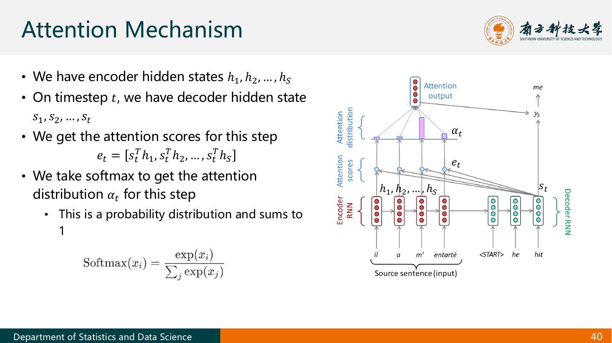

**🖼 逐元素图解：同一张图，这次标上了符号**

相比 P39，图上多了四个记号：

- 编码器方块下方标 $h_1,h_2,\dots,h_S$ —— 编码器隐状态。
- 最右边的解码器方块标 $s_t$ —— 当前时刻的解码器隐状态。**注意只有一个 $s_t$ 参与打分**，它同时和所有 $h_i$ 连线。
- 蓝色圆点那一行标 $e_t$ —— 打分结果（未归一化）。
- 柱状图那一行标 $\alpha_t$ —— softmax 之后的分布。

**对着公式 $e_t=[s_t^\top h_1, s_t^\top h_2,\dots,s_t^\top h_S]$ 看图**：方括号里有 S 项，图上就有 S 个蓝色圆点；每一项是一个内积，图上每个圆点就有两条输入线。**公式的每个符号在图上都有一个对应的图元，一一对上就算读懂了。**

记编码器隐状态 $h_1,\dots,h_S$，第 $t$ 步的解码器隐状态 $s_t$。

**第一步，算注意力分数**（这里用最简单的点积）：

$$
e_t=\left[s_t^\top h_1,\ s_t^\top h_2,\ \dots,\ s_t^\top h_S\right]\in\mathbb{R}^{S}
$$

点积衡量两个向量的「对齐程度」——方向越一致、模长越大，分数越高。

**第二步，softmax 归一化**得到注意力分布：

$$
\alpha_t=\mathrm{softmax}(e_t),\qquad \mathrm{Softmax}(x_i)=\frac{\exp(x_i)}{\sum_j\exp(x_j)}
$$

$\alpha_t$ 是一个合法的概率分布：非负、和为 1。它可以读成「第 $t$ 步的译文位置，应该看源句第几个词」。

> **💡 为什么要 softmax 而不是直接归一化**
>
> softmax 有两个不可替代的性质：把任意实数（含负数）映射成正的权重；**指数放大差距**，让「相对更相关」的位置获得压倒性权重，趋向于软性的选择而非平均。同时它处处可导，可以端到端训练——这是「hard attention」（直接取 argmax）做不到的。

#### P41　注意力的计算：加权求和与预测

*Luong Attention*

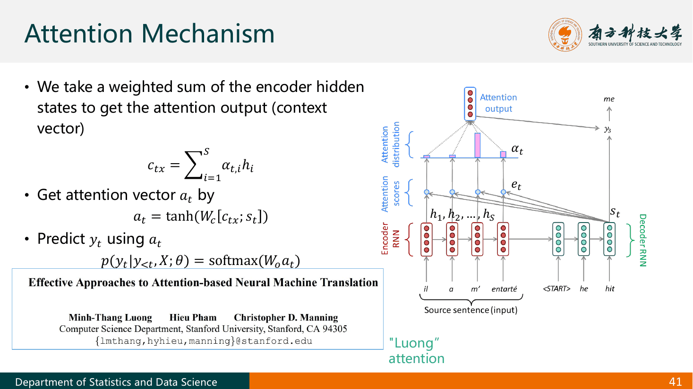

**🖼 逐元素图解：第三次用这张图，补上最后两步**

这一页图没变，变的是公式覆盖到了图的最上方：

- $c_{tx}=\sum_i\alpha_{t,i}h_i$ 对应图上**柱状图 → Attention output 那束虚线**（按柱子高度加权，把四个 $h_i$ 汇总成一个向量）。
- $a_t=\tanh(W_c[c_{tx};s_t])$ 对应图上 **Attention output 与 $s_t$ 汇合**的那个箭头交汇点。方括号里的分号 `;` 是拼接，两个 d 维向量变成一个 2d 维向量，再被 $W_c$ 压回 d 维。
- $p(y_t\mid\cdot)=\mathrm{softmax}(W_o a_t)$ 对应最右上方 $y_3\to$ `me` 那一段。

**至此 P39–P41 三页合起来，完整走完了一次带注意力的解码步骤**：打分 → 归一化 → 加权求和 → 拼接融合 → 预测。

**第三步，加权求和**得到上下文向量（context vector）：

$$
c_{tx}=\sum_{i=1}^{S}\alpha_{t,i}h_i
$$

这就是「注意力输出」——一个针对当前解码步定制的源句摘要。注意它和 $h_i$ 同维，但内容随 $t$ 变化，这正是它比「固定的最后隐状态」强的地方。

**第四步，融合并预测**：

$$
a_t=\tanh\!\left(W_c[c_{tx};s_t]\right)
$$

$$
p(y_t\mid y_{<t},X;\theta)=\mathrm{softmax}(W_o a_t)
$$

$[c_{tx};s_t]$ 是拼接（concat），维度翻倍；$W_c$ 把它投影回原维度；$\tanh$ 提供非线性。

这一套出自 **Luong et al., 2015**（Stanford，*Effective Approaches to Attention-based NMT*），通常叫 **Luong attention** 或 **multiplicative attention**。

#### P42　另一种打分方式：Bahdanau 注意力

*Additive Attention*

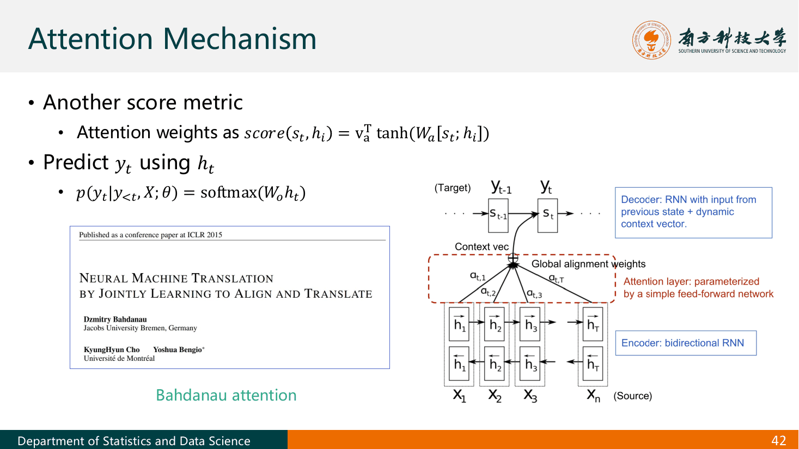

**🖼 逐元素图解：注意这是另一张图，结构不同**

- **最下方一行 $X_1,X_2,X_3,\dots,X_n$**：源句（标 `(Source)`）。
- **紧上方两排带箭头的方块**：上排箭头朝右（$\overrightarrow{h_1}\to\overrightarrow{h_2}\to\cdots$），下排箭头朝左（$\overleftarrow{h_1}\leftarrow\overleftarrow{h_2}\leftarrow\cdots$）。**这就是双向 RNN**——每个位置的表示由「从左读到这里」和「从右读到这里」两个向量拼成。右侧蓝框注释写着 `Encoder: bidirectional RNN`。
- **红色虚线框**框住的是注意力层，右侧注释 `Attention layer: parameterized by a simple feed-forward network`——**注意这句话，它点明了加性注意力与点积注意力的本质区别：这里的打分是一个小神经网络，有自己的参数 $W_a,\mathbf{v}_a$。**
- **红框内的 $\alpha_{t,1},\alpha_{t,2},\alpha_{t,3},\dots,\alpha_{t,T}$**：标注 `Global alignment weights`，四条线汇聚到上方一个 ⊕ 节点。
- **⊕ 节点标 `Context vec`**：加权求和的结果。
- **最上方 $s_{t-1}\to s_t$，再往上是 $y_{t-1}, y_t$**：解码器。右上蓝框注释 `Decoder: RNN with input from previous state + dynamic context vector`——**注意 "input"这个词**：Bahdanau 把上下文向量作为 RNN 的**输入**，而 Luong 是把它拿去**预测**。这是两者最实质的差别，图上就写着。

$$
\mathrm{score}(s_t,h_i)=\mathbf{v}_a^\top\tanh\!\left(W_a[s_t;h_i]\right)
$$

与点积不同，这里用一个**小型前馈网络**来打分：先拼接、过一个线性层加 tanh，再用向量 $\mathbf{v}_a$ 压成标量。因为主体运算是加法后过 tanh，所以叫 **additive attention**。

出自 **Bahdanau, Cho, Bengio, ICLR 2015**——*Neural Machine Translation by Jointly Learning to Align and Translate*，注意力机制的开山之作。

|   | Bahdanau (2015) | Luong (2015) |
| --- | --- | --- |
| 打分函数 | 加性（小 MLP） | 乘性（点积 / $s^\top W h$） |
| 用哪个解码状态打分 | $s_{t-1}$（上一步） | $s_t$（当前步） |
| 上下文向量的去向 | 作为**输入**喂给 RNN 算 $s_t$ | 与 $s_t$ 拼接后直接用于**预测** |
| 编码器 | 双向 RNN（图中 $\overrightarrow{h}$ 与 $\overleftarrow{h}$） | 单向堆叠 LSTM |
| 维度不同时 | 天然支持（拼接即可） | 点积要求同维，需加 $W_a$ |
| 速度 | 慢（多一个 MLP） | 快（可用高度优化的矩阵乘） |

Transformer 选了乘性路线——因为矩阵乘法在 GPU 上快得多，这是个纯粹的工程决策。

#### P43　注意力可视化

*Visualization of Attention Score*

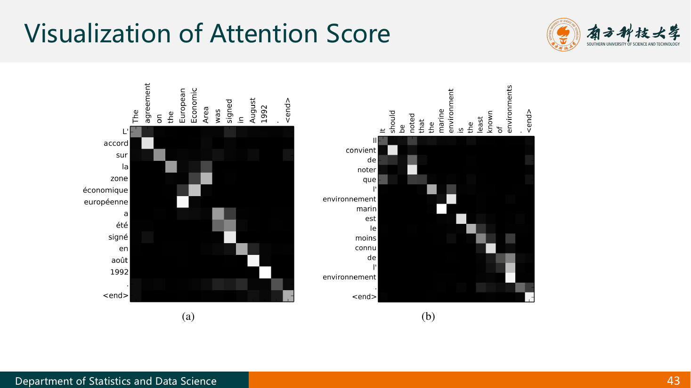

**🖼 逐元素图解：怎么读注意力热力图**

两张图结构相同：**横轴（顶部竖排的英文）是源句，纵轴（左侧的法语）是译文**。每个格子的亮度 = 该译文词对该源词的注意力权重，白=高，黑=低。

**图 (a)** 源句 `The agreement on the European Economic Area was signed in August 1992 .`，译文 `L' accord sur la zone économique européenne a été signé en août 1992 .`

看三处：
1. **整体有一条从左上到右下的亮色主对角线**——英法语序大体一致。
2. **中间 `European Economic Area` 对 `zone économique européenne` 那一块，亮点排成了「反对角」**（European↔européenne 在右下，Area↔zone 在左上）。**法语形容词后置，三个词的顺序整个翻了过来，模型自己学会了。**这是全图最值得看的地方。
3. **`was signed` 对应 `a été signé`**：一个英文的两词结构对上法语的三词结构，亮块是「一对多」的横条，不是单个点。

**图 (b)** 是同类现象的第二个例子：`the least known of environments` → `le moins connu de l'environnement`。

**一句提醒**：亮块能帮你调试模型，但不等于「模型是这样思考的」——后续研究（Jain & Wallace, 2019）发现同一个预测可以由差别很大的注意力图产生。**热力图是观察工具，不是因果证据。**

两张英法翻译的注意力热力图（来自 Bahdanau 论文）。横轴是源句英语，纵轴是译文法语，越亮表示注意力权重越大。

值得注意的地方：

- **主对角线**清晰——说明英法语序大体一致，模型学会了单调对齐。
- **局部换序**：图 (a) 中 "European Economic Area" → "zone économique européenne"，注意力块出现了明显的*反对角*，因为法语的形容词后置，三个词的顺序整个翻转了。**模型完全自行学到了这个语序差异，没有人告诉它。**
- 图 (b) 中 "the least known of environments" → "le moins connu de l'environnement" 同样是多对多的软对齐。

这就是注意力机制最早打动人的地方：它不仅提升了指标，还**顺带给出了可解释的对齐结果**——在此之前，统计机器翻译需要专门的对齐模型（IBM Models）来做这件事。

> **⚠️ 一点克制**
>
> 「注意力权重 = 模型的解释」这个说法在后来受到质疑（Jain & Wallace, 2019, *Attention is not Explanation*）：同一个预测常常可以由多组差别很大的注意力权重产生。所以热力图适合用来**观察和调试**，不适合作为因果解释的证据。

#### P44　注意力的一般化定义

*General Attention Definition*

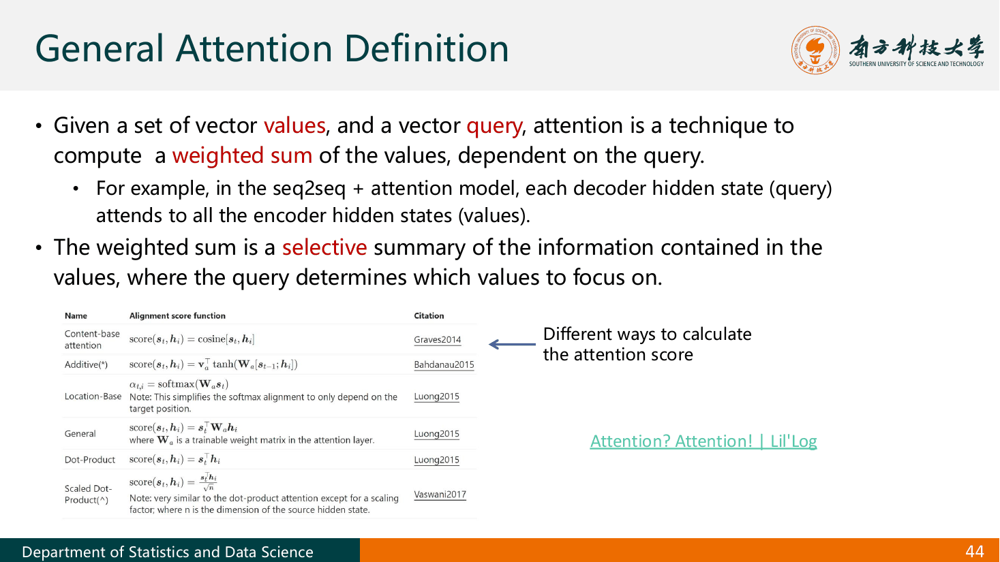

这一页是从「RNN 的一个技巧」到「通用算子」的关键抽象，请重点读：

> 给定一组 *values* 向量和一个 *query* 向量，注意力是一种**依赖于 query** 对 values 做**加权求和**的技术。这个加权和是对 values 中信息的**选择性摘要**，由 query 决定关注哪些 value。

套回 seq2seq：解码器隐状态是 query，编码器隐状态既是 key（用来打分）也是 value（用来加权）。Transformer 的创新之一就是把 key 和 value **解耦**成两组不同的投影——「用什么来匹配」和「匹配上之后取什么」可以是两件事。

**打分函数家族**（课件那张表）：

| 名称 | score($s_t,h_i$) | 出处 |
| --- | --- | --- |
| Content-base | $\cos[s_t,h_i]$ | Graves 2014 |
| Additive | $\mathbf{v}_a^\top\tanh(W_a[s_{t-1};h_i])$ | Bahdanau 2015 |
| Location-Base | $\alpha_{t,i}=\mathrm{softmax}(W_a s_t)$（只看目标位置，不看源） | Luong 2015 |
| General | $s_t^\top W_a h_i$（$W_a$ 可学，允许维度不同） | Luong 2015 |
| Dot-Product | $s_t^\top h_i$ | Luong 2015 |
| **Scaled Dot-Product** | $\dfrac{s_t^\top h_i}{\sqrt{n}}$，$n$ 为隐状态维度 | **Vaswani 2017** |

最后一行就是 Transformer 用的。它与普通点积的唯一区别是除以 $\sqrt{n}$——为什么必须除，见 P62。


### 📝 本模块练习（P39–P44）

**1. ★** Bahdanau 注意力和 Luong 注意力有哪些差别？Transformer 选了哪一路，为什么？

<details><summary>解析</summary>

见正文 P42 的对照表。核心差别有四点：打分函数（加性 vs 乘性）、用 $s_{t-1}$ 还是 $s_t$ 打分、上下文向量是喂给 RNN 还是直接用于预测、编码器是否双向。

**Transformer 选了乘性（点积）**，原因是纯工程的：点积可以写成一次大矩阵乘法，在 GPU 上有高度优化的实现（GEMM），而加性注意力需要为每一对 (query, key) 跑一遍小 MLP，无法合并成一次矩阵乘。论文原文的说法是「点积注意力在实践中更快、更省空间，因为可以用高度优化的矩阵乘法代码实现」。
</details>

**2.** 注意力解决的「bottleneck problem」具体是什么？为什么加了注意力就没有了？

<details><summary>解析</summary>

**瓶颈**：无注意力的 seq2seq 把整个源句压进编码器的**最后一个**隐状态（一个固定长度向量），解码器只能从这一个向量里取信息。句子越长，信息损失越大——实测 BLEU 随句长单调下降。

**注意力的解法**：保留**所有** $S$ 个编码器隐状态，每个解码步现场按需加权求和。信息容量从 $O(d)$ 变成 $O(S\cdot d)$，不再随句长恶化。Bahdanau 论文里那张「BLEU vs 句长」的图显示，加注意力后曲线在长句上变平了。
</details>

**3.** 为什么打分之后一定要过 softmax，直接归一化（每项除以总和）不行吗？

<details><summary>解析</summary>

三个理由：

① **分数可能为负**，直接除以总和会得到负权重甚至除以接近 0 的数。softmax 先取指数，保证全正。
② **softmax 会放大差距**。分数 [3, 1] 直接归一化是 [0.75, 0.25]，softmax 是 [0.88, 0.12]——更接近「选择」而非「平均」，这正是注意力想要的行为。
③ **处处可导**，可以端到端训练。hard attention（直接 argmax）不可导，只能用强化学习训练，效果和稳定性都差很多。
</details>

**4. ★** P44 表格里的 General 形式 $s_t^\top W_a h_i$ 比 Dot-Product $s_t^\top h_i$ 多了什么能力？

<details><summary>解析</summary>

两点：

① **允许 $s_t$ 和 $h_i$ 维度不同**（$W_a\in\mathbb{R}^{d_s\times d_h}$），点积则要求两者同维。
② **允许学习非对称、有偏好的相似度**。纯点积衡量的是「在原始空间里像不像」，而 $W_a$ 可以先把两个向量投影到一个更合适的比较空间，比如只比较语法相关的那些维度。

**联系**：Transformer 的 $q^\top k=(W^Qx)^\top(W^Kx')=x^\top (W^Q)^\top W^K x'$——**把 $W_a$ 分解成了 $(W^Q)^\top W^K$ 两个低秩因子**。所以 Q/K 投影本质上就是 General attention 的低秩参数化。这是个很值得记住的联系。
</details>

**5.** 注意力热力图能作为「模型如何思考」的解释吗？

<details><summary>解析</summary>

只能作为**观察和调试**工具，不能作为因果解释。Jain & Wallace (2019) 的实验表明：可以构造出与原注意力分布差别很大、但产生**完全相同预测**的另一组注意力权重（adversarial attention）。这说明注意力权重与模型输出之间不是必然的因果关系。

**正确用法**：发现明显异常（比如全部注意力集中在 `<pad>` 上）说明有 bug；但「模型关注了 X，所以它是因为 X 才这么预测的」这个推论不成立。
</details>

## Transformer 全解

`Part 5 · P45–P81`

三十七页，从总览到每个零件，最后回到整机并算清参数量。这是全讲的主体。

#### P45　回到总览图

*Transformer*

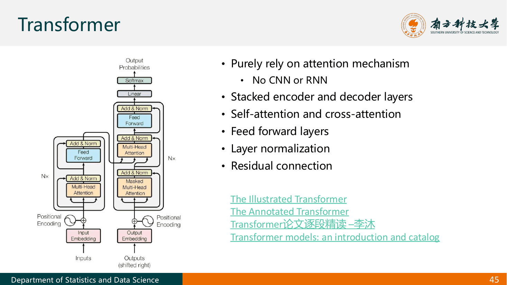

与 P4 同一张图和同样六条要点，但这次附上了四个极好的学习资源：

- **The Illustrated Transformer**（Jay Alammar）——图解，本课件 P46、P66 的插图就来自这里。第一次学必看。
- **The Annotated Transformer**（Harvard NLP）——逐行 PyTorch 实现配论文原文。看完图解之后看这个。
- **Transformer 论文逐段精读 · 李沐**——中文视频，讲论文写作与设计动机，非常适合配合本课件。
- **Transformer models: an introduction and catalog**——各种变体的谱系图。

> **💡 学习路径建议**
>
> 图解（建立直觉）→ 本课件（补齐公式和维度）→ Annotated Transformer 或 nanoGPT（写出来）→ 论文原文（看清楚每个设计的取舍）。四步走完，Transformer 就真的是你的了。

#### P46　堆叠结构与单层内部

*Stacked encoders/decoders · inside Encoder #1*

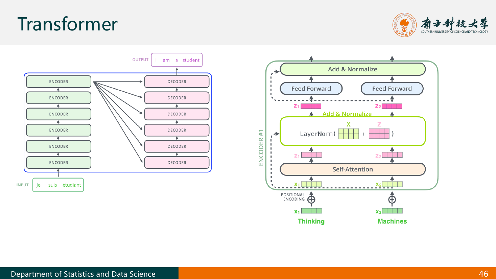

**🖼 逐元素图解：左右两张图是「远景」和「特写」**

**左图（远景）**：最下方绿框 `INPUT: Je suis étudiant`（法语），最上方粉框 `OUTPUT: I am a student`。中间左柱是 6 个绿色 `ENCODER` 方块自下而上叠起，右柱是 6 个粉色 `DECODER`。

**这里有一个必须看清的细节**：从**最顶层那一个** ENCODER 出发，画了 **6 条箭头**，分别指向右柱的**每一个** DECODER。不是「第 1 层编码器连第 1 层解码器」，而是「最后一层编码器连所有解码器」。所有解码层的交叉注意力共享同一份 K、V。

**右图（特写）**：把 `ENCODER #1` 剖开，自下而上六步：
1. 最底下两个绿色向量 $x_1,x_2$，分别标 `Thinking` 和 `Machines`——每个格子是向量的一个分量。
2. 两个 ⊕ 号，标 `POSITIONAL ENCODING`——位置编码加进来，向量变成黄绿色的 $x_1,x_2$。
3. 橙色横条 `Self-Attention` 同时吃进两个向量（**注意它是一个横跨两列的整条**，表示两个位置在这里发生了交互），输出两个粉色向量 $z_1,z_2$。
4. 黄框 `Add & Normalize`，里面明确写着 **`LayerNorm( X + Z )`**——X 是绿色的输入，Z 是粉色的注意力输出，先加再归一化。左边那条**虚线**就是残差通路，它绕过了 Self-Attention 直接把 X 送到这里。
5. 两个**分开的**蓝框 `Feed Forward`（**注意这里是两个独立的框，不是一条横条**）——这是在强调 FFN 是逐位置的，两个 token 各过各的，互不相干。
6. 再一个 `Add & Normalize`，输出上行进入 ENCODER #2。

**横条 vs 分开的框，就是图上区分「混合信息」和「逐位置」的视觉语言。**记住这个区别，后面看 P68 会更快。

**左图**：6 个编码器叠成一列，6 个解码器叠成另一列。关键细节——箭头是从**最顶层编码器**连向**每一个**解码器，而不是逐层一一对应。也就是说，所有解码器层的交叉注意力共用同一份编码器输出（最后一层的 $K,V$）。

**右图**：拆开 Encoder #1，输入 "Thinking Machines"：

1. 两个词各自查嵌入表得到 $x_1,x_2$
2. 加上位置编码（图中 ⊕）
3. 送进 **Self-Attention**，输出 $z_1,z_2$
4. **Add & Normalize**：图上明确写成 `LayerNorm(X + Z)`——先把输入 $X$ 加回来（残差），再做层归一化
5. 每个位置**各自独立**过 Feed Forward（图上画了两个并列的 FF 框，强调它们是同一组权重、分别作用在每个位置上）
6. 再来一次 Add & Normalize

> **⚠️ 这里能看出 Post-LN**
>
> `LayerNorm(X + Z)` 这个写法说明原始 Transformer 用的是 **Post-LN**（归一化放在残差相加*之后*）。Post-LN 训练不稳定，必须配 warmup 才能收敛。现代模型（GPT-2 之后、LLaMA 等）基本都改成了 **Pre-LN**：$x + \mathrm{Sublayer}(\mathrm{LN}(x))$——这样残差路径上是一条干净的恒等通路，梯度直达底层，可以不用 warmup 也能训深。读不同实现的代码时，先确认它是 Pre 还是 Post。

> **💡 「逐位置」是什么意思**
>
> Transformer 里只有**注意力层**在 token 之间混合信息；FFN、LayerNorm、残差全都是**逐位置（position-wise）**操作——第 5 个 token 的 FFN 计算完全不涉及第 3 个 token。理解了这一点，后面看 P54 的「parallel」和 P63 的掩码就都通了。

#### P47　编解码器的整体数据流

*Encoder–Decoder pipeline*

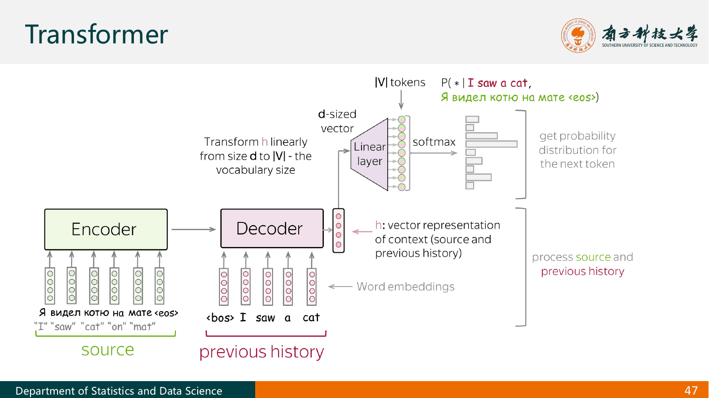

**🖼 逐元素图解：从左到右一条流水线**

1. **最左下**：`Я видел котю на мате <eos>`，下方灰字标出词义，绿色大括号标 `source`。每个词上方是一列圆点=词嵌入向量。
2. **绿色大框 `Encoder`**：吃进 6 个源词向量。
3. **粉色大框 `Decoder`**：接收两路输入——左边一条横箭头来自 Encoder，下方是 `<bos> I saw a cat` 的词嵌入，用红色大括号标 `previous history`。
4. **Decoder 右侧一个小的红边向量 `h`**：标注 `vector representation of context (source and previous history)`。**这一个 d 维向量就是「源句 + 已生成部分」的全部浓缩。**
5. **梯形的 `Linear layer`**：注意它**左窄右宽**——这是在画维度变化 $d\to|V|$。上方灰字 `Transform h linearly from size d to |V| - the vocabulary size`。
6. **梯形右侧一列绿色圆点**：$|V|$ 个 logits，顶部标 `|V| tokens`。
7. **`softmax` → 最右侧柱状图**：下一个 token 的概率分布，标题 `P( * | I saw a cat, Я видел котю на мате <eos>)`。

**右侧两个灰色大括号**把整张图分成两个功能段：下半部 `process source and previous history`，上半部 `get probability distribution for the next token`。**前者是 Transformer 本体，后者是 LM head，两者职责不同。**

仍用俄→英翻译的例子。从左到右：

- **source**（"Я видел котю на мате <eos>"）查词嵌入 → 送进 **Encoder**
- **previous history**（"<bos> I saw a cat"）查词嵌入 → 送进 **Decoder**，同时接收编码器输出
- 解码器输出 **h**：一个 $d$ 维向量，代表「源句 + 已生成历史」的综合表示
- `Linear layer` 把 $h$ 从 $d$ 维**线性变换到 $|V|$ 维**
- `softmax` → 下一个 token 的概率分布 $P(\ast\mid \text{I saw a cat};\ \text{source})$

注意那个梯形的 Linear layer 图标——从窄到宽，形象地表示 $d\to|V|$ 的升维。这一层叫 **LM head** 或 **输出投影**，参数量是 $|V|\times d$，在小模型里往往是最大的单个矩阵。

> **💡 权重绑定（weight tying）**
>
> 输入嵌入矩阵是 $|V|\times d$，输出投影也是 $|V|\times d$——形状一样。很多实现会让它们**共享同一份权重**（tied embeddings），既省一半参数又常能提升效果（直觉：语义相近的词，作为输入和作为输出都该被相似地处理）。P79 算总参数量时用的正是绑定假设。

### Self-Attention · P48–P62

#### P48　什么是自注意力

*Self-Attention*

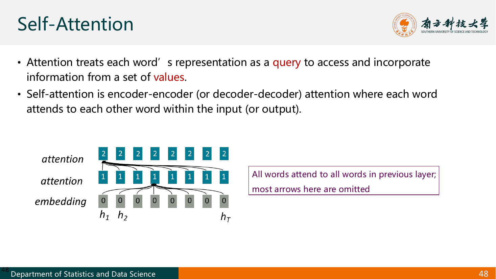

**🖼 逐元素图解**

三行深蓝色方块，从下往上：

- 最下一行 8 个方块，每个里面写 **0**，左边标 `embedding`，下面标 $h_1, h_2, \dots, h_T$。
- 中间一行 8 个方块写 **1**，左边标 `attention`。
- 最上一行 8 个方块写 **2**，左边标 `attention`。

**方块里的数字是「层号」，不是数值。**

图上只画了两组曲线箭头作为示范：从第 0 层的所有方块指向第 1 层的**某一个**方块；从第 1 层的所有方块指向第 2 层的**某一个**方块。右边紫框里那句话解释了原因：**"All words attend to all words in previous layer; most arrows here are omitted"**——实际上每一层的每个方块都有 8 条箭头进来，画全就成一团黑了。

**这张图要传达两件事**：① 注意力是**全连接**的（$n^2$ 条边）；② 注意力可以**堆叠**，第 2 层看到的是「已经融合过一轮全局信息」的表示。

两句定义：

- 注意力把每个词的表示当作一个 *query*，去访问并整合一组 *values* 中的信息。
- **自注意力是「编码器对编码器」（或「解码器对解码器」）的注意力：序列中每个词都去关注同一序列中的其他每个词。**

「自」的含义就是：query、key、value **来自同一个序列**。对比 P67 的交叉注意力——那里 query 来自解码器，key/value 来自编码器。

图上三层：embedding 层（标 0）→ 第一层 attention（标 1）→ 第二层 attention（标 2）。旁注写着「所有词都关注上一层的所有词；图中大部分箭头被省略了」。这句话点明了自注意力的**全连接**本质：$n$ 个 token 之间有 $n^2$ 条连接。

> **💡 堆叠层数的意义**
>
> 一层自注意力让每个 token 看到所有其他 token 的**原始**表示；两层之后，它看到的是「其他 token 已经融合了全局信息的表示」。层数越深，能表达的组合关系越复杂——类比 CNN 里「边缘 → 纹理 → 物体部件 → 物体」的层级抽象。

#### P49　Query / Key / Value 的直觉

*The database analogy*

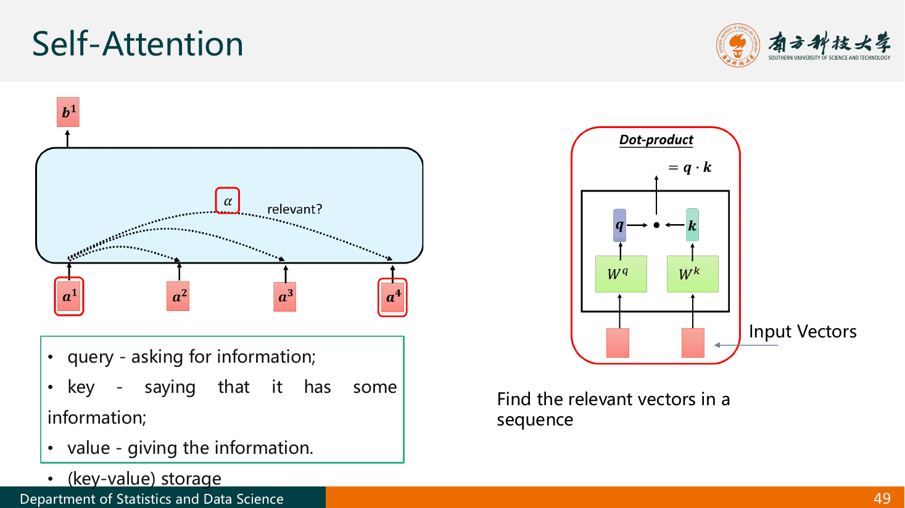

**🖼 逐元素图解：左右两个图讲两件事**

**左图（整体流程）**：底部四个红色方块 $a^1,a^2,a^3,a^4$ 是输入向量，其中 $a^1$ 和 $a^4$ 被红框圈出。上方一个浅蓝色大圆角框代表「自注意力层」，框内有一个红框标 $\alpha$，旁边写 **`relevant?`**。四条虚线箭头从 $\alpha$ 指向四个输入——**意思是：$\alpha$ 要回答「$a^1$ 和每一个 $a^i$ 有多相关」**。最上方输出 $b^1$。

**右图（打分模块的内部）**：红色圆角框里
- 底部两个粉色方块：标注 `Input Vectors`（就是左图里的两个 $a$）。
- 两个绿色方块 $W^q$ 和 $W^k$：可学习的投影矩阵。
- 投影结果：蓝色的 $q$、青色的 $k$。
- 中间一个**黑色实心圆点**：这是点积运算符。
- 向上箭头标 $=q\cdot k$，顶部标题 **`Dot-product`**。

**颜色约定从这一页开始固定下来，后面 P50–P58 全程沿用：红=输入 a，蓝=query q，青绿=key k，橙=value v。**先把这四个颜色记住，后面几页就能直接看懂。

课件给出的定义，值得逐字记住：

- **query** — 请求信息（我想找什么）
- **key** — 声明自己有某些信息（我是什么）
- **value** — 给出信息（我能提供什么内容）
- 整体是一个 **(key-value) 存储**

这个类比来自数据库/字典：普通字典是**硬查找**——query 必须和某个 key 精确相等，返回对应 value。注意力是**软查找**——用 query 和每个 key 的相似度作为权重，返回所有 value 的加权平均。

右图展示 dot-product 打分的机制：两个输入向量分别经 $W^q$ 和 $W^k$ 投影得到 $q$ 和 $k$，做点积 $q\cdot k$ 得到相关性分数。左图那个 $\alpha$ 上标着 "relevant?"——注意力要回答的就是这个问题。

> **⚠️ 为什么要三个不同的投影**
>
> 如果直接用输入向量本身既当 query 又当 key，那么相似度就退化成「自己和自己最像」，注意力会永远集中在自己身上（点积 $a\cdot a=\|a\|^2$ 必然是最大的之一）。引入可学习的 $W^q,W^k$ 让模型可以学到**非对称**的关系（"它" 应该关注 "动物"，但 "动物" 不一定关注 "它"）。再引入 $W^v$，则让「凭什么匹配」和「匹配后传什么」分离开——这是 Transformer 相比早期注意力的重要改进。

#### P50　算注意力分数（第一步）

*Computing α*

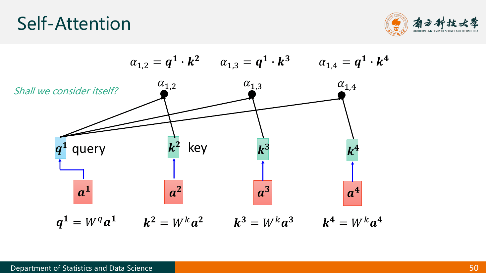

**🖼 逐元素图解**

- 底部四个红色方块 $a^1..a^4$，下方写着各自的投影公式。
- $a^1$ 上方接一个**蓝色**方块 $q^1$，旁边标 `query`，公式 $q^1=W^qa^1$。
- $a^2,a^3,a^4$ 上方各接一个**青绿色**方块 $k^2,k^3,k^4$，其中 $k^2$ 旁标 `key`。
- 三个**黑色实心圆点**在上方，分别标 $\alpha_{1,2},\alpha_{1,3},\alpha_{1,4}$。每个圆点有两条线进来：一条来自 $q^1$（所以 $q^1$ 有三条线射出），一条来自对应的 $k^i$。
- 顶部三个公式 $\alpha_{1,2}=q^1\cdot k^2$ 等，与三个圆点一一对应。

**左上角绿色斜体字 `Shall we consider itself?`** —— 这是老师埋的问题。注意 $a^1$ 上方**只有 $q^1$，没有 $k^1$**，所以图上缺了 $\alpha_{1,1}$。翻到 P51 看答案。

输入向量 $a^1,a^2,a^3,a^4$。以 $a^1$ 为 query：

$$
q^1=W^q a^1,\qquad k^i=W^k a^i\ (i=1,2,3,4)
$$

$$
\alpha_{1,2}=q^1\cdot k^2,\quad \alpha_{1,3}=q^1\cdot k^3,\quad \alpha_{1,4}=q^1\cdot k^4
$$

下标约定：$\alpha_{i,j}$ 表示「第 $i$ 个位置作为 query，对第 $j$ 个位置的 key 的分数」。**第一个下标是 query，第二个是 key**，全篇统一。

左上角绿色小字提问：**"Shall we consider itself?"**（要不要把自己也算进去？）——这一页只算了 1→2、1→3、1→4，故意漏掉了 1→1。下一页给出答案。

#### P51　要，而且必须要：加上自己，再 softmax

*Include α₁,₁ then soft-max*

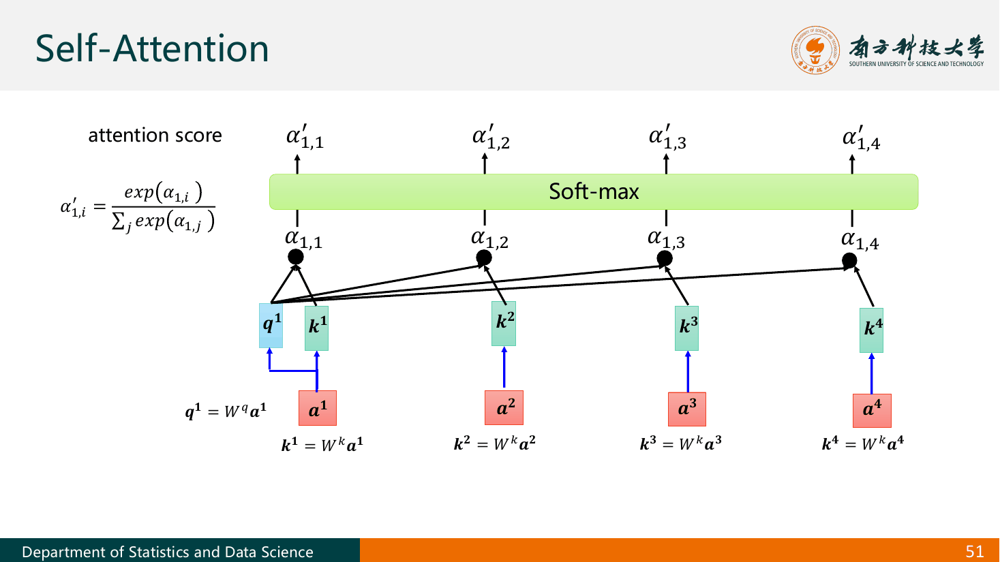

**🖼 逐元素图解：与 P50 的差异就是答案**

对比 P50，这一页多了两样东西：

1. **$a^1$ 上方多了一个青绿色的 $k^1$**（公式 $k^1=W^ka^1$ 写在下方），于是左边多出一个黑色圆点 $\alpha_{1,1}$。**「要不要考虑自己」的答案是：要。**
2. **上方多了一条绿色长条 `Soft-max`**：四个 $\alpha_{1,i}$ 一起送进去，输出四个 $\alpha'_{1,i}$（标注 `attention score`）。

**注意 softmax 是一条横跨四列的长条**——和 P46 的 Self-Attention 横条同理，这是在表示「这个运算需要同时看到所有四个值」（因为分母是求和）。左侧公式 $\alpha'_{1,i}=\frac{\exp(\alpha_{1,i})}{\sum_j\exp(\alpha_{1,j})}$ 就是那条长条在做的事。

答案是**要**。补上 $k^1=W^k a^1$，算出 $\alpha_{1,1}=q^1\cdot k^1$，然后四个分数一起过 softmax：

$$
\alpha'_{1,i}=\frac{\exp(\alpha_{1,i})}{\sum_j \exp(\alpha_{1,j})}
$$

得到 $\alpha'_{1,1},\alpha'_{1,2},\alpha'_{1,3},\alpha'_{1,4}$，它们非负且和为 1。

**为什么必须包含自己**：如果不含自己，一个 token 的输出就完全不含自身信息，会丢掉本词的语义。实际上在很多层里，自注意力权重的最大值就落在对角线上（"我主要还是我自己"），注意力只做小幅度的上下文修正。

> **💡 softmax 之外的选择**
>
> 课件用的是 softmax，这是标准做法。但也有研究用 ReLU 或直接归一化替代（如 ReLU attention、线性注意力）以获得 $O(n)$ 复杂度。softmax 之所以难以替代，在于它的「竞争性」——所有位置抢一份固定的总权重，天然形成稀疏聚焦。

#### P52　加权求和得到输出（第二步）

*b¹ = Σ α′₁,ᵢ vⁱ*

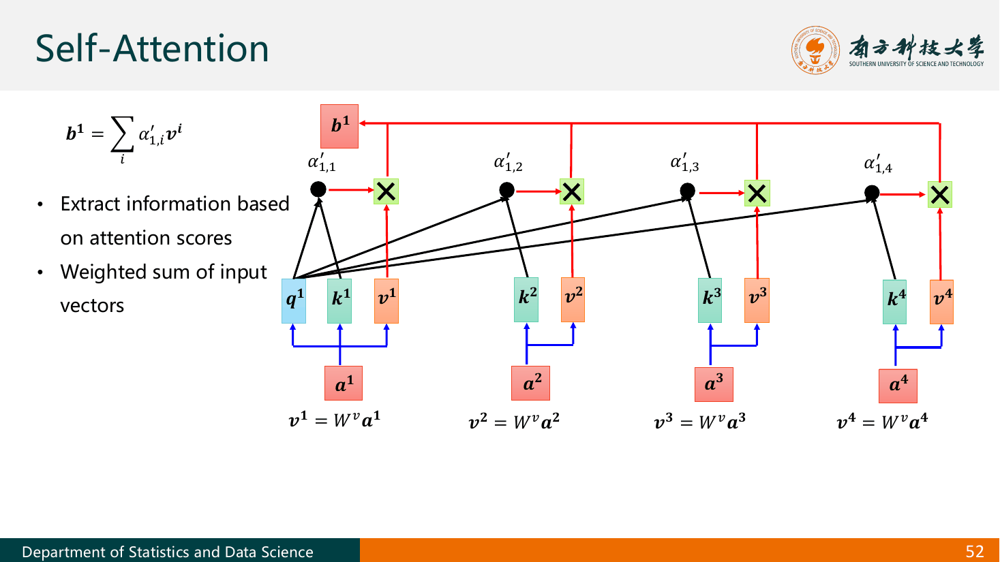

**🖼 逐元素图解：最后一步，橙色终于出场**

这一页在 P51 基础上补齐了 value：

- 每个 $a^i$ 上方现在有**三个**方块：蓝 $q$（只有 $a^1$ 有）、青 $k$、**橙 $v$**。底部公式 $v^i=W^va^i$。
- 四个**绿色 ✕ 号**：每个 ✕ 有两条输入——左边来自黑色圆点（权重 $\alpha'_{1,i}$），下方来自橙色的 $v^i$。**✕ 就是标量乘向量。**
- 四条**红色箭头**从四个 ✕ 向上汇聚到最上方的红色方块 $b^1$。**红色箭头 = 求和。**

左上角公式 $b^1=\sum_i\alpha'_{1,i}v^i$ 就是「四个 ✕ 的结果全部相加」。

**至此单个位置的自注意力完成。**用一句话总结这张图：**蓝色去问，青绿色回答「像不像」，橙色提供「内容」，绿色 ✕ 按相似度配比，红色箭头把它们汇总。**

$$
v^i=W^v a^i,\qquad b^1=\sum_i \alpha'_{1,i}\,v^i
$$

到这里，一个位置的自注意力就算完了。两句话概括：**依据注意力分数抽取信息；本质是输入向量（的 value 投影）的加权和。**

图上那四个绿色的 ✕ 号就是「权重 × value」，红色箭头汇总到 $b^1$。

> **💡 重要性质**
>
> 输出 $b^1$ 是 values 的**凸组合**（权重非负、和为 1），所以它一定落在 $\{v^i\}$ 张成的凸包内。这意味着单纯的注意力层**不会**产生超出输入范围的新特征——真正制造新特征的是后面的 FFN。这从另一个角度印证了 P3 提到的「attention is not all you need」。

#### P53　换一个位置，做同样的事

*b² = Σ α′₂,ᵢ vⁱ*

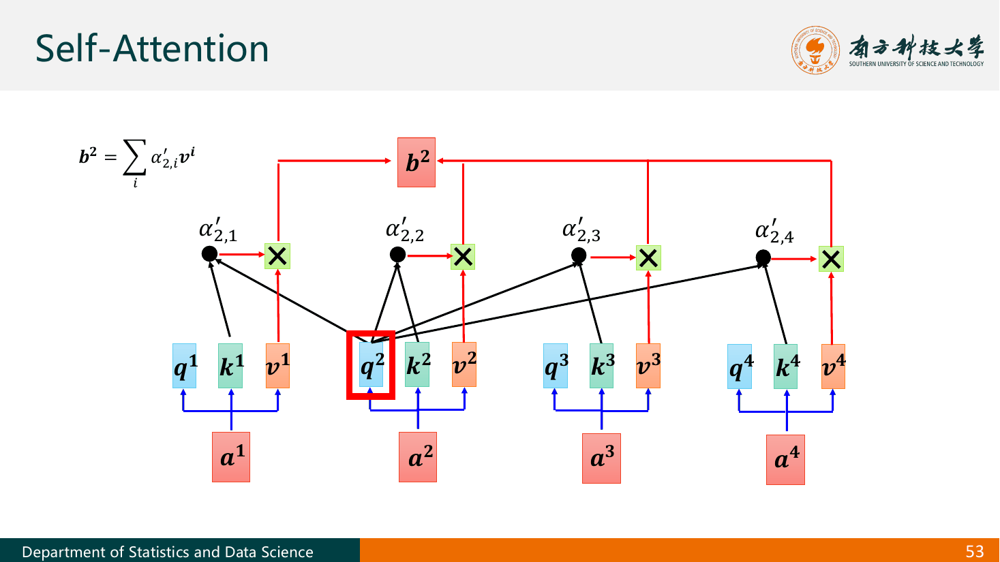

**🖼 逐元素图解：只有一处变化**

整张图与 P52 几乎相同，唯一差别是**红框圈住的位置从 $q^1$ 移到了 $q^2$**，而且现在四个位置**都画出了自己的 q、k、v** 三件套。

- 黑色圆点的标号从 $\alpha'_{1,i}$ 变成了 $\alpha'_{2,i}$。
- 汇聚的输出从 $b^1$ 变成 $b^2$。
- **但四组 $k^i$ 和 $v^i$ 一个都没变。**

**这张图的全部信息量就在「没变的部分」**：换一个 query，key 和 value 完全复用。这正是推理时 KV Cache 成立的图形证据——已经算过的 k、v 存起来就行，每生成一个新 token 只需要补一组新的 q、k、v。

$$
b^2=\sum_i \alpha'_{2,i}\,v^i
$$

这次用 $q^2$ 去和所有 $k^i$ 打分。**关键：$W^q,W^k,W^v$ 是同一套，所有位置共享**；变的只是 query 来自哪个位置。红框圈住的 $q^2$ 就是唯一的变化。

注意 $v^1,\dots,v^4$ 完全不用重算——它们和 query 无关。这也是推理时 **KV Cache** 能成立的原因：自回归生成时，已经算过的 $k^i,v^i$ 可以缓存复用，每步只需要为新 token 算一个 $q$、一个 $k$、一个 $v$。

#### P54　四个位置同时算：并行

*parallel*

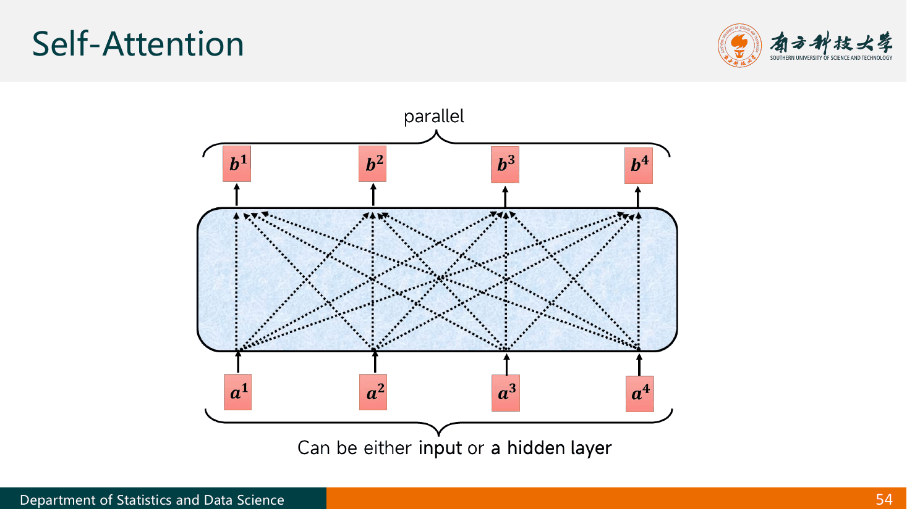

**🖼 逐元素图解**

- 底部四个红色 $a^1..a^4$，下方一个大括号标 **`Can be either input or a hidden layer`**。
- 中间一个浅蓝色圆角大框（自注意力层），框内密布**虚线箭头**——每个输入到每个输出都有一条，共 16 条。这就是 P48 说的「大部分箭头被省略了」的完整版。
- 顶部四个红色 $b^1..b^4$，上方一个大括号标 **`parallel`**。

**两个大括号是这一页的全部重点**：下面的告诉你自注意力层**可以堆叠**（输入输出同构），上面的告诉你四个输出**同时算完**（没有先后依赖）。

对比一下 P9 那张 RNN 图——那里 $h_3$ 必须等 $h_2$，箭头是**串行的链**；这里箭头是**并行的网**。一张图换一张图，就是 Transformer 取代 RNN 的核心理由。

$b^1,b^2,b^3,b^4$ 之间**没有任何依赖关系**，可以同时算完。这一页只有一个词——*parallel*——但它就是 Transformer 打败 RNN 的全部理由。

底部那句 "Can be either input or a hidden layer" 也重要：自注意力层的输入既可以是嵌入层输出（第一层），也可以是上一层自注意力的输出（更高层）。输入输出同构，所以能无限堆叠。

|   | RNN | Self-Attention |
| --- | --- | --- |
| 序列方向的依赖 | $h_t$ 必须等 $h_{t-1}$ | 无 |
| 训练时的时间复杂度（串行步数） | $O(n)$ | **$O(1)$** |
| 每层总计算量 | $O(n\cdot d^2)$ | $O(n^2 d)$ |
| 任意两位置的路径长度 | $O(n)$ | $O(1)$ |

读这张表要看清取舍：Transformer 用**更大的总计算量**换来了**可并行**。当 $n < d$（大多数句子的情形）时它甚至连总计算量也更少；但 $n$ 很大时 $O(n^2)$ 会变成灾难——这就是长上下文优化（FlashAttention、稀疏注意力、线性注意力）要解决的问题。

#### P55　写成矩阵：Q、K、V 的生成

*Q = W^q I, K = W^k I, V = W^v I*

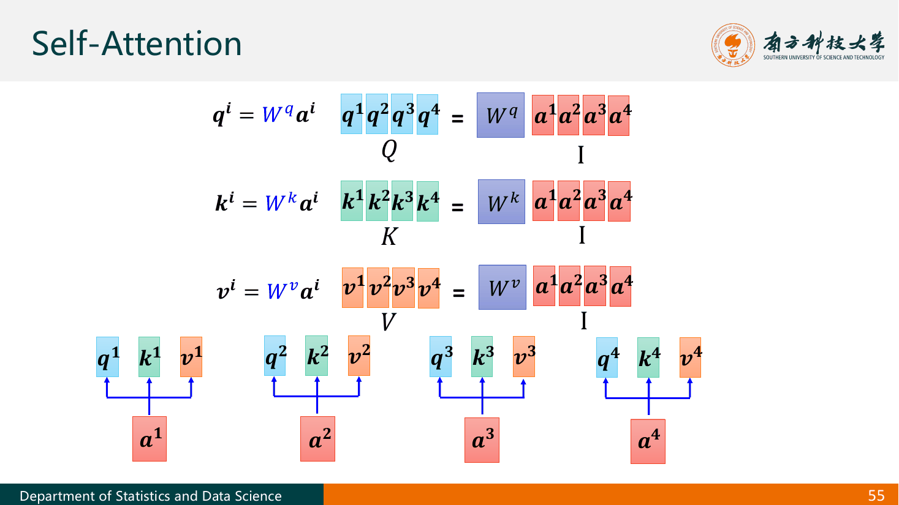

**🖼 逐元素图解：从「一个一个算」到「一次算完」**

页面下半部是老样子：四个红色 $a^i$，每个上方一组蓝/青/橙的 $q^i,k^i,v^i$。

页面上半部是新东西，三行，每行结构相同：

- 左边是原来的逐个公式，例如 $q^i=W^qa^i$。
- 中间是**把四个 $q$ 横向拼起来的矩阵**，四个蓝色方块并排，下方标 **$Q$**。
- 等号右边：一个**紫色方块 $W^q$** 乘上**四个红色方块并排的矩阵**，下方标 **$\mathrm{I}$**。

三行分别对应 $Q=W^q\mathrm{I}$、$K=W^k\mathrm{I}$、$V=W^v\mathrm{I}$。

**看图时请特别注意拼接的方向**：四个 $a^i$ 是**横向排成一行**的，也就是说每个 token 占矩阵的**一列**。这就是本课件采用的「列向量约定」，与 PyTorch 的「每行一个 token」正好转置。**这一页是全篇约定的源头，看清楚它，P57–P61 就不会乱。**

把四个输入向量按**列**拼成矩阵 $I=[a^1\ a^2\ a^3\ a^4]$，于是 P50–P53 的三组逐个投影就压缩成三次矩阵乘法：

$$
Q=W^q I,\qquad K=W^k I,\qquad V=W^v I
$$

$Q=[q^1\ q^2\ q^3\ q^4]$，其余同理。原来要做 12 次矩阵–向量乘，现在是 3 次矩阵–矩阵乘——这正是 P32 说的 mini-batching 思想在层内的应用。

`I ∈ ℝ^{d×n}` · `W^q, W^k ∈ ℝ^{d_k×d}` · `W^v ∈ ℝ^{d_v×d}` · `Q, K ∈ ℝ^{d_k×n}` · `V ∈ ℝ^{d_v×n}`

> **⚠️ 先把约定钉死**
>
> 这一页开始，课件采用的是**列向量约定**：token 沿矩阵的*列*排列，权重左乘。而 PyTorch / HuggingFace 代码里是**行向量约定**：token 沿*行*排列（`(batch, seq_len, d)`），写作 $Q=XW^Q$。两者互为转置，公式看起来会不一样但完全等价。P59–P61 会把这个差异暴露出来，届时详解。

#### P56　一个 query 对所有 key：向量化

*α₁,· = Kᵀq¹*

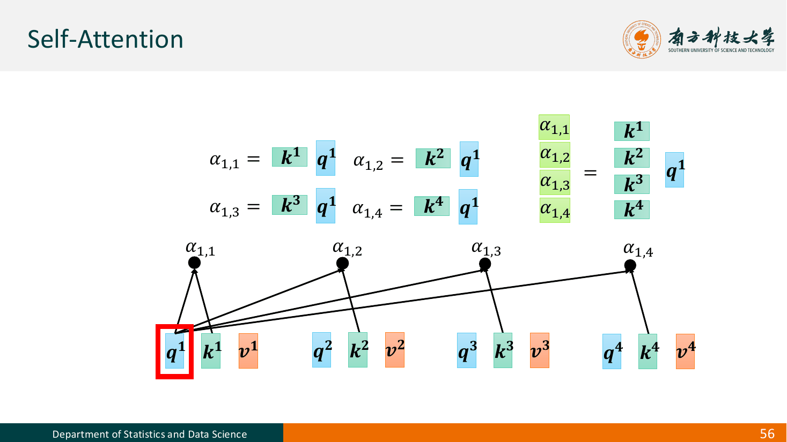

**🖼 逐元素图解**

下半部：四个 $q^i,k^i,v^i$ 三件套排开，**$q^1$ 被红框圈出**。四条线从 $q^1$ 射向四个黑色圆点 $\alpha_{1,1}..\alpha_{1,4}$，每个圆点另有一条线来自对应的 $k^i$。

上半部左边是四个标量公式 $\alpha_{1,1}=k^1q^1$ 等（注意写法是 $k$ 在前、$q$ 在后，这是列约定下的内积写法 ${k^i}^\top q^1$）。

上半部右边是**向量化后的图示**：
- 一列**绿色方块** $\alpha_{1,1},\alpha_{1,2},\alpha_{1,3},\alpha_{1,4}$ 竖排 = 结果向量。
- 等号右边：一列**青绿色方块** $k^1,k^2,k^3,k^4$ 竖排（这就是 $K^\top$，每个 $k$ 占一行）乘上一个**蓝色方块** $q^1$。

**读法**：竖排的 $k$ 矩阵 × 单个 $q$ 列向量 = 竖排的分数向量。四次内积一次矩阵乘搞定。

四个分数 $\alpha_{1,1}=k^1\cdot q^1,\ \alpha_{1,2}=k^2\cdot q^1,\ \alpha_{1,3}=k^3\cdot q^1,\ \alpha_{1,4}=k^4\cdot q^1$ 可以一次算完：把 $k^1..k^4$ 按行堆成 $K^\top$，右乘 $q^1$。

$$
\begin{bmatrix}\alpha_{1,1}\\ \alpha_{1,2}\\ \alpha_{1,3}\\ \alpha_{1,4}\end{bmatrix}=\begin{bmatrix}{k^1}^\top\\ {k^2}^\top\\ {k^3}^\top\\ {k^4}^\top\end{bmatrix}q^1=K^\top q^1
$$

这一步是从「循环」到「矩阵乘」的第一次跃迁。读懂它，下一页的全矩阵形式就是水到渠成。

#### P57　所有 query 对所有 key：注意力矩阵

*A = KᵀQ, A′ = softmax(A)*

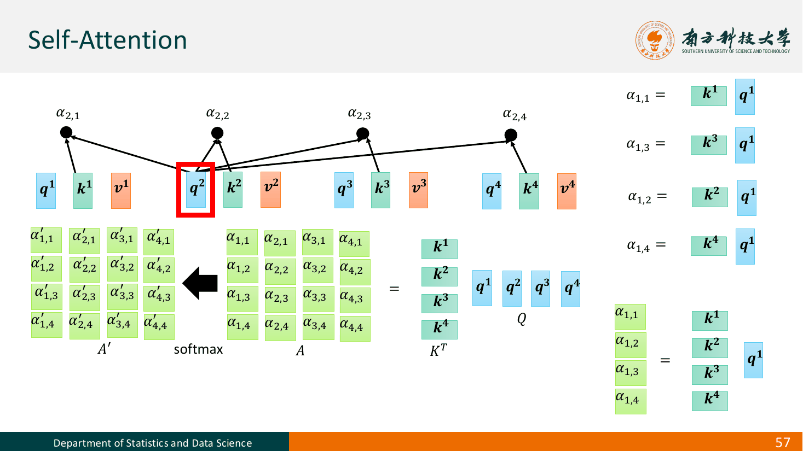

**🖼 逐元素图解：本页是全篇最密的一张，分四块看**

**左上**：$q^2$ 被红框圈出，四条线射向四个黑点 $\alpha_{2,1}..\alpha_{2,4}$——和 P56 一样，只是换了 query。

**右侧四个小等式**（$\alpha_{1,1}=k^1q^1$ 等）和**右下角的列向量图**：复习 P56 的单 query 情形。

**中间偏右的大等式**才是本页主角：

**绿色的 4×4 方阵 $A$** ＝ **青绿色的四行 $K^\top$** × **蓝色的四列 $Q$**

- $K^\top$：四个 $k^i$ **竖着排**，占四行。
- $Q$：四个 $q^j$ **横着排**，占四列。
- 结果 $A$ 是 4×4，图上每个格子标着 $\alpha_{i,j}$。**注意看格子里的标号顺序**：第一列从上到下是 $\alpha_{1,1},\alpha_{1,2},\alpha_{1,3},\alpha_{1,4}$——**也就是说「同一个 query 的四个分数」是竖着排在同一列里的。**

**左下角的黑色粗箭头 + `softmax` 标签**：$A$ 经 softmax 变成 $A'$。既然同一个 query 的分数在同一**列**，**softmax 就必须沿列做**（每列和为 1）。

**这个「粗箭头」的方向是从右往左**（$A\to A'$），与阅读习惯相反，是这一页最容易看错的地方。

把 $q^1..q^4$ 也拼成矩阵，就得到完整的注意力分数矩阵：

$$
A=K^\top Q\in\mathbb{R}^{n\times n},\qquad A[i,j]={k^i}^\top q^j=\alpha_{j,i}
$$

然后逐列做 softmax 得到 $A'$。

> **⚠️ softmax 沿哪个方向？**
>
> 这是最容易错的一步。在课件的列约定下，$A$ 的**第 $j$ 列**装的是「query $j$ 对全部 key 的分数」，所以 **softmax 要沿列方向（每一列归一化，列和为 1）**，对应 `softmax(dim=0)`。
>
> 而在 PyTorch 的行约定下，$A=QK^\top$ 的**第 $i$ 行**是「query $i$ 对全部 key 的分数」，所以是 `softmax(dim=-1)`，行和为 1。
>
> **判断口诀：softmax 永远沿着「key 的那个维度」做。**写代码时如果不确定，打印 `attn.sum(dim=...)` 看是不是全 1 即可。

图上从右到左的箭头依次是：$K^\top Q \Rightarrow A \Rightarrow$（softmax）$\Rightarrow A'$。左侧 $A'$ 的每个元素标注为 $\alpha'_{i,j}$，按列排布——再次印证第一个下标是 query。

#### P58　输出矩阵

*O = V A′*

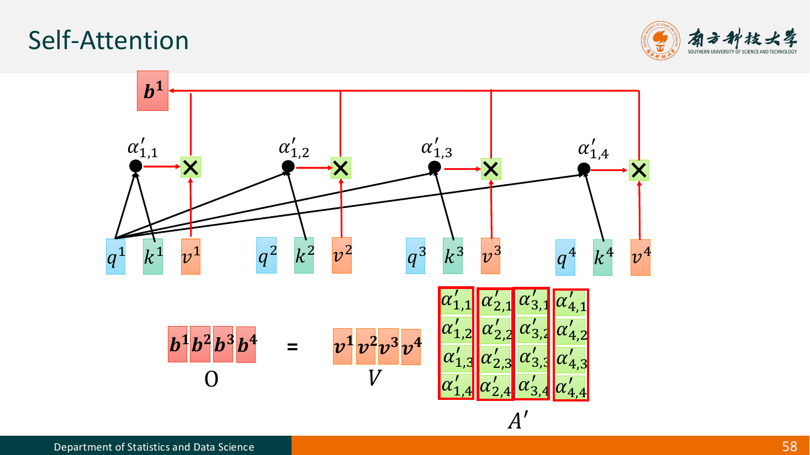

**🖼 逐元素图解**

上半部：和 P52 一样的结构（四个绿色 ✕、红色汇总箭头到 $b^1$），只是现在四个位置的 q/k/v 都画全了。

下半部是矩阵形式：

- 左边：四个红色方块并排，下标 **$\mathrm{O}$**，内容是 $b^1b^2b^3b^4$。
- 等号右边：四个橙色方块并排（$v^1v^2v^3v^4$，下标 **$V$**）乘上一个绿色的 4×4 矩阵（下标 **$A'$**）。
- **绿色矩阵的四列分别被红框圈出**，每一列是 $\alpha'_{1,\cdot},\alpha'_{2,\cdot},\alpha'_{3,\cdot},\alpha'_{4,\cdot}$。

**红框是在提示你怎么验算**：取 $A'$ 的第 1 列（$\alpha'_{1,1},\alpha'_{1,2},\alpha'_{1,3},\alpha'_{1,4}$），与 $V$ 的四列做线性组合，得到的就是 $O$ 的第 1 列 $b^1$。**矩阵乘法的「右矩阵取一列 → 左矩阵按该列系数组合」这个视角，是看懂这张图的钥匙。**

$$
O=[b^1\ b^2\ b^3\ b^4]=V A'\in\mathbb{R}^{d_v\times n}
$$

验证一下第 $j$ 列：$O[:,j]=\sum_i V[:,i]\,A'[i,j]=\sum_i v^i\,\alpha'_{j,i}=b^j$ ✓ 与 P52 的定义完全一致。

至此，自注意力的全部计算被压成了**三次矩阵乘法 + 一次 softmax**：

$$
I\ \longrightarrow\ Q,K,V \quad\Longrightarrow\quad A=K^\top Q \quad\Longrightarrow\quad A'=\mathrm{softmax}_{\mathrm{col}}(A)\quad\Longrightarrow\quad O=VA'
$$

第一箭头是三次矩阵乘（分别乘 $W^q,W^k,W^v$），softmax 沿列方向。

#### P59　整条流水线与可学习参数

*Parameters to be learned*

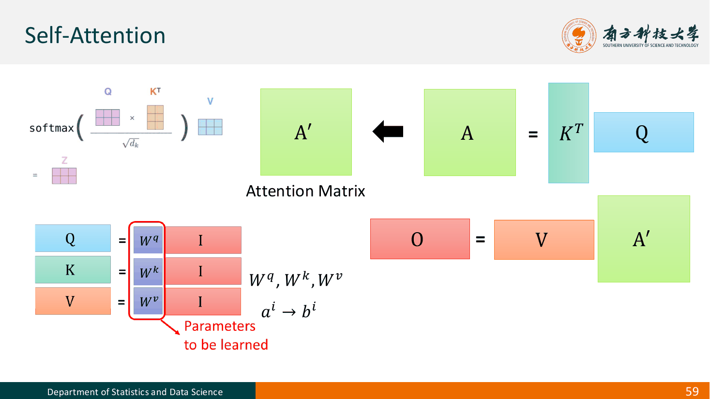

**🖼 逐元素图解：这是一张「总装图」**

**左上角小图**（截自 The Illustrated Transformer）：`softmax( Q × Kᵀ / √d_k ) V = Z`，用紫/黄/蓝/粉四色小方阵示意。**这是行约定的写法。**

**左下角三行**：`Q = W^q × I`、`K = W^k × I`、`V = W^v × I`。三个紫色的 $W$ 被一个**红框**圈住，红色箭头引出文字 **`Parameters to be learned`**。**整层自注意力就这三个矩阵是参数，其余全是当场算出来的。**

**右上角的等式链**（注意从右往左读）：
$A = K^\top \times Q$ → 黑色粗箭头（softmax）→ $A'$，下方标注 **`Attention Matrix`**。

**右下角**：$O = V \times A'$。

**中间那行小字 $W^q,W^k,W^v$ 与 $a^i\to b^i$**：概括了整层做的事——三个参数矩阵，把一组输入向量变成一组输出向量。

**读这一页时，请同时盯住左上角小图和右侧大图**：一个写 $QK^\top$、V 在右，一个写 $K^\top Q$、V 在左。它们是同一个运算的两种转置写法，正文里那张对照表就是为了解决这个混乱。

右半边把流程串起来：$A=K^\top Q$ → softmax → $A'$（Attention Matrix）→ $O=VA'$。左下角红框标出**整个自注意力层里，唯一需要学习的参数就是 $W^q, W^k, W^v$ 三个矩阵**（多头时再加一个 $W^o$）。

这一点非常值得体会：注意力的「权重」$\alpha'$ 不是参数，它是**在前向过程中根据输入现算出来的**。同一个模型面对不同的句子，会产生完全不同的注意力图。这与 CNN 卷积核那种固定权重截然不同——注意力是**数据依赖的动态连接**。

> **⚠️ 同一页上的两种写法**
>
> 左上角那个小图（来自 Illustrated Transformer）写的是 $\mathrm{softmax}\!\left(\frac{QK^\top}{\sqrt{d_k}}\right)V=Z$，右半边写的却是 $A=K^\top Q$、$O=VA'$。它们不是两个不同的公式，而是**同一个运算在两种向量约定下的写法**：
>
> |   | 列约定（课件主体） | 行约定（PyTorch / 论文） |
> | --- | --- | --- |
> | 输入 | $I\in\mathbb{R}^{d\times n}$，每**列**一个 token | $X\in\mathbb{R}^{n\times d}$，每**行**一个 token |
> | 投影 | $Q=W^qI\in\mathbb{R}^{d_k\times n}$ | $Q=XW^Q\in\mathbb{R}^{n\times d_k}$ |
> | 分数 | $A=K^\top Q$，$A[i,j]=$（key i，query j） | $A=QK^\top$，$A[i,j]=$（query i，key j） |
> | softmax | 沿列，`dim=0` | 沿行，`dim=-1` |
> | 输出 | $O=VA'\in\mathbb{R}^{d_v\times n}$ | $O=A'V\in\mathbb{R}^{n\times d_v}$ |
>
> 两边互为转置：$O_{\mathrm{col}}=O_{\mathrm{row}}^{\top}$。**写代码一律用右边那列**，读这份课件时用左边那列，心里做一次转置即可。

#### P60　缩放点积注意力的标准式

*Scaled Dot-Product Attention*

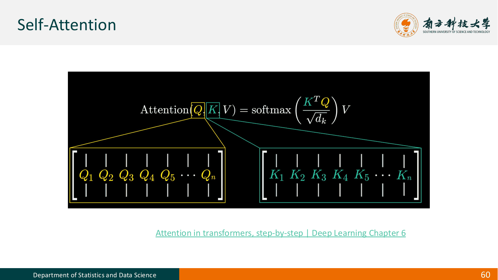

$$
\mathrm{Attention}(Q,K,V)=\mathrm{softmax}\!\left(\frac{K^\top Q}{\sqrt{d_k}}\right)V
$$

下方两个大括号提醒你 $Q$ 和 $K$ 都是由若干列向量拼成的矩阵：$Q=[Q_1\ Q_2\ \cdots\ Q_n]$，$K=[K_1\ K_2\ \cdots\ K_n]$。

论文原文的写法是 $\mathrm{Attention}(Q,K,V)=\mathrm{softmax}\!\left(\frac{QK^\top}{\sqrt{d_k}}\right)V$（行约定）。两者的差别只在转置。

> **⚠️ 这一页的式子要小心读**
>
> 如果严格按列约定（$V\in\mathbb{R}^{d_v\times n}$、softmax 结果是 $n\times n$），那么 $V$ 必须写在**左边**才维度自洽，即 P58 的 $O=VA'$。本页把 $V$ 写在右边，是沿用了论文（行约定）的排版。**记住结论：把 $Q,K,V$ 三个符号和「谁乘谁」分开记——真正要记的是「分数矩阵与 value 矩阵相乘」，具体左乘右乘由你采用的约定决定。**

底部链接是 3Blue1Brown 的 *Attention in transformers, step-by-step*，动画做得极好，强烈建议配合这一页看。

#### P61　自注意力的完整定义

*Self-Attention, formally*

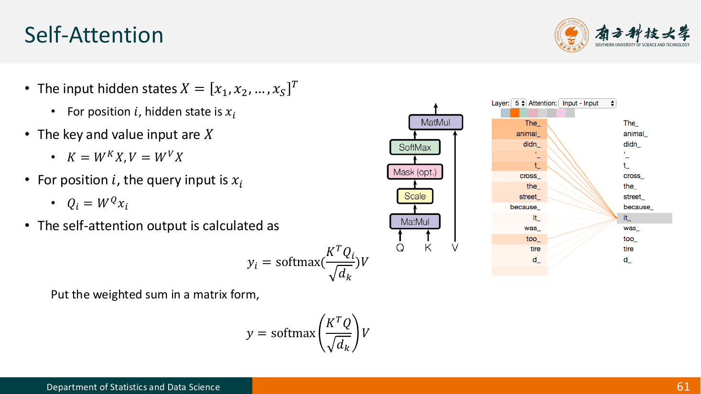

**🖼 逐元素图解：中右两张图**

**中间那张是论文原图 `Scaled Dot-Product Attention`，自下而上五个方块**：

1. 紫色 `MatMul`：两个输入箭头，下方标 **Q** 和 **K**——算 $QK^\top$。
2. 黄色 `Scale`：除以 $\sqrt{d_k}$。
3. 粉色 `Mask (opt.)`：**注意括号里的 `opt.` = optional**。编码器不用，解码器自注意力要用。
4. 绿色 `SoftMax`。
5. 紫色 `MatMul`：右边一条长箭头从最下方的 **V** 直接上来——**V 完全不参与打分，它只在最后一步被加权。**

**顺序是本页考点**：Scale 在 Mask 之前，Mask 在 SoftMax 之前。P64 那段代码漏掉了 Scale，对照这张图就能发现。

**右侧那张是 BertViz 风格的注意力可视化**：左右两列是同一个句子 `The animal didn't cross the street because it was too tired`，左列是 query 侧，右列是 key 侧。灰色高亮的 `it_` 是当前选中的 query，从它引出多条橙色连线到左列各词，**线的粗细/深浅 = 注意力权重**。可以看到指向 `The_ animal_` 的线明显最粗。左侧每个词的底色深浅也在表示同一件事。

**顶部下拉框 `Layer: 5` 和 `Attention: Input - Input`** 说明这是第 5 层的自注意力（Input-Input 即 encoder 自注意力）。**不同层的注意力模式差别很大，看可视化时一定要注意这是第几层。**

输入隐状态 $X=[x_1,x_2,\dots,x_S]^\top$，位置 $i$ 的隐状态是 $x_i$。

- key 与 value 的输入都是 $X$：$K=W^KX,\ V=W^VX$
- 位置 $i$ 的 query 输入是 $x_i$：$Q_i=W^Qx_i$

$$
y_i=\mathrm{softmax}\!\left(\frac{K^\top Q_i}{\sqrt{d_k}}\right)V,\qquad y=\mathrm{softmax}\!\left(\frac{K^\top Q}{\sqrt{d_k}}\right)V
$$

**「自」的形式化体现就在这里：$Q,K,V$ 全部由同一个 $X$ 生成。**这一行是本页的全部要义。

中间那张图是论文里的 Scaled Dot-Product Attention 计算图，自下而上：`MatMul(Q,K) → Scale(÷√d_k) → Mask(opt.) → SoftMax → MatMul(·,V)`。注意 **Mask 是可选的**，且位置在 Scale 之后、SoftMax 之前——这个顺序很重要（见 P64）。

右图是 [BertViz](https://github.com/jessevig/bertviz) 风格的注意力可视化，句子 "The animal didn't cross the street because it was too tired"。可以看到 **"it" 这个代词的注意力明显集中到了 "The animal" 上**——模型自己学会了指代消解。这是自注意力最经典的演示例子。

#### P62　为什么要除以 √dk

*Why scaling*

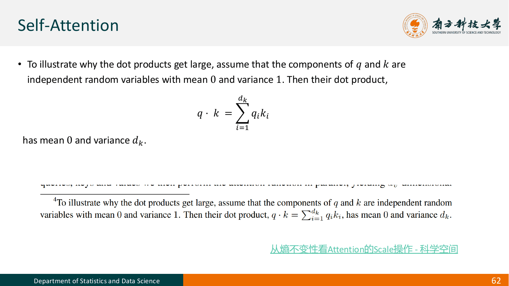

论文第 4 号脚注的论证：假设 $q$ 和 $k$ 的各个分量是**独立的、均值 0、方差 1**的随机变量，则它们的点积

$$
q\cdot k=\sum_{i=1}^{d_k}q_ik_i
$$

的**均值为 0、方差为 $d_k$**。

**逐步推导**（值得自己写一遍）：均值 $\mathbb{E}[q_ik_i]=\mathbb{E}[q_i]\mathbb{E}[k_i]=0$（独立），故 $\mathbb{E}[q\cdot k]=0$。方差 $\mathrm{Var}(q_ik_i)=\mathbb{E}[q_i^2k_i^2]-0=\mathbb{E}[q_i^2]\mathbb{E}[k_i^2]=1\cdot 1=1$；$d_k$ 项独立相加，方差相加，得 $\mathrm{Var}(q\cdot k)=d_k$。所以标准差是 $\sqrt{d_k}$。除以 $\sqrt{d_k}$ 后，方差被拉回 1。

> **💡 不除会怎样**
>
> $d_k=64$ 时标准差是 8，分数的典型取值就在 ±8～±24 这个范围。送进 softmax 后，最大的那一项会吃掉几乎全部概率——注意力退化成 **近似 one-hot 的硬选择**。而 softmax 在饱和区的**梯度接近 0**（回忆 $\partial\mathcal{L}/\partial z = p-t$，当 $p$ 已经是 one-hot 时，各分量之间的梯度几乎消失），模型就学不动了。
>
> 所以 $\sqrt{d_k}$ 不是随手加的常数，而是**让 softmax 工作在梯度良好的区域**的必要条件。这也解释了为什么多头要把 $d_k$ 减小到 $d_m/h$——每个头维度小，缩放因子也随之变化。

底部链接「从熵不变性看 Attention 的 Scale 操作 — 科学空间（苏剑林）」提供了另一个视角：从注意力分布的熵在序列长度变化时保持稳定出发，可以推出缩放因子应为 $\log n/\sqrt{d_k}$ 量级。适合想深挖的同学。

### Masked · Multi-head · Cross-Attention · P63–P67

#### P63　带掩码的自注意力：为什么需要

*Masked Self-Attention*

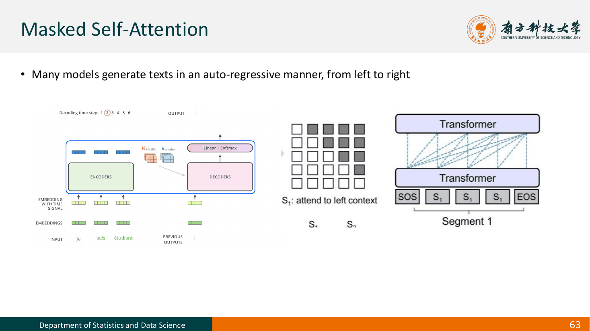

**🖼 逐元素图解：三张小图，三个角度**

**左图（来自 Illustrated Transformer）**：顶部标 `Decoding time step: 1 ②3 4 5 6`——**2 被圈出来，表示正在解码第 2 步**。左边绿色 `ENCODERS` 吃 `Je suis étudiant`，中间有两个小矩阵标 $K_{encdec}$ 和 $V_{encdec}$（橙色和蓝色），箭头指向右边粉色 `DECODERS`。解码器下方的输入是 `PREVIOUS OUTPUTS: I`，顶部经 `Linear + Softmax` 输出下一个词。**这张图强调：编码器的 K、V 算一次就固定了，解码每一步复用。**

**中图（掩码形状）**：一个 5×5 的方格阵，**白色格子在下三角（含对角线），灰色格子在上三角**。下方文字 `S₁: attend to left context`。白=允许看，灰=屏蔽。**第 i 行有 i 个白格**——第 1 个 token 只能看自己，第 5 个能看全部 5 个。

**右图（Transformer-XL 风格）**：下方一行方块 `SOS S₁ S₁ S₁ EOS`，标 `Segment 1`，上方两层 `Transformer` 横条，之间用蓝色虚线画出注意力连接。可以看到**虚线都是从右上指向左下**——只连向自己和左侧，没有一条指向右侧。这是因果掩码在多层结构里的样子。

很多模型以**自回归（auto-regressive）**方式从左到右生成文本——第 $t$ 个词的预测只能依赖前 $t-1$ 个词。

问题来了：P54 说自注意力是全连接的、每个位置能看到所有位置。训练时整句话是一次性喂进去的，那么预测第 3 个词时，模型会「看到」第 3、4、5 个词——**它能直接抄答案**。这样训出来的模型，推理时（没有未来词可看）会彻底失效。

解决办法：**掩码**。中间那张方格图是因果掩码的形状——白色（允许）位于下三角，灰色（禁止）位于上三角，配文 "S₁: attend to left context"。右图展示的是 Transformer-XL 风格的段级示意。

**三种注意力的可见性对照**

| 类型 | 位置 i 能看到 | 用在哪 | 代表模型 |
| --- | --- | --- | --- |
| 双向自注意力 | 全部位置 | 编码器 | BERT |
| 因果（掩码）自注意力 | 只看 $\le i$ | 解码器第一子层 | GPT 系列 |
| 交叉注意力 | 源序列全部位置 | 解码器第二子层 | 翻译模型、T5 |

#### P64　掩码的高效实现

*Set attention scores to −∞*

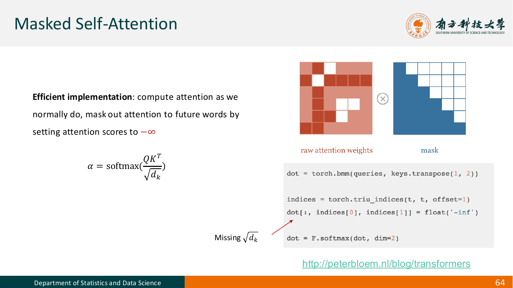

**🖼 逐元素图解：右上角那张乘法图是重点**

图分两块，中间一个 ⊗ 号：

- **左边红色方阵**：标 `raw attention weights`。颜色深浅随机，代表 softmax 之前算出来的原始分数——**注意它是满的，上三角和下三角都有值**。
- **右边蓝色方阵**：标 `mask`。**下三角（含对角线）是蓝色（=1，保留），上三角是白色（=0，屏蔽）**。这是一个标准的下三角矩阵。

⊗ 表示两者结合。**但请注意**：图上画成「相乘」只是示意，实际实现不是逐元素乘 0/1（那样 softmax 的分母还是会把未来项算进去），而是**在 softmax 之前把被屏蔽处加上 $-\infty$**。正文和代码里的 `float('-inf')` 才是真正的做法。

**代码块与图的对应**：
- `torch.bmm(queries, keys.transpose(1,2))` = 图上的红色方阵。
- `torch.triu_indices(t, t, offset=1)` = 图上白色（上三角）区域的坐标；`offset=1` 表示**不含对角线**，所以对角线是蓝的（可以看自己）。
- `dot[:, indices[0], indices[1]] = float('-inf')` = 把红色方阵的上三角挖掉。
- `F.softmax(dot, dim=2)` = 在最后一维（key 维）上归一化。

**红色箭头和 `Missing √d_k` 这行字**是老师自己标的勘误，指向的正是 `dot[...] = -inf` 这一行之前应该有的缩放。

课件原话：**照常计算注意力，然后把指向未来词的注意力分数设成 $-\infty$**。

$$
\alpha=\mathrm{softmax}\!\left(\frac{QK^\top}{\sqrt{d_k}}\right)
$$

为什么是 $-\infty$ 而不是 0：因为掩码必须加在 **softmax 之前**。$\exp(-\infty)=0$，所以这些位置在归一化后权重恰好为 0，且**不参与分母求和**——剩下的权重仍然精确地和为 1。如果在 softmax 之后把它们置 0，分母已经算进了未来词，剩余权重就不再归一化了，而且信息已经泄漏。

```python
dot = torch.bmm(queries, keys.transpose(1, 2))   # (B, t, t)
indices = torch.triu_indices(t, t, offset=1)     # 上三角，不含对角线
dot[:, indices[0], indices[1]] = float('-inf')   # 屏蔽 j > i
dot = F.softmax(dot, dim=2)
```

`offset=1` 的作用是**保留对角线**——位置 $i$ 可以看自己（呼应 P51 的结论），只屏蔽 $j>i$。

右上图非常直观：红色的原始注意力权重矩阵，乘上蓝色的下三角掩码，上三角被抹掉。

> **⚠️ 课件自己标了 "Missing √d_k"**
>
> 这段代码**漏掉了缩放**——`torch.bmm` 之后应该除以 $\sqrt{d_k}$ 再做掩码和 softmax。老师用红色箭头标了出来。完整顺序是：**MatMul → Scale → Mask → Softmax → MatMul with V**，与 P61 那张计算图完全一致。
>
> 另外实现上一般用一个很大的负数（如 `-1e9`）而非真正的 `-inf`，避免半精度下出现 `NaN`；而且如果某一行被全部屏蔽（padding 行），真 `-inf` 会让 softmax 产生 `0/0`。

#### P65　多头自注意力

*Multi-head Self-Attention*

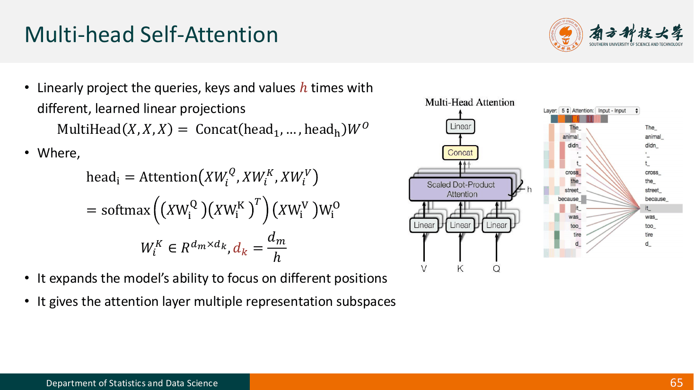

**🖼 逐元素图解：论文原图自下而上**

1. **最底部三个箭头，标 V、K、Q**——注意顺序是 V 在左、Q 在右（论文原图就是这个顺序，容易看反）。
2. **三个黄色 `Linear` 方块**：分别是 $W^V_i, W^K_i, W^Q_i$。**注意每个 Linear 方块后面都画了「叠影」**（方块背后还有几个错开的方块轮廓）——这是在表示「这样的 Linear 有 h 份」。
3. **紫色 `Scaled Dot-Product Attention`**：同样带叠影，右侧标着 **`h`** 和一条斜线，明确说明这个模块并行执行 h 次。
4. **黄色 `Concat`**：把 h 个头的输出横向拼接，维度从 $h\times d_k$ 恢复成 $d_m$。
5. **顶部白色 `Linear`**：这是 $W^O$，**只有一个，没有叠影**——说明它作用在拼接之后。

**「有没有叠影」就是图上区分「逐头」和「全局」的视觉标记。**正文里提到课件公式把 $W^O$ 写成了逐头的 $W_i^O$，对照这张原图就能看出差别（以及为什么两种写法等价）。

**右侧 BertViz 图**：和 P61 是同一个句子，但这次每条连线用**不同颜色**画出——**一种颜色 = 一个头**。可以看到不同颜色的线指向不同的词：有的头把 `it` 连到 `animal`，有的头连到 `tired`，有的头连到相邻位置。**这就是「多个表示子空间」的实物证据。**

核心思路：**把 Q、K、V 用 $h$ 组不同的、可学习的线性投影各投一次，并行做 $h$ 次注意力，再把结果拼起来过一个输出投影。**

$$
\mathrm{MultiHead}(X,X,X)=\mathrm{Concat}(\mathrm{head}_1,\dots,\mathrm{head}_h)W^O
$$

$$
\mathrm{head}_i=\mathrm{Attention}\!\left(XW_i^Q,\ XW_i^K,\ XW_i^V\right)
$$

$$
W_i^K\in\mathbb{R}^{d_m\times d_k},\qquad d_k=\frac{d_m}{h}
$$

**关键设计：$d_k=d_m/h$。**每个头的维度被缩小 $h$ 倍，所以 $h$ 个头的总计算量和参数量与「一个 $d_m$ 维的单头」*基本相同*。多头是**免费**的——这是它被普遍采用的现实原因。

课件给的两条收益：

- **扩展了模型同时关注不同位置的能力**——单头的 softmax 是竞争性的，注意力被一个位置吃掉后就顾不上别的；多个头可以各自锁定不同目标。
- **给了注意力层多个表示子空间**——不同头可以在不同的语义/语法维度上做匹配。实证研究发现，有的头专门处理句法依存，有的头盯着相邻位置，有的头负责指代。

> **⚠️ 公式里的两处不严谨**
>
> ① 第二行展开式 $\mathrm{softmax}\!\left((XW_i^Q)(XW_i^K)^\top\right)(XW_i^V)W_i^O$ **漏了 $\sqrt{d_k}$**。② 它把 $W^O$ 写成了每个头各有一个 $W_i^O$。严格说 $W^O\in\mathbb{R}^{d_m\times d_m}$ 是**拼接之后**统一作用的。不过这两种写法在数学上等价——把 $W^O$ 按行分成 $h$ 块 $W^O=[W_1^O;\dots;W_h^O]$，则
>
> $$\mathrm{Concat}(\mathrm{head}_1,\dots,\mathrm{head}_h)W^O=\sum_{i=1}^{h}\mathrm{head}_i W_i^O$$
>
> 所以课件的写法是「分块视角」，论文是「拼接视角」。理解这个等价关系，有助于看懂多头的本质：**多头就是把一个大注意力拆成若干个低秩的子注意力再求和。**

> **🔭 往后一步**
>
> 推理时 KV Cache 的显存与头数成正比，于是有了 **MQA**（所有头共享一份 K、V）和 **GQA**（分组共享，LLaMA-2/3 用的就是它）。Q 保持多头，K/V 减少，显存大降而质量几乎不掉。这是当前推理优化最常见的手段之一。

#### P66　多头的五步图解

*Multi-head, step by step*

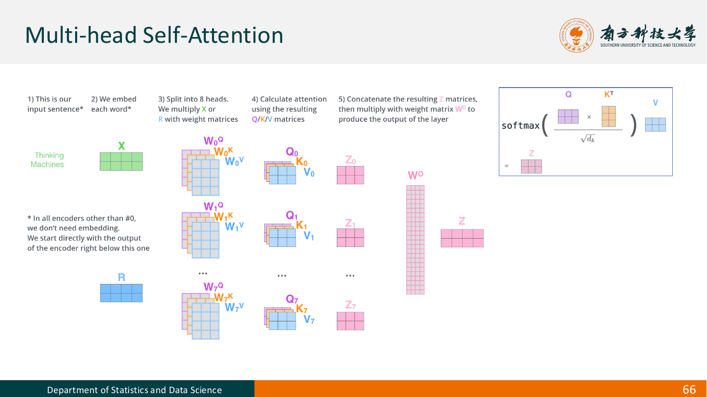

**🖼 逐元素图解：五步流水线，从左到右读**

1. **`This is our input sentence`**：`Thinking Machines` 两个词。
2. **`We embed each word`**：绿色矩阵 **X**，2 行（两个词）× 4 列（$d_m=4$ 的示意）。
3. **`Split into 8 heads. We multiply X or R with weight matrices`**：竖排 8 组，每组三个错开的方块 $W_0^Q, W_0^K, W_0^V$ 到 $W_7^Q,W_7^K,W_7^V$（紫/橙/蓝三色）。中间用 `...` 省略了第 2–6 组。
4. **`Calculate attention using the resulting Q/K/V matrices`**：得到 $Q_0K_0V_0$ 到 $Q_7K_7V_7$。**注意这些矩阵比 X 窄**——因为 $d_k=d_m/h$。
5. **`Concatenate the resulting Z matrices, then multiply with weight matrix Wᴼ`**：8 个粉色 $Z_0..Z_7$ → 一个细高的粉色大矩阵 **$W^O$** → 输出 **Z**（回到 X 的形状）。

**左侧那行小字必须读**：*"In all encoders other than #0, we don't need embedding. We start directly with the output of the encoder right below this one."* 配着下方蓝色的 **R** 矩阵——**只有第一层用词嵌入，其余各层的输入是下层的输出。**这解释了图上第 3 步为什么写「multiply X **or R**」。

**右上角那个小框**是 P59 左上角的同一张图，放在这里作为「单个头内部在做什么」的提醒。

1. **输入句子** "Thinking Machines"
2. **词嵌入**得到 $X$（图中绿色矩阵，2 行 × 4 列示意）
3. **切成 8 个头**：用 $W_0^Q,W_0^K,W_0^V$ 到 $W_7^Q,W_7^K,W_7^V$ 分别乘 $X$，得到 $Q_0K_0V_0 \dots Q_7K_7V_7$
4. **各头独立算注意力**，得到 $Z_0,\dots,Z_7$（粉色）
5. **拼接后乘 $W^O$**（图中那个细高的大矩阵），得到本层输出 $Z$

注意图左那行小字：**"In all encoders other than #0, we don't need embedding. We start directly with the output of the encoder right below this one."**——只有第一层从词嵌入开始，其余各层的输入 $R$（蓝色）是下面一层的输出。这呼应了 P54 的 "Can be either input or a hidden layer"。

> **💡 实现上并不真的切 8 次**
>
> 代码里不会写 8 个 `nn.Linear`。标准做法是用**一个** $d_m\times d_m$ 的大矩阵一次投影出全部头，然后 `view` + `transpose` 重排成 `(batch, heads, seq, d_k)`：
>
> ```python
> q = self.W_q(x)                                    # (B, L, d_m)
> q = q.view(B, L, h, d_k).transpose(1, 2)           # (B, h, L, d_k)
> # ... 注意力在最后两维上做，h 当作 batch 维
> out = out.transpose(1, 2).reshape(B, L, d_m)       # 拼接
> out = self.W_o(out)
> ```
>
> 数学上与图解完全等价，但只有 4 次矩阵乘法。**「切头」是一次 reshape，不是真的分开计算。**

#### P67　交叉注意力

*Cross-Attention*

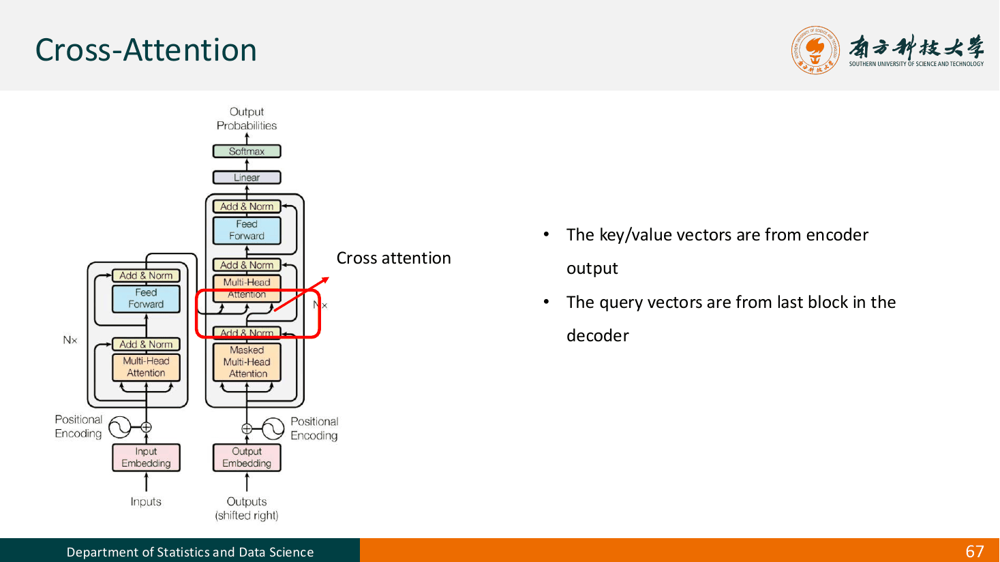

**🖼 逐元素图解**

整张架构图重现，但**红色方框圈住了解码器的中间那个橙色 `Multi-Head Attention` 以及它下方的 `Add & Norm`**，红色箭头引出标注 `Cross attention`。

**要看清楚被圈中模块的三个输入箭头**：
- **两个箭头从左侧进来**，顺着线往回走会发现它们来自编码器柱的顶端——这是 **K 和 V**。
- **一个箭头从下方上来**，来自解码器自己的 `Masked Multi-Head Attention` 之后的 `Add & Norm`——这是 **Q**。

右侧两行文字正是这个意思：`The key/value vectors are from encoder output`、`The query vectors are from last block in the decoder`。

**对比着看解码器最底下那个 `Masked Multi-Head Attention`**：它的三个箭头**全部从同一处分叉上来**——那是自注意力。**箭头从哪来，是图上唯一能区分自注意力和交叉注意力的标志。**

图上红框圈出的是解码器的**第二个**多头注意力子层。两条规则：

- **key / value 来自编码器输出**
- **query 来自解码器中上一个模块的输出**

$$
\mathrm{CrossAttn}(H^{dec},H^{enc})=\mathrm{softmax}\!\left(\frac{Q K^\top}{\sqrt{d_k}}\right)V,\quad Q=H^{dec}W^Q,\ K=H^{enc}W^K,\ V=H^{enc}W^V
$$

这就是 P39–P41 那个经典 seq2seq 注意力的 Transformer 版本——**译文的每个位置去问源句「我现在该翻译你的哪一部分」**。

> **💡 三层结构的分工**
>
> 解码器一层里三个子层各司其职，顺序不能换：
>
> 1. **Masked self-attention**：看已经生成的译文（管流畅度、语法）
> 2. **Cross-attention**：看源句（管忠实度、译什么）
> 3. **FFN**：逐位置做非线性变换（管表达能力）
>
> 还有两个实现要点：交叉注意力**不需要因果掩码**（源句是完整已知的，只需 padding mask）；而且由于 $K,V$ 只依赖编码器输出，推理时可以**算一次缓存整个解码过程**。

> **🔭 架构谱系**
>
> 按「用不用交叉注意力」可以把 Transformer 家族分三类：**Encoder-only**（BERT，只有双向自注意力，做理解任务）、**Decoder-only**（GPT/LLaMA，只有因果自注意力，没有交叉注意力，做生成）、**Encoder-Decoder**（原始 Transformer、T5、BART，三种注意力齐全）。今天的大语言模型绝大多数是 Decoder-only——把源句直接拼进 prompt，用因果自注意力一并处理，省掉了编码器。

### FFN · LayerNorm · 位置编码 · 残差 · Dropout · P68–P75

#### P68　前馈层

*Feed Forward Layer*

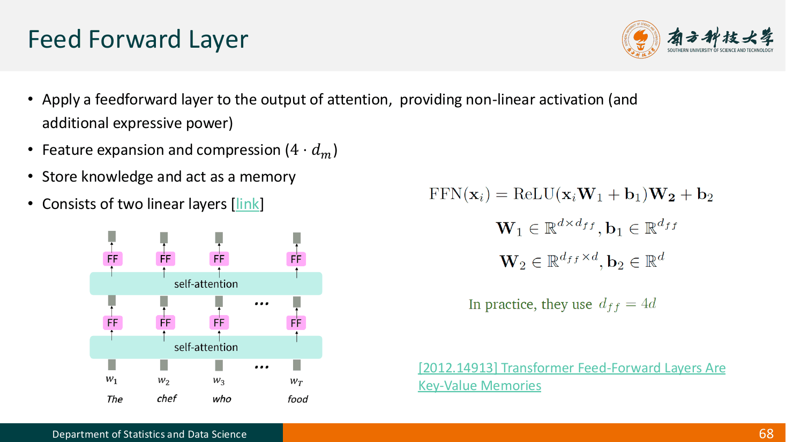

**🖼 逐元素图解**

左图自下而上四层，输入是 `The chef who ... food`（$w_1,w_2,w_3,\dots,w_T$）：

- 最底一行灰色小方块 = 词表示。
- 第一条浅青色**横条** `self-attention`：横跨所有位置，表示信息在此混合。
- 上方一行**粉色 `FF` 小方块**：**每个位置一个，彼此分开**，中间还有 `...` 表示省略。
- 再一条 `self-attention` 横条，再一行 `FF` 小方块。
- 顶部灰色方块 = 该层输出。

**「横条 vs 一排小方块」这个视觉对比就是整页的核心**：横条 = 跨位置，小方块 = 逐位置。八个 FF 方块虽然分开画，但**它们共享同一组权重 $W_1,W_2$**——分开画是为了强调计算上互不干扰，不是说有 8 组参数。

**例句 `The chef who ... food` 也不是随便选的**：主语 chef 和谓语之间隔着一个很长的定语从句，是测试长程依赖的经典句式。

$$
\mathrm{FFN}(\mathbf{x}_i)=\mathrm{ReLU}(\mathbf{x}_i\mathbf{W}_1+\mathbf{b}_1)\mathbf{W}_2+\mathbf{b}_2
$$

$$
\mathbf{W}_1\in\mathbb{R}^{d\times d_{ff}},\ \mathbf{b}_1\in\mathbb{R}^{d_{ff}},\qquad \mathbf{W}_2\in\mathbb{R}^{d_{ff}\times d},\ \mathbf{b}_2\in\mathbb{R}^{d}
$$

实践中取 $d_{ff}=4d$。

课件列的四条作用：

- **给注意力的输出提供非线性激活**（以及额外的表达能力）——回忆 P52：注意力本身是加权平均，是线性的。
- **特征的扩张与压缩**：$d\to 4d\to d$，先升维再降维。
- **存储知识、充当记忆**。
- 由两个线性层构成。

注意下标 $i$——FFN 是**逐位置**作用的：每个 token 独立地过同一个两层 MLP，位置之间不交互。等价于 kernel size = 1 的卷积。

> **💡 「充当记忆」是什么意思**
>
> 底部那篇论文 *Transformer Feed-Forward Layers Are Key-Value Memories*（Geva et al., 2021）给出了很漂亮的解释：把 $\mathbf{W}_1$ 的每一**列**看成一个 key、$\mathbf{W}_2$ 的对应**行**看成一个 value，那么
>
> $$\mathrm{FFN}(x)=\sum_{j=1}^{d_{ff}}\mathrm{ReLU}\!\left(x\cdot\mathbf{k}_j\right)\cdot\mathbf{v}_j$$
>
> 其中 $\mathrm{ReLU}(x\cdot\mathbf{k}_j)$ 就是「第 j 条记忆被激活的强度」。
>
> ——这**就是一次注意力**，只不过 key 和 value 不是来自输入，而是**固化在权重里的、训练学到的知识**。论文还发现浅层的 key 匹配表层模式（n-gram），深层的 key 匹配语义模式。这也是模型编辑（ROME、MEMIT 等「改掉模型记住的某个事实」的方法）直接修改 FFN 权重的理论依据。

> **💡 参数量的大头**
>
> 一层里 FFN 有 $2\times d\times 4d=8d^2$ 参数，注意力只有 $4d^2$。**Transformer 三分之二的参数在 FFN 里**，不在注意力里。这个事实在 P79 会再次出现，也是 MoE（混合专家）选择替换 FFN 而不是注意力的原因。

左图画的是两层堆叠：`self-attention → FF（每个位置一个）→ self-attention → FF`，输入是 "The chef who ... food"。这个例句是主谓一致的经典测试（chef 与远处的动词要一致）。

#### P69　层归一化：定义与实现

*Layer Normalization*

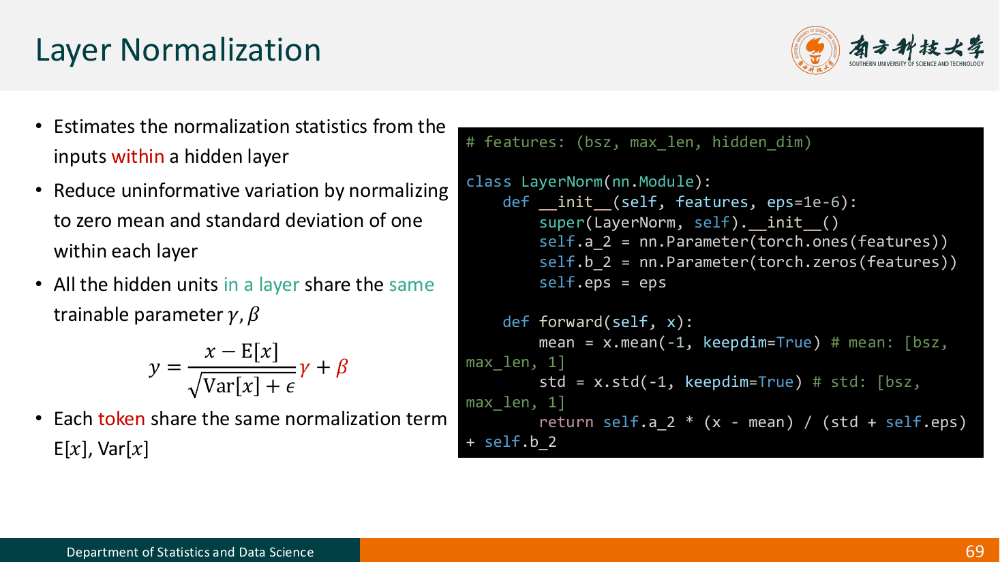

**🖼 逐元素图解：代码里的维度注释是重点**

顶部注释 `# features: (bsz, max_len, hidden_dim)` 说明输入张量是三维的：批次 × 序列长度 × 隐藏维度。

然后逐行对应：
- `self.a_2 = nn.Parameter(torch.ones(features))` = $\gamma$，**初始化为全 1**（一开始不缩放）。
- `self.b_2 = nn.Parameter(torch.zeros(features))` = $\beta$，**初始化为全 0**（一开始不平移）。两者形状都是 `(hidden_dim,)`——**所以同一层里所有位置、所有样本共享这一组 γ、β。**
- `mean = x.mean(-1, keepdim=True)` 后面的注释 `# mean: [bsz, max_len, 1]` **是全页最关键的一行**：均值的形状里，bsz 和 max_len 都保留了，只有 hidden_dim 被压成了 1。**这说明每个样本的每个位置各算各的均值**，共 bsz × max_len 组统计量。
- `std` 同理。
- `return self.a_2 * (x - mean) / (std + self.eps) + self.b_2` 就是公式 $y=\frac{x-\mathbb{E}[x]}{\sqrt{\mathrm{Var}[x]+\epsilon}}\gamma+\beta$。

**左侧四条文字与代码的对应**：第一条「从同一隐层内部估计统计量」↔ `mean(-1)`；第三条「同层所有隐单元共享 γ、β」↔ `torch.ones(features)`；第四条「每个 token 有自己的 E[x], Var[x]」↔ 那行 `[bsz, max_len, 1]` 注释。

$$
y=\frac{x-\mathbb{E}[x]}{\sqrt{\mathrm{Var}[x]+\epsilon}}\,\gamma+\beta
$$

课件的四条要点：从**同一个隐层内部**的输入估计归一化统计量；把分布拉到零均值单位方差，减少无信息的变异；同一层的所有隐单元**共享**可训练参数 $\gamma,\beta$；**每个 token 有自己的 $\mathbb{E}[x],\mathrm{Var}[x]$**。

最后一条是理解 LayerNorm 的钥匙。特征张量形状是 `(bsz, max_len, hidden_dim)`，代码里写的是 `x.mean(-1, keepdim=True)`——**只在最后一维（hidden_dim）上求均值**，得到形状 `(bsz, max_len, 1)`。也就是说：**每一个位置的每一个样本，各自用自己的 $d$ 个数算出一个均值和一个方差**。

```python
class LayerNorm(nn.Module):
    def __init__(self, features, eps=1e-6):
        super().__init__()
        self.a_2 = nn.Parameter(torch.ones(features))   # γ，初始化为 1
        self.b_2 = nn.Parameter(torch.zeros(features))  # β，初始化为 0
        self.eps = eps

    def forward(self, x):
        mean = x.mean(-1, keepdim=True)   # (bsz, max_len, 1)
        std  = x.std(-1,  keepdim=True)   # (bsz, max_len, 1)
        return self.a_2 * (x - mean) / (std + self.eps) + self.b_2
```

**$\gamma,\beta$ 为什么必须有**：强行把每层输出压成零均值单位方差会损失表达能力（比如 sigmoid 被限制在近似线性的中段）。$\gamma,\beta$ 让网络可以学着**把分布调回去**——极端情况下取 $\gamma=\sqrt{\mathrm{Var}},\beta=\mathbb{E}$ 就完全还原了。所以归一化是「提供一个良好的默认，同时保留反悔的权利」。

> **⚠️ 代码与公式的小差异**
>
> 公式是 $\sqrt{\mathrm{Var}+\epsilon}$（eps 在根号*里*），代码是 `std + eps`（eps 在根号*外*）。数值上差别极小，但 PyTorch 官方 `nn.LayerNorm` 用的是前者。另外 `torch.std` 默认是无偏估计（除以 $n-1$），而 `nn.LayerNorm` 用的是有偏估计（除以 $n$）。自己实现时若要与官方对齐，注意这两点。

#### P70　为什么 Transformer 用 LayerNorm

*Why layer normalization?*

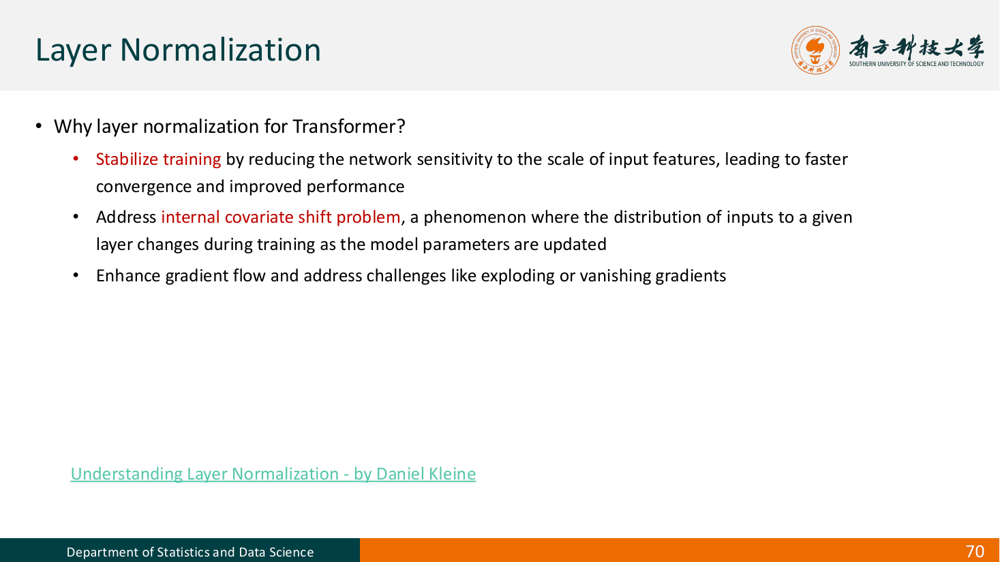

- **稳定训练**——降低网络对输入特征尺度的敏感度，收敛更快、效果更好。
- **缓解 internal covariate shift**——随着参数更新，某一层输入的分布会不断漂移，下游层被迫一直「追着」适应。
- **改善梯度流**，缓解梯度爆炸/消失。

> **💡 为什么不用 BatchNorm**
>
> 这才是关键问题。三个原因：
>
> 1. **序列长度可变**。BN 在 batch 维上统计，但每个句子长度不同、有大量 padding，靠后的位置有效样本数极少，统计量极不可靠。
> 2. **依赖 batch size**。BN 在小 batch 下方差估计噪声大；NLP 训练常用梯度累积和小 batch。
> 3. **训练/推理不一致**。BN 推理时要用训练阶段累积的滑动均值方差，而**LN 在训练和推理时的行为完全相同**——对自回归生成尤其重要（生成时 batch 里只有一个 token）。
>
> 顺带一提：「internal covariate shift」这个解释在后来被质疑（Santurkar et al., 2018 指出归一化的真正作用是**让损失曲面更平滑**、允许更大的学习率），但这个说法在教学上仍然直观好用。

#### P71　三种归一化的对比图

*BN vs LN in CNN vs LN in Transformer*

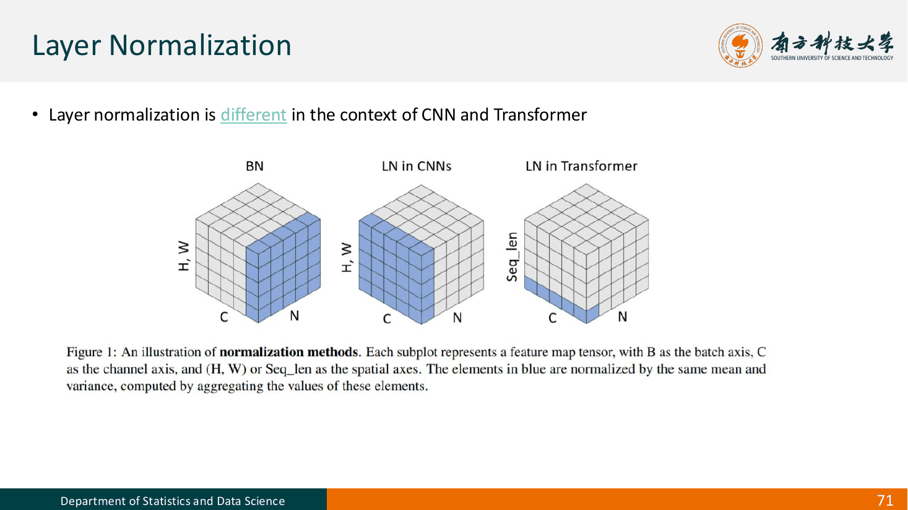

**🖼 逐元素图解：三个立方体怎么看**

每个立方体有三条轴：**N（向右，批次方向）、C（向右下，通道/特征方向）、H,W 或 Seq_len（向上，空间/序列方向）**。蓝色格子 = 「用同一组均值方差归一化」的元素集合。

- **左：BN**。蓝色部分是**一整片竖直的薄板**，沿 N 方向铺开、沿 H,W 方向铺满，但在 C 方向只占一格。含义：**固定一个通道，把所有样本、所有空间位置的值放在一起算统计量**。所以统计量个数 = C。**注意它跨越了 N 轴——这就是「依赖 batch」的图形证据。**
- **中：LN in CNN**。蓝色部分是**一整片竖直的薄板，但方向转了 90°**：沿 C 方向铺开、沿 H,W 铺满，在 N 方向只占一格。含义：**固定一个样本，把它的所有通道、所有位置放在一起算。**统计量个数 = N。
- **右：LN in Transformer**。蓝色部分**缩成了底部一条细长的横条**：只沿 C 方向铺开，在 N 和 Seq_len 方向各只占一格。含义：**固定一个样本的一个位置，只在特征维上算。**统计量个数 = N × Seq_len。

**蓝色区域的「体积」从左到右越来越小**——归一化的范围越来越局部。右边那条最细的横条，就是 Transformer 能处理变长序列、能在生成时逐 token 工作的原因。

三个立方体，轴向分别是 N（batch）、C（通道 / 特征）、(H,W) 或 Seq_len。蓝色部分表示「用同一组均值方差归一化的元素」。

| 方法 | 沿哪些维度求统计量 | 统计量个数 |
| --- | --- | --- |
| BatchNorm | N, H, W（跨样本！） | C 个 |
| LN in CNN | C, H, W（单样本内全部） | N 个 |
| **LN in Transformer** | **只沿 C**（单样本、单位置） | N × Seq_len 个 |

课件特意用了 "different" 这个词并加了链接——**同样叫 Layer Normalization，在 CNN 和 Transformer 里归一化的范围其实不一样**。Transformer 的 LN 是最「局部」的：一个 token 一套统计量，完全不跨位置、不跨样本。这正是它对变长序列友好的原因。

> **🔭 往后一步**
>
> 当代大模型多用 **RMSNorm**：$y=\dfrac{x}{\sqrt{\frac{1}{d}\sum x_i^2+\epsilon}}\gamma$——**去掉了减均值和 $\beta$**，只做缩放。实验表明效果相当而计算更省（少一次求均值、少一次减法）。LLaMA、T5、Gemma 全系都用它。

#### P72　归一化如何改善收敛

*Improves convergence stability*

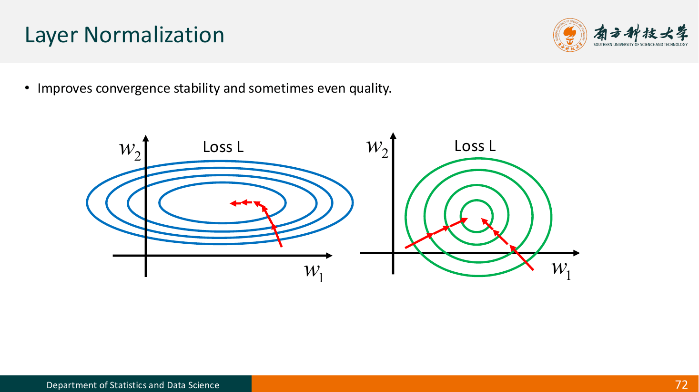

**🖼 逐元素图解：两组等高线的对比**

两张图的坐标轴都是 $w_1$（横）和 $w_2$（纵），标注 `Loss L`，红色箭头是优化轨迹。

**左图（蓝色，未归一化）**：等高线是**扁而宽的椭圆**，长轴沿 $w_1$。红色轨迹从右下方进入，然后在椭圆中间**来回横跳了好几次**（箭头一会儿朝左、一会儿朝左上、一会儿朝右），进展缓慢。原因：梯度方向垂直于等高线，在扁椭圆上它几乎总是指向短轴方向，而不是指向中心。

**右图（绿色，已归一化）**：等高线接近**同心圆**。三条红色箭头从不同方向进入，**每一条都近乎笔直地指向圆心**，两三步就到。

**把两张图叠在脑子里比较**：同样的优化算法、同样的学习率，仅仅因为损失曲面的形状不同，一个走了十几步还在震荡，一个三步到位。**归一化不改变最优解在哪，它改变的是「路好不好走」。**

两张等高线图说尽一切：

- **左（蓝，未归一化）**：等高线是扁长的椭圆——$w_1$ 和 $w_2$ 的尺度差异很大。梯度方向（垂直于等高线）几乎不指向中心，红色轨迹在窄方向来回横跳、在长方向龟速前进。学习率还必须迁就最陡的那个方向，只能设得很小。
- **右（绿，已归一化）**：等高线接近同心圆。梯度直指最优点，几步就到，而且可以用大得多的学习率。

用条件数（Hessian 最大特征值 / 最小特征值）来说：左图条件数大，收敛慢；归一化把各方向的尺度拉齐，条件数降低，收敛快。这也是 P29 那张 $z=x^2+2y^2$ 轨迹图想说明的同一件事——只不过那里是靠 Adam 的自适应学习率来解决，这里是靠归一化改造损失曲面本身。**两条路，同一个目标。**

#### P73　位置编码

*Positional Embedding*

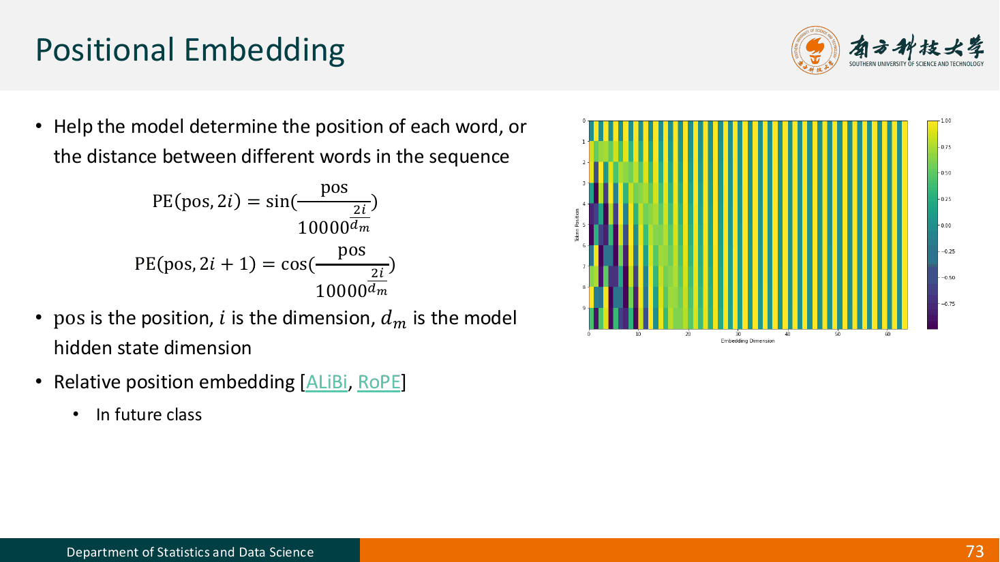

**🖼 逐元素图解：热力图的条纹密度就是频率**

纵轴 `Token Position` 从 0 到 9（十个位置），横轴 `Embedding Dimension` 从 0 到约 64，右侧色标从 −1.00（深紫）到 1.00（亮黄）。

**从左往右看条纹的变化**：
- **最左侧（低维，$i$ 小）**：颜色沿纵向（位置方向）变化极快，紫黄相间，**每隔一两个位置就翻转一次**——对应波长很短的正弦波（$i=0$ 时波长 $2\pi\approx6.3$ 个位置）。
- **往右走（$i$ 增大）**：条纹逐渐变宽，颜色沿纵向变化变慢，出现大块的连续色区。
- **最右侧（高维）**：整列几乎是同一个颜色，纵向基本不变——波长已经长到远超 10 个位置。

**这就是「连续版二进制计数器」的图形形态**：左边像二进制的低位（每次加 1 都翻转），右边像高位（很久才翻转一次）。任意一行（一个位置）的完整颜色组合是唯一的，模型据此区分位置。

**还可以看出竖向的明暗交替**：相邻两列是 sin/cos 配对（偶数维 sin、奇数维 cos），相位差 90°，所以颜色呈现规律的两两交替。

$$
\mathrm{PE}(\mathrm{pos},2i)=\sin\!\left(\frac{\mathrm{pos}}{10000^{2i/d_m}}\right),\qquad \mathrm{PE}(\mathrm{pos},2i+1)=\cos\!\left(\frac{\mathrm{pos}}{10000^{2i/d_m}}\right)
$$

$\mathrm{pos}$ 是位置序号，$i$ 是维度序号，$d_m$ 是隐状态维度。偶数维用 sin、奇数维用 cos。

**为什么必须有位置编码**：自注意力是**置换等变**的——把输入序列的顺序打乱，输出也只是跟着打乱，内容完全不变。也就是说，纯粹的自注意力**看不见词序**，"狗咬人" 和 "人咬狗" 对它是一样的。位置信息必须从外部注入。

**这个公式怎么读**：不同的维度 $i$ 对应不同**频率**的正弦波。$i=0$ 时波长是 $2\pi$（变化极快，能区分相邻位置）；$i$ 接近 $d_m/2$ 时波长接近 $2\pi\cdot 10000$（变化极慢，能编码长距离）。整个向量就像一个**二进制计数器的连续版本**——低位翻转快、高位翻转慢，组合起来唯一地表示一个位置。右图那张热力图正是这个结构：左边（低维）条纹密，右边（高维）条纹疏。

> **💡 最漂亮的性质**
>
> 对任意固定偏移 $k$，$\mathrm{PE}(\mathrm{pos}+k)$ 可以表示成 $\mathrm{PE}(\mathrm{pos})$ 的**线性变换**（一个只依赖 $k$ 的旋转矩阵）——由和角公式直接得到：
>
> $$\begin{aligned}\sin(\omega(\mathrm{pos}+k))&=\sin(\omega\,\mathrm{pos})\cos(\omega k)+\cos(\omega\,\mathrm{pos})\sin(\omega k)\\ \cos(\omega(\mathrm{pos}+k))&=\cos(\omega\,\mathrm{pos})\cos(\omega k)-\sin(\omega\,\mathrm{pos})\sin(\omega k)\end{aligned}$$
>
> 这让模型有可能学到「关注前 3 个位置」这类**相对**位置的模式。另一个好处是它不含参数，理论上可以外推到训练时没见过的更长序列（实际外推效果一般，这也是 RoPE/ALiBi 出现的原因）。

位置编码是**加**到词嵌入上的（$x=\text{emb}(w)+\mathrm{PE}(\mathrm{pos})$），不是拼接。课件末尾提到相对位置编码 **ALiBi** 和 **RoPE**，说「in future class」——这两个是当代大模型的标配，RoPE 尤其重要（LLaMA、Qwen、GPT-NeoX 全用它），它把位置信息作为**旋转**直接施加在 Q 和 K 上，使注意力分数天然只依赖相对距离。

#### P74　残差连接

*Residual Connection*

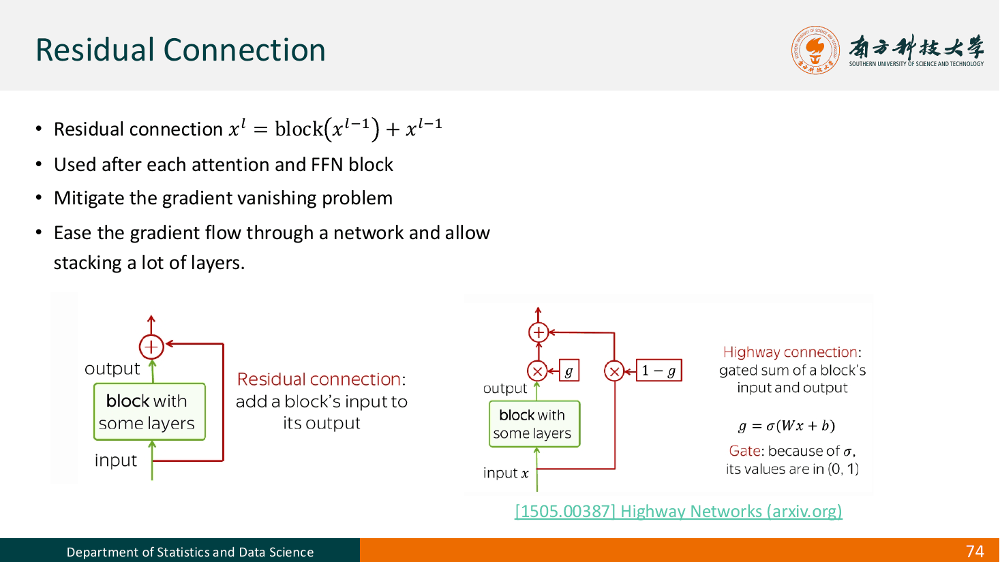

**🖼 逐元素图解：左右两个结构的差别只在一个门**

**左图（残差）**：
- 底部绿色箭头 `input` 向上进入绿框 `block with some layers`。
- 绿框输出继续向上到红色 ⊕。
- **右侧一条红色折线**：从 input 处分叉，绕过绿框，直接接到 ⊕ 的右侧。
- ⊕ 向上输出。
- 红字注释 `Residual connection: add a block's input to its output`。

**右图（Highway）**：结构相同，但在两条路径上各加了一个红色 ✕（乘法）：
- 主路径（经过 block）乘以 **$g$**。
- 旁路（直连）乘以 **$1-g$**。
- 红字给出 $g=\sigma(Wx+b)$，并注明 `Gate: because of σ, its values are in (0,1)`。

**两图对比的结论**：Highway 让网络**学**该保留多少输入；残差直接把这个比例**固定成 1:1**。少一个门、少一组参数、少一个可能出错的地方——**结果反而更好训练。**这是深度学习里「删掉一个部件反而更强」的最著名例子。

$$
x^l=\mathrm{block}\!\left(x^{l-1}\right)+x^{l-1}
$$

用在每个注意力块和 FFN 块之后（就是 `Add & Norm` 里的 Add）。作用：缓解梯度消失、疏通梯度流、让网络能堆很多层。

**数学上为什么有效**：对残差块求导，

$$
\frac{\partial x^l}{\partial x^{l-1}}=\frac{\partial\,\mathrm{block}(x^{l-1})}{\partial x^{l-1}}+\mathbf{I}
$$

那个**单位矩阵 $\mathbf{I}$** 是关键——即便 block 的雅可比矩阵接近 0（梯度消失），总梯度里仍然有一条系数为 1 的通路。反向传播到第 $l$ 层时，梯度是 $\prod_l(\mathbf{J}_l+\mathbf{I})$ 而不是 $\prod_l \mathbf{J}_l$，展开后包含一项「完全不经过任何 block 的直连梯度」。这就是深层网络得以训练的根本原因（He et al., ResNet, 2015）。

**另一个视角**：残差让每一层只需要学「相对于恒等映射的*增量*」。如果某一层没什么可做的，它学成 0 即可（比学成恒等映射容易得多）。所以堆更多层至少不会变差。

右图是 **Highway Network**（Srivastava et al., 2015）——残差的「带门」版本：

$$
\text{output}=g\odot \mathrm{block}(x)+(1-g)\odot x,\qquad g=\sigma(Wx+b)\in(0,1)
$$

门 $g$ 由 sigmoid 产生，决定「这一层的输出和输入各取多少」。残差连接可以看成 Highway 在 $g\equiv 1$ 时的特例——**去掉门反而更好用、更容易训练**，这是深度学习里「简化胜过复杂」的经典案例。

#### P75　Dropout

*Dropout*

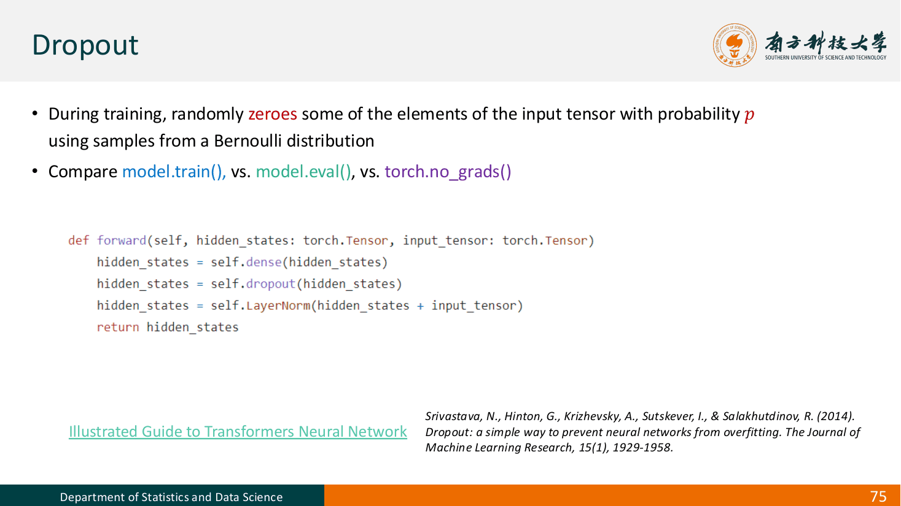

训练时按伯努利分布，以概率 $p$ 随机把输入张量的一部分元素**置零**。

```python
def forward(self, hidden_states, input_tensor):
    hidden_states = self.dense(hidden_states)
    hidden_states = self.dropout(hidden_states)
    hidden_states = self.LayerNorm(hidden_states + input_tensor)  # 残差 + LN
    return hidden_states
```

注意这段（取自 HuggingFace BERT）里三件事的顺序：**线性 → dropout → 加残差 → LayerNorm**。dropout 加在残差*相加之前*，主干（identity 通路）不被丢弃。

**为什么能防过拟合**：随机丢弃迫使网络不能依赖任何单个神经元，必须学出冗余的、分布式的表示。也可以理解成在训练 $2^n$ 个共享权重的子网络，推理时取它们的近似集成。

**课件要求你分清的三个东西**——这是非常好的考点：

|   | 作用 | 影响 dropout / BN？ | 影响梯度计算？ |
| --- | --- | --- | --- |
| `model.train()` | 置为训练模式 | dropout **开启**，BN 用当前 batch 统计量 | 否 |
| `model.eval()` | 置为评估模式 | dropout **关闭**，BN 用滑动统计量 | 否 |
| `torch.no_grad()` | 上下文管理器 | **不影响** | 是——不建计算图，省显存、提速 |

> **⚠️ 最常见的两个错误**
>
> ① 评估时只写了 `torch.no_grad()` 却忘了 `model.eval()`——dropout 仍然开着，验证分数会偏低且每次不同。**两者必须同时用。**② 评估完忘了切回 `model.train()`，导致后续训练里 dropout 全程失效。
>
> 另外要知道 PyTorch 的 dropout 采用 **inverted dropout**：训练时把保留下来的值除以 $1-p$ 放大，这样推理时**什么都不用做**，期望值自动对齐。

原始 Transformer 的 dropout 用在三处：每个子层输出（加残差之前）、注意力权重上、以及嵌入与位置编码之和上。base 模型 $p=0.1$。

### 编码器、解码器与参数量 · P76–P81

#### P76　Transformer 编码器

*Transformer Encoder*

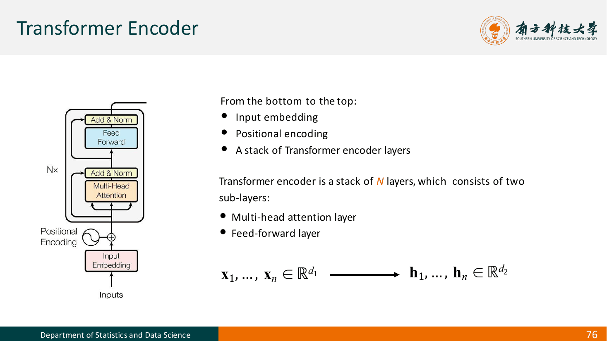

**🖼 逐元素图解**

左侧是编码器的单独视图，自下而上：

1. `Inputs` → 粉色 `Input Embedding`。
2. 波浪符号 ∿ 标 `Positional Encoding`，通过 ⊕ 加入。
3. 进入灰色大框，框左侧标 **`N×`**。
4. 框内第一层：橙色 `Multi-Head Attention`，**下方有三个箭头从同一处分叉**（自注意力的标志）。
5. 黄色 `Add & Norm`，左侧有一条细线从 Multi-Head Attention 的输入处绕过来（残差）。
6. 蓝色 `Feed Forward`。
7. 又一个黄色 `Add & Norm`，同样带残差细线。
8. 顶部箭头出框。

**右侧文字里最值得注意的是那行公式** $\mathbf{x}_1,\dots,\mathbf{x}_n\in\mathbb{R}^{d_1}\longrightarrow\mathbf{h}_1,\dots,\mathbf{h}_n\in\mathbb{R}^{d_2}$：**输入几个向量，输出就是几个向量，个数不变、位置一一对应。**编码器不做压缩也不做扩展，它只是把每个向量「重写」成带上下文的版本。

自下而上：**Input embedding → Positional encoding → N 层编码器**。

每一层由**两个**子层组成：多头注意力层、前馈层。每个子层外面都包着「残差 + LayerNorm」。

$$
\mathbf{x}_1,\dots,\mathbf{x}_n\in\mathbb{R}^{d_1}\ \longrightarrow\ \mathbf{h}_1,\dots,\mathbf{h}_n\in\mathbb{R}^{d_2}
$$

这行式子强调了编码器的本质：**一个保长度的序列到序列映射**——输入 $n$ 个向量，输出 $n$ 个向量，位置一一对应，但每个输出向量都已融合了全序列的上下文信息。（实践中 $d_1=d_2=d_m$，必须相等，否则残差连接加不起来。）

写成公式，一层编码器是：

$$
\mathbf{z}=\mathrm{LN}\big(\mathbf{x}+\mathrm{MHA}(\mathbf{x})\big),\qquad \mathbf{h}=\mathrm{LN}\big(\mathbf{z}+\mathrm{FFN}(\mathbf{z})\big)
$$

图中 Multi-Head Attention 框下方有**三个箭头**从同一处分叉进入——这正是「自注意力」的图形表达：$Q,K,V$ 来自同一个输入。

#### P77　Transformer 解码器

*Transformer Decoder*

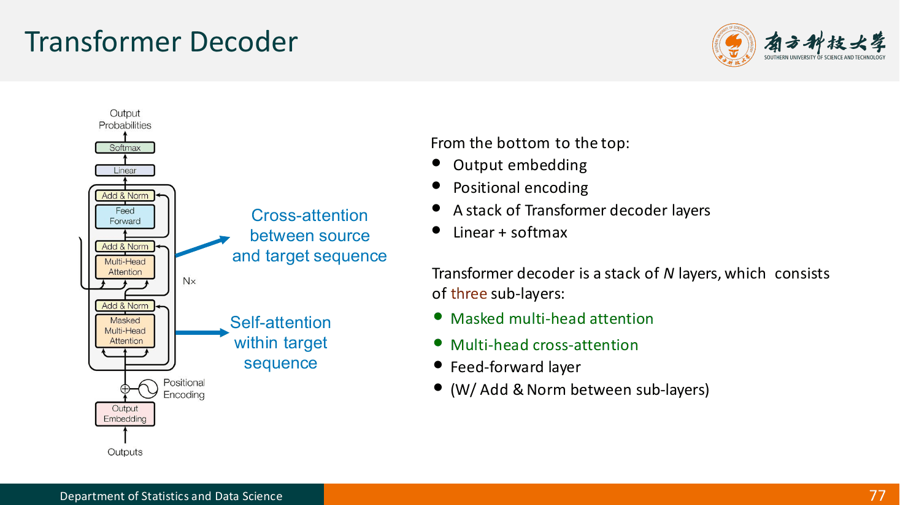

**🖼 逐元素图解：与 P76 对比着看**

解码器的灰框里比编码器**多了一层**，自下而上：

1. 橙色 `Masked Multi-Head Attention`（三箭头分叉 = 自注意力）+ `Add & Norm`。蓝色箭头标注 **`Self-attention within target sequence`**。
2. 橙色 `Multi-Head Attention` + `Add & Norm`。蓝色箭头标注 **`Cross-attention between source and target sequence`**。**注意它左边那两个横向进来的箭头。**
3. 蓝色 `Feed Forward` + `Add & Norm`。
4. 出框后：紫色 `Linear` → 绿色 `Softmax` → `Output Probabilities`。

**右侧文字用绿色标出了新增的两个子层**（`Masked multi-head attention`、`Multi-head cross-attention`），黑色的 `Feed-forward layer` 是与编码器共有的。红色的 **`three`** 在强调「解码器每层是三个子层，不是两个」——这是考试最爱问的点。

**记忆口诀**：解码器 = 编码器 + 一层交叉注意力，且自注意力要戴口罩。

自下而上：**Output embedding → Positional encoding → N 层解码器 → Linear + softmax**。

每一层由*三个*子层组成（比编码器多一个）：

1. **Masked multi-head attention** — 目标序列内部的自注意力，带因果掩码
2. **Multi-head cross-attention** — 源序列与目标序列之间
3. **Feed-forward layer**

子层之间同样都有 Add & Norm。写成公式：

$$
\mathbf{z}_1=\mathrm{LN}\big(\mathbf{y}+\mathrm{MaskedMHA}(\mathbf{y})\big)
$$

$$
\mathbf{z}_2=\mathrm{LN}\big(\mathbf{z}_1+\mathrm{MHA}(Q{=}\mathbf{z}_1,\ K{=}V{=}\mathbf{h}^{enc})\big)
$$

$$
\mathbf{o}=\mathrm{LN}\big(\mathbf{z}_2+\mathrm{FFN}(\mathbf{z}_2)\big)
$$

图上两个蓝色标注把分工说得很清楚：上面那个 MHA 是「源序列与目标序列之间的交叉注意力」，下面那个是「目标序列内部的自注意力」。注意交叉注意力那个框的**左侧有两个箭头从编码器方向进来**（K 和 V），只有一个箭头从下方上来（Q）——图形上就能读出 Q/K/V 的来源。

#### P78　数模型参数（一）：嵌入层

*Count the Model Parameters*

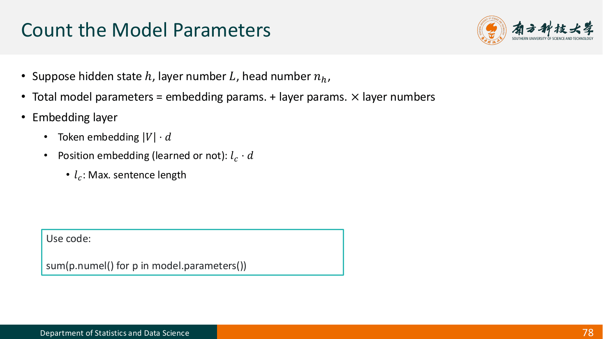

记隐状态维度 $h$（下文统一写作 $d$）、层数 $L$、头数 $n_h$。

**总参数 = 嵌入层参数 + 单层参数 × 层数**

**嵌入层**

- Token embedding：$|V|\cdot d$
- Position embedding（可学习或不可学习）：$l_c\cdot d$，其中 $l_c$ 是最大句长

如果位置编码用的是 P73 那种正弦函数，它是**固定的、不含参数**，这一项为 0；BERT/GPT 用的是**可学习**的位置嵌入，才有 $l_c\cdot d$ 这一项。

课件给的验证代码（非常实用，记下来）：

```python
sum(p.numel() for p in model.parameters())
# 只数可训练的：
sum(p.numel() for p in model.parameters() if p.requires_grad)
```

#### P79　数模型参数（二）：逐层拆解

*Per-layer parameter count*

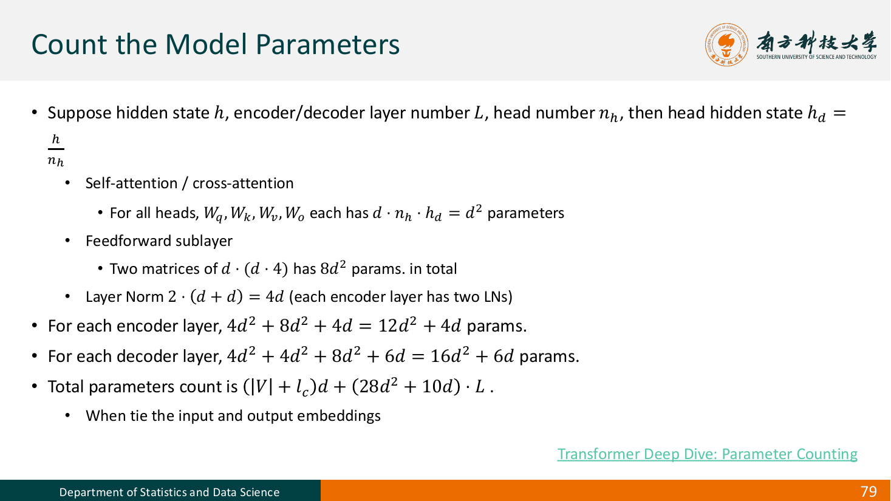

每个头的维度 $h_d=d/n_h$。逐项数：

| 组件 | 推导 | 参数量 |
| --- | --- | --- |
| 自注意力 / 交叉注意力 | $W_q,W_k,W_v,W_o$ 各 $d\cdot n_h\cdot h_d=d\cdot d$ | 4d² |
| 前馈子层 | 两个 $d\times 4d$ 矩阵 | 8d² |
| LayerNorm（每个含 γ, β） | 编码器每层 2 个 LN：$2\cdot(d+d)$ | 4d |
| **每个编码器层** | $4d^2+8d^2+4d$ | **12d² + 4d** |
| **每个解码器层** | 自注意力 $4d^2$ + 交叉注意力 $4d^2$ + FFN $8d^2$ + 3 个 LN $6d$ | **16d² + 6d** |

编码器层与解码器层加起来是 $28d^2+10d$，于是总参数量：

$$
\mathrm{Total}=\left(|V|+l_c\right)d+\left(28d^2+10d\right)\cdot L
$$

（这个式子假设**输入嵌入与输出嵌入绑定**，所以输出投影不另算参数；另外忽略了各线性层的 bias。）

> **💡 拿原论文验算一遍**
>
> base 模型：$d=512,\ L=6$，WMT En–De 共享 BPE 词表约 $|V|=37000$，$l_c=512$。
>
> - 层参数：$(28\times512^2+10\times512)\times 6=(7{,}340{,}032+5{,}120)\times 6=44{,}070{,}912$
> - 嵌入：$(37{,}000+512)\times 512=19{,}206{,}144$
> - **合计 ≈ 63.3M**，论文报告 65M ✓（差额来自 bias 与实现细节）
>
> 能自己算到这个数，说明你对每个模块的形状都真正掌握了。这类题在面试和考试里很常见。

> **💡 两个值得记住的比例**
>
> ① 一层中 **FFN 占 8d²、注意力占 4d²**——**FFN 是注意力的两倍**。② 归一化层的参数是 $O(d)$ 级别，相比 $O(d^2)$ 完全可以忽略——但它对训练稳定性的贡献远超过它的参数占比。

#### P80　数模型参数（三）：从参数量到显存

*Storage estimation*

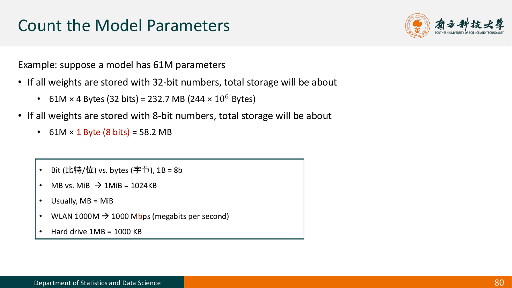

以 61M 参数的模型为例：

- **32-bit（FP32）**：61M × 4 Byte = 244 × 10⁶ Bytes ≈ **232.7 MB**
- **8-bit（INT8）**：61M × 1 Byte = 61 × 10⁶ Bytes ≈ **58.2 MB**

底部方框里那几条单位常识，工程上非常实用：

| 说法 | 含义 |
| --- | --- |
| bit（比特/位） vs byte（字节） | 1 B = 8 b |
| MB vs MiB | 1 MiB = 1024 KB = 1,048,576 B；1 MB（十进制）= 10⁶ B |
| 日常口语中 | 常把 MB 当 MiB 用（课件那 232.7 其实是 MiB） |
| WLAN 1000M | 是 1000 M*b*ps（兆**比特**每秒），实际下载上限约 125 MB/s |
| 硬盘厂商的 1MB | = 1000 KB（十进制），这就是「500G 硬盘只有 465G」的来源 |

> **💡 训练显存的完整账**
>
> 参数本身只是一小部分。用 Adam 做 FP32 训练，每个参数大约要 **16 字节**：参数 4 B + 梯度 4 B + Adam 的 $m$ 4 B + $v$ 4 B。再加上**激活值**（与 batch size、序列长度成正比，往往才是大头）。
>
> 所以 61M 的模型，光优化器状态就要约 1 GB；而 7B 模型全量微调需要约 112 GB——这就是 LoRA、QLoRA、梯度检查点（gradient checkpointing）、ZeRO 等技术存在的理由。推理则轻得多，只需要参数 + KV Cache。

#### P81　各模型的架构规格

*Transformer Architecture Specifications*

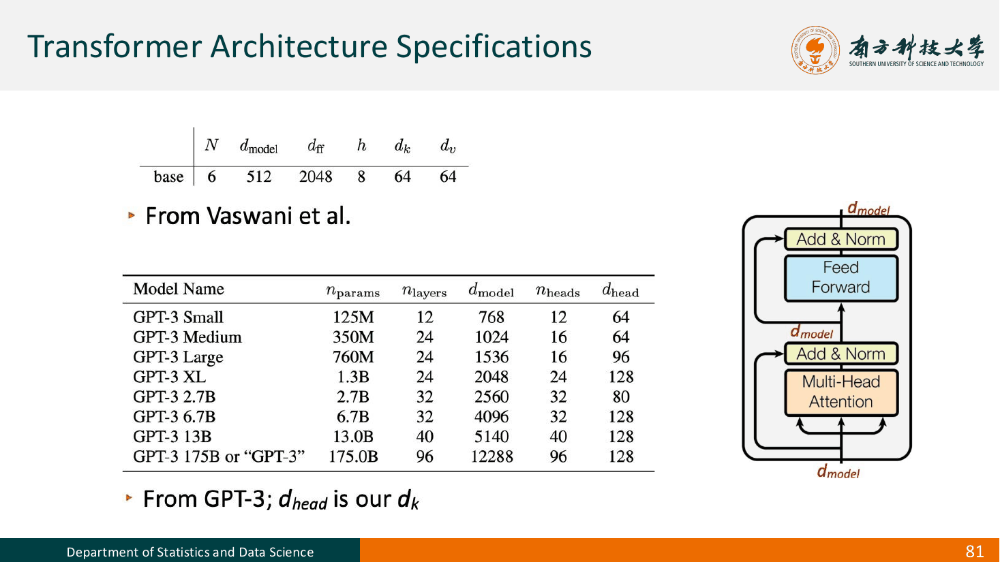

**🖼 逐元素图解**

**上方小表**是原论文 Table 3 的 base 行。六个数字之间存在两条硬约束，请当场验算：
- $d_{ff}=2048=4\times512=4\,d_{model}$ ✓
- $d_k=d_v=64=512/8=d_{model}/h$ ✓

**下方大表是 GPT-3 论文的 Table 2.1**。竖着看每一列的增长方式：
- `n_layers` 从 12 → 96（8 倍）
- `d_model` 从 768 → 12288（16 倍）
- `n_heads` 从 12 → 96（8 倍）
- **`d_head` 从 64 → 128，只翻了一倍，而且中途在 64/96/128 之间反复**

**结论就藏在最后一列**：扩大模型时，**头的维度基本不动，靠加头数和加宽度来放大**。最后一行小字 `From GPT-3; d_head is our d_k` 是在提醒你两套记号的对应。

**右侧那张小图**是编码器层的简化版，**在三个位置标了红色的 $d_{model}$**：入口处、`Add & Norm` 之后、出口处。**三处标同一个符号，是在强调残差连接要求主干维度自始至终不变。**FFN 内部可以临时升到 $4d$，但必须降回来才能相加。

**原论文 base 模型（Vaswani et al.）**

| N | d<sub>model</sub> | d<sub>ff</sub> | h | d<sub>k</sub> | d<sub>v</sub> |
| --- | --- | --- | --- | --- | --- |
| 6 | 512 | 2048 | 8 | 64 | 64 |

核对三个关系：$d_{ff}=4\times d_{model}$ ✓（2048 = 4×512）；$d_k=d_v=d_{model}/h$ ✓（64 = 512/8）；$h\times d_k=d_{model}$ ✓。**这三条等式在几乎所有模型里都成立**，是你检查自己是否理解了结构的最快方式。

**GPT-3 全系（$d_{head}$ 就是这里的 $d_k$）**

| 模型 | 参数量 | n<sub>layers</sub> | d<sub>model</sub> | n<sub>heads</sub> | d<sub>head</sub> |
| --- | --- | --- | --- | --- | --- |
| GPT-3 Small | 125M | 12 | 768 | 12 | 64 |
| GPT-3 Medium | 350M | 24 | 1024 | 16 | 64 |
| GPT-3 Large | 760M | 24 | 1536 | 16 | 96 |
| GPT-3 XL | 1.3B | 24 | 2048 | 24 | 128 |
| GPT-3 2.7B | 2.7B | 32 | 2560 | 32 | 80 |
| GPT-3 6.7B | 6.7B | 32 | 4096 | 32 | 128 |
| GPT-3 13B | 13.0B | 40 | 5140 | 40 | 128 |
| GPT-3 175B | 175.0B | 96 | 12288 | 96 | 128 |

观察这张表的规律：**深度与宽度大体同步增长**；$d_{head}$ 基本固定在 64–128（不随模型变大而变大，而是靠**增加头数**来扩展）；层数从 12 涨到 96（8 倍），宽度从 768 涨到 12288（16 倍）——**变宽比变深更激进**，因为宽度在 GPU 上更容易并行。

用 Decoder-only 的简化公式 $12d^2L$ 验算 GPT-3 175B：$12\times12288^2\times 96\approx 1.74\times10^{11}$ ≈ 174B ✓ 几乎精确命中。

右图再次给出编码器层的示意，并在三处标了 $d_{model}$——提醒你：**残差连接要求子层的输入输出维度必须一致，所以 $d_{model}$ 贯穿整个网络不变。**FFN 中间可以临时升到 $4d$，但必须降回来。


### 📝 本模块练习（P45–P81）

**1. ★** 手算：$n=4$ 个 token，$d_{model}=512$，$h=8$。写出自注意力各中间张量的形状。

<details><summary>解析</summary>

（行约定，忽略 batch 维）

| 张量 | 形状 | 来源 |
| --- | --- | --- |
| X | 4 × 512 | 输入 |
| W^Q, W^K, W^V | 512 × 512 | 参数 |
| Q, K, V（切头前） | 4 × 512 | XW |
| Q, K, V（切头后） | 8 × 4 × 64 | reshape + transpose |
| 分数 QKᵀ | 8 × 4 × 4 | 每个头一张 4×4 的注意力图 |
| softmax 后 | 8 × 4 × 4 | 沿最后一维归一化 |
| 加权和 | 8 × 4 × 64 | 乘 V |
| 拼头后 | 4 × 512 | transpose + reshape |
| 乘 W^O 后 | 4 × 512 | 层输出 |

**自检点**：注意力矩阵是 $n\times n$，与 $d$ 无关；输出形状必须回到 $n\times d$，否则残差加不上去。
</details>

**2. ★** 不做 $\sqrt{d_k}$ 缩放，当 $d_k=64$ 时会发生什么？用具体数字说明。

<details><summary>解析</summary>

假设 q、k 各分量独立、均值 0 方差 1，则 $q\cdot k$ 的方差是 $d_k=64$，标准差 8。也就是说分数的典型范围在 ±8 到 ±24。

softmax 对 [24, 8, 0] 的输出是 $[1-1.1\times10^{-7},\ 1.1\times10^{-7},\ 3.8\times10^{-11}]$——**几乎是纯 one-hot**。

缩放后分数变成 [3, 1, 0]，softmax 输出 [0.84, 0.11, 0.04]，是个正常的软分布。

**为什么 one-hot 有害**：softmax 在饱和区的雅可比矩阵 $\mathrm{diag}(p)-pp^\top$ 几乎全零（因为 $p_i(1-p_i)\to0$），梯度传不回去，$W^Q,W^K$ 学不动。附录 A 第 4 节有更小规模的数值演示。
</details>

**3.** 为什么多头注意力「几乎不增加参数量」？严格算一下 $h=1$ 与 $h=8$（$d_m=512$）的参数差。

<details><summary>解析</summary>

$h=1, d_k=512$：$W^Q,W^K,W^V$ 各 $512\times512$，$W^O$ 也是 $512\times512$，共 $4\times512^2=1048576$。

$h=8, d_k=64$：每个头的 $W_i^Q$ 是 $512\times64$，8 个头合起来 $512\times512$；K、V 同理；$W^O$ 仍是 $512\times512$。共 $4\times512^2=1048576$。

**完全相同。**多头只是把同一个 $512\times512$ 的矩阵在输出维上切成 8 段、各自独立做注意力，参数一分不多。代价仅仅是多了 reshape/transpose 的访存开销。
</details>

**4. ★** 解码器为什么必须用因果掩码，而编码器不用？如果编码器也加了会怎样？

<details><summary>解析</summary>

**解码器必须加**：训练时整个目标句一次性输入，若不掩码，预测第 $t$ 个词时能看到第 $t$ 个词本身——模型会学会「直接抄」，推理时（没有未来）立刻失效。这叫 **information leakage**。

**编码器不用**：源句在推理时是完整已知的，让每个位置看到全句只会带来更好的表示。BERT 正是靠双向上下文取得优势的。

**如果编码器也加了**：就退化成了单向模型。理解类任务（分类、NER、抽取）性能会明显下降，因为很多歧义只有看到右侧上下文才能消解（"bank" 后面跟 "account" 还是 "river"）。
</details>

**5.** 交叉注意力为什么不需要因果掩码？它需要什么掩码？

<details><summary>解析</summary>

不需要因果掩码，因为 key/value 来自**源句**，源句在解码开始前就完整已知，不存在「偷看未来」的问题。

但它**需要 padding mask**：一个 batch 里源句长度不同，补齐用的 `<pad>` 位置必须屏蔽，否则译文会把注意力分给无意义的填充符。

**顺带一个优化点**：交叉注意力的 K、V 只依赖编码器输出，与解码步数无关，**可以在解码开始前算一次并缓存整个生成过程**。这是编解码器架构在推理上相对 decoder-only 的一个优势。
</details>

**6. ★** 为什么 Transformer 用 LayerNorm 而不是 BatchNorm？至少说三条。

<details><summary>解析</summary>

① **变长序列**：BN 沿 batch 维统计，但不同句子长度不同，靠后的位置有效样本极少，甚至全是 padding，统计量不可靠。
② **batch size 敏感**：NLP 常用小 batch + 梯度累积，BN 在小 batch 下方差估计噪声大。
③ **训练/推理不一致**：BN 推理时用训练期累积的滑动统计量，而**自回归生成时 batch 里可能只有一个 token**，滑动统计量与实际分布严重不匹配。LN 在训练和推理时行为完全相同。
④（加分项）**序列位置之间分布差异大**：句首和句尾的激活统计并不同分布，BN 强行用同一组统计量去归一化是不合适的。
</details>

**7.** Pre-LN 和 Post-LN 有什么区别？为什么现代模型几乎都改用了 Pre-LN？

<details><summary>解析</summary>

- **Post-LN**（原论文）：$x_{l}=\mathrm{LN}(x_{l-1}+\mathrm{Sublayer}(x_{l-1}))$。归一化在残差相加**之后**。
- **Pre-LN**：$x_{l}=x_{l-1}+\mathrm{Sublayer}(\mathrm{LN}(x_{l-1}))$。归一化在子层**之前**，残差通路上是一条干净的恒等映射。

**差别的关键在梯度**：Post-LN 的残差路径上有 LN，梯度回传时每层都被 LN 的雅可比缩放一次，深层网络里会累积成很大或很小的倍数，所以**必须靠 warmup 慢慢起步**。Pre-LN 的残差路径完全没有非恒等算子，$\frac{\partial x_L}{\partial x_0}$ 里恒有一条系数为 1 的直通项，梯度尺度天然稳定，**可以不用 warmup、可以堆到几十上百层**。

代价是 Pre-LN 的最终输出没有被归一化，所以通常要在最后一层之后再补一个 LN（GPT-2 的 `ln_f` 就是它）。
</details>

**8. ★** 一层 Transformer 编码器有 $12d^2+4d$ 个参数。如果把 $d_{ff}$ 从 $4d$ 改成 $2d$，参数量变成多少？FFN 占比从多少变到多少？

<details><summary>解析</summary>

原来：注意力 $4d^2$，FFN $2\times d\times4d=8d^2$，LN $4d$。FFN 占 $8/12=66.7\%$。

改成 $d_{ff}=2d$：FFN 变成 $2\times d\times 2d=4d^2$，一层共 $4d^2+4d^2+4d=8d^2+4d$。FFN 占 $4/8=50\%$。

**延伸**：LLaMA 用 SwiGLU，FFN 需要**三个**矩阵（$W_{gate},W_{up},W_{down}$），所以把 $d_{ff}$ 从 $4d$ 降到 $\frac{8}{3}d$ 来保持 $3\times d\times\frac83 d=8d^2$ 不变。知道这个换算就能看懂 LLaMA 的配置文件。
</details>

**9.** 没有位置编码的 Transformer 在做什么？举一个它必然出错的例子。

<details><summary>解析</summary>

它在处理一个**词袋（bag of words）**。因为自注意力是置换等变的：把输入序列重排，输出也只是同样重排，每个位置的内容完全不变。

**必然出错的例子**：「狗咬人」和「人咬狗」。两句话的 token 集合完全相同，没有位置编码时模型的每个 token 表示也完全相同，因此任何基于这些表示的预测都无法区分两句话。同理「A 大于 B」和「B 大于 A」。

**注意一个细节**：FFN、LayerNorm、残差都是逐位置的，它们也不引入位置信息。**整个 Transformer 里唯一的位置来源就是位置编码。**
</details>

**10. ★** 估算训练一个 7B 模型（FP32 + Adam）需要多少显存，只考虑参数、梯度、优化器状态。为什么实际需求还要更大？

<details><summary>解析</summary>

- 参数：$7\times10^9\times4\,\text{B}=28\,\text{GB}$
- 梯度：同样 28 GB
- Adam 的 $m$ 和 $v$：各 28 GB，共 56 GB

小计 **112 GB**。

**实际还要更大**，因为还有：
① **激活值**——前向的中间结果要留着反向用，与 batch size × 序列长度成正比，长上下文时这一项能超过参数本身；
② **临时缓冲区**——矩阵乘的工作空间、通信缓冲；
③ **显存碎片**。

**这就是各种技术存在的理由**：混合精度（参数/梯度用 BF16，优化器状态用 FP32，约降到 ~70 GB）、梯度检查点（用重算换激活显存）、ZeRO（把优化器状态/梯度/参数切分到多卡）、LoRA（只训练少量低秩矩阵，优化器状态几乎为零）。
</details>

## 延伸阅读与收尾

`Part 6 · P82–P83`

最后两页给资源，也给你下一步该做什么。

#### P82　延伸阅读

*Further Reading*

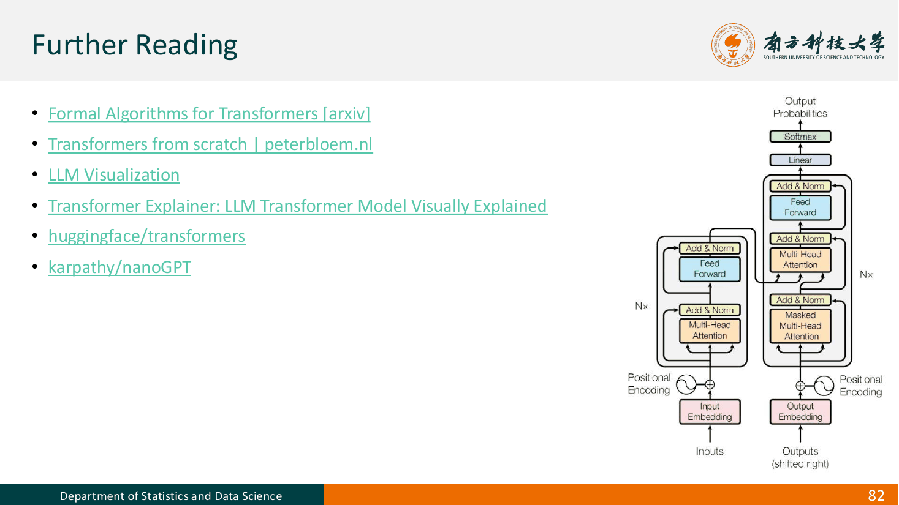

| 资源 | 适合什么时候看 |
| --- | --- |
| **Formal Algorithms for Transformers**（DeepMind, arXiv） | 想要每个模块的严格伪代码和维度定义时。可以当字典查。 |
| **Transformers from scratch**（peterbloem.nl） | P64 那段掩码代码就出自这里。从零实现的最佳单篇教程。 |
| **LLM Visualization**（bbycroft.net/llm） | 3D 交互式地把 GPT 的每个张量走一遍。直觉建立神器。 |
| **Transformer Explainer**（Poloclub） | 浏览器里跑一个真实 GPT-2，能看到每一步的实际数值。 |
| **huggingface/transformers** | 读工业级实现。建议直接看 `modeling_bert.py` 或 `modeling_llama.py`。 |
| **karpathy/nanoGPT** | *最推荐*。约 300 行训练出一个 GPT，本讲所有概念都在里面，而且能跑。 |

> **💡 一个具体的行动建议**
>
> 把 nanoGPT 的 `model.py` 打开，对着本讲找出这几处：`CausalSelfAttention` 里的 `c_attn`（一次投影出 QKV，对应 P66 的实现说明）、`self.bias` 的下三角掩码（P64）、`MLP` 里的 `4 * n_embd`（P68）、`LayerNorm` 的位置（Pre-LN，对比 P46）、`wpe` 可学习位置嵌入（P73/P78）。一个下午就能把这份课件从「看过」变成「用过」。

#### P83　Thank you

*课程结束页*


本讲到此结束。按课件 P73 的预告，下一讲会讲相对位置编码（ALiBi / RoPE）等内容。

## 全篇脉络复盘

`复盘`

把 83 页压成一条数据通路和一份自检清单。合上课件之后，用这两样东西检查自己。

#### 流程　一次前向传播，从字符串到概率分布

设 batch 大小 $B$、序列长度 $n$、模型维度 $d$、头数 $h$、词表 $|V|$。

| # | 步骤 | 张量形状 | 对应页 |
| --- | --- | --- | --- |
| 1 | 分词（BPE / SentencePiece） | (B, n) 的整数 id | P38 |
| 2 | 查词嵌入表 | (B, n, d) | P37 |
| 3 | 加位置编码 | (B, n, d) | P73 |
| 4 | 投影出 Q, K, V 并切头 | (B, h, n, d/h) ×3 | P55, P66 |
| 5 | 算分数 QKᵀ 并除以 √d<sub>k</sub> | (B, h, n, n) | P57, P62 |
| 6 | 加掩码（因果 / padding），置 −∞ | (B, h, n, n) | P64, P32 |
| 7 | softmax（沿 key 维） | (B, h, n, n)，行和为 1 | P51, P57 |
| 8 | 乘 V 得加权和 | (B, h, n, d/h) | P52, P58 |
| 9 | 拼头，乘 W<sup>O</sup> | (B, n, d) | P65 |
| 10 | 残差 + LayerNorm | (B, n, d) | P74, P69 |
| 11 | FFN：d → 4d → d | (B, n, d) | P68 |
| 12 | 残差 + LayerNorm，重复 4–12 共 L 次 | (B, n, d) | P76 |
| 13 | LM head 投影到词表 | (B, n, \|V\|) | P47 |
| 14 | softmax + 交叉熵 | 标量 | P22, P23 |

#### 自检　十二个问题，答得上来就算学会了

1. 为什么 softmax 之前要除以 $\sqrt{d_k}$？不除会发生什么？（P62）
2. 自注意力的 softmax 应该沿哪个维度做？怎么快速验证自己没搞反？（P57）
3. 掩码为什么必须加在 softmax *之前*，而且用 $-\infty$ 而不是 0？（P64）
4. 多头注意力为什么「几乎不增加参数量」？$d_k$ 和 $d_m,h$ 是什么关系？（P65）
5. 交叉注意力的 Q、K、V 分别来自哪里？它需要因果掩码吗？（P67）
6. 为什么 Transformer 用 LayerNorm 而不是 BatchNorm？说出三个理由。（P70）
7. 残差连接为什么能缓解梯度消失？写出那个含单位矩阵的导数式。（P74）
8. 没有位置编码会怎样？正弦位置编码有什么特别的性质？（P73）
9. 一层 Transformer 里，FFN 和注意力的参数量之比是多少？（P79）
10. `model.eval()` 和 `torch.no_grad()` 各管什么？能互相替代吗？（P75）
11. PPL 和交叉熵损失是什么关系？为什么不同 tokenizer 的 PPL 不能比？（P20, P21）
12. Adam 里的 $m_t$ 和 $v_t$ 分别是什么？偏差校正为什么必要？（P30）

#### 勘误　课件中值得留意的几处

都是小问题，但知道了能省下自己对着公式怀疑人生的时间：

| 页 | 内容 | 说明 |
| --- | --- | --- |
| P16 / P21 | $\hat{y}$ 一会儿指真值、一会儿指预测 | 通行约定：$y^*$ 或 $t$ 是真值，$\hat{y}$ 是预测 |
| P26 | 训练循环少了 `optimizer.zero_grad()` | PyTorch 梯度是累加的，必须清零 |
| P30 | $v_t$ 标为 "Rolling Average of Gradient" | 应为「梯度**平方**的滑动平均」（二阶矩） |
| P30 | `betas=(0.99, 0.999)` | 常用默认是 `(0.9, 0.999)` |
| P59–P61 | 列约定与行约定混用（$K^\top Q$ 与 $QK^\top$、V 的左乘右乘） | 见 P59 的对照表，两者互为转置 |
| P64 | 代码漏了 $\sqrt{d_k}$ | 老师自己已用红字标注 |
| P65 | 展开式漏 $\sqrt{d_k}$；$W^O$ 写成逐头 | 逐头写法与拼接写法等价（分块求和） |
| P69 | `std + eps` 与 $\sqrt{\mathrm{Var}+\epsilon}$ | 与官方 `nn.LayerNorm` 略有差异 |

---

*讲义依据《Lecture 2: Basics of Transformer》（STA-5007 Advanced NLP，南方科技大学统计与数据科学系，陈冠华）全 83 页整理。页码与原课件右下角编号一一对应；标注为「往后一步」的内容是课件之外的补充，用于连接当代大模型实践，不属于本讲考查范围。*

## 附录 A：手算一遍自注意力

`补充 · 对应 P49–P64`

这一节用一个小到能在纸上算完的例子，把自注意力的每个数字都摊开。建议**先自己算，再对答案**。全部采用 PyTorch 的行向量约定（每行一个 token）。

### A.1 设定

3 个 token，$d_{model}=4$，单头，$d_k=d_v=2$。

输入矩阵（每行一个 token）：

$$
X=\begin{bmatrix}1&0&1&0\\0&1&0&1\\1&1&0&0\end{bmatrix}
$$

三个投影矩阵（故意取 0/1，方便手算）：

$$
W^Q=\begin{bmatrix}1&0\\0&1\\1&0\\0&1\end{bmatrix}\quad W^K=\begin{bmatrix}0&1\\1&0\\0&1\\1&0\end{bmatrix}\quad W^V=\begin{bmatrix}2&0\\0&2\\0&1\\1&0\end{bmatrix}
$$

### A.2 第一步：算 Q、K、V

$Q=XW^Q$。第一行：$x_1=[1,0,1,0]$，与 $W^Q$ 的第一列 $[1,0,1,0]^\top$ 点积得 $1+0+1+0=2$，与第二列 $[0,1,0,1]^\top$ 点积得 0。所以 $q_1=[2,0]$。

同理算完三行：

$$
Q=\begin{bmatrix}2&0\\0&2\\1&1\end{bmatrix}\qquad K=\begin{bmatrix}0&2\\2&0\\1&1\end{bmatrix}\qquad V=\begin{bmatrix}2&1\\1&2\\2&2\end{bmatrix}
$$

**读一下这三个矩阵的含义**：token 1 的 query 指向「第 1 个方向」，token 2 的 query 指向「第 2 个方向」；而 key 正好反过来——$k_1$ 在第 2 个方向，$k_2$ 在第 1 个方向。**所以 token 1 的 query 会和 token 2 的 key 对上。**这是故意设计的，下面就能看到效果。

### A.3 第二步：算注意力分数

$$
S=QK^\top=\begin{bmatrix}2&0\\0&2\\1&1\end{bmatrix}\begin{bmatrix}0&2&1\\2&0&1\end{bmatrix}=\begin{bmatrix}0&4&2\\4&0&2\\2&2&2\end{bmatrix}
$$

逐个验：$S_{11}=q_1\cdot k_1=2\times0+0\times2=0$；$S_{12}=q_1\cdot k_2=2\times2+0\times0=4$；$S_{13}=q_1\cdot k_3=2\times1+0\times1=2$。

**$S$ 的第 $i$ 行是「token $i$ 作为 query 对三个 key 的打分」。**第一行 [0, 4, 2] 说明 token 1 最关注 token 2、其次 token 3、最不关注自己。第三行 [2, 2, 2] 三个分数相等——token 3 对谁都一样关注。

### A.4 第三步：缩放

$\sqrt{d_k}=\sqrt2\approx1.4142$。

$$
\frac{S}{\sqrt{2}}=\begin{bmatrix}0&2.8284&1.4142\\2.8284&0&1.4142\\1.4142&1.4142&1.4142\end{bmatrix}
$$

### A.5 第四步：softmax（沿每一行）

第一行：$e^0=1$，$e^{2.8284}=16.918$，$e^{1.4142}=4.1133$，和为 $22.031$。

$$
A=\begin{bmatrix}0.0454&0.7679&0.1867\\0.7679&0.0454&0.1867\\0.3333&0.3333&0.3333\end{bmatrix}
$$

**每一行加起来都是 1，可以自己验一遍。**第三行因为三个分数相同，softmax 给出完全均匀的分布——这是个很好的自检点。

### A.6 第五步：加权求和

$$
\mathrm{Out}=AV
$$

第一行：$0.0454\times[2,1]+0.7679\times[1,2]+0.1867\times[2,2]$
$=[0.0908,0.0454]+[0.7679,1.5358]+[0.3734,0.3734]=[1.2321,1.9546]$

$$
\mathrm{Out}=\begin{bmatrix}1.2321&1.9546\\1.9546&1.2321\\1.6667&1.6667\end{bmatrix}
$$

**三个观察**：
1. 第一行和第二行是**镜像**的——因为设定里 token 1 和 token 2 的角色对称。
2. 第三行是 $\frac13([2,1]+[1,2]+[2,2])=[\frac53,\frac53]$，正是三个 value 的**算术平均**。
3. 所有输出都落在 $V$ 的三行张成的**凸包**内（横纵坐标都在 1 到 2 之间）。这印证了正文 P52 的结论：注意力本身不制造新特征，制造新特征的是后面的 FFN。

### A.7 对照实验一：不做缩放会怎样

直接对未缩放的 $S$ 做 softmax，第一行 $[0,4,2]$：$e^0=1,\ e^4=54.598,\ e^2=7.389$，和 62.987。

$$
A_{\mathrm{no\text{-}scale}}=\begin{bmatrix}0.0159&0.8668&0.1173\\0.8668&0.0159&0.1173\\0.3333&0.3333&0.3333\end{bmatrix}
$$

**对比**：缩放后最大权重 0.7679，不缩放是 0.8668，明显更尖锐。而这还只是 $d_k=2$ 的玩具例子；真实模型 $d_k=64$ 时分数的标准差是 8 而不是 1.4，差距会放大到接近 one-hot。**把这两个矩阵放在一起，就能直观理解 P62 在讲什么。**

### A.8 对照实验二：加上因果掩码

把 $S/\sqrt2$ 的上三角（$j>i$）设为 $-\infty$：

$$
\begin{bmatrix}0&-\infty&-\infty\\2.8284&0&-\infty\\1.4142&1.4142&1.4142\end{bmatrix}\xrightarrow{\ \text{softmax}\ }\begin{bmatrix}1&0&0\\0.9442&0.0558&0\\0.3333&0.3333&0.3333\end{bmatrix}
$$

- **第一行变成 [1, 0, 0]**：token 1 只能看自己，softmax 的结果必然是 1。
- **第二行 [0.9442, 0.0558, 0]**：注意它**不是**把无掩码时的 [0.7679, 0.0454, 0.1867] 简单地去掉第三项——而是重新归一化了。$0.7679/(0.7679+0.0454)=0.9442$ ✓ 这正是「掩码必须加在 softmax 之前」的意义：分母里不能含被屏蔽项。
- **第三行不变**：最后一个 token 本来就能看到全部。

输出变成：

$$
\mathrm{Out}_{\text{causal}}=\begin{bmatrix}2&1\\1.9442&1.0558\\1.6667&1.6667\end{bmatrix}
$$

第一行恰好等于 $v_1=[2,1]$——只看自己，输出就是自己的 value。

### A.9 动手验证

把下面这段贴进 Python 跑一遍，数字应该和上面完全一致：

```python
import numpy as np
np.set_printoptions(precision=4, suppress=True)

X  = np.array([[1,0,1,0],[0,1,0,1],[1,1,0,0]], float)
Wq = np.array([[1,0],[0,1],[1,0],[0,1]], float)
Wk = np.array([[0,1],[1,0],[0,1],[1,0]], float)
Wv = np.array([[2,0],[0,2],[0,1],[1,0]], float)

Q, K, V = X @ Wq, X @ Wk, X @ Wv
S = Q @ K.T / np.sqrt(2)

def softmax(a, axis=-1):
    a = a - a.max(axis=axis, keepdims=True)
    e = np.exp(a)
    return e / e.sum(axis=axis, keepdims=True)

A = softmax(S)
print("attention weights\n", A)
print("output\n", A @ V)

# 因果掩码版本
mask = np.triu(np.ones((3,3)), 1) > 0
Sm = np.where(mask, -np.inf, S)
print("causal weights\n", softmax(Sm))
print("causal output\n", softmax(Sm) @ V)
```

**建议的练习**：把 $W^V$ 改成别的值，重新手算一遍 A.6，体会「注意力权重不变、只有输出变了」——因为 $W^V$ 完全不参与打分。

---

## 附录 B：其他几个能手算的量

`补充 · 对应 P20–P22、P69、P79`

### B.1 LayerNorm

取一个位置的隐状态（$d=8$）：

$$
x=[2,\ 4,\ 4,\ 4,\ 5,\ 5,\ 7,\ 9]
$$

均值：$(2+4+4+4+5+5+7+9)/8=40/8=5$

方差：$\frac{1}{8}[(-3)^2+(-1)^2+(-1)^2+(-1)^2+0+0+2^2+4^2]=\frac{9+1+1+1+0+0+4+16}{8}=\frac{32}{8}=4$，标准差 2。

归一化后（取 $\gamma=1,\beta=0,\epsilon\approx0$）：

$$
\hat{x}=\left[-1.5,\ -0.5,\ -0.5,\ -0.5,\ 0,\ 0,\ 1,\ 2\right]
$$

**自检**：结果的均值必须是 0（$-1.5-0.5-0.5-0.5+0+0+1+2=0$ ✓），方差必须是 1（平方和 $2.25+0.25\times3+0+0+1+4=8$，除以 8 得 1 ✓）。

**关键提醒**：这 8 个数是**同一个 token 的 8 个特征**，不是 8 个 token。换一个 token，就要用它自己的 8 个数重新算均值方差。这就是 P71 那张图里「最右边那条细横条」的含义。

### B.2 softmax + 交叉熵的梯度

logits $z=[2.0,\ 1.0,\ 0.1]$，真实类别是第 0 类。

$e^{2.0}=7.389,\ e^{1.0}=2.718,\ e^{0.1}=1.105$，和 $=11.212$。

$$
p=[0.6590,\ 0.2424,\ 0.0986]
$$

损失 $\mathcal{L}=-\ln 0.6590=0.4170$。

梯度 $\frac{\partial\mathcal{L}}{\partial z}=p-t=[0.6590-1,\ 0.2424-0,\ 0.0986-0]=[-0.3410,\ 0.2424,\ 0.0986]$

**怎么读这个梯度**：第 0 项是**负数**，梯度下降会让 $z_0$ **增大**（因为 $z\leftarrow z-\eta\cdot\text{grad}$）；另外两项是正数，会让 $z_1,z_2$ 减小。**这正是 P23 那张柱状图上 increase / decrease 的数值版本。**

**再注意一点**：三项梯度之和恰好是 0（$-0.341+0.2424+0.0986=0$）。这不是巧合——softmax 的输出和恒为 1，所以梯度必然在「和为 0」的超平面上。

### B.3 困惑度

模型对四个词依次给出概率 $[\tfrac12,\ \tfrac14,\ \tfrac12,\ \tfrac18]$。

$$
l=\frac14\left(\log_2\tfrac12+\log_2\tfrac14+\log_2\tfrac12+\log_2\tfrac18\right)=\frac14(-1-2-1-3)=-1.75
$$

$$
\mathrm{PPL}=2^{-l}=2^{1.75}\approx3.36
$$

**怎么理解 3.36**：模型的表现相当于「每一步在 3.36 个等可能的词里犹豫」。如果它每步都给正确词 1.0 的概率，$l=0$，PPL = 1（完全确定）；如果在 10000 个词里均匀猜，PPL = 10000。

**用自然对数验算**：$l_e=\frac14(\ln\frac12+\ln\frac14+\ln\frac12+\ln\frac18)=\frac14(-0.693-1.386-0.693-2.079)=-1.213$，$e^{1.213}=3.36$ ✓ 两种底数结果一致。

### B.4 参数量：把 base Transformer 算到个位

$d=512,\ L=6,\ |V|=37000,\ l_c=512$。

**单个编码器层**
- 注意力 $4d^2=4\times262144=1{,}048{,}576$
- FFN $8d^2=2{,}097{,}152$
- 2 个 LayerNorm $4d=2048$
- 小计 $3{,}147{,}776$

**单个解码器层**
- 自注意力 $4d^2=1{,}048{,}576$
- 交叉注意力 $4d^2=1{,}048{,}576$
- FFN $8d^2=2{,}097{,}152$
- 3 个 LayerNorm $6d=3072$
- 小计 $4{,}197{,}376$

**六层编解码器**：$(3{,}147{,}776+4{,}197{,}376)\times6=7{,}345{,}152\times6=44{,}070{,}912$

**嵌入层**（输入输出绑定）：$(37000+512)\times512=37512\times512=19{,}206{,}144$

**合计**：$44{,}070{,}912+19{,}206{,}144=63{,}277{,}056\approx63.3\text{M}$

论文报告 65M，差 1.7M 来自各线性层的 bias 和实现细节（例如位置编码若不可学习则少 262144）。**能把这个数算到这个精度，说明每个模块的形状你都真的清楚了。**

**换算成显存**（FP32）：$63.3\text{M}\times4\,\text{B}=253\,\text{MB}$；Adam 训练时再乘 4（参数+梯度+m+v）约 1 GB，还不含激活值。

---

## 附录 C：面试高频 20 问

`补充 · 覆盖全讲`

按被问到的频率排序。每题先给一句话答案，再给展开。**面试时先说那一句，对方想深入再展开。**

<details><summary><b>1. 讲一下 Transformer 的整体结构。</b></summary>

**一句话**：编码器和解码器各 N 层堆叠，每层由多头注意力和逐位置前馈网络构成，每个子层外面包着残差连接和层归一化，位置信息由位置编码注入。

**展开顺序建议**：数据流 → 编码器层的两个子层 → 解码器层的三个子层 → 三种注意力的区别 → 最后的 Linear + Softmax。不要一上来就讲 QKV 公式，先把骨架讲清楚。
</details>

<details><summary><b>2. ★ 为什么注意力分数要除以 √d_k？</b></summary>

**一句话**：让点积的方差回到 1，避免 softmax 进入饱和区导致梯度消失。

**展开**：若 q、k 各分量独立、均值 0 方差 1，则 $q\cdot k$ 方差为 $d_k$、标准差 $\sqrt{d_k}$。$d_k=64$ 时分数典型幅度是 ±8~±24，softmax 输出几乎是 one-hot，此时雅可比 $\mathrm{diag}(p)-pp^\top$ 接近零矩阵，$W^Q,W^K$ 收不到梯度。除以 $\sqrt{d_k}$ 后方差归一。附录 A.7 有数值演示。
</details>

<details><summary><b>3. ★ 为什么要多头？多头增加了多少参数？</b></summary>

**一句话**：让模型在多个表示子空间里同时关注不同位置；因为 $d_k=d_m/h$，参数量与单头完全相同。

**展开**：单头 softmax 是竞争性的，权重被一个位置吃掉后就顾不上别的。多头可以有的头做句法依存、有的头盯相邻位置、有的头做指代。参数量：$h$ 个 $d_m\times\frac{d_m}{h}$ 的矩阵合起来就是一个 $d_m\times d_m$，一分不多。
</details>

<details><summary><b>4. ★ 为什么用 LayerNorm 不用 BatchNorm？</b></summary>

见本讲 P70 和练习 6。三条：变长序列使 batch 维统计不可靠；对 batch size 敏感；训练/推理行为不一致（自回归生成时 batch 里可能只有一个 token）。
</details>

<details><summary><b>5. ★ Pre-LN 和 Post-LN 的区别？</b></summary>

Post-LN 是 $\mathrm{LN}(x+\mathrm{Sublayer}(x))$，残差路径上有 LN，梯度被逐层缩放，必须 warmup；Pre-LN 是 $x+\mathrm{Sublayer}(\mathrm{LN}(x))$，残差路径是纯恒等，梯度直达底层，可以堆很深且不用 warmup。现代模型几乎都用 Pre-LN，最后补一个 final LN。
</details>

<details><summary><b>6. 残差连接为什么能缓解梯度消失？</b></summary>

因为 $\frac{\partial x^l}{\partial x^{l-1}}=\mathbf{J}_{\text{block}}+\mathbf{I}$。那个单位矩阵保证了即使 $\mathbf{J}\to0$，总梯度里仍有一条系数为 1 的通路。反向传播到第 $l$ 层是 $\prod(\mathbf{J}_l+\mathbf{I})$ 而不是 $\prod\mathbf{J}_l$，展开后含有一项完全不经过任何 block 的直通梯度。
</details>

<details><summary><b>7. ★ 位置编码为什么用 sin/cos？可以换成可学习的吗？</b></summary>

sin/cos 的三个好处：不含参数；不同维度对应不同频率，像连续版二进制计数器，能唯一编码位置；$\mathrm{PE}(pos+k)$ 是 $\mathrm{PE}(pos)$ 的线性变换（和角公式），便于模型学相对位置。

可以换成可学习的（BERT/GPT 就是），代价是无法外推到训练时没见过的长度，且多出 $l_c\times d$ 参数。现代做法更多是 RoPE——把位置信息作为旋转施加在 Q、K 上，使注意力分数天然只依赖相对距离。
</details>

<details><summary><b>8. ★ 解码器的掩码怎么实现？为什么用 −∞ 而不是 0？</b></summary>

在 softmax **之前**把未来位置的分数加上 $-\infty$（工程上用 `-1e9`，避免 FP16 出 NaN）。用 0 不行：如果在 softmax 之后置零，分母里已经包含了未来项，剩余权重不再归一化，而且信息已经泄漏。用 $-\infty$ 则 $e^{-\infty}=0$，既不参与分子也不参与分母。附录 A.8 有数值对比。
</details>

<details><summary><b>9. 自注意力、掩码自注意力、交叉注意力的区别？</b></summary>

| | Q 来自 | K,V 来自 | 掩码 |
| --- | --- | --- | --- |
| 自注意力 | 本序列 | 本序列 | 只有 padding mask |
| 掩码自注意力 | 目标序列 | 目标序列 | padding + 因果 |
| 交叉注意力 | 目标序列 | **源序列（编码器输出）** | 只有 padding mask |
</details>

<details><summary><b>10. ★ Transformer 的时间/空间复杂度？为什么长上下文是难题？</b></summary>

一层自注意力：计算 $O(n^2d)$，注意力矩阵占显存 $O(n^2)$（乘头数和层数）。序列长度翻倍，代价变四倍。

FFN 是 $O(nd^2)$。所以 $n<d$ 时 FFN 是瓶颈，$n>d$ 时注意力是瓶颈。

**缓解手段**：FlashAttention（不显式存 $n\times n$ 矩阵，分块计算，把显存降到 $O(n)$）、稀疏/滑窗注意力、线性注意力、以及推理侧的 KV Cache 压缩。
</details>

<details><summary><b>11. KV Cache 是什么？为什么能省？占多少显存？</b></summary>

自回归生成时，已经算过的 $k_i,v_i$ 与新 query 无关，可以缓存复用，每步只为新 token 算一组 q、k、v。没有它，生成第 $t$ 个 token 要重算前 $t-1$ 个的全部 K、V。

显存：$2\times L\times n_h\times d_{head}\times n\times \mathrm{batch}\times\mathrm{bytes}$。7B 模型、4k 上下文、FP16，单条序列约 2 GB——**长上下文推理的显存大头是 KV Cache 而不是权重。**MQA/GQA 正是为了压它。
</details>

<details><summary><b>12. FFN 为什么要先升到 4d 再降回来？它有什么作用？</b></summary>

升维提供更大的中间表示空间，让非线性能在更高维里切分；降回来是残差连接的要求（维度必须一致）。

作用有二：① 提供非线性——注意力本身是加权平均，是线性的；② 存储知识——把 $W_1$ 的列看作 key、$W_2$ 的行看作 value，FFN 就是一次「以权重为记忆」的注意力（Geva et al., 2021）。**一层里 FFN 占 $8d^2$、注意力占 $4d^2$，三分之二的参数在 FFN。**
</details>

<details><summary><b>13. ★ 手撕自注意力（要求写代码）。</b></summary>

面试常见。要点：Q/K/V 三个投影 → 除 $\sqrt{d_k}$ → 加掩码 → `softmax(dim=-1)` → 乘 V。写之前先口头说一遍形状变化，别直接下笔。

两个容易被追问的细节：`softmax` 的 `dim` 为什么是 `-1`（因为 key 在最后一维）；`masked_fill` 要在 scale 之后、softmax 之前。
</details>

<details><summary><b>14. BERT 和 GPT 的结构差别？</b></summary>

BERT 是 encoder-only，双向自注意力（无因果掩码），训练目标是 MLM（随机遮住 15% 的 token 去还原）+ NSP，适合理解类任务。

GPT 是 decoder-only，因果自注意力，**没有交叉注意力**，训练目标是标准的下一词预测，适合生成。

今天的大模型绝大多数是 decoder-only——源文本直接拼进 prompt，用因果注意力一并处理，省掉了编码器那一半。
</details>

<details><summary><b>15. 为什么 softmax 之前要减去最大值？</b></summary>

数值稳定。softmax 有平移不变性 $\mathrm{softmax}(z+c)=\mathrm{softmax}(z)$，取 $c=-\max z$ 后所有指数的自变量 ≤ 0，$e^{x}\le1$ 不会上溢。不减的话 $z=1000$ 就直接 `inf`。
</details>

<details><summary><b>16. 梯度裁剪放在训练循环的哪一步？裁的是什么？</b></summary>

在 `loss.backward()` 之后、`optimizer.step()` 之前。裁的是**所有参数梯度拼成的那个大向量的 L2 范数**——超过阈值就整体等比缩放，**方向不变，只改长度**。常用阈值 1.0。

注意如果用了混合精度，要先 `scaler.unscale_(optimizer)` 再裁，否则裁的是被放大过的梯度。
</details>

<details><summary><b>17. 为什么 Adam 需要的显存是参数的两倍？</b></summary>

因为要为每个参数维护 $m$（一阶矩）和 $v$（二阶矩）两份状态。FP32 训练时每个参数需要 4（参数）+ 4（梯度）+ 4（m）+ 4（v）= 16 字节。这是估算训练显存的基本公式，再加上激活值。
</details>

<details><summary><b>18. 训练 Transformer 为什么要 warmup？</b></summary>

两个原因：① Adam 的 $\hat{v}$ 在前几十步估计噪声很大，直接用大学习率容易把参数推到坏区域；② Post-LN 结构的梯度在初期不稳定。

原论文的调度是 $\eta=d_{model}^{-0.5}\min(t^{-0.5},\ t\cdot\text{warmup}^{-1.5})$——先线性升到峰值，再按 $t^{-0.5}$ 衰减。改用 Pre-LN 后 warmup 的必要性大大降低，但通常仍然保留一小段。
</details>

<details><summary><b>19. PPL 越低越好，但为什么不能拿两个模型的 PPL 直接比？</b></summary>

PPL 是**按 token 归一化**的。换了 tokenizer，同一段文本的 token 数就不同——分词更细的模型每个 token 更容易预测，PPL 天然更低，但这不代表它更好。

只有在**同一词表、同一分词方式、同一测试集**下，PPL 才有可比性。跨模型比较要用下游任务指标，或者换成 bits-per-byte（按字节归一化）。
</details>

<details><summary><b>20. 如果让你把 Transformer 改得更高效，你会动哪里？</b></summary>

这是开放题，按「知道哪几条主线」评分：

- **注意力**：FlashAttention（IO 感知，不存 $n^2$ 矩阵）、滑窗/稀疏注意力、线性注意力。
- **KV Cache**：MQA / GQA（少存几份 K、V）、量化 KV、PagedAttention。
- **FFN**：MoE（每个 token 只激活少数专家）、SwiGLU（同参数量下效果更好）。
- **归一化与位置**：RMSNorm（省一次求均值）、RoPE（支持长度外推）。
- **精度**：BF16 训练、INT8/INT4 推理量化。

**回答技巧**：先说清楚「瓶颈在哪」（训练时是激活显存和通信，推理时是 KV Cache 和访存带宽），再说对应的手段，比罗列名词有说服力得多。
</details>
