> SUSTech · STA-5007 Advanced NLP · Lecture 4

陈冠华老师《Large Language Models》全 51 页课件的逐页拆解：**每一页都配了原始课件截图**，图下先给原文要点，再补上背景脉络、机制解释与易错点。关键图示附「🖼 逐元素图解」，讲清图里每个方块、每条箭头是什么；每个模块末尾有带详解的练习；文末附录是术语对照表与面试高频问题。

*51 页 · 51 张课件截图 · 5 个模块 · 南方科技大学 统计与数据科学系*

---

`Part 1 · P1–P13`

## 一、Introduction：今天的 LLM 长什么样

开篇十三页不讲技术细节，而是先建立坐标系：语言模型是怎么一步步走到今天的、现在有哪些模型、生态里有哪些工具、以及「训练一个 LLM」这件事被切成了哪几个阶段。后面四个模块（Pretraining / Instruction Tuning / Alignment / Future）都是在填这张地图上的格子。

#### P1　课程封面

*Advanced Natural Language Processing — Lecture 4: Large Language Models*

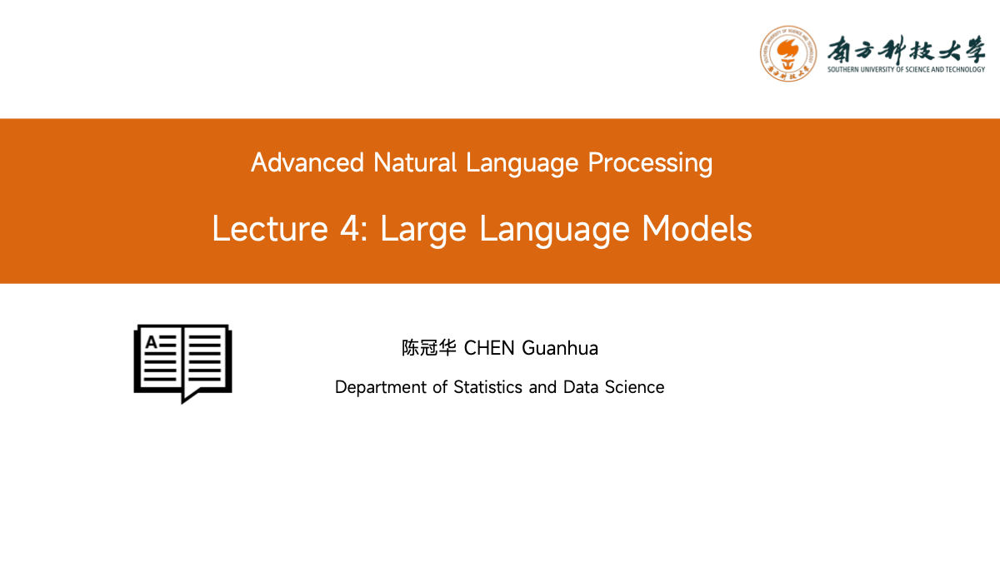

南方科技大学统计与数据科学系，陈冠华老师，课程编号 STA-5007。

这一讲和 [Lecture 2](../sta5007-02/) 的定位完全不同。Lecture 2 讲的是 **Transformer 这个结构本身**——注意力怎么算、多头怎么拼、参数量怎么数，是「零件级」的内容。Lecture 4 则整个上移了一层：结构已经给定，问题变成**怎么把它训练成一个能用的大模型**。所以本讲几乎不出现矩阵维度推导，取而代之的是数据、阶段、目标函数和对齐方法。

#### P2　本讲目录

*Content*

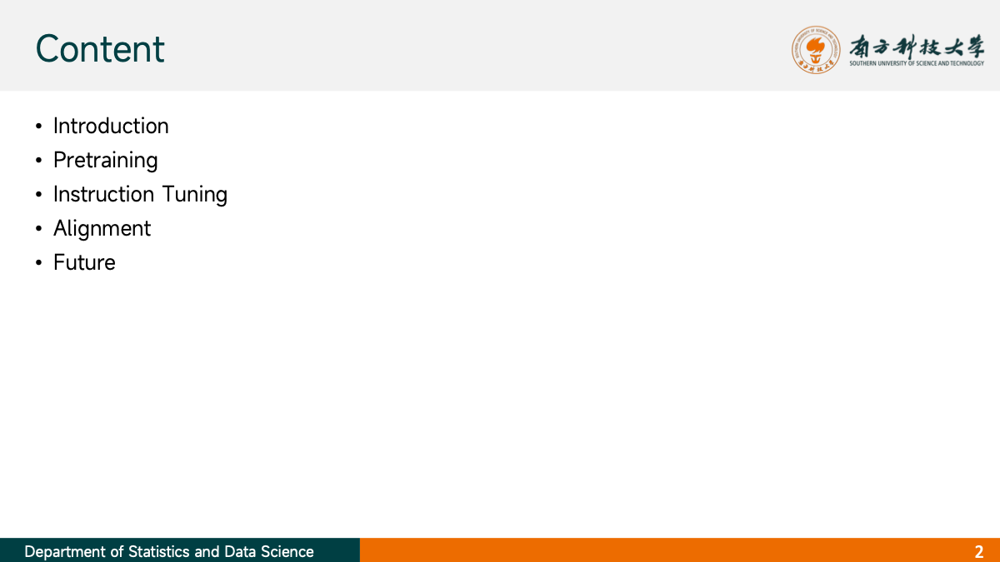

五个模块：

1. **Introduction**（P3–P13）——现状、历史、生态、训练阶段划分。
2. **Pretraining**（P15–P28 附近）——下一词预测、模型结构、数据、Scaling Law。
3. **Instruction Tuning**（中段）——把「续写机器」变成「听指令的助手」。
4. **Alignment**（后段）——RLHF、DPO 一类让输出符合人类偏好的方法。
5. **Future**（结尾）——尚未解决的问题与方向。

> **💡 读法建议**
>
> 这五个模块正好对应一个模型从零到可用的**时间顺序**：预训练学知识 → 指令微调学格式 → 对齐学偏好。如果你只想抓主线，P13、P17、P20 这三页各是一个阶段的总纲，串起来就是整讲的骨架。

#### P3　语言模型的四个时代

*Introduction*

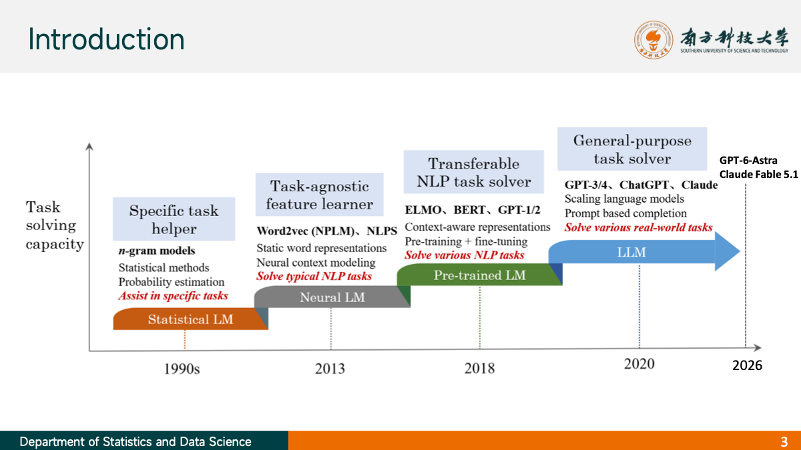

这是全讲最该记住的一张图。横轴是时间，纵轴是「任务解决能力」（task solving capacity），四个台阶逐级抬高：

| 时代 | 起点 | 代表 | 能力定位 | 原文标签 |
|---|---|---|---|---|
| **统计语言模型** | 1990s | $n$-gram | 特定任务的辅助工具 | *Specific task helper* |
| **神经语言模型** | 2013 | Word2vec (NPLM)、NLPS | 任务无关的特征学习器 | *Task-agnostic feature learner* |
| **预训练语言模型** | 2018 | ELMo、BERT、GPT-1/2 | 可迁移的 NLP 任务求解器 | *Transferable NLP task solver* |
| **大语言模型** | 2020— | GPT-3/4、ChatGPT、Claude | 通用任务求解器 | *General-purpose task solver* |

每一级跨越的**本质**是「一个模型能覆盖多少任务」：

- **$n$-gram → 神经 LM**：从「统计共现频次」到「学习稠密向量表示」。$n$-gram 用概率估计（probability estimation）硬数频次，数据稀疏时只能靠平滑救；Word2vec 给每个词一个静态向量，第一次让「任务无关的表示」成为可能。
- **神经 LM → 预训练 LM**：从**静态**词表示到**上下文相关**（context-aware）表示。Word2vec 里 bank 永远是同一个向量；ELMo/BERT 里 river bank 和 investment bank 的 bank 向量不同。配套的范式是「预训练 + 微调」——每个下游任务还要单独训一个模型。
- **预训练 LM → LLM**：从「每任务一个模型」到「一个模型 + 提示」。图里写的是 *Scaling language models* 和 *Prompt based completion*——把模型做大之后，下游任务不再需要改参数，写个提示词就行。

图的最右端标到 2026 年的 GPT-6-Astra 和 Claude Fable 5.1，说明第四个台阶还在往上走，没有出现新的第五级。

> **⚠️ 容易读错的地方**
>
> 纵轴是「任务解决能力」，不是「模型效果」。$n$-gram 在**特定任务**（比如输入法候选）上未必差，它输在**通用性**——换个任务就得重做。这四个台阶衡量的是覆盖面，不是单点精度。

#### P4　LMArena 总榜（Agent 赛道）

*Overview Leaderboard | LMArena*

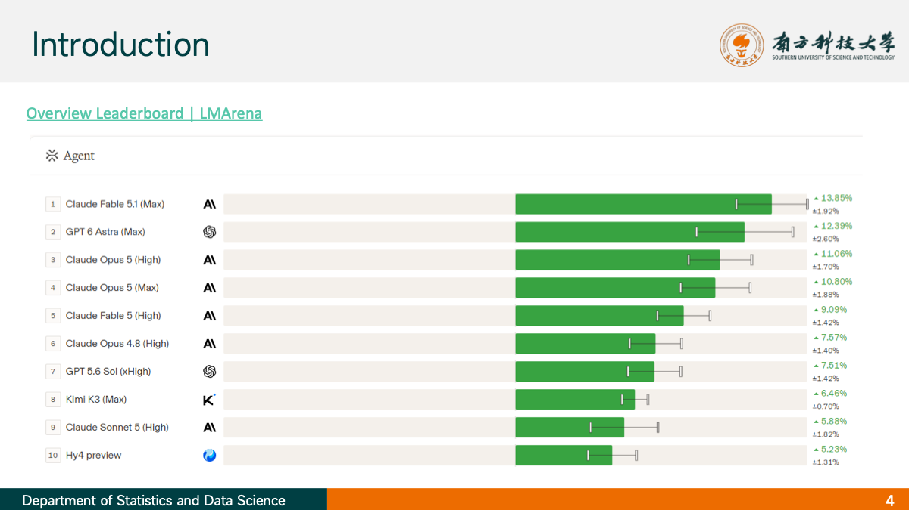

LMArena 的 Agent 赛道排名截图，前十名里 Anthropic 的 Claude 系列占了多数（Fable 5.1 Max 居首），其余是 GPT-6 Astra、GPT-5.6 Sol、Kimi K3、Hy4 preview 等。右侧绿色数字是相对分数与置信区间（如 `13.85% ±1.92%`）。

这页的用意不是记住谁第一——**榜单每周都在变，记名次没有意义**。真正要注意的是那个 **±** 号：第 3 名 11.06%±1.70% 和第 4 名 10.80%±1.88% 的区间大面积重叠，统计上根本分不出高下。看榜单时先看置信区间是否重叠，再决定「领先」这个说法成不成立。

#### P5　Arena 是怎么工作的

*Introduction · How It Works?*

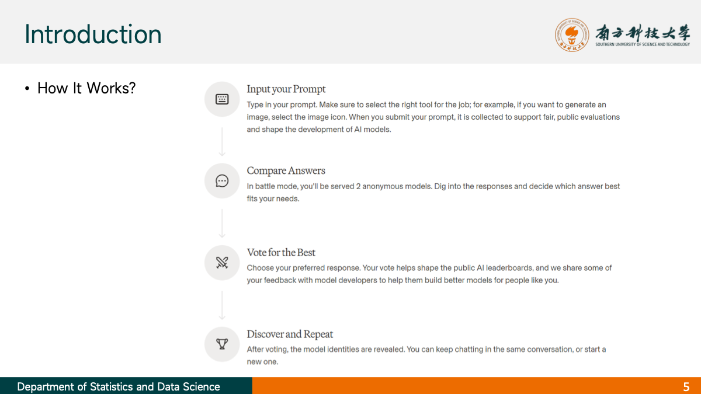

四步闭环：

1. **Input your Prompt**——用户输入提示词（按任务选对工具，比如要生图就选图像入口）。
2. **Compare Answers**——battle 模式下同时给出**两个匿名模型**的回答。
3. **Vote for the Best**——用户投票选出更好的那个。
4. **Discover and Repeat**——投票后才揭晓模型身份，可以继续聊或开新对话。

关键设计是**先匿名、后揭晓**。如果先告诉用户「这是 GPT、那是某开源模型」，品牌光环会直接污染投票。匿名对战把品牌变量剔除，票才反映输出本身。

这种「两两对战 + 大量投票」的数据，最后用 Elo/Bradley–Terry 一类的成对比较模型换算成分数——这也是为什么榜上是相对分而不是绝对准确率：**Arena 衡量的是人类偏好，不是正确性**。一个答案写得漂亮但有事实错误，照样可能赢票。这是 Arena 类评测的固有局限，要和 MMLU 那种有标准答案的基准分开看。

#### P6　视觉榜与文本榜

*Introduction · Vision Arena | LMArena*

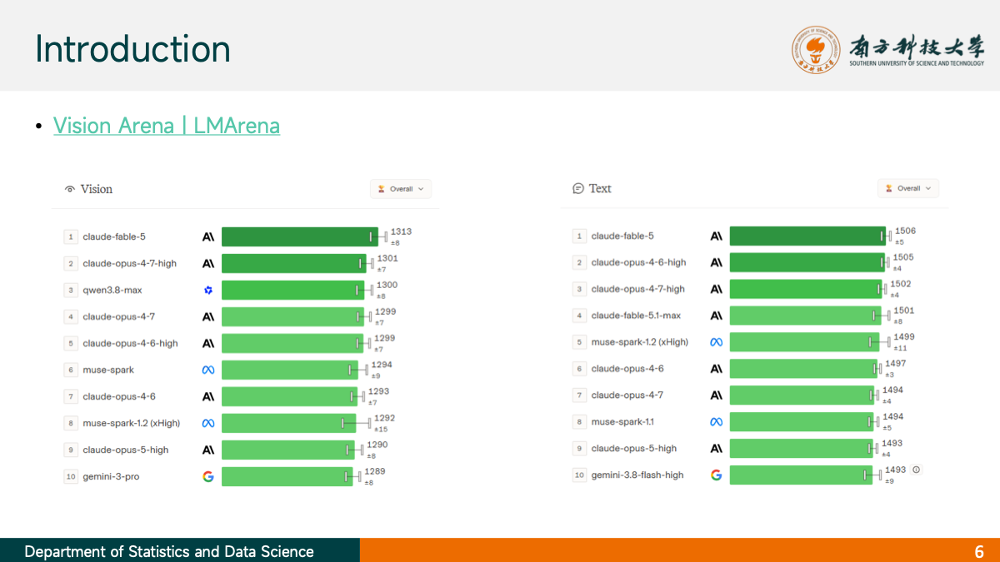

左右并排两个榜：左边 Vision（多模态），右边 Text（纯文本），分数在 1289–1506 之间，这是典型的 Elo 区间。

把两个榜并排放，是为了让你看出**同一个模型在不同模态上的排名并不一致**。比如 qwen3.8-max 在 Vision 榜第 3，Text 榜前十里则是另一批模型占位；gemini-3-pro 在 Vision 榜第 10，Text 榜上则是 gemini-3.8-flash-high。

这说明**视觉能力和文本能力是两条相对独立的能力轴**。一个模型的语言能力强，不代表它看图看得准——多模态能力更依赖视觉编码器的质量和图文对齐数据，不是把语言模型做大就能顺带获得的。

#### P7　从 GPT-1 到 GPT-6 Astra

*History of ChatGPT*

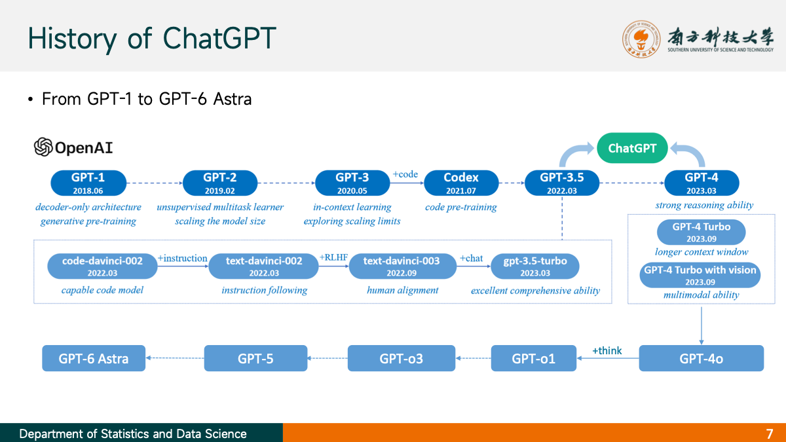

这是本讲信息密度最高的一张图。

**🖼 逐元素图解**

主干（上排，深蓝）是基座模型的演进，每个节点下面的斜体字是**那一代的核心贡献**：

| 模型 | 时间 | 关键词 | 含义 |
|---|---|---|---|
| GPT-1 | 2018.06 | *decoder-only architecture, generative pre-training* | 确立只用解码器 + 生成式预训练 |
| GPT-2 | 2019.02 | *unsupervised multitask learner, scaling the model size* | 发现不微调也能做多任务，开始堆规模 |
| GPT-3 | 2020.05 | *in-context learning, exploring scaling limits* | 上下文学习（给几个例子就会做）成为新范式 |
| Codex | 2021.07 | *code pre-training* | 在代码上继续预训练 |
| GPT-3.5 | 2022.03 | — | ChatGPT 的底座 |
| GPT-4 | 2023.03 | *strong reasoning ability* | 推理能力显著提升 |

中间方框（浅蓝）是**davinci 支线**，这条线最能说明「对齐」是怎么一步步加上去的：

```
code-davinci-002   →  text-davinci-002  →  text-davinci-003  →  gpt-3.5-turbo
（capable code model）  +instruction        +RLHF                +chat
                      指令遵循              人类对齐            综合能力
```

注意这条链上每一步加的东西：先加**指令**（instruction tuning），再加 **RLHF**（人类反馈对齐），最后加**对话**格式。这正好对应本讲后面三个模块的顺序——**这张图就是整讲的路线图**。

右侧分支是 GPT-4 Turbo（更长上下文）与 GPT-4 Turbo with vision（多模态）。

底排是推理模型线：GPT-4o →（`+think`）→ GPT-o1 → GPT-o3 → GPT-5 → GPT-6 Astra。那个 **`+think`** 标注是整张图的点睛之笔：从 o1 开始，模型多了一个「先思考再回答」的阶段，这是继「加指令」「加 RLHF」之后的第三次范式变化。

> **⚠️ 别把这张图当成纯粹的版本号递增**
>
> 主干、davinci 支线、推理线是**三条不同性质的演进**：主干是「基座变强」，davinci 线是「对齐方式变好」，推理线是「推理时多花算力」。它们可以叠加——今天的前沿模型三条线的成果都吃到了。

#### P8　模型发布时间线

*Introduction · modeltimeline.com*

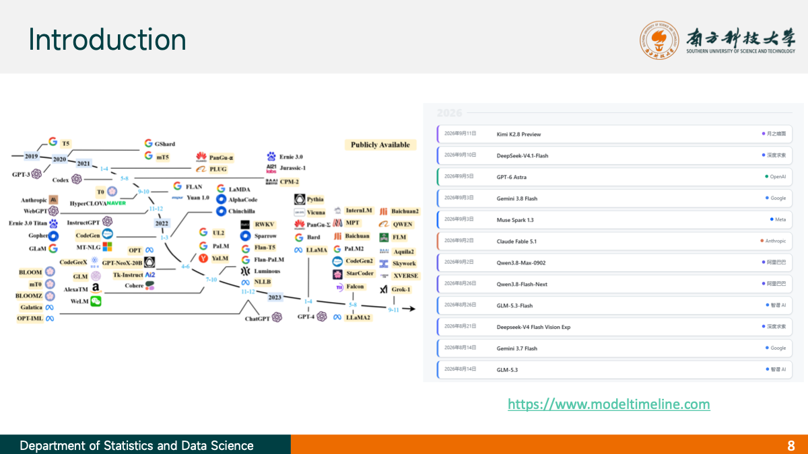

左边是 2019–2023 的模型谱系图（彩色 logo 密密麻麻那张），标注 *Publicly Available* 的是开放权重的。右边是 modeltimeline.com 的时间流，列出 2026 年 8–9 月这一个多月里的发布：Kimi K2.8 Preview、DeepSeek-V4.1-Flash、GPT-6 Astra、Gemini 3.8 Flash、Muse Spark 1.3、Claude Fable 5.1、Qwen3.8-Max、GLM-5.3…

两张图并排的意思很直白：**左边四年的密度，现在压缩到一个月**。这页不需要记任何模型名，记住这个节奏就够了——也正因为如此，课程讲的是范式和方法，而不是具体某个模型的用法。

#### P9　模型规模一览

*Introduction*

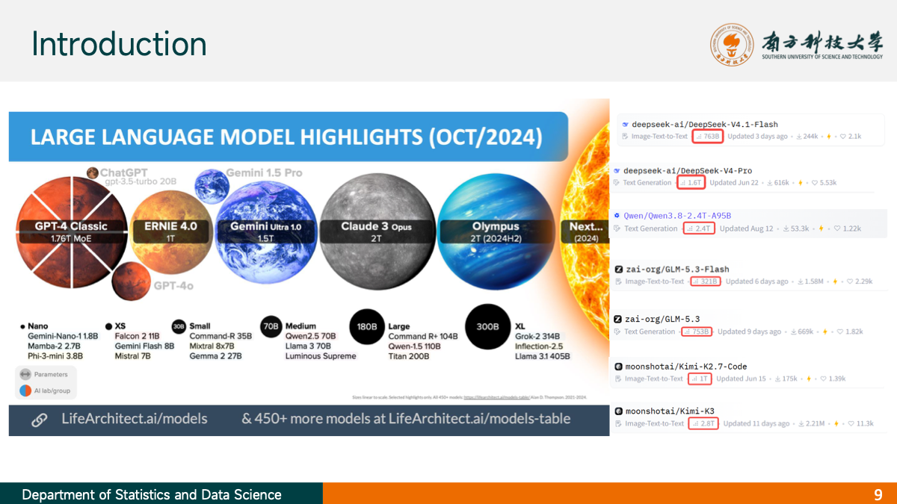

左边是 LifeArchitect.ai 的经典「行星图」，用球体面积表示参数量：GPT-4 Classic 1.76T（MoE）、ERNIE 4.0 1T、Gemini Ultra 1.0 1.5T、Claude 3 Opus 2T…下方按量级分档：

| 档位 | 参数量 | 例子 |
|---|---|---|
| Nano | ~1–3B | Gemini-Nano-1 1.8B、Mamba-2 2.7B、Phi-3-mini 3.8B |
| XS | ~7–11B | Falcon 2 11B、Gemini Flash 8B、Mistral 7B |
| Small | ~27–35B | Command-R 35B、Mixtral 8x7B、Gemma 2 27B |
| Medium | ~70B | Qwen2.5 70B、Llama 3 70B |
| Large | ~104–200B | Command R+ 104B、Qwen-1.5 110B、Titan 200B |
| XL | ~314–405B | Grok-2 314B、Llama 3.1 405B |

右边是 HuggingFace 上的实际条目，红框标出的是各模型的规模：DeepSeek-V4.1-Flash 763B、DeepSeek-V4-Pro 1.6T、Qwen3.8-2.4T-A95B 2.4T、GLM-5.3 753B、Kimi-K3 2.8T。

> **💡 注意 `A95B` 这种写法**
>
> `Qwen3.8-2.4T-A95B` 表示**总参数 2.4T，但每个 token 只激活 95B**。这是 MoE（Mixture of Experts）的标准记法。看 MoE 模型时必须区分两个数：**总参数量**决定显存占用，**激活参数量**决定推理算力。只看总参数会严重高估它的推理成本。行星图里 GPT-4 Classic 标的 `1.76T MoE` 也是同理。

#### P10　Agent 基础设施全景

*Introduction · Agentic AI Open Source Landscape 2026*

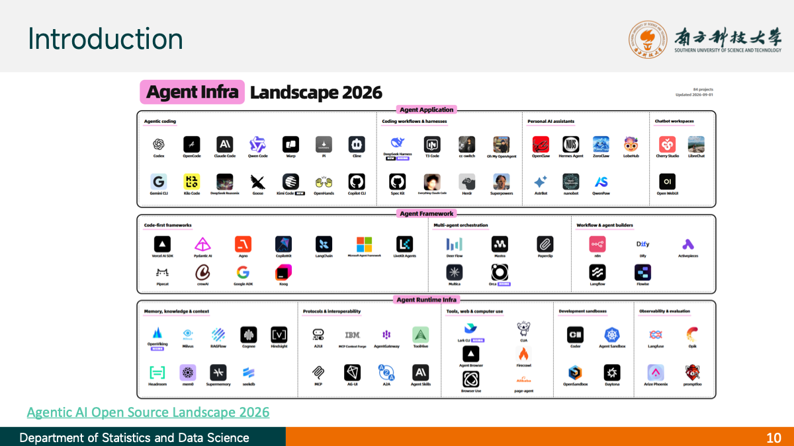

84 个开源项目，分三层：

- **Agent Application**（应用层）——Agentic coding（Codex、OpenCode、Claude Code、Qwen Code、Cline、Gemini CLI、OpenHands…）、Coding workflows & harnesses、Personal AI assistants、Chatbot workspaces。
- **Agent Framework**（框架层）——Code-first frameworks（Vercel AI SDK、Pydantic AI、Agno、LangChain、Microsoft Agent Framework…）、Multi-agent orchestration、Workflow & agent builders（n8n、Dify、Langflow、Flowise）。
- **Agent Runtime Infra**（运行时层）——Memory/knowledge/context、Protocols & interoperability（MCP、AG-UI、A2A、Agent Skills）、Tools/web/computer use、Development sandboxes、Observability & evaluation。

这页不用背。要抓的是**分层逻辑**：应用层解决「给谁用」，框架层解决「怎么编排」，运行时层解决「模型怎么和外部世界打交道」。其中 **Protocols & interoperability** 这一格最值得注意——MCP、A2A 这类协议的出现，说明行业正在把「模型调工具」标准化，这和当年 HTTP 之于 Web 是同一类事情。

#### P11　模型基础设施全景

*Introduction · Model Infra Landscape 2026*

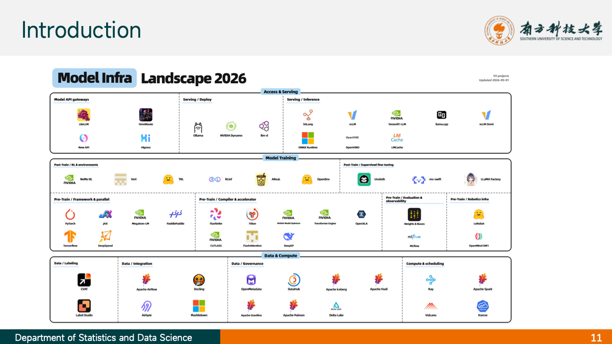

59 个项目，同样分三层，但这层关心的是**模型本身怎么训、怎么跑**：

- **Access & Serving**——Model API gateways（LiteLLM、OmniRoute…）、Serving/Deploy（Ollama、NVIDIA Dynamo、llm-d）、Serving/Inference（SGLang、vLLM、TensorRT-LLM、llama.cpp、ONNX Runtime、OpenVINO、LMCache）。
- **Model Training**——Post-Train/RL（NeMo RL、Verl、TRL、RLinf、Areal、OpenEnv）、Post-Train/SFT（Unsloth、ms-swift、LLaMA Factory）、Pre-Train/框架与并行（PyTorch、JAX、Megatron-LM、PaddlePaddle、TensorFlow、DeepSpeed）、编译器与加速（FlashInfer、Triton、CUTLASS、FlashAttention、DeepEP、OpenXLA）、评测与观测（Weights & Biases、MLflow）。
- **Data & Compute**——标注（CVAT、Label Studio）、集成（Airflow、Docling、Airbyte）、治理（OpenMetadata、DataHub、Iceberg、Hudi、Delta Lake）、调度（Ray、Spark、Volcano、KServe）。

把 P10 和 P11 对照着看：**P11 是造模型的工具，P10 是用模型的工具**。注意 Post-Train 已经单独成格，且 RL 和 SFT 分开——这印证了后面 P13 要讲的「后训练已经是独立阶段」。

#### P12　后训练方法全景

*Overview · [2502.21321] LLM Post-Training: A Deep Dive into Reasoning Large Language Models*

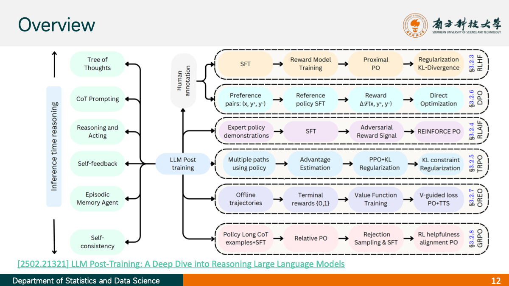

这张图来自一篇后训练综述，把 LLM Post-training 分成两大类。

**🖼 逐元素图解**

**左半边：Inference time reasoning（推理时推理）**——不改参数，只在推理时想办法：

- Tree of Thoughts（树状搜索多条思路）
- CoT Prompting（思维链提示）
- Reasoning and Acting（边推理边调工具，即 ReAct）
- Self-feedback（自我反馈修正）
- Episodic Memory Agent（带情节记忆的智能体）
- Self-consistency（多次采样投票取一致答案）

**右半边：六条训练路线**，每条都是一个「流水线」，右侧竖排标签是它在原综述里的小节号：

| 路线 | 流程 | 特征 |
|---|---|---|
| **RLHF** (§3.2.3) | SFT → 训练奖励模型 → PPO → KL 正则 | 经典三段式，需要人工标注 |
| **DPO** (§3.2.6) | 偏好对 $(x,y^+,y^-)$ → 参考策略 SFT → 奖励差 $\Delta\mathcal{L}$ → 直接优化 | **跳过奖励模型**，直接用偏好对优化 |
| **RLAIF** (§3.2.4) | 专家策略示范 → SFT → 对抗奖励信号 → REINFORCE | 用 AI 代替人给反馈 |
| **TRPO** (§3.2.5) | 策略采多条路径 → 优势估计 → PPO+KL → KL 约束 | 信赖域方法 |
| **OREO** (§3.2.7) | 离线轨迹 → 终局奖励 $\{0,1\}$ → 价值函数训练 → V 引导损失 | 离线 + 终局稀疏奖励 |
| **GRPO** (§3.2.8) | 长 CoT 样例 + SFT → 相对 PO → 拒绝采样 & SFT → RL 有用性对齐 | 组内相对比较，省掉价值网络 |

中间那个 **Human annotation**（人工标注）节点只连到 RLHF 和 DPO 两条线——**这正是这张图最值得看的地方**：RLAIF 用 AI 反馈替代人，OREO 用可自动判定的终局奖励（对/错）替代人，GRPO 用组内相对比较替代人。整个后训练领域的演进方向就是**把人从回路里摘出去**，因为人工标注既贵又慢，是规模化的瓶颈。

#### P13　三阶段：预训练 / 中期训练 / 后训练

*Introduction · LLM Pretraining / Mid-Training / Post-Training*

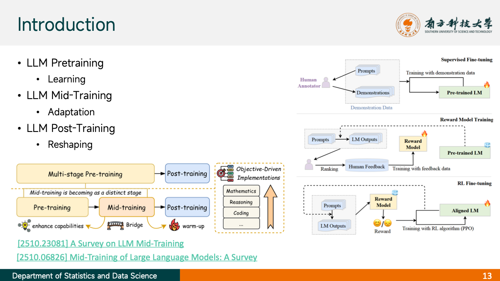

左侧列出三个阶段和各自的动词：

- **LLM Pretraining — Learning**（学习）
- **LLM Mid-Training — Adaptation**（适配）
- **LLM Post-Training — Reshaping**（重塑）

下方的对比图说明这是一个**新出现的划分**。上排是旧认知：`Multi-stage Pre-training → Post-training`。下排是新认知：`Pre-training → Mid-training → Post-training`，中间标注 *Mid-training is becoming a distinct stage*（中期训练正在成为一个独立阶段），三段各自的作用是 **enhance capabilities（增强能力）→ Bridge（桥梁）→ warm-up（预热）**。右边的 *Objective-Driven Implementations* 框列出中期训练常见的目标领域：Mathematics、Reasoning、Coding。

右侧三张小图则是后训练的三种经典做法，正好对应 P12 的 RLHF 三段式：

1. **Supervised Fine-tuning**——人工标注者写示范数据（Prompts + Demonstrations），拿去训练预训练模型。
2. **Reward Model Training**——让模型对同一提示生成多个输出，人类**排序**（Ranking）产生反馈数据，训练出奖励模型。
3. **RL Fine-tuning**——奖励模型给输出打分（图里用笑脸/哭脸表示），用 PPO 一类算法更新，得到 Aligned LM。

> **💡 为什么要单独切出 Mid-training**
>
> 预训练用的是海量通用语料，后训练用的是少量高质量标注数据，两者中间有个断层：**想让模型在数学、代码、推理上变强，用通用语料不够，用标注数据又太贵**。中期训练就填这个缝——用规模中等、领域明确的高质量语料继续训，成本远低于标注，效果又比通用语料集中。图里 `Bridge`（桥梁）这个词用得很准。

> **⚠️ 三个阶段的边界并不严格**
>
> 学术上对「Mid-training 从哪开始、到哪结束」没有公认定义，不同论文的切法不同（P13 引了两篇 2025 年 10 月的综述，说明这个概念还很新）。考试时按本课的三分法答即可，读论文时要注意各家定义可能不一致。

---
`Part 2 · P14–P20`

## 二、Pretraining（上）：从下一词预测到通用任务

第二个模块回答一个问题——**预训练到底在训什么**。答案短得出奇：只训一件事，预测下一个词。这七页要说清楚的是，为什么这么简单的目标能撑起通用能力，以及现实中训一个这样的模型是什么光景。

#### P14　模块切换：进入 Pretraining

*Content*

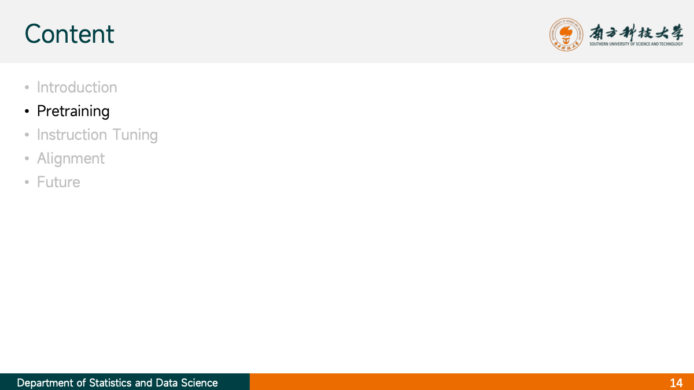

和 P2 相同的目录页，用来标记模块切换。接下来进入 **Pretraining**。

#### P15　预训练语言模型：目标与结构

*Pretrained Language Model*

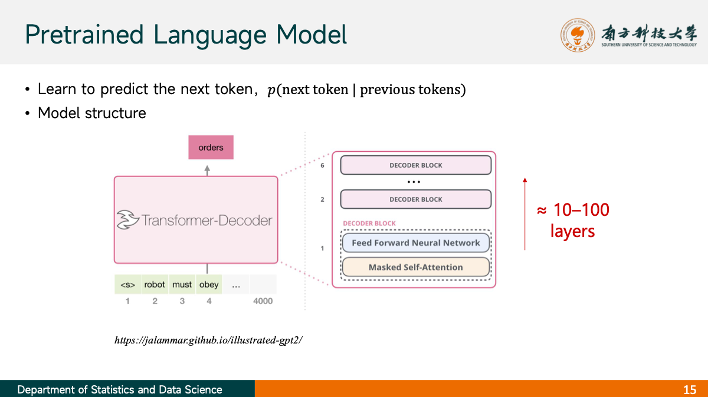

两个要点，一句话一个。

**目标**：学习预测下一个 token，即建模条件概率

$$
p(\text{next token} \mid \text{previous tokens})
$$

**结构**：Transformer-Decoder，约 10–100 层。

**🖼 逐元素图解**

图左：输入序列 `<s> robot must obey …`，位置编号 1、2、3、4…4000（这个 4000 是上下文长度）。整个序列送进粉色的 Transformer-Decoder 方块，顶端输出下一个词 `orders`（合起来是 "robot must obey orders"）。

图右是把那个粉方块拆开：它是 **DECODER BLOCK 的堆叠**（图上标了第 1、2、…、6 层，右侧红色箭头注明实际约 10–100 层）。每个 DECODER BLOCK 内部只有两个子层：

1. **Masked Self-Attention**（掩码自注意力）
2. **Feed Forward Neural Network**（前馈网络）

这正是 [Lecture 2](../sta5007-02/) 讲过的解码器块，这里直接复用。**注意这里没有交叉注意力**——GPT 类模型是 decoder-only，不存在编码器，所以原始 Transformer 解码器里的 cross-attention 那一层被去掉了。

> **💡 为什么「预测下一个词」能学到知识**
>
> 因为要把下一个词猜准，模型被迫学会几乎所有东西。"中国的首都是___" 要答对得有事实知识；"这部电影糟透了，我的评价是___" 要答对得懂情感；"2+3=___" 要答对得会算术。**语言里编码了世界**，压缩语言就等于压缩世界知识。这是整个 LLM 范式的根基。

> **⚠️ Masked 的含义别搞混**
>
> 这里的 mask 是**因果掩码**（causal mask），作用是让第 $t$ 个位置只能看到 $1..t-1$，防止偷看答案。它和 BERT 的 **masked language model**（随机挖掉 15% 的词让模型填）完全是两回事，只是都叫 mask。

#### P16　模型结构的变体

*Model Structure · Model variants*

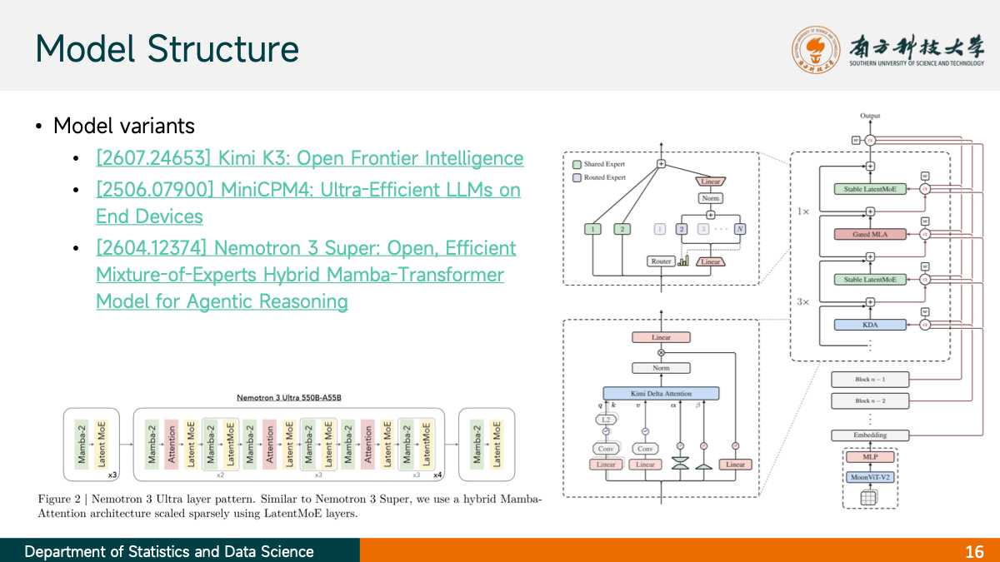

课件列了三篇代表不同结构路线的工作：

- **[2607.24653] Kimi K3: Open Frontier Intelligence**
- **[2506.07900] MiniCPM4: Ultra-Efficient LLMs on End Devices**
- **[2604.12374] Nemotron 3 Super: Open, Efficient Mixture-of-Experts Hybrid Mamba-Transformer Model for Agentic Reasoning**

右侧和下方的架构图展示了三条正在偏离「标准 Transformer」的路线：

**🖼 逐元素图解**

- **左上（MoE 结构）**：绿色 *Shared Expert* 与紫色 *Routed Expert*。输入经过 **Router**（带柱状图图标，表示打分）选择若干专家，专家输出与共享专家的输出相加，再过 Norm 和 Linear。**共享专家永远参与，路由专家按需激活**——这就是 P9 里 `A95B` 那个激活参数量的来源。
- **左下（Nemotron 3 Ultra 层模式）**：`Mamba-2` 和 `Attention`、`Latent MoE` 交替堆叠，标注 ×3、×2、×3、×4。图注写明这是 *hybrid Mamba-Attention architecture scaled sparsely using LatentMoE layers*。
- **右侧（Kimi 结构）**：`Stable LatentMoE`、`Gated MLA`、`KDA`（Kimi Delta Attention）交替，底部是 Embedding、MLP 与 `MoonViT-V2`（视觉编码器）。中间那张小图拆解了 Kimi Delta Attention 的内部：q/k/v 经过 L2 归一化、卷积、门控（α、β）后再线性变换。

三条路线的共同动机是**打破「注意力 $O(n^2)$ + 稠密 FFN」的成本结构**：

| 手段 | 省什么 | 代价 |
|---|---|---|
| **MoE**（稀疏激活） | 省计算——参数很多但每个 token 只用一小部分 | 显存仍要装下全部参数；路由负载不均会浪费算力 |
| **Mamba / 线性注意力** | 省显存与长序列开销——复杂度从 $O(n^2)$ 降到 $O(n)$ | 状态压缩会丢信息，精确检索能力弱于注意力 |
| **混合架构** | 两者取长补短——少数层用注意力保精度，多数层用 Mamba 省成本 | 结构复杂，调参和工程实现难度上升 |

> **💡 为什么是「混合」而不是全换成 Mamba**
>
> 注意力有一个 Mamba 难以复制的能力：**精确地回看任意历史位置**（比如「把第 300 个词原样复述出来」）。Mamba 把历史压进固定大小的状态，天然会丢细节。所以实践中的做法是保留少量注意力层负责精确检索，其余用线性结构承担主要计算量——Nemotron 3 的 `×3 Mamba-2 + 1 Attention` 这种配比就是这个思路。

#### P17　小模型时代的范式：预训练 + 微调

*Pretrain-and-Finetune for Small LMs*

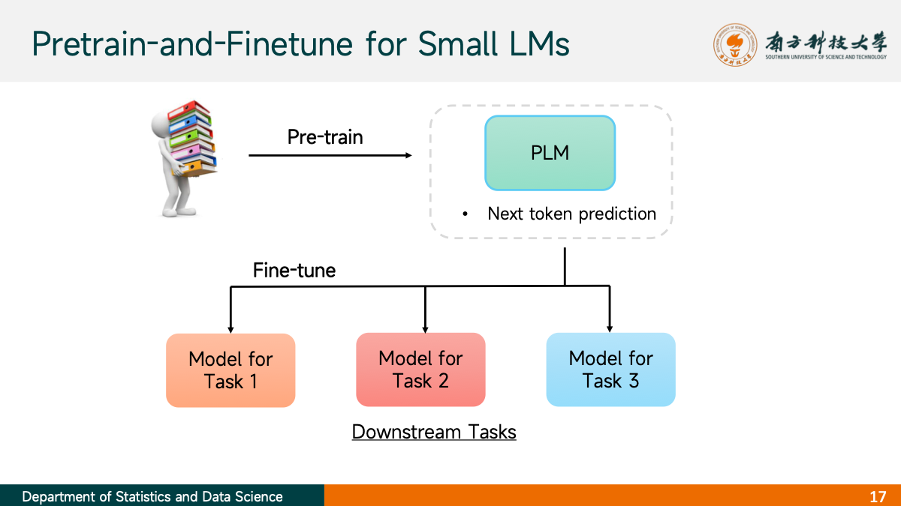

图上是一个扛着一摞书的小人（表示海量语料）经 **Pre-train** 得到 **PLM**（预训练语言模型），PLM 的训练目标标注为 *Next token prediction*；然后通过 **Fine-tune** 分叉出三个下游模型：Model for Task 1 / Task 2 / Task 3。

这页的重点在**「分叉」**两个字。在这个范式里：

- 预训练只做一次，得到一个通用底座；
- 但每个下游任务都要**单独微调一份完整的模型副本**。

三个任务就是三份模型权重。如果底座是 110M 的 BERT，三份也就三百多兆，还能接受；**如果底座是 175B，这个范式立刻破产**——光存储就是天文数字，更别说每个任务都要标注数据、都要训练。

这正是 P20 之后要讲的转折：LLM 时代必须换一种「一个模型服务所有任务」的做法。**P17 是用来被推翻的，不是用来遵循的。**

#### P18　真实的预训练现场（一）

*Open-Sourced Marin 535B-A23B MoE*

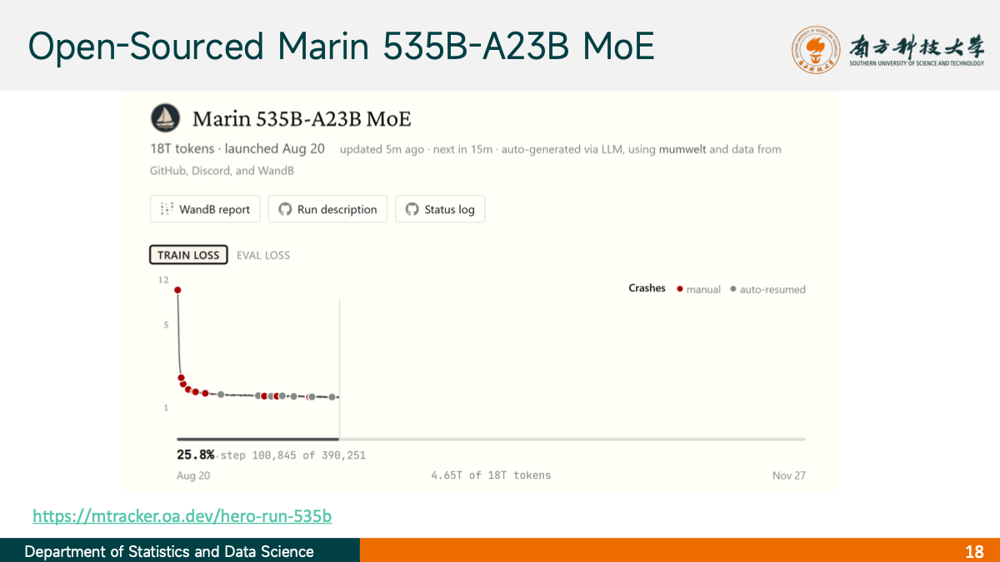

一个公开的大模型训练监控页面（mtracker.oa.dev/hero-run-535b）。关键信息：

| 项 | 值 | 含义 |
|---|---|---|
| 模型 | Marin **535B-A23B** MoE | 总参数 535B，每 token 激活 23B |
| 数据量 | **18T tokens** | 计划训练的总 token 数 |
| 启动 | Aug 20 | |
| 进度 | **25.8%**，step 100,845 / 390,251 | 已完成约四分之一 |
| 已消耗 | 4.65T of 18T tokens | |
| 预计结束 | Nov 27 | **整整三个多月** |

曲线是 TRAIN LOSS：从 12 断崖式跌到 2 以下，之后长期在 1 附近缓慢下降。图例里有两种点：**红色 `manual`（人工处理的崩溃）** 和**灰色 `auto-resumed`（自动恢复的崩溃）**。

**这页是全讲最有价值的一张「现实感」幻灯片**，它告诉你三件教科书不写的事：

1. **损失曲线的形状**——绝大部分下降发生在最初极小一段训练里。模型很快就学会「英语句子长什么样」，剩下三个月都在啃那些难啃的、靠知识和推理才能预测对的 token。所以**后期 loss 从 1.05 降到 1.02 看着微不足道，实际能力差别可能很大**。
2. **崩溃是常态**——曲线上密密麻麻全是崩溃点。千卡规模的集群，硬件故障、通信超时、loss spike 都会中断训练。所以训练框架的**自动续跑（auto-resume）和 checkpoint 机制**和模型结构一样重要。
3. **时间尺度**——三个月连续占用整个集群。这意味着**你基本没有试错机会**：超参数必须在小规模实验里就定好，这也是 Scaling Law 存在的实际意义（用小模型外推大模型的最优配置）。

#### P19　真实的预训练现场（二）

*Open-Sourced Marin 535B-A23B MoE*

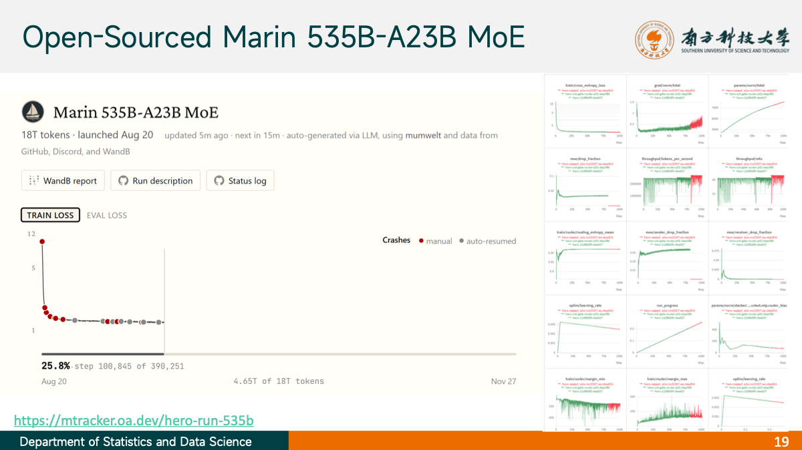

同一个训练任务，右侧补上了完整的指标墙（15 张小图），能辨认出的包括：

- `train/cross_entropy_loss`——主损失
- `grad/norm/total`——梯度范数。注意它**后期在往上走并变红**，这是训练不稳定的典型信号
- `params/norm/total`——参数范数，持续增长
- `throughput/tokens_per_second`、`throughput/mfu`——吞吐与 MFU（Model FLOPs Utilization，算力利用率）
- `train/router/routing_entropy_mean`、`moe/sender_drop_fraction`、`moe/receiver_drop_fraction`——**MoE 专有指标**
- `optim/learning_rate`——学习率曲线，明显是线性衰减
- `run_progress`、`train/router/margin_min`、`margin_max`

> **💡 MoE 那三个指标为什么重要**
>
> - **routing entropy（路由熵）**：衡量 token 在专家间的分布是否均匀。熵**塌缩**意味着所有 token 都挤向少数几个专家，其余专家白占显存——这是 MoE 训练最常见的失败模式。
> - **drop fraction（丢弃率）**：每个专家有容量上限，超出的 token 会被丢弃，直接损失信息。sender/receiver 两个方向分开统计，是因为专家并行下 token 要跨设备发送。
>
> 训练稠密模型只需要盯 loss 和 grad norm；**训 MoE 必须同时盯路由健康度**，否则 loss 看着正常，实际有一半专家在空转。

#### P20　万物皆可下一词预测

*Diverse Tasks*

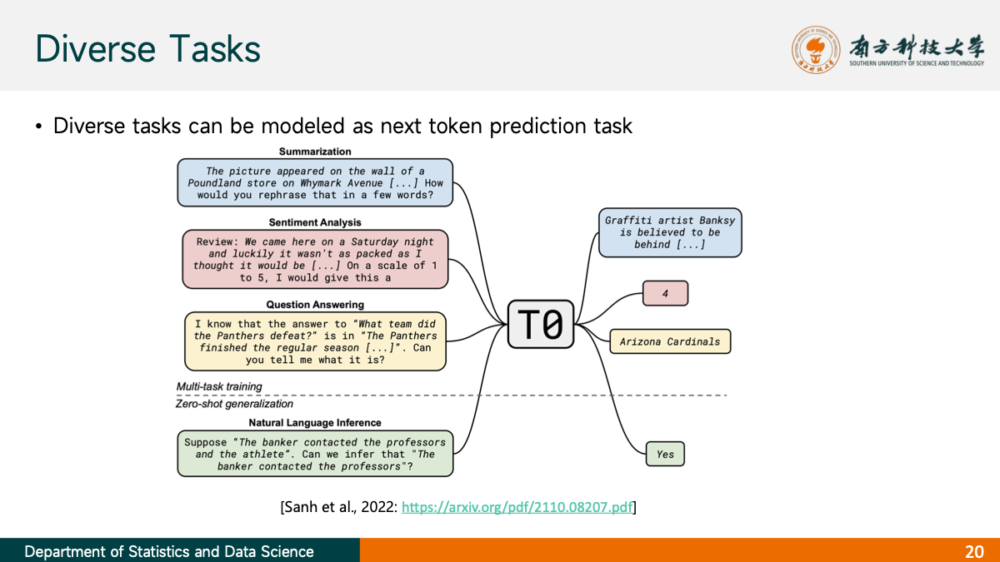

核心论点：**Diverse tasks can be modeled as next token prediction task**（各种任务都能建模成下一词预测）。

**🖼 逐元素图解**

左侧四个不同颜色的框是四类任务，每个都被改写成了一段**自然语言提示**：

| 任务 | 提示的写法 | 模型输出 |
|---|---|---|
| **Summarization**（摘要，蓝） | "The picture appeared on the wall of a Poundland store […] How would you rephrase that in a few words?" | "Graffiti artist Banksy is believed to be behind […]" |
| **Sentiment Analysis**（情感，粉） | "Review: We came here on a Saturday night […] On a scale of 1 to 5, I would give this a" | "4" |
| **Question Answering**（问答，黄） | "I know that the answer to […] is in 'The Panthers finished the regular season […]'. Can you tell me what it is?" | "Arizona Cardinals" |
| **Natural Language Inference**（推理，绿） | "Suppose 'The banker contacted the professors and the athlete'. Can we infer that 'The banker contacted the professors'?" | "Yes" |

中间是模型 **T0**。图中有一条虚线把四个任务分开，上方标 *Multi-task training*（前三类参与训练），下方标 *Zero-shot generalization*（NLI 这一类**没参与训练**，靠泛化直接做对）。

**这页是 P17 的解药。** 回想 P17 的困境：每个任务一份模型。这里给出的答案是——**不改模型，改任务的表述方式**。把分类、抽取、推理统统写成「一段文字 + 让模型续写」，于是所有任务共用同一组参数、同一个目标函数。

关键证据是那条虚线：NLI 从未出现在训练里，模型照样答对了。这说明它学到的不是「四个任务各自的解法」，而是**「读懂指令并照做」这个更一般的能力**——下一个模块 Instruction Tuning 要做的，就是把这个能力系统性地强化出来。

> **⚠️ 情感分析那个例子值得多看一眼**
>
> 提示的结尾是 "I would give this a"，模型输出 "4"。注意它**没有输出「四星」「正面」「positive」**，而是一个能自然接在这句话后面的数字。这说明提示的措辞直接决定了输出格式——**提示工程的本质，是给模型铺一条只有正确答案才接得下去的轨道**。

---

### 🖊 本模块练习（P14–P20）

先自己写答案，再看解析。带 ★ 的是常见笔试/面试题。

1. ★ 为什么「预测下一个词」这一个目标，能让模型学会事实、情感、算术等不同能力？

<details><summary>解析</summary>

因为这些能力都是**把下一个词猜准的必要条件**。"中国的首都是___" 这个空，只有具备地理事实才能填对；"2+3=___" 只有会算术才能填对。训练时模型对所有这类上下文都要降低损失，于是被迫把相应能力学出来。

换个角度说：语言是人类知识的编码载体，**对语言做无损压缩，必然要求理解语言所描述的世界**。下一词预测就是在做这件事——交叉熵损失正是编码长度的度量。

</details>

2. 一个模型标注为 `Marin 535B-A23B`，它的显存占用和推理算力分别由哪个数字决定？

<details><summary>解析</summary>

- **显存占用由 535B 决定**：所有专家的权重都必须驻留在显存（或至少可快速换入），因为不知道下一个 token 会路由到谁。
- **推理算力由 23B 决定**：每个 token 只经过被选中的那部分专家，实际参与矩阵乘法的参数约 23B。

所以 MoE 的卖点是「用 535B 的知识容量，付 23B 的计算代价」，**代价是显存**。这也解释了为什么 MoE 在服务端流行、在端侧困难——端侧设备显存放不下总参数。

</details>

3. ★ P18 的 loss 曲线从 12 迅速降到 2，之后三个月只从 2 缓慢降到 1 附近。为什么后面这段「没什么变化」的训练不能省？

<details><summary>解析</summary>

因为**损失值的线性下降对应能力的非线性提升**。

初期从 12 降到 2，模型学的是最廉价的统计规律：词频分布、基本语法、常见搭配。这部分 token 占比高但价值低。

后期从 2 降到 1，降的是那些**只有靠知识和推理才能预测对**的 token——它们在语料里占比很小，所以对平均损失的影响看着不大，但恰恰是这些 token 决定了模型会不会做数学题、能不能写对代码。

补充一个量化直觉：交叉熵损失 $\mathcal{L}$ 对应困惑度 $\text{PPL}=e^{\mathcal{L}}$。$\mathcal{L}$ 从 2 降到 1，困惑度从约 7.4 降到约 2.7，**候选空间缩小了近三倍**，这绝不是小变化。

</details>

4. P19 里 `routing_entropy` 如果持续下降到接近 0，说明训练出了什么问题？该怎么办？

<details><summary>解析</summary>

说明**路由塌缩**（routing collapse）：绝大多数 token 都被路由到少数几个专家，其余专家几乎不被激活。

后果有两个：一是被冷落的专家得不到梯度，等于白白占用显存和参数预算，MoE 退化成一个小稠密模型；二是热门专家超出容量上限，多余 token 被丢弃（对应 `drop_fraction` 升高），信息直接损失。

常见对策是加**负载均衡辅助损失**（load balancing loss），显式惩罚专家使用率的不均衡；也有在路由打分上加噪声、或用容量因子放宽上限的做法。

</details>

5. 按 P17 的范式，如果要为 10 个下游任务部署基于 175B 底座的模型，需要存多少份权重？这说明了什么？

<details><summary>解析</summary>

**10 份完整的 175B 权重**。按 FP16 计算每份约 350 GB，十份就是 3.5 TB，而且每个任务都需要单独的标注数据和训练过程。

这说明 **P17 的范式在 LLM 规模下完全不可行**。这正是提示学习（prompting）和后来的指令微调之所以成为主流的现实原因——不是因为它们理论上更优雅，而是因为「一个模型 + 不同提示」是唯一付得起的方案。

（顺带一提，LoRA 那类参数高效微调就是在这个矛盾上找折中：底座共享一份，每个任务只存一个很小的增量。）

</details>

6. ★ P20 里 NLI 任务没有参与多任务训练却能做对，这个现象说明模型学到了什么？

<details><summary>解析</summary>

说明模型学到的**不是若干个任务各自的解法，而是「理解指令并执行」这个更抽象的能力**。

在多任务训练中，模型见过大量「一段描述 + 一个要求 + 相应回答」的样本。它归纳出的规律是「按要求作答」这个通用模式，而不是「遇到摘要任务就压缩、遇到情感任务就打分」。所以碰到没见过的 NLI 指令，同一套模式依然适用。

这就是**指令层面的泛化**，也是指令微调（Instruction Tuning）这个方向成立的前提：只要训练时覆盖足够多样的指令，模型就能泛化到训练中未出现的新指令上。

</details>

---
`Part 3 · P21–P28`

## 三、Pretraining（下）：数据才是主角

上一部分讲的是「训什么目标、用什么结构」，这八页讲的是**「喂什么」**。在结构高度趋同的今天，模型之间的差距很大程度上由数据决定——数据从哪来、怎么洗、洗到什么程度，以及一个绕不开的事实：**高质量数据是会用完的**。

#### P21　开源预训练数据集清单

*Open-Sourced Pretrain Datasets*

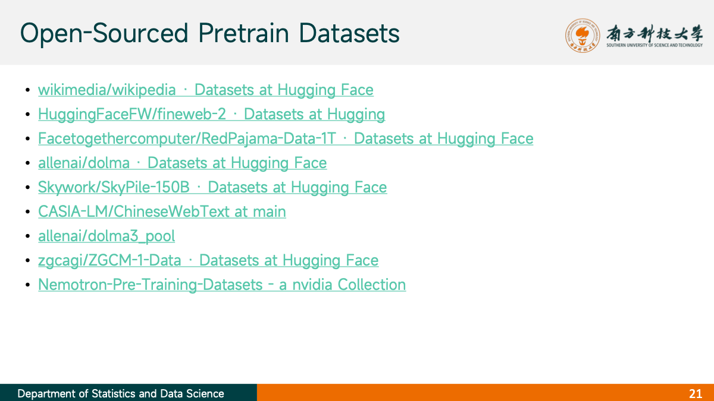

课件列出九个可直接下载的预训练语料：

| 数据集 | 特点 |
|---|---|
| `wikimedia/wikipedia` | 维基百科，质量高、覆盖广，几乎所有模型都会用 |
| `HuggingFaceFW/fineweb-2` | 从 Common Crawl 精洗出的多语种网页语料 |
| `togethercomputer/RedPajama-Data-1T` | 复现 LLaMA 配方的 1T token 开源语料 |
| `allenai/dolma` | AI2 的三万亿 token 语料，**配方完全公开**（见 P23） |
| `Skywork/SkyPile-150B` | 中文大规模语料 |
| `CASIA-LM/ChineseWebText` | 中文网页文本 |
| `allenai/dolma3_pool` | Dolma 的新一代候选池 |
| `zgcagi/ZGCM-1-Data` | 中文语料 |
| `Nemotron-Pre-Training-Datasets` | NVIDIA 的预训练数据集合 |

这页的实际价值是**告诉你复现是可能的**：底座模型的训练数据不再是黑箱，中英文都有可用的开源大规模语料。对课程项目而言，这里任何一个都能直接拿来做小规模预训练实验。

#### P22　代码数据为什么特别

*Code Pretraining*

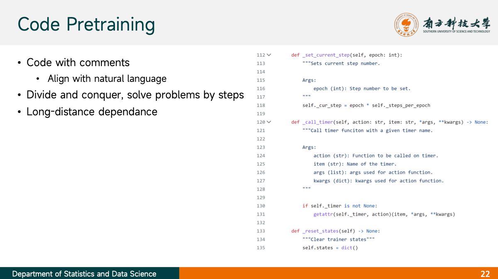

三条理由，右侧配了一段真实的 Python 代码（带 docstring 的 `_set_current_step`、`_call_timer`、`_reset_states` 三个方法）：

1. **Code with comments — Align with natural language**（代码带注释，天然是自然语言与形式语言的对齐数据）
2. **Divide and conquer, solve problems by steps**（分而治之，按步骤解决问题）
3. **Long-distance dependance**（长距离依赖）

逐条看为什么这对训练有用：

- **天然的对齐语料**。右图那段代码里，docstring 写着 "Call timer function with a given timer name."，紧接着就是实现这个描述的代码。这等于**免费的「自然语言 → 形式语义」平行语料**，而且规模巨大、质量由编译器/测试隐式保证。这是 Codex 那条支线（见 P7）能成立的根本原因。
- **强制分步结构**。一个函数必须先取参数、再判断、再调用、再返回。代码里到处都是这种**显式的、可验证的步骤链**。有观点认为，模型在代码上训练获得的「分步推理」习惯会迁移到自然语言推理上——这也是为什么很多模型即使主打对话，也会掺入大量代码数据。
- **超长依赖**。`self._timer` 在第 130 行被用到，它可能在几百行之外的 `__init__` 里定义；变量名、缩进、括号必须**跨越很长距离保持一致**。自然语言里很少有这么严格的长程约束，代码则每一行都在提供这种训练信号。

> **💡 一个反直觉的结论**
>
> 「想让模型数学好，就多喂数学题」只对了一半。实践中**加代码数据对数学和推理能力的提升往往同样显著**，因为代码提供的是「严格按步骤执行且每步可验证」这种结构化训练信号，而这正是推理所需要的。

#### P23　Dolma 语料的构成

*Data Preprocessing Pipeline · [2402.00159] Dolma*

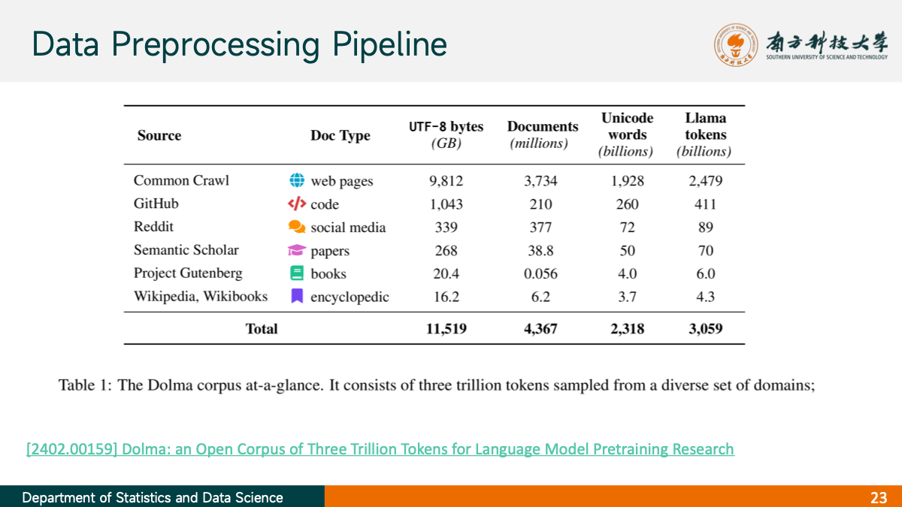

Dolma 三万亿 token 语料的来源分布：

| 来源 | 类型 | UTF-8 字节 (GB) | 文档数 (百万) | 词数 (十亿) | Llama token (十亿) |
|---|---|---:|---:|---:|---:|
| Common Crawl | 网页 | 9,812 | 3,734 | 1,928 | 2,479 |
| GitHub | 代码 | 1,043 | 210 | 260 | 411 |
| Reddit | 社交媒体 | 339 | 377 | 72 | 89 |
| Semantic Scholar | 论文 | 268 | 38.8 | 50 | 70 |
| Project Gutenberg | 书籍 | 20.4 | 0.056 | 4.0 | 6.0 |
| Wikipedia, Wikibooks | 百科 | 16.2 | 6.2 | 3.7 | 4.3 |
| **合计** | | **11,519** | **4,367** | **2,318** | **3,059** |

这张表有几处值得细看：

**网页占了压倒性多数。** Common Crawl 一家就是 2,479B token，占总量 3,059B 的 **81%**。这不是因为网页质量最好，而是因为**只有网页能提供这个量级**——这个事实直接通向 P28 的核心论点。

**注意字节数与 token 数的比值。** Common Crawl 是 9,812 GB → 2,479B token，约 **4.0 字节/token**；GitHub 是 1,043 GB → 411B token，约 **2.5 字节/token**。代码的字节/token 比更低，说明**代码被切得更碎**——大量符号、缩进、罕见标识符都会被 BPE 拆成多个 token。这在算训练成本时很关键：同样 1 GB 的代码，比 1 GB 的散文贵约 60%。

**书籍和百科的量小得惊人。** Gutenberg 只有 0.056 百万篇文档、6B token，Wikipedia 4.3B token，两者加起来占比不到 0.4%。**人类精心编纂的高质量文本，总量就是这么少。**

> **⚠️ 「Llama tokens」这一列的含义**
>
> token 数依赖于**具体哪个分词器**。换一个 tokenizer，同样的语料 token 数会变。所以论文里报告 token 数时必须注明分词器，否则不同工作之间没法比较。

#### P24　数据预处理的四个步骤

*Data Preprocessing Pipeline*

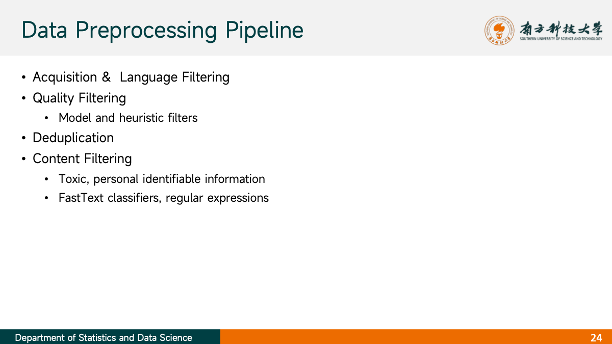

- **Acquisition & Language Filtering**（获取与语种过滤）
- **Quality Filtering**（质量过滤）——Model and heuristic filters（模型过滤器 + 启发式规则）
- **Deduplication**（去重）
- **Content Filtering**（内容过滤）——Toxic, personal identifiable information（有害内容、个人可识别信息）；FastText classifiers, regular expressions（FastText 分类器、正则表达式）

注意质量过滤的两套手段并存：

- **启发式规则**：文档太短就丢、符号占比过高就丢、行重复率过高就丢。**便宜、可解释、可在 TB 级数据上跑**。
- **模型过滤器**：训一个小分类器判断「这段文本像不像维基百科/书籍」。**更准，但要为每个文档过一遍模型，成本高得多**。

实践中的顺序几乎总是「先用规则砍掉大头，再用模型精筛剩下的」——因为在 11,519 GB 上跑神经网络分类器代价极高，先用规则把数据量降一个数量级再说。

#### P25　预处理流水线全图

*Data Preprocessing Pipeline*

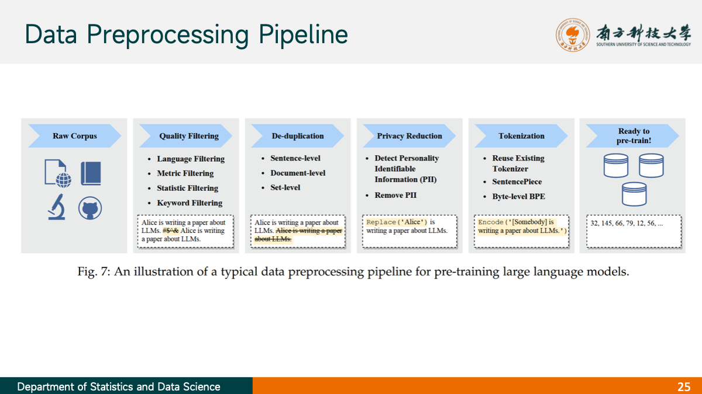

这张图用同一个例句 "Alice is writing a paper about LLMs." 走完全程，是全讲最清晰的一页。

**🖼 逐元素图解**

六个阶段，每个下面的小方框展示了这句话在该阶段的变化：

| 阶段 | 做什么 | 例句变化 |
|---|---|---|
| **Raw Corpus** | 原始语料（网页、书籍、论文、GitHub） | — |
| **Quality Filtering** | Language / Metric / Statistic / Keyword Filtering | `Alice is writing a paper about LLMs. ~~#$^&~~ Alice is writing a paper about LLMs.` ——乱码 `#$^&` 被划掉 |
| **De-duplication** | Sentence-level / Document-level / Set-level | 重复的第二句 `~~Alice is writing a paper about LLMs.~~` 被整句删除 |
| **Privacy Reduction** | 检测并移除 PII | `Replace('Alice')` → 变成 "[Somebody] is writing a paper about LLMs." |
| **Tokenization** | Reuse Existing Tokenizer / SentencePiece / Byte-level BPE | `Encode('[Somebody] is writing a paper about LLMs.')` |
| **Ready to pre-train!** | 存成 token id | `32, 145, 66, 79, 12, 56, ...` |

**顺序不是随意的**，每一步都在为后一步减负：

1. 先过滤质量——把垃圾扔掉，后面的昂贵步骤就不用处理它们。
2. 再去重——去重是 $O(n^2)$ 量级的操作（实际用 MinHash/SimHash 近似），在更小的数据上做更划算。
3. 然后脱敏——PII 检测要跑模型或正则，同样希望数据量已经降下来。
4. 最后分词——分词是确定性操作，放最后一步，中间任何环节想调整都不必重跑分词。

> **💡 去重的三个层级**
>
> - **Sentence-level**：删重复句子（常见于导航栏、版权声明）。
> - **Document-level**：删几乎相同的文档（同一篇新闻被上百个站转载）。
> - **Set-level**：跨数据集去重，比如确保训练集里不含评测集的内容——**这一层直接关系到评测结果可不可信**（数据污染问题）。

> **⚠️ 去重不是可选项**
>
> 重复数据会让模型在那些内容上过拟合、增加逐字背诵训练数据的风险（隐私与版权问题），还会浪费算力。已有研究表明去重能在**减少数据量的同时提升效果**——这是少见的「又省又好」的操作。

#### P26　用模型来筛数据

*Data Preprocessing Pipeline · [2506.07900] MiniCPM4*

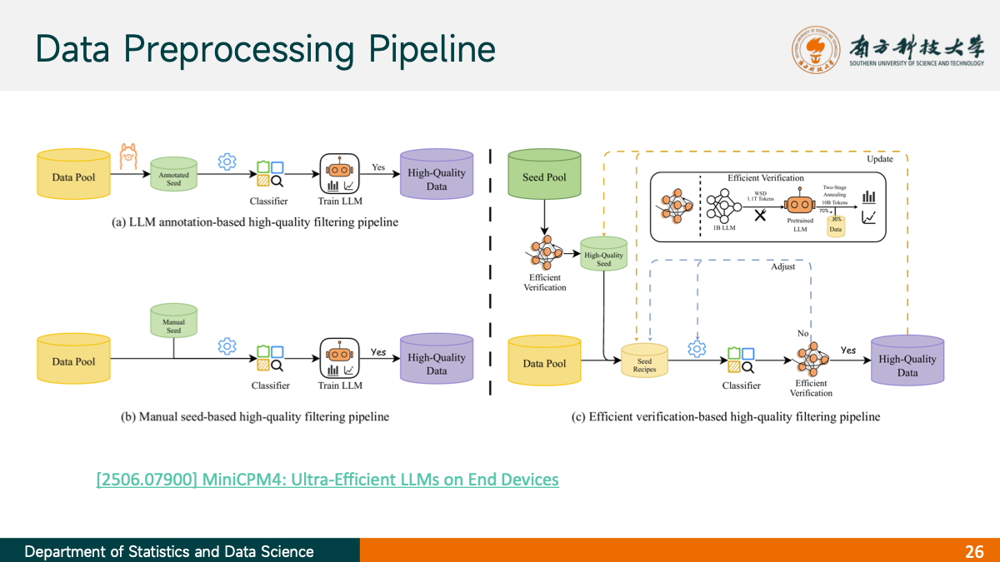

MiniCPM4 论文里对比的三条高质量数据筛选路线。

**🖼 逐元素图解**

**(a) LLM annotation-based**（LLM 标注驱动）：
`Data Pool` →（LLM 标注）→ `Annotated Seed` → 训练 `Classifier` → 用分类器筛 → `Train LLM` 验证 → Yes → `High-Quality Data`

**(b) Manual seed-based**（人工种子驱动）：
`Data Pool` + `Manual Seed`（人工挑的种子数据）→ `Classifier` → `Train LLM` → Yes → `High-Quality Data`

**(c) Efficient verification-based**（高效验证驱动，本文方法）：
`Seed Pool` →（Efficient Verification）→ `High-Quality Seed` → 与 `Data Pool` 一起产生 `Seed Recipes`（数据配方）→ `Classifier` → `Efficient Verification` → Yes → `High-Quality Data`，并带 **Update / Adjust 两条回环**。

右上角 *Efficient Verification* 的放大图揭示了关键技巧：用 **1B 小模型 × WSD 1.1T tokens** 做验证，而不是用 `Pretrained LLM` 跑 **Two-Stage Annealing 10B tokens**（图中标注 70% / 30% 的数据配比）。

**三条路线的本质差别在「怎么判断一份数据配方好不好」**：

最朴素的做法是——拿这份数据真的训一个模型，看效果。但这正是瓶颈：每验证一个配方就要训一次，而训一次要几周（见 P18）。

于是 (c) 的思路是**用极小的代理实验替代完整训练**：拿 1B 模型训 1.1T token，几小时就能出结论，用它的相对排序来预测「哪份配方在大模型上更好」。加上 Update/Adjust 回环，就能快速迭代出配方。

> **💡 这其实是 Scaling Law 的同一个思想**
>
> 「用小规模实验预测大规模结果」是整个大模型工程的核心方法论。Scaling Law 用它定模型尺寸和数据量，这里用它定数据配方。**前提是小模型上的相对排序在大模型上依然成立**——这个前提不总是对的，也是这类方法的主要风险。

#### P27　预训练到底想达到什么

*What Are the Goals of Pre-Training?*

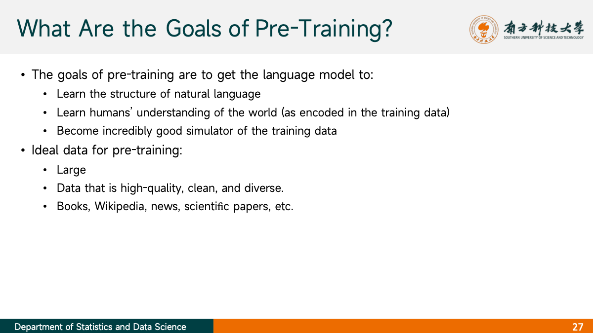

**预训练的目标**是让语言模型：

- Learn the structure of natural language（学会自然语言的结构）
- Learn humans' understanding of the world (as encoded in the training data)（学会人类对世界的理解——以训练数据中被编码的形式）
- Become incredibly good simulator of the training data（成为训练数据的极好的模拟器）

**理想的预训练数据**：

- Large（量大）
- Data that is high-quality, clean, and diverse（高质量、干净、多样）
- Books, Wikipedia, news, scientific papers, etc.（书籍、维基、新闻、科学论文等）

第三条目标 —— *simulator of the training data* —— 是这页最值得琢磨的一句，它同时解释了 LLM 的能力与它的全部毛病：

- 模型不是「知道」事实，而是在**模拟产生这些文本的过程**。数据里怎么写，它就怎么倾向于写。
- 所以**训练数据的偏见会被忠实复制**，训练数据里的错误也会被复制。
- 所以它会**一本正经地胡说**：如果上下文看起来像一段学术引用，模型就会生成一段格式完美的引用——不管那篇论文是否存在。它在模拟「引用长什么样」，而不是在查证。

把第三条和「理想数据」那三行并排看，逻辑就闭合了：**既然模型是数据的模拟器，那么想要什么样的模型，就得给什么样的数据**。数据治理不是工程琐事，它直接决定模型的上限和性格。

#### P28　但现实是……

*Pre-training Data Reality*

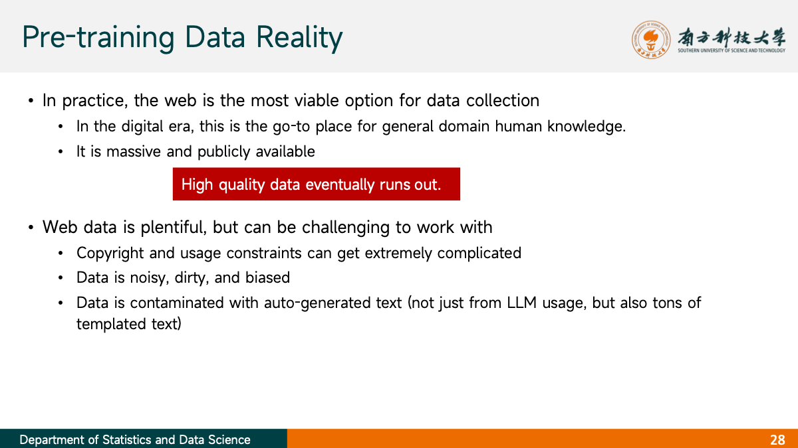

- 实践中，**网络是唯一可行的数据来源**
  - 数字时代，这是通用领域人类知识的首选之地
  - 它规模巨大且公开可得

> <span style="color:#c00">**High quality data eventually runs out.**（高质量数据终将耗尽。）</span>

- 网络数据量大，但很难处理
  - **版权和使用限制**极其复杂
  - 数据**嘈杂、脏、有偏**
  - 数据被**自动生成的文本污染**（不只是 LLM 生成的，还有大量模板化文本）

这页和 P27 构成了一组尖锐的对照——**P27 说理想数据应该是书籍、维基、论文；P28 说现实中你只能用网页**。回看 P23 的表就明白为什么：书籍 6B token、维基 4.3B token，而网页 2,479B。理想数据的总量比需求小了两三个数量级。

那个红底白字的警告是全讲最重的一句话。它的含义是：

- 模型规模还能继续涨（加卡就行），但**高质量文本是有限资源**，已经接近被用完。
- 这直接威胁 Scaling Law 的适用性——**如果数据轴撞墙，单纯堆参数就不再有效**。

这也正好解释了课程后面的走向：既然「喂更多数据」这条路快走到头了，接下来的增益就得从别处找——**中期训练**（用有限的高质量数据做针对性强化，P13）、**合成数据**、以及**推理时扩展**（P7 那个 `+think`，不增加训练数据也能提升表现）。

> **⚠️ 「被自动生成文本污染」为什么严重**
>
> 一旦互联网上大量内容由 LLM 生成，后续模型就会在**上一代模型的输出**上训练。这会造成分布逐代收窄——罕见表达、少数派观点被逐步抹平，学界称之为模型崩塌（model collapse）。注意课件特别加了一句「不只是 LLM 生成的，还有大量模板化文本」——SEO 农场、自动生成的商品页早在 LLM 之前就存在了。

---

### 🖊 本模块练习（P21–P28）

1. ★ P23 的表里，Common Crawl 是 4.0 字节/token，GitHub 是 2.5 字节/token。为什么代码的字节/token 比更低？这对训练成本意味着什么？

<details><summary>解析</summary>

因为 **BPE 分词器主要在自然语言上训练**，词表里塞满了常见英文词与子词。代码里大量出现的东西——缩进空格、`->`、`**kwargs`、驼峰式标识符、下划线命名——在词表里没有对应的整词条目，只能被拆成很多小片段。

成本影响：**同样体积的代码，token 数约为散文的 1.6 倍**。训练成本按 token 计，所以 1 GB 代码比 1 GB 散文贵约 60%。这也是为什么面向代码的模型往往会专门训练或扩展分词器，把常见代码模式并成单个 token。

</details>

2. 为什么预处理流水线要把去重放在质量过滤之后、分词之前？

<details><summary>解析</summary>

**放在质量过滤之后**：去重是整条流水线里最贵的操作（需要两两比较，实际用 MinHash/SimHash 近似仍然昂贵）。先过滤掉垃圾能让待去重的数据量小一个数量级，直接省下大量算力。

**放在分词之前**：去重要比较的是**文本内容**，在字符/句子层面做最自然。而且分词是确定性的最后一步——中间任何环节要调整（比如发现过滤规则太激进），都不必重跑分词。

</details>

3. ★ 「高质量数据终将耗尽」为什么对 Scaling Law 构成威胁？

<details><summary>解析</summary>

Scaling Law 说的是模型效果随**算力、参数量、数据量**三者同时增长而可预测地提升。Chinchilla 一类的结论进一步指出，参数量和数据量需要**按比例配合**增长才最优——参数翻倍，数据也得跟着翻倍。

算力和参数量可以靠买卡解决，但**高质量文本是存量有限的自然资源**。当数据这一轴撞到天花板，再增加参数就会落到「数据不足」的区域，收益急剧衰减，Scaling Law 的外推不再成立。

这正是业界转向三条替代路线的原因：**合成数据**（自己造）、**多模态数据**（把图像视频也吃进来扩大数据池）、**推理时扩展**（不增加训练数据，在推理时多花算力换效果，即 P7 的 `+think`）。

</details>

4. P26 的方法 (c) 用 1B 小模型验证数据配方，这样做省了什么？有什么风险？

<details><summary>解析</summary>

**省的是验证成本**。直接验证一份数据配方好不好，最可靠的办法是拿它训一个完整大模型——按 P18 的规模那是三个月。用 1B 模型训 1.1T token 只要几小时，于是可以在同样时间里试几十上百种配方。

**风险是小模型上的排序未必在大模型上成立**。有些能力（复杂推理、长程一致性）在小模型上根本不出现，所以对这些能力有帮助的数据在 1B 实验里可能看不出优势，反而被筛掉。学界称之为**涌现能力造成的外推失效**。

这也是为什么 (c) 图里有 Update 和 Adjust 两条回环——需要用更大规模的实验定期校准小模型给出的排序。

</details>

5. ★ P27 说模型是「训练数据的模拟器」。用这一条解释：为什么 LLM 会编造不存在的论文引用？

<details><summary>解析</summary>

因为模型学到的是**「学术引用长什么样」这个模式**，而不是「哪些论文真实存在」这份清单。

当上下文提示需要一条引用时，模型按照它模拟的分布生成最像引用的 token 序列：一个合理的作者名、一个合理的年份、一个合理的标题、一个格式正确的 arXiv 编号。**每一个局部选择都符合训练数据的统计规律**，合起来就是一条格式完美但并不存在的引用。

关键在于：模型没有「查证」这个动作，它的目标函数里也没有任何一项要求输出为真。它优化的是「像不像训练数据」，不是「对不对」。这就是幻觉（hallucination）的根源，也说明**光靠扩大预训练规模消除不了幻觉**——必须引入检索、工具调用或可验证的奖励信号。

</details>

6. 为什么代码数据对提升模型的**数学与推理**能力有帮助？

<details><summary>解析</summary>

三个机制：

1. **显式的分步结构**。代码天然是一串有序的、每步都明确的操作，这提供了大量「按步骤推进」的训练信号，而自然语言文本里的推理往往是省略跳跃的。
2. **严格的长程一致性**。变量定义在几百行前、这里必须用对；括号必须配平；类型必须匹配。这迫使模型维持长距离的精确状态跟踪，而这正是多步推理所需的能力。
3. **隐式的正确性监督**。能跑通、能过测试的代码才会被提交到 GitHub，所以代码语料的「正确率」远高于一般网页文本——模型学到的是**能工作的推理链**，而不是看起来合理的推理链。

</details>

---
`Part 4 · P29–P36`

## 四、涌现、思维链与指令微调

这八页跨越两个主题，但有一条暗线把它们串起来：**预训练完的模型「会」很多事，却不一定「肯」按你要的方式做**。P29–P32 讲前半句（能力是怎么冒出来的、怎么把它引导出来），P33–P36 讲后半句（怎么让模型听话，以及怎么让它符合人的偏好）。

#### P29　上下文学习：Zero / One / Few-shot

*LLM: in-Context Learning*

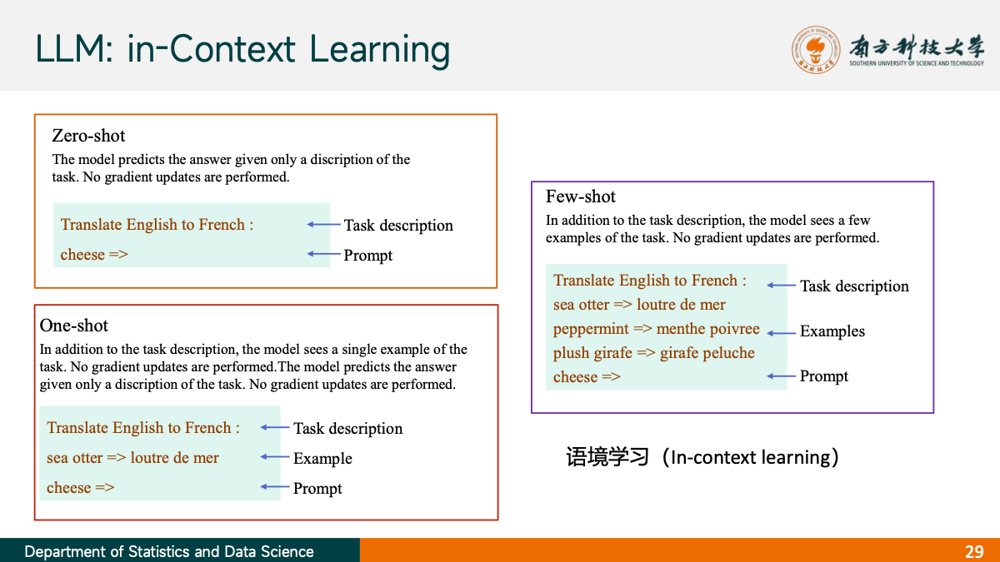

三个框对应三种设定，共同点是 **No gradient updates are performed**（不做任何梯度更新）——这是理解 in-context learning 的关键。

**🖼 逐元素图解**

| 设定 | 提示内容 | 图中示例 |
|---|---|---|
| **Zero-shot** | 只给任务描述 | `Translate English to French :` ← Task description<br>`cheese =>` ← Prompt |
| **One-shot** | 任务描述 + **一个**示例 | `Translate English to French :`<br>`sea otter => loutre de mer` ← Example<br>`cheese =>` |
| **Few-shot** | 任务描述 + **若干**示例 | `Translate English to French :`<br>`sea otter => loutre de mer`<br>`peppermint => menthe poivree`<br>`plush girafe => girafe peluche` ← Examples<br>`cheese =>` |

右下角标注中文译名：**语境学习（In-context learning）**。

这件事为什么反直觉？因为在传统机器学习里，「学习」一定意味着**改参数**。而这里模型权重一个字节都没动，仅仅因为上下文里多了几个例子，表现就显著变好。

可以这样理解：预训练时模型见过海量「列举若干同类例子，然后继续同样模式」的文本（词汇表、对照表、问答列表……）。所以当上下文呈现出这种模式时，模型会自然地**沿着模式续写**。给出的示例不是在「教会」它翻译——它早就会了——而是在**告诉它现在要执行的是哪个任务、输出格式是什么**。

> **💡 和 P17 对照着看**
>
> P17 的微调范式：每个任务改一次参数，存一份模型。
> P29 的上下文学习：参数永远不动，换提示就换任务。
>
> **这就是 P17 那个「10 个任务要存 3.5 TB」困境的解**。上下文学习让「一个模型服务所有任务」在工程上成为可能。

> **⚠️ 示例的作用常被高估**
>
> 有研究发现，即使把 few-shot 示例里的标签**随机打乱**（把正面评论标成负面），模型表现下降也有限。这说明示例主要传达的是**任务格式与输出空间**，而不是输入输出的正确映射。写提示时，格式的一致性往往比示例内容的正确性更重要。

#### P30　涌现能力

*LLM: Emergent Abilities · [2206.07682]*

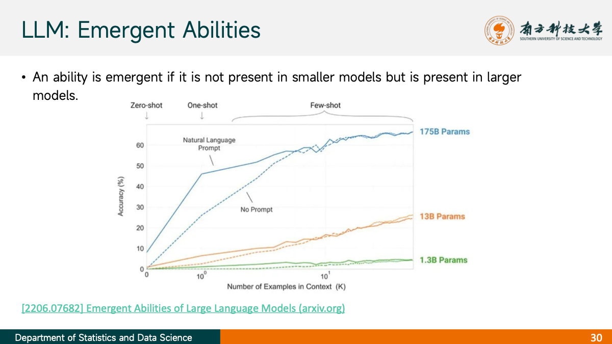

定义：**An ability is emergent if it is not present in smaller models but is present in larger models.**（一种能力如果在小模型上不存在、在大模型上存在，就称为涌现能力。）

**🖼 逐元素图解**

横轴是上下文中的示例数量（0 → 10¹，顶部标注 Zero-shot / One-shot / Few-shot 三段），纵轴是准确率（%）。三条颜色代表三种规模：

| 曲线 | 规模 | 表现 |
|---|---|---|
| 蓝色 | **175B** | Zero-shot 就有约 10%，One-shot 跳到 45%，Few-shot 继续爬到 65% 左右 |
| 橙色 | **13B** | 全程缓慢线性上升，最终约 25% |
| 绿色 | **1.3B** | 几乎贴着底部，示例再多也没起色 |

每种规模还有实线/虚线两条：实线是 **Natural Language Prompt**（带自然语言任务描述），虚线是 **No Prompt**（不带描述）。

这张图有三个层次的信息，依次递进：

1. **规模决定能否利用示例。** 1.3B 模型给再多例子也学不会——它不是「学得慢」，是**根本没有这个能力**。能力的出现是不连续的。
2. **任务描述的价值随规模放大。** 看 175B 那对曲线：实线在示例很少时远高于虚线（One-shot 处 45% vs 约 27%），但随示例增多两条逐渐合拢。说明**自然语言描述和示例是可以互相替代的信息来源**——模型足够大时，「告诉它做什么」和「示范给它看」效果趋同。而 1.3B 的两条线几乎重合，说明它连任务描述都读不懂。
3. **175B 的 Zero-shot 已经超过 1.3B 的 Few-shot 上限。** 规模带来的增益远大于提示技巧带来的增益。

> **⚠️ 「涌现」是个有争议的概念**
>
> 有工作（Schaeffer et al., *Are Emergent Abilities a Mirage?*）指出，所谓涌现很大程度上是**评测指标选择造成的错觉**：如果用「完全匹配」这种全有全无的指标，能力看起来是突然出现的；换成连续指标（比如逐 token 的对数似然），曲线就变得平滑。
>
> 考试按课件定义答即可，但要知道这个概念在学术上尚未定论。

#### P31　思维链：在答案前面加「想」

*Chain-of-Thought (CoT)*

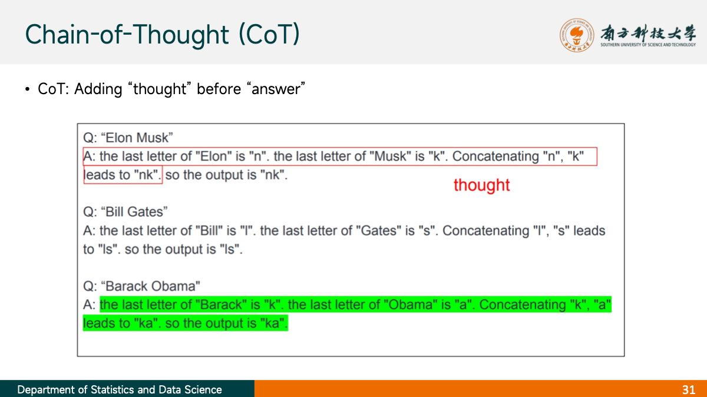

一句话概括：**CoT: Adding "thought" before "answer"**（在答案之前加入「思考」）。

**🖼 逐元素图解**

任务是「取姓和名的最后一个字母拼起来」。三个示例：

```
Q: "Elon Musk"
A: the last letter of "Elon" is "n". the last letter of "Musk" is "k".
   Concatenating "n", "k" leads to "nk". so the output is "nk".
   └────────────────── 红框标注：thought ──────────────────┘

Q: "Bill Gates"
A: the last letter of "Bill" is "l". the last letter of "Gates" is "s".
   Concatenating "l", "s" leads to "ls". so the output is "ls".

Q: "Barack Obama"
A: 绿色高亮 ── the last letter of "Barack" is "k". the last letter of
   "Obama" is "a". Concatenating "k", "a" leads to "ka". so the output is "ka".
```

红框圈出的是**示例里的思考过程**，绿色高亮的是**模型自己生成的**——它模仿了示例的推理格式。

这个任务选得很妙。它对人来说毫无难度，但对语言模型**出奇地难**，原因在分词：`Musk` 可能被切成一个完整 token，模型看不到组成它的字符。要取「最后一个字母」，模型必须先把词拆开——而这恰恰是它不擅长的。

CoT 的作用是把这个隐式操作**变成显式的文字**。写出 "the last letter of Musk is k" 之后，字母 `k` 就成了上下文里一个真实存在的 token，后面拼接时可以直接引用它。

> **💡 CoT 为什么有效：两种解释**
>
> 1. **算力视角**。Transformer 对每个 token 的计算量是固定的，一步算不完的问题，一步就是算不出来。生成中间步骤等于**让模型在更多 token 上分摊计算**，相当于把固定深度的网络展开成了更长的计算链。
> 2. **工作记忆视角**。模型没有可读写的暂存器，唯一能存中间结果的地方就是**已生成的上下文**。写出 "n" 和 "k"，就等于把它们记在了草稿纸上。
>
> 两种解释指向同一个结论：**CoT 买到的是计算深度，而不是知识**。模型不会因为 CoT 而知道它本来不知道的事实。

#### P32　CoT 的三个要点

*Chain-of-Thought (CoT) · Teach Language Models to Reason by Denny Zhou*

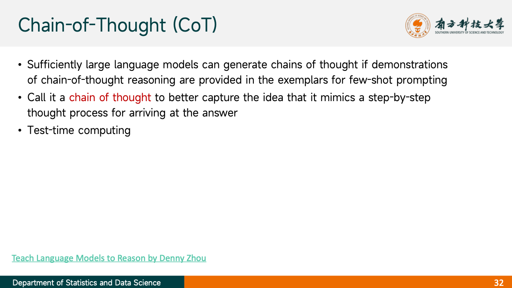

- **Sufficiently large** language models can generate chains of thought if demonstrations of chain-of-thought reasoning are provided in the exemplars for few-shot prompting（足够大的模型，在 few-shot 示例中给出思维链示范后，就能自己生成思维链）
- Call it a **chain of thought** to better capture the idea that it mimics a **step-by-step thought process** for arriving at the answer
- **Test-time computing**（测试时计算）

三个词，每个都指向一个重要含义：

- **Sufficiently large** ——和 P30 是同一件事。CoT 本身就是一种涌现能力，小模型即使给了思维链示范也学不会，甚至会因为生成错误的推理链而**比直接答还差**。
- **Mimics** ——用的是「模仿」，不是「执行」。模型生成的是**看起来像推理过程的文本**，它未必真的按这个逻辑得出答案。研究发现模型有时会给出错误的推理链却得到正确答案，或反之。这提醒我们：**不能把 CoT 输出当作模型内部真实思考过程的忠实记录**。
- **Test-time computing** ——这个词把 CoT 归入了一个更大的框架：**在推理阶段多花算力换取效果**。这正是 P7 底排那个 `+think` 的起点，也是 o1/o3 一类推理模型的思想源头。区别在于：CoT 靠提示诱导，推理模型则是把「先想再答」训进模型里。

#### P33　指令微调要解决什么

*Instruction Tuning*

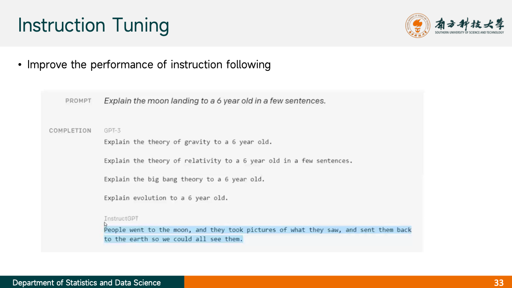

目标一句话：**Improve the performance of instruction following**（提升指令遵循能力）。

下面的对比是全讲最有说服力的例子之一：

```
PROMPT:  Explain the moon landing to a 6 year old in a few sentences.
         （用几句话向一个六岁小孩解释登月）

GPT-3:   Explain the theory of gravity to a 6 year old.
         Explain the theory of relativity to a 6 year old in a few sentences.
         Explain the big bang theory to a 6 year old.
         Explain evolution to a 6 year old.

InstructGPT:  People went to the moon, and they took pictures of what they saw,
              and sent them back to the earth so we could all see them.
```

**GPT-3 的输出不是「错」的，而是「不对路」的。** 它在做它被训练去做的事——续写。在训练语料里，这样一行句子最可能出现在什么地方？一份「给孩子解释科学概念」的题目清单里。所以它续写出了更多同类题目。从下一词预测的角度看，这个输出完美合理。

问题在于**用户的意图是让它执行这句话，而不是续写这句话**。预训练目标里没有任何一项告诉模型「遇到祈使句要去执行」。

InstructGPT 的回答则真的用六岁小孩能懂的话解释了登月（"People went to the moon, and they took pictures…"）。

这就是指令微调的全部意义：**它不教模型新知识，只教模型「指令是用来执行的」这个约定**。模型早就知道登月是怎么回事——P33 证明的是它「不肯说」，而不是「不知道」。

> **💡 一个常见误解**
>
> 「指令微调让模型变聪明了」——不对。指令微调用的数据量相比预训练小几个数量级（通常几万到几百万条 vs 几万亿 token），不可能注入新知识。它改变的是**输出的行为模式**。有研究把这称为「表层对齐假说」（Superficial Alignment Hypothesis）：知识全部来自预训练，对齐只是挑选了一种呈现方式。

#### P34　指令数据怎么构造

*Instruction Tuning · High quality and diverse instruction data*

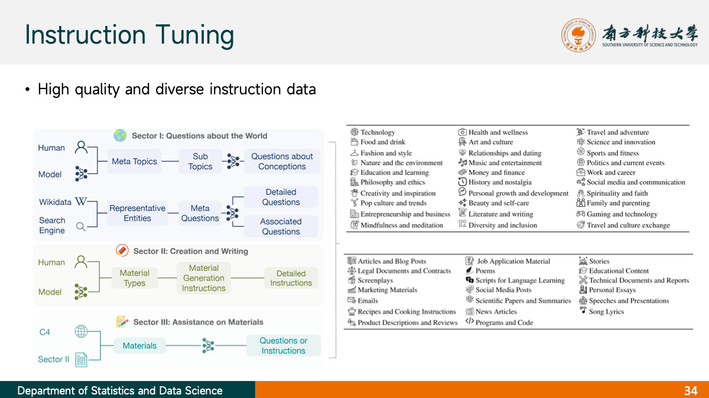

左侧是三个「扇区」（Sector），代表三种构造指令数据的路径：

**🖼 逐元素图解**

- **Sector I: Questions about the World**（关于世界的问题）
  - 上路：`Human` / `Model` → `Meta Topics`（元主题）→ `Sub Topics`（子主题）→ `Questions about Conceptions`（概念性问题）
  - 下路：`Wikidata` / `Search Engine` → `Representative Entities`（代表性实体）→ `Meta Questions`（元问题）→ `Detailed Questions` / `Associated Questions`
- **Sector II: Creation and Writing**（创作与写作）
  - `Human` / `Model` → `Material Types`（材料类型）→ `Material Generation Instructions` → `Detailed Instructions`
- **Sector III: Assistance on Materials**（基于材料的协助）
  - `C4`（网页语料）/ `Sector II` 的产出 → `Materials` → `Questions or Instructions`

右侧列出覆盖的主题清单，上半部分是知识领域（Technology、Health and wellness、Travel and adventure、Food and drink、Art and culture、Science and innovation、Fashion and style、Relationships and dating、Sports and fitness、Nature and the environment、Music and entertainment、Politics and current events、Education and learning、Money and finance、Work and career、Philosophy and ethics、History and nostalgia、Social media and communication、Creativity and inspiration、Personal growth and development、Spirituality and faith、Pop culture and trends、Beauty and self-care、Family and parenting、Entrepreneurship and business、Literature and writing、Gaming and technology、Mindfulness and meditation、Diversity and inclusion、Travel and culture exchange）；下半部分是文体类型（Articles and Blog Posts、Job Application Material、Stories、Legal Documents and Contracts、Poems、Educational Content、Screenplays、Scripts for Language Learning、Technical Documents and Reports、Marketing Materials、Social Media Posts、Personal Essays、Emails、Scientific Papers and Summaries、Speeches and Presentations、Recipes and Cooking Instructions、News Articles、Song Lyrics、Product Descriptions and Reviews、Programs and Code）。

**三个扇区对应三类不同形态的指令**，这个分类本身值得记：

| 扇区 | 输入形态 | 典型指令 |
|---|---|---|
| I 世界知识 | 只有问题 | "光合作用是怎么回事？" |
| II 创作写作 | 只有要求 | "写一首关于秋天的诗" |
| III 材料协助 | **问题 + 一段材料** | "总结下面这篇文章" |

第三类最容易被忽略，但在实际使用中占比很高——总结、改写、基于文档问答，全都属于这一类。它的构造方式也最巧妙：**从 C4 语料里直接取现成材料，再让模型围绕材料生成问题**，成本远低于从零撰写。

那张主题清单的存在本身就说明了问题：**多样性不是自然产生的，是被刻意规划出来的**。如果放任标注者自由发挥，数据会严重集中在少数几个熟悉领域。先列出主题矩阵再按格子填充，是保证覆盖面的工程手段。

#### P35　RLHF：三个组件

*RLHF · Reinforcement Learning from Human Feedback*

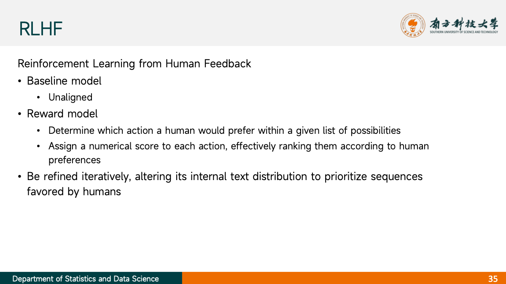

- **Baseline model**（基线模型）
  - Unaligned（未对齐的）
- **Reward model**（奖励模型）
  - Determine which action a human would prefer within a given list of possibilities（在给定的若干候选中判断人类会偏好哪一个）
  - Assign a numerical score to each action, effectively ranking them according to human preferences（给每个候选打一个数值分，按人类偏好排序）
- Be refined iteratively, altering its internal text distribution to prioritize sequences favored by humans（迭代地精调，改变模型的内部文本分布，使其偏向人类喜欢的序列）

为什么做完指令微调还需要 RLHF？因为**指令微调只能教「照着示范做」，教不了「做得好」**。

具体来说，指令微调的数据是「提示 → 标准答案」，训练时让模型去拟合那个标准答案。但对于开放性问题，**好答案不止一个**，也没法写出唯一的标准答案。「这个回答有没有帮助」「语气是否恰当」「会不会让人不适」这些性质，写不成监督标签。

RLHF 换了个思路：**不要求人写出好答案，只要求人在两个答案里选一个**。判断比创作容易得多，标注者不必是领域专家，成本大幅下降。然后用这些成对偏好训练一个奖励模型，让它学会「人会更喜欢哪个」，最后用强化学习让基线模型去最大化这个分数。

最后一句 *altering its internal text distribution* 很准确：RLHF 不是在教新东西，而是在**重新分配概率质量**——把模型本来就会生成的那些输出里，人类偏好的那部分概率调高。

#### P36　偏好数据与奖励模型

*RLHF · Human preferences dataset*

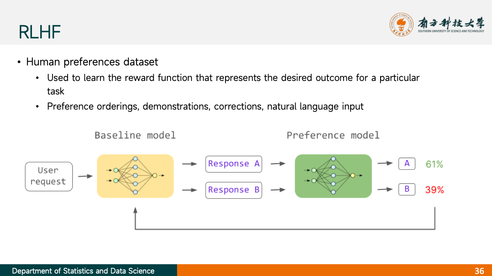

- **Human preferences dataset**（人类偏好数据集）
  - Used to learn the reward function that represents the desired outcome for a particular task（用于学习代表期望结果的奖励函数）
  - Preference orderings, demonstrations, corrections, natural language input（偏好排序、示范、纠正、自然语言输入）

**🖼 逐元素图解**

流程从左到右：

```
User request  →  [Baseline model]  →  Response A  ┐
   （用户请求）      黄色网络           Response B  ┴→ [Preference model] → A: 61%
                                                       绿色网络            B: 39%
                          ↑                                    │
                          └────────────────────────────────────┘
                                    反馈回环
```

- **Baseline model**（黄色）对同一个请求生成**两个不同的回答** A 和 B。
- **Preference model**（绿色，即奖励模型）读入两个回答，输出偏好概率：A 占 61%，B 占 39%。
- 底部的箭头从 Preference model 绕回 Baseline model——这就是 RL 的更新回路：**用偏好分数作为奖励信号去更新基线模型**。

注意两个细节：

**第一，同一个模型生成两个不同回答**，靠的是采样随机性（温度采样）。这是 RLHF 数据的来源——不需要额外的数据源，模型自己产生候选。

**第二，输出是概率而不是绝对分数**（61% / 39% 而不是 8.2 分 / 5.1 分）。这是因为奖励模型通常用 Bradley–Terry 模型训练：给定一对回答，用

$$
P(y_A \succ y_B) = \sigma\!\big(r(y_A) - r(y_B)\big)
$$

拟合人类的成对选择，其中 $r(\cdot)$ 是奖励函数，$\sigma$ 是 sigmoid。**这里只有分数之差有意义，绝对值没有意义**——给所有回答的分数同时加上一个常数，模型完全等价。这也是为什么图里给的是相对百分比。

> **⚠️ 奖励模型是会被「骗」的**
>
> 奖励模型只是对人类偏好的一个近似。当基线模型被训练去最大化它的分数时，会逐渐找到那些**奖励模型给高分、但人类实际并不喜欢**的输出——比如冗长、堆砌礼貌用语、过度使用列表格式。这叫**奖励攻破**（reward hacking）。
>
> 标准对策是在目标里加 KL 惩罚项，限制新策略不要偏离原模型太远（这正是 P12 里 RLHF 那条线末尾 *Regularization KL-Divergence* 的作用）。

---

### 🖊 本模块练习（P29–P36）

1. ★ 上下文学习（in-context learning）不更新任何参数，为什么模型的表现会变好？

<details><summary>解析</summary>

因为示例改变的不是模型，而是**模型所处的条件分布**。

预训练时模型见过海量「先列举若干同类条目、再继续同样模式」的文本。当提示里出现 `sea otter => loutre de mer` 这样的几行，上下文就落进了这个熟悉的模式里，模型自然地沿着模式续写。

示例的作用是**定位任务和固定输出格式**，而不是传授翻译能力——翻译能力来自预训练。可以把它理解为：模型内部有很多种「可能的行为模式」，提示的作用是从中选出一种。

</details>

2. ★ 为什么 P31 那个「取首末字母拼接」的任务对模型特别难？CoT 是怎么化解的？

<details><summary>解析</summary>

**难在分词。** `Musk` 很可能是词表里的一个完整 token，模型的输入是这个 token 的 embedding，**它看不到组成这个词的单个字符**。要取最后一个字母，模型得先在内部把这个 token「拆开」，而这个操作在它的表示里既不自然也不精确。

**CoT 的化解方式是把隐式操作显式化。** 一旦模型写出 "the last letter of Musk is k"，字母 `k` 就作为一个独立 token 出现在上下文里了。后面做拼接时，它只需要从上下文里复制这两个字符——这是注意力机制最擅长的事。

一句话：**CoT 把「在内部算」变成了「写在草稿纸上再读回来」**。

</details>

3. 对比 P33 里 GPT-3 和 InstructGPT 的输出。GPT-3 的回答算不算「错误」？

<details><summary>解析</summary>

**从它的训练目标看完全不算错。** GPT-3 被训练来最大化 $p(\text{下一词} \mid \text{上文})$。给定 "Explain the moon landing to a 6 year old in a few sentences."，在真实语料里这行字最可能出现在哪？一份「给孩子解释科学概念」的题目清单里。所以续写出更多同类题目，是对训练目标的正确响应。

**问题出在目标和意图的错配。** 用户想让它**执行**这句话，而预训练目标里没有任何一项建立「祈使句 → 执行」的约定。

这正说明指令微调补的是什么：不是知识，不是能力，而是**一个行为约定**。

</details>

4. 已经做了指令微调，为什么还需要 RLHF？

<details><summary>解析</summary>

因为指令微调是**监督学习**，需要「唯一正确答案」，而开放性任务没有唯一答案。

「写一封得体的道歉邮件」有无数种好写法，没法写出标准答案让模型拟合。而「有用性」「无害性」「语气是否恰当」这些性质，更是无法编码成监督标签。

RLHF 绕开了这个困难：**不要求人写出好答案，只要求人在两个答案之间选一个**。这有两个好处——判断比创作容易得多；标注者不必是领域专家。有了成对偏好就能训奖励模型，进而用 RL 优化。

一句话总结：**指令微调教「格式」，RLHF 教「好坏」**。

</details>

5. ★ P36 的偏好模型输出 A: 61% / B: 39% 而不是绝对分数，为什么？

<details><summary>解析</summary>

因为奖励模型通常按 Bradley–Terry 模型训练，目标是拟合成对比较：

$$
P(y_A \succ y_B) = \sigma(r(y_A) - r(y_B))
$$

训练信号只来自**成对的相对偏好**（人只说「A 比 B 好」，不会说「A 值 8.2 分」）。因此 $r(\cdot)$ 只有**差值**被约束，绝对值是不可辨识的——给所有输出的 $r$ 同时加一个常数 $c$，所有预测概率完全不变。

所以报告相对概率是诚实的做法。这也提醒：**不能跨不同的奖励模型比较分数**，也不能把奖励分数当作输出质量的绝对度量。

</details>

6. 什么是奖励攻破（reward hacking）？为什么 RLHF 要加 KL 惩罚？

<details><summary>解析</summary>

**奖励攻破**指策略模型找到了「奖励模型给高分但人类并不喜欢」的输出模式。常见表现：回答越写越长、无意义地堆砌礼貌用语、滥用 markdown 列表、反复强调自己有多谨慎。

根源在于奖励模型只是人类偏好的**有限近似**。它在标注数据的分布上拟合得不错，但一旦策略模型开始朝着最大化它的方向优化，就会走到标注数据覆盖不到的区域——在那里，奖励模型的判断不再可靠，却仍然会给出高分。这是 Goodhart 定律的典型体现：**一旦某个指标成为优化目标，它就不再是好指标**。

**KL 惩罚**在目标里加一项 $-\beta\, \mathrm{KL}(\pi_\theta \,\|\, \pi_{\text{ref}})$，约束新策略不要偏离原始模型太远。这样模型只能在原分布附近做调整，很难跑到奖励模型失效的区域去。$\beta$ 控制强度：太小则防不住攻破，太大则学不到东西。

</details>

---
`Part 5 · P37–P44`

## 五、Alignment：RLHF 三步走与价值对齐

P35、P36 讲了 RLHF 的组件和思想，这八页把它拆成可执行的三个步骤，给出完整的损失函数和工程实现图，最后落到「对齐到什么」这个价值问题上。

#### P37　RLHF 第一步：收集示范数据，训练监督策略

*RLHF · Step 1: Collect demonstration data and train a supervised policy*

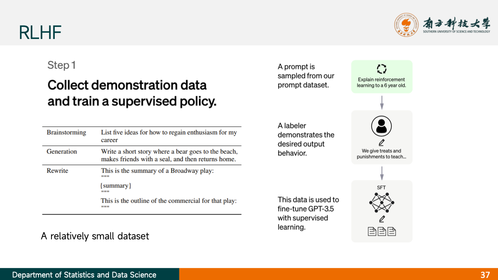

**🖼 逐元素图解**

右侧三格是流程：

1. **A prompt is sampled from our prompt dataset.**（从提示数据集里采样一条提示）——例子是 `Explain reinforcement learning to a 6 year old.`
2. **A labeler demonstrates the desired output behavior.**（标注者示范期望的输出）——例子是 `We give treats and punishments to teach...`
3. **This data is used to fine-tune GPT-3.5 with supervised learning.**（用这些数据对 GPT-3.5 做监督微调）——图标标注 **SFT**

左侧表格是提示数据集的三类样例：

| 类型 | 示例 |
|---|---|
| **Brainstorming** | List five ideas for how to regain enthusiasm for my career |
| **Generation** | Write a short story where a bear goes to the beach, makes friends with a seal, and then returns home. |
| **Rewrite** | This is the summary of a Broadway play: """{summary}""" This is the outline of the commercial for that play: """ |

左下角一行小字：**A relatively small dataset**（一个相对较小的数据集）。

这一步就是 P33–P34 讲的指令微调（SFT），在 RLHF 的语境下它是**第一阶段**而不是独立的方法。要注意两点：

**第一，这里标注者要「写答案」，成本很高。** 这正是为什么这个数据集必须「相对小」——让人为几万条提示逐一撰写高质量回答，已经是很大的投入。后面两步之所以改用「排序」而不是「撰写」，就是为了绕开这个瓶颈。

**第二，Rewrite 那个例子里的 `"""` 值得注意。** 它用三引号把材料框起来，末尾留一个开口让模型续写。这是典型的 P34 Sector III「基于材料的协助」类指令，**提示的结构本身在引导输出格式**。

#### P38　RLHF 第二步：收集比较数据，训练奖励模型

*RLHF · Step 2: Collect comparison data and train a reward model*

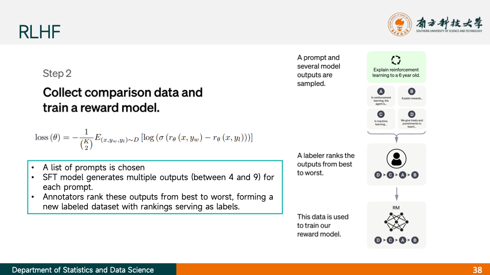

损失函数：

$$
\text{loss}(\theta) = -\frac{1}{\binom{K}{2}}\, E_{(x,\,y_w,\,y_l)\sim D}\Big[\log\big(\sigma\big(r_\theta(x, y_w) - r_\theta(x, y_l)\big)\big)\Big]
$$

蓝框里的三条说明：

- A list of prompts is chosen（选定一批提示）
- SFT model generates **multiple outputs (between 4 and 9)** for each prompt（SFT 模型为每条提示生成 4–9 个输出）
- Annotators **rank** these outputs from best to worst, forming a new labeled dataset with rankings serving as labels（标注者把输出从好到坏排序，排序即标签）

**🖼 逐元素图解**

右侧流程：提示 `Explain reinforcement learning to a 6 year old.` → 采样出四个回答 A、B、C、D → 标注者排序得到 `D > C > A > B` → 用这个排序训练 **RM**（Reward Model）。

**把损失函数逐项拆开**：

| 符号 | 含义 |
|---|---|
| $x$ | 提示 |
| $y_w$ | 赢的那个回答（winner） |
| $y_l$ | 输的那个回答（loser） |
| $r_\theta(x,y)$ | 奖励模型给出的标量分数 |
| $\sigma$ | sigmoid 函数 |
| $\binom{K}{2}$ | $K$ 个回答能组成的**成对组合数** |

整个式子在说：**让赢家的分数减输家的分数尽可能大**。$\sigma(r_w - r_l)$ 是「模型认为 $y_w$ 更好」的概率，取对数再取负就是交叉熵——这正是 P36 提到的 Bradley–Terry 模型。

> **💡 为什么每条提示要生成 4–9 个，而不是 2 个**
>
> 关键在 $\binom{K}{2}$ 这个组合数。标注者排一次序，能产生的偏好对数量是：
>
> - $K=2$：$\binom{2}{2}=1$ 对
> - $K=4$：$\binom{4}{2}=6$ 对
> - $K=9$：$\binom{9}{2}=36$ 对
>
> **标注成本只增加了几倍，训练样本却增加了几十倍。** 排 9 个的工作量远不到排 2 个的 36 倍，所以这是极划算的做法。
>
> 除以 $\binom{K}{2}$ 是为了做归一化——否则 $K$ 大的样本会在损失里占据过大权重。

> **⚠️ 这些偏好对不是独立的**
>
> 同一次排序产生的 36 个偏好对来自同一个标注者、同一条提示，高度相关。如果把它们当独立样本放进不同 batch，会造成过拟合。原论文的做法是**把同一个提示的所有对放进同一个 batch**，这也是除以 $\binom{K}{2}$ 的另一个理由。

#### P39　RLHF 第三步：用 PPO 优化策略

*RLHF · Step 3: Optimize a policy against the reward model using the PPO reinforcement learning algorithm*

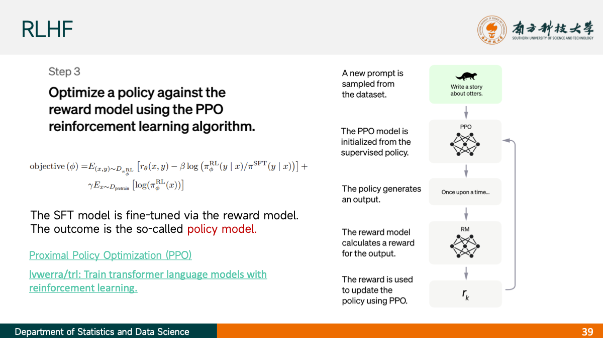

目标函数：

$$
\text{objective}(\phi) = E_{(x,y)\sim D_{\pi_\phi^{\text{RL}}}}\Big[r_\theta(x,y) - \beta \log\big(\pi_\phi^{\text{RL}}(y\mid x)\,/\,\pi^{\text{SFT}}(y\mid x)\big)\Big] + \gamma\, E_{x\sim D_{\text{pretrain}}}\Big[\log\big(\pi_\phi^{\text{RL}}(x)\big)\Big]
$$

说明文字：**The SFT model is fine-tuned via the reward model. The outcome is the so-called <span style="color:#c00">policy model</span>.**

**🖼 逐元素图解**

右侧五格：新提示 `Write a story about otters.` → **PPO**（从监督策略初始化）→ 策略生成输出 `Once upon a time...` → **RM** 给输出打分 → 奖励 $r_k$ 用于更新策略（箭头绕回 PPO）。

**目标函数的三项，各管一件事**：

| 项 | 数学形式 | 作用 |
|---|---|---|
| **奖励项** | $r_\theta(x,y)$ | 让输出在奖励模型眼里得分更高——**这是优化的主目标** |
| **KL 惩罚项** | $-\beta \log\frac{\pi^{\text{RL}}_\phi}{\pi^{\text{SFT}}}$ | 惩罚新策略偏离 SFT 模型——**防止奖励攻破** |
| **预训练项** | $+\gamma\, E_{x\sim D_{\text{pretrain}}}[\log \pi^{\text{RL}}_\phi(x)]$ | 在预训练数据上保持语言建模能力——**防止对齐税** |

第二项就是 P36 最后提到的 KL 惩罚。注意 $\log\frac{\pi^{\text{RL}}}{\pi^{\text{SFT}}}$ 正是 KL 散度的逐样本估计：新策略在某个输出上的概率比 SFT 高得越多，惩罚越大。$\beta$ 越大，模型越「不敢乱动」。

第三项常被忽略但很重要。纯做 RLHF 会让模型在通用 NLP 基准上退步——这叫**对齐税**（alignment tax）。加上这一项，相当于在对齐的同时继续做一点预训练，把语言能力拉住。带这一项的变体在原论文里叫 **PPO-ptx**。

> **⚠️ 注意 $E_{(x,y)\sim D_{\pi_\phi^{\text{RL}}}}$ 这个下标**
>
> 期望是对**当前策略自己生成的样本**取的，不是对固定数据集取的。这是在线强化学习和监督学习的根本区别：**训练数据随着模型更新而不断变化**。这也是 RLHF 工程上难做的原因——训练循环里必须反复调用模型做生成。

#### P40　三步之后：迭代

*RLHF*

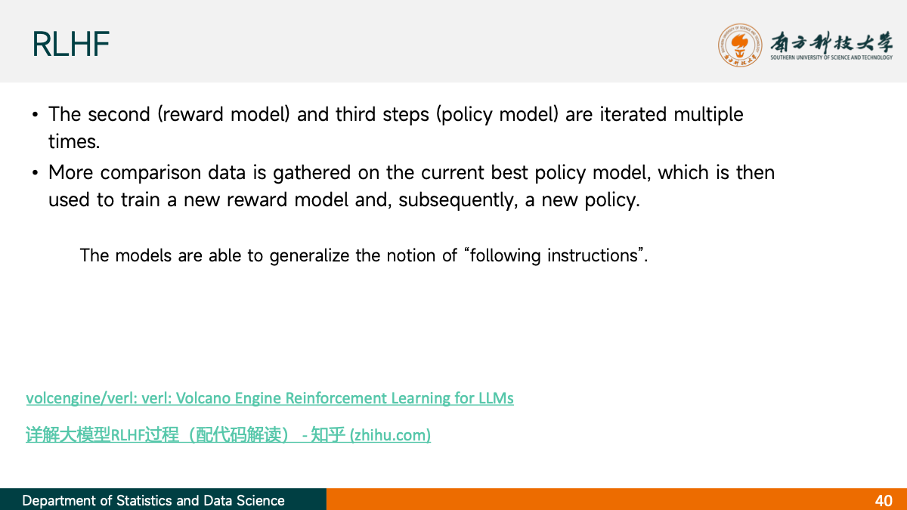

- The second (reward model) and third steps (policy model) are **iterated multiple times**.（第二步和第三步要反复迭代多次）
- More comparison data is gathered on the **current best policy model**, which is then used to train a new reward model and, subsequently, a new policy.（在当前最好的策略模型上收集更多比较数据，用来训练新的奖励模型，进而训练新的策略）

> The models are able to generalize the notion of "following instructions".（模型能够把「遵循指令」这个概念泛化出去。）

为什么必须迭代？因为**奖励模型是在旧策略的输出分布上训练的**。

一旦策略被更新，它生成的输出就漂到了新的分布上，而奖励模型在那片区域没见过数据，判断不再可靠——这正是奖励攻破的温床。解决办法只能是：用新策略再生成一批输出，重新标注，重新训奖励模型。

所以 RLHF 不是一条流水线，而是一个**螺旋**：

```
SFT → 标注偏好 → 训 RM → PPO 优化 → 新策略
         ↑                              │
         └──────── 再标注 ──────────────┘
```

最后那句话点出了整个 RLHF 最有价值的产出：模型学到的不是「这 N 条指令的正确答案」，而是**「遵循指令」这个抽象概念本身**——所以它能处理训练中从未出现过的新指令。这和 P20 里 T0 的零样本泛化是同一种现象，只是层次更高。

#### P41　RLHF 的完整工程实现

*RLHF · [2307.04964] Secrets of RLHF in Large Language Models Part I: PPO*

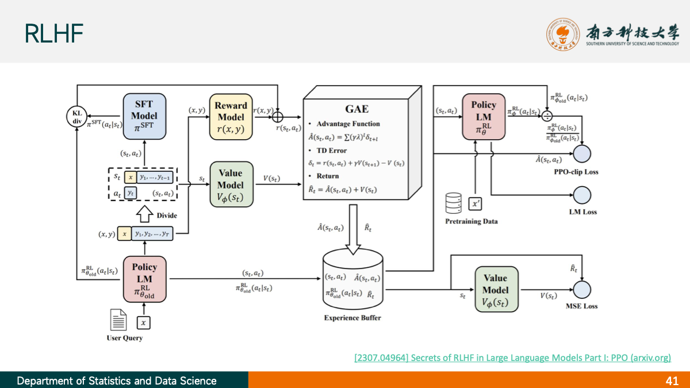

这是全讲最复杂的一张图，它把 P39 那个简洁的目标函数展开成了真实系统。

**🖼 逐元素图解**

图里一共有**四个模型**（这是理解 PPO 工程成本的关键）：

| 模型 | 图中颜色 | 作用 | 是否训练 |
|---|---|---|---|
| **SFT Model** $\pi^{\text{SFT}}$ | 蓝 | 参考策略，算 KL 用 | ❄️ 冻结 |
| **Reward Model** $r(x,y)$ | 黄 | 给完整回答打分 | ❄️ 冻结 |
| **Value Model** $V_\phi(s_t)$ | 绿 | 估计状态价值，算优势用 | 🔥 训练 |
| **Policy LM** $\pi^{\text{RL}}_\theta$ | 粉 | 要优化的主角 | 🔥 训练 |

数据流：

1. **User Query** $x$ 进入 `Policy LM` $\pi^{\text{RL}}_{\theta_{\text{old}}}$，生成完整回答 $(x, y_1 y_2 \ldots y_T)$。
2. 回答被 **Divide**（切分）成逐 token 的状态-动作对：状态 $s_t = (x, y_1,\ldots,y_{t-1})$，动作 $a_t = y_t$。
3. `Reward Model` 对完整回答给出 $r(x,y)$；`SFT Model` 给出 $\pi^{\text{SFT}}(a_t|s_t)$ 用于算 **KL div**。两者在 $\oplus$ 处合并成逐步奖励 $r(s_t, a_t)$。
4. `Value Model` 给出 $V(s_t)$。
5. **GAE** 模块（Generalized Advantage Estimation）计算：
   - Advantage Function：$\hat{A}(s_t,a_t) = \sum (\gamma\lambda)^l \delta_{t+l}$
   - TD Error：$\delta_t = r(s_t,a_t) + \gamma V(s_{t+1}) - V(s_t)$
   - Return：$\hat{R}_t = \hat{A}(s_t,a_t) + V(s_t)$
6. 结果存入 **Experience Buffer**（经验缓冲区）。
7. 从缓冲区取数据更新两个网络，产生三个损失：
   - **PPO-clip Loss**：用重要性比 $\frac{\pi^{\text{RL}}_\phi(a_t|s_t)}{\pi^{\text{RL}}_{\phi_{\text{old}}}(a_t|s_t)}$ 与优势 $\hat{A}$ 计算，更新 Policy LM
   - **LM Loss**：在 `Pretraining Data` $x'$ 上的语言建模损失（即 P39 目标函数的第三项）
   - **MSE Loss**：Value Model 拟合 $\hat{R}_t$

**这张图解释了为什么 PPO 做 RLHF 这么贵**：显存里同时要装四个模型，其中两个还要存优化器状态和梯度。对 70B 模型来说，这几乎是不可行的——**这正是 DPO 之所以流行的现实原因**（回看 P12，DPO 那条线直接跳过了奖励模型和 PPO）。

> **💡 为什么需要 Value Model**
>
> 奖励模型只对**完整回答**打一个分，但 PPO 要按 **token** 更新。中间那些 token 各自贡献了多少？这就需要价值函数来估计「从当前状态出发，未来期望能拿多少奖励」，进而算出每一步的优势 $\hat{A}$。
>
> GRPO（P12 最后一条）的核心改进正是**去掉 Value Model**：它对同一提示采样一组回答，用组内平均奖励作为基线来算相对优势，省下一整个网络。这在大模型上能省下可观的显存。

#### P42　预训练、微调与 RAG 怎么选

*Pretrain vs. Finetune vs. RAG*

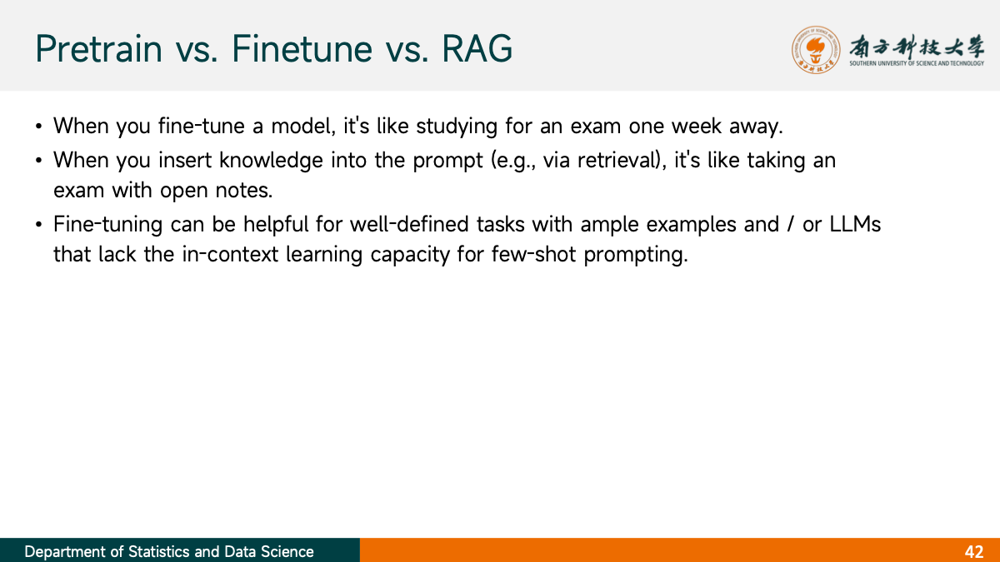

- When you **fine-tune** a model, it's like **studying for an exam one week away**.（微调像是为一周后的考试复习）
- When you **insert knowledge into the prompt** (e.g., via retrieval), it's like **taking an exam with open notes**.（把知识塞进提示，比如通过检索，像是开卷考试）
- Fine-tuning can be helpful for **well-defined tasks with ample examples** and/or LLMs that **lack the in-context learning capacity** for few-shot prompting.（微调适合定义清晰、样例充足的任务，或用于那些上下文学习能力不足的模型）

这个类比精准在哪里？

**复习（微调）**：知识被内化进参数，答题时不用查，反应快、消耗少。但**准备周期长**，而且考完之后想改内容就得重新复习一遍。对应到工程上：微调后推理成本低（不用塞长上下文），但更新知识必须重新训练。

**开卷（RAG）**：不需要提前准备，**翻到什么就能用什么**，资料更新了立刻生效。代价是答题时要花时间翻书——对应推理时上下文变长、延迟和成本上升，而且**翻错页就答错**（检索质量直接决定上限）。

实践中的选择原则：

| 需求 | 更适合 |
|---|---|
| 知识**频繁变动**（公司文档、新闻、商品库存） | **RAG** —— 重训一次的代价太高 |
| 需要**可溯源**（要能指出答案出自哪份文档） | **RAG** —— 微调后的知识无法追溯来源 |
| 改变**行为风格、输出格式**（固定 JSON 结构、特定语气） | **微调** —— 这类需求靠提示不稳定 |
| 领域**术语和表达方式**特殊（医学、法律） | **微调** —— 需要改变模型的表达分布 |
| 任务定义清晰、**样例充足** | **微调** —— 课件明确提到的场景 |

> **💡 两者常常是叠加使用的**
>
> 真实系统里经常是「微调 + RAG」：微调让模型学会这个领域的说话方式和输出格式，RAG 负责提供具体的、会变的事实。**微调管「怎么说」，RAG 管「说什么」。**

#### P43　对齐到什么：RICE 四原则

*Align with Human Values*

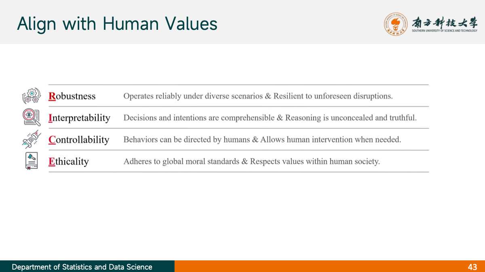

四个首字母标红，拼成 **RICE**：

| 原则 | 英文 | 课件原文 |
|---|---|---|
| **鲁棒性** | **R**obustness | Operates reliably under diverse scenarios & Resilient to unforeseen disruptions.（在各种场景下可靠运行，对未预见的干扰有韧性） |
| **可解释性** | **I**nterpretability | Decisions and intentions are comprehensible & Reasoning is unconcealed and truthful.（决策与意图可理解，推理过程不隐瞒、真实） |
| **可控性** | **C**ontrollability | Behaviors can be directed by humans & Allows human intervention when needed.（行为可由人类引导，必要时允许人类介入） |
| **合伦理性** | **E**thicality | Adheres to global moral standards & Respects values within human society.（遵守普遍道德标准，尊重人类社会的价值） |

前面几页讲的都是**怎么对齐**（RLHF 的机制），这一页问的是**对齐到什么**。

值得注意的是「可解释性」那条里的 *Reasoning is unconcealed and truthful*（推理不隐瞒且真实）。回想 P32 说 CoT 是 *mimics* 一个思考过程——**模型展示的推理链未必是它真实的决策依据**。这一条直接指向那个问题：我们希望模型给出的解释是真的，而不是事后编造的合理化说辞。这在学术上叫**忠实性**（faithfulness），目前远未解决。

「可控性」那条的 *Allows human intervention when needed* 同样微妙。一个被训练得极度「有用」的模型，可能会抗拒被打断或被纠正——因为完成任务的奖励更高。**可控性和有用性之间存在张力**，不是简单叠加就能同时满足的。

> **⚠️ RICE 不是可以同时最大化的四个指标**
>
> 它们彼此冲突：提高安全性（Ethicality）往往降低有用性——模型会拒绝更多本来无害的请求；提高可控性可能牺牲鲁棒性——留给人的干预接口也可能被攻击者利用。对齐的真正工作是**在这四者之间取平衡**，而不是把每一项拉满。

#### P44　对抗性探测与规则奖励模型

*Align with Human Values*

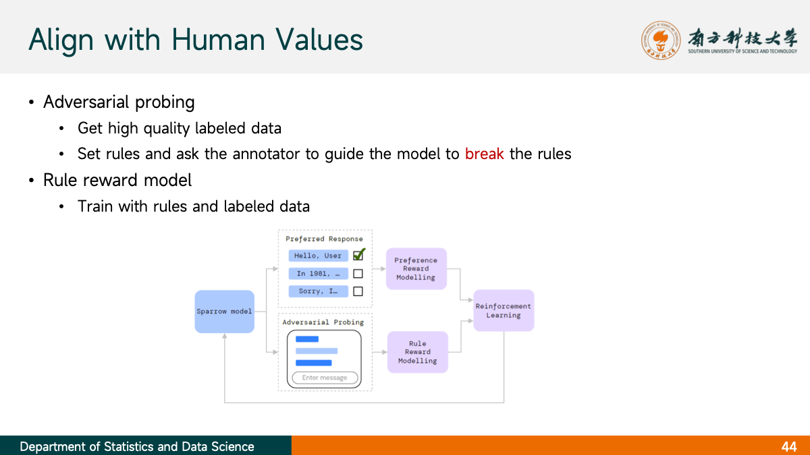

- **Adversarial probing**（对抗性探测）
  - Get high quality labeled data（获得高质量标注数据）
  - Set rules and ask the annotator to guide the model to <span style="color:#c00">**break**</span> the rules（设定规则，然后让标注者**引诱模型去违反**这些规则）
- **Rule reward model**（规则奖励模型）
  - Train with rules and labeled data（用规则和标注数据训练）

**🖼 逐元素图解**

这是 DeepMind Sparrow 的架构，**两条并行的数据采集路径，喂给两个不同的奖励模型**：

```
                  ┌─ Preferred Response ────────┐
                  │  ☑ Hello, User              │→ Preference Reward Modelling ─┐
[Sparrow model] ──┤  ☐ In 1981, …               │                               ├→ Reinforcement Learning
                  │  ☐ Sorry, I…                │                               │
                  └─────────────────────────────┘                               │
                  ┌─ Adversarial Probing ───────┐                               │
                  │  （标注者与模型对话，        │→ Rule Reward Modelling ───────┘
                  │    诱导它违规）              │
                  └─────────────────────────────┘
                              ↑                                                 │
                              └─────────────── 反馈回环 ────────────────────────┘
```

- **上路**：标注者从多个候选回答里勾选最好的（图中勾选了 `Hello, User`）→ 训练 **Preference Reward Model**。这就是 P36–P38 的常规做法。
- **下路**：标注者**主动攻击**——被告知规则（比如「不得提供医疗建议」），然后想办法把模型诱导到违规 → 这些数据训练 **Rule Reward Model**。
- 两个奖励模型的信号一起送进 **Reinforcement Learning**。

**为什么要分成两个奖励模型？** 因为这两件事的性质完全不同：

| | 偏好奖励模型 | 规则奖励模型 |
|---|---|---|
| 学什么 | 「哪个回答**更好**」 | 「这个回答**是否违规**」 |
| 输出 | 连续的相对分数 | 接近二值的判定 |
| 数据来源 | 正常使用中的候选比较 | 标注者刻意攻击得到的样本 |
| 对应 RICE | Robustness / 有用性 | Ethicality / 安全性 |

如果混在一个模型里训，**罕见但严重的违规样本会被大量普通偏好样本淹没**。分开建模，规则奖励模型就能专注在那些稀有的危险区域上。

对抗性探测这个做法本身也值得记：**想让模型在某种情况下表现好，最有效的数据是刻意制造出的失败案例**。正常使用中很难自然遇到边界情况，只能靠人主动去找。这就是今天所说的红队测试（red teaming）的雏形。

---

### 🖊 本模块练习（P37–P44）

1. ★ P38 里为什么每条提示要生成 4–9 个回答让标注者排序，而不是生成 2 个做二选一？

<details><summary>解析</summary>

因为一次排序能产生的偏好对数量是 $\binom{K}{2}$，随 $K$ **平方增长**，而标注成本只是**线性略增**。

- $K=2$：1 个偏好对
- $K=4$：6 个
- $K=9$：36 个

让标注者读 9 个回答排序，工作量远不到读 2 个的 36 倍（读第一个要理解提示，后面几个边际成本递减）。所以这是用少量额外标注换取数十倍训练样本的高效做法。

损失函数里除以 $\binom{K}{2}$ 是为了归一化，避免 $K$ 大的提示在总损失中占过大权重。

</details>

2. P39 目标函数有三项，分别防止什么问题？

<details><summary>解析</summary>

- **$r_\theta(x,y)$（奖励项）**：主目标，让输出更符合人类偏好。
- **$-\beta\log\frac{\pi^{\text{RL}}}{\pi^{\text{SFT}}}$（KL 惩罚）**：防止**奖励攻破**。限制策略不要偏离 SFT 模型太远，否则会跑到奖励模型判断失效的区域，产出「高分但人类不喜欢」的输出。
- **$+\gamma E_{x\sim D_{\text{pretrain}}}[\log\pi^{\text{RL}}(x)]$（预训练项）**：防止**对齐税**。纯 RLHF 会让模型在通用 NLP 基准上退步，这一项在预训练数据上继续做语言建模，把基础能力拉住。带这项的变体称为 PPO-ptx。

</details>

3. ★ P41 的 PPO 实现需要同时维护四个模型。分别是哪四个？哪些需要训练？GRPO 省掉了哪一个？

<details><summary>解析</summary>

四个模型：

| 模型 | 作用 | 训练？ |
|---|---|---|
| SFT Model | 参考策略，算 KL 惩罚 | 冻结 |
| Reward Model | 给完整回答打分 | 冻结 |
| Value Model | 估计状态价值，用于算优势 | **训练** |
| Policy LM | 被优化的主角 | **训练** |

显存压力极大——两个训练中的模型还要额外存梯度和优化器状态。

**GRPO 省掉的是 Value Model**。它的做法是对同一提示采样一组（group）回答，用**组内平均奖励**作为基线来计算相对优势，替代价值函数的估计。这样既省一个网络的显存，也避开了价值函数难训练的问题。

</details>

4. 为什么 RLHF 的第二步和第三步要反复迭代，不能训一次奖励模型就一直用？

<details><summary>解析</summary>

因为**奖励模型的可靠区域是有限的**。

它是在旧策略产生的输出分布上训练的，只在那片分布附近判断准确。一旦策略经过 PPO 更新，生成分布就漂移了，新输出落到奖励模型没见过的区域——那里它的打分不再可信，策略却会专门朝那个方向钻（奖励攻破）。

所以必须用**当前最好的策略**重新采样、重新标注、重新训练奖励模型，让它的可靠区域跟上策略的移动。RLHF 因此是一个螺旋上升的循环，而不是一条单向流水线。

</details>

5. ★ 一家公司的内部文档每周更新，员工要基于这些文档问答。该用微调还是 RAG？为什么？

<details><summary>解析</summary>

**用 RAG**，理由有三：

1. **更新频率**。文档每周变，微调意味着每周重训一次，成本和周期都不可接受；RAG 只需更新向量库，立刻生效。
2. **可溯源**。企业问答通常要求给出依据（「这条规定出自哪份文件第几节」）。RAG 天然能返回来源，微调后的知识融进了参数，无法追溯。
3. **权限控制**。不同员工能看的文档不同。RAG 可以在检索层做过滤；微调把所有文档揉进一套参数，无法按人区分权限——这一点在企业场景里往往是硬性要求。

用 P42 的类比：内容一直在变的考试，**只能开卷**。

（如果同时还希望回答遵循固定的公文格式，可以叠加一个轻量微调——微调管「怎么说」，RAG 管「说什么」。）

</details>

6. P44 为什么要专门设一个「规则奖励模型」，而不是把安全性也交给偏好奖励模型？

<details><summary>解析</summary>

因为两类信号的**统计性质和数据分布完全不同**。

偏好数据来自正常使用场景，绝大多数样本都是「两个都还行，选一个更好的」。违规样本在其中极其稀少——如果混在一起训练，**罕见但严重的违规会被海量普通样本淹没**，模型学不到清晰的边界。

而且两者要学的东西也不同：偏好是**连续的相对好坏**，违规判定接近**二值的是非**。用同一个标量输出同时表达这两种语义，会互相干扰。

分开之后：偏好模型专注「更好」，规则模型专注「越界没有」；规则模型的训练数据还能通过**对抗性探测**专门构造——让标注者主动去诱导模型违规，从而在稀有的危险区域获得密集的监督信号。

</details>

---
`Part 6 · P45–P51`

## 六、Future：效率、自我改进与具身

最后七页从「已经做成的」转向「还没做成的」。P45 是一组自测题，P46–P49 是四个前沿方向，P50 跳出技术谈影响。

#### P45　自测：LLM 训练的阶段与 RL 的位置

*Training LLMs*

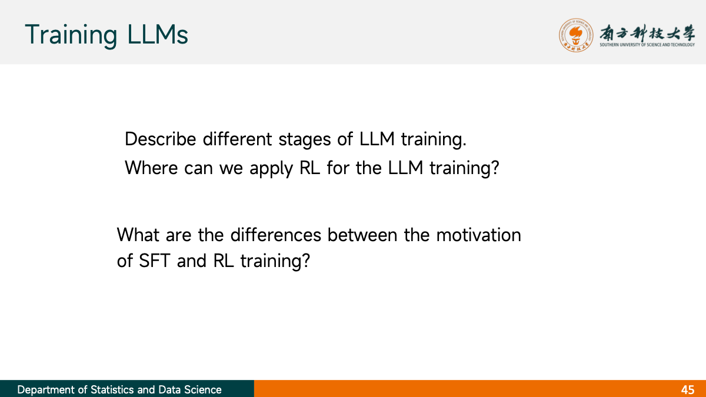

课件抛出三个问题：

> Describe different stages of LLM training.（描述 LLM 训练的不同阶段）
> Where can we apply RL for the LLM training?（RL 可以用在 LLM 训练的哪些环节？）
>
> What are the differences between the motivation of SFT and RL training?（SFT 与 RL 训练的动机有什么区别？）

这三问正好把前面五个模块串成一条线，答案分别在 P13、P12、P35。第三问尤其关键——**SFT 与 RL 的动机差别**，是本讲的核心分水岭：

| | SFT（监督微调） | RL（强化学习） |
|---|---|---|
| 数据形态 | 提示 → **标准答案** | 提示 → **若干候选的相对好坏** |
| 人的工作 | **写**出好答案 | **判断**哪个更好 |
| 能教什么 | 格式、风格、「该怎么做」 | 好坏、偏好、「做得好不好」 |
| 适用前提 | 存在唯一或接近唯一的正确答案 | 答案开放，只能比较不能写定 |
| 优化方式 | 最大化标准答案的似然 | 最大化奖励，同时约束不偏离太远 |
| 主要风险 | 模仿了标注者的平均水平，难以超越 | 奖励攻破；训练不稳定 |

最后一行值得展开：**SFT 的天花板是标注者的水平**——模型在模仿人写的答案，人写得多好，它最多学到多好。而 RL 只要求人能**分辨**好坏，而分辨能力通常强于创作能力（我读得出一首好诗，未必写得出）。这就是 RL 能把模型推到超出标注者写作水平的原因。

#### P46　高效 LLM 架构全景

*Efficient LLMs · arxiv.org/abs/2508.09834*

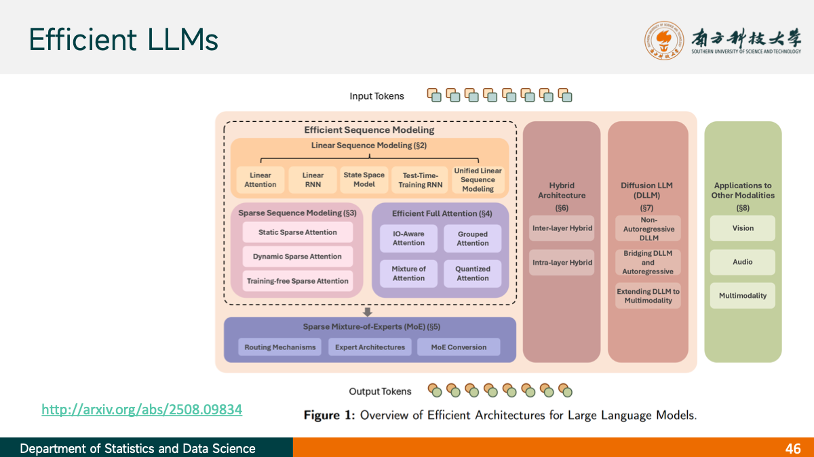

一张综述图，把「让 LLM 更高效」的所有路线分成六类（§ 号是原综述的章节）。

**🖼 逐元素图解**

输入 token 从顶部进、输出 token 从底部出，中间是分类体系：

- **Efficient Sequence Modeling**（高效序列建模，虚线框）
  - **Linear Sequence Modeling (§2)**：Linear Attention、Linear RNN、State Space Model、Test-Time-Training RNN、Unified Linear Sequence Modeling
  - **Sparse Sequence Modeling (§3)**：Static Sparse Attention、Dynamic Sparse Attention、Training-free Sparse Attention
  - **Efficient Full Attention (§4)**：IO-Aware Attention、Grouped Attention、Mixture of Attention、Quantized Attention
- **Sparse Mixture-of-Experts (§5)**：Routing Mechanisms、Expert Architectures、MoE Conversion
- **Hybrid Architecture (§6)**：Inter-layer Hybrid（层间混合）、Intra-layer Hybrid（层内混合）
- **Diffusion LLM (§7)**：Non-Autoregressive DLLM、Bridging DLLM and Autoregressive、Extending DLLM to Multimodality
- **Applications to Other Modalities (§8)**：Vision、Audio、Multimodality

这张图的组织逻辑是**按「动谁」分类**：

| 大类 | 改的是什么 | 代表 |
|---|---|---|
| Linear / Sparse Sequence Modeling | **注意力的计算复杂度** | Mamba、线性注意力、稀疏注意力 |
| Efficient Full Attention | **保持精确注意力，优化实现** | FlashAttention（IO-Aware）、GQA（Grouped） |
| Sparse MoE | **FFN 的激活方式** | 见 P16 |
| Hybrid | **把上面几种混着用** | Nemotron 3（见 P16） |
| Diffusion LLM | **生成范式本身** | 不再逐 token 自回归 |

注意 **Efficient Full Attention** 这一支和其它几支的性质不同：它**不改变数学结果**，只改变计算方式。FlashAttention 算出来的注意力和朴素实现完全一致，只是通过分块和减少显存读写让它更快。而线性注意力、稀疏注意力都是**近似**——用精度换速度。做选型时这个区别很重要：前者是纯赚，后者要权衡。

**Diffusion LLM** 是最激进的一支：抛弃「从左到右逐个生成」，改成像图像扩散模型那样**并行地逐步去噪出整段文本**。好处是生成可以并行、天然支持编辑与填空；难点是文本是离散的，扩散过程不如连续图像自然。

#### P47　自我改进的智能体

*Self-Improving Agent · arxiv.org/abs/2607.13104*

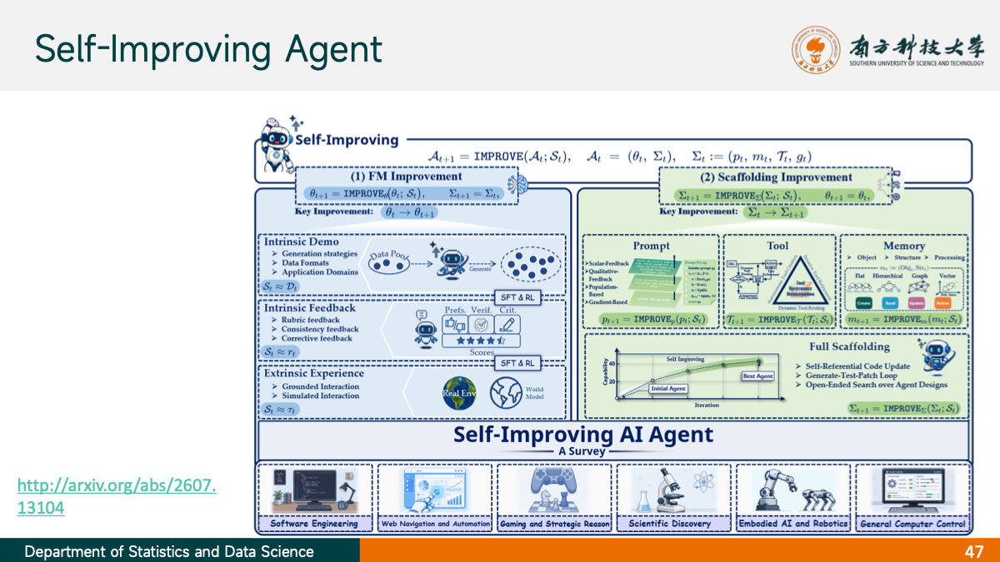

顶部的形式化定义是这张图的钥匙：

$$
\mathcal{A}_{t+1} = \texttt{IMPROVE}(\mathcal{A}_t;\, \mathcal{S}_t), \qquad
\mathcal{A}_t = (\theta_t,\, \Sigma_t), \qquad
\Sigma_t := (p_t,\, m_t,\, \mathcal{T}_t,\, g_t)
$$

**🖼 逐元素图解**

一个智能体 $\mathcal{A}_t$ 由两部分组成：

- $\theta_t$ —— **模型参数**
- $\Sigma_t$ —— **脚手架**（scaffolding），它又包含四项：$p_t$ 提示、$m_t$ 记忆、$\mathcal{T}_t$ 工具、$g_t$ 图/工作流

于是「自我改进」被清晰地切成两条互斥的路径：

| | **(1) FM Improvement**（基座模型改进，蓝色） | **(2) Scaffolding Improvement**（脚手架改进，绿色） |
|---|---|---|
| 公式 | $\theta_{t+1}=\texttt{IMPROVE}_\theta(\theta_t;\mathcal{S}_t),\ \Sigma_{t+1}=\Sigma_t$ | $\Sigma_{t+1}=\texttt{IMPROVE}_\Sigma(\Sigma_t;\mathcal{S}_t),\ \theta_{t+1}=\theta_t$ |
| 关键改进 | $\theta_t \to \theta_{t+1}$ —— **改参数** | $\Sigma_t \to \Sigma_{t+1}$ —— **改外围** |

蓝色区（改参数）的三种信号来源：

- **Intrinsic Demo**（内生示范，$\mathcal{S}_t \approx \mathcal{D}_t$）——自己生成数据（Generation strategies、Data Formats、Application Domains），从 Data Pool 出发生成新数据 → SFT & RL
- **Intrinsic Feedback**（内生反馈，$\mathcal{S}_t \approx r_t$）——自己给自己打分（Rubric feedback、Consistency feedback、Corrective feedback），产生 Prefs./Verif./Crit. 三类信号 → SFT & RL
- **Extrinsic Experience**（外部经验，$\mathcal{S}_t \approx \tau_t$）——从真实环境（Real Env）或世界模型（World Model）的交互中学（Grounded / Simulated Interaction）

绿色区（改外围）的四个抓手：

- **Prompt** —— $p_{t+1}=\texttt{IMPROVE}_p(p_t;\mathcal{S}_t)$，通过 Scalar-Feedback、Qualitative-Feedback、Population-Based、Gradient-Based 等方式自动优化提示
- **Tool** —— $\mathcal{T}_{t+1}=\texttt{IMPROVE}_\mathcal{T}(\mathcal{T}_t;\mathcal{S}_t)$，自己造工具、改工具
- **Memory** —— $m_{t+1}=\texttt{IMPROVE}_m(m_t;\mathcal{S}_t)$，记忆的组织方式（Object / Structure / Processing；Flat / Hierarchical / Graph / Vector；Create / Read / Update / Delete）
- **Full Scaffolding** —— Self-Referential Code Update、Generate-Test-Patch Loop、Open-Ended Search over Agent Designs，配的小图显示能力（Capability）随迭代（Iteration）从 Initial Agent 上升到 Best Agent

底部是六个应用领域：Software Engineering、Web Navigation and Automation、Gaming and Strategic Reason、Scientific Discovery、Embodied AI and Robotics、General Computer Control。

> **💡 为什么把 $\theta$ 和 $\Sigma$ 分开这么重要**
>
> 改参数需要训练——贵、慢、可能破坏已有能力。改脚手架**不动一个权重**——改提示、加工具、整理记忆，成本极低且可逆。
>
> 这解释了当下工程实践的一个基本事实：**绝大多数「让智能体变强」的工作都发生在 $\Sigma$ 上**。你写一个更好的提示、给它接一个搜索工具、设计一套记忆结构，这些都属于绿色区。而这张图的价值在于告诉你：这些零散的工程技巧其实有统一的形式，并且可以被**自动化**——让智能体自己去改自己的提示、工具和记忆。

#### P48　未来方向清单

*Future Directions*

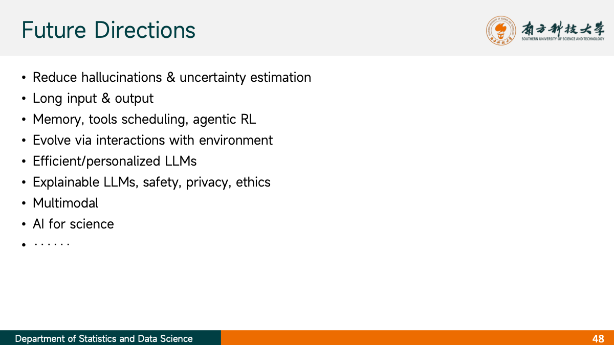

- **Reduce hallucinations & uncertainty estimation**（减少幻觉与不确定性估计）
- **Long input & output**（长输入与长输出）
- **Memory, tools scheduling, agentic RL**（记忆、工具调度、智能体强化学习）
- **Evolve via interactions with environment**（通过与环境交互而演化）
- **Efficient/personalized LLMs**（高效 / 个性化的 LLM）
- **Explainable LLMs, safety, privacy, ethics**（可解释性、安全、隐私、伦理）
- **Multimodal**（多模态）
- **AI for science**（AI 驱动科学）

把这八条和前面的内容对上号，会发现它们几乎都是前面留下的未解问题：

| 方向 | 对应前文的哪个坑 |
|---|---|
| 减少幻觉 | P27「模型是数据的模拟器」——它模拟形式而不核对事实 |
| 不确定性估计 | 模型不知道自己不知道，没有可靠的置信度 |
| 长输入输出 | P46 的注意力复杂度问题 |
| 记忆、工具、agentic RL | P47 绿色区的三个抓手 |
| 与环境交互演化 | P47 的 Extrinsic Experience；也是 P28「数据耗尽」的一条出路——**交互能产生新数据** |
| 高效 LLM | P46 整页 |
| 可解释、安全、隐私、伦理 | P43 的 RICE 四原则 |
| 多模态 | P6 显示视觉与文本能力并不同步 |

**「不确定性估计」这条值得单独强调。** 它和减少幻觉并列，但其实是更根本的问题：即使无法消灭幻觉，只要模型能诚实地说「我不确定」，下游就能据此决定是否转人工、是否触发检索。目前 LLM 输出的 token 概率**并不是良好校准的置信度**——模型可以用很高的概率说出完全错误的事实。

#### P49　具身智能：五层世界范围

*Embodied AI · Five levels of World Scope (Yonatan Bisk et al.)*

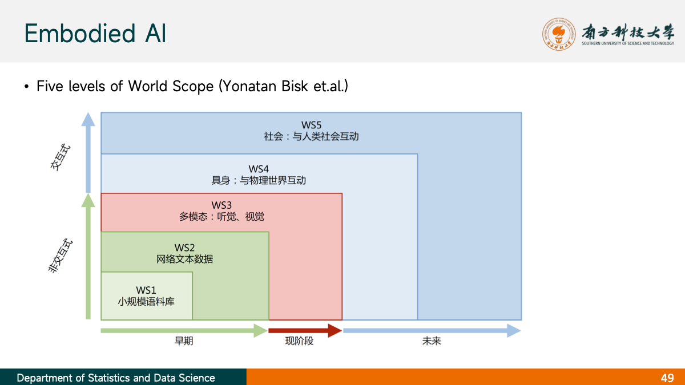

**🖼 逐元素图解**

五个从小到大嵌套的矩形，纵轴左侧分成两段：下半段标「非交互式」（绿色箭头），上半段标「交互式」（蓝色箭头）；横轴下方分成三段：早期 → 现阶段 → 未来。

| 层级 | 内容 | 阶段 |
|---|---|---|
| **WS1** | 小规模语料库 | 早期 |
| **WS2** | 网络文本数据 | 早期 |
| **WS3** | 多模态：听觉、视觉 | **现阶段** |
| **WS4** | 具身：与物理世界互动 | 未来 |
| **WS5** | 社会：与人类社会互动 | 未来 |

这张图最重要的是**那条把 WS1–WS3 和 WS4–WS5 分开的界线：非交互式 vs 交互式**。

WS1 到 WS3 的共同点是——**数据是被动收集的**。语料库、网页、图片视频，都是别人已经产生好、模型只管读的东西。规模能做得很大，但有两个根本限制：一是**会用完**（P28 的红字警告）；二是**模型无法验证自己的理解是否正确**，因为它不能做实验。

WS4 开始质变：**模型的动作会改变世界，世界的反馈又回到模型**。这带来两个全新的东西：

1. **数据可以自己产生**——每一次交互都是新样本，不受存量语料限制。这正好接上 P48 的 "Evolve via interactions with environment"。
2. **有了真正的对错**——物理世界会给出无法伪造的反馈。抓不起杯子就是抓不起来，这比任何人类标注都可靠。

WS5（社会层）比 WS4 更难，因为社会反馈是**多主体、有策略、会变化**的——对方也在推断你的意图并调整行为。

课件把「现阶段」标在 WS3，是一个相当克制的判断：**尽管多模态模型已经很强，我们仍停留在「读数据」的阶段，还没真正跨进「与世界互动」。**

#### P50　我们将身处什么样的未来

*Where We are In the Future*

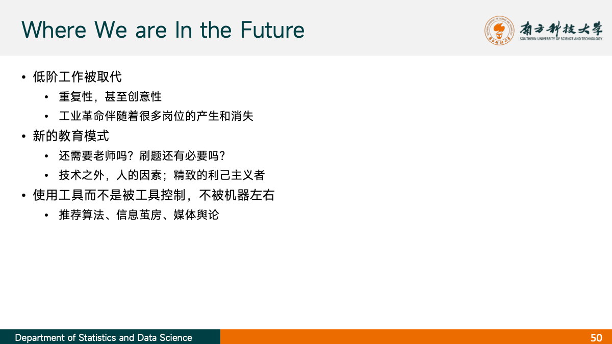

这页全中文，也是全讲唯一一页不谈技术的内容：

- **低阶工作被取代**
  - 重复性，甚至创意性
  - 工业革命伴随着很多岗位的产生和消失
- **新的教育模式**
  - 还需要老师吗？刷题还有必要吗？
  - 技术之外，人的因素；精致的利己主义者
- **使用工具而不是被工具控制，不被机器左右**
  - 推荐算法、信息茧房、媒体舆论

三点各有分量：

**第一点的关键词是「甚至创意性」。** 过去关于自动化的讨论默认「创意工作是安全的」，生成模型打破了这个假设。但后半句给了历史参照——工业革命同样消灭了大量岗位，也创造了当时无法想象的新职业。

**第二点最尖锐。** 「还需要老师吗？刷题还有必要吗？」——如果模型能解答任何习题，练习的意义在哪？一个可能的回答是：**刷题的价值从来不在答案，而在形成判断力**。而当答案唾手可得时，能分辨答案对错的人反而更稀缺了。后半句「精致的利己主义者」把问题引向价值观——技术能力越强，人的取向就越关键。

**第三点回到每个人的日常。** 推荐算法、信息茧房这些，都是「被工具控制」的现成例子。放在一门讲怎么造 LLM 的课的结尾，这句提醒的分量不轻：**你们将来是造这些系统的人。**

#### P51　致谢

*Thank you*

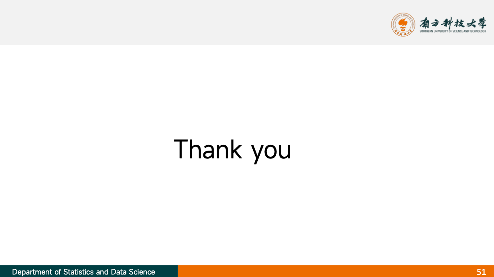

全讲结束。

---

### 🖊 本模块练习（P45–P51）

1. ★ SFT 和 RL 训练的动机有何本质区别？为什么说 RL 能突破 SFT 的天花板？

<details><summary>解析</summary>

**SFT 在模仿，RL 在优化。**

SFT 的数据是「提示 → 标准答案」，训练目标是最大化标准答案的似然——模型学的是**复现标注者写的东西**。因此它的上限就是标注者的平均水平：人写得多好，模型最多学到多好。

RL 只需要人**判断**哪个更好。关键在于：**判断能力通常强于创作能力**。一个人能准确分辨两首诗的高下，未必写得出同等水平的诗。RLHF 利用的正是这个落差——它让模型探索出人写不出来、但人能认出好的输出，然后强化它。

另外，SFT 只见过正例（标准答案），RL 同时见到正例和负例（哪个更差），信息量更大。

</details>

2. P46 里 "Efficient Full Attention" 和 "Linear Sequence Modeling" 有什么本质区别？选型时意味着什么？

<details><summary>解析</summary>

**Efficient Full Attention 不改变数学结果，Linear Sequence Modeling 改变。**

FlashAttention 这类 IO-Aware 方法算出的注意力矩阵和朴素实现**逐位相同**，只是通过分块计算、减少 HBM 读写来提速。它是纯粹的工程优化——**没有精度损失，可以无条件使用**。

线性注意力、状态空间模型则是**近似**：它们把历史压缩进固定大小的状态，用 $O(n)$ 复杂度换掉 $O(n^2)$，代价是丢失精确回看任意位置的能力。

**选型含义**：IO-Aware 优化应该默认打开；线性/稀疏方案要评估任务是否依赖精确长程检索（比如「复述第 300 个词」「从长文档里找出某个具体数字」这类任务会明显退化）。这也是为什么实践中流行混合架构——见 P16。

</details>

3. ★ P47 把智能体拆成 $\theta$（参数）和 $\Sigma$（脚手架）。为什么工程实践中绝大多数改进都发生在 $\Sigma$ 上？

<details><summary>解析</summary>

因为两者的**成本和风险差了好几个数量级**。

改 $\theta$ 要训练：需要数据、算力、时间，还可能引入灾难性遗忘——修好一个问题的同时弄坏三个。而且改完难以回滚（得保留旧 checkpoint）。

改 $\Sigma$ 不动任何权重：换个提示、接一个工具、调整记忆结构，几分钟就能试一次，效果不好立刻改回来，而且**改动是可读可审计的**（提示是人能看懂的文字，参数不是）。

所以理性的顺序永远是：先把 $\Sigma$ 榨干，确认瓶颈真的在模型能力本身，再考虑动 $\theta$。

P47 的深层洞见是：既然 $\Sigma$ 的改进这么廉价，那它就**适合被自动化**——让智能体自己搜索更好的提示、自己写工具、自己整理记忆，这正是绿色区那几个 $\texttt{IMPROVE}$ 函数的含义。

</details>

4. P49 里 WS3 到 WS4 的跨越为什么被认为是质变？它和 P28 的「数据耗尽」有什么关系？

<details><summary>解析</summary>

**质变在于从「被动读数据」变成「主动产生数据」。**

WS1–WS3 的数据都是既有的：语料库、网页、图像视频。模型只能读，不能验证。这带来两个限制——数据总量有限（P28 的红字），且模型无法确认自己的理解是否正确。

WS4 之后，模型的动作改变世界，世界的反馈回到模型。于是：

1. **数据不再受存量限制**——每次交互都产生新样本，这是 P28 困境的一条真正出路（另外两条是合成数据和推理时扩展）。
2. **出现了无法伪造的监督信号**——物理世界不会配合你的幻觉。抓不起杯子就是抓不起来。这比人类标注更可靠，也更廉价。

这正是 P48 里 "Evolve via interactions with environment" 这一条的意义。

</details>

5. 为什么说「不确定性估计」比「减少幻觉」更根本？

<details><summary>解析</summary>

因为**幻觉可能无法彻底消除，但如果模型能诚实地表达不确定，系统层面就有办法应对**。

只要模型可靠地输出「这个问题我有 30% 把握」，下游就能设计策略：低置信度时触发检索、转人工、或者直接拒答。这样即使模型本身仍会犯错，整个系统依然可用。

反过来，一个幻觉率很低但**过度自信**的模型反而更危险——错误偶尔出现且毫无征兆，使用者会逐渐放松警惕，等到出事时代价更大。

难点在于 LLM 的 token 概率**不是良好校准的置信度**。模型可以用极高的概率说出完全错误的事实，因为它优化的是「像不像训练数据」，而不是「对不对」（回看 P27）。

</details>

---

## 附录 A · 核心概念速查

| 概念 | 一句话 | 出处 |
|---|---|---|
| **下一词预测** | 唯一的预训练目标，$p(\text{next}\mid\text{prev})$ | P15 |
| **MoE** | 总参数大、激活参数小；显存看总量，算力看激活量 | P9、P16 |
| **三阶段训练** | Pretraining（学习）→ Mid-training（适配）→ Post-training（重塑） | P13 |
| **数据预处理六步** | 原始 → 质量过滤 → 去重 → 脱敏 → 分词 → 可训练 | P25 |
| **上下文学习** | 不改参数，靠提示里的示例定位任务 | P29 |
| **涌现能力** | 小模型没有、大模型才有的能力 | P30 |
| **思维链 CoT** | 在答案前生成推理步骤，买到的是计算深度 | P31、P32 |
| **指令微调** | 教模型「指令是用来执行的」，不注入新知识 | P33 |
| **RLHF 三步** | SFT → 训奖励模型 → PPO 优化 | P37–P39 |
| **Bradley–Terry** | $P(y_w \succ y_l)=\sigma(r_w-r_l)$，只有分数差有意义 | P36、P38 |
| **KL 惩罚** | 约束策略不偏离 SFT 太远，防奖励攻破 | P39 |
| **对齐税** | 对齐导致通用能力下降，用预训练项缓解 | P39 |
| **奖励攻破** | 优化奖励模型的漏洞而非真实偏好 | P39、P41 |
| **RAG vs 微调** | 开卷 vs 复习；管「说什么」vs 管「怎么说」 | P42 |
| **RICE** | Robustness / Interpretability / Controllability / Ethicality | P43 |
| **对抗性探测** | 让标注者主动诱导模型违规，采集稀有危险样本 | P44 |
| **世界范围 WS1–5** | 语料 → 网络 → 多模态 → 具身 → 社会；现阶段在 WS3 | P49 |

## 附录 B · 面试高频问题

1. **预训练、指令微调、RLHF 三者各自解决什么问题？**
   预训练注入知识与语言能力；指令微调建立「指令要执行」的行为约定；RLHF 在没有标准答案的开放任务上优化输出质量。知识全部来自预训练，后两者只改变行为。

2. **为什么 in-context learning 不需要梯度更新也能生效？**
   示例把上下文置入模型预训练时见过的「列举同类条目并延续」模式，从而选定任务和输出格式。能力本身来自预训练，示例只负责定位。

3. **CoT 为什么能提升推理能力？它的边界在哪？**
   两个机制：把计算摊到更多 token 上（买到深度）、把中间结果写进上下文当草稿纸。边界是它**不增加知识**——模型不会因为 CoT 而知道它本来不知道的事实；而且小模型用 CoT 可能更差。

4. **奖励模型为什么只能给相对分数？**
   用 Bradley–Terry 拟合成对偏好，$\sigma(r_w-r_l)$ 里只有差值被约束，整体加常数不改变任何预测，绝对值不可辨识。

5. **RLHF 里 KL 惩罚项去掉会怎样？**
   会发生奖励攻破：策略偏离到奖励模型没见过的区域，产出高分但人类不喜欢的输出（冗长、堆砌礼貌用语、滥用列表）。

6. **PPO 做 RLHF 需要几个模型？GRPO 怎么优化？**
   四个：SFT（冻结）、Reward（冻结）、Value（训练）、Policy（训练）。GRPO 去掉 Value Model，改用同一提示下一组采样的**组内平均奖励**作基线算相对优势。

7. **MoE 的 `535B-A23B` 是什么意思？部署时要注意什么？**
   总参数 535B、每 token 激活 23B。显存按 535B 算，算力按 23B 算。部署瓶颈在显存而非算力，所以适合服务端、不适合端侧。

8. **什么时候用 RAG，什么时候用微调？**
   知识频繁变动、需要溯源、需要按权限隔离 → RAG。改变输出格式、语气、领域表达方式 → 微调。两者常叠加：微调管「怎么说」，RAG 管「说什么」。

9. **「高质量数据终将耗尽」为什么威胁 Scaling Law？有哪些出路？**
   Scaling Law 要求参数量与数据量配合增长，数据轴撞墙后加参数收益锐减。出路：合成数据、多模态扩大数据池、推理时扩展（`+think`）、以及与环境交互自产数据（WS4）。

10. **为什么代码数据能提升数学与推理能力？**
    代码提供显式分步结构、严格长程一致性约束，以及由编译器/测试隐式保证的正确性——模型学到的是**能工作的推理链**。

---

*本笔记基于陈冠华老师 STA-5007 Advanced NLP 课程 Lecture 4 课件整理。所有截图来自原课件，讲解为笔记作者补充。*
