> SUSTech · STA-5007 Advanced NLP · Lecture 5

陈冠华老师《Basics of Transformer (2)》全 70 页课件的逐页拆解：**每一页都配了原始课件截图**，图下先给原文要点，再补上推导细节、维度核对、直觉解释与易错点。关键图示附「🖼 逐元素图解」，讲清每条线、每个方块是什么；每个模块末尾有带详解的练习；文末附录是公式速查与面试高频问题。

*70 页 · 70 张课件截图 · 6 个模块 · 南方科技大学 统计与数据科学系*

> **📌 和 Lecture 2 的关系**
>
> 这一讲的原标题是 *Basics of Transformer **(2)***，是 [Lecture 2](../sta5007-02/) 的直接续篇。Lecture 2 讲的是**原版 Transformer**（2017 年那篇论文里的结构）；这一讲讲的是**七年来实践中沉淀下来的改进**——今天的 LLaMA、Qwen、Kimi 用的都不再是原版结构了。
>
> 本讲的暗线是 P15 那张「Original Setting → Improvement Setting」对照表，后面五个模块正是对它逐行展开。

---

`Part 1 · P1–P14`

## 一、解码算法：模型算完之后怎么选词

训练讲的是怎么得到概率分布，这一部分讲**拿到分布之后怎么挑词**。这件事完全发生在推理阶段，不涉及任何参数——但它对输出质量的影响，常常不亚于换一个模型。

#### P1　课程封面

*Advanced Natural Language Processing — Lecture 5: Basics of Transformer (2)*

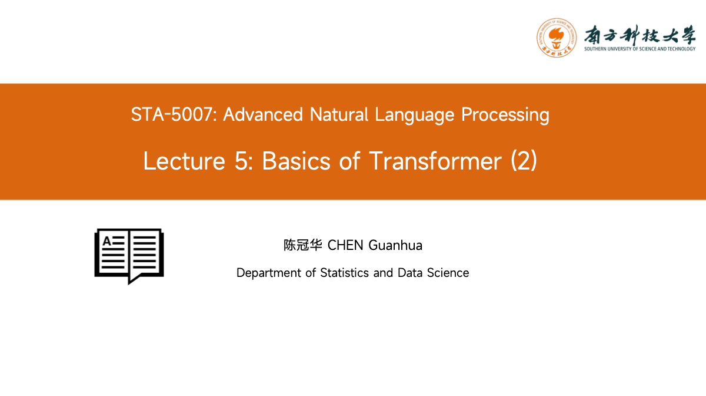

南方科技大学统计与数据科学系，陈冠华老师，STA-5007。

#### P2　解码问题的定义

*Decoding Algorithm*

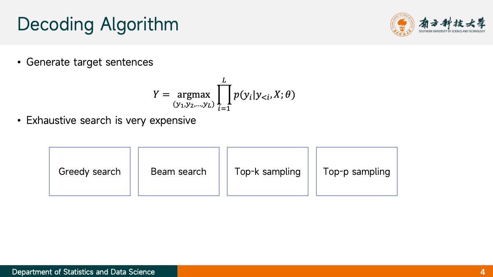

生成目标句子，形式上是求：

$$
Y = \operatorname*{argmax}_{(y_1, y_2, \ldots, y_L)} \prod_{i=1}^{L} p(y_i \mid y_{<i}, X; \theta)
$$

课件紧接着给出一句判决：**Exhaustive search is very expensive**（穷举搜索代价极高），然后列出四个替代方案：**Greedy search / Beam search / Top-k sampling / Top-p sampling**。

**为什么穷举不可行？** 词表大小 $|V|$ 通常是 3 万到 15 万，句子长度 $L$ 几十到几千。所有可能序列的数量是 $|V|^L$——取 $|V|=50000$、$L=20$，就是 $50000^{20} \approx 10^{94}$。宇宙的原子数约 $10^{80}$。

所以这个 argmax **永远不可能精确求解**，所有解码算法都是近似。理解这一点很重要：**beam search 找到的不是全局最优，greedy 更不是**。

> **⚠️ 注意这里是连乘**
>
> $\prod_i p(y_i \mid y_{<i})$ 意味着**一步选错，后面全被带偏**。这是自回归生成的固有脆弱性——没有回头修改的机会。实现时都取对数变成 $\sum_i \log p$，一来避免连乘下溢，二来把乘法变加法便于累加剪枝。

#### P3　贪心搜索

*Greedy Search*

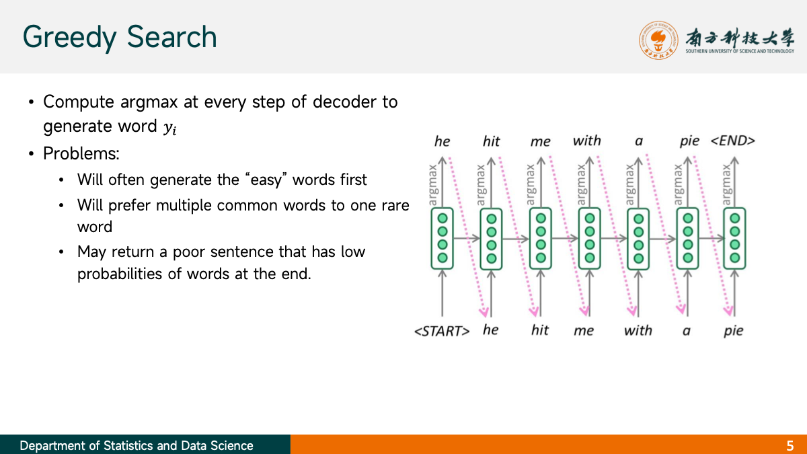

- Compute **argmax** at every step of decoder to generate word $y_i$（每一步都取概率最大的词）
- **Problems**:
  - Will often generate the "easy" words first（倾向于先生成「容易」的词）
  - Will prefer multiple common words to one rare word（宁可用几个常见词，也不用一个罕见词）
  - May return a poor sentence that has low probabilities of words at the end（可能返回一个结尾处概率很低的糟糕句子）

**🖼 逐元素图解**

图里是一串 RNN 单元，底部输入 `<START> he hit me with a pie`，每格上方经 `argmax` 输出 `he hit me with a pie <END>`，粉色虚线箭头表示**当前步的输出被喂给下一步作为输入**——这就是自回归。

**三个问题其实是同一个根源：贪心只看当下。**

第二条尤其值得体会。假设要表达「他被击中了」，模型面前有两条路：

- 用罕见词 `struck`：$p = 0.06$
- 用常见词 `was hit`：$p(\text{was}) = 0.25$，$p(\text{hit} \mid \text{was}) = 0.7$，联合 $0.175$

贪心在第一步就会选 `was`（0.25 > 0.06），因为它看不到 `struck` 是一步到位的。**这导致生成的文本偏向平庸、啰嗦**——这也是为什么纯贪心解码出来的文本读起来有种「说了很多正确的废话」的味道。

第三条描述的是死胡同：前面每一步都选了局部最优，走到某个状态时发现怎么接都别扭，但已经回不了头了。

#### P4　束搜索：原理与示例

*Beam Search*

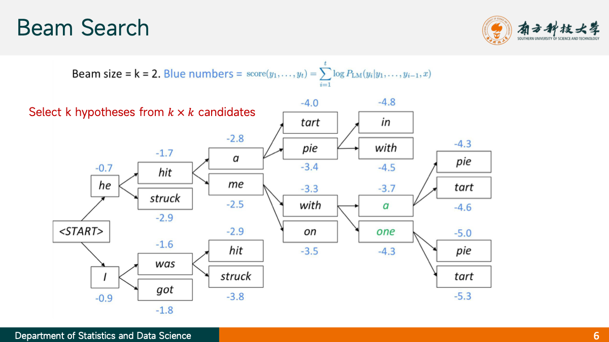

顶部给出打分函数：

$$
\text{score}(y_1, \ldots, y_t) = \sum_{i=1}^{t} \log P_{\text{LM}}(y_i \mid y_1, \ldots, y_{i-1}, x)
$$

红字标注核心操作：**Select k hypotheses from $k \times k$ candidates**（从 $k \times k$ 个候选里挑 $k$ 条）。

**🖼 逐元素图解**（beam size $k=2$，蓝色数字是累计对数概率）

```
<START> ─┬─ he   (-0.7) ─┬─ hit    (-1.7) ─┬─ a    (-2.8) ─┬─ tart (-4.0) ── in   (-4.8)
         │               │                 │               └─ pie  (-3.4) ── with (-4.5)
         │               └─ struck (-2.9)  └─ me   (-2.5) ─┬─ with (-3.3) ── a    (-3.7) ─┬─ pie  (-4.3)
         │                                                 │                              └─ tart (-4.6)
         └─ I    (-0.9) ─┬─ was  (-1.6) ─┬─ hit    (-2.9)  └─ on   (-3.5) ── one  (-4.3) ─┬─ pie  (-5.0)
                         └─ got  (-1.8)  └─ struck (-3.8)                                  └─ tart (-5.3)
```

每一步的流程是固定的三拍：

1. **扩展**：对当前保留的 $k$ 条假设，每条都算出全词表的下一词概率。
2. **打分**：得到 $k \times |V|$ 个候选序列，每个的分数是「父序列分数 + 新词的对数概率」。
3. **剪枝**：只留分数最高的 $k$ 条，其余全部丢弃。

注意图中第一层：`he` (-0.7) 和 `I` (-0.9) 都被保留了。**贪心会直接扔掉 `I` 这条线**，而 beam search 给了它继续的机会——这正是 beam 优于 greedy 的地方。

> **💡 为什么是 $k \times k$ 而不是 $k \times |V|$**
>
> 理论上每条假设要扩展全词表 $|V|$ 个词。但实现时，先对每条假设取它自己的 top-$k$（更差的词不可能进入最终 top-$k$），于是候选集缩小到 $k \times k$。这是纯粹的效率优化，**不改变结果**。

#### P5　束搜索（续）

*Beam Search*

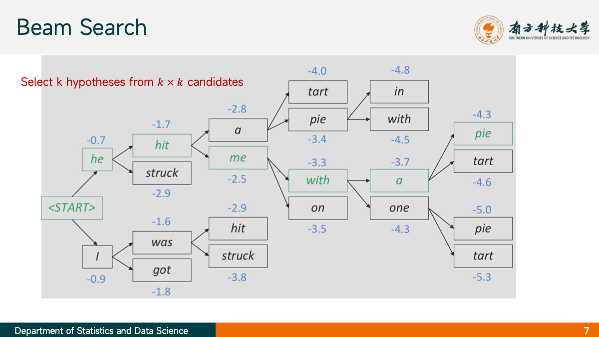

同一张搜索树的延续，展示后续步骤如何继续「扩展—打分—剪枝」。可以顺着追踪最终胜出的路径：`he hit a pie with ...`（-4.5）与 `he hit me with a pie`（-4.3）的竞争。

值得注意的是**分数单调递减**：每加一个词就加上一个负数（对数概率必为负）。所以**长序列的分数天然低于短序列**——这个副作用由 P6 来修。

#### P6　终止条件与长度归一化

*Beam Search*

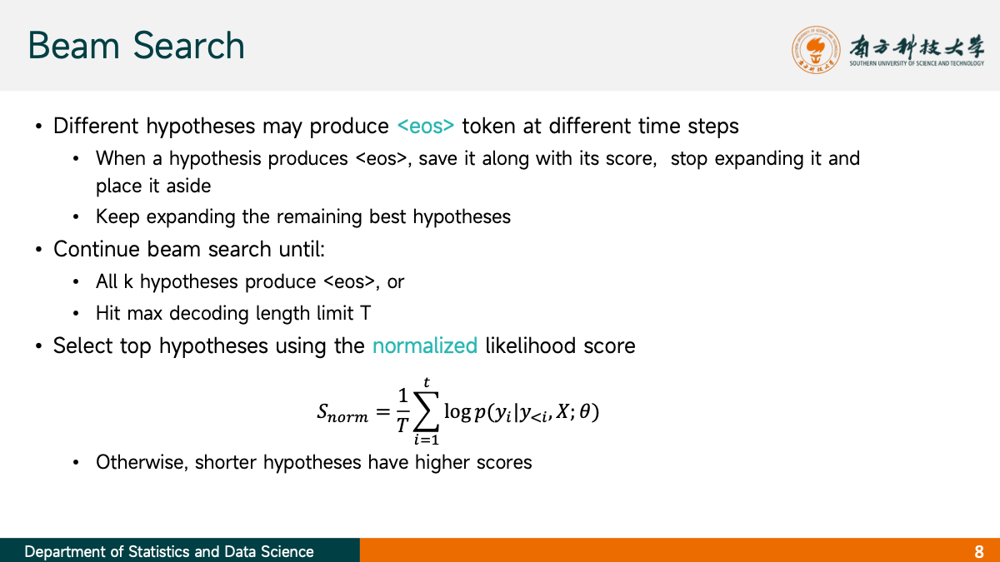

- Different hypotheses may produce `<eos>` token at **different time steps**
  - When a hypothesis produces `<eos>`, **save it along with its score, stop expanding it and place it aside**（产生 `<eos>` 的假设存起来、停止扩展、放到一边）
  - Keep expanding the remaining best hypotheses
- Continue beam search until:
  - All $k$ hypotheses produce `<eos>`, **or**
  - Hit max decoding length limit $T$
- Select top hypotheses using the **normalized** likelihood score:

$$
S_{norm} = \frac{1}{T}\sum_{i=1}^{t} \log p(y_i \mid y_{<i}, X; \theta)
$$

  - Otherwise, **shorter hypotheses have higher scores**（否则短句总是得分更高）

最后那条说明就是问题的全部：由于每一步都加一个负数，**不做归一化的 beam search 系统性地偏爱短句**。极端情况下它会倾向于立刻输出 `<eos>`。

除以长度 $T$ 得到**平均每词的对数概率**，让长短句可比。

> **⚠️ 长度归一化不是万能的**
>
> 简单除以 $T$ 有时矫枉过正——变成偏爱长句。实践中常用带幂次的长度惩罚：
>
> $$\text{lp}(Y) = \frac{(5 + |Y|)^\alpha}{(5+1)^\alpha}$$
>
> 用 $\alpha \in [0.6, 1.0]$ 调节强度（$\alpha=1$ 退化成除以长度，$\alpha=0$ 等于不归一化）。这是 GNMT 提出的做法，机器翻译里很常见。

#### P7　束搜索的代码视角

*Beam Search · Code for beam search*

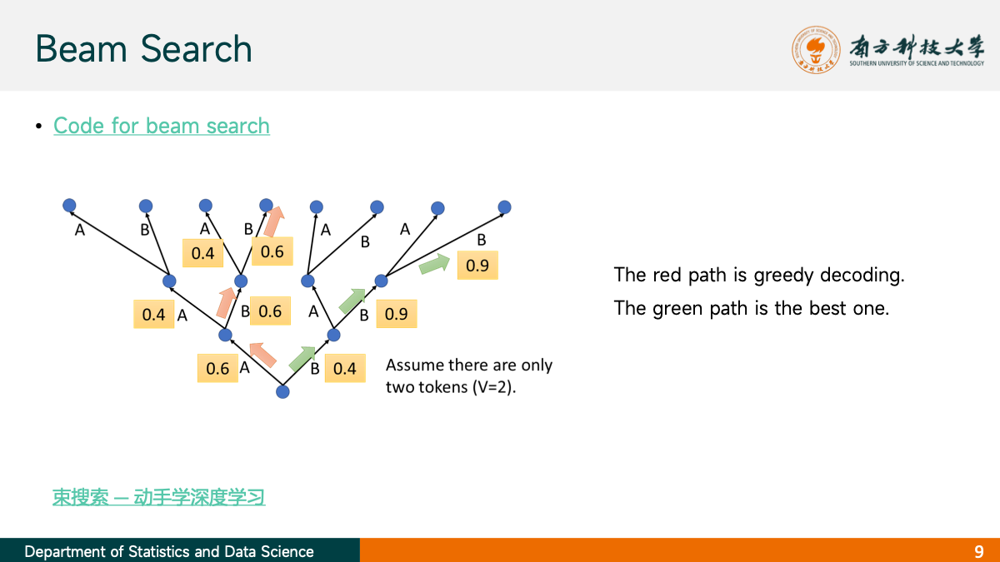

这张图用一个极简例子（**假设词表只有两个 token，V=2**）展示 greedy 和 beam 的差别。

**🖼 逐元素图解**

从底部根节点出发，每步二选一（A 或 B），边上的数字是该步的概率：

- **红色路径（贪心）**：第一步选 A（0.6 > 0.4）→ 第二步在 A 的子树里选 B（0.6 > 0.4）→ 最终得到 0.6 × 0.6 = **0.36**
- **绿色路径（最优）**：第一步选 B（0.4）→ 第二步选 B（0.9）→ 0.4 × 0.9 = **0.36**……

图右注明：**The red path is greedy decoding. The green path is the best one.**

关键在第一步：贪心选了 0.6 那条，因为它比 0.4 大。但 0.4 那条的后续概率是 0.9，远高于 0.6 那条的后续。**一步的领先，被下一步的差距抹平甚至反超**。

这就是贪心的本质缺陷——它优化的是 $\max p(y_1)$，而我们要的是 $\max \prod_i p(y_i)$。两者不等价。

> **💡 Beam search 也不保证最优**
>
> 它只是把「看 1 条」放宽到「看 k 条」。如果最优路径在某一步掉出了 top-$k$，之后就再也回不来了。增大 $k$ 能降低这种风险，但代价是计算量线性增长，而且——反直觉的是——**在开放式生成任务上，$k$ 太大反而让输出更乏味**（因为高概率序列往往是最平庸的那些）。

#### P8　Top-k 采样

*Top-k Sampling*

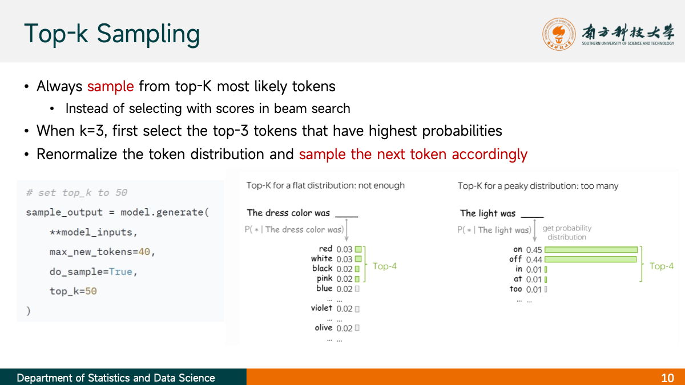

- Always **sample** from top-K most likely tokens
  - Instead of selecting with scores in beam search（而不是像 beam search 那样按分数挑选）
- When $k=3$, first select the top-3 tokens that have highest probabilities
- **Renormalize** the token distribution and **sample the next token accordingly**

左侧代码：

```python
# set top_k to 50
sample_output = model.generate(
    **model_inputs,
    max_new_tokens=40,
    do_sample=True,
    top_k=50
)
```

**🖼 逐元素图解**

右侧两个对照例子揭示了 top-k 的根本缺陷：

| | **Top-K for a flat distribution: not enough** | **Top-K for a peaky distribution: too many** |
|---|---|---|
| 上下文 | "The dress color was ___" | "The light was ___" |
| 分布 | red 0.03 / white 0.03 / black 0.02 / pink 0.02 / blue 0.02 / … / violet 0.02 / olive 0.02 | on 0.45 / off 0.44 / in 0.01 / at 0.01 / too 0.01 |
| Top-4 覆盖 | 只占总概率的一小部分 | 已经远超合理范围 |
| 问题 | **切得太狠**——本来有几十种合理颜色，只留 4 个 | **切得太松**——只有 `on`/`off` 合理，却放进了 `in`/`at` |

这两个例子构成一个漂亮的对称论证：**固定的 $k$ 无法适应变化的分布形状**。

- 分布**平坦**时（说颜色），合理候选很多，$k$ 太小会扼杀多样性。
- 分布**尖锐**时（开关灯），只有一两个词说得通，$k$ 太大会放进明显错误的词。

而同一个模型在生成一段文本的过程中，**分布形状是时刻变化的**——写到 "The capital of France is" 时极度尖锐，写到 "I feel" 时极度平坦。固定 $k$ 必然在某些位置犯错。

#### P9　Top-k 的重归一化

*Top-k Sampling*

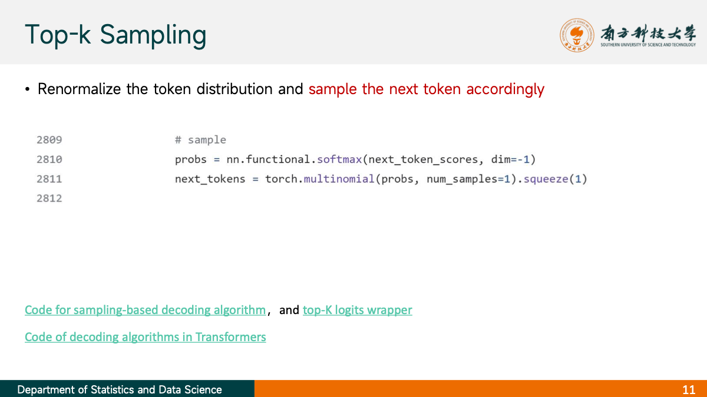

- Renormalize the token distribution and sample the next token accordingly

截断之后必须重新归一化：留下的 $k$ 个词的概率之和不等于 1，要除以它们的总和才能当作分布来采样。

形式化地，设 $V^{(k)}$ 是概率最高的 $k$ 个词：

$$
p'(x) = \begin{cases}
\dfrac{p(x)}{\sum_{x' \in V^{(k)}} p(x')} & x \in V^{(k)} \\[2mm]
0 & \text{otherwise}
\end{cases}
$$

> **💡 采样 vs 搜索：两种解码的哲学分歧**
>
> Beam search 想找**概率最大**的序列；采样想从**分布里抽样**。
>
> 对机器翻译这类有「标准答案」的任务，前者合理——我们确实要那个最可能的译文。但对开放式生成（写故事、聊天），**最可能的序列恰恰是最无聊的**：满是「我认为」「总的来说」这类高频套话，而且容易陷入重复循环。
>
> 所以今天的对话模型几乎都用采样，beam search 主要活跃在翻译、摘要等有明确目标的任务里。

#### P10　Top-p 采样（核采样）

*Top-p Sampling · Nucleus sampling*

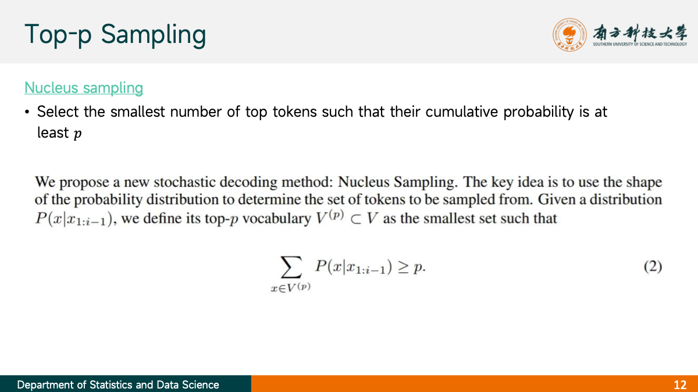

- Select the **smallest number** of top tokens such that their **cumulative probability is at least $p$**

论文原文：

> We propose a new stochastic decoding method: Nucleus Sampling. The key idea is to use **the shape of the probability distribution** to determine the set of tokens to be sampled from. Given a distribution $P(x \mid x_{1:i-1})$, we define its top-$p$ vocabulary $V^{(p)} \subset V$ as the smallest set such that
>
> $$\sum_{x \in V^{(p)}} P(x \mid x_{1:i-1}) \geq p \quad (2)$$

关键短语是 **the shape of the probability distribution**（用分布的形状来决定候选集）。这正是对 P8 那两个反例的直接回应：

| 分布 | top-$p$（$p=0.9$）的行为 |
|---|---|
| 平坦（颜色） | 需要很多词才能累积到 0.9 → **候选集自动变大** |
| 尖锐（on/off） | `on` 0.45 + `off` 0.44 = 0.89，再加一个就够 → **候选集自动缩到 3** |

**同一个 $p$ 值，在两种分布下给出了完全不同、但都合理的截断。** 这就是 top-p 优于 top-k 的全部理由。

#### P11　Top-p 的动态性

*Top-p Sampling*

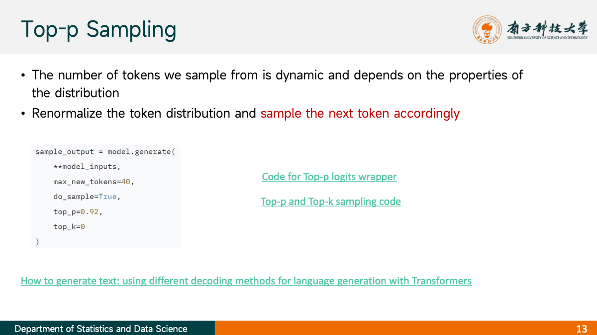

- The number of tokens we sample from is **dynamic** and depends on the properties of the distribution

再次强调动态性。可以这样记忆两者的区别：

> **top-k 固定「候选个数」，让概率质量浮动；top-p 固定「概率质量」，让候选个数浮动。**

实践中两者常常同时启用（比如 `top_k=50, top_p=0.9`），取交集——top-k 兜住极端情况下候选集爆炸的风险，top-p 负责自适应。

#### P12　温度采样

*Temperature-based Sampling*

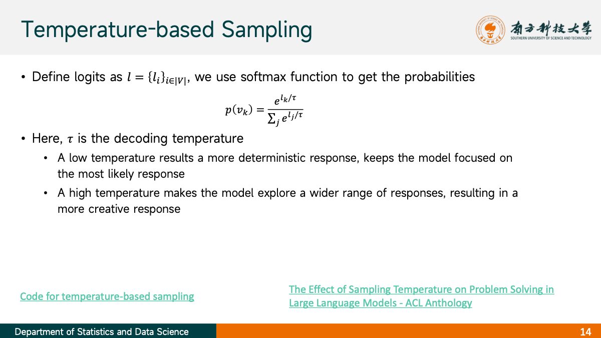

定义 logits 为 $l = \{l_i\}_{i \in |V|}$，用带温度的 softmax 得到概率：

$$
p(v_k) = \frac{e^{l_k / \tau}}{\sum_j e^{l_j / \tau}}
$$

其中 $\tau$ 是**解码温度**：

- **A low temperature** results a more deterministic response, keeps the model focused on the most likely response（低温 → 更确定，聚焦于最可能的回答）
- **A high temperature** makes the model explore a wider range of responses, resulting in a more creative response（高温 → 探索更广，回答更有创意）

**为什么除以 $\tau$ 会有这个效果？** 看两个极限：

| $\tau$ | $l_k/\tau$ 的变化 | 结果 |
|---|---|---|
| $\tau \to 0$ | logits 差距被**放大**到无穷 | softmax 退化成 one-hot → **等价于贪心** |
| $\tau = 1$ | 不变 | 原始分布 |
| $\tau \to \infty$ | logits 差距被**压缩**到 0 | softmax 退化成均匀分布 → **完全随机** |

举个具体例子。设三个词的 logits 是 $[3, 1, 0]$：

| $\tau$ | 概率分布 |
|---|---|
| 0.5 | $[0.98, 0.018, 0.002]$ ——几乎必选第一个 |
| 1.0 | $[0.84, 0.11, 0.04]$ |
| 2.0 | $[0.63, 0.23, 0.14]$ ——第二、三名的机会明显增加 |

> **⚠️ 温度和 top-p 的作用顺序**
>
> 实现上是：**先用温度改变整个分布的形状，再用 top-p / top-k 截断**。顺序反过来结果不同。
>
> 这也意味着两者会相互影响：高温会把分布压平，使 top-p 需要更多词才能累积到 $p$，于是候选集变大——**调参时不能把它们当成互相独立的旋钮**。

#### P13　还能改进什么

*Places for Improvements*

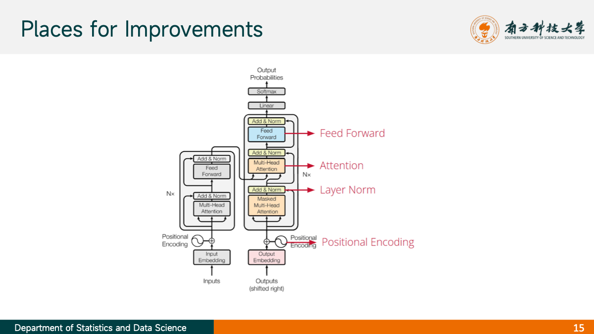

一个过渡页，从「推理阶段的解码」转向「模型结构本身的改进」。前面 P2–P12 讲的都是**不改模型、只改采样策略**；从下一页开始，讨论的是**原版 Transformer 的哪些部件被换掉了**。

#### P14　LLaMA 3 的选择

*LLaMA3' Choice · [2407.21783] The Llama 3 Herd of Models*

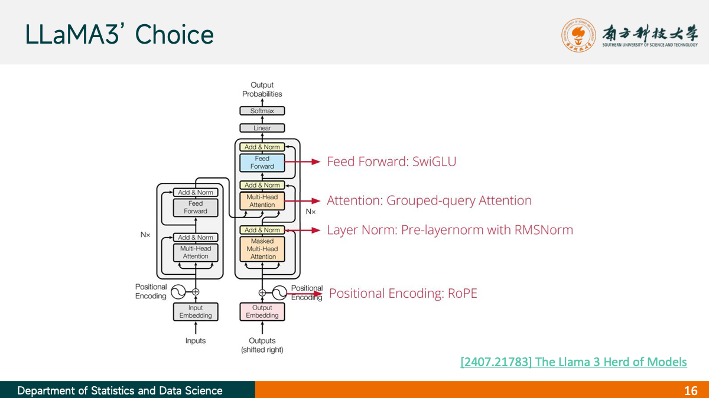

引用 LLaMA 3 技术报告，展示一个真实前沿模型在各个部件上的取舍。这页是下一页那张对照表的现实注脚——**原版 Transformer 的几乎每个部件，在 LLaMA 3 里都被换成了别的东西**：

| 部件 | 原版（2017） | LLaMA 3 |
|---|---|---|
| 位置编码 | 正弦绝对位置编码 | **RoPE**（旋转位置编码） |
| 归一化 | Post-LayerNorm | **Pre-RMSNorm** |
| 激活函数 | ReLU | **SwiGLU** |
| 注意力 | MHA | **GQA**（分组查询注意力） |

这四行正好对应本讲后面四个模块。

---

### 🖊 本模块练习（P1–P14）

1. ★ 为什么 $Y=\operatorname{argmax}\prod_i p(y_i|y_{<i})$ 无法精确求解？这对所有解码算法意味着什么？

<details><summary>解析</summary>

因为候选序列有 $|V|^L$ 个。取 $|V|=50000$、$L=20$，就是约 $10^{94}$ 种——超过可观测宇宙的原子数（约 $10^{80}$）。

这意味着**所有实用解码算法都是近似搜索，没有一个能保证找到全局最优**。贪心是 $k=1$ 的束搜索，束搜索是宽度受限的启发式搜索，采样干脆放弃了「找最优」这个目标。

理解这点能避免一个常见误解：「beam search 找到的是最优序列」——不对，它只是比贪心少犯一些错。

</details>

2. 为什么贪心解码「宁可用几个常见词，也不用一个罕见词」？

<details><summary>解析</summary>

因为贪心比较的是**单步概率**，而正确的目标是**整条路径的联合概率**。

举例：表达「他被击中」，
- 罕见词 `struck`：$p=0.06$
- 常见词组合 `was hit`：$p(\text{was})=0.25$，$p(\text{hit}\mid\text{was})=0.7$，联合 $0.175$

第一步贪心看到 0.25 > 0.06，选了 `was`。虽然这次联合概率恰好更高，但贪心做这个决定时**根本没有看后续**——它只是碰巧对了。当罕见词的后续概率很高时（比如 `struck` 之后直接结束），贪心就会错过。

系统性后果是：生成文本偏向常见词堆砌，显得啰嗦平庸。

</details>

3. ★ 束搜索为什么必须做长度归一化？简单地除以长度有什么问题？

<details><summary>解析</summary>

**必须归一化**：打分是 $\sum_i \log p(y_i)$，每个 $\log p$ 都是负数，所以序列越长分数越低。不归一化的话，beam search 会系统性偏爱短句，极端情况下倾向于立刻输出 `<eos>`。

**简单除以 $T$ 的问题**：容易矫枉过正，变成偏爱长句。因为长句的**平均**每词概率可能更高（后半段上下文更充分，预测更容易）。

实践中用带幂次的长度惩罚：

$$
\text{lp}(Y) = \frac{(5+|Y|)^\alpha}{(5+1)^\alpha}
$$

$\alpha \in [0.6, 1.0]$ 调节强度，$\alpha=1$ 退化为除以长度，$\alpha=0$ 等于不归一化。

</details>

4. ★ 用 P8 的两个例子说明：为什么固定的 $k$ 不好，而 top-p 解决了什么？

<details><summary>解析</summary>

**两个反例**：

- 「The dress color was ___」——分布平坦，红/白/黑/粉/蓝/紫/橄榄……几十种颜色概率都在 0.02–0.03。$k=4$ 只留四个，**扼杀了本来合理的多样性**。
- 「The light was ___」——分布尖锐，on 0.45、off 0.44，其余都是 0.01。$k=4$ 会把 `in`、`at` 放进候选，**引入明显不通顺的词**。

**根本矛盾**：分布形状在生成过程中时刻变化，而 $k$ 是固定的。

**top-p 的解法**：不固定候选个数，而是固定**累计概率质量**。平坦分布下要很多词才凑够 $p$，候选集自动变大；尖锐分布下两三个词就够，候选集自动缩小。用课件的话说，它 *use the shape of the probability distribution*。

一句话：**top-k 固定个数让质量浮动，top-p 固定质量让个数浮动。**

</details>

5. 温度 $\tau \to 0$ 和 $\tau \to \infty$ 分别等价于什么？

<details><summary>解析</summary>

$$
p(v_k)=\frac{e^{l_k/\tau}}{\sum_j e^{l_j/\tau}}
$$

- **$\tau \to 0$**：分母的 $\tau$ 把 logits 之间的差距放大到无穷。最大的那个 logit 经指数后完全压倒其余，softmax 退化成 one-hot → **等价于贪心解码**。
- **$\tau \to \infty$**：所有 $l_j/\tau \to 0$，$e^0 = 1$，每个词概率都是 $1/|V|$ → **完全均匀随机**。
- **$\tau = 1$**：原始分布不变。

所以温度是一个在「确定」和「随机」之间连续调节的旋钮。

</details>

6. 温度和 top-p 同时使用时，先后顺序如何？为什么不能把它们当独立参数调？

<details><summary>解析</summary>

**顺序是：先温度，后截断。** 温度改变整个 softmax 分布的形状，得到新分布之后再按 top-p 累积截断。

**不独立的原因**：温度直接改变分布的陡峭程度，而 top-p 的截断点依赖分布形状。

- 提高温度 → 分布变平 → 累积到 $p$ 需要更多词 → **候选集变大**
- 降低温度 → 分布变尖 → 少数几个词就够 → **候选集变小**

所以调高温度的同时往往需要调低 $p$ 来补偿，否则随机性会叠加放大，输出容易跑飞。这也是为什么多数 API 文档建议「只调其中一个」。

</details>

---
`Part 2 · P15–P25`

## 二、前馈层与专家混合：FFN 被改成了什么

P15 那张对照表是全讲的总纲。这一部分先看**激活函数**那一行（ReLU → SwiGLU），再看一个表里没列、但同样重要的改动：**把单个 FFN 换成一堆专家**。

#### P15　原版 vs 改进版：全讲总纲

*Traditional vs. Advanced*

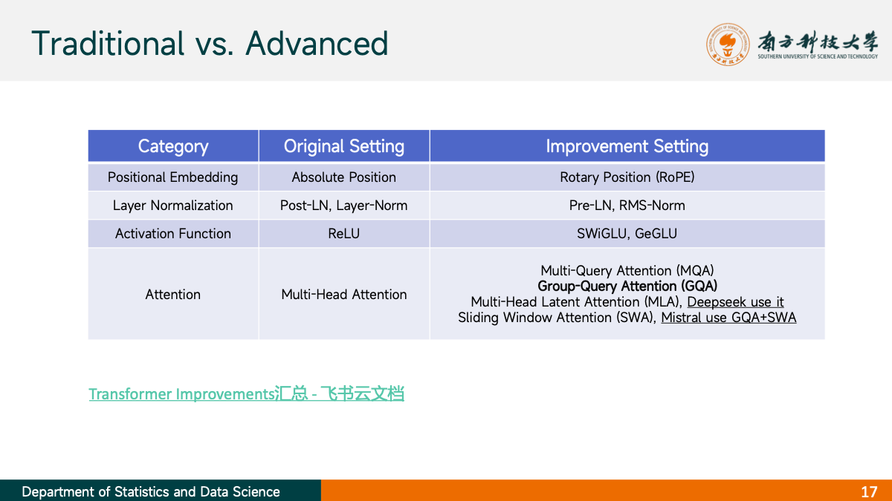

| Category | Original Setting | Improvement Setting |
|---|---|---|
| **Positional Embedding** | Absolute Position | **Rotary Position (RoPE)** |
| **Layer Normalization** | Post-LN, Layer-Norm | **Pre-LN, RMS-Norm** |
| **Activation Function** | ReLU | **SwiGLU, GeGLU** |
| **Attention** | Multi-Head Attention | **Multi-Query Attention (MQA)**<br>**Group-Query Attention (GQA)**<br>Multi-Head Latent Attention (MLA), *Deepseek use it*<br>Sliding Window Attention (SWA), *Mistral use GQA+SWA* |

**这张表就是本讲剩余部分的目录**，后面每个模块对应表里一行：

- 激活函数 → P16–P18
- 注意力 → P26–P33
- 归一化 → P34–P41
- 位置编码 → P42–P68（占了全讲近 40%，因为它牵扯长度外推）

注意表里 GQA 是加粗的——它是当前**最主流**的选择（LLaMA 2/3、Qwen、Mistral 都用），MQA 太激进、MLA 主要是 DeepSeek 在用。

> **💡 为什么原版结构会被逐条替换**
>
> 2017 年的 Transformer 是为**机器翻译**设计的：序列短（几十个词）、模型小（6 层）、encoder-decoder 结构。今天的 LLM 是几十上百层的 decoder-only，序列动辄几万 token，训练规模大了好几个数量级。
>
> 原版的每个设计在新尺度下都暴露了问题：Post-LN 深层训不稳、绝对位置编码外推不了、MHA 的 KV cache 吃光显存、ReLU 的死神经元在大模型上更明显。**这张表记录的就是这七年踩坑的结果。**

#### P16　LLaMA 的前馈层实现

*Feed-Forward Layer*

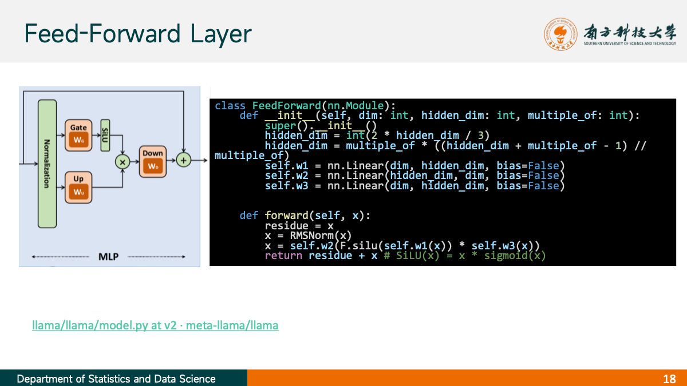

**🖼 逐元素图解**

左图是 MLP 模块的数据流：输入先过 `Normalization`，然后**分成两路**：

- 上路：`Gate` $W_G$ → `SiLU` 激活
- 下路：`Up` $W_U$ （不过激活）

两路在 $\times$ 处**逐元素相乘**，再经 `Down` $W_D$ 投影回原维度，最后 $+$ 残差连接。

右侧是 LLaMA 源码：

```python
class FeedForward(nn.Module):
    def __init__(self, dim: int, hidden_dim: int, multiple_of: int):
        super().__init__()
        hidden_dim = int(2 * hidden_dim / 3)
        hidden_dim = multiple_of * ((hidden_dim + multiple_of - 1) // multiple_of)
        self.w1 = nn.Linear(dim, hidden_dim, bias=False)
        self.w2 = nn.Linear(hidden_dim, dim, bias=False)
        self.w3 = nn.Linear(dim, hidden_dim, bias=False)

    def forward(self, x):
        residue = x
        x = RMSNorm(x)
        x = self.w2(F.silu(self.w1(x)) * self.w3(x))
        return residue + x     # SiLU(x) = x * sigmoid(x)
```

**代码里有三处值得逐一解释：**

**1. 三个权重矩阵，不是两个。** 原版 FFN 是 $W_1 \to \text{ReLU} \to W_2$，两个矩阵。这里是 `w1`（gate）、`w3`（up）、`w2`（down），**多了一个**。对应图里的两条并行支路。

**2. `hidden_dim = int(2 * hidden_dim / 3)` —— 为什么要乘 2/3？**

因为多了一个矩阵，参数量会变成 1.5 倍。原版 FFN 参数量是 $2 \cdot d \cdot h$（$W_1$ 和 $W_2$），SwiGLU 版是 $3 \cdot d \cdot h$。要保持参数量不变：

$$
3 \cdot d \cdot h' = 2 \cdot d \cdot h \quad\Longrightarrow\quad h' = \frac{2}{3}h
$$

这正是 P18 最后一句 *With reduced hidden dimension of the projections to keep parameter count the same* 说的事——**对比实验必须在同等参数量下做，否则不公平**。

**3. `bias=False`。** 三个线性层都没有偏置项。现代 LLM 普遍去掉 FFN 和注意力投影的 bias，因为它对效果几乎没影响，却占参数、增加通信量。

**4. `multiple_of` 那行在做对齐。** 把 hidden_dim 向上取整到 `multiple_of` 的倍数（通常 256），目的是让矩阵维度对 GPU 的 tensor core 友好——这是纯粹的工程优化。

#### P17　激活函数家族

*Feed Forward: Activations*

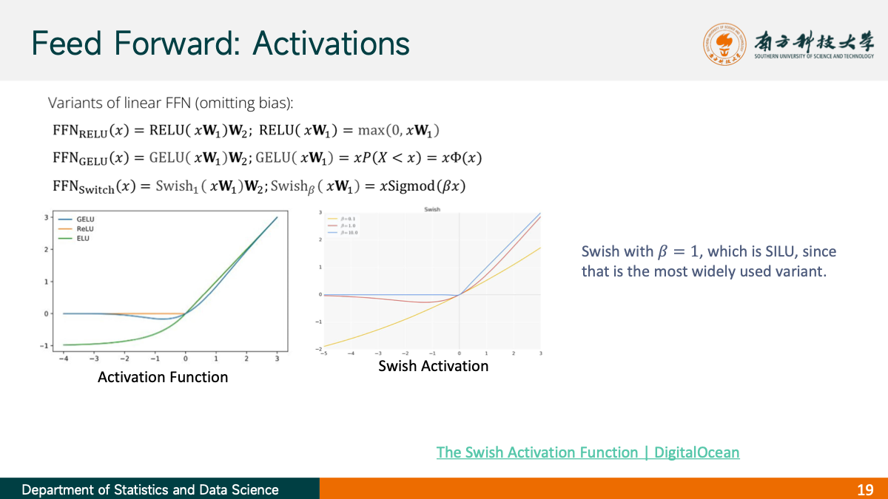

线性 FFN 的三个变体（省略偏置）：

$$
\begin{aligned}
\text{FFN}_{\text{RELU}}(x) &= \text{RELU}(xW_1)W_2, && \text{RELU}(xW_1) = \max(0, xW_1)\\
\text{FFN}_{\text{GELU}}(x) &= \text{GELU}(xW_1)W_2, && \text{GELU}(xW_1) = xP(X<x) = x\Phi(x)\\
\text{FFN}_{\text{Switch}}(x) &= \text{Swish}_1(xW_1)W_2, && \text{Swish}_\beta(xW_1) = x\,\text{Sigmoid}(\beta x)
\end{aligned}
$$

右侧说明：**Swish with $\beta=1$, which is SiLU, since that is the most widely used variant.**

**🖼 逐元素图解**

- **左图**（Activation Function）：GELU（蓝）、ReLU（橙）、ELU（绿）三条曲线。ReLU 在 $x<0$ 时严格为 0 且有一个尖角；GELU 在 0 附近平滑过渡，负半轴有一小段下凹后回归 0。
- **右图**（Swish Activation）：$\beta$ 取 0.1 / 1.0 / 10.0 三条。$\beta$ 越大越接近 ReLU 的折线；$\beta$ 越小越接近线性。

**这三个函数的核心差别在 $x<0$ 的行为**：

| | $x<0$ 时 | 梯度 | 问题 |
|---|---|---|---|
| **ReLU** | 恒为 0 | 恒为 0 | **死神经元**——一旦落入负区就永远收不到梯度 |
| **GELU** | 小的负值，平滑 | 非零 | 无死区，但要算 $\Phi(x)$（误差函数），较贵 |
| **Swish/SiLU** | 小的负值，平滑 | 非零 | 无死区，只需 sigmoid，**便宜** |

GELU 的形式 $x\Phi(x)$ 有一个漂亮的概率解释：$\Phi(x)$ 是标准正态的累积分布函数，所以 GELU 相当于**按「输入大于一个随机高斯阈值的概率」来缩放输入**——是一种「软性的、随机的门控」。

Swish $x \cdot \sigma(\beta x)$ 在数值上非常接近 GELU，但 sigmoid 比 erf 便宜得多，所以实际部署里 SiLU（$\beta=1$ 的 Swish）成了主流。

#### P18　双线性层与 GLU 家族

*Feed Forward: Bilinear Layers*

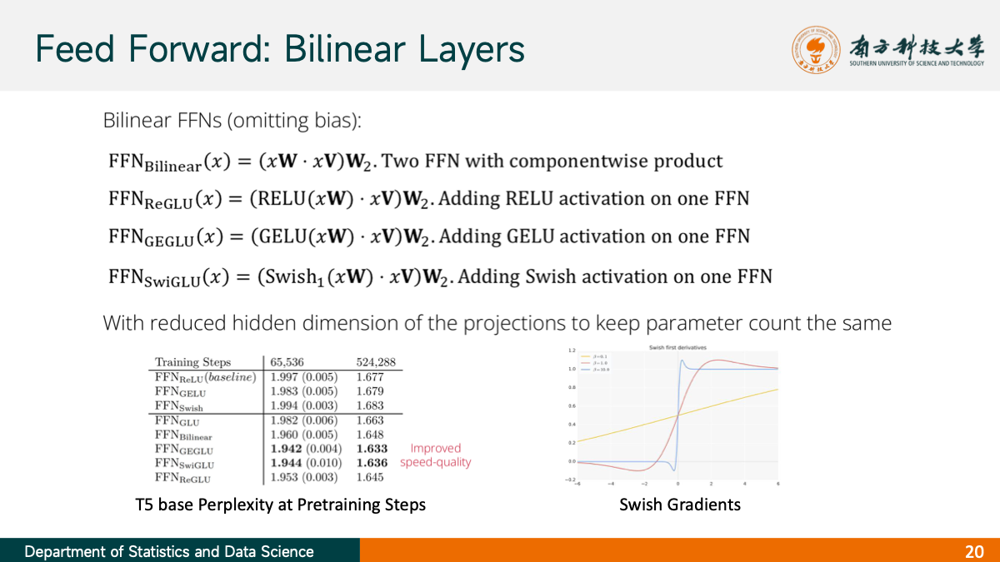

双线性 FFN（省略偏置）：

$$
\begin{aligned}
\text{FFN}_{\text{Bilinear}}(x) &= (xW \cdot xV)W_2 && \text{两个 FFN 做逐元素乘积}\\
\text{FFN}_{\text{ReGLU}}(x) &= (\text{RELU}(xW) \cdot xV)W_2 && \text{在其中一路加 RELU}\\
\text{FFN}_{\text{GEGLU}}(x) &= (\text{GELU}(xW) \cdot xV)W_2 && \text{在其中一路加 GELU}\\
\text{FFN}_{\text{SwiGLU}}(x) &= (\text{Swish}_1(xW) \cdot xV)W_2 && \text{在其中一路加 Swish}
\end{aligned}
$$

**With reduced hidden dimension of the projections to keep parameter count the same.**

T5 base 的困惑度实验（越低越好）：

| 变体 | 65,536 步 | 524,288 步 |
|---|---|---|
| FFN$_\text{ReLU}$（baseline） | 1.997 (0.005) | 1.677 |
| FFN$_\text{GELU}$ | 1.983 (0.005) | 1.679 |
| FFN$_\text{Swish}$ | 1.994 (0.003) | 1.683 |
| FFN$_\text{GLU}$ | 1.982 (0.006) | 1.663 |
| FFN$_\text{Bilinear}$ | 1.960 (0.005) | 1.648 |
| **FFN$_\text{GEGLU}$** | **1.942** (0.004) | **1.633** |
| **FFN$_\text{SwiGLU}$** | **1.944** (0.010) | **1.636** |
| FFN$_\text{ReGLU}$ | 1.953 (0.003) | 1.645 |

标红注释：**Improved speed-quality**。

**这张表要横着看，分成两组：**

- **前三行**（ReLU / GELU / Swish）：只换激活函数，不改结构。524,288 步时分别是 1.677 / 1.679 / 1.683——**几乎没有差别**，甚至 ReLU 还略好。
- **后五行**（带 GLU 的）：加了门控结构。最好的 GEGLU 是 1.633，比 baseline 低 **0.044**。

**结论很明确：真正带来提升的是「门控结构」，而不是「换哪个激活函数」。**

这解释了为什么 LLaMA 用的是 SwiGLU 而不是单纯的 SiLU——GLU 那个乘法才是关键。

**为什么门控有效？** 对比两种形式：

- 普通 FFN：$\text{act}(xW_1)W_2$ ——激活函数逐元素作用，每个维度独立。
- GLU：$(\text{act}(xW) \cdot xV)W_2$ ——**一路的输出决定另一路的通过量**。

后者引入了输入之间的**乘性交互**：$W$ 那一路充当「阀门」，$V$ 那一路是「内容」。阀门的开合由输入决定，所以不同的输入会激活不同的特征组合。这比单纯的逐元素非线性表达力更强。

右图 *Swish Gradients* 展示了 Swish 的导数曲线（$\beta$ = 0.1 / 1.0 / 10.0）。注意 $\beta=10$ 那条在 0 附近有剧烈的过冲，而 $\beta=1$ 平滑得多——这也是 $\beta=1$ 被选为默认值的原因之一。

> **⚠️ 看这类对比实验，先确认参数量是否对齐**
>
> 课件专门写了 *to keep parameter count the same*。如果不做 $\times 2/3$ 的缩减，GLU 变体会多 50% 参数——那时候效果更好完全可能只是因为模型更大。**很多论文的「改进」经不起这一条检验。**

#### P19　专家混合：基本概念

*Mixture-of-Experts (MoE)*

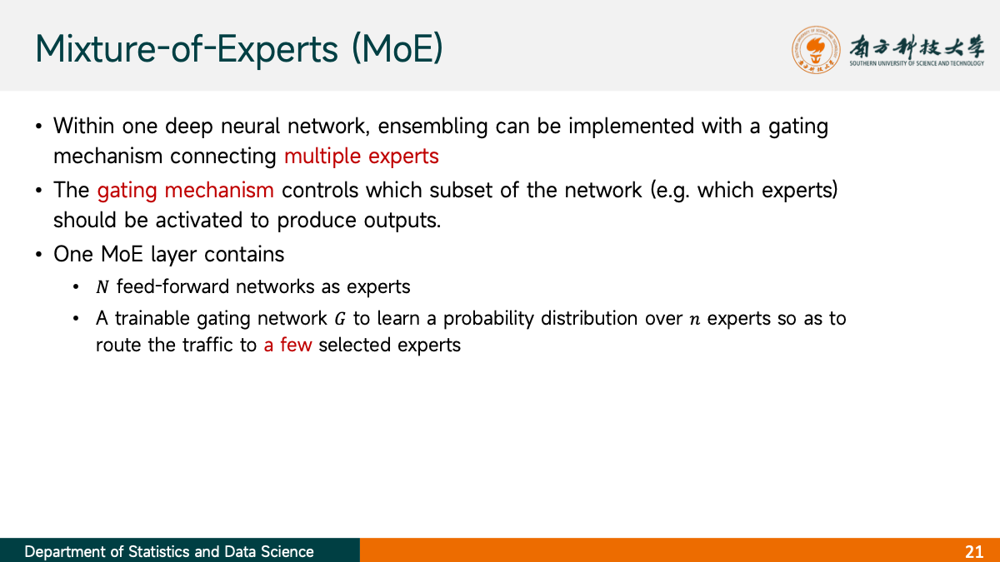

- Within one deep neural network, ensembling can be implemented with a gating mechanism connecting <span style="color:#c00">**multiple experts**</span>（在一个网络内部，用门控机制连接多个专家，实现集成）
- The <span style="color:#c00">**gating mechanism**</span> controls which subset of the network (e.g. which experts) should be activated to produce outputs（门控机制决定激活网络的哪个子集）
- One MoE layer contains
  - $N$ feed-forward networks as **experts**
  - A trainable **gating network** $G$ to learn a probability distribution over $n$ experts so as to route the traffic to <span style="color:#c00">**a few**</span> selected experts（一个可训练的门控网络，学习专家上的概率分布，把流量路由给少数几个被选中的专家）

关键在最后那个 **a few**。如果所有专家都参与，那就只是一个更大的网络，没省任何计算。**MoE 的全部价值在于「只激活少数」**——这就是 [Lecture 4 P9](../sta5007-04/) 里 `535B-A23B` 那种记法的由来。

注意课件用了 *ensembling*（集成）这个词。传统集成是训多个模型然后平均；MoE 是**把集成塞进一层里，并且按输入动态选择用哪几个成员**。

#### P20　MoE 在 Transformer 里的位置

*Mixture-of-Experts (MoE)*

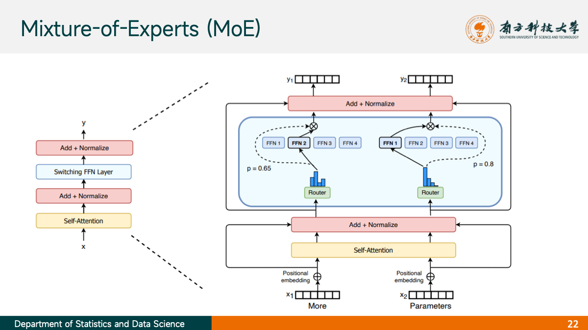

**🖼 逐元素图解**

左侧是单个 block 的抽象结构：`x` → `Self-Attention` → `Add + Normalize` → **`Switching FFN Layer`** → `Add + Normalize` → `y`。

**注意被替换的只有 FFN 那一层，自注意力原封不动。** 这是 MoE 最常见的用法。

右侧展开了两个 token 并行处理的细节：

```
x₁ "More"  ─┬─ Positional embedding ─┐
            │                         ├─ Self-Attention ─ Add+Normalize ─┐
x₂ "Parameters" ─ Positional embedding ─┘                                 │
                                                                          ↓
        ┌─────────────────── Switching FFN Layer ──────────────────┐
        │  token1: Router → p=0.65 → 选中 FFN 2                     │
        │  token2: Router → p=0.8  → 选中 FFN 1                     │
        │  （每个 token 各自过一个 ⊗，用路由权重缩放专家输出）        │
        └──────────────────────────────────────────────────────────┘
                                   ↓
                          Add + Normalize → y₁, y₂
```

**最重要的观察：同一层里，两个 token 走了不同的专家。**

`x₁`（More）被路由到 FFN 2，权重 0.65；`x₂`（Parameters）被路由到 FFN 1，权重 0.8。这就是「条件计算」（conditional computation）——**计算路径依赖于输入本身**，而不是像普通网络那样所有输入走同一条路。

那个 $\otimes$ 符号表示**用门控概率去缩放专家的输出**。所以即使只选一个专家（Switch Transformer 的做法，$k=1$），门控值仍然参与运算——这一点很关键，否则 Router 就没有梯度，学不起来。

#### P21　MoE 的批处理时间

*Transformers Mini-batch Time*

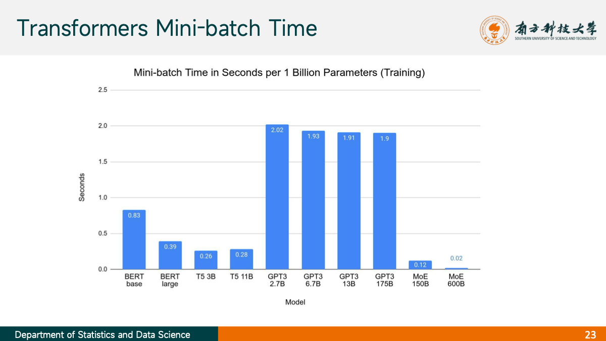

展示 MoE 在实际 mini-batch 训练中的时间开销。MoE 的理论优势是「激活参数少所以算得快」，但工程上有两个抵消因素：

1. **路由本身的开销**——要算门控、排序、分发 token。
2. **通信开销**——专家通常分布在不同 GPU 上（专家并行），token 要跨设备发送再收回，这是 All-to-All 通信，很贵。

所以 MoE 的实际加速比往往远低于理论值（`535B/23B ≈ 23倍` 的理论比，实际可能只有几倍）。

#### P22　门控网络的数学形式

*Gating Network*

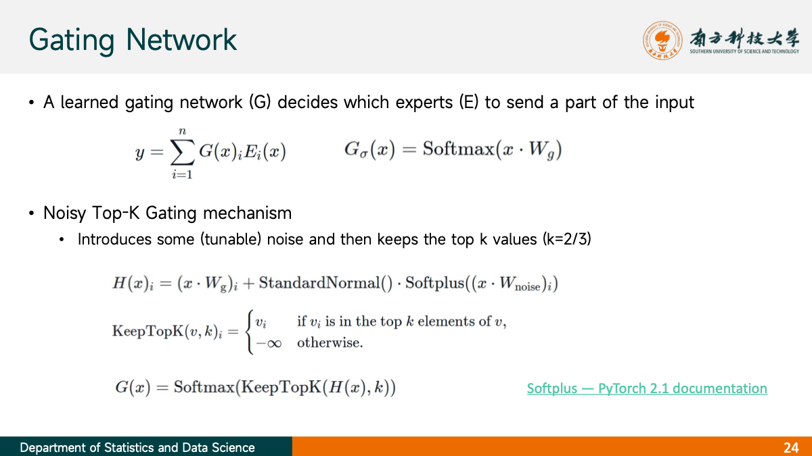

- A learned gating network $G$ decides which experts $E$ to send a part of the input

$$
y = \sum_{i=1}^{n} G(x)_i E_i(x), \qquad G_\sigma(x) = \text{Softmax}(x \cdot W_g)
$$

- **Noisy Top-K Gating mechanism**
  - Introduces some (tunable) noise and then keeps the top $k$ values ($k=2/3$)

$$
H(x)_i = (x \cdot W_g)_i + \text{StandardNormal}() \cdot \text{Softplus}((x \cdot W_{\text{noise}})_i)
$$

$$
\text{KeepTopK}(v,k)_i = \begin{cases} v_i & \text{if } v_i \text{ is in the top } k \text{ elements of } v \\ -\infty & \text{otherwise} \end{cases}
$$

$$
G(x) = \text{Softmax}(\text{KeepTopK}(H(x), k))
$$

**把这三个式子串起来读：**

1. $H(x)_i$ —— 先算门控 logits $(x\cdot W_g)_i$，再**加上一个噪声项**。噪声的强度不是固定的，而是由另一个可学习矩阵 $W_{\text{noise}}$ 决定（过 Softplus 保证为正）——**模型自己学习该在哪里加多少噪声**。
2. $\text{KeepTopK}$ —— 把非 top-$k$ 的位置置为 $-\infty$。
3. $G(x)$ —— 对处理后的向量做 softmax。因为 $-\infty$ 经 $e^{-\infty}=0$，这些位置的权重精确为 0，**它们对应的专家完全不参与计算**。

> **💡 为什么要加噪声**
>
> 这是解决「**富者愈富**」的关键。
>
> 训练初期，某个专家可能因为随机初始化碰巧得分略高，于是被选中、得到梯度、变得更好、更容易被选中……形成正反馈，最后只有少数几个专家被使用（这就是 P24 要讲的问题）。
>
> 加噪声让排名靠后但差距不大的专家**有机会被选中**，从而获得训练机会。这在本质上是探索-利用权衡（exploration-exploitation）——和强化学习里的 $\epsilon$-greedy 是同一个思路。
>
> 用 $-\infty$ 而不是直接删掉，是为了让 softmax 自动处理归一化，实现上更简洁。

#### P23　门控网络（续）

*Gating Network*

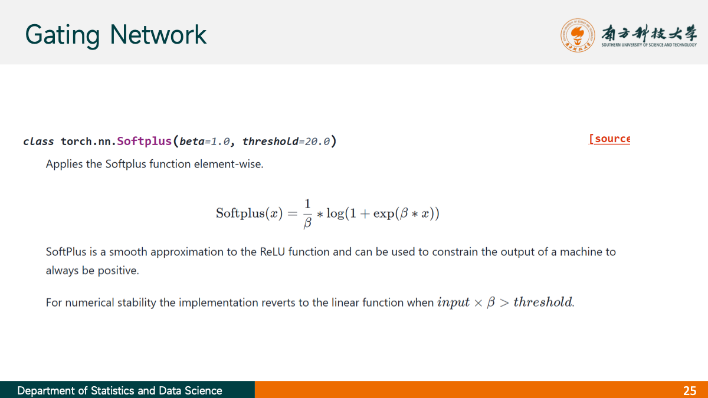

继续说明门控网络的工作方式。$k$ 的取值（课件写 $k=2/3$，指常用 2 或 3）是一个关键超参数：

| $k$ | 特点 |
|---|---|
| $k=1$（Switch Transformer） | 最省算力；但每个 token 只有一条路径，路由错了就没有补救 |
| $k=2$（主流选择） | 两个专家的输出加权融合，对路由错误有容错；计算量翻倍 |
| $k$ 更大 | 逐渐退化成稠密模型，失去 MoE 的意义 |

#### P24　负载均衡问题

*Load Balancing*

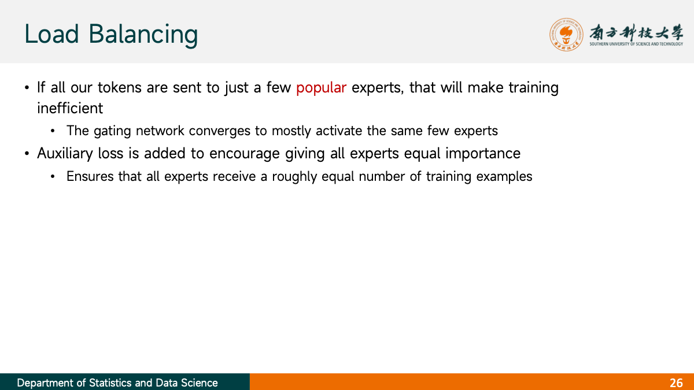

- If all our tokens are sent to just a few <span style="color:#c00">**popular**</span> experts, that will make training **inefficient**
  - The gating network **converges to mostly activate the same few experts**（门控网络收敛到只激活那几个专家）
- **Auxiliary loss** is added to encourage giving all experts **equal importance**
  - Ensures that all experts receive a roughly equal number of training examples

这就是 [Lecture 4 P19](../sta5007-04/) 里 `routing_entropy` 指标要监控的那个问题——**路由塌缩**。

后果有三重：

1. **参数浪费**：冷门专家占着显存却不干活，MoE 退化成一个小稠密模型。
2. **容量溢出**：热门专家超出处理上限，多余 token 被丢弃（drop），信息直接损失。
3. **负载不均**：在专家并行下，持有热门专家的 GPU 成为瓶颈，其他卡在等它——**整体吞吐由最慢的那张卡决定**。

#### P25　辅助损失的构造

*Load Balancing · [2006.16668] GShard*

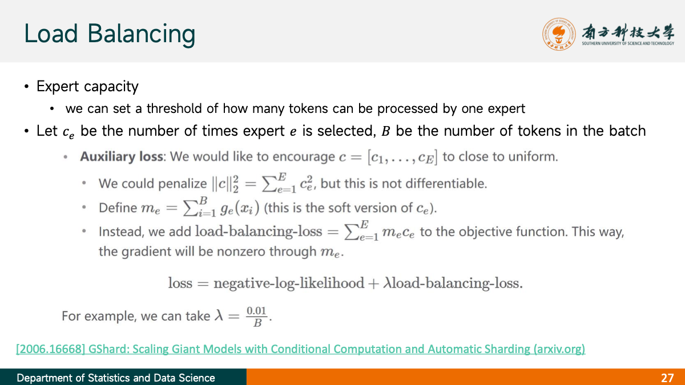

- **Expert capacity**
  - we can set a threshold of how many tokens can be processed by one expert
- Let $c_e$ be the number of times expert $e$ is selected, $B$ be the number of tokens in the batch
  - **Auxiliary loss**: We would like to encourage $c = [c_1, \ldots, c_E]$ to close to uniform.
    - We could penalize $\|c\|_2^2 = \sum_{e=1}^{E} c_e^2$, but **this is not differentiable**.
    - Define $m_e = \sum_{i=1}^{B} g_e(x_i)$ (this is the **soft version** of $c_e$).
    - Instead, we add $\text{load-balancing-loss} = \sum_{e=1}^{E} m_e c_e$ to the objective function. This way, the gradient will be nonzero through $m_e$.

$$
\text{loss} = \text{negative-log-likelihood} + \lambda\,\text{load-balancing-loss}
$$

For example, we can take $\lambda = \frac{0.01}{B}$.

**这一页的推理链非常漂亮，值得逐步跟一遍：**

**第一步：想要什么。** 希望每个专家被选中的次数 $c_e$ 大致相等，即向量 $c$ 接近均匀。

**第二步：最自然的惩罚项。** 在总和固定的约束下，$\|c\|_2^2 = \sum_e c_e^2$ 在均匀分布时取最小值（柯西不等式）。所以惩罚 $\|c\|_2^2$ 就能鼓励均匀。

**第三步：卡住了。** $c_e$ 是「被选中的次数」，是一个**计数**——来自 top-$k$ 这个离散操作，对参数的梯度处处为 0。没法反向传播。

**第四步：巧妙的替换。** 定义 $m_e = \sum_i g_e(x_i)$，即专家 $e$ 在整个 batch 上收到的**门控概率之和**。这是 $c_e$ 的「软版本」——$c_e$ 数的是「被选了几次」，$m_e$ 加的是「被选中的倾向有多强」。**关键在于 $m_e$ 是可导的**，因为门控概率 $g_e$ 来自 softmax。

**第五步：混合形式。** 最终用 $\sum_e m_e c_e$ 而不是 $\sum_e m_e^2$。这里 $c_e$ 被当作**常数**（不回传梯度），只有 $m_e$ 提供梯度。

**这个设计的精妙之处**：$c_e$ 提供了「实际负载」这个准确的信号（它是真实计数，不是近似），$m_e$ 提供了可导的通路。梯度的效果是——**对已经过载的专家（$c_e$ 大），降低它的门控概率**。既准确又可导。

$\lambda = 0.01/B$ 说明这个正则项很弱。这是有道理的：它只是防止极端塌缩，**不应该强到干扰模型学习真正有意义的路由模式**。毕竟我们希望不同专家真的分工，而不是强行让每个专家接收一样的 token。

---

### 🖊 本模块练习（P15–P25）

1. ★ LLaMA 的 FFN 有三个权重矩阵，为什么 `hidden_dim` 要乘 2/3？

<details><summary>解析</summary>

**为了保持参数量不变，使对比实验公平。**

- 原版 FFN：$W_1 \in \mathbb{R}^{d\times h}$、$W_2 \in \mathbb{R}^{h\times d}$，共 $2dh$ 个参数。
- SwiGLU：`w1`（gate）、`w3`（up）、`w2`（down），共 $3dh$ 个参数。

要让两者相等：$3dh' = 2dh \Rightarrow h' = \frac{2}{3}h$。

这正是 P18 那句 *With reduced hidden dimension of the projections to keep parameter count the same* 的含义。如果不做这个缩减，SwiGLU 会多 50% 参数——效果更好就可能只是因为模型更大，而不是结构更优。

</details>

2. ★ 从 P18 的实验表能得出什么结论？是「换激活函数」重要还是「加门控」重要？

<details><summary>解析</summary>

**门控重要，换激活函数几乎没用。**

看 524,288 步那一列：

- 只换激活函数：ReLU 1.677 / GELU 1.679 / Swish 1.683 —— **三者差别在噪声范围内，ReLU 甚至略好**。
- 加了 GLU 门控：GLU 1.663 / Bilinear 1.648 / GEGLU **1.633** / SwiGLU **1.636** / ReGLU 1.645 —— **全部明显优于前三行**。

最好的 GEGLU 比 baseline 低 0.044，而激活函数之间的差别只有 0.006。

**机制上的解释**：普通 FFN 的激活是逐元素的，每个维度独立；GLU 引入了两路之间的**乘性交互**——一路当阀门、一路当内容，阀门开度由输入决定。这种输入依赖的门控比单纯的逐元素非线性表达力更强。

</details>

3. Noisy Top-K Gating 里为什么要加噪声？

<details><summary>解析</summary>

**为了打破「富者愈富」的正反馈，避免路由塌缩。**

没有噪声时：某个专家因随机初始化碰巧得分略高 → 被选中 → 获得梯度、变得更强 → 更容易被选中 → 其余专家永远得不到训练机会。最终只有少数专家在工作。

加噪声后，排名相近的专家有机会被选中，从而获得训练信号。这本质上是**探索-利用权衡**，和强化学习里的 $\epsilon$-greedy 同理。

细节上，噪声强度 $\text{Softplus}((x\cdot W_{\text{noise}})_i)$ 是**可学习的**——模型自己决定在哪些输入上需要更多探索。Softplus 保证强度为正。

</details>

4. ★ 负载均衡损失为什么不能直接惩罚 $\|c\|_2^2$？最终的 $\sum_e m_e c_e$ 是怎么解决问题的？

<details><summary>解析</summary>

**不能直接用 $\|c\|_2^2$ 的原因**：$c_e$ 是专家被选中的**次数**，来自 top-$k$ 这个离散选择操作。它对参数的梯度处处为 0，无法反向传播。

**解决办法**：定义软版本 $m_e = \sum_{i=1}^{B} g_e(x_i)$，即门控概率在整个 batch 上的求和。它来自 softmax，**可导**。

**最终形式 $\sum_e m_e c_e$ 的巧妙之处**：它是「可导量 × 常数量」的乘积。

- $c_e$ 被当作常数（不回传梯度），它提供的是**准确的实际负载信息**——真实计数而非近似。
- $m_e$ 提供**可导通路**。

梯度效果是：**对已经过载的专家（$c_e$ 大），压低它的门控概率**。既拿到了准确信号，又保证了可导。

权重 $\lambda = 0.01/B$ 很小，因为这只是防塌缩的护栏，不应干扰模型学习有意义的专家分工。

</details>

5. MoE 理论上「激活参数少所以快」，为什么实际加速远低于理论值？

<details><summary>解析</summary>

三个抵消因素：

1. **路由开销**：每个 token 都要算门控 logits、排序取 top-$k$、按专家分组。这些操作本身不便宜，而且很多是访存密集型，GPU 利用率低。
2. **All-to-All 通信**：专家通常分散在不同 GPU（专家并行）。token 要先发送到持有目标专家的卡，算完再收回来。这是两次 All-to-All，通信量大且延迟高。
3. **负载不均**：即使有辅助损失，专家负载也不可能完全均匀。整体吞吐由**最慢的那张卡**决定，热门专家所在的 GPU 成为瓶颈。

此外，显存并没有省——所有专家的权重都得驻留。所以 MoE 真正省的是**算力**，代价是**显存和通信**。

</details>

6. 为什么 MoE 通常只替换 FFN 层，而不动自注意力？

<details><summary>解析</summary>

三个原因：

1. **参数占比**：在标准 Transformer block 里，FFN 约占 2/3 的参数（$d \to 4d \to d$ 两个大矩阵），注意力只占 1/3。替换 FFN 收益最大。
2. **天然的独立性**：FFN 是**逐位置独立**的——每个 token 各过各的，互不影响。这正好适合「不同 token 走不同专家」。而注意力的本质是 token 之间的交互，如果不同 token 走不同的注意力专家，$QK^\top$ 该怎么算？语义上就说不通。
3. **实现复杂度**：FFN 换成 MoE 只需在层内做分发和聚合，接口清晰。注意力做 MoE 要处理 KV cache 怎么分配等一堆麻烦。

（确实有 Mixture-of-Attention 这类工作，见 [Lecture 4 P46](../sta5007-04/) 的分类图，但远不如 MoE-FFN 主流。）

</details>

---
`Part 3 · P26–P33`

## 三、注意力变体：都是在省 KV cache

这一部分对应 P15 表格的最后一行。MQA、GQA、MLA、SWA 看似各不相同，但它们解决的是**同一个问题**：自回归生成时，KV cache 会随着序列变长而线性膨胀，最终吃光显存。

#### P26　回顾：多头注意力

*Recap: Multi-Head Attention*

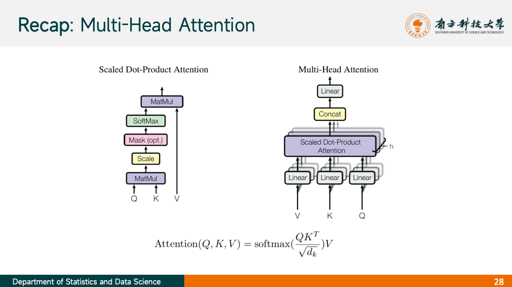

$$
\text{Attention}(Q,K,V) = \text{softmax}\!\left(\frac{QK^\top}{\sqrt{d_k}}\right)V
$$

**🖼 逐元素图解**

- **左图（Scaled Dot-Product Attention）**：$Q$、$K$ 进 `MatMul` → `Scale`（除以 $\sqrt{d_k}$）→ `Mask (opt.)` → `SoftMax` → 与 $V$ 做 `MatMul`。
- **右图（Multi-Head Attention）**：$V$、$K$、$Q$ 各过一个 `Linear` 投影，送进 `Scaled Dot-Product Attention`（标注 $h$ 表示重复 $h$ 份），结果 `Concat` 后再过一个 `Linear`。

这是 [Lecture 2](../sta5007-02/) 的内容，这里作为后面几页的基准。**要记住的关键数字是 KV cache 的大小**：

$$
\text{KV cache} = 2 \times b \times s \times h \times d_{\text{head}} \times l \times (\text{字节数})
$$

其中 $b$ 批大小、$s$ 序列长度、$h$ 头数、$d_{\text{head}}$ 每头维度、$l$ 层数，乘 2 是因为 K 和 V 各一份。

举个具体例子（LLaMA-2 7B，FP16）：$h=32$、$d_{\text{head}}=128$、$l=32$、$s=4096$、$b=1$：

$$
2 \times 1 \times 4096 \times 32 \times 128 \times 32 \times 2\text{B} = 2\ \text{GB}
$$

**单条 4K 序列就要 2 GB。** batch 开到 16 就是 32 GB——比模型权重本身（13 GB）还大。这就是后面所有变体的动机。

#### P27　多查询注意力（MQA）

*Multi-query Attention · [1911.02150] Fast Transformer Decoding: One Write-Head is All You Need*

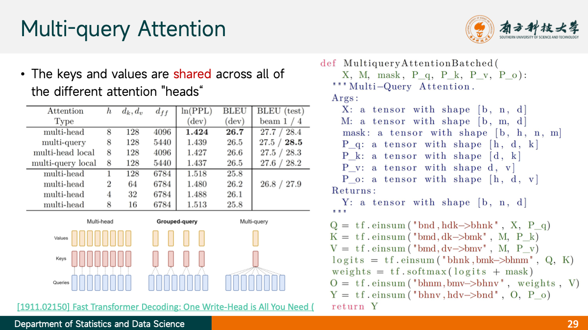

- The keys and values are <span style="color:#c00">**shared**</span> across all of the different attention "heads"（所有注意力头**共享同一份** K 和 V）

实验结果表：

| Attention Type | $h$ | $d_k,d_v$ | $d_{ff}$ | ln(PPL) dev | BLEU dev | BLEU test (beam 1/4) |
|---|---|---|---|---|---|---|
| multi-head | 8 | 128 | 4096 | **1.424** | **26.7** | 27.7 / 28.4 |
| multi-query | 8 | 128 | 5440 | 1.439 | 26.5 | 27.5 / **28.5** |
| multi-head local | 8 | 128 | 4096 | 1.427 | 26.6 | 27.5 / 28.3 |
| multi-query local | 8 | 128 | 5440 | 1.437 | 26.5 | 27.6 / 28.2 |
| multi-head | 1 | 128 | 6784 | 1.518 | 25.8 | |
| multi-head | 2 | 64 | 6784 | 1.480 | 26.2 | 26.8 / 27.9 |
| multi-head | 4 | 32 | 6784 | 1.488 | 26.1 | |
| multi-head | 8 | 16 | 6784 | 1.513 | 25.8 | |

**🖼 逐元素图解**（底部三栏对比图）

| | Multi-head | Grouped-query | Multi-query |
|---|---|---|---|
| **Values** | 8 个（每头一个） | 4 个（每 2 头一组） | **1 个** |
| **Keys** | 8 个 | 4 个 | **1 个** |
| **Queries** | 8 个 | 8 个 | 8 个 |

右侧是 TensorFlow 实现，关键在 einsum 的下标：

```python
Q = tf.einsum("bnd,hdk->bhnk", X, P_q)   # Q 有 h 这一维
K = tf.einsum("bmd,dk->bmk",   M, P_k)   # K 没有 h！
V = tf.einsum("bmd,dv->bmv",   M, P_v)   # V 没有 h！
logits  = tf.einsum("bhnk,bmk->bhnm", Q, K)
weights = tf.softmax(logits + mask)
O = tf.einsum("bhnm,bmv->bhnv", weights, V)
Y = tf.einsum("bhnv,hdv->bnd", O, P_o)
```

**注意 `P_k` 的形状是 `[d, k]` 而不是 `[h, d, k]`**——这一个字母的差别就是 MQA 的全部。K 和 V 的投影矩阵不再有头的维度，所有头共用同一份。

**效果分析**：

- KV cache 缩小 **$h$ 倍**（8 头就是 8 倍）。
- 质量损失：ln(PPL) 从 1.424 升到 1.439，BLEU 从 26.7 降到 26.5。**有损失，但不大**。

表格下半部分是一组重要的对照实验：直接把头数从 8 减到 1（multi-head, $h=1$），ln(PPL) 是 1.518——**比 MQA 的 1.439 差得多**。

这说明：**多头的价值主要在「多个不同的 Query 视角」，而不在「多份 K/V」**。MQA 保留了 8 个查询头、只共享 K/V，所以质量掉得少；而 $h=1$ 连查询视角都只剩一个，质量就崩了。

> **💡 论文标题里的 "One Write-Head" 是什么意思**
>
> 在自回归解码时，K/V 是要「写入」cache 的，Q 是「读取」用的。MQA 只有一份 K/V 要写，所以叫 one write-head。这个命名点出了它优化的正是**写入与存储**这一侧。

#### P28　分组查询注意力（GQA）

*Grouped-Query Attention · [2305.13245] GQA*

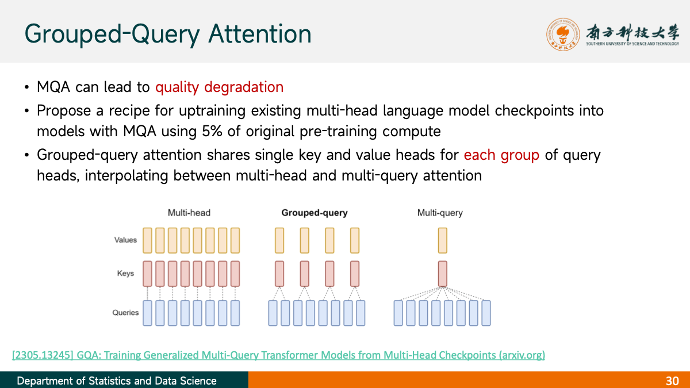

- MQA can lead to <span style="color:#c00">**quality degradation**</span>
- Propose a recipe for **uptraining** existing multi-head language model checkpoints into models with MQA using **5% of original pre-training compute**
- Grouped-query attention shares single key and value heads for <span style="color:#c00">**each group**</span> of query heads, **interpolating between** multi-head and multi-query attention

**🖼 逐元素图解**

图中三栏（Values / Keys / Queries 三行）：

- **Multi-head**：8 个 Value、8 个 Key、8 个 Query，一一对应。
- **Grouped-query**：**4 个** Value、**4 个** Key、8 个 Query。虚线显示每 2 个 Query 共享一组 K/V。
- **Multi-query**：**1 个** Value、**1 个** Key、8 个 Query。所有 Query 共享同一组。

GQA 的设计非常直白——**它就是一个插值参数**：

$$
\text{GQA-}g:\quad g=h \Rightarrow \text{MHA}, \qquad g=1 \Rightarrow \text{MQA}
$$

其中 $g$ 是 K/V 组数。KV cache 缩小 $h/g$ 倍。LLaMA-2 70B 用的是 $h=64$、$g=8$，缩小 8 倍。

**为什么 GQA 成了主流而不是 MQA？** 三个理由：

1. **质量-显存权衡更好**。GQA-8 几乎无损，MQA 有可测量的下降。
2. **张量并行天然契合**。模型通常按头切分到 8 张卡上，如果是 MQA，那唯一的一份 K/V 要么复制到每张卡（省不了显存）、要么跨卡通信（很慢）。**GQA 让每张卡正好持有自己的那组 K/V**，完美对齐。
3. **可以从已有模型改造**。这就是那句 *uptraining* ——把已训好的 MHA checkpoint 的 K/V 头按组**平均池化**，然后只用原预训练 5% 的算力继续训练，就能得到一个 GQA 模型。不用从头训。

> **💡 Uptraining 的具体做法**
>
> 要从 $h$ 个 K/V 头变成 $g$ 组，最自然的初始化是把每组内的 $h/g$ 个头**求平均**。平均比随便挑一个好，因为它保留了组内所有头的信息。然后短暂微调让模型适应新结构。
>
> 这个技巧的实际意义很大：LLaMA-2 不必为了用 GQA 而重新预训练。

#### P29　多头潜在注意力（MLA）：思想

*Multi-Head Latent Attention · [2405.04434] DeepSeek-V2*

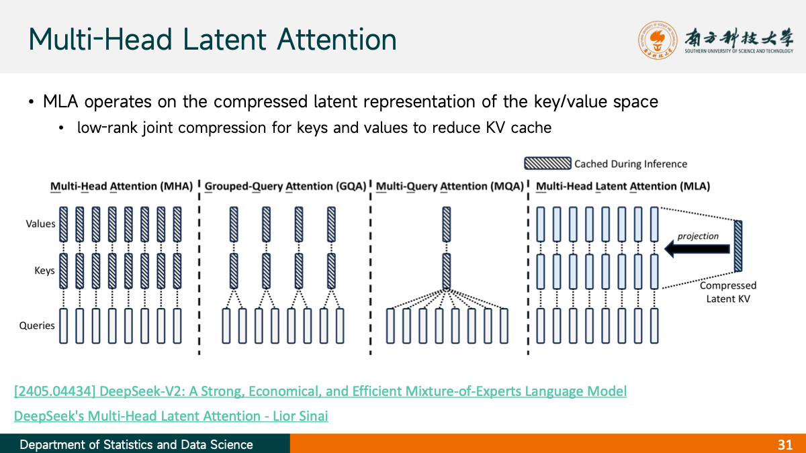

- MLA operates on the **compressed latent representation** of the key/value space
  - **low-rank joint compression** for keys and values to reduce KV cache

**🖼 逐元素图解**

四栏并排，**斜纹填充表示「推理时需要缓存的部分」**（图例：Cached During Inference）：

| | 缓存了什么 |
|---|---|
| **MHA** | 8 个 Key + 8 个 Value，全部带斜纹 → 缓存量最大 |
| **GQA** | 4 组 K/V 带斜纹 → 缓存量是 MHA 的一半 |
| **MQA** | 1 组 K/V 带斜纹 → 最小 |
| **MLA** | K 和 V 都是**空心的**（不缓存），右侧一根细长的 `Compressed Latent KV` 带斜纹，用箭头标注 `projection` |

**MLA 的思路和前两者完全不同**：

- MQA/GQA 是**减少头数**——少存几份。
- MLA 是**降维压缩**——每一份都存得更小。

具体做法：不缓存 K 和 V 本身，而是缓存一个低维的潜在向量 $c^{KV}$；需要用 K/V 时，从 $c^{KV}$ 现场投影出来。

所以 MLA 保留了**全部 $h$ 个头各自不同的 K/V**（图中 MLA 那栏的 K/V 方块数量和 MHA 一样多），质量上更有保障；省显存靠的是那根细细的潜在向量。

#### P30　MLA 的数学形式

*Multi-Head Latent Attention*

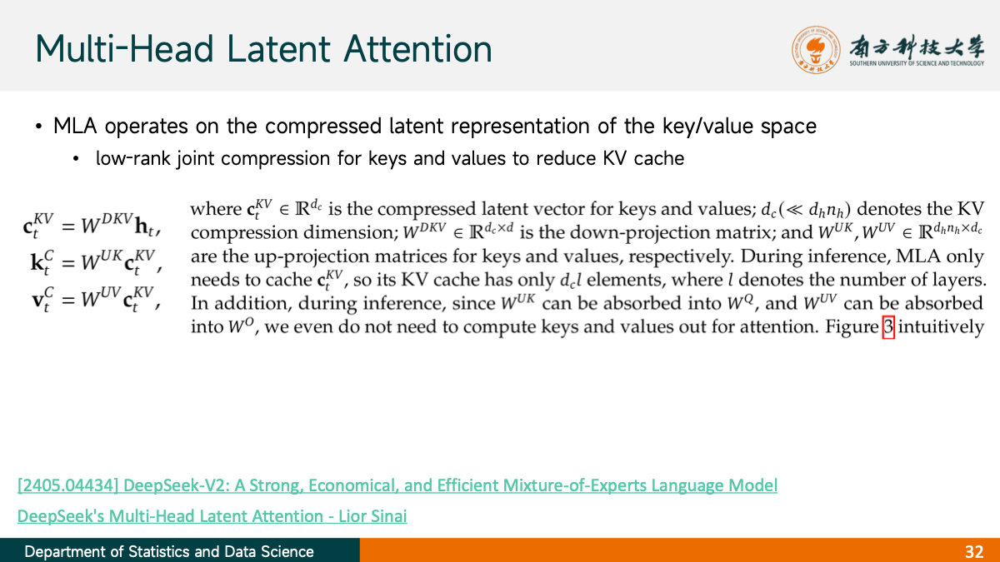

$$
\begin{aligned}
\mathbf{c}_t^{KV} &= W^{DKV}\mathbf{h}_t\\
\mathbf{k}_t^{C} &= W^{UK}\mathbf{c}_t^{KV}\\
\mathbf{v}_t^{C} &= W^{UV}\mathbf{c}_t^{KV}
\end{aligned}
$$

原文说明：

> where $\mathbf{c}_t^{KV} \in \mathbb{R}^{d_c}$ is the compressed latent vector for keys and values; $d_c (\ll d_h n_h)$ denotes the KV compression dimension; $W^{DKV} \in \mathbb{R}^{d_c \times d}$ is the down-projection matrix; and $W^{UK}, W^{UV} \in \mathbb{R}^{d_h n_h \times d_c}$ are the up-projection matrices for keys and values, respectively. During inference, **MLA only needs to cache $\mathbf{c}_t^{KV}$**, so its KV cache has only $d_c l$ elements, where $l$ denotes the number of layers. In addition, during inference, **since $W^{UK}$ can be absorbed into $W^Q$, and $W^{UV}$ can be absorbed into $W^O$, we even do not need to compute keys and values out for attention.**

**逐步拆解**：

**第一步：降维。** $\mathbf{h}_t$（维度 $d$）经 $W^{DKV}$ 压缩成 $\mathbf{c}_t^{KV}$（维度 $d_c$），其中 $d_c \ll d_h n_h$。**只有这个 $\mathbf{c}_t^{KV}$ 需要缓存**，cache 大小从 $2 d_h n_h l$ 降到 $d_c l$。

**第二步：升维。** 用时再通过 $W^{UK}$、$W^{UV}$ 投影回完整的 K、V。

**第三步（最妙的一步）：矩阵吸收。** 注意力打分是

$$
\mathbf{q}_t^\top \mathbf{k}_s = (W^Q \mathbf{h}_t)^\top (W^{UK}\mathbf{c}_s^{KV}) = \mathbf{h}_t^\top \underbrace{(W^Q)^\top W^{UK}}_{\text{可以预先合并}} \mathbf{c}_s^{KV}
$$

由于矩阵乘法结合律，$(W^Q)^\top W^{UK}$ 可以**在推理前就乘好**，变成一个新矩阵。于是**运行时根本不需要把 K 还原出来**——直接拿 $\mathbf{h}_t$ 和 $\mathbf{c}_s^{KV}$ 算就行。同理 $W^{UV}$ 可以吸收进输出投影 $W^O$。

**这意味着「升维」这一步在推理时是免费的**——不增加任何计算量，纯粹省了显存。这是 MLA 最漂亮的地方：它看起来是「压缩再解压」，实际上解压那步被代数消掉了。

> **⚠️ MLA 和 RoPE 的冲突**
>
> 上面的吸收技巧有个前提：$W^Q$ 和 $W^{UK}$ 之间没有别的操作。但 RoPE（P50 开始讲）要对 Q 和 K **按位置施加旋转**，而旋转矩阵依赖于位置 $t$，没法预先吸收进固定的权重矩阵。
>
> DeepSeek 的解法是把每个头的维度**拆成两部分**：一部分走压缩路径（不加 RoPE），另一部分单独保留、施加 RoPE。这就是论文里 "decoupled RoPE" 的由来。这个细节课件没展开，但它是 MLA 实现中最容易踩的坑。

#### P31　滑动窗口注意力（SWA）

*Attention: Sliding Window Attention (SWA)*

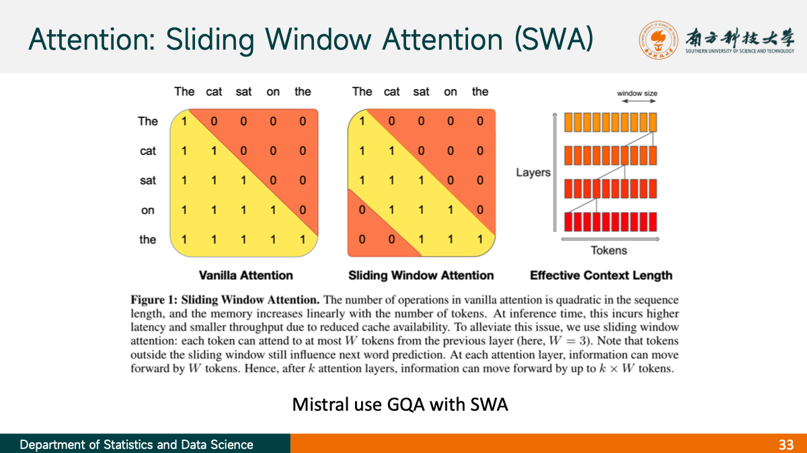

**🖼 逐元素图解**

三张图，以句子 "The cat sat on the" 为例：

**左：Vanilla Attention** —— 标准因果掩码，下三角全是 1：

```
        The cat sat on the
The      1   0   0   0   0
cat      1   1   0   0   0
sat      1   1   1   0   0
on       1   1   1   1   0
the      1   1   1   1   1
```

**中：Sliding Window Attention**（$W=3$）—— 只保留对角线附近的带状区域：

```
        The cat sat on the
The      1   0   0   0   0
cat      1   1   0   0   0
sat      1   1   1   0   0
on       0   1   1   1   0      ← "on" 看不到 "The" 了
the      0   0   1   1   1      ← "the" 只能看到最近 3 个
```

**右：Effective Context Length** —— 四层堆叠，每层的箭头向左上方延伸，显示信息如何逐层向前传播。

原文图注：

> The number of operations in vanilla attention is **quadratic** in the sequence length, and the memory increases **linearly** with the number of tokens. At inference time, this incurs higher latency and smaller throughput due to reduced cache availability. To alleviate this issue, we use sliding window attention: each token can attend to at most $W$ tokens from the previous layer (here, $W=3$). Note that **tokens outside the sliding window still influence next word prediction**. At each attention layer, information can move forward by $W$ tokens. Hence, **after $k$ attention layers, information can move forward by up to $k \times W$ tokens**.

底部标注：**Mistral use GQA with SWA**。

**最关键的一句是那个「仍然有影响」。** 直觉上，第 5 个 token 看不到第 1 个，信息就断了。但实际上：

- 第 1 层：token 5 看到 token 3、4、5。
- 第 2 层：token 3 的表示里已经包含了 token 1、2 的信息（它在第 1 层看过它们）。所以 token 5 通过 token 3 **间接**接触到了 token 1。

**这正是卷积网络里「感受野」的概念**——单层感受野是 $W$，$k$ 层堆叠后感受野是 $k \times W$。Mistral 用 $W=4096$、32 层，理论感受野是 131,072 token。

**代价**：信息是**逐层间接传递**的，每经过一层就被压缩、混合一次。所以远距离信息虽然「能到达」，但保真度远低于直接注意力。**精确回忆很远处的某个具体 token，SWA 是做不好的**。

> **💡 SWA 省的是什么**
>
> - **计算**：从 $O(s^2)$ 降到 $O(s \cdot W)$，序列越长省得越多。
> - **KV cache**：每层只需保留最近 $W$ 个 token 的 K/V，cache 大小**不再随序列增长**，变成常数 $O(W)$。
>
> 第二点在长上下文推理时尤其重要——这意味着理论上可以处理无限长的流式输入。

#### P32　混合架构：Qwen3-Next

*Hybrid Architecture · Gated DeltaNet + Gated Attention (Qwen3-Next)*

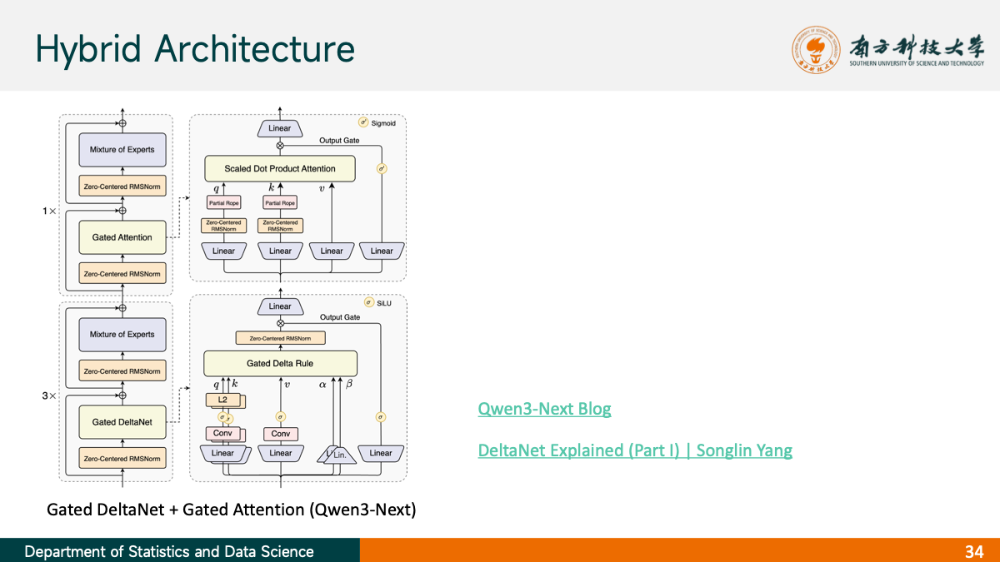

**🖼 逐元素图解**

左侧是层的排布模式，**注意两种 block 的数量比例**：

```
┌─ 1× ─────────────────────┐
│  Zero-Centered RMSNorm    │
│  Gated Attention          │   ← 标准注意力，但只占 1 份
│  Zero-Centered RMSNorm    │
│  Mixture of Experts       │
└───────────────────────────┘
┌─ 3× ─────────────────────┐
│  Zero-Centered RMSNorm    │
│  Gated DeltaNet           │   ← 线性注意力，占 3 份
│  Zero-Centered RMSNorm    │
│  Mixture of Experts       │
└───────────────────────────┘
```

右上是 **Gated Attention** 的展开：$q$、$k$ 各经 `Linear` → `Zero-Centered RMSNorm` → `Partial Rope`，$v$ 直接 `Linear`，三者进 `Scaled Dot Product Attention`，输出乘一个 **Sigmoid 输出门**，再过 `Linear`。

右下是 **Gated DeltaNet** 的展开：$q$、$k$ 过 `Linear` → `Conv` → `L2` 归一化，$v$ 过 `Linear` → `Conv`，另有 $\alpha$、$\beta$ 两个门控参数，一起进 `Gated Delta Rule`，输出经 `Zero-Centered RMSNorm` 和 **SiLU 输出门**。

**这页的核心信息就是那个 1:3 的配比。**

回忆 [Lecture 4 P46](../sta5007-04/) 的分类：线性注意力省算力但丢精确检索能力，标准注意力精确但 $O(n^2)$。混合架构的策略是：

> **少数层用标准注意力保住精确检索能力，多数层用线性结构承担计算量。**

1:3 意味着 75% 的层是线性的，整体复杂度大幅下降；但每 4 层就有一层能做精确的全局回看，保证了「从长文档里找出某个具体数字」这类能力不至于退化。

注意几个细节呼应了本讲其他部分：

- **Zero-Centered RMSNorm** —— P41 会讲。
- **Partial RoPE** —— 只对一部分维度施加旋转，和 MLA 的 decoupled RoPE 是同一类思路。
- **Output Gate**（Sigmoid / SiLU）—— 和 P18 的 GLU 门控是同一个套路，只是用在了注意力输出上。

#### P33　Kimi-K3 的结构

*Kimi-K3 · [2607.24653] Kimi K3: Open Frontier Intelligence*

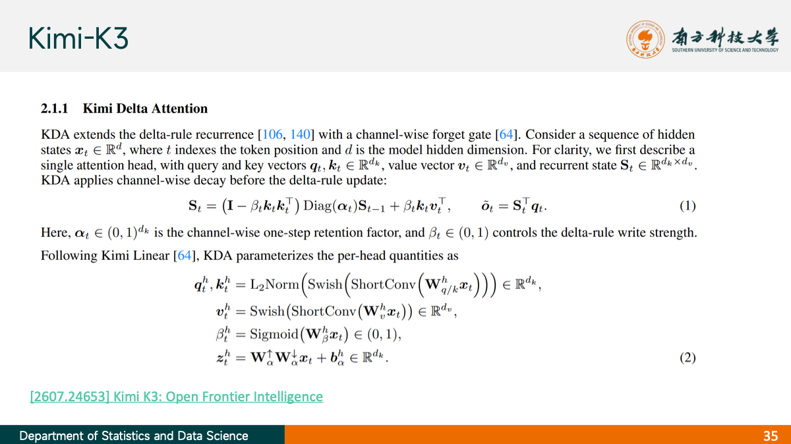

另一个前沿模型的结构选择，同样是混合架构路线。它和 Qwen3-Next 的对照说明：**「几层线性 + 几层注意力」的具体配方目前还没有定论**，各家都在试。

这也提示了本模块的整体结论——注意力这一块，**还没有收敛到一个标准答案**。GQA 是当前最安全的选择，MLA、混合架构都在快速演进。

---

### 🖊 本模块练习（P26–P33）

1. ★ 为什么 KV cache 会成为长上下文推理的瓶颈？给出计算公式。

<details><summary>解析</summary>

自回归生成时，每生成一个新 token 都要和**之前所有 token** 做注意力。为避免重复计算历史 token 的 K/V，就把它们缓存下来。

$$
\text{KV cache} = 2 \times b \times s \times h \times d_{\text{head}} \times l \times \text{bytes}
$$

（乘 2 是 K 和 V 各一份）

以 LLaMA-2 7B、FP16、$s=4096$、$b=1$ 为例：$h=32$、$d_{\text{head}}=128$、$l=32$

$$
2 \times 4096 \times 32 \times 128 \times 32 \times 2 = 2\ \text{GB}
$$

**单条序列 2 GB**，batch 开到 16 就是 32 GB——超过了模型权重本身（13 GB）。而且它随 $s$ 和 $b$ **线性增长**，长上下文 + 高并发时会直接撑爆显存，逼得你减小 batch，吞吐随之下降。

</details>

2. ★ MQA 把 K/V 压到一份，质量只掉一点；而直接把头数减到 1，质量大幅下降。为什么？

<details><summary>解析</summary>

从 P27 的表能读出来：

- MQA（8 个 Q 头，1 组 K/V）：ln(PPL) = 1.439
- multi-head $h=1$（1 个 Q 头，1 组 K/V）：ln(PPL) = 1.518
- MHA（8 个 Q 头，8 组 K/V）：ln(PPL) = 1.424

**多头的价值主要在「多个不同的查询视角」，而不在「多份 K/V」。**

每个 Query 头代表一种「我想找什么」的模式——有的头关注句法依存，有的关注共指，有的关注局部搭配。这种多样性来自 Q 的投影矩阵不同。

而 K/V 提供的是「被查询的内容表示」，即使共享同一份，不同的 Q 头依然能从中提取出不同的信息（因为注意力权重不同）。

所以砍掉 K/V 的多样性代价小，砍掉 Q 的多样性代价大。

</details>

3. GQA 为什么比 MQA 更受欢迎？（提示：想想张量并行）

<details><summary>解析</summary>

三个理由，第二个最关键：

1. **质量损失更小**。GQA-8 基本无损，MQA 有可测量的下降。

2. **和张量并行天然契合**。大模型推理时通常按注意力头切分到多张卡（比如 8 卡，每卡 8 个头）。
   - 如果是 **MQA**：只有一份 K/V，要么复制到 8 张卡上（那就完全没省显存），要么放一张卡上让其他卡来取（跨卡通信，极慢）。
   - 如果是 **GQA-8**：正好 8 组 K/V，**每张卡持有自己的那一组**，无需任何跨卡通信。

3. **可以改造已有模型**。通过 uptraining——把原 MHA 的 K/V 头按组平均池化做初始化，再用原预训练 5% 的算力微调，就能得到 GQA 模型，不必从头训练。

</details>

4. ★ MLA 的「矩阵吸收」是怎么回事？为什么说升维那一步在推理时是免费的？

<details><summary>解析</summary>

注意力打分需要 $\mathbf{q}_t^\top \mathbf{k}_s$。代入 MLA 的定义：

$$
\mathbf{q}_t^\top \mathbf{k}_s = (W^Q\mathbf{h}_t)^\top (W^{UK}\mathbf{c}_s^{KV}) = \mathbf{h}_t^\top \big[(W^Q)^\top W^{UK}\big] \mathbf{c}_s^{KV}
$$

方括号里的 $(W^Q)^\top W^{UK}$ **都是固定的权重矩阵**，可以在推理开始前就乘好，合并成一个新矩阵。

于是运行时直接计算 $\mathbf{h}_t^\top \big[(W^Q)^\top W^{UK}\big] \mathbf{c}_s^{KV}$ ——**全程没有出现完整的 $\mathbf{k}_s$**。升维那一步被代数消掉了，不需要真的执行。

同理，输出端 $W^{UV}$ 可以吸收进 $W^O$。

**结论**：MLA 看起来是「压缩存储 + 解压使用」，实际上解压是免费的。它纯粹省了显存，不付出额外计算——这正是它优雅的地方。

（注意：这个技巧和 RoPE 冲突，因为旋转依赖位置、无法预先吸收。DeepSeek 用 decoupled RoPE 解决，把维度拆成两部分。）

</details>

5. SWA 里 token 看不到窗口外的内容，为什么远处信息「仍然有影响」？

<details><summary>解析</summary>

因为信息通过**层的堆叠**间接传递，这就是卷积网络里的「感受野」。

设窗口 $W=3$，看 token 5 能接触到 token 1 吗：

- **第 1 层**：token 5 直接看 token 3、4、5。同时 token 3 直接看 token 1、2、3。
- **第 2 层**：token 5 再看 token 3 时，此时 token 3 的表示**已经包含了 token 1 的信息**。

所以 token 5 在第 2 层间接接触到了 token 1。

一般地：**$k$ 层之后，感受野是 $k \times W$**。Mistral 用 $W=4096$、32 层，理论感受野 131,072 token。

**但保真度会衰减**：信息每经过一层就被压缩、和其他信息混合一次。所以远距离信息「能到达」但「模糊」——**精确回忆很远处的某个具体 token（比如「第 300 个词是什么」），SWA 做不好**。这也是混合架构要保留少量全注意力层的原因。

</details>

6. Qwen3-Next 用 1 层 Gated Attention 配 3 层 Gated DeltaNet。为什么不全用线性的？

<details><summary>解析</summary>

因为线性注意力（DeltaNet、Mamba 一类）把历史压缩进**固定大小的状态**，必然丢失细节。它擅长「大意是什么」，不擅长「第 300 个 token 原样是什么」。

而标准注意力保留了全部历史的 K/V，可以精确定位任意位置——这个能力在很多任务里不可替代：长文档里找一个具体数字、代码里回溯变量定义、多轮对话里引用之前提到的某个细节。

**1:3 的配比是一个成本-能力的折中**：

- 75% 的层用线性结构 → 整体复杂度和 KV cache 大幅下降。
- 每 4 层有 1 层全注意力 → 保住精确检索能力。

这和 [Lecture 4 P16](../sta5007-04/) 里 Nemotron 3 的 Mamba-Attention 混合是同一个思路。目前各家的具体配比还没有统一（P33 的 Kimi-K3 又是另一套），说明这仍是一个开放问题。

</details>

---
`Part 4 · P34–P41`

## 四、归一化：放哪里、怎么算

对应 P15 表格第二行（Post-LN, Layer-Norm → Pre-LN, RMS-Norm）。这一部分有两个独立的改动：**位置**从后移到前，**算法**从 LayerNorm 换成 RMSNorm。它们各自解决不同的问题。

#### P34　层归一化

*Layer Normalization*

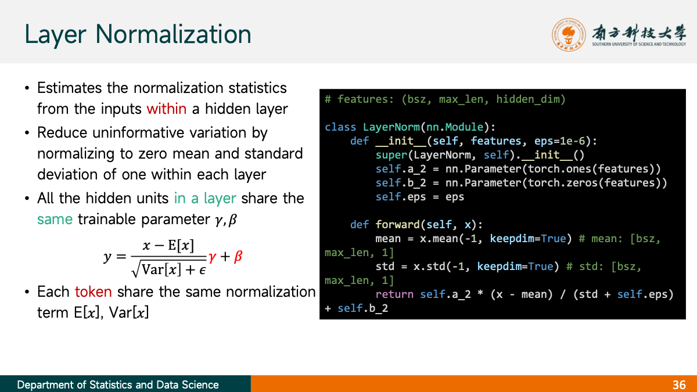

- Estimates the normalization statistics from the inputs <span style="color:#c00">**within**</span> a hidden layer
- Reduce uninformative variation by normalizing to zero mean and standard deviation of one within each layer
- All the hidden units <span style="color:#0a8">**in a layer**</span> share the <span style="color:#0a8">**same**</span> trainable parameter $\gamma, \beta$

$$
y = \frac{x - \mathrm{E}[x]}{\sqrt{\mathrm{Var}[x] + \epsilon}}\,\gamma + \beta
$$

- Each <span style="color:#c00">**token**</span> share the same normalization term $\mathrm{E}[x]$, $\mathrm{Var}[x]$

```python
# features: (bsz, max_len, hidden_dim)
class LayerNorm(nn.Module):
    def __init__(self, features, eps=1e-6):
        super(LayerNorm, self).__init__()
        self.a_2 = nn.Parameter(torch.ones(features))
        self.b_2 = nn.Parameter(torch.zeros(features))
        self.eps = eps

    def forward(self, x):
        mean = x.mean(-1, keepdim=True)   # mean: [bsz, max_len, 1]
        std  = x.std(-1, keepdim=True)    # std:  [bsz, max_len, 1]
        return self.a_2 * (x - mean) / (std + self.eps) + self.b_2
```

**理解 LayerNorm 的关键是看 `dim=-1`。**

`x.mean(-1)` 是在**最后一维（hidden_dim）**上求均值，输出形状 `[bsz, max_len, 1]`。这意味着：

- **每个 token 有自己的一套均值和方差**——统计量在 token 内部的 hidden 维度上计算。
- 不同 token、不同样本之间**互不影响**。

这正是 LayerNorm 相对 BatchNorm 的优势，也是它在 NLP 里通吃的原因：

| | BatchNorm | LayerNorm |
|---|---|---|
| 统计维度 | 跨 batch，同一特征通道 | 单个样本内，跨特征 |
| 依赖 batch 大小 | **是**——小 batch 时统计量噪声大 | 否 |
| 变长序列 | **麻烦**——padding 位置会污染统计量 | 无影响 |
| 训练/推理一致性 | 需要维护 running mean/var | 完全一致 |

NLP 里序列长度不一、batch 常常很小，BatchNorm 的两个弱点全都被踩中，所以 Transformer 从一开始就用 LayerNorm。

注意 $\gamma$（代码里的 `a_2`）和 $\beta$（`b_2`）是**逐特征维度**的可学习参数，形状 `[features]`——归一化把分布拉成标准正态后，再让模型自己学回合适的尺度和偏移。

#### P35　Post-LN：原版的做法

*Pre-Norm and Post-Norm*

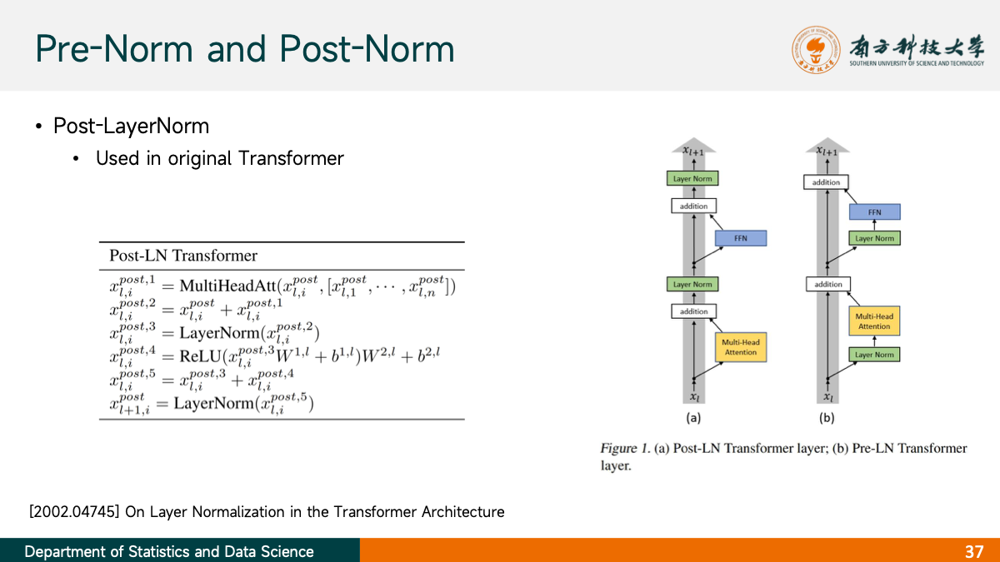

- **Post-LayerNorm**
  - Used in original Transformer

$$
\begin{aligned}
x_{l,i}^{post,1} &= \text{MultiHeadAtt}(x_{l,i}^{post}, [x_{l,1}^{post},\cdots,x_{l,n}^{post}])\\
x_{l,i}^{post,2} &= x_{l,i}^{post} + x_{l,i}^{post,1}\\
x_{l,i}^{post,3} &= \text{LayerNorm}(x_{l,i}^{post,2})\\
x_{l,i}^{post,4} &= \text{ReLU}(x_{l,i}^{post,3}W^{1,l}+b^{1,l})W^{2,l}+b^{2,l}\\
x_{l,i}^{post,5} &= x_{l,i}^{post,3} + x_{l,i}^{post,4}\\
x_{l+1,i}^{post} &= \text{LayerNorm}(x_{l,i}^{post,5})
\end{aligned}
$$

**🖼 逐元素图解**

右侧图 (a) 是 Post-LN，从下往上：$x_l$ → `Multi-Head Attention` → `addition`（残差）→ **`Layer Norm`** → `FFN` → `addition` → **`Layer Norm`** → $x_{l+1}$。

**记忆要点：归一化在残差相加「之后」**。所以叫 Post。

写成简洁形式：

$$
x_{l+1} = \text{LayerNorm}\big(x_l + \text{Sublayer}(x_l)\big)
$$

这里藏着一个致命问题：**残差通路被 LayerNorm 切断了**。

理想的残差连接应该提供一条「梯度高速公路」——$\partial x_{l+1}/\partial x_l$ 里有一个恒等项 1，梯度可以无衰减地传到底层。但在 Post-LN 里，$x_l$ 出来之后立刻被 LayerNorm 缩放，那个恒等项被破坏了。层数一多，梯度就会在传播中失控。

#### P36　Post-LN 的问题

*Pre-Norm and Post-Norm*

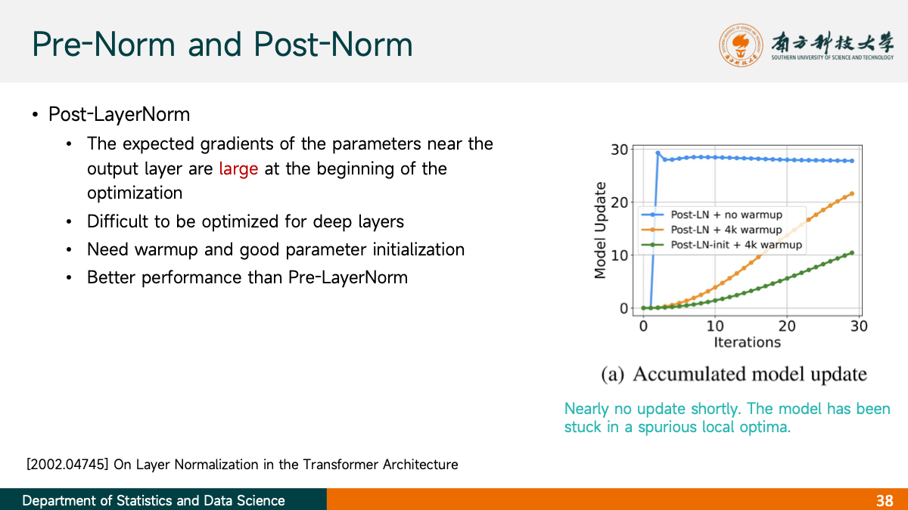

- **Post-LayerNorm**
  - The expected gradients of the parameters near the output layer are <span style="color:#c00">**large**</span> at the beginning of the optimization
  - **Difficult to be optimized for deep layers**
  - **Need warmup and good parameter initialization**
  - **Better performance than Pre-LayerNorm**

**🖼 逐元素图解**

右图（Accumulated model update，横轴 Iterations 0–30，纵轴 Model Update 0–30）三条曲线：

| 曲线 | 行为 |
|---|---|
| **Post-LN + no warmup**（蓝） | 头两步暴冲到 ~29，然后**完全水平** |
| **Post-LN + 4k warmup**（橙） | 缓慢上升，30 步时到 ~22 |
| **Post-LN-init + 4k warmup**（绿） | 上升最慢最平稳，30 步到 ~10 |

图下注释：**Nearly no update shortly. The model has been stuck in a spurious local optima.**（很快就几乎不再更新，模型陷入了虚假的局部最优。）

**蓝线是这页的主角。** 它描述了一个典型的训练崩溃：

1. 训练刚开始，输出层附近的梯度极大。
2. 优化器一步迈得太远，参数被推到一个**病态区域**。
3. 在那里梯度趋近于 0，模型再也动不了——曲线变成水平线。

这不是「收敛」，是**卡死**。所以注释用了 spurious（虚假的）这个词。

**warmup 为什么能救？** 它让学习率从 0 开始线性爬升（比如 4000 步内升到目标值）。初期步长极小，即使梯度很大，参数变化也有限，模型有机会平稳地走过最危险的头几百步。

**但 warmup 是个补丁，不是解药**：它引入了额外超参数（warmup 步数），调不好照样崩；而且它拖慢了整个训练的前期进度。

> **⚠️ 注意最后一条：Post-LN 效果反而更好**
>
> 课件明确写了 *Better performance than Pre-LayerNorm*。这是一个常被忽略的事实——**Pre-LN 是用一点性能换来了训练稳定性**。
>
> 原因在于 Pre-LN 的残差通路是纯粹的恒等映射，深层的输出很容易被浅层「主导」，使得深层的有效贡献变小——相当于有效深度打了折扣。Post-LN 每层都重新归一化，强迫每一层都真正参与。
>
> 现实中大家仍然选 Pre-LN，因为**训不出来的模型再好也没用**。但这个权衡是真实存在的，后来的 DeepNorm、Sandwich-LN 等工作都在试图两者兼得。

#### P37　Pre-LN：现在的做法

*Pre-Norm and Post-Norm*

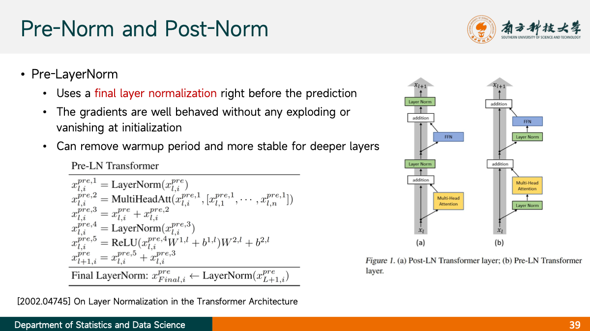

- **Pre-LayerNorm**
  - Uses a <span style="color:#c00">**final layer normalization**</span> right before the prediction
  - The gradients are well behaved **without any exploding or vanishing at initialization**
  - **Can remove warmup period** and more stable for deeper layers

$$
\begin{aligned}
x_{l,i}^{pre,1} &= \text{LayerNorm}(x_{l,i}^{pre})\\
x_{l,i}^{pre,2} &= \text{MultiHeadAtt}(x_{l,i}^{pre,1}, [x_{l,1}^{pre,1},\cdots,x_{l,n}^{pre,1}])\\
x_{l,i}^{pre,3} &= x_{l,i}^{pre} + x_{l,i}^{pre,2}\\
x_{l,i}^{pre,4} &= \text{LayerNorm}(x_{l,i}^{pre,3})\\
x_{l,i}^{pre,5} &= \text{ReLU}(x_{l,i}^{pre,4}W^{1,l}+b^{1,l})W^{2,l}+b^{2,l}\\
x_{l+1,i}^{pre} &= x_{l,i}^{pre,5} + x_{l,i}^{pre,3}
\end{aligned}
$$

$$
\textbf{Final LayerNorm: } x_{Final,i}^{pre} \leftarrow \text{LayerNorm}(x_{L+1,i}^{pre})
$$

**🖼 逐元素图解**

右侧图 (b) 是 Pre-LN：$x_l$ → **`Layer Norm`** → `Multi-Head Attention` → `addition` → **`Layer Norm`** → `FFN` → `addition` → $x_{l+1}$。

**归一化移到了子层「之前」，残差相加是最后一步。**

简洁形式：

$$
x_{l+1} = x_l + \text{Sublayer}\big(\text{LayerNorm}(x_l)\big)
$$

**为什么这个改动能解决梯度问题？** 展开整个网络：

$$
x_L = x_0 + \sum_{l=0}^{L-1}\text{Sublayer}_l\big(\text{LayerNorm}(x_l)\big)
$$

$x_0$ 到 $x_L$ 之间有一条**完全不经过任何归一化的直通路径**。求导时：

$$
\frac{\partial x_L}{\partial x_0} = 1 + \sum_l \frac{\partial(\cdots)}{\partial x_0}
$$

那个 **1** 保证了梯度无论网络多深都不会消失。这就是「梯度高速公路」的字面含义。

**注意那个 Final LayerNorm。** Pre-LN 的每一层输出都没有被归一化过，累加 $L$ 层之后数值会越来越大。所以必须在最后、送进输出层之前补一次归一化——这就是公式最后单独列出的 *Final LayerNorm*，实现时容易漏掉。

#### P38　两者对比小结

*Pre-Norm and Post-Norm*

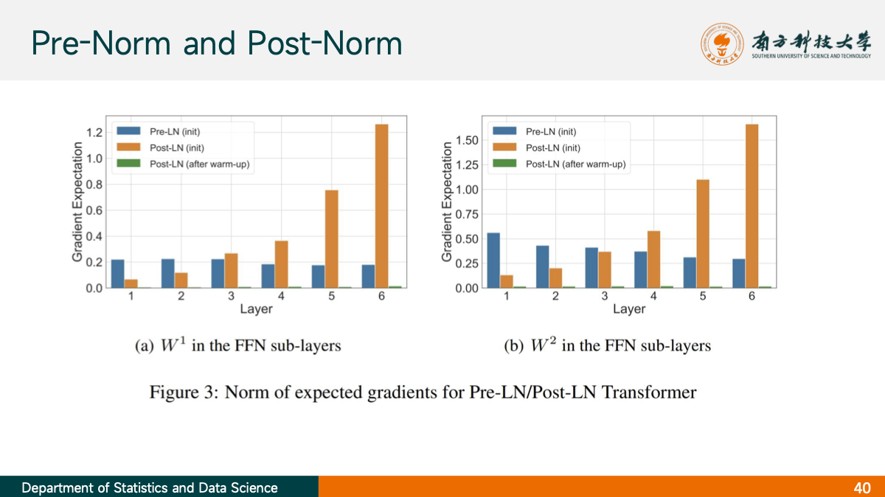

综合对比：

| | **Post-LN** | **Pre-LN** |
|---|---|---|
| 公式 | $\text{LN}(x + \text{Sub}(x))$ | $x + \text{Sub}(\text{LN}(x))$ |
| 残差通路 | 被 LN 切断 | **纯恒等，畅通** |
| 初始化时的梯度 | 输出层附近过大 | 各层平稳 |
| warmup | **必需** | 可以省略 |
| 深层可训练性 | 差，层数一多就崩 | **好** |
| 最终效果 | **略优** | 略差 |
| 额外要求 | 好的初始化 | 末尾需加 Final LN |
| 谁在用 | 原版 Transformer、BERT | **几乎所有现代 LLM** |

一句话总结：**Post-LN 效果略好但难训，Pre-LN 好训但效果略逊；在动辄上百层的今天，「能训出来」压倒一切。**

#### P39　RMSNorm

*RMSNorm*

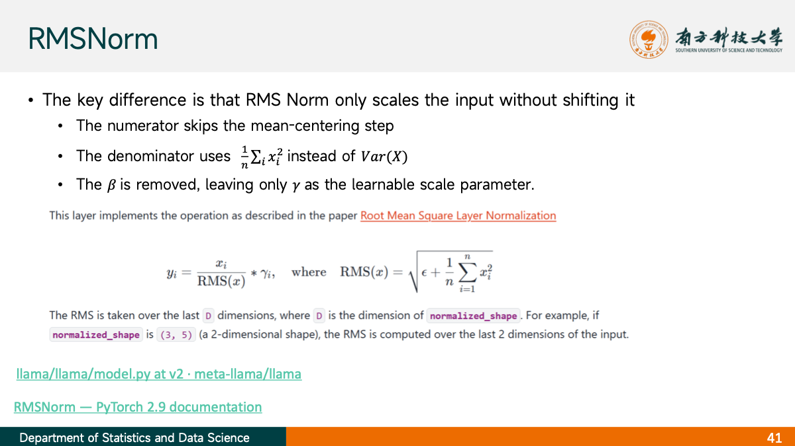

- The key difference is that RMS Norm **only scales the input without shifting it**
  - The numerator **skips the mean-centering step**
  - The denominator uses $\frac{1}{n}\sum_i x_i^2$ instead of $Var(X)$
  - The $\beta$ is removed, leaving only $\gamma$ as the learnable scale parameter.

$$
y_i = \frac{x_i}{\text{RMS}(x)} * \gamma_i, \quad \text{where } \text{RMS}(x) = \sqrt{\epsilon + \frac{1}{n}\sum_{i=1}^{n}x_i^2}
$$

**和 LayerNorm 逐项对照**：

| | LayerNorm | RMSNorm |
|---|---|---|
| 分子 | $x - \mathrm{E}[x]$ | $x$ ——**不减均值** |
| 分母 | $\sqrt{\mathrm{Var}[x]+\epsilon}$ | $\sqrt{\frac{1}{n}\sum x_i^2 + \epsilon}$ ——**均方根** |
| 可学习参数 | $\gamma$ 和 $\beta$ | 只有 $\gamma$ |

注意 $\mathrm{Var}[x] = \frac{1}{n}\sum(x_i - \mathrm{E}[x])^2$，而 RMS 用的是 $\frac{1}{n}\sum x_i^2$。**当均值为 0 时两者相等**；均值不为 0 时，RMS 把均值的贡献也算进了「尺度」里。

**省了什么？**

1. 不用算均值——少一次对整个 hidden 维度的归约（reduction）。
2. 不用做减法——少一次逐元素运算。
3. 少一组参数 $\beta$。

看起来都是小操作，但归一化在每层要做两次、每个 token 都要做，而且它是**访存密集型**（要把整行数据读进来算统计量）。**在大模型里省下的时间相当可观，通常有 7%–15% 的端到端加速。**

**为什么去掉中心化不影响效果？** 这是 RMSNorm 论文的核心论点：LayerNorm 起作用的关键是**重新缩放不变性**（re-scaling invariance），而不是**重新中心化不变性**（re-centering invariance）。既然中心化没起到关键作用，去掉它就是纯赚。实践也验证了这一点——LLaMA 全系列、Qwen、Mistral 都用 RMSNorm。

> **💡 一个实现细节**
>
> LLaMA 的代码里 RMSNorm 通常在 **float32** 下计算，即使模型是 bf16。因为平方和在低精度下容易溢出或损失精度——$\sum x_i^2$ 在 $n=4096$ 时可能是个不小的数。算完再转回 bf16。

#### P40　权重衰减

*Weight Decay*

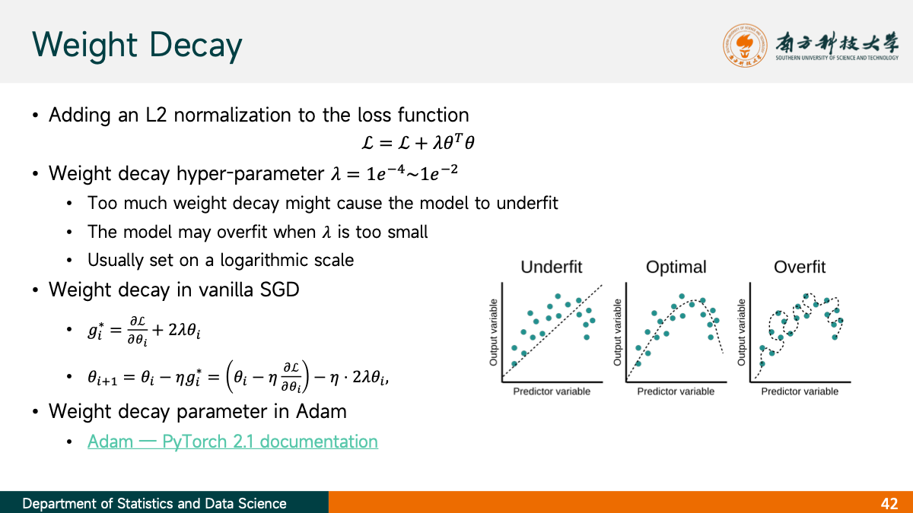

- Adding an L2 normalization to the loss function

$$
\mathcal{L} = \mathcal{L} + \lambda\theta^T\theta
$$

- Weight decay hyper-parameter $\lambda = 1e^{-4} \sim 1e^{-2}$
  - **Too much** weight decay might cause the model to **underfit**
  - The model may **overfit** when $\lambda$ is **too small**
  - Usually set on a **logarithmic scale**
- Weight decay in vanilla SGD

$$
g_i^* = \frac{\partial\mathcal{L}}{\partial\theta_i} + 2\lambda\theta_i
$$

$$
\theta_{i+1} = \theta_i - \eta g_i^* = \left(\theta_i - \eta\frac{\partial\mathcal{L}}{\partial\theta_i}\right) - \eta\cdot 2\lambda\theta_i
$$

- Weight decay parameter in Adam（链接到 PyTorch 文档）

**🖼 逐元素图解**

右侧三张散点图对比拟合程度：

| | Underfit | Optimal | Overfit |
|---|---|---|---|
| 拟合线 | 直线，明显没抓住曲率 | 平滑曲线，贴合趋势 | 剧烈扭曲，穿过每个点 |
| 对应 | $\lambda$ 太大 | $\lambda$ 合适 | $\lambda$ 太小 |

**看第二个公式的最后一项 $-\eta \cdot 2\lambda\theta_i$**：每一步更新都额外减去一个正比于参数自身的量。参数越大，被拉回的幅度越大——这就是「衰减」这个名字的由来。

$\lambda$ 要在**对数尺度**上调（$10^{-4}, 10^{-3}, 10^{-2}$），因为它的影响是乘性的，线性搜索（0.001, 0.002, 0.003）几乎没有区别。

> **⚠️ AdamW 和 Adam + L2 不是一回事**
>
> 课件最后一行留了个链接指向 Adam 文档，这里是一个经典的坑：
>
> - **Adam + L2 正则**：把 $2\lambda\theta$ 加进梯度里，然后这个量会被 Adam 的自适应学习率**除以 $\sqrt{v_t}$ 缩放**。结果是——梯度大的参数（$v_t$ 大）受到的衰减反而更弱，这与正则化的初衷相悖。
> - **AdamW（解耦权重衰减）**：把 $-\eta\lambda\theta$ **直接加在参数更新上**，绕过自适应缩放。
>
> 两者在 Adam 下**不等价**（在 SGD 下才等价）。现代 LLM 训练一律用 AdamW。PyTorch 里 `torch.optim.Adam(weight_decay=...)` 是前者，`torch.optim.AdamW` 才是后者。

#### P41　Zero-Centered RMSNorm

*Zero-Centered RMSNorm · Qwen3-Next Blog*

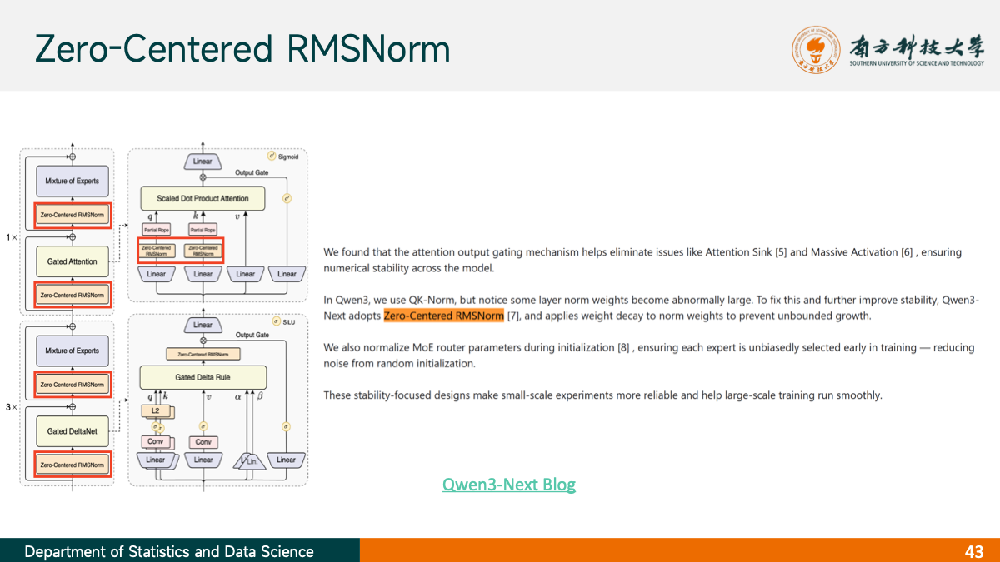

**🖼 逐元素图解**

左侧是 P32 那张 Qwen3-Next 结构图，但**用红框圈出了所有 `Zero-Centered RMSNorm` 的位置**——block 的输入处、MoE 之前，以及注意力内部 q/k 投影之后（即 QK-Norm）。

右侧是 Qwen3-Next 博客的说明：

> We found that the **attention output gating mechanism** helps eliminate issues like **Attention Sink** and **Massive Activation**, ensuring numerical stability across the model.
>
> In Qwen3, we use **QK-Norm**, but notice **some layer norm weights become abnormally large**. To fix this and further improve stability, Qwen3-Next adopts <mark>**Zero-Centered RMSNorm**</mark>, and applies **weight decay to norm weights** to prevent unbounded growth.
>
> We also **normalize MoE router parameters during initialization**, ensuring each expert is unbiasedly selected early in training — reducing noise from random initialization.
>
> These stability-focused designs make small-scale experiments more reliable and help large-scale training run smoothly.

**这段话串起了本讲好几个部分，值得逐条拆开：**

**1. Attention Sink（注意力沉降）与 Massive Activation。**
- *Attention sink*：模型倾向于把大量注意力权重堆在序列开头的几个 token（常常是 `<bos>`）上，即使它们语义上无关紧要。这被认为是 softmax 必须归一化到 1 造成的——当某个 token「不想关注任何东西」时，它需要一个地方倾倒注意力质量。
- *Massive activation*：少数几个隐藏维度的激活值比其他维度大几个数量级，给低精度训练（bf16/fp8）带来数值风险。

课件说**输出门控**（P32 里那个 Sigmoid Output Gate）能缓解这两个问题——因为门控给了模型一条「关掉这个头」的显式通路，不必再靠 attention sink 来变相实现。

**2. QK-Norm 与「norm 权重异常增大」。**
QK-Norm 是在 q、k 投影之后各加一次归一化，目的是防止 $QK^\top$ 的数值爆炸。但 Qwen3 发现 norm 层的 $\gamma$ 会**无节制地变大**——因为 $\gamma$ 没有任何约束，模型可以通过放大 $\gamma$ 来变相抵消归一化的效果。

**3. Zero-Centered RMSNorm 的解法。**
把可学习参数从 $\gamma$ 改写成 $(1+\gamma)$ 的形式，让 $\gamma$ 的**零点对应「不缩放」**。这样一来：
- $\gamma$ 的自然初值是 0（而不是 1）。
- **可以对 $\gamma$ 施加权重衰减**——衰减会把它拉向 0，也就是拉向「恒等」，这是一个合理的默认状态。

如果不做零中心化，对 $\gamma$ 施加权重衰减会把它拉向 0，而 $\gamma=0$ 意味着**整层输出被清零**，显然是灾难。这就是为什么必须先做零中心化，才能安全地用权重衰减约束 norm 权重——**P40 和 P41 是连在一起的**。

**4. 初始化时归一化 MoE router 参数。**
这直接呼应 P24 的负载均衡：让每个专家在训练早期被**无偏地选中**，减少随机初始化带来的噪声。这是在辅助损失之外，从初始化角度防止路由塌缩。

> **💡 这一页的元信息很重要**
>
> 最后一句 *These stability-focused designs make small-scale experiments more reliable* 点出了一个工程上的深层动机：**稳定性不只是为了「不崩」，更是为了让小规模实验的结论可以外推到大规模**。
>
> 回想 [Lecture 4 P26](../sta5007-04/) 讲的「用 1B 小模型验证数据配方」——如果训练本身不稳定，小实验的结果就充满噪声，根本没法用来预测大模型的表现。**稳定性是 Scaling Law 方法论成立的前提。**

---

### 🖊 本模块练习（P34–P41）

1. ★ 为什么 NLP 用 LayerNorm 而不是 BatchNorm？

<details><summary>解析</summary>

三个原因：

1. **变长序列**。NLP 的 batch 里句子长度不一，要 padding。BatchNorm 跨样本统计，padding 位置的零值会污染均值和方差；而 LayerNorm 在单个 token 内部统计，完全不受影响。

2. **不依赖 batch 大小**。BatchNorm 的统计量来自 batch，小 batch 时噪声很大。大模型训练常常因显存限制用很小的 per-device batch，BatchNorm 会不稳。

3. **训练/推理一致**。BatchNorm 推理时要用训练期间累积的 running mean/var，训练和推理行为不同；LayerNorm 两者完全一致，不需要维护额外状态。

代码上的体现就是 `x.mean(-1)`——在 hidden 维度上归约，每个 token 独立。

</details>

2. ★ Post-LN 为什么需要 warmup？Pre-LN 为什么可以不用？

<details><summary>解析</summary>

**Post-LN**：$x_{l+1} = \text{LN}(x_l + \text{Sub}(x_l))$。残差相加之后立刻被 LayerNorm 缩放，**残差的恒等通路被切断了**。求 $\partial x_{l+1}/\partial x_l$ 时没有那个干净的 1，梯度在深层传播时会失控——尤其是输出层附近，初始梯度极大。

后果（P36 蓝线）：不用 warmup 时，头两步就把参数推到病态区域，之后梯度趋于 0，模型卡死在虚假的局部最优。warmup 让学习率从 0 缓慢爬升，避开最危险的前几百步。

**Pre-LN**：$x_{l+1} = x_l + \text{Sub}(\text{LN}(x_l))$。展开整个网络：

$$
x_L = x_0 + \sum_l \text{Sub}(\text{LN}(x_l))
$$

$x_0$ 到 $x_L$ 有一条**完全不过归一化的直通路径**，所以 $\partial x_L/\partial x_0 = 1 + (\cdots)$，那个 1 保证梯度不会消失。初始化时各层梯度就是良态的，不需要 warmup。

</details>

3. Pre-LN 效果略差于 Post-LN，为什么大家还是选 Pre-LN？

<details><summary>解析</summary>

**因为「能训出来」压倒一切。**

Post-LN 效果好的原因是每层都重新归一化，强迫每一层都真正参与计算；而 Pre-LN 的纯恒等残差通路会让深层输出容易被浅层主导，**有效深度打了折扣**。

但在几十上百层的规模下，Post-LN 训练崩溃的风险极高，warmup 也只是补丁——warmup 步数本身成了要调的超参数，调不好照样崩。一次预训练要烧几十上百万美元、跑几个月（回看 [Lecture 4 P18](../sta5007-04/)），**没人愿意赌这个风险**。

后来的 DeepNorm、Sandwich-LN 等工作试图两者兼得，但 Pre-LN 仍是最稳妥的默认选择。

</details>

4. ★ RMSNorm 相比 LayerNorm 省了什么？为什么去掉中心化不影响效果？

<details><summary>解析</summary>

**省了三样**：

1. 计算均值——少一次对 hidden 维度的归约。
2. 做减法——少一次逐元素运算。
3. 参数 $\beta$。

单看都是小操作，但归一化每层做两次、每个 token 都要做，而且是**访存密集型**（要把整行读进来算统计量）。实测端到端加速 7%–15%。

**为什么不影响效果**：RMSNorm 论文的核心论点是，LayerNorm 起作用的关键在于**重新缩放不变性**（把不同尺度的输入拉到可比范围），而不是**重新中心化不变性**。既然中心化不是关键，去掉它就是纯赚。LLaMA、Qwen、Mistral 全系列的实践验证了这一点。

</details>

5. Adam + L2 正则和 AdamW 有什么区别？为什么现代 LLM 用后者？

<details><summary>解析</summary>

**Adam + L2**：把 $2\lambda\theta$ 加进梯度，然后这一项会跟着梯度一起被 Adam 的自适应项 $\sqrt{v_t}$ 缩放。结果是——梯度大的参数（$v_t$ 大）受到的实际衰减**反而更弱**。这与正则化的意图相反：我们希望约束所有参数，而不是只约束那些梯度小的。

**AdamW（解耦权重衰减）**：把 $-\eta\lambda\theta$ **直接加在参数更新上**，完全绕过自适应缩放：

$$
\theta_{t+1} = \theta_t - \eta\left(\frac{\hat m_t}{\sqrt{\hat v_t}+\epsilon} + \lambda\theta_t\right)
$$

这样每个参数受到的衰减强度一致、可预测。

两者在 SGD 下等价，在 Adam 下**不等价**。PyTorch 里 `Adam(weight_decay=...)` 是前者，`AdamW` 才是后者——这是个常见的踩坑点。

</details>

6. ★ 为什么必须先做「零中心化」，才能对 norm 层的 $\gamma$ 施加权重衰减？

<details><summary>解析</summary>

**关键在于「$\gamma$ 的零点意味着什么」。**

- **普通 RMSNorm**：$y = \frac{x}{\text{RMS}(x)}\cdot\gamma$，恒等对应 $\gamma = 1$。权重衰减会把参数拉向 **0**，而 $\gamma = 0$ 意味着**整层输出被清零**——这是灾难性的。所以不能对它施加权重衰减。

- **Zero-Centered RMSNorm**：改写成 $y = \frac{x}{\text{RMS}(x)}\cdot(1+\gamma)$，恒等对应 $\gamma = 0$。现在权重衰减把 $\gamma$ 拉向 0，等于**拉向恒等映射**——这是一个安全合理的默认状态。

Qwen3 遇到的问题正是 QK-Norm 的 $\gamma$ 无节制增大（模型通过放大 $\gamma$ 变相抵消归一化）。有了零中心化，就可以安全地用权重衰减压住它。

**所以 P40（权重衰减）和 P41（零中心化）是配套的一组改动**，单独看任何一个都不完整。

</details>

---
`Part 5 · P42–P60`

## 五、位置编码：从正弦波到旋转

这是全讲最长也最重要的一段，占了 19 页。它的叙事线索非常清楚：

> 绝对位置编码（P42–P44）→ 发现它隐含着旋转关系（P45–P48）→ 但注意力里这个关系被破坏了（P49）→ 于是干脆直接旋转 Q 和 K（P50–P60）

这就是 RoPE 的完整来龙去脉。跟着这条线走，RoPE 不是凭空冒出来的技巧，而是一个必然的结论。

#### P42　正弦位置编码

*Positional Embedding*

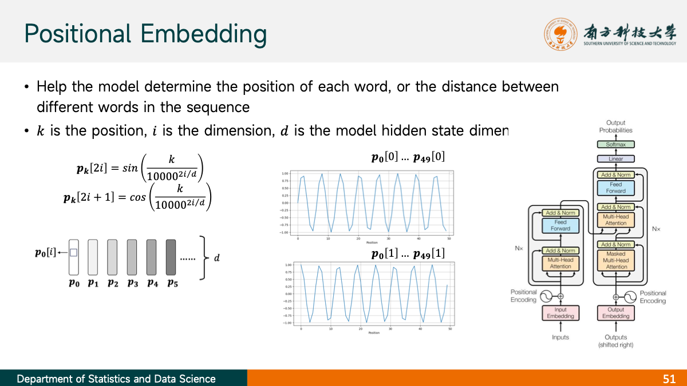

- Help the model determine the **position** of each word, or the **distance** between different words in the sequence
- $k$ is the position, $i$ is the dimension, $d$ is the model hidden state dimension

$$
\begin{aligned}
\boldsymbol{p}_k[2i] &= \sin\!\left(\frac{k}{10000^{2i/d}}\right)\\
\boldsymbol{p}_k[2i+1] &= \cos\!\left(\frac{k}{10000^{2i/d}}\right)
\end{aligned}
$$

**🖼 逐元素图解**

- **左下**：一排灰度渐变的方块 $p_0, p_1, \ldots, p_5$，每个是一个 $d$ 维向量，$p_0[i]$ 指向其中一个分量。
- **中间两张曲线图**：
  - 上图 $p_0[0] \ldots p_{49}[0]$：第 0 维随位置变化，是一条**高频**正弦波（50 个位置里振荡了约 8 个周期）。
  - 下图 $p_0[1] \ldots p_{49}[1]$：第 1 维，同样高频（余弦，相位差 90°）。
- **右侧**：标准 Transformer 架构图，标出 Positional Encoding 在 Input/Output Embedding 之后以 $\oplus$ 相加。

**理解这个公式的关键是「$i$ 越大，频率越低」**：

$$
\text{频率} = \frac{1}{10000^{2i/d}}
$$

- $i=0$：频率 $= 1$，波长 $2\pi \approx 6.3$ ——变化极快。
- $i=d/2-1$：频率 $\approx 1/10000$，波长 $\approx 62832$ ——变化极慢。

所以整个位置向量是一组**从高频到低频排列的正弦波采样**。这个设计的用意在 P44 会讲得更清楚。

> **⚠️ 注意是「相加」不是「拼接」**
>
> 位置编码和词嵌入是 $\oplus$ 相加的，维度都是 $d$。这一点常被误解为拼接。相加意味着位置信息和语义信息**共享同一组维度**——这是后面 P49 会暴露问题的根源。

#### P43　全部维度的热力图

*Positional Embedding*

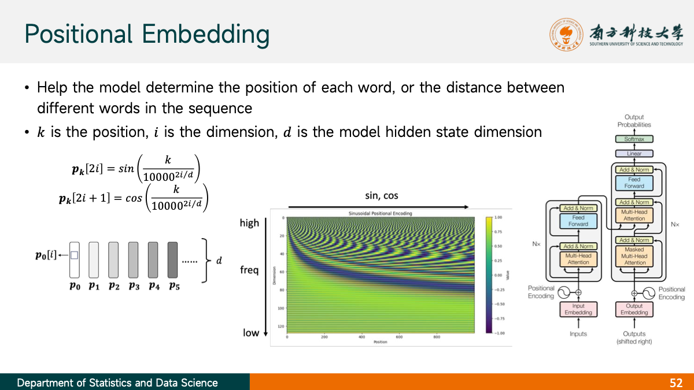

和 P42 同一页的补充：中间换成了一张**完整的热力图**，横轴是位置（0–800），纵轴是维度（0–128，标注上方 high freq、下方 low freq），颜色表示该维度在该位置的取值（−1 到 1）。

**🖼 逐元素图解**

图案呈现出典型的「干涉条纹」：

- **顶部（低维度 = 高频）**：条纹极密，沿横轴快速交替明暗——位置每前进几步，取值就完整振荡一轮。
- **中部**：条纹逐渐变宽，形成向右下方弯曲的弧线族。
- **底部（高维度 = 低频）**：几乎是一整片均匀的颜色——在 800 个位置的范围内，这些维度的取值几乎没变。

这张图把 P42 那两条曲线扩展成了全貌，一眼就能看出**频率沿维度轴单调递减**。底部那片「没有变化」的区域正是 P62 要讲的外推问题的根源——**这些维度在训练长度内根本没转完一圈**，模型对它们的大角度行为一无所知。

#### P44　为什么是多个频率：时钟类比

*Positional Embedding*

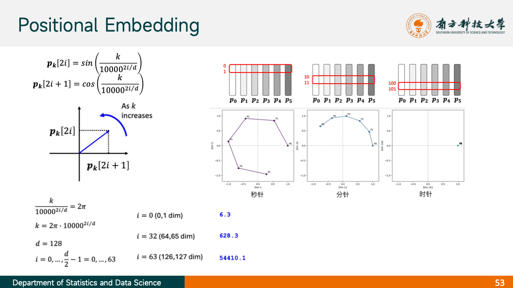

左下角的推导：

$$
\frac{k}{10000^{2i/d}} = 2\pi \quad\Longrightarrow\quad k = 2\pi \cdot 10000^{2i/d}
$$

取 $d=128$，$i = 0, \ldots, \frac{d}{2}-1 = 0,\ldots,63$：

| $i$ | 对应维度 | 波长（走完一圈需要多少个位置） |
|---|---|---|
| $i=0$ | (0,1) 维 | **6.3** |
| $i=32$ | (64,65) 维 | **628.3** |
| $i=63$ | (126,127) 维 | **54410.1** |

**🖼 逐元素图解**

上排三张图，红框分别圈住 $(p_0, p_1)$、$(p_{10}, p_{11})$、$(p_{100}, p_{101})$ 三对维度。

下排三张对应的散点图，把这两维当作平面坐标，画出 $p_0$ 到 $p_5$ 六个位置的点：

| 维度对 | 图中标注 | 六个点的分布 |
|---|---|---|
| Dim 0/1 | **秒针** | 散布在整个圆周上，相邻位置角度差很大 |
| Dim 10/11 | **分针** | 集中在右上象限一小段圆弧上 |
| Dim 100/101 | **时针** | 几乎挤在同一个点（$x\approx1, y\approx0$） |

**这个时钟类比是理解正弦编码的最佳直觉。**

想象一块表：要精确表示「现在是几点几分几秒」，你需要三根指针。

- **秒针**转得快——能分辨相邻的秒，但转一圈就重复了，分不清是第 1 分钟还是第 10 分钟的第 30 秒。
- **时针**转得慢——能区分上午下午，但看不出秒的差别。
- **三根指针合起来**，就能唯一确定一个时刻。

位置编码同理：**高频维度提供局部分辨率，低频维度提供全局范围**。$d=128$ 时有 64 个不同频率的「指针」，波长从 6.3 到 54410，足以为长序列的每个位置给出唯一编码。

> **💡 为什么底数取 10000**
>
> 10000 决定了最长波长（$2\pi \times 10000 \approx 62832$），也就是模型能无歧义区分的位置范围上限。这个值是原论文的经验选择，后来的长上下文工作（P65–P68）正是通过**调整这个底数**来扩展上下文——这叫 NTK-aware scaling。

#### P45　位置编码之间的旋转关系

*Positional Embedding*

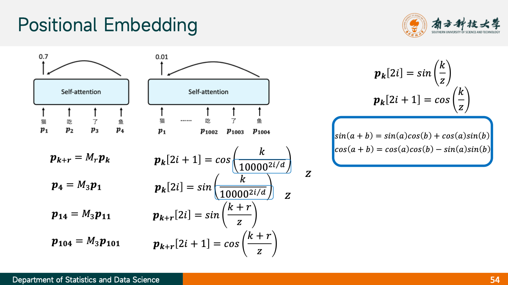

这一页提出了整个 RoPE 故事的**核心观察**。

**🖼 逐元素图解**

上方两个例子：

- 左：句子「猫 吃 了 鱼」，位置 $p_1 p_2 p_3 p_4$，「猫」和「鱼」之间的注意力是 **0.7**。
- 右：同样的词，但前面插了很多内容，位置变成 $p_1 \ldots p_{1002} p_{1003} p_{1004}$，注意力掉到 **0.01**。

**问题很明显：两个词的相对距离没变（都是隔 3 个位置），但绝对位置一变，注意力就崩了。** 这就是绝对位置编码的根本缺陷。

左下角列出关键关系：

$$
\boldsymbol{p}_{k+r} = M_r\,\boldsymbol{p}_k
$$

$$
\boldsymbol{p}_4 = M_3\,\boldsymbol{p}_1, \qquad \boldsymbol{p}_{14} = M_3\,\boldsymbol{p}_{11}, \qquad \boldsymbol{p}_{104} = M_3\,\boldsymbol{p}_{101}
$$

**读这三行**：从位置 1 到位置 4、从 11 到 14、从 101 到 104，用的**都是同一个矩阵 $M_3$**。也就是说——

> **位置平移 $r$，等价于用一个只依赖 $r$ 的矩阵 $M_r$ 做变换。**

这个矩阵和起点 $k$ 无关！这正是「相对位置」的数学表达。

右上角给出了推导所需的三角恒等式：

$$
\begin{aligned}
\sin(a+b) &= \sin(a)\cos(b) + \cos(a)\sin(b)\\
\cos(a+b) &= \cos(a)\cos(b) - \sin(a)\sin(b)
\end{aligned}
$$

中间用 $z = 10000^{2i/d}$ 简化记号，于是 $\boldsymbol{p}_k[2i] = \sin(k/z)$、$\boldsymbol{p}_{k+r}[2i] = \sin((k+r)/z)$。

#### P46　和角公式的展开

*Positional Embedding*

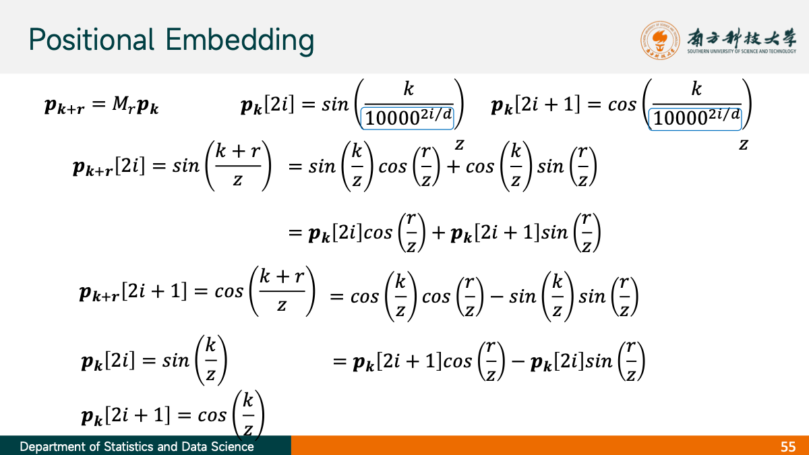

这一页是 P45 到 P47 之间的推导步骤，把三角恒等式**实际代进去**。记 $z = 10000^{2i/d}$：

$$
\begin{aligned}
\boldsymbol{p}_{k+r}[2i] &= \sin\!\left(\frac{k+r}{z}\right)\\
&= \sin\!\left(\frac{k}{z}\right)\cos\!\left(\frac{r}{z}\right) + \cos\!\left(\frac{k}{z}\right)\sin\!\left(\frac{r}{z}\right)\\
&= \boldsymbol{p}_k[2i]\cos\!\left(\frac{r}{z}\right) + \boldsymbol{p}_k[2i+1]\sin\!\left(\frac{r}{z}\right)
\end{aligned}
$$

$$
\begin{aligned}
\boldsymbol{p}_{k+r}[2i+1] &= \cos\!\left(\frac{k+r}{z}\right)\\
&= \cos\!\left(\frac{k}{z}\right)\cos\!\left(\frac{r}{z}\right) - \sin\!\left(\frac{k}{z}\right)\sin\!\left(\frac{r}{z}\right)\\
&= \boldsymbol{p}_k[2i+1]\cos\!\left(\frac{r}{z}\right) - \boldsymbol{p}_k[2i]\sin\!\left(\frac{r}{z}\right)
\end{aligned}
$$

**整个推导只有两步**：先用和角公式把 $\frac{k+r}{z}$ 拆成 $\frac{k}{z}$ 和 $\frac{r}{z}$，再认出 $\sin(k/z)$ 和 $\cos(k/z)$ 正是 $\boldsymbol{p}_k[2i]$ 和 $\boldsymbol{p}_k[2i+1]$ 本身。

**关键在于最后的结果里只剩下 $r/z$**：$\cos(r/z)$ 和 $\sin(r/z)$ 这两个系数**与起点 $k$ 无关**。这就是 P45 那三行 $\boldsymbol{p}_4 = M_3\boldsymbol{p}_1$、$\boldsymbol{p}_{14}=M_3\boldsymbol{p}_{11}$、$\boldsymbol{p}_{104}=M_3\boldsymbol{p}_{101}$ 用同一个 $M_3$ 的原因。

#### P47　旋转矩阵的推导

*Positional Embedding*

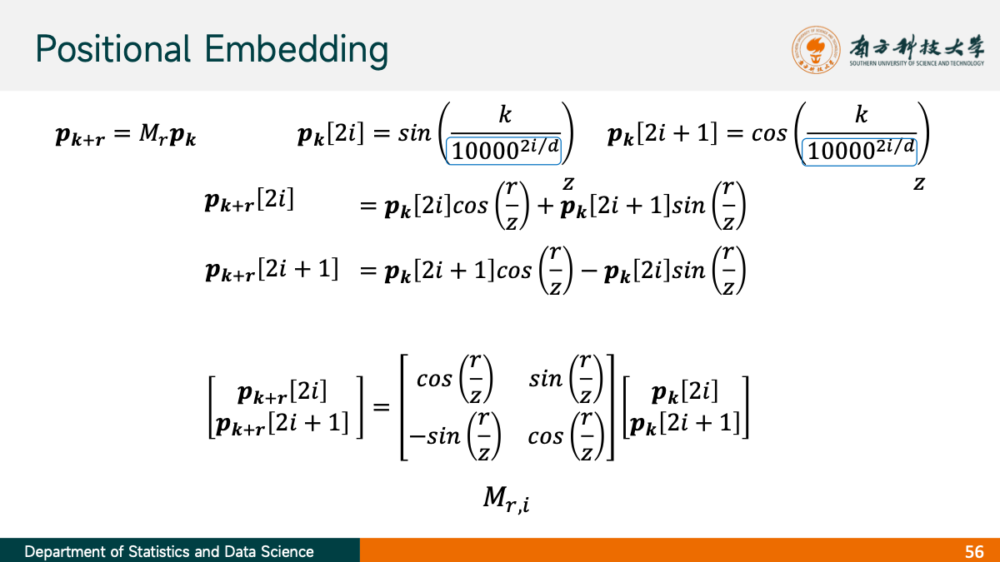

把三角恒等式代进去：

$$
\begin{aligned}
\boldsymbol{p}_{k+r}[2i] &= \boldsymbol{p}_k[2i]\cos\!\left(\frac{r}{z}\right) + \boldsymbol{p}_k[2i+1]\sin\!\left(\frac{r}{z}\right)\\
\boldsymbol{p}_{k+r}[2i+1] &= \boldsymbol{p}_k[2i+1]\cos\!\left(\frac{r}{z}\right) - \boldsymbol{p}_k[2i]\sin\!\left(\frac{r}{z}\right)
\end{aligned}
$$

写成矩阵形式：

$$
\begin{bmatrix}\boldsymbol{p}_{k+r}[2i]\\ \boldsymbol{p}_{k+r}[2i+1]\end{bmatrix}
=
\underbrace{\begin{bmatrix}\cos\left(\frac{r}{z}\right) & \sin\left(\frac{r}{z}\right)\\[1mm] -\sin\left(\frac{r}{z}\right) & \cos\left(\frac{r}{z}\right)\end{bmatrix}}_{M_{r,i}}
\begin{bmatrix}\boldsymbol{p}_k[2i]\\ \boldsymbol{p}_k[2i+1]\end{bmatrix}
$$

**这个 $2\times2$ 矩阵就是一个标准的二维旋转矩阵**，旋转角度是 $r/z$。

**推导本身只用了和角公式，但结论意味深长：**

正弦位置编码里，**每一对相邻维度 $(2i, 2i+1)$ 构成一个二维平面，位置前进 $r$ 步就等于在这个平面上旋转 $r/z$ 弧度**。不同的 $i$ 对应不同的 $z$，也就是不同的旋转速度——又回到了 P44 的时钟类比：秒针转得快，时针转得慢。

所以：**正弦位置编码本质上就是一组以不同角速度旋转的二维向量。** 这个洞察是 RoPE 的起点。

#### P48　整体的分块对角矩阵

*Positional Embedding*

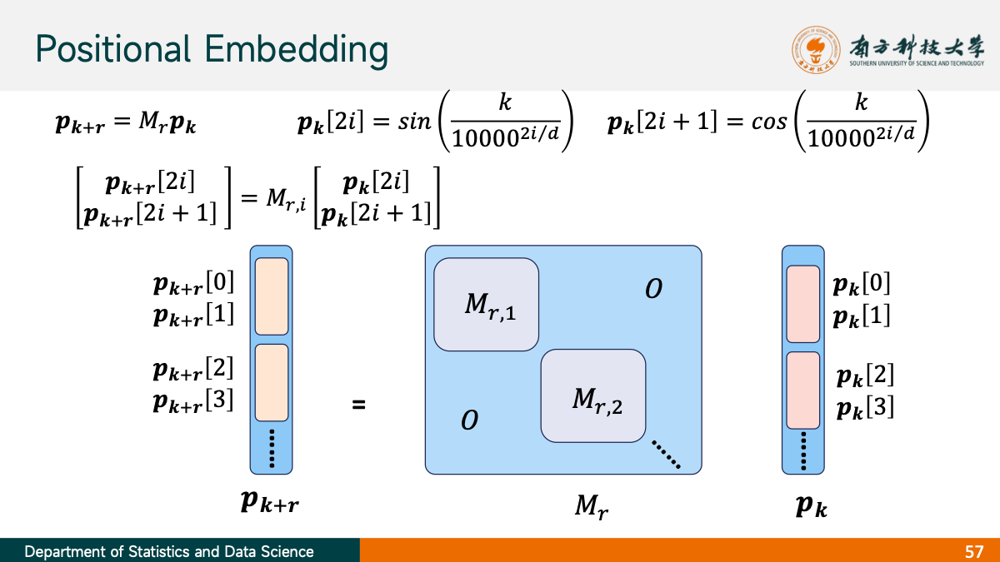

P47 得到的是**单独一对维度**的 $2\times2$ 旋转矩阵 $M_{r,i}$。这一页把所有维度对拼起来，得到完整的 $d\times d$ 变换。

**🖼 逐元素图解**

图中画出矩阵乘法 $\boldsymbol{p}_{k+r} = M_r\,\boldsymbol{p}_k$：

- 左边的列向量 $\boldsymbol{p}_{k+r}$，分量按对分组：$(\boldsymbol{p}_{k+r}[0], \boldsymbol{p}_{k+r}[1])$、$(\boldsymbol{p}_{k+r}[2], \boldsymbol{p}_{k+r}[3])$、……
- 中间的大方块 $M_r$ 里只有对角线上的小块 $M_{r,1}$、$M_{r,2}$、……**其余区域全标着 $O$（零矩阵）**。
- 右边是 $\boldsymbol{p}_k$，同样按对分组。

**这个分块对角结构是 RoPE 高效实现的基础**：

$$
M_r = \begin{pmatrix} M_{r,1} & & O \\ & M_{r,2} & \\ O & & \ddots \end{pmatrix}
$$

每一对维度**只和自己配对的那一维发生关系**，不同的对之间完全独立。所以：

- 数学上写成 $d\times d$ 矩阵，非零元只有 $2d$ 个。
- 实现上根本不用构造矩阵，只需对每一对做二维旋转，复杂度 $O(d)$（见 P58）。

**这也解释了为什么位置编码要「两两配对」**——因为旋转是二维平面上的操作，必须成对才能定义。

#### P49　注意力打分里发生了什么

*Positional Embedding*

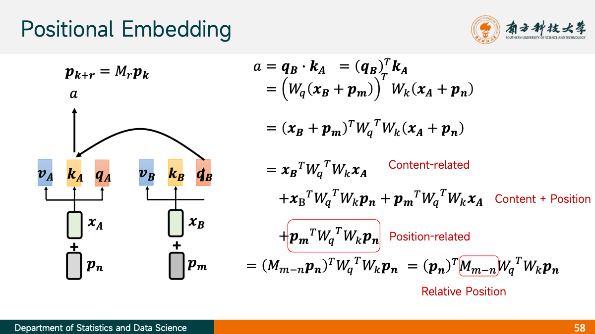

这一页说明：**虽然位置编码内部有漂亮的旋转关系，但走进注意力之后它被破坏了。**

**🖼 逐元素图解**

左图：两个 token，$x_A$ 加上位置 $p_n$、$x_B$ 加上位置 $p_m$，各自生成 $v, k, q$；然后 $q_B$ 与 $k_A$ 做点积得到分数 $a$。

右侧是完整推导：

$$
\begin{aligned}
a &= \boldsymbol{q}_B \cdot \boldsymbol{k}_A = (\boldsymbol{q}_B)^T\boldsymbol{k}_A\\
&= \big(W_q(\boldsymbol{x}_B+\boldsymbol{p}_m)\big)^T W_k(\boldsymbol{x}_A+\boldsymbol{p}_n)\\
&= (\boldsymbol{x}_B+\boldsymbol{p}_m)^T W_q^T W_k (\boldsymbol{x}_A+\boldsymbol{p}_n)
\end{aligned}
$$

展开成四项：

$$
\begin{aligned}
&= \underbrace{\boldsymbol{x}_B^T W_q^T W_k \boldsymbol{x}_A}_{\text{Content-related}}\\
&\quad + \underbrace{\boldsymbol{x}_B^T W_q^T W_k \boldsymbol{p}_n + \boldsymbol{p}_m^T W_q^T W_k \boldsymbol{x}_A}_{\text{Content + Position}}\\
&\quad + \underbrace{\boxed{\boldsymbol{p}_m^T W_q^T W_k \boldsymbol{p}_n}}_{\text{Position-related}}
\end{aligned}
$$

最后那一项（红框）可以化成相对位置：

$$
= (M_{m-n}\boldsymbol{p}_n)^T W_q^T W_k \boldsymbol{p}_n = (\boldsymbol{p}_n)^T \boxed{M_{m-n}} W_q^T W_k \boldsymbol{p}_n \quad \text{(Relative Position)}
$$

**这四项要分开看**：

| 项 | 含义 | 是否只依赖相对位置 |
|---|---|---|
| Content-related | 纯语义匹配 | 与位置无关 ✓ |
| Content + Position（两项） | 语义与位置的交叉 | **✗ 依赖绝对位置** |
| Position-related | 纯位置匹配 | **✓ 可化为 $M_{m-n}$** |

**结论：只有第四项是纯相对的，中间两项污染了结果。**

这正是 P45 那个例子的数学解释——「猫」和「鱼」隔 3 个位置，第四项确实不变，但中间两项随绝对位置 $m$、$n$ 变化，导致注意力分数从 0.7 掉到 0.01。

**问题的根源在于「相加」**：$\boldsymbol{x}+\boldsymbol{p}$ 把语义和位置塞进同一组维度，点积展开时必然产生交叉项。

#### P50　RoPE 的目标

*RoPE*

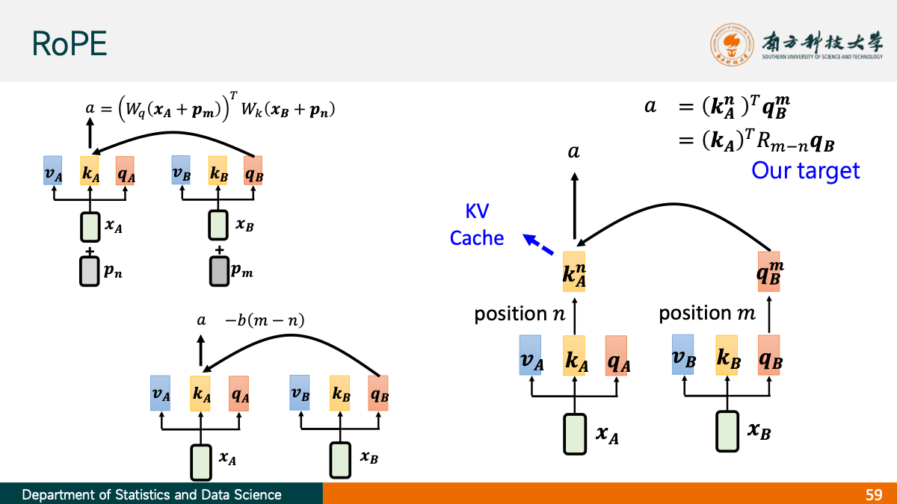

**🖼 逐元素图解**

左上是 P49 的旧方案：$x_A + p_n$、$x_B + p_m$ 相加后再投影。

左下是另一种思路：在注意力分数上直接减一个距离惩罚 $a - b(m-n)$（这是 ALiBi 的做法）。

**右侧是 RoPE 的方案**，也是本页的重点：

$$
\begin{aligned}
a &= (\boldsymbol{k}_A^n)^T\boldsymbol{q}_B^m\\
&= (\boldsymbol{k}_A)^T R_{m-n}\,\boldsymbol{q}_B \qquad \color{blue}{\textbf{Our target}}
\end{aligned}
$$

图中 $x_A$ 在 **position $n$** 生成 $v_A, k_A, q_A$，然后 $k_A$ 变成 $k_A^n$（带上位置信息）；$x_B$ 在 **position $m$** 同理得到 $q_B^m$。蓝色箭头标注 $k_A^n$ 进入 **KV Cache**。

**这个目标式子是 RoPE 的全部设计要求**：

> 我们希望：给 $\boldsymbol{q}$ 和 $\boldsymbol{k}$ **各自**施加一个只依赖其自身位置的变换，使得它们的点积**只依赖于相对位置 $m-n$**。

注意和 P49 的对比：

| | 加法方案 | RoPE |
|---|---|---|
| 位置怎么进入 | $x + p$，然后投影 | 先投影得到 $q,k$，**再对它们旋转** |
| 点积结果 | 四项，两项含绝对位置 | **只含 $R_{m-n}$，纯相对** |
| KV cache | 缓存的 $k$ 已含绝对位置 | 缓存的 $k^n$ 也含位置，但点积时只剩相对 |

**关键区别：RoPE 是「乘性」的（旋转），不是「加性」的。** 乘法在点积里能自然地合并成 $R_m^T R_n = R_{m-n}$，而加法只能展开成交叉项。

#### P51　对 Q 和 K 分别旋转

*Rotation as Position*

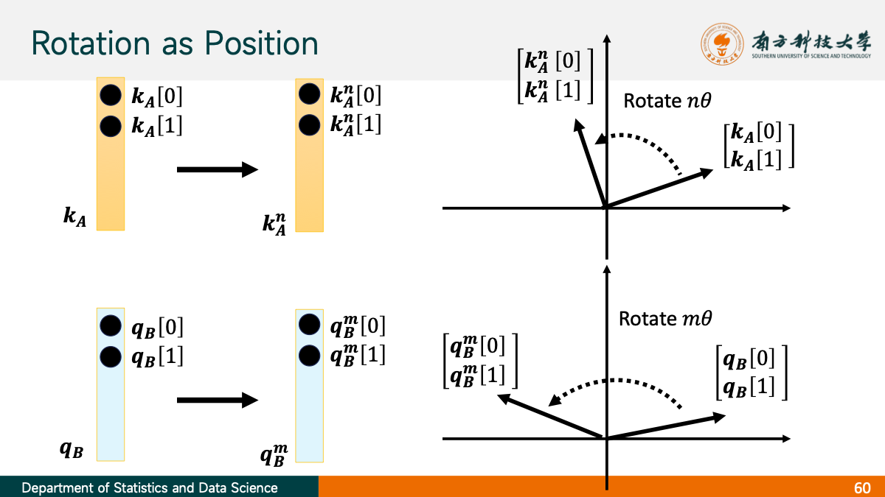

**🖼 逐元素图解**

上下两组，结构完全对称：

- **上组（黄色）**：$\boldsymbol{k}_A$ 的前两个分量 $(k_A[0], k_A[1])$ → 箭头 → $\boldsymbol{k}_A^n$ 的 $(k_A^n[0], k_A^n[1])$。右侧坐标系里，原向量被虚线箭头 **Rotate $n\theta$** 转到新位置。
- **下组（蓝色）**：$\boldsymbol{q}_B$ 的 $(q_B[0], q_B[1])$ → $\boldsymbol{q}_B^m$。右侧 **Rotate $m\theta$**，转的角度更大（因为 $m > n$）。

**这一页要确立的是 RoPE 的基本操作范式**：

> 每个 token 的 $\boldsymbol{q}$ 和 $\boldsymbol{k}$，各自按**自己的位置**旋转相应角度。

注意两点：

1. **$\boldsymbol{v}$ 不参与旋转**。只有 $\boldsymbol{q}$ 和 $\boldsymbol{k}$ 需要带位置信息，因为位置只影响「谁该关注谁」（注意力权重），不影响「关注到什么内容」（值向量）。
2. **旋转发生在投影之后**。先用 $W_q$、$W_k$ 得到 $\boldsymbol{q}$、$\boldsymbol{k}$，再旋转——这和绝对位置编码「先加位置再投影」正好相反，也正是它避开交叉项的原因。

#### P52　高维度对用不同的角速度

*Rotation as Position*

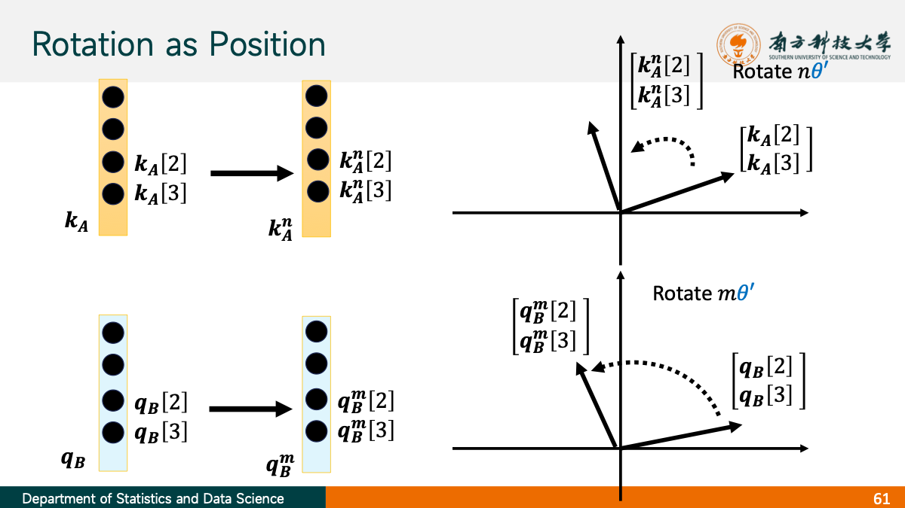

和 P51 完全平行的一页，但看的是**第二对维度** $(k_A[2], k_A[3])$、$(q_B[2], q_B[3])$，旋转角度标注为 $n\theta'$ 和 $m\theta'$——**注意是 $\theta'$ 而不是 $\theta$**。

把 P51 和 P52 并排看，RoPE 的完整图景就出来了：

| 维度对 | 旋转角速度 | 位置 $n$ 处转过的角 |
|---|---|---|
| $(0,1)$ | $\theta_0 = 1$ | $n\theta_0$ ——转得快 |
| $(2,3)$ | $\theta_1 = 1/10000^{2/d}$ | $n\theta_1$ ——慢一些 |
| $(2i, 2i+1)$ | $\theta_i = 1/10000^{2i/d}$ | $n\theta_i$ |

**又一次回到 P44 的时钟类比**：不同的维度对就是不同的指针，各自以不同的速度旋转。区别在于——正弦编码是把这些指针的读数**加到词向量上**，RoPE 是**直接旋转词向量本身**。

#### P53　旋转即位置

*Rotation as Position · arxiv.org/abs/2104.09864*

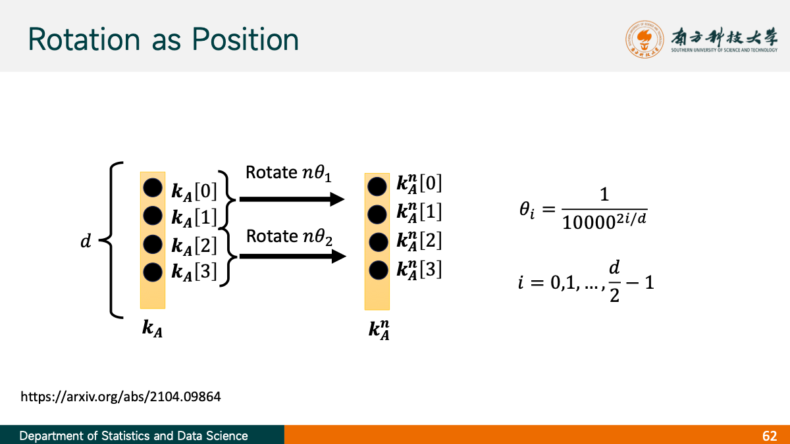

**🖼 逐元素图解**

一个 $d$ 维向量 $\boldsymbol{k}_A$（图中画了 4 个分量 $k_A[0..3]$），**两两配对**：

```
k_A[0] ┐
        ├── Rotate nθ₁ ──→ k_A^n[0], k_A^n[1]
k_A[1] ┘

k_A[2] ┐
        ├── Rotate nθ₂ ──→ k_A^n[2], k_A^n[3]
k_A[3] ┘
```

右侧给出旋转角速度：

$$
\theta_i = \frac{1}{10000^{2i/d}}, \qquad i = 0, 1, \ldots, \frac{d}{2}-1
$$

**这就是 RoPE 的全部操作**：

1. 把 $d$ 维向量切成 $d/2$ 对。
2. 第 $i$ 对在自己的二维平面里旋转 $n\theta_i$ 弧度（$n$ 是这个 token 的位置）。
3. 对 $\boldsymbol{q}$ 和 $\boldsymbol{k}$ 都这么做。

注意 $\theta_i$ 的公式**和正弦位置编码的频率完全一样**。这不是巧合——P47 已经证明了正弦编码内部就藏着旋转结构，RoPE 只是把这个旋转从「加到输入上」改成了「直接作用在 Q/K 上」。

#### P54　同时平移不改变注意力：具体例子

*RoPE*

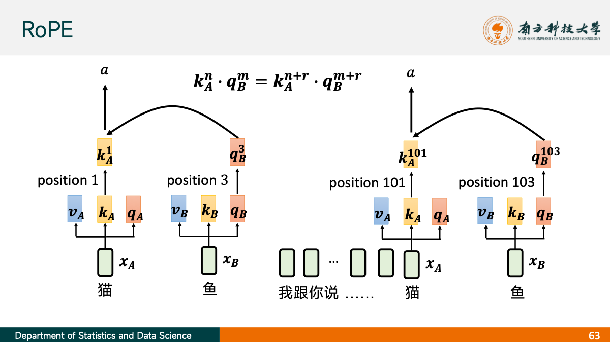

$$
\boldsymbol{k}_A^n \cdot \boldsymbol{q}_B^m = \boldsymbol{k}_A^{n+r}\cdot\boldsymbol{q}_B^{m+r}
$$

**🖼 逐元素图解**

这一页用 P45 那个「猫…鱼」的例子验证 RoPE 真的解决了问题：

| | 左侧 | 右侧 |
|---|---|---|
| 句子 | 「猫 … 鱼」 | 「我跟你说 …… 猫 … 鱼」 |
| 「猫」的位置 | **1** | **101** |
| 「鱼」的位置 | **3** | **103** |
| 生成的向量 | $\boldsymbol{k}_A^1$、$\boldsymbol{q}_B^3$ | $\boldsymbol{k}_A^{101}$、$\boldsymbol{q}_B^{103}$ |
| 注意力分数 | $a$ | $a$ ——**完全相同** |

相对距离都是 2，所以 $R_{m-n} = R_2$ 不变，注意力分数就不变。

**把这一页和 P45 对照着看，是本讲最有说服力的一组对比**：

- **P45（绝对位置编码）**：同样的「猫…鱼」，位置从 (1,4) 移到 (1001,1004)，注意力从 **0.7 崩到 0.01**。
- **P54（RoPE）**：位置从 (1,3) 移到 (101,103)，注意力**一模一样**。

同一个问题，同一个例子，两种方案给出完全不同的结果。RoPE 的价值在这里体现得最清楚。

#### P55　平移不变性的几何过程

*RoPE*

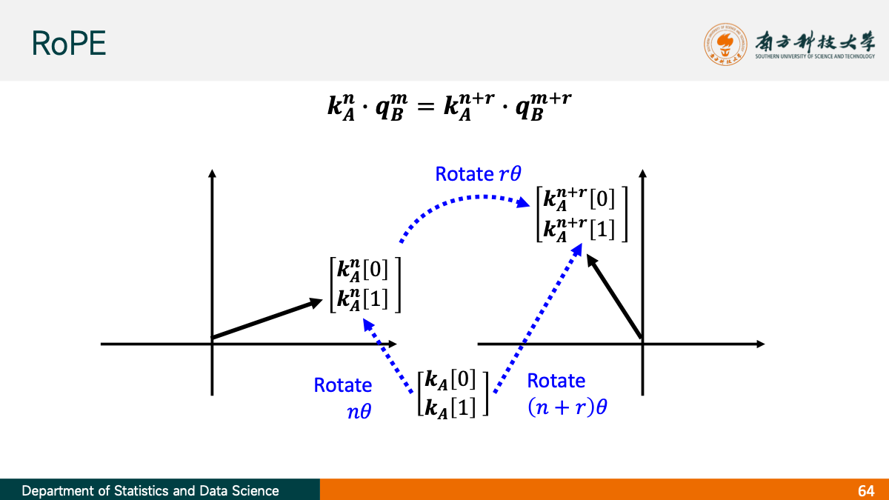

$$
\boldsymbol{k}_A^n \cdot \boldsymbol{q}_B^m = \boldsymbol{k}_A^{n+r}\cdot\boldsymbol{q}_B^{m+r}
$$

**🖼 逐元素图解**

这一页把 P54 的结论拆成几何步骤。中间是**原始向量** $\begin{bmatrix}k_A[0]\\k_A[1]\end{bmatrix}$（还没有位置信息），两条蓝色虚线箭头从它出发：

- 向左：**Rotate $n\theta$** → 得到左侧坐标系里的 $\boldsymbol{k}_A^n$
- 向右：**Rotate $(n+r)\theta$** → 得到右侧坐标系里的 $\boldsymbol{k}_A^{n+r}$

顶部还有一条箭头标注 **Rotate $r\theta$**，连接左右两个结果——说明 $\boldsymbol{k}_A^{n+r}$ 就是 $\boldsymbol{k}_A^n$ 再转 $r\theta$。

**这一页在强调旋转的「可叠加性」**：

$$
R_{n+r} = R_r \cdot R_n
$$

先转 $n\theta$ 再转 $r\theta$，等于直接转 $(n+r)\theta$。正是这个性质让「整体平移 $r$」可以提取成一个公共因子，在点积里与 $\boldsymbol{q}$ 那边的 $R_r$ 相消。

#### P56　为什么点积只依赖相对位置

*RoPE*

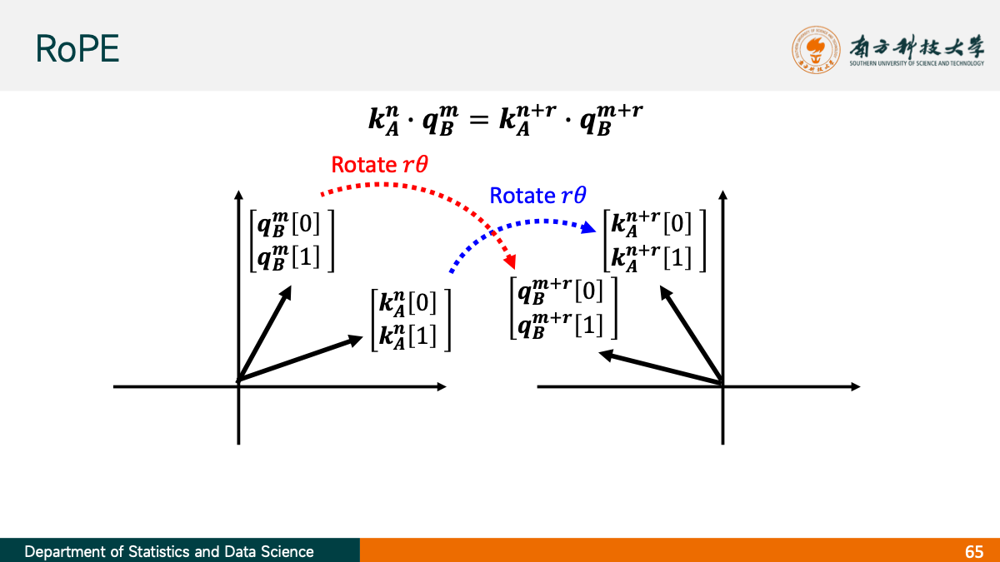

核心恒等式：

$$
\boldsymbol{k}_A^n \cdot \boldsymbol{q}_B^m = \boldsymbol{k}_A^{n+r}\cdot\boldsymbol{q}_B^{m+r}
$$

**🖼 逐元素图解**

左侧坐标系里画着两个向量 $\begin{bmatrix}q_B^m[0]\\ q_B^m[1]\end{bmatrix}$ 和 $\begin{bmatrix}k_A^n[0]\\ k_A^n[1]\end{bmatrix}$，夹角某个值。

两条虚线箭头（红色标 `Rotate rθ`、蓝色标 `Rotate rθ`）分别把两个向量**旋转同样的角度** $r\theta$，得到右侧坐标系里的 $\begin{bmatrix}q_B^{m+r}[0]\\ q_B^{m+r}[1]\end{bmatrix}$ 和 $\begin{bmatrix}k_A^{n+r}[0]\\ k_A^{n+r}[1]\end{bmatrix}$。

**观察右图：两个向量都转了，但它们之间的夹角完全没变。**

这就是整个 RoPE 成立的几何直觉——**点积只取决于两个向量的模长和夹角**：

$$
\boldsymbol{a}\cdot\boldsymbol{b} = \|\boldsymbol{a}\|\,\|\boldsymbol{b}\|\cos\theta_{ab}
$$

旋转是正交变换，**保模长、保夹角**。所以把两个向量同时旋转任意角度，点积不变。

代数证明也很短。设 $R_n$ 是旋转 $n\theta$ 的矩阵：

$$
(R_n\boldsymbol{k})^T(R_m\boldsymbol{q}) = \boldsymbol{k}^T R_n^T R_m \boldsymbol{q} = \boldsymbol{k}^T R_{m-n}\boldsymbol{q}
$$

用到了旋转矩阵的两个性质：$R_n^T = R_{-n}$（转置等于反向旋转）、$R_{-n}R_m = R_{m-n}$（旋转可叠加）。

**结果只依赖 $m-n$——这正是 P50 那个 "Our target"。**

#### P57　二维旋转的显式矩阵

*RoPE*

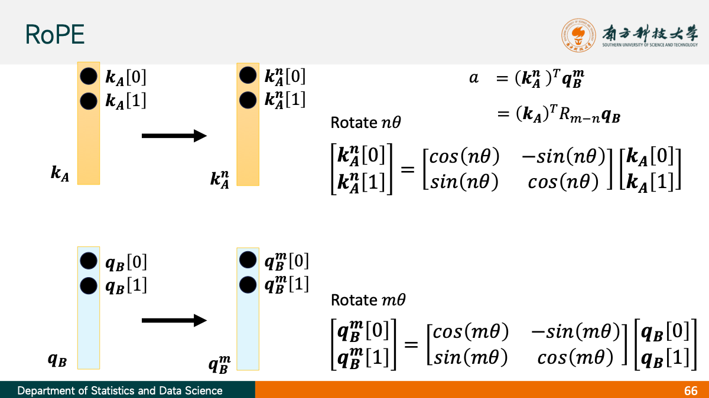

目标回顾：

$$
a = (\boldsymbol{k}_A^n)^T\boldsymbol{q}_B^m = (\boldsymbol{k}_A)^T R_{m-n}\,\boldsymbol{q}_B
$$

具体到第一对维度，两个旋转分别写成矩阵：

$$
\begin{bmatrix}\boldsymbol{k}_A^n[0]\\ \boldsymbol{k}_A^n[1]\end{bmatrix}
=
\begin{bmatrix}\cos(n\theta) & -\sin(n\theta)\\ \sin(n\theta) & \cos(n\theta)\end{bmatrix}
\begin{bmatrix}\boldsymbol{k}_A[0]\\ \boldsymbol{k}_A[1]\end{bmatrix}
$$

$$
\begin{bmatrix}\boldsymbol{q}_B^m[0]\\ \boldsymbol{q}_B^m[1]\end{bmatrix}
=
\begin{bmatrix}\cos(m\theta) & -\sin(m\theta)\\ \sin(m\theta) & \cos(m\theta)\end{bmatrix}
\begin{bmatrix}\boldsymbol{q}_B[0]\\ \boldsymbol{q}_B[1]\end{bmatrix}
$$

**这一页给出了 P56 那个几何论证的代数版本**。有了显式矩阵，$R_n^T R_m = R_{m-n}$ 可以直接验证：

$$
\begin{bmatrix}\cos n\theta & \sin n\theta\\ -\sin n\theta & \cos n\theta\end{bmatrix}
\begin{bmatrix}\cos m\theta & -\sin m\theta\\ \sin m\theta & \cos m\theta\end{bmatrix}
=
\begin{bmatrix}\cos(m-n)\theta & -\sin(m-n)\theta\\ \sin(m-n)\theta & \cos(m-n)\theta\end{bmatrix}
$$

展开时用的还是 P45 那两个和角公式——**整个 RoPE 的数学基础，从头到尾就是 $\sin(a\pm b)$ 和 $\cos(a\pm b)$**。

> **⚠️ 注意 $R_n$ 的转置**
>
> 式子里出现的是 $(\boldsymbol{k}_A^n)^T$，所以旋转矩阵是转置过的。对旋转矩阵而言 $R^T = R^{-1} = R_{-n}$——转置等于反向旋转。这是正交矩阵的性质，也是相消能够发生的前提。

#### P58　RoPE 的完整矩阵形式

*RoPE*

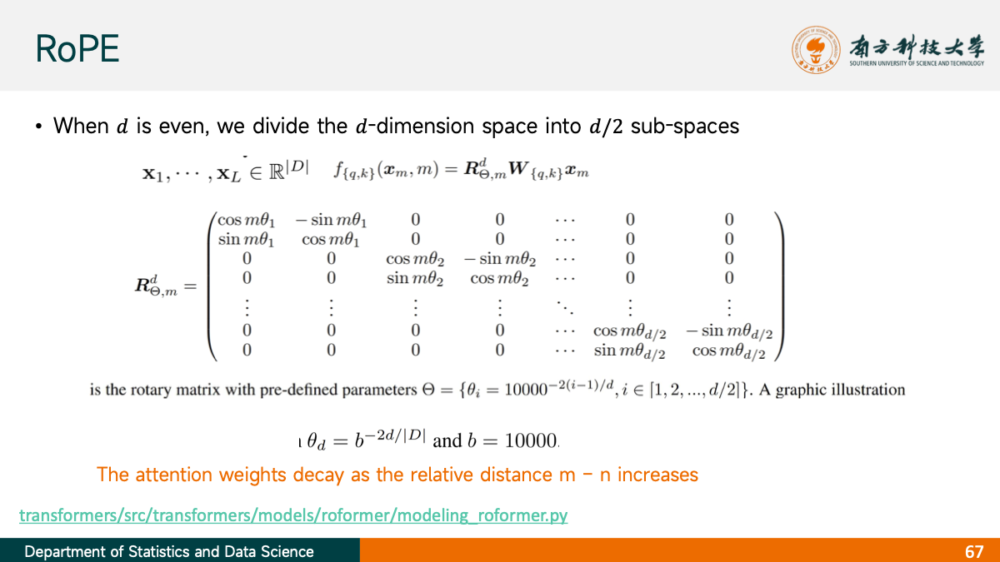

- When $d$ is even, we divide the $d$-dimension space into $d/2$ sub-spaces

$$
f_{\{q,k\}}(\boldsymbol{x}_m, m) = \boldsymbol{R}^d_{\Theta,m}\,\boldsymbol{W}_{\{q,k\}}\,\boldsymbol{x}_m
$$

$$
\boldsymbol{R}^d_{\Theta,m} = \begin{pmatrix}
\cos m\theta_1 & -\sin m\theta_1 & 0 & 0 & \cdots & 0 & 0\\
\sin m\theta_1 & \cos m\theta_1 & 0 & 0 & \cdots & 0 & 0\\
0 & 0 & \cos m\theta_2 & -\sin m\theta_2 & \cdots & 0 & 0\\
0 & 0 & \sin m\theta_2 & \cos m\theta_2 & \cdots & 0 & 0\\
\vdots & \vdots & \vdots & \vdots & \ddots & \vdots & \vdots\\
0 & 0 & 0 & 0 & \cdots & \cos m\theta_{d/2} & -\sin m\theta_{d/2}\\
0 & 0 & 0 & 0 & \cdots & \sin m\theta_{d/2} & \cos m\theta_{d/2}
\end{pmatrix}
$$

> is the rotary matrix with pre-defined parameters $\Theta = \{\theta_i = 10000^{-2(i-1)/d}, i\in[1,2,\ldots,d/2]\}$.

$$
\theta_d = b^{-2d/|D|} \quad\text{and}\quad b = 10000.
$$

<span style="color:#e60">**The attention weights decay as the relative distance $m-n$ increases**</span>（注意力权重随相对距离增大而衰减）

**这个矩阵是块对角的**——只有 $2\times2$ 的小块沿对角线排列，其余全是 0。这有两个重要含义：

**1. 实现上根本不需要构造这个矩阵。** 它是稀疏的，$d\times d$ 里只有 $2d$ 个非零元。实际代码只需对每一对分量做：

```python
# 对第 i 对 (x[2i], x[2i+1])
x_rot[2i]   = x[2i] * cos(m*θᵢ) - x[2i+1] * sin(m*θᵢ)
x_rot[2i+1] = x[2i] * sin(m*θᵢ) + x[2i+1] * cos(m*θᵢ)
```

**复杂度是 $O(d)$ 而不是 $O(d^2)$**，开销可以忽略。

**2. 注意力随距离衰减。** 橙色那句话是 RoPE 的一个附带性质：不同频率的旋转叠加后，当 $|m-n|$ 增大时，各个子空间的相位差趋于随机，求和后相互抵消，导致注意力分数自然衰减。

这是个**好性质**——它符合语言的局部性先验（近处的词通常更相关），相当于免费获得了一个软性的距离惩罚，而不需要像 ALiBi 那样显式地减去 $b(m-n)$。

> **💡 RoPE 为什么赢了**
>
> 对比三种方案：
>
> | | 绝对位置编码 | ALiBi | RoPE |
> |---|---|---|---|
> | 相对位置 | ✗ 有交叉项污染 | ✓ | ✓ |
> | 需要额外参数 | 可学习版本需要 | 否 | 否 |
> | 外推能力 | 差 | **好** | 中等（见 P61） |
> | 能否用于 KV cache | 可以 | 可以 | **可以**（每个 k 独立旋转） |
> | 表达能力 | — | 只是标量惩罚 | **保留了完整的方向信息** |
>
> ALiBi 简单但只能表达「越远越不相关」这一种关系；RoPE 在每个频率子空间保留了完整的相位信息，表达能力更强。这是它成为事实标准的原因。

---

### 🖊 本模块练习（P42–P60）

1. ★ 正弦位置编码为什么要用多个不同频率？用时钟类比解释。

<details><summary>解析</summary>

因为**单一频率无法同时提供「局部分辨率」和「全局范围」**。

频率 $1/10000^{2i/d}$ 随 $i$ 递减，波长从约 6.3（$i=0$）到约 54410（$i=63$，$d=128$ 时）。

时钟类比：
- **秒针**（高频维度，$i$ 小）：转得快，能分辨相邻位置，但转一圈就重复——单看秒针分不清第 1 分钟和第 10 分钟。
- **时针**（低频维度，$i$ 大）：转得慢，能区分大范围，但看不出细微差别。
- **多根指针合起来**才能唯一确定一个时刻。

P44 的三张散点图直观展示了这一点：Dim 0/1 的六个位置散布整个圆周（秒针），Dim 100/101 的六个点几乎重合（时针）。

</details>

2. ★ P45 的例子里，「猫」和「鱼」相对距离不变，为什么注意力从 0.7 掉到 0.01？

<details><summary>解析</summary>

因为**绝对位置编码在注意力打分中产生了依赖绝对位置的交叉项**。

按 P49 的分解，注意力分数展开成四项：

$$
a = \underbrace{x_B^TW_q^TW_kx_A}_{\text{纯内容}} + \underbrace{x_B^TW_q^TW_kp_n + p_m^TW_q^TW_kx_A}_{\text{内容与位置耦合，依赖绝对位置}} + \underbrace{p_m^TW_q^TW_kp_n}_{\text{纯位置，可化为相对}}
$$

第一项与位置无关，第四项可化成 $M_{m-n}$ 只依赖相对距离——这两项没问题。

**问题出在中间两项**：它们把内容和绝对位置耦合在一起。位置从 $(1,4)$ 变成 $(1001,1004)$ 时，$p_n$、$p_m$ 都变了，这两项随之剧变，分数就崩了。

根源在于位置编码是**加**到词嵌入上的（$x+p$），点积展开必然产生交叉项。RoPE 改用**乘性**（旋转）就避开了这个问题。

</details>

3. 证明：把两个向量同时旋转相同角度，点积不变。这对 RoPE 意味着什么？

<details><summary>解析</summary>

**几何证明**：点积 $\boldsymbol{a}\cdot\boldsymbol{b} = \|\boldsymbol{a}\|\|\boldsymbol{b}\|\cos\theta_{ab}$，只依赖两个向量的模长和夹角。旋转是正交变换，保模长也保夹角，所以点积不变。

**代数证明**：设 $R_n$ 为旋转 $n\theta$ 的矩阵，利用 $R_n^T = R_{-n}$ 和 $R_{-n}R_m = R_{m-n}$：

$$
(R_n\boldsymbol{k})^T(R_m\boldsymbol{q}) = \boldsymbol{k}^TR_n^TR_m\boldsymbol{q} = \boldsymbol{k}^TR_{m-n}\boldsymbol{q}
$$

**对 RoPE 的意义**：这正是 P50 提出的 "Our target"。给 $\boldsymbol{q}$ 和 $\boldsymbol{k}$ **各自**施加只依赖自身位置的旋转，点积结果**自动只依赖相对位置 $m-n$**——不需要任何额外设计，是旋转这个操作的代数性质白送的。

这也解释了为什么必须用乘性而非加性：只有旋转矩阵才有 $R_n^TR_m = R_{m-n}$ 这种能「相消」的结构。

</details>

4. ★ RoPE 的旋转矩阵是 $d\times d$ 的，实现时计算复杂度是多少？

<details><summary>解析</summary>

**$O(d)$，不是 $O(d^2)$。**

虽然 $\boldsymbol{R}^d_{\Theta,m}$ 写出来是 $d\times d$，但它是**块对角**的——只有 $d/2$ 个 $2\times2$ 小块沿对角线排列，非零元素只有 $2d$ 个。

实际实现根本不构造这个矩阵，而是对每一对分量直接做二维旋转：

```python
x_rot[2i]   = x[2i]*cos(mθᵢ) - x[2i+1]*sin(mθᵢ)
x_rot[2i+1] = x[2i]*sin(mθᵢ) + x[2i+1]*cos(mθᵢ)
```

$d/2$ 对，每对常数次运算，总共 $O(d)$。相比注意力本身的 $O(d^2)$ 或 $O(n^2d)$，**RoPE 的开销可以忽略不计**。

（工程上还可以预计算所有位置的 $\cos$/$\sin$ 表，运行时只做查表和乘加。）

</details>

5. 为什么说「注意力随相对距离衰减」是 RoPE 的一个好性质？

<details><summary>解析</summary>

**机制**：不同维度对以不同角速度 $\theta_i$ 旋转。当 $|m-n|$ 增大时，各子空间的相对相位 $(m-n)\theta_i$ 在各个频率上趋于杂乱无章，求和时正负相消，导致总的注意力分数自然衰减。

**为什么是好事**：

1. **符合语言的局部性先验**——邻近的词通常更相关。模型不必从数据里费力学出这一点。
2. **免费获得**——不需要像 ALiBi 那样显式地减去一个距离惩罚项 $b(m-n)$，也不引入额外超参数。
3. **是软性的而非硬性的**——远处的词权重变小但不归零，模型仍可在需要时关注远处内容。

（但这个性质也是双刃剑：它正是 RoPE 长度外推能力有限的原因之一——超出训练长度后，衰减模式变得不可预测。这就是 P61 之后要解决的问题。）

</details>

6. RoPE 和 ALiBi 都实现了相对位置，为什么 RoPE 成了主流？

<details><summary>解析</summary>

**表达能力的差别。**

ALiBi 的做法是在注意力分数上减去一个标量惩罚：$a - b\cdot(m-n)$。它只能表达「距离越远越不相关」这**一种单调关系**，而且对所有内容一视同仁。

RoPE 在每个频率子空间保留了完整的**相位信息**。不同的 $\theta_i$ 提供不同尺度的位置感知，模型可以学出更复杂的位置模式——比如「关注 3 个词之前」「关注句首」这类非单调的关系。

此外 RoPE：
- 不引入任何可学习参数，也不引入需要调的超参数（ALiBi 的斜率 $b$ 要按头设定）。
- 与 KV cache 完全兼容（每个 $k$ 独立旋转后缓存）。
- 有清晰的数学结构，便于后续做长度外推（P63–P68 的位置插值、NTK、YaRN 全都建立在 RoPE 的频率结构上）。

ALiBi 的优势在于**外推能力更好**，但表达能力的劣势让它最终没能成为主流。

</details>

---
`Part 6 · P61–P70`

## 六、长度外推：训短测长

RoPE 解决了「相对位置」，但没解决「没见过的位置」。这最后十页处理一个非常实际的问题：**模型在 4K 长度上训练，能不能在 128K 上用？**

#### P59　RoPE 的工程实现

*RoPE · llama/model.py · 科学空间*

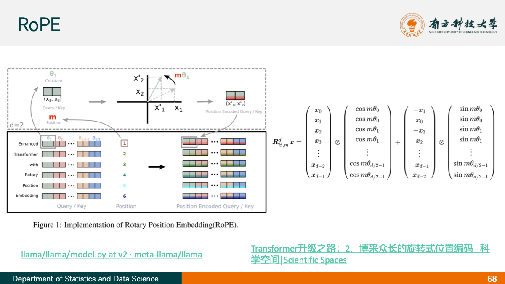

**🖼 逐元素图解**

左侧是论文里的 Figure 1（Implementation of Rotary Position Embedding）：

- 上方虚线框：以 $d=2$ 为例，向量 $(x_1, x_2)$ 配上常数 $\theta_1$ 和位置 $m$，在平面上旋转 $m\theta_1$ 得到 $(x'_1, x'_2)$，即 *Position Encoded Query / Key*。
- 下方主图：一整行 Query/Key 向量（按维度对着色），配上位置编号 1–6（每个位置一种颜色），经过旋转后得到右侧的 *Position Encoded Query / Key*。左侧竖排的字母拼出 **Enhanced Transformer with Rotary Position Embedding**（RoFormer 论文的标题）。

右侧是**实际计算时用的逐元素形式**：

$$
\boldsymbol{R}^d_{\Theta,m}\boldsymbol{x} =
\begin{pmatrix}x_0\\ x_1\\ x_2\\ x_3\\ \vdots\\ x_{d-2}\\ x_{d-1}\end{pmatrix}
\otimes
\begin{pmatrix}\cos m\theta_0\\ \cos m\theta_0\\ \cos m\theta_1\\ \cos m\theta_1\\ \vdots\\ \cos m\theta_{d/2-1}\\ \cos m\theta_{d/2-1}\end{pmatrix}
+
\begin{pmatrix}-x_1\\ x_0\\ -x_3\\ x_2\\ \vdots\\ -x_{d-1}\\ x_{d-2}\end{pmatrix}
\otimes
\begin{pmatrix}\sin m\theta_0\\ \sin m\theta_0\\ \sin m\theta_1\\ \sin m\theta_1\\ \vdots\\ \sin m\theta_{d/2-1}\\ \sin m\theta_{d/2-1}\end{pmatrix}
$$

**这个式子就是 RoPE 的真实代码形态**，拆开看只有三件事：

1. **原向量 $\otimes$ cos 表**——逐元素相乘。注意 cos 表里每个值**重复两次**，因为一对维度共用一个 $\theta_i$。
2. **「交换并取负」的向量 $\otimes$ sin 表**——把 $(x_0, x_1)$ 变成 $(-x_1, x_0)$，这正是旋转 90° 的结果。
3. **两者相加**。

完全没有矩阵乘法，只有两次逐元素乘和一次加法，复杂度 $O(d)$。PyTorch 里通常写成：

```python
def rotate_half(x):
    x1, x2 = x[..., 0::2], x[..., 1::2]
    return torch.stack((-x2, x1), dim=-1).flatten(-2)

q_rot = q * cos + rotate_half(q) * sin
```

`cos`、`sin` 表可以在模型初始化时按最大长度**预计算好**，运行时只查表。

#### P60　只旋转 q 行不行？

*RoPE*

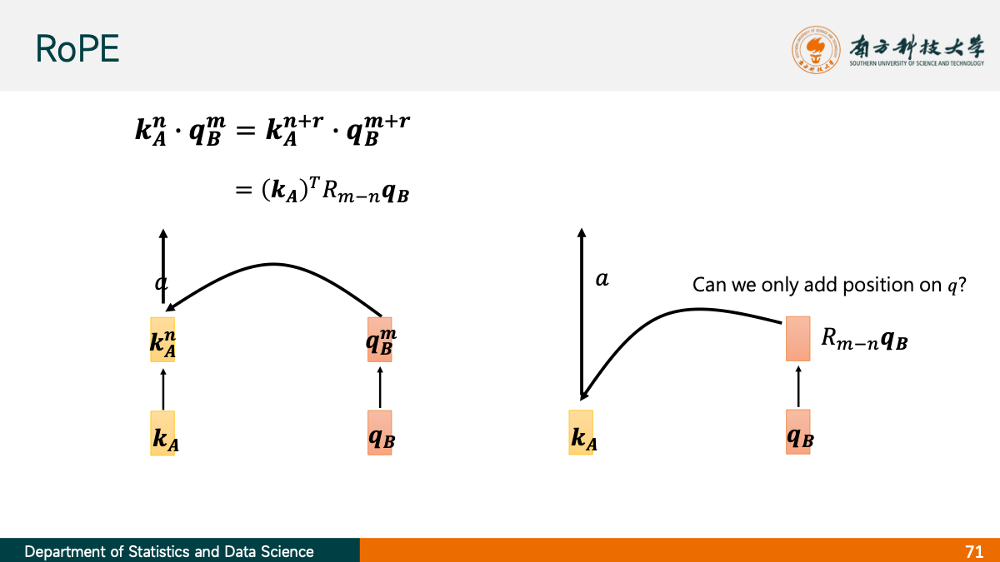

$$
\boldsymbol{k}_A^n \cdot \boldsymbol{q}_B^m = \boldsymbol{k}_A^{n+r}\cdot\boldsymbol{q}_B^{m+r} = (\boldsymbol{k}_A)^T R_{m-n}\boldsymbol{q}_B
$$

**🖼 逐元素图解**

- **左侧**：标准做法——$\boldsymbol{k}_A$ 旋转成 $\boldsymbol{k}_A^n$，$\boldsymbol{q}_B$ 旋转成 $\boldsymbol{q}_B^m$，两者点积得 $a$。
- **右侧**：一个提问——$\boldsymbol{k}_A$ **原样不动**，只对 $\boldsymbol{q}_B$ 施加 $R_{m-n}$，然后点积。旁边写着 **Can we only add position on $q$?**（能不能只在 $q$ 上加位置？）

**数学上，右侧是成立的**——因为最终结果本来就是 $(\boldsymbol{k}_A)^TR_{m-n}\boldsymbol{q}_B$，直接把 $R_{m-n}$ 作用在 $\boldsymbol{q}$ 上就行。

**但工程上不可行，原因在 KV cache。**

$R_{m-n}$ 依赖 **$m$ 和 $n$ 两个位置**。如果只旋转 $\boldsymbol{q}$，那么对每一个历史位置 $n$，都要用一个不同的 $R_{m-n}$——也就是说：

- 生成第 $m$ 个 token 时，要对**所有**历史 key 各算一次不同的旋转；
- 而且下一步 $m+1$ 时，所有旋转角又全变了，**上一步的结果完全不能复用**。

这等于摧毁了 KV cache 的全部价值——cache 的前提是「历史 key 算一次就不再变」。

**而左侧的做法**：$\boldsymbol{k}_A^n = R_n\boldsymbol{k}_A$ 只依赖**自己的位置 $n$**，算完就固定了，可以安心缓存。$\boldsymbol{q}$ 那边同理只依赖 $m$。点积时 $R_n^TR_m$ 自动合成 $R_{m-n}$。

> **💡 这一页揭示了 RoPE 设计的深层考量**
>
> 「分别旋转 q 和 k」不只是数学上的一种写法，**它是为了让位置变换可以被缓存**。
>
> 这也是 RoPE 优于那些需要显式计算相对位置矩阵的方案（如 T5 的相对位置偏置）的关键工程优势——**相对位置是点积时自动涌现的，而不是事先算好的**。

#### P61　问题设定

*Train Short, Test Long*

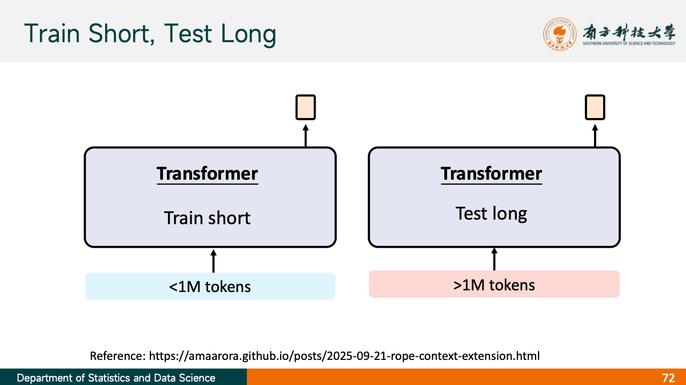

**🖼 逐元素图解**

两个并排的 Transformer 方框：

- 左：**Train short**，输入 `<1M tokens`
- 右：**Test long**，输入 `>1M tokens`

问题非常直白：**训练时受算力和显存限制只能用较短的序列，但部署时用户会塞进来长得多的输入。**

为什么不直接在长序列上训练？因为注意力是 $O(n^2)$：把训练长度从 4K 提到 128K，注意力的计算量涨 1024 倍。**经济上不可行。**

所以只能训短、测长，指望模型能「外推」到没见过的长度。

#### P62　为什么外推会失败

*Train Short, Test Long*

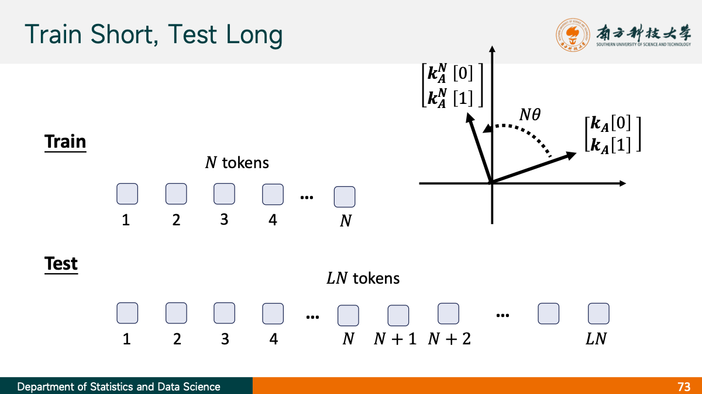

**🖼 逐元素图解**

- **Train**：$N$ 个 token，位置编号 1, 2, 3, 4, …, $N$。
- **Test**：$LN$ 个 token，位置编号 1, 2, 3, 4, …, $N$, $N+1$, $N+2$, …, $LN$。

右上角的坐标系画出了 RoPE 的旋转：向量 $\begin{bmatrix}k_A[0]\\k_A[1]\end{bmatrix}$ 旋转 $N\theta$ 后变成 $\begin{bmatrix}k_A^N[0]\\k_A^N[1]\end{bmatrix}$。

**核心问题在那些 $N+1$ 到 $LN$ 的位置上**：

训练时，模型只见过旋转角度在 $[0, N\theta_i]$ 范围内的情形。测试时，位置 $LN$ 要求旋转 $LN\theta_i$——**这个角度模型从未见过**。

对高频维度（$\theta_0 = 1$）尤其严重：训练时 $N=4096$，旋转角已经绕了 $4096/(2\pi) \approx 652$ 圈；测试到 128K 时要绕 20000 多圈。虽然数学上 $\cos$、$\sin$ 有周期性、值域没变，但**模型学到的是「特定角度组合对应特定相对距离」这种模式**，超出范围后各频率的组合模式完全陌生，注意力分数的行为变得不可预测。

结果就是：**超出训练长度后，困惑度会急剧上升**，模型输出退化成胡言乱语。

#### P63　位置插值（PI）

*Position Interpolation · arxiv.org/abs/2306.15595*

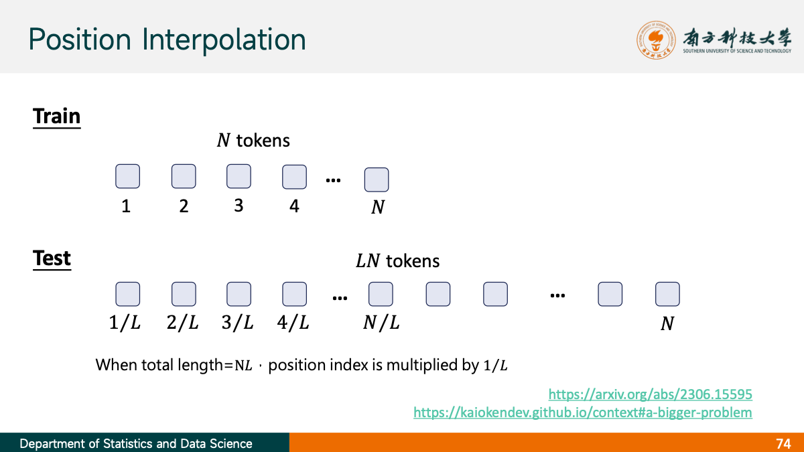

**🖼 逐元素图解**

- **Train**：$N$ 个 token，位置 1, 2, 3, 4, …, $N$。
- **Test**：$LN$ 个 token，位置改成 **$1/L$, $2/L$, $3/L$, $4/L$, …, $N/L$, …, $N$**。

底部说明：**When total length = $NL$，position index is multiplied by $1/L$**（总长度为 $NL$ 时，位置索引乘以 $1/L$）。

**这个想法极其简单：既然模型没见过大于 $N$ 的位置，那就把所有位置「压」进 $[0, N]$ 这个区间。**

原来位置 $m$ 的旋转角是 $m\theta_i$，现在改成 $\frac{m}{L}\theta_i$。序列再长，最大旋转角仍然是 $N\theta_i$——**始终在模型见过的范围内**。

打个比方：模型只会看一把量程 0–10 cm 的尺子。现在要量 40 cm 的东西，PI 的做法是**把尺子的刻度重新定义**，让原来的 10 cm 现在代表 40 cm。刻度数字没超纲，只是每一格代表的实际距离变大了 4 倍。

#### P64　PI 的代价

*Position Interpolation*

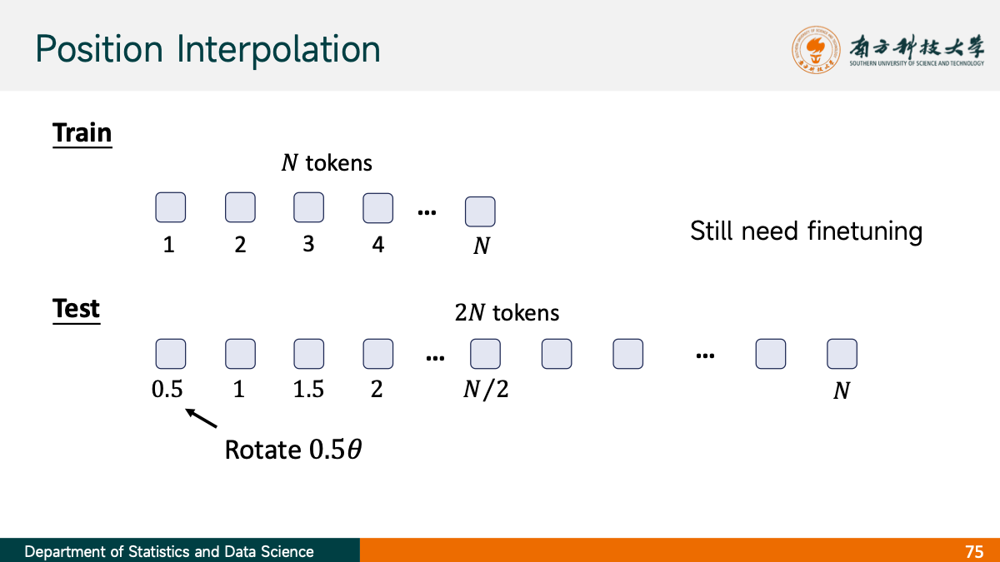

**🖼 逐元素图解**

- **Train**：$N$ 个 token，位置 1, 2, 3, 4, …, $N$。
- **Test**：$2N$ 个 token，位置变成 **0.5, 1, 1.5, 2, …, $N/2$, …, $N$**。箭头标注第一个位置 **Rotate $0.5\theta$**。

右侧一行大字：<span style="color:#000">**Still need finetuning**</span>（仍然需要微调）。

**代价是分辨率下降。** 原来相邻 token 的位置差是 1，旋转角差 $\theta_i$；现在位置差变成 0.5，旋转角差只有 $0.5\theta_i$。**相邻 token 在位置空间里挨得更近了，模型更难区分它们。**

这个损失在高频维度上尤其致命。回看 P44 的时钟类比：秒针的作用就是分辨相邻位置，现在把它的转速砍半，局部分辨能力直接下降。

所以 PI **需要微调**——用少量长序列数据让模型适应新的「刻度」。好消息是所需的微调量很小（原论文只用了 1000 步），因为模型不必学新知识，只需重新校准位置感知。

> **⚠️ PI 的问题是「一刀切」**
>
> 它对**所有频率**都乘同一个 $1/L$。但高频维度负责局部分辨（被压缩后损失最大），低频维度负责全局定位（本来就没转几圈，压缩它反而浪费了量程）。
>
> **该压的没压够，不该压的压过头**——这正是下一页频率方法要解决的。

#### P65　按频率区别对待

*Frequency-Based Approach*

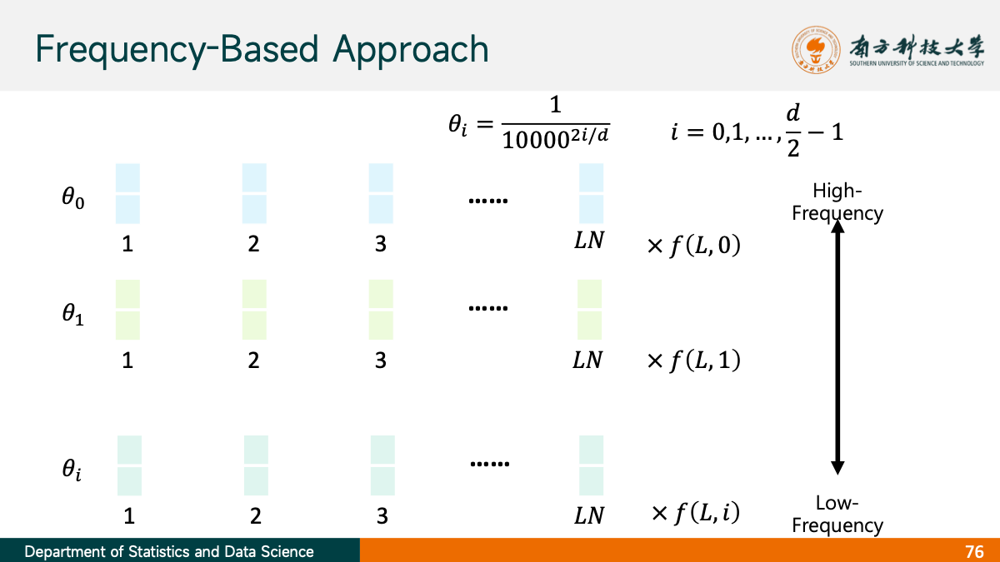

$$
\theta_i = \frac{1}{10000^{2i/d}}, \qquad i = 0, 1, \ldots, \frac{d}{2}-1
$$

**🖼 逐元素图解**

三行，对应三个不同的频率 $\theta_0$、$\theta_1$、$\theta_i$。每行是位置 1, 2, 3, …, $LN$ 的一串方块。每行末尾标注一个**不同的缩放函数**：

- $\theta_0$ 那行 → $\times f(L, 0)$
- $\theta_1$ 那行 → $\times f(L, 1)$
- $\theta_i$ 那行 → $\times f(L, i)$

右侧一根双向箭头，上端标 **High-Frequency**，下端标 **Low-Frequency**。

**这一页的核心思想：缩放因子不再是常数 $1/L$，而是一个依赖频率的函数 $f(L, i)$。**

为什么要这么做？考虑一个 4K 训练、扩展到 128K（$L=32$）的模型：

| 维度 | 波长 | 训练时（4K）转了几圈 | 该怎么处理 |
|---|---|---|---|
| **高频**（$i$ 小） | ~6.3 | 约 650 圈 | 周期内的模式模型很熟悉，**不该压缩**——压了会毁掉局部分辨率 |
| **低频**（$i$ 大） | ~54410 | **不到 0.1 圈** | 模型从没见过完整周期，直接外推会进入完全陌生的角度区域，**必须压缩** |

**所以正确的策略是：高频保持原样（外推），低频做插值。** 这就是 NTK-aware scaling 和 YaRN 的共同思路。

#### P66　高频与低频的可视化对比

*Frequency-Based Approach*

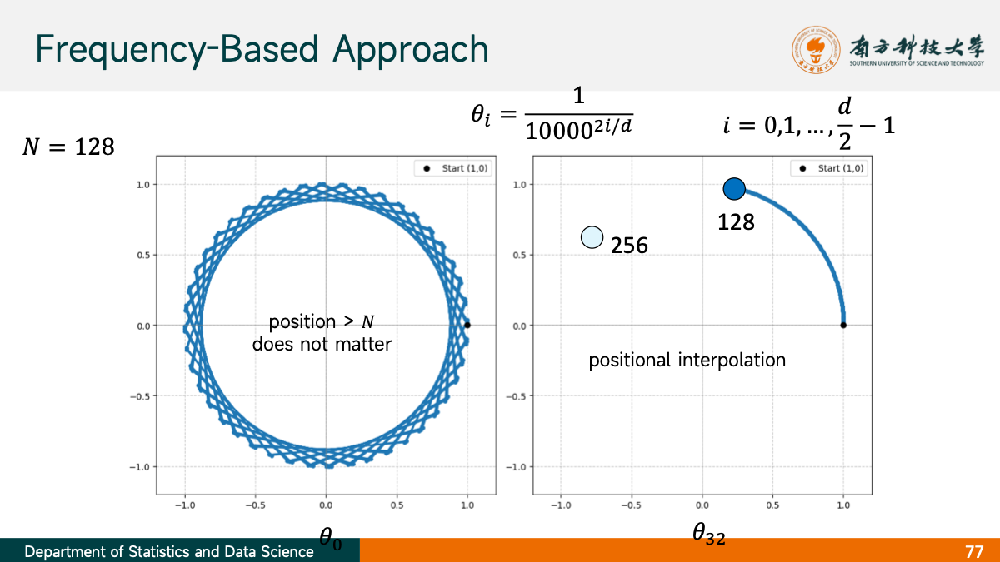

$$
\theta_i = \frac{1}{10000^{2i/d}}, \qquad i = 0,1,\ldots,\frac{d}{2}-1
$$

左上标注 $N = 128$（训练长度）。

**🖼 逐元素图解**

两张单位圆上的轨迹图，起点都是 Start (1,0)：

| | **左图：$\theta_0$（最高频）** | **右图：$\theta_{32}$（低频）** |
|---|---|---|
| 轨迹 | 绕了**很多圈**，形成密集的花瓣状缠绕 | 只画出**一小段圆弧**，从 (1,0) 走到约 (0.25, 0.97) |
| 位置 128 的落点 | 混在密密麻麻的轨迹里 | 深蓝大圆点标注 **128**，在圆弧末端 |
| 位置 256 的落点 | —— | 浅蓝空心圆标注 **256**，在圆弧**继续延伸**的位置 |
| 图中文字 | **position > N does not matter**（超过 $N$ 的位置无所谓） | **positional interpolation**（做位置插值） |

**这张图是理解「为什么要按频率区别对待」最直观的一页。**

**左图（高频）**：训练 128 个位置时，$\theta_0 = 1$ 的维度已经绕了 $128/(2\pi) \approx 20$ 圈。整个圆周被反复走过，**任何角度模型都见过无数次**。所以测试时位置超过 128 完全没关系——落点仍然在熟悉的圆周上。图中文字说得很直白：*position > N does not matter*。

**右图（低频）**：$\theta_{32}$ 的维度在 128 个位置里只转了约 $76°$，连四分之一圈都不到。位置 256 会落在圆弧继续往前的地方——**那是训练时从未到达过的区域**。所以这里必须做插值，把 256 压回到 128 的位置上。

**两张图并排，就是 YaRN 分段策略的全部依据**：高频「无所谓」，低频「必须插值」。

#### P67　NTK-Aware Scaling 的公式

*Frequency-Based Approach · NTK-Aware Scaling*

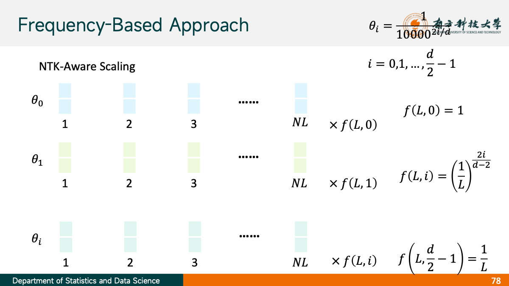

标题：**NTK-Aware Scaling**

$$
\theta_i = \frac{1}{10000^{2i/d}}, \qquad i = 0,1,\ldots,\frac{d}{2}-1
$$

缩放函数：

$$
f(L, i) = \left(\frac{1}{L}\right)^{\frac{2i}{d-2}}
$$

两个端点：

$$
f(L, 0) = 1, \qquad f\!\left(L, \frac{d}{2}-1\right) = \frac{1}{L}
$$

**🖼 逐元素图解**

和 P65 相同的三行示意（$\theta_0$、$\theta_1$、$\theta_i$ 各一行位置序列），每行末尾乘以对应的 $f(L,i)$，右侧给出上述公式。

**这个公式精确地实现了 P65 和 P66 的想法**：

| $i$ | $f(L,i)$ | 效果 |
|---|---|---|
| $i = 0$（最高频） | $(1/L)^0 = \mathbf{1}$ | **完全不缩放**——直接外推 |
| 中间 | $(1/L)^{2i/(d-2)}$ | 指数插值，$i$ 越大压得越狠 |
| $i = d/2-1$（最低频） | $(1/L)^1 = \mathbf{1/L}$ | **完全插值**——退化为 PI |

所以 NTK-aware 是一个**在「纯外推」和「纯插值」之间按频率连续过渡**的方案：最高频那一端等于什么都不做，最低频那一端等于 PI，中间用幂函数平滑衔接。

**这就是 P68 图里那条红色曲线的来源**——它从 0.5（低频端，$L=2$ 时 $1/L=0.5$）平滑上升到 1.0（高频端）。

> **💡 为什么叫 "NTK-aware"**
>
> NTK 是 Neural Tangent Kernel。这个方法的提出者观察到：直接对所有频率做插值（PI）会让高频信息「被挤压得无法分辨」，类比于 NTK 理论中神经网络难以学习高频成分的现象。所以方案是**保住高频、只压低频**。
>
> 实现上还有一个等价且更简洁的做法：**直接把 RoPE 的底数 $b$ 从 10000 调大**。因为 $\theta_i = b^{-2i/d}$，改变 $b$ 会让所有频率按幂律重新分布，效果与上面的 $f(L,i)$ 一致。这就是很多推理框架里 `rope_theta` 这个参数的作用。

#### P68　YaRN：三种方法的对比

*Frequency-Based Approach · YaRN (Yet another RoPE extensioN method)*

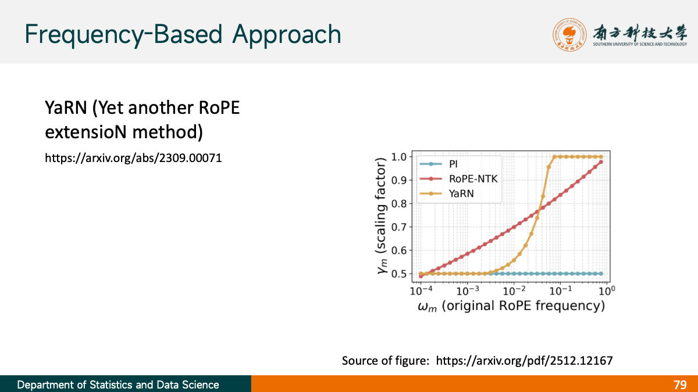

**YaRN (Yet another RoPE extensioN method)** — arxiv.org/abs/2309.00071

**🖼 逐元素图解**

一张关键的对比图：

- 横轴 $\omega_m$（original RoPE frequency），**对数刻度**，从 $10^{-4}$（低频）到 $10^0$（高频）
- 纵轴 $\gamma_m$（scaling factor），从 0.5 到 1.0
- 三条曲线：

| 曲线 | 颜色 | 形状 | 含义 |
|---|---|---|---|
| **PI** | 蓝 | **水平直线，恒为 0.5** | 所有频率一视同仁地压缩一半 |
| **RoPE-NTK** | 红 | 从 0.5 平滑上升到 1.0 | 频率越高，压缩越少 |
| **YaRN** | 黄 | **低频段平贴 0.5，$10^{-2}$ 附近急剧上升，高频段平贴 1.0** | 分段处理 |

**这张图把三种方法的差别讲得一清二楚：**

**PI（蓝线）**——完全不区分频率。所有维度的缩放因子都是 0.5。前面说过，这对高频维度是伤害。

**NTK（红线）**——连续地调整。通过改变 RoPE 的**底数** $b$（从 10000 改成更大的值）实现，数学上等价于让缩放因子随频率单调变化。比 PI 好，但仍然对每个频率都做了一点压缩。

**YaRN（黄线）**——**明确分成三段**：

1. **低频段**（$\omega_m < 10^{-2}$）：缩放因子 = 0.5，**完全插值**。这些维度在训练时连一个周期都没转完，外推会进入完全陌生的区域，必须压缩。
2. **高频段**（$\omega_m > 10^{-1}$）：缩放因子 = 1.0，**完全不动**。这些维度在训练时已经转了成百上千圈，模型对周期内的模式非常熟悉，直接外推没问题，压缩反而破坏局部分辨率。
3. **中间段**：平滑过渡。

YaRN 的曲线形状直接体现了 P65 的分析——**该压的压到底，不该压的完全不动，中间平滑衔接**。这就是它效果最好的原因。

> **💡 三种方法的一句话总结**
>
> | 方法 | 做法 | 需要微调 | 效果 |
> |---|---|---|---|
> | **直接外推** | 什么都不做 | — | 超出训练长度立刻崩 |
> | **PI** | 位置索引 $\times 1/L$ | 需要（少量） | 可用，但损失局部分辨率 |
> | **NTK-aware** | 调大 RoPE 底数 $b$ | 可以不用 | 比 PI 好 |
> | **YaRN** | 按频率分段缩放 + 调整注意力温度 | 需要极少量 | **最好** |
>
> YaRN 论文报告，它只需 PI 所需微调数据的 **1/10**、训练步数的 **1/2.5**，就能达到更好的效果。

#### P69　延伸阅读

*Further Reading*

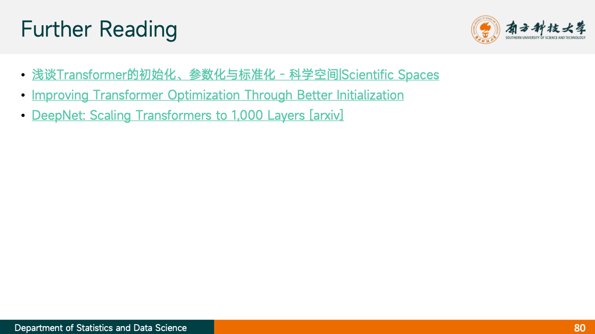

课件推荐的延伸材料：

- 浅谈 Transformer 的初始化、参数化与标准化 —— 科学空间 | Scientific Spaces
- Improving Transformer 相关资料

苏剑林的科学空间是中文社区里讲 RoPE 最透彻的来源（RoPE 本身就是他提出的）。P59 也引用了其中的《Transformer 升级之路：2、博采众长的旋转式位置编码》。

#### P70　致谢

*Thank you*


全讲结束。

---

### 🖊 本模块练习（P61–P70）

1. ★ 为什么不直接在长序列上训练，非要「训短测长」？

<details><summary>解析</summary>

**因为注意力的复杂度是 $O(n^2)$。**

把训练长度从 4K 提到 128K，序列长度涨 32 倍，注意力的计算量和显存涨 **$32^2 = 1024$ 倍**。

回看 [Lecture 4 P18](../sta5007-04/)：一次预训练已经要占用整个集群三个月。再乘 1024 倍在经济上完全不可行。

而且长文档本身也稀缺——语料里绝大多数文本都不到 4K token，凑不出足够多的 128K 样本来训练。

所以现实做法是：**用短序列做绝大部分预训练，再用少量长序列做「长度扩展」的微调**——这正是 PI / YaRN 这类方法的应用场景。

</details>

2. ★ RoPE 直接外推到训练长度之外为什么会失败？

<details><summary>解析</summary>

因为模型**从未见过那些旋转角度的组合**。

训练长度为 $N$ 时，位置 $m \le N$，第 $i$ 对维度的旋转角落在 $[0, N\theta_i]$。测试到 $LN$ 时，旋转角要到 $LN\theta_i$——超出训练分布。

虽然 $\cos$、$\sin$ 有周期性、数值上不会爆炸，但关键在于：模型学到的是「**各个频率的角度组合**对应某个相对距离」这种联合模式。回看 P44 的时钟类比——它是靠秒针、分针、时针**一起**读时间的。超出训练范围后，这个组合模式进入了从未标定过的区域。

对低频维度尤其严重：训练时它们连一个完整周期都没转完（波长 54410 vs 训练长度 4096），外推时会进入完全陌生的角度区间。

后果是注意力分数行为失控，困惑度急剧上升。

</details>

3. 位置插值（PI）的思想是什么？它的代价是什么？

<details><summary>解析</summary>

**思想**：既然模型没见过大于 $N$ 的位置，就把所有位置**压缩**进 $[0, N]$。总长度 $LN$ 时，位置索引乘以 $1/L$。这样最大旋转角始终是 $N\theta_i$，不超纲。

比喻：只会看 0–10 cm 尺子的人要量 40 cm，就把尺子刻度重新定义——每格代表 4 cm。

**代价是分辨率下降**。原来相邻 token 位置差 1、旋转角差 $\theta_i$；现在位置差 $1/L$、角度差只有 $\theta_i/L$。相邻 token 在位置空间里挤得更近，**更难区分**。

这在高频维度上最致命——它们本来就是负责分辨相邻位置的（P44 的秒针），转速被砍到 $1/L$ 后局部分辨能力大幅下降。

所以 PI **仍然需要微调**（课件原话 *Still need finetuning*），让模型适应新刻度。好在所需微调量很小，因为不需要学新知识，只是重新校准。

</details>

4. ★ 为什么高频维度应该「外推」而低频维度应该「插值」？

<details><summary>解析</summary>

关键看**训练时该维度转了几圈**。以 4K 训练为例：

| | 高频（$i$ 小） | 低频（$i$ 大） |
|---|---|---|
| 波长 | ~6.3 | ~54410 |
| 训练时转了几圈 | 约 650 圈 | **不到 0.1 圈** |
| 模型熟悉什么 | 完整周期内的所有角度都见过很多次 | 只见过 $[0, 0.1\times 2\pi]$ 这一小段 |
| 外推会怎样 | **安全**——角度虽大，但落在熟悉的周期模式里 | **危险**——进入完全没见过的角度区间 |
| 压缩会怎样 | **有害**——直接损害局部分辨率 | **无害**——反正量程还剩很多 |

结论：**高频保持原样（外推），低频压缩（插值）**。

PI 的问题正是对所有频率一视同仁——该压的低频压了，不该压的高频也压了。YaRN 按频率分段处理，就避开了这个矛盾。

</details>

5. 看 P68 的图，PI、NTK、YaRN 三条曲线各自的形状说明了什么？

<details><summary>解析</summary>

横轴是原始 RoPE 频率（对数刻度，左低右高），纵轴是缩放因子（0.5 = 完全插值，1.0 = 完全不缩放）。

- **PI（蓝，水平线 0.5）**：所有频率统一压缩一半。**完全不区分频率**——这就是它的缺陷所在，高频被无谓地牺牲了。

- **NTK（红，平滑上升 0.5→1.0）**：频率越高压缩越少，方向对了。实现上是通过调大 RoPE 底数 $b$ 达成的。但它在**每个**频率上都做了一些压缩，高频段也没能完全保住。

- **YaRN（黄，分段：低频平贴 0.5 → 急升 → 高频平贴 1.0）**：明确三段处理。低频**完全插值**，高频**完全不动**，中间平滑过渡。

YaRN 的形状最贴合第 4 题的分析——**该压的压到底，不该压的一点不动**。这是它效果最好的原因。

</details>

6. 综合本讲，如果要把一个 4K 上下文的模型扩展到 128K，你会怎么做？

<details><summary>解析</summary>

**第一步：选扩展方法。** 用 **YaRN**（$L=32$）。按频率分段缩放：低频完全插值保证不越界，高频保持原样保住局部分辨率。如果追求实现简单，NTK-aware（调大底数 $b$）也是不错的折中。

**第二步：少量长序列微调。** YaRN 论文表明所需数据和步数都很少（约为 PI 的 1/10 数据、1/2.5 步数）。收集一批真实长文档（书籍、长代码库、论文合集），训几百到几千步。

**第三步：处理显存问题。** 128K 的 KV cache 会爆炸（回看 P26 的公式，长度涨 32 倍，cache 也涨 32 倍）。必须配合：
- **GQA**（P28）把 cache 压 8 倍，或 **MLA**（P29）压更多；
- 考虑 **SWA**（P31），让 cache 大小不随长度增长；
- 推理侧用 PagedAttention 一类的显存管理。

**第四步：验证。** 不能只看困惑度——困惑度对长上下文不敏感。要用 **Needle-in-a-Haystack**（在长文档里埋一句话让模型找出来）这类任务，验证模型**真的**能用到远处信息，而不只是没有崩掉。

这一步最容易被忽略：很多「支持 128K」的模型，在 100K 位置埋的信息其实根本找不回来。

</details>

---

## 附录 A · 公式速查

| 主题 | 公式 | 出处 |
|---|---|---|
| **解码目标** | $Y=\operatorname{argmax}\prod_{i}p(y_i\mid y_{<i},X;\theta)$ | P2 |
| **束搜索打分** | $\text{score}=\sum_{i}\log P_{\text{LM}}(y_i\mid y_{<i},x)$ | P4 |
| **长度归一化** | $S_{norm}=\frac{1}{T}\sum_{i}\log p(y_i\mid y_{<i},X;\theta)$ | P6 |
| **top-p 词表** | $\sum_{x\in V^{(p)}}P(x\mid x_{1:i-1})\ge p$ | P10 |
| **温度采样** | $p(v_k)=\dfrac{e^{l_k/\tau}}{\sum_j e^{l_j/\tau}}$ | P12 |
| **SwiGLU** | $\text{FFN}(x)=(\text{Swish}_1(xW)\cdot xV)W_2$ | P18 |
| **MoE 输出** | $y=\sum_{i=1}^{n}G(x)_iE_i(x)$ | P22 |
| **Noisy Top-K** | $G(x)=\text{Softmax}(\text{KeepTopK}(H(x),k))$ | P22 |
| **负载均衡损失** | $\text{loss}=\text{NLL}+\lambda\sum_{e}m_ec_e$ | P25 |
| **注意力** | $\text{Attention}(Q,K,V)=\text{softmax}\!\big(\frac{QK^\top}{\sqrt{d_k}}\big)V$ | P26 |
| **MLA 压缩** | $\mathbf{c}^{KV}_t=W^{DKV}\mathbf{h}_t$ | P30 |
| **LayerNorm** | $y=\frac{x-\mathrm{E}[x]}{\sqrt{\mathrm{Var}[x]+\epsilon}}\gamma+\beta$ | P34 |
| **Post-LN** | $x_{l+1}=\text{LN}(x_l+\text{Sub}(x_l))$ | P35 |
| **Pre-LN** | $x_{l+1}=x_l+\text{Sub}(\text{LN}(x_l))$ | P37 |
| **RMSNorm** | $y_i=\frac{x_i}{\text{RMS}(x)}\gamma_i$，$\text{RMS}(x)=\sqrt{\epsilon+\frac1n\sum_i x_i^2}$ | P39 |
| **权重衰减** | $\mathcal{L}=\mathcal{L}+\lambda\theta^T\theta$ | P40 |
| **正弦位置编码** | $p_k[2i]=\sin\!\big(\frac{k}{10000^{2i/d}}\big)$ | P42 |
| **位置平移** | $\boldsymbol{p}_{k+r}=M_r\boldsymbol{p}_k$ | P45 |
| **RoPE 目标** | $a=(\boldsymbol{k}_A)^TR_{m-n}\boldsymbol{q}_B$ | P50 |
| **RoPE 角速度** | $\theta_i=\frac{1}{10000^{2i/d}}$ | P53 |
| **旋转不变性** | $(R_n\boldsymbol{k})^T(R_m\boldsymbol{q})=\boldsymbol{k}^TR_{m-n}\boldsymbol{q}$ | P56 |
| **位置插值** | 位置索引 $\times\frac{1}{L}$ | P63 |

## 附录 B · 原版 vs 现代 Transformer 对照

| 部件 | 原版（2017） | 现代 LLM | 换的理由 |
|---|---|---|---|
| **激活函数** | ReLU | **SwiGLU** | 门控带来乘性交互，表达力更强（P18 实验：1.677 → 1.636） |
| **FFN 结构** | 两个矩阵 | **三个矩阵**（gate/up/down），hidden × 2/3 | 保持参数量不变的前提下引入门控 |
| **归一化位置** | Post-LN | **Pre-LN** | 残差通路保持恒等，深层可训练，不需要 warmup |
| **归一化算法** | LayerNorm | **RMSNorm** | 省去均值计算和 $\beta$，端到端快 7–15% |
| **注意力** | MHA | **GQA**（主流）/ MLA / SWA | KV cache 太大；GQA 与张量并行天然契合 |
| **位置编码** | 正弦绝对编码 | **RoPE** | 加法编码在注意力里产生绝对位置交叉项；旋转天然给出相对位置 |
| **FFN 容量** | 稠密 | **MoE**（部分模型） | 用激活参数量换知识容量 |
| **长上下文** | 无方案 | **YaRN / NTK** | 训短测长的现实需求 |

## 附录 C · 面试高频问题

1. **greedy、beam search、top-k、top-p、温度，各自适合什么场景？**
   有标准答案的任务（翻译、摘要）用 beam search；开放式生成（对话、写作）用 top-p + 温度。greedy 只适合要求完全确定性的场合。top-k 的问题是固定候选数不适应分布形状，top-p 用累计概率自适应。

2. **为什么 SwiGLU 比 ReLU 好？是激活函数本身的功劳吗？**
   不是。P18 的实验显示只换激活函数（ReLU/GELU/Swish）效果几乎相同；真正的提升来自 **GLU 的门控结构**——两路相乘引入了输入依赖的乘性交互。

3. **MoE 的 `A23B` 是什么意思？MoE 省的是什么，代价是什么？**
   每 token 激活 23B 参数。省的是**算力**，代价是**显存**（所有专家都要驻留）和**通信**（专家并行下的 All-to-All）。

4. **MoE 路由塌缩是什么？怎么解决？**
   门控收敛到只用少数专家，其余白占显存。解法：Noisy Top-K 加探索噪声、负载均衡辅助损失 $\sum_e m_ec_e$、专家容量上限、初始化时归一化 router 参数。

5. **MQA、GQA、MLA 分别怎么省 KV cache？为什么 GQA 最流行？**
   MQA 所有头共享一组 K/V（省 $h$ 倍）；GQA 每组共享（省 $h/g$ 倍）；MLA 缓存低维潜向量再投影回来。GQA 流行是因为**质量损失小 + 与张量并行天然对齐 + 可通过 uptraining 从 MHA 改造**。

6. **Pre-LN 和 Post-LN 的区别？为什么现在都用 Pre-LN？**
   Post-LN 把归一化放在残差相加之后，切断了恒等通路，深层梯度失控、必须 warmup。Pre-LN 保留纯恒等残差，$\partial x_L/\partial x_0$ 含常数项 1，梯度稳定。Post-LN 效果其实略好，但训不出来没有意义。

7. **RMSNorm 和 LayerNorm 差在哪？为什么去掉中心化没事？**
   RMSNorm 不减均值、用均方根代替方差、去掉 $\beta$。因为 LayerNorm 起作用的关键是**重新缩放不变性**而非中心化。省下的是访存密集型操作，实测加速 7–15%。

8. **为什么绝对位置编码在注意力里会失效？**
   $x+p$ 相加后点积展开出四项，其中两个交叉项 $x^TW_q^TW_kp$ 依赖**绝对**位置。相对距离不变但绝对位置改变时，注意力分数会剧变。

9. **RoPE 为什么能实现相对位置？**
   对 $q$、$k$ 各自按自身位置旋转。旋转矩阵满足 $R_n^TR_m=R_{m-n}$，点积后只剩相对位置项。几何上：同时旋转两个向量不改变它们的夹角，而点积只依赖夹角和模长。

10. **把 4K 模型扩到 128K，PI、NTK、YaRN 怎么选？**
    YaRN 最好：低频完全插值（它们训练时连一圈都没转完，必须压），高频完全不动（已转数百圈、模式熟悉，压了反而毁掉局部分辨率），中间平滑过渡。PI 对所有频率一刀切是它的缺陷。别忘了同时解决 KV cache 膨胀，并用 Needle-in-a-Haystack 验证而非只看困惑度。

---

*本笔记基于陈冠华老师 STA-5007 Advanced NLP 课程 Lecture 5 课件整理。所有截图来自原课件，讲解为笔记作者补充。*
