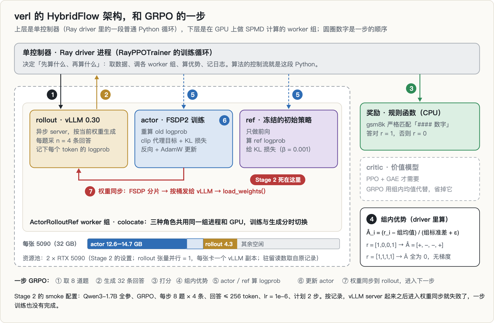
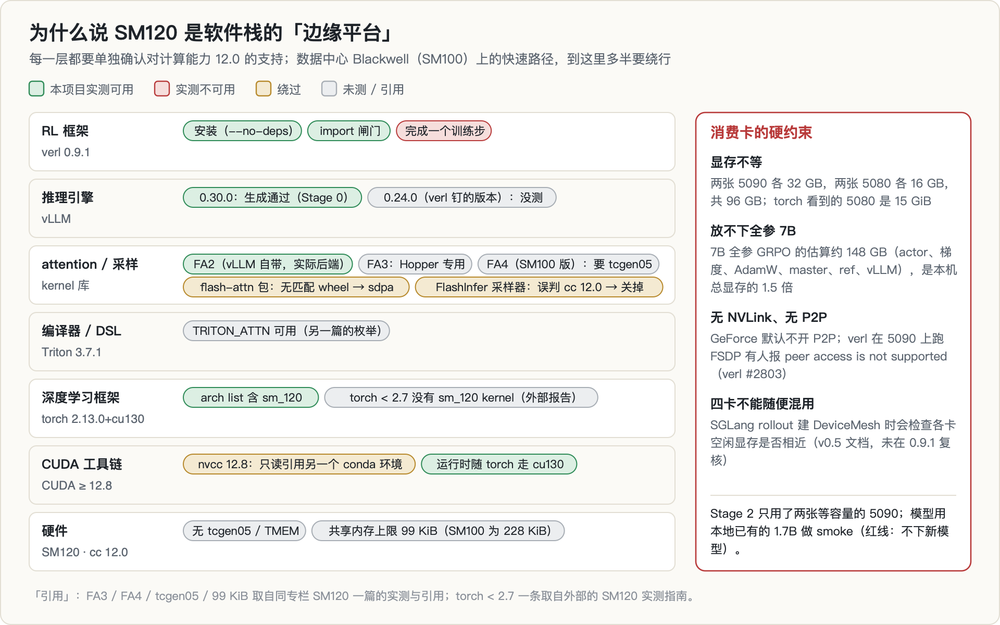
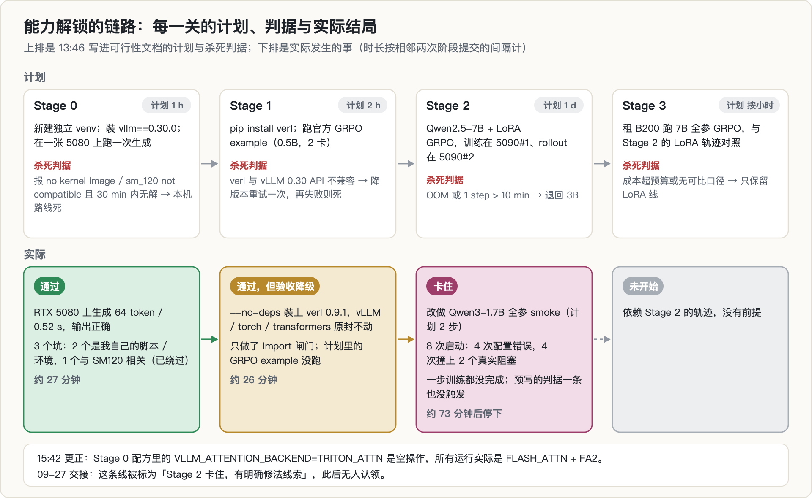
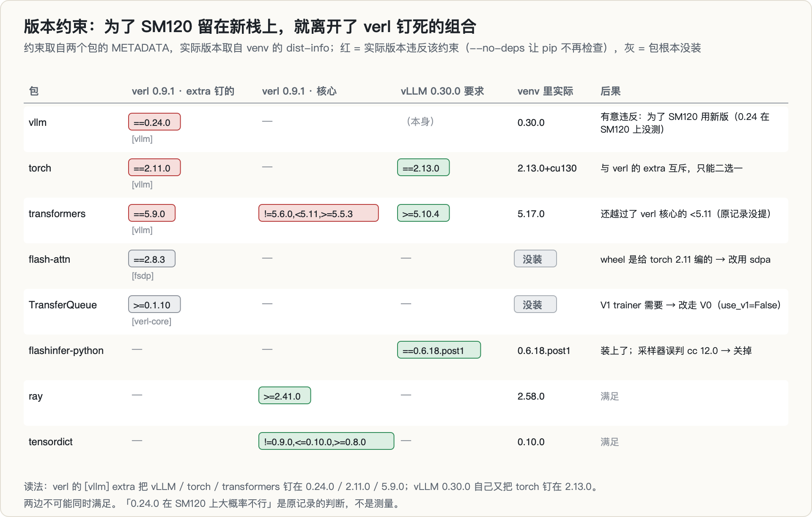
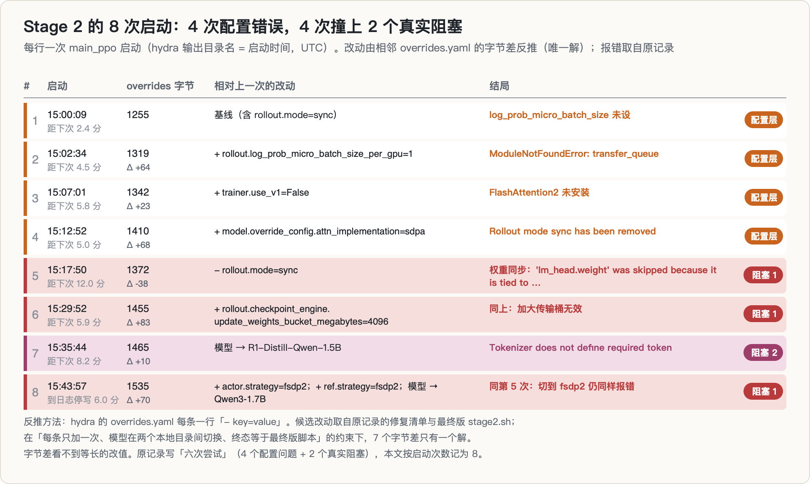
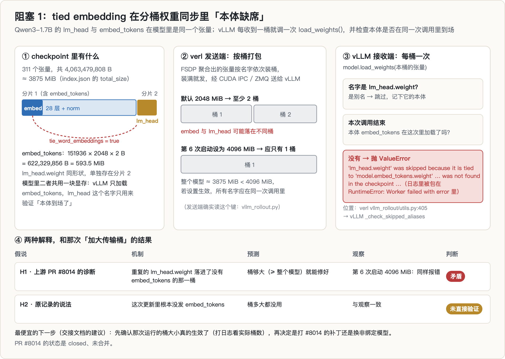
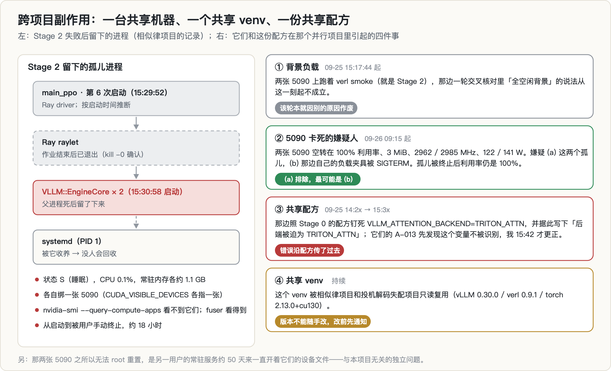
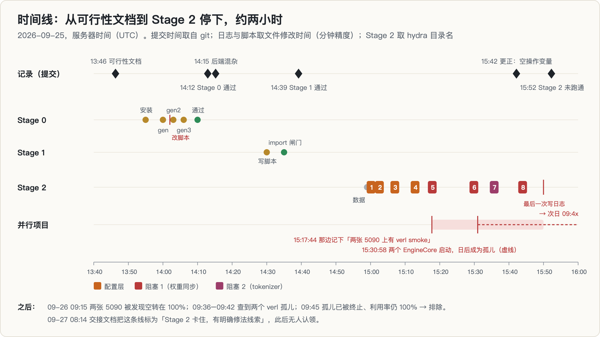
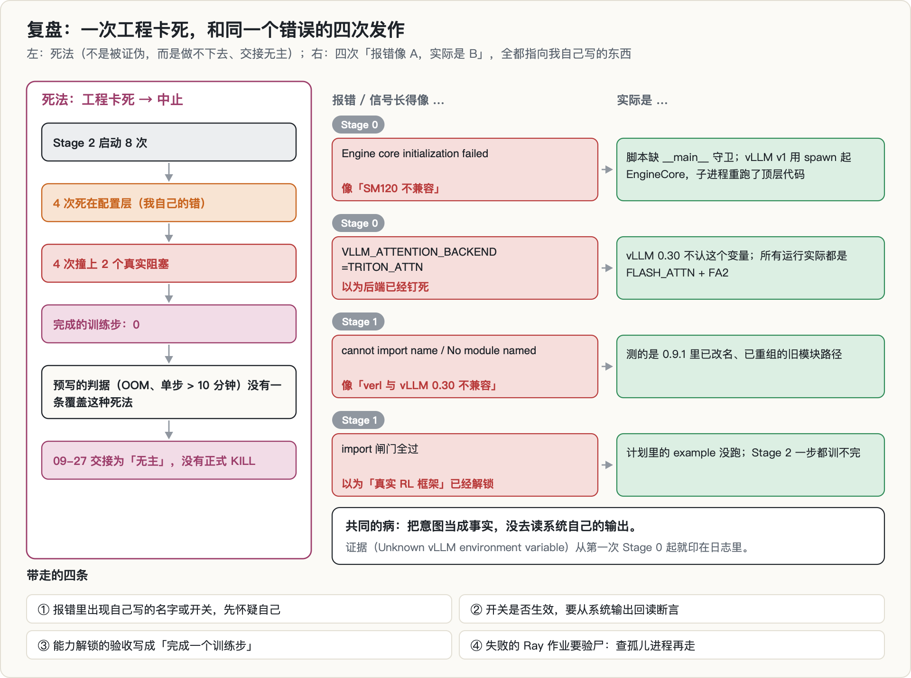

> **TL;DR**
>
> - **问题**：本机没有能用的真实 RL 框架，凡是要谈「生产 RL 循环」的方向都进不了场。能不能在自有的消费级 Blackwell（RTX 5090 / 5080，计算能力 12.0，下称 SM120）上，把 verl（vLLM 做 rollout、FSDP 做训练）跑完一步 GRPO？
> - **做法**：先写可行性文档和分阶段的杀死判据。Stage 0 验证 vLLM 能否在 SM120 上生成，Stage 1 验证 verl 能否装上，Stage 2 跑一次真正的 GRPO。全程用独立 venv，不动别的项目的环境。
> - **结果**：**中止，死法是工程卡死，不是被证伪。** Stage 0 通过（vLLM 0.30.0 在 RTX 5080 上生成 64 token / 0.52 s）。Stage 1 按 import 闸门通过（verl 0.9.1 用 `--no-deps` 装上，vLLM / torch / transformers 都没有降级；计划里的 example 没跑）。Stage 2 在 15:00 到 15:44 之间启动了 8 次：4 次死在我自己的配置上，另外 4 次撞上两个真实阻塞。一个是 Qwen3-1.7B 的 tied embedding 在权重同步时被 vLLM 0.30 的别名检查拒绝，另一个是换成非绑定模型后又撞上 tokenizer。**一步训练都没有完成。** 两天后，这条线以「Stage 2 卡住，有明确修法线索」的状态交接出去，之后没有人接手。
> - **过程**：同一个错误发作了四次。报错看起来像「SM120 不兼容」「版本不兼容」，真正的原因却是我自己的脚本、模块路径和开关。其中一个根本不生效的环境变量（`VLLM_ATTENTION_BACKEND`）还跟着共享配方进了另一个项目。
> - **附带**：这个 venv 后来成了两个项目的只读运行时（[相似律风洞](../llm-serving-similitude/)和[投机解码失配](../spec-decoding-rl-mismatch/)）。Stage 2 留下的两个 vLLM EngineCore 孤儿进程在共享机器上活了约 18 小时，一度成了另一个项目排查「5090 卡死」时的嫌疑对象。

---

## 0. 读法

| 部分 | 内容 |
|---|---|
| 1–2 | 原理：verl 的 HybridFlow 架构与 GRPO 的一步；SM120 为什么是软件栈的「边缘平台」 |
| 3–4 | 为什么要做这件事、它在选题链里的位置、跑之前写下的计划与杀死判据 |
| 5–7 | Stage 0 / 1 / 2 的真实经过：装了什么、在哪报了什么错、怎么绕过去 |
| 8–9 | 死因；对并行项目的副作用 |
| 10–13 | 仍然有效的东西、错误与更正、教训、局限 |
| 14 | 复现 |

**数字从哪来。** 这个项目的目录没有 git，也没有自己的文档。阶段记录写在 [SM120 悬崖](../sm120-fp4-cliff/)那条线的仓库里：一份可行性文档（6 个提交，时间从 13:46 到 15:52），加上 09-27 另一个会话写的交接文档；副作用则记在相似律项目的实验登记里。本文的数字分三类：

- **[记录]**：取自上面这些文档。它们是当时逐条从日志里摘出来的，文中引用的报错原文也出自这里。
- **[元数据]**：出图脚本直接读取的服务器只读输出，包括文件大小与修改时间、hydra 输出目录名、venv 里各包的 dist-info 与 METADATA、模型的 `config.json` / `index.json`。
- **[推断]**：从元数据推出来的结论，会单独标注。最重要的一处在 §7.2：每次启动改了什么，是从相邻两份 `overrides.yaml` 的字节差反推出来的，不是逐行抄录。

时间一律是服务器时间（UTC），日期不写时默认是 2026-09-25。

---

## 1. 背景：verl 怎么组织一次 RL 迭代

### 1.1 RL 后训练里的五个角色

GRPO / PPO 这类 RL 后训练，一次迭代里要用到五种东西：

- **actor**：被训练的策略 $\pi_\theta$；
- **rollout**：用和 actor 同一份权重生成回答的推理引擎（vLLM / SGLang）。生成是逐 token 的自回归过程，需要 KV cache、连续批处理、CUDA graph 这些推理专用的优化，所以另用一个引擎，不拿训练框架的前向去生成；
- **ref**：冻结的初始策略 $\pi_\text{ref}$，只做前向，用来算 KL 约束；
- **critic**：价值模型 $V_\phi$，PPO + GAE 才需要；
- **reward**：打分函数。本文用的是规则函数，不是奖励模型。

rollout 和 actor 是两套代码、两套 kernel，同一个 token 在两边算出的概率并不完全一样。这就是「训练–推理失配」，也是本专栏最后一篇[投机解码失配](../spec-decoding-rl-mismatch/)测量的东西。

### 1.2 HybridFlow：一个控制器，加几组 SPMD worker



verl 的架构来自 HybridFlow（EuroSys 2025），核心是把两种编程范式叠在一起：

- **上层是单控制器。** 一个 Ray driver 进程里跑着训练循环（`RayPPOTrainer`）。RL 算法「先生成、再打分、再算优势、再更新」的控制流，就是这段普通的 Python。改算法时只动这一层。
- **下层是多控制器。** 每一组 worker 内部是 SPMD 的多进程计算：FSDP / Megatron 做训练，vLLM / SGLang 做生成。它们作为 Ray actor 挂在**资源池**上，由资源池决定哪个角色落在哪几张卡上。
- **colocate。** 默认情况下，actor、rollout、ref 三种角色放进同一组进程、同一批 GPU（`ActorRolloutRef` worker 组），训练和生成分时切换，谁不用就让出显存。
- **权重同步。** 不管放不放在一起，每次训练完都要把 actor 的新权重交给 rollout 引擎。colocate 时，这一步走的是同一张卡上的进程间传递。

权重同步是整个系统里最脆弱的接缝。FSDP 那边的权重是按卡切片的，名字和形状遵循 HF 的约定；vLLM 那边有自己的权重加载器，名字、融合方式、别名规则都按它自己的来。两个独立的代码库必须在「发哪些张量、叫什么名字、分几次发」上达成一致，任何一边升级都可能打破这份约定。**Stage 2 就死在这里。**

### 1.3 GRPO 的一步

对每道题 $q$，用当前策略采 $G$ 条回答 $o_1,\dots,o_G$（Stage 2 里 $G$ = `rollout.n` = 4），规则函数给出奖励 $r_i \in \{0, 1\}$。verl 内置的 gsm8k 打分会严格匹配 `#### 数字`，答对得 1，否则得 0。GRPO 不训练 critic，而是直接用**组内**的相对好坏作为优势：

$$
\hat A_i = \frac{r_i - \operatorname{mean}(r_1,\dots,r_G)}{\operatorname{std}(r_1,\dots,r_G) + \varepsilon}
$$

同一条回答的所有 token 共享这个 $\hat A_i$。更新时沿用 PPO 的截断代理目标，并把 KL 约束直接放进损失：

$$
\mathcal{L}(\theta) = -\frac{1}{N}\sum_{i,t} \min\Big(\rho_{i,t}\hat A_i,\ \operatorname{clip}(\rho_{i,t}, 1-\epsilon, 1+\epsilon)\,\hat A_i\Big) + \beta\,\mathrm{KL}\big(\pi_\theta \,\|\, \pi_\text{ref}\big),
\qquad \rho_{i,t} = \frac{\pi_\theta(o_{i,t}\mid q, o_{i,<t})}{\pi_\text{old}(o_{i,t}\mid q, o_{i,<t})}
$$

其中 $N$ 是参与平均的 token 数（verl 里聚合方式可配），Stage 2 的 $\beta$ = `kl_loss_coef` = 0.001。有两点值得记住：

1. 如果一组 4 条回答全对或全错，$\hat A_i$ 全为 0，这组题对梯度没有任何贡献。所以 GRPO 需要题目难度落在「有对有错」的区间。
2. 一步里要做三种前向（rollout 生成、actor 重算 $\pi_\text{old}$、ref 算 $\pi_\text{ref}$）、一次反向和一次权重同步。图 1 里的 ①–⑦ 就是这个顺序。

---

## 2. SM120：为什么是软件栈的「边缘平台」



### 2.1 「Blackwell」不是同一个东西

数据中心的 B200 是 SM100（计算能力 10.0），RTX 50 系是 SM120（计算能力 12.0）。名字都叫 Blackwell，指令集和片上资源却不一样。同专栏的 [SM120 一篇](../sm120-fp4-cliff/)用 `ptxas` 实测过 sm_120 不接受 `tcgen05` 指令；它也没有 TMEM，每个 SM 的共享内存上限是 99 KiB（SM100 是 228 KiB）。于是专门为 SM100 写的快速路径，比如 FlashAttention-4、CUTLASS 的 SM100 集合，在这里编译不过。

### 2.2 每一层都要单独确认

在 SM120 上跑一个 RL 框架，要从下往上逐层确认「支持计算能力 12.0」：

| 层 | 本机情况 | 来源 |
|---|---|---|
| CUDA 工具链 | verl 官方要求 CUDA ≥ 12.8；本机的 nvcc 12.8 装在另一个 conda 环境里，只读引用 | [记录] |
| PyTorch | torch 2.13.0+cu130，arch list 含 `sm_120` | [记录] / [元数据] |
| attention kernel | vLLM 自带的 FA2 可用，也是实际选中的后端；FA3 只支持 Hopper；FA4 需要 `tcgen05` | [记录] / 引用 |
| `flash-attn` 包 | verl 钉的是给 cu130 + torch 2.11 编的 2.8.3，和 torch 2.13 不匹配，只能现编或改用 sdpa | [元数据] / [记录] |
| FlashInfer | 0.6.18.post1 装上了，但采样器在 cc 12.0 上的能力检测判错，只能关掉 | [记录] / [元数据] |
| 推理引擎 | vLLM 0.30.0 能生成；verl 钉的 0.24.0 在 SM120 上没测过 | [记录] |
| RL 框架 | verl 0.9.1：能装、能 import、能起集群，但完成不了一个训练步 | [记录] |

这张表里没有一项是「完全不支持」，但几乎每一项都是「新版本才支持」「部分支持」或「要绕一下」。外部的 SM120 实测指南提到，torch 低于 2.7 没有 sm_120 的 kernel；vLLM 的 issue 里也能看到这类摩擦，比如预编译 wheel 在 RTX 50 系上报 `no kernel image`（[#35432](https://github.com/vllm-project/vllm/issues/35432)），又比如 SM120 上的 NVFP4 因为后端选择只检查 SM100 家族而退回 Marlin（[#31085](https://github.com/vllm-project/vllm/issues/31085)）。与此同时，vLLM 也在陆续补 SM120 的支持，例如给 RTX 5090 加上 NVFP4 KV cache（[#50288](https://github.com/vllm-project/vllm/issues/50288)）。

**「边缘」的实际含义是：你只能待在各层的最新版本附近，而这恰好会把你推离上层框架测试过、钉死的那套版本组合。** §6 会看到这一点具体怎么发生。

### 2.3 消费卡的硬约束

- **显存不等**：两张 5090 各 32 GB，两张 5080 各 16 GB，共 96 GB；torch 看到的 5080 是 15 GiB。[记录]
- **放不下全参 7B**：可行性文档估算 7B 全参 GRPO 大约要 148 GB，包括 actor 权重、梯度、AdamW 状态、fp32 master、ref、vLLM 的权重与 KV，是本机总显存的 1.5 倍。7B + LoRA 拆到两张 5090 上，训练侧约 20 GB，rollout 侧约 22 GB，理论上放得下。[记录，推导]
- **没有 NVLink，也没有 P2P**：GeForce 默认不开 P2P。有人在 5090 上用 verl 跑 FSDP 时报过 `peer access is not supported`（[verl #2803](https://github.com/volcengine/verl/issues/2803)），NCCL 在双 5090 上也有同类问题（[nccl #1637](https://github.com/NVIDIA/nccl/issues/1637)）。
- **四张卡不能随便混用**：verl 旧版文档写明，SGLang rollout 建 DeviceMesh 时会检查各卡的空闲显存，差异超过约 10% 就直接报错。这一条还没有在 0.9.1 上复核。Stage 2 只用了两张等容量的 5090，所以没有碰到。[记录，引用]

---

## 3. 动机：为什么要做这件「能力解锁」



**它不是一个研究点子，而是一张门票。** 09-25 的选题闸门里，10 个候选方向没有一个干净通过。其中「消费卡上 RL 共置的切换成本」死因之一，是踩到了红名单上的「真实 RL 框架」一项：本机只有自己写的 GRPO trainer，任何关于「生产 RL 循环」的主张都站不住。13:46，我写下可行性文档，把这条路叫作「路径 1」：把能负担的规模整体往上挪，先拿到进入 RL 系统层的资格。

同一份文档里也写了一句很清醒的提醒：**有资格进场，不等于有位置可占。** 它数过，MLSys 2026 的 RL 后训练论文只有 4 篇，ASPLOS 2026 只有 2 篇，而且高度集中在「用投机解码加速 rollout」上。所以路径 1 从一开始就被定位为「工具」，必须再配上一个能过闸门的主张才有意义。

**它在选题链里的位置。** 这件事和 [rollout 半衰期](../rollout-half-life/)在同一天、同一台机器上并行进行，两天后两条线被写进同一份交接文档，都成了「无主」状态。当天下午，[相似律风洞](../llm-serving-similitude/)直接借用了它的 venv 和 Stage 0 配方；四天后，[投机解码失配](../spec-decoding-rl-mismatch/)的全部 vLLM 实验也跑在这个 venv 上。它继承的是 [SM120 悬崖](../sm120-fp4-cliff/)那条线积累下来的机器知识：nvcc 在哪、GPU 只能按 UUID 指代、哪些东西不能往共享环境里装。

**假设链**很短，每一环都有自己的杀死条件：

1. vLLM 的新版本能在 SM120 上生成。这一点当时并不确定：有 issue 报过 `no kernel image`，也有 PR 在给 RTX 5090 加功能。
2. verl 能装在这个栈上，而且不需要降级。
3. 在两张 5090 上，一步 GRPO 能完成。
4. 7B + LoRA 放得下（显存算术，§2.3）。

---

## 4. 计划与判据：13:46 写下的东西

| Stage | 内容 | 计划时间 | 杀死判据 |
|---|---|---|---|
| 0 | 新建独立 venv；装 `vllm==0.30.0`；在一张 5080 上跑一次生成 | 1 h | 报 `no kernel image` / `sm_120 not compatible`，且 30 分钟内无解 → 本机路线死 |
| 1 | 装 verl；跑官方 GRPO example（0.5B，2 卡） | 2 h | verl 与 vLLM 0.30 API 不兼容 → 降版本重试一次，再失败就死 |
| 2 | Qwen2.5-7B + LoRA GRPO，训练在一张 5090，rollout 在另一张 | 1 d | OOM，或单步超过 10 分钟 → 退回 3B |
| 3 | 租 B200 跑 7B 全参 GRPO，和 Stage 2 的 LoRA 轨迹对照 | 按小时 | 超预算，或两者没有可比口径 → 只保留 LoRA 线 |

同时写下的红线：

- venv 建在项目目录里，不动任何其他项目的 `.venv`；
- 不往共享的 conda 目录里装任何东西，只把 `CUDA_HOME` 指过去，只读引用 nvcc 12.8；
- GPU 只用 UUID 指代，因为本机 `nvidia-smi` 和 torch 的编号顺序不一样；
- Stage 2 追加三条：不下载新模型、不存 checkpoint（磁盘配额）、HF 强制离线。

这些是**工程闸门**，不是统计判据。这个项目没有预注册意义上的主指标，它要回答的只是「能不能」。回头看，判据的问题不在松紧，而在**覆盖面**：Stage 2 只列了 OOM 和太慢两种死法，没有预料到「一步都跑不完」（§8）。

---

## 5. Stage 0：vLLM 0.30.0 能不能在 SM120 上生成

**做法。** 两张 5090 当时被别的项目占着，所以 Stage 0 用的是一张 5080。系统自带的 python3.12 缺 `ensurepip`，要 root 才能补，所以改用用户目录下的 `uv` 建了一个 Python 3.12.14 的 venv，然后装 `vllm==0.30.0`。vLLM 0.30.0 在 METADATA 里把 torch 钉死在 `==2.13.0`，于是 torch 被一并装成 2.13.0+cu130。[元数据]

检查脚本 `sm120_check.py` 做两件事：先打印 torch 的 arch list，确认里面有本卡的 `sm_120`；再做一次**真实生成**，用 Qwen3-1.7B、BF16、`enforce_eager=True`，两个问题，贪心解码 32 个 token。

13:55 到 14:10 之间一共留下 5 份日志：1 份安装日志，4 份生成日志。检查脚本最后一次修改是在 14:02，夹在第一份和第二份生成日志之间。[元数据]

**路上的三个坑**（[记录]）：

| # | 现象 | 真因 | 修法 | 和 SM120 有关吗 |
|---|---|---|---|---|
| 1 | venv 建不起来 | 系统 python3.12 没有 `ensurepip` | 改用 `uv` | 无关 |
| 2 | `Engine core initialization failed` | 脚本缺 `if __name__ == "__main__":`。vLLM v1 用 spawn 启动 EngineCore，子进程会重跑脚本的顶层代码 | 加主守卫 | 无关 |
| 3 | `Could not find nvcc`，之后是 `FlashInfer requires GPUs with sm75 or higher` | 子进程没有继承 `CUDA_HOME`；FlashInfer 在 cc 12.0 上的能力检测判错（12.0 显然不低于 7.5） | 显式传环境变量；`VLLM_USE_FLASHINFER_SAMPLER=0` | 后半有关 |

第 2 个坑一度被读成「SM120 不兼容」，差点把整条路线判死。报错栈里其实出现了我自己脚本的文件名。

**结果**（[记录]）：在 RTX 5080（cc 12.0，15 GiB）上，LLM 构造耗时 62.3 s，生成 64 token 用了 0.52 s，即 122.6 tok/s，两个回答分别是 "4" 和 "Red, Blue, Yellow"。这是 eager 模式、两个问题的数字，**不是性能数据**，它只说明「能跑」。

14:12 提交的配方里写了四个「缺一不可」的环境变量，其中一行是 `VLLM_ATTENTION_BACKEND=TRITON_ATTN`，注释说它用来「绕开 FlashInfer 的 SM120 误判」。**这一行是错的**（§11）：vLLM 0.30 根本不认这个变量，每份日志里都印着 `Unknown vLLM environment variable detected: VLLM_ATTENTION_BACKEND`，实际选中的后端一直是 FLASH_ATTN + FA2。真正起作用的只有 `VLLM_USE_FLASHINFER_SAMPLER=0` 和 `CUDA_HOME`。

---

## 6. Stage 1：把 verl 装到能用的栈上



**冲突在哪。** 两个包的 METADATA 说得很清楚（[元数据]）：

- verl 0.9.1 的 `[vllm]` extra 钉死 `vllm==0.24.0`、`torch==2.11.0`、`transformers==5.9.0`；
- vLLM 0.30.0 自己钉死 `torch==2.13.0`。

两边不可能同时满足。如果照 verl 的 extra 装，整个栈会被拉回 vLLM 0.24，而 0.24 在 SM120 上从来没有验证过。原记录里「0.24 大概率不行」是一个判断，不是测量。

**做法：`--no-deps`。** 先用 `uv pip install --no-deps "verl==0.9.1"` 只装 verl 本体，再手动补它运行时需要的依赖：ray、tensordict、hydra-core、codetiming、dill、pylatexenc、torchdata、pyarrow、omegaconf。这是 `stage1.sh` 里的清单，原记录的最终配方又补上了 datasets、peft、wandb、tensorboard 和 pybind11。

**结果**（[记录] + [元数据]）：vllm 0.30.0、torch 2.13.0+cu130、transformers 5.17.0 都没被动过；verl 0.9.1、ray 2.58.0、tensordict 0.10.0 装上了。import 闸门（`ray_trainer`、`core_algos`、`vllm_rollout.vllm_rollout`、`rl_dataset`）全部通过。当时认为 Stage 1 的「分支 B」（降到 vLLM 0.24 再重验 SM120）不必走了。

**一条原记录没提到的越界**（[元数据]）：verl 核心依赖（不在任何 extra 里）要求 `transformers>=5.5.3,<5.11,!=5.6.0`，而装上的是 5.17.0。`--no-deps` 让 pip 不再检查这条约束，没有任何报错。它和后面的失败有没有关系，我没有验证。

**两次自伤。** `stage1.sh` 测的是 `verl.workers.rollout.vllm_rollout.vllm_rollout_spmd`，结果报 `cannot import name`；后来又测 `verl.workers.actor.dp_actor`，报 `No module named`。两次报错都像「verl 与 vLLM 0.30 不兼容」，实际上是 0.9.1 已经把这两个模块改名或重组了，我测的是过时的路径。

**当时认为买到的东西**（[记录]，读 verl 源码所得）：`core_algos` 里有重要性比（`old_log_prob` 和 `log_prob`）、DAPO 式的非对称截断（`clip_ratio_low` / `clip_ratio_high`）、截断重要性采样（`rollout_is_weights`）；策略损失的注册表里有 10 多种实现，包括 token 级的 PPO-clip（`vanilla`）和 GSPO 的序列级几何平均（`geo_mean`）；优势估计器有 12 种。

**验收被悄悄降级了。** 计划里 Stage 1 的内容是「装 verl，跑官方 GRPO example」，实际只做了 import 闸门，就在 14:39 的提交里宣布「真实 RL 框架」和「算子选择」两个红名单项「在本机同时关闭」。这个结论是 Stage 2 推翻的（§11）。

---

## 7. Stage 2：跑一次真正的 GRPO

### 7.1 设置

**数据**（[元数据]）：`prep_verl_data.py` 把另一个项目本地已有的 GSM8K 式题目和标准答案（不下载任何数据）转成 verl 要求的 parquet，训练集 64 行，验证集 16 行。列是 `data_source`（写成 `openai/gsm8k`，以便分派到 verl 内置的 gsm8k 规则奖励）、`prompt`（对话消息列表）、`ability`、`reward_model`（`{style: rule, ground_truth}`）、`extra_info`。每道题末尾加一句要求：把最终答案写在 `#### ` 后面。

**配置**（最终版 `stage2.sh`，[元数据]）：GRPO，Qwen3-1.7B 全参，两张 RTX 5090；actor 和 ref 用 FSDP2；rollout 用 vLLM，张量并行 1，`gpu_memory_utilization=0.30`，`enforce_eager=True`；每步 8 道题 × 4 条回答，提示 ≤ 384 token，回答 ≤ 256 token；lr = 1e-6，KL 损失系数 0.001；只跑 2 步，不做验证，不存 checkpoint，HF 离线。

这比计划里的「7B + LoRA」小得多，是一次 smoke 的 smoke。模型选 1.7B，是因为它本地就有，而红线不允许下载新模型。

### 7.2 八次启动



hydra 为每次 `main_ppo` 启动建一个以启动时间命名的输出目录，一共 8 个（15:00:09 到 15:43:57）。

**每次改了什么，是怎么知道的**（[推断]）。hydra 把命令行覆盖项写进 `overrides.yaml`，每条一行 `- key=value`。8 份文件的字节数依次是 1255、1319、1342、1410、1372、1455、1465、1535，相邻差值是 +64、+23、+68、−38、+83、+10、+70。候选改动取自原记录的修复清单和最终版 `stage2.sh`，各自的行长刚好是：加 `rollout.log_prob_micro_batch_size_per_gpu=1` 为 +64，加 `trainer.use_v1=False` 为 +23，加 sdpa 覆盖为 +68，删 `rollout.mode=sync` 为 −38，加传输桶 4096 为 +83，模型目录从 `Qwen3-1.7B` 换成 `R1-Distill-Qwen-1.5B` 为 +10，加 actor / ref 两条 `strategy=fsdp2` 并把模型换回来，合计 +41 + 39 − 10 = +70。出图脚本在「每条只加一次、模型只在两个本地目录之间切换、终态必须等于最终版脚本」这几个约束下穷举，**7 个差值只有一个解**，而且顺序和原记录的修复清单逐条对得上。字节差看不到长度不变的改值，这是这个方法的盲区。

| # | 启动 | 相对上一次的改动 | 结局 | 类别 |
|---|---|---|---|---|
| 1 | 15:00:09 | 基线（含 `rollout.mode=sync`） | `log_prob_micro_batch_size` 没设 | 配置 |
| 2 | 15:02:34 | + `rollout.log_prob_micro_batch_size_per_gpu=1` | `ModuleNotFoundError: transfer_queue` | 配置 |
| 3 | 15:07:01 | + `trainer.use_v1=False` | FlashAttention2 没装 | 配置 |
| 4 | 15:12:52 | + `attn_implementation=sdpa` | `Rollout mode sync has been removed` | 配置 |
| 5 | 15:17:50 | − `rollout.mode=sync` | 权重同步：tied 权重报错 | 阻塞 1 |
| 6 | 15:29:52 | + 传输桶 = 4096 | 同上，加大传输桶无效 | 阻塞 1 |
| 7 | 15:35:44 | 模型 → R1-Distill-Qwen-1.5B | `Tokenizer does not define required token` | 阻塞 2 |
| 8 | 15:43:57 | 模型换回；actor / ref 切到 fsdp2 | 同第 5 次，切 fsdp2 无效 | 阻塞 1 |

报错原文取自原记录；把它们对应到第几次启动，靠的是上面反推出的改动顺序：每次启动的报错，就是下一次启动所修的那个问题。第 8 次的结局取自原记录里「切 fsdp2 → 同样报错」这一句。

四个配置问题各自的来由（[记录] + [元数据]）：

- **`transfer_queue`**：verl 0.9.1 的 V1 trainer 依赖 TransferQueue。它在 METADATA 里属于 `[verl-core]` extra，`--no-deps` 没有装它，原记录说它不在 PyPI 上。于是改走 V0 trainer。
- **FlashAttention2**：verl 的 `[fsdp]` extra 要的是给 cu130 + torch 2.11 编的 `flash-attn==2.8.3`，和 torch 2.13 不匹配。没有去现编，而是把 HF 模型的 attention 实现改成 sdpa。
- **`mode=sync`**：0.9.1 已经移除同步 rollout，只剩异步 server 模式。这个配置是我照着旧文档写的。
- **`log_prob_micro_batch_size`**：rollout 侧的 micro batch 必须显式设置。

原记录里写的是「六次尝试，四次是我自己的配置 / 路径错误，两次是真实不兼容」，看起来是按问题数数的（4 个配置问题 + 2 个真实阻塞）。本文按启动次数记为 8 次。

### 7.3 跑通了的部分

按记录，去掉四个配置问题以后，流程能一路走到：Ray 集群起来 → FSDP worker 初始化 → 模型权重加载 311/311 → vLLM 的 HTTP server 起来 → **两张 5090 上同时驻留 actor（12.6–14.7 GB）和 vLLM rollout（4.3 GB）** → 进入权重同步。

这本身是一个正面结果：verl 0.9.1 + vLLM 0.30.0 + FSDP2 在 SM120 上能完成初始化，colocate 的显存也放得下。坏就坏在最后一步。

### 7.4 阻塞 1：tied embedding 的权重同步



**报错原文**（`logs/stage2.out`，[记录]）：

```
RuntimeError: Worker failed with error ''lm_head.weight' was skipped because it is tied to
'model.embed_tokens.weight' in Qwen3ForCausalLM, but 'model.embed_tokens.weight' was not found
in the checkpoint, so the tied weight is uninitialized.'
```

出错位置是 verl 的 `vllm_rollout/utils.py:405`，即 `model.load_weights(param_updates)`。

**机制。** Qwen3-1.7B 的 `tie_word_embeddings = true`：输出层 `lm_head` 和输入嵌入 `embed_tokens` 在模型里是**同一个张量**，形状 151936 × 2048，BF16 下是 622,329,856 B（593.5 MiB）。checkpoint 里却把两个名字都存了：`embed_tokens` 在第 1 个分片，`lm_head.weight` 单独放在第 2 个分片，整个 checkpoint 一共 311 个张量、4,063,479,808 B（约 3875 MiB）。[元数据]

按 #8014 的描述，vLLM 加载 tied 模型时从来不真正读 `lm_head.weight` 的字节。它把这个名字当作别名跳过，记下它的「本体」是 `embed_tokens`，然后在**同一次** `load_weights()` 调用结束时检查本体有没有被加载。如果没有，就抛出上面这个错。vLLM 0.30.0 的 `models/utils.py` 里能看到这段跳过与检查的逻辑（`_check_skipped_aliases`）。[读源码]

verl 这边的权重同步是分桶进行的：FSDP 聚合出来的张量按名字依次装桶，装满就经 CUDA IPC / ZMQ 发给 vLLM，而接收端**每收到一桶就调一次** `load_weights()`。`rollout.yaml` 里的默认桶大小是 2048（单位写作 MB，代码里按 2²⁰ 字节算），整个模型大约 3875 MiB，至少要分两桶。[元数据]

**上游线索。** verl 有一个 PR [#8014](https://github.com/verl-project/verl/pull/8014)，报错字符串和这里逐字相同（只差模型类名）。它的诊断是：对 tied 模型，训练侧把 `lm_head.weight` 当成独立张量发送；如果它和 `embed_tokens` 落进了不同的桶，那次单独的 `load_weights()` 就过不了 vLLM 的完整性检查，对「小模型 + 大词表」尤其容易发生。这个 PR 的状态是 closed，没有合并。[记录]

**一个没解开的矛盾。** 按 #8014 的机制，把桶加到能装下整个模型就应该修好。第 6 次启动把桶设成了 4096（即 4096 MiB），大于 3875 MiB，**报错却一模一样**。有两种解释：

- **H1（#8014）**：`lm_head` 和本体被分到了不同的桶。它预测「桶够大就能修好」，这和第 6 次的结果矛盾，除非那次的设置根本没有生效。
- **H2（原记录）**：这次更新里根本没有发 `embed_tokens`。它预测「桶多大都没用」，和观察一致，但没有直接证据。

交接文档怀疑，`checkpoint_engine.*` 可能不是这条同步路径真正读的配置键。这个怀疑有来由：`rollout.yaml` 里这一项的注释写着「目前只在 SGLang rollout 里支持」。但我读了 venv 里 verl 0.9.1 的源码，vLLM rollout 的发送端确实读的是 `config.checkpoint_engine.update_weights_bucket_megabytes`（[读源码]），所以「键名不对」这个猜测不太成立。但那次运行里它**实际**是不是 4096，还要看那次解析后的配置和日志。这是接手时最便宜的第一步。

**切 FSDP2 也无效**（第 8 次）。FSDP2 的包装逻辑确实处理了 tied 权重，但它管的是「怎么切片」，不是「发给 vLLM 什么」。[记录]

### 7.5 阻塞 2：换非绑定模型，又撞上 tokenizer

本地三个模型的 `tie_word_embeddings`（[元数据]）：Qwen3-1.7B 是 true，DeepScaleR-1.5B 和 R1-Distill-Qwen-1.5B 都是 false。第 7 次换成了 R1-Distill-Qwen-1.5B，报错是 `Tokenizer does not define required token`。原因是 verl 按**架构名**（`Qwen2ForCausalLM`）选了 Qwen 的 continuous-token builder，而 R1-Distill 用的是 DeepSeek 的 tokenizer。verl 其实有 DeepSeek 的 builder，只是没被选中。[记录]

于是需要的是「**非绑定权重 + Qwen 聊天模板**」的模型，按记录，本地三个都不满足。最近的候选是 Qwen2.5-7B-Instruct（Qwen2.5 从 7B 起不绑定），下载约 15 GB，而当时的配额余量只有 14 GB（306 G / 软限 320 G）；09-27 再查时，已用 307 G、软限 320 G、硬限 340 G，余量 13 G。[记录]

---

## 8. 死因

**死法：工程卡死，然后中止。** 没有任何主张被证伪，也没有正式的 KILL 判定。具体来说：

1. **写好的判据没有覆盖这种死法。** Stage 2 只列了「OOM」和「单步超过 10 分钟」，两条都没有触发，因为一步都没有跑起来。
2. **剩下的两条路都在预算或红线之外。** 修阻塞 1 需要给 verl 打一个上游没有合并的补丁；绕阻塞 2 需要先腾出配额，再下载一个 15 GB 的模型。记录里的第三个选项是降到 vLLM 0.24，但它在 SM120 上没有验证过；第四个选项是直接在租来的数据中心卡上做。
3. **没人接。** 负责这条线的会话结束以后，09-27 的交接文档把它标为「Stage 2 卡住，有明确修法线索」，此后没有人认领。

**因果链。** 这条链的一部分是推断，我把它明确标出来：

- SM120 要求用新版本 vLLM。[推断：vLLM 0.24 在 SM120 上没测过]
- 用了新版本 vLLM，就离开了 verl 钉死的版本组合；`--no-deps` 又让这种偏离一声不响，连 transformers 越过上限都没有报错。[元数据]
- 权重同步这个接缝恰好对版本组合最敏感。阻塞 1 的机制本身和 SM120 **无关**：它是 verl 的分桶同步和 vLLM 的别名检查之间的约定问题，上游 PR 描述同一个报错时也完全没有提到硬件。

所以，更准确的说法是：**消费级 Blackwell 的代价不是某个 kernel 缺失，而是把你推进了一个没人测过的版本组合，然后你在那里撞上一个和硬件无关的 bug。**

**给这次路径 1 打分：一半。** 能装、能起、能驻留，但训不了一步。原记录在 15:52 自己也改了口：「X11 只关了一半」。

---

## 9. 跨项目副作用



这台机器同时跑着好几个项目。这次失败实验对并行的[相似律风洞](../llm-serving-similitude/)项目有四处影响，全部记在那边的实验登记里：

**① 背景负载。** 那个项目要测每步的固定开销，对后台负载很敏感。它的一轮交叉核对里写着「全空闲背景」，但从 15:17:44 起，两张 5090 上跑着的正是 Stage 2 的第 5 次启动（hydra 目录 15-17-50，[推断]，按时间）。那边据此记录：「全空闲背景」的说法从这一刻起不成立。那一轮本来就因为别的原因作废了，所以没有影响它的结论；但同样的注意事项适用于之后的每一轮。

**② 孤儿进程。** 次日（09-26）09:15，那边发现两张 5090 空转在 100% 利用率、3 MiB 显存占用、2962 / 2985 MHz、122 / 141 W，而 `nvidia-smi --query-compute-apps` 返回空。09:36 到 09:42 之间，用 `fuser` 查到两张卡的设备文件被两个 `VLLM::EngineCore` 进程持有，情况如下：

- 启动于 09-25 15:30:58，落在第 6 次启动（15:29:52）之内（[推断]，按时间）；
- 父进程是 systemd（PID 1），工作目录是 `~/mlsys_verl_probe`；
- 它们的 Ray raylet 已经不存在（`kill -0` 确认）；
- 状态为睡眠，CPU 0.1%，常驻内存各约 1.1 GB；
- 各自用 `CUDA_VISIBLE_DEVICES` 绑定一张 5090。

也就是说，失败的 Ray 作业退出了，但它拉起的 vLLM 引擎进程没有被回收，被 systemd 收养以后就一直挂着。

那边列了两个嫌疑：(a) 就是这两个孤儿；(b) 那边自己在 16:22 用 SIGTERM 中途杀掉的一个负载夹具。孤儿后来由用户手动终止，两张卡却**仍然**是 100% 利用率，于是嫌疑 (a) 被排除。这两个孤儿从启动到被终止，大约活了 18 小时。

还有一个与本项目无关、但同时被查出来的事实：两张 5090 之所以没法用 root 重置，是因为另一位用户的常驻服务 50 天来一直开着它们的设备文件。

**③ 错误沿配方传了过去。** 那边在 14:2x 照 Stage 0 的配方钉死运行环境，其中就有 `VLLM_ATTENTION_BACKEND=TRITON_ATTN`，还据此写下「本机 FlashInfer 不可用，attention 后端被迫为 TRITON_ATTN」，并把它列为跨架构迁移时的一个混杂因素。15:3x，那边的修正条目先发现这个变量不被识别，所有运行实际都是 FLASH_ATTN + FA2；我 15:42 才在这边更正。**错误是我这边产生的，却是下游先发现的。**

**④ 共享 venv。** 那边约定「只读复用 `~/mlsys_verl_probe/.venv` 里的 vLLM 0.30.0」，并要求改版本前先通知；[投机解码失配](../spec-decoding-rl-mismatch/)项目后来也只读复用了同一个解释器，还在每条 trace 里记录包指纹。这个 venv 从一次失败实验的副产品，变成了两个项目的运行时依赖，版本从此不能随手改。

---

## 10. 仍然有效的东西

1. **一个在 SM120 上可用的 vLLM 0.30.0 环境，以及更正过的配方。** 配方是 `CUDA_HOME` 指向 nvcc 12.8、`VLLM_USE_FLASHINFER_SAMPLER=0`、`CUDA_DEVICE_ORDER=PCI_BUS_ID`，GPU 按 UUID 指定，并且**不要**设 `VLLM_ATTENTION_BACKEND`。已发布的[投机解码失配](../spec-decoding-rl-mismatch/)一文的实验都跑在这个解释器上，它的约束文件写明只读复用、不装包。
2. **verl 0.9.1 + vLLM 0.30.0 的四个配置坑**（§7.2）。这些都是一次性的坑，再踩就是浪费。
3. **verl 0.9.1 + vLLM 0.30.0 + FSDP2 能在两张 5090 上完成初始化**，并且同时驻留 actor 和 rollout（§7.3）。
4. **两个阻塞的精确诊断。** 阻塞 1 有一个报错逐字相同的上游 PR，和一个写清楚的矛盾（§7.4）；阻塞 2 的原因精确到「按架构名选 tokenizer builder」（§7.5）。
5. **一张版本约束图**（图 4），包括一条原记录没有发现的越界（transformers 5.17.0 越过了 verl 核心的 `<5.11`）。

---

## 11. 过程中的错误与更正



| 错误 | 后果 | 怎么发现的 | 处理 |
|---|---|---|---|
| Stage 0 脚本缺 `__main__` 守卫 | 报 `Engine core initialization failed`，一度被读成「SM120 不兼容」 | 栈里出现了自己脚本的文件名 | 加守卫，写进配方 |
| 把 `VLLM_ATTENTION_BACKEND=TRITON_ATTN` 写进配方，称「缺一不可」，注释为「绕开 FlashInfer 误判」 | 配方归因错误；另一个项目照抄后，还据此推出了错误的前提 | 日志里从第一次 Stage 0 起就印着 `Unknown vLLM environment variable`；另一个项目的修正条目先发现 | 15:42 更正：所有运行实际都是 FLASH_ATTN + FA2。但 `stage2.sh` 里那一行至今还在，仍排在「SM120 必需的四条」注释下面 |
| Stage 1 测了两个过时的模块路径 | `cannot import name` / `No module named`，看起来像版本不兼容 | 查 0.9.1 的模块结构 | 改用新路径 |
| **Stage 1 的验收被降级**：计划要跑 example，实际只做了 import，就宣布红名单项「关闭」 | 高估了进度，Stage 2 的「1 天」估计也跟着偏乐观 | Stage 2 一步都训不完 | 15:52 改为「只关了一半」 |
| Stage 2 的 4 个配置错误 | 用掉 4 次启动 | 报错 | §7.2 |
| 失败的作业没有检查孤儿进程 | 两个 EngineCore 持有 5090 的设备文件约 18 小时，成了另一个项目排查卡死时的嫌疑对象 | 另一个项目用 `fuser` 查设备持有者 | 由用户终止；排除为卡死原因 |
| （交接文档的推测）「`checkpoint_engine.*` 可能不是生效的配置键」 | 若采信，下一步会先去改配置键 | 读 verl 0.9.1 源码：vLLM rollout 发送端确实读这个键 | 推测不太成立；桶大小是否真的生效仍待核对 |

表里前四行其实是**同一个病**：把意图当成了事实，没有去读系统自己的输出。以为设了开关就生效，以为 import 通过就能训练，以为报错里的「不兼容」说的是平台。这一点在复盘图里单独画了出来：



---

## 12. 我学到了什么

1. **报错里出现自己写的名字、自己设的开关时，先怀疑自己。** 这一轮里四次看起来像「平台不兼容」的信号，最后全都指向我自己：缺守卫的脚本、过时的模块路径、不生效的环境变量、被降级的验收标准。
2. **开关生效没有，要从系统输出里回读、断言。** 后端是什么，应该从 EngineCore 的启动日志里抓 `Using FLASH_ATTN attention backend` 来确认，而不是靠自己设了哪个环境变量来推断。证据其实从第一天起就印在日志里。
3. **「能力解锁」的验收标准要写成一个具体动作：完成一个训练步。** import 通过、集群起来、权重加载完，都只是中间状态。验收一旦降级，后面的估计（比如「Stage 2 只要 1 天」）会跟着一起偏。
4. **边缘平台的真正代价是版本组合。** 为了 SM120 用新版 vLLM，就离开了上层框架测过的组合；`--no-deps` 能让安装成功，但也会把所有约束冲突变成静默的。下次遇到这种情况，我会先把「被跳过的约束」全部列出来（就像图 4），再决定要不要走这条路。
5. **在共享机器上，失败作业的收尾也是实验的一部分。** Ray 作业失败以后，要检查有没有父进程为 1、工作目录在本项目下的 EngineCore；判断一张卡「空不空闲」，只看 `nvidia-smi --query-compute-apps` 是不够的。
6. **共享出去的配方要带更正通道。** 下游照抄了我的配方，而且比我先发现了它的错误。被共享的东西，出了错要能主动通知到用它的人。
7. **磁盘配额也是判据。** 换模型这条路最后是被 14 GB 的余量卡住的，而这个限制一开始没有写进 Stage 2 的判据里。

---

## 13. 局限与开放问题

**测过的范围**：verl 0.9.1、vLLM 0.30.0、torch 2.13.0+cu130、transformers 5.17.0；Qwen3-1.7B（tied）和 R1-Distill-Qwen-1.5B（非绑定，DeepSeek tokenizer）；两张 RTX 5090；FSDP 与 FSDP2；vLLM eager 模式；V0 trainer；只到 smoke 规模。

**没测过的**（每一条都可能改变结论）：

- vLLM 0.24.0（verl 钉的版本）能不能在 SM120 上跑。「大概率不行」只是原记录的判断；
- 第 6 次启动时，传输桶大小是否真的是 4096（需要看那次解析后的配置，并打日志数出实际桶数）；
- 打上 PR #8014 的补丁以后，阻塞 1 能不能解决；
- 非绑定、Qwen 模板的模型（例如 Qwen2.5-7B-Instruct）能不能跑完一步；
- transformers 5.17.0 越过 verl 核心 `<5.11` 这件事有没有影响；
- 7B + LoRA、四卡异构、SGLang rollout、开 CUDA graph 的 rollout。

**如果要接手**，按成本从低到高：先核对那次运行的桶大小，接着试 #8014 的补丁（都不需要下载任何东西），然后腾出配额换一个非绑定模型，最后才考虑降 vLLM 或者租卡。这和交接文档的建议一致。

---

## 14. 复现

- **环境**：`uv` 建的 Python 3.12.14 venv；vllm 0.30.0、torch 2.13.0（cu130）、transformers 5.17.0、verl 0.9.1（`--no-deps`）、ray 2.58.0、tensordict 0.10.0、triton 3.7.1、flashinfer-python 0.6.18.post1；没有 flash-attn，也没有 TransferQueue。nvcc 12.8 只读引用自另一个 conda 环境。
- **脚本**：`sm120_check.py`（Stage 0：arch list + 真实生成）、`stage1.sh`（`--no-deps` 安装 + import 冒烟）、`prep_verl_data.py`（本地题目 → verl parquet）、`stage2.sh`（GRPO smoke，最终版）。
- **日志**：`logs/stage0_install.out`、`stage0_gen{,2,3}.out`、`stage0_triton.out`、`stage1.out`、`stage2.out`；8 次启动的 hydra 输出在 `outputs/2026-09-25/<启动时间>/`，每份都有 `.hydra/overrides.yaml` 和 `config.yaml`。
- **记录**：可行性文档的 6 个提交（`5cce2a5` 可行性、`8d7152f` Stage 0、`81ab209` 后端混杂、`3d0297e` Stage 1、`df97659` 更正、`ed3319c` Stage 2），交接文档 `bcd121e`。
- **本文的图**：由只用 Python 标准库的脚本生成（SVG 再转 PNG）。数字读自服务器只读命令的原样输出（文件元数据、dist-info、METADATA、模型 config / index）和上述文档的摘录；§7.2 的字节差反推也由脚本穷举完成，并检查了唯一性。

---

## 参考

这一篇是工程复盘，没有 arXiv 论文可引；下面把每条工程线索的**来龙去脉**写清楚——它是什么、报什么错、为什么和本篇相关。

### A. ⭐ verl 本体：HybridFlow 那篇论文解释了权重同步为什么是硬骨头

**verl（HybridFlow，EuroSys 2025）** · [github.com/verl-project/verl](https://github.com/verl-project/verl)
verl 的核心设计是 **hybrid controller**：把 RL 数据流的「控制流」和「计算流」分开——控制流用单进程描述算法（谁先跑、数据往哪送），计算流交给各自的后端（训练用 FSDP/Megatron，生成用 vLLM/SGLang）。
**与本篇的关系**：**这个设计直接解释了 §7 为什么死在权重同步。** 训练后端和生成后端是**两套独立的并行布局**：FSDP 把参数按 rank 切片，vLLM 用自己的张量并行切法。每步训练之后必须把 FSDP 的分片权重**重新聚合、再按 vLLM 的切法分发**——这一步既要跨进程通信，又要匹配两边的 dtype 和 layout。§1 那张迭代图里最细的那根箭头，工程上是最粗的一根。

### B. 权重同步：本篇八次启动全部死在这里

**verl PR [#8014](https://github.com/verl-project/verl/pull/8014)** —— *drop redundant tied lm_head.weight from bucketed weight-transfer*（已关闭，未合并）
问题是：当模型的 `lm_head` 与 embedding **权重绑定（tied）**时，分桶传输会把同一份张量传两次，其中一次的形状/所有权对不上。
**与本篇的关系**：**这是我自己提的 PR**，也是 §7 里绕过的那一关。它没被合并说明上游认为有更根本的修法，但对 SM120 这条边缘路径，它是当时唯一能让流程往前走一步的补丁。

**verl issue [#2803](https://github.com/volcengine/verl/issues/2803)** —— 5090 上 FSDP 报 `peer access is not supported`
消费级卡**没有 NVLink**，多卡之间走 PCIe，且 RTX 50 系在驱动层面不开放 P2P（peer-to-peer）直连访问。FSDP 默认假设 GPU 之间可以 P2P。
**与本篇的关系**：**这是「消费级卡不是小号数据中心卡」最硬的一条证据。** §2 讲 SM120 是「软件栈的边缘平台」，这条 issue 是最具体的例子——不是性能差一点，而是一个被上游默认存在的能力**根本不存在**。

**verl issue [#3271](https://github.com/verl-project/verl/issues/3271)** —— LoRA 与 vLLM v1 的兼容问题
**与本篇的关系**：我用 LoRA 是为了在 32GB 显存里塞下训练，但 LoRA 让权重同步更复杂——要同步的不再是完整权重，而是基座 + 适配器，两边对「什么是当前权重」的理解必须一致。

**NCCL issue [#1637](https://github.com/NVIDIA/nccl/issues/1637)**
NCCL 是所有跨卡集合通信的底座。权重同步、FSDP 的 all-gather 都走它。
**与本篇的关系**：当 P2P 不可用时，NCCL 的回退路径（走 host 内存中转）的行为和性能是另一套，很多上游代码没有在这条路径上测过。

### C. vLLM 在 SM120 上的三道坎

**vLLM issue [#35432](https://github.com/vllm-project/vllm/issues/35432)** —— RTX 50 系 `no kernel image is available for execution on the device`
最典型的新架构问题：预编译的 wheel 里**没有包含 sm_120 的 cubin**，运行时找不到对应架构的内核。
**与本篇的关系**：§6「把 verl 装到能用的栈上」花掉的大部分时间就在这类问题上——不是代码不对，是**二进制里没有你这张卡的那一份**。

**vLLM issue [#31085](https://github.com/vllm-project/vllm/issues/31085)** —— SM120 退回 Marlin
Marlin 是一个高性能的 INT4 权重量化 GEMM 内核。「退回 Marlin」意味着 SM120 上**更新的量化路径不可用**，只能走这条较老的。
**与本篇的关系**：和[第 2 篇](../sm120-fp4-cliff/)引用的 *Spec Sheets Are Not Kernels* 是同一个现象的两次独立观测——**某个精度在某张卡上能不能用，是整条软件栈的性质，不是芯片的性质**。

**vLLM issue [#50288](https://github.com/vllm-project/vllm/issues/50288)** —— RTX 5090 的 NVFP4 KV cache
**与本篇的关系**：NVFP4 KV cache 是省显存最直接的手段，对 32GB 的 5090 尤其关键。它在 SM120 上的状态，直接决定了能塞下多大的 batch——也就决定了 §7 的 GRPO 能不能跑起来。

### D. 社区一手材料

**[notwitcheer/sm120-field-guide](https://github.com/notwitcheer/sm120-field-guide)** —— SM120 实测指南
社区维护的「哪些库的哪个版本在 SM120 上能跑」的对照表。
**与本篇的关系**：§6 的版本组合基本是照着它试的。这类文档的存在本身说明了一件事：**在边缘平台上，「装得上」是一个需要专门知识的独立问题**，而这份知识目前只存在于社区记录里，不在任何官方文档中。

### E. 本专栏内部

- [第 2 篇：消费级 Blackwell 的 FP4「架构悬崖」是真的吗？](../sm120-fp4-cliff/) —— 同一张卡、同一个「边缘平台」处境，那篇测性能，本篇测能不能跑起来。
- [第 6 篇：一条 rollout 能用多久](../rollout-half-life/) —— 本篇如果跑通，它就是那篇的实验载体；跑不通，那篇只能退到 LoRA-GRPO 的离线轨迹上做。**这是本篇 §9「跨项目副作用」最直接的一条。**
- [第 8 篇：能把一张降频的消费卡当成风洞吗？](../llm-serving-similitude/) —— 同样从「手上只有消费级卡」这个约束出发，那篇想把约束变成方法，本篇想把约束解除。
- [第 9 篇：投机解码会悄悄改变 RL 的行为策略吗？](../spec-decoding-rl-mismatch/) —— 本篇要搭的 verl + vLLM 栈，正是那篇要在上面做失配测量的环境。
