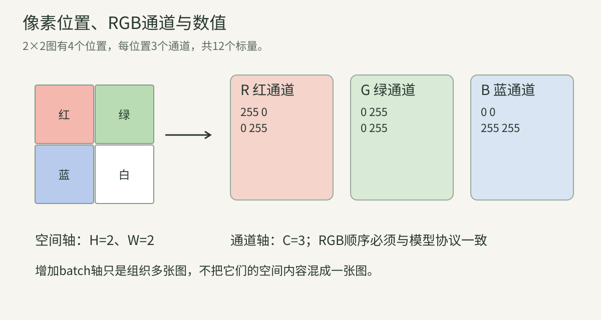
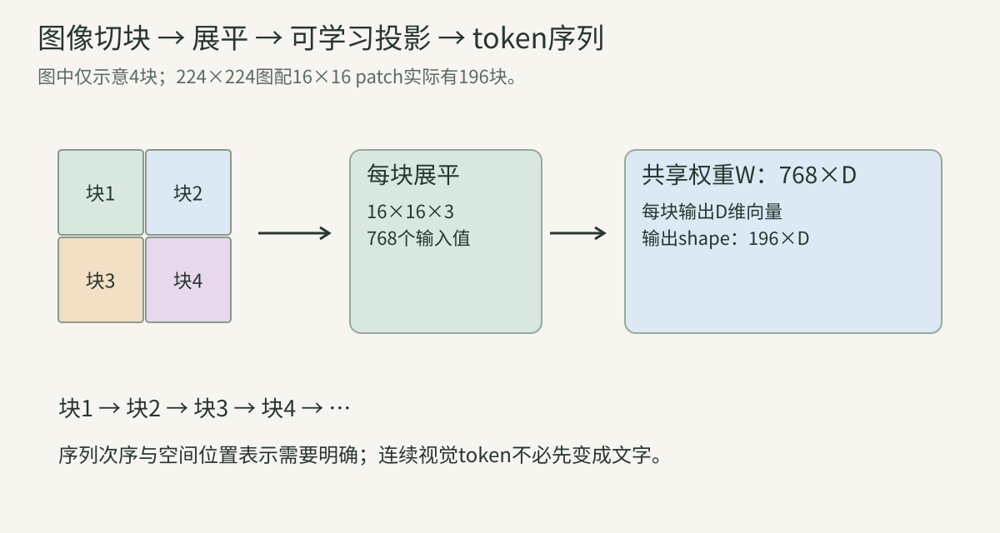
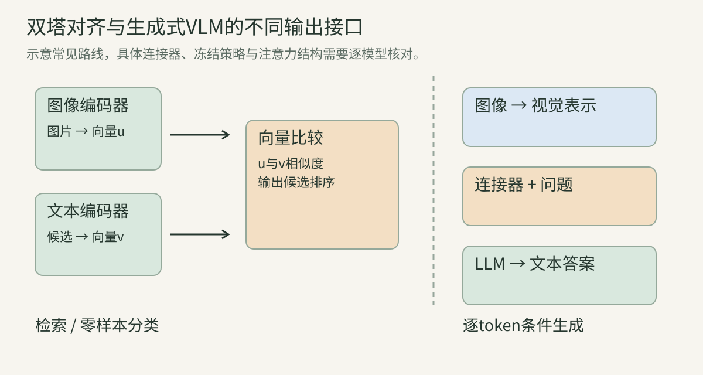
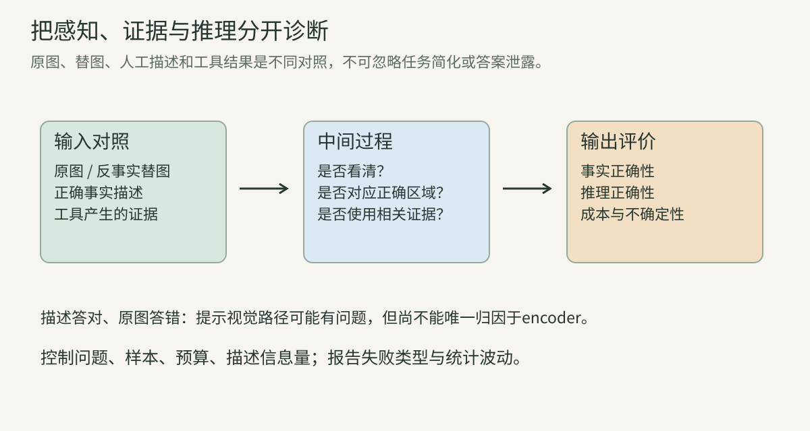

> 本讲负责建立语言和地图。没有学过矩阵、概率或 Transformer 也可以开始读：首次出现的符号都会就地解释。数学运算的完整基础在第 02—03 讲，图像基础在第 04 讲，训练基础在第 05 讲。这里涉及的模型家族还会在对应论文章展开。

## 一、先把“模型看见图片”拆成可观察的步骤

### 1. 人看到的猫，计算机读到的数

你看到的是一只猫、一张桌子和窗外的光。文件解码后的计算机对象，是按位置排列的一组数。灰度图像的每个位置可以用一个亮度值表示；常见 RGB 图像的每个位置有红、绿、蓝三个通道。

假设我们只有一张 2×2 彩色小图：

| 位置 | R | G | B | 用这些通道值表示的颜色 |
| --- | ---: | ---: | ---: | --- |
| 左上 | 255 | 0 | 0 | 红 |
| 右上 | 0 | 255 | 0 | 绿 |
| 左下 | 0 | 0 | 255 | 蓝 |
| 右下 | 255 | 255 | 255 | 白 |

这里 255 是常见 8 位无符号图像的最大通道值，不是“红色的名字”。模型接收的是数值关系。例如，蓝色区域在哪里、边缘附近的数值如何变化、相邻区域形成什么纹理。

**颜色的意义也依赖表示约定。** RGB 数值不是物体材料的完整物理描述；照明、相机响应、曝光和编码都会改变它。同一只猫在白天、夜晚和不同相机下，会产生不同数字。视觉模型因此需要学习跨外观变化仍可利用的规律。

**逐元素读图：**左边四格是空间位置；右边三层对应 R/G/B。一个“像素”在 RGB 表示中并非一个数，而是同位置的三个通道值。图中的颜色帮助你阅读，不是模型额外得到的类别标签。

### 2. 图像的形状：为什么经常写成 B×C×H×W

“形状”（shape）表示一个数组各轴有多少个元素：

- $B$：batch，一次处理多少张图。
- $C$：channel，每个位置有多少个通道。
- $H$：height，图像高度。
- $W$：width，图像宽度。

两张 2×2 RGB 图，采用通道优先格式，形状就是：

$$
(B,C,H,W)=(2,3,2,2).
$$

总共有 $2\times3\times2\times2=24$ 个标量。“标量”只是一项数值。两张图的内容没有因为增加 batch 轴而混成一张图：这个轴只是把两个样本放在同一计算任务里。

另一种表示是 $B\times H\times W\times C$。两种排列都合法，但算子必须遵守约定。**shape 对得上还不够，轴的含义也要对。**把颜色轴误认为宽度轴，会得到错误计算，即使程序没有立刻报错。

### 3. resize、crop、normalize 分别改变什么

三个常见预处理操作不能混为一谈：

1. **resize：改变空间采样。**把 1000×1000 缩到 224×224，有些细节会丢失；插值决定新位置怎么取值。
2. **crop：选择图像范围。**截取局部可能放大小字，也可能删除回答问题需要的上下文。
3. **normalize：改变数值尺度。**例如先除以 255，再按通道计算 $(x-\mu)/\sigma$。它通常不改变空间位置，却改变数值分布。

举例：问题问“收据右下角总额是多少”。整图缩小可能把小字变成不可辨认的像素；截取右下角可能恢复可读性；但截错位置就会遗漏真正的总额。语言模型再强，也不能可靠恢复输入已经删除的任意信息。

> **本模块检查点**：能说出像素、通道、batch、resize、crop 和 normalize 的区别。尚不要求会写卷积，但必须知道输入信息可能在进网络之前就丢失。

## 二、像素、特征、表示、embedding 与 token

### 4. “特征”是对输入的可用描述

特征（feature）是用于后续任务的描述。早期视觉常人工设计，例如边缘方向、局部梯度和颜色直方图；深度学习则让网络从数据中学习特征。

假设我们人工给一张图提取四项数：

$$
\mathbf z=[0.8,\ 0.2,\ 0.6,\ 0.1].
$$

这可以约定为“红色比例、边缘密度、圆形程度、文字比例”。它是一个四维特征向量。“四维”指四个数，不是四维物理空间。

现代模型的某一维通常没有如此整齐的人工名称。信息可能分布在许多维度；同一维也可能参与多个任务。不能看见一个 768 维向量，就想当然地把它的每一维解释为一个独立概念。

### 5. representation 和 embedding 的用法

representation 常译“表示”，是输入经过编码得到的内部描述。embedding 常译“嵌入”，强调把离散对象或输入映射到某个向量空间。很多论文会交替使用它们，但具体对象必须看定义。

例如：

$$
\mathbf z=f_\theta(x).
$$

逐个读符号：

- $x$：输入图像。
- $f$：一个计算规则，可以是神经网络。
- $\theta$：规则中可以通过训练改变的参数。
- 下标 $\theta$：提醒你，换参数可能改变输出。
- $\mathbf z$：输出表示。

如果输入是一张图片，输出一个向量，这是全局表示；如果输出每个区域一个向量，是局部或稠密表示。全局表示擅长回答“整张图像像什么”；局部表示更适合“那个东西在哪里”。

### 6. token 并不总是词，更不总是整数

token 是模型处理的一项序列单位。文本中可以是词、子词或字节片段；视觉中可以是图像 patch 对应的向量；机器人模型中可以是离散化的动作单位。

必须区分：

- **token ID**：如 17，是离散表里的编号。
- **token embedding**：如一个 768 维浮点向量，是进入网络计算的数值表示。
- **视觉 token**：可能由连续像素直接算出，没有先查一个离散视觉词表。
- **离散视觉 token**：由视觉码本编码产生 ID，常见于某些图像生成路线。

因此，“把图像变成 token”不必然等于“把图像转换成文字”，也不必然意味着用了离散码本。

### 7. patch 是把图像划分为局部块

以宽高都是 224、patch 边长为 16 的 RGB 图为例。每条边可以分成 $224/16=14$ 块，总计：

$$
N=14\times14=196.
$$

每个 patch 有 $16\times16\times3=768$ 个通道值。可以把这些数整理成一条向量，再用可学习的线性映射变成模型需要的宽度 $D$。例如 $D=768$，也可以是别的数；输入 patch 的 768 与输出宽度的 768 相同只是这个例子中的巧合。

$$
X_{\mathrm{patch}}\in\mathbb R^{196\times768},
\qquad
Z=X_{\mathrm{patch}}W+b
\in\mathbb R^{196\times D}.
$$

$\mathbb R$ 表示实数集合，$\in$ 读“属于”；$196\times D$ 指 196 行，每行 D 个数。详细矩阵运算在第 02 讲。

**逐元素读图：**四格小图用来示意切块；箭头代表固定的排列次序；每个长条是一个 patch 的 embedding。排列顺序本身不能代替全部位置表示。原始 ViT 的具体结构见[原论文](https://arxiv.org/abs/2010.11929)。

### 8. 全局语义和细粒度细节可能发生取舍

把整张图压成一个向量很方便：检索时只要比较向量。但以下信息未必都保留得很好：

- 两个非常相似物体的身份差别；
- 小字中的一个字符；
- 三个对象的精确相对位置；
- 物体边界和遮挡关系。

这不是说全局向量绝对不能编码空间信息，而是说**输出接口、训练目标和压缩容量共同决定保留什么更容易**。后续不能用“能分类”直接推导“能精确计数和分割”。

## 三、模型、参数、训练与推理

### 9. 架构与参数是两件不同的事

架构（architecture）规定计算怎么组织：有几层，使用卷积还是注意力，模块怎么连接。参数（parameters）是其中被训练的数，例如权重矩阵和偏置。

两个模型可以有相同架构，却因为训练数据或参数不同而表现很不一样。反过来，模型名字不同也不意味着核心架构有重大差别，可能主要改变了数据、训练阶段或输入分辨率。

一个 checkpoint 是某个训练时刻保存的状态；它通常含模型权重，训练检查点还可能有优化器、随机数和调度器状态。加载权重并不能替代图像处理器、分词器和输出协议。

### 10. 训练：用错误信号改变参数

用一个只含一个参数的玩具模型：

$$
\hat y=wx,
\qquad
L=\frac12(\hat y-y)^2.
$$

$\hat y$ 是预测，$y$ 是目标，$L$ 是损失。令 $x=2,y=6,w=1$，则预测为 2，损失为 8。此时：

$$
\frac{\partial L}{\partial w}
=(wx-y)x=(2-6)\times2=-8.
$$

这个导数表达“w稍微增大时，损失在当前点怎样变化”。取学习率 $\eta=0.1$：

$$
w_{\mathrm{new}}=w-\eta\frac{\partial L}{\partial w}
=1-0.1(-8)=1.8.
$$

新预测为 3.6，新损失为 $\frac12(3.6-6)^2=2.88$。这一步改善了当前样本，并不自动证明对新样本也好。

本例解释训练最基本的闭环：**计算预测 → 计算损失 → 求梯度 → 更新参数**。多层视觉模型也是这个逻辑，只是计算路径与参数规模更大。

### 11. 推理：使用当前参数完成任务

推理（inference）一般指参数固定时，从输入计算输出。你发给模型一张图，模型回答后，通常没有把这次对话作为梯度更新自动写入权重。

但“没有梯度更新”不等于“过程只有一步”。推理可以包含：

- 多次采样答案；
- 调用OCR或检测工具；
- 裁剪后再次观察；
- 用外部记忆检索；
- 让验证器检查候选；
- 在环境中执行动作并读取反馈。

这些操作会改变当前上下文、外部状态或计算量。必须分别判断它们是否改变模型参数。

### 12. 参数量大不等于每次使用的计算都大

dense 模型通常对每个 token 使用大部分对应层参数。MoE（Mixture of Experts，混合专家）模型将某些模块分为多个专家，由路由器选择部分专家计算。

因此要区分总参数与激活参数，也要区分参数存储、计算、通信和缓存。即使只激活部分专家，部署仍可能需要存放全部专家权重。不能把“激活参数少”直接翻译为“所有情况下都更省显存、更快”。

“大模型”本身没有统一的视觉参数阈值。基础模型更强调**预训练规模、通用表示和跨任务适配能力**，而非一个数字标签。

## 四、用同一张图理解不同视觉任务

### 13. 分类、检测、分割为什么不能互换

假设图中有两只猫与一只狗：

| 任务 | 输入问题 | 输出形式 | 核心要求 |
| --- | --- | --- | --- |
| 分类 | 图里主要是什么？ | 类别或类别概率 | 整体识别 |
| 检测 | 猫和狗分别在哪里？ | 类别、框、置信分数 | 实例定位 |
| 语义分割 | 哪些像素属于猫？ | 每像素类别 | 类别边界 |
| 实例分割 | 两只猫各有哪些像素？ | 每个实例的mask | 边界加身份 |
| 全景分割 | 每个像素是什么，属于哪个实例？ | 统一类别与实例输出 | 全图一致分配 |

框通常是四个数，如 $(x_1,y_1,x_2,y_2)$。mask 是像素或低分辨率网格上的标记。二者输出空间不同，因此损失、匹配、后处理和指标也不同。

只说“模型认出了猫”，没有回答它是否找齐两只猫、边界是否正确、是否把狗误认为猫。

### 14. 检索、描述、问答与grounding

**检索**：给一句“窗边的黑猫”，从图片库找相关图。输出是排序。

**描述**：给一张图，输出语言描述。描述可以真实但不完整，例如遗漏右下角的小狗。

**问答**：给图和问题，输出答案。答案可能依赖视觉，也可能依赖常识或数据集偏差。

**grounding**：把语言中的对象或关系落回视觉证据。例如“左边戴帽子的人”，输出对应区域、点或mask。

grounding 的关键是**指代对应**。“蓝色箱子在左边”这个句子说对了，不意味着模型给出的坐标也对。回答“有三只猫”也不自动提供三个互不重复的实例位置。

### 15. 视频增加的不只是更多图片

视频帧在时间上相关。一个模型可以通过单帧判断“有人拿杯子”，却未必知道“杯子是被拿起还是被放下”。

必须处理：

- 时间顺序与持续时长；
- 动作起止和事件边界；
- 遮挡前后是否同一个对象；
- 稀疏采样会不会漏掉关键瞬间；
- 摄像机运动与物体运动；
- 流式输入时能否使用未来帧。

离线模型读完整视频后回答，与在线系统只见当前及过去帧就行动，是不同任务。用未来信息评测在线方法会造成不公平甚至泄漏。

### 16. 3D、世界模型与动作输出

三维理解涉及深度、位置、朝向、相机和空间关系。单目图像可能存在尺度或遮挡歧义，不是每个真实3D状态都能从一张图唯一恢复。

世界模型学习状态随时间或动作怎样变化，例如“把杯子往右推，后续会是什么状态”。它可以在像素空间生成画面，也可以预测不可直接观看的内部表示。

VLA（Vision-Language-Action）把视觉与语言条件变成动作。动作可能是离散指令、关节目标、末端位姿或一段控制序列。**文字回答、动作预测和真实任务完成是三个层次。**机器人输出合法动作不代表动作安全有效，更不代表完成了长任务。

## 五、五条主要模型路线

### 17. 视觉基础模型：先学习可迁移的表示

视觉基础模型通常把图像编码为通用特征，再接下游模块。DINO类方法可用自监督训练；也有监督或弱监督路线。

适配方式包括：

- 冻结 backbone，只训练简单分类器；
- 使用近邻检索；
- 训练深度/分割头；
- 微调整个模型；
- 将视觉表示接入语言或动作模型。

backbone 指主要特征提取网络；head 指针对具体输出的后端模块。这是相对角色，同一网络在不同系统中可能担任不同位置。

### 18. 双塔图文模型：CLIP式对齐

双塔意味着图像和文本分别编码：

$$
\mathbf u=f_{\mathrm{image}}(x),
\qquad
\mathbf v=f_{\mathrm{text}}(t).
$$

两个向量变到可比较的空间后计算相似度。相似度的数学见第02讲，这里先看任务接口：

1. 给图片编码一次。
2. 给候选文本“a cat”“a dog”“a bus”分别编码。
3. 比较哪一句与图片更相近。
4. 选择排序最高的标签。

这种接口可以做检索和零样本分类，**它本身并没有自由生成答案的自回归解码器**。把CLIP称为视觉语言模型可以，但它和能聊天的VLM不是同一种输出机制。[CLIP原论文](https://arxiv.org/abs/2103.00020)是这一分支的代表。

### 19. 生成式VLM：视觉表示进入语言生成过程

一种常见结构是：

$$
x
\longrightarrow \text{视觉编码器}
\longrightarrow \text{连接器}
\longrightarrow \text{语言模型}
\longrightarrow \text{答案}.
$$

视觉编码器输出与LLM输入的向量宽度可能不同，连接器承担变换和压缩。连接器可以是线性层、MLP、可学习query或交叉注意力模块。不同系统是否冻结视觉/语言骨干、如何插入视觉信息，需要逐模型核对。

LLM按照当前上下文计算下一个文本token的概率，选择一个token，把它加入上下文，再计算下一步。这叫自回归生成。答案长一点，通常意味着多进行若干轮解码，不代表看了更多图像细节。

**逐元素读图：**上路两个编码器最后在“比较”处相遇，输出排名；下路图像先变为视觉表示，再与问题共同条件化文本生成。橙色连接器只标明接口角色，不能代表所有VLM都有完全相同结构。[LLaVA原论文](https://arxiv.org/abs/2304.08485)采用了视觉指令调优这一代表路线。

### 20. 图像与视频生成：输出变成视觉内容

给文本“红色杯子放在木桌上”，模型生成图片。这里要建模大量视觉变量：形状、纹理、光照、位置和背景。

常见路线包括：

- 自回归生成离散视觉token；
- 扩散：学习从带噪状态逐步恢复数据；
- flow：学习沿连续路径移动样本的速度场；
- 潜空间生成：在压缩的内部空间生成，再解码为像素。

“latent”译潜变量或潜空间，意思是内部表示，并非“隐藏了神秘知识”。生成器输出照片般的图片，也可能把杯柄画错、对象数量画错或违反物理规律。视觉质量与条件遵循需分别评估。

### 21. 理解生成统一：统一在哪里

“统一模型”可能指不同层次：

1. 同一个应用界面调用多个模型。
2. 同一个骨干连接理解和生成模块。
3. 同一个训练过程混合不同任务。
4. 同一套表示或token空间服务多个任务。

这些层次不是等价概念。某模型既能问答又能画图，需要继续追问：共享什么参数？图像表示是否相同？生成是否走独立head？训练目标是否冲突？

讨论统一的价值时，应核验是否出现实际迁移，例如更好的grounding是否改善编辑，或生成训练是否改善细节理解，不能只凭功能数量判断。

## 六、监督从哪里来：理解训练目标而非只背名字

### 22. 监督学习、自监督与弱监督

监督学习用明确的目标，例如每张图的类别或检测框。自监督从数据本身构造学习问题，例如遮住区域并预测它，或让同一图片的两种增强保持表示关系。

弱监督使用更粗或有噪声的信号。例如网页caption可能描述整图，却不逐个标出对象和坐标；caption甚至可能与图片不完全一致。

因此，自监督不等于“没有目标、模型自己随便学”，弱监督不等于“毫无价值”。重要问题是**学习任务是什么，哪些信息被奖励保留，哪些信息没有被直接检查**。

### 23. 对比、重建、蒸馏、预测、生成

| 目标 | 玩具问题 | 通常鼓励什么 | 需警惕什么 |
| --- | --- | --- | --- |
| 对比 | 配对图文比不配对的更相近 | 可区分的语义关系 | 假负样本、细节遗漏 |
| 重建 | 从可见patch恢复缺失内容 | 数据结构和局部信息 | 重建好不必然语义好 |
| 蒸馏 | 学生跟随教师的输出/表示 | 迁移教师行为 | 教师偏差和坍塌 |
| 预测 | 根据上下文预测目标表示或未来 | 可预测的状态与关系 | 均值化、不可观测因素 |
| 条件生成 | 根据图文条件生成正确答案或图像 | 条件依赖和输出分布 | 语言捷径、幻觉 |

这些目标可以组合。不能看见“用了对比学习”，就认为模型只有一种目标，或忽略数据质量对结果的影响。

### 24. 预训练、SFT、RL改变不同东西

预训练学习广泛的统计结构和表示。SFT（Supervised Fine-Tuning，监督微调）使用输入—目标输出示例，学习遵循任务或指令。RL（Reinforcement Learning，强化学习）通过奖励评价行为或输出，再改变策略。

一个常见但不是普遍固定的流程：

$$
\text{通用预训练}\rightarrow
\text{多模态对齐/继续训练}\rightarrow
\text{指令微调}\rightarrow
\text{偏好或奖励后训练}.
$$

顺序和模块可能不同。某些“对齐”主要指embedding空间对齐，另一些指人类偏好对齐，必须读清论文语境。

奖励正确答案，不一定奖励正确观察。例如训练集中问题通常暗示答案，模型可能依靠语言猜测拿奖励。要验证视觉学习，必须改变图片并检查答案是否随相关证据变化。

## 七、读论文时最容易混淆的能力名词

### 25. zero-shot、few-shot、fine-tuning

- **zero-shot**：在规定任务设置中没有给模型该任务的训练示例或上下文示例；不意味着预训练中绝对没接触相关概念。
- **few-shot prompting**：在输入上下文中给少量示例，通常不更新参数。
- **few-shot fine-tuning**：用少量训练样本更新参数。
- **linear probe**：冻结表示，只训练线性分类器。
- **full fine-tuning**：更新整体或主要模块参数。

不同论文对“zero-shot”的具体约定可能不同。比较前要核对任务、数据、提示和参数是否更新。

### 26. 开放词汇、开放集与开放世界

开放词汇（open-vocabulary）通常允许用文本描述类别，而非限定为固定训练标签集合。开放集（open-set）强调面对未知类别能识别或拒绝。开放世界还涉及动态新类别、未知对象及长期环境变化，具体定义需看论文。

用文本“紫色螺母”查询，不代表模型一定能可靠识别此前未见过的工业对象，更不代表能判断“这里根本没有它”。新标签表达能力、未知检测与缺失概念拒答必须分开验证。

### 27. 理解、推理与语言先验

设问题是“车为什么停在路边”。模型可以凭常识回答“可能需要维修”，却没有图像证据证明维修。这个答案听起来合理，也可能完全不符合图片。

可以把过程拆成：

1. 感知：图中有哪些可见事实？
2. grounding：回答依赖的对象对应什么区域？
3. 知识：哪些常识被调用？
4. 推理：如何从事实和知识推出结论？
5. 不确定性：哪些变量无法从图片确定？

推理链很长，也可能第一步就看错对象。反之，简单答复也可能建立在正确的视觉证据上。篇幅与正确性不能互相替代。

## 八、用一个小实验检查模型究竟在利用什么

### 28. 一个四题审计案例

假设我们设计四题：

| 题目 | 原图条件 | 换成无关图 | 人工正确视觉描述 |
| --- | --- | --- | --- |
| 颜色辨认 | 对 | 错 | 对 |
| 两个对象计数 | 对 | 对 | 对 |
| 相对位置 | 错 | 错 | 对 |
| 图表计算 | 错 | 错 | 对 |

原图条件准确率为 $2/4=50\%$。但第二题换图也答对，需要进一步调查：可能答案先验强，也可能题目不受替图影响。它不能直接证明视觉能力。

相对位置与图表题在正确描述下答对，提示原流程的感知或视觉接口可能是瓶颈。**“提示”不是唯一因果解释**：人工描述也可能改变任务难度、删去干扰或直接泄露推理所需的关键量。

因此完整实验还需要：保持问题一致；描述只含可观察事实；控制描述长度与答案泄露；多题、多类、多随机种子；增加难度匹配的对照。

### 29. 对照、指标与统计波动

baseline是比较基线，不一定是最简单模型，而是需要被公平超越的参考方法。ablation是消融，用来检查某一改动的贡献。

如果方法A用高分辨率、方法B用低分辨率，A的提升可能来自输入信息。若A还使用更多训练数据和推理次数，就不能把差异全归给一个新模块。

评估至少记录：数据、权重、输入处理、提示、解码、精度、硬件、任务指标与失败案例。四题案例只是帮助理解，不足以估计普遍性能。

在小数据集上多对一题可能就显著改变百分比。模型结果也可能受采样随机性影响。因此“提高2个百分点”需要样本量、重复实验和不确定性背景。

### 30. 质量和成本放在一起看

一个裁剪工具可能提升OCR，却多调用几次模型。不能只报告答案准确率；还要测：

- 预处理时间；
- 图像编码时间；
- LLM prefill与decode；
- 工具调用与重试；
- 峰值显存与总token；
- 端到端延迟分布。

平均延迟掩盖慢请求；只测LLM忽略视觉编码；只统计成功样本忽略失败重试。系统章会建立完整资源账本，本讲先记住“更好”需要说明**在哪个任务、什么条件、多少成本**。

## 九、历史地图怎样读

### 31. 技术演进不是一条淘汰链

经典特征 → CNN → ViT是架构和表征的重要脉络；监督 → 自监督是监督来源的脉络；双塔 → 融合 → LLM接入是跨模态接口的脉络；GAN → diffusion/flow是生成路线的脉络。

这些线相交，但不意味着新方法彻底淘汰旧方法。低延迟检测可能仍用CNN；几何优化仍可为学习模型补约束；语言模型可调用独立分割器。

不要把“时间晚”当成“在所有任务上更优”。本系列每篇核心论文将解释它具体解决了什么问题、继承了什么假设，以及后续工作修正了什么。

### 32. 阅读论文的六个问题

拿到任何视觉大模型论文，先问：

1. 输入是什么，输出是什么？
2. 训练目标在奖励什么？
3. 哪些模块和参数发生改变？
4. 数据与输入信息增加了吗？
5. 主要实验能支持多大范围的结论？
6. 最接近的已有方法是什么？

标题中“通用”“统一”“推理”“世界模型”等词不能替代答案。论文贡献可能是新数据、新训练配方、新接口、新损失、新计算机制或新评估；需要分别归因。

## 深入案例：用一张收据串起视觉大模型全流程

下面完全使用教学设定，**不是某个商用模型的公开架构或实测结果**。设图像是一张1200×800收据，问题是“总金额是多少”，正确可见文字是“128.50”。通过同一个例子，我们比较不同接口能做什么、训练究竟教了什么、错误可能出现在哪里。

### 案例A：先判断问题需要哪些信息

“这是不是收据”主要需要全局外观与版式。“总金额是多少”需要找到总计区域、读清数字与小数点、区分总金额/税额/找零等字段。“报销金额换算成另一币种”还额外需要给定汇率和计算规则。

输入信息与任务链不同，不能用“收据分类准确”直接推出“金额识别准确”。如果右下角总额在压缩后不可辨认，模型可能根据其他数字猜出一个合理金额，这仍然不是读到了证据。

先把任务写成三个可检查子问题：

1. 哪个区域是总金额，而不是其他数字？
2. 该区域字符究竟是128.50还是123.50？
3. 最终答案如何格式化，有没有执行不需要的推断？

你不需要预先认为三个步骤一定对应三个独立模块；这是诊断分解，不是替模型虚构内部机制。

### 案例B：全局embedding检索路线的完整小例子

假设图像编码器给单位向量v=[0.8,0.6]。三个文本候选经文本编码器得到：

- “一张购物收据”：t₁=[1,0]。
- “一张城市照片”：t₂=[0,1]。
- “一张完全无关的图”：t₃=[−1,0]。

三个点积为0.8、0.6、−0.8。若温度0.2，除温度得到[4,3,−4]，softmax约为[0.730879,0.268875,0.000245]。

这里最大的是“收据”。这是在给定候选集合里的相对匹配结果，**不是“有73.09%的机会读对总金额”**。如果加入“购物小票”这类近似候选，概率会重新分配。

这种接口可以做文本驱动分类与检索；它并未直接输出任意文本答案。若系统把检索结果送给其他模块再生成答案，应把整个系统的数据流和成本分开记录。

### 案例C：视觉token进入语言模型之前发生了什么

教学设定：保持原图内容，resize到384×256，不做额外padding，patch16。于是24×16=384个patch，每块16×16×3=768个像素通道值。

用线性投影把每块变成Dᵥ=768维，再经过视觉Transformer。此时得到384×768表示。某个connector把每个视觉向量映到LLM宽度Dₗ=2048：

$$
Z_v:(384,768),\qquad
W_c:(768,2048),\qquad
Z_l=Z_vW_c+b:(384,2048).
$$

若只有这一层且有bias，参数数为768×2048+2048=1574912。这只是connector账本，不含视觉encoder与LLM。

有的模型再把384个token汇聚成少量query；有的保持全部token；有的用cross-attention注入；有的使用动态分辨率。**“图像接入LLM”没有唯一固定形状。**读论文要找到实际序列数和连接方式，不用这个例子代替作者架构。

### 案例D：视觉序列与文本序列怎样一起形成输入

设系统提示12个文本token，问题8个，视觉384个，格式特殊token共6个。简化拼接长度：

$$
N_{\rm input}=12+8+384+6=410.
$$

答案实际分成几个token取决于tokenizer，不能按“128.50有6个字符”就断言一定6token。图像边界标记、位置编码和多图协议也会影响长度。

如果attention直接处理整个拼接序列，序列长度和mask决定计算/信息访问。增加视觉token不仅占更多输入位置，也可能增加注意力与后续缓存成本。模型具体有没有分离视觉路径、压缩或稀疏注意力，要看实际实现。

这解释了为什么高分辨率常同时影响读字能力与推理成本。不能只比较“参数都是7B”而忽略每张图生成多少token。

### 案例E：答案生成与训练loss逐项对应

假设答案token为[a₁,a₂,a₃]再加EOS，含义合起来为“128.50”。训练给正确前缀，逐位置预测下一个：

$$
p(A\mid I,Q)=
p(a_1\mid I,Q)
p(a_2\mid I,Q,a_1)
p(a_3\mid I,Q,a_1,a_2)
p(\mathrm{EOS}\mid I,Q,a_1,a_2,a_3).
$$

负log把乘积变成四项求和。若模型对这四个正确token的条件概率分别为0.8、0.7、0.9、0.95，总概率0.4788，序列负log约0.736472。

这是以正确前缀为条件的概率乘积。推理时若第一步选错token，后续条件变了，不能仍用上述四个数来计算真实生成轨迹。

SFT监督可以只覆盖助手答案，而把图像和问题当上下文。训练信号并非单独告诉encoder“哪个像素是8”，而是通过整个计算图传回；是否产生可靠OCR能力，还受数据与目标影响。

### 案例F：看不清、找错区域、语言猜测怎样区分

构造四个输入版本，保持问题与评价规则：

| 版本 | 改了什么 | 主要诊断意义 |
| --- | --- | --- |
| 原图 | 无 | 记录实际完整任务 |
| 总额区域高清裁剪 | 删去其他区域并放大 | 检查局部可读性，任务也被简化 |
| 保留版式但替换总额数字 | 干预关键视觉证据 | 检查答案是否跟随该证据 |
| 明确提供文字字段 | 用人工/OCR文本补证据 | 检查给定事实后的语言使用 |

裁剪答对而原图答错，可能与分辨率、区域选择、注意或上下文干扰有关，不能唯一归因于encoder。人工文字答对，只说明补充了正确事实后的系统能用它，不能证明视觉模块完全无能力。

反事实图需要改得自然、保持其他信息一致。若编辑留有明显痕迹，模型可能利用编辑痕迹而不是数字；若问题文字偷偷含答案，整个诊断又会失去意义。

### 案例G：为什么单张成功示例不够

假设模型在100张收据中：

- 70张金额完全正确。
- 10张找到总额区域但读错字符。
- 8张读对其他字段却误当总额。
- 7张输出格式错误。
- 5张超时或无有效结果。

若只检查成功返回的95张，准确率70/95≈73.68%；按全部请求算为70%。两种分母回答不同问题，必须明说。

若评估把“128.5”和“128.50”都视为数值相同，应在实验前固定规范化规则。若任务是逐字转录，这两种字符串又可能视为不同。不能看完错误后临时修改规则提高成绩。

还应按图像分辨率、语言、币种、版式、遮挡和拍摄角度分析。整体平均掩盖某一子群失效，并不表示模型在该子群可用。

### 案例H：工具增强系统的贡献怎样记录

系统可能先调用OCR，再把文字与图像送给LLM；也可能调用检测器定位总额，再裁剪；甚至先读金额，再用计算器换算。

记录至少三个层次：

1. 基础模型单独输入原图时的能力。
2. 工具自身的识别/定位能力。
3. 完整系统的准确率、失败率和耗时。

如果OCR已提供正确金额，系统答对不能全部算作VLM自身视觉识别贡献。反过来，工具偶尔错误，模型利用图像纠正它，也可能成为重要系统能力，需专门检查而非一律忽略。

工具调用包含输入准备、执行、输出解析、异常处理和再次推理。只报LLM生成时间不能代表端到端延迟；失败重试和平均调用次数也要算进去。

### 案例I：从感知到动作还多了哪些条件

把问题换成“机器人把这张收据放进左边文件盒”。模型需要定位收据、盒子、左右参照、可抓取区域，还需要把视觉目标转成机器人的动作坐标。

一个二维框不能直接给出三维抓取位姿。还可能需要深度、相机—机器人外参、手眼标定、碰撞检查与闭环反馈。VLA输出动作不代表这些物理问题自动消失。

离线动作预测准确和真实执行成功也不同。动作会改变环境，下一帧输入来自自己的行为；这类闭环分布变化是具身章节的重要问题。

### 案例J：用同一任务读不同年代论文

在读CNN、CLIP、LLaVA、扩散或世界模型时，先问本收据案例里的接口如何变化：

| 技术路线 | 主要学习对象 | 本案例中的对应问题 |
| --- | --- | --- |
| 监督CNN | 与分类标签相关的表示 | 能否判断这是收据 |
| 自监督视觉编码器 | 可迁移视觉表示 | 是否保留版式与局部文字特征 |
| 图文对比双塔 | 图文匹配空间 | 图像与哪些描述匹配 |
| 生成式VLM | 视觉条件下文本分布 | 能否输出总金额并解释证据 |
| 图像生成模型 | 条件图像分布 | 能否生成某种收据图，文字是否可靠 |
| 空间/VLA模型 | 几何、动态或动作表示 | 能否操作纸张并反馈执行 |

这些路线可以组合，但训练目标不同。知道名字之后还必须学架构、loss、数据和实验，才能判断能力来自哪里。本讲只建立追踪问题的方法，后续对应章会精读核心技术。

### 一个可带到任何论文的阅读记录表

| 项目 | 需要记下的实际信息 | 基础不牢时的补法 |
| --- | --- | --- |
| 输入 | 图像/视频尺寸、数量、文本和其他传感器 | 画轴、数元素、标出时间与空间 |
| 表示 | 局部/全局、连续/离散、token数与宽度 | 手算一个小patch例子 |
| 模块 | encoder、connector、decoder等连接关系 | 每条箭头写shape |
| 目标 | loss公式、正负样本、mask与分母 | 代入两三个样本 |
| 数据 | 来源、过滤、混合比例、标签 | 区分作者事实和未披露项 |
| 训练 | 更新哪些模块、优化器、阶段与预算 | 画梯度路径 |
| 实验 | 基准、对照、消融、成本与统计 | 查收益是否有混杂 |
| 局限 | 失败输入、域差、证据和开放问题 | 设计最小反例检查解释 |

没有披露的内容记为“未知”，不要因熟悉某个家族就替作者补出训练配方。官方代码与论文不同，也需记录实际版本，而不是默默混成同一套事实。

## 十、16道自测与完整解析

### 练习1：像素数量与标量数量

一张 10×20 RGB 图有多少像素，多少通道数值？

**解析：**空间位置有 $10\times20=200$ 个；每个位置有3个数，总计600个标量。像素位置数与数值项数不能混用。

### 练习2：batch会不会改变单图内容

形状为 $(8,3,224,224)$，8表示八张图还是每张图八个通道？

**解析：**按BCHW约定，8是batch。每张图三个通道。若换排列约定必须重新解释，不能仅凭数字大小猜轴。

### 练习3：normalize能恢复小字吗

将图片除以255，能不能恢复resize丢掉的文字笔画？

**解析：**不能。数值尺度变换不是空间信息恢复。该操作可帮助输入分布匹配训练处理，但不存在凭空恢复任意丢失细节的保证。

### 练习4：视觉token一定先变成文字吗

ViT中每个patch输出一个连续向量，是否说明模型把patch识别成一个词？

**解析：**没有。patch embedding是数值表示，未必对应离散词或可读概念。模型可直接在连续向量上计算。

### 练习5：patch数手算

448×448图使用16×16 patch，不考虑CLS和额外裁剪，有多少patch？

**解析：**每边28块，总计784。相对224×224的196，增加4倍。若采用全局attention，其token间矩阵项数增加16倍；其他算子成本变化不同。

### 练习6：权重与输入的区别

$z=f_\theta(x)$ 中，换图片和训练模型分别主要改变哪个对象？

**解析：**换图改变x；训练主要更新θ。输出z可能在两种情况下都改变，所以仅观察z不能判断是否发生参数训练。

### 练习7：一个训练更新

用本讲 $x=2,y=6,w=1$，学习率改为0.05，求更新后w、预测和损失。

**解析：**梯度仍为−8；$w'=1.4$；预测2.8；损失$\frac12(2.8-6)^2=5.12$。比8小，但当前一步比学习率0.1的下降少。不能据此断言学习率越大越好。

### 练习8：分类是否等于检测

模型给出“猫”概率0.99，能否证明找到两只猫的位置？

**解析：**不能。分类输出没有实例位置，也不能证明计数和定位。需要检测/grounding评估。

### 练习9：语义分割与实例分割

两只同类猫在mask上使用同一类别标签，是否能直接区分它们的身份？

**解析：**语义类别本身不提供实例ID；如果空间上分离，可以额外做连通区域分析，但这不保证遮挡或接触时正确。实例分割明确预测实例归属。

### 练习10：CLIP为什么通常不直接聊天

CLIP得到图文向量和相似度，为什么不能把相似度自然解释成自由文本答案？

**解析：**相似度是候选之间的比较量，不是下一token生成器。若增加语言解码器，可以形成另一系统，但已超出双塔接口。

### 练习11：few-shot的两种含义

给模型三个示例后直接预测，与用三个样本反向传播，是同一方法吗？

**解析：**前者是上下文学习，后者更新参数。要看实验设置，不能只看“few-shot”字样。

### 练习12：为什么未来帧造成评估混淆

一个在线跌倒检测器在t时刻能否使用t+2秒的帧？

**解析：**实时t时刻决策不能使用尚未发生的帧。延迟2秒后再判断可以，但需报告延迟，并与同样信息条件的系统比较。

### 练习13：相同正确率是否相同视觉能力

A原图准确80%，换图仍80%；B原图80%，换图20%。能否直接宣布B全面更好？

**解析：**B的结果更符合图像依赖，但仍需检查替图是否破坏了题目有效性、样本选择和语言难度。对某个审计设置有证据，不能直接推广全部能力。

### 练习14：人工描述实验的混杂因素

原图答错、人工描述答对，是否严格证明视觉编码器有错？

**解析：**不是。编码器、连接器、LLM对视觉表示的利用都可能有问题；描述还可能简化任务或泄露关键事实。应加受控描述、模块诊断和难度匹配。

### 练习15：为什么总参数不等于推理计算

MoE总参数100B，激活10B，能否按10B模型估算全部显存？

**解析：**不能。权重存储可能仍涉及全部专家；还存在路由、通信、缓存、激活及精度。需要实际部署策略。

### 练习16：统一模型的最低证据

一个App既问答又生成图，能否据此证明同一表示学会了两种能力？

**解析：**不能。App可能调用两个模型。需要架构、共享参数、表示、训练目标及迁移实验的信息。

## 十一、术语与本讲覆盖核对

| 术语 | 本讲中的具体含义 |
| --- | --- |
| 输入/输出 | 模型接收和返回的对象 |
| 像素/通道 | 空间位置及位置上的颜色数值 |
| 特征/表示 | 用于后续任务的内部描述 |
| embedding | 输入映射到向量空间的表示 |
| token | 序列计算单位，可离散也可连续表示 |
| backbone/head | 通用特征主体和任务输出模块 |
| architecture/parameters | 计算组织和可学习数值 |
| loss/gradient | 当前目标误差与局部变化方向 |
| pretraining/SFT/RL | 通用学习、示例微调、奖励驱动后训练 |
| grounding | 语言对象或关系与视觉证据对应 |
| baseline/ablation | 比较基线和贡献诊断 |
| inference/training | 使用参数计算与通过目标更新参数 |

本讲已经解释：输入表示、预处理、特征/token、模型参数、训练推理、主要视觉任务、五类模型接口、监督目标、能力名词、评估控制和历史阅读方法。**具体attention、对比损失、扩散方程和几何算法在后续对应章完整推导**，不是用本讲一句定义代替正文。

下一讲的任务是让你能亲手核对矩阵计算、patch投影和梯度，从“知道这些名词”走到“看得懂论文公式”。

## 参考与进一步阅读

- [Stanford CS231n：图像分类课程笔记](https://cs231n.github.io/classification/)：学习视觉任务与数据驱动方法。
- [ViT原始论文](https://arxiv.org/abs/2010.11929)：patch序列路线，详解在本系列第12章。
- [CLIP原始论文](https://arxiv.org/abs/2103.00020)：图文对齐路线，详解在第28章。
- [LLaVA原始论文](https://arxiv.org/abs/2304.08485)：视觉指令调优路线，详解在第34章。

本讲的小图、玩具模型、四题审计与习题均为说明机制而设计，不是任何真实模型的实验成绩。
