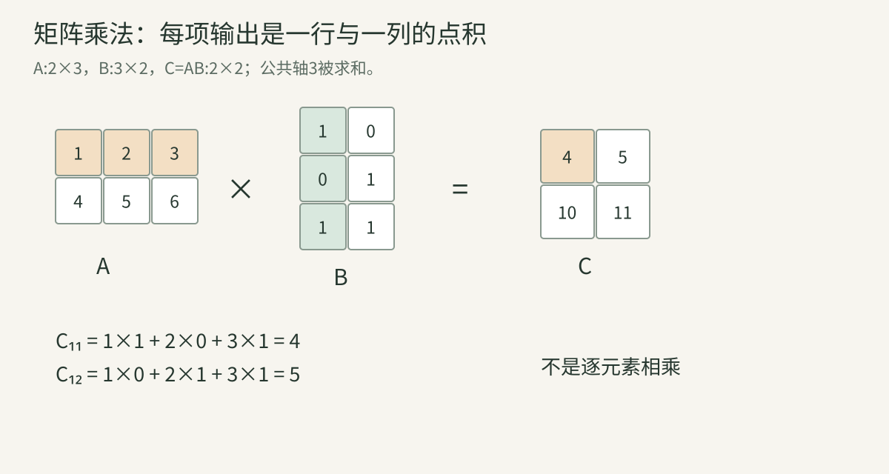
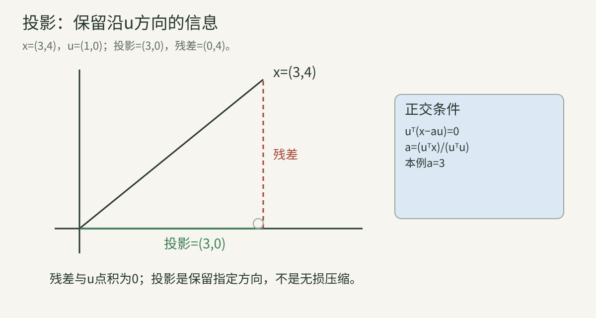
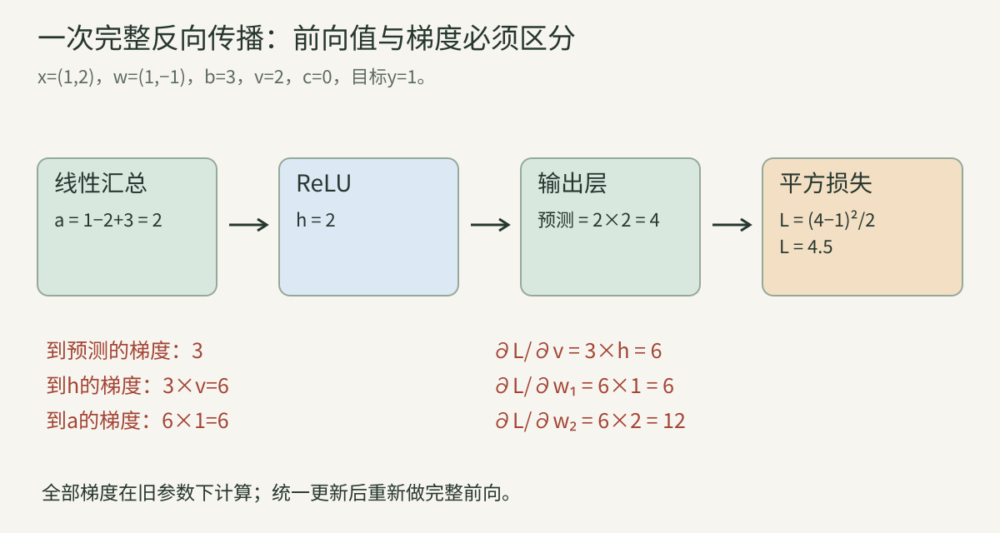
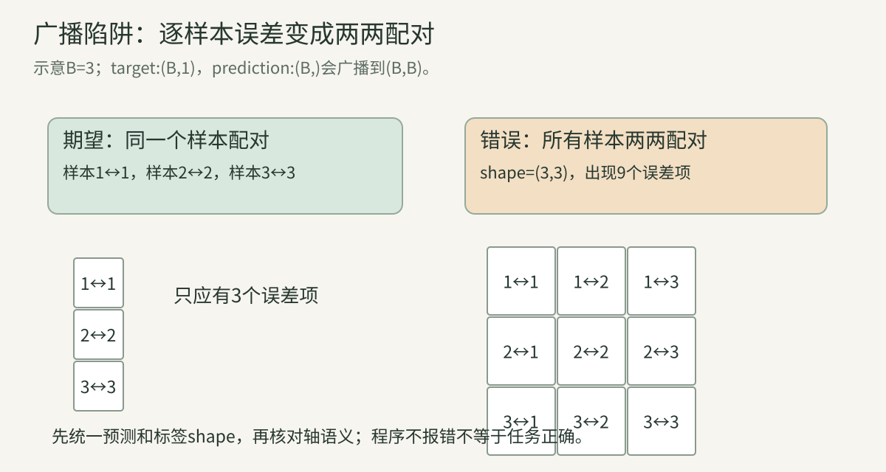

> 本讲默认你会加减乘除。建议分四次读：数与矩阵 → 几何与分解 → 导数与反传 → 张量与模型实例。目标是把本系列依赖的数学先修讲清；后续特定方法涉及的数学会在对应章继续推导。

## 一、公式在描述什么对象

### 1. 标量与集合符号

标量如 $a=3$、损失 $L=0.7$、学习率 $\eta=0.001$。它只有一个数值，没有行列索引。$\mathbb R$表示实数集合，$\mathbb N$表示自然数集合，$\in$读“属于”。$d\in\mathbb N$只是在规定d是整数维数。

$\forall$是“对所有”，$\exists$是“存在”。论文写“对于所有输入存在……”时，先把逻辑关系读准确。符号的密度不是概念难度：许多公式只是紧凑地说了一句日常语言。

### 2. 向量与矩阵

$$
x=\begin{bmatrix}2\\-1\\3\end{bmatrix}\in\mathbb R^3,\qquad
A=\begin{bmatrix}1&2&3\\4&5&6\end{bmatrix}\in\mathbb R^{2\times3}.
$$

x有3个分量；A有2行3列。$A_{ij}$表示第i行第j列，例如 $A_{2,3}=6$。本讲数学从1索引，常见Python数组从0索引；该元素的代码索引是(1,2)。

向量可以是空间坐标，也可以是抽象特征。同样三个数，RGB颜色与相机平移并非同一种语义。矩阵可以是数据表，也可以是变换权重。**轴的含义必须和shape一起写。**

### 3. 张量、阶与元素数

深度学习中的tensor通常指多维数组。BCHW图像有4条轴：样本、通道、高度、宽度。阶或ndim是轴数，shape是各轴长度，元素数为这些长度的乘积。

这里采用深度学习框架的用法，不把它与物理中严格的张量坐标变换定义完全等同。读模型代码时优先追踪轴语义、dtype、存储布局和算子。

### 4. 求和与乘积

$$
\sum_{i=1}^{3}x_i=x_1+x_2+x_3,\qquad
\prod_{i=1}^{3}x_i=x_1x_2x_3.
$$

$\sum$是重复加法，$\prod$是重复乘法；i只是计数变量。对[2,−1,3]，求和4、乘积−6。读不懂公式时，把索引只取两三项展开，常能看到它实际在做什么。

## 二、乘法、转置与线性层

### 5. 标量乘法与逐元素乘法

2A把每项乘2。相同shape的矩阵加法逐元素进行；Hadamard积 $A\odot B$也逐元素对应：

$$
\begin{bmatrix}1&2\\3&4\end{bmatrix}
\odot
\begin{bmatrix}5&6\\7&8\end{bmatrix}
=
\begin{bmatrix}5&12\\21&32\end{bmatrix}.
$$

逐元素乘法不汇总不同位置。门控通常使用它；线性变换使用矩阵乘法。二者在代码中常分别写为星号与矩阵乘算子，不能因为都叫“乘”就互换。

### 6. 点积与转置

转置交换行列，$(A^\top)_{ij}=A_{ji}$。列向量转置后是行向量。点积：

$$
x^\top y=\sum_i x_iy_i.
$$

x=[2,−1,3]、y=[1,4,2]时，结果 $2-4+6=4$，是一个标量。它也可以读成加权汇总：每个特征乘一个权重，再加在一起。

外积 $xy^\top$则输出一个矩阵，存放全部配对乘积。例如[2,3]ᵀ与[4,5,6]的外积为[[8,10,12],[12,15,18]]。点积与外积的shape完全不同。

### 7. 矩阵乘法完整手算

$$
A\in\mathbb R^{m\times n},\quad
B\in\mathbb R^{n\times p}
\Rightarrow C=AB\in\mathbb R^{m\times p}.
$$

每项：

$$
C_{ij}=\sum_{k=1}^n A_{ik}B_{kj}.
$$

公共轴n被汇总，外侧m、p保留。令：

$$
A=\begin{bmatrix}1&2&3\\4&5&6\end{bmatrix},
\qquad
B=\begin{bmatrix}1&0\\0&1\\1&1\end{bmatrix}.
$$

$$
\begin{aligned}
C_{11}&=1\times1+2\times0+3\times1=4,\\
C_{12}&=1\times0+2\times1+3\times1=5,\\
C_{21}&=4\times1+5\times0+6\times1=10,\\
C_{22}&=4\times0+5\times1+6\times1=11.
\end{aligned}
$$

输出[[4,5],[10,11]]。**每个输出格由一整行和一整列贡献。**

逐元素读图：高亮行指定样本i，高亮列指定输出特征j，中间三个乘积对应k=1、2、3。shape匹配的公共轴还必须代表正确的特征对应关系。

### 8. 为什么顺序不能交换

$$
A=\begin{bmatrix}1&1\\0&1\end{bmatrix},\quad
B=\begin{bmatrix}2&0\\0&1\end{bmatrix}.
$$

$$
AB=\begin{bmatrix}2&1\\0&1\end{bmatrix},\quad
BA=\begin{bmatrix}2&2\\0&1\end{bmatrix}.
$$

AB不等于BA。对于列向量，ABx先执行B再执行A，类似先拉伸再错切。矩阵乘法可结合，通常不可交换。有时AB能算而BA连shape也不匹配。

转置乘积满足 $(AB)^\top=B^\top A^\top$。倒序是因为输入输出轴同时交换，可通过展开第i,j项验证。

### 9. 线性、仿射与非线性

线性函数满足 $f(ax+by)=af(x)+bf(y)$。Wx是线性；Wx+b通常是仿射，因为零输入输出b，不一定为零。框架中的Linear通常允许bias，这是命名习惯。

若两层没有非线性：

$$
W_2(W_1x+b_1)+b_2
=(W_2W_1)x+(W_2b_1+b_2).
$$

仍然只是一个仿射变换。因此深度不能替代非线性。ReLU、sigmoid等改变了这一点。注意力的加权求和在固定权重时是线性的，但权重由输入计算，整体不能据此称为线性模型。

## 三、几何、压缩与分解

### 10. 范数与距离

$$
\|x\|_1=\sum_i|x_i|,\quad
\|x\|_2=\sqrt{\sum_i x_i^2},\quad
\|x\|_\infty=\max_i|x_i|.
$$

x=[3,−4]，L1=7、L2=5、L∞=4。L2来自勾股定理。欧氏距离为 $\|x-y\|_2$。

矩阵Frobenius范数 $\|A\|_F=\sqrt{\sum_{i,j}A_{ij}^2}$，相当于把元素摊成向量算L2。论文中的“L2 loss”可能是范数、平方范数或均方误差，必须读具体定义。

像素距离小并不一定语义相同；平移几像素可能产生很大像素误差。因此检索往往在学习表示上比较距离。

### 11. 归一化与余弦相似度

$$
\bar x=\frac{x}{\|x\|_2},\qquad
\cos(x,y)=\frac{x^\top y}{\|x\|_2\|y\|_2}.
$$

x=[3,4]、y=[6,8]，点积50，长度5和10，余弦1：方向相同，长度不同。反向向量[−3,−4]余弦−1。

零向量不能直接除；工程上可设分母下界，但严格单位长度性质可能改变。余弦也不是概率，0.8不等于“80%答案正确”。

单位向量之间：

$$
\|\bar x-\bar y\|_2^2=2-2\bar x^\top\bar y.
$$

由 $(a-b)^\top(a-b)$展开得到，所以单位球上余弦越大，距离越小。归一化改变比较规则，不是无损保留全部输入信息。

### 12. 正交、基与投影

正交满足 $u^\top v=0$。线性独立且能表示空间全部向量的一组向量称为基。基不同，坐标不同，但所描述对象可相同。

求x沿非零u的投影。设投影au，残差x−au与u正交：

$$
u^\top(x-au)=0
\Rightarrow a=\frac{u^\top x}{u^\top u}.
$$

因此：

$$
\operatorname{proj}_u(x)=\frac{x^\top u}{u^\top u}u.
$$

x=[3,4]、u=[1,0]，投影[3,0]、残差[0,4]。投影保留一条方向上的信息，丢掉垂直部分。

### 13. 秩：独立信息方向数

$$
A=\begin{bmatrix}1&2\\2&4\end{bmatrix}
$$

第二行是第一行2倍，所以rank=1。四个数不等于两条独立方向。低秩矩阵限制了可以独立变化的输出方向。

LoRA和低秩压缩会利用这种结构，但rank小不自动意味着压缩对任务无害。重要方向是否保留需要测量。矩阵rank也不同于tensor.ndim：一个2轴矩阵可以rank=1或更高。

### 14. 逆、伪逆与线性方程

单位矩阵I不改变向量。可逆方阵满足 $A^{-1}A=I$，则Ax=b的唯一解可写为A⁻¹b。对diag(2,4)，逆为diag(1/2,1/4)。

上节rank1矩阵不可逆，因为输入的某些变化映到相同输出，不能唯一恢复。非方阵或奇异矩阵可用最小二乘/伪逆选取符合特定准则的解；它不能凭空找回所有丢失信息。

数值实现通常用求解器和稳定分解，不必显式构造逆。矩阵接近奇异时，小输入误差可能放大，这就是条件问题的一种表现。

### 15. 特征值与特征向量

$$
Av=\lambda v,\quad v\ne0.
$$

v被变换后仍在同一方向，λ表示缩放及可能的方向翻转。对A=diag(3,1)，横轴方向放大3倍，纵轴不变。

并非所有实矩阵都有完整实特征向量基，非对称矩阵可能有复特征值。对称实矩阵的正交分解性质更好。读视觉模型中的谱分析时，不能把简单对角例子当作一般矩阵的全部性质。

### 16. SVD与低秩近似

任意实矩阵可做奇异值分解：

$$
A=U\Sigma V^\top.
$$

几何上先换输入方向，再按非负奇异值缩放，再换输出方向。对m×n矩阵，薄分解令r=min(m,n)：

$$
U:(m,r),\qquad \Sigma:(r,r),\qquad V:(n,r).
$$

保留前k个奇异值和对应方向，得到rank至多k近似。diag(5,1)保留第一个方向，变成diag(5,0)，Frobenius误差1。按奇异值截断在相应矩阵范数准则下有最优性质，但“矩阵误差小”仍不等于“下游任务绝不退化”。

### 17. PCA与协方差

PCA先对样本中心化，寻找方差大的方向。设样本按行组成X，减去每列均值得到Xc，样本协方差可写为：

$$
C=\frac1{N-1}X_c^\top X_c,\quad N>1.
$$

对协方差特征分解或对Xc做SVD，可以得到主方向。除N−1还是N取决于估计约定和用途。中心化不可省略，否则主要方向可能只是均值方向。

大方差不等于大判别性：光照变化可能解释大量方差，但类别差别藏在较小方向。PCA是统计压缩工具，不是无监督自动找到所有语义。

## 四、导数、梯度与局部近似

### 18. 导数就是局部变化率

$$
f'(x)=\lim_{h\to0}\frac{f(x+h)-f(x)}h.
$$

对f=x²：

$$
\frac{(x+h)^2-x^2}h=2x+h\Rightarrow f'(x)=2x.
$$

x=3时导数6。Δx=0.01，线性估计Δf≈0.06，真实变化0.0601。导数提供足够局部的估计，不是任意大变化都准确。

### 19. 基本导数和定义域

| f | f' | 需要注意 |
| --- | --- | --- |
| 常数c | 0 | 对这个输入不变 |
| ax+b | a | 偏置导数0 |
| xⁿ | nxⁿ⁻¹ | 具体幂的定义域 |
| eˣ | eˣ | 自然指数 |
| ln x | 1/x | x>0 |
| ReLU | 正侧1、负侧0 | 零点不可微 |

ln是自然对数。ReLU零点普通导数不唯一，框架采用局部梯度约定。分段不可微并不导致网络无法训练，但数值梯度检查跨拐点时需谨慎。

### 20. 偏导与梯度

$$
f(x,y)=x^2+3xy+y^2.
$$

对x求导，把y暂视作常数；对y类似：

$$
\partial_xf=2x+3y,\quad
\partial_yf=3x+2y,\quad
\nabla f=\begin{bmatrix}2x+3y\\3x+2y\end{bmatrix}.
$$

在(1,2)，梯度[8,7]。小位移Δ下，变化约为∇fᵀΔ。在欧氏长度固定的局部方向中，负梯度是最陡下降方向。有限步长和非凸地形仍可能让损失上升。

### 21. 梯度下降与学习率

$$
\theta_{t+1}=\theta_t-\eta\nabla_\theta L.
$$

θ是参数，t是更新次数，η是步长。对 $L(w)=\frac12(w-3)^2$，梯度w−3。w=1、η=0.5，依次到2、2.5、2.75。

若η=3，依次到7、−5，误差扩大。方向对不代表步长任意。最优步长还依赖曲率、噪声和参数尺度，不能从一个玩具例子推到所有训练。

### 22. 链式法则与多路径

u=2x+1，v=u²：

$$
\frac{dv}{dx}=\frac{dv}{du}\frac{du}{dx}
=2u\times2=4(2x+1).
$$

x=1时结果12。沿计算路径，把局部变化率相乘。多条路径影响同一输出时贡献相加，例如x²+x导数2x+1。残差、共享参数和分支都依赖这种累加，不能只保留最后遇到的一条路径。

### 23. Jacobian与反向传播方向

x有n维、y有m维：

$$
J_{ij}=\frac{\partial y_i}{\partial x_j},\quad J:(m,n).
$$

对 $y_1=x_1^2+x_2,y_2=3x_1-x_2$：

$$
J=\begin{bmatrix}2x_1&1\\3&-1\end{bmatrix}.
$$

标量损失传来的上游梯度g=∇yL，有m维。输入梯度：

$$
\nabla_xL=J^\top g.
$$

输出轴汇总后得到n维。自动微分通常计算相应乘积，不显式存整张Jacobian。自动微分能正确求“你写出的计算”的导数，却不会替你判断这个计算是不是正确任务。

### 24. Hessian与曲率

Hessian是梯度再求导：

$$
H_{ij}=\frac{\partial^2f}{\partial x_i\partial x_j}.
$$

对第20节例子，H=[[2,3],[3,2]]。它描述梯度如何变化，和优化步长、条件数有关。大型模型通常不能直接存完整参数平方规模矩阵，使用Hessian-vector product或近似。此处明确含义；具体二阶算法在需要时进一步展开。

## 五、完整手算一次反向传播

### 25. 网络和前向值

$$
a=w_1x_1+w_2x_2+b,\quad
h=\max(0,a),\quad
\hat y=vh+c,\quad
L=\tfrac12(\hat y-y)^2.
$$

取x=[1,2]、y=1；w1=1、w2=−1、b=3、v=2、c=0：

$$
a=1-2+3=2,\quad h=2,\quad \hat y=4,\quad L=4.5.
$$

中间值a、h要供反向使用。激活显存就是这些中间量规模扩大的结果之一，模型权重不是训练显存的全部。

### 26. 从损失向后逐项求导

$$
\frac{\partial L}{\partial\hat y}=3.
$$

输出层：

$$
\frac{\partial L}{\partial v}=3h=6,\quad
\frac{\partial L}{\partial c}=3,\quad
\frac{\partial L}{\partial h}=3v=6.
$$

a=2在ReLU正侧，局部导数1，所以∂L/∂a=6。

$$
\frac{\partial L}{\partial w_1}=6x_1=6,\quad
\frac{\partial L}{\partial w_2}=6x_2=12,\quad
\frac{\partial L}{\partial b}=6.
$$

梯度按路径分配。w2对应输入2，所以梯度是w1的2倍，这与参数w2本身为负没有直接矛盾。

逐元素读图：黑箭头算前向值，红箭头传上游梯度；到两个权重的路径分别乘x1和x2。每个局部节点只负责自己的导数，整条路径由链式法则连接。

### 27. 更新并重新前向

η=0.01：

$$
w_1'=0.94,\ w_2'=-1.12,\ b'=2.94,\ v'=1.94,\ c'=-0.03.
$$

$$
a'=0.94-2.24+2.94=1.64,\quad
\hat y'=1.94\times1.64-0.03=3.1516,
$$

$$
L'=\tfrac12(3.1516-1)^2\approx2.31469.
$$

从4.5下降到约2.315。梯度用旧参数算，更新后必须重算隐藏值。这里只证明同一训练样本的这一步下降，尚未证明泛化。

### 28. 数值梯度检查

$$
g_{\mathrm{num}}\approx
\frac{L(w+\epsilon)-L(w-\epsilon)}{2\epsilon}.
$$

两次前向估计局部导数，用来核对手推/自动微分。ε太大近似粗糙，太小有舍入误差；跨ReLU拐点还涉及不可微。小例子推荐float64。

反向传播是应用链式法则的算法，不是“随机尝试参数直到误差下降”。随机初始化、随机抽batch与梯度计算是不同环节。

## 六、矩阵梯度、张量轴与视觉模型实例

### 29. 线性层的两个约定

列向量写法：

$$
y=Wx+b,\quad W:(d_{\mathrm{out}},d_{\mathrm{in}}).
$$

batch样本按行：

$$
Y=XW^\top+b,\quad X:(B,d_{\mathrm{in}}).
$$

若论文把W定义为输入×输出，就写Y=XW+b。只是约定不同，不应死背是否一定转置。PyTorch Linear权重为输出×输入，见[官方接口](https://docs.pytorch.org/docs/2.14/generated/torch.nn.Linear.html)。

### 30. 矩阵反传与共享参数累加

用输入×输出权重约定，Y=XW+b。上游G=∂L/∂Y：

$$
\frac{\partial L}{\partial X}=GW^\top,\quad
\frac{\partial L}{\partial W}=X^\top G,\quad
\frac{\partial L}{\partial b_j}=\sum_iG_{ij}.
$$

为何权重梯度有求和？Wkj被所有样本使用：

$$
\frac{\partial L}{\partial W_{kj}}
=\sum_iG_{ij}X_{ik}.
$$

正是XᵀG的对应项。loss先平均时，系数已进G，不能再重复除B。

### 31. loss reduction的尺度

B×D个误差E：

$$
L_{\mathrm{sum}}=\sum E_{ij}^2,\quad
L_{\mathrm{mean}}=\frac1{BD}\sum E_{ij}^2.
$$

输出梯度分别2E与2E/(BD)。若再有1/2因子，2会抵消。token、像素、通道和batch在哪里平均，决定梯度尺度与多loss相对权重。mask任务还需按有效项计算分母。

### 32. reshape与轴交换

A=[[1,2,3],[4,5,6]]按行优先reshape为3×2，得到[[1,2],[3,4],[5,6]]。转置则得到[[1,4],[2,5],[3,6]]。

shape相同不代表内容排列相同。HWC变CHW需要交换轴，不能只改shape。reshape在某些布局下会拷贝，view还要求相应存储条件。计算语义与存储性能需要分开看。

### 33. 广播的规则与危险案例

从右向左对齐轴，长度相等或其中为1可以扩展，缺失前导轴按1处理。X=(B,N,D)加bias=(D)，相当于加(1,1,D)。

mask=(B,N)要乘X，通常需显式变为(B,N,1)。标签(B,1)与预测(B,)相减，会按(B,1)和(1,B)对齐，输出(B,B)，变成每个标签与每个预测两两相减。程序可能不报错，却已不是逐样本误差。

规则见[PyTorch广播说明](https://docs.pytorch.org/docs/2.14/notes/broadcasting.html)。不能把“没有报shape错误”当作计算正确。

### 34. reduction的轴决定语义

X=(B,N,D)：

- 沿D平均 → (B,N)，每token变成一个数。
- 沿N平均 → (B,D)，每个样本得到全局向量。
- 沿B平均 → (N,D)，不同样本被混在一起。

keepdim保留长度1的轴，便于后续广播。padding和无效token需要mask，不能在均值里算成真实内容。

### 35. attention维度预演

$$
Q:(B,h,N_q,d_k),\quad K:(B,h,N_k,d_k),\quad V:(B,h,N_k,d_v).
$$

只交换K最后两轴：

$$
QK^\top:(B,h,N_q,N_k).
$$

沿key轴归一化成权重A，再算：

$$
AV:(B,h,N_q,d_v).
$$

每个query组合Nk个value。self-attention常Nq=Nk，cross-attention可以不同。完整缩放和softmax在第11章；这里先确认维度链不会丢失或混淆样本/头轴。

### 36. patch投影与共享参数

32×32 RGB图切8×8 patch，共16块，每块192项。投影到D=64：

$$
X_{\mathrm{patch}}:(B,16,192),\quad W:(192,64),\quad b:(64),
\quad Z:(B,16,64).
$$

参数数 $192\times64+64=12\,352$。B和patch数不增加参数，因为每块共用W；它们增加计算次数。模型参数量与实际FLOPs是不同账本。

### 37. 浮点与数学实数

实数计算具有的精确结合性，在有限精度中可能不成立。FP32/BF16/FP16的动态范围和精度不同；量化还需要尺度、零点或其他编码约定。

归约顺序、混合精度、kernel可能带来数值差异。微小误差是否可接受由任务和稳定性决定，不能一概忽略，也不能把所有浮点差异当作算法错误。后续资源与量化章会单独展开。

## 深入算例：把“分解、梯度、轴”真正算出来

前面建立了概念地图。这一节用很小的矩阵把常见论文中的省略步骤补齐。不要把它作为需要背诵的附加公式：每一步都能由乘法、求和或求导检查。

### 算例A：消元怎样揭示秩与零空间

令

$$
A=\begin{bmatrix}1&2\\2&4\end{bmatrix}.
$$

第二行减去第一行的2倍，变成[0,0]。只有一行能提出独立约束，所以秩为1。对输入向量x=[x₁,x₂]ᵀ，

$$
Ax=\begin{bmatrix}x_1+2x_2\\2x_1+4x_2\end{bmatrix}.
$$

所有输出都在[1,2]这条直线上：第二项永远是第一项的2倍。这条线是**列空间**，表示矩阵可能产生的输出集合。

若x=[−2,1]ᵀ，则Ax=0；任意倍数t[−2,1]ᵀ也如此。这些被变换完全抹掉的方向组成**零空间**。对任意x，加上t[−2,1]ᵀ，输出不变。由此可以直观看到为什么不存在唯一逆。

输入有2维，保留1个独立方向，丢掉1个方向。一般m×n矩阵满足：

$$
\operatorname{rank}(A)+\dim\operatorname{null}(A)=n.
$$

这里右侧是输入维数n，而非输出维数m。神经网络的线性瓶颈若输出维数比输入小，至少会失去某些线性方向；整个任务是否受损，还要看数据实际位于哪里。

### 算例B：最小二乘不是“把方程硬求出唯一解”

给三次测量(x,y)=(1,1)、(2,2)、(3,2)，拟合过原点直线y≈wx。通常无法用一个w同时满足三条方程。于是最小化平方残差：

$$
L(w)=(w-1)^2+(2w-2)^2+(3w-2)^2.
$$

展开或直接求导：

$$
L'(w)=2(w-1)+4(2w-2)+6(3w-2)=28w-22.
$$

令导数为0，得到w=11/14≈0.785714。三个预测约为0.7857、1.5714、2.3571；它们都不完全正确，但总平方误差最小。

矩阵写法为L=‖Xw−y‖²。求导得到：

$$
\nabla_wL=2X^\top(Xw-y),\qquad
X^\top Xw=X^\top y.
$$

后一个式子称为正规方程。若XᵀX可逆可写形式解；数值实现常用QR或SVD，而不是显式求逆。因为正规方程会放大原问题的条件问题，数据越接近线性相关越需留意。

过原点与带bias是两个不同模型。加bias时把每个样本扩成[x,1]，参数变成[w,b]。把模型约束悄悄换掉，不能再声称是在复现同一个拟合问题。

### 算例C：一个非对角矩阵的完整SVD

仍用A=[[1,2],[2,4]]。它为实对称半正定矩阵，且可写成aaᵀ，其中a=[1,2]ᵀ。令

$$
u_1=v_1=\frac1{\sqrt5}\begin{bmatrix}1\\2\end{bmatrix},
\qquad
u_2=v_2=\frac1{\sqrt5}\begin{bmatrix}-2\\1\end{bmatrix}.
$$

两向量长度都是1，点积(−2+2)/5=0，构成正交基。检查：

$$
Av_1=5u_1,\qquad Av_2=0.
$$

因此可取

$$
U=V=\frac1{\sqrt5}
\begin{bmatrix}1&-2\\2&1\end{bmatrix},
\qquad
\Sigma=\begin{bmatrix}5&0\\0&0\end{bmatrix}.
$$

乘回去：

$$
U\Sigma V^\top
=5u_1v_1^\top
=\begin{bmatrix}1&2\\2&4\end{bmatrix}.
$$

第二项奇异值为0，不参与重建。这里SVD与特征分解很接近，是因为这个例子对称且半正定；一般非对称矩阵不能直接令U=V。

若保留k个方向，

$$
A_k=\sum_{i=1}^k \sigma_i u_i v_i^\top,
\qquad
\|A-A_k\|_F^2=\sum_{i>k}\sigma_i^2.
$$

用diag(5,1)做rank1近似时，丢掉的平方误差是1²=1；能量保留率为25/(25+1)≈96.15%。**高能量保留率仍然只是矩阵近似指标**，小奇异值对应的方向可能对某个稀有类别很重要。

### 算例D：PCA从四个点到一维重建

四个二维样本：

$$
X=\begin{bmatrix}2&1\\0&1\\1&2\\1&0\end{bmatrix}.
$$

均值为[1,1]，中心化后：

$$
X_c=\begin{bmatrix}1&0\\-1&0\\0&1\\0&-1\end{bmatrix},
\qquad
C=\frac{X_c^\top X_c}{3}
=\begin{bmatrix}2/3&0\\0&2/3\end{bmatrix}.
$$

两个方向方差相同。此时“第一主方向”没有唯一偏好：横轴、纵轴或任意旋转的单位方向都可以达到相同最大方差。PCA软件返回某个方向，不代表它发现了唯一真实语义轴。

现在改为

$$
X=\begin{bmatrix}3&1\\-1&1\\1&2\\1&0\end{bmatrix}.
$$

均值仍为[1,1]，中心化为[2,0]、[−2,0]、[0,1]、[0,−1]，协方差：

$$
C=\begin{bmatrix}8/3&0\\0&2/3\end{bmatrix}.
$$

横轴方差更大，第一主方向v₁=[1,0]ᵀ。降维坐标z=Xcv₁为[2,−2,0,0]ᵀ。只保留该方向重建：

$$
\hat X=zv_1^\top+\mathbf1\mu^\top
=\begin{bmatrix}3&1\\-1&1\\1&1\\1&1\end{bmatrix}.
$$

第三、四个点的纵向变化丢失，总平方重建误差2，保留方差比例8/(8+2)=80%。

PCA常用训练集估计均值与方向，再应用到验证/测试。先把测试集一起放进PCA估计会让预处理接触测试分布，协议上需明确是否允许。即便没有标签，也不能默认所有评估都允许这种传导信息。

### 算例E：Cauchy–Schwarz为什么能保证余弦范围

对于非零y，平方长度‖x−ty‖²永远非负。令t=(xᵀy)/‖y‖²，即沿y的最佳投影系数，代入：

$$
0\le\|x\|^2-\frac{(x^\top y)^2}{\|y\|^2}.
$$

移项：

$$
|x^\top y|\le\|x\|\,\|y\|.
$$

所以余弦相似度落在[−1,1]，而非任意数。等号在两向量共线时成立。它还说明对单位长度位移Δ，局部变化∇fᵀΔ最大为‖∇f‖，因此梯度方向具有“局部最陡”含义。

注意，“点积当相似度”与“点积当概率”是不同事情。CLIP还要通过温度和softmax构造候选集内的归一化分数；候选集换掉，概率也可能变化。

### 算例F：Hessian、鞍点与条件数

第20节的函数f=x²+3xy+y²，其Hessian为[[2,3],[3,2]]。沿[1,1]方向特征值5；沿[1,−1]方向特征值−1。原点梯度为0，但并非极小点，因为沿第二个方向函数向下。这是**鞍点**。

“梯度为0”只是驻点条件；检查是不是最小值还需要曲率等信息。相比之下，f=x²+100y²的Hessian为diag(2,200)，两个方向曲率相差100倍，等高线很狭长。

梯度下降更新：

$$
x'=(1-2\eta)x,\qquad y'=(1-200\eta)y.
$$

要让两个方向都收缩，需|1−2η|<1且|1−200η|<1，即0<η<0.01。这个简单例子解释了：为了照顾陡峭方向而选小步长，平缓方向可能收敛慢。

这里的条件数针对对称正定Hessian为最大/最小特征值之比。普通矩阵的2范数条件数使用最大/最小奇异值，奇异矩阵为无穷。对不定Hessian不能不加条件地套“正定二次函数”的优化结论。

### 算例G：从单元素导数到整层矩阵梯度

用两样本、两输入、两输出，约定Y=XW+b：

$$
X=\begin{bmatrix}1&2\\3&4\end{bmatrix},
\quad
W=\begin{bmatrix}1&0\\0&2\end{bmatrix},
\quad
b=[1,-1],
\quad
Y=\begin{bmatrix}2&3\\4&7\end{bmatrix}.
$$

令目标T=[[1,1],[5,5]]，损失为L=½Σᵢⱼ(Yᵢⱼ−Tᵢⱼ)²。于是G=Y−T=[[1,2],[−1,2]]，L=5。

直接算：

$$
\nabla_WL=X^\top G
=\begin{bmatrix}-2&8\\-2&12\end{bmatrix},
$$

$$
\nabla_XL=GW^\top
=\begin{bmatrix}1&4\\-1&4\end{bmatrix},
\qquad
\nabla_bL=[0,4].
$$

权重W₁₂被两个样本使用：梯度1×2+3×2=8。偏置b₁也共享：1+(−1)=0。**梯度抵消不等于两个样本都没有误差**；是它们对这个共享参数的局部要求相反。

如果loss是对四个输出的平均，所有这些梯度还需除4。若只按样本平均，除2。先把loss完整写出来，再决定分母。

### 算例H：softmax的Jacobian为什么不是对角矩阵

概率pᵢ=e^{zᵢ}/Σⱼe^{zⱼ}。分母包含所有logits，因此改一个z也会影响别的概率。商法则给出：

$$
\frac{\partial p_i}{\partial z_j}
=p_i(\delta_{ij}-p_j).
$$

δᵢⱼ在i=j时为1，否则为0。对p=[0.2,0.3,0.5]，

$$
J=
\begin{bmatrix}
0.16&-0.06&-0.10\\
-0.06&0.21&-0.15\\
-0.10&-0.15&0.25
\end{bmatrix}.
$$

每行和为0：把全部logits同时加同一个常数，概率不变。非对角项为负：提高一个类别相对分数，其他类别概率会下降。

本讲只解释导数结构，第03讲将它与交叉熵相乘后得到p−q。不要把∂p/∂z与∂L/∂z混为同一公式。

### 算例I：张量内存与“看起来一样”的不同操作

用2×3数组A=[[1,2,3],[4,5,6]]。若按行优先连续存储，内存次序为1、2、3、4、5、6。每行跨3个元素，每列跨1个元素，元素步幅为(3,1)。

转置后逻辑shape为(3,2)，逻辑第一行是[1,4]，步幅可以变为(1,3)，不一定实际搬动内存。此时直接view成其他shape可能无法满足连续布局要求；reshape可能通过拷贝完成。

一张HWC图转CHW要交换轴；简单reshape只把相同内存序列重新分组，颜色与位置可能乱配。判断操作是否正确，最好用几个不同颜色、不同位置的已知像素逐项跟踪，不能只打印shape。

广播通常不意味着物理复制bias到每个样本；框架可用视图或索引语义实现。反向时，广播出去的多个使用点的梯度会**沿扩展轴求和回来**。这就是共享偏置梯度为什么有Σ。

### 算例J：指数、对数与“为什么loss里有ln”

幂a²表示a×a；a³表示三次相乘；平方根√a是平方后等于a的非负数，a≥0。负幂a⁻¹=1/a，需要a≠0。e≈2.71828是一个特定常数，eˣ是自然指数函数。

自然对数ln是它的反函数：若eˣ=y，则ln y=x，定义域y>0。例如ln1=0、ln e=1、ln(e²)=2。下面三条规律来自指数的乘法性质：

$$
\ln(ab)=\ln a+\ln b,\qquad
\ln(a/b)=\ln a-\ln b,\qquad
\ln(a^r)=r\ln a,
$$

这里a、b>0，r为适当定义的实数。**ln(a+b)通常不等于ln a+ln b。**例如ln(1+1)=ln2，而ln1+ln1=0。

对数把概率乘积转换成和：三个正确输出概率都是0.1，总概率0.001；负log为−ln0.001≈6.9078，也等于三项−ln0.1的和。这样可以逐位置累加loss，并减少很长乘积的数值下溢问题。

softmax里减最大值不改概率：

$$
\frac{e^{z_i-c}}{\sum_j e^{z_j-c}}
=\frac{e^{z_i}/e^c}{(\sum_j e^{z_j})/e^c}
=\frac{e^{z_i}}{\sum_j e^{z_j}}.
$$

取c=max z时，所有指数输入≤0，避免计算巨大eᶻ。这里是同一个分布的稳定写法，不是把模型分数任意删减。

当需要log-softmax，可以直接写：

$$
\ln p_i=z_i-c-\ln\sum_j e^{z_j-c}.
$$

这是从分子分母取log得到，不需要先形成可能下溢为0的概率再取log。

### 算例K：积分从求面积走到概率与期望

把曲线p(x)下的一小段宽度Δx近似成矩形，高度p(x)，面积p(x)Δx。区间分成很多小段后相加；在适当条件下，分段越来越细的极限就是积分：

$$
\int_a^b p(x)\,dx.
$$

dx表示沿x轴累积的微小宽度，不是一个需要额外输入模型的变量。对常数p(x)=2、区间[0,0.5]，面积为2×0.5=1。

对p(x)=2x、x∈[0,1]，可用反导数x²：

$$
\int_0^1 2x\,dx=[x^2]_0^1=1.
$$

所以它是一个合法密度。落在[0,0.5]的概率是0.5²−0²=0.25；不是把密度在0.5处的值1当作概率。

连续期望把“值×概率”中的概率质量换成“密度×宽度”：

$$
\mathbb E[X]=\int_0^1 x(2x)\,dx
=2\left[\frac{x^3}{3}\right]_0^1
=\frac23.
$$

进一步E[X²]=∫₀¹2x³dx=½，因此Var(X)=½−(⅔)²=1/18。积分定义、期望和方差在这里连成一条可算的链。

导数测局部变化率，积分累积这些变化。若f光滑，∫ₐᵇf′(x)dx=f(b)−f(a)，这就是微积分基本定理的一种表述。后续概率密度、连续时间生成和动态模型都会用到这座桥。

定积分最后是一个数；不定积分描述一族反导函数并有积分常数。初读论文时先判断它是在累积一个区间、对全空间概率加权，还是求函数的原函数。

### 算例L：凸性、Jensen与连续时间变化先做小例子

平方函数是凸的，曲线位于两点连线下方。取x=−1、y=1，各权重½：

$$
(\tfrac12x+\tfrac12y)^2=0
\le\tfrac12x^2+\tfrac12y^2=1.
$$

凸函数f的一般性质为：

$$
f(\lambda x+(1-\lambda)y)
\le\lambda f(x)+(1-\lambda)f(y),\quad0\le\lambda\le1.
$$

推广到分布，得到Jensen不等式f(E[X])≤E[f(X)]，需要相应期望存在。对凹函数方向相反，例如ln。这是第03讲KL非负性证明用到的性质，而不是一个可以对任意函数使用的恒等式。

另外，某些生成论文写常微分方程：

$$
\frac{dx(t)}{dt}=v(x(t),t).
$$

左侧是当前状态随时间的变化率，右侧给出变化方向和速度。例如v=−x，起点x(0)=1，精确解x(t)=e⁻ᵗ。步长Δt=0.1的Euler近似为x下一步=x+Δt(−x)，第一次得到0.9；精确值e⁻⁰·¹≈0.904837。

步长减小通常可改善这种设置下的近似，但会增加步数。常微分方程与含随机噪声的随机微分方程不同；扩散与flow章节将说明速度场如何学习、如何采样以及误差来源。这一例只是先让“连续时间状态更新”变得可读。

### 一个可重复检查的完整梯度实验

下面只用Python标准库。它核对前文两层网络的5个参数梯度，适合在掌握框架之前读懂数值检查的机制。

~~~python
def loss(theta):
    w1, w2, bias, v, c = theta
    a = w1 * 1.0 + w2 * 2.0 + bias
    h = max(0.0, a)
    prediction = v * h + c
    return 0.5 * (prediction - 1.0) ** 2

theta = [1.0, -1.0, 3.0, 2.0, 0.0]
analytic = [6.0, 12.0, 6.0, 6.0, 3.0]
epsilon = 1e-5
numeric = []
for k in range(len(theta)):
    plus, minus = theta.copy(), theta.copy()
    plus[k] += epsilon
    minus[k] -= epsilon
    numeric.append((loss(plus) - loss(minus)) / (2 * epsilon))

print("analytic", analytic)
print("numeric", [round(g, 6) for g in numeric])
assert max(abs(a - n) for a, n in zip(analytic, numeric)) < 1e-7

updated = [p - 0.01 * g for p, g in zip(theta, analytic)]
print("loss_before", loss(theta))
print("loss_after", round(loss(updated), 6))
~~~

预期五个数值梯度约为[6,12,6,6,3]；更新后loss约为2.314691。这个检查只在当前点附近、当前函数内有效，不能替代模型的任务测试。

调试时先保持小输入、确定性、较高精度。随机Dropout、跨ReLU零点或把参数原地更新，会使“两次前向只差一个微小参数扰动”的条件不成立。

## 七、18道练习与答案

### 练习1：数组对象

三张64×64 RGB图采用BCHW，有多少轴和元素？

**答案：**4轴，shape(3,3,64,64)，元素36,864。两个3分别是batch和通道，语义不同。

### 练习2：乘法维度

A=(2,3)，B=(4,3)，AB和ABᵀ是否可算？

**答案：**AB不行，公共轴3与4不匹配；ABᵀ输出(2,4)。

### 练习3：点积和外积

x=[1,2]ᵀ、y=[3,4]ᵀ。

**答案：**点积11；外积[[3,4],[6,8]]。结果对象不同。

### 练习4：转置乘积

为何(AB)ᵀ等于BᵀAᵀ？

**答案：**原第i,j项是Σk AikBkj；BᵀAᵀ的第j,i项是Σk BkjAik，数值相同。

### 练习5：三种范数

x=[−2,1,2]。

**答案：**L1=5、L2=3、L∞=2。平方和9，开方3。

### 练习6：余弦

x=[1,0]、y=[1,1]。

**答案：**1/√2≈0.7071。相似度不能直接解释成正确率。

### 练习7：投影

x=[2,3]，u=[1,1]。

**答案：**系数5/2，投影[2.5,2.5]，残差[−0.5,0.5]，残差与u点积0。

### 练习8：rank与ndim

[[1,2,3],[2,4,6]]的rank和ndim？

**答案：**rank=1，第二行依赖第一行；ndim=2，有行列两个轴。

### 练习9：多层无激活

三层仿射网络是否变成任意非线性模型？

**答案：**不是。展开后仍为一个仿射变换。

### 练习10：链式导数

f=(3x−2)²在x=1处导数？

**答案：**2(3x−2)×3=6。

### 练习11：多路径

f=x³+2x²在x=2处导数？

**答案：**3x²+4x=20，两路径贡献相加。

### 练习12：梯度

f=x²+xy在(2,3)的梯度？

**答案：**[2x+y,x]=[7,2]。

### 练习13：Jacobian反传

J=[[4,1],[3,−1]]，g=[2,1]。

**答案：**Jᵀg=[11,1]。将输出贡献沿输入轴累加。

### 练习14：输入梯度

本讲两层网络旧参数下，对x1、x2梯度？

**答案：**到a上游为6，乘w1=1、w2=−1，得到6和−6。

### 练习15：mean的尺度

B=2、D=3，总和改均值，梯度如何变？

**答案：**除以6。若另有1/2因子还需继续计入。

### 练习16：广播

prediction=(4,)，target=(4,1)，相减shape？

**答案：**(4,4)。先统一成同样shape才是逐样本误差。

### 练习17：参数量

patch输入48、输出96、有bias；100块patch是否乘100？

**答案：**48×96+96=4,704，不乘100；计算重复100次，参数共享。

### 练习18：attention shape

Q=(2,4,10,8)，K=(2,4,20,8)，V=(2,4,20,6)。

**答案：**score=(2,4,10,20)，输出=(2,4,10,6)。

## 八、后续公式的核对模板

读每个新公式都写出：对象角色 → 轴含义 → shape → 操作类型 → 求导对象 → 累加路径 → 平均分母 → 定义域/精度 → 小例子。

本讲已讲清向量矩阵、四类乘法、仿射与非线性、距离投影、rank/分解、导数梯度、完整反传和广播。后续会在需要处继续推导softmax、归一化、卷积、相机、随机过程与连续时间生成，而非只让读者自行查术语。

## 参考与进一步阅读

- [Deep Learning线性代数](https://www.deeplearningbook.org/contents/linear_algebra.html)。
- [Stanford CS231n优化入门](https://cs231n.github.io/optimization-1/)。
- [PyTorch Linear](https://docs.pytorch.org/docs/2.14/generated/torch.nn.Linear.html)。
- [PyTorch广播规则](https://docs.pytorch.org/docs/2.14/notes/broadcasting.html)。

所有数值网络、矩阵、练习和图解为本讲构造；以明确给出的约定核算。
