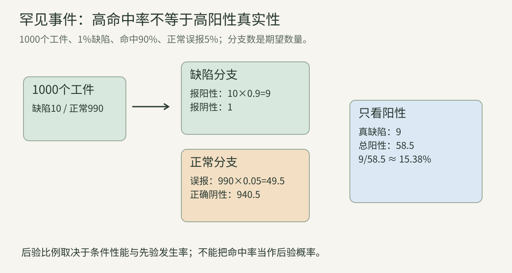
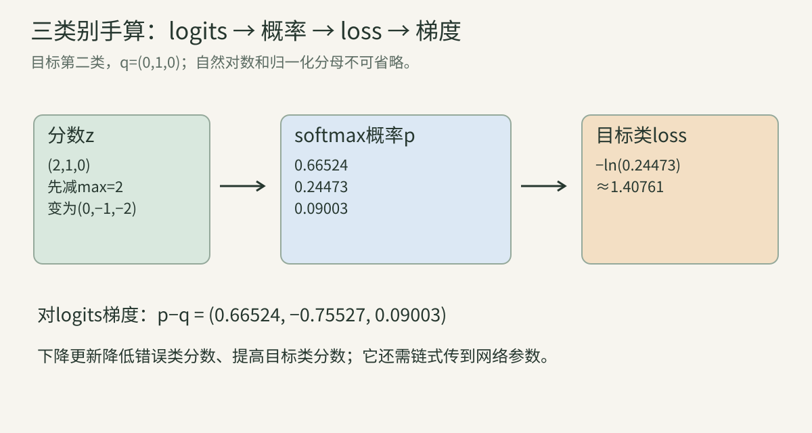

> 本讲把第02讲的指数、对数和求导用到学习目标。你可以先不记任何复杂公式，只跟着“有哪些可能结果 → 各结果多大概率 → 看到新证据怎么更新 → 怎样选择模型参数”这条线走。

## 一、事件、概率与随机变量

### 1. 先明确什么在随机变化

袋子有3个红球、2个蓝球，均匀随机抽一个。样本空间可以按五个具体球编号；“抽到红球”是其中三个结果构成的事件，概率3/5。

视觉学习中的随机性可能来自抽取哪张训练图、数据增强、参数初始化、生成采样或真实世界环境。必须说清是哪一层随机，不能把“模型可能答错”与“输出经过随机采样”混成同一个现象。

概率满足非负、总概率1，以及互斥事件概率可加。“互斥”表示不能同时发生，与“独立”是不同概念。

### 2. 随机变量是把结果映射为数

令X=1表示红球，X=0表示蓝球：

$$
P(X=1)=0.6,\qquad P(X=0)=0.4.
$$

随机变量是一个映射，不是“不断自己变动的数”。一次抽取后观测到x=1，但分布仍描述重复抽取的不确定性。大写X常表示随机变量，小写x表示具体值，论文可能有自己的约定。

多类别视觉标签Y可取猫、狗、车等离散结果。图像X本身也可视为高维随机对象；建模图像与标签的关系时要区分 $p(x)$、$p(y)$ 和 $p(y\mid x)$。

### 3. 离散概率与连续密度

离散变量有概率质量函数。连续变量常用密度p(x)，区间概率是积分：

$$
P(a\le X\le b)=\int_a^b p(x)\,dx.
$$

单个精确点的概率通常为0，密度却可以大于1。例：在[0,0.1]均匀分布，密度10，积分总量10×0.1=1。密度10不是“1000%概率”。

像素虽然文件里可能是整数，模型训练常用连续近似；建模选择会影响似然单位与可比性。离散图像概率与连续图像密度不能不加说明地直接比较。

### 4. 常见分布：先学用途

| 分布 | 对象 | 参数与用途 |
| --- | --- | --- |
| Bernoulli | 0/1 | 正例概率p，二分类 |
| Categorical | K类之一 | K项概率，分类和下一token |
| Gaussian | 连续值 | 均值与方差，噪声和回归 |
| Uniform | 区间或集合均匀 | 无差别抽样 |
| Mixture | 多个分布混合 | 多种潜在模式 |

一维Gaussian密度：

$$
p(x)=\frac1{\sqrt{2\pi\sigma^2}}
\exp\left[-\frac{(x-\mu)^2}{2\sigma^2}\right].
$$

μ是中心，σ²是方差，σ是标准差。分母确保面积1；指数让离中心远的值密度较小。多维Gaussian还用协方差描述方向相关性，扩散章会使用特定的各向同性情形。

## 二、期望、方差、相关与独立

### 5. 期望是按概率加权的平均

离散变量：

$$
\mathbb E[X]=\sum_x xP(X=x).
$$

红球指标的期望0.6。它不意味着每次能抽到“0.6个红球”；表示重复抽取时指标的长期平均趋向这个数。

对函数g(X)：

$$
\mathbb E[g(X)]=\sum_x g(x)P(X=x).
$$

通常g(E[X])不等于E[g(X)]。比如X以相同概率取−1与1，E[X]=0，但E[X²]=1。理解这一点有助于看懂期望loss与平均预测的不同。

### 6. 方差与标准差

$$
\operatorname{Var}(X)=\mathbb E[(X-\mu)^2]
=\mathbb E[X^2]-\mu^2.
$$

后一式来自展开：E[X²−2μX+μ²]=E[X²]−2μ²+μ²。方差非负，单位是原变量单位的平方；标准差开平方恢复单位。

Bernoulli变量X²=X：

$$
\operatorname{Var}(X)=p-p^2=p(1-p).
$$

p=0.6时方差0.24。二元事件在p=0.5附近更不确定，在p接近0或1时方差较小。

### 7. 协方差与相关性

$$
\operatorname{Cov}(X,Y)
=\mathbb E[(X-\mu_X)(Y-\mu_Y)].
$$

正协方差意味着常一起高于均值，负值意味着一个高时另一个常低。相关系数除以两者标准差，减少量纲影响。

零相关不一定独立。设X对称分布、Y=X²，X与Y明显有确定关系，但某些对称分布下协方差为0。独立要求联合分布可分解，不只是线性相关消失。

### 8. 独立、条件独立与数据采样

独立：

$$
p(x,y)=p(x)p(y).
$$

条件独立：

$$
p(x,y\mid z)=p(x\mid z)p(y\mid z).
$$

“训练样本独立同分布”（i.i.d.）是一种建模假设。视频相邻帧、同一病人的多张影像、同一街道连续照片常高度相关；把它们随机分到train/test可能导致泄漏。

独立同分布不仅是公式便利，还影响统计误差估计。按帧算100万样本，不等于有100万个独立场景。

### 9. 大数定律与样本均值

重复独立采样时，样本平均可逼近期望。有限样本并不保证恰好相等。方差有限且条件满足时，样本均值方差约为σ²/N，标准误差约σ/√N。

样本增大4倍，标准误差一般降为约1/2，而不是1/4。中央极限定理在条件满足时解释均值误差的近似正态行为；稀有事件、强相关或重尾数据可能需要其他估计方法。

## 三、条件概率、贝叶斯与视觉证据

### 10. 条件概率就是重新限定观察范围

$$
P(A\mid B)=\frac{P(A\cap B)}{P(B)},\quad P(B)>0.
$$

先只看B发生的情况，再算其中A发生的比例。若100张图有20张夜景，其中5张有狗，则P(狗|夜景)=5/20=0.25。

P(夜景|狗)需要知道全部狗图数量，不能直接也写0.25。**交换条件和目标，问题会改变。**

### 11. 联合、边缘与全概率

联合p(x,y)描述同时取特定值。边缘通过对另一变量求和/积分得到：

$$
p(y)=\sum_x p(x,y).
$$

若Z代表场景类型：

$$
p(y)=\sum_z p(y\mid z)p(z).
$$

例如白天占0.8、夜间占0.2；白天错误率0.05、夜间0.30，总错误率0.8×0.05+0.2×0.30=0.10。整体10%不能告诉你夜间30%的问题已经解决。

### 12. 贝叶斯公式逐项解释

$$
p(y\mid x)=\frac{p(x\mid y)p(y)}{p(x)}.
$$

- p(y)：观察之前的先验。
- p(x|y)：假设y成立时，出现证据x的程度。
- p(y|x)：看到证据后的后验。
- p(x)：对全部假设汇总的证据概率，负责归一化。

它来自同一个联合概率可写成p(y|x)p(x)，也可写成p(x|y)p(y)。并非凭空增加一套规则。

### 13. 一个罕见缺陷检测的完整手算

假设1000个工件中10个有缺陷。检测器对缺陷命中率0.9，对正常件误报率0.05：

- 真正缺陷报阳性：10×0.9=9。
- 正常件报阳性：990×0.05=49.5，指期望数量。
- 总阳性期望58.5。
- 阳性中真缺陷比例9/58.5≈15.38%。

公式相同：

$$
P(D\mid +)=
\frac{0.9\times0.01}{0.9\times0.01+0.05\times0.99}
\approx0.1538.
$$

命中率90%不意味着每个阳性90%为真。基准发生率很重要。该例是统计教学设定，不是实际设备性能。

逐元素读图：先分缺陷/正常，再分报阳性/阴性；最终只在阳性分支重新归一化。黄色正常误报分支因正常件多，可能远大于缺陷命中。

### 14. 独立概率的连乘与链式分解

一般联合分布：

$$
p(y_1,\ldots,y_T\mid x)
=\prod_{t=1}^T p(y_t\mid y_{<t},x).
$$

这是条件概率链式法则，不要求token彼此独立。$y_{<t}$指之前全部输出。只有额外独立假设下才能去掉这些条件。

自回归语言/图像模型使用这一分解。把连乘取ln变成求和，既便于计算，也减少小数连乘下溢。但各步条件随历史改变，不能用每步独立最优保证全序列最优。

## 四、似然、最大似然与损失函数

### 15. 概率与似然看的是不同变量

给定参数θ，pθ(x)是输入x的概率/密度。固定观测数据D，把同一个表达式看作θ的函数，就称似然L(θ;D)。

似然不是θ上的归一化概率。不同θ产生不同数据概率，但将所有θ的似然相加并不通常等于1。

例：三次Bernoulli观测为[1,1,0]，参数p：

$$
L(p)=p^2(1-p).
$$

数据固定，问题是选哪一个p更能解释观测，而不是预测接下来会发生哪次观测。

### 16. 最大似然的完整推导

取对数：

$$
\ell(p)=2\ln p+\ln(1-p).
$$

求导：

$$
\ell'(p)=\frac2p-\frac1{1-p}=0.
$$

得2(1−p)=p，所以p=2/3。一般N次中k次为1，MLE是k/N。边界k=0或N时最优在边界，要结合定义域处理。

独立样本的负对数似然：

$$
-\sum_i\ln p_\theta(y_i\mid x_i).
$$

最小化它与最大化似然等价，因为ln单调、负号翻转优化方向。

### 17. 为什么回归经常用平方误差

假设条件输出服从固定方差Gaussian：

$$
y\mid x\sim\mathcal N(f_\theta(x),\sigma^2).
$$

负对数似然：

$$
-\ln p(y\mid x)
=\frac{(y-f_\theta(x))^2}{2\sigma^2}
+\frac12\ln(2\pi\sigma^2).
$$

σ固定时，后项与θ无关，优化等价于平方误差。**MSE对应具体噪声假设，并非所有回归任务唯一合理目标。**Laplace噪声可导出绝对误差；异常值、尺度与多峰分布会影响目标选择。

### 18. MAP与正则化

最大后验：

$$
\theta_{\mathrm{MAP}}
=\arg\max_\theta p(D\mid\theta)p(\theta).
$$

取负对数得到数据loss加先验惩罚。若θ的零均值Gaussian先验，负对数先验包含与 $\|\theta\|_2^2$成比例的项。

这提供L2正则化的一种概率解释。实践中的weight decay是否严格等价于该目标，还取决于优化器形式；AdamW的解耦衰减需要第05讲另说。

## 五、softmax与交叉熵算到数字

### 19. logits不是概率

模型先输出分数z，称logits，可以正、负、任意尺度。分类需要非负且总和1的量，softmax：

$$
p_i=\frac{e^{z_i}}{\sum_j e^{z_j}}.
$$

取z=[2,1,0]：

$$
e^z\approx[7.3891,2.7183,1],\quad
p\approx[0.66524,0.24473,0.09003].
$$

最高分是第一类，但模型仍给其他类一定概率。“预测类别”与“完整分布”是不同输出信息。

### 20. 数值稳定与平移不变

对全部z加同一个c，分子分母都有eᶜ，抵消：

$$
\operatorname{softmax}(z+c)=\operatorname{softmax}(z).
$$

因此先减max(z)，避免很大正数指数溢出。例z=[1002,1001,1000]减1002后成[0,−1,−2]，概率与[2,1,0]相同。

log-softmax可直接计算：

$$
\log p_i=z_i-\operatorname{logsumexp}(z).
$$

不要先得到可能下溢为0的概率再取ln。实现接口和数值格式需要一起核对。

### 21. 交叉熵：目标分布对预测分布打分

目标q与预测p：

$$
H(q,p)=-\sum_iq_i\ln p_i.
$$

one-hot目标第二类，q=[0,1,0]，只留下−ln p2。上面p2≈0.24473：

$$
L\approx1.40761.
$$

若目标为第一类，则L≈0.40761。错误且高置信时，正确类概率很小，loss很大。它不仅计“错一次”，还评价分布给真实结果多少概率。

### 22. softmax Jacobian逐步推导

对 $p_i=e^{z_i}/S,\ S=\sum_ke^{z_k}$，用商法则：

$$
\frac{\partial p_i}{\partial z_j}
=\frac{\delta_{ij}e^{z_i}S-e^{z_i}e^{z_j}}{S^2}
=p_i(\delta_{ij}-p_j).
$$

$\delta_{ij}$在i=j时1，否则0。对角项pi(1−pi)，非对角项−pipj。一个logit变大，自己的概率提高，同时别的概率被归一化压低。

### 23. 交叉熵梯度为什么是p−q

q归一化，总和1。写loss：

$$
L=-\sum_iq_i z_i+\left(\sum_iq_i\right)\log S
=-\sum_iq_i z_i+\log S.
$$

对zj求导：

$$
\frac{\partial L}{\partial z_j}=-q_j+\frac{e^{z_j}}S=p_j-q_j.
$$

第二类目标时，梯度约[0.66524,−0.75527,0.09003]。下降更新降低错误类logit、提高正确类logit；步长与后续链式梯度会影响实际变化。

### 24. 温度与label smoothing

温度τ：

$$
p_i=\operatorname{softmax}(z_i/\tau),\quad \tau>0.
$$

τ小通常更尖，τ大更平。它改变分布形状，并在梯度里引入尺度关系。采样温度、训练对比温度、校准温度有不同用途，不能只因为符号相同就视为同一机制。

label smoothing把目标从极端one-hot改为软分布。例如K=3、ε=0.1，采用 $q=(1-\epsilon)y+\epsilon/K$，正确类0.93333，其余0.03333。它改变目标，不是单纯在预测上加噪。不同实现可能将ε分配给K−1个错误类，必须查定义。

## 六、熵、KL与互信息

### 25. 信息量与熵

事件概率p越小，观察到它通常越意外。信息量定义为−ln p。概率1时信息0；概率0.01时约4.605自然单位。

熵：

$$
H(P)=-\sum_i p_i\ln p_i.
$$

公平二元分布熵ln2≈0.6931；确定分布[1,0]熵0，约定0ln0=0。换log底会改变单位，log2给bits，ln给nats。

连续变量的微分熵有不同性质，可为负，也依赖坐标尺度；不能把离散熵的全部直觉未经条件套用。

### 26. KL散度与交叉熵的关系

$$
D_{\mathrm{KL}}(P\|Q)=\sum_i p_i\ln\frac{p_i}{q_i}
=H(P,Q)-H(P).
$$

它衡量在指定方向上用Q代替P的分布差别。固定P时，最小化交叉熵等价最小化KL。

KL非负，相同分布时0，但通常不对称，也不是普通距离。若pi>0而qi=0，KL可以无限大。目标分布与预测分布的方向不可随意交换。

### 27. 一个KL手算与方向差异

P=[0.5,0.5]、Q=[0.9,0.1]：

$$
D_{\mathrm{KL}}(P\|Q)
=\tfrac12\ln(0.5/0.9)+\tfrac12\ln(0.5/0.1)
\approx0.51083.
$$

反向：

$$
D_{\mathrm{KL}}(Q\|P)
=0.9\ln1.8+0.1\ln0.2
\approx0.36806.
$$

不同方向权重不同。forward/reverse KL在生成建模中常带来不同模式覆盖倾向，但具体行为依赖模型族、优化和支持集，不能把两个口号当作普遍定理。

### 28. 互信息：知道一个变量减少多少另一个的不确定性

$$
I(X;Y)=D_{\mathrm{KL}}(p(x,y)\|p(x)p(y)).
$$

独立时联合等于边缘乘积，互信息0。离散情形也可写 $I(X;Y)=H(Y)-H(Y\mid X)$。

如果X是公平0/1，Y=X，那么知道X后Y不再不确定，互信息ln2。若Y为独立公平变量，知道X不改变Y，互信息0。

互信息大不必然意味着任务语义好：图片与拍摄设备编号可能高度相关，却是分类捷径。

### 29. InfoNCE与对比学习入口

给一个query和K个候选，其中一个是正例：

$$
L=-\ln
\frac{\exp(s_{\mathrm{pos}}/\tau)}
{\sum_{j=1}^{K}\exp(s_j/\tau)}.
$$

它像一次“从候选中找正例”的交叉熵。分子奖励正例得分，分母比较全部候选。候选数、负例分布、假负例、增强和温度都影响任务。

InfoNCE在特定采样与假设下与互信息下界有联系；不能把实际训练loss降低直接等同于证明学到了全部视觉语义。第16与28章会分别完整推导图像和图文对比训练。

## 七、潜变量、经验风险与不确定性

### 30. 潜变量与边缘化

潜变量Z代表未直接观测的因素：

$$
p(x)=\sum_zp(x,z)
\quad\text{或}\quad
p(x)=\int p(x,z)\,dz.
$$

生成模型中，Z可能编码姿态、风格或其他内部因素，但没有额外约束时各维不一定可解释。后验p(z|x)描述看到x后哪些Z更可能。

当精确边缘化难算，可引入近似后验q并优化变分界。VAE的ELBO会在第46章逐步推导；此处先明确为什么要积分以及“latent”不等于一个有人工语义名字的标签。

### 31. 总体风险与经验风险

真正想要的目标是新数据分布下：

$$
R(\theta)=\mathbb E_{(X,Y)\sim P}[\ell(f_\theta(X),Y)].
$$

我们通常只拥有N个样本，优化经验风险：

$$
\hat R_N(\theta)=\frac1N\sum_i\ell(f_\theta(x_i),y_i).
$$

两者不等。训练误差小不保证总体风险小，因为有限数据、模型复杂度、选择偏差和分布变化。regularization、验证集和数据覆盖是应对方法，但没有一条规则保证所有分布下泛化。

### 32. 偏差、方差与噪声

统计偏差是估计的平均偏离目标，方差是不同训练样本/随机过程引起的波动，噪声是数据或观测本身的不可确定性。

在平方误差的特定设置下可分解为bias²、variance与不可约噪声。它帮助理解过简单模型与不稳定模型，但现代深度学习不总能用一张U形曲线概括，数据和优化变化还会改变关系。

### 33. 校准与置信度

模型对100个案例都输出0.8置信，若其中约80个正确，符合一种校准直觉。高准确模型也可能过度自信；较好校准不意味着准确率最高。

分类softmax概率、检测score、token概率和整段答案正确概率不是同一个量。某个词概率高，不证明长答案所有视觉事实都对。

epistemic不确定性与模型/知识不足有关；aleatoric与观测噪声或固有歧义有关。实际分解依赖模型与假设，不能只看一个entropy就精确区分两者。

### 34. 置信区间、配对比较与相关样本

独立Bernoulli正确性、样本量较大时，准确率估计的标准误差近似：

$$
\mathrm{SE}\approx\sqrt{\hat p(1-\hat p)/N}.
$$

p≈0.8、N=100，SE≈0.04。粗略正态区间约±1.96SE，但小样本、边界比例更适合Wilson等方法，相关样本需按合适组估计。

两个模型在相同题目上比较应利用配对信息。bootstrap应保留依赖结构，例如按病人/视频/场景重采样，而非随意把相关帧当独立。统计显著也不是实际任务重要性的替代。

## 深入算例：分布、学习目标与统计结论之间的桥梁

这一节专门补论文经常默认读者已会的步骤。读时始终区分：分布是怎样定义的、参数是怎样学习的、观测结果允许得出什么结论。

### 算例A：Binomial、Poisson与Beta分别补了哪类问题

Bernoulli描述一次成功/失败。若独立重复n次且成功概率相同，成功总数K服从Binomial：

$$
P(K=k)=\binom nk p^k(1-p)^{n-k}.
$$

组合数C(n,k)计算哪些位置成功。例如n=3、p=0.2，恰好一次成功有三种顺序，概率3×0.2×0.8²=0.384。期望np=0.6，方差np(1−p)=0.48。这里n次观测真的独立才可直接使用该模型。

Poisson描述单位区间内的计数，概率为

$$
P(K=k)=e^{-\lambda}\frac{\lambda^k}{k!}.
$$

在相应稀有、独立到达假设下，可用于事件数量建模。λ=2时，零次事件概率e⁻²≈0.1353。它的均值和方差都为λ；若真实数据的计数波动明显更大，Poisson可能不合适。

Beta是一种定义在(0,1)的连续分布，可对未知成功概率p建立先验：

$$
p(p)\propto p^{\alpha-1}(1-p)^{\beta-1}.
$$

α、β均大于0，省略的归一化常数与Beta函数有关。α=β=1时为均匀先验。观察s次成功、f次失败后，Bernoulli似然乘先验得到：

$$
p(p\mid D)\propto p^{\alpha+s-1}(1-p)^{\beta+f-1}.
$$

所以后验仍为Beta(α+s,β+f)，称为共轭关系。以均匀先验观察2成功、1失败，后验Beta(3,2)，后验均值3/5=0.6，众数为2/3。

MLE=2/3，后验均值=0.6，后验众数=2/3，三个概念不能互换。更不能把未知“成功概率的分布”与单次“成功/失败的分布”混成一个随机变量。

### 算例B：多维Gaussian与协方差不是装饰项

d维Gaussian：

$$
p(x)=\frac{1}{(2\pi)^{d/2}|\Sigma|^{1/2}}
\exp\left[-\frac12(x-\mu)^\top\Sigma^{-1}(x-\mu)\right].
$$

μ是d维均值，Σ是d×d对称正定协方差，|Σ|是行列式。表达式(x−μ)ᵀΣ⁻¹(x−μ)称为Mahalanobis距离的平方：先根据各方向尺度与相关性调整，再衡量偏离。

令μ=0，Σ=diag(4,1)。横向标准差2，纵向标准差1。点[2,0]与[0,1]的Mahalanobis距离都为1；但普通欧氏距离分别为2和1。对这个分布，它们离均值的相对罕见程度相同。

当Σ=σ²I时，各方向独立、同尺度，称为各向同性Gaussian；扩散模型常从这种简单噪声开始。一般Gaussian的不同分量则可以相关。Gaussian情形下零交叉协方差对应独立；这不是所有分布都具有的性质。

若Σ有零特征值，分布可能仅支撑在较低维子空间，不能直接照搬含Σ⁻¹和|Σ|的普通全维密度式。条件必须先写清楚。

### 算例C：混合分布为什么能表达多种合理答案

假设一维变量来自两个模式：一半在−2附近，一半在2附近，分别有小的Gaussian噪声。混合密度为

$$
p(x)=\tfrac12\mathcal N(x;-2,0.1)
+\tfrac12\mathcal N(x;2,0.1),
$$

这里Gaussian第三个参数使用方差约定。总体均值为0，但0恰好位于两个模式之间，密度很低。**平均答案可能不是任何一个合理答案。**

对视觉预测，多种未来动作、多种遮挡后的形状或多种合理图像都是多模态分布问题。直接用MSE学条件均值，可能得到模糊图像或折中动作；分布建模则允许多个模式。

混合的潜在类别Z满足P(Z=1)=P(Z=2)=½。边缘化p(x)=Σz p(x|z)p(z)就产生混合。这里“多模态分布”表示多个统计模式，和“图像+文本多模态输入”是两种不同用法。

### 算例D：从Bernoulli到二元交叉熵

模型给正类概率p，标签y∈{0,1}。把两种情况合并：

$$
P(y\mid p)=p^y(1-p)^{1-y}.
$$

y=1只剩p，y=0只剩1−p。负对数：

$$
L=-y\ln p-(1-y)\ln(1-p).
$$

若y=1、p=0.8，loss=−ln0.8≈0.2231；若预测p=0.01，loss≈4.6052，错误且很确信会受到更大惩罚。

令p=σ(z)=1/(1+e⁻ᶻ)。其导数p(1−p)，链式法则：

$$
\frac{\partial L}{\partial z}
=\left(-\frac yp+\frac{1-y}{1-p}\right)p(1-p)
=p-y.
$$

为避免概率接近0/1时不稳定，可在logit层写：

$$
L=\max(z,0)-zy+\ln(1+e^{-|z|}).
$$

这个式子与原始BCE数学等价，适合数值计算。注意二分类BCE可扩展为多个独立标签的逐项loss；若类别互斥、只能选一个，Categorical softmax的联合约束不同。

### 算例E：softmax交叉熵的导数逐行展开

一般软目标q满足qᵢ≥0且Σqᵢ=1：

$$
L=-\sum_i q_i\ln p_i.
$$

第02讲已得∂pᵢ/∂zⱼ=pᵢ(δᵢⱼ−pⱼ)。代入：

$$
\begin{aligned}
\frac{\partial L}{\partial z_j}
&=-\sum_i \frac{q_i}{p_i}p_i(\delta_{ij}-p_j)\\
&=-q_j+p_j\sum_iq_i\\
&=p_j-q_j.
\end{aligned}
$$

目标只放在正确类时，q为one-hot。标签平滑时q是软分布，推导仍成立。若所谓“软标签”的和不是1，最后一步不能直接得到p−q，而是pΣq−q。

若概率由softmax(z/T)得到，对原始z的梯度还有1/T因子：

$$
\frac{\partial L}{\partial z_j}=\frac{p_j-q_j}{T}.
$$

蒸馏中有时在目标上额外乘T²，这是另一个明确的设计，不能把温度梯度因子自行省略。

### 算例F：能量函数、配分函数与分类分数

可以把某个结果的“代价”记为能量Eθ(x)。能量越低，希望概率越高：

$$
p_\theta(x)=\frac{e^{-E_\theta(x)}}{Z_\theta},
\qquad
Z_\theta=\sum_x e^{-E_\theta(x)}
$$

离散情形用求和，连续情形用积分。Z称为配分函数，负责归一化。若两个结果能量为0和ln3，则未归一化权重为1和1/3，总量4/3，概率3/4和1/4。

softmax分数zᵢ等价于能量−zᵢ。对有限K类别，计算Z只是K项求和；对全部可能图像，它可能涉及极大或连续空间，计算难度完全不同。

负对数似然为Eθ(x)+lnZθ。第一项降低真实样本能量，第二项防止把所有结果能量一起无约束降低。求导在条件满足时得到：

$$
\nabla_\theta[-\ln p_\theta(x)]
=\nabla_\theta E_\theta(x)
-\mathbb E_{X\sim p_\theta}
[\nabla_\theta E_\theta(X)].
$$

为什么是减期望？因为Z的导数包含e⁻ᴱ(−∇E)，再除Z就变成按模型分布加权。难点通常在这个模型期望的估计。

因此“用一个网络输出能量”和“学会了可归一化的生成概率”不是一回事。不同能量模型采用不同采样或替代目标，后续生成建模再展开。

### 算例G：交叉熵等于真实熵加KL

对真实分布p和模型q：

$$
H(p,q)=-\sum_xp(x)\ln q(x),\qquad
H(p)=-\sum_xp(x)\ln p(x).
$$

相减：

$$
H(p,q)-H(p)
=\sum_xp(x)\ln\frac{p(x)}{q(x)}
=D_{\mathrm{KL}}(p\|q).
$$

当p固定时，最小化交叉熵等价于最小化正向KL。H(p)反映数据本身的不可预测性，模型优化无法通过改变q消除它。

若p在某个结果上为正，而q为0，对应KL为无穷。实践中的平滑、模型支撑集合和数值实现会影响是否出现这种情况。连续分布使用密度与积分，不能把微分熵的所有性质照搬成离散熵性质。

### 算例H：为什么KL非负，以及为什么它不对称

凹函数ln满足Jensen不等式：E[lnR]≤lnE[R]。若p、q具有合适共同支撑，

$$
D_{\mathrm{KL}}(p\|q)
=-\mathbb E_p\ln\frac{q(X)}{p(X)}
\ge-\ln\mathbb E_p\frac{q(X)}{p(X)}
=0.
$$

在支撑不完全一致时需按定义处理零概率，结论仍为非负。等号在分布一致的相应条件下成立。

对p=[0.5,0.5]、q=[0.9,0.1]：

$$
D_{\mathrm{KL}}(p\|q)
=\tfrac12\ln(5/9)+\tfrac12\ln5
\approx0.510826,
$$

$$
D_{\mathrm{KL}}(q\|p)
=0.9\ln1.8+0.1\ln0.2
\approx0.368064.
$$

反向改变了谁是“抽样权重”，所以答案不同。常说正向KL较重视覆盖p的模式、反向KL可能选择模式，是某些受限近似族下的行为直觉，不能把它说成任何优化问题都必然出现的定律。

### 算例I：一个可手算的InfoNCE与假负样本

一个图像anchor对应一个正文本和两个负文本，相似度分数[2,1,0]，温度1。正样本在第一个位置：

$$
L=-\ln\frac{e^2}{e^2+e^1+e^0}
\approx0.407606.
$$

分母并非“另外两个负样本的和”，还包含正样本。对分数梯度约为[−0.334759,0.244728,0.090031]，梯度下降会提高正分数并降低负分数。

若第二个文本其实也准确描述该图，它被当负样本就会被错误排斥，称为假负样本。大batch增加候选对照，但也改变假负样本机会和任务难度；不能只从负样本数量判断表征质量。

InfoNCE与互信息下界的联系需要数据联合/边缘采样、score函数和估计设置满足相应条件。用一个对比loss并不自动证明模型实际获取了多少语义互信息。后续SimCLR和CLIP篇会分别推完整batch矩阵、对称目标、温度和实验。

### 算例J：蒙特卡洛与重参数化为什么常一起出现

期望L=Eε[f(ε)]可用M次独立样本近似：

$$
\hat L=\frac1M\sum_{m=1}^M f(\epsilon_m).
$$

这叫蒙特卡洛估计。无偏估计不意味着每次都接近期望；方差、相关性和样本量决定波动。

若Z∼N(μ,σ²)，可写Z=μ+σε，其中ε∼N(0,1)。这样随机源ε的分布不依赖μ、σ，具体样本Z对参数却是显式可微函数。

对f(Z)=Z²，精确期望μ²+σ²，对μ导数2μ。单样本路径梯度为2(μ+σε)，它的期望也是2μ；方差会随σ变化。交换求导和期望需要正则性与可积性条件，不是对任意随机程序都可直接操作。

对离散token、不可微环境或某些采样决策，这种简单路径不适用，可能需要其他梯度估计。VAE、扩散与策略优化后续会分别说明实际采用哪种机制。

### 算例K：偏差—方差分解的完整条件

设真实目标Y=f*(x)+ε，噪声条件均值0、方差σ²；模型预测ĥf_D(x)依赖随机训练集D。固定一个测试位置x，对训练集和新噪声平均：

$$
\mathbb E[(Y-\hat f_D(x))^2]
=\sigma^2+
(f^*(x)-\mathbb E_D\hat f_D(x))^2+
\operatorname{Var}_D(\hat f_D(x)).
$$

推法是加减平均预测m=EDĥf，再展开平方。交叉项期望为0，因为噪声和预测波动均值为0，并满足相应独立条件。

第二项是偏差平方，第三项是模型对训练集变化的方差。这里的“偏差”不是社会群体偏见；“方差”也不是同一模型输出采样的方差。

这是平方损失下的特定分解。分类交叉熵、领域变化或数据污染不能不加修改地用它解释全部现象。现代过参数化模型的实际行为还涉及优化、数据结构和正则化。

### 算例L：置信区间、配对比较与校准

测试集1000个独立样本，准确率0.8。用简单正态近似，标准误差：

$$
SE\approx\sqrt{0.8(1-0.8)/1000}\approx0.01265.
$$

粗略95%区间为0.8±1.96×0.01265，即约[0.7752,0.8248]。这是特定独立采样与近似下的统计区间；不是“每个答案有95%正确概率”，也不包含所有域外误差。

若两个模型评同一批样本，最好利用**配对**关系。设Aᵢ、Bᵢ为正确性指示，Dᵢ=Aᵢ−Bᵢ，则差的方差由Var(Dᵢ)/N估计，而非默认两组独立。只看两个accuracy还无法知道它们是否在同一题上错。

某个模型给100个样本都报0.9置信度，却只答对60个，说明这个置信区域明显过度自信。校准考察预测概率与频率是否一致，准确率考察最终决策是否正确；两者不能互相替代。

只报平均校准误差也会受到分箱、样本数量和类别聚合影响。对安全关键、稀有类别或域外使用，应检查具体子群、可靠性曲线和错误类型。统计章节后续再展开Wilson区间、bootstrap、配对检验和多重比较。

### 一个数值检查：不借框架核对概率与梯度

~~~python
import math

def softmax(z):
    maximum = max(z)
    values = [math.exp(v - maximum) for v in z]
    total = sum(values)
    return [v / total for v in values]

z = [2.0, 1.0, 0.0]
q = [0.0, 1.0, 0.0]
p = softmax(z)
loss = -sum(t * math.log(v) for t, v in zip(q, p))
gradient = [v - t for v, t in zip(p, q)]
print("p", [round(v, 6) for v in p])
print("loss", round(loss, 6))
print("gradient", [round(v, 6) for v in gradient])

def objective(scores):
    probabilities = softmax(scores)
    return -sum(t * math.log(v) for t, v in zip(q, probabilities))

eps = 1e-5
for k in range(3):
    plus, minus = z.copy(), z.copy()
    plus[k] += eps
    minus[k] -= eps
    numeric = (objective(plus) - objective(minus)) / (2 * eps)
    assert abs(numeric - gradient[k]) < 1e-7

# Adding a common constant must preserve the distribution.
shifted = softmax([v + 10000.0 for v in z])
assert max(abs(a - b) for a, b in zip(p, shifted)) < 1e-12
~~~

输出概率约为[0.665241,0.244728,0.090031]，目标第二类loss约1.407606，梯度约[0.665241,−0.755272,0.090031]。它将矩阵导数、归一化和数值稳定性连成一个可验证的小实验。

## 八、18道练习与解析

### 练习1：事件与独立

红球与蓝球互斥，是否独立？

**解析：**同一次抽取二者不能同时发生，交集概率0；各自概率都正，乘积正，所以不独立。互斥与独立不同。

### 练习2：期望不是可取值

公平变量只取−1、1，期望与平方期望？

**解析：**E[X]=0，但X不取0；E[X²]=1，与(E[X])²=0不同。

### 练习3：连续密度

[0,0.1]均匀分布，在[0.02,0.05]概率？

**解析：**密度10，区间宽0.03，所以0.3。单个点概率0。

### 练习4：Bernoulli方差

p=0.2，方差和标准差？

**解析：**0.2×0.8=0.16，标准差0.4。

### 练习5：全概率

白天60%、夜间40%，错误率5%、25%，总错误？

**解析：**0.6×0.05+0.4×0.25=0.13。

### 练习6：贝叶斯方向

P(A|B)=0.8，能否直接得P(B|A)=0.8？

**解析：**不能，还需要先验和联合关系。条件范围不同。

### 练习7：罕见事件

本讲检测器若缺陷比例改10%，阳性真缺陷比例？

**解析：**0.9×0.1/(0.9×0.1+0.05×0.9)=2/3。检测器条件性能不变，后验因先验变化。

### 练习8：条件链是否要求独立

p(y1,y2)=p(y1)p(y2|y1)是否假定独立？

**解析：**没有。若独立才可以把条件去掉。

### 练习9：Bernoulli最大似然

五次观测[1,0,1,1,0]，MLE？

**解析：**三次成功，p=3/5。由klnp+(N−k)ln(1−p)求导也得到相同结果。

### 练习10：概率与似然

固定三个观测比较p=0.2与0.7，是在比较什么？

**解析：**对同一数据的似然。不是计算参数p取0.7的后验概率；后者还要参数先验与归一化。

### 练习11：softmax平移

[2,1,0]与[12,11,10]的softmax？

**解析：**相同，公共e¹⁰抵消。减max用于稳定计算。

### 练习12：交叉熵手算

目标第二类，预测[0.2,0.5,0.3]，loss？

**解析：**−ln0.5=ln2≈0.6931。

### 练习13：交叉熵梯度

上述目标与预测，对logits梯度？

**解析：**p−q=[0.2,−0.5,0.3]。这是对logits的梯度，不能直接当作全部网络参数梯度。

### 练习14：熵

公平四类别的熵？

**解析：**−4×(1/4)ln(1/4)=ln4≈1.3863，即2bits。

### 练习15：KL方向

P=[1,0]，Q=[0.5,0.5]，两个方向？

**解析：**KL(P||Q)=ln2；KL(Q||P)第二项涉及正概率除0，无限大。方向不能交换。

### 练习16：互信息

公平X，Y=1−X，互信息是否为0？

**解析：**不是。知道X就确定Y，互信息ln2；负向关系也可完全有信息。

### 练习17：标准误差

独立样本数从100增到400，其余不变，标准误差变化？

**解析：**约降到1/2，因为分母√N。

### 练习18：训练风险

训练集准确率100%，能否推出新场景也100%？

**解析：**不能。经验风险与总体风险不同，可能过拟合、泄漏或发生分布变化。

## 九、公式之间的依赖与覆盖清单

概率规则 → 条件/联合 → 贝叶斯与链式分解 → 似然 → 负对数目标 → softmax/交叉熵 → 信息论 → 学习风险与评估。

本讲还区分了密度与概率、期望与实际值、独立与零相关、目标与预测分布、置信与正确率。后续学习VAE、RL、扩散和对比目标时，将回到这里的规则，并补其各自的新假设与推导。

## 参考与进一步阅读

- [Deep Learning：概率与信息论](https://www.deeplearningbook.org/contents/prob.html)。
- [Stanford CS231n：分类分数与损失](https://cs231n.github.io/linear-classify/)。
- [CLIP原始论文](https://arxiv.org/abs/2103.00020)：图文对比目标的具体实例，详解见第28章。

数值检测、抽球和三类别案例是本讲教学构造，没有使用真实实验结果。
