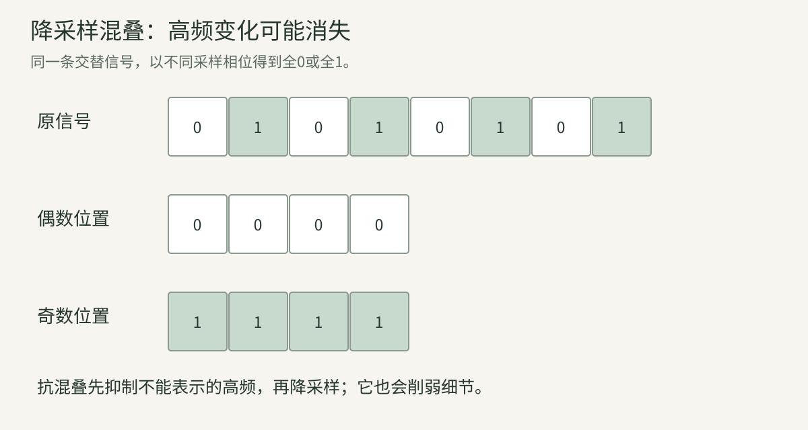
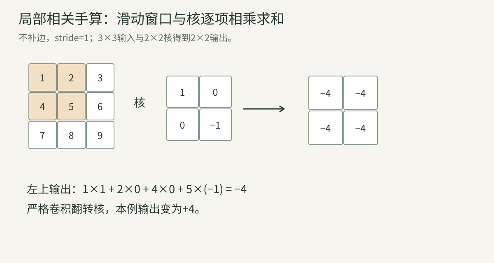
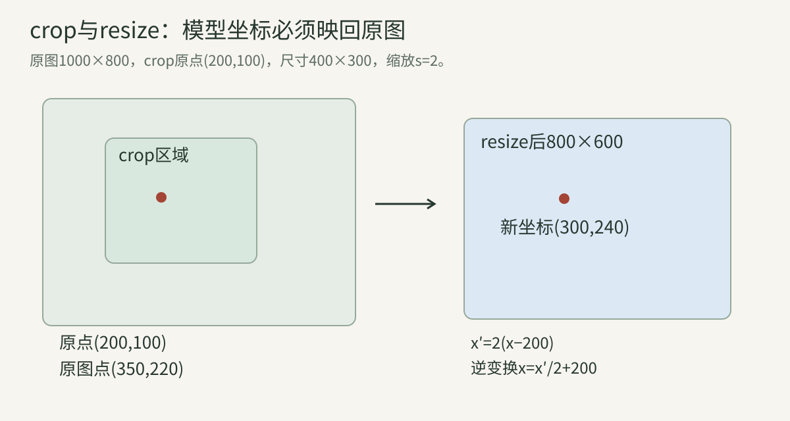

> 视觉模型从图像处理流程接收输入。本讲回答：它究竟收到哪些数？哪些细节可能已被丢掉？一个坐标对应哪个对象？没有这些基础，后续高分辨率、OCR、CNN、空间模型和评测很容易“代码能跑，语义错误”。

## 一、图像数值、颜色与文件

### 1. 像素坐标的轴与方向

常见图像坐标x向右、y向下。数组索引常写image[y,x]，因为第一轴是行。空间坐标(x,y)与数组索引(y,x)要区分。

宽W、高H，常见整数索引是0到W−1、0到H−1。坐标还可以落在非整数位置，用插值获得数值。像素中心、像素边界是不同几何对象；某些归一化坐标和resize接口采用不同约定。

例如宽640图中的x=639是最后一列中心索引，并非“640这个长度不存在”。框的右边界有时允许x2=640，因为它表示半开区间终点，不是最后像素中心。

### 2. RGB与BGR：顺序是协议

RGB三个轴对应红、绿、蓝。某些图像读取接口采用BGR。如果把[0,0,255]按BGR解释，是红色；按RGB解释，是蓝色。

模型训练使用何种顺序，推理就需匹配。数组形状和dtype都正确也可能颜色反了。最简单检查是用已知纯红、纯绿、纯蓝小图，观察读取和显示路径。

颜色转换不同于轴交换：RGB到HSV会计算新的色彩表示，不只是把三个通道换位置。HSV中的Hue还具有环形结构，接近两端的数值可能表示相近色相。

### 3. sRGB、线性光与亮度

常见显示RGB通常经过非线性编码；像素值翻倍不等于物理光强翻倍。涉及物理加权、透明混合或成像时，应注意是否在线性光空间操作。

灰度也不通常等于(R+G+B)/3。按特定色彩标准加权可近似亮度，但权重取决于表示与标准。彩色模型若训练使用RGB，随意灰度化会删除可用颜色信息。

这里先明确颜色值、编码与真实光强的差别；光照和相机辐射模型在几何/视觉专题进一步展开。

### 4. alpha、位深、压缩与EXIF

alpha表示透明度或覆盖，RGB背后的颜色还需背景才知道显示结果。丢掉alpha、把透明区变黑/白可能改变输入。

8bit常为0—255；16bit、浮点图像有不同范围。JPEG有损压缩可改变细小边缘和文字，PNG通常无损保存像素但不等于保存全部拍摄物理信息。

EXIF方向可能记录旋转；解码器是否自动处理会改变图像方向和框坐标。色彩profile、解码器、透明背景策略、orientation和输入range都应记录，而不只是文件后缀。

### 5. 数值归一化的完整例子

某通道原值128，先转浮点并除255：

$$
x=128/255\approx0.50196.
$$

若训练约定μ=0.5、σ=0.25：

$$
x'=(x-\mu)/\sigma\approx0.00784.
$$

mean/std通常是每通道常数，可能来自特定预训练配方；不能认为所有模型都用同一组。先做整数运算可能截断；重复除255也会错误缩小。

标准化不是几何去畸变，不会改变对象位置。它与第02讲向量L2归一化也不同：一个按通道统计量缩放输入，一个按向量长度归一化表示。

## 二、采样、resize与信息损失

### 6. 连续场景与离散采样

现实光场连续变化，图像在有限位置采样并受到镜头/传感器等因素影响。高频意味着空间变化快，例如密集条纹；低频是缓慢亮度变化。

图像缩小时，新网格不能表示原来的全部高频细节。增加模型参数不能保证恢复已经不可区分的输入。生成先验可能补出合理细节，但“合理”不等于观测证据。

### 7. 混叠的一个最小例子

信号：

$$
x=[0,1,0,1,0,1,0,1].
$$

每隔2个取偶数位置，得到[0,0,0,0]；改取奇数位置，得到[1,1,1,1]。原信号是高频交替，但降采样后像常数，取样起点还决定结果。

这就是混叠：不同原信号在新采样下不可区分。图中的摩尔纹、细线消失、小字误读与此相关。

逐元素读图：上排保留全部0/1交替；中排只取偶数位置；下排只取奇数位置。不是物体真的变黑或白，是采样失去了原来的变化。

### 8. Nyquist条件与抗混叠

在理想带限信号和足够采样率等条件下，采样频率需高于最高频率的两倍才能无混叠恢复。真实图像未必满足理想带限，边界和噪声也会影响。

降采样前做低通滤波，先压掉新网格无法表示的高频，再采样。它减少伪影，却可能模糊细节。不能同时要求压缩很大又无代价保留任意高频。

### 9. 最近邻、双线性与双三次

最近邻选择最接近的原像素，快但可能阶梯状。双线性利用周围2×2样本，按距离加权。双三次通常考虑更大邻域和三次权重，可能更平滑，但会有过冲等现象。

双线性例子，四角数值0、10、20、30，取横向比例α=0.25、纵向β=0.5：

$$
v=(1-\beta)[(1-\alpha)0+\alpha10]
+\beta[(1-\alpha)20+\alpha30]
=12.5.
$$

横向先得2.5与22.5，再纵向平均。插值不等于恢复真实未测量细节，是依据某种局部模型估计。

### 10. 保持纵横比、letterbox与拉伸

400×200图片直接拉成224×224，会把宽高比2变成1，对象变形。保持比例resize后补边（letterbox）保留形状，却引入padding。

原尺寸(W,H)，目标(Tw,Th)，比例：

$$
s=\min(T_w/W,T_h/H).
$$

对象坐标按s缩放再加padding偏移。不能只缩放宽度而忽略padding；输出框需要逆变换回原图。

裁剪可以避免一些padding，但会丢掉内容。不同模型的resize/crop策略反映训练约定，推理随意替换可能降低表现。

## 三、局部计算：相关、卷积与滤波

### 11. 相关与严格卷积

二维交叉相关：

$$
Y[i,j]=\sum_{a,b}K[a,b]X[i+a,j+b].
$$

按窗口大小和索引原点需补相应定义。严格卷积会翻转核：

$$
Y[i,j]=\sum_{a,b}K[a,b]X[i-a,j-b].
$$

深度学习中很多“卷积层”实际计算交叉相关；因为核可学习，命名通常不影响表达能力，但复现固定滤波器时方向很重要。OpenCV filter2D也明确说明不翻转核的相关语义，见[官方滤波文档](https://docs.opencv.org/4.13.0/d4/d86/group__imgproc__filter.html)。

### 12. 一个2×2核的完整手算

输入：

$$
X=\begin{bmatrix}1&2&3\\4&5&6\\7&8&9\end{bmatrix},
\quad
K=\begin{bmatrix}1&0\\0&-1\end{bmatrix}.
$$

不补边、stride1的相关输出：

$$
\begin{aligned}
Y_{00}&=1\times1+2\times0+4\times0+5(-1)=-4,\\
Y_{01}&=2-6=-4,\\
Y_{10}&=4-8=-4,\\
Y_{11}&=5-9=-4.
\end{aligned}
$$

输出2×2。严格卷积把核翻为[[-1,0],[0,1]]，本例输出+4。两者不能随意交换。

### 13. padding、stride、dilation与输出大小

一条轴上输入I、核K、padding P、stride S、dilation D：

$$
O=\left\lfloor
\frac{I+2P-D(K-1)-1}{S}
\right\rfloor+1.
$$

有效核跨度 $D(K-1)+1$。I=32、K=3、P=1、S=2、D=1，得到O=16。S增大减少位置数量；D增大把核采样点拉开；P决定边界怎么处理。

“same”输出语义依赖stride和接口，不能一概等于所有输入输出同尺寸。偶数核、非对称padding和取整需要明确记录。

### 14. 多通道卷积与权重共享

一个输出通道把全部输入通道的局部响应相加：

$$
Y_o[i,j]=b_o+\sum_c\sum_{a,b}W_{o,c,a,b}X_c[i+a,j+b].
$$

权重shape为(Cout,Cin,Kh,Kw)。参数数：

$$
C_{\mathrm{out}}C_{\mathrm{in}}K_hK_w+C_{\mathrm{out}}.
$$

RGB输入、8个输出、3×3核、有bias：8×3×9+8=224。不同空间位置共用核，所以参数不随图像面积增长，计算次数却增长。

depthwise convolution减少通道混合，后续MobileNet章会展开；1×1卷积在每个位置混通道，不是“没有作用因为没有邻域”。

### 15. 感受野与平移等变性

感受野是某输出依赖的输入区域。三层stride1、3×3卷积理论跨度7×7，不是9×9：每层在原跨度两边各增1。

更一般可递推：

$$
r_l=r_{l-1}+(k_l-1)d_lj_{l-1},
\qquad
j_l=j_{l-1}s_l,
$$

r是跨度，j是相邻输出在原图中的间隔。初始化r0=j0=1。

卷积权重共享带来平移等变性直觉：输入平移，特征响应位置随之平移。但边界、stride、padding和离散采样会限制严格性质。等变不等于不变；分类池化可能提高对位置的容忍，但不是无条件保证。

### 16. 平均、Gaussian、中值与双边

平均滤波把窗口等权平均，能平滑但也模糊边缘。Gaussian更重视中心，可由两个一维核分离计算。例一维[1,2,1]/4外积得到：

$$
K=\frac1{16}
\begin{bmatrix}1&2&1\\2&4&2\\1&2&1\end{bmatrix}.
$$

中值滤波选邻域中位数，对孤立脉冲噪声有不同效果；它是非线性的。双边滤波同时考虑空间距离与数值相似，可减少跨边界混合，但对参数敏感。

这些滤波各有目标。给VLM先“强去噪”可能删除细字；预处理提升人眼观感不必然提升模型任务。

### 17. 图像梯度、Sobel与Laplacian

用相邻差近似亮度变化，如一维[-1,0,1]。Sobel同时在垂直方向平滑：

$$
K_x=\begin{bmatrix}-1&0&1\\-2&0&2\\-1&0&1\end{bmatrix}.
$$

Kx响应左右变化，常用于垂直边界；不要把“x方向梯度”误解为只检测水平线。梯度幅度 $\sqrt{G_x^2+G_y^2}$，方向atan2(Gy,Gx)。

Laplacian是二阶变化，可检测其他变化模式但对噪声敏感。梯度输出可能负或超过原范围，需要合适dtype，直接写回uint8可能截断/饱和。

### 18. 边界与形态学

滤波到边界需要假设图外是什么：零、复制、反射、周期等。选择不同会改变边缘响应。边界处理是算法的一部分，不应省略。

二值形态学用结构元素：膨胀扩大前景，腐蚀缩小前景；开运算先腐蚀后膨胀，闭运算相反。它们基于局部集合/最大最小，而非普通线性卷积。

后处理可修mask孔洞，也可能删除真实小目标、连接本来分离的实例。需在任务指标与真实失败案例上验证。

## 四、频率视角与图像金字塔

### 19. Fourier变换在换一套描述基

空间表示告诉每个位置多亮；频率表示告诉哪些周期变化组成了信号。低频描述缓慢变化，高频描述细节和快速交替。

N点DFT：

$$
X[k]=\sum_{n=0}^{N-1}x[n]e^{-i2\pi kn/N}.
$$

i为虚数单位，i²=−1，不是样本索引。复数同时编码幅度与相位：幅度告诉变化强度，相位与位置对齐有关。二维DFT沿两条空间轴展开。

### 20. 四点DFT手算

取x=[1,0,−1,0]。仅n=0与2非零：

$$
X[k]=1-e^{-i\pi k}.
$$

k=0、1、2、3，依次[0,2,0,2]。直流k0为0，因为均值0；正负对应频率成对出现。

取常数x=[1,1,1,1]，DFT为[4,0,0,0]：仅直流。取交替[1,−1,1,−1]，DFT为[0,0,4,0]：能量集中到最高交替模式。

这些小例子说明“频率”不是时间专用概念，空间条纹也能用频率描述。

### 21. 卷积定理与实现条件

在相应连续或离散约定下，卷积在频域变乘法。有限DFT自然对应循环卷积；要得到线性卷积，需要正确补零及处理尺寸。

相关、核翻转、频域共轭与边界约定不能略去。FFT加速大核计算时仍需匹配这些定义。小核未必值得频域转换，实际速度由尺寸、内存和实现决定。

### 22. Gaussian与Laplacian金字塔

Gaussian pyramid逐层低通和降采样，获得多尺度图像。Laplacian pyramid记录相邻尺度重建之间的残差，可用于多尺度融合和压缩。

多尺度帮助观察不同尺寸对象，但上采样不会创造独立新信息。FPN在特征空间融合层级表示，与直接图像金字塔有联系也有区别；后续检测章会明确数据流。

## 五、几何变换与输入输出坐标

### 23. 平移、缩放、旋转与齐次坐标

二维仿射变换：

$$
\begin{bmatrix}x'\\y'\end{bmatrix}
=A\begin{bmatrix}x\\y\end{bmatrix}+t.
$$

引入齐次坐标[x,y,1]ᵀ，可统一写为3×3矩阵：

$$
\begin{bmatrix}x'\\y'\\1\end{bmatrix}
=
\begin{bmatrix}a_{11}&a_{12}&t_x\\a_{21}&a_{22}&t_y\\0&0&1\end{bmatrix}
\begin{bmatrix}x\\y\\1\end{bmatrix}.
$$

额外的1不是新增物理高度，而是把平移合进矩阵计算。旋转正方向还依赖x/y方向约定，图像y向下与常见数学坐标不同。

### 24. homography和逆向采样

一般平面投影变换可用H：

$$
\begin{bmatrix}\tilde x'\\\tilde y'\\w'\end{bmatrix}
=H\begin{bmatrix}x\\y\\1\end{bmatrix},
\qquad
x'=\tilde x'/w',\ y'=\tilde y'/w'.
$$

H整体乘非零常数表示同一映射。它适合平面或特定相机条件，不是任意3D场景都能用一个H完全对齐。

图像warp常对每个输出位置反查输入坐标再插值，避免前向投影造成空洞。逆映射、插值和边界模式见[OpenCV几何变换文档](https://docs.opencv.org/4.13.0/da/d54/group__imgproc__transform.html)。

### 25. crop坐标变换完整手算

原图1000×800，从左上(200,100)裁400×300，再缩成800×600。比例s=2：

$$
x'=2(x-200),\qquad y'=2(y-100).
$$

原点(350,220)变为(300,240)。若模型输出这个裁剪坐标，逆变换为：

$$
x=x'/2+200,\qquad y=y'/2+100.
$$

输出框的两个角要用同一映射。若另有letterbox，还要加减padding。坐标错误常被误诊为模型grounding能力差。

### 26. 归一化坐标与box约定

常见归一化方式x/W、x/(W−1)、映射到[−1,1]等，它们不是同一公式。边界坐标与像素中心坐标也可能不同。

框可用xyxy，也可用cxcywh：

$$
c_x=(x_1+x_2)/2,\quad w=x_2-x_1,
$$

其余轴类似。若采用包含端点的整数面积，则可能出现+1；现代连续/半开区间框常不加。比较IoU时必须统一约定。

### 27. 针孔相机投影

相机坐标点(X,Y,Z)，Z>0：

$$
u=f_xX/Z+c_x,\qquad
v=f_yY/Z+c_y.
$$

fx/fy是像素单位的焦距比例，cx/cy是主点。除Z体现远处同尺寸物体投影更小。令fx=fy=500、cx=320、cy=240，点(1,0.5,5)投影(420,290)。

多个(X,Y,Z)沿同一射线可能投到同一(u,v)，所以单幅图不能无条件唯一确定深度。这正是空间模型需要几何约束、数据先验或多视图信息的原因。

### 28. 内外参与畸变

内参K描述相机坐标到像素的映射；外参R、t描述世界坐标到相机坐标：

$$
X_c=RX_w+t.
$$

t并非总等于相机在世界坐标中的位置。按这个约定，相机中心C满足0=RC+t，所以 $C=-R^\top t$。

镜头畸变还会改变理想投影。校准参数与分辨率、焦距、对焦和处理流程可能相关，不能把某次标定当作所有配置终身固定。已有相机标定图解可作为额外阅读；本系列第61章会完整展开多视几何。

### 29. resize后内参怎样变

若仅缩放s且采用匹配的坐标映射，fx、fy、cx、cy相应缩放；若先crop，主点先减crop原点，再缩放；若有padding，再加偏移。

本质是前处理的像素坐标变换与K复合。实际半像素中心约定可能引入附加项，不能只背“内参乘比例”而忽略实现。用已知点投影到变换前后图检查，是很有效的验证。

## 六、视觉大模型的预处理审计

### 30. 一张图从文件到回答的检查链

文件 → 解码/方向 → 色彩/透明 → resize/crop → 通道/轴 → 浮点与normalize → patch/token → 模型 → 输出逆坐标。

每一步记录“输入形状、输出形状、坐标映射、信息变化”。OCR尤其注意小字是否还在；空间任务注意角度/位置是否变形；检测注意输出是否正确映回原图。

### 31. 公平评测不能只锁权重

同一模型，不同解码器、插值、crop、最大分辨率、tile数量和视频帧采样都可能改变结果。对比模型时，既要遵守各自官方合理输入协议，又要说明信息与算力预算差异。

若方法提出动态高分辨率，额外成本是方法的一部分，需报告质量—成本曲线。不能把原图裁成更多块的收益全部归因于一个语言推理模块。

### 32. 最小可复查实验

使用已知颜色、棋盘、坐标点和小字图，逐步观察中间结果。检查输入range、通道顺序、图像方向和逆坐标。

不需要先训练模型即可排查大量错误。对生成式增强，还要比较是否引入虚假字符/边缘：增强后的内容不能自动当成原图真值。

## 深入算例：从输入像素到可以解释的图像操作

这组例题把滤波、变换和相机公式落到实际数值。读完后，你应能说明模型输入中的一个像素或输出中的一个框，是经过哪些操作得到的。

### 算例A：颜色通道、透明与整数运算一起检查

一个完全红色像素RGB=[255,0,0]，转为浮点并除255后是[1,0,0]。如果采用每通道μ=[0.5,0.5,0.5]、σ=[0.5,0.5,0.5]，标准化为[1,−1,−1]。若错误地按BGR送入模型，则变成[−1,−1,1]。

所以检查只打印全局min/max是不够的：两个版本范围完全一样，内容却变了。应同时打印已知位置的通道值、shape、dtype与对应显示图。

若红色前景alpha=0.5，白背景RGB=[1,1,1]，在已确定的同一线性表示下混合：

$$
C=\alpha F+(1-\alpha)B
=0.5[1,0,0]+0.5[1,1,1]=[1,0.5,0.5].
$$

若alpha只是丢弃，得到纯红；若默认黑背景，得到[0.5,0,0]。三种结果不同。对非线性编码的sRGB直接套这个线性光混合公式，会产生不同于物理线性混合的结果，需遵循实际渲染与模型预处理协议。

整数也容易出问题。8bit无符号数组中255+1可能溢出或被接口处理成其他结果；128/255在某些整数运算约定下会截断。先转换到足够精度，再做预处理，并核对库的具体规则。

### 算例B：resize究竟在哪个原位置取样

设一条原信号长度4，新长度2。常见“半像素中心”映射：

$$
x_{\rm src}=(x_{\rm dst}+0.5)\frac{W_{\rm src}}{W_{\rm dst}}-0.5.
$$

新位置0、1对应原位置0.5、2.5。对原值[0,10,20,30]线性插值，得到[5,25]。

另一种对齐端点约定：

$$
x_{\rm src}=x_{\rm dst}\frac{W_{\rm src}-1}{W_{\rm dst}-1},
\qquad W_{\rm dst}>1,
$$

新位置0、1对应原位置0、3，得到[0,30]。相同“线性插值”名称，坐标映射不同就得到不同数字。

二维双线性插值先选择对应的原位置，再在周围四点按权重求和。因此复现时要同时核对坐标约定、插值核、边界处理、抗混叠和输出取整。不能只记录“resize224”。

对类别mask，直接双线性插值类别编号会产生没有语义的新数字；通常对离散mask采用相应离散采样策略。对soft mask或连续深度，处理策略又可能不同。无效深度不应当作普通零值直接混进插值。

### 算例C：letterbox的完整正向与逆向链

原图640×480，目标640×640。s=min(640/640,640/480)=1，不缩放；上下各补80像素。

原框(x₁,y₁,x₂,y₂)=(100,50,300,250)，按连续边界坐标：

$$
b'=(100,130,300,330).
$$

模型输出若为这个框，逆变换先减padding，再除s，得到原框。如果只按640×640乘比例回原图，会把坐标映错。

再看原图1280×720，目标640×640：s=0.5，缩放后640×360，上下各补140。原点(400,200)变成(200,240)，逆向为：

$$
x=(200-0)/0.5=400,\qquad
y=(240-140)/0.5=200.
$$

实际实现可能因整数取整产生左右或上下差1像素，必须保存**实际**缩放尺寸和每侧padding。不要只存理论比例然后猜偏移。

### 算例D：Gaussian平滑和Sobel边缘逐项算

对局部窗口：

$$
X=\begin{bmatrix}0&0&0\\0&16&0\\0&0&0\end{bmatrix},
\qquad
K=\frac1{16}
\begin{bmatrix}1&2&1\\2&4&2\\1&2&1\end{bmatrix}.
$$

中心输出为16×4/16=4。若周围继续为零，邻近输出还会获得2、1等值，中心尖峰被分散。核权重和为1；在无限域或合适边界下，常量信号可保持，边缘截断时还需边界规则。

该核可由一维[1,2,1]/4在横向和纵向分别处理得到。直接3×3每位置9次乘法，分离实现两次一维核每位置约6次乘法；较大核的收益更明显，但实际速度还受内存与实现影响。

考虑窗口：

$$
X=\begin{bmatrix}0&0&10\\0&0&10\\0&0&10\end{bmatrix}.
$$

使用交叉相关形式Sobel核：

$$
K_x=\begin{bmatrix}-1&0&1\\-2&0&2\\-1&0&1\end{bmatrix},
\quad
K_y=\begin{bmatrix}-1&-2&-1\\0&0&0\\1&2&1\end{bmatrix}.
$$

Gx=10+20+10=40，Gy=−10+10=0，梯度幅值40，方向atan2(0,40)=0。这表示数值沿x增加，即出现近似竖直边缘；梯度方向指向变化方向，而不是沿边缘方向。

若翻转核，梯度符号改变。显示时把负梯度直接转无符号8bit还会丢失信息，应先保留有符号/浮点，再按显示目的转换。

### 算例E：中值、双边与形态学各保护什么

一维窗口[0,0,100,0,0]，均值20，中值0。单个脉冲噪声可能被中值去掉，但同样孤立的真实亮点也可能被去掉；“去噪”依赖你认定什么是信号。

双边滤波除了空间距离，还按像素差异加权。跨越强边缘的邻居因为颜色差大，权重可较小；它不是任意条件下完美保持所有边缘，参数和纹理结构都重要。

对二值前景，腐蚀要求结构元素覆盖区域符合前景条件，常缩小前景；膨胀常扩大前景。先腐蚀后膨胀是开运算，先膨胀后腐蚀是闭运算。

用长度3的一维平坦结构元素，信号[0,0,1,0,0]的孤立1可被开运算删除；[0,1,0,1,0]中两个前景之间的小缺口可被闭运算填补，具体边界结果取决于外侧补值。

结构元素定义了哪些邻居参与，而不是模型自动知道“裂缝应该连续”。对细线任务，错误开运算可能把真目标全部删掉。后处理也需计入端到端精度和耗时。

### 算例F：卷积的参数、计算和感受野分别记账

输入32×32×3，3×3核，8个输出通道，stride1，padding1。输出32×32×8，有8192个输出元素；有bias时参数为224。

每个输出位置、每个输出通道需要3×3×3=27项乘加，总计：

$$
32\times32\times8\times27=221184
$$

个MAC，另有bias及其他操作。若约定一次乘与一次加分别计一个FLOP，常粗略写约442368FLOPs，但硬件和论文的计数约定需要说明。

输入改64×64，参数仍224，MAC增加4倍。**参数量决定存多少可学习权重，分辨率决定这些权重被重复使用多少次。**

三层操作分别为：3×3 stride1，3×3 stride2，3×3 stride1。初始化r₀=1、j₀=1，逐层：

| 层 | 感受野r | 相邻输出间隔j |
| --- | --- | --- |
| 1 | 1+2×1=3 | 1 |
| 2 | 3+2×1=5 | 2 |
| 3 | 5+2×2=9 | 2 |

最后输出依赖9×9理论区域。有效感受野描述实际贡献分布，可能集中在理论区域的一部分；不能从理论跨度推断每个像素对输出贡献相同。

### 算例G：DFT中的复数不是额外神秘变量

复数a+bi由实部a和虚部b构成，i²=−1。Euler公式e^{iθ}=cosθ+i sinθ，把相位与正弦/余弦组合放在一个符号中。

对x=[1,0,−1,0]，N=4，采用：

$$
X[k]=\sum_{n=0}^{3}x[n]e^{-i2\pi kn/4}.
$$

只有n=0、2有非零贡献：

- k=0：1−1=0。
- k=1：1−e^{-iπ}=1−(−1)=2。
- k=2：1−e^{-i2π}=0。
- k=3：1−e^{-i3π}=2。

因此X=[0,2,0,2]。反变换含1/N因子，把这些频率分量合成回来。另一些库采用不同归一化约定，必须对应。

实信号的频谱具有共轭对称结构。频率不是某个“猫特征通道”：它描述空间变化的速率与相位，不自动对应语义对象。

### 算例H：线性卷积、循环卷积与FFT补零

信号x=[1,2]，核h=[1,1]。线性卷积得到[1,3,2]：

$$
y[0]=1,\quad y[1]=1+2=3,\quad y[2]=2.
$$

若只使用长度2的循环卷积，索引绕回，得到[3,3]。最后的2绕到首项，与1相加。这不是计算误差，是边界模型不同。

使用FFT相乘再逆变换时，若要得到线性卷积，长度至少补到Nx+Nh−1=3，常选更适合实现的更大长度。二维则两条轴都要相应补零，并处理核原点与裁剪。

高通/低通、频谱截断与空间卷积由傅里叶联系起来，但在有限图像上边界处理不能被省略。锐利频谱截断还可能产生空间振铃；一刀切删高频可能伤害OCR、小物体与边缘。

### 算例I：仿射、单应性与逆向取样

二维齐次点写为[x,y,1]ᵀ。仿射矩阵最后一行为[0,0,1]：

$$
T=\begin{bmatrix}2&0&10\\0&3&20\\0&0&1\end{bmatrix}.
$$

点(4,5)映到(18,35)。逆矩阵对应先减平移再除尺度，而不是把全部数字简单取负。

一般单应矩阵H的最后一行可不同。取：

$$
H=\begin{bmatrix}1&0&0\\0&1&0\\0.1&0&1\end{bmatrix}.
$$

点(2,3)先变为[2,3,1.2]，除最后分量后得到(5/3,2.5)。忘记齐次除法会产生错误坐标。

单应性适合一定几何条件，例如平面之间的投影关系或适当的纯旋转相机场景。具有不同深度且有平移的普通三维场景，通常不能由一个单应矩阵精确统一。

生成新图常对每个目标像素反查原图位置并插值：这是逆向warp。若直接把原像素向目标“撒点”，会产生空洞或多个像素落同一点，还需另外定义填充与汇总。

### 算例J：相机内外参与投影不可恢复的信息

相机坐标Xc=[X,Y,Z]ᵀ，Z>0，忽略畸变：

$$
u=f_xX/Z+c_x,\qquad v=f_yY/Z+c_y.
$$

fx=fy=500，中心(320,240)，点(1,0.5,5)映到(420,290)。点(2,1,10)也映到同一个像素。单个像素约束一条射线，不能独自确定深度。

世界到相机采用Xc=RXw+t。相机中心C在世界坐标下满足0=RC+t，因此：

$$
C=-R^\top t
$$

前提R为正交旋转矩阵。t不是直接的相机世界位置；方向约定反过来，公式也需相应改变。

整张图缩小为原来一半，采用一致的连续坐标约定，fx、fy和主点也要相应变换。若先裁剪原点(x₀,y₀)，主点先变为(cx−x₀,cy−y₀)，再按缩放与padding映射。涉及半像素中心的接口时，还需按实际像素坐标映射调整。

径向畸变常以半径平方r²=x²+y²的多项式缩放归一化坐标，切向畸变描述其他偏移。模型、参数与坐标定义必须对应；不能只记“先去畸变”就忽略是否更新内参和输出画幅。

### 一个可运行的图像操作小实验

下面不依赖OpenCV，直接检查相关、Sobel和DFT。它保留负数与复数，帮助读者看清显示接口之前的真实数值。

~~~python
import cmath
import math

def correlate_valid(image, kernel):
    height, width = len(image), len(image[0])
    kh, kw = len(kernel), len(kernel[0])
    return [[sum(image[y+a][x+b] * kernel[a][b]
                 for a in range(kh) for b in range(kw))
             for x in range(width-kw+1)]
            for y in range(height-kh+1)]

image = [[1, 2, 3], [4, 5, 6], [7, 8, 9]]
kernel = [[1, 0], [0, -1]]
print("correlation", correlate_valid(image, kernel))
flipped = [row[::-1] for row in kernel[::-1]]
print("flipped_kernel", correlate_valid(image, flipped))

edge = [[0, 0, 10], [0, 0, 10], [0, 0, 10]]
sobel_x = [[-1, 0, 1], [-2, 0, 2], [-1, 0, 1]]
sobel_y = [[-1, -2, -1], [0, 0, 0], [1, 2, 1]]
print("sobel", correlate_valid(edge, sobel_x)[0][0],
      correlate_valid(edge, sobel_y)[0][0])

signal = [1, 0, -1, 0]
spectrum = [sum(v * cmath.exp(-2j * math.pi * k * n / len(signal))
                for n, v in enumerate(signal))
            for k in range(len(signal))]
print("DFT_real", [round(z.real, 6) for z in spectrum])
assert max(abs(z.imag) for z in spectrum) < 1e-12
assert correlate_valid(image, kernel) == [[-4, -4], [-4, -4]]
~~~

预期相关为全部−4，翻核后为全部4，Sobel为(40,0)，DFT实部[0,2,0,2]。后续用框架时可以先拿这组小输入核对方向、边界与dtype，再扩展到真实图像。

## 七、16道练习与解析

### 练习1：索引

宽640、高480图中的(x,y)=(20,30)，数组哪个位置？

**解析：**常见HWC/HW数组用[30,20]。轴与空间记法顺序不同。

### 练习2：颜色

[0,0,255]按RGB与BGR各是什么？

**解析：**RGB蓝，BGR红。shape不能检查这个错误。

### 练习3：归一化

像素255，μ=0.5、σ=0.25，先除255后标准化？

**解析：**(1−0.5)/0.25=2。

### 练习4：混叠

交替0/1每隔2取样，为何不保留原纹理？

**解析：**新网格只见一个相位，原变化映成常数；需降采样前低通，但低通也会削弱细节。

### 练习5：双线性

四角0、10、20、30，α=β=0.5？

**解析：**两行插值得5与25，再平均15。

### 练习6：卷积与相关

本讲反对角差分核若翻转，输出符号怎样变？

**解析：**相关−4，翻转后严格卷积+4。本例核反对称导致符号反转。

### 练习7：输出大小

I=10、K=3、P=0、S=2、D=1？

**解析：**floor((10−3)/2)+1=4。

### 练习8：空洞

K=3、D=2，有效跨度？

**解析：**2(3−1)+1=5，核仍3个采样点，但覆盖跨度5。

### 练习9：参数量

Cin=3、Cout=16、3×3、有bias？

**解析：**16×3×9+16=448，与输入图面积无关。

### 练习10：感受野

两层3×3、stride1、无dilation，理论跨度？

**解析：**r1=3，r2=5。不是3×3=9。

### 练习11：DFT

[1,1,1,1]的直流与其他项？

**解析：**直流4，其余0。四点相位项抵消。

### 练习12：裁剪坐标

本讲裁剪缩放设置中，模型坐标(100,200)回原图？

**解析：**x=100/2+200=250，y=200/2+100=200。

### 练习13：letterbox

400×200放进300×300，居中补边。比例和上下padding？

**解析：**s=0.75，得到300×150，上下各75。

### 练习14：相机投影

fx=500、cx=320，X=1、Z=10，u？

**解析：**370。深度由5变10，偏离主点的量由100降50。

### 练习15：外参

Xc=RXw+t，R=I、t=[−2,0,0]，相机世界位置？

**解析：**C=−Rᵀt=[2,0,0]，不能直接取t。

### 练习16：增强证据

生成模型把模糊车牌变清楚，是否能当作真实字符？

**解析：**不能。可能凭先验补字符。应保留原图证据，按任务评估恢复的真实性与不确定性。

## 八、本讲覆盖与后续连接

已讲解图像表示协议、采样/混叠/插值、局部算子、卷积尺寸、滤波导数、DFT、多尺度、坐标变换、投影与预处理审计。后续CNN章展开特征学习，ViT章展开patch，文档章展开OCR，几何章展开多视图；这里的输入和坐标约定都会继续使用。

## 参考与进一步阅读

- [OpenCV图像滤波](https://docs.opencv.org/4.13.0/d4/d86/group__imgproc__filter.html)。
- [OpenCV几何变换](https://docs.opencv.org/4.13.0/da/d54/group__imgproc__transform.html)。
- [OpenCV相机标定与3D重建](https://docs.opencv.org/4.13.0/d9/d0c/group__calib3d.html)。

所有矩阵、图像信号、投影与习题均为教学例子，具体软件使用需遵守对应接口约定。
