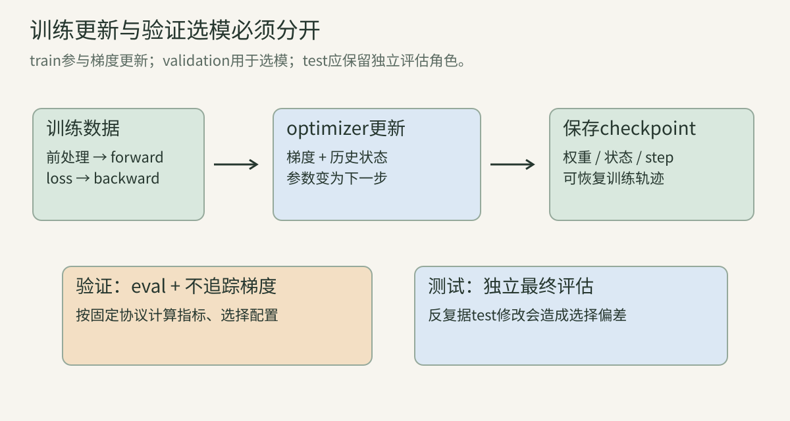
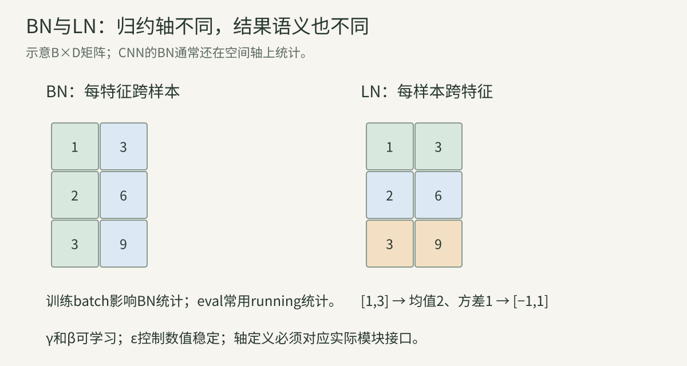

> 第02—03讲解释了梯度与概率。本讲把它们组成真正可以核查的训练流程。正文里的训练代码只使用Python标准库和四个教学样本，不依赖GPU；它用于观察机制，不代表真实视觉模型的训练成绩。

## 一、训练流程、数据和更新次数

### 1. 一个任务必须先定义输入与目标

分类输入图像x、输出类别y；分割输出mask；caption输出token序列。不同输出决定不同loss、有效位置、评价指标。

在写optimizer之前先写出：输入shape、输出shape、标签含义、loss在哪里平均、是否有无效位置。否则程序可能优化了错误目标，例如第02讲的(B,1)标签和(B,)预测广播成(B,B)。

### 2. 数据集、batch、iteration与epoch

dataset是一组样本；mini-batch是一次梯度计算使用的子集；iteration常指一次循环，但未必等于optimizer更新；epoch通常指遍历数据一次。

N=1000、batch=64，不丢最后一批时有ceil(1000/64)=16批，最后批40；drop_last=True时15批、丢40样本。shuffle改变每轮顺序，data augmentation可能使同一图片每次内容也不同。

若每4批才更新一次，batch循环数与optimizer step数不同。调度器、日志和学习率应说明按哪种step推进。

### 3. 一轮训练的六步

数据 → 前向 → loss → 清理/累积梯度 → backward → optimizer更新。

更具体：

1. 读取输入和目标，按训练协议处理。
2. 模型计算预测。
3. loss比较预测与目标。
4. 对loss求参数梯度。
5. 优化器结合梯度及历史状态更新参数。
6. 记录训练量，并按约定做验证。

梯度一般由框架累积，不每次自动清空。应在累积窗口起点清理。先清理再反传或窗口末更新都可按实现组织，关键是不能误清有意累积的梯度。

### 4. train模式、eval模式与不求梯度

train()/eval()影响Dropout、BatchNorm等层的行为；关闭梯度追踪影响计算图与显存。二者是不同开关。

验证通常既切eval，又关闭梯度追踪。只关闭梯度但留train模式，Dropout仍随机，BN可能更新统计。只切eval而不关梯度，输出行为可正确，但会有无用图追踪与资源开销。

冻结参数也不等于模块eval：一个冻结权重的BN模块仍可能更新running statistics。迁移学习要明确二者。

## 二、优化器如何利用梯度

### 5. SGD：批次梯度估计

$$
g_t=\frac1B\sum_{i\in\mathcal B_t}\nabla_\theta\ell_i,\qquad
\theta_{t+1}=\theta_t-\eta_tg_t.
$$

full-batch用全数据，SGD用随机样本或mini-batch。梯度噪声不是计算错了，而是子集对总体目标的估计。抽样与数据相关性会影响噪声。

一个梯度方向对当前batch好，不保证立即改善全部验证数据。需要用训练曲线和验证曲线分别判断优化与泛化。

### 6. Momentum：记住历史方向

一种常见约定：

$$
v_t=\beta v_{t-1}+g_t,\qquad
\theta_{t+1}=\theta_t-\eta v_t.
$$

v像带惯性的方向累计。β越接近1，历史保留越长。也有把新梯度乘(1−β)的EMA写法，需核对尺度。

g1=2、g2=1、β=0.9、v0=0，则v1=2，v2=2.8。第二步仍含过去方向。它能平滑振荡或加速一致方向，但也可能导致过冲。

### 7. Adam：一阶与二阶统计

$$
m_t=\beta_1m_{t-1}+(1-\beta_1)g_t,
$$

$$
v_t=\beta_2v_{t-1}+(1-\beta_2)g_t^2.
$$

平方逐元素，v不是梯度方差的直接精确估计，而是二阶原始矩的EMA。初始0造成偏小，做偏差修正：

$$
\hat m_t=m_t/(1-\beta_1^t),\quad
\hat v_t=v_t/(1-\beta_2^t).
$$

$$
\theta_{t+1}=\theta_t-\eta
\frac{\hat m_t}{\sqrt{\hat v_t}+\epsilon}.
$$

各坐标按历史平方梯度缩放。ε避免零分母并影响数值行为。Adam不是自动选出所有超参数，也不是所有任务都优于SGD。

### 8. Adam第一步的手算

标量g1=2，β1=0.9，β2=0.999：

$$
m_1=0.2,\quad v_1=0.004,
$$

$$
\hat m_1=2,\quad \hat v_1=4.
$$

忽略极小ε，更新量η×2/2=η。若不做修正，比例0.2/√0.004≈3.162，与上述明显不同。这解释偏差修正并非装饰。

零梯度且已有历史时也可能继续更新；是否清optimizer状态会改变训练续跑行为。[Adam原论文](https://arxiv.org/abs/1412.6980)给出该方法。

### 9. L2正则与AdamW

若loss加 $\lambda\|\theta\|^2/2$，梯度加λθ。标准SGD中：

$$
\theta'=\theta-\eta(g+\lambda\theta)
=(1-\eta\lambda)\theta-\eta g.
$$

与相应weight decay等价。但Adam把总梯度送入自适应统计后，惩罚也被坐标相关缩放，通常不等于独立乘一个衰减因子。

AdamW把衰减与自适应梯度路径解耦。常见写法：

$$
\theta'=(1-\eta\lambda)\theta
-\eta\frac{\hat m}{\sqrt{\hat v}+\epsilon}.
$$

哪些参数衰减、具体实现顺序和学习率调度需记录。bias、归一化参数常采用不同分组，但不是所有任务统一定律。[原始论文](https://arxiv.org/abs/1711.05101)解释了区分。

### 10. 学习率、warmup与调度

学习率小可能慢，大可能不稳定。warmup从较小值逐步升到目标，减少初始阶段统计或梯度问题。后续可step decay、cosine、线性下降等。

cosine示例：

$$
\eta(t)=\eta_{\min}
+\tfrac12(\eta_{\max}-\eta_{\min})
[1+\cos(\pi t/T)].
$$

t=0最大，t=T最小。warmup和cosine如何拼接、scheduler在step前后调用，都影响实际序列。比较复现不只记录初始lr，需保存整个规则与总更新次数。

### 11. batch大小与梯度累积

累积K个micro-batch可近似有效batch B×K。若loss是每micro-batch均值，通常除K再backward，最后update一次。

但不总等价于一次大batch：BN统计、Dropout随机、对比学习负样本集合、不同长度归一化都会改变行为。变长token任务应按总有效token加权，而非每批一律相同权重。

分布式有效batch还涉及world size及梯度归约方式。先确认优化器实际看到的梯度scale，再讨论学习率缩放。

### 12. 梯度裁剪与混合精度

norm clipping：

$$
g'=g\cdot
\min\left(1,\frac c{\|g\|_2+\epsilon}\right).
$$

超阈值时整体缩放，保持方向；逐元素clamp不是同一方法。它可能减少极端梯度造成的跳跃，但不能修复错误标签或错误loss。

混合精度用较低精度算部分操作，并保留必要高精度。采用loss scaling时，先unscale再裁剪和检查真实梯度。不是所有dtype都需相同scaling策略。性能收益需连同数值和任务质量验证。

## 三、初始化、激活、归一化与正则化

### 13. 为什么不能把所有隐藏单元初始化相同

完全相同参数、同样输入和对称连接可能得到相同梯度，隐藏单元长期学习同一种特征，失去宽度的作用。随机初始化破坏对称性。

但“随机”也要合适尺度。若每层权重太大，激活/梯度可能爆炸；太小可能逐层衰弱。fan_in是一个输出连接的输入数，fan_out是输出连接数。

### 14. Xavier与He初始化的直觉

假设输入独立、零均值，y=Σi wi xi，则方差近似Σi Var(wi)Var(xi)。fan_in增大时，权重方差要相应缩小才能控制输出规模。

Xavier通常依据fan_in/fan_out保持尺度；He对ReLU等使用约2/fan_in的权重方差，因为非线性改变激活统计。公式依赖独立、对称等近似，现代残差结构和特定激活可能需要不同初始化。

不能只记一个名字不核对库里的分布、gain、fan约定和bias设置。

### 15. 激活、饱和与残差

sigmoid压到(0,1)，极大或极小输入时导数小；ReLU正侧线性、负侧零，可能出现长期不激活单元；GELU/SiLU等有平滑门控性质。

残差y=x+F(x)，输入梯度同时含恒等路径和F路径：

$$
\frac{\partial y}{\partial x}=I+J_F.
$$

它给传播提供直接路径，但不能无条件保证梯度永不爆炸或消失。完整ResNet、Transformer的设计需要结合归一化、深度和训练配方解释。

### 16. BatchNorm：按哪些元素统计

典型CNN输入(B,C,H,W)，每个通道在batch与空间轴上统计：

$$
\mu_c=\frac1{BHW}\sum_{b,h,w}X_{bchw},
$$

$$
\hat X=\frac{X-\mu}{\sqrt{\sigma^2+\epsilon}},
\qquad Y=\gamma\hat X+\beta.
$$

γ、β可训练，让模型调节归一化后的尺度与偏移。eval通常使用累积的running mean/variance，而非当前batch。

样本少、域变化、batch构成和统计估计约定会影响行为。原论文用“内部协变量偏移”作动机；后续对BN作用的解释更丰富，不能把最初动机当唯一已证实机制。

### 17. LayerNorm与一个数值例子

Transformer中常对每个token的特征维度独立统计。token=[1,3]，均值2、按两项平均的方差1；忽略ε且γ=1、β=0，归一化得[−1,1]。

BN在样本/空间集合统计，LN在样本内部指定特征轴统计，二者不只是名字不同。LN通常训练/评估都使用当前输入统计。

RMSNorm不减均值，按均方根缩放。若token=[1,3]，RMS为√5，结果[1/√5,3/√5]，显然不等于LN结果。后续Transformer章会展开Pre-LN/Post-LN和RMSNorm。

### 18. Dropout与正则化的不同角色

inverted dropout随机以概率p置零，其余除(1−p)，使训练时输出期望保持。eval不再随机丢弃。它不是直接减少固定模型参数数。

正则化还包括weight decay、增强、early stopping、label smoothing等；它们作用于不同部分。组合并非越多越好，可能造成欠拟合或改变任务目标。

冻结backbone也会限制适配能力，但目的可能是省资源或保持原表示，不能把它与Dropout完全混同。

## 四、数据增强、迁移和多模态适配

### 19. 增强必须与目标一起变

几何增强对分类可能不改变标签，对检测/分割需要同时变换框和mask。水平翻转还会改变“左/右”问题答案；文字镜像通常改变识别任务。

颜色增强可帮助自然图分类，却可能破坏“红色信号灯”的真实语义。random crop可能删掉目标；caption若仍描述被删对象，就造成不一致监督。

多模态数据增强要检查输入、语言、坐标、时间与动作是否仍对应，而不是照搬ImageNet配方。

### 20. Mixup、CutMix与软标签

Mixup：

$$
\tilde x=\lambda x_i+(1-\lambda)x_j,\quad
\tilde y=\lambda y_i+(1-\lambda)y_j.
$$

CutMix拼局部区域并按面积等构造标签权重。这类目标常用于特定分类设置，并不自动适合复杂VQA、OCR或精确grounding。

增强强度与所需细节矛盾时，模型可能学到更强不变性，却失去任务信息。评估应涵盖被增强扰动的能力。

### 21. linear probe、部分微调和全量微调

linear probe冻结backbone，只学简单头，用来衡量固定表示的可用性。部分微调只动某些层；full fine-tuning更新主要骨干。

相同预训练权重在不同适配方式下成绩不能视作同一能力。更复杂head或更多微调数据可能掩盖表示差异。公平比较需报告训练参数、数据、步骤、搜索预算。

### 22. 冻结与梯度路径

模块参数不求梯度，仍可能需要对它的输入反向，以更新前面的模块。反过来，完全不追踪某段计算图会切断这条路径。

例如训练前置adapter、后面冻结网络，若把后面全部包进无梯度上下文，adapter可能收不到loss梯度。是否可省图取决于哪些上游参数需要学习，不能凭“冻结”一词决定。

### 23. 多模态分阶段训练

常见视觉编码器 → connector → LLM，可能先训练连接器，再训练更多参数；也可能联合预训练。每阶段都应明确：

- 哪些输入数据和标签；
- 哪些模块更新；
- 哪些loss位置有效；
- 图像token、文本token如何打包；
- optimizer是否重建，状态是否继承；
- 验证哪些视觉/文本能力。

“多模态对齐完成”不是单一可测事实。embedding检索、视觉问答、指令遵循和保留文本能力需要分别验证。

## 五、先建立可信实验，再解释结果

### 24. train、validation与test

train用于梯度学习；validation用于选超参数、checkpoint和方法；test用于最终估计。反复查看test并据此修改方法，会让test承担validation角色。

划分应以独立实体为单位：人物、患者、场景、视频、文档来源等。近重复图、同一视频相邻帧或合成模板跨集合都可能泄漏。公开预训练数据污染还需另外审计。

### 25. baseline、消融与最强对照

baseline应包含最接近的已有方法和必要简单对照。ablation删除/替换组件以判断贡献，但同时改变参数量、数据或FLOPs时会有混杂。

“新模块+更多数据”与“旧模块+少数据”的比较不能单独证明模块有效。应补同预算、同数据或至少明确报告不可控制因素，并比较不同预算下曲线。

### 26. 四种曲线现象怎样诊断

| 现象 | 可能解释 | 下一步检查 |
| --- | --- | --- |
| train/val都差 | 优化失败、欠拟合、输入错误 | 小样本过拟合、梯度、标签 |
| train好、val差 | 过拟合、泄漏后误判、域差 | 划分、正则、分布 |
| loss下降、指标不升 | 目标/指标失配、类别不均衡 | 任务输出、错误类型 |
| 结果大幅波动 | 小样本、随机性、数值或评估协议 | 多次运行、固定协议 |

这些是诊断入口，不是唯一结论。先用能精确预期的小例子验证实现，再动大规模资源。

### 27. accuracy、precision、recall、F1

二分类TP/FP/FN/TN含义分别为真阳性、假阳性、漏检、真阴性：

$$
\mathrm{Precision}=\frac{TP}{TP+FP},\quad
\mathrm{Recall}=\frac{TP}{TP+FN},
$$

$$
F_1=\frac{2PR}{P+R}.
$$

TP=8、FP=2、FN=4，则P=0.8、R=2/3、F1≈0.72727。accuracy还需要TN和总量。

极不均衡数据全猜正常可能accuracy很高而recall为0。阈值影响P/R；检测还涉及匹配与IoU，不能直接套图像分类指标代替。

### 28. 随机种子、重复与误差条

seed控制可控制的随机源，并不在所有设备/实现下保证位级一致。需记录软件、硬件、算子、数据顺序、精度和确定性配置。

重复运行估计训练波动，重采样估计数据波动，两者不同。报告均值标准差不自动覆盖所有不确定性；相关样本与模型选择还需适当处理。

### 29. 小样本过拟合与失败定位

选几张明确正确的样本，弱化正则和增强，尝试把训练loss压低。若做不到，先查标签、loss、优化器、梯度和输入，不急着宣布研究方向失败。

该检查只验证局部拟合能力，不是泛化证明。若刻意强增强或冻结能力不足，小样本无法完全拟合也可能符合设计，需要对照设置。

## 六、一个手写分类器：训练过程完整可运行

### 30. 为什么先不用复杂框架

下面用一个二维输入、三类别线性分类器，直接实现softmax、交叉熵、矩阵梯度和SGD。这样每一行都对应前面推导，不把学习过程隐藏在框架API里。

四个样本是人为设置，模型参数从小的确定数开始；bias和三个类别权重不同，避免完全对称。没有文件下载、GPU和真实模型训练。

~~~python
import math

X = [[1.0, 0.0], [0.0, 1.0], [-1.0, -1.0], [1.0, 1.0]]
labels = [0, 1, 2, 0]
W = [[0.1, -0.1, 0.0], [-0.1, 0.1, 0.0]]  # input x classes
b = [0.0, 0.0, 0.0]
lr = 0.1

def forward(x):
    logits = [sum(x[k] * W[k][j] for k in range(2)) + b[j]
              for j in range(3)]
    maximum = max(logits)
    exp_shifted = [math.exp(z - maximum) for z in logits]
    total = sum(exp_shifted)
    probs = [e / total for e in exp_shifted]
    log_probs = [z - maximum - math.log(total) for z in logits]
    return probs, log_probs

def mean_loss():
    return sum(-forward(x)[1][y] for x, y in zip(X, labels)) / len(X)

print("before", round(mean_loss(), 6))
for step in range(100):
    grad_W = [[0.0] * 3 for _ in range(2)]
    grad_b = [0.0] * 3
    for x, y in zip(X, labels):
        probs, _ = forward(x)
        for j in range(3):
            g = (probs[j] - (1.0 if j == y else 0.0)) / len(X)
            grad_b[j] += g
            for k in range(2):
                grad_W[k][j] += x[k] * g
    # All gradients above use the same old parameter values.
    for k in range(2):
        for j in range(3):
            W[k][j] -= lr * grad_W[k][j]
    for j in range(3):
        b[j] -= lr * grad_b[j]

print("after", round(mean_loss(), 6))
predictions = [max(range(3), key=lambda j: forward(x)[0][j]) for x in X]
print("predictions", predictions)
~~~

### 31. 逐段读代码

W使用输入×输出约定，所以有2行、3列。forward先算logits，再减最大值计算概率和log概率。loss从目标类取负log，并平均四样本。

梯度p−one-hot先除N，再累计输入×输出外积。**必须先算完旧参数下全部梯度，再统一更新**；若在每个类别内部边算边更新，就不是上面定义的full-batch梯度。

训练后重新前向测loss。这里得到的是四个教学样本的结果，没有独立测试集。代码证明可以复现计算机制，不证明真实图像任务达到任何指标。

这份确定性教学代码在本地运行得到：

~~~text
before 1.050278
after 0.213877
predictions [0, 1, 2, 0]
~~~

before与after都是四个训练样本的平均交叉熵。predictions与标签一致，仅表示这四个教学样本已经能正确分类，没有独立测试集。

### 32. 换框架时应如何对应

常见CrossEntropyLoss接收logits并内部处理log-softmax，不要先softmax再传进去，除非接口明确要求概率。目标可支持整数类别或特定软标签格式，需核对shape与reduction，见[官方接口](https://docs.pytorch.org/docs/2.14/generated/torch.nn.CrossEntropyLoss.html)。

框架optimizer通常存状态，resume需要模型、optimizer、scheduler、scaler、step和随机状态等。只存权重继续训练，轨迹可能改变。

## 七、资源账本与复现记录

### 33. 参数、梯度、optimizer和激活

最简单FP32 Adam近似账本：参数4字节、梯度4、一阶矩4、二阶矩4，合计约16字节/参数，另加激活与临时workspace。混合精度、master weights、分布式分片和实现可改变实际构成。

1亿参数按该模型仅状态约1.6GB，不能认为训练只需0.4GB权重。视觉高分辨率还增加激活，长视觉token增加attention和LLM缓存成本。

### 34. 数据管线和端到端性能

图像解码、resize、数据搬运、forward、backward、optimizer、通信可能轮流成为瓶颈。GPU利用率低不自动说明模型小，也可能是数据等待。

测吞吐要注明batch、分辨率、精度、预热和同步。只测forward不能代表完整训练；只测成功请求不能代表带重试的部署延迟。

### 35. 最小复现记录表

任务/数据划分、数据版本、预处理、模型/checkpoint、冻结策略、loss定义、optimizer参数分组、学习率全程、batch/累积、精度、seed、训练预算、评价协议和失败案例。

用日志区分“计划参数”“实际执行”“测得结果”。断点、异常、OOM和退出原因也要保存。论文中少一个关键配置时应标未知，不自行补成作者事实。

## 深入算例：亲手跟踪一次优化与一次实验诊断

这一节不再增加新名字，而是把前面的机制连起来。先把小问题做对，后续大模型中的复杂训练阶段才有可以核查的基础。

### 算例A：手写分类器第一步究竟怎样更新

取第30节第一样本x=[1,0]，目标类别0。初始logits是[0.1,−0.1,0]，概率约：

$$
p=[0.367165,0.300610,0.332225].
$$

该样本对logits的梯度p−one-hot为[−0.632835,0.300610,0.332225]。整体loss平均四个样本，所以这个样本的贡献还需除4。

它对W第一行的贡献为上述梯度/4，对第二行为0，因为x₂=0。对bias则三个分量都贡献。第二样本x=[0,1]的logits为[−0.1,0.1,0]，对W第二行贡献，目标为类别1。

第三样本x=[−1,−1]的初始logits均为0，因此p=[1/3,1/3,1/3]，目标类别2。它对两个输入方向的权重贡献都乘−1。第四样本x=[1,1]的logits也均为0，但目标类别0，贡献乘+1。

把四个样本贡献加起来，得到：

$$
\nabla_W L\approx
\begin{bmatrix}
-0.408209&0.075152&0.333056\\
-0.174848&-0.158209&0.333056
\end{bmatrix},
$$

$$
\nabla_bL\approx[-0.166390,0.083610,0.082779].
$$

可以用代码打印更新前的grad_W、grad_b核对。不要只检查loss下降，因为某些错误实现也可能暂时下降。

学习率0.1时，W新值约为：

$$
W'\approx
\begin{bmatrix}
0.140821&-0.107515&-0.033306\\
-0.082515&0.115821&-0.033306
\end{bmatrix},
$$

b′≈[0.016639,−0.008361,−0.008278]。这里所有参数来自同一份旧参数梯度。更新之后的每个样本概率必须重新计算。

### 算例B：SGD、Momentum与Adam用同一串梯度比较

设初始参数θ₀=1，η=0.1，三步外部给定梯度g=[2,1,−1]。为了只看优化器行为，暂不让梯度随参数变化；真实训练中它通常会变化。

SGD：

- 第1步θ=1−0.1×2=0.8。
- 第2步θ=0.8−0.1×1=0.7。
- 第3步θ=0.7−0.1×(−1)=0.8。

Momentum使用v=0.9v+g，v依次为2、2.8、1.52；θ依次为0.8、0.52、0.368。虽然第三步当前梯度为负，历史惯性仍让参数下降。

Adam第一步按前文约定更新约0.1。第二步：

$$
m_2=0.9\times0.2+0.1\times1=0.28,
$$

$$
v_2=0.999\times0.004+0.001\times1=0.004996.
$$

偏差修正：

$$
\hat m_2=0.28/0.19\approx1.473684,\qquad
\hat v_2=0.004996/0.001999\approx2.499250.
$$

第二步更新约0.093218，θ₂≈0.806782。它既不等于SGD的0.1，也不等于Momentum的0.28。

本例说明优化器有历史。恢复训练只加载θ、把m和v清零，即使当前梯度一致，下一步也会变。不要把优化器称为“替我们自动找到正确方向”的黑箱。

### 算例C：初始化的方差推导与假设

设y=Σᵢ₌₁ⁿwᵢxᵢ，权重与输入独立，各项零均值，不同项协方差为0：

$$
\operatorname{Var}(y)
=\sum_i \operatorname{Var}(w_ix_i)
=n\operatorname{Var}(w)\operatorname{Var}(x).
$$

为了输出方差约等于输入方差，取Var(w)≈1/n。若标准Gaussian输入、权重分布对称，ReLU把负侧置0，二阶矩约减少一半，所以常用约2/n的尺度补偿。

注意这里讲的是二阶矩/方差的近似关系，ReLU输出并不继续保持零均值。独立性、激活分布、残差、归一化与有限宽度都会影响结果。

常见Xavier正态方差2/(fan_in+fan_out)，He正态方差2/fan_in。若均匀分布U[−a,a]，方差a²/3，所以对应边界可由目标方差反推。不要把“正态方差”与“均匀取值上界”当同一个数字。

### 常用激活：公式、输出和导数一起看

激活把线性汇总变成非线性。下面用同一个输入x比较，避免只记名字。

| 名称 | 公式 | 读法与用途 |
| --- | --- | --- |
| Sigmoid | $\sigma(x)=1/(1+e^{-x})$ | 压到0和1之间，常用作门或二分类概率 |
| Tanh | $\tanh x=(e^x-e^{-x})/(e^x+e^{-x})$ | 压到−1和1之间 |
| ReLU | $\max(0,x)$ | 负侧置零，正侧保留 |
| Leaky ReLU | $\max(x,\alpha x),\ 0<\alpha<1$ | 负侧保留小斜率 |
| SiLU / Swish | $x\sigma(x)$ | 用sigmoid连续调节输入 |
| GELU | $x\Phi(x)$ | Φ是标准正态分布的累积分布函数 |

Φ(x)表示标准正态变量落在(−∞,x]的概率，因此GELU把数值按这一权重调节；它不是每次随机决定是否删掉输入。常见实现还允许特定近似，需注明。

Sigmoid导数σ(1−σ)，在x=0处为1/4；当x很正或很负时接近0，形成饱和区。Tanh导数1−tanh²x，也会饱和。ReLU在正侧导数1、负侧0；Leaky ReLU负侧为α。

SiLU导数由乘法法则得到：

$$
\frac{d[x\sigma(x)]}{dx}
=\sigma(x)+x\sigma(x)(1-\sigma(x)).
$$

GELU精确式导数为Φ(x)+xφ(x)，φ是标准正态密度。x=0时SiLU和GELU导数都是1/2；它们保留平滑过渡，行为仍受初始化、归一化和训练配方影响。

**输出为负不代表梯度一定为负；输出值和局部导数是不同对象。**选择激活的比较应在完整结构和训练条件下进行，不能只凭某点导数大小断言哪种模型更好。

### 算例D：BN如何让一个样本依赖同批其他样本

用一个特征的三样本[1,2,3]，训练统计均值2，按三项平均方差2/3。忽略ε、γ=1、β=0，输出：

$$
[-\sqrt{3/2},0,\sqrt{3/2}]
\approx[-1.224745,0,1.224745].
$$

若同一个值1与[10,20]放在一起，均值和方差改变，值1的归一化结果也改变。BN训练时输出依赖batch组成；LN对每个样本内部特征统计，在这种意义上行为不同。

一些实现用于前向的方差估计和用于running statistics更新的估计约定不同，复现时应查接口。这里只固定前向按N平均的数值例子，不替所有库做统一假设。

BN的γ和β恢复可学习缩放与偏移，但不能让“batch构成不同”自动完全无影响。推理域变化、冻结策略、极小batch和跨设备统计都需要验证。

### 算例E：归一化反向也存在耦合

对一个长度D的LN组，定义均值μ、方差v、s=√(v+ε)、归一化x̂=(x−μ)/s。暂取γ=1，上游梯度g=∂L/∂x̂，则可写：

$$
\frac{\partial L}{\partial x_i}
=\frac1s\left[g_i-\bar g
-\hat x_i\overline{g\hat x}\right].
$$

横线表示在该归一化组内平均。它来自三条路径：x直接进入分子、x影响均值、x影响方差。并非每个输入只乘一个独立缩放。

若D=2、x=[1,3]，ε忽略，x̂=[−1,1]，g=[1,0]：g均值0.5，g x̂均值−0.5，两个输入梯度都为0。在这个特殊两维例子中，只要两值顺序不变，归一化结果固定为[−1,1]，所以局部导数为0。

真实实现ε不为0，梯度不必严格为0。这个例子解释为什么对归一化做有限差分时，不能把均值/方差当固定常数；它们随输入变化。

若有不同γᵢ，先令有效上游gᵢ乘γᵢ，再套公式；γ、β本身梯度也需从对应输出路径求得。

### 算例F：梯度累积遇到不同有效长度

两段micro-batch分别有2和8个有效token，平均loss分别为L₁和L₂。想优化全部10个有效token的平均：

$$
L=\frac{2L_1+8L_2}{10}.
$$

所以梯度权重0.2和0.8，而不是各0.5。若每批都除2，短序列的每个token权重会更高，目标已经改变。

padding位置通常被mask，不参与loss和分母；但序列里的图像占位、系统提示、用户问题和助手答案是否参与监督还需按任务定义。

分布式时，各设备的有效token数量也可能不同。梯度同步是否平均、loss是否先局部平均、最终总分母在哪里处理，必须成套核对。不能看到“DDP”三个字就默认得到全局token均值。

### 算例G：Loss scaling为什么先还原再裁剪

设真实梯度g=[3,4]，范数5，要裁剪到2，结果[1.2,1.6]。若loss乘尺度S=100，反传得到[300,400]。

若直接把这个已放大的梯度裁剪到2，得[1.2,1.6]，之后再除100变成[0.012,0.016]，缩小100倍。这不是原本想做的裁剪。

正确逻辑：先除S恢复[3,4]，再按真实阈值裁剪得到[1.2,1.6]。动态scaling还需识别溢出、跳过更新和调整尺度；日志的“完成一次循环”未必意味着优化器真正更新。

低精度可以节省资源，但某些归约、softmax、归一化与optimizer状态可能需要较高精度。质量验证要包含极端值与长序列，不能只检查没有NaN。

### 算例H：监督位置与teacher forcing

假设目标答案是三个token a、b、c，再加结束符EOS。自回归训练按已知前缀预测下一个：

$$
L=-\ln p(a\mid I,Q)
-\ln p(b\mid I,Q,a)
-\ln p(c\mid I,Q,a,b)
-\ln p(\mathrm{EOS}\mid I,Q,a,b,c).
$$

I为图像，Q为问题。训练时前缀a、b、c来自真实答案，称为teacher forcing。推理时前缀来自模型自己生成，错误可能逐步影响后续。

输入位置与目标位置通常偏移一项。若把同一位置的答案token既作为可见输入又要求预测自己，容易造成信息泄漏，loss看似低但未学习正确生成任务。

对SFT，系统/用户部分可能作为上下文但mask掉loss；助手答案监督有效。若有多轮对话，需明确哪些轮次受监督。图像token的目标一般不由“它出现在序列中”就自动决定。

### 算例I：冻结后端却能训练前端的链式路径

设可训练前端aθ(x)=θx，冻结后端f(a)=2a，输出ŷ=2θx。即使后端乘数2固定，梯度仍需经过它：

$$
\frac{\partial L}{\partial\theta}
=\frac{\partial L}{\partial\hat y}\times2\times x.
$$

固定后端参数只是不需要更新2，不能删掉局部导数2。若无梯度上下文把f整个截断，前端θ会失去该loss梯度。

另一方面，冻结图像encoder、仅训练它后面的connector时，若encoder输入没有需要求导的可训练上游，往往可不保留encoder内部反传图。两种冻结场景不同，图是否可删取决于梯度路径。

### 算例J：一个有误导性的“新方法提升2%”

假设baseline准确率80%，新方法82%。新方法还使用双倍数据、更高分辨率、更多训练步和更大head。这个结果支持“整套设置更好”，尚不足以把2%全部归给新模块。

建议对照：

| 对照 | 固定什么 | 可以回答什么 |
| --- | --- | --- |
| 同数据、同训练预算 | 主要训练条件 | 模块贡献是否仍在 |
| 同分辨率、同head | 输入细节与输出容量 | 收益是否来自额外信息/参数 |
| 多预算曲线 | 多个资源水平 | 同等资源下谁更好 |
| 分任务错误分析 | 样本与评价协议 | 哪类能力真正改善 |
| 重复运行/配对统计 | 随机与样本差异 | 差异是否稳定 |

也不必为了“公平”把一个方法强行放进它根本不适用的设置。实际性能比较与机制归因是两个问题，可以分别报告，清楚说明限制。

### 算例K：何时该改模型，何时先修输入

若训练与验证都接近随机，先拿四个确认正确样本做以下检查：

1. 解码后图像是否方向、颜色和范围正确？
2. 标签是否从同一个样本索引取得？
3. 输出shape和目标shape是否逐项对应？
4. loss是否对正确位置计算，分母是否为有效项数？
5. 目标模块参数是否进入optimizer？
6. 梯度是否存在、有限且有预期量级？
7. optimizer.step是否实际执行，lr是否非零？
8. 更新后再前向，参数和loss是否改变？

如果这组已知小例子仍不符合预期，先修管线。若小例子通过而真实验证差，再检查泛化、域差、数据覆盖和结构能力。

一次测试通过不能保证所有路径正确。例如分类主路径正确，OCR高分辨率切图路径仍可能错；短序列正常，长序列mask仍可能错。检查应覆盖实际任务中的不同输入类型。

### 算例L：checkpoint与推理包分别需要保存什么

继续训练需要：模型权重、optimizer状态、scheduler状态、混合精度状态、更新次数、必要随机状态、数据迭代位置以及配置。是否能位级复现还取决于环境与算子。

推理至少需要：正确架构与权重、tokenizer、图像处理器、聊天模板、特殊token、坐标与输出协议、相关配置。只下载一个权重文件可能仍无法复现作者结果。

例如同一VLM权重，图像从“保持比例切图”换成“直接拉伸”，prompt模板删掉必要图像占位，或者答案坐标被错误解释为原图单位，都可能改变行为。这属于完整系统协议，而非参数是否加载成功的问题。

## 八、18道练习与解析

### 练习1：epoch与batch

N=1000、batch64、不drop_last，一轮多少批，最后多少样本？

**解析：**16批，最后40样本。drop_last则15批。

### 练习2：梯度是否自动清理

连续两次backward而不清零，得到第二次梯度还是累计？

**解析：**通常累计。这可有意用于accumulation，也可能是错误，需看实现。

### 练习3：eval与no-grad

只关闭梯度，BN是否一定不更新？

**解析：**不。模式开关独立，train中的BN仍可更新统计。

### 练习4：momentum

g1=2、g2=1、β=0.9，使用本讲约定，v2？

**解析：**v1=2，v2=0.9×2+1=2.8。

### 练习5：Adam第一步

g=−3、零初始状态、偏差修正后忽略ε，更新方向与大小？

**解析：**mhat=−3，vhat=9，比例−1；参数增加η。不是直接增加3η。

### 练习6：L2与AdamW

为何SGD等价关系不能直接用于Adam？

**解析：**Adam对总梯度进行自适应统计和缩放，L2项进入该路径；独立衰减没有同样的坐标缩放。

### 练习7：梯度累积

四个等大micro-batch的均值loss，每批是否应除4？

**解析：**若要得到全部样本整体均值梯度，通常应除4。变长有效token数不同还需加权。

### 练习8：BN与累积

累积四批是否严格等价一次大batch？

**解析：**不。BN每micro-batch统计、对比负例等可能不同。

### 练习9：裁剪

g=[3,4]、阈值2，norm clip结果？

**解析：**范数5，缩放2/5，得到[1.2,1.6]，方向不变。

### 练习10：LN

[2,4]按两项均值方差归一化，忽略ε且γ1β0？

**解析：**均值3，方差1，得[−1,1]。

### 练习11：RMSNorm

同一个[2,4]的RMS归一化？

**解析：**RMS=√10，得[2/√10,4/√10]，没有减均值。

### 练习12：dropout期望

保留概率0.8，inverted dropout的保留值缩放？

**解析：**除0.8，保持期望；不是每次都保留原值。

### 练习13：增强语义

水平翻转“左边箱子”的图，问答目标能否保持？

**解析：**未必。必须同时变换指代/答案或避免不一致增强。

### 练习14：冻结梯度路径

冻结后端但训练前端adapter，能否把后端整个放no-grad？

**解析：**通常会切断所需输入梯度，不能仅凭后端冻结这么做。

### 练习15：划分

同一视频相邻帧随机分train/test，有什么风险？

**解析：**高度相关与近重复泄漏，按视频/场景划分更符合独立泛化目标。

### 练习16：指标

TP=8、FP=2、FN=4，precision、recall、F1？

**解析：**0.8、2/3、约0.72727。accuracy缺TN不能算。

### 练习17：资源

1亿FP32参数，标准Adam近似状态按16字节/参数，多少？

**解析：**1.6GB十进制，另加激活、workspace等；不是总实际峰值。

### 练习18：测试集选模

试100种设置，选test最高一种，其test能否视作未参与选择？

**解析：**不能。test已被用于模型选择，需要新的独立评估或明确说明限制。

## 九、本讲覆盖和进入论文学习的条件

你现在应能：手算一次训练更新；解释optimizer历史状态；区分训练/验证模式；核对归一化轴和增强标签；识别泄漏与预算混杂；给出完整复现记录。

下一阶段从[经典视觉、LeNet与AlexNet](../vision-06-classical-cnn/)、[VGG与Inception](../vision-07-vgg-inception/)进入模型技术谱系。不同论文的复杂机制仍会逐步解释，先修章不会成为“基础薄弱就自行补课”的门槛。

## 参考与进一步阅读

- [Adam](https://arxiv.org/abs/1412.6980)。
- [AdamW：Decoupled Weight Decay](https://arxiv.org/abs/1711.05101)。
- [Batch Normalization](https://arxiv.org/abs/1502.03167)。
- [Layer Normalization](https://arxiv.org/abs/1607.06450)。
- [PyTorch CrossEntropyLoss](https://docs.pytorch.org/docs/2.14/generated/torch.nn.CrossEntropyLoss.html)。
- [Stanford CS231n训练诊断](https://cs231n.github.io/neural-networks-3/)。
