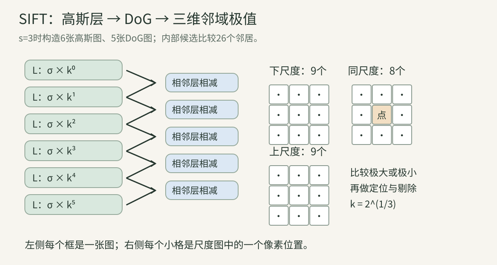
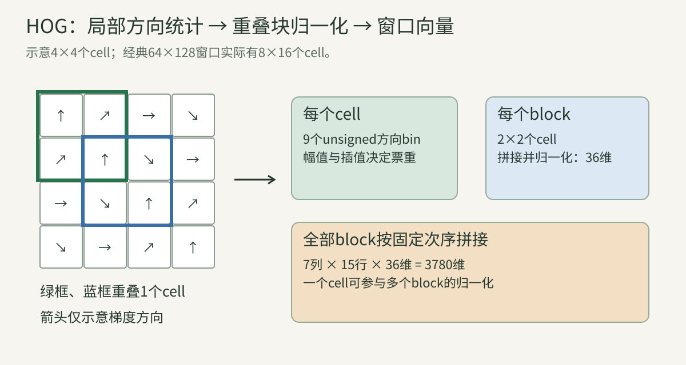
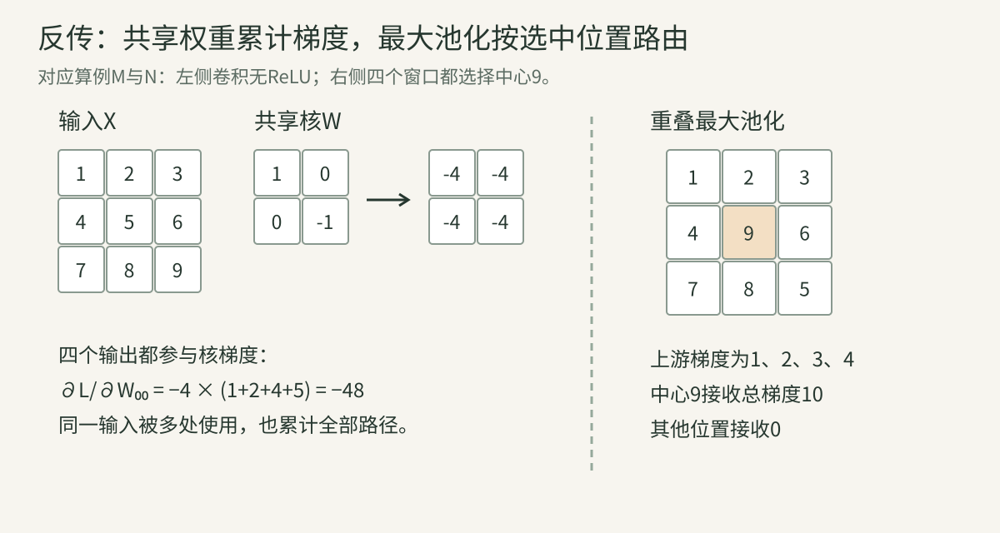
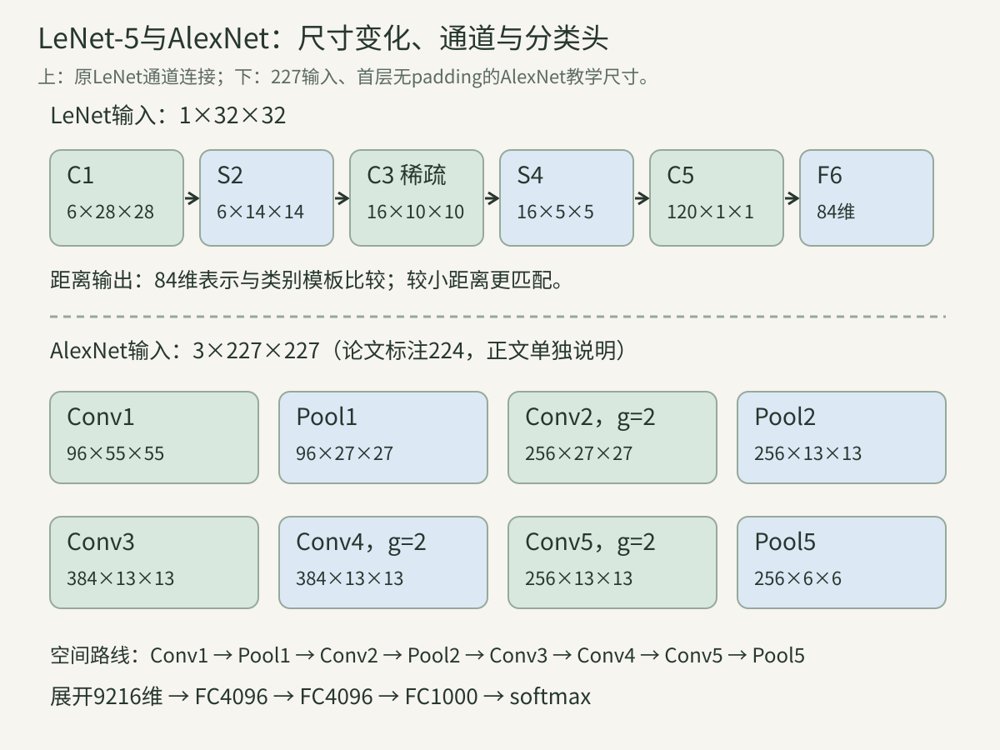

> 前五讲准备了张量、梯度、概率、图像与训练。本讲进入核心方法：怎样把像素变成可以匹配、分类或检测的表示？先理解人为设计的局部描述，再理解任务损失如何学习卷积核。本文的手算与小程序是独立教学示例；历史架构依据原论文核对，不能把教学实现的参数或性能归给原模型。

## 一、先分清我们想解决什么问题

### 1. 匹配、识别和检测不是同一道题

设有两张照片，第一张拍书封面正面，第二张从侧面拍书架。**局部匹配** 要回答：第一张的哪个小区域对应第二张的哪个小区域？匹配结果是坐标对，例如$(x_1,y_1)\leftrightarrow(x_2,y_2)$。

**图像分类** 回答整张照片属于哪个类别，例如“书架”。**目标检测** 要同时输出类别与位置，例如“这一本书”的矩形框。即使局部特征能找到书的几个角，也不等于已经有可靠的整张图像分类器；即使分类器知道图中有书，也未必知道书的位置。

SIFT首先是关键点与局部描述方法；HOG是梯度分布表示，经典行人检测还需分类器和滑窗；LeNet与AlexNet是可学习的卷积网络。阅读论文时，先写出输出对象，才不会拿不同任务的指标互相比较。

### 2. 特征的三个组成部分：在哪里、看多大、怎样描述

如果在全图每个像素提取一个大描述子，计算与存储会很大，而且大片平坦背景提供的信息很少。**关键点检测器** 选择相对有辨识度的位置；**尺度** 决定看多大的周围区域；**描述子** 把区域内容变为数值向量。

一个SIFT特征可以记成：

$$
f=(x,y,\sigma,\theta,d),\qquad d\in\mathbb R^{128}.
$$

$(x,y)$是图像位置，$\sigma$是尺度，$\theta$是主方向，$d$是描述向量。坐标不是描述子的一部分：最近邻匹配主要比较$d$，而几何验证还需要位置、尺度和方向。单纯保存128个数会丢掉后续估计图像变换所需的信息。

### 3. 不变性、等变性与辨识度的取舍

给图像变换$T$、表示函数$F$，若$F(Tx)=F(x)$，称为对$T$不变；若$F(Tx)=T'F(x)$，称为等变，其中$T'$是表示空间中的对应变换。

把局部区域旋转到统一方向，可以减少旋转对描述子的影响；把全图所有像素平均，虽然也对很多变化不敏感，却会丢掉形状。**好的不变性要去掉任务不关心的变化，同时保留区分对象所需的变化。** 匹配书封面时希望适应相机旋转；识别“6”和“9”时不能随便消除所有旋转信息。

实际方法通常只近似满足这些性质。遮挡会删除信息；插值、边界和采样会引入误差；透视变化也不等于平面旋转。不要把“具有鲁棒性”读成数学上对任意变换严格不变。

### 4. 本讲顺序是教学顺序，不是年代顺序

| 方法 | 本讲关注的代表文献 | 表示怎样得到 | 主要学习或拟合的部分 |
| --- | --- | --- | --- |
| LeNet-5 | LeCun等，1998 | 卷积与下采样逐层提取 | 网络权重 |
| SIFT | Lowe，2004详细论文；之前已有1999工作 | 尺度空间、方向归一化与梯度直方图 | 本身不依赖类别监督训练 |
| HOG | Dalal与Triggs，2005 | 密集局部梯度统计与块归一化 | 检测系统中的分类器 |
| AlexNet | Krizhevsky等，2012 | 更大卷积网络端到端学习 | 网络权重 |

先学SIFT/HOG，是为了看清设计表示的逻辑；CNN并不是在SIFT之后才出现。更早的卷积思想、神经认知机和反向传播历史将在历史附录中连接，本讲重点是把这些方法算明白。

## 二、SIFT：先找到稳定的局部坐标系

### 5. 为什么同一个角点需要比较多个尺度

书离相机远时，一个字可能只有几像素；靠近时同一个字可能跨几十像素。只用固定$3\times3$窗口判断局部形状，会在两张图中看到不同内容。尺度空间构造一系列平滑图像，让同一结构在不同尺度上有机会被识别。

二维高斯核为：

$$
G(x,y,\sigma)=\frac{1}{2\pi\sigma^2}
\exp\left(-\frac{x^2+y^2}{2\sigma^2}\right),
\qquad L(x,y,\sigma)=G(\cdot,\cdot,\sigma)*I.
$$

$I$是原图，$*$是卷积。$\sigma$越大，平滑范围越大，小纹理越容易消失。这里并不是直接把高分辨率图缩小，而是先改变我们观察细节的尺度；随后再用降采样节约计算。

### 6. Octave、层间比例与需要多少张图

一个octave覆盖尺度加倍的一段范围。若每段有$s$个尺度间隔，则相邻比例：

$$
k=2^{1/s}.
$$

当$s=3$，$k\approx1.259921$，三次相乘得到2，而不是每层都乘$\sqrt2$。同一octave中通常构造$s+3$张高斯图、得到$s+2$张相邻差分图；多出的层给内部候选点提供上下尺度邻居。

高斯方差可以相加：先用$\sigma_1$平滑，再用$\sigma_{\rm inc}$平滑，等效尺度满足$\sigma_2^2=\sigma_1^2+\sigma_{\rm inc}^2$。所以从$\sigma_1$走到$\sigma_2$，应使用$\sqrt{\sigma_2^2-\sigma_1^2}$的增量模糊，不能重复用完整$\sigma_2$。

下一octave把适当平滑层降采样为宽高的一半。其图像坐标和原图坐标差一个比例；跨octave输出关键点时要换回统一坐标。初始图是否放大、输入已有多少模糊以及边界处理，也都影响数值结果。

图左每个圆角框是一张完整图像，而不是单个像素。实线把相邻高斯层连接成DoG；右侧三个小网格表示候选点的下层、当前层、上层邻域。当前层除中心有8个邻居，上下各9个，共26个。

### 7. DoG为何能近似寻找尺度上的显著结构

定义Difference of Gaussians：

$$
D(x,y,\sigma)=L(x,y,k\sigma)-L(x,y,\sigma).
$$

它比较同一位置在两种平滑程度下的响应。由高斯的尺度导数关系$\partial G/\partial\sigma=\sigma\nabla^2G$，当$k$靠近1时，一阶展开给出：

$$
G(k\sigma)-G(\sigma)
\approx(k-1)\sigma\frac{\partial G}{\partial\sigma}
=(k-1)\sigma^2\nabla^2G.
$$

再与图像卷积，DoG近似一个与尺度归一化LoG成比例的响应。$\nabla^2$是对两个空间方向二阶导数求和；它检测局部强度变化的弯曲程度。这里是近似关系，不是有限层间距下的精确相等。

为什么乘$\sigma^2$？不同尺寸但形状相似的结构，其未经尺度归一化的导数幅值会随尺寸改变；尺度因子帮助把不同尺度的响应放到更可比的范围。仅靠“大值像素”并不能解决大小变化的问题。

### 8. 在三维邻域中找极大与极小

把DoG看作横坐标、纵坐标、尺度三维空间的函数。若中心响应严格大于全部26个邻居，或严格小于全部26个邻居，就产生一个候选点。它可以是正响应或负响应，不能只找亮点。

这一步只得到离散采样网格上的候选。接下来要检查它是否低对比、是否处于不稳定的细长边缘、真正极值是否偏离当前网格。候选多不代表匹配更准确，平坦区域的噪声极值尤其容易不可靠。

### 9. 用泰勒展开估计亚像素与亚尺度位置

令$u=(\Delta x,\Delta y,\Delta s)^T$为相对当前采样位置的偏移，$g$为DoG梯度，$H$为三维Hessian：

$$
D(u)\approx D(0)+g^Tu+\frac12u^THu.
$$

对$u$求导并令零，得到$g+Hu=0$，因此：

$$
\hat u=-H^{-1}g.
$$

实际数值计算解线性方程$H\hat u=-g$，一般无需显式求逆。若偏移跨出当前网格，应重新定位候选并迭代；若线性系统病态或超出可用尺度范围，则不能把结果当稳定点。

代回二次模型，极值处响应可写成$D(\hat u)\approx D(0)+\tfrac12g^T\hat u$。它比直接用网格中心响应更符合局部拟合。阈值必须和图像值域一致：图像为0—1与0—255时，同一个数值阈值没有同样含义。

### 10. 为什么边缘响应高却可能不适合匹配

一条长直边沿垂直方向定位很明确，沿边方向却可能有很多近似位置。只检查DoG幅值会保留大量这种不稳定点。

在空间平面上取$2\times2$Hessian：

$$
H_{xy}=\begin{bmatrix}D_{xx}&D_{xy}\\D_{xy}&D_{yy}\end{bmatrix}.
$$

若两主曲率为$\alpha,\beta$、比值$r=\alpha/\beta$，则：

$$
\frac{\operatorname{tr}(H_{xy})^2}{\det H_{xy}}
=\frac{(\alpha+\beta)^2}{\alpha\beta}
=\frac{(r+1)^2}{r}.
$$

比值很大意味着一个方向弯曲强、另一个方向弯曲弱。设允许主曲率比$r_0=10$，对应阈值12.1；行列式非正时不能直接把这个正曲率比解释套进去，也应排除相应不可靠候选。这是根据DoG二阶导数剔除边缘，与根据图像梯度二阶矩矩阵计算的Harris分数不同。

### 11. 给关键点指定主方向

在该关键点的尺度图上计算局部梯度：

$$
m=\sqrt{g_x^2+g_y^2},\qquad
\theta=\operatorname{atan2}(g_y,g_x).
$$

局部邻域的像素向方向直方图投票，票重既包含梯度幅值，也包含离关键点距离的高斯权重。主峰给出主方向；存在足够强的其他峰时，同一位置和尺度可以产生多个方向的特征。

原方法使用36个方向bin，主峰80%以上的其他局部峰也可生成方向。峰位置可以插值，不应只把方向限制为36个离散值。这里的方向是为了建立局部参考坐标，不是在识别“物体朝哪里走”。[原始SIFT论文，§3—5](https://www.cs.ubc.ca/~lowe/papers/ijcv04.pdf)

### 12. 128维从哪里来：空间位置乘方向分布

以关键点为中心、根据其尺度与主方向采样区域。区域分成$4\times4$个空间cell，每个cell使用8个有向梯度bin：

$$
4\times4\times8=128.
$$

不能理解成“选128个像素灰度”。每一维是某个空间小格子内、某个相对方向的加权梯度统计。相同方向出现在左上与右下，会进入不同维度，因此描述子仍保留粗略空间结构。

先把采样坐标旋转到主方向参考系，再把梯度方向减去主方向；这样一幅图整体旋转时，局部坐标与方向统计能更接近原来。但尺度与方向估计错误也会传播到描述子，归一化不保证所有情况下稳定。

### 13. 三线性投票如何减少边界突变

如果一个像素从cell边界左侧移动极小距离到右侧，硬分配会把整票突然换到另一个cell。方向刚跨bin边界，也有同样问题。

可对空间$x$、空间$y$和方向三个坐标分别线性插值。每个维度贡献到两个相邻位置，最多形成$2\times2\times2=8$份投票。三个线性权重相乘，例如$(1-a)(1-b)(1-c)$，给其中一个bin。

在内部区域，八个权重之和为$[(1-a)+a][(1-b)+b][(1-c)+c]=1$，因此没有凭空增加总票重。空间区域边缘可能把一部分票投到描述范围之外，需按实现处理；方向坐标则是环，接近$360^\circ$时要接回$0^\circ$。

### 14. 归一化、截断与光照鲁棒性

将非负描述向量$d$除以其L2范数；把过大的分量限制在阈值，再归一化。这避免单个很强边缘支配整个描述子。原方法常用截断阈值0.2。

若图像由$I$变为$aI+b$、$a>0$，忽略边界和量化时，梯度中的$b$会抵消，幅值乘$a$、方向不变；L2归一化可以抵消公共正比例$a$。如果$a<0$，方向会反转；若存在阴影、饱和、非线性相机响应或局部遮挡，变化也不是共同的$a,b$，不能沿用这个简单证明。

截断使归一化后的大分量减少，再归一化则恢复总体尺度。不能在未归一化的原始梯度上直接用0.2阈值，也不能把向量归一化与图像做均值方差标准化混为一谈。

### 15. 最近邻比值检验究竟检验什么

对查询描述子$q$，在候选图的描述子中找最近和次近的两个，距离为$d_1\le d_2$。保留：

$$
d_1/d_2<\tau.
$$

若$d_1$与$d_2$非常接近，查询特征难以区分这两个候选，可能来自重复纹理。比值检验考察**相对辨识度**，不是直接预测“有多少概率匹配正确”。$\tau$也不是任何数据集都固定最优的常数。

L2距离和平方L2距离的阈值不能混用。若条件是$d_1/d_2<0.8$，改用平方距离应检查$d_1^2/d_2^2<0.64$。还要处理候选少于两个、$d_2=0$、描述子为空等情况。

### 16. 匹配之后还需几何与证据检查

描述相近的局部块可能来自同一窗格的不同位置。用坐标对检验仿射、单应或其他几何模型，可以找出更一致的一组匹配。选择模型应依据场景：平面与纯旋转条件常适合单应，任意三维场景不保证一个单应解释全图。

RANSAC的教学过程是：抽取足够拟合模型的少量匹配，估计模型，用全部匹配计算几何残差，记录一致点，再用较好的一致集优化。若单应最小样本为4点、内点比例$w$、随机采样独立，则成功概率$p$要求：

$$
N\ge\frac{\ln(1-p)}{\ln(1-w^4)}.
$$

退化样本、重复点、共线点和非独立采样都会破坏简化假设。这一段解释现代常见匹配后处理；不能把它写成SIFT原论文全部识别系统。原论文还讨论了姿态投票与几何拟合的识别流程。

### 17. 使用库时要读阈值的实际定义

OpenCV 4.13的SIFT接口默认有3个octave层，contrastThreshold参数在内部会除以层数；原论文的数值阈值与接口参数因此不能机械抄成相同数字。官方说明给出：3层时若要对应论文0.03，接口参数设0.09。

edgeThreshold越大通常允许保留更多边缘候选；contrastThreshold越大则要求更强对比度。这两个“threshold”的变化方向并不相同。SIFT描述子即便存为8位数值，也不因此变成二进制位串，不能仅根据存储dtype选Hamming距离。[OpenCV SIFT接口及参数说明](https://docs.opencv.org/4.13.0/d7/d60/classcv_1_1SIFT.html)

## 三、HOG、词袋与分类器：把表示接到任务上

### 18. HOG为什么常在规则网格上计算

HOG即Histogram of Oriented Gradients。它统计局部边缘方向及强度，也保留粗略空间位置。经典行人检测窗口中，头、肩、躯干、腿的位置关系很重要；规则网格让这些形状能进入固定维度的向量。

SIFT通常先选择关键点并建立尺度、方向参考；经典HOG检测则在固定窗口密集统计，方向和尺度鲁棒性更多依赖数据、窗口金字塔与训练。因此二者虽都使用梯度直方图，也不可以互换任务接口。

HOG表示本身不输出“人”的概率。一个完整检测器还要计算分类分数、扫描不同位置与尺度、设阈值并合并重复框。

### 19. 梯度、方向周期与颜色通道

用中心差分近似梯度：$g_x=I(x+1,y)-I(x-1,y)$，$g_y=I(x,y+1)-I(x,y-1)$。方向由atan2确定，幅值为$\sqrt{g_x^2+g_y^2}$。边界像素怎样处理必须明确，否则不同实现的边缘响应会不同。

unsigned方向把$\theta$和$\theta+180^\circ$看成同一方向；signed方向保留$360^\circ$周期。unsigned适合忽略边缘从亮到暗还是从暗到亮的差别，但这也删除了梯度极性信息。

RGB图像可以先转灰度，也可以分别算三个通道梯度，再选幅值最大的通道。在原HOG实验中的一个关键设计就是颜色通道梯度的处理；不能默认所有库与训练配置都等价。

### 20. 从像素投票到cell与block

每个cell聚合方向直方图。一个block包含相邻几个cell，拼接后归一化；相邻block通常重叠。因此一个cell可能在不同block中被多次使用，每次按不同邻域上下文归一化。

这种重复不是误把特征复制了几次，而是让局部对比度变化在不同邻域中得到处理。若只有整图一次归一化，亮区域可能压制暗区域；若每个像素各自归一化，梯度强弱的信息又可能几乎消失。

假设block向量$v$，带稳定项的L2归一化为：

$$
\hat v=\frac{v}{\sqrt{\|v\|_2^2+\epsilon^2}}.
$$

L2-Hys再截断较大分量并重新归一化。$\epsilon$的意义是避免全零block除零，并控制很小梯度区域的响应；不能把它当可忽略的装饰符号。

图左箭头表示局部梯度方向；中间每个cell有自己的方向统计，彩框表示两个重叠block。右边的3780维来自全部block逐个展开，不是只有9个方向计数。

### 21. 经典3780维表示逐项计算

使用宽64、高128的窗口，cell为$8\times8$，block为$2\times2$个cell，block步长1个cell、每cell9个方向bin。窗口有8列16行cell；block可以放在7列15行位置，每块36维：

$$
(8-2+1)(16-2+1)(2\times2\times9)=7\times15\times36=3780.
$$

若block不重叠，维度就不同。若将宽高、padding、cell尺寸换掉，也不能继续用3780。参数名称相同还不保证具体归一化、插值、gamma校正和梯度边界相同，复现需完整配置。[HOG原论文，§5—6](https://lear.inrialpes.fr/people/triggs/pubs/Dalal-cvpr05.pdf)

### 22. 线性SVM怎样使用这3780个数

令$h\in\mathbb R^{3780}$、类别$y\in\{-1,+1\}$，线性分数为$s=w^Th+b$。预测通常根据$s$是否超过某个阈值，而不是根据某一维HOG是否“像腿”。

一种常见训练写法是：

$$
\mathcal L(w,b)=\frac12\|w\|^2+C\sum_{i=1}^n
\max(0,1-y_i(w^Th_i+b)).
$$

$C$控制错分与小间隔的惩罚相对权重；若实现用平均loss，$C$的对应关系随样本数改变。$y_is_i$是带标签的间隔分数：正确且远离边界可令hinge loss为零，正确但太接近边界仍会受到惩罚。

hinge活跃时，对$w$的该样本梯度是$-y_ih_i$，对$b$是$-y_i$；不活跃时为零，边界点使用子梯度。SVM不会直接输出校准后的概率；需要概率时可在独立验证数据上拟合校准映射。

### 23. 滑窗、图像金字塔与困难负样本

一个$64\times128$窗口不能直接覆盖所有远近的人。可以缩放图像形成金字塔，在每层用固定窗口扫描，再把框坐标换回原图。滑动步长越小，覆盖越密，计算量与重复检测也越多。

先训练的分类器可能把栅栏、树枝、衣架误认为人。把这些高分错误窗口收集为hard negatives，再训练，使模型面对真实容易混淆的背景。困难负样本应来自训练部分；从测试图中挖负例会把测试信息用于训练。

最后用NMS或其他框合并机制处理重叠输出。窗口分类准确率、每窗口假阳性FPPW、每图假阳性FPPI、检测AP和不同假阳性水平下漏检率不是同一个指标。原HOG实验采用的DET曲线不能直接替换成现代目标检测AP。

### 24. 从数量不定的局部描述子到固定维度：视觉词袋

一张图可能有100个SIFT点，另一张有500个。线性分类器通常需要固定长度输入。视觉词袋先学习$K$个视觉词，再把所有局部描述子映射到这些词，统计次数。

设训练描述子为$d_i$、聚类中心为$c_k$，k-means最小化：

$$
\sum_i\|d_i-c_{a_i}\|^2,
\qquad a_i\in\{1,\ldots,K\}.
$$

交替执行：固定中心，每个$d_i$分到最近中心；固定分配，每个中心改成所属向量的平均。它会停到局部解，初始化、空聚类处理和随机种子都会影响词表。词表也属于训练得到的对象，不能在测试图上重新拟合。

图像直方图$h_k=\sum_i\mathbf1[a_i=k]$得到$K$维表示，可除以总特征数以减少“点多的图数值更大”的影响。TF-IDF还降低在很多图里都常出现的词的权重；IDF须从允许使用的训练语料计算。

### 25. 词袋丢掉什么，空间金字塔又保留什么

把图中两个描述子的左右位置交换，普通词袋计数不变。因此它较适合汇总局部内容，却不能直接分辨相同部件的不同排列。

一个教学扩展把图分成全图、$2\times2$和$4\times4$网格，每格单独统计词袋再拼接。格子总数为$1+4+16=21$，每格$K$维，总长$21K$。越细的网格保留更多布局，也更容易受平移、裁剪与稀疏计数影响。

词袋、VLAD和Fisher Vector在聚合的信息上不同：计数、相对中心的残差、一套生成模型参数相关的统计不是同一件事。这些聚合方法会在检索章节进一步推导；本讲用词袋建立“局部特征怎样变成整图输入”的桥梁。

## 四、CNN：让损失决定卷积核

### 26. 学习特征与学习分类器有什么差别

手工特征流程可写成$x\xrightarrow{\phi}h\xrightarrow{w}z$，其中$\phi$通常固定，监督标签主要训练分类器。CNN写成$x\xrightarrow{\phi_\theta}h\xrightarrow{w}z$，损失既更新$w$，也通过链式法则更新$\theta$。

$$
\frac{\partial\mathcal L}{\partial\theta}
=\frac{\partial\mathcal L}{\partial h}
\frac{\partial h}{\partial\theta}.
$$

这样表示会适应任务与数据。例如数字分类会奖励能区分闭环和开口的特征。但学习不意味着一定学到人期待的语义：背景、设备、压缩痕迹与标签泄漏也可能得到较小训练损失，第05讲的验证问题仍然存在。

### 27. 多通道卷积怎样计算

省略batch、使用stride1和有效范围，下式描述深度学习库常用的互相关：

$$
Y_{o,u,v}=b_o+
\sum_{c=1}^{C_{\rm in}}\sum_{i=0}^{k_h-1}\sum_{j=0}^{k_w-1}
W_{o,c,i,j}X_{c,u+i,v+j}.
$$

一个输出通道不是只看一个颜色通道，而是把其所连接的全部输入通道加权求和。$W$的shape是$(C_{\rm out},C_{\rm in},k_h,k_w)$，每个输出位置使用同一组权重。

全连接卷积层参数量为$C_{\rm out}(C_{\rm in}k_hk_w+1)$，最后的1是每个输出通道的偏置。输出像素变多通常增加计算与激活存储，却不会为共享卷积核增加新的自由参数。

### 28. 权重共享为什么产生平移等变

若输入平移$t$个像素，每个卷积位置仍使用同一个核，在无限网格或适当内部区域上，输出也平移$t$。这就是等变：特征的位置跟随物体移动，而非直接消除位置。

padding边界、裁剪、stride大于1和下采样会限制这个说法。stride2时输入平移1像素可能改变采样相位，不一定对应输出整数平移。全连接分类头和局部池化也不自动使网络对任意平移严格不变。

这种偏好就是一种归纳偏置：同样的局部模式可以出现在任何位置。相比让每个位置学习完全独立权重，CNN通常更有效利用图像的局部结构；但仍需要数据、正则化和合适目标。

### 29. 卷积的反向传播为什么要累计

设上游梯度$\Delta_{o,u,v}=\partial\mathcal L/\partial Y_{o,u,v}$，同一个卷积权重被多个位置使用，所以：

$$
\frac{\partial\mathcal L}{\partial W_{o,c,i,j}}
=\sum_{u,v}\Delta_{o,u,v}X_{c,u+i,v+j},
\qquad
\frac{\partial\mathcal L}{\partial b_o}=\sum_{u,v}\Delta_{o,u,v}.
$$

一个输入像素也可能进入多个输出的窗口，因此它的梯度要把所有使用该像素的路径相加：

$$
\frac{\partial\mathcal L}{\partial X_{c,a,b}}
=\sum_{o,u,v,i,j:\ a=u+i,\ b=v+j}
\Delta_{o,u,v}W_{o,c,i,j}.
$$

batch维存在时还要对各样本的权重梯度求和，或与loss的平均约定一致地缩放。若前向有ReLU，上游$\Delta$还需先乘ReLU门；不能只看卷积公式忽略非线性。

### 30. ReLU、最大池化与平均池化的梯度

ReLU为$\max(0,z)$，在$z>0$时导数1，$z<0$时导数0，零点使用实现指定的子梯度。多层纯线性卷积即使叠很深，整体仍是线性映射，非线性才允许表达更复杂的组合关系。

最大池化选择窗口内最大值，反传将上游梯度送到被选位置；其他位置为零。若有并列最大值，函数不可微，应说明实现如何选子梯度，不能把“平均分配”当所有库的共同规则。重叠窗口若选择同一像素，其梯度仍要相加。

平均池化把上游梯度按有效元素数量分配。带padding时，分母是否包含补零区域会改变结果。现代固定池化通常没有训练参数；原LeNet的下采样层还带可学习缩放与偏置，是不同运算。

图左一组核被四个输出位置使用，其梯度是四项之和；图右只有最大值接收该窗口的上游梯度。箭头表示梯度路径，不能把箭头数量误读成参数数量。

### 31. 池化、步长与抗混叠的联系

减小空间尺寸可以减少后续计算，并提高后续单元覆盖的原图范围。第04讲指出，降采样前没有适当低通可能出现混叠；最大池化也不能简单等同于理想低通滤波。

对分类而言，一些位置变化可以容忍；对细边缘、关键点、分割与定位而言，粗分辨率可能丢失重要信息。后续FPN、跳接、HRNet等结构会保留或融合不同分辨率，本讲先看清分辨率下降带来的收益与损失。

## 五、LeNet-5：一张32×32图怎样到类别

### 32. 原始网络的尺寸与参数逐层核算

以下是1998论文LeNet-5的连接与尺寸，不含输入的batch维。C表示卷积，S表示下采样，F表示全连接。

| 层 | 输出shape：通道×高×宽或向量 | 运算与连接 | 可训练参数 |
| --- | --- | --- | ---: |
| 输入 | $1\times32\times32$ | 灰度图 | 0 |
| C1 | $6\times28\times28$ | $5\times5$有效卷积 | $6(25+1)=156$ |
| S2 | $6\times14\times14$ | $2\times2$下采样；每图缩放与偏置 | $6\times2=12$ |
| C3 | $16\times10\times10$ | $5\times5$，指定稀疏通道连接 | $60\times25+16=1516$ |
| S4 | $16\times5\times5$ | 下采样；每图缩放与偏置 | $16\times2=32$ |
| C5 | $120\times1\times1$ | 与16个输入图全部连接的$5\times5$卷积 | $120(16\times25+1)=48120$ |
| F6 | 84 | 全连接 | $84(120+1)=10164$ |
| 输出 | 10个距离惩罚 | 类别对应的Euclidean RBF | 固定类别模板的核算中不计训练参数 |

前六层参数和正好为60000。原论文描述输出模板手工选择、至少初始保持固定；如果在其他实验中把模板也训练，必须另计参数，不应继续照抄60000。论文正文及表1可在[作者文献页面](https://leon.bottou.org/papers/lecun-98h)找到；本文核对的原文还可由[论文PDF镜像](https://gwern.net/doc/ai/nn/cnn/1998-lecun.pdf)阅读。

图上方显示LeNet尺寸，突出C3为稀疏通道连接。下方AlexNet采用为尺寸推导明确指定的227教学输入；它与原论文标注224的差别会在第37节说明。每个框的数字是表示shape，并非参数量。

### 33. C3为什么只有1516个参数

若16个输出图都连接全部6个输入图，则参数应为$16(6\times25+1)=2416$。原网络采用不同输入子集：6个输出连接3个输入，另9个输出连接4个输入，最后1个输出连接6个输入。因此通道间的卷积核总数：

$$
6\times3+9\times4+1\times6=60.
$$

每个通道对有25个权重，共1500；再加16个输出偏置，得1516。这里的稀疏不是把整张空间图删掉，而是规定哪些输入通道参与某个输出通道。

它限制参数并促使不同输出看到不同组合。这个特定连接表也不是现代groups=2的整齐分组：输入集合会重叠，连接数量也不完全相同，不能用普通group卷积参数直接表示全部原设计。

### 34. 原始下采样与现代平均池化的差别

用一个特征图的$2\times2$区域表示原下采样的核心结构：

$$
s=\sum_{i=1}^4x_i,
\qquad a=\alpha s+\beta,
\qquad y=f(a).
$$

$\alpha,\beta$对该特征图共享且可学习，$f$是非线性。若把求和改为平均并相应重参数化$\alpha$，表达能力可以等价，但具体实现和初始化数值不同。纯AveragePool只输出平均数，没有这两个可训练参数与后续非线性。

给上游梯度$\delta$，则$\partial\mathcal L/\partial\alpha=\delta f'(a)s$，$\partial\mathcal L/\partial\beta=\delta f'(a)$，对每个$x_i$为$\delta f'(a)\alpha$。所有空间区域还要累计共享参数的梯度。

### 35. C5为何既像卷积又像全连接

S4为$16\times5\times5$，C5的核覆盖全部$5\times5$空间，输出只有一个位置，所以在这一个输入尺寸上等价于对400维展开向量做120维仿射映射。

但保留“卷积”写法，输入变大时仍能让同一个核在多个空间位置滑动；参数不随位置增加。若直接把输入flatten送进固定尺寸全连接，改变图像大小就不能沿用原输入维度。这是“同一尺寸时运算等价”和“输入改变时接口行为等价”的区别。

原网络使用平滑的饱和非线性，论文写成scaled tanh。现代教程用ReLU有教学与实现便利，却改变梯度、输出范围和训练行为。

### 36. 距离输出、类别模板与整篇论文的系统视角

原输出不是今天常见的10维线性logits加softmax，而是：

$$
E_k(h)=\sum_{j=1}^{84}(h_j-c_{k,j})^2.
$$

$c_k$是类别模板，距离较小代表更匹配。输出84维与论文使用$7\times12$字符模板有关。可以构造教学概率$p_k\propto\exp(-E_k/T)$，但这只是帮助理解能量与分类的关系，不能说它就是论文全部训练目标。

只最小化正确类别距离，可以把特征拉向模板；还需要考虑其他类别、拒识与错误候选，才能建立有区分力的系统。原论文讨论了判别性目标，并把识别、分割和语言约束组成Graph Transformer Network（GTN）。这里的“Transformer”指可组合的图变换系统，与2017年的注意力Transformer不是同一概念。

字符已经裁成单字时，分类相对直接；真实字符串可能有不同切分方式。系统可把候选切分和识别结果组成路径，对完整候选计算代价，让全局训练或选择处理局部歧义。本讲后面的案例用两条路径解释这种思想；OCR与序列建模章节会补全相关算法。

## 六、AlexNet：更大数据上的可训练表示

### 37. 224还是227：先把尺寸约定写清楚

2012原论文正文与图2标注输入$224\times224\times3$，第一层核11、stride4，而图中第一层空间尺寸又是55。若采用通常的对称padding公式：

$$
H_{\rm out}=\left\lfloor\frac{H+2p-k}{s}\right\rfloor+1,
$$

直接令$H=224,p=0,k=11,s=4$只得到54。改为$H=227,p=0$得到55，或者明确采用其他padding/边界约定也可能得到55。**仅凭论文示意图，不能断言原程序把224偷偷改成227。**

以下用227、首层无padding的教学约定，把图中55→27→13→6的尺寸链算清；历史原文仍按224记录。复现具体权重时，应以对应程序、预处理与边界行为为准。[AlexNet原论文，图2及§3.5](https://proceedings.neurips.cc/paper_files/paper/2012/file/c399862d3b9d6b76c8436e924a68c45b-Paper.pdf)

### 38. 原始通道连接下的参数表

取上节227教学尺寸，卷积2/4/5为两组连接；卷积3连接全部前层通道。下表的参数同时说明连接设计，不能只记“五层卷积”。

| 层 | 输出shape | 核、步长、padding、组数 | 参数 |
| --- | --- | --- | ---: |
| Conv1 | $96\times55\times55$ | 11，4，0，1 | 34944 |
| Pool1 | $96\times27\times27$ | 最大池化3，步长2 | 0 |
| Conv2 | $256\times27\times27$ | 5，1，2，2 | 307456 |
| Pool2 | $256\times13\times13$ | 最大池化3，步长2 | 0 |
| Conv3 | $384\times13\times13$ | 3，1，1，1 | 885120 |
| Conv4 | $384\times13\times13$ | 3，1，1，2 | 663936 |
| Conv5 | $256\times13\times13$ | 3，1，1，2 | 442624 |
| Pool5 | $256\times6\times6$ | 最大池化3，步长2 | 0 |
| FC6 | 4096 | $9216\rightarrow4096$ | 37752832 |
| FC7 | 4096 | $4096\rightarrow4096$ | 16781312 |
| FC8 | 1000 | $4096\rightarrow1000$ | 4097000 |

总参数为60965224。所有偏置都计入；固定超参数的LRN与池化不另加训练参数。FC6单独就占约61.9%，这说明网络激活的大空间分辨率与参数集中在哪些层是两个不同问题。

分组卷积的参数公式为$C_{\rm out}((C_{\rm in}/g)k^2+1)$，要求通道能按组划分。原两GPU连接也反映当时显存与通信约束；不能把它读成两个完全独立网络，Conv3及全连接层会连接跨组信息。

### 39. ReLU、LRN和重叠池化分别解决什么

ReLU在正区间不饱和，能缓解某些饱和激活带来的训练困难；它仍可能产生长期不活跃单元，也不保证所有深度都好训练。

Local Response Normalization（LRN）的典型跨通道形式为：

$$
b^i_{x,y}=\frac{a^i_{x,y}}{
\left(k+\alpha\sum_{j\in\mathcal N(i)}(a^j_{x,y})^2\right)^\beta}.
$$

它在同一空间位置用邻近通道响应调节当前通道幅值，是一种竞争式归一化。它不是BN的batch统计，不是LN的每样本均值方差，也没有自动说明“所有现代模型必须用LRN”。

重叠最大池化使用核3、stride2，相邻窗口共享输入位置。它改变局部聚合和下采样，与核2、stride2的非重叠池化不同。ReLU改变非线性，LRN改变响应尺度，池化改变空间表示，三者不能合并成一个“让网络更强”的模糊说法。

### 40. 数据增强、Dropout与监督目标

分类头输出1000个logits，softmax与交叉熵训练正确类别。训练图中的随机裁剪与水平反射，要求同一物体在一定视角与位置变化下仍保留标签；若裁掉主体或镜像改变任务语义，这个假设可能失败。

原工作还使用基于RGB像素PCA的颜色扰动。教学形式是$\Delta I=\sum_i\alpha_i\lambda_i p_i$，同一张图的像素共享扰动，其中$p_i,\lambda_i$来自颜色协方差，$\alpha_i$是随机系数。这与把每个像素独立加高斯噪声不同，也与独立随机调三个颜色通道不完全相同。

Dropout用于前两个全连接层，减少对固定神经元组合的依赖。原文训练时随机置零、测试时缩放；现代inverted dropout通常在训练时除以保留概率、测试时保持不变。两者的期望尺度可以对应，但代码行为不能混写。

这些选择与优化、数据规模、计算实现共同构成结果。不能把2012的提升只归因于“用了ReLU”，也不能把更多裁剪样本视为新增了同等数量的独立照片。

### 41. 看表2时，区分单模型、集成与额外数据

原论文ILSVRC-2012表2给出单CNN验证top-5错误18.2%；多个网络平均以及部分网络使用额外ImageNet预训练数据，取得比赛测试top-5错误15.3%。因此“一个标准AlexNet单模型错误15.3%”是不准确的转述。

对一张图做多裁剪平均，是同一个模型的多视图推理；对多个独立网络平均，是模型集成。两者都增加推理计算，但不是同一策略。top-5 error只问真类别是否进入最高五类，不代表类别置信度校准，也不包含位置检测。

对今天的改进实验，应固定训练/验证划分、额外数据、参数预算、输入视图数量、训练预算和评估协议。历史比赛比较说明当时某个系统结果更好，不自动证明只改一个组件就能得到同样差值。

### 42. Torchvision的AlexNet为什么参数不同

截至本讲核对的Torchvision 0.29官方源码，模型通道为64、192、384、256、256，卷积没有原来的两组连接；首层padding2，末端有AdaptiveAvgPool到$6\times6$。源码明确说明实现基于后来的“One weird trick”设计。

它记录61100840个参数，与上面的60965224不同。这不是前表算错，也不意味着相近参数量就有相同计算图。名称、通道、group、normalization、pool、classifier与权重预处理都应一起记录。[Torchvision官方AlexNet源码](https://docs.pytorch.org/vision/stable/_modules/torchvision/models/alexnet.html)

可以用官方模型快速实验，但要把“运行现代库中的alexnet”和“复现2012原系统”分清。后续VGG、Inception与ResNet也会遇到论文、作者代码、库模型和训练recipe不完全一致的问题。

## 七、把容易看懂却容易算错的地方完整算一遍

### 算例A：从一层高斯图走到下一层

设当前总模糊尺度为1.6，每octave有3个尺度间隔。那么下一层目标尺度：

$$
\sigma_2=1.6\times2^{1/3}\approx2.015874.
$$

已平滑过的图不能再直接用2.015874模糊。所需增量：

$$
\sigma_{\rm inc}
=\sqrt{2.015874^2-1.6^2}\approx1.226273.
$$

如果错误地再使用完整2.015874，最后总尺度约为$\sqrt{1.6^2+2.015874^2}\approx2.573664$，超过计划。这会改变DoG响应、关键点检测与匹配，而不是仅仅多做一点计算。

连续高斯具有方差相加性质；离散截断核、有限边界和已知输入模糊的估计会带来数值差异。复现时应记录采用的尺度定义与核截断规则。

### 算例B：极值不一定刚好落在采样中心

构造一个局部二次DoG教学模型：

$$
D(0)=0.05,\quad g=(0.02,-0.04,0.01)^T,
\quad H=\operatorname{diag}(2,4,1).
$$

分别解三个方程，得到$\hat u=(-0.01,0.01,-0.01)^T$。这意味着局部拟合极值偏离采样点，而且第三分量是尺度坐标偏移，不是图像空间的第三个像素方向。

$$
g^T\hat u=-0.0002-0.0004-0.0001=-0.0007,
\quad D(\hat u)=0.05-0.00035=0.04965.
$$

若教学阈值为0.03，该点通过幅值检查。再考虑两个空间Hessian：$H_1=\operatorname{diag}(4,1)$与$H_2=\operatorname{diag}(20,1)$。前者trace²/det为$25/4=6.25$，后者为$441/20=22.05$。以12.1为门槛时，前者通过、后者剔除。

这说明“对比度足够”与“边缘方向定位稳定”是两项独立检查。算例中的对角Hessian是为了便于手算，真实Hessian通常有混合导数。

### 算例C：梯度幅值、方向和方向插值

一个像素的梯度为$(g_x,g_y)=(1,\sqrt3)$，则幅值为2，方向$60^\circ$。若有向直方图bin中心每10度一个，60度正好投在对应bin。

再设一个幅值2、方向$33^\circ$的梯度，邻近中心为30和40度。忽略额外空间权重，投票分为：

$$
2\frac{40-33}{10}=1.4,\qquad
2\frac{33-30}{10}=0.6.
$$

两票和为2。若该像素另有高斯空间权重0.5，则分别变成0.7与0.3。角度靠近360度时应在350度与0度之间环绕，不能把0度看成距离很远的另一端。

这里用明确指定的bin中心解释机制；具体实现的bin中心、方向单位与平滑操作应核对，不要把示例编号直接当库函数数组编号。

### 算例D：三线性投票的八个权重

设一个样本的cell横向相对坐标$a=0.3$，纵向$b=0.4$，方向相对坐标$c=0.25$，幅值与高斯加权合计为10。三个维度邻近权重分别为$(0.7,0.3)$、$(0.6,0.4)$、$(0.75,0.25)$。

先看方向的前一个bin，在四个空间cell中的票为：

$$
10\times0.75\times
\begin{bmatrix}0.7\times0.6&0.3\times0.6\\
0.7\times0.4&0.3\times0.4\end{bmatrix}
=\begin{bmatrix}3.15&1.35\\2.10&0.90\end{bmatrix}.
$$

方向后一个bin的四票为$\begin{bmatrix}1.05&0.45\\0.70&0.30\end{bmatrix}$。八票加起来为10。横、纵、方向三个索引共同确定描述子维度，所以这不是把一个方向直方图复制四遍。

当特征发生小移动时，这些权重连续变化，缓解硬分配的突变；但直方图采样和区域截断仍然会有误差。

### 算例E：截断之后为什么还要归一化

用4维教学向量$v=(3,4,0,0)$观察操作；真实SIFT有128维。

第一次L2归一化得到$(0.6,0.8,0,0)$。用0.2截断后得到$(0.2,0.2,0,0)$，范数为$\sqrt{0.08}$；再次归一化：

$$
\left(\frac1{\sqrt2},\frac1{\sqrt2},0,0\right).
$$

新分量又大于0.2，并不说明实现错误：0.2是中间截断值，并非第二次归一化后每个分量的最终上限。这种很稀疏的小向量还说明，多维分布与少数非零维度时截断效果不同。

如果全向量为零，应使用稳定项或显式分支，不能直接除以零。全零向量本身也缺少辨识信息，不应仅因为两个全零向量距离为零就确认匹配。

### 算例F：相对辨识度不能代替绝对可信度

查询1的两个最近距离是3与3.1，比值约0.9677；查询2是3与5，比值0.6。以0.8为阈值，前者拒绝，后者通过。二者最佳距离都为3，区别来自候选是否容易混淆。

查询3距离为8与20，比值0.4，也能通过比值检验，但最佳距离很大，仍可能是不正确匹配。这提示比值、绝对距离、互相最近邻、几何一致性是不同条件，可根据验证任务组合。

若库返回的是平方距离，查询2的比值为$9/25=0.36$，要与$0.8^2=0.64$比较。把0.8直接用在平方距离上，会实际放宽原标准。

### 算例G：单应RANSAC需要多少随机尝试

假设50%的匹配是真内点，四点样本全部为内点的概率为$(0.5)^4=0.0625$。一次抽样失败概率0.9375，$N$次都失败为$0.9375^N$。

希望至少成功一次的概率为99%，要求：

$$
1-0.9375^N\ge0.99,
\qquad N\ge71.3554.
$$

所以至少72次。若内点比例下降，需要的次数会迅速增加。正确描述子的匹配更好，并不只提升匹配精度，也可能减少几何估计所需采样。

但抽到四个共线内点仍可能无法稳定拟合单应；内点比例未知时也不能照搬72。公式只描述指定简化模型，真实实现要检查退化和残差阈值。

### 算例H：HOG的unsigned方向与环绕

为教学明确定义9个bin中心$0,20,\ldots,160$度，周期180度。幅值6、方向30度，在20与40度各投3。

幅值4、方向170度，在160与180度之间各投2，而180度与0度等价。因此后者给160度bin加2、给0度bin加2。直方图四个非零分量为$h_0=2,h_1=3,h_2=3,h_8=2$。

总和10，等于两个梯度幅值之和。如果第二个梯度方向是$-10^\circ$，取模后仍为170度；若是350度，同样得到170度。角度制与弧度制必须转换，不能直接把atan2的弧度值当作度。

### 算例I：同一个cell为什么在不同block里数值不同

某cell只有两个方向计数$(3,4)$。它与全零邻居组成block时，L2范数5，该cell对应分量是$(0.6,0.8)$。

它与一个含强梯度12的邻居组成另一block时，整体范数$\sqrt{3^2+4^2+12^2}=13$，同一cell对应分量为$(3/13,4/13)$，约$(0.2308,0.3077)$。

所以重叠block保留的是这个cell在不同局部对比度上下文中的相对强度。没有重新计算该cell的原始梯度，变化来自拼接向量的归一化分母。

### 算例J：一次线性SVM更新

用2维向量简化HOG，$h=(2,1)$，$y=+1$，$w=(0.1,0.2)$，$b=-0.1$。分数$s=0.1\times2+0.2-0.1=0.3$，hinge loss为0.7。

设目标$\tfrac12\|w\|^2+\max(0,1-ys)$，则当前总loss为$0.025+0.7=0.725$。hinge活跃，所以梯度：

$$
\nabla_w\mathcal L=w-yh=(-1.9,-0.8),
\qquad \nabla_b\mathcal L=-1.
$$

学习率0.1得到$w'=(0.29,0.28),b'=0$。新分数$0.29\times2+0.28=0.86$，新hinge为0.14，总loss为$\tfrac12(0.29^2+0.28^2)+0.14=0.22125$。

一次更新改善这个样本，但不能推出测试集变好。真实训练会同时面对正负样本，且困难负样本可能改变最佳边界。

### 算例K：词表训练与图像编码是两个阶段

用一维局部描述子$(0,2,8,10)$演示k-means，初始两中心为0与8。最近分配得到两组$\{0,2\}$、$\{8,10\}$，更新中心为1与9。新的平方误差和为$1+1+1+1=4$。

固定词表$(1,9)$后，新图有三个描述子$(0.2,1.8,8.7)$，分别分到词1、词1、词2。计数$(2,1)$，按总数归一化为$(2/3,1/3)$。

若把这三个局部块重新排列位置，词袋仍不变。若另一图只有两个描述子$(0.2,8.7)$，归一化词袋是$(1/2,1/2)$，可见归一化消除总数尺度，却保留了词频比例差异。

不能为了让新图更好编码而把中心重新拟合；这样输入空间本身随测试图改变，训练分类器的特征含义也会漂移。

### 算例L：两个通道的1×1卷积并不等于逐通道复制

输入通道$X_1=\begin{bmatrix}1&2\\3&4\end{bmatrix}$、$X_2=\begin{bmatrix}4&3\\2&1\end{bmatrix}$，核权重为$(2,-1)$，偏置0。输出：

$$
Y=2X_1-X_2=\begin{bmatrix}-2&1\\4&7\end{bmatrix}.
$$

共有2个权重和1个偏置，不是四个空间位置各用不同的3个参数。若目标为$\mathcal L=\tfrac12\sum Y^2$，上游梯度就是$Y$，loss为35。

第一通道权重梯度$-2\times1+1\times2+4\times3+7\times4=40$；第二通道梯度$-2\times4+1\times3+4\times2+7\times1=10$；偏置梯度$-2+1+4+7=10$。

输入通道梯度分别为$2Y$与$-Y$。同一权重影响四个位置，因此训练时必须累计四份贡献。

### 算例M：2×2卷积的前向、权重梯度与输入梯度

输入$X=\begin{bmatrix}1&2&3\\4&5&6\\7&8&9\end{bmatrix}$，核$W=\begin{bmatrix}1&0\\0&-1\end{bmatrix}$，有效互相关、stride1、偏置0，无ReLU。

四个输出分别为$1-5,2-6,4-8,5-9$，都是−4。取$\mathcal L=\tfrac12\sum Y^2$，loss为32，上游梯度四处都是−4。

每个权重对应输入的四个位置。例如$W_{00}$用到了1、2、4、5，因此：

$$
\nabla_W\mathcal L
=-4\begin{bmatrix}1+2+4+5&2+3+5+6\\
4+5+7+8&5+6+8+9\end{bmatrix}
=\begin{bmatrix}-48&-64\\-96&-112\end{bmatrix}.
$$

偏置梯度−16。对输入，左上1只乘过核左上1，所以梯度−4；中心5被四个窗口使用，核系数1、0、0、−1产生−4与+4，互相抵消。完整结果：

$$
\nabla_X\mathcal L=\begin{bmatrix}-4&-4&0\\-4&0&4\\0&4&4\end{bmatrix}.
$$

中心梯度为零不意味着中心没有参与前向，而是当前参数、上游梯度下的路径贡献相互抵消。下面代码会逐个扰动9个输入、4个核权重与1个偏置核查结果。

### 算例N：重叠最大池化的梯度会汇合

输入$\begin{bmatrix}1&2&3\\4&9&6\\7&8&5\end{bmatrix}$，用$2\times2$窗口、stride1，四个窗口最大值都是中心9。设上游梯度$\begin{bmatrix}1&2\\3&4\end{bmatrix}$，中心输入最终梯度为$1+2+3+4=10$，其他为0。

不能依次写入四次梯度而只留下最后的4，要用累计。若改为不重叠平均池化一个$2\times2$区域、上游为8，则四个输入各收到2。

若窗口为$\begin{bmatrix}9&9\\1&0\end{bmatrix}$，存在并列最大值；选择其中一个接收全部梯度、或给两者分配各半，都可以构造合法子梯度，但需要与实际库行为一致。有限差分在不可微点也可能不等于库选的那一个子梯度。

### 算例O：原LeNet与现代教学版的参数差异

考虑教学版：C1与原来相同；C3全通道连接；S2/S4改为固定平均池化；C5/F6不变；最后改为$84\rightarrow10$线性层。新参数：

$$
156+2416+48120+10164+10(84+1)=61706.
$$

相比60000：C3增加900；去掉下采样缩放与偏置44；添加类别线性层850。总差$900-44+850=1706$。

所以61706与60000各自对应不同模型，两个数字都可以正确。若使用28输入、改变C5、使用不同padding或省略偏置，还会产生别的数字，不能只根据模型叫LeNet就下结论。

### 算例P：距离模板怎样产生类别偏好

用2维替代84维，特征$h=(0.8,-0.6)$，两个模板$c_0=(1,-1)$、$c_1=(-1,1)$。距离：

$$
E_0=(-0.2)^2+0.4^2=0.2,
\qquad E_1=1.8^2+(-1.6)^2=5.8.
$$

因此更匹配类别0。若构造教学概率$\operatorname{softmax}(-E)$，$p_0=1/(1+e^{-5.6})\approx0.996316$。取温度$T>1$则差距被缩小，概率更平缓；这并不自动证明概率已经校准。

把特征拉向$c_0$的距离梯度是$2(h-c_0)=(-0.4,0.8)$。用梯度下降会提高第一个分量、降低第二个分量。若训练所有类别模板和特征都只最小化正确类别距离且没有其他约束，存在坍缩风险；区分力需要额外考虑。

### 算例Q：AlexNet最后一个池化单元看多大范围

感受野$r$与相邻输出在原图中的间隔$j$递推为$r'=r+(k-1)j$、$j'=js$，初始$r=1,j=1$。

| 运算 | 核与步长 | 感受野$r$ | 间隔$j$ |
| --- | --- | ---: | ---: |
| Conv1 | 11，4 | 11 | 4 |
| Pool1 | 3，2 | 19 | 8 |
| Conv2 | 5，1 | 51 | 8 |
| Pool2 | 3，2 | 67 | 16 |
| Conv3 | 3，1 | 99 | 16 |
| Conv4 | 3，1 | 131 | 16 |
| Conv5 | 3，1 | 163 | 16 |
| Pool5 | 3，2 | 195 | 32 |

边界padding使部分理论感受野落在补零区；具体梯度的有效影响还取决于权重、ReLU与池化路径，因此“理论范围195”不表示所有195×195像素对输出影响相同。FC6接多个位置后还能组合更大范围的信息。

### 算例R：参数存储不是训练总显存

60965224个参数用FP32存储，需要$60965224\times4=243860896$字节，约232.56 MiB。MiB以$2^{20}$为单位，不能与十进制MB混写。

若FP32权重、梯度、Adam两个状态都各存一份，光这四份张量就约$60965224\times16/2^{30}=0.90845$ GiB。还没有计激活、临时workspace、输入、框架缓存与可能的混合精度主权重。

激活与batch大小相关、优化器状态通常与参数量相关。缩小batch不等于所有内存按同一比例减少；减少FC参数也不保证计算最多的卷积层同步变快。

### 算例S：平均概率与平均logits不是一个操作

两个模型对两类输出概率分别为$(0.9,0.1)$与$(0.4,0.6)$。直接平均概率得到$(0.65,0.35)$。

若分别用概率的对数作为logits，平均logits再softmax，等价于归一化几何平均：

$$
\frac{(\sqrt{0.9\times0.4},\sqrt{0.1\times0.6})}
{\sqrt{0.9\times0.4}+\sqrt{0.1\times0.6}}
\approx(0.710102,0.289898).
$$

二者不同。集成报告应说明平均对象、是否有模型权重与温度校准，并记录所有模型与视图的推理代价。多裁剪也要执行明确的合并规则，不能只写“融合结果”。

### 案例T：局部最优字符不一定属于全局最优字符串

假设一个模糊字符串有两种切分路径。路径A的两个字符代价为0.2、0.7，总和0.9；路径B为0.5、0.1，总和0.6。如果只选第一个字符最小代价，会先偏向A；考虑完整路径则偏向B。

再加入语言或结构代价：A为0，B为0.5，则总和变为0.9与1.1，系统又偏向A。这里的数字是统一代价下的教学构造，实际系统需说明字符分数与语言分数如何缩放、组合及训练。

这说明文档识别不只是将单字分类器跑若干次，还要处理切分和上下文的相互影响。GTN的系统视角关心可组合模块与全局目标；现代OCR的序列损失与解码算法也面对相似的局部/全局问题，但算法细节不能直接等同。

## 八、可运行的两段教学实验

### 43. 用标准库核查直方图、尺寸、参数与感受野

下面没有读取照片，也没有实现完整SIFT/HOG。它把第H、O、Q算例中最容易算错的离散规则写成可运行函数；每项都有明确断言。真实描述子还需图像梯度、空间插值、局部权重、块归一化及边界协议。

~~~python
import math

def unsigned_hist(samples, bins=9):
    # Bin centers: 0, 180/bins, ..., 180-180/bins degrees.
    hist = [0.0] * bins
    for magnitude, degrees in samples:
        assert magnitude >= 0
        position = (degrees % 180.0) * bins / 180.0
        lower = math.floor(position)
        fraction = position - lower
        hist[lower % bins] += magnitude * (1.0 - fraction)
        hist[(lower + 1) % bins] += magnitude * fraction
    return hist

hist = unsigned_hist([(6, 30), (4, 170)])
expected = [2, 3, 3, 0, 0, 0, 0, 0, 2]
assert all(abs(a-b) < 1e-12 for a, b in zip(hist, expected))
assert abs(sum(hist) - 10) < 1e-12
assert unsigned_hist([(4, -10)]) == unsigned_hist([(4, 170)])

def conv_params(cin, cout, kernel, groups=1):
    assert cin % groups == 0 and cout % groups == 0
    return cout * ((cin // groups) * kernel**2 + 1)

def linear_params(inputs, outputs):
    return outputs * (inputs + 1)

lenet_original = (
    conv_params(1, 6, 5) + 12 + 60*25 + 16 + 32
    + conv_params(16, 120, 5) + linear_params(120, 84)
)
lenet_teaching = (
    conv_params(1, 6, 5) + conv_params(6, 16, 5)
    + conv_params(16, 120, 5) + linear_params(120, 84)
    + linear_params(84, 10)
)
alex_parameters = sum([
    conv_params(3, 96, 11), conv_params(96, 256, 5, 2),
    conv_params(256, 384, 3), conv_params(384, 384, 3, 2),
    conv_params(384, 256, 3, 2), linear_params(256*6*6, 4096),
    linear_params(4096, 4096), linear_params(4096, 1000),
])
assert lenet_original == 60000
assert lenet_teaching == 61706
assert alex_parameters == 60965224

layers = [(11,4,0), (3,2,0), (5,1,2), (3,2,0),
          (3,1,1), (3,1,1), (3,1,1), (3,2,0)]
height, receptive_field, jump = 227, 1, 1
sizes, fields = [], []
for kernel, stride, padding in layers:
    height = (height + 2*padding - kernel) // stride + 1
    receptive_field += (kernel - 1) * jump
    jump *= stride
    sizes.append(height)
    fields.append(receptive_field)
assert sizes == [55, 27, 27, 13, 13, 13, 13, 6]
assert fields == [11, 19, 51, 67, 99, 131, 163, 195]
assert (64//8 - 2 + 1)*(128//8 - 2 + 1)*4*9 == 3780
print('histogram:', hist)
print('parameters:', lenet_original, lenet_teaching, alex_parameters)
print('sizes:', sizes, 'receptive fields:', fields)
~~~

如果希望扩展实验，可以把227换为224但不改padding，观察第一层变54；这只是测试明确给定的公式，而非证明历史实现输入是什么。改变groups时也应先检查通道整除和连接的含义。

### 44. 卷积反传用有限差分逐项验证

这段代码显式实现一个有效互相关及其反传。loss不含ReLU，避免不可微点干扰验证。把每个输入、每个共享权重和偏置分别加减微小量，计算中心差分，与解析梯度比较。

~~~python
def forward(x, weights, bias):
    return [[bias + sum(
        weights[i][j] * x[u+i][v+j]
        for i in range(2) for j in range(2)
    ) for v in range(2)] for u in range(2)]

def loss(x, weights, bias):
    y = forward(x, weights, bias)
    return 0.5 * sum(value**2 for row in y for value in row)

x = [[1.0, 2.0, 3.0], [4.0, 5.0, 6.0], [7.0, 8.0, 9.0]]
weights = [[1.0, 0.0], [0.0, -1.0]]
bias = 0.0
y = forward(x, weights, bias)
assert y == [[-4.0, -4.0], [-4.0, -4.0]]
assert loss(x, weights, bias) == 32.0
dw = [[0.0]*2 for _ in range(2)]
dx = [[0.0]*3 for _ in range(3)]
db = 0.0
for u in range(2):
    for v in range(2):
        delta = y[u][v]  # d(0.5*y*y)/dy
        db += delta
        for i in range(2):
            for j in range(2):
                dw[i][j] += delta*x[u+i][v+j]
                dx[u+i][v+j] += delta*weights[i][j]
assert dw == [[-48.0, -64.0], [-96.0, -112.0]]
assert dx == [[-4.0, -4.0, 0.0], [-4.0, 0.0, 4.0], [0.0, 4.0, 4.0]]
assert db == -16.0

epsilon = 1e-5
maximum_error = 0.0
for matrix, analytic in [(weights, dw), (x, dx)]:
    for i, row in enumerate(matrix):
        for j, original in enumerate(row):
            matrix[i][j] = original + epsilon
            positive = loss(x, weights, bias)
            matrix[i][j] = original - epsilon
            negative = loss(x, weights, bias)
            matrix[i][j] = original
            numerical = (positive-negative)/(2*epsilon)
            maximum_error = max(maximum_error, abs(numerical-analytic[i][j]))
numerical_bias = (loss(x, weights, bias+epsilon)
                  - loss(x, weights, bias-epsilon))/(2*epsilon)
maximum_error = max(maximum_error, abs(numerical_bias-db))
assert maximum_error < 1e-6, maximum_error
print('loss:', loss(x, weights, bias))
print('weight gradient:', dw, 'input gradient:', dx, 'bias gradient:', db)
print('maximum finite-difference error:', maximum_error)
~~~

注意代码使用+=，体现共享路径累计。如果改成赋值=，前向仍能正常算出−4，却会得到错误梯度。这类错误只看“程序能运行”发现不了。

第L算例的1×1通道混合、第N算例的池化路由也可以用相同思想检验。出现并列最大值或ReLU零点时，应改用远离不可微位置的样本，或单独分析子梯度。

## 九、24道练习与详解

### 练习1：找到两张图中相同书封面的一些坐标对，完成了什么任务？

**解析：** 完成了局部对应匹配的一部分。还需几何验证确认一致性；若要图像分类、目标检测或识别书名，必须定义另外的输出与评价。坐标匹配准确不等于这些任务已经完成。

### 练习2：SIFT描述子为什么不是坐标加128维一起做最近邻？

**解析：** 两张图相机位置和图像大小不同，同一内容坐标可能相差很大。描述子用于内容比较，坐标留给几何一致性检查。如果直接拼接，还必须决定像素单位与描述子尺度之间的权重，可能让几何距离压过内容。

### 练习3：每octave四个间隔，层间比例是多少？

**解析：** $k=2^{1/4}\approx1.189207$，四次相乘为2。用于内部尺度邻域时，标准构造需要7张高斯图及6张DoG图；“间隔数”不能直接当作全部图像数量。

### 练习4：图已经有尺度2，目标总尺度3，再施加多大高斯模糊？

**解析：** 增量标准差为$\sqrt{3^2-2^2}=\sqrt5\approx2.236068$。不能直接用3，也不能用$3-2=1$；相加的是方差，不是标准差。

### 练习5：DoG候选需要比较多少邻居，为什么？

**解析：** 同层$3\times3$除中心8个，上下两层各9个，总26。若只比较同层8个，只找到空间极值，未要求尺度方向也显著。

### 练习6：$g=(2,-3)$、$H=\operatorname{diag}(4,6)$，局部极值偏移是多少？

**解析：** 解$Hu=-g$得到$u=(-1/2,1/2)$。这里只是二维教学模型；SIFT定位还含尺度轴。偏移达到网格边缘时，真实算法要根据更新规则重新定位与判断，不能无条件接受局部二次近似。

### 练习7：Hessian主曲率2与2、10与1，对应trace²/det是多少？

**解析：** 前者$4^2/4=4$，后者$11^2/10=12.1$。等曲率时比值最小；后一种恰处于$r_0=10$的门槛，是否保留要看严格不等号的实现。

### 练习8：为什么一条强边可能比一个较弱角点难匹配？

**解析：** 强边的垂直方向位置明确，沿边方向却近似不变，多个位置都像它；角点在两个方向都有变化，通常更易确定唯一位置。幅值与空间辨识度衡量不同性质。

### 练习9：SIFT改为$3\times3$空间格、每格12个方向bin，维度是多少？

**解析：** $3\times3\times12=108$。维度更少不自动表示效果更差或更好；需控制数据、描述区域、归一化与匹配协议测量。

### 练习10：把图像乘以正数并加常数，局部梯度与方向怎样变化？

**解析：** 理想线性处理下梯度乘同一个正数、方向不变，公共偏置在差分中抵消；向量L2归一化可消除公共正比例。饱和裁剪、量化和空间变化的光照不满足这些理想条件。

### 练习11：最近距离4、次近5，阈值0.8且要求严格小于，是否通过？

**解析：** 比值恰为0.8，因此不通过。平方距离应比较$16/25=0.64$与0.64，仍不通过。数值误差和等号约定要在实现中明确。

### 练习12：一个查询仅有一个候选，可以算标准最近邻比值吗？

**解析：** 不可以，因为没有次近距离。需要跳过或采用另一套明确的规则，不能把缺失的第二距离随便填成很大数使它必然通过。

### 练习13：unsigned HOG中$20^\circ$与$200^\circ$投票方向是否相同？

**解析：** 相同，因为方向周期180度。它们梯度极性相反，但对应同一无向边缘方向；signed HOG中则不同。

### 练习14：80×128窗口、8×8cell、2×2cell block、步长1cell、9bin，维度多少？

**解析：** 有10列16行cell，block位置9列15行，每块36维，所以$9\times15\times36=4860$。不能继续使用64×128配置的3780。

### 练习15：正样本分数2、0.5、−1，hinge loss分别多少？

**解析：** $\max(0,1-s)$得到0、0.5、2。分数0.5已经在正确一侧，却未达到单位间隔，仍被惩罚。概率交叉熵则使用不同目标，不应套这个分数表。

### 练习16：困难负样本挖掘可以使用最终测试图吗？

**解析：** 不能在维持独立测试协议时这样做，因为它用测试内容修改模型。可从训练背景中挖掘，再用独立验证集调阈值；最终测试只评估冻结系统。

### 练习17：为什么词表聚类也要遵守训练测试划分？

**解析：** 词表决定特征空间，虽未直接使用类别标签，仍从图像内容学习了分布信息。若任务明确允许无标签目标域适应，要单独声明协议；不能在普通独立测试中默默混入测试图。

### 练习18：普通词袋的空间金字塔用全图与2×2两层、每格200个词，维度多少？

**解析：** 格数$1+4=5$，维度1000。每格内部仍只保留计数，无法完整恢复细粒度空间位置；增加网格分辨率也增加维度与稀疏性。

### 练习19：3输入通道、8输出通道、3×3卷积带偏置，参数多少？

**解析：** $8(3\times9+1)=224$。对32×32或64×64空间使用同一层，参数不变，输出数量、计算与激活内存会改变。

### 练习20：16输入、32输出、3×3、groups4，参数多少？

**解析：** 每个输出连接4个输入通道，参数$32(4\times9+1)=1184$。若groups1则$32(16\times9+1)=4640$。组数限制连接结构，不能把减少参数视为无条件保留同样能力。

### 练习21：一个共享卷积权重对应三次使用，梯度贡献2、−1、4，最终多少？

**解析：** 相加得到5。对权重的损失梯度来自所有使用路径，不选最大值，也不默认平均；若总体loss有平均操作，则还要按该操作统一缩放。

### 练习22：为什么原LeNet的C3不能直接按16×6×25算？

**解析：** 原连接表只包含60个输入—输出通道对，权重1500，再加16偏置得到1516。$16\times6\times25$假设96个通道对全部连接，属于另一个全连接卷积版本。

### 练习23：224输入、11核、stride4、padding0，输出54还是55？

**解析：** 按本讲给出的向下取整公式为54。227输入、同样配置为55；224加明确padding又是另一个配置。这道算术题不能代替核对历史实现的边界约定。

### 练习24：复现AlexNet时得到单模型top-5 error 18.2%，能说复现了15.3%比赛系统吗？

**解析：** 不能。15.3%对应不同系统配置，包含多个模型及额外预训练因素，还要区分验证与测试、裁剪推理协议。应报告实际模型、数据、输入视图、训练预算和测得指标，不能按论文标题借用另一行结果。

## 十、读论文与复现时的核对清单

读SIFT时，把DoG、关键点定位、边缘剔除、方向和描述子分成五个计算环节；分别记录输出与失效条件。匹配论文再检查最近邻空间、距离、阈值与几何模型。算法无类别监督不等于整个识别系统无需训练或校准。

读HOG时，画出window→cell→block的布局，先算维度；接着明确梯度、颜色、方向周期、插值、归一化与训练分类器。检测指标还需说明滑窗和图像级处理，不能用孤立窗口准确率代替整个检测器质量。

读CNN时，为每层填写输入shape、输出shape、核、stride、padding、group、非线性、参数与计算。再记录训练目标、数据和增强；看实验表时将单模型、多视图、集成与额外数据分别注明。论文、作者程序和现代库模型存在差异时，报告你实际运行的版本。

本讲两段程序验证的是教学运算与算例，**没有训练真实LeNet/AlexNet，没有下载模型权重，也没有测量照片上的SIFT/HOG效果**。相应复现实验属于后续实验册；它们应在冻结的数据与协议上给出结果，而不是根据公式推导宣称复现成功。

## 十一、原始材料与下一讲

- [Lowe：Distinctive Image Features from Scale-Invariant Keypoints，2004](https://www.cs.ubc.ca/~lowe/papers/ijcv04.pdf)：尺度空间、定位、方向、描述和识别实验。
- [Dalal与Triggs：Histograms of Oriented Gradients for Human Detection，2005](https://lear.inrialpes.fr/people/triggs/pubs/Dalal-cvpr05.pdf)：梯度统计、局部归一化、检测系统和消融。
- [LeCun等：Gradient-Based Learning Applied to Document Recognition，1998，作者文献页](https://leon.bottou.org/papers/lecun-98h)：LeNet、识别与图系统；[原文PDF镜像](https://gwern.net/doc/ai/nn/cnn/1998-lecun.pdf)。
- [Krizhevsky等：ImageNet Classification with Deep Convolutional Neural Networks，2012](https://proceedings.neurips.cc/paper_files/paper/2012/file/c399862d3b9d6b76c8436e924a68c45b-Paper.pdf)：原架构、训练选择与比赛结果。
- [OpenCV SIFT接口](https://docs.opencv.org/4.13.0/d7/d60/classcv_1_1SIFT.html)、[特征匹配说明](https://docs.opencv.org/4.13.0/dc/dc3/tutorial_py_matcher.html)：实现参数与距离选择。
- [Torchvision AlexNet源码](https://docs.pytorch.org/vision/stable/_modules/torchvision/models/alexnet.html)：现代实现与历史设计差异。

下一讲进入[VGG与Inception](../vision-07-vgg-inception/)：连续小卷积为何有用，多分支怎样组合不同尺度，1×1瓶颈怎样降低计算，以及更深网络的训练问题。阅读前可回看[卷积、采样与感受野](../vision-04-images/)和[训练与验证](../vision-05-training/)；[完整课程地图](../vision-00-overview/)保留全部已写与待写范围。
