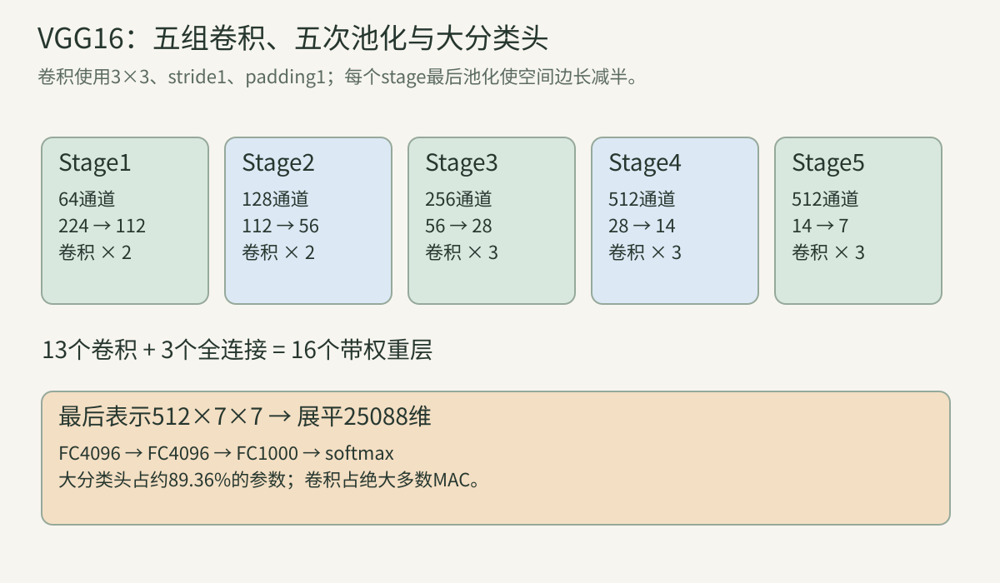
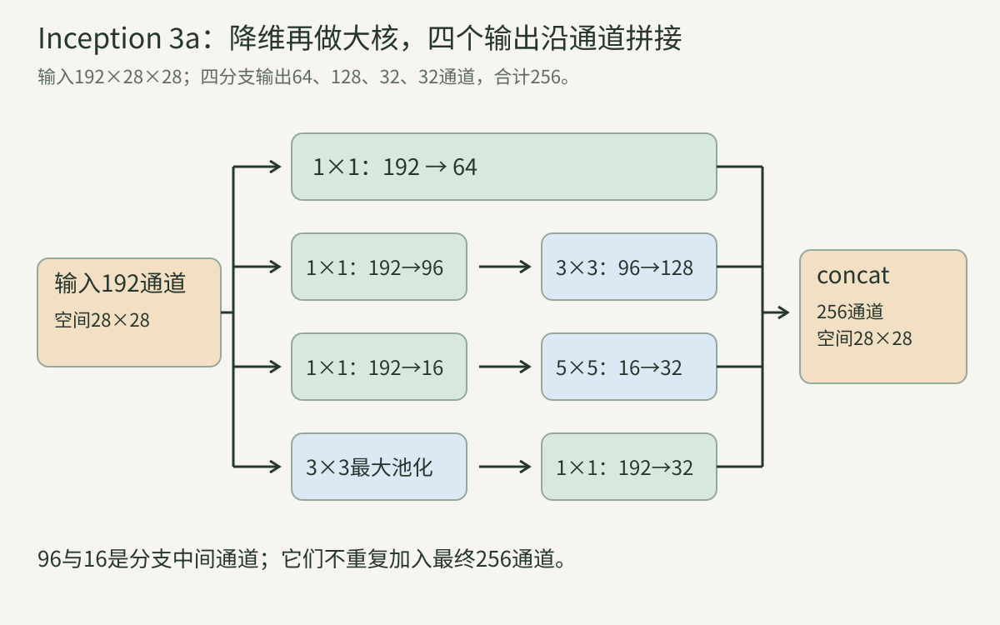
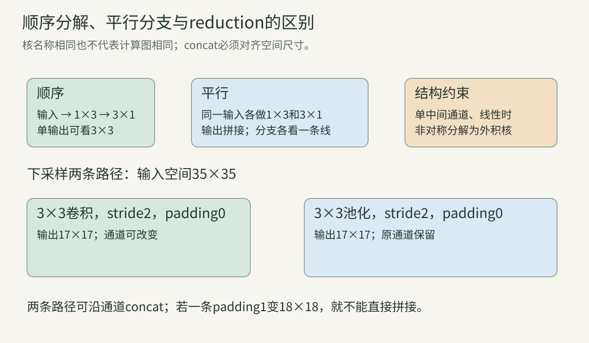

> 第06讲说明了卷积如何从任务损失学习。本讲问下一组问题：网络该更深、更宽，还是使用更高分辨率？怎样扩展表示而不过度增加成本？本文以VGG和Inception为主线，逐步建立读架构图与计算账本的能力。手算、代码和图解使用明确的教学约定，实验结论与原论文协议分别说明。

## 一、三个扩展方向与四种成本

### 1. 深度、宽度、分辨率分别是什么

**深度** 是沿计算路径依次经过的变换层数。**宽度** 通常是层的通道数或隐藏维度。**分辨率** 是特征图的空间尺寸。三个概念都会影响表达与资源，但改变的是不同轴。

例如$64\times56\times56$变成$128\times56\times56$是增宽；不改变shape再接一层卷积是增深；变为$64\times112\times112$则提高空间分辨率。多分支网络中“总共多少个模块”与“最长路径多少层”还可能不同，论文的层数必须连同计数约定阅读。

### 2. 参数、计算、激活与延迟不要混成一个数

参数是可训练的自由数值；计算是推理时执行的运算；激活是中间表示；延迟是特定设备、软件、batch与输入上的实际时间。

一个$1\times1$卷积可以参数不多，却在大分辨率上执行很多次。一个全连接层可能参数很大，却只执行一次矩阵乘。多个分支理论运算少一些，也可能因为访存、拼接、小算子调度而变慢。

本讲先核算前三项，并明确计数单位。延迟必须通过冻结条件的真实测量得到，不能根据参数量排序直接宣称更快。

### 3. MAC与FLOP的约定

对普通卷积，忽略偏置、激活和边界优化，一次输出的点积有$C_{\rm in}k_hk_w$项。常用MAC计数：

$$
\operatorname{MAC}=H_{\rm out}W_{\rm out}C_{\rm out}
C_{\rm in}k_hk_w.
$$

MAC即multiply-accumulate，把一次乘法与累加记为一对操作。一些FLOP报告将一MAC记为两浮点运算，一些工具按融合操作或其他规则计数。报告“15G”时必须写单位与范围。

带groups时把$C_{\rm in}$换为$C_{\rm in}/g$。本讲代码仅统计卷积和线性层的MAC，不包含池化、ReLU、softmax、数据预处理或反传，因此不是端到端训练计算量。

### 4. 同样的理论感受野，不表示同样的函数

两层stride1的$3\times3$卷积，其理论空间范围为$5\times5$；三层为$7\times7$。中间通道、非线性与参数分解决定它们能表示哪些函数。

“两个3×3等于一个5×5”只有在说明所指性质时才有意义：感受野边长可相同，参数量、非线性和边界行为通常不同。若带padding，靠边的层间补零方式还会改变有效输出，不应声称任意权重下完全等价。

## 二、VGG：规则小卷积堆叠

### 5. 核心问题是受控地改变深度

VGG工作使用规则的$3\times3$卷积与分阶段下采样，比较不同深度的配置。规则结构减少了读图负担，也让深度变化更容易分析。它不是第一次使用小卷积，而是系统研究较深小卷积网络在大规模识别中的作用。[VGG原论文，§2及表1](https://arxiv.org/abs/1409.1556)

深度实验仍需留意通道、参数、初始化、训练尺度和评估视图。看到一个更深模型更准，不等于已经证明深度是唯一原因，更不意味着继续加深必然有效。

### 6. 两个3×3与一个5×5的参数比较

若输入、中间、输出均为$C$通道，忽略偏置，一个$5\times5$需要$25C^2$权重，两层$3\times3$需要$18C^2$，减少28%。

但若中间通道为$M$、输入$C_{\rm in}$、输出$C_{\rm out}$，两层的权重是：

$$
9C_{\rm in}M+9MC_{\rm out}.
$$

这未必小于$25C_{\rm in}C_{\rm out}$。中间层过宽会增加成本；若第一层降低空间分辨率，两个卷积的MAC也不能只按相同空间尺寸乘参数数目。

### 7. 三个3×3与一个7×7的比较

同通道$C$的三层$3\times3$权重为$27C^2$，单层$7\times7$为$49C^2$，前者约为后者55.1%，减少约44.9%。若反过来说单层比三层多，则是$(49-27)/27\approx81.5\%$。两个百分数的分母不同，都可以正确，必须说明方向。

三层通常有三次ReLU，而单层通常一次。额外非线性提供不同的分段线性表达，但也带来更多中间激活和梯度路径。不能只看减少了多少权重，就断言内存和训练时间都同比下降。

### 8. 用一维卷积看到线性分解的结构限制

忽略边界，两个一维核$a=(a_0,a_1)$、$b=(b_0,b_1)$串联，等效三点核为：

$$
c=(a_0b_0,\ a_0b_1+a_1b_0,\ a_1b_1).
$$

例如$a=(1,1),b=(1,-1)$得到$(1,0,-1)$。这帮助理解较小核的组合如何覆盖更大区域。但任意目标大核是否能由给定数量的实数小核与中间通道表达，还受分解结构与秩限制。

加入ReLU后，一层输出取决于输入在哪些位置为正，整体通常无法折叠成一个固定线性大核。此时“有效大核”只能在固定激活区域下局部分析，不能作为全局等式。

### 9. VGG16的16到底怎么算

常见VGG16对应论文配置D：五个卷积stage分别有2、2、3、3、3层，共13个卷积，再加3个全连接层，共16个带权重层。

ReLU、池化和Dropout不计进这个名称的16。VGG19通常对应E：2、2、4、4、4，共16个卷积加3个全连接。论文配置C也有16个权重层，却包含一些$1\times1$卷积，所以“层数16”不能单独指定配置。

### 10. VGG16的完整shape路径

采用224RGB输入，卷积$3\times3$、stride1、padding1，池化$2\times2$、stride2，无BN的标准配置D：

| 阶段 | 卷积数与通道 | 卷积后空间 | 池化后shape |
| --- | --- | --- | --- |
| 1 | 2层，64 | $224\times224$ | $64\times112\times112$ |
| 2 | 2层，128 | $112\times112$ | $128\times56\times56$ |
| 3 | 3层，256 | $56\times56$ | $256\times28\times28$ |
| 4 | 3层，512 | $28\times28$ | $512\times14\times14$ |
| 5 | 3层，512 | $14\times14$ | $512\times7\times7$ |
| 分类头 | $25088\rightarrow4096\rightarrow4096\rightarrow1000$ | 展平后无空间轴 | 1000个logits |

$512\times7\times7=25088$，不要误记成512输入FC。通道增多通常补偿空间变小后的表示容量；各stage第一层改变通道，所以一个stage内的卷积参数不全相同。

图中每个stage框表示一组卷积和一次池化。框内“×2/×3”是卷积数量；224→112等是空间边长。分类头从512×7×7展开到25088，不是通过全局平均池化直接变512。

### 11. 参数集中在哪些层

按全部卷积与线性层带偏置核算：

| 部分 | 参数数 |
| --- | ---: |
| Stage1 | 38720 |
| Stage2 | 221440 |
| Stage3 | 1475328 |
| Stage4 | 5899776 |
| Stage5 | 7079424 |
| FC6 | 102764544 |
| FC7 | 16781312 |
| FC8 | 4097000 |
| 总计 | 138357544 |

分类头共123642856，占约89.36%。因此“卷积很多”不意味着卷积一定占最多参数。后续把大分类头改成全局池化，可能大幅降低权重存储，却不会取消前面高分辨率卷积的主要计算。

这张表是明确架构下的精确整数，论文中的“138M”是近似量。类别数、bias、BN、分类头改变后需要重算。

### 12. 第一个stage的激活为何值得关注

一张图的$64\times224\times224$特征含3211264个元素，FP32约12.25 MiB。单个中间激活就远大于Stage1的全部权重；batch32仅这一张量约392 MiB。

训练还需保存用于反传的中间结果和其他张量，实际显存更多。激活是否可重算、in-place、内存复用、mixed precision等影响实际占用，但不能把权重字节数直接当训练总显存。

### 13. VGG的训练与测试尺度不是同一个概念

训练可把图像短边缩放到某个尺度或随机范围，再取224裁剪；测试可以用多种尺度与多视图。输入到一次模型调用的crop尺寸、原图resize短边和最终聚合视图数分别描述不同操作。

论文还将全连接层等效转换为卷积进行dense evaluation，在不同空间位置产生分类结果后聚合。它与单独裁剪图块计算相比，边界上下文、padding与共享计算都可能不同。

复现应记录训练尺度分布、crop规则、测试尺度和聚合方式。比较单crop224结果与多尺度多crop结果，不能把差异全部归给网络深度。

### 14. 表示迁移与卷积化分类头

可以移除原1000类头，把中间特征用于其他任务，冻结后训练新分类器，或整体微调。这延续第05讲的迁移学习，不是因为某层被称为“语义层”就保证适合所有数据。

在$512\times7\times7$输入上，FC6可以改写成4096个$7\times7$卷积核；FC7/FC8可改写成$1\times1$卷积。对原尺寸输出相同；在更大空间图上可以滑动生成输出。

这种改写不能把“整图类别分数”自动变成像素分割。后者还需要位置对齐、密集标签、上采样与相应损失，本系列感知部分会展开。

### 15. VGG的限制与历史影响

规则堆叠容易用作视觉backbone、特征提取与分析基线，然而大分类头、激活和卷积计算会限制部署。浅层低级纹理、深层组合特征是有用直觉，但每个通道并不保证一一对应可命名的人类概念。

VGG在所研究范围内支持更深表示的价值；网络继续加深时还会遇到优化退化等问题，第08讲通过ResNet讨论。对学习路线而言，VGG最重要的是让我们能用规则结构分清层数、感受野、表示与资源。

## 三、1×1卷积与Inception模块

### 16. 1×1卷积只混合通道，也可以改变表示

在每个空间位置，输入$x\in\mathbb R^{C_{\rm in}}$，输出：

$$
y=Wx+b,\qquad W\in\mathbb R^{C_{\rm out}\times C_{\rm in}}.
$$

同一$W$用于所有位置。它没有直接访问邻居，却能将多通道响应重新组合，降低或提高通道维度；后接ReLU则增加非线性。$C_{\rm out}=C_{\rm in}$也不等于恒等操作，除非权重与偏置恰满足恒等条件。

Network in Network把局部小网络和全局平均池化连接到分类架构，是理解这种通道变换的重要前驱。[Network in Network原论文](https://arxiv.org/abs/1312.4400)

### 17. 降维瓶颈能省多少，代价是什么

直接$k\times k$卷积的权重为$C_{\rm in}C_{\rm out}k^2$；先用$1\times1$降到$R$通道，再用大核，权重为：

$$
C_{\rm in}R+RC_{\rm out}k^2.
$$

若两步空间分辨率相同，MAC也按同一比例变化。瓶颈太窄可能删除任务信息；没有非线性时，它还对等效大卷积的通道结构施加秩约束。加入非线性可以改变表达形式，但无法无条件恢复所有被丢的信息。

“瓶颈”指压缩的中间表示，不是保证最优的固定公式。Inception各分支可以使用不同$R$，按计算预算与验证结果设计。

### 18. 为什么让不同尺度分支并行

同一层可以同时计算$1\times1$、$3\times3$、$5\times5$以及局部池化，让输出包含不同局部范围的变换。接着沿通道维concat，后续层学习如何组合。

小范围可保留局部响应，大范围可整合更广空间信息，但“分支1负责颜色、分支2负责边缘、分支3负责物体”不是结构保证。不同分支的真实功能还受权重和数据影响。

原Inception讨论用可高效执行的密集模块近似合适的局部连接结构。这是一种设计动机，而不是对最终学习网络已达到理想稀疏结构的定理。[Going Deeper with Convolutions，模块图2](https://arxiv.org/abs/1409.4842)

### 19. 四分支的shape对齐规则

设输入$(B,C,H,W)$，四分支输出$(B,C_i,H,W)$，则concat输出：

$$
(B,C_1+C_2+C_3+C_4,H,W).
$$

batch、空间尺寸必须一致，通道数可以不同。stride1的3×3用padding1，5×5用padding2，3×3池化通常也要合适padding来保持尺寸。padding值与池化类型的具体边界计算还要核查。

拼接不等于求和。求和通常要求shape完全一致，并把不同分支的同索引数值合并；拼接给各分支保留自己的通道。ResNet的残差加法将在下一讲与此对照。

图中输入192通道送入四条分支；1×1的96与16分别是大核前的中间通道。输出64、128、32、32相加得到256，96与16没有再次加入最终通道数。

### 20. 池化后为什么再接1×1投影

单独池化不改变通道数。若输入192通道，直接把池化结果与其他分支拼接，会把全部192再加入下一层宽度。连续堆叠可能使通道快速增多。

池化后投影到较少通道，既压缩这一分支，也允许学习池化结果的通道组合。它不恢复池化丢掉的精细空间信息，也不是空间上采样。

### 21. Inception 3a的六个卷积怎么算

原GoogLeNet首个Inception模块输入$192\times28\times28$，分支为：64通道1×1；96通道1×1再128通道3×3；16通道1×1再32通道5×5；池化再32通道1×1。

按带偏置逐项计数：

| 卷积 | 参数 |
| --- | ---: |
| $192\rightarrow64$，1×1 | 12352 |
| $192\rightarrow96$，1×1 | 18528 |
| $96\rightarrow128$，3×3 | 110720 |
| $192\rightarrow16$，1×1 | 3088 |
| $16\rightarrow32$，5×5 | 12832 |
| $192\rightarrow32$，池化后1×1 | 6176 |
| 合计 | 163696 |

忽略偏置的卷积MAC为$28^2\times163328=128049152$。论文表中的K/M是简化报告；本讲整数以明确核尺寸和bias约定计算，避免不同单位或舍入带来的误会。

### 22. 分支反向传播：输出拆开，输入相加

若$y=\operatorname{concat}(f_1(x),\ldots,f_4(x))$，对$y$的梯度先按通道范围切成四块，分别传入对应分支。每个分支计算自己的参数梯度；因为四条路径共用输入$x$，输入梯度为：

$$
\frac{\partial\mathcal L}{\partial x}
=\sum_{i=1}^4J_{f_i}(x)^T\Delta_i.
$$

不能把输入梯度concat起来，那会改变$x$的shape；也不能把不同分支的参数梯度相加，除非那些参数真的共享。拼接操作本身不含训练参数，但有索引路由和可能的内存复制成本。

### 23. 1×1降维与PCA有什么关系，哪里不同

两者都可对通道或向量做线性投影。PCA从协方差中选择保留数据方差的方向；监督学习的1×1权重从任务损失获得，未要求正交，也未要求保留最大总方差。

如果一个低方差方向对类别至关重要，PCA可能丢掉它，而监督投影可能保留它；如果标签与背景强相关，监督投影也可能学到捷径。后接ReLU又使它不再只是线性降维。

因此不要把所有维度压缩都称为PCA，也不要把可学习投影视为一定优于无监督投影；要看任务、监督与验证条件。

## 四、GoogLeNet的全网、分类头与辅助监督

### 24. 九个模块组成怎样的空间层级

原GoogLeNet前端从224图像经过卷积与池化到$192\times28\times28$，随后模块输出如下。通道由该模块四个输出分支相加得出。

| 模块 | 输出通道 | 空间边长 |
| --- | ---: | ---: |
| 3a | 256 | 28 |
| 3b | 480 | 28 |
| 4a | 512 | 14 |
| 4b | 512 | 14 |
| 4c | 512 | 14 |
| 4d | 528 | 14 |
| 4e | 832 | 14 |
| 5a | 832 | 7 |
| 5b | 1024 | 7 |

3b之后与4e之后有空间下采样，最终全局平均到1024维，再分类。原文的22层按带参数的路径深度计数，不能把所有分支卷积数量简单相加当作同样的“22”。模块表参见[原论文表1](https://arxiv.org/pdf/1409.4842)。

### 25. Global Average Pooling如何削减分类头

对每个通道的$H\times W$特征求平均：

$$
g_c=\frac1{HW}\sum_{u,v}X_{c,u,v}.
$$

从$(B,C,H,W)$得到$(B,C)$。操作本身没有可训练参数；后接$C\rightarrow K$线性层，需要$K(C+1)$参数。与flatten相比，它不为每个空间位置单独学习分类权重。

GoogLeNet在1024维平均表示后还有线性分类层，而不是“平均池化直接等于1000类别概率”。GAP也不能恢复位置信息；对位置敏感的任务，必须考虑额外表示与输出路径。

### 26. GAP梯度与简单空间解释

设上游梯度$\delta_c$，则每个空间位置接收$\delta_c/(HW)$。它对该通道各位置直接平均分配，但之后经过卷积、ReLU与其他路径时，输入像素贡献仍可以不同。

若类别logit为$z_k=b_k+\sum_cw_{kc}g_c$，可重排：

$$
z_k=b_k+\frac1{HW}\sum_{u,v}\sum_cw_{kc}X_{c,u,v}.
$$

因此$M_k(u,v)=\sum_cw_{kc}X_{c,u,v}$是这个特定结构下的局部线性贡献图。它依赖最后特征与分类权重，不自动等于精确目标边界或因果证据；可视化热点还可能来自背景捷径。

### 27. 辅助分类头为什么只在训练使用

原GoogLeNet在4a、4d后接两个辅助分类器，训练目标可记为：

$$
\mathcal L=\mathcal L_{\rm main}
+0.3\mathcal L_{\rm aux1}+0.3\mathcal L_{\rm aux2}.
$$

这些分支在推理时移除。它们给中间表示额外监督，改变共享前层收到的梯度与训练约束；推理不用它们，不表示训练期间从未有这些参数与成本。

它们的梯度可能与主目标一致，也可能冲突，权重需要控制。后续Inception研究对辅助头的作用提出更多正则化解释，不能把“解决梯度消失”当作所有设置下唯一已证明原因。

### 28. 单模型、集成与多裁剪再次分开

原GoogLeNet比赛系统使用多个模型及较多测试裁剪。6.67%这个知名top-5测试错误对应比赛提交系统，不能直接赋给一个随意训练的单模型、单crop前向。

VGG论文也分别报告多尺度、dense、多crop和模型组合。比较两篇论文的某个最低数字时，应先核对数据、视图、模型数量、验证或测试集。历史上模型结构与训练、推理策略一起发展，排行榜并不是受控的单因素实验。

### 29. 为什么分支少MAC仍可能有部署问题

分支需要保持多个中间结果，可能有小规模卷积调用和concat。GPU并行、算子融合、内存布局与编译器优化决定这些成本能否抵消。

同样参数量可以对应不同激活峰值，多个分支的实际是否并行执行也由框架调度决定。若想证明瓶颈降低实际延迟，应对同输入、同精度、同batch、同设备预热并重复计时，报告均值与尾部或分位数。

## 五、Inception后续演进：每一步改变什么

### 30. BN-Inception与版本名字要按来源理解

BN工作把归一化引入Inception类模型，训练稳定性与recipe共同变化。一些资料将BN-Inception称为v2，另一些资料的v2/v3指卷积分解后的配置阶段，名字不一定有跨库统一对应。

正确做法是标记论文、配置或具体实现。原GoogLeNet没有默认包含现代所有BN与分解设计；VGG16-BN也与本讲前面无BN的VGG16是不同模型。[Batch Normalization原论文](https://arxiv.org/abs/1502.03167)

### 31. 在CNN中BN沿哪些轴统计

对$(B,C,H,W)$，通常每个通道跨$B,H,W$统计均值方差，训练时归一化并使用可学习$\gamma,\beta$。不是每个像素各算一个独立均值，也不是把所有通道混成一个统计量。

$$
y_{b,c,u,v}=\gamma_c
\frac{x_{b,c,u,v}-\mu_c}{\sqrt{v_c+\epsilon}}+\beta_c.
$$

eval常使用running统计；小batch、域变化、是否同步多设备都会影响行为。可以为每个通道的bias与BN的$\beta$重参数化，但训练统计与正则化实现必须核查，不能仅凭“有BN”删掉所有代码细节。

### 32. BN为何有效需要区分动机与证据

原论文以internal covariate shift描述问题，后来研究从优化平滑性等角度检验解释。归一化能改变梯度与参数尺度的性质，但“输入分布固定了”并不是普遍成立的完整证明。

学习时分别记下：BN确切执行的运算；在某实验中训练更快的现象；作者解释；后续工作的支持或挑战。第05讲已经推导耦合梯度，本文不把机制简化为每层做一次无关紧要的标准化。[关于BN优化作用的后续原始研究](https://arxiv.org/abs/1805.11604)

### 33. 5×5分解成两个3×3

两个3×3可覆盖5×5范围。当输入、中间、输出同为$C$，权重从$25C^2$变为$18C^2$。如果中间维度不同或第一层有降采样，要重新核算。

它借鉴小核堆叠的思想，也可能加入更多非线性。不是把某个已训练5×5权重任意拆开、输出就一定保持不变。替换架构后通常需要训练或适配，实验要评估表示约束带来的收益与损失。

### 34. n×n分解成1×n与n×1

同通道时，普通$n\times n$权重为$n^2C^2$，两个非对称核共$2nC^2$。$n=7$时为14相对49，节省约71.4%。它先聚合一个方向、再聚合另一个方向，整体范围仍可覆盖$n\times n$。

若单输入单输出且只有一个中间通道、无非线性，空间核会受可分离结构限制，不能表达任意二维核。多中间通道和非线性增加能力，但不是无限制的精确等价。[Rethinking the Inception Architecture，§3](https://arxiv.org/abs/1512.00567)

### 35. 顺序分解与平行分支是不同布局

先1×3再3×1是连续运算，后者看到了前者的结果，单输出可覆盖3×3。若对同一个输入平行做1×3和3×1再concat，两个分支各自只直接看横向或纵向，其单通道感受野不是同一个完整3×3。

后续层可以再组合平行结果。读图时确认箭头方向、分支起点、是否concat与中间ReLU，比只记核名称重要。

### 36. 下采样时同时改变空间与通道

若先stride2池化，再大幅降通道，可能迅速压缩信息；若先在大图上增宽再池化，则计算更贵。Inception的reduction模块用不同下采样路径，拼接降低分辨率后的卷积与池化结果。

各路径要输出同样空间尺寸。35×35经3×3、stride2、无padding得到17×17，若另一条路径pool2、stride2采用不一致边界规则，可能得到不同结果。偶数或奇数输入尤其容易暴露shape不齐。

图上方比较顺序与平行核；下方35→17的两路径只有在尺寸与padding规则一致时才能concat。绿色框是变换，不是对任意已训练大核做无损拆解的保证。

### 37. Label smoothing的目标与梯度

原one-hot标签$e_y$，与均匀分布$u_k=1/K$混合：

$$
q_k=(1-\epsilon)\mathbf1[k=y]+\epsilon/K,
\qquad \mathcal L=-\sum_kq_k\log p_k.
$$

softmax logits的梯度为$p_k-q_k$。正确类目标是$1-\epsilon+\epsilon/K$，其他类$\epsilon/K$，不是把正确类写成$1-\epsilon$、其余仍各$\epsilon/K$导致总和少一份。

另一种约定把$\epsilon$只分给错误类，会得到不同的目标。训练代码与公式应一致。soft label平滑可减少逼近无限logit差的压力，但不保证所有任务准确率或校准都改善；也不是逐样本随机翻错标签。

### 38. 从交叉熵分解看平滑的含义

代入混合分布：

$$
H(q,p)=(1-\epsilon)H(e_y,p)+\epsilon H(u,p)
=(1-\epsilon)H(e_y,p)+\epsilon[\operatorname{KL}(u\|p)+H(u)].
$$

$H(u)$与模型参数无关。注意是$\operatorname{KL}(u\|p)$，不是$\operatorname{KL}(p\|u)$。后者与负预测熵有关，但两者不等价。第03讲的KL方向在这里实际影响目标。

如果预测某个错误类趋近0、目标$q_k$仍为正，该类项$-q_k\log p_k$会趋大，因此模型不再只需让正确类概率尽可能1。这个数学结论与它是否改善某个测试任务，应分开检验。

### 39. Inception-v4与Inception-ResNet的衔接

后续工作进一步规整stem、模块与reduction，并研究在Inception分支变换外加入残差路径。它们不是简单把v3的卷积层数加一。[Inception-v4与Inception-ResNet原论文](https://arxiv.org/abs/1602.07261)

理解这些结构需要残差加法、投影和缩放，下一讲先把ResNet的恒等路径与优化问题推导清楚，再回接Inception-ResNet。本文已展开多分支与分解基础，残差相关内容在后续明确补齐，而不是以一个名称代替技术。

### 40. 如何设计可解释的架构消融

比较大核与小核时，先决定是否控制参数、MAC、深度、感受野与训练预算；这些约束可能不能同时满足，应明说目标。比较多分支与单分支时，输出通道、归一化、分类头和评估视图也应记录。

至少区分：某一组件的局部替换实验；整套训练recipe加结构的系统比较；不同年代比赛的历史比较。它们能够支持的结论不同。运行几次随机种子、报告统计波动与失败样本，也比仅抄一个最低错误率更有解释力。

## 六、深入算例：把架构设计变成可检查的数字

### 算例A：两个小核的节省有明确前提

输入、输出均64通道，单5×5卷积带偏置需要$64(64\times25+1)=102464$个参数。两层3×3且中间64通道需要$2\times64(64\times9+1)=73856$。

若中间改为256通道，则需要$256(64\times9+1)+64(256\times9+1)=295232$，反而大于单5×5。改变中间宽度会改变结论，所以“小卷积一定更省”不是通用规则。

若空间输出均32×32，不含bias运算，单5×5为$32^2\times102400=104857600$ MAC，64中间通道的两层为$32^2\times73728=75497472$ MAC。训练时两层还保存额外中间特征，这个成本没有写进MAC。

### 算例B：两个线性小卷积可以折叠，非线性不能随便去掉

一维核$(1,1)$与$(1,-1)$的线性串联，内部位置等效于$(1,0,-1)$。这是线性卷积组合的代数关系。

为了看清ReLU的影响，取更简单的两个1×1层：$f(x)=\operatorname{ReLU}(\operatorname{ReLU}(x))=\operatorname{ReLU}(x)$。如果试图用单个线性层$ax$覆盖全部输入，$x=1$要求$a=1$，$x=-1$又要求$-a=0$，相互矛盾。

这不是说两个ReLU一定比一个更强，而是说明含非线性的网络通常不能当固定线性核无条件折叠。对于某些特殊权重或始终处于同一激活区域的输入，可能有局部或特例等价。

### 算例C：相同感受野，边界仍可不同

一维输入$(1,2,3)$，两次用核$(1,1,1)$、两边补1个零并保持长度3。第一次输出$(3,6,5)$；第二次输出$(9,14,11)$。

两个核在线性无限序列上组合为$(1,2,3,2,1)$。若直接用这个5点核、两边补2个零，输出却是$(10,14,14)$。中心相同，边界不同。

原因是逐层计算时，第一层只保留长度3的输出；本来在原边界外也可能产生的中间响应被截掉。直接大核没有这一步截断。图像二维卷积也存在类似问题，因此两层感受野5×5不保证与单5×5在所有位置输出一致。

### 算例D：VGG16整网的MAC与权重分布

在第10节224输入约定下，只统计卷积和线性层、不统计bias、ReLU、池化与其他操作：

| 部分 | MAC |
| --- | ---: |
| Stage1 | 1936392192 |
| Stage2 | 2774532096 |
| Stage3 | 4624220160 |
| Stage4 | 4624220160 |
| Stage5 | 1387266048 |
| 三个FC | 123633664 |
| 合计 | 15470264320 |

约15.47 GMAC；如果采用乘加各算一FLOP的规则，仅这些层约30.94 GFLOP。分类头有89.36%的参数，却不到1%的这里统计的MAC。

Stage3和4的MAC在这组配置下相同，因为空间减半使位置数除4，同时某些通道维度增加带来相应补偿。不能凭“后面更深”推断每层必然计算更多。

### 算例E：1×1怎样把两个通道压成一个

每位置输入$x=(x_1,x_2)$，权重$(1,1)$、偏置0，投影得到$x_1+x_2$。输入$(1,-1)$和$(0,0)$都得到0。

后续若只看到这个投影值，就无法区别这两种输入；它们在“判断是否有正负对比”的任务上却可能不同。说明降维可能删除任务信息。

若再扩展成两个输出$(u,2u)$，并不能恢复原输入。先压缩再增维不等于信息无损；需要用任务、数据与实验检验瓶颈宽度。

### 算例F：3×3瓶颈省掉多少计算

输入192、输出128通道、空间28×28。直接3×3权重$192\times128\times9=221184$。

先1×1降到32，再3×3得到128，需要$192\times32+32\times128\times9=43008$，约为直接方案19.44%，减少约80.56%。带偏置分别为221312与43168。

忽略bias，MAC分别为173408256与33718272。比较成立的前提是空间尺寸相同、没有额外投影/跳接、两者输出128通道。若要保存质量，可能需要更宽瓶颈，这个理论节省不能直接当最终实验收益。

### 算例G：Inception 3a与不降维的匹配输出方案

保留同样的四分支输出64、128、32、32和池化后投影；只移除3×3与5×5前的降维。此时忽略bias的权重：

$$
192\times64+192\times128\times9
+192\times32\times25+192\times32=393216.
$$

有降维的对应数字为163328，约为41.54%，减少约58.46%。MAC从$393216\times784=308281344$降到128049152。

这是输出通道匹配的局部比较。若原始naive版本的pool分支不投影，则输出不是256而是416通道，还会影响下一层，因此不能用那一方案的后续成本与本例直接混比。

### 算例H：拼接的维度与输入梯度

取标量输入$x=1$，分支$f_1=2x$、$f_2=3x+1$，concat得到$y=(2,4)$。loss为$\tfrac12(y_1^2+y_2^2)=10$，上游梯度$(2,4)$。

传入第一分支的是2，第二分支是4；各自对输入贡献$2\times2=4$与$4\times3=12$，总输入梯度16。

如果把concat误做求和，输出会是6，loss变18，输入梯度变$6(2+3)=30$，已是另一张计算图。输出shape不同不只是形式区别，会改变目标与梯度。

### 算例I：GAP、分类logit与空间贡献图

两个通道为：

$$
X_1=\begin{bmatrix}1&2\\3&4\end{bmatrix},\quad
X_2=\begin{bmatrix}0&2\\0&2\end{bmatrix}.
$$

全局平均得到$g=(2.5,1)$。类别权重$(2,-1)$、偏置0.5，则$z=2\times2.5-1+0.5=4.5$。

空间贡献图为$M=2X_1-X_2=\begin{bmatrix}2&2\\6&6\end{bmatrix}$，其平均为4，加偏置得4.5。若上游对logit梯度为1，则$X_1$各位置梯度为$2/4=0.5$，$X_2$各位置为$-1/4=-0.25$。

负权重表示该通道增大可能降低此类别logit。高贡献位置只是这一计算路径下的证据，不能自动作为目标分割mask。

### 算例J：用GAP替换VGG分类头的账本

把VGG最后$512\times7\times7$平均成512维，再接1000类线性层，只需$1000(512+1)=513000$参数。加原卷积14714688，总数15227688，比138357544大幅减少。

这不是原VGG16，而是明确修改分类头的变体。分类头不再学习每个空间位置的独立权重，表示与训练行为也变了；原FC权重不能直接全部搬到新头里。

卷积计算仍约15.35 GMAC，所以总参数减少约89%不意味着总MAC也减少约89%。实测延迟还要考虑矩阵大小与访存等条件。

### 算例K：辅助loss的值与梯度可能向不同方向

若主loss1、两个aux loss2与3，权重各0.3，总loss为$1+0.3\times2+0.3\times3=2.5$。

对某共享参数，若主梯度2，两个aux梯度−1与4，总梯度$2+0.3(-1)+0.3(4)=2.9$。辅助头不一定每项都与主目标同方向。

若参数位于辅助头接出点之后、只被主路径使用，它不接收该辅助梯度；只有共同祖先路径会累计。训练结束移除aux时，推理图更小，但保留的前层权重已受到辅助目标影响。

### 算例L：非对称分解的核与秩

单通道横向核$(1,2)$再纵向核$(3,4)^T$，等效空间核为：

$$
K=\begin{bmatrix}3&6\\4&8\end{bmatrix},
\qquad \det K=24-24=0.
$$

它是两个向量的外积，秩最多1。目标核$\begin{bmatrix}1&0\\0&1\end{bmatrix}$秩2，无法由这组“单中间通道、线性可分离”的结构表达。

两个中间通道允许把两个秩1分量相加，能表示更广的核。真实多通道分解的限制更复杂，但这个例子已经说明参数减少也会改变函数集合。

### 算例M：奇数尺寸的reduction如何对齐

35×35输入，一条分支用3×3、stride2、padding0卷积，输出：$\lfloor(35-3)/2\rfloor+1=17$。

另一条用3×3、stride2、padding0池化，也输出17，可以concat。若改用同尺寸padding1，则输出18，空间不一致。

不能通过reshape把18×18“变成”17×17来修复语义；需要调整正确的采样与边界规则。裁掉一行一列也会改变位置对齐，应在架构中明确，而非为消除shape报错临时隐藏。

### 算例N：平滑标签改变最优logit间隔

三类，真类0，$\epsilon=0.1$，采用与均匀分布混合：$q=(14/15,1/30,1/30)$。

若$p=(0.9,0.05,0.05)$，交叉熵约0.298052；若$p=(0.99,0.005,0.005)$，约0.362601，尽管正确类概率更高，平滑loss反而更大。

没有模型约束时，交叉熵对$p$的最小值在$p=q$；若两个错误类logit相同，正确类与错误类的logit差应为$\ln((14/15)/(1/30))=\ln28\approx3.332205$，不需要无限大。

用$p-q$看梯度：第一种预测为$(-1/30,1/60,1/60)$，仍推动真类稍提高；第二种真类梯度约0.056667，下降更新会压低过高的真类logit。这里分析的是训练目标，不能替代校准测量。

### 案例O：两种“架构更好”的证据

实验A：仅把5×5替换为两个3×3，其他数据、通道、训练与评估固定，三次种子平均准确率提升0.4个百分点。它支持在该设置下该替换组合有效，仍需说明深度与参数同时变了。

实验B：新网络同时改瓶颈、BN、增强、优化器、输入尺寸和多crop，准确率提升3个百分点。它支持整套系统更好，不能单独给瓶颈归因3个百分点。

以上数值是教学设定，没有运行对应真实训练。对论文原表也应如此阅读：先辨认比较改变了什么，才判断可以支持哪一项技术解释。

## 七、标准库实验：核算与梯度检查

### 41. 从配置自动生成VGG与Inception账本

下面逐层累计全部bias参数和不含bias的MAC，避免只照抄“138M”。代码不构造神经网络、不下载权重，也不训练图片；它检验本讲的架构算术。

~~~python
counts = [2, 2, 3, 3, 3]
channels = [64, 128, 256, 512, 512]
height, cin = 224, 3
conv_parameters = 0
conv_macs = 0
stage_parameters, stage_macs = [], []
for count, cout in zip(counts, channels):
    parameters, macs = 0, 0
    for _ in range(count):
        parameters += cout*(9*cin+1)
        macs += height*height*cout*9*cin
        cin = cout
    stage_parameters.append(parameters)
    stage_macs.append(macs)
    conv_parameters += parameters
    conv_macs += macs
    height //= 2
assert height == 7
fc_shapes = [(512*7*7, 4096), (4096, 4096), (4096, 1000)]
fc_parameters = sum(cout*(cin+1) for cin, cout in fc_shapes)
fc_macs = sum(cin*cout for cin, cout in fc_shapes)
assert stage_parameters == [38720, 221440, 1475328, 5899776, 7079424]
assert conv_parameters == 14714688
assert fc_parameters == 123642856
assert conv_parameters+fc_parameters == 138357544
assert conv_macs+fc_macs == 15470264320

# Inception 3a, explicit six convolutions; all use stride1.
inception_convs = [(192,64,1), (192,96,1), (96,128,3),
                   (192,16,1), (16,32,5), (192,32,1)]
inception_parameters = sum(o*(i*k*k+1) for i,o,k in inception_convs)
inception_macs = 28*28*sum(o*i*k*k for i,o,k in inception_convs)
assert inception_parameters == 163696
assert inception_macs == 128049152
assert 64+128+32+32 == 256
print('VGG16 stage parameters:', stage_parameters)
print('VGG16 total parameters:', conv_parameters+fc_parameters)
print('VGG16 conv+linear MAC:', conv_macs+fc_macs)
print('Inception 3a:', inception_parameters, 'parameters;', inception_macs, 'MAC')
~~~

可将分类头改成512→1000，检查第J算例；也可把全部stage重复次数改为VGG19配置，观察参数、计算与层数变化。改变后应重新标注模型，不能继续称原VGG16。

### 42. 检查concat梯度与平滑标签梯度

第H算例的concat和第N算例的平滑CE分别用中心差分验证。softmax用减最大值避免不必要的指数溢出。

~~~python
import math

def branch_loss(x):
    a, b = 2*x, 3*x+1
    return 0.5*(a*a+b*b)

step = 1e-5
numerical_x = (branch_loss(1+step)-branch_loss(1-step))/(2*step)
assert abs(numerical_x-16) < 1e-8

def softmax(z):
    largest = max(z)
    exps = [math.exp(v-largest) for v in z]
    return [v/sum(exps) for v in exps]

classes, epsilon, label = 3, 0.1, 0
q = [epsilon/classes]*classes
q[label] += 1-epsilon
assert abs(sum(q)-1) < 1e-12
z = [2.0, 0.0, -1.0]
p = softmax(z)
analytic = [a-b for a,b in zip(p,q)]

def smoothed_loss(logits):
    largest = max(logits)
    logsumexp = largest + math.log(sum(math.exp(v-largest) for v in logits))
    return -sum(target*(v-logsumexp) for target,v in zip(q,logits))

numeric = []
for i in range(classes):
    plus, minus = z.copy(), z.copy()
    plus[i] += step
    minus[i] -= step
    numeric.append((smoothed_loss(plus)-smoothed_loss(minus))/(2*step))
maximum_error = max(abs(a-b) for a,b in zip(analytic,numeric))
assert maximum_error < 1e-8
assert abs(sum(analytic)) < 1e-12
print('concat input gradient:', numerical_x)
print('smoothed target:', q)
print('softmax:', p)
print('gradient:', analytic, 'finite-difference error:', maximum_error)
~~~

梯度总和为零源于softmax对所有logits同时加常数不改变概率。验证小程序可以确认一个公式，但不会证明所设计真实模型训练更准、更快。

## 八、20道练习与详解

### 练习1：64×56×56变成128×28×28，改变了哪些轴？

**解析：** 通道加倍，空间高宽各减半；元素数由200704变100352，减少一半。它既增宽又降采样，不能简单叫“网络变大”。计算还取决于实现这一步的核与连接。

### 练习2：同通道32时，三层3×3与一层7×7，忽略bias有多少权重？

**解析：** 前者$27\times32^2=27648$，后者$49\times32^2=50176$。感受野可同为7×7，但非线性、分解限制与边界处理不同。

### 练习3：为什么增加小卷积的中间通道可能不再省参数？

**解析：** 两层权重为$9C_{\rm in}M+9MC_{\rm out}$，随中间$M$线性增长；过宽时超过单层大核。节省结论必须给输入、中间与输出通道。

### 练习4：VGG16名称的16包含五次pool吗？

**解析：** 不包含，标准配置D为13卷积+3全连接。将pool、ReLU都计入会得到另一种层数，名称必须按指定约定理解。

### 练习5：512×7×7送FC4096需要多少参数，带偏置？

**解析：** 输入25088，参数$(25088+1)\times4096=102764544$。不要把输入误记为512；那相当于先做过某种空间汇聚。

### 练习6：参数最多的层一定MAC最多吗？

**解析：** 不一定。卷积权重会在许多空间位置复用，FC权重在一次输出向量计算中使用。VGG分类头占多数参数，而高分辨率卷积贡献绝大部分MAC。

### 练习7：64通道224×224的FP32激活占多少MiB？

**解析：** $64\times224^2\times4/2^{20}=12.25$ MiB，batch32为392 MiB，仅这一张量。训练显存还有其他激活、梯度、权重、状态与临时空间。

### 练习8：1×1卷积32输入、16输出，有多少参数？它直接扩大感受野吗？

**解析：** $16(32+1)=528$，stride1时不直接扩大空间感受野，但混合通道并改变维度。后接ReLU还改变非线性表达。

### 练习9：四分支输出64、128、32、32通道，两个reduce为96和16，concat多少？

**解析：** 256。reduce是中间通道，已被后面卷积变换，不是最终独立输出，不能重复加入。

### 练习10：concat为什么可以通道不同，却不能空间尺寸不同？

**解析：** 沿通道拼接保留其他轴，必须为每个batch与空间位置定义对应的通道向量。不同空间尺寸没有同样索引范围，不能仅靠拼接自然对齐。

### 练习11：192输入的pool分支不投影，与输出64、128、32拼接，总通道多少？

**解析：** $192+64+128+32=416$。增加pool projection到32后才得到256；该操作控制后续层宽度并学习通道组合。

### 练习12：共享输入有三条分支，输入梯度分别2、−5、4，总梯度多少？

**解析：** 求和为1。concat输出时梯度先按通道拆给分支；返回共同输入时沿路径累计。参数不共享的分支不互相加参数梯度。

### 练习13：GAP后C=1024、K=1000的线性分类层参数多少？

**解析：** $1000(1024+1)=1025000$。GAP本身无参数，线性层有参数；不可以合并描述成“分类头完全没有参数”。

### 练习14：一个通道4×4做GAP，上游梯度8，每位置接收多少？

**解析：** $8/16=0.5$。这里直接GAP路径均匀分配，之后经过前面的非线性与其他路径，原图梯度仍可不均匀。

### 练习15：训练有aux head、推理删掉，参数统计怎样报告？

**解析：** 分别注明训练图与推理图。辅助头增加训练参数、计算与中间保存；推理不使用它们。只报推理参数不应暗示训练期间同样小。

### 练习16：CNN的BN把C个通道一起算一个均值吗？

**解析：** 通常每个通道分别跨batch及空间统计。改变轴就是另一种归一化。还要记录eval统计、同步设备与bias/affine等设置。

### 练习17：7×7改为1×7再7×1，同通道且忽略bias，权重比是多少？

**解析：** $14/49=2/7\approx28.57\%$，减少约71.43%。函数集合受结构限制；含非线性时不能当作任意7×7卷积的无损代换。

### 练习18：35输入、3核、stride2、padding1，输出多少？

**解析：** $\lfloor(35+2-3)/2\rfloor+1=18$。无padding则17；reduction各分支需使用一致的输出尺寸与空间对齐。

### 练习19：四类、平滑0.2，与均匀分布混合，正确类与其他类目标是多少？

**解析：** 正确类$0.8+0.2/4=0.85$，其余各0.05，总和1。若采用只分给错误类的约定，则正确0.8、其余约0.066667，这是不同规则。

### 练习20：网络参数减半，能直接宣称推理快一倍吗？

**解析：** 不能。MAC、激活、访存、算子类型、并行、融合、batch和硬件决定延迟。需在同条件下实测；理论账本用于解释与设计，不能代替计时证据。

## 九、完整复现记录与后续阅读

记录一个VGG实验，至少要有：配置A/B/C/D/E或具体层表、是否BN、图像/crop尺度、类别数、分类头、初始化、增强、优化器、训练步数、测试视图与平均对象。记录Inception还需各分支通道、核分解、padding、pool、辅助头、归一化与版本来源。

本讲推导并核算小核、瓶颈、多分支、GAP与label smoothing；也展开它们的适用前提与限制。**没有运行真实VGG或GoogLeNet训练，也没有给这些模型新增基准成绩。** 原论文的整体表现不应转成本文的复现结果。

[第08讲ResNet与DenseNet](../vision-08-resnet-densenet/)进入更深网络的优化退化、恒等路径、投影、预激活与密集连接；同时将concat和残差加法进行公式与梯度对照。回到[完整课程地图](../vision-00-overview/)可查看尚待展开的空间、生成、多模态与前沿内容；先修可参考[第06讲](../vision-06-classical-cnn/)与[训练基础](../vision-05-training/)。

## 原始材料

- [Simonyan与Zisserman：Very Deep Convolutional Networks for Large-Scale Image Recognition](https://arxiv.org/abs/1409.1556)：小卷积配置、深度实验、评估尺度与迁移。
- [Szegedy等：Going Deeper with Convolutions](https://arxiv.org/abs/1409.4842)：原Inception模块、GoogLeNet全网、辅助头与系统评估。
- [Lin等：Network In Network](https://arxiv.org/abs/1312.4400)：局部通道网络与全局平均池化。
- [Ioffe与Szegedy：Batch Normalization](https://arxiv.org/abs/1502.03167)：归一化运算和BN-Inception实验。
- [Szegedy等：Rethinking the Inception Architecture for Computer Vision](https://arxiv.org/abs/1512.00567)：卷积分解、reduction、辅助头讨论与label smoothing。
- [Santurkar等：How Does Batch Normalization Help Optimization?](https://arxiv.org/abs/1805.11604)：检验BN的优化解释。
- [Szegedy等：Inception-v4, Inception-ResNet and the Impact of Residual Connections on Learning](https://arxiv.org/abs/1602.07261)：衔接下一讲的分支与残差组合。
