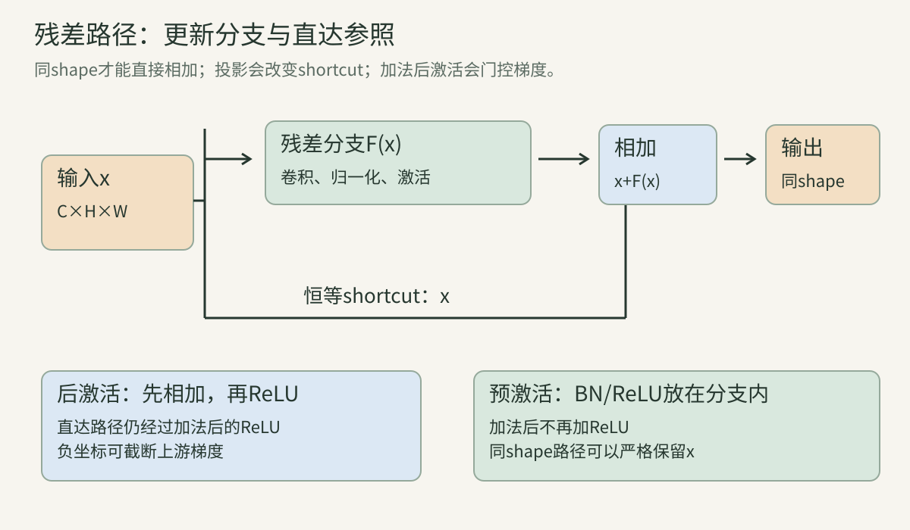
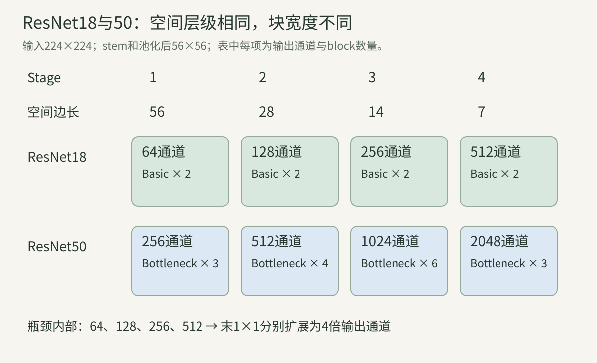
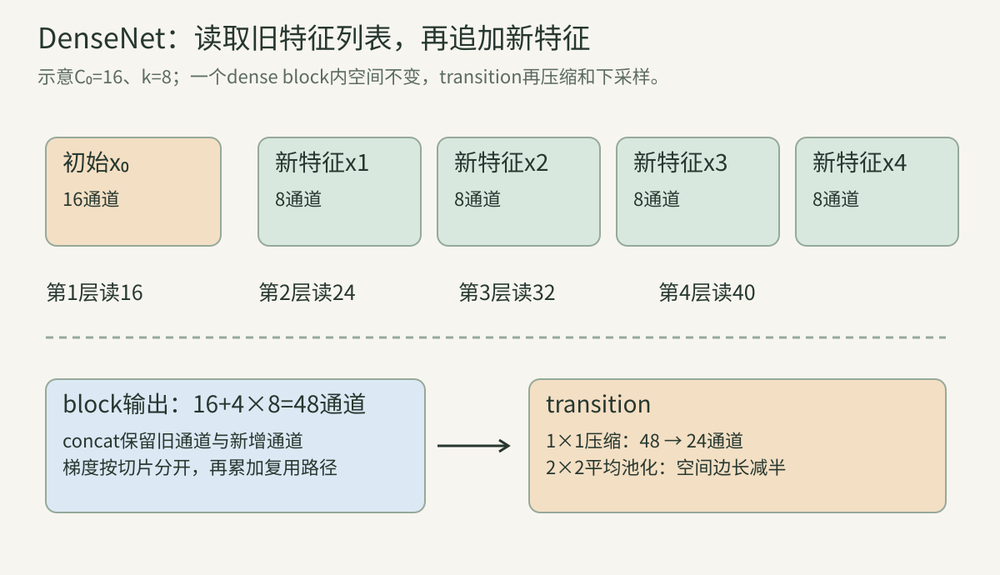

> 第07讲研究怎样组合卷积。本讲研究另一件事：即使网络拥有足够参数，优化器为什么仍然可能训练不好？我们从一个两维残差块开始，逐步走到整网架构与梯度，最后比较“修改已有表示”和“保留旧表示、追加新表示”两种结构。先修是[卷积与反传](../vision-06-classical-cnn/)、[矩阵与Jacobian](../vision-02-math/)和[训练基础](../vision-05-training/)。不熟悉符号时，可以先读手算，再回到通式。

## 一、加深网络之前，先辨认问题

### 1. 表达能力、可优化性与泛化是三件事

**表达能力** 问“是否存在一组参数能表示目标函数”；**可优化性** 问“从当前初始化出发，有限资源内能否找到好参数”；**泛化** 问“找到的参数对未见样本是否有效”。

假设一个模型有足够容量记住训练集，这不意味着SGD一定能把训练误差降到零；即使降到零，也不意味着测试误差低。读深层网络论文时，先判断作者是在扩大函数集合、改善优化过程，还是改变数据与正则化。

把浅模型嵌入更深模型的思想实验，只能证明某个解可能存在，不能证明梯度下降必然找到它。激活、维度变化和归一化还会影响“插入恒等层”的具体实现。

### 2. 什么是网络退化

这里的degradation指：在受控比较中，增加层数后，**训练误差也升高**。它提示更深模型没有充分发挥其可表达的能力。ResNet工作用这一现象提出残差参数化。[原论文的退化实验](https://arxiv.org/abs/1512.03385)

这与“训练集拟合很好、验证集变差”的典型过拟合不同。训练误差更高也可能来自更强正则、不同训练步数或数据错误，因此必须先控制协议，再谈优化退化。

一个严谨记录至少包含：训练/验证曲线、是否同样增强与正则、学习率、更新次数、初始化、batch、参数规模及随机种子。只展示最终验证精度不够定位原因。

### 3. 梯度消失、爆炸和退化怎样区分

若链式反传中的Jacobian乘积把多数方向缩得很小，早层获得的更新可能微弱，称为梯度消失；若把某些方向放大很多，可能出现梯度爆炸。退化描述训练表现，前两者描述传播或更新机制。

二者可以相关，但不是同义词。梯度范数非零仍可能有方向条件差、更新不合适、噪声大等优化困难。原ResNet实验已经使用BN，论文没有把全部退化简单归结为梯度消失。这里也不会用一条标量推导替代完整优化证据。

### 案例A：三组曲线的诊断顺序

假设同一任务得到以下示意结果，数字只是教学构造：

| 模型 | 训练错误率 | 验证错误率 |
| --- | ---: | ---: |
| 浅模型 | 8% | 14% |
| 深模型甲 | 13% | 18% |
| 深模型乙 | 1% | 20% |

甲连训练集都拟合得更差，先核对优化与协议；乙训练拟合更好但验证变差，先调查过拟合、数据量与正则。接着检查训练预算是否匹配、loss与错误率是否同时改善，以及重复实验的波动。不能凭表格直接宣布甲的唯一原因是梯度消失。

### 4. 用恒等映射检验“多出来的层”

恒等映射是$H(x)=x$：输入什么，就原样输出什么。它不等于把输出置零。深网络若暂时不需要新增变换，理想上应能保留浅网络的表示。

普通两层块$H(x)=W_2\operatorname{ReLU}(W_1x)$要表示恒等，需要权重和激活协同。对包含负值的任意输入，窄的ReLU层甚至可能丢失符号信息，不能随意假设“把两个矩阵设为单位就行”。残差结构把这件事变成“让新增分支接近零”，同时仍需检查加法后的激活。

## 二、残差块从前向到反向

### 5. 残差是相对输入的增量

设希望整个块学到$H(x)$，将新增分支写成$F(x)=H(x)-x$，于是：

$$
y=x+F(x;\theta).
$$

$x$是输入特征，$F$是带参数$\theta$的卷积子网络，$y$是相加后的特征。训练时并没有给$F$提供一个独立的“残差标签”；它仍然接受整网任务loss的梯度。$H(x)-x$解释函数重参数化，不要求我们预先知道$H$。

这里的residual与回归中“真实标签减预测”的残差不是同一个对象；与残差误差、预测误差、图像差分也不能混用。

### 6. shortcut到底绕过了什么

skip connection或shortcut是一条从块输入通向后部的路径。恒等shortcut不执行卷积，直接提供$x$；残差分支经过卷积等变换提供$F(x)$。

**加法仍是真实计算。** 两个同shape张量逐位置相加，通常输出shape不变。恒等路径没有可训练参数，不代表它没有访存、加法或保存激活的成本。若shortcut带投影，就有参数和乘加。

图的上部将一份输入送到两条路径；主分支修改表示，shortcut保留参照。下部比较原始后激活与预激活：关键不是把ReLU名字换位置，而是看从输入到输出的直达路径上有没有额外门控。

### 算例B：两维向量的残差更新

取$x=(2,-1)^\top$，分支输出$F(x)=(0.5,3)^\top$，则$y=(2.5,2)^\top$。第一维只改0.5，第二维改3。

若分支输出变为零，$y=x$。若后面再接ReLU，则输出$(2,0)^\top$，已经不是对所有实数输入的恒等映射。这一差别会直接影响后面的梯度公式。

### 7. 加法为什么要求完全对齐

对CNN，通常$x,F(x)\in\mathbb R^{B\times C\times H\times W}$。每个batch、通道、空间索引对应位置相加，要求语义和shape对齐。

某些框架允许广播，使$B\times C\times1\times1$与特征图相加，但这通常是通道偏置或门控，不是本讲的同shape残差。代码能执行并不等于实现了论文的计算图。

拼接与加法也不同：两个$C$通道张量相加仍是$C$通道，沿通道concat得到$2C$。前者把信息混在同一坐标，后者保留独立槽位。

### 8. 一个块的完整Jacobian

用列向量梯度，定义$g_y=\nabla_y\mathcal L$和$J_F=\partial F/\partial x$。由$y=x+F(x)$：

$$
J_{y,x}=I+J_F,\qquad g_x=(I+J_F)^\top g_y=g_y+J_F^\top g_y.
$$

$I$是恒等矩阵，不是所有元素都为1的矩阵。第一个梯度项来自shortcut，第二个来自分支，两者在共享输入处相加。通道特征可展平为向量理解，不意味着实现时必须展平。

对分支参数，shortcut没有这组参数，因此：

$$
\nabla_\theta\mathcal L=J_{F,\theta}^\top g_y.
$$

这说明“有直达输入梯度”与“每层参数都获得相同梯度”是两回事。

### 算例C：矩阵残差的全部梯度

设$F(x)=Wx$，$W=\begin{bmatrix}0.2&0.1\\-0.3&0.4\end{bmatrix}$，$x=(2,-1)^\top$，目标$t=(1,0)^\top$，loss为$\frac12\|y-t\|^2$。

先算$Wx=(0.3,-1)^ \top$，所以$y=(2.3,-2)^\top$，$g_y=y-t=(1.3,-2)^\top$。然后：

$$
g_x=\begin{bmatrix}1.2&-0.3\\0.1&1.4\end{bmatrix}
\begin{bmatrix}1.3\\-2\end{bmatrix}
=\begin{bmatrix}2.16\\-2.67\end{bmatrix}.
$$

参数梯度是外积：

$$
\nabla_W\mathcal L=g_yx^\top=
\begin{bmatrix}2.6&-1.3\\-4&2\end{bmatrix}.
$$

第一项$g_y$直接返回输入，另一项$W^\top g_y=(0.86,-0.67)^\top$。两条路径相加得到上面的结果，不能只计算分支而漏掉shortcut。

### 9. 后激活改变了梯度公式

原始后激活块输出$x'=\operatorname{ReLU}(x+F(x))$。在不处于零点的局部区域，令$D=\operatorname{diag}(\mathbf1[y_i>0])$，则：

$$
g_x=(I+J_F)^\top Dg_{x'}.
$$

梯度要先通过ReLU的门，再沿两条路径返回。对于$y_i<0$的坐标，上游梯度会在加法之后被截断；不能把这一块直接说成“shortcut梯度永远为1”。零点不可导，框架使用某个约定的次梯度，有限差分应避开零点。

### 算例D：加法后的ReLU会截断两条路径

在算例C中$y=(2.3,-2)$，接ReLU得到$(2.3,0)$。若保持目标$(1,0)$与平方loss，ReLU前的梯度是$(1.3,0)$。于是输入梯度变为$(1.56,0.13)$，参数梯度变为$\begin{bmatrix}2.6&-1.3\\0&0\end{bmatrix}$。

负的第二输出没有梯度，不是shortcut绕过了ReLU。第二输入仍然可以通过它对第一输出的影响获得0.13，这也说明“某输出门关了”与“某输入所有梯度都为零”不同。

### 10. 多个残差块的乘积与展开

同shape、加法后不做额外变换时，$x_{l+1}=x_l+F_l(x_l)$。整个局部Jacobian仍然是按顺序相乘：

$$
\frac{\partial x_L}{\partial x_0}=(I+J_{L-1})\cdots(I+J_0).
$$

两块时展开为$I+J_0+J_1+J_1J_0$，每个$J_l$在该块实际输入处求值。包含绕过两块、经过一块、经过两块的导数项；这是一种路径分析，不等于存在四个独立训练的模型。矩阵通常不交换，不能调换乘法顺序。

### 11. 望远镜式前向展开及其条件

逐次代入得到：

$$
x_L=x_l+\sum_{i=l}^{L-1}F_i(x_i).
$$

再对$x_l$求导：

$$
\frac{\partial x_L}{\partial x_l}=I+\sum_{i=l}^{L-1}\frac{\partial F_i(x_i)}{\partial x_l}.
$$

注意分母是$x_l$，后续$x_i$依赖前面所有块，所以这些导数包含链式法则，不是简单把$J_i$直接相加。该式与Jacobian乘积一致。

它要求这段路径中的shortcut和加法后映射为恒等、shape一致。跨投影、下采样、后ReLU时不能原封不动套用。[恒等映射论文的分析与前提](https://arxiv.org/abs/1603.05027)

### 算例E：两块残差的三种写法核对

用标量$F_0(x)=0.2x$、$F_1(x)=-0.1x$，输入$x_0=2$。逐块算$x_1=2.4$、$x_2=2.16$；求和算$2+0.4-0.24=2.16$。

导数为$1.2\times0.9=1.08$。展开则$1+0.2-0.1-0.02=1.08$。若误算为$1+0.2-0.1=1.1$，就是忽略了第二块输入随第一块变化的关系。

### 12. 有恒等项，不等于永不消失或爆炸

标量反例：$F(x)=-x$，所以$y=x-x=0$，导数$1-1=0$。shortcut和分支的梯度完全抵消。另一反例$F(x)=x$，每块导数2，$L$块可产生$2^L$的放大。

残差结构提供更便利的直达路径，改变参数化与局部条件；它不是对任意参数、任意深度的稳定性保证。即使$J_F$很小，很多块相乘也可能累积缩放或旋转。实际训练仍依赖初始化、归一化、学习率、数值精度与数据。

### 算例F：普通链与残差链的受控标量比较

普通链每层导数0.9，100层得到$0.9^{100}\approx2.6561\times10^{-5}$。残差链若每层$F'=0.01$，则$1.01^{100}\approx2.7048$；若$F'=-0.01$，则$0.99^{100}\approx0.3660$。

后两者更接近可用尺度，但正负趋势仍有差异。此处选取的导数不是同一参数预算的真实模型实验，不能用这个算术直接证明ResNet在任意数据上更好。

### 13. 改shortcut与缩放分支有什么不同

若$x'=\lambda x+F(x)$，纯shortcut的多层导数包含$\lambda^L$；若$x'=x+sF(x)$，shortcut仍是恒等，而分支Jacobian变为$sJ_F$。

前者改变传递参照的路径，后者控制新增更新的大小。若$\lambda$或$s$由$x$预测，还要加入它们的输入导数。例如$y=x+s(x)F(x)$有额外项$F(x)\nabla s(x)^\top$，不能按固定标量分析。

## 三、ResNet架构：每一个尺寸和层数都有约定

### 14. BasicBlock的真实顺序

常见后激活BasicBlock主分支为：3×3卷积 → BN → ReLU → 3×3卷积 → BN；再与shortcut相加，最后ReLU。相同stage通常通道和空间都不变。

卷积bias常关闭，因为后面有带affine的BN，但BN训练统计和eval统计仍需明确。不要在第二个BN后、相加前额外添加原实现没有的ReLU，否则分支的负增量会受限制，计算图已改变。

### 15. 下采样块为什么需要投影

若输入$64\times56\times56$，输出$128\times28\times28$，两者不能直接相加。常见shortcut用stride2的1×1卷积，把空间采样与通道变换一并完成，再做BN。

主分支第一层3×3 stride2、padding1得到28，再用stride1保持28。1×1 stride2投影在相同输出网格提供128个通道。除了shape，还要注意padding和坐标对齐；两条路径碰巧尺寸相同，并不保证采用相同中心位置。

### 算例G：带投影的参数和梯度

只看卷积权重：$64\to128$的3×3有$9\times64\times128=73728$；$128\to128$有147456；shortcut有$64\times128=8192$，共229376。

三处BN均输出128通道，affine参数$3\times2\times128=768$，合计230144。投影不是“零参数”。展平后若shortcut是$Ax$，输入梯度为$A^\top g+J_F^\top g$，恒等项已替换为投影项。

### 16. 原论文的shortcut选项

原工作比较恒等配零填充、维度变化处投影、更多位置投影等选项。零填充通道可避免新增可训练参数；stride下采样仍会丢弃空间位置。当前常见库在shape变化处使用卷积加BN投影，与论文中为了公平比较而使用零填充的设置需要分开。

这解释了为何“同为ResNet34”并不自动表示全部参数和连接相同。报告需写shortcut选项，而不是只写网络名称。

### 17. ResNet18的stage表

使用224×224 RGB输入、7×7 stride2 padding3 stem、3×3 stride2 padding1 max pool：

| 部分 | 输出C×H×W | BasicBlock个数 | 空间改变 |
| --- | --- | ---: | --- |
| stem卷积 | 64×112×112 | — | 224→112 |
| max pool | 64×56×56 | — | 112→56 |
| stage1 | 64×56×56 | 2 | 不变 |
| stage2 | 128×28×28 | 2 | 首块stride2 |
| stage3 | 256×14×14 | 2 | 首块stride2 |
| stage4 | 512×7×7 | 2 | 首块stride2 |
| GAP与线性头 | 512→1000 | — | 空间平均 |

stem是网络开头提取与降采样的部分；stage是保持某个空间层级的一组块。库中layer1通常对应论文conv2_x，命名相差一档，读checkpoint时需要对应。

### 18. 为什么叫18层和34层

ResNet18常规命名计数$1+2(2+2+2+2)+1=18$：stem卷积、每块两层卷积、分类线性层。ResNet34块数$(3,4,6,3)$，得到$1+2\times16+1=34$。

BN、ReLU、池化和额外shortcut投影通常不计入这个名称。模型的实际模块数量更多，也不能把名称18当作推理图只执行18个算子。论文和库的“层”与本文“编号小节”更是不同单位。

### 19. Bottleneck：窄处计算，宽处传递

ResNet50/101/152使用三卷积瓶颈：1×1降到内部宽度$P$，3×3在$P$上计算，1×1扩到$4P$。最后与$4P$通道的shortcut相加。

例如输入256，内部64，输出256。先把每位置的256维信息投影成64维，再做空间混合，再还原输出维度。它不是数学上的可逆压缩；信息可由shortcut补充，且非线性使函数不能简化成单个低秩矩阵。

图中50的“64→256”等表示内部宽度到块输出宽度。18的stage1输出64，50的stage1输出256，不能把相同stage名字当作相同通道数。

### 算例H：瓶颈的权重节省

256→64→64→256瓶颈的卷积权重：

$$
256\times64+9\times64^2+64\times256=69632.
$$

两层256→256的3×3共$18\times256^2=1179648$，约是前者16.94倍。两种结构的层数、内部维度与函数族不同，不能把比值描述为“相同函数的免费加速”。第一块若还需投影，应额外计shortcut。

### 20. ResNet50/101/152的整网组织

| 名称 | 四stage块数 | 块内卷积层数 | 名称层数核算 |
| --- | --- | ---: | --- |
| 50 | 3、4、6、3 | 3 | 1+3×16+1 |
| 101 | 3、4、23、3 | 3 | 1+3×33+1 |
| 152 | 3、8、36、3 | 3 | 1+3×50+1 |

各stage输出通道256、512、1024、2048；空间仍56、28、14、7。GAP后2048维，再接1000类线性层。更深版本主要增加中间stage块数，并不是把所有通道统一乘上层数。

### 21. 原始v1、常用v1.5与预激活v2不要混名

原瓶颈下采样把stride2放在第一个1×1；Torchvision常见Bottleneck把stride2放在3×3，常称v1.5。参数shape可相同，但第一层计算分辨率不同，MAC也不同。[Torchvision的明确实现说明](https://docs.pytorch.org/vision/stable/_modules/torchvision/models/resnet.html)

v2通常指恒等映射论文中的预激活结构，是BN/ReLU位置和加法后映射的改变；不等于把stride挪一个位置。某个产品的“V2权重”还可能只是第二套训练权重。复现应记录代码，而不是根据名字猜架构。

### 算例I：stride位置对MAC的影响

stage2首块输入256×56×56，内部128，输出512×28×28。原位置的第一层1×1在28²上计算$28^2\times256\times128=25690112$ MAC；v1.5在56²上计算102760448 MAC，差77070336。

第二层3×3和最后1×1仍输出28²，shortcut仍输出28²，因此这一差来自第一层计算网格。参数数量不变，计算量不同；实际时间差还需同硬件计时。

### 22. 完整参数账本：ResNet18与50

采用conv无bias、每个BN有两个affine向量、shape变化处conv+BN投影、1000类线性头有bias。训练可学习参数如下，BN运行均值/方差和计数器不计：

| 部分 | ResNet18 | ResNet50 |
| --- | ---: | ---: |
| stem conv+BN | 9536 | 9536 |
| stage1 | 147968 | 215808 |
| stage2 | 525568 | 1219584 |
| stage3 | 2099712 | 7098368 |
| stage4 | 8393728 | 14964736 |
| 线性分类头 | 513000 | 2049000 |
| 总数 | 11689512 | 25557032 |

总数匹配所声明的常见实现，不是声称原论文全部实验一律采用此计数。改变类别数时，头部替换为$(C+1)K$；BN冻结后可训练参数减少，但模型保存数值不必减少。

### 算例J：一个同shape块的账本

64通道BasicBlock卷积$2\times9\times64^2=73728$，两处BN affine为256，共73984。stage1两个块147968。

512通道同shape块卷积4718592、BN2048，共4720640。通道扩大8倍，卷积权重扩大64倍；BN仅扩大8倍。因此晚stage即使空间小，参数仍可能多，不能从激活尺寸直接推参数多少。

### 23. 训练和历史成绩怎样阅读

原ResNet图表将plain与residual、浅与深进行配对比较，训练和验证曲线比孤立的排行榜更能说明研究问题。其ImageNet18/34层10-crop表中，plain加深的错误率变差，而residual加深改善；这是明确实验条件下的证据。

论文著名3.57% top-5 test error来自集成系统，不能当作任意单模型、单crop或现代权重成绩。增强、BN、优化器、尺度/视图与集成都应同时阅读。更深网络仍可能过拟合，残差结构没有取消泛化问题。

## 四、恒等映射与预激活

### 24. 预激活如何保持直达路径

full pre-activation把BN、ReLU放在权重层之前，同shape基本块可写成：BN → ReLU → Conv → BN → ReLU → Conv → 加输入；加法后不再加ReLU。

因此$x_{l+1}=x_l+F_l(x_l)$能在这一段严格成立。输入可能含负值，shortcut保留它；分支内部仍用归一化与非线性。stem、最后分类前的归一化/激活和stage变换需要单独定义，不能把整网当成完全恒等。

### 25. 分支BN与shortcut BN的本质区别

BN在分支里影响$F$和$J_F$；BN若放在加法后的必经路径，直达导数也要经过BN。训练时BN的均值与方差依赖batch和空间样本，Jacobian有跨样本耦合，不是逐元素固定乘一个$\gamma/\sigma$。

eval时使用固定统计，才可将BN视为通道仿射变换。无论训练还是eval，在shortcut上加BN都不再是严格的$x$，除非仿射恰好为恒等。迁移到小batch检测/分割任务时，冻结BN、同步BN或替换归一化都要作为协议变化记录。

### 26. 为什么不把分支所有权重都设零

若一个两层分支$F=W_2\phi(W_1x)$同时把$W_1,W_2$设零，梯度可能因为乘积与激活而让学习停滞。常见做法只把残差分支最后BN的scale初始化为零，保持其他权重随机，并且BN bias初始零。

此时分支输出初始接近零，但最后scale可先获得梯度，随后恢复前面权重的梯度。后激活块初始是ReLU(x)，仅在非负输入域与恒等一致；投影块初始是投影后的表示。这比“所有块初始都是全域恒等”更准确。该初始化是实现选项，不是原论文所有训练的必备步骤。

### 算例K：零scale为什么还能开始学习

简化为$y=x+\gamma u(x)$，loss上游梯度$g$。有$\partial\mathcal L/\partial\gamma=g^\top u(x)$，而分支内部参数$\theta$的梯度带因子$\gamma$。

当$\gamma=0$，内部参数第一步可能梯度为零，但$\gamma$一般可更新；更新后内部参数开始接收梯度。如果$u$也恒为零，则scale同样可能无法动起来，因此保持合理的非零分支表示很重要。

### 27. 更深不意味着更合理的计算预算

深度增加还带来更多顺序算子、更长反传、更大激活保存与优化难度。参数很少的深模型也可能由于串行路径而慢。预激活能改善特定条件下优化，不保证任意任务继续增加层数都提高精度。

公平比较可分别设定同训练步数、同训练计算量或同延迟目标，但这些是不同问题。报告时说明受控变量与放开的变量；不要把“同epoch”自动说成“同资源”。

### 28. Inception-ResNet：多分支与残差的组合

接续第07讲，Inception分支先产生不同表示并concat；随后用线性1×1把拼接通道映射回输入通道，再缩放并相加：

$$
u=\operatorname{concat}(F_1(x),\ldots,F_m(x)),\qquad y=x+sP(u).
$$

$P$对齐通道并组合分支，$s$控制更新幅度；原设计中还要检查相加后的激活，并不能直接当作full pre-activation ResNet。reduction模块负责尺度变化，不能跨不同空间尺寸直接残差相加。[Inception-ResNet原论文](https://arxiv.org/abs/1602.07261)

论文对较宽网络的不稳定报告采用较小残差scale，并比较有无残差的训练过程。其历史经验不是一个对所有宽度必然稳定的定理，也不是给任何模型照抄一个scale就能解决训练问题。

### 算例L：concat后投影再残差

输入$C=256$，三分支输出32、32、64通道，拼接128。线性1×1投影128→256需要32768权重，若有bias再加256。得到与输入相同通道后才可相加。

若某位置原输入2、投影输出5、固定$s=0.1$，结果2.5；分支梯度乘0.1，而shortcut直接梯度不乘0.1。对输入求导仍要计算$P$和各分支，不是只有1。

## 五、DenseNet：把每次新增表示保存下来

### 29. 从更新状态到追加特征

ResNet沿相同坐标修改表示；DenseNet在一个dense block内部保留旧特征，后续层看到前面所有输出的拼接：

$$
x_l=H_l([x_0,x_1,\ldots,x_{l-1}]).
$$

方括号表示沿通道concat，不是加法；$H_l$是BN、激活与卷积的组合。每层只输出新增的少量通道，整个block输出把输入和所有新增通道一起拼接。[DenseNet原论文](https://arxiv.org/abs/1608.06993)

Dense在这里指层之间连接密集，不是全连接层，也不是稠密像素预测，更不是attention动态权重。

### 30. growth rate怎样控制通道增长

growth rate记为$k$，表示每个dense layer新增$k$通道。若block输入$C_0$，第$l$层输入$C_0+(l-1)k$，输出仅$k$，block经过$L$层后共$C_0+Lk$。

层输出与block输出是两个不同对象。代码里每层返回new_features，外层列表保存并拼接，因此不能看到每层32通道就说整个网络始终只有32通道。

图中把$x_0$和每次新增表示画成独立格。后续层读整个列表，追加一个新格；transition则把列表投影、压缩并下采样，开启下一组密集连接。

### 算例M：四层dense block的输入和输出

$C_0=16,k=8,L=4$。四层依次读取16、24、32、40通道，每层产生8；block最终48通道。

只计无bias的3×3卷积，权重为$9\times8(16+24+32+40)=8064$。若误把每层都算16→8，则只得4608，漏掉后续读取已有特征的代价。

### 31. 密集连接数怎样数

把$x_0$视为初始节点，每个新节点连接所有前面节点，$L$层共有$1+2+\cdots+L=L(L+1)/2$条到新层的直接边。

边数不等于卷积数量，不等于参数量，也不等于存了同样份数的独立特征。一次concat作为一层输入就可包含多个边；是否复制内存由实现决定。若把最后输出concat也作为节点，图边计数约定又会变化。

### 32. DenseNet-B的1×1瓶颈

DenseNet-B在3×3之前采用BN → ReLU → 1×1，再BN → ReLU → 3×3。常见中间通道为$4k$，最后仍新增$k$。

输入$C$时两卷积权重为$4kC+36k^2$，BN affine为$2C+8k$。直接3×3权重为$9kC$。瓶颈不是对任意$C$都更省：小输入通道时新增1×1可能反而增加参数，深层输入越来越宽时作用更明显。

### 算例N：什么时候瓶颈省卷积权重

比较$4kC+36k^2<9kC$，得到$C>\frac{36}{5}k=7.2k$。$k=32$时阈值230.4通道。

输入64时，直接卷积18432权重，瓶颈45056，反而更多；输入512时，直接147456，瓶颈102400，节省45056。此处仅比较卷积权重；BN、MAC、激活与实际内存还要单独计。

### 33. DenseNet-C与transition的压缩

transition通常为BN → ReLU → 1×1卷积 → 2×2 stride2平均池化。若当前通道$m$，压缩因子$\theta$使下一block输入为$\lfloor\theta m\rfloor$。常见BC组合采用瓶颈与$\theta=0.5$。

通道压缩和空间下采样是两个操作。压缩意味着旧表示被学习混合，不再逐通道原样保存；密集连接主要发生在同分辨率block内，不能说所有原始特征直到分类器都未经改变地保留。

### 34. DenseNet121的完整尺寸链

取$k=32$、初始64、四block层数$(6,12,24,16)$、compression0.5、224输入：

| 部分 | 输出C×H×W | 通道核算 |
| --- | --- | --- |
| stem与pool | 64×56×56 | 7×7 stride2再池化 |
| dense block1 | 256×56×56 | 64+6×32 |
| transition1 | 128×28×28 | 256/2 |
| dense block2 | 512×28×28 | 128+12×32 |
| transition2 | 256×14×14 | 512/2 |
| dense block3 | 1024×14×14 | 256+24×32 |
| transition3 | 512×7×7 | 1024/2 |
| dense block4 | 1024×7×7 | 512+16×32 |
| final BN/ReLU/GAP | 1024维 | 不改变通道 |
| 分类头 | 1000维 | 1024→1000 |

121按$1+2(6+12+24+16)+3+1$计：stem、每dense layer两卷积、三transition卷积和分类头。BN、池化、concat没有计入名称。

### 35. DenseNet121参数逐块核算

采用无bias卷积、BN affine、分类bias，计可学习参数：

| 部分 | 参数 |
| --- | ---: |
| stem conv+BN | 9536 |
| dense block1 | 335040 |
| transition1 | 33280 |
| dense block2 | 919680 |
| transition2 | 132096 |
| dense block3 | 2837760 |
| transition3 | 526336 |
| dense block4 | 2158080 |
| final BN | 2048 |
| 分类头 | 1025000 |
| 总数 | 7978856 |

该表对应明确BC约定，并由后面程序独立按层相加。统计checkpoint文件体积还需浮点精度、BN buffer及序列化格式；训练显存还包括激活、梯度与优化器状态。

### 算例O：第一个dense layer的参数

输入64、$k=32$、瓶颈128。卷积权重$64\times128+9\times128\times32=45056$；两处BN affine为$2\times64+2\times128=384$，共45440。

第二层输入96，总数$(128+2)\times96+36864+256=49600$。相邻层参数增加$130\times32=4160$，因此第一block总数是六项等差数列$6\times45440+4160\times15=335040$。

### 36. concat的反向是切片，复用的反向是求和

对$s=[a,b]$，上游$g_s$按$a,b$对应通道切成$g_a,g_b$，不是把全部梯度送给每份输入。

但当某个$x_j$被后续很多层读取时，返回$x_j$的各路径梯度必须累加。用$H_l$对$x_j$对应输入切片的Jacobian表示：

$$
g_j=g_j^{\rm direct}+\sum_{l>j}J_{H_l,x_j}^\top g_l.
$$

$g_l$也包含更后层返回的梯度，应从后向前计算。最终分类器直接读取block拼接时提供direct项；这些共享后续任务的路径不是多份独立标签监督。

### 算例P：两层dense标量图的全部梯度

教学图$x_1=ax_0$，$x_2=bx_0+cx_1$，最终分数$q=x_0+x_1+x_2$。令$x_0=2,a=0.5,b=0.2,c=-0.3$，得$x_1=1,x_2=0.1,q=3.1$。

loss为$\frac12(q-1)^2$，所以$g_q=2.1$。$x_1$有直接读出的梯度2.1和经$x_2$的$-0.63$，总1.47；$x_0$接收$2.1+0.5\times1.47+0.2\times2.1=3.255$。

参数梯度$g_a=1.47\times2=2.94$，$g_b=2.1\times2=4.2$，$g_c=2.1\times1=2.1$。若忘记最终分数直接读$x_1$，则会漏掉重要路径。

### 37. “隐式深监督”不是添加了分类头

早期特征可以经短路径被后层与最终头读取，较直接地接收任务信号，这常被解释为隐式深监督。但DenseNet的基本分类架构不要求给每层添加一个带标签的auxiliary loss。

与第07讲辅助分类头对照：辅助头明确产生额外预测并加入loss；密集连接通过计算图提供额外信息路径。二者可以组合，但不能互相代称。

### 38. 参数少与显存小为何会分离

参数由卷积宽度和核决定；激活由$BCHW$及训练所保存的中间值决定。DenseNet较窄新增通道可节省参数，但越来越宽的concat输入、BN中间结果与反传缓存可能占很多内存。

如果每层都物化并保存整个拼接输入，通道累计为：

$$
\sum_{l=1}^L[C_0+(l-1)k]=LC_0+\frac{kL(L-1)}2.
$$

它随层数呈二次项增长，但这是指定保存策略的账本，不是所有实现必然二次内存。共享特征存储和checkpoint重算可改变峰值。Torchvision提供memory_efficient选项重算瓶颈。[官方DenseNet实现](https://docs.pytorch.org/vision/stable/_modules/torchvision/models/densenet.html)

### 算例Q：独立特征与重复concat的激活账本

$C_0=64,k=32,L=6,H=W=56,B=1$。block独立输出共256通道，FP32为$256\times56^2\times4=3211264$字节，即3.0625MiB。

六次输入concat合计$6\times64+32\times15=864$通道，若都额外保存则约10.336MiB。实际峰值还取决于生命周期、BN缓存、复用与重算，不能把这两个数简单相加后称为框架实测显存。

### 39. 为什么密集连接不一定越来越有用

复用提供可访问的信息，不保证每个旧通道都是有价值的。后层可能对冗余通道赋很小权重；transition可压缩它们。增加$k$提高新增容量，同时加大输入、计算与内存。

需要用growth rate、block长度、瓶颈/压缩消融和任务表现判断收益；不能把更多边直接等同更多知识。DenseNet论文比较不同模型与资源曲线，历史结论应连同数据集、crop和训练设置阅读。

## 六、把两类结构放到同一张计算图上

### 40. 加法与拼接的系统比较

| 问题 | 同shape残差块 | Dense block |
| --- | --- | --- |
| 保留方式 | 对已有状态加增量 | 旧通道保留并追加新通道 |
| 宽度 | 同stage通常固定 | 逐层增加k |
| 新分支输出 | 对齐状态宽度 | 仅k通道 |
| 合并反向 | 两条路径得到同一上游梯度，再回输入相加 | concat切片，再累加所有复用路径 |
| 下采样 | 投影/采样对齐后加 | transition后重新开始block |
| 主要资源关注 | 宽层计算、串行块、激活 | 递增输入、拼接、内存与重算 |

从函数上看，两种结构都能形成跨层路径，但坐标组织不同。不能说DenseNet只是“把ResNet的加号换成括号”，因为后面每层的输入宽度和参数都随之改变。

### 41. 残差为什么会出现在Transformer

后续Transformer也维护一个固定宽度的token状态，再添加attention或MLP计算的更新。pre-norm示意$x'=x+F(\operatorname{Norm}(x))$；post-norm示意$x'=\operatorname{Norm}(x+F(x))$。

前者在同shape块中保留加法直达项，后者所有路径需经过Norm的导数。LayerNorm与BN的统计轴不同，attention还允许跨token交互，因此不能把ResNet优化结论原样迁移成Transformer的全部理论。第11讲将完整推导attention与归一化路径。

### 算例R：投影边界不能假装恒等

设$x_1=2x_0+F_0(x_0)$，$F_0=0.1x_0$；下一块$x_2=x_1+F_1(x_1)$，$F_1=0.2x_1$。导数为$2.1\times1.2=2.52$。

shortcut-only路径为$2\times1=2$，不是1。把$x_2$写成$x_0+F_0+F_1$会漏掉投影改变的参照；可以在第二块同shape区间展开，但跨第一块需保留投影。

### 42. 残差的连续时间解释有哪些限度

式$x_{l+1}=x_l+sF_l(x_l)$形式上类似Euler离散$\dot x=f(x,t)$的一步：$x(t+\Delta t)\approx x(t)+\Delta t f(x,t)$。这里把层号看作离散“时间”，把scale看作步长提供直觉。

这只是结构类比。通常每层权重不同、步长未随深度严格缩小，而且BN、下采样、ReLU与参数训练改变条件。不能仅凭加法宣布训练的ResNet就是某个已知ODE的稳定数值解，也不能由此推断动力系统的全部性质。

### 43. 迁移学习读取哪一层

分类常取GAP后的全局向量；检测/分割常取多个stage空间特征，再构造金字塔。取ResNet50 stage2/3/4，对应通道512/1024/2048与stride8/16/32；DenseNet可取block或transition前后，但通道与stride要明确。

修改输出stride可以通过去掉某次stride并增加dilation扩大感受野，但激活和MAC随空间增大，BN统计与预训练兼容性也要检查。不同stage特征还不能仅靠相同通道数直接当成同一语义层级。

### 44. 实验怎样验证论文提出的机制

残差研究可比较plain与residual，保持主要分支、预算和训练配方匹配，观察训练loss、梯度、精度和稳定性；预激活研究要只改相关路径，再单独测试投影与归一化因素。

DenseNet研究可比较增长率、瓶颈、压缩、特征复用与重算。若删连接同时大幅减少输入通道和计算，就同时改变容量与资源，不是只检验连接是否有用。需明确消融的因果问题和无法控制的差异。

### 案例S：名称相同、checkpoint不兼容的排查

首先对照每层shape与名称：Basic/Bottleneck、内部宽度、stem、类别数、投影、BN、stride/dilation与版本。头部shape不同可合理替换，但不能静默忽略大量主干权重。

其次核对预处理、归一化、训练/推理模式与输入尺寸。最后检查missing/unexpected keys及输出差异。参数shape相同也不代表stride与激活顺序相同；加载成功只是数值能放入，尚未证明计算图等价。

### 45. 什么可以从小程序验证，什么仍需训练

有限差分能核对局部反传；参数与MAC账本能核对架构算术；shape表能找出非法相加/拼接。这些不能验证ImageNet泛化，也不能决定某结构在你的设备上更快。

下面程序使用标准库，避免把安装框架当作理解原理的前提。没有运行真实ResNet/DenseNet训练或新增模型基准。未来实验册会另行冻结数据、权重、实现与硬件。

## 七、可运行教学核查

### 46. 实验一：残差与密集图的有限差分

有限差分对每个变量取$[\mathcal L(v+\epsilon)-\mathcal L(v-\epsilon)]/(2\epsilon)$，与解析梯度对照。选取$\epsilon=10^{-6}$，使用双精度浮点；实际机器上误差随尺度与步长改变，不能把阈值当成通用常数。

~~~python
def finite_diff(fn, values, eps=1e-6):
    out = []
    for i in range(len(values)):
        plus, minus = values[:], values[:]
        plus[i] += eps
        minus[i] -= eps
        out.append((fn(plus)-fn(minus))/(2*eps))
    return out

# Variables: x0,x1,W00,W01,W10,W11.
v = [2.0, -1.0, 0.2, 0.1, -0.3, 0.4]
def residual_loss(v):
    x, z, a, b, c, d = v
    y0, y1 = x+a*x+b*z, z+c*x+d*z
    return 0.5*((y0-1)**2+y1**2)
analytic = [2.16, -2.67, 2.6, -1.3, -4.0, 2.0]
err1 = max(abs(a-b) for a,b in zip(analytic, finite_diff(residual_loss,v)))
assert err1 < 1e-7

# Variables: initial feature x, and a,b,c from the dense graph.
v2 = [2.0, 0.5, 0.2, -0.3]
def dense_loss(v):
    x, a, b, c = v
    x1 = a*x
    x2 = b*x+c*x1
    q = x+x1+x2
    return 0.5*(q-1)**2
analytic2 = [3.255, 2.94, 4.2, 2.1]
err2 = max(abs(a-b) for a,b in zip(analytic2, finite_diff(dense_loss,v2)))
assert err2 < 1e-7

# Counterexamples to unconditional gradient guarantees.
assert 1 + (-1) == 0
assert (1+1)**10 == 1024
print('residual max error:', err1)
print('dense max error:', err2)
print('plain100:', 0.9**100, 'residual100:', 1.01**100, 0.99**100)
~~~

### 47. 实验二：整网参数与卷积MAC账本

所有卷积关闭bias、BN affine每通道2个、分类层带bias。ResNet50用stride放3×3的常见v1.5；另算原位置的MAC差。MAC只计卷积与线性，忽略池化、BN、激活、加法、concat和反传，输入batch1。

~~~python
def resnet(blocks, bottleneck=False, stride_on_3=True):
    c, h = 64, 56
    stem = 3*64*49 + 2*64
    mac = 112*112*3*64*49
    stages = []
    for stage,(p,n) in enumerate(zip((64,128,256,512),blocks)):
        total = 0
        for j in range(n):
            stride = 2 if stage>0 and j==0 else 1
            out_h = h//stride
            out_c = 4*p if bottleneck else p
            if bottleneck:
                weights = c*p + 9*p*p + p*out_c
                total += weights + 2*(p+p+out_c)
                first_h = h if stride_on_3 else out_h
                mac += first_h**2*c*p + out_h**2*(9*p*p+p*out_c)
            else:
                total += 9*c*p+9*p*p+4*p
                mac += out_h**2*(9*c*p+9*p*p)
            if stride!=1 or c!=out_c:
                total += c*out_c + 2*out_c
                mac += out_h**2*c*out_c
            c,h = out_c,out_h
        stages.append(total)
    head = (c+1)*1000
    mac += c*1000
    return stem,stages,head,stem+sum(stages)+head,mac

r18 = resnet((2,2,2,2))
r50 = resnet((3,4,6,3), True)
r50v1 = resnet((3,4,6,3), True, False)
assert r18[3] == 11689512
assert r50[3] == r50v1[3] == 25557032
print('ResNet18:', r18)
print('ResNet50 v1.5:', r50)
print('ResNet50 original stride placement:', r50v1)

c,k,h = 64,32,56
parts = [('stem',3*64*49+2*64)]
mac = 112**2*3*64*49
for block,n in enumerate((6,12,24,16),1):
    count = 0
    for _ in range(n):
        count += c*4*k+9*4*k*k+2*c+2*4*k
        mac += h*h*(c*4*k+9*4*k*k)
        c += k
    parts.append(('block'+str(block),count))
    if block<4:
        next_c = c//2
        parts.append(('transition'+str(block), c*next_c+2*c))
        mac += h*h*c*next_c
        c,h = next_c,h//2
parts += [('final BN',2*c),('head',(c+1)*1000)]
mac += c*1000
assert c == 1024 and h == 7
assert sum(p for _,p in parts) == 7978856
print('DenseNet121 parts:',parts)
print('DenseNet121 parameters:',sum(p for _,p in parts),'MAC:',mac)
~~~

### 算例T：怎样解释程序输出

ResNet18的卷积/线性MAC为1814073344；ResNet50 v1.5为4089184256，原stride位置为3857973248。后两者相差231211008，但参数相同。

DenseNet121在本约定下有2834161664 MAC。与ResNet18比较时，不能仅根据MAC宣布速度或精度排序；二者宽度、层数、计算图和激活读取不同。程序验证的是明确计数规则的算术，不是计时器。

## 八、练习与逐题解析

### 练习1：训练误差下降、验证误差上升，首先怀疑什么？

**解析：** 泛化问题、过拟合或数据分布差异。若训练误差反而更高，才提示优化退化；仍需先核对预算、正则和数据。

### 练习2：残差分支是不是以“真实标签减输入”为监督标签？

**解析：** 不是。分支通过整网任务loss学习，$H(x)-x$是函数参数化解释。分类标签和中间特征通常连shape都不同。

### 练习3：$x=(1,-2),F(x)=(3,1)$，加法与后ReLU输出各是多少？

**解析：** 加法为$(4,-1)$，后ReLU为$(4,0)$；该负坐标的上游梯度在后ReLU被截断。

### 练习4：恒等shortcut的$I$是不是所有元素都是1？

**解析：** 不是，只有对角线为1。每个输入坐标直接对应同一输出坐标，不会把其他坐标也自动求和。

### 练习5：标量分支导数−1，残差块导数是多少？

**解析：** $1-1=0$，这给出残差不能保证梯度永不消失的反例；学习中所有样本都恰好如此是否常见是另一问题。

### 练习6：两块分支导数0.1、0.2，总导数是多少？

**解析：** $(1.1)(1.2)=1.32$，展开$1+0.1+0.2+0.02$。只加成1.3会漏掉跨两块路径。

### 练习7：把shortcut乘0.9与把分支乘0.9是否相同？

**解析：** 不同。前者直达路径跨L块变成$0.9^L$；后者保留恒等直达项，只缩放分支更新和相关导数。

### 练习8：64×56²与128×28²可以直接残差相加吗？

**解析：** 不能。需要两条路径在通道和空间上对齐，常见用stride2的1×1投影；还需核对坐标对齐。

### 练习9：128→256的1×1投影有多少无bias权重？

**解析：** $128\times256=32768$。若加BN affine再加512；bias与运行统计按声明分别统计。

### 练习10：ResNet34为何不是34个BasicBlock？

**解析：** 有16个BasicBlock、每块两卷积，加stem和线性头得到34。BN、激活和shortcut投影不按此命名计数。

### 练习11：ResNet50的stage1内部64通道，输出也是64吗？

**解析：** 输出256，Bottleneck expansion为4。内部宽度与外部状态宽度不能混用。

### 练习12：stride从1×1挪到3×3会改变参数数量吗？

**解析：** 相同通道/核结构下参数不变，但早期1×1执行的空间网格增大，MAC改变，空间采样行为也改变。

### 练习13：预激活块加法后为什么通常不再放ReLU？

**解析：** 使同shape直达路径不再经过加法后的非线性门控，能够严格使用恒等映射展开；分支内部仍有ReLU。

### 练习14：训练态BN能否当成每个位置独立的固定比例缩放？

**解析：** 不能，均值方差依赖其他样本/空间位置，导数有统计耦合。eval固定统计时才是通道仿射。

### 练习15：末BN scale零初始化能否说明所有参数第一步都有非零梯度？

**解析：** 不能。内部梯度可被零scale乘掉；scale本身可先获得梯度，随后逐步恢复分支学习。

### 练习16：3.57%是否可当作任意单ResNet的top-5成绩？

**解析：** 不可。它是原论文集成系统的test结果，需注明视图、集成、数据与评估协议，不是本文复现。

### 练习17：$C_0=24,k=12,L=5$，第5层输入和block输出各多少？

**解析：** 第5层输入$24+4\times12=72$，自身输出12，整个block输出$24+5\times12=84$。

### 练习18：四个dense layer的直接连接数是多少？

**解析：** 把初始节点计入前驱，$1+2+3+4=10$。不是10个卷积，也不意味着每份特征被独立存10次。

### 练习19：compression0.5、当前513通道，输出多少？

**解析：** $\lfloor0.5\times513\rfloor=256$，取整规则需明确。后续growth以256作为新block起点。

### 练习20：两张分别32、64通道特征concat，梯度怎样分？

**解析：** 输出96通道，按原通道区间切回32和64。若输入还被其他层复用，返回该输入时再累计其他路径。

### 练习21：DenseNet-B是否对任意输入通道都省卷积权重？

**解析：** 否。中间4k约定下要$C>7.2k$才比单个3×3省权重；不同BN/内存/延迟账本要另算。

### 练习22：参数更少为什么可能训练显存更大？

**解析：** 较多或较宽中间激活、重复concat、BN缓存、梯度和实现生命周期都会影响显存。参数只是总内存中的一个部分。

### 练习23：DenseNet“隐式深监督”意味着每层有分类loss吗？

**解析：** 不意味着。基本图通过复用产生短梯度路径，明确添加辅助头与loss是另一种结构改动。

### 练习24：有限差分全部通过，可以宣布ImageNet复现成功吗？

**解析：** 不能。它验证构造小图的数学梯度；真实复现还需模型、数据、训练、权重、指标与重复测量。

## 九、复现记录与后续入口

本讲完成残差/投影/后激活/预激活的导数，ResNet整网层表与账本，DenseNet增长/瓶颈/压缩/反向/显存分析，并回接Inception-ResNet的多分支残差。没有用结构名字代替公式条件，也没有把教学算术当作模型实测。

复现ResNet须记录block类型与数量、宽度、shortcut、stride位置、归一化、末scale初始化、stem/头、输入协议与训练配方；DenseNet另记growth、compression、transition、concat与checkpoint策略。评估按单crop/多crop、单模型/集成和任务指标区分。

[第09讲](../vision-09-efficient-cnn/)进入MobileNet、EfficientNet与ConvNeXt，解释深度可分离卷积、倒残差、通道门控、复合缩放及现代训练配方。回到[课程覆盖地图](../vision-00-overview/)可查看尚待展开的Transformer、自监督、多模态、生成与空间主线。

## 原始材料

- [He等：Deep Residual Learning for Image Recognition](https://arxiv.org/abs/1512.03385)：退化、残差块、shortcut选项及深度实验。
- [He等：Identity Mappings in Deep Residual Networks](https://arxiv.org/abs/1603.05027)：直达路径条件、前后激活与预激活。
- [Huang等：Densely Connected Convolutional Networks](https://arxiv.org/abs/1608.06993)：密集连接、增长率、瓶颈、压缩与实验。
- [Szegedy等：Inception-v4, Inception-ResNet and the Impact of Residual Connections on Learning](https://arxiv.org/abs/1602.07261)：多分支投影、残差缩放与训练稳定性。
- [Torchvision ResNet源码](https://docs.pytorch.org/vision/stable/_modules/torchvision/models/resnet.html)、[DenseNet源码](https://docs.pytorch.org/vision/stable/_modules/torchvision/models/densenet.html)：核对常见实现的stride、BN、参数和重算行为。本文将其与原始设计分别说明。
