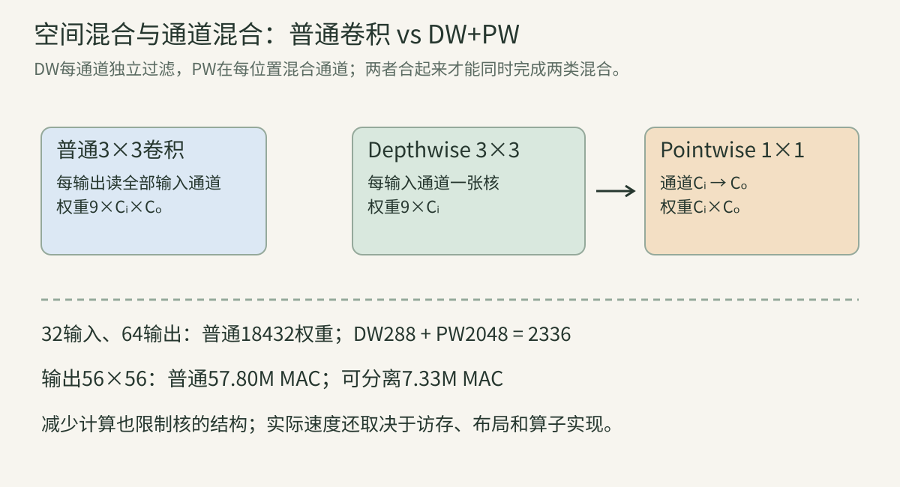
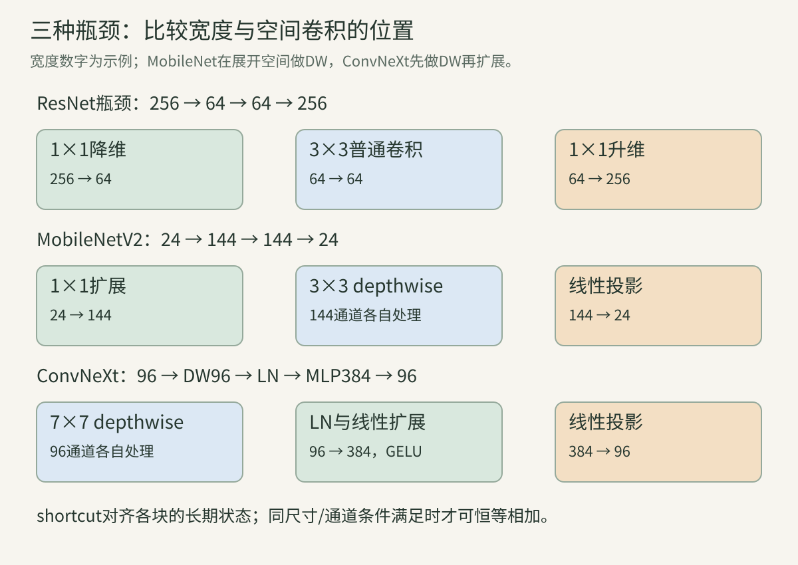
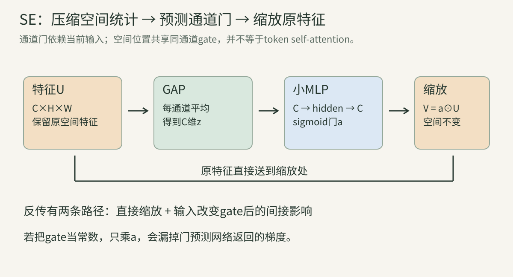
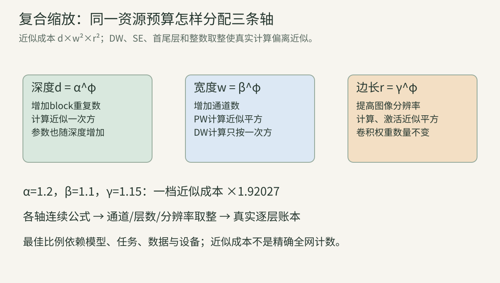

> 小模型不是把大模型的层数随意删掉。架构要同时考虑表达、计算、访存、硬件与训练。本文从卷积中的两类混合开始，完整解释MobileNet、EfficientNet和ConvNeXt的技术链路。先修是[多通道卷积](../vision-06-classical-cnn/)、[瓶颈与MAC](../vision-07-vgg-inception/)和[残差连接](../vision-08-resnet-densenet/)。所有速度推断都与特定论文测量或本文理论账本区分。

## 一、先定义“高效”要优化什么

### 1. 精度、大小、延迟、吞吐和训练成本

**参数大小** 影响权重存储；**单次延迟** 影响多久得到一个答案；**吞吐** 是单位时间处理多少样本；**峰值内存** 决定能否运行；**训练成本** 还包含反传、优化器、数据和更新次数。各目标可能冲突。

例如batch1延迟低的网络，在大batch GPU上吞吐未必最高。可存进手机的权重，训练时也可能超出显存。研究先写出约束：在何种任务、什么设备和软件上，以何种精度获得多少效果，再谈架构。

### 2. 为什么MAC不等于时间

MAC只是一种算术计数。实际执行还包括读写数据、调度、布局转换、同步、算子融合和缓存行为。大而规则的矩阵计算有时比很多小算子更容易利用硬件。

因此“少一半MAC”是结构事实，不是“快一倍”的实测结论。本文的程序不计时真实网络；历史论文的计时也不能搬到你的CPU/GPU上。前沿工程章节还会完整讲量化、编译与部署。

### 3. 计算强度与带宽瓶颈

粗略定义计算强度$I=\text{运算数}/\text{搬运字节数}$。假设硬件峰值算力$P$和带宽$B$，理想上性能受$\min(P,BI)$限制。这个上界直觉称为roofline式分析；真实缓存层级与算子实现会让情况更复杂。

普通卷积可能重复复用权重和输入；depthwise每通道独立，运算少，但仍需搬运大特征图。减少运算可能使相对访存代价更突出，不能只看参数与MAC。

### 案例A：同样“高效”却回答不同问题

模型甲权重4MiB、batch1延迟15ms；乙权重12MiB、延迟8ms。如果目标是严格8MiB权重预算，甲可用乙不可用；若预算充足且目标10ms，乙满足甲不满足。

还应核对预处理与后处理是否计时、精度是否相当、是否稳定热状态、是否同线程数。不存在脱离目标的单一“最高效架构”。

## 二、卷积中的空间混合与通道混合

### 4. 普通卷积一次完成两类操作

设输入$X\in\mathbb R^{C_{\rm in}\times H\times W}$，卷积输出通道$o$：

$$
Y_{o,h,w}=\sum_{i=1}^{C_{\rm in}}\sum_{u,v}W_{o,i,u,v}X_{i,h+u,w+v}.
$$

对$u,v$求和在局部空间混合；对$i$求和在通道间混合。每个输出通道可以对每个输入通道采用不同空间核，表示自由度大，权重为$K^2C_{\rm in}C_{\rm out}$。

### 5. group convolution先划分通道组

把输入和输出分别分成$g$组，一组输出只读对应输入组。每组输入$C_{\rm in}/g$、输出$C_{\rm out}/g$，要求可整除，权重与MAC约减少为普通卷积的$1/g$。

group不是把图像划成g个空间块，也不是batch分组。不同组在这一层不交流；后面的全通道1×1、shuffle或其他连接可重新交换信息。第06讲AlexNet跨设备分组与这里的运算定义有关，但用途和设计时代不同。

### 6. depthwise是怎样的特殊分组

depthwise multiplier1令$g=C_{\rm in}$且$C_{\rm out}=C_{\rm in}$。每个通道一张空间核，独立计算：

$$
Z_{i,h,w}=\sum_{u,v}D_{i,u,v}X_{i,h+u,w+v}.
$$

权重$K^2C_{\rm in}$，MAC为$H_oW_oK^2C_{\rm in}$。它不在这一步混合通道。depth multiplier$m$可以每输入通道产生$m$个输出，权重和计算再乘$m$；本文默认1，不把“depth”误解成网络层数。

### 7. pointwise用1×1混合通道

对depthwise输出再计算：

$$
Y_{o,h,w}=\sum_iP_{o,i}Z_{i,h,w}.
$$

它在每个位置用共享矩阵$P$混合通道，权重$C_{\rm in}C_{\rm out}$。单独看1×1不增加空间感受野，但它可以组合前面已看过邻域的特征。

图中每个通道先各自做空间滤波，之后通道投影将结果组合。把每通道独立过滤称为“depthwise”，把每位置通道混合称为“pointwise”，二者合起来才是这里的depthwise separable convolution。

### 8. 深度可分离卷积的成本公式

对相同输出空间面积$A=H_oW_o$，普通卷积与DW+PW分别：

$$
M_{\rm regular}=AK^2C_{\rm in}C_{\rm out},\qquad
M_{\rm sep}=A(K^2C_{\rm in}+C_{\rm in}C_{\rm out}).
$$

比值：

$$
\frac{M_{\rm sep}}{M_{\rm regular}}=\frac1{C_{\rm out}}+\frac1{K^2}.
$$

这里忽略bias、BN、激活与中间写回；深度乘数1、DW后PW、没有额外扩展。不能把公式直接用于带expansion、SE的MBConv全块，也不能把K=1时还拆两层当作必然节省。

### 算例B：3×3、32输入、64输出的成本

普通权重$9\times32\times64=18432$；DW权重288，PW2048，总2336，是普通的12.6736%。输出56²时，普通57802752 MAC，可分离7325696 MAC。

PW占可分离卷积权重与MAC的$2048/2336\approx87.67\%$。核分解后，主要成本常转移到1×1通道混合；继续优化DW的9个空间系数，未必带来很多整网收益。

### 9. 分解限制了哪些函数

若DW和PW中间没有非线性，有效普通卷积核是$W_{o,i,u,v}=P_{o,i}D_{i,u,v}$。固定输入通道$i$后，不同输出通道的空间核只能是同一$D_i$的不同倍数。

将该输入通道对应的核写成$C_{\rm out}\times K^2$矩阵，rank至多1；普通卷积可更高。因此参数少来自函数结构限制，不是把任何训练好的普通卷积都无损变小。中间激活、更多通道与更多层可扩大表示，但不能声称单块完全等价。

### 算例C：不可用一个DW+PW表示的空间核

取一个输入通道、两个输出通道、两位置教学核。希望第一个输出用$(1,0)$，第二个用$(0,1)$。这两个核不成比例，组成的2×2矩阵rank2。

一个DW核$d$再由两个PW系数缩放，只能得到$p_1d,p_2d$，无法同时产生上述目标。增加depth multiplier到2并用PW组合才可能消除这一特定限制，同时也增加资源。

### 10. 反向传播没有跨通道DW求和

PW梯度先做通道反传，$g_Z=P^\top g_Y$；DW对每个通道分别计算核梯度和输入梯度，同一核被所有空间位置使用，仍然累计这些位置。

因此DW虽不混合输入通道，但在后续PW和loss影响下，不同通道的参数会收到与整体任务有关的信号。不能把“前向此层独立”误解成“训练目标互不相关”。

### 11. 空间可分离与深度可分离不同

1×K再K×1分解的是二维空间核；DW再PW分离的是空间滤波与通道混合。前者单通道线性时受空间rank约束；后者受每输入通道到多个输出空间核的rank约束。

两种可组合，但组成的结构与中间非线性应明确。第07讲Inception的非对称核分解不能自动套用本讲DW成本公式。

## 三、MobileNetV1到V2：从分解到倒残差

### 12. V1的基本模块与整网链

MobileNetV1采用普通stem卷积，之后反复DW → BN → ReLU → PW → BN → ReLU，通过部分DW stride2降采样，最后GAP与分类头。[V1原论文](https://arxiv.org/abs/1704.04861)

224输入、宽度1时，stem输出32×112²。后续DW/PW对的输出通道与首DW stride如下：

| 对数 | 输出通道 | DW stride | 输出空间 |
| --- | ---: | ---: | ---: |
| 1 | 64 | 1 | 112 |
| 2、3 | 128、128 | 2、1 | 56 |
| 4、5 | 256、256 | 2、1 | 28 |
| 6 | 512 | 2 | 14 |
| 7—11 | 每对512 | 每对1 | 14 |
| 12、13 | 1024、1024 | 2、1 | 7 |

每对DW保留输入通道数，PW才改变通道数。这是表中“输出通道”的含义，不能把DW也默认变为同样输出宽度。

### 13. width和resolution multiplier

宽度乘子$\alpha$把主要通道变成约$\alpha C$，分辨率乘子$\rho$把空间边长变成约$\rho H$。DW项约按$\alpha\rho^2$缩放，PW项约按$\alpha^2\rho^2$缩放。

所以“通道减半，计算四分之一”是PW主导时的近似；首层固定RGB输入、分类头、通道取整与DW项都会偏离。分辨率变化还会改变信息和采样，不能保证精度只按一个光滑比例下降。

### 算例D：宽度减半后的精确比例

算例B变为16输入、32输出，DW+PW权重$9\times16+16\times32=656$，对原2336比例约28.08%，不是25%。若空间边长也减半，MAC再乘1/4，约为原来的7.02%。

完整网络还包含无法按相同方式缩小的首层、最后投影、头与归一化，这里只算指定模块。

### 14. 为什么V2先扩大再缩小

ResNet瓶颈常在宽状态之间先压窄再计算；MobileNetV2连接的是较窄状态，在分支内先用1×1扩到较宽空间，再用DW提取，最后1×1线性投影回窄状态，因此叫inverted residual。[V2原论文](https://arxiv.org/abs/1801.04381)

设输入$C$，扩展系数$t$，中间$E=tC$，输出$C'$。扩展层增加不同通道方向的容量，DW以较低成本对这些方向做空间变换；投影压回较小的长期状态。

### 15. V2块的顺序与shortcut条件

典型块：1×1 expansion → BN → ReLU6 → 3×3 DW → BN → ReLU6 → 1×1 projection → BN。投影之后不再ReLU6；仅当stride1且$C=C'$时与输入相加。

$t=1$的特殊块通常省去无意义的expansion层。stride2放DW上，此时空间变小，通常没有恒等shortcut。**倒残差不意味着每个块都有残差相加。**

图中MobileNet在扩展空间做DW；ConvNeXt把DW放在扩展之前，然后做通道MLP。顺序影响计算和激活宽度，即使两者都有1×1扩展和投影，也不是同一个模块。

### 16. 线性瓶颈是在保护什么

ReLU把负数变零，低维状态中的信息可能被不可逆地压掉；V2把非线性主要放在较宽中间空间，让最后窄投影保持线性。这里linear指投影后不加激活，不是整个块没有非线性。

论文以低维流形与嵌入空间解释设计动机。这里的“流形”可理解为高维特征实际集中在较低自由度的结构上；更宽表示可能有更多方向承载信息。但扩展/ReLU也不保证任意输入可逆，投影同样可能丢信息，必须结合任务学习。

### 算例E：宽空间ReLU如何保存一个有符号数

窄表示$x$直接ReLU后，$x=-1,-2$都变0，符号和大小丢失。先映射为$(x,-x)$，ReLU得到$(\max(x,0),\max(-x,0))$，再用线性权重$(1,-1)$恢复$x$。

这个构造对一维输入说明扩展空间可以保留符号信息；不是证明所有V2训练出的扩展矩阵都具有此结构，也不说明压缩任意高维输入都无损。

### 17. ReLU6的定义与适用边界

$\operatorname{ReLU6}(x)=\min(\max(x,0),6)$，将输出限制在[0,6]。非零区间的局部导数1，区间外为0，边界使用次梯度约定。

有限范围有助于某些低精度实现控制激活量级，但不能单凭用了ReLU6保证量化准确。量化还要校准分布、选择scale/zero-point、核对每通道或每张量规则与算子支持。

### 算例F：一个V2块的参数与激活

$C=C'=24,t=6,E=144,K=3$，stride1。卷积权重$24\times144+9\times144+144\times24=8208$；BN affine$2(144+144+24)=624$，合计8832。

56²的展开激活含451584个数，FP32约1.7227MiB；输入只有75264个数，约0.2871MiB。权重少不代表展开中间结果小，训练期间还要保存更多值。

### 18. stride2为什么不能按一个面积算全部层

若输入56²，expand 1×1通常仍在56²计算，DW stride2和projection在28²计算。因此权重可以一样，MAC为：

$$
56^2CE+28^2(K^2E+EC').
$$

不能把三项都乘28²，否则漏掉扩展高分辨率的成本。若$t=1$且省expansion，则第一项不存在。padding与奇数输入还需使用完整卷积尺寸公式。

### 算例G：24→32、t6、stride2

输入56²，$E=144$。expand为10838016 MAC，DW为1016064，projection为3612672，合计15466752。若把expand也错按28²，只得7338240，低估超过一半。

shortcut此时没有恒等加法；宽度从24到32也不匹配，不能依靠广播处理。

### 19. V2的完整stage表

以下$t$相对每个块实际输入宽度，首块stride$s$，后续块stride1：

| 部分 | t | 输出c | 重复n | 首stride | 输出边长 |
| --- | ---: | ---: | ---: | ---: | ---: |
| stem 3×3 | — | 32 | 1 | 2 | 112 |
| 倒残差1 | 1 | 16 | 1 | 1 | 112 |
| 倒残差2 | 6 | 24 | 2 | 2 | 56 |
| 倒残差3 | 6 | 32 | 3 | 2 | 28 |
| 倒残差4 | 6 | 64 | 4 | 2 | 14 |
| 倒残差5 | 6 | 96 | 3 | 1 | 14 |
| 倒残差6 | 6 | 160 | 3 | 2 | 7 |
| 倒残差7 | 6 | 320 | 1 | 1 | 7 |
| 末1×1 | — | 1280 | 1 | 1 | 7 |
| GAP、dropout、分类 | — | 1000 | — | — | 1 |

例如24通道组首块读16，expand96；第二块读24，expand144。整组“t6”不意味着每个块拥有相同中间通道。末层1280与width multiplier在一些实现中采用特殊规则，复现时需看代码。

### 20. 内存高效推理是一种实现策略

倒残差持久状态较窄，但中间扩展仍宽。若将部分通道的DW与projection分块流水并累计结果，可以避免完整物化展开张量；是否做到取决于编译器、缓存、布局与算子融合。

训练反传需要的值、eval统计和推理重用规则不同，不能把论文的推理内存策略直接说成训练显存等比例降低。架构提供实现机会，框架默认执行是否利用它仍需测量。

## 四、SE、搜索与MobileNetV3

### 21. SE先把空间压成通道描述

Squeeze-and-Excitation先对每通道做GAP：$z_c=\frac1{HW}\sum_{h,w}U_{c,h,w}$；再用小MLP产生通道gate：

$$
a=\sigma(W_2\phi(W_1z)),\qquad V_{c,h,w}=a_cU_{c,h,w}.
$$

$W_1$降低隐藏维，$W_2$还原通道；$\phi$为非线性，$\sigma$常为sigmoid。gate随输入变化，而非固定的训练参数向量。[SE原论文](https://arxiv.org/abs/1709.01507)

GAP丢弃具体空间排列，gate对同一通道各位置相同。SE可以利用全图统计调节局部特征，但不是让每个位置直接复制任意其他位置的内容。

图中下方保留原始特征，是被缩放的内容；上方统计支路决定缩放比例。反传也沿这两路返回，下一节会写出完整公式。

### 22. SE与self-attention为何不能等同

SE输出每通道一个权重，通常将本位置已有特征缩放；token self-attention通常为每个query计算对多个位置的权重，再汇聚value。权重对象、轴与输出机制不同。

“attention”一词在论文中有广义和具体算子的不同用法。先写张量shape、归一化轴和汇聚对象，才能比较机制，不要只凭名字判断一个模块拥有全局空间关系建模。

### 算例H：SE的具体数值与参数

两通道每通道两位置：$U_1=(1,3)$、$U_2=(2,4)$，所以$z=(2,3)$。若gate输出$(0.25,0.8)$，则$V_1=(0.25,0.75)$、$V_2=(1.6,3.2)$。

$C=64$、隐藏16，带bias的两线性层参数$64\times16+16+16\times64+64=2128$。MLP仅作用于1×1通道向量，但GAP和全图缩放仍有计算与访存，不可把整个SE成本只算2128个数。

### 23. gate输入依赖使梯度多一条路径

将特征展平，写$V=U\odot a(U)$，则：

$$
g_U=a\odot g_V+J_a^\top(U\odot g_V).
$$

第一项是直接缩放路径，第二项是输入改变gate后返回的路径。GAP让gate导数传播到同一通道的各位置；MLP通道混合还会产生跨通道依赖。

如果把gate当作常数反传，只保留第一项，就训练了不同计算图。sigmoid饱和会减弱第二项，但直接项仍由gate大小决定。

### 算例I：最小门控图的有限差分目标

设一通道两个位置$(u_1,u_2)$，$z=(u_1+u_2)/2$，$a=\sigma(z)$，分数$q=a(u_1+u_2)$，loss$\frac12(q-t)^2$。

令$g=q-t$，对每个位置：

$$
\frac{\partial\mathcal L}{\partial u_i}=g\left[a+\frac{u_1+u_2}{2}a(1-a)\right].
$$

括号第二项来自gate。取$u_1=1,u_2=3,t=1$，$a\approx0.880797$，两个输入梯度均约2.752254；后面的程序会核对，不把这一简图当成完整SE网络。

### 24. NAS的搜索空间、算法和评价分开看

neural architecture search通常有三部分：允许搜索哪些结构；如何提出候选；用什么指标评价候选。搜索结果受核、扩展、通道、层数、SE选项与训练代理预算限制。

hardware-aware NAS把真实目标设备测得的延迟加入评价。MnasNet强调平台感知与多目标搜索。[MnasNet原论文](https://arxiv.org/abs/1807.11626)

延迟表来自哪台设备、线程和runtime，对搜索结果有直接影响。搜出的结构不保证换设备仍最优；短训练代理的排名也不一定等于完整训练排名。

### 25. 多目标reward与Pareto前沿

教学目标$R=A(T/T_0)^w$，$A$是精度比例、$T$是延迟、$T_0$是参照、$w<0$惩罚延迟。这把多目标折成一个偏好，但改变$w$会改变最优结构。

若一个候选在精度更高且延迟更低，它支配另一个；没有候选能同时改善所有目标的一组称Pareto前沿。前沿不是单个“冠军”，还需用户预算选择。

### 算例J：精度更高但reward更低

取$w=-1,T_0=10$。甲$A=0.75,T=10$，reward0.75；乙$A=0.77,T=12$，reward约0.6417。乙精度高但延迟惩罚更大。

这个教学reward比不少论文的惩罚更强，不能冒充某NAS论文的实际超参数。它说明搜索目标怎样体现偏好，而非声称速度比精度永远重要。

### 26. V3并不是只给V2加SE

MobileNetV3结合平台感知搜索、NetAdapt式逐层调整、不同核/扩展/SE/激活选择，并重设计首尾层，形成Large与Small。[V3原论文](https://arxiv.org/abs/1905.02244)

因此每个块的扩展不必是固定t6，不是所有块都有SE，也不是所有位置都使用hard-swish。要读整表中的kernel、expansion、out、SE、activation和stride，不能把一张示意块图当作全网。

### 27. hard-sigmoid和hard-swish逐段推导

定义$h\sigma(x)=\operatorname{ReLU6}(x+3)/6$，$h\operatorname{swish}(x)=x h\sigma(x)$。所以：

$$
h\operatorname{swish}(x)=\begin{cases}0,&x\leq-3,\\x(x+3)/6,&-3<x<3,\\x,&x\geq3.\end{cases}
$$

中段是二次函数，不是整函数分段线性。hard-sigmoid才是分段线性近似。它省去指数型sigmoid，并可能利于部署，但具体融合与量化核支持仍决定延迟。

### 算例K：hard-swish的值与导数

$x=-4$输出0；$x=-2$输出$-1/3$；$x=0$输出0；$x=2$输出5/3；$x=4$输出4。中段导数$(2x+3)/6$，在$x=-2$为$-1/6$。

因此hard-swish允许负输出，而且中段一部分不是单调递增。不要把它解释成“把负值全置零的更平滑ReLU”。±3处连续但导数存在折点。

### 28. V3-Large架构表如何读

224输入，stem16通道stride2使用HS；RE表示ReLU，HS表示hard-swish。下表列出全部15个倒瓶颈块，exp是绝对扩展通道：

| 块 | 核 | exp | 输出 | SE | 激活 | stride |
| --- | ---: | ---: | ---: | --- | --- | ---: |
| 1 | 3 | 16 | 16 | 否 | RE | 1 |
| 2 | 3 | 64 | 24 | 否 | RE | 2 |
| 3 | 3 | 72 | 24 | 否 | RE | 1 |
| 4 | 5 | 72 | 40 | 是 | RE | 2 |
| 5、6 | 5 | 120 | 40 | 是 | RE | 1 |
| 7 | 3 | 240 | 80 | 否 | HS | 2 |
| 8 | 3 | 200 | 80 | 否 | HS | 1 |
| 9、10 | 3 | 184 | 80 | 否 | HS | 1 |
| 11 | 3 | 480 | 112 | 是 | HS | 1 |
| 12 | 3 | 672 | 112 | 是 | HS | 1 |
| 13 | 5 | 672 | 160 | 是 | HS | 2 |
| 14、15 | 5 | 960 | 160 | 是 | HS | 1 |

然后1×1到960，GAP，再到1280并分类。Small使用另一张配置表，资源目标不同，不等于机械地把Large全部通道减半。这里重点完整解释Large结构与共同机制，Small的每层参数比较可按同样账本方法另算。

### 29. 分类尾层移到池化后有什么收益

假设960→1280的1×1在7²上做，需要60211200 MAC；先GAP再做只需1228800，相差49倍。若非线性与池化顺序改变，函数也可能不同。

即使纯线性层能与平均交换，有bias、激活、BN统计或训练dropout时都要核对图。架构设计不是只把算子“挪到便宜位置”却保证完整函数不变，而是设计新的成本/表达权衡并实验验证。

## 五、EfficientNet：怎样协调深度、宽度与分辨率

### 30. 单轴放大为什么会遇到瓶颈

提高分辨率提供更多细节，但模型需要容量与感受范围处理它；增宽增加每层表示维度，但深度不足可能限制组合；增深增加变换，但过窄或低分辨率可能限制信息。

EfficientNet提出协调三轴的compound scaling，并使用搜索得到的B0基线。[EfficientNet原论文](https://arxiv.org/abs/1905.11946)

这是针对基线与训练条件的经验性设计，不是证明所有任务都有相同最佳扩展比例。资源预算、数据和目标任务改变时，需要重新验证。

### 31. 复合缩放公式从成本近似来

设深度倍数$d$、宽度$w$、空间边长$r$。对普通通道混合主导的卷积，计算约按$dw^2r^2$缩放。定义：

$$
d=\alpha^\phi,\quad w=\beta^\phi,\quad r=\gamma^\phi,\qquad\alpha\beta^2\gamma^2\approx2.
$$

$\phi$是资源扩展程度，$\alpha,\beta,\gamma$是确定如何分配资源的系数，于是计算约按$2^\phi$增加。模型参数主要受$d,w$影响，不因同样权重使用在更高分辨率而直接增加。

DW、SE、头、取整、stage分配都会破坏精确比例，因此这个近似不是全网精确FLOP恒等式。

图中宽度与边长的平方来自两个通道轴与两个空间轴；深度来自重复层数。对depthwise只含一个通道轴，因此整网还需逐层计算。

### 算例L：一个资源倍数的逐项核算

采用论文搜索得到的示例系数1.2、1.1、1.15，$\phi=1$时乘积$1.2\times1.1^2\times1.15^2=1.92027$，接近2但不是严格2。

224的连续空间目标为257.6，真实图像尺寸必须取整；通道常取8的倍数、block数需整数。不能用上述连续公式声称每个公开B0—B7检查点都恰好遵循未取整的小数层数。

### 32. MBConv与V2有什么继承和变化

EfficientNet-B0以倒瓶颈/DW/线性投影为核心，增加SE，采用swish一类激活，并组合不同核与重复数。swish/SiLU形式为$x\sigma(x)$，不是ReLU6或hard-swish。

同shape块可残差，变shape块不使用恒等相加；SE常在扩展特征上执行。SE隐藏宽度有按块输入通道比例或扩展通道比例的不同实现约定，参数差很大，必须写清是哪一种。

### 33. B0完整stage与输出尺寸

以下统一写**输出**尺寸，以免把原表的stage输入分辨率误读为输出。224输入，首块stride如下，后续重复stride1：

| 部分 | operator | 核 | 输出C | 重复 | 首stride | 输出边长 |
| --- | --- | ---: | ---: | ---: | ---: | ---: |
| stem | regular conv | 3 | 32 | 1 | 2 | 112 |
| 1 | MBConv1 | 3 | 16 | 1 | 1 | 112 |
| 2 | MBConv6 | 3 | 24 | 2 | 2 | 56 |
| 3 | MBConv6 | 5 | 40 | 2 | 2 | 28 |
| 4 | MBConv6 | 3 | 80 | 3 | 2 | 14 |
| 5 | MBConv6 | 5 | 112 | 3 | 1 | 14 |
| 6 | MBConv6 | 5 | 192 | 4 | 2 | 7 |
| 7 | MBConv6 | 3 | 320 | 1 | 1 | 7 |
| head | 1×1、GAP、linear | 1 | 1280→1000 | — | 1 | 7→1 |

共有16个MBConv，不是16个普通卷积；MBConv1通常省扩展，其他块具有多卷积和SE。结构细节与通道取整以实现为准。

### 34. B0的SE参数不能误用扩展宽度比例

本文账本对应常见实现：扩展宽度$E=tC$，SE隐藏$S=\max(1,\lfloor C/4\rfloor)$，而SE作用在$E$通道上。两带bias投影参数$2ES+S+E$，两线性乘加$2ES$。

普通SE模块也可定义隐藏$E/4$；MobileNetV3相关约定与B0不同。若把B0的$C/4$换成$E/4$，t6时隐藏约大六倍，不是无关紧要的记号变化。

### 算例M：24输入、t6的SE账本

$E=144,S=6$，SE参数$2\times144\times6+6+144=1878$；若误用$S=36$，则10548。参数相差8670。

核5、输出40的MBConv还要算expand3456、DW3600、projection5760，及BN affine$2(144+144+40)=656$；首块共15350可学习参数。SE统计与门控遍历的空间操作不包含在此权重计数中。

### 35. DropPath/stochastic depth与Dropout

Dropout通常随机置零某些激活元素；stochastic depth/DropPath可随机丢弃整条残差分支。保持期望的一种约定：训练$x'=x+\frac{m}{p}F(x)$，$m\sim\operatorname{Bernoulli}(p)$；eval用完整分支。

mask常按样本广播到该分支所有空间/通道，具体实现要核对。它是训练正则，不表示推理每次也随机跳过层，不保证训练计算真的节省，因为不少实现仍先算分支再乘mask。[stochastic depth原论文](https://arxiv.org/abs/1603.09382)

### 算例N：期望不变，样本不相同

$p=0.8$，分支值4，输入10。保留时输出$10+4/0.8=15$，丢弃时10。期望$0.8\times15+0.2\times10=14$，与eval14一致。

保持这一线性加法的期望，不代表后续非线性网络输出期望也等于eval输出，Jensen效应与后续结构仍会改变结果。

### 36. V2的目标包含训练效率

EfficientNetV2考虑加速器训练速度，用Fused-MBConv替换部分早层，并采用训练感知搜索、不同stage扩展与渐进式学习。[EfficientNetV2原论文](https://arxiv.org/abs/2104.00298)

Fused-MBConv通常用普通K×K卷积同时完成输入到扩展通道的空间/通道混合，再1×1投影；t1时可只用普通卷积。它不是把已训练expand和DW无损合并为任意普通卷积，尤其原先带有BN/激活。

### 37. Fused为何可能MAC更多却训练更快

普通卷积可能更充分利用加速器，减少小算子和中间访存。Fused适合哪些stage需实验，因为把所有stage都换成普通卷积可能大幅增成本。

输入$C=24,E=96,C'=48,K=3$，MBConv卷积权重$2304+864+4608=7776$；Fused为$9\times24\times96+96\times48=25344$。权重更多，执行效率仍可能更好。论文速度来自其明确设备与训练协议，本文没有重测。

### 38. 渐进式分辨率为什么还要调整正则

早期低分辨率可降低训练计算，之后提升图像尺寸；模型学习容量和输入细节变化时，增强与正则强度也可以随阶段调整。EfficientNetV2把渐进学习与自适应正则结合，而不是只缩小前几轮图片。

如果全程强正则和小输入导致过难任务，训练可能受影响；只比较最后分辨率而不看完整训练日程会漏掉成本。记录每阶段尺寸、更新数、增强、dropout/DropPath与学习率。

### 39. V2-S结构与“V2”名称

V2-S主要stage按Fused1/24/2，Fused4/48/4，Fused4/64/4，MB4/128/6，MB6/160/9，MB6/256/15排列；斜杠后依次是输出通道和重复数。前面stem24、后面1×1到1280，主要下采样发生在48、64、128、256组首块。

这个V2指EfficientNet第二代结构与训练研究；Torchvision某模型枚举中的“IMAGENET1K_V2”可能是第二套权重配方，两者不能只按字符串类比。

## 六、ConvNeXt：现代卷积怎样重建强基线

### 40. 架构比较先把训练配方补齐

ConvNeXt从ResNet出发，先采用现代训练技术，再研究宏观stage、stem、depthwise、倒瓶颈、核与微观归一化/激活。它提醒我们：旧CNN与新Transformer的系统差异可能同时包含架构、训练、预训练数据和评估尺度。[ConvNeXt原论文](https://arxiv.org/abs/2201.03545)

只把旧配方CNN与更长训练、更强增强的新模型比较，不能把全部收益归因于attention。反过来，现代CNN有竞争力也不证明attention在所有任务无用；需要受控任务与资源比较。

### 41. patchify stem与独立下采样

ConvNeXt常见stem采用4×4 stride4卷积，再归一化，224→56。可将它看作对不重叠4×4图块共享投影，与patch embedding的操作相近，但后续仍是空间特征图的卷积处理。

stage之间用归一化与2×2 stride2卷积改变尺寸与通道，块内只处理同shape残差。这样把下采样边界与重复块分开，不在每个同shape块偷偷改变空间。

### 42. 一个ConvNeXt块逐步展开

典型顺序：7×7 DW → 每位置对通道做LN → 线性$C\to4C$ → GELU → 线性$4C\to C$ → 每通道LayerScale → stochastic depth → 加输入。

DW在原宽度$C$上执行，再扩展通道，与MobileNetV2在展开宽度上做DW不同。空间局部混合与通道MLP分离；同shapeshortcut保留。GELU只放在通道MLP中间，而不是每个卷积后都接。

### 43. LN的数据布局与统计轴

如果特征为NCHW，而LayerNorm实现期待最后一轴为通道，则需转换为NHWC或使用明确的channel-first实现。每个空间位置对C通道归一化，不是对整张$C\times H\times W$一起归一化。

布局转换可以只是view或实际搬运，取决于张量stride、contiguous需求和kernel。能写出相同数学不代表相同运行时间。BN与LN的训练/推理统计、batch依赖也不同。

### 算例O：7×7 DW为何可承受较大核

同宽96通道，7×7普通卷积权重$49\times96^2=451584$；DW只有$49\times96=4704$。再接96→384→96通道MLP共73728权重，空间与通道成本分开。

完整块还含bias、LN和LayerScale；大核扩大局部感受范围，不能直接说成全局attention。层数、下采样与gate的统计依赖仍会影响最终感受与交互。

### 44. LayerScale与归一化不是一回事

LayerScale为每通道学习一个小scale$\gamma_c$，输出$x+\gamma\odot F(x)$。它不计算均值方差，只控制残差更新幅度，常从很小的正数开始。

BN/LN affine中的scale也叫gamma，但位于不同计算位置，含义不同。LayerScale的参数梯度由$F$与上游梯度相乘；输入梯度包括shortcut和scaled分支，与第08讲缩放残差相连。

### 45. ConvNeXt-T完整层级与账本

T的通道$(96,192,384,768)$，块数$(3,3,9,3)$；空间56、28、14、7；GAP后768维、末LN和1000类线性头。以下采用卷积/linear带bias、LN affine、LayerScale每通道1个，不计归一化buffer：

| 部分 | 可学习参数 |
| --- | ---: |
| stem conv+LN | 4896 |
| stage1，3块 | 237888 |
| downsample1 | 74112 |
| stage2，3块 | 918144 |
| downsample2 | 295680 |
| stage3，9块 | 10817280 |
| downsample3 | 1181184 |
| stage4，3块 | 14289408 |
| 末LN | 1536 |
| 分类头 | 769000 |
| 总数 | 28589128 |

同shape块参数$8C^2+58C$：DW权重与bias共50C，LN affine为2C，两线性层权重8C²、bias共5C，LayerScale为C。stage4因此为$3(8\times768^2+58\times768)=14289408$。下面程序按该规则独立核对全网。

### 46. CNN与ViT的归纳偏置怎样比较

归纳偏置是架构倾向优先表达或学习的模式。卷积共享局部核、倾向空间局部性和平移等变；stride/padding/边界会使严格等变有条件。全局self-attention提供输入依赖的位置交互，但patch组织、位置编码、窗口与层级同样引入偏置。

ConvNeXt结合现代训练与卷积结构；Swin等层级Transformer也采用局部窗口。两者不是“一个有偏置、另一个完全没有任何偏置”。需要比较数据效率、长程关系、密集任务、迁移、鲁棒性与成本，不能根据单个ImageNet数字判定所有应用。

### 47. 消融顺序为何不是独立因果贡献

先换训练、再改stage、再改核得到的一串精度增量，每一步都依赖当时上下文。核在旧结构无收益，放到新DW结构可能有收益；训练与架构存在交互。

因此逐步现代化路线说明一条有效设计路径，但不能把每个增量当成在任意模型都可相加的独立收益。更严格因果比较需重复、预算匹配以及相关因素的组合实验。

### 案例P：现代训练收益的四格对照

设置旧/新架构×旧/新配方四组。若旧架构换新配方已大幅提高，说明配方是重要变量；若新架构只在新配方上提高，说明存在交互；若两者在两配方下都差不多，架构影响可能较小。

还需保持数据、评估尺度、类别与资源目标一致。新配方训练更久造成更多成本，也应同时报告，不能当作同预算架构提升。

## 七、可运行算术与梯度实验

### 48. 实验一：DW/PW的小图与动态gate反传

下面使用两通道两空间位置的教学滤波，每通道权重先乘输入，再由PW混合成一个输出通道。它是理解通道独立性与链式法则的最小图，不是完整3×3实现。

~~~python
import math
def numeric(fn, v, eps=1e-6):
    grads=[]
    for i in range(len(v)):
        a,b=v[:],v[:]
        a[i]+=eps; b[i]-=eps
        grads.append((fn(a)-fn(b))/(2*eps))
    return grads

# v = X[channel0,pos0:2], X[channel1,pos0:2], D0,D1,P0,P1
v=[1.,2.,3.,4.,0.5,-1.,2.,-0.25]
def sep_loss(v):
    x0,x1,x2,x3,d0,d1,p0,p1=v
    y0=p0*d0*x0+p1*d1*x2
    y1=p0*d0*x1+p1*d1*x3
    return 0.5*(y0*y0+y1*y1)
x0,x1,x2,x3,d0,d1,p0,p1=v
y0=p0*d0*x0+p1*d1*x2
y1=p0*d0*x1+p1*d1*x3
analytic=[y0*p0*d0,y1*p0*d0,y0*p1*d1,y1*p1*d1,
          p0*(y0*x0+y1*x1),p1*(y0*x2+y1*x3),
          d0*(y0*x0+y1*x1),d1*(y0*x2+y1*x3)]
err=max(abs(a-b) for a,b in zip(analytic,numeric(sep_loss,v)))
assert err < 1e-7
print('DW/PW outputs:',y0,y1,'gradient error:',err)

def gate_loss(u):
    total=sum(u)
    a=1/(1+math.exp(-total/2))
    return 0.5*(a*total-1)**2
u=[1.,3.]
a=1/(1+math.exp(-2))
g=(4*a-1)*(a+2*a*(1-a))
err_gate=max(abs(n-g) for n in numeric(gate_loss,u))
assert err_gate < 1e-7
print('SE-like gate:',a,'input gradient:',g,'error:',err_gate)

def hard_swish(x):
    return x*min(6,max(0,x+3))/6
assert abs(hard_swish(-2)+1/3) < 1e-12
assert abs(hard_swish(2)-5/3) < 1e-12
print('hard-swish:',[(x,hard_swish(x)) for x in (-4,-2,0,2,4)])
~~~

### 49. 实验二：MobileNetV2、B0与ConvNeXt-T完整账本

程序独立按实际层输入和输出空间累加。BN/LN affine计参数；BN buffer不计。MAC计卷积/linear，EfficientNet另计SE两线性乘加；不计bias加、Norm、激活、池化、门控、残差加法和反传。

~~~python
# MobileNetV2, alpha1, RGB224, conv no bias, BN affine, linear with bias.
c,h=32,112
parts=[('stem',3*32*9+2*32)]
mac=h*h*3*32*9
spec=[(1,16,1,1),(6,24,2,2),(6,32,3,2),(6,64,4,2),
      (6,96,3,1),(6,160,3,2),(6,320,1,1)]
for index,(t,out,n,s) in enumerate(spec,1):
    count=0
    for j in range(n):
        stride=s if j==0 else 1
        e=t*c
        oh=h//stride
        if t!=1:
            count+=c*e+2*e
            mac+=h*h*c*e
        count+=9*e+2*e+e*out+2*out
        mac+=oh*oh*(9*e+e*out)
        c,h=out,oh
    parts.append(('stage'+str(index),count))
parts+=[('last conv',c*1280+2*1280),('head',1281*1000)]
mac+=h*h*c*1280+1280*1000
assert sum(v for _,v in parts)==3504872
print('MobileNetV2:',parts,'total',sum(v for _,v in parts),'MAC',mac)

# EfficientNet-B0, SE hidden uses input C/4, SE projections have bias.
c,h=32,112
parts=[('stem',3*32*9+2*32)]
mac=h*h*3*32*9
spec=[(1,3,16,1,1),(6,3,24,2,2),(6,5,40,2,2),(6,3,80,3,2),
      (6,5,112,3,1),(6,5,192,4,2),(6,3,320,1,1)]
for index,(t,k,out,n,s) in enumerate(spec,1):
    count=0
    for j in range(n):
        stride=s if j==0 else 1
        e,hidden=t*c,max(1,c//4)
        oh=h//stride
        if t!=1:
            count+=c*e+2*e
            mac+=h*h*c*e
        count+=k*k*e+2*e
        count+=2*e*hidden+hidden+e
        count+=e*out+2*out
        mac+=oh*oh*(k*k*e+e*out)+2*e*hidden
        c,h=out,oh
    parts.append(('stage'+str(index),count))
parts+=[('last conv',c*1280+2*1280),('head',1281*1000)]
mac+=h*h*c*1280+1280*1000
assert sum(v for _,v in parts)==5288548
print('EfficientNetB0:',parts,'total',sum(v for _,v in parts),'MAC',mac)

# ConvNeXt-T: bias in conv/linear, LN affine, per-channel LayerScale.
parts=[('stem',4*4*3*96+96+2*96)]
mac=56*56*4*4*3*96
channels=[96,192,384,768]
blocks=[3,3,9,3]
h=56
for i,(c,n) in enumerate(zip(channels,blocks)):
    # DW:49C+C; LN:2C; two linears:8C^2+5C; LayerScale:C.
    parts.append(('stage'+str(i+1),n*(8*c*c+58*c)))
    mac+=n*h*h*(49*c+8*c*c)
    if i<3:
        next_c=channels[i+1]
        parts.append(('down'+str(i+1),2*c+4*c*next_c+next_c))
        h//=2
        mac+=h*h*4*c*next_c
parts+=[('last LN',2*768),('head',769*1000)]
mac+=768*1000
assert sum(v for _,v in parts)==28589128
print('ConvNeXtT:',parts,'total',sum(v for _,v in parts),'MAC',mac)
~~~

### 算例Q：计数约定怎样影响最后一个数字

MobileNetV2本约定3504872参数；B0为5288548；ConvNeXt-T为28589128。它们来自明确层结构，不是按文件大小估算。BN运行统计作为buffer保存，但不属于这里的可学习参数。

如果MAC工具还统计SE的GAP/门控、Norm、激活与残差，输出会不同；如果把一MAC作为2FLOP，也会翻倍。先对齐规则，再判断差异是bug、架构变化还是统计边界。

### 50. 从账本走到部署的验证流程

先冻结数据、权重、预处理与实现，确认精度；再固定硬件、runtime、线程、batch、精度、warm-up与计时范围，记录p50/p95/p99延迟及吞吐，最后检查峰值内存和失败。

GPU需要合理同步，移动设备需记录功耗/温度，编译或量化后重新检查任务精度。只导出模型并成功执行一张图片，不等于证明整个数据集等效或业务延迟达标。

### 案例R：论文中的延迟为何不能搬进你的简历

论文在某手机、单大核与指定runtime上的数字，说明该条件下的模型测量。若你只阅读或复现架构账本，应写“理解/实现结构与计数”，不能写成自己在另一设备实现了同样延迟。

若实际测量，应保留设备、权重、输入、计时脚本和日志。结果只支持覆盖的任务和shape，不应变成跨所有设备的普遍加速声明。

## 八、练习与逐题解析

### 练习1：参数更少、MAC更少，能保证延迟更低吗？

**解析：** 不能。访存、算子调度、布局、并行与融合影响实测。需在冻结协议下计时。

### 练习2：group4、输入64、输出128、3×3，无bias权重多少？

**解析：** $9\times64\times128/4=18432$。每输出只读16输入通道，输入/输出须按组可整除。

### 练习3：depthwise multiplier1、64通道、5×5，输出通道与权重是多少？

**解析：** 输出64，权重$25\times64=1600$。这一层没有跨通道求和。

### 练习4：3×3可分离卷积、输出128，理论MAC比普通是多少？

**解析：** $1/128+1/9\approx0.118924$，条件为相同输出面积、multiplier1且无额外扩展等成本。

### 练习5：DW后有没有通道交流？

**解析：** DW本层没有，但后续PW通常混合通道；整网可以学习跨通道关系。

### 练习6：任意普通卷积都能无损换成一个DW+PW吗？

**解析：** 不能。线性无激活时，每输入通道对应输出空间核成比例，rank受限。增加中间容量或训练新网络是不同问题。

### 练习7：宽度减半为什么不是整网MAC精确四分之一？

**解析：** PW约按宽度平方，DW按一次方，RGB首层与分类头有固定维，通道还有取整。

### 练习8：V2扩展系数6、输入16、输出24，中间多少？

**解析：** 96，expansion相对当前输入，不相对输出。下一块读24时中间才是144。

### 练习9：V2 stride2或输入输出通道不同时还能恒等相加吗？

**解析：** 不能，典型实现不加恒等shortcut。倒残差指结构组织，不保证每块都有加法。

### 练习10：linear bottleneck是不是全块都是线性的？

**解析：** 不是，扩展和DW后仍有非线性；最后窄投影后不再加激活。

### 练习11：扩展到高维后ReLU能保证所有输入可逆吗？

**解析：** 不能。符号双通道例子展示一种可行构造，任意学习权重未必保留信息，最终压缩同样受限制。

### 练习12：stride2块的expand通常在哪个分辨率算？

**解析：** 输入分辨率。DW才下采样，projection在输出分辨率。因此MAC不能全部乘缩小后的面积。

### 练习13：SE的gate是在每像素上各自产生一份吗？

**解析：** 基本SE通过GAP产生每通道一个gate，同通道空间位置共享；不是标准空间self-attention矩阵。

### 练习14：反传gate只乘$a$够不够？

**解析：** 若gate随输入变化则不够，还要算$J_a^\top(U\odot g)$；把gate detach会改变计算图。

### 练习15：hard-swish在−2处的输出和导数是多少？

**解析：** 输出$-1/3$，中段导数$(2x+3)/6=-1/6$。它允许负值且不全域单调。

### 练习16：V3的Small是否为Large所有通道减半？

**解析：** 不是，采用不同配置与资源目标。Large也有不同扩展、核、SE与激活位置。

### 练习17：复合缩放$dw^2r^2$能精确统计MBConv全网吗？

**解析：** 只是通道混合主导近似。DW、SE、头、分辨率/通道/层数取整会偏离。

### 练习18：为什么分辨率翻倍不直接增加卷积参数？

**解析：** 权重在更多空间位置复用，数量不变；MAC和激活通常增约4倍，采样与任务信息也改变。

### 练习19：B0输入24、扩展144，SE隐藏按输入四分之一，是多少？

**解析：** 6。若按扩展四分之一则36，属于不同约定，不能混算参数。

### 练习20：DropPath保留期望，是否意味着每次输出都等于eval？

**解析：** 不意味着，训练有随机分支值；后续非线性还使整网输出期望未必等于eval。

### 练习21：Fused-MBConv为什么可能权重多却快？

**解析：** 普通卷积可能硬件利用率更高，减少分离小算子与访存。具体stage和设备决定结果，需实测。

### 练习22：ConvNeXt的DW在4C展开通道上吗？

**解析：** 典型块先在C上DW，再LN与C→4C→C的MLP。与V2顺序不同。

### 练习23：ConvNeXt的LN归一化哪些轴？

**解析：** 每空间位置对通道C归一化；NHWC最后轴是C，NCHW需要明确的轴实现或排列。

### 练习24：逐项现代化的精度增量可否随意加到任意模型？

**解析：** 不可。各改动依赖前面的结构、配方与预算，有交互；需要受控组合消融。

## 九、历史实验怎样阅读与复现

MobileNetV1原文表4比较普通卷积版本与可分离版本：ImageNet准确率71.7%与70.6%，同时参数和乘加显著减少。它说明该具体架构与训练协议下的权衡，不表示将任意普通卷积训练权重直接分解就只损失1.1个百分点。

V2原文表4的标准模型报告72.0% top-1、约300M乘加，并在Pixel 1单大核、TFLite上报告75ms。本文计算的3504872参数按所声明的BN affine与分类头约定，不能把论文四舍五入的3.4M当作不同实现必须逐位一致的目标。[V2训练与测量协议](https://arxiv.org/abs/1801.04381)

ConvNeXt现代化实验先固定改进配方：更长训练、AdamW、Mixup/CutMix、增强与正则，再逐步改结构。论文在该研究设置中仅更新训练就把ResNet50从76.1%提升到78.8%；它是比较架构前处理混杂变量的证据，不是每个数据集都能复制的固定2.7点收益。本文不复制论文排行榜为自己的测量。

EfficientNet的单轴/复合缩放消融回答资源如何分配；V2的Fused不同stage消融回答硬件与计算图怎样影响训练。各项结果须连同数据、尺寸、训练日程与设备看，不能只把最终准确率抄到一张脱离协议的表。

## 十、复现清单与后续阅读

一个可复现的高效CNN实验需记录完整stage表、groups/depth multiplier、expansion与投影激活、SE比例和门函数、残差条件、BN/LN统计轴、宽度/分辨率/取整、训练阶段与评估尺度。性能报告另附设备、runtime、layout、batch、精度和计时范围。

本讲的手算和程序验证局部梯度与架构算术，未执行真实模型训练、手机计时、GPU吞吐或量化精度评测。[第10讲](../vision-10-structured-tasks/)进入检测、分割、姿态、跟踪、光流和深度的结构化输出，解释一个分类向量为何不能直接完成所有视觉任务。完整进度见[课程地图](../vision-00-overview/)。

## 原始材料

- [Howard等：MobileNets](https://arxiv.org/abs/1704.04861)：DW/PW与宽度、分辨率资源权衡。
- [Sandler等：MobileNetV2](https://arxiv.org/abs/1801.04381)：倒残差、线性瓶颈与内存策略。
- [Howard等：Searching for MobileNetV3](https://arxiv.org/abs/1905.02244)：搜索、SE、激活和首尾优化。
- [Hu等：Squeeze-and-Excitation Networks](https://arxiv.org/abs/1709.01507)：通道统计与动态重标定。
- [Tan等：MnasNet](https://arxiv.org/abs/1807.11626)：平台感知搜索与多目标评价。
- [Tan与Le：EfficientNet](https://arxiv.org/abs/1905.11946)、[EfficientNetV2](https://arxiv.org/abs/2104.00298)：复合缩放、Fused模块与训练效率。
- [Liu等：A ConvNet for the 2020s](https://arxiv.org/abs/2201.03545)：ConvNeXt现代化、系统比较与限制。
- [Huang等：Deep Networks with Stochastic Depth](https://arxiv.org/abs/1603.09382)：残差路径的随机训练策略。
- Torchvision官方源码：[MobileNetV2](https://docs.pytorch.org/vision/stable/_modules/torchvision/models/mobilenetv2.html)、[EfficientNet](https://docs.pytorch.org/vision/stable/_modules/torchvision/models/efficientnet.html)、[ConvNeXt](https://docs.pytorch.org/vision/stable/_modules/torchvision/models/convnext.html)。本文账本对应注明的bias、Norm、SE与LayerScale约定。
