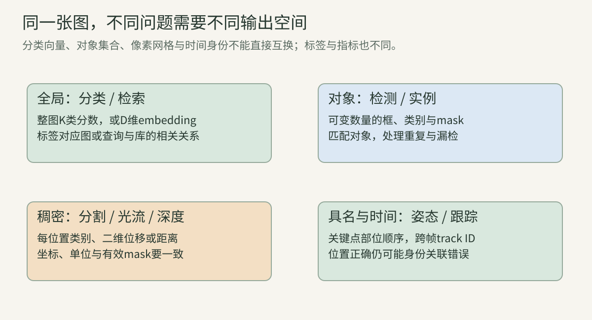
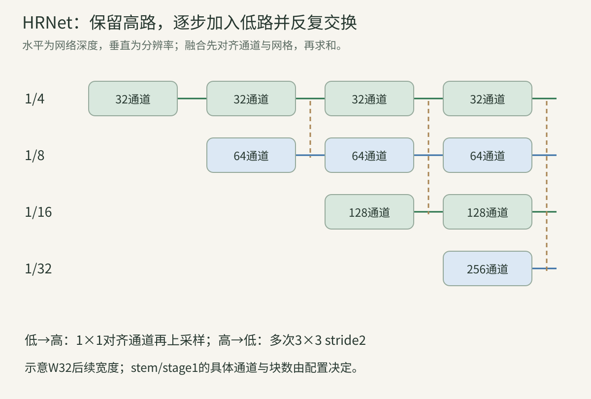
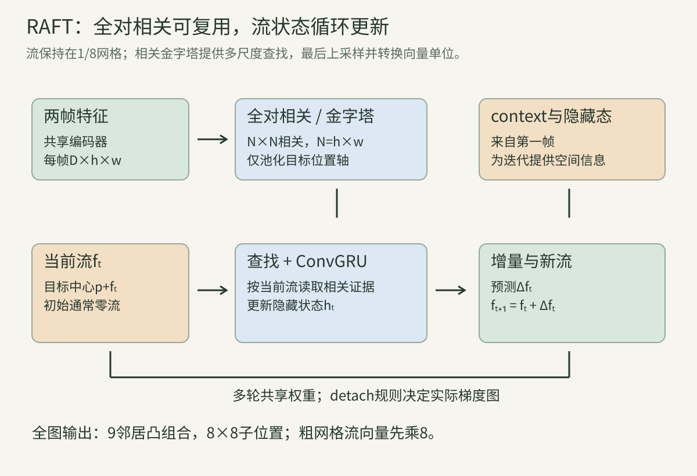

> 前面几讲主要以分类网络读架构，但视觉世界不只包含“这张图属于哪类”。本讲用同一套问题拆解不同任务：输出是什么？标签对应哪些位置？loss怎样计算？预测怎样变成最终答案？指标在惩罚什么？其中HRNet与RAFT作为结构化输出的两个核心案例完整展开。检测/分割的历代方法、视频跟踪与几何模型将在对应主线继续精读，不把本章入门解释当作整个任务领域已经完成。

## 一、任务决定输出，而不只是换一个模型名

### 1. 输入一样，问题可以完全不同

一张街景可以问“是否有汽车”，也可以问“所有汽车在哪”“每个像素属于什么”“这辆车下一帧是谁”“它移动了多少像素”“它距离相机多少米”。这些问题需要不同输出空间。

分类输出固定类别向量；检测输出数量可变的对象集合；分割输出空间标签；跟踪还需跨帧身份；光流为每个位置输出二维位移；深度为每个位置输出距离或相对几何量。共享视觉主干不意味着这些输出自动可互换。

### 2. 表征、主干、颈部、头和后处理

**backbone**提取特征，**neck**组合层级或尺度，**head**产生任务预测，**post-processing**把预测整理成可用结果。比如分类GAP+linear是头；检测特征金字塔是常见neck；阈值/NMS是后处理。

一个预训练主干提供可迁移表示，需要任务头、对应训练与坐标协议才能输出框或深度。视觉基础模型可支持多任务，但“编码向量里存在相关信息”与“接口已经可靠地产生任务结果”不同。

### 3. 输出shape的统一账本

用B为batch、K为类别/关键点数、Q为候选槽、H/W为空间尺寸：

| 任务 | 典型原始输出 | 核心语义 |
| --- | --- | --- |
| 单标签分类 | B×K logits | 整图类别 |
| 检索 | B×D embedding | 排序用表示 |
| 检测 | B×Q×(类别分数、4坐标) | 可变对象集合 |
| 语义分割 | B×K×H×W logits | 每位置类别 |
| 实例分割 | 对象集合+每对象mask | 类别与实例身份 |
| 关键点 | B×K×Hh×Wh热图，或B×K×2 | 具名部位位置 |
| 多目标跟踪 | 各帧对象+track ID | 跨帧身份 |
| 光流 | B×2×H×W | 像素二维位移 |
| 深度 | B×1×H×W | 距离/逆深度/相对量 |

这些是常见例子，并非所有方法都用固定Q或同样轴序。必须说明输出是logit、概率、坐标、编码增量还是解码后的结果。

### 4. 结构化输出为什么需要对应关系

分类的一张标签只要与一张图对应；检测集合没有天然顺序，需要把预测与真实对象匹配；关键点第k项对应特定部位，顺序不能任意交换；光流第(h,w)项对应第一帧该像素的位移。

统一训练loss前，先定义索引的意义。模型输出shape正确但顺序、坐标或单位错误，可能训练出完全不同任务。评价也要处理漏检、重复、无效位置和遮挡。

## 二、全局输出：分类与检索

### 5. 单标签与多标签分类

单标签互斥类别常用softmax与交叉熵；多标签可同时存在多类，常用每类sigmoid与BCE，目标为多个0/1。softmax迫使类别竞争，总概率1；sigmoid不要求各类之和为1。

“有猫、有狗”可同时为真，就不能直接使用互斥softmax标签。多标签阈值、类别不均衡、缺失标注也影响评价，预测sigmoid值不是自动校准的真实概率。

### 6. 分类精度在测什么

top-1检查最大分数类别是否正确；top-k检查正确类是否在前k个。宏平均按类等权，微平均按样本/决定项汇总，类别长尾时两者差异明显。

混淆矩阵检查错到哪些类，校准检查分数可信度，鲁棒性检查分布变化。高整图准确率并不意味着所有对象定位正确；模型也可能利用背景相关性答对。

### 7. 检索是查询与库的排序

给query embedding$q$和库向量$v_j$，用余弦或点积排序。例如归一化向量的点积等于余弦，相似度高者排前。输出不是固定类别编号，而是库中项目的顺序。

训练可使用类别、成对、三元组或对比目标；评价需定义哪些库项目相关、query是否也在库内、重复项与同身份规则。把query自身留在库中可能造成虚假的第一名命中。

### 算例A：相似度与相关性不是同一个标签

$q=(1,0)$，三个归一化库向量$(0.8,0.6),(1,0),(0,1)$，分数0.8、1、0。排序第二项、第一项、第三项。

若真实相关项只有第一项，则top-1失败、top-2成功；若第二项其实是query自身而协议要求排除，应先删掉再评价。相关性的任务定义先于余弦分数。

### 8. Recall@k与检索AP的约定

一种命中式Recall@k统计有至少一个相关项进入前k的query比例；另一种按query计算检出的相关项数/所有相关项数。图文检索、人脸检索和信息检索文献可能使用不同约定，要注明。

对完整相关列表，一种AP为每次检到相关项时的precision求和，再除以相关项总数。它既关心相关项能否出现，也关心它们排在多前面。若库被截断或相关标注不完整，指标意义变化。

### 算例B：检索AP手算

前5位相关标签为1、0、1、0、1，库内共有3个相关项。相关位置precision为1、2/3、3/5，AP为$(1+2/3+3/5)/3\approx0.75556$。

第1位命中不意味着AP为1；三个相关项全被检出也不意味着排序最佳。这一公式不能未经说明替代COCO检测的插值AP。

## 三、对象集合：检测、匹配与评价

### 9. 框的坐标、单位和有效性

常见$xyxy=(x_1,y_1,x_2,y_2)$或$cxcywh$；可用像素或相对宽高归一化。本文连续框面积为$(x_2-x_1)(y_2-y_1)$，不加1。离散inclusive整数框是另一约定。

resize、crop、letterbox后的框必须映射到同一坐标系，处理边界和无效框。图像shape通常H×W，坐标通常(x,y)，顺序不同最容易悄悄出错。

### 10. 检测预测怎样与真实对象配对

候选可来自anchors、稠密点或对象queries。训练需要定义正负样本/匹配，把分类和回归目标分配给适当预测；不同方法采用不同分配与损失，不在本章用一个规则概括所有检测器。

最终评价还需要按分数与IoU等规则匹配。训练匹配与评价匹配并不必相同，且多个高分预测指向一个GT会导致重复假阳性。

### 11. IoU从交并面积来

intersection over union定义：

$$
\operatorname{IoU}(A,B)=\frac{|A\cap B|}{|A|+|B|-|A\cap B|}.
$$

交集左右边界取max/min，宽高为非负。完全重合为1，不相交为0；无效框需在协议中单独处理，而不是靠分母加小数隐藏数据错误。

IoU度量相对重叠，不直接度量像素误差。相同平移对小框更严重；回归loss还可使用坐标L1、IoU变体等，后续检测章节逐一推导。

### 算例C：两框IoU与小目标敏感性

$A=(0,0,4,4),B=(2,0,6,4)$，面积各16，交集8，并集24，IoU1/3。若只偏移1，交集12，并集20，IoU0.6。

对40×40框偏移1像素，IoU为$39\times40/(3200-1560)\approx0.95122$。同样1像素误差，对小目标的评价影响明显更大。

### 12. NMS减少重复，却也可能抑制真实邻近对象

典型贪心NMS按分数选最高框，去掉与它IoU超过阈值的候选，然后继续。class-aware与class-agnostic规则不同；soft-NMS降低分数而不是直接删除，是另一算法。

NMS不判断两个框是否真实代表同一对象，只使用选择的重叠与类别规则。拥挤场景可抑制相邻真实对象；低重叠重复框可能残留。对象集合预测的某些结构不采用经典NMS，因此不要把NMS当所有检测器必需。

### 13. precision、recall与一对一匹配

$P=TP/(TP+FP)$，$R=TP/(TP+FN)$。给定类别和IoU阈值，一个有效GT通常至多匹配一个检测，重复检测记FP；crowd/ignore有专门规则。

改变分数阈值形成PR曲线，AP汇总排序质量。不能在看完测试集后挑一个最有利阈值而不说明选择过程。漏检不应从分母消失。

### 算例D：高分重复如何拉低AP

一类有两个GT，按分数三个预测匹配结果TP、FP（重复第一个）、TP。precision依次1、1/2、2/3，recall为1/2、1/2、1。

若用所有相关命中的非插值均值，AP为$(1+2/3)/2=5/6$。若用101个recall点的插值包络，则0至0.5共51点精度1，0.51至1共50点精度2/3，得$253/303\approx0.83498$。两者近似但不完全相同，报告必须注明规则。

### 14. COCO AP是多个轴的平均

常见COCO bbox AP在IoU0.50至0.95、步长0.05的10个阈值上平均，同时按类别和101个recall采样点汇总；还有area ranges、max detections、ignore/crowd规则。[官方评价实现](https://github.com/cocodataset/cocoapi/blob/master/PythonAPI/pycocotools/cocoeval.py)

AP50更宽松，AP75定位更严格；不能把AP50叫作完整COCO AP。置信分数排序在每个阈值重新决定TP/FP，多个阈值不是简单只改变一个最终百分比。

## 四、像素标签：语义、实例与全景分割

### 15. 三种分割怎样区分

语义分割给每像素类别，不区分两辆同类车；实例分割给每个对象独立mask和身份；全景分割统一thing实例与stuff区域，为每像素给类别/实例组织。

thing如车辆可数对象，stuff如道路通常按区域看待，但具体数据集类别规则可能不同。mask可重叠还是必须形成整图不重叠分区，取决于任务接口与后处理。

### 16. 像素loss需要有效位置mask

语义预测logits$B\times K\times H\times W$，对每有效位置取类别CE，再按声明的分母平均：

$$
\mathcal L=-\frac1{\sum_p m_p}\sum_p m_p\log P(y_p\mid I).
$$

$m_p=0$的ignore位置不参与目标。若简单乘mask后再除以所有像素，loss尺度会随标注覆盖率变化；全无有效位置时还需定义跳过/零loss规则。

### 17. mIoU与像素准确率为何不同

每类$\operatorname{IoU}_c=TP_c/(TP_c+FP_c+FN_c)$，mIoU按类平均。像素准确率为所有正确像素/有效总像素，容易被大面积背景主导。

缺失类、ignore和数据集级统计规则需注明：先累计全数据集混淆矩阵再按类算，与逐图mIoU再平均不是同一个数。mask AP还需要对象匹配与分数排序，不能用语义mIoU替代。

### 算例E：只预测背景仍有高准确率

100像素中背景90、前景10，模型全部预测背景。像素准确率90%；前景IoU0；背景IoU90/100=0.9，两类mIoU0.45。

若只报告90%会掩盖目标完全漏掉。改class weight或Dice一类损失可能帮助不均衡训练，但评价仍需按真实任务区分边界、实例和小物体。

### 18. 分辨率、插值与边界标签

预测低分辨率logits常先插值到评价网格，再argmax；先argmax后插值会改变语义，类别编号不是可以线性平均的连续值。离散GT下采样通常用明确的最近邻或保留标签规则，避免出现不存在的类别值。

align_corners、像素中心、padding与crop还影响坐标映射。高分辨率输出可能更精细，但模型是否看见边缘信息、是否保留语义与训练监督才决定准确性。

## 五、关键点：从坐标回归到HRNet

### 19. 部位身份与可见性标签

人体姿态的第k个关键点有固定语义，如左腕/右腕，不能当无序点集。标签通常包含坐标以及可见/遮挡/未标注信息；具体数字编码由数据集规定，不能把所有非可见点都默认删除。

top-down先检测人再对crop预测单人关键点，bottom-up先检测全图各点再分组。一个人的热图高精度不保证多人系统召回高，因为检测、裁剪与关联都可能失败。

### 20. 高斯热图怎样作为监督

对目标中心$(u_k,v_k)$，构造：

$$
T_k(u,v)=\exp\left[-\frac{(u-u_k)^2+(v-v_k)^2}{2\sigma^2}\right].
$$

这是一张峰值为1的连续位置目标，不必按整张图归一化成概率分布。常用像素MSE训练热图，也可有分类或其他目标。$\sigma$单位在heatmap网格，改变输出stride而不改sigma会改变原图容忍范围。

### 算例F：sigma与尺度的具体意义

$\sigma=2$，离中心2个heatmap像素的值$e^{-1/2}\approx0.60653$，离4像素$e^{-2}\approx0.13534$。若输出stride4，它们对应crop上8和16像素。

MSE迫使整张图接近该形状，argmax只取最大位置；两者不是同一操作。热图峰值高也不自动表示概率已校准。

### 21. argmax、soft-argmax和解码误差

argmax不可导且输出离散网格，坐标可有量化误差。soft-argmax先把热图分数转为位置分布，输出期望$\sum_{u,v}p(u,v)(u,v)$，可反传，但两个相远峰可能给出中间的虚假位置。

二者的loss、温度、边界与后处理不同。原实现可能添加亚像素修正或flip test，需连同完整评价记录，不能仅更换解码而暗示模型权重性能不变。

### 算例G：多峰的均值可能没有对应部位

一维位置0和10各概率0.5，期望5，但5附近没有峰。argmax会选择一个峰（平局按规则），也可能选错。

因此不确定性、多峰、遮挡和左右混淆需要诊断，不能把soft-argmax理解成无条件更精确。可输出不确定性或多个候选，再结合任务约束。

### 22. crop、heatmap与原图的坐标链

定义原图到crop仿射$x_c=Ax_o+b$。若热图中心映射规则为$x_c=s(x_h+0.5)-0.5$，则恢复原图$x_o=A^{-1}(x_c-b)$。

半像素规则与align_corners不是唯一约定，这里明确选择一个示例。若实际训练目标用$x_c=sx_h$，必须用同样逆变换。映射不一致会带来系统偏移，即使heatmap数值正确也可能评价变差。

### 算例H：完整坐标恢复

原图crop左上$(100,50)$、大小200×300，缩放到200×300不变，heatmap stride4。点$x_h=(9.5,19.5)$，按中心规则得到$x_c=(39.5,79.5)$，原图为$(139.5,129.5)$。

如果直接把heatmap坐标加crop原点，会得到$(109.5,69.5)$，漏掉stride；如果实际target采用另一中心规则，则还需按其规则恢复。

### 23. HRNet针对怎样的表示问题

许多分类主干逐步降采样，姿态头再上采样恢复空间。HRNet保留高分辨率分支，逐阶段并行加入低分辨率分支，并反复交流信息，让细位置和较大范围语义同时存在。[HRNet原论文](https://arxiv.org/abs/1902.09212)

“保持高分辨率”是相对网络内部尺度，常见stem仍把输入降到1/4，不是全部层以原图分辨率执行。高分支通道通常较窄，低分支较宽，计算需逐路核算。

### 24. stage逐步增加并行分支

以常见W32配置示意：stage1在1/4网格做初始残差提取；stage2有1/4、1/8两路；stage3增加1/16；stage4增加1/32。高分辨率路线从头到尾持续，而低路线逐步加入。

256×192输入常得到64×48、32×24、16×12、8×6四尺度；W32后续各路宽32、64、128、256。stem/stage1并不一定32通道，具体块数与扩展按配置核对。

图的水平轴是网络深度，垂直轴是分辨率。新增低分支并不替换高分支，交换节点把所有来源变换到同一目标网格后相加。

### 25. 多分辨率融合的完整公式

第r路更新可写：

$$
Y_r=\phi\left(\sum_sT_{s\to r}(X_s)\right).
$$

同尺度$T$为恒等；低分辨率到高分辨率先1×1对齐通道、归一化再上采样；高到低常经一个或多个3×3 stride2，最后匹配目标通道。所有来源shape对齐后求和，不是直接把不同大小concat。

官方姿态实现中上采样使用nearest。[HRNet作者代码](https://github.com/HRNet/HRNet-Human-Pose-Estimation/blob/master/lib/models/pose_hrnet.py) 替换为bilinear需要重新验证，不能因为都是“upsample”就认为行为等价。

### 算例I：融合到32×64×48的账本

高路$X_h$有32×64×48，低路$X_l$有64×32×24。将低路64→32的1×1投影权重2048、BN affine64，之后上采样2倍，得到32×64×48，与高路相加。

投影在低网格执行$32\times24\times64\times32=1572864$ MAC；若先上采样再投影则6291456 MAC。线性投影与nearest复制可有可交换性质，但BN训练统计、其他非线性与具体图仍须核对，不能随意改实现。

### 26. 高到低相加前要走几次stride2

从1/4到1/16需要两次stride2，不是一次stride4就天然等效。两层的中间通道、归一化、激活和感受野不同。若输入不是整倍数尺寸，ceil/floor和对齐规则影响最终网格。

反传时，求和把上游梯度送给各已对齐路径，各路再经其变换回传；多个融合节点复用一路特征时累加路径梯度，与第08讲多路径分析一致。

### 27. 姿态头与OKS评价

单人姿态头可在最终高路产生K张热图。人体crop、检测分数、关键点置信、flip/尺度测试及解码共同组成最终系统。

COCO OKS按关键点距离、对象尺度和部位常数衰减，可概念性写为：

$$
\operatorname{OKS}=\frac{\sum_k m_k\exp[-d_k^2/(2s^2\kappa_k^2)]}{\sum_km_k}.
$$

这里$s^2$表示评价使用的对象area尺度，$\kappa_k$吸收相应部位容忍常数；官方实现的sigma定义和可见mask必须遵循，不能把简式常数随意替换。基于OKS的AP还有检测排序与对象匹配，不等于每点平均欧氏误差。

### 28. HRNet消融应看融合和高路两件事

保留高路、是否反复融合、是否仅末尾融合、分支数量和通道宽度分别影响表示与成本。只增加通道后精度提高，不能证明融合机制本身是唯一原因。

姿态实验还要控制检测框与GT框评估、crop大小、热图大小、decoder与测试增强。原论文讨论COCO/MPII和PoseTrack表现；本讲复现计算图原理，没有在这些数据集训练出新成绩。

## 六、时间与几何：跟踪、光流和深度

### 29. 跟踪在检测之外增加身份连续性

多目标跟踪输出每帧框/类别与track ID。tracking-by-detection通常先检测，再结合运动、外观与匹配维持轨迹；端到端跟踪可以共同学习，但仍需定义跨帧身份。

同一对象短暂遮挡后重现，要判断是否原ID；两个外观相似对象交叉要避免交换。检测每帧都正确也可能ID持续错误；高检测AP不保证好跟踪。

### 30. 匹配代价与轨迹生命周期

可将IoU、外观距离与运动预测组合成代价矩阵，再求一对一分配并拒绝不可信匹配。Hungarian算法解决给定代价的组合最优，不会自动学习正确物理运动或身份。

轨迹还需初始化、确认、丢失、恢复与终止规则；在线方法不能偷看未来帧，离线方法可以利用完整序列，评价延迟与协议不同。

### 算例J：逐行贪心与全局分配

两条轨迹到两检测的成本矩阵$\begin{bmatrix}1&2\\1.1&100\end{bmatrix}$。先让第一轨迹选1，剩第二选100，总101；交换配对总$2+1.1=3.1$。

这解释一对一组合求解的重要性。但若成本本身把错误对象判便宜，最优求解也会输出错误身份，需回到特征与运动假设。

### 31. 跟踪指标拆开检测与关联

MOTA组合漏检、误检与ID切换，相对GT数归一化，可能为负；IDF1强调身份一致的匹配。HOTA把检测与关联质量共同评价，不由一个帧级precision直接推得。[HOTA原论文](https://arxiv.org/abs/2009.07736)

定位阈值、序列边界、ignore和类别规则仍决定得分。只看总分可能掩盖“检测好但关联坏”或相反情况，报告分项与典型失败更有解释力。

### 32. 光流是二维对应位移

对第一帧像素位置$p=(x,y)$，forward flow$f_{1\to2}(p)=(u,v)$，对应第二帧$q=p+f(p)$。单位通常是第一/第二图像当前网格的像素位移。

它不是物体3D速度，也不是相机姿态。相机运动和物体运动都会产生流；遮挡处可能没有可见对应。缩放图像时，流坐标和向量分量都要按轴缩放，不能只插值数值网格。

### 算例K：resize同时改坐标与位移

原流$(8,-4)$，图像宽缩半、高不变。新流应$(4,-4)$；其来源像素坐标的x也缩半。若宽高均缩半则$(4,-2)$。

从1/8网格预测流变到全图，插值后还需把向量单位乘8。padding若仅扩边而不缩放，不应再乘尺度，只需按协议去padding。

### 33. 亮度一致、warp与遮挡

简化光度假设$I_1(p)\approx I_2(p+f(p))$。利用预测forward flow，可在第二帧按$q=p+f(p)$采样，得到重建第一帧的图像，这是pull/backward sampling操作。

forward flow的方向与实现采样被称为“backward warp”不矛盾：前者描述对应方向，后者描述输出网格从源图取值。把它改成$p-f(p)$可能完全错方向。曝光、阴影、反射、纹理缺失与遮挡会破坏亮度假设。

### 34. EPE与outlier需要mask与单位

endpoint error为$\|\hat f(p)-f^*(p)\|_2$，对有效GT位置平均。KITTI-style outlier通常同时超过3像素与相对误差5%，具体benchmark规则按官方协议，不能只看其中一个条件。

平均EPE可能被少数大运动影响，边界/遮挡/小物体/大位移应分开分析。若评价先resize模型输出，却未正确缩放向量，会得到无意义的误差。

### 35. 深度、逆深度和视差的量纲

深度$Z$描述沿相机坐标z轴的距离，range可描述到相机中心的欧氏距离，二者在离中心光线上不同。逆深度$1/Z$单位为每米；双目视差$d$为像素，在校正、同焦距基线模型下$Z=f_xb/d$。

单目深度可输出相对尺度而非米制；是否具有绝对尺度取决于监督、标定、先验与模型任务。把相对图直接当作机器人可执行的米制距离会破坏几何。

### 算例L：双目距离与误差传播

$f_x=800$像素，基线$b=0.1$米，视差20像素，深度4米。视差变为19，深度约4.2105米；变21则3.8095米。

局部导数$\partial Z/\partial d=-f_xb/d^2=-0.2$米/像素。远物体视差更小，对同样视差误差更敏感。该公式前提是校正相机及正确单位，不是任意双图都可直接使用。

### 36. 深度指标与尺度对齐

AbsRel平均$|\hat Z-Z|/Z$，RMSE为平方误差均值再开根号；阈值精度可检查$\max(\hat Z/Z,Z/\hat Z)<1.25^i$。只在有效正深度、明确裁剪和距离范围内计算。

若预测只具相对尺度，使用median scaling或scale/shift对齐会显著改变任务，报告必须写明是否使用GT进行对齐。尺度对齐后的高分不证明无需GT就能输出米制距离。几何主线将展开深度学习与多视约束。

## 七、RAFT：全对相关与学习式迭代

### 37. 三个模块与单一流状态

RAFT对两帧提取共享特征；构造所有位置对的相关及金字塔；用共享参数的循环更新模块逐步修正流。context从第一帧提供局部信息与隐藏状态。[RAFT原论文](https://arxiv.org/abs/2003.12039)

核心流状态维持在同一1/8网格，不是每步把流从粗尺度升到更细尺度。相关金字塔是查找证据的多尺度，而非四套独立流预测层。

### 38. 全对相关的shape和点积

设$F_1,F_2\in\mathbb R^{D\times h\times w}$，$N=hw$。两帧各有N个位置，为每一对$p,q$算：

$$
C(p,q)=\frac{F_1(p)^\top F_2(q)}{\sqrt D}.
$$

归一化$1/\sqrt D$对应作者常用代码约定。[原始corr实现](https://github.com/princeton-vl/RAFT/blob/master/core/corr.py) 展平为$N\times N$，也可组织为$h\times w\times h\times w$：前两轴是来源位置，后两轴是目标位置。

相关分数不是经过softmax的概率，也没有在这里加权汇聚value，不应将这一点积成本体直接叫作Transformer attention。

### 算例M：两位置、两维特征的全对矩阵

第一帧特征$(1,0),(0,1)$，第二帧$(1,1),(-1,2)$，矩阵为$\frac1{\sqrt2}\begin{bmatrix}1&-1\\1&2\end{bmatrix}$。

第一来源更匹配第二帧第一个位置，第二来源更匹配第二个；但没有softmax，不同行列之和不要求为1，负相关也允许。相似并不保证真实对应，重复纹理可有多个高分。

### 39. 金字塔只池化目标坐标轴

对每个固定来源$p$，把其目标相关图$C(p,\cdot)$平均池化成更小网格。来源h×w不变，目标轴按1、1/2、1/4、1/8降低；不是把四个轴同时池化。

第l层为每个来源提供更大目标范围的粗证据。低层保留精细对应，高层有利于较远位移查找。实现的奇数尺寸floor会使精确元素数偏离理想四分之一。

### 40. 内存为什么随像素平方增长

全对矩阵有$N^2$元素，FP32基础内存$4N^2$字节。若四层目标面积理想每次/4，总约乘$1+1/4+1/16+1/64=1.328125$。

图像宽高都翻倍，特征位置数约4倍，全对内存约16倍。还没计特征、GRU状态与训练反传；真实实现可用alternate correlation等策略改变物化方式，不能把理论账本当显存实测。

### 算例N：256×256输入的相关账本

1/8特征32×32，$N=1024$，基础1048576元素、4MiB；四层目标32²、16²、8²、4²，总1392640元素，即5.3125MiB。

输入512²则基础$4096^2$元素、64MiB，金字塔85MiB，正好16倍。全对构建一次后可被多轮迭代复用，内存与迭代计算是不同资源轴。

### 41. 按当前流查邻域，坐标也要缩放

第t轮对来源$p$，当前目标中心$q_t=p+f_t(p)$。在相关层l查询$q_t/2^l+\delta$，用双线性插值读取邻域分数，再拼接各尺度。

作者常用代码每轴偏移$-r$到$r$，方形邻域$(2r+1)^2$；四层、r4得到324维相关查找向量。不要将方形网格误算成仅中心到轴的十字邻域，也不要把q除以尺度后忘了对每层定义delta。

### 42. 双线性查找是连续坐标的四点混合

坐标$(x_0+a,y_0+b)$，$a,b\in[0,1]$，值为四角按$(1-a)(1-b),a(1-b),(1-a)b,ab$加权。

这一操作对相关值和通常的局部坐标可导，但边界/越界填充及整数网格折点需注明。RAFT常用实现detach当前坐标，训练并不沿所有查找坐标链无条件反传，下一节会区分数值迭代与梯度图。

### 算例O：四点查找与导数

左上1、右上3、左下5、右下7，$a=0.25,b=0.5$，插值3.5。对a的导数$(1-b)(3-1)+b(7-5)=2$；对b为$(1-a)(5-1)+a(7-3)=4$。

这说明坐标改变如何改变证据。具体模型是否让该导数沿之前的流更新传播，由detach和训练图决定，不由插值数学单独决定。

### 43. GRU的门如何保留与更新记忆

把当前flow特征、相关特征和context组织为$e_t$。简化ConvGRU：

$$
z_t=\sigma(\operatorname{Conv}_z([h_{t-1},e_t])),\quad
r_t=\sigma(\operatorname{Conv}_r([h_{t-1},e_t])),
$$
$$
\tilde h_t=\tanh(\operatorname{Conv}_h([r_t\odot h_{t-1},e_t])),\quad
h_t=(1-z_t)\odot h_{t-1}+z_t\odot\tilde h_t.
$$

$h$为隐藏状态，z控制保留/更新比例，r控制候选读取旧状态。门依赖输入，所以导数不仅是固定比例；与第09讲动态gate相呼应。

完整RAFT采用1×5与5×1的分离ConvGRU，小版可用3×3。迭代中的共享权重不是帧间视频GRU必需：对一对图片也可反复用同一更新算子。

### 44. 预测增量而非每轮从零重建

由隐藏状态的头预测$\Delta f_t$，再$f_{t+1}=f_t+\Delta f_t$。零流是常见初始状态，也可通过有定义的warm start提供初值。

数值上这与残差更新类似，但训练图不完全等同第08讲恒等残差。官方代码每轮detach当前坐标，减弱/切断对应坐标链的梯度，隐藏状态链仍回传。不要把forward的加法自动当作完整backward的恒等项。[RAFT更新与detach代码](https://github.com/princeton-vl/RAFT/blob/master/core/raft.py)

### 45. 迭代次数是精度与计算的一条轴

共享权重意味着多迭代通常不增加参数，但增加执行次数。论文比较不同迭代数，收益可以逐渐饱和，不保证每轮对每张图都单调降低EPE。

这不是有明确定义目标函数和收敛证明的传统优化器，只是学到的更新规则可能表现得像迭代求解。训练与测试的迭代数、warm start、相关实现和上采样都要记入复现协议。

### 46. 凸上采样的9邻居、64子位置与单位

1/8网格每格对应全图8×8子位置；对每个子位置预测粗网格3×3邻域的9个权重，softmax确保非负且和1。mask通道$8\times8\times9=576$。

全图流为这些粗邻居流**先乘8**后再加权：

$$
f_{\rm full}(p)=\sum_{j=1}^9a_{p,j}[8f_{\rm coarse}(q_j)].
$$

这是值的凸组合，不是优化问题中“整个网络loss凸”。学到的权重可更好适应运动边界，但输出仍受可用邻居值与边界填充影响。

### 算例P：凸组合、边界与尺度

若邻居粗流x分量是1和3，其余权重0，两权各0.5，全图x流为$0.5\times8+0.5\times24=16$。若忘乘8只得2，单位错八倍。

若所有可用邻居x流都在[1,3]，凸组合后的全图x在[8,24]，不会凭空外推更大值。边界zero padding也可能加入0值，因此实际邻域规则需一起考虑。

### 47. 每轮监督的权重与有效mask

对T轮预测常用序列L1：

$$
\mathcal L=\sum_{t=1}^T\gamma^{T-t}
\frac{\sum_p m_p\|\hat f_t(p)-f^*(p)\|_1}{Z}.
$$

本式选择$Z=\sum_p m_p$的有效位置归一化；一些作者实现使用包含mask后全张量mean，另含两个分量的平均，两者loss尺度不同。复现需照具体代码记录，而不是把归一化常数藏掉。

常见$\gamma=0.8$给后期更大权重，早期也监督。T3时权重0.64、0.8、1，不自动归一化到和1。改变迭代数也改变loss总权重，需要留意训练预算和尺度。

### 48. 原论文消融在验证哪些机制

全对范围与局部相关、是否pool相关、lookup半径、context、GRU与普通卷积、共享更新权重、凸与双线性上采样等消融分别检验信息、迭代与解码。

数据通常经历合成预训练与目标域微调；不同checkpoint看过哪些数据决定“泛化”声明。相关查找大范围可改善大运动，但遮挡、重复纹理、透明/反射、弱纹理和域差仍是困难，不以全对相关保证每个像素可观测。

## 八、可运行教学实验

### 49. 实验一：任务指标、匹配和坐标算术

代码使用连续框、有效像素与显式排序，只实现前文教学规则，不替代完整COCO或跟踪评价器。

~~~python
import math
def iou(a,b):
    inter=max(0,min(a[2],b[2])-max(a[0],b[0]))*max(0,min(a[3],b[3])-max(a[1],b[1]))
    area=lambda x:max(0,x[2]-x[0])*max(0,x[3]-x[1])
    union=area(a)+area(b)-inter
    return inter/union if union>0 else 0
assert abs(iou((0,0,4,4),(2,0,6,4))-1/3)<1e-12

# Recall-sampled interpolated detection AP for TP, FP, TP and two GT.
prec=[1,0.5,2/3]
rec=[0.5,0.5,1]
ap=sum(max([p for p,r in zip(prec,rec) if r>=i/100] or [0]) for i in range(101))/101
assert abs(ap-253/303)<1e-12
print('detection toy AP101:',ap)

relevant=[1,0,1,0,1]
hits=0; total=0
for rank,rel in enumerate(relevant,1):
    if rel:
        hits+=1; total+=hits/rank
print('retrieval AP:',total/3)

cm=[[90,0],[10,0]] # rows GT, columns predicted
ious=[]
for c in range(2):
    tp=cm[c][c]
    fn=sum(cm[c])-tp
    fp=sum(row[c] for row in cm)-tp
    ious.append(tp/(tp+fn+fp))
assert ious==[0.9,0.0]
print('pixel accuracy:',0.9,'mIoU:',sum(ious)/2)

cost=[[1,2],[1.1,100]]
assert cost[0][1]+cost[1][0] < cost[0][0]+cost[1][1]
print('tracking swapped cost:',cost[0][1]+cost[1][0])

fx,baseline,disparity=800,0.1,20
assert fx*baseline/disparity==4
print('depth metres:',fx*baseline/disparity,'dZ/dd:',-fx*baseline/disparity**2)
print('heatmap at distance sigma:',math.exp(-0.5))
~~~

### 50. 实验二：相关金字塔、查找梯度与凸上采样

四点插值避开坐标折点，有限差分验证对坐标的导数。相关内存只计算float32物化体，不是峰值显存。没有训练真实GRU，也没有执行完整RAFT推理。

~~~python
import math
f1=[[1,0],[0,1]]
f2=[[1,1],[-1,2]]
corr=[[sum(a*b for a,b in zip(x,y))/math.sqrt(2) for y in f2] for x in f1]
assert corr[0][0]>corr[0][1] and corr[1][1]>corr[1][0]
print('all-pairs correlation:',corr)

def bilinear(a,b):
    return (1-a)*(1-b)*1+a*(1-b)*3+(1-a)*b*5+a*b*7
a,b,eps=0.25,0.5,1e-6
dx=(bilinear(a+eps,b)-bilinear(a-eps,b))/(2*eps)
dy=(bilinear(a,b+eps)-bilinear(a,b-eps))/(2*eps)
assert abs(dx-2)<1e-8 and abs(dy-4)<1e-8
print('sample:',bilinear(a,b),'coordinate derivatives:',dx,dy)

for side in (256,512):
    h=w=side//8
    source=h*w
    target_shapes=[(h//(2**l),w//(2**l)) for l in range(4)]
    elements=source*sum(x*y for x,y in target_shapes)
    print('input',side,'pyramid elements',elements,'MiB',elements*4/(1024**2))
assert 4*(2*4+1)**2==324
assert 8*8*9==576

weights=[0.5,0.5]
coarse=[1,3]
full=sum(w*8*f for w,f in zip(weights,coarse))
assert full==16
print('convex full-resolution x flow:',full)

# Repeated numerical updates, not a trained RAFT predictor or GRU.
flow=0.
target=4.
sequence=[]
for _ in range(3):
    delta=0.5*(target-flow)
    flow+=delta
    sequence.append(flow)
loss=sum(0.8**(2-i)*abs(target-f) for i,f in enumerate(sequence))
assert sequence==[2.,3.,3.5]
assert abs(loss-2.58)<1e-12
print('toy updates:',sequence,'weighted L1:',loss)
~~~

### 案例Q：为什么最后的迭代小程序不算RAFT复现

更新$\Delta f=0.5(4-f)$直接使用已知目标4，是真值可用的教学收缩例子。真实RAFT推理不知道GT，而是用图像证据和学习的更新器估计增量。

它验证“共享更新不增加参数、可以监督多个时刻”的算术，不证明学到的GRU必然收敛，也不构成光流实验成绩。要复现需使用真实编码器、相关、更新、权重、数据与指标。

## 九、练习与逐题解析

### 练习1：一个GAP后的分类向量可以直接当像素mask吗？

**解析：** 通常不行，它丢弃了输出的空间组织。需要保留/恢复空间特征与任务头，并使用像素或其他任务监督。

### 练习2：同图猫狗都存在，应使用互斥softmax还是多标签sigmoid？

**解析：** 常用每类sigmoid与多标签目标；softmax互斥定义与此标签关系不匹配。

### 练习3：query自身留在检索库可能产生什么问题？

**解析：** 自身相似度很高，若协议本应排除自身，会得到虚假的命中。需要先定义相关与排除规则。

### 练习4：连续框(0,0,4,4)面积为16还是25？

**解析：** 本讲连续边界规则为16。25来自inclusive整数坐标另一约定，不能混用。

### 练习5：一个GT被三个高分框覆盖，是否三个都TP？

**解析：** 标准非crowd对象一对一匹配下最多一个TP，其余重复FP；ignore/crowd按评价器专门规则。

### 练习6：AP50等于COCO AP吗？

**解析：** 不等于。后者通常平均多个IoU阈值、类别与recall点，另有area/maxDet等规则。

### 练习7：NMS的最高分一定对应正确对象吗？

**解析：** 不一定，NMS只按分数与重叠规则筛选，不理解真实身份；拥挤与误框均可能失败。

### 练习8：语义分割能区分两辆同类车的身份吗？

**解析：** 基本类别图不能，需要实例ID/mask或全景组织。任务输出不同。

### 练习9：为什么不对类别编号用双线性插值？

**解析：** 编号是离散语义，平均编号会生成不存在的类别。可插值logits再argmax，GT标签按明确离散规则处理。

### 练习10：全部预测90%背景，准确率90%就意味着前景可靠吗？

**解析：** 不意味着，前景IoU为0。需报告类级指标与混淆矩阵。

### 练习11：关键点热图高斯一定是和为1的概率吗？

**解析：** 不一定，常见高斯target峰值1、不做全图概率归一化；具体loss决定如何解释。

### 练习12：两个相距很远的相同热图峰，用期望会怎样？

**解析：** 输出中间位置，可能没有实际部位。多峰说明不确定性，soft-argmax不是无条件正确。

### 练习13：HRNet始终以原始256×192分辨率计算吗？

**解析：** 常见stem降到1/4，高分支64×48持续保留。高分辨率是相对低分支，而非所有层原图网格。

### 练习14：HRNet不同分辨率特征能直接相加吗？

**解析：** 不能，需通道投影和升/降采样对齐；原作者常见姿态代码低到高采用nearest。

### 练习15：姿态热图准是否保证多人系统召回高？

**解析：** 不能，top-down检测漏人、crop和坐标映射都影响最终系统。

### 练习16：每帧检测正确，track ID交换会影响跟踪评价吗？

**解析：** 会，身份连续性是额外目标，需要关联指标；检测AP不能替代。

### 练习17：Hungarian最优匹配能弥补错误代价吗？

**解析：** 不能，只优化给定代价；错误外观/运动假设仍会产生错误身份。

### 练习18：宽缩半、高缩四分之一，原流(8,−4)怎样变？

**解析：** (4,−1)，网格坐标和向量分量均按相应轴缩放，不只插值空间位置。

### 练习19：forward flow重建第一帧时采样第二帧p+f还是p−f？

**解析：** 按本讲定义采样p+f；采样操作常叫backward warp，与对应方向命名不同。

### 练习20：RAFT相关体N×N是否意味着NxN注意力概率？

**解析：** 不意味着，是特征点积相关分数，没有在此softmax并汇聚value，也不要求行和1。

### 练习21：RAFT四层金字塔会同时降低来源与目标网格吗？

**解析：** 标准相关体只池化目标轴，来源网格保持。否则查找与流状态对应发生变化。

### 练习22：四层、radius4，每位置相关查找维度多少？

**解析：** 常用方形邻域$4\times9^2=324$，不是四个中心值或十字范围。

### 练习23：粗流上采样8倍，只插值向量值够吗？

**解析：** 不够，还需把向量单位乘8；凸上采样同样要先处理尺度。

### 练习24：相对深度经GT尺度对齐后准确，是否证明可直接输出米？

**解析：** 不能，该评价使用了GT对齐信息。绝对尺度能力需无该对齐的米制任务验证。

## 十、复现与后续入口

本章把输出空间、对应、坐标、loss和指标连起来，并展开HRNet与RAFT计算图。任务基本式不等于历代检测器、分割器、跟踪器和深度模型都已精读；对应专题会继续补完整论文与实验。

复现需保存数据split/标签约定/有效mask/坐标变换/权重来源/测试增强/后处理/指标实现，HRNet另记分支配置与heatmap解码，RAFT另记特征网格、相关实现、lookup、更新数、detach、上采样和预训练域。本文只运行教学算术和小图检查，没有发布模型基准成绩。

[第11讲](../vision-11-attention-transformer/)进入Attention与Transformer，先从Q/K/V、缩放点积和mask做完整数值例子，再连接ViT与视觉基础模型。回到[课程地图](../vision-00-overview/)可以核对主线与未写专题；架构先修见[第08讲](../vision-08-resnet-densenet/)和[第09讲](../vision-09-efficient-cnn/)。

## 原始材料

- [Sun等：Deep High-Resolution Representation Learning for Human Pose Estimation](https://arxiv.org/abs/1902.09212)：并行高低分辨率与反复融合；[作者姿态代码](https://github.com/HRNet/HRNet-Human-Pose-Estimation)。
- [Teed与Deng：RAFT: Recurrent All-Pairs Field Transforms for Optical Flow](https://arxiv.org/abs/2003.12039)：相关、循环更新、监督和上采样；[作者代码](https://github.com/princeton-vl/RAFT)。
- [COCO官方评价器](https://github.com/cocodataset/cocoapi/blob/master/PythonAPI/pycocotools/cocoeval.py)：IoU/OKS、匹配、ignore与AP统计。
- [Luiten等：HOTA: A Higher Order Metric for Evaluating Multi-Object Tracking](https://arxiv.org/abs/2009.07736)：检测与关联质量的共同评价；[作者TrackEval](https://github.com/JonathonLuiten/TrackEval)。
- [KITTI官方光流评价](https://www.cvlibs.net/datasets/kitti/eval_scene_flow.php?benchmark=flow)、[深度评价](https://www.cvlibs.net/datasets/kitti/eval_depth.php?benchmark=depth_prediction)：有效位置、指标与协议。本文教学例子不替代官方完整工具。
