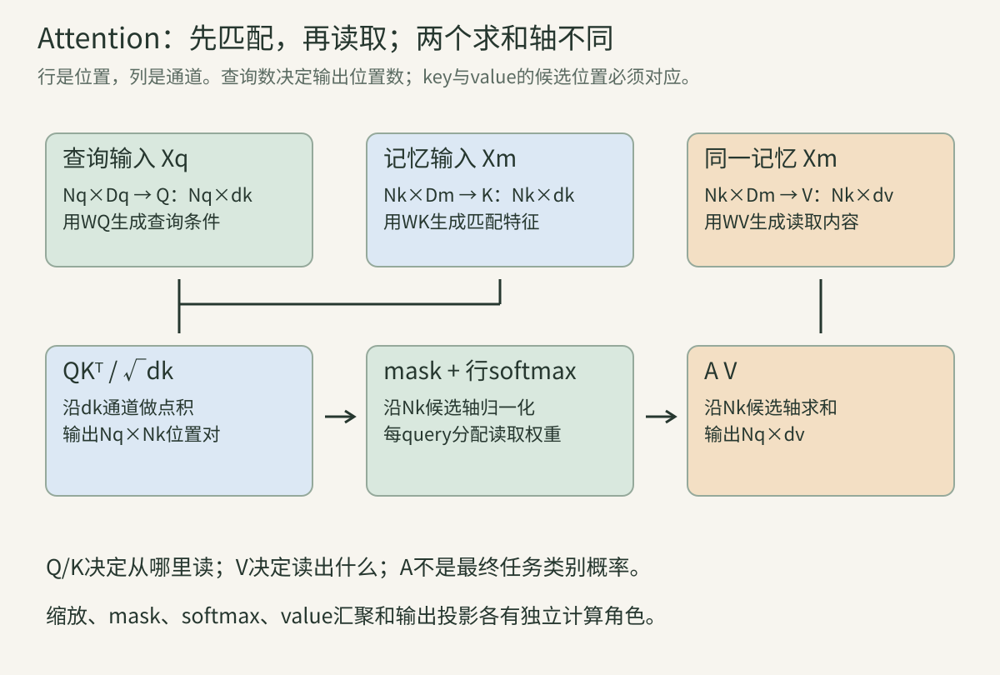
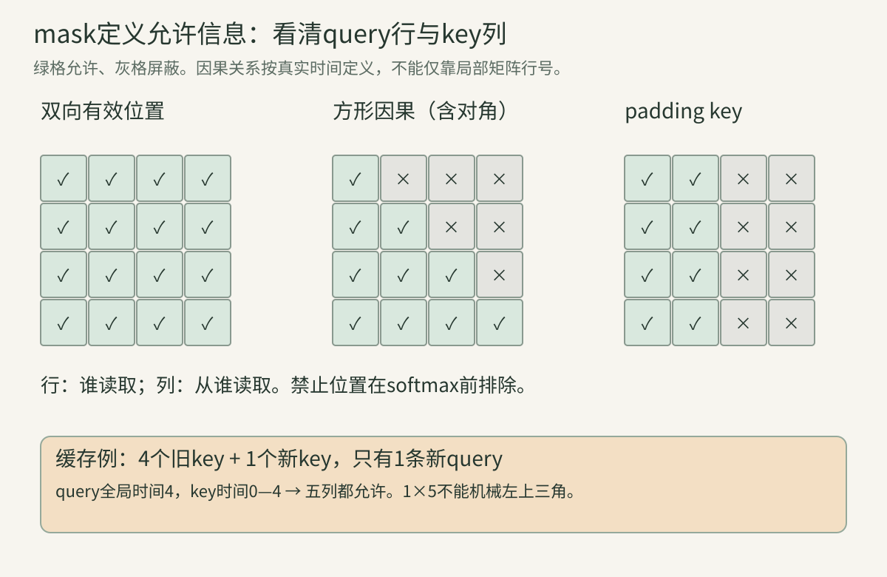
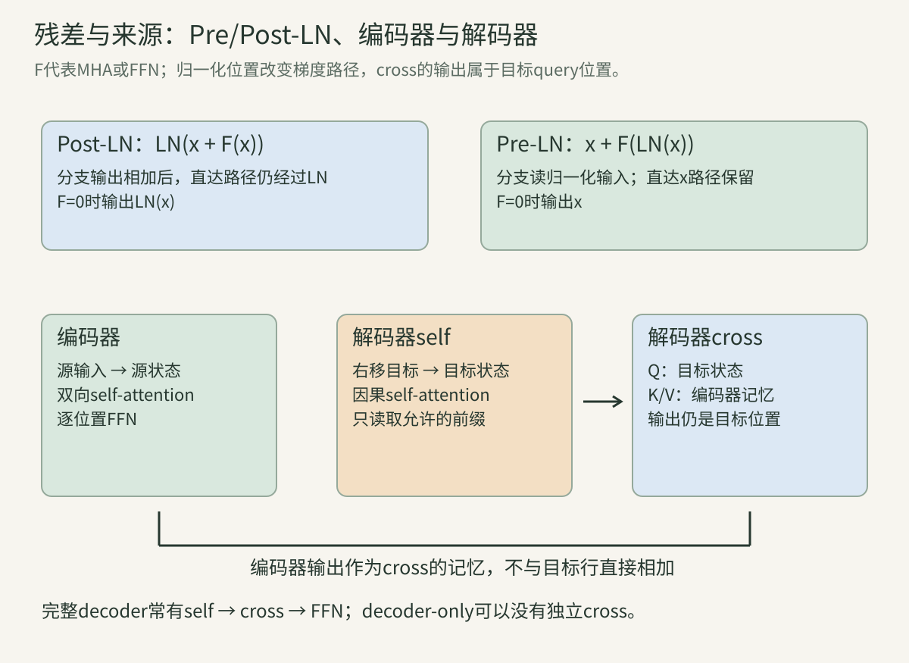
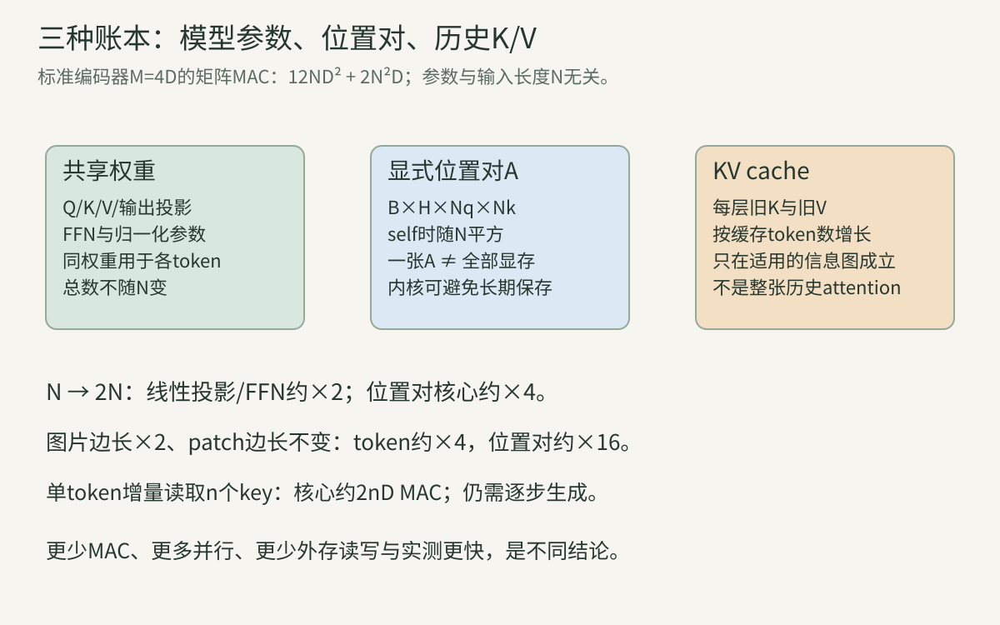

> 本讲是从CNN走向ViT、图文融合和大语言模型的共同桥梁。先修是[矩阵与Jacobian](../vision-02-math/)、[softmax与概率](../vision-03-probability/)、[训练与归一化](../vision-05-training/)以及[残差路径](../vision-08-resnet-densenet/)。不必先懂自然语言处理：我们把token当作一行特征，把注意力当作“根据内容决定从哪些行读取信息”。文中的小矩阵都是教学构造；论文结果和真实模型训练另行标明。

## 一、从信息交换的问题开始

### 1. 一个token首先是一行特征

设一段输入有$N$个位置，每个位置用$D$个数表示。把它们放在矩阵$X\in\mathbb R^{N\times D}$中，第$i$行$x_i$是第$i$个token。token不是必然等于汉字或单词：它也可以是图像patch、视频块、检测query，甚至一组学习得到的槽位。

**行轴负责“哪个位置”，列轴负责“该位置的哪些特征”。** 特征的一列通常不是人工命名的“红色”或“边缘”，而是训练中形成的表示坐标。模型可以线性组合这些坐标，不能把示意图中的单个维度直接当作固定人类概念。

有多条样本时增加batch轴，$X\in\mathbb R^{B\times N\times D}$。下面先省略$B$，每条样本独立做同样计算；注意力通常不会把同batch里的两张不同图当成同一序列互相读取。

### 2. 为什么需要位置之间交换信息

只在每行上使用相同MLP，得到$y_i=f(x_i)$。第$i$行不会知道别的行是什么，除非输入此前已经汇聚过上下文。一个图像块是不是“眼睛”，可能需要旁边鼻子和轮廓的证据；一个词的含义也可能受远处词影响。

卷积用固定局部邻域交换信息；循环网络逐步传播状态；注意力让一个位置根据当前内容对可读取位置分配权重。三者都能建立依赖，但依赖范围、计算顺序和归纳偏置不同。注意力建立全局连接，并不保证模型会正确使用全局证据。

这里的“动态”指混合系数依赖输入，**并不是每次输入都重新训练一组模型参数**。参数$W$在一次前向中固定，由它计算的分数和权重随样本变化。

### 3. 注意力早于Transformer

早期编码—解码系统把整段输入压成一个向量，再生成输出，容易形成信息瓶颈。[Bahdanau等的工作](https://arxiv.org/abs/1409.0473)让解码状态对多个编码位置分配软权重；[Luong等的工作](https://arxiv.org/abs/1508.04025)比较全局、局部和不同打分方式。它们仍结合循环网络，不能与后来完全由注意力和逐位置网络组织的Transformer混为一谈。

一种加性打分写作$e_{ij}=a^\top\tanh(W_q q_i+W_k k_j+b)$，先投影再用小网络给分。乘性打分可写成$q_i^\top k_j$或$q_i^\top Wk_j$。这些形式定义“相关程度怎样计算”；softmax和value汇聚定义“给分后怎样读取”。

不要把“有attention”“用了self-attention”“是Transformer”当作同一判断。SE通道门、RAFT相关体、循环网络的跨序列读取，都与本讲有联系，但各自计算图不同。

### 4. Query、Key、Value是三种计算角色

Query（Q，查询）描述当前位置用什么条件寻找信息；Key（K，键）描述候选位置如何被匹配；Value（V，值）提供匹配后被读出的内容。可以类比找资料：查询条件匹配索引，最后读取正文。但模型中的Q/K/V都是连续向量，不是人工写的关键词或硬数据库地址。

Q和K参与权重计算，V参与加权求和。某个位置的K与V属于同一候选槽位，却可以使用不同特征投影。这使模型能把“容易被找到的特征”与“找到后应该传递的特征”分开学习。

没有规律规定Q只能保存问题、K只能保存物体名称、V只能保存事实。那是任务层面的比喻。严格理解应回到三组矩阵的来源、形状及参与的运算。

### 算例A：检索与读取为什么要分开

两个候选的key为$k_1=(1,0)$、$k_2=(0,1)$，query为$q=(1,0)$。第一候选点积更高。若它的value为$v_1=(10,2)$，读取的内容就是这组数，而不是key $(1,0)$。

如果把$v_1$改成$(100,-7)$而保持Q/K，权重不变，输出却改变。反过来只改key，可以改变哪个候选被强调，却不直接改候选提供的value。这个对照是理解角色分离最直接的方法。

### 5. 自注意力与交叉注意力看“来源”

自注意力通常从同一组表示$X$生成Q/K/V。交叉注意力从查询序列$X_q$生成Q，从记忆序列$X_m$生成K/V。例如文字位置向图像位置读取信息，或检测query向图像特征读取信息。

自注意力并不意味着只看自己。其候选集常包含同一序列的所有允许位置；“self”描述来源相同。交叉注意力也不要求两条序列长度相同，更不要求Q和K/V的原始输入通道数相同。

同一模型可以先让图像内部做self-attention，再让文字对图像做cross-attention。若把图像和文字拼成一条序列，使用一个联合self-attention块，计算组织又与独立双流交叉注意力不同。

### 6. 一次注意力不是一次检索数据库的硬选择

标准softmax注意力通常输出所有允许value的加权和。权重可以很集中，但并没有默认执行argmax后只复制一个value。argmax是离散选择，它的梯度与软加权不同。

如果所有key相同，某个query对它们给分相同，权重均匀，输出就是value平均。若value全相同，无论权重如何变，汇聚结果都相同；这时仅靠该输出无法辨别权重分配。

注意力图说明当前算子怎样混合信息，不自动等于任务决策的因果解释。残差、MLP、多层传播和输出头都可能改变最终结果。更强的解释需要干预输入或中间表示，并核对输出变化。

## 二、一头注意力从矩阵到完整手算

### 7. 先生成Q/K/V，才计算注意力

使用行向量记法，投影为：

$$
Q=X_qW_Q+b_Q,\qquad K=X_mW_K+b_K,\qquad V=X_mW_V+b_V.
$$

设$X_q$为$N_q\times D_q$，$X_m$为$N_k\times D_m$，则$W_Q$为$D_q\times d_k$、$W_K$为$D_m\times d_k$、$W_V$为$D_m\times d_v$。bias按每行广播。结果Q为$N_q\times d_k$，K为$N_k\times d_k$，V为$N_k\times d_v$。

Q/K的最后维必须相同，点积才成立；V最后维可以不同。$W_Q$和$W_K$通常独立训练，即使自注意力中输入来源相同，也没有默认令$Q=K$。

### 8. 把每个query与每个key两两比较

原始分数$R=QK^\top$，元素$r_{ij}=\sum_{c=1}^{d_k}q_{ic}k_{jc}$。输出shape是$N_q\times N_k$：行是“谁在读取”，列是“从谁读取”。这里的转置只交换K的候选与通道轴，不应该交换batch或head轴。

不能误写成$Q^\top K$。后者即使在$N_q=N_k$时尺寸成立，也是在聚合位置之后比较通道，输出$d_k\times d_k$，已经不是位置之间的注意力。

点积同时受方向和向量长度影响。标准缩放点积没有默认把Q/K单位归一化，因此它不是严格余弦相似度；使用cosine attention会改变打分约定，温度与缩放也要重新说明。

### 9. 为什么除以根号d，而不是除以d

先考虑简化随机假设：$q_c,k_c$零均值、单位方差，彼此独立，各维的乘积也互不相关。于是：

$$
\mathbb E[q^\top k]=0,\qquad\operatorname{Var}(q^\top k)=d_k.
$$

点积标准差约为$\sqrt{d_k}$，除以它能把这组假设下的方差变成1。若除以$d_k$，方差会变成$1/d_k$，会随宽度增大而越来越小。

这是初始化尺度的解释，不是训练全过程的保证。Q/K可能有相关性、非零均值、不同范数；自注意力中的同位置也可能共享输入相关性。不能由此宣布训练后的每行分数都必然具有单位方差。

### 算例B：64维与256维的尺度

在上述独立假设下，64维点积标准差8，256维点积标准差16。分别除以8和16后标准差都为1。若一律除以8，256维的标准差仍为2，会改变softmax的集中程度。

如果让$q=k$且每维单位方差，同位置点积$q^\top q$的期望为$d_k$，不再零均值。这个反例提醒我们：缩放依据是一种解释模型，不能无条件套到所有自注意力分数。

### 10. softmax沿key轴归一化

缩放分数$S=QK^\top/\sqrt{d_k}$。对每个query行分别计算：

$$
a_{ij}=\frac{\exp(s_{ij})}{\sum_{t=1}^{N_k}\exp(s_{it})},\qquad A=\operatorname{softmax}_{\text{key}}(S).
$$

每行非负且和为1，列和一般不是1。归一化问的是“当前query怎样在候选key间分配质量”，不是“一个key总共只能被读一次”。多个query可以同时高度关注同一key。

若按query轴归一化，会变成候选位置对读取者分配质量，含义完全不同。框架常写`dim=-1`，只有当最后轴确实是key轴时才正确。

### 11. 数值稳定性：先减每行最大值

对同一行加上常数$c$，softmax不变，因为分子分母同时乘$e^c$。因此可以先减$m=\max_j s_j$，再计算$e^{s_j-m}$。至少一个指数为1，其他不超过1，避免大正数直接取指数溢出。

例如分数$(1000,999)$，原始指数可能超出浮点范围；减1000后变成$(0,-1)$，概率约$(0.731059,0.268941)$。减最大值改变中间计算尺度，不改变数学输出。

减最大值无法修复输入本身的NaN，也不能让“全部是负无穷”的一行自动变成合法分布。mask的全空行将在后面单独处理。

### 12. 从权重读取value

输出$O=AV$，shape为$N_q\times d_v$，元素$o_{ic}=\sum_j a_{ij}v_{jc}$。同一query的所有value通道共用该行权重；并不是每个value通道分别计算一个softmax。

value是向量，加权和对每个坐标执行。某个候选权重0.8，不表示它贡献的每个数都为正，也不表示输出最终类别概率是0.8。value可以有负数，输出还是特征向量，通常继续通过输出投影、残差和后续层。

图中矩阵的长边对应位置、短边对应通道。先用Q/K构造位置对的位置，再用权重矩阵乘V；这两次矩阵乘法的被求和轴不同。

### 算例C：一组可以精确算完的交叉注意力

取$d_k=d_v=2$，两个query、三个key。记$\ell=\ln2$，设：

$$
Q=\begin{bmatrix}\sqrt2&0\\0&\sqrt2\end{bmatrix},\quad
K=\begin{bmatrix}\ell&0\\0&\ell\\-\ell&0\end{bmatrix},\quad
V=\begin{bmatrix}1&0\\0&2\\-1&1\end{bmatrix}.
$$

先计算缩放分数：

$$
S=\begin{bmatrix}\ell&0&-\ell\\0&\ell&0\end{bmatrix}.
$$

第一行指数$(2,1,1/2)$，分母$7/2$，得到$(4/7,2/7,1/7)$；第二行指数$(1,2,1)$，得到$(1/4,1/2,1/4)$。所以：

$$
A=\begin{bmatrix}4/7&2/7&1/7\\1/4&1/2&1/4\end{bmatrix},\qquad
O=\begin{bmatrix}3/7&5/7\\0&5/4\end{bmatrix}.
$$

第一输出的横坐标为$4/7\times1+2/7\times0+1/7\times(-1)=3/7$；纵坐标为$0+4/7+1/7=5/7$。第二输出横坐标正负抵消，纵坐标为$1+1/4$。Q为2×2、K为3×2仍然成立，输出行数由query数决定。

### 13. 单头汇聚是凸组合，有明确条件

在没有attention dropout时，每行A是非负、和1的权重，因此$o_i$在value向量的凸包里。某个输出坐标不会超出该坐标在所有允许value上的最小—最大范围。

但这只约束**这一头的原始汇聚输出**。多头concat后的$W_O$可以产生负系数、放大数值；残差还加入输入。attention dropout也可能破坏每次样本的行和1。整个Transformer块没有被限制在原value凸包中。

还应区分“对固定V是凸组合”与“对整个输入函数是线性”。A也依赖输入，$O(X)=A(X)V(X)$通常是非线性的，不是一个固定平均滤波器。

### 14. 注意力分数与权重一般不对称

即使self-attention中$N_q=N_k$，$W_Q\ne W_K$时$QK^\top$一般不对称。即便特别设$Q=K$使分数对称，行softmax的分母也可能不同，A仍不对称。

例如$S=\begin{bmatrix}0&1\\1&2\end{bmatrix}$对称，但第一行概率$(1/(1+e),e/(1+e))$，第二行同样为这两个值。于是$a_{12}\approx0.731$，$a_{21}\approx0.269$。对称分数没有产生对称读取。

它也不是物理作用力，不能要求“甲读乙的强度必须等于乙读甲”。只有额外规定的对称归一化或其他机制才可能满足更强约束。

### 15. 温度、熵与饱和的关系

若用$A=\operatorname{softmax}(S/\tau)$，正温度$\tau$变小通常让权重更集中；变大趋向均匀。极限$\tau\to0^+$偏向最大值，存在并列最大时在它们之间分配；$\tau\to\infty$趋向允许位置的均匀分布。

softmax不是硬阈值。某个最大分数与其他分数差很大时，权重接近0/1，许多分数梯度可能很小。不过梯度是否影响任务学习，还取决于上游信号、value差异、残差和后续参数。

仅凭低熵attention图不能宣布模型更加准确，也不能把高熵直接诊断为故障。有些任务需要聚焦，有些需要整合多个对象；应与任务loss、干预结果和泛化一起判断。

### 16. 所有value相同，会让分数学习失去信号

若每个$v_j=v$，则$o_i=\sum_j a_{ij}v=v$，输出不依赖该行权重。对于仅通过O传回的loss，分数方向的梯度为零；value本身仍可获得梯度。

这不是softmax“停止工作”，而是多个候选输出没有可辨差异。后面推导会看到$\partial\mathcal L/\partial s_{ij}$包含“候选贡献与当前平均贡献之差”，相同时恰好抵消。

注意力的表达力来自可区分的Q/K/V以及多层结构，不是仅仅增加一个softmax符号就能创造信息。

## 三、mask决定哪些信息允许被读取

### 17. mask加在softmax之前

用加性矩阵M：允许位置为0，禁止位置为$-\infty$，计算$A=\operatorname{softmax}(S+M)$。因为$e^{-\infty}=0$，禁止候选不参与分母和输出。

若先softmax再把禁止位置乘0，而不重新归一化，允许位置的权重和会小于1，输出尺度也改变。除非这是刻意定义的门控，否则它不等价于标准masked attention。

实现常用很大的负数近似$-\infty$，但有限值能否完全屏蔽取决于dtype、分数范围和内核。需要测试禁止位置对输出和梯度的影响，而不只是查看mask数组的外观。

### 算例D：屏蔽候选后必须改变分母

在算例C第一query中屏蔽第三key。原分数$(\ln2,0,-\ln2)$变成$(\ln2,0,-\infty)$，权重为$(2/3,1/3,0)$，输出$(2/3,2/3)$。

若先算原权重再清零第三项，会得到$(4/7,2/7,0)$和输出$(4/7,4/7)$，行和只有$6/7$。两个结果不同，错误原因不是四舍五入，而是分母仍计入了禁止候选。

### 18. padding mask屏蔽的是无效候选

不同序列补齐到同长度时，padding槽位不该提供有效key/value。常把有效标记$P\in\{0,1\}^{B\times N_k}$广播成$B\times1\times1\times N_k$，同时作用于所有head和query。

只屏蔽padding key，并不保证padding query的输出为零：一个补齐query仍可能读取有效key。通常还需在loss、最终pooling或输出上处理无效query，具体取决于任务。

padding token的embedding即使为零，softmax仍会给它分配质量，除非分数中加入正确mask。后续bias和位置编码也可能让它不再为零。不能用“补零”代替完整mask协议。

### 19. causal mask屏蔽未来

从位置0开始编号，方形因果self-attention允许$j\le i$，禁止$j>i$。每个位置可以读自己及此前输入，不可以读后面的输入。矩阵按query为行、key为列排列时，是保留含对角线的下三角。

mask用于防止预测目标从输入未来位置泄漏，而不是表示模型永远不能利用未来观测。在图像分类、双向编码器等任务，完整输入已经给出，通常允许双向读取；视频在线任务则要按真实可用帧定义限制。

图中绿色格允许读取，灰格禁止。padding mask与因果mask可以合并，但应保持每个有效query至少有一个允许key；不能只比较矩阵形状而忽略时间对齐。

### 算例E：teacher forcing中的右移

希望预测目标序列“A、B、结束”。训练输入设为“开始、A、B”，三个位置的标签分别为“A、B、结束”。位置1读取开始和A，用来预测B；位置2可以读取开始、A、B，用来预测结束。

如果输入写成“A、B、结束”而标签仍是“A、B、结束”，允许对角线就能直接看到待预测token。此时即使有下三角mask，也发生标签泄漏。**右移输入与因果mask需要共同检查。**

### 20. 布尔True到底是允许还是禁止

不同API约定不同，不能靠变量名猜。[PyTorch SDPA文档](https://docs.pytorch.org/docs/stable/generated/torch.nn.functional.scaled_dot_product_attention)中的布尔attention mask用True表示参与读取；`MultiheadAttention`的`key_padding_mask`用True表示需要屏蔽。迁移接口时必须核对语义。

推荐先写一个两key测试：只允许第二key，输出应恰等于第二value；改变被屏蔽第一value，输出应不变。这个测试同时核对布尔含义、广播轴、mask位置和归一化。

数据类型也要清楚：bool mask是允许集合，浮点mask通常是加到logits上的偏置，数值0和1并不自动分别意味着禁止和允许。

### 21. 全部屏蔽的一行不是正常概率分布

若一行全部$-\infty$，所有指数为0，数学式成为$0/0$；减最大值也可能产生$-\infty-(-\infty)$的NaN。不同实现可能返回零、NaN或其他结果，不能把某个内核的行为当作通用定义。

工程上应明确策略：有效query不允许全空；无效padding query可以在安全分支中输出零并从loss排除；某些任务加入合法空槽位。选择必须与任务语义一致，不能为了消除NaN就给真实query任意开放一个未来token。

本讲教学程序对全空行直接抛出错误，用来提前暴露输入协议问题。这个约定不是对所有生产库的要求。

### 22. 矩形因果mask需要时间偏移

交叉注意力可有$N_q\ne N_k$；增量解码时也常只有一个新query，却有很多缓存key。假设已有4个旧token，新query对应时间4，K包含时间0—4，它应该读取全部5个key。

若直接对1×5矩阵使用“query行号0允许key列号≤0”的左上对齐规则，就只开放第一个key。这把局部行号误当成全局时间了。

通用写法是定义每个query/key的真实时间或位置$t_q(i),t_k(j)$，允许$t_k(j)\le t_q(i)$。前缀、packing、缓存长度、窗口与非方形接口都应验证此映射。

### 23. prefix与packed mask是另一类协议

prefix语言模型可让已给出的前缀内部双向读取，生成段按因果规则读取前缀和过去生成。分块图像/文字输入的可读范围也可能由模态或任务定义，而不是统一下三角。

packing把多个样本拼进同一行以减少padding时，必须阻断跨样本读取，并重置或正确指定位置。否则样本甲可能读到样本乙的标签，训练loss看似改善却产生泄漏。

mask描述信息图，position ID描述坐标，两者各管一件事。正确position ID不能替代样本隔离；正确样本隔离也不能修复位置编号错误。

### 24. attention dropout不是随机删除输入token

常见做法是对softmax后的A应用inverted dropout，保留项除以保留概率$1-p$，再乘V。固定当前A时，期望权重仍为A，但一次随机结果的行和通常不是1。

这与DropPath丢弃整条残差分支、token dropout丢弃输入槽位、在logits上随机mask不同。三者改变的计算图和正则效果都不同。

推理通常关闭dropout。某些函数接口根据传入`dropout_p`直接执行，因此需要调用者在eval时显式传0；不能只调用模块的eval就假设所有独立函数自动关闭。

### 算例F：一次dropout会越出概率单纯形

对$(4/7,2/7,1/7)$取$p=1/2$，假设保留第一、第三项，得到$(8/7,0,2/7)$，和为$10/7$。作用于算例C的V，输出$(6/7,2/7)$。

这次权重不是概率分布，第一权重甚至大于1；但跨随机mask的期望仍回到原权重。验证数值等价时，先关dropout，或固定随机mask并将相同缩放纳入前后向。

## 四、多头、FFN、残差与归一化组成一个块

### 25. 多头给不同读取规则留出独立空间

第$h$头分别计算$Q_h,K_h,V_h,A_h,O_h$。不同头拥有不同投影，可以把表示投到不同子空间，产生不同位置混合。它不是先算一个A再复制成多份，也不是每头强制负责某个人工语义。

常见设总宽度D、头数H，每头$d_k=d_v=D/H$。这样增加头数会减小每头宽度，总投影宽度仍为D。不能在比较头数时一边保持每头宽度、一边不说明总参数扩大了。

不同头可以学到互补关系，也可能冗余或近似一致。观察到头的某种模式，只说明当前输入和层的行为。判定头是否必要应做干预、消融和重新训练对照，不能只挑一张漂亮热图。

### 26. concat后还要输出投影

将各头沿通道拼接，$U=\operatorname{Concat}(O_1,\ldots,O_H)\in\mathbb R^{N_q\times Hd_v}$，再计算$Y=UW_O+b_O$，其中$W_O\in\mathbb R^{Hd_v\times D_{out}}$。

concat本身只把不同头放入不同通道槽位，$W_O$才对它们进行可学习混合，并恢复残差所需的输出宽度。若$D_{out}=D_q$，Y才能与查询输入逐位置相加。

原始每头O是其value凸组合；经过$W_O$后不再满足相同凸包约束。把“注意力输出是平均”延伸到整个多头模块，会漏掉这次重要的线性变换。

### 算例G：两头拼接与负输出

取两个4维token：$(1,0,0,1)$与$(0,1,1,0)$。第一头的Q/K/V取前两维，$d_k=2$，得到对角分数$1/\sqrt2$、非对角0。记$a=e^{1/\sqrt2}/(e^{1/\sqrt2}+1)\approx0.669762$，$b=1-a$，第一位置输出$(a,b)$。

第二头令Q投影为零，K/V取后两维，分数全0、权重各1/2，输出$(1/2,1/2)$。第一位置concat为$(a,b,1/2,1/2)$，第二位置为$(b,a,1/2,1/2)$。

若$W_O=\operatorname{diag}(-1,1,1,1)$，第一输出变为$(-a,b,1/2,1/2)$。原value没有负数，输出投影却能产生负数。此处第二头Q=0只是演示一组合法参数，不表示应该这样初始化真实模型。

### 27. reshape与transpose分别在做什么

合并投影常一次计算$B\times N\times3D$，按Q/K/V拆开后，每组为$B\times N\times D$。若$D=Hd$，reshape为$B\times N\times H\times d$，再把head与位置轴交换，得到$B\times H\times N\times d$。

矩阵乘法在末两轴执行，于是分数为$B\times H\times N_q\times N_k$，输出为$B\times H\times N_q\times d_v$。最后先交换回$B\times N_q\times H\times d_v$，再把头和通道合并。

**reshape不等于交换轴。** 它按当前元素顺序重新组织尺寸；省略必要transpose可能把不同位置的通道混在一起，即使总元素数与输出shape都正确。某些框架的view还要求内存布局连续，必要时应按接口约定复制或使用reshape。

### 28. 标准多头参数通常不会随H线性增加

若输入/输出宽D，每头$d=D/H$，各组Q/K/V投影总共有$3D^2$权重，输出投影另有$D^2$。四组bias共$4D$，总计$4D^2+4D$。

H改变每头的分组，不改变上述标准配置的总投影宽度。若固定$d$而增大H，或采用不同K/V头数，则结论改变。计算参数前，先固定是哪一种比较。

注意力矩阵仍有$BHN_qN_k$个元素，所以在D固定时增加H可能增大显式分数/概率张量的存储。参数相同不等于显存完全相同，更不等于所有内核的运行时间相同。

### 29. FFN在每个位置上混合通道

常见逐位置前馈网络为$\operatorname{FFN}(X)=\phi(XW_1+b_1)W_2+b_2$，$W_1$为$D\times M$，$W_2$为$M\times D$。每行使用同一组权重，序列长度不变，内部宽度暂时扩成M。

Attention直接混合位置，FFN直接混合通道；两者交替使每行既获得上下文，又能非线性加工。FFN没有在同一次运算里直接读取另一行，但输入已经含有前面attention获得的上下文。

若移除非线性，两个线性层可合成$XW_1W_2$加一个bias，扩展—压缩就没有增加这种非线性表达能力。若M较小，线性复合还存在rank上限。不要只把FFN看成“增加参数的装饰”。

### 算例H：一个逐位置FFN

取$x=(1,-2)$，$W_1=\begin{bmatrix}1&0&1\\0&1&1\end{bmatrix}$，bias为0。第一层得到$(1,-2,-1)$，ReLU后为$(1,0,0)$。令$W_2=\begin{bmatrix}2&-1\\1&1\\0&3\end{bmatrix}$，最终输出$(2,-1)$。

另一行$x'=(0,1)$经过同样权重，先得到$(0,1,1)$，输出$(1,4)$。两行各自计算，没有求两行的平均。再与输入做残差相加时，第一行得到$(3,-3)$，第二行得到$(1,5)$。

### 30. 激活与门控FFN有不同参数账本

ReLU逐坐标保留正值；GELU是平滑非线性，常用于视觉Transformer。更换激活会改变函数与梯度，但不一定改变矩阵权重形状。

门控FFN可写成$[\phi(XW_a)\odot(XW_b)]W_c$：两个不同投影的结果逐元素相乘，再投回D。若内部宽M，矩阵权重为$3DM$，而两层普通FFN是$2DM$。为控制预算，门控模型可能选择不同M。

本章参数账本采用两层FFN，不能直接用于SwiGLU等三投影模块。读模型配置时要记录激活、是否门控、hidden width和bias，而不是把所有`mlp_ratio`都机械理解为同一参数公式。

### 31. 后归一化与前归一化的计算顺序

省略dropout，Post-LN块常写成：

$$
U=\operatorname{LN}(X+\operatorname{MHA}(X)),\qquad
Y=\operatorname{LN}(U+\operatorname{FFN}(U)).
$$

Pre-LN块则是：

$$
U=X+\operatorname{MHA}(\operatorname{LN}(X)),\qquad
Y=U+\operatorname{FFN}(\operatorname{LN}(U)).
$$

两处LN通常拥有各自的affine参数；多层Pre-LN模型常在整栈末尾另加最终归一化。它们不是对同一图的等价书写。原2017模型使用Post-LN；[归一化位置的研究](https://arxiv.org/abs/2002.04745)分析了初始化时梯度尺度与训练稳定性的差异。

Pre-LN常便于深层训练，但不能无条件宣称精度必然更高，也不能据此省略初始化、学习率或数值检查。其他规范化、残差缩放和深度设计需要逐模型核对。

### 算例I：零分支下的残差路径

考虑一个子层，若$F$处处为零，Pre-LN输出$y=x+F(\operatorname{LN}(x))=x$；Post-LN输出$y=\operatorname{LN}(x+F(x))=\operatorname{LN}(x)$，一般不是x。

局部Jacobian分别为$I+J_FJ_{LN}$和$J_{LN}(I+J_F)$。前者有恒等项，后者还必须经过LN的Jacobian。与ResNet同理，有$I$并不排除分支导数抵消，也不是对任意深度的稳定性定理。

### 32. LayerNorm沿每个token的通道轴计算

对一行$x\in\mathbb R^D$，$\mu=\frac1D\sum_cx_c$，$v=\frac1D\sum_c(x_c-\mu)^2$，$\sigma=\sqrt{v+\epsilon}$，输出$y_c=\gamma_c(x_c-\mu)/\sigma+\beta_c$。

这一行使用总体式方差，分母D，不是估计总体方差时的$D-1$。均值和方差按token分别计算，通常不跨batch、不跨序列；$\gamma,\beta$沿通道学习，并在各位置共享。

因此给batch补一条不同样本，一般不会像训练模式BatchNorm那样改变原样本的LN统计。LN却会耦合同一token的各个通道：改变一个坐标，会改变均值和方差，再影响其他坐标。

### 算例J：LN的前向与梯度

取$x=(1,2,3,4)$、$\gamma=1,\beta=0$。均值2.5，方差1.25。为便于手算先设$\epsilon=0$，标准化得到约$(-1.341641,-0.447214,0.447214,1.341641)$。

设上游梯度$g=(1,0,0,0)$，记$z=(x-\mu)/\sigma$。输入梯度通式为：

$$
g_x=\frac1\sigma\left[u-\operatorname{mean}(u)-z\operatorname{mean}(u\odot z)\right],\quad u=g\odot\gamma.
$$

本例括号内为$(0.3,-0.4,-0.1,0.2)$，所以梯度约$(0.268328,-0.357771,-0.089443,0.178885)$。只有第一输出有上游梯度，却有四个输入梯度，这是共享统计导致的。实际程序保留正$\epsilon$，避免恒定输入时除零，并用有限差分核对。

### 33. LN、RMSNorm与softmax各自归一化什么

LN中心化并缩放一个token的通道；RMSNorm常用$\sqrt{\frac1D\sum_cx_c^2+\epsilon}$做缩放，不减均值；softmax把某个query对key的分数变成非负权重。这三者的轴、输出范围和目的不同。

LN输出可为负，行和不必1；softmax权重非负、行和1，却没有保证其特征均值为零。把attention softmax换成LN，或认为“已经做了LN就不需要softmax”，都改变了算法。

尺度也有明确边界：LN对一行加相同常数不改变标准化值；在$\epsilon=0$且正缩放时具有尺度不变性，正$\epsilon$会使严格性质变为近似。RMSNorm不会同样消除常数平移。

## 五、位置表示：内容之外还需要坐标

### 34. 无位置的双向self-attention是置换等变

设P是交换token行的置换矩阵，$X'=PX$。共享投影且无位置相关mask时，$Q'=PQ,K'=PK,V'=PV$，所以$S'=PSP^\top$。行softmax也随行列一起置换，得到$A'=PAP^\top$。

于是$O'=A'V'=PA(P^\top P)V=PO$。逐位置FFN和LN同样满足等变；堆叠后仍只是输出随输入行一起重排。证明说明模型能处理集合，但未获得固定“左/右/先/后”的语义。

等变不等于所有行输出相同；不同内容仍能产生不同表示。对这些行做平均等对称pooling才得到置换不变的全局输出。加入因果mask、位置bias或其他位置结构后，需重新检查哪些变换仍保持性质。

### 算例K：重排输入时必须同时处理位置

原内容为“红块、蓝块、绿块”。没有位置的网络把红块算出向量r，交换红蓝后，r也随红块移到第二行；网络没有仅凭内容知道红块原在左侧。

如果每行加固定坐标$p_0,p_1,p_2$，只交换内容而保留坐标槽位，输入变成“蓝块+$p_0$、红块+$p_1$、绿块+$p_2$”，已经改变内容—位置配对。若内容与位置一起置换，模型仍可以只是重新排列同一组带坐标元素。两种实验不能混淆。

### 35. 绝对位置向量通常加到输入

最简单写法是$Z=X+P_{pos}$，二者同为$N\times D$。输入内容与位置叠加后共同参与Q/K/V。若先忽略投影bias，点积分数展开包含内容—内容、内容—位置、位置—内容、位置—位置四类项。

位置向量可以学习，也可以由固定函数产生。加法保持宽度不变；concat则扩大输入通道，需要重新投影。不能看到两个信息来源就默认发生了concat。

固定位置表学的是某个训练索引对应的向量。图像分辨率改变时，可能需要对二维位置网格插值；把二维表当一维序列随意拉伸会改变邻接关系。具体ViT输入与插值在第12、15讲展开。

### 36. 正弦位置编码逐维采用不同频率

一种固定方案为：

$$
p_{t,2i}=\sin(t\omega_i),\qquad p_{t,2i+1}=\cos(t\omega_i),\qquad
\omega_i=10000^{-2i/D}.
$$

相邻两维是一对sin/cos，位置t沿每一对转动，不同pair使用不同频率。高频变化快、低频变化慢，为不同距离提供不同尺度信号。此处D按偶数示意，索引从0开始。

这不是对每个token内容做傅里叶变换，也不是要求位置必须归一化到0—1。固定函数能计算更长索引，但可计算并不意味着模型学会了更长距离的任务。

### 37. 相对位移可以写成一对坐标的线性变换

对一对$s_t=(\sin(t\omega),\cos(t\omega))^\top$，三角恒等式给出：

$$
s_{t+\Delta}=\begin{bmatrix}\cos(\Delta\omega)&\sin(\Delta\omega)\\-\sin(\Delta\omega)&\cos(\Delta\omega)\end{bmatrix}s_t.
$$

固定偏移对应一个与t无关的旋转矩阵。这解释了正弦编码为何可以支持相对位置关系的学习，而不是证明任意训练结果都已经精确表示相对距离。

内积$\sin(t\omega)\sin(s\omega)+\cos(t\omega)\cos(s\omega)=\cos((t-s)\omega)$也依赖相对距离。但经过内容叠加和任意学习投影后，最终分数还含其他项，不能只保留这一项来解释整网。

### 38. 相对位置bias直接改变位置对的分数

另一种方案是在logits加$b_{i,j}$，例如只由偏移$i-j$决定：$S_{ij}=q_i^\top k_j/\sqrt{d_k}+b_{i-j}$。二维图像可以按行列偏移$(\Delta y,\Delta x)$查表，或用函数生成bias。

bias让读取倾向依赖几何关系，即使内容点积相同，也可偏好近邻或某个方向。它与往输入加位置向量的计算图不同：直接加bias时V不必含同一种位置向量。

偏移范围、窗口边界、插值、bucket和跨尺度规则决定泛化。仅说“用了相对位置”仍不够复现；需要写是哪种坐标、bias是否每头独立、超出表范围如何处理。

### 39. RoPE对Q/K成对旋转

为解释一对通道，暂用列向量。令$R(\theta)=\begin{bmatrix}\cos\theta&-\sin\theta\\\sin\theta&\cos\theta\end{bmatrix}$，位置t的query变成$\widetilde q_t=R(t\omega)q_t$，key同理。点积为：

$$
\widetilde q_t^\top\widetilde k_s=q_t^\top R((s-t)\omega)k_s.
$$

相对位置通过Q/K间的相对旋转进入分数。旋转保长度，但会改变方向和点积；不能因为范数没变就认为注意力没变。通常不需要把同样旋转用于V，具体模型应看实现。[RoFormer原论文](https://arxiv.org/abs/2104.09864)

通道pair可以交错或分半组织，旋转符号也有等价约定。必须在Q和K、缓存和位置ID之间保持一致。二维/三维、多模态轴分配与长上下文扩展属于第15讲和后续专题，本讲先理解一对通道的代数。

### 算例L：四维正弦与二维旋转

取D=4，两个频率为1和0.01。位置0向量$(0,1,0,1)$，位置1约$(0.841471,0.540302,0.010000,0.999950)$。

对RoPE的一对通道，取$q=k=(1,0)^\top$。query位置角度0、key位置角度$\pi/2$时，旋转后点积0；两者角度同时移到$\pi/2$时，点积1，与它们同在角度0时一致。变化来自相对角度，而不是单独某个绝对位置。

### 40. 位置机制不能替代长度外推实验

位置编号可延长、旋转公式可计算、相对bias可查更远位置，都不等于模型在更长序列上可靠。训练长度分布、频率使用、注意力集中、内容干扰和任务本身可能导致失败。

视觉场景还要区分“token数变多”来自更高分辨率、更多帧、更多图，还是不同patch大小。相同N也可能对应不同物理尺度与坐标系统，不能只按序列长度对齐。

合理验证固定输入内容和目标，分别改变分辨率、位置索引、序列长度与干扰内容，记录能力和成本。换位置机制时还应控制初始化、训练预算、数据和推理协议，而不把所有差异归因于一个公式。

## 六、把模块放回完整Transformer

### 41. 编码器把已给出的输入共同编码

典型编码器堆叠“self-attention子层+FFN子层”，每个子层配残差和归一化。输入$N\times D$，输出仍是$N\times D$；序列长度不因attention自动改变。

双向编码器通常让每个有效位置读取整段已给出的输入。任务输出可以是逐token分类、一个特殊位置表示、平均pooling，或供另一个模块读取的记忆。注意力输出本身不是必然一条句子或一个类别。

原2017设计的基础配置为6层编码器、6层解码器，D=512、FFN内部宽2048、8头。本文后面的精确账本使用明确的bias/归一化约定，不把教学总数冒充特定checkpoint参数。[Attention Is All You Need](https://arxiv.org/abs/1706.03762)

### 42. 解码器每层可有三类子层

编码—解码Transformer的解码器通常先做目标侧因果self-attention，再对编码器输出做cross-attention，最后FFN。每个query属于目标位置，cross-attention的K/V来自输入记忆。

cross-attention允许读取完整源输入，因为它本来就是已知条件；不应把目标因果mask原样套到源序列上。目标长度与源长度可能不同，分数矩阵为$N_t\times N_s$。

现代模型也有encoder-only、decoder-only结构。decoder-only可以把条件图像token和文字组织成一条序列，再按专门mask处理；并非每个使用Transformer的VLM都有独立cross-attention层。

图上部比较一个子层的LN顺序，下部按数据来源区分编码器self、解码器causal self与cross。沿箭头核对谁提供Q、谁提供K/V，比只记“几个attention”更可靠。

### 算例M：三种attention的shape

设batch=2，8头，每头64维，源长10、目标长6。编码器Q/K/V为$2\times8\times10\times64$，分数为$2\times8\times10\times10$。

解码器self-attention分数为$2\times8\times6\times6$；cross-attention Q为$2\times8\times6\times64$、K/V为$2\times8\times10\times64$，分数为$2\times8\times6\times10$，输出仍有6个目标位置。

cross的输出与目标状态相加，不能与10个源位置直接残差相加。虽然两条序列都512维，行数不同仍不满足对应位置的加法条件。

### 43. 训练并行与生成逐步不矛盾

Teacher forcing时已知所有正确前缀输入，可以同时计算各位置预测，因果mask保证位置i不读未来目标。这是前向实现的并行，不是放弃自回归条件分解。

生成时尚不知道未来token，通常预测下一个、选择或采样、追加到输入再预测。生成步骤具有依赖，单个步骤内部的矩阵运算仍可并行。多个请求之间也可以组成batch。

视觉编码器接收完整图片时可同时处理所有patch；视频流或动作生成则可能受在线时间限制。不要把“Transformer训练可并行”误讲成“所有任务都能一次生成任意长正确结果”。

### 44. 任务loss不直接监督每个attention权重

自回归目标为$-\sum_t\log p(y_t\mid y_{<t},x)$。输出表示经词表线性层得到logits，再对词表轴softmax、计算目标交叉熵。attention softmax则沿候选位置轴，两个softmax承担不同工作。

一般任务只监督最终预测，不给每个头提供“必须看哪个位置”的标签。位置权重通过整网梯度间接学习；有些方法增加对齐监督，但那是额外目标，需要说明来源与权重。

loss要排除padding等无效标签。按token平均与按样本平均对不同长度样本赋予不同权重；label smoothing也会改变目标分布。正确实现需同时记录分母、mask和loss权重，而不是只写“使用CE”。

### 算例N：padding不该稀释loss

一条样本有两个有效预测，目标概率分别为1/2、1/4，另有两个padding位置。有效token总loss为$\ln2+\ln4=\ln8$，按有效数平均为$\ln8/2\approx1.039721$。

如果仍除以补齐长度4，得到约0.519860。padding越多，loss越小，但预测没有变好。这种分母错误会影响梯度尺度，也会让不同batch之间的训练曲线不可直接比较。

### 45. 原论文证据与复现记录怎样阅读

2017工作在机器翻译任务展示了注意力主导架构的可行性；其表格给出的英德BLEU为base 27.3、big 28.4。训练使用Adam、warmup后逆平方根学习率、dropout与label smoothing。这些属于论文历史结果，不是本笔记训练得到的结果，也不是视觉任务精度。

一个可讨论的学习率形式是$\eta(t)=D^{-1/2}\min(t^{-1/2},t\,w^{-3/2})$：$t\le w$时线性升高，$t\ge w$时按$t^{-1/2}$下降，交点在w。它不是所有Transformer都必须使用的定律。

复现还需记录tokenizer/词表、数据划分、batch的计量单位、实际更新数、权重共享、mask、归一化顺序、正则、checkpoint选择与解码。BLEU的分词/评价协议不同也会影响可比性。架构原理正确不等于已经完成论文复现。

消融应分别改变头数、宽度、FFN、位置与训练预算，避免一次改变多项后把提升归给某一模块。对视觉模型，还要控制图像尺度、patch数、增强、预训练数据与任务头。

## 七、参数、MAC、激活和缓存不能混算

### 46. 一个编码器块的完整参数账本

设宽D、FFN内部宽M，所有线性层带bias，两处LN各有$\gamma,\beta$。MHA为$4D^2+4D$；FFN为$2DM+M+D$；两处LN共$4D$。合计：

$$
P_{enc}=4D^2+2DM+M+9D.
$$

若M=4D，化为$12D^2+13D$。参数不随输入长度N改变，因为线性权重在所有位置共享；N改变的是计算和中间状态。

带两组MHA、三处LN的编码—解码decoder块，在同宽度约定下为$8D^2+2DM+M+15D$。embedding、词表头、最终LN、位置表和任务头均需另算，绑定共享权重时不能重复计数。

### 算例O：512宽的编码器与解码器

取D=512、M=2048。MHA权重1,048,576，bias 2,048，总1,050,624；FFN权重2,097,152，bias 2,560，总2,099,712；两处LN共2,048。一个编码器块共3,152,384参数，6块为18,914,304。

decoder块多一组MHA和一处LN，共$3,152,384+1,050,624+1,024=4,204,032$，6块为25,224,192。两栈合44,138,496，但还不是整个翻译模型参数。

若设置37,000词且输入/输出所有embedding权重完全共享，矩阵有18,944,000参数；词表输出bias另有37,000。是否共享、实际词表大小和其他模块决定最终数。这个人为明确的账本不用于声称原论文某个checkpoint精确等于该数。

### 47. attention核心与整个块的MAC不同

同长self-attention、标准总宽D时，Q/K/V和输出投影共$4ND^2$ MAC；计算QK和AV各需$N^2D$，合$2N^2D$；FFN需要$2NDM$。

M=4D时，整个块的矩阵乘加为：

$$
C_{enc}=12ND^2+2N^2D.
$$

这个账本不计softmax的指数/加法/除法、LN、激活、bias加法、残差、dropout及访存；一个MAC是否报成两个FLOP需注明。不能把$O(N^2D)$称为整个Transformer块的完整计算量。

当$N\ll D$，投影和FFN可能占主要MAC。比较核心attention与四投影的成本比为$N/(2D)$；比较它与全部矩阵线性计算的比为$N/(6D)$。这解释为什么减少N有帮助，但不是每种短序列都会由attention矩阵乘法主导。

cross-attention的Q投影按$N_q$计，K/V投影按$N_k$计，输出投影按$N_q$计；两次核心乘法为$N_qN_k(d_k+d_v)$每头。不能用一条N替换不同长度而不说明近似。

### 48. 显式attention矩阵的存储是BHNqNk

若保存单张分数或概率张量，元素数为$BHN_qN_k$，乘每元素字节数才是内存。它不同于Q/K/V的$BN D$，也不同于模型参数和优化器状态。

训练可能保存更多反传所需中间结果；某些内核不把完整A长期存入显存。实际峰值还包括工作区、梯度、缓存分配和其他层，不能把一张A的字节数当成总显存。

图中N翻倍使单个Q/K/V状态约翻倍，位置对数量约变成四倍。KV缓存只存每层已算的K/V，不需要永久保存每一步的整张A。

### 算例P：图像尺度与一张分数矩阵

batch=2、8头、N=1024、FP16时，一张A有$2\times8\times1024^2=16,777,216$元素，33,554,432字节，即32 MiB。MiB按$2^{20}$字节，不能与十进制MB混写。

224×224图片按16×16 patch切块有196个位置，加一个全局token后N=197；448×448有784块，N=785。N约变为3.9848倍，位置对约变为15.878倍，而不是仅四倍。

图像边长翻倍，patch数约四倍，attention位置对约十六倍，这是两个平方叠加的结果。块的投影/FFN部分却只约四倍；总MAC需把两部分相加再比较。

### 49. KV cache减少历史重算，不消除生成依赖

因果解码中，已经生成的旧位置在后面加入新token时不会读取新token，因此每层旧K/V可以保留。新一步计算新token的Q/K/V，把新K/V追加到缓存，再让新Q读取所有允许缓存位置。

标准MHA、L层、batch B、总K/V宽D、缓存长度n、每元素b字节时，K/V数据约为$2LBnDb$。这里只计K/V，忽略缓存元数据、分块空闲空间和其他状态。

一条新query的核心attention由$2nD$ MAC组成，不是$2n^2D$。但生成更多token仍反复读取越来越长的缓存，累积计算随长度增长。缓存省去历史投影和历史状态重算，不意味着整段生成成为O(1)。

对双向视觉编码器，追加新token可能改变所有旧位置的输出，后续层旧K/V也会变化；不能未经证明就把因果decoder缓存直接套到普通双向ViT。

### 算例Q：缓存容量与位置偏移

取6层、B=1、D=512、n=4096、FP16。K/V数据为$2\times6\times4096\times512\times2=50,331,648$字节，即48 MiB。

第4097个输入位置的query对应全局索引4096，key对应0—4096。位置编码或RoPE要使用正确全局索引，不能每一步都重置为0。没有位置对齐，即使缓存shape和容量完全正确，输出也可能与完整前向不同。

缓存等价性应在关闭随机正则后，比较“整段因果前向的最后位置”与“逐步缓存前向”的输出，并检查绝对/相对位置、mask和dtype误差。

### 50. MHA、MQA、GQA的K/V头数不同

标准MHA每个query头配一组K/V头。MQA让所有query头共享一组K/V，GQA让多个query头形成组并共享较少的K/V头。它们保留多组query，却减少缓存的K/V通道数。

设query头数$H_q$，K/V头数$H_{kv}$，每头宽d。缓存公式中的D应替换为$H_{kv}d$；不能仍按$H_qd$计。若$H_q=32,H_{kv}=8$，相同其他条件下K/V数据为标准32头K/V的四分之一。

这不是把已训练MHA的K/V随便复制或取平均后就保证等价的优化。参数共享改变函数约束，需要相应模型训练与评测。原始材料见[MQA](https://arxiv.org/abs/1911.02150)与[GQA](https://arxiv.org/abs/2305.13245)。不同接口的head映射、支持的内核与精度也可能不同，工程专题会继续展开。

### 51. 在线softmax为何能避免保存完整权重

对一条query，最终输出是$\sum_j e^{s_j}v_j/\sum_j e^{s_j}$。读取一部分key时，可以保存三个状态：当前最大分数m、相对m的指数和l、相对m的加权value和u。

对新块分数$s_j$，令$m'=\max(m,\max_j s_j)$，则更新：

$$
l'=e^{m-m'}l+\sum_{j\in\text{新块}}e^{s_j-m'},\qquad
u'=e^{m-m'}u+\sum_{j\in\text{新块}}e^{s_j-m'}v_j.
$$

最后$O=u/l$。旧分子分母同时重新缩放，保持比值一致。初始状态可视为$m=-\infty,l=0,u=0$，实际程序特殊处理空状态，避免不定式。

[FlashAttention](https://arxiv.org/abs/2205.14135)用分块和对内存层次的安排实现数学上精确的dense attention，减少显式中间存储和外存读写。它没有把全部位置对的算术普遍变成线性，也不是默认丢弃低权重位置的近似。浮点顺序改变仍可能产生舍入差异；速度收益依赖硬件和形状。

本讲只实现标量/列表的在线公式，帮助理解数学；不提供CUDA内核，不以小Python程序的计时证明GPU性能。

### 算例R：最大值改变时重缩放旧状态

依次读算例C第一query的第2、第1、第3个key。第一块分数0、value$(0,2)$，状态$m=0,l=1,u=(0,2)$。

第二块分数$\ln2$、value$(1,0)$，新最大值$\ln2$。旧状态乘$e^{-\ln2}=1/2$，所以$l=1/2+1=3/2$，$u=(1,1)$。

第三块分数$-\ln2$、value$(-1,1)$，相对当前最大值的指数为1/4，得到$l=7/4,u=(3/4,5/4)$。最终$(3/7,5/7)$，与一次性softmax相同。如果只更新m却不重缩放旧l/u，结果就会错误。

## 八、注意力的完整反向传播

### 52. 从输出依次返回V、A、S、Q、K

设$G=\partial\mathcal L/\partial O\in\mathbb R^{N_q\times d_v}$。从$O=AV$，矩阵链式法则给出：

$$
G_V=A^\top G,\qquad G_A=GV^\top.
$$

每个value接收所有query的加权梯度；每个权重接收“该value与输出上游梯度的内积”。再对每个softmax行：

$$
(G_S)_{ij}=a_{ij}\left[(G_A)_{ij}-\sum_ta_{it}(G_A)_{it}\right].
$$

一行分数梯度之和为0，与softmax对整行常数平移不敏感相一致。禁止位置的$a_{ij}=0$，在固定hard mask约定下其分数梯度为0。若mask/bias本身可学习，还需按对应参数求导。

最后由$S=QK^\top/\sqrt{d_k}$：

$$
G_Q=G_SK/\sqrt{d_k},\qquad G_K=G_S^\top Q/\sqrt{d_k}.
$$

shape依次为$N_q\times d_k$、$N_k\times d_k$。这里不要漏缩放，也不要把K梯度误写成$Q^\top G_S$。完整实现先确认每次乘法的输入和输出尺寸，再检查数值。

### 算例S：精确算一行softmax梯度

对算例C第一query，取输出上游梯度$(1,-2)$。三组value的内积为$(1,-4,-3)$，其attention加权平均为$4/7-8/7-3/7=-1$。

因此分数梯度为$(4/7\times2,2/7\times(-3),1/7\times(-2))=(8/7,-6/7,-2/7)$，和确实为0。Q梯度是：

$$
G_{q_1}=\left(\frac{10\ln2}{7\sqrt2},-\frac{6\ln2}{7\sqrt2}\right).
$$

第一维同时收到第1和第3个key的影响：第三key坐标为负，它的分数梯度也为负，乘积变正。只挑最大权重key反传会漏掉其他候选的真实梯度。

若第二query上游梯度为$(1/2,1)$，第一value接收两query贡献$\frac47(1,-2)+\frac14(1/2,1)=(39/56,-25/28)$。这显示V梯度必须按query累加，不能逐query覆盖同一value梯度。

### 53. 自注意力共享输入时三条梯度要相加

对投影$Q=XW_Q$，有$G_{W_Q}=X^\top G_Q$，输入贡献$G_QW_Q^\top$。K和V同理。因此self-attention的输入梯度为：

$$
G_X=G_QW_Q^\top+G_KW_K^\top+G_VW_V^\top.
$$

如果外面还有$X+Y$的残差，还需加入直达输入梯度。cross-attention则query输入和memory输入分开：查询侧接Q分支，记忆侧接K/V两分支；如果其他结构复用同一张量，还要继续累加相应路径。

输出投影$Y=UW_O+b_O$有$G_U=G_YW_O^\top$、$G_{W_O}=U^\top G_Y$，再按concat通道切片送回每头。多头不是分别计算loss后取一个头的梯度。

bias梯度通常沿所有使用它的batch/位置求和。一个有趣边界是：没有位置相关变换的普通点积中，给所有key加同一个bias，会对每个query行分数加同一常数，softmax权重不变，因此仅通过该attention输出的key bias梯度抵消。RoPE等位置相关变换会改变此分析的前提。

### 算例T：为什么只走V分支会错

假设self-attention输入X既产生Q/K，也产生V。扰动一个输入坐标，既改变它作为value传出的内容，又可能改变它作为key被读取的概率，以及它作为query怎样读取别处。

只计算$A^\top G$再乘$W_V^\top$，等于在求导时把A冻结。这是另一个函数的导数，一般不等于完整self-attention。下面程序分别检查独立Q/K/V、共享X与三组投影参数，捕获遗漏路径或错误transpose。

### 54. 实验一：前向、mask、完整反传和LN有限差分

以下只用Python标准库，矩阵使用二维列表，默认关闭dropout。有限差分用中心差分：$[f(x+h)-f(x-h)]/(2h)$；它是局部数值核查，不证明整个网络在真实数据上训练成功。

程序先检查精确分数/权重/输出，再逐项扰动Q/K/V和共享投影。mask测试同时改变被禁止value，确认输出不受影响；LN用正$\epsilon$，避开零方差的不定式。实际模型还应增加batch、head、dtype和生产内核的等价验证。

~~~python
import math
from copy import deepcopy

def tr(a):
    return [list(row) for row in zip(*a)]

def mm(a, b):
    assert len(a[0]) == len(b)
    return [[sum(x*y for x, y in zip(row, col))
             for col in zip(*b)] for row in a]

def add(*arrays):
    return [[sum(a[i][j] for a in arrays)
             for j in range(len(arrays[0][0]))]
            for i in range(len(arrays[0]))]

def scale(a, c):
    return [[c*x for x in row] for row in a]

def attention(q, k, v, allowed=None):
    s = scale(mm(q, tr(k)), 1/math.sqrt(len(q[0])))
    a = []
    for i, row in enumerate(s):
        ids = [j for j in range(len(row))
               if allowed is None or allowed[i][j]]
        if not ids:
            raise ValueError('query has no allowed key')
        m = max(row[j] for j in ids)
        exps = [math.exp(x-m) if j in ids else 0.0
                for j, x in enumerate(row)]
        den = sum(exps)
        a.append([x/den for x in exps])
    return mm(a, v), (q, k, v, a)

def backward(cache, g):
    q, k, v, a = cache
    gv = mm(tr(a), g)
    ga = mm(g, tr(v))
    gs = []
    for ar, gr in zip(a, ga):
        avg = sum(x*y for x, y in zip(ar, gr))
        gs.append([x*(y-avg) for x, y in zip(ar, gr)])
    c = 1/math.sqrt(len(q[0]))
    return scale(mm(gs, k), c), scale(mm(tr(gs), q), c), gv, gs

def inner(a, b):
    return sum(x*y for ar, br in zip(a, b)
               for x, y in zip(ar, br))

def check(fn, args, gradients, step=1e-6):
    worst = 0.0
    for n, a in enumerate(args):
        for i, row in enumerate(a):
            for j in range(len(row)):
                plus, minus = deepcopy(args), deepcopy(args)
                plus[n][i][j] += step
                minus[n][i][j] -= step
                num = (fn(*plus)-fn(*minus))/(2*step)
                worst = max(worst, abs(num-gradients[n][i][j]))
    assert worst < 1e-7, worst
    return worst

q = [[math.sqrt(2), 0], [0, math.sqrt(2)]]
k = [[math.log(2), 0], [0, math.log(2)], [-math.log(2), 0]]
v = [[1.0, 0.0], [0.0, 2.0], [-1.0, 1.0]]
g = [[1.0, -2.0], [0.5, 1.0]]
o, cache = attention(q, k, v)
assert abs(o[0][0]-3/7) < 1e-12
assert abs(o[0][1]-5/7) < 1e-12
assert abs(o[1][1]-5/4) < 1e-12
gq, gk, gv, gs = backward(cache, g)
assert max(abs(x-y) for x, y in zip(gs[0], [8/7, -6/7, -2/7])) < 1e-12
assert abs(gv[0][0]-39/56) < 1e-12
print('QKV finite difference:', check(
    lambda q, k, v: inner(attention(q, k, v)[0], g),
    [q, k, v], [gq, gk, gv]))

allowed = [[True, True, False], [True, True, False]]
masked, cache_m = attention(q, k, v, allowed)
v_changed = deepcopy(v)
v_changed[2] = [10000.0, -10000.0]
assert attention(q, k, v_changed, allowed)[0] == masked
assert abs(masked[0][0]-2/3) < 1e-12
gm = backward(cache_m, g)
print('masked finite difference:', check(
    lambda q, k, v: inner(attention(q, k, v, allowed)[0], g),
    [q, k, v], list(gm[:3])))
try:
    attention(q, k, v, [[False]*3, [True]*3])
except ValueError:
    print('all-masked row: rejected as intended')
else:
    raise AssertionError('empty row accepted')

x = [[0.4, -0.2], [0.1, 0.7], [-0.3, 0.5]]
wq = [[0.7, -0.2], [0.1, 0.6]]
wk = [[0.2, 0.5], [-0.3, 0.4]]
wv = [[0.6, 0.2], [-0.1, 0.8]]
gx_out = [[0.3, -0.5], [0.7, 0.2], [-0.1, 0.6]]
out, c = attention(mm(x, wq), mm(x, wk), mm(x, wv))
dq, dk, dv, _ = backward(c, gx_out)
dx = add(mm(dq, tr(wq)), mm(dk, tr(wk)), mm(dv, tr(wv)))
grads = [dx, mm(tr(x), dq), mm(tr(x), dk), mm(tr(x), dv)]
print('shared X and projections:', check(
    lambda x, wq, wk, wv: inner(
        attention(mm(x, wq), mm(x, wk), mm(x, wv))[0], gx_out),
    [x, wq, wk, wv], grads))

def ln(x, eps=1e-5):
    mu = sum(x)/len(x)
    sig = math.sqrt(sum((v-mu)**2 for v in x)/len(x)+eps)
    return [(v-mu)/sig for v in x], sig

row = [1.0, 2.0, 3.0, 4.0]
z, sig = ln(row)
upstream = [1.0, 0.0, 0.0, 0.0]
mean_g = sum(upstream)/4
mean_gz = sum(a*b for a, b in zip(upstream, z))/4
dx_ln = [(a-mean_g-b*mean_gz)/sig for a, b in zip(upstream, z)]
print('LN finite difference:', check(
    lambda x: sum(a*b for a, b in zip(ln(x[0])[0], upstream)),
    [[row]], [[dx_ln]]))
print('exact attention output:', o)
~~~

### 55. 实验二：置换、多头、位置、在线softmax与计算核算

第二段代码使用同样的标准库，但自包含，便于单独复制。它验证：无位置self-attention随输入置换、两头合并的手算、sin/cos位移和RoPE相对旋转、在线读取与完整softmax相同，再计算参数/MAC/显存。

浮点容差只用于小数舍入，不能掩盖mask错误。生产验证还需针对极长序列、大分数、全空行、位置偏移、不同head布局和padding重复测试。下面在线程序只展示一条query，不是高性能GPU实现。

~~~python
import math

def mm(a, b):
    return [[sum(x*y for x, y in zip(row, col))
             for col in zip(*b)] for row in a]

def tr(a):
    return [list(row) for row in zip(*a)]

def attn(q, k, v):
    scores = mm(q, tr(k))
    rows = []
    for s in scores:
        s = [x/math.sqrt(len(q[0])) for x in s]
        m = max(s)
        ex = [math.exp(x-m) for x in s]
        rows.append([x/sum(ex) for x in ex])
    return mm(rows, v)

def close(a, b, tol=1e-12):
    assert len(a) == len(b)
    assert all(abs(x-y) < tol for ar, br in zip(a, b)
               for x, y in zip(ar, br)), (a, b)

x = [[1.0, 0.0], [0.2, 0.7], [-0.4, 0.3]]
perm = [2, 0, 1]
xp = [x[i] for i in perm]
base = attn(x, x, x)
close(attn(xp, xp, xp), [base[i] for i in perm])
print('permutation equivariance: passed')

tokens = [[1.0, 0.0, 0.0, 1.0], [0.0, 1.0, 1.0, 0.0]]
first = [r[:2] for r in tokens]
last = [r[2:] for r in tokens]
head1 = attn(first, first, first)
head2 = attn([[0.0, 0.0]]*2, last, last)
merged = [a+b for a, b in zip(head1, head2)]
out = [[-r[0], r[1], r[2], r[3]] for r in merged]
assert out[0][0] < 0
assert abs(head1[0][0]-0.6697615493266569) < 1e-12
print('two-head output:', out)

def rot(v, angle):
    c, s = math.cos(angle), math.sin(angle)
    return [c*v[0]-s*v[1], s*v[0]+c*v[1]]

q, k = [0.3, -0.7], [0.8, 0.2]
dot = lambda a, b: sum(x*y for x, y in zip(a, b))
left = dot(rot(q, 0.4), rot(k, 1.1))
right = dot(q, rot(k, 1.1-0.4))
assert abs(left-right) < 1e-12
pos, delta, freq = 3.0, 2.0, 0.01
old = [math.sin(pos*freq), math.cos(pos*freq)]
c, s = math.cos(delta*freq), math.sin(delta*freq)
shifted = [c*old[0]+s*old[1], -s*old[0]+c*old[1]]
close([shifted], [[math.sin((pos+delta)*freq), math.cos((pos+delta)*freq)]])
print('sinusoidal shift and RoPE relative identity: passed')

scores = [math.log(2), 0.0, -math.log(2)]
values = [[1.0, 0.0], [0.0, 2.0], [-1.0, 1.0]]
def online(scores, values, order):
    m, den, num = None, 0.0, [0.0, 0.0]
    for j in order:
        new_m = scores[j] if m is None else max(m, scores[j])
        old_scale = 0.0 if m is None else math.exp(m-new_m)
        e = math.exp(scores[j]-new_m)
        den = old_scale*den+e
        num = [old_scale*u+e*v for u, v in zip(num, values[j])]
        m = new_m
    return [u/den for u in num]

expected = [3/7, 5/7]
for order in ([0, 1, 2], [1, 0, 2], [2, 1, 0]):
    close([online(scores, values, order)], [expected])
print('online softmax:', expected)

def enc_params(d, hidden):
    return 4*d*d+2*d*hidden+hidden+9*d

def dec_params(d, hidden):
    return 8*d*d+2*d*hidden+hidden+15*d

def enc_mac(n, d, hidden):
    return 4*n*d*d+2*n*n*d+2*n*d*hidden

assert enc_params(512, 2048) == 3152384
assert dec_params(512, 2048) == 4204032
assert 6*(enc_params(512, 2048)+dec_params(512, 2048)) == 44138496
print('encoder block params:', enc_params(512, 2048))
print('decoder block params:', dec_params(512, 2048))
for n in (197, 785):
    print('N', n, 'D768 block MAC:', enc_mac(n, 768, 3072),
          'one B1 H12 FP32 A MiB:', 12*n*n*4/2**20)
assert 2*8*1024**2*2/2**20 == 32
assert 2*6*4096*512*2/2**20 == 48
print('B2 H8 N1024 FP16 A:', 32, 'MiB')
print('L6 D512 N4096 FP16 KV:', 48, 'MiB')
print('GQA Hkv8/Hq32 KV ratio:', 8/32)
~~~

## 九、练习与详解

### 练习1：图像token与文字token有哪些共同点？

**解析：** 对本章矩阵运算，两者都是一个位置的一行D维表示，可以生成Q/K/V并交换信息。它们的来源、坐标、标签和预处理不同；共同的计算接口不意味着两种内容或监督可以直接互换。

### 练习2：self-attention是否只读取当前位置？

**解析：** 不是，self说明Q/K/V通常来自同一序列；允许集合由mask决定。双向self常读整段，因果self读当前及过去，局部self读指定邻域。

### 练习3：Q为5×8，K为7×8，V为7×3，输出多大？

**解析：** 分数5×7，softmax沿7个key，乘V后输出5×3。query和key长度可以不同；Q/K的通道必须一致，V通道可不同。

### 练习4：为什么不能计算QᵀK来代替QKᵀ？

**解析：** 前者对位置轴求和后比较通道，且两序列长度不同时不能成立；后者逐query/key点积形成位置对。即使某组尺寸碰巧兼容，运算语义也不相同。

### 练习5：点积标准差随dk怎样变化？

**解析：** 零均值单位方差、各乘积互不相关的假设下，方差$d_k$、标准差$\sqrt{d_k}$。训练后相关、均值和范数变化会破坏假设，不能无条件认为缩放后方差永远1。

### 练习6：softmax为什么可以减每行最大值？

**解析：** 整行减同一个m，让分子分母同时乘$e^{-m}$，概率不变。这个常数须按同一行处理，不是逐元素减自己的值，否则所有分数变0、错误地得到均匀分布。

### 练习7：attention权重列和也必须为1吗？

**解析：** 不需要；每个query行独立归一化。多个query可以读取同一候选，列和反映被多个读取者累积的权重，不受标准softmax约束为1。

### 练习8：对算例C第一行屏蔽第三key，结果是什么？

**解析：** 允许指数为2和1，权重$(2/3,1/3,0)$，输出$(2/3,2/3)$。先softmax再清零会得到不同分母，不能代替正确masked softmax。

### 练习9：为什么Q=K仍不保证A对称？

**解析：** QKᵀ对称，但不同query行的指数和可能不同。$a_{ij}=e^{s_{ij}}/Z_i$与$a_{ji}=e^{s_{ij}}/Z_j$，只有分母也满足相应条件才相等。

### 练习10：所有value相同，输出还依赖key吗？

**解析：** 没有attention dropout时，各行和1，输出等于共同value，不依赖当前key如何分配权重；通过这个汇聚输出的分数梯度抵消。value仍可能被更新，后续或其他loss也可能提供额外信号。

### 练习11：padding embedding为0是否足以忽略padding？

**解析：** 不足。零key仍可进入softmax分母，而且bias/位置编码可能使表示非零。应屏蔽无效候选，并在loss/pooling上排除无效query或标签。

### 练习12：因果mask允许对角线为何不泄漏？

**解析：** 配合右移输入，当前位置输入是已知前缀最后一个token，标签是下一个token。若输入与标签未右移，允许对角线可能直接看到答案；必须联合检查两项。

### 练习13：缓存4个旧token，新query的1×5 mask怎样设？

**解析：** 新query的真实时间是4，key时间为0—4，全允许。不能按局部query行号0直接应用左上三角，只开放列0。

### 练习14：全屏蔽行能否解释为均匀概率？

**解析：** 不能，全空允许集没有合法概率归一化。需检查输入错误，或为无效query定义安全输出并排除其loss。均匀读取会重新开放被禁止信息，不是原mask的数学结果。

### 练习15：attention dropout后每行和仍为1吗？

**解析：** 一次采样一般不是1，保留项按$1/(1-p)$缩放。固定原A时其期望等于A；这与每次都重新归一化为概率分布不同。

### 练习16：D=512从8头改16头，投影参数会翻倍吗？

**解析：** 标准总宽固定时不会，每头由64变32，四组投影仍为$4D^2$权重。若固定每头64并增加头数，总宽变1024，才是另一组预算。显式A存储仍随头数变化。

### 练习17：多头concat后为什么还要WO？

**解析：** concat保留头通道，WO学习不同头之间的混合并投到目标宽度。其负系数或放大使输出不再受每头原value凸包约束；残差同样改变范围。

### 练习18：FFN是否直接在序列轴混合信息？

**解析：** 标准逐位置FFN使用共享权重独立加工每行，不在该算子内部直接汇聚其他行。它加工的表示可能已通过attention包含上下文，因此“逐位置”不意味着整网忽略其他token。

### 练习19：零残差分支时Pre-LN与Post-LN相同吗？

**解析：** 不同，前者返回x，后者返回LN(x)。相应梯度路径也不同；归一化位置属于模型定义，不能只换公式的书写顺序。

### 练习20：LayerNorm应跨batch还是跨通道？

**解析：** 本章标准序列LN对每个token的D个通道计算统计，通常不跨batch或位置。参数沿通道共享到各位置；同token通道因统计耦合会相互影响。

### 练习21：无位置attention的置换等变意味着什么？

**解析：** 输入行重排后，输出跟随同样重排，$f(PX)=Pf(X)$；不是输出完全不变。再经过对称pooling才可得到置换不变的全局表示。位置、mask和其他结构会改变前提。

### 练习22：正弦编码能算到更长位置，能否证明外推可靠？

**解析：** 不能，可计算只保证存在对应向量。模型使用这些频率的方式、训练分布和长距离任务都可能失效，需要独立长度/坐标/干扰对照实验。

### 练习23：RoPE保Q/K范数为何仍能影响权重？

**解析：** 点积依赖相对方向，两者按不同位置旋转会改变夹角。$\widetilde q_t^\top\widetilde k_s=q_t^\top R((s-t)\omega)k_s$体现相对位置，保范数不等于保跨位置点积。

### 练习24：attention和输出词表softmax是否同一个轴？

**解析：** 前者对候选位置归一化，用于读取特征；后者对词表类别归一化，用于下一个token概率。分母、shape与监督含义都不同。

### 练习25：D=4、M=16的编码器块有多少参数？

**解析：** 带bias和两处affine LN时，$4D^2+2DM+M+9D=64+128+16+36=244$。位置表、embedding、最终LN和任务头不在这一个块内。

### 练习26：N翻倍，整个块MAC一定变四倍吗？

**解析：** 不一定，投影/FFN是N一次方，核心两次attention乘法是N平方。由$12ND^2+2N^2D$逐项计算，新旧比例通常在2与4之间，其他算子和真实速度另算。

### 练习27：KV cache能直接用于双向ViT追加patch吗？

**解析：** 一般不能保证等价。加入新patch后旧位置可以读取新内容，旧层输出改变，后续层K/V也变。因果decoder缓存成立的重要条件是旧位置不读取未来，需逐结构证明。

### 练习28：反传时只计算V路径会漏什么？

**解析：** 漏掉输入改变query/key、进而改变A的影响。共享输入须累加Q/K/V三条贡献，外部残差再加直达梯度；数值差分可以验证是否漏路径。

## 十、调试记录与后续入口

复现一个块时，先固定任务与允许信息，再逐项保存：Q/K/V来源和shape、head布局、缩放、mask语义与真实位置、softmax轴、dropout位置、FFN类型、归一化顺序、bias、残差、position ID、缓存和dtype。先检查小矩阵，再扩大序列和batch；先关闭随机正则，再检查生产内核误差。

常见定位顺序是：检查全空行/NaN → 核对mask与右移 → 核对transpose/head合并 → 核对尺度和位置 → 对独立Q/K/V做有限差分 → 对共享输入累加路径 → 比较完整/缓存输出 → 最后讨论训练收敛与质量。梯度检查通过也不排除数据泄漏、错误标签或评价协议问题。

本章解释一组基础attention和Transformer计算，不替代所有高效attention、长上下文、位置方法和现代LLM论文。[第12讲](../vision-12-vit/)将把图像变成patch序列，逐层拆解ViT的patch embedding、CLS、位置、预训练与迁移，并区分图像输入与语言输入的协议。回到[课程总览](../vision-00-overview/)可检查未写部分。

## 原始材料

- [Vaswani等：Attention Is All You Need](https://arxiv.org/abs/1706.03762)：缩放点积、多头、编码—解码架构和历史训练/实验；本文手算与小程序自行构造。
- [Bahdanau等：Neural Machine Translation by Jointly Learning to Align and Translate](https://arxiv.org/abs/1409.0473)、[Luong等：Effective Approaches to Attention-based Neural Machine Translation](https://arxiv.org/abs/1508.04025)：Transformer以前的注意力与序列读取。
- [Xiong等：On Layer Normalization in the Transformer Architecture](https://arxiv.org/abs/2002.04745)：归一化位置与初始化梯度分析；不将其结论扩成任意训练的精度保证。
- [Su等：RoFormer](https://arxiv.org/abs/2104.09864)：旋转位置表示；二维/多模态扩展在后续专门展开。
- [Dao等：FlashAttention](https://arxiv.org/abs/2205.14135)：精确attention的分块与IO安排；文中在线列表算例不是GPU实现或性能评测。
- [PyTorch SDPA官方文档](https://docs.pytorch.org/docs/stable/generated/torch.nn.functional.scaled_dot_product_attention)、[官方SDPA教程](https://docs.pytorch.org/tutorials/intermediate/scaled_dot_product_attention_tutorial.html)：接口mask、dropout和head布局。接口细节核对日期为2026-10-07，复现需记录实际版本。
