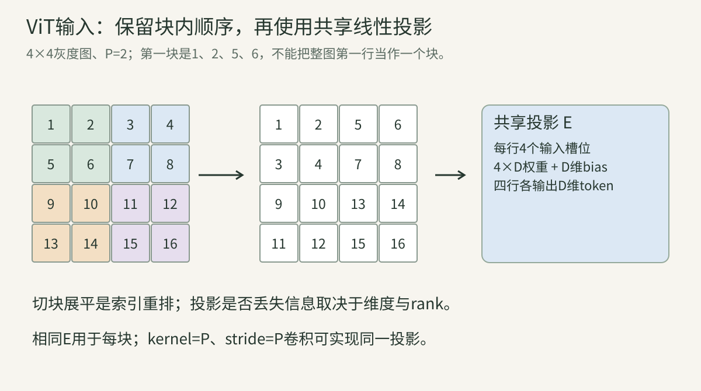
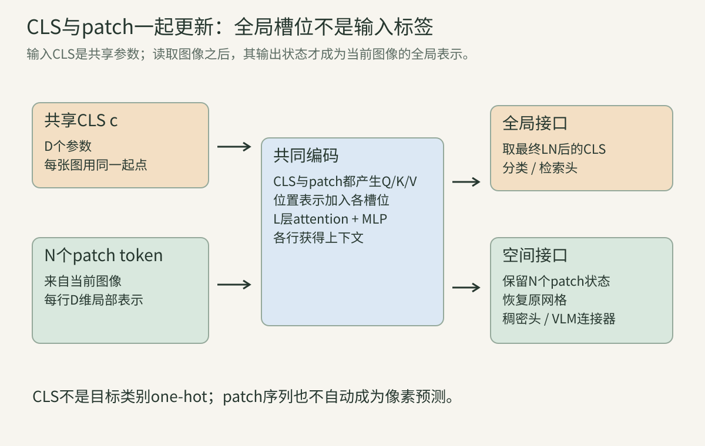
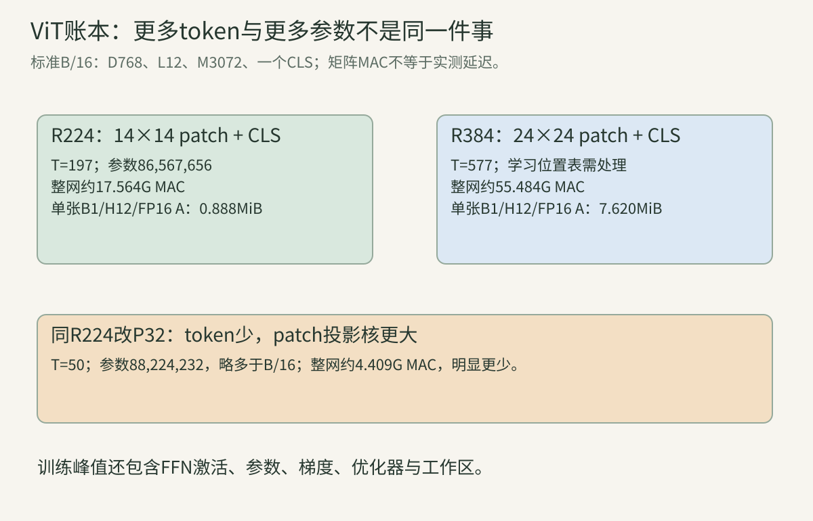
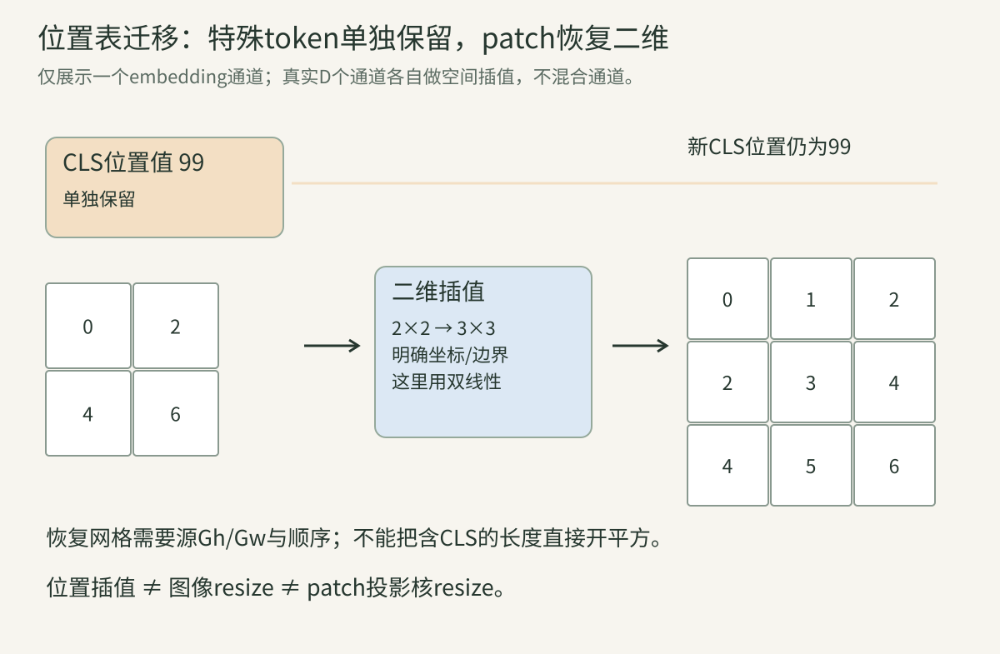
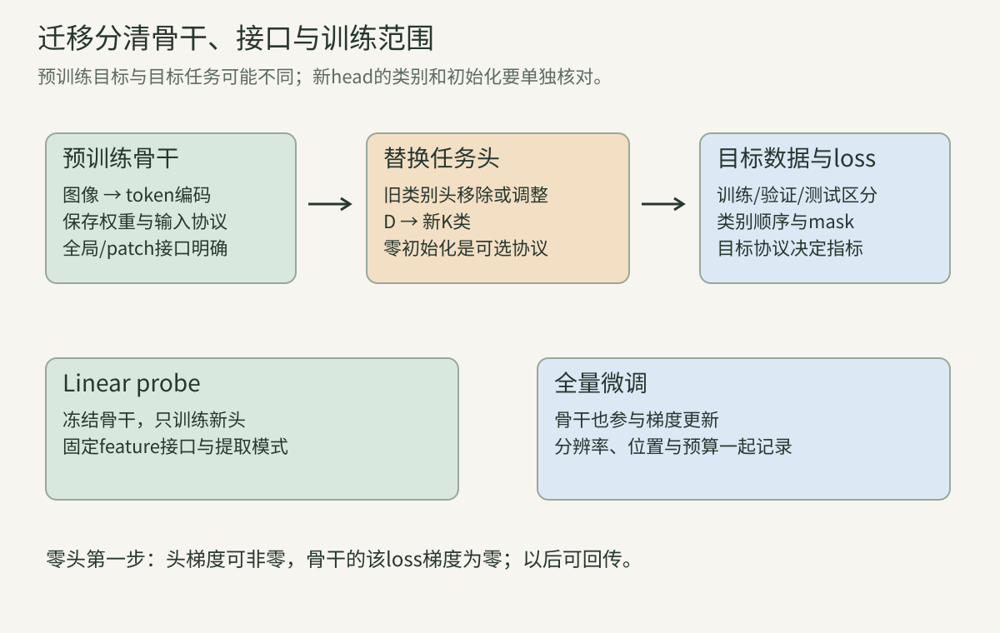

> 第11讲把注意力的Q/K/V、mask、完整反传与计算成本解释清楚。本讲把它放回图像：输入不再是已经准备好的序列，而是具有颜色、二维坐标和空间细节的像素。先修见[图像与采样](../vision-04-images/)、[卷积](../vision-06-classical-cnn/)和[Attention与Transformer](../vision-11-attention-transformer/)。先读小图手算，再读真实规模账本；教学算例、官方实现和历史论文实验会分别标明。

## 一、ViT首先改变图像的组织方式

### 1. 这一篇要回答什么

Vision Transformer（ViT）的一条基本路线是：图像 → 不重叠patch → 共享线性投影 → 加入全局token与位置表示 → Transformer编码器 → 图像表示 → 分类头。最关键的变化是中间表示按一组token组织，并允许它们通过注意力交换信息。

ViT是一类视觉编码器架构，不是特定的训练目标。它可以用类别监督、图文对比、掩码重建或自蒸馏训练；不能看到ViT就自动认为是CLIP、MAE或大语言模型。本讲先解释基础分类ViT，后续对应章节分别展开这些目标。

它输出的表示也不必只用于分类。patch状态可以接稠密任务头，全局状态可以用于检索；接入VLM还需要明确连接器、视觉token选择和训练阶段。**共同骨干不等于共同能力。**

### 2. B/16、L/16、H/14的数字各表示什么

名称中的B/L/H表示Base/Large/Huge规模配置，斜线后通常是patch边长，单位为输入像素。B/16不是16层，也不是16个头或16×16个patch；同一个B/16输入不同分辨率，会有不同token数。

需要同时记录输入分辨率、patch尺寸、层数L、宽度D、FFN宽M、头数以及输出头。本文用T表示含特殊token的总序列长度，用N表示图像patch数，避免二者都记作N时把CLS漏进账本。

另外，模型名字不能完全确定权重。相同架构可能来自不同数据、预训练目标、输入normalize和微调分辨率；推理结果必须与checkpoint和其输入协议一起解释。

### 3. patch是一个有内部顺序的局部像素块

一个$P\times P$、C通道的patch含$P^2C$个数。它不是单个像素，也不是天然识别出来的物体。固定网格可能把一个物体切成很多块，也可能把两个物体的边界放在同一块里。

切块只是组织数据，不会自动得到“狗头token”“车轮token”。初始token由局部像素线性投影得到，语义来自后续上下文加工与训练目标，而不是patch的名字。

patch内部并非一袋无序像素：展平时每个内部坐标/颜色通道占确定槽位，投影可以对这些槽位赋不同权重。丢失显式二维轴不意味着必须丢失所有局部空间信息。

### 4. 二维网格怎样决定patch数

若H、W都能整除P，不重叠网格有$G_h=H/P$行、$G_w=W/P$列，patch数$N=G_hG_w=HW/P^2$。按先行后列排列，第$(r,s)$个patch的序号为$i=rG_w+s$。

224×224、P=16得到14×14网格，N=196；384×384得到24×24，N=576；224×320得到14×20，N=280。长方形也能构造序列，但具体库可能只接受某个固定正方形输入，数学可行与接口支持要分开。

增加一个CLS后$T=N+1$。还有distillation/register等额外token时再增加相应数目；不能把所有模型都写成固定N+1。

### 算例A：形状链先算对

设batch=2，RGB图224×224，P=16，D=768。原图若按NCHW存储为$2\times3\times224\times224$；patch列表为$2\times196\times768$，这里最后768恰好等于$16^2\times3$。

投影后也为$2\times196\times768$，但最后一轴的意义从“局部像素槽位”变成“学习表示坐标”。加入CLS后$2\times197\times768$。恰巧尺寸相同不能用来证明没有执行投影。

### 5. 预处理仍然是模型的一部分

输入通常先解码、处理方向、转换颜色、resize/crop，再按checkpoint规定缩放或normalize。RGB/BGR、0—255/0—1、均值方差和插值都可能改变patch数值。

固定输入224×224，不表示把任何原图粗暴拉伸到正方形就是相同协议。短边缩放再中心裁剪、随机面积裁剪和直接拉伸，保留的视野与形变不同。训练增强与推理预处理也可能不同。

图像通道数改变时，patch投影输入维也改变。灰度图复制成RGB、改第一层接收单通道或使用其他传感通道是三种不同方案，不能只改tensor形状而保留对权重意义的错误假设。

### 6. 必须固定展平和token顺序

一种HWC展平顺序是内部行a → 内部列b → 通道c，索引$u=(aP+b)C+c$；另一种CHW顺序为$u=cP^2+aP+b$。两者包含同样数值，但每一槽位对应的坐标不同。

权重需要使用匹配的输入顺序。转换checkpoint时，可以同步置换投影权重的输入轴来保持输出等价；只重排输入、不重排权重，通常改变函数。

token列表也要与位置表一致。这里采用raster order，即从左到右、再从上到下；改变列表顺序时，要同步处理位置向量、mask和输出网格恢复。

## 二、patch embedding并不只是“把图片平均一下”

### 7. patchify的完整索引关系

用HWC图$I$说明，不重叠切块为：

$$
x_{rG_w+s,\,(aP+b)C+c}=I_{rP+a,\,sP+b,\,c}.
$$

其中$r<G_h,s<G_w,a<P,b<P,c<C$。它是重排和收集，若没有裁剪/填充/重叠，所有原始元素出现一次。单独patchify因此可逆，按同样索引放回即可恢复原图。

真实实现常通过reshape/transpose或卷积实现，不应真的写很多慢循环。先用索引理解，再替换为高效算子；检查等价时使用带不同编号的小图，比一张视觉上漂亮但数值相近的图片更容易发现错轴。

图把图像块与序列行一一对应。注意只交换网格轴还不够：内部行/列/通道也要按约定展平，投影权重在所有块共享。

### 算例B：4×4灰度图切成四块

图像按行是$(1,2,3,4)$、$(5,6,7,8)$、$(9,10,11,12)$、$(13,14,15,16)$。P=2、C=1，四个patch依次为：

$$
X_p=\begin{bmatrix}1&2&5&6\\3&4&7&8\\9&10&13&14\\11&12&15&16\end{bmatrix}.
$$

第一块不是$(1,2,3,4)$，那是整图第一行；如果直接把16个元素reshape成4×4，可能恰好得到错误的“块列表”。切块需要先把网格轴和块内轴分离，再重排。

### 8. 线性投影把像素槽位映射到D个特征

设$E\in\mathbb R^{P^2C\times D}$、$b\in\mathbb R^D$，每个patch输出$z_i=x_iE+b$。各输出通道可以对不同颜色和内部位置赋不同权重，因此能表示局部边缘、颜色组合等线性响应。

“embedding”在这里是连续数值的可学习映射，不是先给patch分配一个离散ID再查词表。ViT可以直接处理连续像素token；离散视觉token是另一类设计，后续另讲。

参数数目$(P^2C)D+D$，与patch数N无关。batch和patch越多，使用相同权重次数越多，梯度按这些使用位置累加。

### 算例C：两维局部表示的手算

对算例B取$E=\begin{bmatrix}1&0\\0&1\\-1&0\\0&-1\end{bmatrix}$，$b=(1,-1)$。第一块$(1,2,5,6)$输出$(1-5+1,2-6-1)=(-3,-5)$。

其余三块也输出$(-3,-5)$，因为这张编号图在对应上下位置始终相差4。这个投影读的是块内上下差，不是块平均；即使不同patch输出一样，也可能只是这组输入与滤波器的对称性。

换成另一个E可以保留不同统计。不要从一个教学投影得出真实模型所有patch都会相同，或所有embedding天然具有某种人工含义。

### 9. 共享意味着同一局部规则在各块使用

每个位置使用同一个E，可以把相似局部模式映射到相似初始表示，不必给196个块各建一组参数。这与卷积权重共享相关，但后面加入的位置表会使不同绝对位置获得不同附加信息。

若给每块各自一个$E_i$，参数约增为N倍，且输入网格变化时如何对应这些权重成为新问题。基础ViT通常不是这样做的。

共享权重的梯度不是某个patch独自决定。设上游$G_z$与Z同shape，$G_E=X_p^\top G_z$，$G_b=\sum_i(G_z)_i$；同一参数读取所有训练样本和位置的监督贡献。

### 10. patch投影等价于一层特定stride卷积

设卷积核$W_{d,c,a,b}=E_{(aP+b)C+c,d}$，kernel=P、stride=P、无padding，bias相同。第$(r,s)$个输出位置为：

$$
F_{d,r,s}=\sum_{c,a,b}W_{d,c,a,b}I_{rP+a,sP+b,c}+b_d=z_{rG_w+s,d}.
$$

因此逐patch展平再Linear与这层卷积，在索引和边界约定一致时数学等价。Torchvision的基本实现使用这种conv patch projection；随后把空间轴展平并转成token轴。[官方源码](https://docs.pytorch.org/vision/stable/_modules/torchvision/models/vision_transformer.html)

使用卷积算子实现输入投影，不意味着整个骨干拥有ResNet那种逐层局部卷积结构。这里是一层把不重叠局部块映射到token的计算等价。

### 11. 平均池化不能随意替换可学习投影

平均池化对每个块使用固定均匀系数，通常只保留通道平均；投影E则可以区分块内位置并产生D个不同响应。二者能否替换取决于明确函数约束，而不是都把空间边长变小就算等价。

例如两个2×2灰度patch分别为$(1,0,0,1)$和$(0,1,1,0)$，均值都是1/2。投影向量$(1,-1,-1,1)^\top$分别得到2和−2，能区分这两种内部排列。

若先平均再投影，这些排列已经被合并，后续网络不能仅从相同平均值恢复任意细节。训练数据中的上下文可能帮助猜测，但不提供对所有输入的可逆性保证。

### 12. 切块可逆，投影不一定可逆

patchify本身只是重排；线性映射的可逆性取决于rank。若$D<P^2C$，$E$的rank不超过D，一定存在不同patch产生相同输出。输入差落在映射零空间里时被丢弃。

若$D\ge P^2C$且rank等于输入维，则局部投影可以保留全部输入信息，甚至可构造左逆。B/16的RGB块输入维768、D也768，不能只凭“变成一个token”就断言发生了必然降维压缩。

这不表示真实网络最终保存了所有像素：后续LN、非线性、汇聚与任务目标会继续改变信息。应分别讨论切块、投影和全局输出，而不是把它们合成一个模糊的“压缩”。

### 算例D：相同token的零空间反例

用算例C的E，patch差$\Delta x=(1,0,1,0)$满足$\Delta xE=(0,0)$。因此$(1,2,5,6)$与$(2,2,6,6)$得到相同token$(-3,-5)$。

这个反例给出明确丢失方向。另一方面，若E是4×4单位矩阵且D=4，投影保留四个像素槽位，并没有因为“一个patch对应一个token”就丢掉它们。

### 13. patch投影怎样反传到图像

由$Z=X_pE+b$，有$G_{X_p}=G_ZE^\top$、$G_E=X_p^\top G_Z$，bias按位置/batch累加。再把$G_{X_p}$按patchify逆索引放回原图，就得到图像像素梯度。

不重叠块中每个像素只属于一个patch，因此是放回；重叠卷积/滑窗切块中，同一像素可能参与多块，反传要累加。若前面有resize/crop等可导处理，还需继续回到原输入坐标；仅有当前网络输入梯度不等于原始文件像素梯度。

图像梯度可以用于诊断敏感位置，但不自动等于正确的语义解释。模型可能对背景或纹理敏感，也可能受normalize尺度影响；解释时应保存完整输入协议。

### 算例E：一个patch的像素与权重梯度

对第一patch输出设上游梯度$g_z=(2,-1)$，则$g_x=g_zE^\top=(2,-1,-2,1)$。bias贡献为$(2,-1)$。

E梯度是外积$x^\top g_z$，四行分别为$(2,-1)$、$(4,-2)$、$(10,-5)$、$(12,-6)$。若第二patch也产生上游梯度，需要把它的外积加到同一E，不能覆盖第一patch贡献。第54节程序逐像素和权重有限差分核对这些公式。

### 14. 不可整除尺寸需要明确边界政策

若H或W不能整除P，必须选择resize/crop、padding、丢弃不足整块的边界，或其他动态切块方式。选择不同，保留内容、patch数量和坐标都会改变。

无padding的kernel=P、stride=P卷积输出边长为$\lfloor(H-P)/P\rfloor+1$。例如H=230、P=16得到14行，最下面6行未被读取。某些实现会先断言图像尺寸必须满足条件，不能假设它会自动填充。

padding patch还涉及有效面积和attention mask。部分有效块如何表示、全无效块是否参与CLS汇聚、padding是否改变位置坐标，都需要按任务验证。

### 15. 对平移的偏置不能只用一句“没有卷积”概括

不重叠切块保留局部二维邻域和共享输入映射，这本身是一种结构偏置。无位置的Transformer对token行重排等变，但不因此获得像素级平移等变。

若图像平移整P个像素、忽略边界且保留相同内部排列，patch列表可能只是网格平移；移动1个像素通常重新分组块内像素，不是简单交换完整token。绝对位置向量、crop和padding还会继续破坏相应性质。

因此更准确的问题是：在哪种坐标、步长和边界下，哪些计算满足哪种等变？基础ViT比逐层局部CNN弱一些图像专用偏置，但不是完全没有归纳偏置，也不是天然不需要位置与几何。

## 三、CLS是一个学习得到的全局读取位置

### 16. CLS不是类别标签的embedding

基础分类ViT常在patch列表前加一个可学习向量$c\in\mathbb R^D$。它是所有图共享的模型参数，初始时不包含当前图片像素，也不是正确类别、类别编号或一行one-hot标签。

每张图使用同一c作为起点，经过attention读取该图patch后，输出CLS状态才依赖图片。分类头从这个最终状态预测类别。输入c与输出全局表示是同一槽位在不同层的两个状态，不能当作同一个固定向量。

如果模型改用GAP或其他pooling，未必还需要CLS；增加特殊token也不保证全局表示更好。设计作用与效果需要分开讨论。

### 17. CLS加入的是序列轴，参数共享的是batch轴

将c扩展到每条样本，与$N\times D$的patch token沿位置轴拼接，得到$T\times D$，T=N+1。只增加D个可学习数，不是每张训练图新增一组CLS参数。

同一batch中各图的CLS输出经过各自图像的计算，通常不同；它们的初始参数梯度则按样本求和。位置表一般也包含CLS自己的那一行位置向量，与patch位置行分开管理。

CLS与patch同在一条self-attention序列里，所有位置都可以成为Q/K/V。不能把CLS只想成位于网络外面、单向读取patch而完全不参与其他计算的平均池化器。

### 18. CLS通过attention读取当前图像

对一头attention，CLS对应第0行query，读取key索引0—N，输出$O_0=\sum_{j=0}^{N}a_{0j}v_j$。其query来自CLS当前状态，key/value来自CLS和各patch当前状态。

第一层CLS起点与图像无关，但patch K/V依赖图像，因此读取输出可以依赖图像。更深层CLS状态已带图像信息，它产生的query也随图像变化，读取可逐层调整。

多头、输出投影、残差、LN和MLP继续加工此状态。某层CLS的权重图只是一个中间读取，不是完整分类结果的概率图。

图中双向箭头表示共同self-attention，而不是目标类别回传到输入。末端选择CLS用于分类，保留patch则能构造其他接口。

### 算例F：均匀读取仍可以获得图像信息

只隔离一个attention子运算，不在本例加入LN/MLP。设CLS query为零，三组value依次为CLS $(0,0)$、patch1 $(3,0)$、patch2 $(0,6)$。分数全0，三个权重均1/3，CLS读取输出为$(1,2)$。

如果忽略CLS自己也是key，会误用1/2并得到$(1.5,3)$。真实块中的值还取决于投影和归一化，本例只用于核对候选集合与汇聚机制。

### 19. patch状态也会被全局上下文改变

每个patch有自己的query，可以读取别的patch与CLS。因此编码器输出的第i个patch不再只是原始局部块的线性响应，而可能包含远处对象与整图上下文。

这有利于建立长距离关系，也使“一个输出patch只对应原块里的事实”不再严格。稠密任务需保留空间对齐和多层语义，不能仅靠token位置说明其全部感受野。

若两张图某个局部块相同，但周围内容不同，深层该patch状态可以不同。这是上下文化表示的功能；是否有助于目标任务，仍由监督与评估决定。

### 20. CLS与GAP是两种全局接口

GAP常对有效patch状态取平均$f=\frac1N\sum_{i=1}^N z_i$，CLS则取特殊位置的最终状态。GAP直接对当前位置做固定汇聚，但其输入已由attention全局加工，因此它也可以获得复杂全局信息。

两者还要确定LN在pooling前还是后、是否包含特殊token、无效patch分母，以及训练头和学习率。把一个CLS模型在推理时随意改成平均patch输出，不保证与其训练过的接口等价。

原ViT的GAP消融强调了训练超参数的影响：不能把未调学习率的差结果直接解释成pooling方式本身失败。[原论文附录D.3](https://arxiv.org/html/2010.11929v2#A4.SS3)

### 算例G：pooling与LN顺序不能交换

两个patch向量为$x_1=(1,0)$、$x_2=(0,3)$，设LN的$\gamma=1,\beta=0,\epsilon=0$。分别LN得到$(1,-1)$与$(-1,1)$，再平均为$(0,0)$。

先平均原向量得到$(0.5,1.5)$，再LN得到$(-1,1)$。结果不同。这里每次实际LN的输入都非恒定；实际代码需正$\epsilon$，但不改变二者通常不交换的事实。

## 四、从输入到分类头逐层拆解

### 21. 初始序列的完整公式

设patch投影带bias，位置表为$P_{pos}\in\mathbb R^{T\times D}$，则：

$$
Z_0=[c;X_pE+b]+P_{pos}.
$$

方括号表示沿序列轴concat，位置表用加法；没有把坐标concat到每个token后增大D。batch中同样的表广播给不同图像，表中的行与token槽位一一对应。

某些实现此后有embedding dropout。论文简式可以省略随机正则，但复现训练时要记录真实位置。视觉输入也没有必须像原语言Transformer那样对patch embedding统一乘$\sqrt D$，应核对具体模型。

### 22. 每层有两个Pre-LN残差子层

对第l层：

$$
U_l=Z_{l-1}+\operatorname{MHA}(\operatorname{LN}_1(Z_{l-1})),\qquad
Z_l=U_l+\operatorname{MLP}(\operatorname{LN}_2(U_l)).
$$

所有状态保持$B\times T\times D$。两处LN独立；每层参数也独立，不是把同一个块反复调用L次共享权重。FFN中间通道M暂时扩大，再投回D以便残差相加。

经过L层后通常再有最终LN。分类接口取$f=\operatorname{LN}_{final}(Z_L)_0$。只取CLS的最终LN与对全序列逐tokenLN再选择CLS，在常见沿通道独立归一化的条件下等价。

### 23. 最终LN与“最后一个块的LN”不是一处

Pre-LN块中的第二LN在MLP分支内部，后面还与U相加；因此最后残差输出没有自动变成已归一化状态。最终LN是另一个参数模块，需要在架构图和参数账本中单独计入。

冻结骨干提取表示时，应说明拿的是最后残差状态、最终LN后的CLS、最终LN后的patch，还是分类头前的其他representation层。它们维度可能相同，含义和数值却不相同。

如果checkpoint还含一层`pre_logits`投影/激活，输出接口需要再次核对。不能把每个D维输出都称为同一个“ViT feature”。

### 24. 多头中的空间长度不会自动缩小

宽D、H个head时，每头常为d=D/H。Q/K/V shape为$B\times H\times T\times d$，分数$B\times H\times T\times T$，汇聚后合并回$B\times T\times D$。

softmax沿候选token轴，通常允许整图双向读取；输出头才把一个D维全局表示映射为K类logits。attention权重与类别概率仍是两个不同softmax。

标准ViT每层通常保持同一patch网格，没有ResNet那样每个stage自动下采样并增加通道。若论文加入token pooling、窗口或层级缩放，它属于另一种结构，后续Swin/PVT章节分别分析。

### 25. GELU与两层MLP怎样连接

MLP为$\phi(XW_1+b_1)W_2+b_2$，基础配置M常为4D。精确GELU可写为$\phi(x)=\frac12x[1+\operatorname{erf}(x/\sqrt2)]$，不同库也可能使用tanh近似。

GELU不是简单把负数清零，负输入可以有非零输出与梯度。换近似形式、改变FFN宽度或使用门控MLP都会改变数值或参数，不能只看模块名字一样就认为权重可无条件互换。

本章教学微型ViT使用精确erf形式、固定正LN epsilon并关闭dropout。它用于核对完整数据链路，不能当作某个生产checkpoint逐位复现。

### 26. 原始分类ViT为何通常不使用因果mask

分类时整张图已给出，patch之间通常可以双向读取；CLS可以读所有有效patch。给它套语言模型下三角mask，会使不同patch依赖raster先后顺序，并改变任务的信息图。

若输入含padding、多个图或在线视频，可能需要另外的有效位置/图像边界/时间mask。这是任务协议的扩展，不能用“视觉模型不需要mask”一句话覆盖所有情况。

完整图像双向编码器也不满足通常的因果KV缓存假设：新加patch可以改变旧位置状态和后续层K/V，具体反例见第11讲。

### 27. hybrid ViT把CNN特征当作输入序列

一种混合路线先用CNN产生$C_f\times H_f\times W_f$特征，再把空间位置或局部块投影成token；若特征patch为1×1，就有$H_fW_f$个token，每个投影输入维为$C_f$。

这时“patch尺寸1”指特征网格，而非原图一个像素。每个特征位置已经具有CNN感受野，输入分辨率到token坐标的映射要结合CNN stride与padding解释。

算参数/计算时须加CNN前端，不能只报Transformer部分。局部偏置、分辨率、预训练和输入接口都变了，因此不能将hybrid和纯patch模型的结果差异简单归因于“有没有attention”。

### 算例H：头数不等于每头都64维

Base配置L=12、D=768、M=3072、12头，每头64；Large配置24层、D=1024、M=4096、16头，每头64；Huge配置32层、D=1280、M=5120、16头，每头80。[作者配置](https://github.com/google-research/vision_transformer/blob/main/vit_jax/configs/models.py)

H/14在224输入上有16×16=256个patch、T=257。L与H的名称不要求头维永远64，也不说明输入必须224；每一项都要从配置和输入共同计算。

## 五、完整参数和计算账本

### 28. 先定义计数约定，再给总数

以下采用：RGB、固定正方形输入R、无重叠patch P、一个CLS、可学习绝对位置表、L层标准Pre-LN编码器、所有线性层带bias、每层两处affine LN、末端一处affine LN、直接D→K线性头。

不含额外`pre_logits`层、distillation/register token、相对bias、卷积stem、门控MLP或token合并。参数是可训练标量数；LN统计不是运行均值buffer，dropout也没有新增权重。

总参数为：

$$
P_{total}=(CP^2+1)D+D+TD+L(4D^2+2DM+M+9D)+2D+(D+1)K.
$$

依次对应patch投影、CLS、位置表、编码器块、最终LN和分类头。M=4D时，一个块为$12D^2+13D$。

### 29. ViT-B/16逐项参数核算

取R=224、P=16、D=768、L=12、M=3072、K=1000：

| 模块 | 计算 | 参数数 |
| --- | --- | ---: |
| patch投影 | $(3\times16^2+1)\times768$ | 590,592 |
| CLS | $768$ | 768 |
| 位置表 | $197\times768$ | 151,296 |
| 一层编码器 | $12\times768^2+13\times768$ | 7,087,872 |
| 十二层编码器 | $12\times7,087,872$ | 85,054,464 |
| 最终LN | $2\times768$ | 1,536 |
| 1000类头 | $(768+1)\times1000$ | 769,000 |
| **整网** | 不重复加入“一层”展示行 | **86,567,656** |

其中一个MHA为2,362,368参数，MLP为4,722,432，两处LN为3,072，相加7,087,872。注意不要把表中的“一层示意”和“十二层总和”再重复相加。

### 算例I：换类别与换分辨率影响哪些参数

保持骨干，将1000类换10类，头变为7,690参数，总参数减761,310，得到85,806,346。Transformer各层与patch投影不需要因此改变shape。

保持P=16、D和分类头，输入从224升到384，位置表由197×768变成577×768，多291,840参数；其他上述模块形状不变，总参数86,859,496。如果位置采用固定函数而非学习表，新增参数的结论会改变。

### 30. B/L/H的精确数目依赖patch与头

按第28节同一约定、R=224、K=1000得到：

| 模型 | 图像patch数N | 总token T | 参数 |
| --- | ---: | ---: | ---: |
| B/16 | 196 | 197 | 86,567,656 |
| B/32 | 49 | 50 | 88,224,232 |
| L/16 | 196 | 197 | 304,326,632 |
| L/32 | 49 | 50 | 306,535,400 |
| H/14 | 256 | 257 | 632,045,800 |

B/32虽然token更少，参数反而略多：patch输入维变大，投影权重增加，位置表减少的参数更少。这不矛盾，参数和输入token计算是不同账本。

论文或checkpoint的粗略“M参数”还可能包含不同patch、预训练头/representation层和类别数。本文精确数以显式约定为准，不拿它反推某个未核查checkpoint的全部组成。

### 31. patch投影、编码器和分类头的MAC

不计bias/激活/LN/softmax/残差，patch矩阵乘加为$NCP^2D=HWCD$；在输入H/W、D固定且整除时，它不随P变化。较大P减少块数，却增大每块投影输入维，两者抵消。

编码器一层矩阵MAC为$4TD^2+2T^2D+2TDM$；M=4D时是$12TD^2+2T^2D$。分类头为DK。总计：

$$
C_{total}=NCP^2D+L(12TD^2+2T^2D)+DK.
$$

这里一个MAC按一次乘加报告；不能直接与未说明计数规则的FLOPs混用。softmax/LN等实际仍执行计算、读写和同步，因此这个数不是总运行指令，更不是直接测得延迟。

### 算例J：B/16的17.564G MAC怎样得到

R=224时，patch投影115,605,504 MAC；一层编码器1,453,954,560，十二层17,447,454,720；1000类头768,000。合17,563,828,224 MAC，约17.564G。

B/32同输入时，patch投影仍115,605,504，十二层编码器变4,292,812,800，加头后共4,409,186,304。它参数略多，矩阵计算却少很多，原因主要是T由197降到50。

### 32. 分辨率和patch尺寸是两条不同扩展轴

提高图像分辨率、保持P，能保留更多输入细节并增加patch数量；减小P、保持图像分辨率，能增加局部采样槽位与token数量，但原图像素总量没有变。

两者可能得到相同T，却不对应相同几何尺度、patch投影权重或预训练协议。一个224/P8和一个448/P16都有785个token，前者看同样224图的更小块，后者输入的整图像素更多。

核心attention按T平方，投影/MLP按T一次方，patch stem按HW。因此T约四倍时，整网MAC不必十六倍；必须按各项相加。实际速度还受内核、精度、batch和访存限制。

### 算例K：B/16从224升到384

N由196变576，T由197变577。加入相同1000类头，总矩阵MAC由17,563,828,224变55,484,350,464，约3.159倍。核心attention的位置对比为$577^2/197^2\approx8.579$倍，二者并不相同。

224/P8与448/P16具有同样T=785，编码器主体MAC相同，但两者patch stem MAC不同；位置与输入语义也不同。不能用同一T宣称模型能直接互换权重或具有同样准确率。

### 33. 显存不仅是一张attention矩阵

一层显式A有$BHT^2$元素，patch/CLS状态有BTD，FFN内部激活有BTM。训练还可能保存LN/激活/attention中间结果、梯度和优化器状态；实际峰值不能只看A。

高效attention内核可能避免长期物化全部A，但其他激活、参数和计算仍在。检查训练显存要记录dtype、是否checkpoint、是否返回attention权重、batch、分辨率与具体内核。

粗略估算优化器状态时也要明确：FP32参数、FP32梯度、Adam两组FP32动量各4字节，合约16字节/参数；混合精度master weights和分片会改变账本。模型权重文件大小与训练峰值不是同一个量。

### 算例L：一张A与FFN内部状态

B=1、12头、FP16，B/16的T=197时，一张A为$12\times197^2\times2$字节，约0.888267 MiB；T=577时约7.620140 MiB。

FFN内部M=3072，T=197时一张中间激活约$197\times3072\times2/2^{20}=1.154297$ MiB。此例甚至比单张A更大；它不证明FFN在所有训练配置中总显存更大，只说明不能只统计二次矩阵。

## 六、位置表示与分辨率迁移

### 34. 学习位置表是坐标槽位的参数

基础ViT的位置表每行对应CLS或某个patch槽位，初始通常是可学习向量；其数值没有自动带上严格“第几行第几列”的可解释分量。训练通过内容—坐标配对学习利用空间关系。

把二维网格按raster order排成一维列表，只是存储方式。只要槽位与二维位置有固定对应，模型仍可学习二维关系；但变分辨率时必须恢复这层对应，不能忘记列表原来来自网格。

同一位置表用于不同图片，提供绝对槽位信息，不提供该图像具体物体坐标。物体位于哪里仍需根据输入内容识别；位置表不是目标框或segmentation标签。

### 35. 位置插值的五个操作

分辨率变化后N变化，原$T_{old}\times D$表不能直接加到$T_{new}\times D$序列。一个常见处理是：分离特殊token行；将patch部分恢复$G_h^{old}\times G_w^{old}\times D$；对空间两轴插值；展平回新raster序列；最后接回原特殊token位置行。

每个embedding通道作为一个标量空间场独立插值，D维通道之间不因此混合。CLS行没有“处在图像左上角”这类patch坐标，应单独保留，而不是把它凑进一个平方网格。

位置插值改变的是位置表，不是图片像素，也不是patch投影E。图片resize和位置表resize解决不同的问题，二者同时存在时需要分别记录参数。

图中左侧表的第一行单独传到右侧；只有patch位置行进入二维空间插值。图像patch内容仍由当前输入重新产生。

### 算例M：2×2位置表升到3×3

设只看一个embedding通道，旧patch表为$\begin{bmatrix}0&2\\4&6\end{bmatrix}$，采用双线性、端点对齐。新3×3表是：

$$
\begin{bmatrix}0&1&2\\2&3&4\\4&5&6\end{bmatrix}.
$$

中间值3是四角均值。若CLS位置值为99，它在新序列第一行仍为99，而不是参与上述网格插值。D个通道分别做同样操作，新patch内容可以完全不同，位置表只是坐标信号。

### 36. 插值算法和坐标约定都会影响值

端点对齐时，新轴长度n、旧轴长度m，位置u映射为$u(m-1)/(n-1)$；半像素约定常使用$(u+1/2)m/n-1/2$，越界位置按规定处理。n=1等退化情形也要明确。

双线性与双三次使用不同邻域/权重，双三次还可能产生超过原最小—最大范围的值，不必满足双线性凸组合性质。边界、dtype、抗锯齿与是否对齐端点都可能影响checkpoint迁移输出。

Torchvision当前位置插值辅助函数采用其明确的模式与端点设置，并假设旧patch网格可恢复为正方形；作者JAX加载工具有自己的resize约定。本文程序用显式双线性教学规则，不声称与所有库逐值相同。

### 算例N：同样“插值”也会得到不同结果

一维旧位置值$(0,2)$，升成长度4。端点对齐的旧坐标为$(0,1/3,2/3,1)$，得到$(0,2/3,4/3,2)$。

半像素映射后按边界clamp，坐标为$(0,1/4,3/4,1)$，得到$(0,1/2,3/2,2)$。shape相同但内部数值不同；只检查加载成功不能证明位置迁移协议一致。

### 37. 长方形网格不能靠平方根猜尺寸

N=280可能来自14×20，也可能来自其他因子组合。仅保存一条280×D列表而没有源网格元数据，不足以确定其二维几何。应保存训练输入H/W、P、raster顺序或明确网格尺寸。

动态长宽比模型需要根据新$G_h,G_w$分别插值，不能统一按$\sqrt N$恢复。多个图、多个crop、特殊token也要按各自规则组织，避免把跨图位置误视作邻接。

数学上能处理矩形序列，不保证一个固定尺寸库能直接接受它。本章会给出不依赖平方根的矩形教学插值，但实际checkpoint迁移仍要核对接口。

### 38. 位置插值不保证识别能力随分辨率提升

插值解决shape和坐标采样问题，模型还会面对更多token、不同细节、不同物体尺度和注意力分母。单纯把位置表变大、输入换高分辨率，并不能保证accuracy改善。

微调可以使骨干适应新分布；不微调的分辨率外推则是另一种实验。二者都应报告输入处理、位置策略、微调预算、计算和指标，而不能混合为一个“支持任意分辨率”的能力结论。

更大输入可能恢复小物体的有效像素，也可能引入更多背景干扰和成本。判断是否值得需要任务尺度分布和实际效果，不能只依据token数。

### 39. 改patch尺寸比改输入分辨率更复杂

保持P只改R时，patch投影E形状不变，位置表需要处理；改P则$CP^2\times D$的E输入维也变化，不能原样加载。

有些方法对投影核重采样、重新初始化stem或进行专门训练；这些并非位置表插值的同一个操作。初始核形状可调整不意味着函数等价，尤其当patch分组、采样尺度与输入信息改变时。

实际迁移先核对：图像尺寸、P、通道数、token类型、位置表、投影核、分类头、representation层及state dict命名。`strict=False`忽略shape/key问题不能代替分析哪些参数实际加载了。

## 七、预训练、微调与目标必须分清

### 40. ViT架构不决定监督信号

监督预训练从大数据学习图像与标签关系，再迁移到目标任务。标签可以单类、多标签或层级标签，损失和输出接口需要配合；同样的ViT可以学习完全不同的表征。

初始ViT工作主要展示大规模监督预训练与迁移，也做了初步masked patch实验；之后的图文对比、自蒸馏和MAE扩展了训练路线。不能把后来常用的自监督ViT结果归给原始监督设置。

预训练数据不仅有数量，还有覆盖、重复、噪声、类别与目标任务的关系。更多图像若主要是重复或偏离任务，不必具有同样收益。数据规模与数据有效多样性应分开记录。

### 41. 历史训练配方是具体实验条件

原论文使用Adam预训练、较大batch与warmup；微调使用SGD momentum并调整学习率。其不同预训练数据对应不同schedule和正则，不能把一行超参数当成所有ViT的默认值。[训练附录](https://arxiv.org/html/2010.11929v2#A2.SS1)

作为读配方的方法，需要分别记录optimizer更新式、weight decay是否解耦及参数排除列表、batch/global batch、学习率与warmup单位、epoch/step、裁剪、dropout与图像增强。名字同叫Adam也不足以确定衰减如何实现。

现代公开权重可能采用AdamW、mixup/CutMix、不同增强、EMA、layer decay或不同学习率schedule。必须跟随实际训练配置，不把本文历史说明当作新的训练建议或已实测最优配方。

### 42. 单标签softmax与多标签sigmoid不是互换

若每图只有一个互斥类别，常用$\mathcal L=-\log p_y$、$p=\operatorname{softmax}(fW+b)$；若多个类别可同时为真，常用逐类sigmoid与二元交叉熵，并规定标签mask与reduction。

输出K个数并不说明是哪种目标。softmax使总质量为1，sigmoid分别给每类独立概率；标注协议和类间关系不同，训练与指标也不同。

迁移到新K类时，旧分类头通常不适配新标签空间。保留骨干、更换头，不等于旧任务类别编号具有可直接复用的含义；类名、顺序和损失都要重新核对。

### 43. 零初始化新头为什么不会让模型永远学不动

若新线性头W=0、bias=0，K类logits全0，初始softmax为1/K。交叉熵梯度$g_{logit}=p-y$非零，因此$G_W=f^\top(p-y)$、$G_b=p-y$通常非零，新头能首先更新。

同一步对特征的梯度为$G_f=(p-y)W^\top=0$，所以这条监督loss在初始前向不会直接更新骨干。下一步W变成非零，特征通常获得梯度。weight decay等其他更新可能另作用于参数，不能把loss梯度零扩成一切更新都零。

零头不是“冻结整个模型”，也不是把所有骨干权重重置为零。原始ViT迁移使用零初始化新分类头；新的公开实现可能采用其他初始化或保留representation层，应按checkpoint核对。

### 算例O：零头第一步的完整更新

取$f=(2,-1)$，K=3，正确标签为第二类。初始$p=(1/3,1/3,1/3)$，loss为$\ln3$。头梯度为：

$$
G_W=\begin{bmatrix}2/3&-4/3&2/3\\-1/3&2/3&-1/3\end{bmatrix},\qquad G_b=(1/3,-2/3,1/3),\qquad G_f=(0,0).
$$

用学习率0.1做一次SGD，更新W和bias后，对相同特征的新logits为$(-0.2,0.4,-0.2)$。第二类概率从1/3上升到$e^{0.6}/(e^{0.6}+2)\approx0.476730$。这只是单样本教学更新，没有证明真实迁移精度。

### 44. linear probe与全量微调回答不同问题

linear probe冻结表示提取器，只学习新的线性分类器，主要检查该接口是否能用线性边界分离目标类别；全量微调还更新骨干，检查表示适应目标任务后的效果。

冻结参数并不自动关闭随机正则。提取固定特征时通常还需按协议使用eval、固定预处理并避免无意随机crop/dropout。若只冻结部分层，训练模式与梯度范围需要分别说明。

线性结果低而微调高，可能表明原表示在该接口下不易线性分离但能适应，不足以宣称骨干没有任何目标信息。探测器容量、normalize、CLS/GAP选择与数据量都影响解释。

### 算例P：四组迁移结果怎样解释

以下是教学构造，不是论文测量：随机骨干+linear得到40%，预训练骨干+linear得到70%，随机骨干全量训练得到75%，预训练骨干全量微调得到85%。

第二组相对第一组支持“预训练表示更适合该线性接口”；第四相对第三支持该训练预算下预训练有帮助。不能把70%与85%的差全归给表示原本缺信息，因为训练参数范围和适应能力也变了。预算、数据和协议需保持可比。

### 45. 分辨率、学习率和训练预算要联合记录

迁移提高分辨率通常增加每步计算与显存，可能迫使batch变小。若同时改变batch、学习率、梯度累积和更新次数，效果差异不再只来自更多像素。

同epoch表示相近的数据遍历次数，不表示相同MAC预算；同step表示相同更新次数，不表示相同样本量。公平比较可以选择同数据遍历、同计算预算或同墙钟时间，但应明确所选问题。

多层微调使用不同学习率或冻结早层，是优化设置，而非修改ViT前向公式。它可能影响迁移和遗忘，需通过目标与原任务评价核查。

### 46. 输入、标签与数据泄漏是复现的基本边界

预训练/目标训练/验证/测试各负责不同用途。超参数选择不能用测试答案；预训练去重需要考虑完全重复、近重复与图像变体，而不是只比较文件名。

输入recipe、分辨率、类别顺序、checkpoint来源、feature接口、head初始化、训练参数范围、loss、seed、增强、测试crop和指标实现都应保留。一个只记录“ViT-B/16 accuracy”的结果不足以定位失败。

使用官方已训练权重验证加载和推理，也不同于重跑原论文预训练。本笔记仅运行小数值实验，不将参数账本或教学loss当作真实ImageNet复现成绩。

## 八、论文证据、消融和表征诊断

### 47. 原始ViT的历史结论有适用范围

原工作比较不同规模预训练数据和迁移任务，观察到大数据下的ViT更具竞争力；表中JFT预训练的H/14迁移到ImageNet达到88.55%，这不是B/16在ImageNet从零训练的结果。其CNN基线和训练配方也需要一起阅读。[原论文](https://arxiv.org/abs/2010.11929)

“ViT需要很多数据”描述早期设置中的现象，不能写成对任意ViT与训练方法的数学下限。[DeiT](https://arxiv.org/abs/2012.12877)研究更有效的公开数据训练，[AugReg研究](https://arxiv.org/abs/2106.10270)则考察数据、增强、正则、模型大小与预算的相互作用。

这些后续结果不使早期实验无效，而是改变了结论的条件。讨论风向时，应问“通过数据、训练目标还是结构降低了哪种依赖”，不能只用新accuracy替换旧结论。

### 48. 较弱图像偏置为何会影响样本效率

更强局部共享/几何约束缩小模型需要从数据中学习的函数集合，可能在数据有限时更容易学到稳定规律；较弱约束让模型更自由，但需要足够监督与优化把自由度用到正确关系上。

这是一种机制解释，不证明任何数据量下CNN都优于ViT或反之。数据分布、标签目标、增强提供的先验、训练时间和模型规模会改变结果。

增强也在注入任务相关不变性。例如随机crop、颜色扰动和mixup改变模型被要求保留或忽略的信息；增强是否合适取决于任务。精细颜色、文字方向或空间定位任务不能照搬全部分类增强。

### 49. 缩放与消融怎样避免错误归因

扩大L/D、减小P、提高R、增加数据或训练更久，都能改变质量与成本。一次改多项再说“attention更强”缺少因果区分。至少分开架构、数据、训练配方和输入协议四个层面。

对patch尺寸，控制R/D/L后比较计算与信息组织；对分辨率，控制P和位置迁移；对CLS/GAP，分别合理调学习率；对hybrid，计入CNN前端预算。数据量变化还需要控制更新数或说明预算变动。

[Scaling Vision Transformers](https://arxiv.org/abs/2106.04560)从扩展规律研究数据/模型/计算，阅读时应区分拟合规律、实测范围和外推预测。不能从一条平滑趋势宣布无限扩大总会带来相同比例收益。

### 50. attention distance是读取几何统计

为每个patch定义图像坐标$r_i$，一头某query的平均读取距离可写为$d_i=\sum_{j\in patch}a_{ij}\|r_i-r_j\|$，再按query、图像与head聚合。它衡量读取权重分布在几何上离当前位置多远。

若包含CLS质量，要说明CLS没有普通patch空间坐标：可以排除它，并在需要时重归一化patch权重。使用patch格距离还是像素距离也要明确，P改变时二者换算不同。

大距离不自动代表更强推理，小距离不自动代表局部卷积等价。这个统计忽略value内容、输出投影与其他路径；它是诊断摘要，不是能力或因果贡献的完整度量。

### 算例Q：读取距离与单位

query位置在一维网格坐标0，候选patch坐标为0、1、3，权重$(1/2,1/4,1/4)$。平均距离$0+1/4+3/4=1$个patch格。

若patch间中心距离为16输入像素，对应16像素；换成32像素patch而同权重，数值仍是1格，却变为32像素。比较不同P时只报“平均距离1”可能隐藏尺度差异。

### 51. attention rollout是多层信息路径近似

一种rollout做法把每层各头权重聚合为A，再加入恒等残差并按行归一化，例如$\widetilde A=(A+I)/2$，用$R=\widetilde A_L\cdots\widetilde A_1$近似跨层位置传播。顺序对应先经过第一层，再经过后层。

这种简化把多头内容投影、MLP、LN及真实残差尺度折叠掉，不能当作完整模型的精确Jacobian或分类贡献。它可帮助观察读取结构，解释能力仍需输入干预或梯度等对照。[Attention flow/rollout原始研究](https://arxiv.org/abs/2005.00928)

直接展示最后一层CLS注意力，又与rollout不同：后者尝试累积多层间接路径，前者只看一次读取。图例需要说明使用哪一种以及聚合方式。

### 算例R：两层rollout的乘法顺序

取$A_1=\begin{bmatrix}0&1\\1&0\end{bmatrix}$，$A_2=\begin{bmatrix}1&0\\1&0\end{bmatrix}$。加残差平均后$\widetilde A_1$两行都为$(1/2,1/2)$，$\widetilde A_2$两行为$(1,0)$、$(1/2,1/2)$。

正确$\widetilde A_2\widetilde A_1$两行仍均匀；反向相乘两行变成$(3/4,1/4)$。矩阵一般不可交换，即使每行都和1，也不能调换网络层顺序。

### 52. patch输出能恢复网格，但尚不是像素预测

去掉特殊token后，将N×D按原网格恢复$G_h\times G_w\times D$，可接分割/检测头。该网格步长约P，但每个表示已有全局上下文；简单双线性上采样只改变采样密度，不自动生成正确类别或边界。

全局CLS丢弃了“保留每位置输出”的接口，不能把它直接reshape成空间图。对稠密任务，选择哪层patch、如何构造多尺度、是否补细节和训练任务头都需要专门设计。

VLM也常保留多个视觉token而非只传CLS，以提供局部证据；是否保留CLS、取中间层或最终LN、插入连接器，是后续图文/VLM章节的独立问题。

### 53. 原始masked patch探索与后来的MAE不同

原工作探索用被扰动patch的预测训练表示，包含预测量化平均颜色等目标；这提供了自监督方向的早期证据，但不等同于后来的高掩码率、非对称编码—解码MAE。

目标“恢复局部颜色”与“识别类别”约束不同：前者强调被遮内容，后者强调类别判别。训练数据、掩码方式、可见token计算和解码器会继续改变表征。具体BEiT/MAE、自蒸馏和对比目标将在16—20讲逐篇展开。

理解风向要分清骨干复用与训练范式演进。某篇后续论文仍使用ViT，不表示它只做了小结构改动；目标、数据和训练阶段可能是主要贡献。

## 九、三组可运行核查

### 54. 实验一：切块、卷积等价与投影反传

下面程序使用HWC列表和不重叠patch。它先把原图切块再重组，确认没有漏像素或错位置；再把相同E重排成卷积核，逐项比较Linear和stride卷积；最后对全部输入像素、E和bias做中心有限差分。

主例使用两个通道，让通道轴错误更容易暴露；末尾另检查正文4×4灰度手算与零空间反例。标准库列表实现用于理解和核验索引，不作为高性能图像算子。

### 算例S：重叠时为什么要累加

把一维信号$(x_0,x_1,x_2)$切成重叠窗口$(x_0,x_1)$和$(x_1,x_2)$，设两窗口梯度分别$(1,2)$和$(3,4)$。回填后原信号梯度是$(1,5,4)$，共享的$x_1$累加2和3。

下方程序是无重叠版本，回填可直接赋值；换成重叠stem需要修改为累加，而不是沿用相同写法只换stride。

~~~python
import math

H, W, C, P, D = 4, 4, 2, 2, 3

def patchify(image, p):
    h, w, c = len(image), len(image[0]), len(image[0][0])
    assert h % p == w % p == 0
    return [[image[r*p+a][s*p+b][ch]
             for a in range(p) for b in range(p) for ch in range(c)]
            for r in range(h//p) for s in range(w//p)]

def unpatchify(patches, h, w, c, p):
    image = [[[0.0]*c for _ in range(w)] for _ in range(h)]
    for r in range(h//p):
        for s in range(w//p):
            row = patches[r*(w//p)+s]
            for a in range(p):
                for b in range(p):
                    for ch in range(c):
                        image[r*p+a][s*p+b][ch] = row[(a*p+b)*c+ch]
    return image

def mm(a, b):
    return [[sum(x*y for x, y in zip(row, col))
             for col in zip(*b)] for row in a]

def tr(a):
    return [list(row) for row in zip(*a)]

def project(patches, e, bias):
    return [[x+b for x, b in zip(row, bias)] for row in mm(patches, e)]

def flat_image(image):
    return [x for row in image for pixel in row for x in pixel]

def image_from_flat(xs, h=H, w=W, c=C):
    return [[[xs[(y*w+x)*c+ch] for ch in range(c)]
             for x in range(w)] for y in range(h)]

image = image_from_flat([float(x+1) for x in range(H*W*C)])
patches = patchify(image, P)
assert unpatchify(patches, H, W, C, P) == image
e = [[math.sin(0.3*(i*D+j+1)) for j in range(D)]
     for i in range(P*P*C)]
bias = [0.1, -0.2, 0.3]
z = project(patches, e, bias)

# Wconv[d][c][a][b] matches the chosen HWC flatten order.
kernel = [[[[e[(a*P+b)*C+c][d] for b in range(P)]
             for a in range(P)] for c in range(C)] for d in range(D)]
conv = []
for r in range(H//P):
    for s in range(W//P):
        conv.append([bias[d]+sum(
            kernel[d][c][a][b]*image[r*P+a][s*P+b][c]
            for c in range(C) for a in range(P) for b in range(P))
                     for d in range(D)])
assert max(abs(a-b) for x, y in zip(z, conv)
           for a, b in zip(x, y)) < 1e-12

g = [[0.1*(i+1)*(j-1) for j in range(D)] for i in range(len(patches))]
ge = mm(tr(patches), g)
gb = [sum(row[j] for row in g) for j in range(D)]
gx_patch = mm(g, tr(e))
gx = unpatchify(gx_patch, H, W, C, P)
params = flat_image(image)+[x for row in e for x in row]+bias
grads = flat_image(gx)+[x for row in ge for x in row]+gb
ni, ne = H*W*C, P*P*C*D

def objective(values):
    img = image_from_flat(values[:ni])
    ev = values[ni:ni+ne]
    mat = [ev[i*D:(i+1)*D] for i in range(P*P*C)]
    out = project(patchify(img, P), mat, values[ni+ne:])
    return sum(a*b for x, y in zip(out, g) for a, b in zip(x, y))

worst = 0.0
for i in range(len(params)):
    plus, minus = params[:], params[:]
    plus[i] += 1e-6
    minus[i] -= 1e-6
    numerical = (objective(plus)-objective(minus))/(2e-6)
    worst = max(worst, abs(numerical-grads[i]))
assert worst < 1e-7, worst
print('patchify/unpatchify and Conv2d equivalence: passed')
print('pixel/E/bias gradient max error:', worst)

gray = [[[float(y*4+x+1)] for x in range(4)] for y in range(4)]
small = patchify(gray, 2)
assert small == [[1, 2, 5, 6], [3, 4, 7, 8],
                 [9, 10, 13, 14], [11, 12, 15, 16]]
ep = [[1, 0], [0, 1], [-1, 0], [0, -1]]
assert project(small, ep, [1, -1]) == [[-3, -5]]*4
assert mm([[1, 0, 1, 0]], ep) == [[0, 0]]
print('4x4 hand calculation and null-space example: passed')
~~~

### 55. 实验二：从像素到分类loss的微型ViT反传

本例使用4×4灰度图、P=2、D=4、一个head、一个Pre-LN块、FFN内部宽8和三类头。它完整执行patch投影、CLS/位置相加、LN、Q/K/V、softmax、输出投影、两条残差、GELU MLP、最终LN和分类loss。

为控制篇幅，块内Linear bias与LN的可学习affine在这个教学模型中省略，LN固定gamma=1、beta=0，epsilon=1e-4；随机正则关闭。它的参数约定与前面B/L/H完整账本不同，不能拿其小模型参数数目代替标准ViT。

代码反传到像素、patch投影E、CLS、位置表和分类头，核对71个标量变量；块内权重是固定的示例常数，但其对输入的导数完整参与链路。这个检查能暴露漏掉CLS路径、共享位置路径、Q/K分支或残差的错误。它没有宣称检查所有生产模型参数或训练了有效分类器。

还用零初始化头检验：初始监督loss对骨干梯度为零、对新头梯度非零；末尾复算算例O的一步SGD。采用有限差分验证局部数学，不以教学loss作为真实任务成绩。

~~~python
import math

# One block, one head, D=4, M=8, 4 image patches plus one CLS.
# Block linear biases and learned LN affine are omitted in this toy only.
D, M, T, K = 4, 8, 5, 3

def tr(a):
    return [list(row) for row in zip(*a)]

def mm(a, b):
    return [[sum(x*y for x, y in zip(row, col))
             for col in zip(*b)] for row in a]

def add(*arrays):
    return [[sum(a[i][j] for a in arrays) for j in range(len(arrays[0][0]))]
            for i in range(len(arrays[0]))]

def mul(a, scale):
    return [[x*scale for x in row] for row in a]

def weights(rows, cols, phase):
    return [[0.2*math.sin(0.37*(i*cols+j+1)+phase)
             for j in range(cols)] for i in range(rows)]

wq, wk, wv, wo = [weights(D, D, phase) for phase in (0.1, 0.4, 0.8, 1.2)]
w1, w2 = weights(D, M, 0.3), weights(M, D, 0.6)

def ln(a):
    out, sigmas = [], []
    for row in a:
        mu = sum(row)/len(row)
        sig = math.sqrt(sum((x-mu)**2 for x in row)/len(row)+1e-4)
        out.append([(x-mu)/sig for x in row])
        sigmas.append(sig)
    return out, (out, sigmas)

def ln_back(g, cache):
    z, sigmas = cache
    out = []
    for gr, zr, sig in zip(g, z, sigmas):
        avg = sum(gr)/len(gr)
        avg_gz = sum(x*y for x, y in zip(gr, zr))/len(gr)
        out.append([(x-avg-y*avg_gz)/sig for x, y in zip(gr, zr)])
    return out

def gelu(x):
    return 0.5*x*(1+math.erf(x/math.sqrt(2)))

def gelu_deriv(x):
    return 0.5*(1+math.erf(x/math.sqrt(2)))+x*math.exp(-x*x/2)/math.sqrt(2*math.pi)

def softmax(row):
    m = max(row)
    ex = [math.exp(x-m) for x in row]
    return [x/sum(ex) for x in ex]

def patches(pixels):
    return [[pixels[(r*2+a)*4+s*2+b] for a in range(2) for b in range(2)]
            for r in range(2) for s in range(2)]

def put_back(rows):
    result = [0.0]*16
    for r in range(2):
        for s in range(2):
            for a in range(2):
                for b in range(2):
                    result[(r*2+a)*4+s*2+b] = rows[r*2+s][a*2+b]
    return result

def forward(pixels, e, cls, pos, head, bias, target=1):
    xp = patches(pixels)
    z0 = add([cls[:]]+mm(xp, e), pos)
    z_in, c0 = ln(z0)
    q, k, v = mm(z_in, wq), mm(z_in, wk), mm(z_in, wv)
    scores = mul(mm(q, tr(k)), 1/math.sqrt(D))
    a = [softmax(row) for row in scores]
    u = add(z0, mm(mm(a, v), wo))
    zu, cu = ln(u)
    h = mm(zu, w1)
    act = [[gelu(x) for x in row] for row in h]
    z1 = add(u, mm(act, w2))
    final, cf = ln(z1)
    feature = final[0]
    logits = [x+b for x, b in zip(mm([feature], head)[0], bias)]
    prob = softmax(logits)
    loss = -math.log(prob[target])
    cache = (xp, z_in, c0, q, k, v, a, cu, h, cf, feature, prob, head, target)
    return loss, cache

def backward(cache, e):
    xp, zin, c0, q, k, v, a, cu, h, cf, f, prob, head, target = cache
    gl = prob[:]
    gl[target] -= 1
    gh = [[x*y for y in gl] for x in f]
    gf = mm([gl], tr(head))[0]
    gfinal = [gf]+[[0.0]*D for _ in range(T-1)]
    gz1 = ln_back(gfinal, cf)
    gact = mm(gz1, tr(w2))
    ghid = [[g*gelu_deriv(x) for g, x in zip(gr, hr)]
            for gr, hr in zip(gact, h)]
    gu = add(gz1, ln_back(mm(ghid, tr(w1)), cu))
    go = mm(gu, tr(wo))
    gv = mm(tr(a), go)
    ga = mm(go, tr(v))
    gs = []
    for ar, gr in zip(a, ga):
        mean = sum(x*y for x, y in zip(ar, gr))
        gs.append([x*(y-mean) for x, y in zip(ar, gr)])
    gq = mul(mm(gs, k), 1/math.sqrt(D))
    gk = mul(mm(tr(gs), q), 1/math.sqrt(D))
    gzin = add(mm(gq, tr(wq)), mm(gk, tr(wk)), mm(gv, tr(wv)))
    gz0 = add(gu, ln_back(gzin, c0))
    ge = mm(tr(xp), gz0[1:])
    gp = mm(gz0[1:], tr(e))
    return put_back(gp), ge, gz0[0], gz0, gh, gl

pixels = [0.1*math.sin(i*0.6)+0.03*i for i in range(16)]
e = weights(4, D, 0.9)
cls = [0.2, -0.1, 0.05, 0.3]
pos = weights(T, D, 1.7)
head = weights(D, K, 0.5)
bias = [0.0, 0.02, -0.01]
flat = lambda a: [x for row in a for x in row]
params = pixels+flat(e)+cls+flat(pos)+flat(head)+bias

def unpack(values):
    at = 0
    def take(n):
        nonlocal at
        block = values[at:at+n]
        at += n
        return block
    pix = take(16)
    ev = take(16)
    emat = [ev[i*D:(i+1)*D] for i in range(4)]
    cv = take(D)
    pv = take(T*D)
    pmat = [pv[i*D:(i+1)*D] for i in range(T)]
    hv = take(D*K)
    hmat = [hv[i*K:(i+1)*K] for i in range(D)]
    bv = take(K)
    assert at == len(values)
    return pix, emat, cv, pmat, hmat, bv

loss, cache = forward(*unpack(params))
gpix, ge, gc, gpos, gh, gb = backward(cache, e)
analytic = gpix+flat(ge)+gc+flat(gpos)+flat(gh)+gb
worst = 0.0
for i in range(len(params)):
    plus, minus = params[:], params[:]
    plus[i] += 1e-6
    minus[i] -= 1e-6
    num = (forward(*unpack(plus))[0]-forward(*unpack(minus))[0])/(2e-6)
    worst = max(worst, abs(num-analytic[i]))
assert worst < 1e-6, worst
assert max(abs(x) for x in gpix) > 1e-8
print('toy ViT loss:', loss)
print('pixels/E/CLS/position/head/bias max gradient error:', worst)
print('checked scalar variables:', len(params))

zero_head = [[0.0]*K for _ in range(D)]
lz, cz = forward(pixels, e, cls, pos, zero_head, [0.0]*K)
gz = backward(cz, e)
assert max(abs(x) for x in gz[0]) == 0
assert max(abs(x) for x in flat(gz[1])) == 0
assert max(abs(x) for x in flat(gz[4])) > 0
assert abs(lz-math.log(K)) < 1e-12
print('zero head: backbone loss gradient zero, head gradient nonzero')

# Exact separate hand calculation for the zero-initialized 2D head.
feature = [2.0, -1.0]
gl = [1/3, -2/3, 1/3]
new_head = [[-0.1*x*y for y in gl] for x in feature]
new_bias = [-0.1*x for x in gl]
logits = [x+b for x, b in zip(mm([feature], new_head)[0], new_bias)]
assert max(abs(x-y) for x, y in zip(logits, [-0.2, 0.4, -0.2])) < 1e-12
print('zero-head hand update probability:', softmax(logits)[1])
~~~

### 56. 实验三：位置插值、精确账本与诊断算术

第三段程序明确两种坐标规则，验证2×2到3×3、2到4轴插值、CLS独立保留及矩形网格；随后核对五种B/L/H参数和MAC、类别/分辨率变化与单张A的内存，并检查两层rollout顺序。

双线性教学插值采用clamp边界，端点模式对新轴长1映射到旧坐标0；这是明示的程序约定，不是所有库的退化维处理。生产迁移若使用bicubic、其他对齐或抗锯齿，需按真实接口比较。

### 算例T：二维长度与CLS分开计算

旧patch网格2×3有6行位置，含CLS的序列长7；新网格3×5有15行patch位置，序列长16。不能对7或16直接开平方推断旧、新网格，也不能把CLS算成一个普通patch。

下面矩形插值显式接收网格高度和宽度；CLS行单独处理。实际模型应同时保存输入尺寸、patch大小、特殊token数量和布局元数据。

~~~python
import math

def coordinate(u, old_n, new_n, align_corners):
    if align_corners:
        return 0.0 if new_n == 1 else u*(old_n-1)/(new_n-1)
    return (u+0.5)*old_n/new_n-0.5

def resize(grid, new_h, new_w, align_corners=True):
    h, w = len(grid), len(grid[0])
    out = []
    for y in range(new_h):
        fy = min(max(coordinate(y, h, new_h, align_corners), 0.0), h-1)
        y0, y1 = int(math.floor(fy)), min(int(math.floor(fy))+1, h-1)
        wy = fy-y0
        row = []
        for x in range(new_w):
            fx = min(max(coordinate(x, w, new_w, align_corners), 0.0), w-1)
            x0, x1 = int(math.floor(fx)), min(int(math.floor(fx))+1, w-1)
            wx = fx-x0
            row.append((1-wy)*((1-wx)*grid[y0][x0]+wx*grid[y0][x1])
                       +wy*((1-wx)*grid[y1][x0]+wx*grid[y1][x1]))
        out.append(row)
    return out

grid = [[0.0, 2.0], [4.0, 6.0]]
assert resize(grid, 3, 3) == [[0, 1, 2], [2, 3, 4], [4, 5, 6]]
cls_position = 99.0
new_position = [cls_position]+[x for row in resize(grid, 3, 3) for x in row]
assert new_position[0] == 99 and len(new_position) == 10
assert resize([[0, 2]], 1, 4, False) == [[0, 0.5, 1.5, 2]]
rectangular = resize([[0, 1, 2], [3, 4, 5]], 3, 5)
assert len(rectangular) == 3 and all(len(row) == 5 for row in rectangular)
print('2D resize:', resize(grid, 3, 3))
print('half-pixel 2 to 4:', resize([[0, 2]], 1, 4, False))
print('CLS preserved, rectangular grids supported in this toy')

def ledger(r, p, d, layers, heads, classes=1000):
    assert r % p == 0 and d % heads == 0
    n = (r//p)**2
    t = n+1
    parts = {
        'patch': (3*p*p+1)*d,
        'CLS': d,
        'position': t*d,
        'blocks': layers*(12*d*d+13*d),
        'final LN': 2*d,
        'head': (d+1)*classes,
    }
    mac = n*3*p*p*d+layers*(12*t*d*d+2*t*t*d)+d*classes
    return parts, sum(parts.values()), mac

expected = [86567656, 88224232, 304326632, 306535400, 632045800]
settings = [(16,768,12,12), (32,768,12,12),
            (16,1024,24,16), (32,1024,24,16), (14,1280,32,16)]
for (p, d, l, h), count in zip(settings, expected):
    parts, params, mac = ledger(224, p, d, l, h)
    assert params == count
    print('R224 P', p, 'D', d, 'parts', parts, 'params', params, 'MAC', mac)
assert ledger(224, 16, 768, 12, 12, 10)[1] == 85806346
assert ledger(384, 16, 768, 12, 12)[1] == 86859496
assert ledger(224, 16, 768, 12, 12)[2] == 17563828224
assert ledger(384, 16, 768, 12, 12)[2] == 55484350464
print('R384 B/16 MAC:', ledger(384, 16, 768, 12, 12)[2])
for r in (224,384):
    t=(r//16)**2+1
    print('R',r,'one B1 H12 FP16 A MiB:',12*t*t*2/2**20)

def mm(a,b):
    return [[sum(x*y for x,y in zip(row,col))
             for col in zip(*b)] for row in a]

a1 = [[0.5,0.5],[0.5,0.5]]
a2 = [[1,0],[0.5,0.5]]
assert mm(a2,a1) == [[0.5,0.5],[0.5,0.5]]
assert mm(a1,a2) == [[0.75,0.25],[0.75,0.25]]
assert sum(w*d for w,d in zip([0.5,0.25,0.25],[0,1,3])) == 1
print('rollout order and attention-distance hand calculations: passed')
~~~

## 十、练习与详解

### 练习1：224×320图、P=16，有多少patch与CLS后token？

**解析：** 网格14×20，N=280，含一个CLS后T=281。不是用224/16得到14后再默认14×14，也不该对N取平方根猜形状。

### 练习2：4×4图直接reshape成4×4是不是2×2切块？

**解析：** 一般不是。按整图行顺序展平后直接reshape会把整图每行当成一个块；正确第一patch是$(1,2,5,6)$，需分离网格轴/块内轴后重排。相同shape不能证明索引正确。

### 练习3：P=16、RGB、D=1024，投影输入/输出宽是多少？

**解析：** 输入$16^2\times3=768$，输出1024，E为768×1024，bias为1024。patch数只决定矩阵行数，不决定投影输入宽。

### 练习4：patch Linear怎样转换成卷积核？

**解析：** 在本章HWC展平下，$W_{d,c,a,b}=E_{(aP+b)C+c,d}$，kernel/stride均P、padding0、bias相同。若输入展平为CHW，映射索引也要换，不能只reshape权重而忽略其语义。

### 练习5：一个patch变成一个token必然损失像素吗？

**解析：** 不必然。切块展平可逆；若投影输出维不少于输入维且满列向量输入的有效rank足够，可保留输入。若D小于输入维，线性投影必有零空间。应分别讨论切块、投影和后续汇聚。

### 练习6：多个patch共用E，梯度怎样合并？

**解析：** $G_E=\sum_i x_i^\top g_i=X_p^\top G_Z$，batch也累加。不是为每块存独立E，也不能用最后一块的梯度覆盖前面的贡献。

### 练习7：230×230输入无padding、P=16卷积读到全部图吗？

**解析：** 输出14×14，覆盖224×224的整块区域；最下面与最右边不足整块的部分未被读取。某些库会先拒绝该输入。需明确resize、crop、padding或丢弃策略。

### 练习8：B=32、D=768的CLS参数是32×768吗？

**解析：** 一个共享CLS只有768参数，前向广播到32条样本。输出状态按图像分别计算，初始共享参数梯度按样本累加。

### 练习9：CLS query为零，序列含CLS与两patch，权重是多少？

**解析：** 若无mask且分数全0，三个候选均1/3，不是两个patch各1/2。忽略CLS自身K/V会改变计算定义。

### 练习10：GAP后LN是否等于先LN再GAP？

**解析：** 一般不同，LN的均值/方差依赖每次输入。正文$(1,0)$与$(0,3)$的例子分别得到$(0,0)$与$(-1,1)$，不能交换这两个算子。

### 练习11：最后块有两处LN，为何还计最终LN？

**解析：** Pre-LN的归一化在分支前，后面还残差相加；最后状态未自动做末端规范化。最终LN是独立模块和参数，提取feature与计数都需单列。

### 练习12：Huge配置1280宽、16头，每头多少维？

**解析：** 1280/16=80。每头64只适用于某些配置，不是Transformer定义。使用特定内核时还需检查其支持的head维。

### 练习13：B/16换10类，分类头与总参数是多少？

**解析：** 头$(768+1)\times10=7690$；按正文约定整网85,806,346。位置表和骨干宽度不会因为类别数改变而自动变化。

### 练习14：B/32为何参数比B/16多、MAC却少？

**解析：** P更大使输入投影权重增加；N/T更小使编码器在更少位置上运行，尤其减少位置对计算。模型参数与每次输入执行量是两个不同函数。

### 练习15：同R和D时patch投影MAC为何不随P变化？

**解析：** $NCP^2D=(HW/P^2)CP^2D=HWCD$，块少但每块输入更多。成立条件是整除、不重叠、同通道和同输出宽；改变stem结构或边界不能机械套用。

### 练习16：图像边长翻倍，整网计算一定十六倍吗？

**解析：** 固定P时patch数约四倍、attention位置对约十六倍；投影/MLP约四倍，stem按图像面积也约四倍。总数按各项相加，不必十六倍，实际延迟还受硬件实现影响。

### 练习17：单张A的大小是否等于训练峰值显存？

**解析：** 不等。还要计其他激活、参数、梯度、优化器、工作区和内存分配；高效attention也可能不长期保存完整A。应同时记录实现与精度。

### 练习18：CLS能直接reshape为14×14的特征图吗？

**解析：** CLS是一个D维全局槽位，没有196个位置输出。恢复网格需要保留对应N个patch状态，并按原顺序恢复；上采样还不等于完成稠密预测。

### 练习19：位置插值时CLS放在哪里？

**解析：** 分离并保留其特殊行，仅patch部分恢复二维网格与插值。CLS没有普通patch图像坐标，不能为了凑成某个矩形而混进插值。

### 练习20：轴$(0,2)$升长度4，半像素clamp结果是什么？

**解析：** $(0,1/2,3/2,2)$；端点对齐则为$(0,2/3,4/3,2)$。只核对输出shape无法证明两个库的迁移输出一致。

### 练习21：280行patch位置表为什么不够推断二维尺寸？

**解析：** 280有多种因子组合，源网格可能是14×20等。需保存H/W、P或明确网格元数据；平方根假设只适用于已知正方形场景。

### 练习22：P16换P8，只插值位置表够吗？

**解析：** 不够，E输入维由768变192（RGB），stem权重shape也改变。核调整/重初始化与位置插值是不同操作，需要训练与效果核查。

### 练习23：零头初始骨干梯度为零，为什么仍能迁移？

**解析：** 新头梯度由非零feature与$p-y$产生，首先更新；下一步头非零后梯度可回到骨干。它不是永久冻结，其他优化器更新也需另计。

### 练习24：linear probe和全量微调能否混作同一accuracy？

**解析：** 不应。前者只训练分类器，后者还适应骨干，回答不同问题。还需一致地指定feature接口、数据和评估输入，否则无法公平解释表示质量。

### 练习25：ViT必须用数亿图训练是定理吗？

**解析：** 不是，早期结果依赖当时的目标、增强、正则、模型和预算。DeiT/AugReg等研究改变了条件；数据量作用需要在明确配置与测量范围内讨论。

### 练习26：attention distance的1格在P16/P32中相同吗？

**解析：** 网格距离同为1，但输入像素距离分别约16/32。跨patch尺寸比较时应说明单位、CLS排除/重归一化和聚合方式。

### 练习27：rollout的A₂A₁可以换成A₁A₂吗？

**解析：** 一般不能，矩阵不交换。顺序表示信息先经过哪层；加入残差和行归一化也不会使矩阵自动可交换。rollout还不是完整模型精确导数。

### 练习28：原ViT masked patch探索就是MAE吗？

**解析：** 不是，具体目标、扰动方式、可见token组织与编码—解码架构不同。共用ViT骨干不说明训练范式相同，MAE在后续专篇完整展开。

## 十一、复现记录与后续入口

完成一次ViT实验至少保存：原图与输入处理、H/W/C/P、patch内/网格顺序、CLS及其他token、位置表形状/迁移约定、L/D/M/head、LN epsilon/affine、激活近似、bias、随机正则、head/representation接口、checkpoint来源与实际加载项、优化与训练数据、任务标签和评估协议。

调试时先用编号小图检查patchify、Linear/conv和位置对应，再核对完整状态shape和分类头；之后检查像素到loss梯度、零头初始行为、freeze范围与eval模式。最后才讨论真实训练曲线、数据规模和泛化。小程序通过不意味着已经跑通ImageNet预训练或论文复现。

[第13讲](../vision-13-deit/)进入DeiT：数据效率、训练增强、知识蒸馏、distillation token、teacher/student目标和评估。后续还会展开Swin/PVT、位置与token设计、自监督与VLM连接。回到[课程总览](../vision-00-overview/)可区分已写正文和待写专题；attention的通用推导见[第11讲](../vision-11-attention-transformer/)。

## 原始材料

- [Dosovitskiy等：An Image Is Worth 16×16 Words](https://arxiv.org/abs/2010.11929)：基础ViT、预训练迁移和历史实验；本文所有手算、账本与代码为独立教学构造。
- [Google Research作者仓库](https://github.com/google-research/vision_transformer)、[模型代码](https://github.com/google-research/vision_transformer/blob/main/vit_jax/models_vit.py)、[配置](https://github.com/google-research/vision_transformer/blob/main/vit_jax/configs/models.py)：核对输入投影、CLS/pooling、Pre-LN、representation和规模配置。
- [Torchvision ViT源码与位置迁移](https://docs.pytorch.org/vision/stable/_modules/torchvision/models/vision_transformer.html)：核对卷积patch投影、输入尺寸约束、基础模块与官方模型的参数约定。不同实现没有被混成同一个checkpoint。
- [Steiner等：How to Train Your ViT?](https://arxiv.org/abs/2106.10270)：数据、增强、正则、模型和预算的联合分析；[Zhai等：Scaling Vision Transformers](https://arxiv.org/abs/2106.04560)：扩展规律与实测范围。
- [Touvron等：DeiT](https://arxiv.org/abs/2012.12877)：后续数据效率与蒸馏路线，第13讲逐步展开。
- [Abnar与Zuidema：Quantifying Attention Flow in Transformers](https://arxiv.org/abs/2005.00928)：跨层attention flow/rollout及其诊断用途，本文矩阵算例自行构造。

官方资料核对日期为2026-10-07。复现需记录真实依赖版本、代码revision、权重和预处理；本文没有执行真实视觉模型训练或性能基准。
