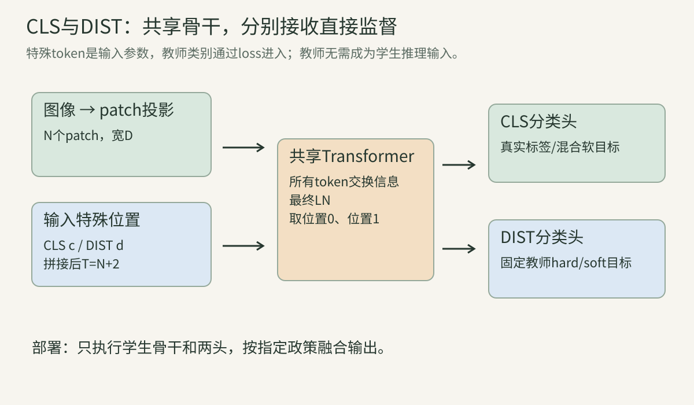
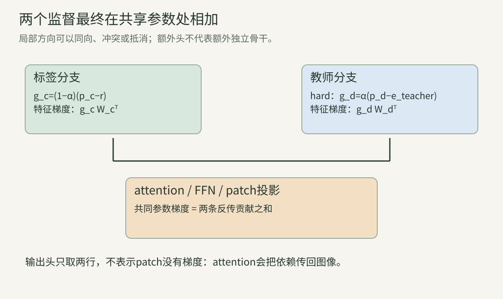
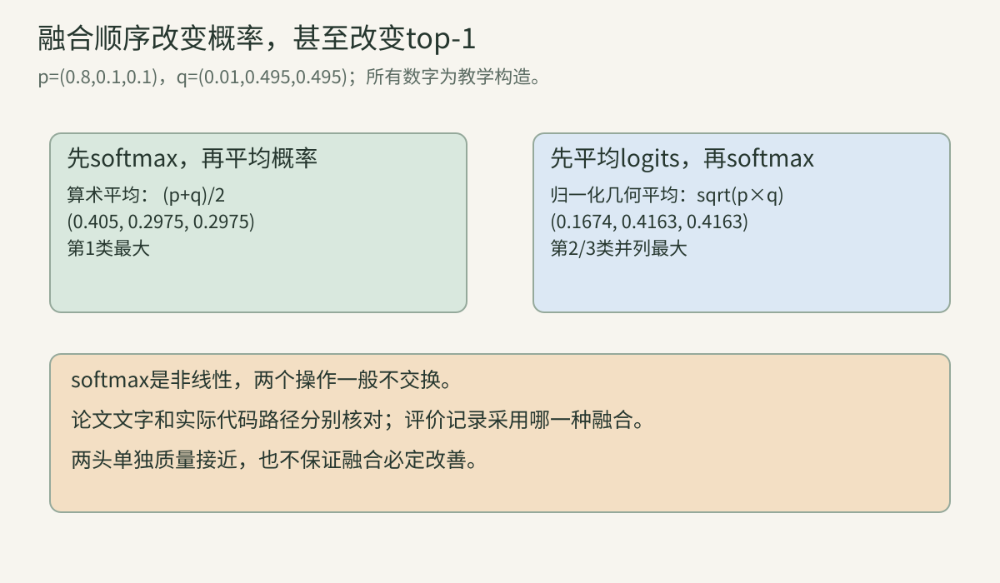
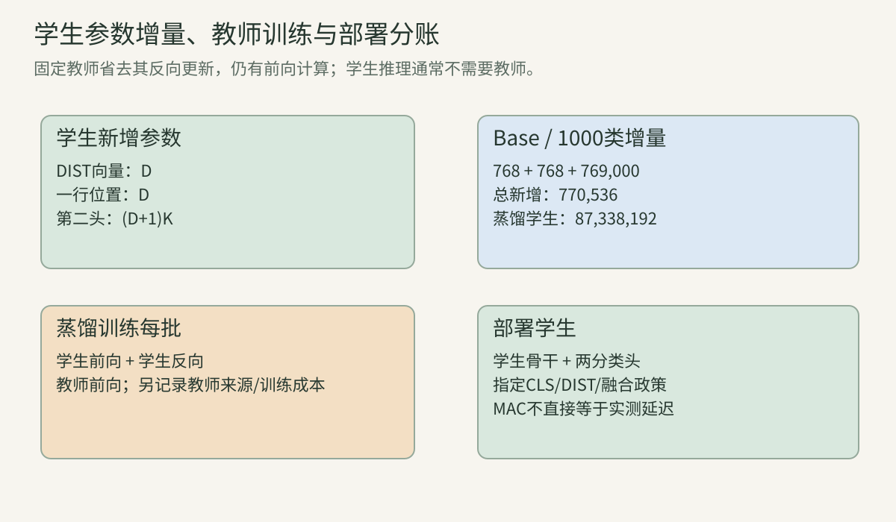
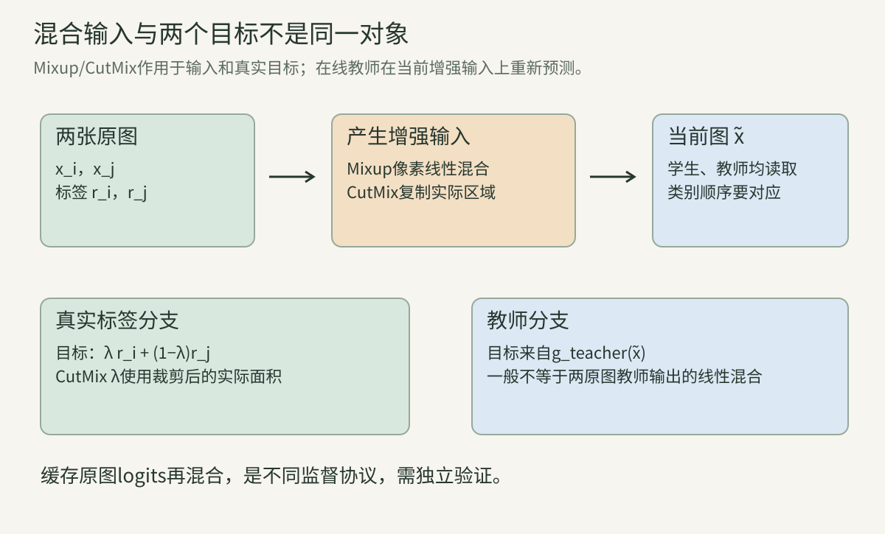

> [第12讲](../vision-12-vit/)说明了ViT从图像到分类输出的计算。现在追问：同一种骨干，怎样在较有限的独立图像数据上学得更好？本讲先把“教师提供什么监督”算清楚，再解释额外token和训练配方。先修概率与loss见[第03讲](../vision-03-probability/)，优化与正则见[第05讲](../vision-05-training/)，attention反传见[第11讲](../vision-11-attention-transformer/)。下文所有小矩阵与虚构准确率都用于教学，不是本文训练出的ImageNet结果。

## 一、数据效率首先是一个有条件的实验问题

### 1. DeiT改变了什么

DeiT是Data-efficient Image Transformers的简称。它沿用ViT的图像切块和Transformer编码器，研究训练策略与教师监督怎样改善图像分类。需要区分两种模型：不带蒸馏token的DeiT仍是单CLS分类骨干；带蒸馏token的版本增加第二个全局读取位置和第二个分类头。不能把所有DeiT都画成双token。

训练配方和结构是两条轴。更强的增强、正则和优化可以用于单token模型；知识蒸馏也可以直接约束单一分类输出。DeiT的特定结构创新，是将真实标签与教师标签的直接监督分配给两个输出接口，同时让它们在共同的attention骨干中交换信息。

后面会比较四种组合：基础骨干、改进配方、普通输出蒸馏、双token蒸馏。只有把其余条件固定，才能讨论某项改变带来的贡献。[DeiT原论文](https://arxiv.org/abs/2012.12877)

### 2. “较少数据”不等于“没有数据成本”

数据规模至少有三个数量：独立原图数、训练期间看到的增强视图数、优化更新步数。一本教材的不同裁剪不会变成三本新的教材，但读三遍和读一遍也不是相同学习预算。比较模型时，这三项都应记录。

另有教师的成本。若学生使用一个预先训练的教师，学生训练中额外的教师前向、教师训练所用图像以及教师的选择过程，都属于整个方案的来源和成本。教师只用同一训练集，不会自动构成外部图像；但这也不是“只训练一次学生”的计算预算。

因此，数据效率应表述为：在指定原图、标签、教师信息、训练预算和评估条件下达到某个质量。不能把一个成功的ImageNet分类实验扩大为任何小数据、任何视觉任务都能同样训练好。

### 算例A：独立样本和曝光次数

假设训练集只有1000张独立原图。实验甲训练100次完整遍历，每张每次产生一个随机视图，则总曝光数约100,000；实验乙训练100次、每次对每张产生3个视图，则约300,000。两者独立原图仍为1000张。

若全局batch分别为100和300，且没有截断，两者每次遍历都约10次更新，但乙每步处理3倍视图。若乙保持batch=100，就约30次更新。只写“都训练100 epoch”不能判定更新数或计算公平；实际sampler可能改变epoch定义，后文继续核对。

### 3. 教师、学生与真实标签是三个对象

真实标签$y$来自训练任务的标注。教师是参数为$\phi$的模型$g_\phi$，它在当前输入上产生logits $t\in\mathbb R^K$。学生是参数为$\theta$的模型$f_\theta$，产生logits $s\in\mathbb R^K$。K是类别数，二者需要使用相同类别顺序，才能逐类比较。

教师可以有不同架构、不同宽度，也可以比学生慢。它不必提供与学生同形状的内部特征：输出蒸馏只要求类别语义对应。将CNN的空间特征图直接当成ViT的token，则是另一类特征蒸馏，需要额外定义空间对齐、投影和损失。

“教师”这个称呼不保证其每次预测正确。一个错误教师可以给出高置信度的错误标签；真实标注也可能有噪声。后面的混合监督正是同时面对这些信息源，而不是把其中之一宣布为绝对真理。

### 4. 当前增强图决定教师看到什么

把原图$x$通过随机增强$a$变成$\tilde x=a(x)$。一种在线输出蒸馏协议让教师与学生都读取同一个$\tilde x$，因此教师目标是$g_\phi(\tilde x)$，而不是永久绑定在原图上的一个常量类别。

这是实际可影响结果的选择。某张图中心裁剪留下猫，另一裁剪只留下沙发，教师的输出可能不同。Mixup或CutMix生成的新输入，也可能使教师做出与两张原图各自预测不同的决定。缓存原图教师logits再给所有增强视图复用，通常不等价于在线预测。

作者训练代码先执行混合增强，再将同一批samples传给学生与蒸馏criterion；criterion在该输入上执行教师前向。[训练循环](https://github.com/facebookresearch/deit/blob/main/engine.py) 这是核对过的代码路径，不代表所有蒸馏算法必须采用相同视图。

### 5. 冻结教师必须同时处理梯度和运行模式

输出蒸馏通常把教师视为固定监督源：教师前向不建立反向图，教师参数不放入学生optimizer。这样学生loss不会沿教师分支更新$\phi$。但“没有梯度”和“预测稳定”不是同一件事。

教师若有BatchNorm，train模式可能更新running mean/variance；有Dropout时，train模式可能产生随机输出。因此固定教师通常还需eval模式，并核对BN buffer、随机算子和预处理。`no_grad`控制自动微分记录，`eval`切换模块行为；两者互不替代。

教师预测无需对argmax求导；学生根据教师产生的目标更新自己。另一些自蒸馏方法用EMA缓慢更新教师，那是不同算法，后续DINO等专题会说明。不要把固定外部教师、学生EMA评价权重与EMA教师混成一个机制。

## 二、硬蒸馏：教师给一个类别，梯度仍由学生概率产生

### 6. logits、概率和argmax各做什么

logits是实数打分，不必为正，也不必和为1。softmax将它转换为类别概率：

$$
p_k=\frac{e^{s_k}}{\sum_{j=1}^K e^{s_j}}.
$$

全部logits加同一常数不会改变p。预测类别为$\arg\max_k s_k$，它与$\arg\max_k p_k$相同。教师硬目标$k_t=\arg\max_k t_k$只保留最大类别，丢弃第二名、置信度以及其他类别的相对排序。

这并不意味着学生输出必须变成一个不可导整数再训练。训练仍对学生logits计算交叉熵；argmax只用于制作教师目标。把学生argmax结果当loss输入，反向传播通常无法得到需要的概率梯度。

### 7. 一个目标的交叉熵梯度怎样推出来

设目标为类别r，其one-hot向量$e_r$只有第r项为1。loss为：

$$
L_r=-\log p_r=-s_r+\log\sum_j e^{s_j}.
$$

对$s_k$求导，第一项贡献$-\mathbf1[k=r]$，第二项贡献$p_k$，所以：

$$
\frac{\partial L_r}{\partial s_k}=p_k-(e_r)_k.
$$

梯度和为0，与softmax平移不变性一致。梯度下降减去此梯度：目标类别的logit向上，其余向下。具体变化还受后面的权重矩阵与优化器影响，但这一层的方向可以直接核对。

### 8. 单头硬蒸馏等价于一个混合目标

若真实标签y和教师类别$k_t$都监督同一组学生logits，令教师权重为$\alpha\in[0,1]$：

$$
L=(1-\alpha)L_y(s)+\alpha L_{k_t}(s).
$$

利用交叉熵对目标分布的线性性，可写成$L=-\sum_k r_k\log p_k$，其中$r=(1-\alpha)e_y+\alpha e_{k_t}$。梯度为$p-r$。这是一组logits面对两个目标来源，并非两个骨干或两个分类器。

当教师与真实标签一致时，r退化为同一个one-hot，监督梯度与普通交叉熵完全相同；当二者不同，r在两个类别上分配权重。目标变软来自信息源冲突与线性混合，教师自身依旧只提供硬类别。

### 算例B：教师与标签冲突时的一头梯度

三类学生概率$p=(1/2,1/3,1/6)$，真实类别是1，教师类别是2，$\alpha=1/2$。目标$r=(1/2,1/2,0)$，故：

$$
\nabla_sL=(0,-1/6,1/6).
$$

第一类在当前点恰好不直接改变logit，第二类上升，第三类下降。loss是$-\tfrac12\log(1/2)-\tfrac12\log(1/3)=\tfrac12\log6\approx0.895880$。这里的0并不表示第一类参数永远不更新：共享参数还可能被其他样本、其他输出和weight decay更新。

### 9. 教师硬标签为何会跳变

教师logits为$(0.01,0,-1)$时，硬类别是1；若很小的输入变化使它变为$(0,0.01,-1)$，硬类别成为2。最大打分仅相差0.01，目标one-hot却跨到另一个顶点。

学生对固定目标的loss仍可导，但目标关于教师输出存在不连续决策边界。接近并列时要注意tie-break规则、精度和随机增强。若想保留不确定性，可以考虑软分布蒸馏；这是否改善质量需要实际比较，而不是只凭“更连续”作结论。

argmax把教师校准信息也丢掉。例如两组教师概率$(0.51,0.49)$与$(0.999,0.001)$都成为类别1。硬蒸馏若没有额外置信度权重，就不会因后者更有把握而提高其loss权重。

### 10. 蒸馏不是“学生必须小于教师”

蒸馏常用于压缩，但监督迁移和参数压缩是不同目标。两个模型参数量相近，甚至学生更多，仍可让教师输出作为辅助目标。需要解释的是教师提供的函数行为是否帮助学生，而不是名字中的大小关系。

教师与学生的错误可能互补，学生还有真实标签和自身架构偏置，因而学生在某个评估集上超过教师并不逻辑矛盾。反过来，教师更高accuracy也不保证蒸馏有效：输出类别、增强适配、错误置信度和学生容量都可能影响训练。

不能从一次超越推导教师信息被完整复制，更不能把教师架构的局部性变成学生架构的严格平移等变性。约束的是训练样本上的行为，学生的运算结构仍然由自己的计算图决定。

## 三、软蒸馏：分布、温度和损失尺度都要写清

### 11. 温度如何改变分布

给定温度$\tau>0$，学生与教师分布分别为$p^\tau=\operatorname{softmax}(s/\tau)$、$q^\tau=\operatorname{softmax}(t/\tau)$。温度增大，打分差距在指数前被缩小，分布趋于均匀；温度接近0时，通常集中在最大类别上。

温度不是直接把原概率除以一个数。对于两个类别，有$p^\tau_1/p^\tau_2=\exp((s_1-s_2)/\tau)$。类别概率的比值由logit差决定；更高温度保留排序，却改变差距的强弱。

同一温度用于二者，才是在一致的尺度上比较软目标。温度属于训练目标的设计，推理是否仍用它需要另行规定。知识蒸馏中的高温不自动表示推理必须降低置信度。[Hinton等蒸馏原论文](https://arxiv.org/abs/1503.02531)

### 算例C：用对数构造精确温度例子

教师$t=(\log4,\log2,0)$。温度1时，指数为$(4,2,1)$，故$q^1=(4/7,2/7,1/7)$。温度2时，指数为$(2,\sqrt2,1)$，需重新用$3+\sqrt2$归一化，约为$(0.453082,0.320377,0.226541)$。

第一类仍最大，但第三类不再只有约0.143。这里所有类别都有正概率，能描述非最大类别之间的关系；它们是否包含有用相似性，取决于教师训练和当前输入，不能由softmax形式保证。

### 12. 前向KL与反向KL不能互换

本讲采用固定教师分布在前的KL：

$$
\operatorname{KL}(q^\tau\Vert p^\tau)=\sum_k q^\tau_k\log\frac{q^\tau_k}{p^\tau_k}.
$$

它等于教师熵的负数加上教师到学生的交叉熵：$\sum q\log q-\sum q\log p$。固定q时，第一项对学生梯度为0。若反过来算$\operatorname{KL}(p\Vert q)$，权重p也随学生变化，梯度就不同。

论文或库函数的参数写法可能让方向难辨。本讲始终用上面的展开式消除歧义；作者`losses.py`的`kl_div(log_student, log_teacher, log_target=True)`实际对应$\sum q(\log q-\log p)$，不能仅按函数第一个参数的位置猜测KL方向。[作者损失实现](https://github.com/facebookresearch/deit/blob/main/losses.py)

### 13. 为什么常乘温度的平方

把教师看作常量，对高温softmax交叉熵求导：

$$
\frac{\partial\operatorname{KL}(q^\tau\Vert p^\tau)}{\partial s_k}=\frac{p^\tau_k-q^\tau_k}{\tau}.
$$

链式法则里的$1/\tau$来自$s/\tau$。在高温、小logit差近似下，$p^\tau-q^\tau$本身也约随$1/\tau$缩小，因此未缩放梯度约以$1/\tau^2$减小。乘$\tau^2$能补偿这项主要尺度变化，得到$\tau(p^\tau-q^\tau)$。

这是尺度分析，不是温度任意变化时梯度恰好恒定的定理。高温近似要相对于logit差成立；低温、极端打分、不同loss reduction和其他监督权重都可能改变总梯度。调$\tau$同时不记录$\alpha$和reduction，会混淆目标内容与目标强度。

### 14. 从softmax展开看logit匹配近似

设$\bar s=\tfrac1K\sum s_k$，当$|s_k-\bar s|/\tau$都很小时，把指数展开到一阶：

$$
p^\tau_k\approx\frac1K+\frac{s_k-\bar s}{K\tau}.
$$

教师同理，故$\tau(p^\tau_k-q^\tau_k)\approx[(s_k-\bar s)-(t_k-\bar t)]/K$。在此近似范围内，高温KL倾向于匹配去均值后的logits，而不匹配任意共同偏移。

为什么一定要去均值？因为softmax对共同平移不敏感。若教师$t=(2,1,0)$、学生$s=(102,101,100)$，二者概率完全相同，KL为0；原始logits的普通MSE却很大。这种MSE会要求模型拟合本来不影响分类的偏移，已经是另一目标。

### 算例D：高温KL的梯度与数值

取$\tau=2$、学生logits全部0，故$p=(1/3,1/3,1/3)$；教师$t=2(\log4,\log2,0)$，则$q=(4/7,2/7,1/7)$。缩放KL为$4\sum q\log(3q)$，约0.57165，精确数值由本章实验一输出。

梯度$2(p-q)$等于$(-10/21,2/21,8/21)$。三项和为0，第一类上升最多，第二类略下降，第三类下降更多。若还乘教师权重$\alpha$，这整组梯度再乘$\alpha$，不要将它与真实标签梯度的系数漏掉。

### 15. batchmean和逐元素mean差一个类别因子

batch=B、类别数K时，逐样本KL求平均为：

$$
L_{\rm batch}=\frac{\tau^2}{B}\sum_{b,k}q_{bk}\log\frac{q_{bk}}{p_{bk}}.
$$

如果改为除以所有输出元素$BK$，得到$L_{\rm elem}=L_{\rm batch}/K$，学生梯度也缩小K倍。它们最小值位置可能相同，但与真实标签loss混合后，教师的相对权重不同。K=1000时，差异尤其不能忽略。

核对日期的作者soft loss先求sum，再除`outputs_kd.numel()`，即BK；硬loss使用默认cross entropy的batch平均。复现软/硬对比时需要记录这一点。改成batchmean并保留相同$\alpha$，并不是单纯修复一个不影响训练的显示数字。

### 算例E：一个loss被缩小三倍

沿算例D取B=1、K=3。batch平均梯度是$(-10/21,2/21,8/21)$；元素平均变成$(-10/63,2/63,8/63)$。若两者都与$\alpha=1/2$的真实标签loss混合，教师对最终更新的影响不同。

若希望把元素平均恢复为同一总尺度，可以显式乘K。也可以重新调整混合权重，但需注意真实标签系数$1-\alpha$也会变化；只说“alpha乘三”不一定保持两分量与整体学习率都一致。

### 16. hard、soft和label smoothing保留的信息不同

hard目标只有教师最大类别；soft目标包含教师在所有类别上的分布；label smoothing则通常把真实one-hot与一个人为指定的分布混合。三者都能形成概率目标，但来源和含义不同。

soft teacher的第二类概率可能因图像包含相似物体而提高；均匀smoothing不会随当前图像变化，只是降低标签的尖锐程度。因此“硬蒸馏加smoothing”等价于某个平滑硬目标，却不等价于任意软教师分布。

选择还涉及噪声：软目标可能保留有用关系，也可能传播教师错误置信度；硬目标可以丢掉不可靠的小概率结构，也可能丢掉重要不确定性。这些是待测权衡，而不是哪一种必然更高级。

### 17. 稳定实现使用log-softmax而不是先求极小概率

log-softmax可写为$s_k-\operatorname{LSE}(s)$，其中$\operatorname{LSE}(s)=m+\log\sum_j e^{s_j-m}$、$m=\max s$。先减最大值，避免对大正数直接求指数溢出。对小概率直接先softmax再log，则可能先下溢为0，得到$-\infty$。

KL允许教师某些目标质量为0，但计算$0\log0$要按极限视为0，不能在普通浮点表达式里写成$0\times(-\infty)$而得到NaN。本章教学程序对有限logits使用稳定log概率，避免先求概率再取log造成下溢；直接处理含零的目标概率时，还须明确零质量项的计算约定。

还需核对dtype和停止梯度。教师概率在数值上不是一个“永远正确”的常量，它是某次前向的输出；固定教师只意味着不把此loss的反向传播回教师。检查其值、运行模式与NaN仍然必要。

## 四、蒸馏token：两种直接监督进入同一骨干

### 18. 输入多了一个可训练的全局位置

基础分类ViT的输入是CLS加N个patch，$T=N+1$。蒸馏版增加一个DIST token，输入次序可以记为$[c;d;x_1E;\ldots;x_NE]+P$，其中$c,d\in\mathbb R^D$，$P\in\mathbb R^{(N+2)\times D}$。

作者实现按CLS、DIST、patch排列，最终取序列第0、第1位置送到两个独立线性头。c和d分别跨batch共享，其初始向量是训练参数；它们不是教师输出、标签one-hot或两张额外图像。[作者模型实现](https://github.com/facebookresearch/deit/blob/main/models.py)

教师类别只出现在loss目标里。DIST通过骨干读取图像，并根据loss调整自己的输入参数与上下文状态。把教师logits直接拼进学生输入，会让学生在推理时依赖一个本来不需要的外部教师，已经改变了原算法。

### 算例F：两个特殊位置怎样进入形状链

batch=2，输入224×224，P=16，D=384。patch投影为$2\times196\times384$；CLS和DIST各扩展为$2\times1\times384$；拼接得到$2\times198\times384$。

位置表是$1\times198\times384$，按batch广播。最终两个状态各为$2\times384$，两个1000类头各输出$2\times1000$。训练时通常保留两组logits用于两个loss；不是将它们拼成2000个类别。

### 19. DIST是特定角色，attention本身不懂教师

对任一token，attention仍按Q/K/V计算。CLS和DIST都可以读取patch、彼此以及自己；没有一套“教师attention公式”专门只给DIST使用。结构上的区别主要是独立输入向量、对应位置和输出监督。

为什么它们会学到不同作用？因为反向传播分别施加真实标签与教师目标，且两个头的参数独立。不同直接监督使它们有机会组织不同的全局信息，共同骨干又允许信息共享。

这不保证两个向量在每张图上都互补或正交。相似度、决策一致率和双头融合收益需要观察；同维度只表示接口形状相同。把某一次attention热图看成“蒸馏token必然只看教师关注区域”，超出了结构本身能保证的性质。

### 20. 两个分类头的loss写到哪一行

设最终归一化CLS特征$u_c$、DIST特征$u_d$，两头logits为$s_c=u_cW_c+b_c$、$s_d=u_dW_d+b_d$。双头硬蒸馏的一个明确目标是：

$$
L=(1-\alpha)\operatorname{CE}(s_c,r)+\alpha\operatorname{CE}(s_d,e_{k_t}).
$$

这里r可为真实one-hot，也可为训练增强后的软标签。真实分支的梯度$g_c=(1-\alpha)(p_c-r)$，蒸馏分支$g_d=\alpha(p_d-e_{k_t})$。软蒸馏则用第13—15节定义的温度KL替换第二项，连同其reduction。

注意这与第8节的单头混合目标不同：两组logits有各自概率，不能把它们的两个loss一般化简成“一组概率面对混合标签”。它们共享上游骨干，却在输出处仍是两个不同函数。

### 21. 两个头的梯度怎样回到特征

行向量约定下，$W_c,W_d\in\mathbb R^{D\times K}$。由线性层反传：

$$
\nabla_{W_c}L=u_c^\top g_c,\quad \nabla_{u_c}L=g_cW_c^\top.
$$

DIST同理。最终序列的初始上游梯度，只在CLS、DIST两行放入相应特征梯度，其余patch行在这一输出接口处为0；再经过最终LN、残差、attention和MLP反传。

“patch行最初为0”不等于patch没有学习。attention把全局输出对patch的依赖传回来，patch投影和输入像素因此获得梯度。第11讲已说明，Q/K/V三条共享输入路径都要累加；两头使上游贡献更多，不能只追踪DIST的V路径。

### 算例G：两个头的精确梯度

取$\alpha=1/2$、两头概率都为$(1/2,1/3,1/6)$，真实类别1、教师类别2。得到：

$$
g_c=(-1/4,1/6,1/12),\qquad g_d=(1/4,-1/3,1/12).
$$

若$u_c=(1,2)$，CLS头权重梯度两行为$(-1/4,1/6,1/12)$、$(-1/2,1/3,1/6)$。若$u_d=(3,-1)$，DIST头权重梯度为$(3/4,-1,1/4)$、$(-1/4,1/3,-1/12)$。每个头的bias梯度就是对应g。

此处即使概率相同，两头仍受不同方向监督。要数值检查这些权重梯度，必须固定两组feature和当前概率来自的旧权重；不能一边更新CLS头一边用新概率计算DIST梯度。

### 22. 共享骨干收到的是两条梯度之和

将骨干共同参数记为$\theta$，则：

$$
\nabla_\theta L=(1-\alpha)\nabla_\theta L_c+\alpha\nabla_\theta L_d.
$$

两个任务可能在某些参数上同向，也可能抵消。只有两个独立分类头，不表示存在两个完全独立优化系统；attention、MLP、patch投影和归一化多数仍共享。一个loss也会通过共同特征改变另一个头以后收到的输入。

可以用向量夹角或点积诊断梯度关系，但这仍是局部状态。正点积不保证整个训练都相容，负点积也不等于必然训练失败；优化过程会改变特征、概率和梯度。不要从一批样本上的抵消推出双头在所有任务都无效。

### 算例H：两个监督在一个参数上抵消

为解释共享路径，构造局部线性小模型$s_c=w$、$s_d=w$，二分类正类概率$p=\sigma(w)$。真实标签1、教师标签0，权重各1/2。此时$\partial L/\partial w=\tfrac12(p-1)+\tfrac12p=p-1/2$。

当$w=0$，p=1/2，两梯度完全抵消。若两个头有独立参数或feature，结果会变化，因此这个单标量反例只说明“共享梯度可以抵消”，并不是DeiT双token的完整简化模型。后面的可运行实验将真正经过小型attention骨干核查两头共享路径。

### 23. 只增加第二个同标签token不是同一种监督

如果两个头都预测同一个真实标签，模型得到的是两份同来源监督。它可以作为结构对照，帮助检查额外读取位置或参数是否有效，但它没有引入教师对增强图的判断。

从计算图看，两个头仍有独立参数，可能因初始化和训练获得不同状态；不能仅凭“目标相同”证明它们必然严格相等。反之，观察它们越来越相似也不能推出所有双头都会如此。应把理论条件、某次实验观察和普遍命题分开。

比较蒸馏token时，一个有意义的消融是保持第二token和第二头，改第二目标为相同真实标签；另一个是移除第二token，把教师loss约束到CLS输出。这样分别检查额外接口和教师信息的贡献，而不是同时改动两项后归因于其中一项。

### 24. 双头训练接口和推理接口不同

训练criterion需要知道哪组logits用于标签、哪组用于教师，因此蒸馏版模型的train输出是二元组$(s_c,s_d)$。评估通常需要一组K类打分，模型会按约定融合两个输出。

若错误地把eval的融合输出送进要求双输出的蒸馏criterion，会丢失对应关系或直接报错；若把二元组送进普通交叉熵，也未必符合接口。`model.train()`/`eval()`除了正则行为，在该实现里还会改变返回形式，调试时须先打印类型与shape。

教师不需要参与学生推理。蒸馏知识进入学生训练后的权重和表示；推理只执行学生两头。但评估者必须记录取CLS、DIST还是融合结果，否则同一个checkpoint也可能得到不同指标。

### 25. 平均logits与平均概率不同

设两头logits为a,b。平均logits再softmax得到$\operatorname{softmax}((a+b)/2)$；平均概率得到$[\operatorname{softmax}(a)+\operatorname{softmax}(b)]/2$。softmax是非线性函数，两种顺序一般不交换。

令$p=\operatorname{softmax}(a)$、$q=\operatorname{softmax}(b)$，对每一项写$a_k=\log p_k+c_a$、$b_k=\log q_k+c_b$，则logit融合的概率为：

$$
r_k=\frac{\sqrt{p_kq_k}}{\sum_j\sqrt{p_jq_j}}.
$$

它是归一化几何平均，概率融合是算术平均。前者更强调两头同时支持的类别。核对资料时，论文文字描述了概率late fusion，而作者`models.py`的eval路径返回`(x+x_dist)/2`，x为线性头logits。复现须说明采用的实际路径，不将二者当作数学恒等式。

### 算例I：融合方式甚至会改变预测类别

取$p=(0.8,0.1,0.1)$、$q=(0.01,0.495,0.495)$。概率平均为$(0.405,0.2975,0.2975)$，第一类最大。

logit平均对应未归一化几何权重$(\sqrt{0.008},\sqrt{0.0495},\sqrt{0.0495})$，约$(0.08944,0.22249,0.22249)$，归一化后第一类仅约0.1674，第二/第三并列最大。按首个最大值规则选第二类。

此处logits可直接取$\log p$和$\log q$，因为概率和都为1。例子不需要使用奇怪的偏移或溢出，就能说明top-1也可能不同，故更不能认为只是置信度显示略有差别。

### 26. 双token位置迁移须保留两行特殊位置

蒸馏版位置表有N+2行。改变分辨率时，前两行对应CLS/DIST，要与patch位置分开；其余N行才恢复为二维网格、按每个通道插值、展平并重新拼接。第12讲保留一行CLS的程序不能直接原样套用。

以224→384、P16为例，序列198→578，patch位置196→576；特殊位置始终2行。若从第1行就开始reshape，会把DIST位置混入图像网格，197也无法正常还原14×14；即使代码通过错误裁剪凑出形状，语义仍错。

不同checkpoint还可能没有DIST，或采用其他位置设计。加载单token权重到双token模型，需要显式处理新增向量、位置行和第二头，记录哪些键初始化而非加载。`strict=False`只改变加载检查，不会自动创造正确映射。

### 算例J：小位置表的迁移

设二维patch网格2×2，每个位置只用一个数表示。完整位置表是$[99,77,0,2,4,6]$：99是CLS，77是DIST，余下恢复为$\begin{bmatrix}0&2\\4&6\end{bmatrix}$。

按第12讲端点对齐的双线性教学约定，升到3×3得到$\begin{bmatrix}0&1&2\\2&3&4\\4&5&6\end{bmatrix}$；完整表是$[99,77,0,1,2,2,3,4,4,5,6]$，共11行。两个特殊位置没有进入插值，也没有变成两枚图像patch。作者实际实现还需核对插值核与坐标约定。

## 五、Ti、S、B以及蒸馏的额外成本

### 27. 三个规模保留相同层数和每头宽度

原DeiT的Tiny、Small、Base配置分别为D=192/384/768，头数3/6/12，编码器深度均12，patch16，FFN宽度4D。每头宽度都是64，但这是这组配置的选择，不是所有ViT必须满足的结构定理。

较小D会同时缩小QKV/输出投影与FFN矩阵；减小头数保持每头64维。输入224和patch16仍有196个patch，因而三个规模在同一分辨率的序列长度相同；小模型不是靠丢弃patch来变小。

若宽度约减半，主要D平方参数/计算项约变成四分之一，但patch投影、位置表和类别头是D一次方，不能把整个网络精确乘1/4。接下来用逐项账本得到真实标量数。

### 28. 普通DeiT的精确参数账本

沿第12讲约定：RGB、224、P16、1000类；所有线性/patch层带bias，LN带scale/shift，每块两处LN、最后一处LN，没有额外pre-logits。单块参数为$12D^2+13D$，全网为：

$$
P_{\rm plain}=769D+D+197D+12(12D^2+13D)+2D+1000(D+1).
$$

769D包括$16^2\times3\times D$投影权重和D bias。中间D为CLS，197D为位置表；末尾1000(D+1)是类别头。它是一个具体基础实现的账本，不包括优化器状态或教师。

代入D=192、384、768，分别得到5,717,416、22,050,664、86,567,656。论文常以百万数四舍五入，精确值需要同时说明输入分辨率和head类别数。

### 29. 蒸馏新增参数并非只有一个D维token

相对相同规模普通版，新增DIST向量D、一行位置D、第二分类头$(D+1)K$，所以：

$$
\Delta P=2D+(D+1)K.
$$

编码器层数、宽度和其内部矩阵不变。K=1000时，第二头是新增参数的主要部分；若K很小，token/位置的占比会上升。这里新增位置是一行，不能把整张N+2位置表重新当作增量。

最终蒸馏Ti/S/B参数分别5,910,800、22,436,432、87,338,192。前两个特殊token跨batch共享，不会因batch翻倍而参数翻倍。训练还需加载教师参数，但那是另外一个模型，不应混进学生部署参数数目。

### 算例K：Base新增了多少

D=768、K=1000：DIST 768、一行位置768、第二头769,000，总新增770,536。普通86,567,656加上它得到87,338,192。

如果错误地只说“多768参数”，会漏770千量级的类别头和位置。若迁移到10类，新增量是$1536+769\times10=9226$；可见额外成本受任务类别数影响，不能把1000类结论复制到所有任务。

### 30. 多一个token怎样改变矩阵MAC

标准FFN扩张4倍时，一块矩阵乘加MAC为$12TD^2+2T^2D$。T由197变198，增量是：

$$
\Delta M_{\rm block}=12D^2+2(198^2-197^2)D=12D^2+790D.
$$

还需在全网加第二头的$DK$ MAC，故12层总增量为$12(12D^2+790D)+DK$。patch投影没有多一个patch，保持原计数；norm、softmax、激活等逐元素运算沿第12讲约定另计。

代入Ti/S/B得到7,320,576、25,257,984、92,983,296增量MAC。相对于学生整网是较小增加，但不能由此推断蒸馏训练只慢这一点：训练期间还执行教师前向。

### 31. 教师训练、教师前向与学生推理要分账

蒸馏训练每批的主要模型工作包括学生前向、学生反向和教师前向。冻结教师使它无需计算用于自身更新的反向梯度，但它的读取输入、卷积/attention等前向仍消耗计算、显存和带宽。

部署学生时通常没有教师，成本是学生骨干加两个头；如果部署者改为同时运行教师集成，已经是不同系统。报告“参数约87M”时须明确是学生存储，不代表训练进程只持有87M参数。

实际速度还涉及batch、dtype、编译、算子、内存和设备。历史论文吞吐只在其测量条件下成立，不能直接当成本机或现代硬件成绩。比较数据效率时也要记教师来源和训练成本，而不是只拿学生部署MAC替代整套训练预算。

## 六、训练增强怎样改变输入和目标

### 32. 增强是在定义哪些变化应保持类别

随机裁剪、翻转、颜色变化等方法，用同一训练原图产生不同视图，并通常沿用类别。这个做法隐含一个任务假设：在采用的变换范围内，图像仍足以支持同一标签。没有这个条件，增强可能制造错误监督。

例如裁剪动物照片留下毛发局部，类别仍可能可辨；裁剪只留下背景，则标签可能不再由可见内容支持。左右翻转对一般物体类别通常合理，对写着特定方向文字的图像可能改变语义。增强策略应与任务适配，不能用“更强”代替检查。

增强增加视图变化，不新增独立采样对象。它可以帮助模型减少对固定位置、颜色或背景的依赖，但也可能删掉必要信息。对于弱空间偏置的ViT，增强是训练条件的一部分；成效仍依赖数据和预算。

### 33. label smoothing的两种约定

一种常见平滑目标是$r=(1-\varepsilon)e_y+\varepsilon u$，其中均匀$u_k=1/K$，故目标类$r_y=1-\varepsilon+\varepsilon/K$，其余$\varepsilon/K$。

另一种把$\varepsilon$全部分给非目标类：$r_y=1-\varepsilon$，$r_{k\ne y}=\varepsilon/(K-1)$。两者都归一化，但数值不同。论文叙述、库版本或实现若用不同约定，应在复现记录中明确。

平滑目标的交叉熵梯度仍是$p-r$。它把“希望目标概率为1”改为“希望匹配一个非极端分布”；可能降低训练上的过度置信，却不保证模型在任意分布上得到良好校准。标签有噪声时，也不能代替检查错误标注。

### 算例L：三类平滑目标与梯度

K=3、$\varepsilon=0.1$、真实类别1。均匀混合约定给$r=(14/15,1/30,1/30)$，约$(0.933333,0.033333,0.033333)$；只分其他类约定给$(0.9,0.05,0.05)$。

若$p=(0.8,0.15,0.05)$，第一种梯度为$(-2/15,7/60,1/60)$，第二种为$(-0.1,0.1,0)$。仅在这一个点就已不同，因此不能在抄写公式后用另一种库实现而声明完全等价。

### 34. soft target交叉熵并非把目标argmax回来

对归一化目标$r\in[0,1]^K$，定义$L=-\sum r_k\log p_k$。softmax导数给出$p_k\sum_jr_j-r_k$，在$\sum r=1$时为$p-r$。这同时覆盖smoothing、Mixup等产生的软标签。

如果把软标签先argmax为一个整数，会丢掉混合权重。比如$r=(0.6,0.4,0)$变成类别1，已经不是用60%第一类和40%第二类的监督。普通整数标签接口与软目标接口须核对，而不是只看loss名称包含CrossEntropy。

归一化也很关键。若误把两个one-hot直接相加得到目标和为2，梯度为$2p-r$，整体监督尺度翻倍。多标签BCE则另有独立sigmoid与各类二元目标，不要求类别质量和为1，是不同任务。

### 35. Mixup同时混合图像与标签

Mixup取两张输入$x_i,x_j$及权重$\lambda\in[0,1]$：

$$
\tilde x=\lambda x_i+(1-\lambda)x_j,\qquad \tilde r=\lambda r_i+(1-\lambda)r_j.
$$

混合按每个像素/通道进行，不是拼接两幅图；目标按同一权重混合。常用Beta分布采样$\lambda$，参数控制接近端点还是中间的程度，但随机变量的具体采样与batch/pair/elem模式需要按实现记录。[Mixup原论文](https://arxiv.org/abs/1710.09412)

把输入混合后只保留第一张标签，会改变目标；把标签混合而不给模型混合输入，也不是同一算法。Mixup是假设邻近组合上的预测可受线性目标约束，不表示真实语义世界里的物体可以物理透明叠加成一类。

### 算例M：smoothing与Mixup的手算

两类标签分别是第1、第2类，K=3、均匀smoothing $\varepsilon=0.1$。平滑后分别$(14/15,1/30,1/30)$、$(1/30,14/15,1/30)$。取$\lambda=0.6$，混合目标：

$$
\tilde r=(43/75,59/150,1/30)\approx(0.573333,0.393333,0.033333).
$$

这也等于先混one-hot得到$(0.6,0.4,0)$，再做相同均匀smoothing：因为这两步都是对目标的仿射操作。此等价依赖同一$\varepsilon$和同一平滑分布；若两样本用不同平滑强度则不能照搬。

### 36. 教师预测混图不等于混合教师预测

在线蒸馏可能使用$g(\lambda x_i+(1-\lambda)x_j)$产生目标。预先计算两个教师输出后线性混合，则使用$\lambda g(x_i)+(1-\lambda)g(x_j)$。一般神经网络不是线性函数，这两项不必相等；softmax又增加一层非线性。

因此需要分别说明输入协议和目标协议。DeiT代码路径中的硬教师在混合后的samples上取argmax，而真实标签分支可保留Mixup软目标。两头此时直接收到不同类型的监督，是算法允许的情况，不是必须把教师硬标签也按同一比例拆成两类。

若教师不适合极强的混合图，可能给出不可靠硬目标。检查混合输入上的教师行为、增强强度和学生收益，可以帮助诊断；不能仅用教师在干净验证集的accuracy代替这些检查。

### 37. CutMix复制区域，目标权重来自实际面积

CutMix用一个空间mask M决定保留第一图哪些像素：$\tilde x=M\odot x_i+(1-M)\odot x_j$。若M在保留区域为1，目标取$\tilde r=\lambda_{\rm actual}r_i+(1-\lambda_{\rm actual})r_j$，其中$\lambda_{\rm actual}$是第一图实际保留的面积比例。

常见实现先采样混合比例，再确定矩形边长和中心；矩形碰到边界会被裁剪，因此最终实际面积可能与采样比例不同。标签通常要据裁剪后的矩形重新计算，而不是保留裁剪前的理论面积。[CutMix原论文](https://arxiv.org/abs/1905.04899)

它保留局部纹理而非透明叠加，但面积比例也只是监督规则，不是“图中物体语义占比”的精确测量。一个小区域可能刚好覆盖唯一关键物体，背景大面积却无分类信息，所以需结合数据和任务评价。

### 算例N：矩形越界后的真实比例

8×8图共64像素。拟粘贴矩形覆盖横坐标[−2,4)、纵坐标[1,7)，理论宽6高6、面积36；裁剪到图内后横坐标[0,4)、纵坐标[1,7)，宽4高6、面积24。

第一图实际保留$1-24/64=0.625$，目标是$0.625r_i+0.375r_j$。若错误用理论面积36，权重变成0.4375/0.5625，甚至把哪张图占更大比例都颠倒。半开区间边界和像素计数在小图里尤其要精确。

### 38. CutMix矩形不必对齐patch边界

ViT之后才按固定网格切块。CutMix先在像素域粘贴，矩形可以穿过patch内部，因此一个token的局部输入可能同时来自两张图。没有理由在原算法里自动将每个patch指派给单一来源。

例如4×4灰度图P=2，在中央2×2矩形粘贴第二图，会同时改变四个patch的各一个像素。四个patch都成了混合来源，而目标仍按整幅图面积计算。将矩形取整到patch网格，可以成为另一种设计，但需重新说明增强分布和实际面积。

这也提醒我们：分类软标签是图像级目标，不是每个patch的真实语义标注。将Mixup/CutMix标签直接拿作局部检测、像素分割或token类别目标，需要额外定义空间对应。

### 39. RandAugment把操作次数和强度分开

RandAugment的基本思想是从候选变换中选择若干操作，控制操作次数与幅度，从而减少增强策略的搜索空间。操作可能涉及颜色、对比度或几何变换；某个“强度数字”必须结合实现中每项操作的幅度映射解释。[RandAugment原论文](https://arxiv.org/abs/1909.13719)

不同操作并不交换。例如先旋转再裁剪与先裁剪再旋转，保留视野不同；颜色增强先后也可能因clamp而不同。记录一个简写名称而不保存库版本、插值与填充值，可能不足以复现原输入分布。

强增强与soft labels/正则一起作用。比较去掉某增强的消融时，其余参数若不重新调优，测得的是“在当前固定配方里去掉该项”的影响，不是该增强对所有配置的绝对价值。

### 40. Random Erasing有不同于CutMix的标签政策

Random Erasing通常将图内一个矩形用常数、随机数或特定噪声替换，沿用原图标签；它模拟部分遮挡，要求剩余内容仍足以支持类别。CutMix则从另一张图复制区域，并相应混合两个目标。

两种方法都改一块像素，但复制内容来源和loss目标不同。若在擦除后套用第二图标签权重，已经引入并不存在的第二来源；若CutMix却保持原one-hot，也改变了监督。

还要记录擦除在normalize前还是后、填充值的数值单位、发生概率和区域范围。均值归一化后的0可能对应原像素均值，并不一定是纯黑。增强可帮助遮挡鲁棒性，但不能保证对任何大遮挡仍正确识别。

## 七、正则、优化与样本组织共同构成配方

### 41. DropPath丢的是残差分支，不是随机删一个patch

训练中令$m\sim\operatorname{Bernoulli}(1-p)$，一种保持期望的残差随机深度形式为：

$$
y=x+\frac{m}{1-p}F(x).
$$

通常对每个样本采样一个分支mask，在token和通道轴广播。它与逐元素Dropout不同，也不等于把某些图像token从序列里删除。模型有两条残差子层时，具体mask的采样和调度还需核对实现。

因为$\mathbb E[m/(1-p)]=1$，固定x时这层输出期望为$x+F(x)$。但后续非线性使“最终网络期望等于关闭随机正则的网络”一般不成立。eval模式通常直接保留整个分支；不要为了补偿再乘一次$1-p$。

### 算例O：期望与方差一起算

x=2，F(x)=3，p=0.25。75%概率输出$2+3/0.75=6$，25%概率输出2。期望$0.75\times6+0.25\times2=5$，等于2+3。

输出方差$0.75(6-5)^2+0.25(2-5)^2=3$，不是0。若错误地不除0.75，输出为5或2，期望4.25；这改变了分支尺度。若分支后又经过平方，期望是$0.75\times36+0.25\times4=28$，而期望输出的平方是25，说明不能把单层期望结论推广到整网。

### 42. AdamW衰减与loss梯度是两条更新来源

AdamW将自适应梯度更新与weight decay分开组织；decay作用在参数上，而不是先混入loss梯度再由同一预条件器缩放。一个简化形式是$\theta_{t+1}=(1-\eta\lambda)\theta_t-\eta\widehat m_t/(\sqrt{\widehat v_t}+\epsilon)$。

它与在loss中加L2后通过同一自适应预条件器处理，不一般等价。即使某一分支当前监督梯度为0，参数仍可能因decay或旧momentum更新。第12讲零头阻断骨干当前loss梯度的例子，不能据此说优化器绝对不会改任何骨干参数。

还需列明哪些参数免decay，例如bias、归一化参数或特殊token/位置向量。模型或optimizer分组函数可能有不同政策；只写一个weight decay数字不够说明每个参数实际如何更新。

### 43. EMA评价权重平滑训练轨迹

参数指数移动平均可写为$\theta^{\rm ema}_t=\beta\theta^{\rm ema}_{t-1}+(1-\beta)\theta_t$。这是在参数空间平滑历史，不等于平均每步预测概率，也不等于重新训练一个独立模型。

本讲讨论将EMA权重用于评价或保存checkpoint；若EMA模型又生成训练目标，则会成为动态教师算法，需另外说明。初始化EMA、是否累计buffers、更新频率、衰减是否warmup、CPU/GPU存放均影响实际状态。

EMA可能平滑优化噪声，但不自动提高任意模型质量。选用EMA权重还是最后权重评估必须记录；两者可以对同一输入产生不同结果。恢复训练时也应恢复其状态，不能只加载学生权重却把EMA从零重新开始而称为精确续训。

### 算例P：两个EMA更新

一维参数初值$\theta_0=0$，EMA也初始化0，$\beta=0.9$。若训练后参数依次为10、20，EMA分别为1、2.9：第一步$0.9\times0+0.1\times10=1$，第二步$0.9\times1+0.1\times20=2.9$。

若EMA初值就是10，第二步会是11而非2.9，说明初始化不是无关细节。这里没有做bias correction；不要自动把Adam一阶矩的校正公式套到任意模型EMA实现。

### 44. warmup和cosine定义的是更新过程

warmup在初始阶段把学习率从较小值逐渐升到目标，减少刚初始化时过大的更新。一种线性warmup按步t写为$\eta_t=\eta_{\rm start}+(\eta_{\rm peak}-\eta_{\rm start})t/T_w$。端点计数、按epoch还是按step需要统一。

warmup后，一种cosine schedule为：

$$
\eta_t=\eta_{\min}+\frac{\eta_{\rm peak}-\eta_{\min}}2\left[1+\cos\left(\pi\frac{t-T_w}{T-T_w}\right)\right].
$$

这只是一个明确的教学约定。真实scheduler可有cooldown、额外noise或不同端点。恢复训练时应恢复scheduler步数；若从中间checkpoint重新warmup，会改变整个训练轨迹，不能算原run的无缝继续。

### 算例Q：全局batch和学习率缩放

采用基准学习率$5\times10^{-4}$对应batch512，按全局batch线性缩放：全局1024得到$10^{-3}$，256得到$2.5\times10^{-4}$。若8个进程每进程128、无累积，则全局1024，不是128。

若再累计4步后才optimizer.step，名义有效batch4096，但是否应继续线性放大学习率，还依赖随机增强、loss归一化和收敛。线性缩放是配方假设，不是任意大batch下保证等价的数学定理。warmup长短也需与更新步数一起记录。

### 45. repeated augmentation重复的是原图身份，视图不同

Repeated augmentation在一批或相近批次组织同一原图的多个随机视图。其直觉是让模型在不同增强之间共享监督，学习同一类别的稳定表示。但它是否改善训练，需在给定sampler和预算下评价。

同一身份出现多次不表示复制同一tensor三次：如果随机增强每次独立采样，看到的像素可以不同。若在缓存后只复制同一个已增强tensor，则失去这部分视图变化，算法改变。

分布式sampler还需要明确重复索引如何跨rank分配、如何padding、epoch如何shuffle和截断。对这种sampler，epoch未必恰好覆盖每张独立原图一次；应直接统计索引数、独立身份数与更新次数。

### 46. sampler代码比一个epoch数字更有信息

作者`RASampler`先shuffle原图索引，再重复索引、补齐到可按rank划分的长度，按rank步长抽取，并将选择数量取到指定倍数。其set_epoch参与随机种子；因此每个epoch的索引覆盖与普通DistributedSampler不同。[作者sampler](https://github.com/facebookresearch/deit/blob/main/samplers.py)

复现时不应自行把“重复3次”翻译为所有原图每epoch都训练3遍。实际selected样本数会改变有效覆盖；同一epoch内重复视图与跨epoch重新shuffle，也形成不同相关性。

查实验成本时，可从训练日志的实际optimizer.step数和每步处理图像数求总曝光数，再单独统计原图身份。若只拿“300 epoch”比较两个不同sampler，可能把不同预算和数据组织归因于骨干。

### 算例R：分布式取片的小例子

为了展示机制而非完整复刻作者取整规则，设原图索引shuffle后为[2,0,3,1]，每个重复3次，得到[2,2,2,0,0,0,3,3,3,1,1,1]。两个rank按步长2分别取[2,2,0,3,3,1]和[2,0,0,3,1,1]。

两rank看到的身份有重叠，不等于把每个身份永久归属一个rank；每次读取还可执行独立增强。若每rank再只选择前4项，rank0读[2,2,0,3]、rank1读[2,0,0,3]，身份1在此epoch被截掉。这个小例子解释为何必须核对selected长度，下一epochshuffle后覆盖又可能改变。

### 47. 配方不是把所有正则都开到最大

增强、smoothing、Mixup/CutMix、DropPath、weight decay和训练长度之间会相互作用。更强正则可能抑制过拟合，也可能让有限预算下的模型欠拟合；不同宽度、数据量和标签噪声可能需要不同强度。

小数据不等于应同时最大化所有正则。先看训练与验证曲线、增强后的可辨信息、教师目标稳定性，再判断需要增加正则还是解决优化。若训练集本身都学不好，一味加强遮挡或混合可能进一步降低质量。

还要区分loss降低与干净图accuracy变化。软标签与强增强改变训练目标，训练loss的绝对值不一定能与普通one-hot CE直接横比。可以另外在固定干净验证输入上测指标，以确认实际任务表现。

## 八、怎样解释论文成绩与消融

### 48. 历史成绩必须附上训练条件

DeiT原工作表明，在其ImageNet-1k训练配方下，不依赖额外独立图像的ViT可获得有竞争力的分类结果。阅读时至少区分普通版/蒸馏版、224训练/384微调、训练长度和实际评价头；其中普通Base的224结果81.8%，384微调83.1%，双头蒸馏300轮的对应融合结果83.4%与84.5%。[原论文表3](https://arxiv.org/html/2012.12877v2)

这些数字用来说明历史实验，不是本讲执行的训练，也不是今日所有实现都能自动达到的承诺。将不同训练长度或输入尺寸中的最高成绩放入一列，却省略条件，会把额外预算的贡献归入结构。

尤其不要把“使用相同原图集”写成“全部训练成本相同”。蒸馏需要教师，增大分辨率增加学生和教师输入成本，训练更久增加曝光和更新。质量提高需要与这些条件一起解释。

### 49. 消融首先回答固定条件下的反事实

完整配置得到指标a，去掉某组件得到b，差$a-b$表示在其余条件保持不变时这一去除的效果。它不是组件单独产生的绝对百分点，更不是所有任务中的通用收益。

若增强A、B有交互作用，完整配置去A的下降与去B的下降不能直接相加。若移除某方法后原学习率已不适配，则固定配方消融还混入训练适配问题。可以分别报告固定配方去除和各自重新调优的最优比较，它们回答不同问题。

因此看消融表要同时看是否训练正常、是否调参、评价波动和指标定义。明显不收敛的run能说明某配置脆弱，但不能仅凭它断言相关方法在所有超参数下不可缺少。

### 算例S：两个增强的交互

虚构四组同预算结果：都不用A/B=70%，只A=74%，只B=75%，都用=81%。A在没有B时贡献4点，在有B时贡献6点；B对应5点与7点。

交互项$81-74-75+70=2$点。完整模型去A降6、去B降7，相加13，但完整相对基线只增11，重复计入了交互。另需多随机种子和置信区间确认2点是否稳定，而不是用一次数字直接证明机制。

### 50. 教师偏置迁移是行为证据，不是结构证明

CNN教师具有局部卷积与参数共享等结构偏置；让学生拟合其输出可能把某些偏好的函数行为传给学生。但ViT中的attention和位置表仍未被替换成CNN，因此不能据此宣称学生获得严格卷积等变性。

可以测学生与教师的决策一致率、扰动下的行为、局部遮挡响应、错误类型及任务表现。若DIST头更像教师，这提供行为上的证据；也可能只是双方在容易样本上都答对，或共同错误增加。

所以一致率需拆成共同正确、共同错误、学生纠正教师、教师纠正学生等情况。只看一个总体一致百分比，会把“更正确”和“更像教师”混淆。

### 算例T：一致率高不表示accuracy更高

10张图，教师答对8张。学生甲与教师完全同预测，accuracy=80%、一致率100%；学生乙在教师的2张错题中纠正1张，其余相同，则accuracy=90%、一致率90%。

学生乙更好却更不一致。反过来，学生丙在教师2张错题上同错，同时把教师1张正确题改错，则accuracy=70%、一致率90%。相同90%一致率能对应不同accuracy，因此至少要记录标签条件下的四格计数。

### 51. 公平比较须控制教师、配方与测量系统

一个清晰的实验矩阵是：单CLS无教师、单CLS硬/软教师loss、双token同标签对照、双token硬/软蒸馏。每行记录同一骨干规模、原图、目标处理、教师权重与温度/reduction、训练步数、增强和评价输入。

若同时比较不同教师，先固定学生配方与教师输入协议；若比较吞吐，固定设备、dtype、batch、编译、预处理计时范围与融合方式。训练成本与推理吞吐分别测量，教师前向不能漏记到“免费监督”里。

教师选择、超参数选择只能用训练/验证协议；最终测试集不应被反复用于挑教师和增强。一个更强教师如果用过测试图，也不是有效的教师优势。数据泄漏可发生在教师阶段，即使学生的数据目录看似干净。

### 52. 双头失败时怎样分解问题

若loss为NaN，先核对教师/学生logits、stable log-softmax、soft target归一化、dtype和极端温度。若类型错误，核对model模式、单/双头结构、criterion期待的二元组。若训练慢，分开测教师前向和学生步骤。

若DIST头表现很差，检查教师是否eval、类别映射是否一致、混合输入是否可辨、教师硬标签是否变动、alpha/reduction是否正确；若仅高分辨率迁移失败，检查两特殊位置的分离和插值、patch大小与head加载。

若融合不增益，测两头错误重叠和各自校准，并比较指定融合政策。不要因为两head单独accuracy相近就推断融合必然改善；高度相关错误或某头极端错误置信可以使融合无益甚至变差。

### 53. 从DeiT到后续视觉大模型的依赖

DeiT强调架构以外的训练因素，并提供“在共享骨干中设置不同直接监督接口”的例子。后续多模态或自监督模型同样会有多目标、多头、教师、停止梯度和EMA，但每个目标的信息来源需要独立定义。

例如DINO教师是动态更新的无标签目标，不能把它直接解释为DeiT固定CNN类别教师；MAE重建像素也不是教师类别蒸馏。distillation token与register token共享“额外序列位置”这个形式，却不因此具有同一训练角色。

下一讲Swin/PVT转向空间结构与多尺度：窗口、移位和层级表示怎样改变感受信息与计算。训练数据效率、空间归纳偏置和开放词汇迁移仍是不同维度，应沿对应专题分别建立证据。

## 九、三组可运行核查

### 54. 实验一：目标、温度、KL和融合

下面只依赖Python标准库。构造固定教师与学生logits，对硬CE、soft target CE、温度KL以及两种reduction做中心差分；再验证同一头的混合loss等价、两个融合的top-1反例。目标是核查数学和接口，不训练真实分类器。

差分只改变学生打分，固定教师目标；这是第5节停止教师梯度的含义。若对教师参数也求导，将不再是这个固定教师目标。数值容差要覆盖有限差分截断/浮点误差，而不是追求每一位完全相等。

~~~python
import math

def log_softmax(z, tau=1.0):
    a = [x/tau for x in z]
    m = max(a)
    lse = m+math.log(sum(math.exp(x-m) for x in a))
    return [x-lse for x in a]

def prob(z, tau=1.0):
    return [math.exp(x) for x in log_softmax(z, tau)]

def ce(z, target):
    assert abs(sum(target)-1) < 1e-12
    return -sum(q*x for q, x in zip(target, log_softmax(z)))

def scaled_kl(student, teacher, tau, divisor=1):
    lp, lq = log_softmax(student, tau), log_softmax(teacher, tau)
    return tau*tau*sum(math.exp(q)*(q-p) for p, q in zip(lp, lq))/divisor

def finite(fun, z):
    result = []
    for i in range(len(z)):
        a, b = z[:], z[:]
        a[i] += 1e-6
        b[i] -= 1e-6
        result.append((fun(a)-fun(b))/(2e-6))
    return result

def check(analytic, numeric):
    error = max(abs(a-b) for a, b in zip(analytic, numeric))
    assert error < 1e-7, error
    return error

s = [math.log(3), math.log(2), 0.0]
p = prob(s)
label = [1.0, 0.0, 0.0]
hard_teacher = [0.0, 1.0, 0.0]
alpha = 0.5
mixed = [(1-alpha)*a+alpha*b for a, b in zip(label, hard_teacher)]
fun = lambda z: (1-alpha)*ce(z, label)+alpha*ce(z, hard_teacher)
assert abs(fun(s)-ce(s, mixed)) < 1e-12
print('hard mixed CE:', fun(s), 'gradient:', [x-y for x,y in zip(p,mixed)])
errors = [check([x-y for x,y in zip(p,mixed)], finite(fun,s))]

tau = 2.0
teacher = [tau*math.log(4), tau*math.log(2), 0.0]
student = [0.0, 0.0, 0.0]
q, pt = prob(teacher,tau), prob(student,tau)
grad = [tau*(x-y) for x,y in zip(pt,q)]
for divisor in (1,len(student)):
    f = lambda z: scaled_kl(z, teacher, tau, divisor)
    errors.append(check([g/divisor for g in grad],finite(f,student)))
    print('scaled KL divisor',divisor,'loss',f(student),'gradient',[g/divisor for g in grad])
assert abs(scaled_kl(student,teacher,tau)/3-scaled_kl(student,teacher,tau,3)) < 1e-12

soft = [0.6,0.3,0.1]
errors.append(check([x-y for x,y in zip(p,soft)],finite(lambda z:ce(z,soft),s)))
shift = [x+1000 for x in s]
assert max(abs(a-b) for a,b in zip(prob(s),prob(shift))) < 1e-12
assert abs(scaled_kl(s,[x+1000 for x in s],3)) < 1e-10
extreme = log_softmax([1000,0,-1000])
assert all(math.isfinite(x) for x in extreme)

a, b = [0.8,0.1,0.1], [0.01,0.495,0.495]
prob_fused = [(x+y)/2 for x,y in zip(a,b)]
logit_fused = prob([(math.log(x)+math.log(y))/2 for x,y in zip(a,b)])
assert max(range(3),key=prob_fused.__getitem__) == 0
assert max(range(3),key=logit_fused.__getitem__) == 1
geom = [math.sqrt(x*y) for x,y in zip(a,b)]
assert max(abs(x-y/sum(geom)) for x,y in zip(logit_fused,geom)) < 1e-12
print('probability fusion:',prob_fused)
print('logit fusion:',logit_fused)
print('loss finite-difference max error:',max(errors))
~~~

### 55. 实验二：双token小骨干的完整输入与双头梯度

构造4×4灰度图、P2、D4、一个Pre-LN attention/MLP块。它含CLS、DIST和4个patch，序列T6。两组head分别接真实目标和教师硬目标，训练权重为0.5/0.5。

这个教学网络省略块内线性bias和可学习LN affine，固定块内权重，但完整反传经过LN、GELU、Q/K/V、softmax和残差。有限差分核查像素、patch投影、两个输入token、全部位置、两组head/bias的94个标量；它不是对所有生产参数的梯度检查，也不是实际DeiT预训练。

~~~python
import math

# One fixed block, one head; CLS + DIST + four image patches.
# Block linear biases and learned LN affine are omitted in this toy only.
D, M, T, K = 4, 8, 6, 3

def tr(a):
    return [list(row) for row in zip(*a)]

def mm(a, b):
    return [[sum(x*y for x, y in zip(row, col))
             for col in zip(*b)] for row in a]

def add(*arrays):
    return [[sum(a[i][j] for a in arrays) for j in range(len(arrays[0][0]))]
            for i in range(len(arrays[0]))]

def mul(a, scale):
    return [[x*scale for x in row] for row in a]

def weights(rows, cols, phase):
    return [[0.2*math.sin(0.37*(i*cols+j+1)+phase)
             for j in range(cols)] for i in range(rows)]

wq, wk, wv, wo = [weights(D, D, phase) for phase in (0.1, 0.4, 0.8, 1.2)]
w1, w2 = weights(D, M, 0.3), weights(M, D, 0.6)

def ln(a):
    out, sigmas = [], []
    for row in a:
        mu = sum(row)/len(row)
        sig = math.sqrt(sum((x-mu)**2 for x in row)/len(row)+1e-4)
        out.append([(x-mu)/sig for x in row])
        sigmas.append(sig)
    return out, (out, sigmas)

def ln_back(g, cache):
    z, sigmas = cache
    out = []
    for gr, zr, sig in zip(g, z, sigmas):
        avg = sum(gr)/len(gr)
        avg_gz = sum(x*y for x, y in zip(gr, zr))/len(gr)
        out.append([(x-avg-y*avg_gz)/sig for x, y in zip(gr, zr)])
    return out

def gelu(x):
    return 0.5*x*(1+math.erf(x/math.sqrt(2)))

def gelu_deriv(x):
    return 0.5*(1+math.erf(x/math.sqrt(2)))+x*math.exp(-x*x/2)/math.sqrt(2*math.pi)

def softmax(row):
    m = max(row)
    ex = [math.exp(x-m) for x in row]
    return [x/sum(ex) for x in ex]

def patches(pixels):
    return [[pixels[(r*2+a)*4+s*2+b] for a in range(2) for b in range(2)]
            for r in range(2) for s in range(2)]

def put_back(rows):
    result = [0.0]*16
    for r in range(2):
        for s in range(2):
            for a in range(2):
                for b in range(2):
                    result[(r*2+a)*4+s*2+b] = rows[r*2+s][a*2+b]
    return result

def forward(pixels,e,cls,dist,pos,hc,bc,hd,bd,alpha=0.5):
    xp=patches(pixels)
    z0=add([cls[:],dist[:]]+mm(xp,e),pos)
    zin,c0=ln(z0)
    q,k,v=mm(zin,wq),mm(zin,wk),mm(zin,wv)
    a=[softmax(row) for row in mul(mm(q,tr(k)),1/math.sqrt(D))]
    u=add(z0,mm(mm(a,v),wo))
    zu,cu=ln(u)
    hidden=mm(zu,w1)
    act=[[gelu(x) for x in row] for row in hidden]
    z1=add(u,mm(act,w2))
    final,cf=ln(z1)
    fc,fd=final[0],final[1]
    pc=softmax([x+b for x,b in zip(mm([fc],hc)[0],bc)])
    pd=softmax([x+b for x,b in zip(mm([fd],hd)[0],bd)])
    # True class 0 and fixed hard teacher class 1.
    loss=-(1-alpha)*math.log(pc[0])-alpha*math.log(pd[1])
    cache=(xp,zin,c0,q,k,v,a,cu,hidden,cf,fc,fd,pc,pd,hc,hd,alpha)
    return loss,cache

def backward(cache,e):
    xp,zin,c0,q,k,v,a,cu,h,cf,fc,fd,pc,pd,hc,hd,alpha=cache
    gc,gd=pc[:],pd[:]
    gc[0]-=1
    gd[1]-=1
    gc=[(1-alpha)*x for x in gc]
    gd=[alpha*x for x in gd]
    ghc=[[x*y for y in gc] for x in fc]
    ghd=[[x*y for y in gd] for x in fd]
    gfc,gfd=mm([gc],tr(hc))[0],mm([gd],tr(hd))[0]
    gfinal=[gfc,gfd]+[[0.0]*D for _ in range(T-2)]
    gz1=ln_back(gfinal,cf)
    gact=mm(gz1,tr(w2))
    ghid=[[g*gelu_deriv(x) for g,x in zip(gr,hr)]
          for gr,hr in zip(gact,h)]
    gu=add(gz1,ln_back(mm(ghid,tr(w1)),cu))
    go=mm(gu,tr(wo))
    gv=mm(tr(a),go)
    ga=mm(go,tr(v))
    gs=[]
    for ar,gr in zip(a,ga):
        avg=sum(x*y for x,y in zip(ar,gr))
        gs.append([x*(y-avg) for x,y in zip(ar,gr)])
    gq=mul(mm(gs,k),1/math.sqrt(D))
    gk=mul(mm(tr(gs),q),1/math.sqrt(D))
    gzin=add(mm(gq,tr(wq)),mm(gk,tr(wk)),mm(gv,tr(wv)))
    gz0=add(gu,ln_back(gzin,c0))
    ge=mm(tr(xp),gz0[2:])
    gp=put_back(mm(gz0[2:],tr(e)))
    return gp,ge,gz0[0],gz0[1],gz0,ghc,gc,ghd,gd

flat=lambda a:[x for row in a for x in row]
pixels=[0.1*math.sin(i*0.6)+0.03*i for i in range(16)]
e=weights(4,D,0.9)
cls,dist=[0.2,-0.1,0.05,0.3],[-0.1,0.25,0.15,-0.05]
pos=weights(T,D,1.7)
hc,hd=weights(D,K,0.5),weights(D,K,1.3)
bc,bd=[0.0,0.02,-0.01],[0.03,-0.01,0.0]
values=pixels+flat(e)+cls+dist+flat(pos)+flat(hc)+bc+flat(hd)+bd

def unpack(v):
    at=0
    def take(n):
        nonlocal at
        result=v[at:at+n]
        at+=n
        return result
    def matrix(rows,cols):
        a=take(rows*cols)
        return [a[i*cols:(i+1)*cols] for i in range(rows)]
    result=(take(16),matrix(4,D),take(D),take(D),matrix(T,D),
            matrix(D,K),take(K),matrix(D,K),take(K))
    assert at==len(v)
    return result

def flatten_grads(g):
    gp,ge,gc,gd,gpos,ghc,gbc,ghd,gbd=g
    return gp+flat(ge)+gc+gd+flat(gpos)+flat(ghc)+gbc+flat(ghd)+gbd

args=unpack(values)
loss,cache=forward(*args)
grads=flatten_grads(backward(cache,e))
worst=0.0
for i in range(len(values)):
    plus,minus=values[:],values[:]
    plus[i]+=1e-6
    minus[i]-=1e-6
    numeric=(forward(*unpack(plus))[0]-forward(*unpack(minus))[0])/(2e-6)
    worst=max(worst,abs(numeric-grads[i]))
assert len(values)==94 and worst<1e-6
assert max(abs(x) for x in grads[:16])>1e-8
print('dual-token loss:',loss)
print('checked scalar variables:',len(values),'gradient max error:',worst)

# Linearity of the two upstream losses at the same fixed model state.
g0=flatten_grads(backward(forward(*args,alpha=0.0)[1],e))
g1=flatten_grads(backward(forward(*args,alpha=1.0)[1],e))
assert max(abs(g-0.5*(a+b)) for g,a,b in zip(grads,g0,g1))<1e-12
print('shared-gradient decomposition: passed')

# Even label-only supervision can reach the DIST input through attention.
dist_start=16+16+D
assert max(abs(x) for x in g0[dist_start:dist_start+D])>1e-10
assert max(abs(x) for x in g1[32:32+D])>1e-10
print('cross-token gradient paths: passed')

# One small descent step on the checked variables only.
updated=[x-0.001*g for x,g in zip(values,grads)]
new_loss=forward(*unpack(updated))[0]
assert new_loss<loss
print('one illustrative descent step:',loss,'->',new_loss)
~~~

### 56. 实验三：增强、正则、位置与成本账本

最后一组程序核对平滑/Mixup的交换条件、CutMix实际面积、DropPath期望与方差、EMA更新、repeated index示例、双特殊位置保留以及Ti/S/B普通和蒸馏参数/MAC。所有数值都是明确约定下的标量账本。

真实训练需要像素解码、库版本、随机种子、teacher权重、sampler、优化器和评估协议。标准库小例子用于提前发现索引和公式错误，不用它的运行速度代表GPU吞吐，也不用一次小loss代表ImageNet质量。

~~~python
import math

def smooth(target, eps):
    k = len(target)
    return [(1-eps)*x+eps/k for x in target]

def mix(a,b,lam):
    return [lam*x+(1-lam)*y for x,y in zip(a,b)]

a,b = [1,0,0],[0,1,0]
left = mix(smooth(a,0.1),smooth(b,0.1),0.6)
right = smooth(mix(a,b,0.6),0.1)
assert max(abs(x-y) for x,y in zip(left,right)) < 1e-12
assert abs(sum(left)-1) < 1e-12
print('smoothed mixup:',left)

# 8x8 half-open rectangle after boundary clipping.
x0,x1,y0,y1 = -2,4,1,7
area = (min(8,x1)-max(0,x0))*(min(8,y1)-max(0,y0))
lam = 1-area/64
assert area == 24 and lam == 0.625
image_a, image_b = [[0]*8 for _ in range(8)], [[1]*8 for _ in range(8)]
for y in range(max(0,y0),min(8,y1)):
    for x in range(max(0,x0),min(8,x1)):
        image_a[y][x] = image_b[y][x]
assert sum(sum(row) for row in image_a) == 24
print('cutmix actual area and retained fraction:',area,lam)

# A central 2x2 CutMix touches all four 2x2 image patches.
touch = {((y//2),(x//2)) for y in range(1,3) for x in range(1,3)}
assert len(touch) == 4

keep = 0.75
out_kept,out_drop = 2+3/keep,2
mean = keep*out_kept+(1-keep)*out_drop
var = keep*(out_kept-mean)**2+(1-keep)*(out_drop-mean)**2
assert mean == 5 and var == 3
assert keep*out_kept**2+(1-keep)*out_drop**2 == 28
print('droppath mean / variance / squared mean:',mean,var,25)

ema = 0.0
for value in (10,20):
    ema = 0.9*ema+0.1*value
assert abs(ema-2.9) < 1e-12
print('EMA:',ema)
idx = [v for v in [2,0,3,1] for _ in range(3)]
rank0,rank1 = idx[0::2],idx[1::2]
assert rank0 == [2,2,0,3,3,1] and rank1 == [2,0,0,3,1,1]
print('repeated indices:',rank0,rank1)

def ledger(d,k=1000,r=224,distilled=False):
    n = (r//16)**2
    t = n+1+int(distilled)
    special = d*(1+int(distilled))
    heads = (1+int(distilled))*(d+1)*k
    params = 769*d+special+t*d+12*(12*d*d+13*d)+2*d+heads
    mac = n*768*d+12*(12*t*d*d+2*t*t*d)+(1+int(distilled))*d*k
    return params,mac

expected = {192:(5717416,5910800),384:(22050664,22436432),768:(86567656,87338192)}
for d,exp in expected.items():
    plain,dist = ledger(d),ledger(d,distilled=True)
    assert (plain[0],dist[0]) == exp
    assert dist[0]-plain[0] == 2*d+(d+1)*1000
    assert dist[1]-plain[1] == 12*(12*d*d+790*d)+d*1000
    print('D',d,'plain',plain,'distilled',dist,'delta MAC',dist[1]-plain[1])
assert ledger(768,k=10,distilled=True)[0]-ledger(768,k=10)[0] == 9226

# Keep both special rows separate from interpolation.
table = [99,77,0,2,4,6]
special,old = table[:2],[table[2:4],table[4:6]]
resized=[]
for y in range(3):
    fy=y/2
    row=[]
    for x in range(3):
        fx=x/2
        row.append((1-fy)*((1-fx)*old[0][0]+fx*old[0][1])
                   +fy*((1-fx)*old[1][0]+fx*old[1][1]))
    resized.append(row)
result=special+[v for row in resized for v in row]
assert result == [99,77,0,1,2,2,3,4,4,5,6]
print('two-special-token position resize:',result)

# Fixed-budget illustrative ablation, not measured accuracy.
assert 81-74-75+70 == 2
print('illustrative ablation interaction: 2 points')
~~~

## 十、练习与逐题解析

### 练习1：每张原图随机增强十次，独立数据规模是否十倍？

**解析：** 原图身份数仍相同，曝光视图数增加。增强提供了变化，但这些视图来自同一对象，存在相关性。比较训练要记录原图数、曝光数和更新数；不能只用增强tensor总数宣称新增十倍独立数据。

### 练习2：教师只用训练集，蒸馏计算是否免费？

**解析：** 教师训练与教师在每批增强输入上的前向均有成本。固定教师省去教师的训练反向，但前向仍执行。部署学生一般不需教师，所以训练成本和学生推理成本应分开列账。

### 练习3：为什么教师eval和no_grad要分别检查？

**解析：** no_grad不建立自动微分图，不控制Dropout或BN模式；eval切换模块行为，却不必然禁止记录梯度。固定教师通常同时使用二者，并排除在学生optimizer外。还应检查buffer是否更新，避免无梯度但教师运行统计改变。

### 练习4：学生argmax之后再算交叉熵可以吗？

**解析：** 训练需要连续学生logits及其softmax梯度$p-r$。argmax只给类别编号，丢掉置信度和可用的连续导数。教师argmax可制作固定目标，但不意味着学生也先做argmax再训练。

### 练习5：真实标签与硬教师一致时，一头混合loss有什么不同？

**解析：** 无额外平滑等处理时，两项目标都是同一个one-hot，系数和为1，loss及当前logit梯度与普通CE相同。若两分支有不同输入、标签处理或分类头，这个等价的前提就不成立。

### 练习6：p=(1/2,1/3,1/6)、y=1、教师=2、alpha=1/2，单头梯度是多少？

**解析：** 混合目标r=(1/2,1/2,0)，相减$p-r=(0,-1/6,1/6)$。它是一个输出的混合目标；两头版本需分别求$p_c-e_1$、$p_d-e_2$再各乘系数，不能将各自概率省略。

### 练习7：教师概率(0.51,0.49)与(0.999,0.001)的硬目标是否不同？

**解析：** 都是第一类。没有另加置信度权重时，hard distillation丢掉这两种信心程度的差别。soft distillation保留分布，但该分布的校准和可靠性还需验证。

### 练习8：温度2能否直接把原概率除以2？

**解析：** 应对logits除2后重新softmax，保证归一化。原概率逐项除2会使总和变成1/2，也不实现所需的概率比变化。原概率q若已知，可以取$q_k^{1/2}$后重新归一化，正概率情况下与logit温度变换相同。

### 练习9：为什么KL(q∥p)与KL(p∥q)的学生梯度不同？

**解析：** 前者q固定，只有$-\sum q\log p$产生学生梯度；后者p作为权重本身也随学生变化，还存在$p\log p$项。交换参数会改目标，不能因二者都非负而视为等价。复现需展开求和式和核对库函数输入语义。

### 练习10：乘tau²之后梯度是不是对温度完全不变？

**解析：** 缩放后梯度为$\tau(p^\tau-q^\tau)$，概率本身随温度变化，通常不恒定。只在高温且logit差相对较小的一阶近似下，主要温度因子抵消；其他监督和reduction仍影响整体尺度。

### 练习11：teacher=(2,1,0)，student=(102,101,100)，KL如何？

**解析：** 相同温度下两概率相同，KL为0，因为共同平移不影响softmax。未去均值的logit MSE很大，说明这种MSE是不同约束。高温蒸馏的一阶解释匹配的是去均值logits。

### 练习12：B=4、K=1000，除BK和除B的loss相差多少？

**解析：** 相同求和分子下，前者为后者1/1000，梯度也缩小1000倍。与真实标签CE混合时，教师相对影响改变。若调整reduction，必须重新说明alpha和总优化尺度，而非当作日志单位变化。

### 练习13：DIST初始向量是不是教师logits？

**解析：** 不是，它是D维共享输入参数，与K维教师类别打分不同。教师输出通过loss提供监督，DIST读取图像并经反传学习。把教师logits塞进学生输入，会改变形状与推理依赖。

### 练习14：224×320、P16的双token序列多长？

**解析：** patch网格14×20，共280块；增加CLS、DIST得到282。位置表相应282行，训练两头各为K类，不是把两个额外token当两枚patch恢复到14×20网格。

### 练习15：两个loss分配给两头，骨干是否互不影响？

**解析：** 两头各有自己的输出矩阵，但共享attention、FFN、patch投影等。骨干梯度是两分量之和，还可经attention跨token传播。只监督CLS也可能改变DIST输入参数；实验二对这条路径进行了差分与梯度核对。

### 练习16：输出处patch梯度为0，patch embedding还能学吗？

**解析：** 能。输出头初始只把梯度放在两个全局位置，但attention中的读取把它传到patch的K/V以及共享输入路径，之前层也存在更长的依赖。需完整反传，不能根据最终head接口的零行判定patch不学习。

### 练习17：两个头都预测真实标签，就等价于蒸馏token吗？

**解析：** 相同额外结构下，它缺少教师信息，是双同标签头的对照。独立参数可能仍产生不同状态，但不能算教师蒸馏。保持第二token和参数量、只改目标，能帮助检查教师信息的贡献。

### 练习18：softmax((a+b)/2)等于两概率平均吗？

**解析：** 一般不等。前者对应归一化几何平均，后者是算术平均；算例I给出预测类别改变的反例。评价必须说明融合政策，不能把论文文字与代码路径的差别隐藏在“平均两头”四字里。

### 练习19：双token位置插值可以只保留第一行吗？

**解析：** 不可以，CLS和DIST两行都要与patch网格分开。224/P16有196个patch加2，共198；升到384/P16后为576+2=578。把第1行开始的197行当图像位置会把DIST错混进网格。

### 练习20：Base蒸馏新增参数是否只有768？

**解析：** 新增token768、一行位置768、第二1000类头769,000，总770,536。普通86,567,656加上增量得87,338,192。编码器矩阵没有多出一套，教师另记为训练模型。

### 练习21：同一图像加一个DIST，patch投影MAC也要增加吗？

**解析：** patch数未变，因此输入像素到patch的投影MAC不变。Transformer序列多一行，投影/FFN和attention乘法增加，再加第二分类头；教师前向是训练阶段另外的成本。

### 练习22：均匀smoothing和Mixup什么时候能交换？

**解析：** 同一epsilon、同一平滑分布下，平滑是$r\mapsto(1-\varepsilon)r+\varepsilon u$的仿射变换，Mixup权重和为1，因此先后相等。样本使用不同epsilon、非线性目标处理或argmax时，不可直接套用。

### 练习23：CutMix矩形在边界外，标签比例用哪个面积？

**解析：** 用实际复制到图内的像素面积。8×8上算例N裁剪后复制24像素，第一图保留0.625；理论36像素不应参与最终比例。小图需明确半开区间、取整与clip方式。

### 练习24：教师预测Mixup图能由两个原图预测线性混合得到吗？

**解析：** 一般不能，教师及softmax为非线性函数。在线增强图预测和预缓存原图logits的混合是不同协议。若要替换，需要验证目标、训练质量与成本，不能称为自动等价的优化。

### 练习25：DropPath保持期望，最终整网平均预测就一定相同吗？

**解析：** 单残差输出在固定输入下有期望保持，但之后的非线性不与期望交换。算例O中输出均值5，平方均值28而非25。eval行为仍需按实现关闭随机分支规则，不能以期望论证所有输出完全一致。

### 练习26：EMA模型就是对所有历史预测求平均吗？

**解析：** 它平均参数，模型通常是参数的非线性函数，因此不等价于预测平均。初值、衰减、更新频率和buffers都会影响结果。评价EMA与最终学生权重应分别记录。

### 练习27：完整配方去掉A降6点、去掉B降7点，可说二者一共贡献13点吗？

**解析：** 不能直接相加，可能有交互。算例S完整相对无A/B只增11点，交互为2点；两次去除把交互重复计入。还需检查调参、预算与随机波动，限定结论在实验条件内。

### 练习28：学生与教师一致率提高，能否证明学生更准确且获得CNN等变性？

**解析：** 两个结论都不能只由一致率推出。共同错误会提高一致率，学生纠正教师则可能降低一致率；函数行为相似也不改变ViT的严格结构。分别测标签条件下的正确/错误、扰动行为和模型结构，才能支持对应判断。

## 十一、复现清单与后续入口

一次可复查的DeiT实验应保存：原图身份与划分、教师数据来源/权重/类别映射/模式、学生单/双token配置、位置和head加载记录、当前增强图与目标处理、hard/soft/tau/alpha/reduction、全局batch与累积、sampler索引与实际曝光、优化器分组和scheduler、EMA状态、评估预处理与融合政策、随机种子和库revision。

先验证小矩阵和单步梯度，再检查固定batch是否可学习；记录两头单独loss/accuracy与融合指标，最后做相同数据/预算的消融。若改了KL归一化、教师输入或头融合，要作为实际算法条件报告，不能只在代码里静默变更。

本讲完成基础DeiT与其训练机制，不替代所有蒸馏、自监督或现代训练论文。[第14讲](../vision-14-swin-pvt/)进入Swin、PVT与多尺度空间结构；回到[总览](../vision-00-overview/)可查看已写/待写状态，ViT输入和计算账本见[第12讲](../vision-12-vit/)。

## 原始材料

- [Touvron等：Training data-efficient image transformers & distillation through attention](https://arxiv.org/abs/2012.12877)：原DeiT机制和历史实验，本文手算、账本与程序为独立教学构造。
- [作者模型](https://github.com/facebookresearch/deit/blob/main/models.py)、[损失](https://github.com/facebookresearch/deit/blob/main/losses.py)、[训练循环](https://github.com/facebookresearch/deit/blob/main/engine.py)、[sampler](https://github.com/facebookresearch/deit/blob/main/samplers.py)：核对双token、双头输出、KL归一化、教师输入和重复采样。main分支可能变化，复现需固定revision。
- [Hinton等：Distilling the Knowledge in a Neural Network](https://arxiv.org/abs/1503.02531)：温度软目标与知识蒸馏；[Mixup](https://arxiv.org/abs/1710.09412)、[CutMix](https://arxiv.org/abs/1905.04899)、[RandAugment](https://arxiv.org/abs/1909.13719)：训练增强的原始来源。
- [作者仓库说明](https://github.com/facebookresearch/deit)：实际依赖、训练入口与后续模型。本文主要展开原DeiT，不能把仓库后续增加的选项都当作原论文默认。

资料核对日期：2026-10-08。可运行小程序用于数学、梯度与索引核查；本文没有执行真实视觉模型训练或GPU性能评测。
