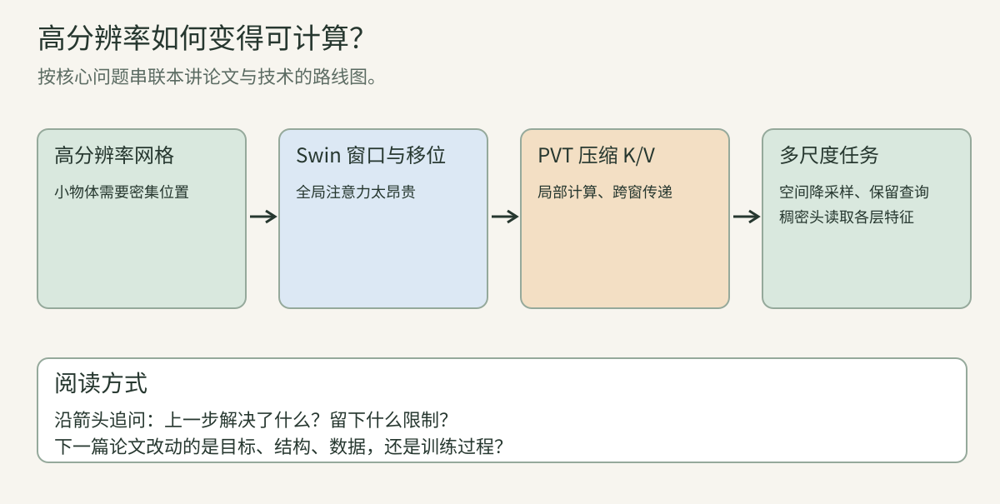
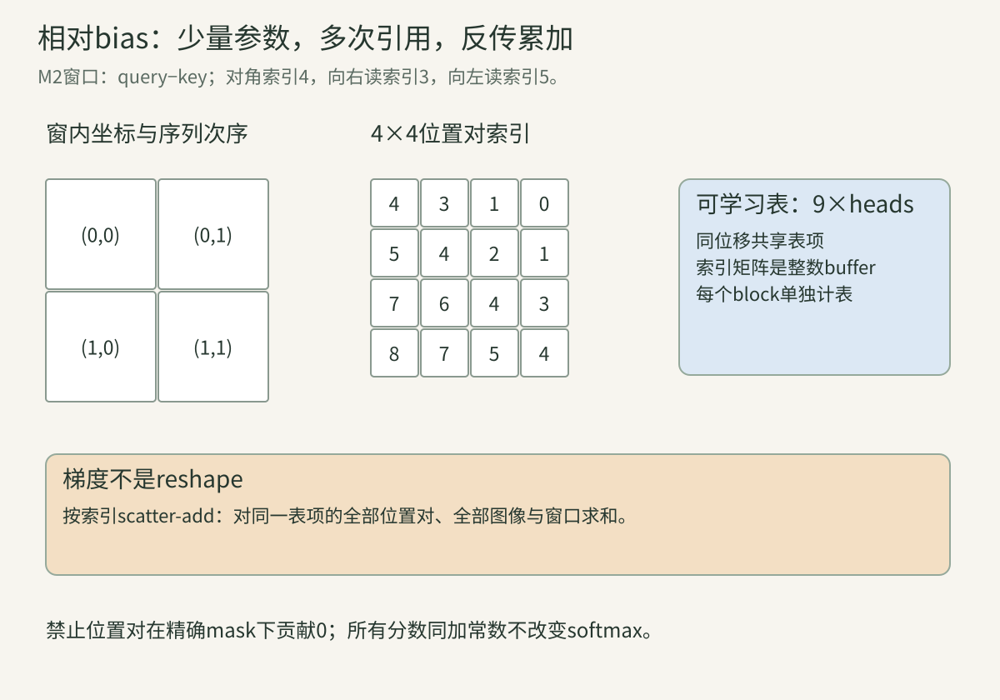
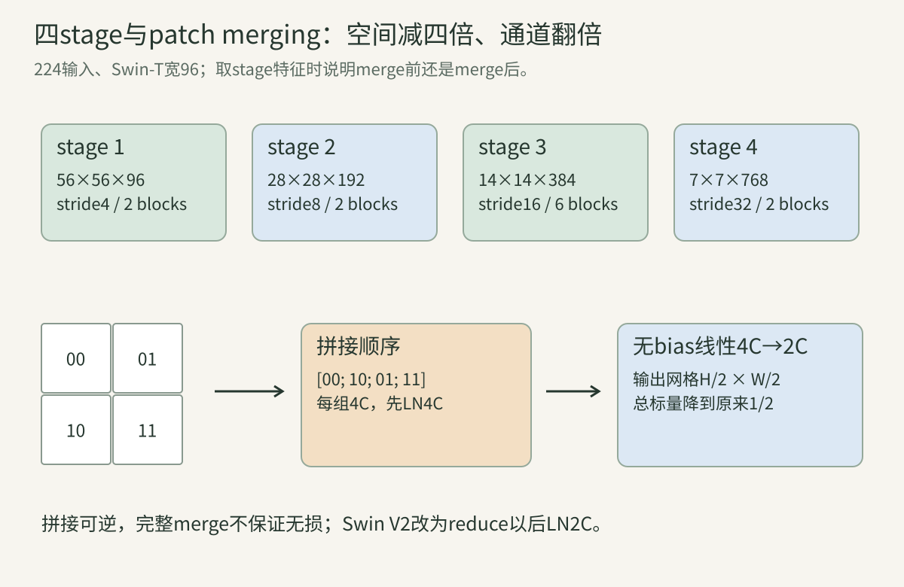
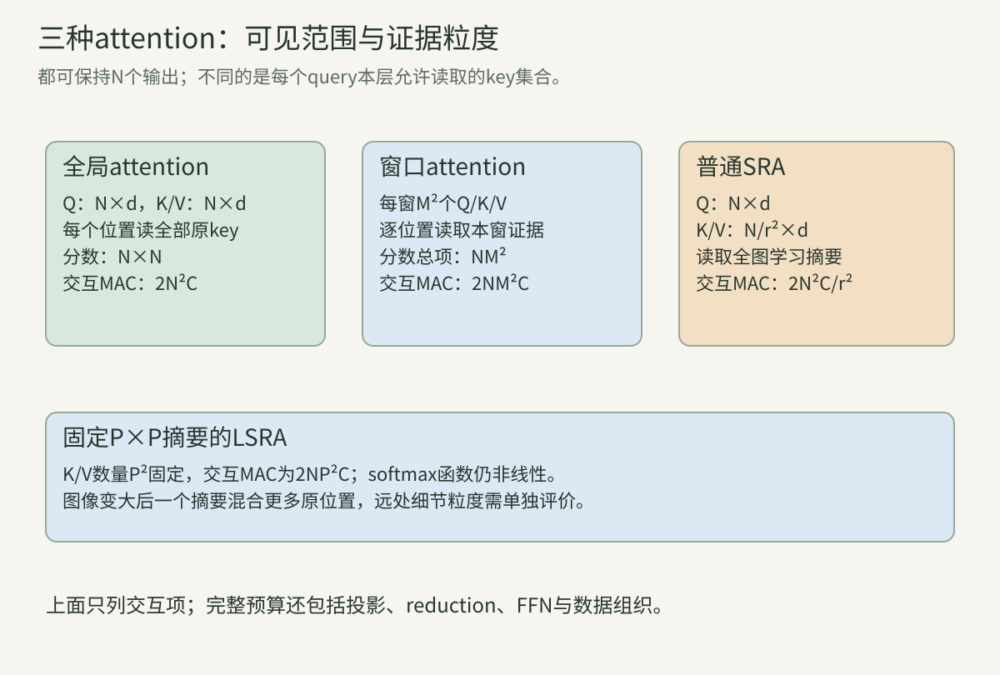
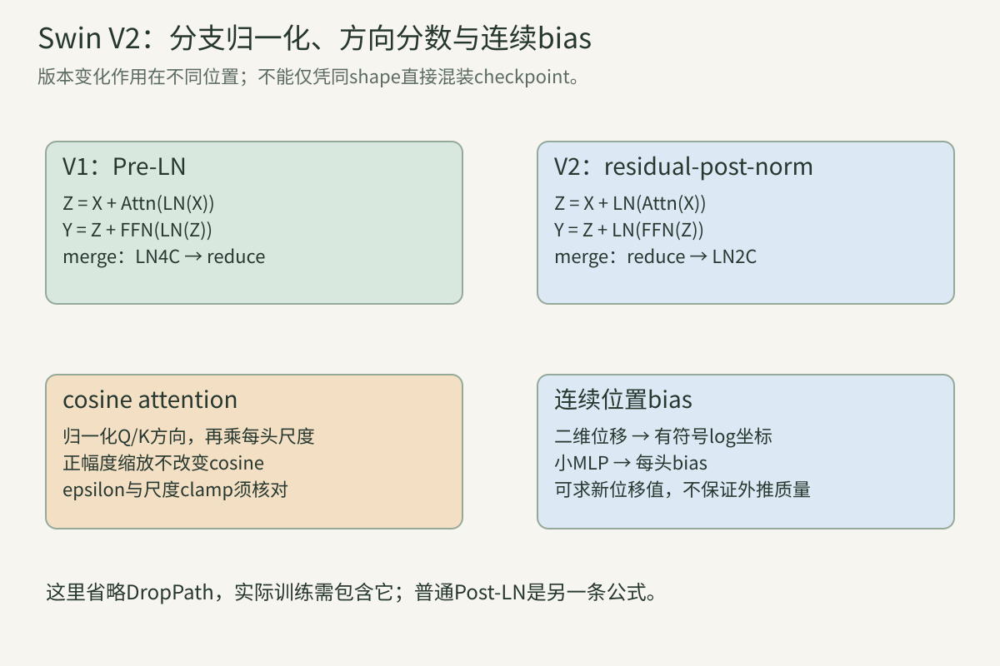

> 前三讲已经建立Attention、ViT和DeiT。本讲追问：图像变大后，怎样保留较密的空间网格，又避免让每个位置都直接比较所有位置？从4×4小图开始，把每一次移动、分组和梯度写清楚。所有小数字、程序输出和独立账本都是教学计算；论文实验另外标注。

<!-- teaching-narrative-rewrite -->

想象把一张街景从224像素放大到更清晰的分辨率：小路牌需要更密的空间位置，但让每个位置都看整张图会很贵。读这讲时始终追踪一个路牌token能看到哪些位置、信息怎样跨窗传播，以及它在哪一层被合并。Swin和PVT给的是两条不同的省计算路线。

## 一、问题从空间网格开始

**一个token到底对应图像的哪一处。** 输入像素为$B\times3\times H_0\times W_0$，$B$是图像数量。经过不重叠的4×4投影，若尺寸整除4，得到$H=H_0/4$、$W=W_0/4$个空间位置，每处有$C$个特征。它可写成$B\times H\times W\times C$，也可展平为$B\times N\times C$，其中$N=HW$。

展平采用行优先：二维$(y,x)$对应$i=yW+x$，逆向是$y=\lfloor i/W\rfloor$、$x=i\bmod W$。空间网格的高、宽必须另外保留；序列长24既可能来自4×6，也可能来自3×8。仅看$N$不能唯一恢复空间邻接关系。

浅层token最初读取一个patch，后续attention把其他位置的信息混进来。此时“位置$(y,x)$的token”指它的输出槽位和坐标，不意味着它只包含该patch的像素。**空间索引与信息依赖范围是两个问题**，本讲不断区分它们。

**分类与稠密预测对空间信息提出不同要求。** 分类输出一张图的$K$个分数，可在最后汇聚所有位置。分割需要空间标签，检测需要框或对象位置，因此通常希望骨干保留可供读取的空间特征。平均成一个$C$维向量以后，头不能直接取出所有位置原先各自的特征。

假设一个8像素宽的对象：在stride4网格上大约跨2格，在stride32上不足1格。这个尺度计算解释为什么浅层高分辨率可能有用，却不证明某个格一定能识别对象；采样相位、输入投影、背景混合和训练目标都会影响实际信息。

分类骨干能否用于稠密任务，要检查输出哪些stage、每个stage的stride、通道、归一化与坐标协议。[第10讲](../vision-10-structured-tasks/)定义的框、mask和光流输出仍适用。骨干更换不会自动完成任务头、训练loss或评价协议。

**将ViT的patch缩小，代价为什么涨得快。** 固定输入尺寸，patch边长从16降到4，每轴token数量增4倍，总数增16倍。全局attention每头的$N\times N$分数矩阵因此约增256倍，忽略特殊token。Q/K/V和FFN按token处理，若通道不变则约增16倍。

注意是**面积的平方**：$N=HW$，attention交互项为$N^2$。输入两轴都扩大2倍时，面积增4倍，交互增16倍；说“分辨率扩大2倍，attention扩大4倍”必须说明只扩大单轴，或把分辨率定义成面积，否则含糊。

小patch能够提供更密的初始位置，但不是无代价的“提高精细度”开关。可以减少每个query访问的key、压缩key/value、逐层减少位置，或组合这些策略。Swin和PVT提供两种不同的信息流组织方式。

**骨干金字塔与FPN分别是什么。** **骨干金字塔**是深度不同、空间尺度不同的一组表示，例如stride4/8/16/32。尺寸逐渐变小，通道通常变多。它描述骨干产出什么，并不要求这些stage之间存在自顶向下融合。

**FPN**则是一种额外的特征融合结构：把较深stage投影、上采样，与较浅stage的侧向投影相加，形成供任务头读取的多尺度特征。拥有四个stage的骨干不等于已经拥有FPN；FPN也可以接其他骨干。

图像金字塔又不同：它对输入图像建立多个尺寸版本，可能分别经过模型。三者分别是“多个输入尺寸”“一个骨干内部的不同尺度表示”“输出表示之间的融合”。在论文表格中把它们都写成multi-scale，会隐藏很大的计算与协议差异。

**跟着算：224图像的两种初始网格。** 224×224输入，P16生成14×14=196个patch；P4生成56×56=3136个patch。不加CLS时，全局单头分数项数分别是$196^2=38,416$和$3136^2=9,834,496$，比值256。

如果P4网格使用7×7窗口，窗口数$(56/7)^2=64$，每个窗口49个位置，单头总分数项$64\times49^2=153,664$。它仍多于P16的全局单头分数，但比P4的全局分数少64倍。比较必须锁定网格和通道，不能把不同输入粒度的两个数直接当作全模型加速比。

## 二、窗口注意力：先把索引写对

**用一个轴清单理解窗口张量。** 设窗口边长$M$，$H,W$都能整除$M$。窗口数$n_w=HW/M^2$，每窗位置数$T_w=M^2$。将所有图像的所有窗口合并进一个临时轴，attention输入为$(Bn_w)\times T_w\times C$。

临时轴并非真正的新图像batch：不同窗口仍属于同一原图，结束后要按原索引拼回。某些实现将其写为$B_*$。此时Q/K/V计算可以共用矩阵，但softmax只沿各窗自己的key轴归一化，**不会让不同窗口混在同一softmax里**。

多头数记作$h$，每头宽度$d=C/h$，要求整除。每头Q/K/V形状为$B_*\times h\times T_w\times d$，分数为$B_*\times h\times T_w\times T_w$。特别注意$h$是头数，$H$是网格高度。

**partition为什么不能直接reshape。** 将BHWC拆成六轴：

$$
(B,H/M,M,W/M,M,C).
$$

这里轴次序依次是图像、窗口行、窗内行、窗口列、窗内列、通道。为了让一个窗口的元素连续，需要交换窗内行和窗口列，变为$(B,H/M,W/M,M,M,C)$，再合并前三轴，得到$(Bn_w,M,M,C)$。

若只reshape为$(Bn_w,M^2,C)$，连续内存可能把一整条原图行切成片段，无法保证每组是二维方窗。这类错误shape完全合法，网络也能运行，却改变了空间归纳偏置。先用位置编号图，而非随机噪声，验证索引是最容易的办法。

**跟着算：4×4图的四个2×2窗口。** 原图位置值按行写为：

$$
X=\begin{bmatrix}
1&2&3&4\\5&6&7&8\\9&10&11&12\\13&14&15&16
\end{bmatrix}.
$$

正确窗口序列是$[1,2,5,6]$、$[3,4,7,8]$、$[9,10,13,14]$、$[11,12,15,16]$。直接把原行优先的一维序列每4项一组，会得到$[1,2,3,4]$等，形成横条而非2×2窗口。

每窗内$(a,b)$仍按$aM+b$排列。这里所有数只是空间身份证，不是实际learned feature。加上多通道和多图后，位置身份与图像身份都要保持。

**reverse与反向传播：重排本身不丢信息。** reverse将窗口轴拆回$(B,H/M,W/M,M,M,C)$，交换相应轴，再合并为BHWC。只要尺寸和排序一致，应满足$\operatorname{reverse}(\operatorname{partition}(X))=X$。

把全部元素展平成向量，partition可视作置换矩阵$\Pi$：$u=\Pi x$。它每行、每列恰有一个1，因此$\Pi^{-1}=\Pi^\top$。给定输出梯度$g_u$，输入梯度是$g_x=\Pi^\top g_u$，也就是把梯度沿相反索引放回。

partition不做平均，不做投影，没有可训练参数。重复选取或遗漏一个位置则已不是置换：反向可能需要梯度累加，或某些输入梯度永远为0。因此“还原后的shape正确”不足够，还应检查元素值和唯一覆盖。

**W-MSA怎样计算一个窗口。** 对每窗$X_w\in\mathbb R^{M^2\times C}$，计算三个投影，拆分多头，每头为：

$$
A=\operatorname{softmax}\left(\frac{QK^\top}{\sqrt d}+B_{\rm rel}\right),
\qquad U=AV.
$$

$B_{\rm rel}$是与相对位置有关的加性分数，本讲稍后逐项推导。softmax在每个query的$M^2$个key上归一化；最终拼接各头并经输出投影$W_O$恢复$C$维。

同一窗口内所有query拥有相同的候选key集合，但权重依内容不同。不同窗口使用同一组投影参数与相对bias规则，却没有本层直接交互。**参数共享不等于输入位置彼此可见**，这点也适用于卷积与FFN。

**从矩阵乘法推导窗口复杂度。** 单头$QK^\top$和$AV$各需$M^4d$个MAC。乘头数$h$后，每窗是$2M^4C$；乘$n_w=N/M^2$后，是$2NM^2C$。Q/K/V与输出投影是$4NC^2$，所以：

$$
\operatorname{MAC}_{\rm WMSA}=4NC^2+2NM^2C.
$$

全局attention则是$4NC^2+2N^2C$。若$M,C$固定，窗口项随$N$线性增加。但增大窗口、增加通道、改变深度时，不能继续把这些变量当常数。FFN隐藏宽$4C$还会加入$8NC^2$。

本讲MAC将一次乘加计为一个单位，不包含softmax、LN、bias加法、数据重排、激活和归约。GPU运行时间还受内存访问、kernel启动、并行粒度和融合影响，因此这些公式是运算账本，不是计时结果。

**窗口变大，代价增加在哪里。** 固定$N,C$，窗口边长$M$加倍，每窗位置增4倍、窗口数降为1/4。单窗分数项增16倍，所有窗的分数项最终增4倍；投影与FFN位置数不变。

当$C$很大时，$12NC^2$可能占block主要MAC，因此只看attention分数减少比例，会夸大全block的下降比例。又当小窗口产生很多小矩阵时，重排开销可能显著；大窗口可能更有利于某些矩阵kernel。需要实际测量。

窗口也影响交互范围：7×7的token窗口在stride4阶段跨约28×28输入像素，在stride16阶段跨约112×112像素。这里是索引跨度；前层混合以后，完整依赖可能更大。

**跟着算：第一stage的账本和单矩阵内存。** $N=3136,C=96,M=7$时，attention投影为$4\times3136\times96^2=115,605,504$ MAC；交互项为$2\times3136\times49\times96=29,503,488$，合计145,108,992。加$8NC^2$的FFN后，一个block为376,320,000。

3头、B1、FP16时，所有窗口的一份分数矩阵占$153,664\times3\times2=921,984$字节，即0.879272MiB；全局为56.273438MiB。它们比值64，但整个block的MAC和训练峰值显存都不按64倍缩小。训练还保存Q/K/V、FFN中间量、梯度与优化器状态。

**零QK的平均例子揭示窗口边界。** 令所有QK分数和相对bias都为0，则每个位置对同窗4个值均匀加权。算例B的窗口输出分别是3.5、5.5、11.5、13.5，每个值复制到对应四个位置：

$$
Y_{\rm W}=\begin{bmatrix}
3.5&3.5&5.5&5.5\\3.5&3.5&5.5&5.5\\
11.5&11.5&13.5&13.5\\11.5&11.5&13.5&13.5
\end{bmatrix}.
$$

重复很多相同分区的窗口attention，本层依赖仍被四个区域隔开。窗内FFN和逐位置LN无法单独打破这个分隔；残差保留自身值也不会创造新跨窗边。改变分区或进行merge，才可能改变依赖图。

## 三、移位窗口：跨窗连接与真实边界

固定窗口算得省，却把窗边的两个邻居隔开。接下来只改分组边界，看它们怎样在第二层交换信息；循环移位引入的伪邻居必须靠mask排除。

**shift移动的是分组边界。** 在相邻block间，把窗口边界沿两轴移动$s$，常取$s=\lfloor M/2\rfloor$。新窗覆盖上一层不同窗的一部分，让已有信息继续传播。它与对每个像素建立一个不同的滑动窗口不相同：同一个新窗内，query仍共享key集合。

4×4、M2、s1的真实移位分组可沿单轴写成$\{0\}$、$\{1,2\}$、$\{3\}$。两轴取笛卡尔积，得到角上1格、边上2格、中间4格的九组。这些小边界组不能为了凑齐窗口，把图像另一侧当邻居。

算法会用循环roll把这些组装入规则2×2窗口，并通过mask拆开虚假的边界连接。这是“规则计算容器”和“真实允许的空间组”两层概念；混淆两者，是移位窗口最常见的理解障碍。

**循环roll的确切方向。** 沿两轴roll$(-s)$，移动后的坐标$(y,x)$读取原图$((y+s)\bmod H,(x+s)\bmod W)$。负号不是删去边界：越出原图的索引通过取模绕到另一侧。处理后roll$(+s)$放回原坐标。

算例B在s1时变成：

$$
X'=\begin{bmatrix}
6&7&8&5\\10&11&12&9\\14&15&16&13\\2&3&4&1
\end{bmatrix}.
$$

左上窗口$[6,7,10,11]$是真实相邻的中间区域；右上$[8,5,12,9]$把左右边缘拼到一起。后者只是计算容器，不能无mask地互相读。roll是置换，反向用逆roll，既不额外学参数，也不天然阻止跨边界信息。

**九区域mask怎样从切片产生。** 对每一轴分三段：$[0,H-M)$、$[H-M,H-s)$、$[H-s,H)$；宽轴同理。九个矩形赋不同区域编号。**按循环移动后的计算坐标生成这张区域图，不再对它做一次与特征相同的roll**，然后用同一partition拆成规则窗口。

在每个窗口中，令区域标签为$\ell_i$，加性mask定义为：

$$
\mathcal M_{ij}=
\begin{cases}0,&\ell_i=\ell_j,\\-\infty,&\ell_i\ne\ell_j.\end{cases}
$$

不同编号只阻止循环拼接产生的假邻接；编号相同的中心新窗仍可跨越上一层旧窗边界。若误把每个旧窗身份都拿来mask，就把希望新增的跨窗连接再次删除。区域图里的编号大小没有语义，只用来比较相等。

**跟着算：区域图、窗口标签与允许矩阵。** 4×4/M2/s1的区域编号为：

$$
L=\begin{bmatrix}
0&0&1&2\\0&0&1&2\\3&3&4&5\\6&6&7&8
\end{bmatrix}.
$$

partition得到$[0,0,0,0]$、$[1,2,1,2]$、$[3,3,6,6]$、$[4,5,7,8]$。第二窗允许关系是：

$$
E=\begin{bmatrix}
1&0&1&0\\0&1&0&1\\1&0&1&0\\0&1&0&1
\end{bmatrix}.
$$

移动后的值是$[8,5,12,9]$，所以8只与12平均，5只与9平均。第三窗两行分别成组，第四窗只允许对角自身；第一窗全部可见。对角始终允许，避免有效query成为全空行。

**为什么不能把mask乘在softmax之后就结束？** 若先在4个key上softmax，再把两个不允许项乘0，总权重通常小于1。零分数的例子原权重每项1/4，留下两项后总和1/2，输出被无意缩小。正确masked softmax只在允许key上归一化，因此两项各1/2。

可以在softmax前用$-\infty$排除，或对允许项指数求和；也可以事后mask并重新归一化，但需安全处理分母和全空行。不能把“禁止项输出为0”当作充分条件，行归一化同样重要。

对padding query，可能根本不存在真实输出。此时应专门定义其处理，而非强行套有效query至少看自己的逻辑。[第11讲](../vision-11-attention-transformer/)讨论的全空行数值问题仍适用。

**把移位结果放回原图，逐格核对。** 继续零分数、uniform attention例子。左上移动窗输出8.5；右上两个子组输出10和7；左下两个子组输出14.5和2.5；右下只读自身。reverse后roll$(+1)$，得到：

$$
Y_{\rm SW}=
\begin{bmatrix}
1&2.5&2.5&4\\7&8.5&8.5&10\\
7&8.5&8.5&10\\13&14.5&14.5&16
\end{bmatrix}.
$$

注意这个结果直接对原图做SW计算，并未先执行W block。它只是隔离mask语义的例子；真实网络还有LN、投影、内容分数、FFN和残差。不要把uniform平均输出误认为Swin固定的滤波核。

**跟着算：独立方法证明循环计算与裁剪窗口一致。** 在**原图坐标**给位置分组：

$$
g(y,x)=\left(\left\lfloor\frac{y-s}{M}\right\rfloor,
\left\lfloor\frac{x-s}{M}\right\rfloor\right).
$$

只平均具有相同$g$的真实位置，不使用取模，不生成九区域mask。这个独立参考方法得到同一$Y_{\rm SW}$。实验一比较两种方法的全部16项，而非只比较中心一格。

这种对照比“把实现公式再写一遍”更有检查价值：一条路径采用循环容器与区域遮罩，另一条直接枚举裁剪的真实窗。如果符号或mask方向写错，两者会不同。

**代码中的−100与数学上的−∞。** 作者Swin实现使用有限的大负数−100作为区域mask。正常尺度下，被遮项的指数权重非常小，但不是数学意义的严格0。两个分数$(0,-100)$，第二项质量约$3.72\times10^{-44}$；浮点类型可能把它下溢成0。

若某个不允许key原分数高达200，加−100后仍有100，甚至成为最大项。这个反例说明有限mask的正确性依赖分数尺度和数值约定，不能由“负100很大”推导无条件禁止。实验用精确排除来检查依赖图，另行展示有限mask反例。

工程上选择$-\infty$、类型最小值或固定常数，要考虑所用kernel、所有mask行、混合精度和export行为。记录实际实现即可，不应无声替换以后仍声称与原始路径完全一致。

**padding有两种问题：凑窗与保护有效位置。** $H,W$不是$M$倍数时，可以右边/下边补到$H'=\lceil H/M\rceil M$、$W'=\lceil W/M\rceil M$。这让partition合法，代价应按$H'W'$计算，而非仅按原有效位置数。

补零不等于无影响。三个有效值1/2/3加一个0，在uniform attention下均值1.5；排除padding key则是2。即使补值起初为0，带bias的线性层、位置项、LN和后续层也可能让它不再为0。最后crop输出，不能撤销此前padding向有效query的影响。

因此要区分shift边界mask和padding有效性mask。原固定尺寸路径与后续动态尺寸实现未必使用同一padding协议；可以有意让模型处理补齐特征，也可以严格屏蔽它们，但需要训练/推理一致并说明选择。不能把一个版本的规则自动归给所有Swin实现。

**两层W/SW的感受野是否已经全局。** 用图表示依赖：位置是节点，允许读key是一条边；下一层的节点依赖于它本层能读到的节点及这些节点先前的依赖集合。两层传播等价于集合并集，而不是把窗口尺寸简单相加。

4×4/M2例子中，W后SW的中心位置可依赖所有16个原位置；角位置仍只依赖其原W窗口的4个值。对于更大的网格，两层一般无法覆盖所有位置。“跨窗”与“所有位置两层都全局”是不同命题。

真实数值贡献还可能被attention权重、投影、残差和抵消削弱。允许的图路径给出潜在依赖范围，不能单靠图判断模型实际使用了哪些远处证据。更深传播与patch merging会继续扩大范围。

**跟着算：两层平均和依赖支持。** 先得到$Y_{\rm W}$，再对它计算SW，结果为：

$$
\begin{bmatrix}
3.5&4.5&4.5&5.5\\7.5&8.5&8.5&9.5\\
7.5&8.5&8.5&9.5\\11.5&12.5&12.5&13.5
\end{bmatrix}.
$$

实验一依次把16个输入设为单位基向量，读每个输出是否受影响。每格依赖数量为：

$$
\begin{bmatrix}4&8&8&4\\8&16&16&8\\8&16&16&8\\4&8&8&4\end{bmatrix}.
$$

这个uniform线性教学模型中，贡献均非负，所以可通过基输入确认支持；一般神经网络需要考虑局部Jacobian与数值阈值，不能把某个输入下的零梯度当作结构上永远不可达。

## 四、相对位置与attention反传

**相对bias表示哪个方向。** 窗口内query坐标为$(y_i,x_i)$，key为$(y_j,x_j)$，定义$\Delta y=y_i-y_j$、$\Delta x=x_i-x_j$。取值各在$[-(M-1),M-1]$。每头维护$(2M-1)\times(2M-1)$的可学习bias表。

把差值平移到非负索引，行优先映射：

$$
\rho(i,j)=(\Delta y+M-1)(2M-1)+(\Delta x+M-1).
$$

然后$B^{(a)}_{ij}=\beta^{(a)}_{\rho(i,j)}$。表项加入QK分数，影响softmax的偏好；它不是对V加一个向量，也不是给每个token输入加绝对位置。改变query−key的方向会翻转bias表对应关系，加载权重时不能忽略。

**表、索引矩阵与广播各占多少。** M7时，每头bias表有$13^2=169$个参数；3头为507个。查表展开后的bias矩阵却有$3\times49\times49=7203$项。前者是独立可训练数，后者是重复引用的计算结果，不能把后者当参数量。

索引矩阵$\rho$只有$M^2\times M^2$个整数，通常登记为buffer，不求梯度。训练时bias广播给所有图像和窗口，同一相对位移表项可以出现多次。不同block通常有自己的bias表，不能因为结构相同就把全网只计一份。

无shift和有shift的窗口都能使用相同的窗口内位置索引规则；shift的真实边界通过mask处理。bias不会替代mask：一个学得较低的bias仍可能留下不应存在的跨图像边缘路径。

**跟着算：2×2窗口的完整相对索引。** 位置次序$(0,0),(0,1),(1,0),(1,1)$，M2，因此表长9。按query−key计算：

$$
\rho=\begin{bmatrix}
4&3&1&0\\5&4&2&1\\7&6&4&3\\8&7&5&4
\end{bmatrix}.
$$

对角均为4，表示零位移。左上query看右上key时差$(0,-1)$，索引3；反向差$(0,1)$，索引5。它们一般不是同一参数，因此可表达方向不对称。相同位移的多个位置对，如左上看右上、左下看右下，都引用3。

**相对bias的梯度为什么需要scatter-add。** 设分数梯度为$G_{ij}^{(w,a)}$，$w$遍历图像与窗口，$a$为head。因为多个分数引用同一表项，链式法则给出：

$$
\frac{\partial L}{\partial\beta^{(a)}_r}
=\sum_w\sum_{i,j:\rho(i,j)=r}G_{ij}^{(w,a)}.
$$

这个操作是按整数索引累加，不是直接把整个$M^2\times M^2$矩阵reshape成表。某些偏移出现多次；表项未被用到则梯度为0。若存在真实mask，对应禁止分数在精确masked softmax下梯度为0。

所有分数加同一常数不改变softmax，因此每个有效query的分数梯度和为0。整个bias梯度表的和也应为0，前提是本例只通过attention使用这张表、没有额外正则项。实验二同时验证这个不变性与两个窗口的共享累加。

**跟着算：一行softmax及其bias梯度。** 用两个可见key，$V=(2,6)$，分数均为0，因此$A=(1/2,1/2)$，输出$u=4$。只监督这个query，$L=u^2/2=8$，$g_u=4$，对权重梯度为$(8,24)$。

softmax Jacobian产生：

$$
g_s=A\odot\left(g_A-\sum_jA_jg_{A,j}\right)
=\tfrac12(8-16,24-16)=(-4,4).
$$

被引用的两个bias得到−4和4；下降更新会提高第二key的相对分数吗？实际上对第二bias减去正梯度，分数下降，因该key值更大、会提高当前平方loss；第一bias上升。这里目标是0，不是“总应该更关注大值”。对两个V的梯度都是2。

**从输出一直回到窗口输入。** 对一头$U=AV$，上游$G_U$给出：

$$
G_V=A^\top G_U,\qquad G_A=G_UV^\top.
$$

逐行softmax得到$G_S$后：

$$
G_Q=G_SK/\sqrt d,\qquad G_K=G_S^\top Q/\sqrt d.
$$

若$Q=XW_Q,K=XW_K,V=XW_V$，输入贡献为：

$$
G_X=G_QW_Q^\top+G_KW_K^\top+G_VW_V^\top.
$$

三条路径必须相加，不能只保留V路径。各投影矩阵梯度为$X^\top G_Q$等；输出投影要先处理：$G_{W_O}=U^\top G_Y$、$G_U=G_YW_O^\top$。多头各自反传，再按拆分的逆次序拼回；相对bias另行scatter-add。

**将W/SW放进Swin V1的完整block。** V1采用Pre-LN，符号可写成：

$$
Z=X+\operatorname{DropPath}(\operatorname{WMSA}(\operatorname{LN}_1(X))),
$$

$$
Y=Z+\operatorname{DropPath}(\operatorname{FFN}(\operatorname{LN}_2(Z))).
$$

相邻block将WMSA换成SWMSA。FFN通常是$C\to4C\to C$与GELU，逐位置作用；它不自己产生新的空间边。LN沿每个位置的通道轴，而不是跨一个窗口49个位置一起标准化。

stage内部保持$H,W,C$不变，stage之间merge才改变尺寸。DropPath、attention dropout、FFN dropout和position选项分别核对，不能看到某一配置有0值就认定所有模型没有该机制。残差和Pre-LN的链式反传见第11讲，本讲实验二隔离attention以便逐参数检查。

## 五、Patch merging与完整分层账本

**merging的四格拼接顺序。** 从BHWC网格读取四组：$X_{00}$为偶行偶列、$X_{10}$为奇行偶列、$X_{01}$为偶行奇列、$X_{11}$为奇行奇列。V1作者代码按：

$$
X_{\rm cat}=[X_{00};X_{10};X_{01};X_{11}]
\in\mathbb R^{B\times(H/2)\times(W/2)\times4C}
$$

拼接，然后在4C通道上LN，再用无bias线性矩阵$W_m\in\mathbb R^{4C\times2C}$投影。这里拼接沿通道，不是空间上先平均四格。

注意顺序是00、10、01、11，与一般二维patch行优先00、01、10、11不同。两者都能表达有效架构，但对应权重行的解释不同；若换顺序并且不换权重，就改变模型函数。四格拼接本身可逆，降维投影通常不可逆。

**4C上的LN到底算哪些数。** 对一个合并位置的向量$x\in\mathbb R^{4C}$，计算$\mu=\sum_jx_j/(4C)$，$\sigma=\sqrt{\sum_j(x_j-\mu)^2/(4C)+\epsilon}$，输出$z_j=\gamma_j(x_j-\mu)/\sigma+\beta_j$。

四个原位置的通道一起参与这个位置的LN统计。因此它不同于先分别LN每个原位置、再拼接；后者有四套各自的均值方差。V1是先拼接再LN再reduce，V2的merge则先reduce再对2C做LN，次序稍后对比。

LN存在$\epsilon$和affine参数，不应把它当“简单除以标准差”。$\gamma,\beta$各有4C个参数，所以merge参数为$8C^2+8C$。若实现设置不同bias/affine，账本必须跟着变化。

**跟着算：C1时的merge手算。** 2×2原值$\begin{bmatrix}1&2\\3&4\end{bmatrix}$，拼接向量为$(1,3,2,4)$。设$\epsilon=0,\gamma=1,\beta=0$，均值2.5、方差1.25，因此：

$$
z=(-1.5,0.5,-0.5,1.5)/\sqrt{1.25}.
$$

选$W_m=\begin{bmatrix}1&0\\0&1\\0&0\\0&0\end{bmatrix}$，输出前两项，约$( -1.341641,\ 0.447214)$。这是方便演算的特定权重，真实merge会学习全部行；它仍体现“先跨四格标准化、再降维”的步骤。

**token减四倍、通道翻倍，信息是否无损。** merge前标量数$HWC$；merge后$(H/2)(W/2)(2C)=HWC/2$，总标量减半。$4C\to2C$矩阵rank至多2C，至少存在2C维线性零空间，所以无法对任意4C输入建立一一映射。

这不意味着任务信息必定丢失：学习可能保留对目标有用的摘要。但被压缩的细纹理、相位和局部差异，不能仅由后续上采样保证找回。稠密头使用浅层skip或多尺度特征，部分原因就在这里。

LN还引入另一类不变性，例如相同常数平移会被去均值消除。严格讨论可逆性时应看完整函数，而非只看线性投影。我们不把某个特定输入的压缩效果等同于所有自然图像的损失大小。

**跟着算：包含LN的明确碰撞。** 取两个拼接向量$a=(1,3,2,4)$、$b=(1,3,4,2)$。它们数值不同，但均值和方差相同，前两项也相同。使用算例I的selector投影，LN后前两项一致，所以merge输出完全相同。

对应原2×2网格分别为$\begin{bmatrix}1&2\\3&4\end{bmatrix}$与$\begin{bmatrix}1&4\\3&2\end{bmatrix}$。这是可检查的多对一例子，不依赖“维度变少一定直观丢信息”的口头判断。它不证明真实训练权重恰好忽略这两格；它证明架构的所有输入无损保证不存在。

**merging的梯度怎样放回四个位置。** 设输出梯度$G_Y$，线性步给出$G_{W_m}=Z^\top G_Y$和$G_Z=G_YW_m^\top$。对LN，令$\widehat x=(x-\mu)/\sigma$、$v=G_Z\odot\gamma$，逐位置：

$$
G_x=\frac{v-\operatorname{mean}(v)-\widehat x\operatorname{mean}(v\odot\widehat x)}{\sigma}.
$$

这个表达使用前向含$\epsilon$的$\sigma$，与LN的实际导数一致。affine梯度是对合并位置求和的$G_\gamma=\sum G_Z\odot\widehat x$、$G_\beta=\sum G_Z$。

将$G_x$的四段C通道按照00/10/01/11散回原网格，就是拼接的逆索引。各段都可能得到梯度，即使输出只有2C宽；降维不意味着只训练其中两格。实验三检查输入、merge矩阵和LN affine全部56个教学标量。

**四个stage的shape链路。** 224图像、初宽96：4×4 patch stem得到56×56×96；stage1结束merge为28×28×192；stage2结束merge为14×14×384；stage3结束merge为7×7×768。对应原图stride4/8/16/32。

每stage内部的多个block保持这个shape。常见分类接口在最终序列上LN，再对49个位置平均，接$768\to K$头；原Swin默认路径不需要CLS。稠密接口则读取各stage空间网格，不能只拿分类平均向量。

如果在stage末命名输出，须说明是merge前还是merge后。以stage1为例，56×56×96和28×28×192都可能在函数附近出现；拿错会使FPN通道声明、stride和位置映射全部不一致。

**Tiny/Small/Base不能只按名字比较。** 以下是本讲核对的Swin V1、R224、M7、MLP ratio4、QKV bias开启、patch LN开启、无绝对位置表的配置：

| 配置 | 初宽 | 四stage block数 | 四stage head数 |
| --- | ---: | --- | --- |
| T | 96 | 2/2/6/2 | 3/6/12/24 |
| S | 96 | 2/2/18/2 | 3/6/12/24 |
| B | 128 | 2/2/18/2 | 4/8/16/32 |

每头宽度均为32。这是具体配置，不是“Tiny永远意味着96宽”的通用定义；其他窗口、图像尺寸、V2、任务仓库和预训练权重可有不同变体。

加深stage3会重复增加14×14阶段的block，扩大该stage传播和计算预算。加宽则使多数矩阵参数和MAC近似按宽度平方增长，activation通道数线性增长。它们对应不同的扩展路径。

**精确参数：逐组件计数。** 标准block：QKV权重$3C^2$、bias$3C$；输出投影$C^2+C$；FFN权重$8C^2$、bias$5C$；两次LN共$4C$；相对表$(2M-1)^2h$。所以：

$$
P_{\rm block}=12C^2+13C+(2M-1)^2h.
$$

RGB/P4 stem为$48C+C+2C=51C$；merge为$8C^2+8C$。最终LN$2C_{\rm final}$；K类头$(C_{\rm final}+1)K$。不计index/mask buffer，不计任务FPN和检测/分割头。

卷积和线性等价时，参数数量照实际权重数算，不因代码用Conv2d还是Linear改变。若开启绝对位置表，初stage要额外加$NC$；这也带来尺寸迁移问题。

**跟着算：Swin-T的完整参数账本。** | 组件 | 参数数 |
| --- | ---: |
| stem，C96 | 4,896 |
| stage1两block | 224,694 |
| merge1 | 74,496 |
| stage2两block | 891,756 |
| merge2 | 296,448 |
| stage3六block | 10,658,952 |
| merge3 | 1,182,720 |
| stage4两block | 14,183,856 |
| 最终LN | 1,536 |
| 1000类头 | 769,000 |
| 合计 | 28,288,354 |

stage4位置少却通道宽，因此参数很多；参数不随空间位置数重复创建。相同计数条件下，S为49,606,258，B为87,768,224。实验四由组件公式独立计算并assert这些精确值。

**精确MAC与“每stage近似平衡”。** block是$12NC^2+2NM^2C$；merge是$(N/4)(4C)(2C)=2NC^2$。stage之间$N\to N/4,C\to2C$，因此$NC^2$保持不变，而$NC$降为一半。前者解释各stage同数block的投影/FFN预算相近。

stem为$N\cdot48C$，分类头为$C_{\rm final}K$。我们的独立账本不计LN、pool和非矩阵运算，因此与库函数名为FLOPs的数字出现小差异时，先对齐约定，不应立即判谁算错。

本章没有GPU计时。两种MAC相近的结构，可因窗口划分、kernel融合、显存读写、设备和batch不同而速度不同。报告吞吐还要说明是否含输入预处理、同步和任务头。

**跟着算：Swin-T的MAC分解。** | 组件 | 矩阵MAC |
| --- | ---: |
| stem | 14,450,688 |
| stage1两block | 752,640,000 |
| merge1 | 57,802,752 |
| stage2两block | 723,136,512 |
| merge2 | 57,802,752 |
| stage3六block | 2,125,154,304 |
| merge3 | 57,802,752 |
| stage4两block | 701,008,896 |
| 1000类头 | 768,000 |
| 合计 | 4,490,566,656 |

相同条件S约8.741G、B约15.431G。T/S改变stage3深度，新增12个block，MAC增$12\times354,192,384=4,250,308,608$。这条差值核对可以帮助发现depth或stage尺寸被错配。

**层级结构怎样改变activation账本。** 四stage的$NC$依次为301,056、150,528、75,264、37,632个标量；单张FP16主状态约0.5742、0.2871、0.1436、0.0718MiB。这里只是一份状态，不含多个副本。

attention分数每stage一份共有$BhNM^2$项；head数随通道增长时，总量还要乘对应$h$。FFN隐藏为$B\times N\times4C$，常明显大于主状态。训练同时保存很多block的激活，深stage3重复18次并不“因为图小所以免费”。

activation checkpointing用重新前向换保存量，影响实际运算和随机状态管理；它不减少可训练参数。memory-efficient attention可以避免显式保存某些矩阵，但不自动改变窗口允许关系。分清算法依赖、内存实现与账本中的理想中间张量。

**动态输入要逐处检查，不只是删去assert。** 一个224固定尺寸实现可能在初始化时构建各stage resolution、相对index、shift mask，并在前向检查输入尺寸。直接删去assert以后，旧mask和旧reshape仍可能不适配新图。

可变尺寸方案须运行时获取H/W，检查stem边界取整，补齐窗口，重建或缓存对应mask，处理奇数merge，最后输出有效区域和正确stride。cache key至少考虑尺寸、窗口、shift、设备/类型相关状态；仅按token总数缓存可能把不同长宽比混为一谈。

当某stage尺寸小于窗口，原固定实现会调整窗口并关闭shift；另一些实现保留窗口而补边。两者产生不同的bias索引与参数兼容政策，不可称为默认数学等价。第15讲将扩展动态网格与位置协议，本节先确定本章模型边界。

**相对位置是否带来严格平移等变。** 相对bias只依赖位移，减少对绝对位置表的依赖，但规则窗口仍绑定网格分区。移动输入一个token，原本同窗的两点可能落入不同窗，允许attention图改变；移位交替能增加连接，却不自动消除这种分区相位。

patch stem的stride、merge的2×2相位、padding和图像边界也会影响平移响应。若移动幅度与采样/窗口周期一致并处于无限或合适边界条件，某些局部操作可以有对应对称性；不能把这个条件结论推广到任意像素平移的整网。

实践中可通过平移、crop和尺度增强学习鲁棒性。鲁棒性是输出在扰动下表现稳定，严格等变则是函数满足具体变换等式，二者的检验不同。蒸馏CNN也不会改变这些结构事实，呼应第13讲。

## 六、PVT与Spatial-Reduction Attention

Swin限制一个query本层能读到的空间范围。PVT采取另一种取舍：query仍在全图，但key/value先被压缩；因此计算下降，远处信息也可能被汇总得更粗。

**SRA把query与key/value变成不同长度。** 普通self-attention的Q/K/V都来自$N\times C$。SRA保留$N$个query，同时把空间表示降为$N_s$个摘要，K/V来自摘要。若每轴缩$r$倍且整除，$N_s=N/r^2$。

一头形状为$Q:N\times d$、$K,V:N_s\times d$，所以$A:N\times N_s$，输出仍是$N\times d$。**保留query长度，保证本层输出还覆盖原网格**；压缩的是供读取的证据集合，不是把本层所有输出都降采样。

每个query可以访问遍布整图的摘要，因此与窗口局部可见性不同。SRA源于同一输入的两条处理支路，虽有不同序列长度，仍是这里定义的self-attention变体；是否跨模态要看Q和K/V源数据，不能仅由矩形分数判断。

**Spatial reduction既有空间分组，也有通道投影。** 把每个$r\times r$组的C通道拼成$r^2C$维向量，用$W_S\in\mathbb R^{r^2C\times C}$投影，再LN：

$$
\widetilde X=\operatorname{LN}(\operatorname{Group}_r(X)W_S+b_S).
$$

然后$Q=XW_Q$，$K=\widetilde XW_K$，$V=\widetilde XW_V$。K与V共享同一空间摘要输入，但后续投影不同。通常不用两套独立的SR卷积分别生成K和V。

这可由kernel$r$、stride$r$、输入输出都C的普通卷积实现，权重仍含$r^2C^2$个数。它**不是默认average pooling，也不是depthwise卷积**。官方实现的卷积展平遵循通道/空间轴顺序；手写group+linear等价时必须显式匹配权重排列。

**跟着算：4×4到四个摘要，再输出16个位置。** 用算例B的单通道值，特意设每组平均作为教学SR，不加LN、令QK分数为0。四个摘要是$(3.5,5.5,11.5,13.5)$。每个query对四摘要均匀读，输出都为8.5。

分数矩阵是16×4，而不是4×4；输出仍为4×4的16个位置。对比W-MSA只读本窗，SRA所有位置都能读取整图四组摘要。但本例把每组具体纹理压成均值，query不能通过一个摘要单独选取组内某个原像素。

这是解释维度和信息压缩的特制平均模型；实际PVT SR有学习投影、LN、内容相关QK、多头和残差，通常不会把整层输出都变成常数。实验三采用C2学习投影与LN检查完整两支路。

**低分辨率K/V是否意味着丢掉原输出细节。** attention分支读取的远处证据变粗，但高分辨率query仍来自当前位置。加上残差$X+\operatorname{SRA}(\operatorname{LN}(X))$，本地高分辨率状态仍有直接保留路径，后续FFN也沿各位置处理。

因此“KV压缩”不等于“输出只能有摘要分辨率”。不过，某个query对远处某组的访问只经过共享摘要，无法在本次attention中为组内每个原位置分配独立softmax权重。这是交互表达的约束，即使残差保留本地细节也仍存在。

要判断任务影响，设计远处细节决定答案的例子：两幅图局部query相同，但远处组的细节重新排列后摘要相同。若所有可见摘要和query都相同，这一attention分支无法区分它们；多层更新或其他支路可能提供新信息。

**SRA的输入梯度为何至少有两部分。** 输出反传得到$G_Q,G_K,G_V$。query支路给$G_X^{(Q)}=G_QW_Q^\top$；摘要支路先合并：

$$
G_{\widetilde X}=G_KW_K^\top+G_VW_V^\top.
$$

经LN反传，再乘$W_S^\top$，按$r\times r$分组逆索引scatter回原网格，得到$G_X^{(\rm SR)}$。因此$G_X=G_X^{(Q)}+G_X^{(\rm SR)}$，还需加残差与外层Pre-LN贡献。

SR矩阵的梯度是分组输入转置乘投影输出梯度；SR LN affine另计。原位置即使不是某个query特别偏好的摘要，仍可能因组内共享投影受到梯度。只在降采样后的几个位置写梯度、其余清零，会遗漏分组投影的输入依赖。

**固定比例SRA的完整MAC，不只数QK。** Q与输出投影为$2NC^2$；压缩后的K/V投影为$2N_sC^2$；SR卷积在整除、kernel=stride=r时为$N_s(r^2C)C=NC^2$；交互为$2NN_sC$。r>1时：

$$
\operatorname{MAC}_{\rm SRA}=3NC^2+2N_sC^2+2NN_sC.
$$

r1通常不运行额外SR卷积/LN，恢复普通$4NC^2+2N^2C$。FFN应在$N$个位置上另外加入$2eNC^2$，$e$是隐藏扩展比例，不能按$N_s$计算。

固定r时，交互仍为$2N^2C/r^2$，是二次项，只是系数降低。若改变r让$N_s$固定，才改变随输入面积的增长规律。论文“节省$r^2$倍”应限定到分数/交互项，整个attention还包含投影与reduction。

**跟着算：同一stage比较交互和整体attention。** PVT首stage设$N=56^2=3136,C=64,r=8,N_s=49$。QK/AV交互从全局$2N^2C=1,258,815,488$下降到$2NN_sC=19,668,992$，是64倍下降。

但SRA的Q/输出投影25,690,112，K/V投影401,408，SR卷积12,845,056，合计58,605,568。FFN若扩展8倍，还要$16NC^2=205,520,896$；加上它，一个block的矩阵预算264,126,464，远大于只报19,668,992。

若把两轴尺寸加倍而r保持8，$N$和$N_s$都增4倍，交互增16倍；投影/SR/FFN增4倍。这个反事实尺寸核算直接显示固定r不提供面积线性的全部复杂度。

**PVT的四stage为何经常都得到49个KV。** 以224输入、四stage宽64/128/320/512、SR比例8/4/2/1为例，空间网格56/28/14/7，每轴除SR比例以后都为7，因此前三stage的KV各为49个摘要。最后r1采用全局读，空间部分也有49个位置。

这只是这个尺寸的巧合：输入448时，同一比例对应14×14=196个KV，而非49。不要把配置中的sr_ratio误读成“固定49个KV”的语义。

初patch步长4，后续stage patch embedding通常以2×2输入特征投影到下stage宽度。其$4C_{\rm in}\to C_{\rm out}$不要求严格翻倍，例如128→320。PVT-Tiny配置每stage两block，MLP扩展8/8/4/4；其他型号和仓库revision应逐个核对，不凭同名自动套depth。

**PVT V1的CLS和绝对位置在哪些stage。** V1作者分类路径在各stage加学习位置表，位置表根据实际空间网格插值。前三stage是纯空间序列；最后stage加入CLS，最终取CLS分类。因此224时末序列长度50，不是49。

最后stage的SR比例1避免把CLS当空间像素进行$r\times r$卷积分组。若改成r>1而仍把CLS留在输入中，reshape空间网格会遇到额外行，必须另外设计处理，不能直接沿用前stage路径。

位置迁移也要把最后的CLS位置与patch位置分开。224配置四表分别有$3136\times64$、$784\times128$、$196\times320$、$50\times512$个数，共389,376；CLS输入参数再加512。这些是本章针对该路径的独立计数，PVT V2和稠密backbone接口另看。

## 七、PVT V2：连续局部结构与固定摘要数

**overlapping patch embedding具体重叠什么。** PVT V2作者路径采用首层7×7/stride4/padding3，后续stage3×3/stride2/padding1。相邻输出的输入感受区域重叠，因此边界附近的输入可以参与多个token。

卷积输出单轴尺寸：

$$
H_{\rm out}=\left\lfloor\frac{H_{\rm in}+2p-k}{s}\right\rfloor+1.
$$

7/4/3时为$\lceil H_{\rm in}/4\rceil$。224→56，225→57，230→58，不可继续用整数除4的向下取整替代运行时输出shape。后续奇数尺寸同样按实际卷积结果传播。

重叠不意味着多个输出特征值相同，只表示它们共享部分输入依赖。对于相同输出宽C、RGB输入，首层权重为$49\cdot3C=147C$，比P4的不重叠$48C$多99C；更大核带来额外成本。

**跟着算：一维重叠投影看见哪些元素。** 输入值$(1,2,3,4,5,6)$，kernel3、stride2、padding1、核权重全1。输出三项是$0+1+2=3$、$2+3+4=9$、$4+5+6=15$。

第一与第二输出共享输入值2，第二与第三共享4。若换不重叠kernel2/stride2，无padding，输出是3、7、11，依赖集合也不同。这里输出长度都为3，说明**同shape不等价于同空间接口**。

二维7×7、stride4时，水平相邻输出共享3列输入，竖直相邻共享3行，边界部分可能是padding。原图中心坐标与patch支持范围要按kernel/padding/stride计算，不能只乘stride。

**FFN加入DW卷积，空间交互发生在哪里。** 普通FFN逐token：$C\to eC$、GELU、$eC\to C$。卷积FFN将第一投影输出恢复为$H\times W\times eC$，施加3×3、stride1、padding1的depthwise卷积，再激活与第二投影：

$$
Y=\bigl[\operatorname{GELU}(\operatorname{DWConv}_{3\times3}(XW_1+b_1))\bigr]W_2+b_2.
$$

DW只在每个隐藏通道内混合附近空间；前后全连接混合通道。由此FFN也产生局部空间依赖，已经不同于第24节的逐位置MLP。它与attention的大范围摘要读取互补，但是否提高特定任务仍需要证据。

DW增加$9eC$权重，带bias时共$10eC$参数，MAC为$9NeC$。这种结构使局部与边界信息进入表示，V2路径也去掉固定学习绝对位置表，分类使用末网格平均；不能据此说它“没有任何位置信息”。

**跟着算：DW的低参数不意味着没有空间作用。** $N=196,C=320,e=4$，隐藏宽1280。3×3 DW有11,520个核权重、1,280个bias，共12,800参数；矩阵/卷积MAC为$196\times9\times1280=2,257,920$。

两线性层MAC为$2\times196\times320\times1280=160,563,200$，DW相对很小。若将中心核设1、上邻核设1，其余0，每个隐藏输出已经依赖自身与上方位置；偏置来自空间支持方式，而非参数特别多才会出现。

在边界上，上邻可能是0 padding，行为与内部位置不同。这能提供边界线索，但不是任意绝对坐标的显式标签，也不保证严格平移等变。

**Linear SRA的“linear”指复杂度。** 固定大小池化版本将整图降成$P\times P$个摘要，典型$P=7$，所以$N_s=P^2=49$独立于输入面积。作者线性路径再用1×1投影、LN和GELU，然后生成K/V；Q仍来自全部原位置。

交互MAC为$2NP^2C$，若P/C固定则随N线性。它仍使用softmax，因此不是把attention函数变成线性函数，也不是用kernel近似替换softmax的另一类“linear attention”。

作者仓库并非所有PVT V2型号都启用这一选项，带Li的配置需核对。linear路径的FFN还可在第一线性层后增加ReLU再做DW/GELU，因此开关不一定只改变pool。复现时应比较真实模块，而非只记录模型名称。

**跟着算：自适应池化的边界与线性账本。** 将长度5池成3格，常见自适应平均池采用第$i$格区间$[\lfloor iH/P\rfloor,\lceil(i+1)H/P\rceil)$：得到$[0,2)$、$[1,4)$、$[3,5)$。相邻格可能共享输入，不是三块等大小无重叠划分。

输入$(1,0,0,0,0)$，摘要为$(1/2,0,0)$；摘要平均是1/6，原均值1/5。不能把“先adaptive pool再uniform attention”无条件认作原网格平均。

对P7的二维路径，仅计Q/输出、KV、1×1 SR和交互，MAC为$2NC^2+3\cdot49C^2+98NC$，另计pool、LN、激活和FFN。N小于49时仍可能输出49摘要，但其中存在重复/重叠读取，不凭空产生49份独立新证据。

**局部窗口与全局摘要分别限制什么。** 窗口attention允许逐个读取同窗的细位置，却本层不能直接读取窗外。SRA可以访问整图，却以压缩摘要代替大量原key。固定池化让摘要数恒定，随着图像变大，每个摘要覆盖更大范围，可能混合更多细节。

这三个选择分别约束直接可见范围、证据粒度和随尺寸的预算。多层、残差、FFN局部卷积、head融合会改变整网能力，所以不能由单层特点推出一个架构在所有任务都更好。

合理的诊断需要匹配任务：局部纹理、远处细节比较、跨区域对应、小物体与边界。逐类报告性能比一个平均分更能解释结构取舍，尤其在图像长宽比变化和高分辨率迁移时。

## 八、Swin V2：更大模型与分辨率迁移

前面已经知道空间信息怎样流动。模型和分辨率继续放大时，还会出现训练稳定性与位置偏置迁移问题；V2的改动要分别对应这些问题来读。

**residual-post-norm与普通Post-LN不同。** V2将attention分支的输出先归一化，再与主支路相加，FFN同理：

$$
Z=X+\operatorname{DropPath}(\operatorname{LN}_1(\operatorname{Attn}(X))),
\qquad
Y=Z+\operatorname{DropPath}(\operatorname{LN}_2(\operatorname{FFN}(Z))).
$$

这叫residual-post-norm。它不同于经典Post-LN的$\operatorname{LN}(X+\operatorname{Attn}(X))$：后者把残差主支路也纳入归一化；V2仍留下明确的相加主支路。不要仅凭“post”一词交换公式。

设计目的是控制深层残差分支回流的幅度，配合其他技术改善扩大模型时的稳定性；它不是对任意权重、任意lr的收敛证明。作者大模型还有额外归一化/初始化等设置，复制一行LN顺序不能代表完整扩展方案。

**scaled cosine attention：把方向与范数分开。** V1点积受Q/K范数影响。V2先归一化方向，再用每头可学习尺度：

$$
s_{ij}=a\frac{q_i^\top k_j}{\|q_i\|\|k_j\|}+B_{ij},\qquad a>0.
$$

实现中规范化分母需要epsilon保护。作者用log参数存尺度，前向指数化，且对log尺度上限进行clamp；核对的路径初始a10，上限100。这是具体实现，不是cosine attention的唯一合法常数。

改变a控制softmax尖锐程度：a大时角度小差异也会放大。clamp触顶后该参数局部梯度行为改变；Q/K归一化也要完整反传，不能沿用未归一化点积的梯度直接替换前向。

**跟着算：范数缩放怎样影响两种分数。** 取$q=(3,4),k=(0,2)$，点积8，若head宽2，点积attention分数$8/\sqrt2\approx5.656854$；cosine为$8/(5\cdot2)=0.8$，a10时分数8。

把q扩大10倍，点积attention分数变56.568542，cosine仍0.8。在两个key比较时，前者整体变尖，后者忽略这一次正幅度缩放。零向量则不能直接除范数，须按实现epsilon处理；负数缩放会翻转方向，并不具有同样不变性。

若$\widehat q=q/\|q\|$且非零，对q的方向梯度包含$(I-\widehat q\widehat q^\top)/\|q\|$。因此投影掉沿q自身方向的分量，保留改变角度的分量；这解释为什么norm步骤影响反传而不只是数值范围。

**连续相对bias怎样跨窗口大小。** V1离散表随M改变尺寸，需插值或重新处理。V2用小MLP把二维相对坐标映射成每头bias，在新位移处仍可求值。作者使用有符号对数坐标，以压缩大位移变化。

本章核对的坐标转换为：先以预训练窗口跨度或当前窗口跨度归一化，$z=8\Delta/(M_{\rm ref}-1)$，再变成：

$$
u=\operatorname{sign}(z)\frac{\log_2(1+|z|)}{\log_2 8}.
$$

两轴分别转换，输入MLP。代码还对MLP结果用$16\operatorname{sigmoid}$产生bias；bias虽然处于正区间，softmax只关心相对差值，不表示每个位置都“被奖励16”。固定坐标/scale/MLP权重决定实际值。

**跟着算：对数坐标缩小外推跨度。** 预训练窗口M7，$M_{\rm ref}-1=6$。位移0/1/6/12对应z0/1.333333/8/16，转换u约0/0.407464/1.056642/1.362488；负位移取反号。

从最大预训练位移6增到12，原位移增一倍，u仅从1.056642到1.362488。这样输入范围增长更缓，方便迁移；但“能在新坐标求值”并不等于“外推一定准确”。还需在新分辨率/窗口上微调和评价。

图像分辨率增加、窗口M保持7时，bias表并不因图更大自动扩张；增加的是窗口数。只有M改变或位置坐标政策改变时，才涉及新的相对位移范围。不要把所有高分辨率迁移都解释为bias插值。

**V1/V2权重不能只靠同shape直接混装。** 两版attention分数、LN位置、bias生成方式和merge顺序不同。V1 merge的LN宽4C，V2宽2C；V1离散表与V2坐标MLP没有逐参数直接对应；V2的Q/V bias与key bias政策也要看实际实现。

仅从checkpoint加载时的missing/unexpected keys判断兼容性不够。某些相同shape矩阵仍位于不同函数次序，直接加载可能运行却不能保持原行为。应记录架构版本、配置、转换规则与数值前向对照。

V2大模型方案还结合预训练与系统策略。SimMIM的遮挡目标将在对应自监督章节展开，这里仅说明它是相关训练来源，不把一个名字算作完整讲解。参数增长、输入变大和监督数据预算要分别报告。

## 九、任务接口、历史证据与诊断

**从四stage到任务头：FPN的公式与坐标。** 设骨干输出$C_2,C_3,C_4,C_5$对应stride4/8/16/32。侧向1×1投影$\phi_l$把不同通道变成共同D宽，典型递推为：

$$
P_5=\phi_5(C_5),\qquad
P_l=\phi_l(C_l)+\operatorname{Resize}(P_{l+1},\operatorname{size}(C_l)).
$$

后面可有3×3平滑。这里C下标是stage名称，不是通道维C；P是FPN输出，不是patch边长P。局部符号需要按公式重新定义，避免阅读时把不同论文的同一字母混用。

加法要求batch、空间shape和通道全部一致。形状可对齐仍不保证采样中心对齐：stem padding、merge顺序、上采样坐标政策和原图crop都影响位置。一个预测框最终需要按输入预处理逆变换返回原图，不能只按feature stride粗略乘回。

**奇数尺寸融合，用目标size而非盲目scale_factor。** 若相邻特征15×15和8×8，固定放大2倍给16×16，与15×15不能相加。指定上采样目标为15×15可以解决shape，却仍需明确插值坐标与边界政策。

在语义分割中，将stride4 logits放回输入尺寸，插值的是每类连续分数；通常先resize分数再argmax，比先argmax离散标签再bilinear有更明确的类别语义。GT离散标签resize应采用合适的离散方法，并保存ignore规则。

检测头可能在每个FPN层输出候选类别和框，分配对象尺度还涉及assigner、anchor或query。Swin/PVT只决定骨干提供的表示，不决定所有框筛选、AP和loss。后续感知章节会精读具体head，本节说明正确接线的基本条件。

**阅读原论文实验时，先锁定一行的条件。** [Swin原论文Table4](https://arxiv.org/pdf/2103.14030)中，指定Swin-T消融的ImageNet top-1从不移位80.2到移位81.3。这支持那组条件下shift有帮助；它不是所有数据、全部模型都必涨1.1点，也不是本章程序的准确率。

[PVT原论文](https://arxiv.org/pdf/2102.12122)使用RetinaNet、Mask R-CNN、Semantic FPN等检查骨干在稠密任务上的作用。一个AP数对应骨干、任务头、预训练、输入尺度、schedule和评价集的共同结果；换一个骨干名称而省略后面条件，不足以复现结论。

[PVT V2](https://arxiv.org/pdf/2106.13797)比较overlap、卷积FFN和LSRA；[Swin V2](https://arxiv.org/pdf/2111.09883)面向扩大容量与分辨率的稳定性和迁移问题。这里把论文作为历史证据与设计来源，详细原理已经用独立索引、推导和教学模型展开；不会把历史最好结果称为2026年的最新榜单。

**消融必须区分“连接规则”与“预算”。** 比较W与W/SW，可以保持窗口、通道、深度、参数与训练目标一致，主要改变分组连接。比较global与window若同时缩小patch、改变深度，就不再是单变量比较。

比较SRA与固定池化，需要记录KV数量随尺寸如何变化、SR参数数、FFN变化、输入尺度及总MAC。若改注意力后重新调lr而基线不调，也会混入调参预算差异。强基线、匹配预算和实际测时应与机制实验结合。

多尺度输出能改进任务接口，但到底来自高分辨率浅层、深层语义、FPN融合还是预训练，需要对应对照。真实评估还要报告小/中/大对象、边界、长宽比及置信区间，避免平均指标掩盖相反的子集趋势。

**跟着算：一个可以执行的机制对照设计。** 教学设定：相同图像划分、输入、宽度、block数、训练步数与优化器，比较①固定W，②W/SW，③相同网格SRA；另外记录各自参数/MAC/实测时延。测试拆成局部识别、跨旧窗口关系、远处细纹理关系三个子集。

假设②比①跨窗子集提升但局部差不多，支持连接变化与这个能力有关；若③远处粗关系好、细纹理差，提示摘要粒度可能是瓶颈。进一步改变r或P，检查细节/成本的对应曲线，才能更有把握地解释原因。

这些是**实验设计和待检验预测**，本章没有训练出上述结果。不要把合理机制解释写成已测结论；也不要把一种构造数据上的支持说成所有自然视觉任务的保证。

**一份从症状到检查对象的诊断表。** | 症状 | 优先核查 | 独立对照 |
| --- | --- | --- |
| shape正常，但窗口图像混乱 | partition轴交换、窗内次序、batch身份 | 位置编号图及reverse |
| 左右边缘异常互相影响 | roll方向、region mask、禁止项归一化 | 裁剪真实窗口参考 |
| 新尺寸预测崩溃 | 旧mask/cache、padding、奇数merge、位置表 | 分stage打印H/W及有效区域 |
| 梯度过小或缺失 | Q/K/V路径遗漏、LN、scatter、冻结范围 | 小双精度有限差分 |
| MAC少但变慢 | 重排、kernel粒度、内存、同步 | 固定设备/输入的端到端计时 |
| 小对象差而总AP接近 | stride、浅层接口、KV粒度、分配政策 | APS/尺寸分层与坐标可视化 |

冻结要检查每个Parameter的requires_grad和optimizer成员，给整个Module随意设置一个同名属性并不必然修改其参数。训练模式、DropPath与eval转换也单独核对，不能只由没有loss下降猜架构机制失效。

**选结构时把问题和假设写在前面。** 若目标依赖密集局部边界且分辨率高，分层/局部机制提供一种预算组织；若需要细粒度全局对应，压缩KV和有限窗传播可能形成限制。这里的“可能”由信息流推导而来，仍需任务和训练证据。

预训练质量、数据、分辨率、连接器、头和部署库常比一个架构名字更能改变最终表现。尤其接VLM时，输出哪stage、采用全局或patch特征、多少视觉token，直接影响LLM接口，不能仅按分类top-1选择。

下一讲将把绝对/相对位置、RoPE、动态长宽比、打包与token压缩放到统一坐标协议中。到这里应已能回答：每个输出在哪、能看谁、看得多细、哪些操作压缩信息、计算项怎样随尺寸增长。

## 十、四组自包含教学实验

**实验一：分窗、移位mask与依赖支持。** 程序只用Python标准库。使用固定4×4单通道图，比较循环计算与原坐标裁剪参考；对16个基输入检测两层依赖，再展示有限mask与padding零值的反例。它没有学参数，目的是验证索引和允许关系。

~~~python
import math

H=W=4; M=2; SHIFT=1

def partition(x):
    assert len(x)==H and all(len(row)==W for row in x)
    return [[x[br*M+i][bc*M+j] for i in range(M) for j in range(M)]
            for br in range(H//M) for bc in range(W//M)]

def reverse(windows):
    out=[[None]*W for _ in range(H)]
    for br in range(H//M):
        for bc in range(W//M):
            win=windows[br*(W//M)+bc]
            for i in range(M):
                for j in range(M):
                    out[br*M+i][bc*M+j]=win[i*M+j]
    return out

def roll(x, amount):
    return [[x[(i-amount)%H][(j-amount)%W] for j in range(W)]
            for i in range(H)]

def mask_labels():
    def region(index,size):
        if index<size-M: return 0
        if index<size-SHIFT: return 1
        return 2
    return [[3*region(i,H)+region(j,W) for j in range(W)] for i in range(H)]

def attend_uniform(x, shifted):
    xx=roll(x,-SHIFT) if shifted else x
    labels=partition(mask_labels()) if shifted else [[0]*4 for _ in range(4)]
    out=[]
    for values,labs in zip(partition(xx),labels):
        out.append([sum(values[j] for j in range(4) if labs[j]==labs[i])/
                    sum(labs[j]==labs[i] for j in range(4)) for i in range(4)])
    y=reverse(out)
    return roll(y,SHIFT) if shifted else y

def clipped_shift_reference(x):
    # Independent grouping in original, non-cyclic coordinates.
    y=[]
    for i in range(H):
        row=[]
        for j in range(W):
            group=((i-SHIFT)//M,(j-SHIFT)//M)
            vals=[x[a][b] for a in range(H) for b in range(W)
                  if ((a-SHIFT)//M,(b-SHIFT)//M)==group]
            row.append(sum(vals)/len(vals))
        y.append(row)
    return y

x=[[i*4+j+1 for j in range(4)] for i in range(4)]
assert reverse(partition(x))==x
assert roll(roll(x,-SHIFT),SHIFT)==x
w=attend_uniform(x,False); sw=attend_uniform(x,True)
assert sw==clipped_shift_reference(x)
assert w==[[3.5,3.5,5.5,5.5]]*2+[[11.5,11.5,13.5,13.5]]*2
assert sw==[[1,2.5,2.5,4],[7,8.5,8.5,10],[7,8.5,8.5,10],[13,14.5,14.5,16]]
print('original',x)
print('rolled',roll(x,-SHIFT))
print('mask_regions',mask_labels())
print('mask_window_labels',partition(mask_labels()))
print('W_MSA',w)
print('SW_MSA',sw)
print('W_then_SW',attend_uniform(w,True))
# Dependency support of W then SW, evaluated by basis inputs.
support=[[set() for _ in range(W)] for _ in range(H)]
for source in range(H*W):
    basis=[[float(i*W+j==source) for j in range(W)] for i in range(H)]
    result=attend_uniform(attend_uniform(basis,False),True)
    for i in range(H):
        for j in range(W):
            if result[i][j]>0: support[i][j].add(source)
assert len(support[1][1])==16 and len(support[0][0])==4
print('two_layer_support_size',[[len(s) for s in row] for row in support])
# Finite -100 is not an exact ban; it can fail under huge logits.
def softmax(row):
    m=max(row); ex=[math.exp(v-m) for v in row]
    return [v/sum(ex) for v in ex]
small=softmax([0,-100]); large=softmax([0,200-100])
assert 0<small[1]<1e-40 and large[1]>0.999
# Padding zeros still receive mass if left unmasked.
assert sum([1.,2.,3.,0.])/4==1.5
assert sum([1.,2.,3.])/3==2.
print('finite_mask_mass',small[1],'huge_masked_logit_mass',large[1])
print('partition, inverse, boundary masks and dependency checks passed')
~~~

应看到SW输出与第16节一致，中心依赖16个输入、角上4个。代码主动区分精确禁止和−100示例；正因为两者不同，才没有把近似非零数拿来构造假的跨边界支持。

**实验二：窗口attention的完整参数梯度。** 两窗、每窗4位置、宽2、单头，其中一窗带边界遮罩，共用Q/K/V/输出矩阵和9项relative bias。本例不含LN/FFN/残差和线性bias，便于把attention本体的每条梯度路径独立检查；真实Swin V1结构仍以第24节为准。

平方loss同时读取两窗输出，对16个输入标量、16个投影权重和9个bias共41项做中心差分。还assert禁止分数梯度为0、相对表由每窗梯度累加、表梯度总和为0。

~~~python
import math

def tr(a): return [list(row) for row in zip(*a)]
def mm(a,b):
    return [[sum(x*y for x,y in zip(row,col)) for col in zip(*b)] for row in a]
def zeros(rows,cols): return [[0.]*cols for _ in range(rows)]
def add(a,b): return [[x+y for x,y in zip(ar,br)] for ar,br in zip(a,b)]
def scale(a,s): return [[v*s for v in row] for row in a]
def init(rows,cols,phase):
    return [[0.35*math.sin(0.41*(i*cols+j+1)+phase) for j in range(cols)] for i in range(rows)]
def softmax(row):
    top=max(row); ex=[math.exp(v-top) for v in row]; total=sum(ex)
    return [v/total for v in ex]
def max_error(objects, grads, objective):
    error=0.; count=0; step=1e-5
    for array,gradient in zip(objects,grads):
        for i,row in enumerate(array):
            for j,value in enumerate(row):
                array[i][j]=value+step; plus=objective()
                array[i][j]=value-step; minus=objective()
                array[i][j]=value
                error=max(error,abs((plus-minus)/(2*step)-gradient[i][j]))
                count+=1
    return error,count

def attention(q,k,v,bias=None,allowed=None):
    scores=scale(mm(q,tr(k)),1/math.sqrt(len(q[0])))
    if bias is not None: scores=add(scores,bias)
    if allowed is not None:
        scores=[[s if allowed[i][j] else -math.inf for j,s in enumerate(row)]
                for i,row in enumerate(scores)]
    a=[softmax(row) for row in scores]
    return mm(a,v),(q,k,v,a)

def attention_back(g,cache):
    q,k,v,a=cache
    gv=mm(tr(a),g); ga=mm(g,tr(v)); gs=[]
    for ar,gr in zip(a,ga):
        avg=sum(x*y for x,y in zip(ar,gr))
        gs.append([x*(y-avg) for x,y in zip(ar,gr)])
    gq=scale(mm(gs,k),1/math.sqrt(len(q[0])))
    gk=scale(mm(tr(gs),q),1/math.sqrt(len(q[0])))
    return gq,gk,gv,gs

# Two 2x2 windows, one head, width2. Exact ban for the teaching mask.
D=2; N=4
xs=[init(4,2,0.1),init(4,2,0.6)]
wq,wk,wv,wo=[init(D,D,p) for p in (0.2,0.7,1.2,1.7)]
beta=init(9,1,0.4)
coords=[(0,0),(0,1),(1,0),(1,1)]
indices=[[(yi-yj+1)*3+(xi-xj+1) for yj,xj in coords] for yi,xi in coords]
assert indices==[[4,3,1,0],[5,4,2,1],[7,6,4,3],[8,7,5,4]]
labels=[[0,0,0,0],[1,2,1,2]]

def forward():
    loss=0.; caches=[]
    bias=[[beta[indices[i][j]][0] for j in range(N)] for i in range(N)]
    for x,labs in zip(xs,labels):
        allowed=[[a==b for b in labs] for a in labs]
        q,k,v=mm(x,wq),mm(x,wk),mm(x,wv)
        u,ac=attention(q,k,v,bias,allowed)
        y=mm(u,wo)
        loss+=sum(v*v/2 for row in y for v in row)
        caches.append((x,u,y,ac,allowed))
    return loss,caches

def backward(caches):
    gx=[]; gq_w,gk_w,gv_w,go_w=[zeros(D,D) for _ in range(4)]
    gb=zeros(9,1); per_window=[]
    for x,u,y,ac,allowed in caches:
        go_w=add(go_w,mm(tr(u),y))
        gq,gk,gv,gs=attention_back(mm(y,tr(wo)),ac)
        gq_w=add(gq_w,mm(tr(x),gq))
        gk_w=add(gk_w,mm(tr(x),gk))
        gv_w=add(gv_w,mm(tr(x),gv))
        gx.append(add(add(mm(gq,tr(wq)),mm(gk,tr(wk))),mm(gv,tr(wv))))
        local=zeros(9,1)
        for i in range(N):
            for j in range(N):
                if not allowed[i][j]: assert gs[i][j]==0.
                local[indices[i][j]][0]+=gs[i][j]
        gb=add(gb,local); per_window.append(local)
    assert max(abs(gb[i][0]-sum(local[i][0] for local in per_window)) for i in range(9))<1e-14
    # Same scalar added to all score entries is softmax-invariant.
    assert abs(sum(row[0] for row in gb))<1e-12
    return gx+[gq_w,gk_w,gv_w,go_w,gb]

loss,caches=forward(); gradients=backward(caches)
objects=xs+[wq,wk,wv,wo,beta]
error,count=max_error(objects,gradients,lambda:forward()[0])
assert error<1e-7
print('relative_index',indices)
print('loss',loss,'checked_scalars',count,'max_gradient_error',error)
print('shared_bias_gradient',[round(row[0],9) for row in gradients[-1]])
print('masked score gradients and shared relative-bias accumulation passed')
~~~

本机检查最大绝对误差约$1.08\times10^{-13}$。这个值只属于给定小输入、权重、双精度和步长；不能替代GPU混合精度实现测试。若改mask、头数或矩阵排列，应重新验证实际路径。

**实验三：SRA双支路与merge反传。** 第一部分是4×4/C2经2×2 SR投影、LN、四个KV摘要、16个query的attention，检查68个标量。第二部分是2×2/C2合并为4维输出，按00/10/01/11拼接、LN8、8×4投影，检查56个标量。

LN包含可训练gamma/beta和epsilon；注意力包含全部Q/K/V/输出矩阵。教学loss为输出平方和，不是ImageNet分类目标。最后验证一个包含LN的多对一碰撞，并对比LN/reduction交换顺序的不同结果。

~~~python
import math

def tr(a): return [list(row) for row in zip(*a)]
def mm(a,b):
    return [[sum(x*y for x,y in zip(row,col)) for col in zip(*b)] for row in a]
def zeros(rows,cols): return [[0.]*cols for _ in range(rows)]
def add(a,b): return [[x+y for x,y in zip(ar,br)] for ar,br in zip(a,b)]
def scale(a,s): return [[v*s for v in row] for row in a]
def init(rows,cols,phase):
    return [[0.35*math.sin(0.41*(i*cols+j+1)+phase) for j in range(cols)] for i in range(rows)]
def softmax(row):
    top=max(row); ex=[math.exp(v-top) for v in row]; total=sum(ex)
    return [v/total for v in ex]
def max_error(objects, grads, objective):
    error=0.; count=0; step=1e-5
    for array,gradient in zip(objects,grads):
        for i,row in enumerate(array):
            for j,value in enumerate(row):
                array[i][j]=value+step; plus=objective()
                array[i][j]=value-step; minus=objective()
                array[i][j]=value
                error=max(error,abs((plus-minus)/(2*step)-gradient[i][j]))
                count+=1
    return error,count

def attention(q,k,v,bias=None,allowed=None):
    scores=scale(mm(q,tr(k)),1/math.sqrt(len(q[0])))
    if bias is not None: scores=add(scores,bias)
    if allowed is not None:
        scores=[[s if allowed[i][j] else -math.inf for j,s in enumerate(row)]
                for i,row in enumerate(scores)]
    a=[softmax(row) for row in scores]
    return mm(a,v),(q,k,v,a)

def attention_back(g,cache):
    q,k,v,a=cache
    gv=mm(tr(a),g); ga=mm(g,tr(v)); gs=[]
    for ar,gr in zip(a,ga):
        avg=sum(x*y for x,y in zip(ar,gr))
        gs.append([x*(y-avg) for x,y in zip(ar,gr)])
    gq=scale(mm(gs,k),1/math.sqrt(len(q[0])))
    gk=scale(mm(tr(gs),q),1/math.sqrt(len(q[0])))
    return gq,gk,gv,gs

def ln_affine(a,gamma,beta):
    z=[]; sigmas=[]
    for row in a:
        mu=sum(row)/len(row)
        sigma=math.sqrt(sum((v-mu)**2 for v in row)/len(row)+1e-4)
        z.append([(v-mu)/sigma for v in row]); sigmas.append(sigma)
    y=[[gamma[0][j]*v+beta[0][j] for j,v in enumerate(row)] for row in z]
    return y,(z,sigmas)

def ln_affine_back(g,cache,gamma):
    z,sigmas=cache; cols=len(z[0])
    gg=[[sum(gr[j]*zr[j] for gr,zr in zip(g,z)) for j in range(cols)]]
    gb=[[sum(gr[j] for gr in g) for j in range(cols)]]
    dx=[]
    for gr,zr,sigma in zip(g,z,sigmas):
        v=[gr[j]*gamma[0][j] for j in range(cols)]
        mean=sum(v)/cols; mean_z=sum(a*b for a,b in zip(v,zr))/cols
        dx.append([(a-mean-b*mean_z)/sigma for a,b in zip(v,zr)])
    return dx,gg,gb

# Spatial reduction: 4x4 width2 -> four width8 groups -> width2 -> LN.
D=2; N=16
x=init(N,D,0.3); ws=init(4*D,D,0.8)
gamma=[[1.1,0.9]]; beta=[[0.03,-0.02]]
wq,wk,wv,wo=[init(D,D,p) for p in (0.2,0.6,1.0,1.4)]
groups=[[((2*br+i)*4+2*bc+j) for i in range(2) for j in range(2)]
        for br in range(2) for bc in range(2)]

def sr_forward():
    grouped=[[value for index in group for value in x[index]] for group in groups]
    reduced,lc=ln_affine(mm(grouped,ws),gamma,beta)
    q,k,v=mm(x,wq),mm(reduced,wk),mm(reduced,wv)
    u,ac=attention(q,k,v)
    y=mm(u,wo)
    return sum(v*v/2 for row in y for v in row),(grouped,reduced,lc,u,y,ac)

def sr_backward(cache):
    grouped,reduced,lc,u,y,ac=cache
    go=mm(tr(u),y)
    gq,gk,gv,_=attention_back(mm(y,tr(wo)),ac)
    gq_w=mm(tr(x),gq); gk_w=mm(tr(reduced),gk); gv_w=mm(tr(reduced),gv)
    gx=mm(gq,tr(wq))
    gr=add(mm(gk,tr(wk)),mm(gv,tr(wv)))
    gproj,gg,gb=ln_affine_back(gr,lc,gamma)
    gs=mm(tr(grouped),gproj); grouped_grad=mm(gproj,tr(ws))
    for group,grad in zip(groups,grouped_grad):
        for offset,index in enumerate(group):
            for channel in range(D): gx[index][channel]+=grad[offset*D+channel]
    return [gx,gs,gg,gb,gq_w,gk_w,gv_w,go]

loss,cache=sr_forward()
objects=[x,ws,gamma,beta,wq,wk,wv,wo]
error,count=max_error(objects,sr_backward(cache),lambda:sr_forward()[0])
assert error<1e-6
print('SRA_loss',loss,'checked_scalars',count,'max_gradient_error',error)
# Patch merging V1: 2x2 width2 -> concat(00,10,01,11) -> LN8 -> linear8x4.
xm=init(4,2,0.5); wm=init(8,4,0.9)
gm=[[1.+0.02*j for j in range(8)]]; bm=[[0.01*j for j in range(8)]]
order=[0,2,1,3]
def merge_forward():
    row=[[v for index in order for v in xm[index]]]
    z,lc=ln_affine(row,gm,bm); y=mm(z,wm)
    return sum(v*v/2 for v in y[0]),(z,lc,y)
def merge_backward(cache):
    z,lc,y=cache
    gw=mm(tr(z),y); gz=mm(y,tr(wm))
    gr,gg,gb=ln_affine_back(gz,lc,gm)
    gx=zeros(4,2)
    for offset,index in enumerate(order): gx[index]=gr[0][offset*2:offset*2+2]
    return [gx,gw,gg,gb]
loss_m,cache_m=merge_forward()
error_m,count_m=max_error([xm,wm,gm,bm],merge_backward(cache_m),lambda:merge_forward()[0])
assert error_m<1e-7
print('merge_loss',loss_m,'checked_scalars',count_m,'max_gradient_error',error_m)
# A concrete many-to-one collision including LN, with selector reduction.
a=[[1.,3.,2.,4.]]; b=[[1.,3.,4.,2.]]
za,_=ln_affine(a,[[1.]*4],[[0.]*4]); zb,_=ln_affine(b,[[1.]*4],[[0.]*4])
selector=[[1.,0.],[0.,1.],[0.,0.],[0.,0.]]
assert mm(za,selector)==mm(zb,selector)
# Reversing normalization/reduction changes the operation and LN parameters.
z,_=ln_affine([[1.,2.,4.,8.]],[[1.]*4],[[0.]*4])
first=mm(z,selector)
second,_=ln_affine(mm([[1.,2.,4.,8.]],selector),[[1.]*2],[[0.]*2])
assert max(abs(a-b) for a,b in zip(first[0],second[0]))>0.1
print('LN_then_reduce',first[0],'reduce_then_LN',second[0])
print('SRA shared-input paths, merging scatter and information-loss checks passed')
~~~

本机SRA最大误差约$8.45\times10^{-11}$，merge约$4.25\times10^{-10}$。两者通过不同路径和完整输入反传确认公式；这个教学程序没有完成整套PVT/Swin训练。

**实验四：全网参数/MAC及版本公式核对。** 程序独立核算Swin T/S/B的四stage、stem、merge、末LN与1000类头；计算单份FP16分数矩阵、SRA账本、均值摘要、cosine/log坐标和overlap尺寸。窗口固定7，图像224，各种运算计数条件已在前文声明。

~~~python
import math

def swin(width, depths, heads, image=224, window=7, classes=1000):
    assert image % 32 == 0
    params = 51*width  # 4x4 RGB weight, bias, input LN
    macs = (image//4)**2*48*width
    stages=[]
    for i,(depth,nh) in enumerate(zip(depths,heads)):
        h=image//(4*2**i); n=h*h; c=width*2**i
        assert h % window == 0
        block_p=12*c*c+13*c+(2*window-1)**2*nh
        block_m=12*n*c*c+2*n*window*window*c
        params+=depth*block_p; macs+=depth*block_m
        merge_p=8*c*c+8*c if i<3 else 0
        merge_m=2*n*c*c if i<3 else 0
        params+=merge_p; macs+=merge_m
        stages.append((h,c,depth,depth*block_p,depth*block_m,merge_p,merge_m))
    c=width*8
    params+=2*c+(c+1)*classes; macs+=c*classes
    return params,macs,stages

for name,width,depths,heads,expected in [
 ('T',96,[2,2,6,2],[3,6,12,24],28288354),
 ('S',96,[2,2,18,2],[3,6,12,24],49606258),
 ('B',128,[2,2,18,2],[4,8,16,32],87768224)]:
    p,m,rows=swin(width,depths,heads)
    assert p==expected,(name,p,expected)
    print('Swin',name,'parameters',p,'matrix_MAC',m)
    for row in rows: print('  stage',row)

n,c,m,heads=56**2,96,7,3
pairs_global=n*n; pairs_window=n*m*m
assert pairs_global//pairs_window==64
print('first_stage_global_and_window_pairs',pairs_global,pairs_window)
print('FP16_3head_MiB',pairs_global*heads*2/2**20,pairs_window*heads*2/2**20)
# Fixed r SRA still has a quadratic QK/AV term.
for side,c,r in [(56,64,8),(28,128,4),(14,320,2),(7,512,1)]:
    n=side**2; ns=(side//r)**2
    q_out=2*n*c*c; kv=2*ns*c*c
    reduce=n*c*c if r>1 else 0
    interaction=2*n*ns*c
    print('SRA',side,c,r,'N_KV',ns,'MAC',q_out+kv+reduce+interaction)

# Uniform attention after four region means; an original detail can vanish.
x=list(range(1,17))
means=[sum(x[(2*a+i)*4+2*b+j] for i in range(2) for j in range(2))/4
       for a in range(2) for b in range(2)]
assert means==[3.5,5.5,11.5,13.5]
print('SR_region_means',means,'uniform_SRA',sum(means)/4)
# Cosine scaling and log-coordinate examples are independent calculations.
q,k=[3.,4.],[0.,2.]
dot=sum(a*b for a,b in zip(q,k))/math.sqrt(2)
cos=sum(a*b for a,b in zip(q,k))/(5*2)
assert abs(cos-0.8)<1e-12
print('dot_logit',dot,'cosine_logit_scale10',10*cos)
for delta in [0,1,6,12]:
    z=8*delta/6
    u=math.log2(1+z)/math.log2(8)
    print('log_coord',delta,u)
# Output size formula for overlapping stem, k7/s4/p3.
for side in [224,225,230]:
    out=(side+6-7)//4+1
    assert out==math.ceil(side/4)
    print('overlap_stem_side',side,out)
print('all ledger and formula checks passed')
~~~

得到T参数28,288,354与矩阵MAC4,490,566,656。改变分类数、bias、window、absolute position、block ratio或动态padding后，应修改对应账本，不把assert中的旧常数当所有变体的真值。

## 十一、28道练习与逐题解析

**练习1：N=24能否唯一恢复原空间网格？**

**解析：** 不能。4×6、3×8、2×12都可能。还需保存H/W及行优先或其他序列排序。错用平方网格会改变邻接、position和SR/窗口分组，即使N×C矩阵仍能运行。

**练习2：224输入从P16改P4，哪些项增16倍、哪些增256倍？**

**解析：** 固定C时token数196→3136，Q/K/V、输出投影和FFN按位置计算的项增16倍；全局QK/AV交互以及每头分数项增256倍。patch投影本身还依赖patch输入维度，不应不加条件归入16倍项。

**练习3：为什么BHWC不能只reshape成窗口序列？**

**解析：** 行优先连续存储的4项可能来自一条长行，二维窗口需要两条局部行。先拆窗口行/列和窗内行/列，再permute使每窗内容相邻。4×4/M2正确首窗是1/2/5/6，直接每4项一组则是1/2/3/4。

**练习4：partition的梯度要不要乘可学习权重？**

**解析：** 它是置换，无参数。前向$u=\Pi x$，反向$g_x=\Pi^\top g_u$；用逆索引还原即可。若某索引重复使用，则已经变成gather并需累加，不再是纯置换。

**练习5：B2、H=W56、M7、C96、h3，attention分数shape是什么？**

**解析：** 每图64窗，共128窗，单窗49位置，每头d32。合并窗口后分数为128×3×49×49；如果保留B与窗口轴，可写2×64×3×49×49。不能变成2×3×3136×3136，那是全局分数。

**练习6：窗口边长加倍，全block MAC是不是必增4倍？**

**解析：** 固定N/C下，交互项$2NM^2C$增4倍，但投影与FFN$12NC^2$不变，全block增长介于对应比例之间。窗口补齐、尺寸适配和实现开销另计；不能从交互比例直接得到时延。

**练习7：参数共享的两个窗口为何不能直接互读？**

**解析：** 共享的是函数的矩阵和bias规则；每窗softmax只对自己key集合计算。除非分区改变、merge或加入其他跨窗路径，否则本层没有输入依赖连接。共享函数不自动把各次调用的输入相加。

**练习8：s1的负roll里，新左上来自原图哪处？**

**解析：** 新$(0,0)$读取原$(1,1)$，算例B是6。移动后的右边界会从原左边绕入，因此需要mask。处理后正roll把结果映回原位置，反向沿同样置换关系逆放梯度。

**练习9：为什么mask不能禁止所有“旧窗编号不同”的位置？**

**解析：** 新窗就是为了连接旧窗的部分区域。旧窗不同不是禁止条件；循环拼接后属于不同真实边界子组才应禁止。用旧窗身份mask会取消shift想引入的跨窗连接。

**练习10：先softmax再把禁止项乘0为什么不够？**

**解析：** 两个允许项、两个禁止项且原分数都0时，留下权重总和1/2。有效权重需重新归一化或在softmax前排除。否则均值输出被缩小，loss与梯度都改变。

**练习11：区域标签[1,2,1,2]允许哪几对？**

**解析：** 第0/2位置互见，第1/3互见，其他跨组禁止。对应允许矩阵在算例D。对于值8/5/12/9，输出10/7/10/7；这些是移动坐标顺序，最后还需reverse和逆roll。

**练习12：−100是否能保证严格零权重？**

**解析：** 不能，有限logit产生的指数仍可非零；甚至禁止key原分数200，加−100后是100，可以压过有效0分数。具体数值类型可能下溢，但不能用下溢现象证明无条件数学禁止。

**练习13：最后裁掉padding，是否撤销padding对有效输出的影响？**

**解析：** 不会。有效query此前若读取了padding key，已经改变加权和和归一化。1/2/3/0平均1.5，排除0的正确有效平均2，crop不能把1.5自动改回2。记录padding读取政策并保持训练/推理一致。

**练习14：W再SW两层，4×4小图每个位置是否都全局？**

**解析：** 中心四格依赖16项，边缘非角依赖8，四角依赖4。更大图的两层通常也不全局；图上可达范围和实际权重贡献另分。实验一用16个基输入核对这组支持数量。

**练习15：M7/h3相对bias是7203个参数吗？**

**解析：** 不是。独立表项$13^2\times3=507$；展开到三个49×49矩阵才有7203个引用值。整数索引通常是buffer，同一表被所有图像/窗口引用，不能把广播后的activation计成参数。

**练习16：把query−key换成key−query，索引3会发生什么？**

**解析：** 在M2例子，$(0,-1)$变成$(0,1)$，索引3变5。一般位移取反会旋转相对表对应关系。若同步翻转权重表可构造等价转换，只改索引方向则通常改变函数。

**练习17：同一bias被多个位置对使用，梯度覆盖还是相加？**

**解析：** 相加。每次引用都有一条链式贡献，按$\rho(i,j)$scatter-add；还跨图像/窗口求和。被禁止的分数在精确mask下贡献0；带正则时再加入正则梯度。

**练习18：V1 merge的四格顺序与输出维度？**

**解析：** 00/10/01/11拼成4C，LN4C后无bias线性4C→2C；空间每轴减半。输出标量数是原来一半，不是保留同总量。交换01与10须相应交换权重行，不能只调代码。

**练习19：把四个token先平均，等价于patch merging吗？**

**解析：** 一般不等。平均给各位置固定同系数，并先压成C；merge先保留四份C再学习4C→2C，且LN统计次序不同。某些权重可模拟平均的一部分行为，但不能把两函数定义直接等同。

**练习20：merge压成2C，是否只对原四格中的两格有梯度？**

**解析：** 否。$G_YW_m^\top$产生4C梯度，再经跨4C的LN和四段scatter，都可非零。压缩输出维数限制rank，不决定固定哪两格被保留。实验三检查全部输入项。

**练习21：Swin-T的参数最多stage是否也有最多token？**

**解析：** 不一定。本配置stage4两block有14,183,856参数，stage1仅224,694；stage4虽只有49位置，但C768使矩阵参数大。stage3六block则占主要MAC，参数、token、总运算是不同账本。

**练习22：SRA对56×56/r8的输出为什么不是7×7？**

**解析：** 只有KV摘要是7×7，共49项；query保留3136项，$3136\times49$的attention乘$49\times d$得到$3136\times d$。本层输出仍56×56，之后stage embedding才另行降采样。

**练习23：固定r8，面积扩大4倍，SRA交互项扩大多少？**

**解析：** N和$N_s=N/64$都扩大4倍，交互$2NN_sC$扩大16倍。固定P7的池化版本$N_s=49$不变，交互扩大4倍。必须说明固定的变量，才有复杂度结论。

**练习24：r1时能继续加一个NC²的SR成本吗？**

**解析：** 按本章核对的实现，r1走原序列，不运行额外SR卷积/LN，因此恢复普通attention账本。若另一个实现即使r1也有1×1 SR，则需另外计数。路径分支决定实际运算，不由公式机械延伸决定。

**练习25：PVT最后加入CLS后，可以不改reshape就运行r2吗？**

**解析：** 不可以，空间网格只有HW个位置，序列多1。须分离CLS、定义它如何与摘要交互；本章V1分类路径末r1不需这个空间reshape。位置插值也要单独保留CLS行。

**练习26：225输入的7/4/3 overlap stem输出56还是57？**

**解析：** $\lfloor(225+6-7)/4\rfloor+1=57$。若按225整除4得到56，就错用了无padding、不重叠的尺寸政策。之后3/2/1为29、15、8，FPN不应盲目将8放大2倍与15相加。

**练习27：LSRA是线性函数，V2去掉绝对表就没有位置吗？**

**解析：** 两个判断都不成立。LSRA的“linear”限定固定摘要大小下对N的复杂度，softmax仍非线性；overlap、DW、padding边界和空间网格组织仍提供位置相关结构。固定表只是位置信息来源之一。

**练习28：residual-post-norm能写成LN(X+attention(X))吗？**

**解析：** 不能。V2形式是$X+\operatorname{LN}(\operatorname{Attn}(X))$再相应FFN残差；主支路是否进入LN不同。V1/V2 merge的LN维度和次序也不同，加载相同shape权重不保证保留函数。

## 十二、复现记录与阅读衔接

保存输入尺寸/长宽比、预处理与坐标、stem kernel/stride/padding、每stage输出位置、通道/depth/head、窗口与shift、partition顺序、relative bias方向与表/MLP、mask数值与padding可见性、merge顺序/LN、SR比例或pool目标、特殊token、FFN局部卷积与激活、checkpoint revision、loss/训练预算、任务head和评价协议。

先验证编号图与逆索引，再做小矩阵、全部梯度、单步训练；之后才在真实数据做精度与系统评测。修改动态尺寸、mask或权重迁移时，增加对应数值对照；不要把一份静态shape检查作为全尺寸保证。

本讲完成Swin/PVT主机制及两者V2的相关改进。位置表示与视觉token的统一专题进入[第15讲](../vision-15-position-tokens/)；回到[课程总览](../vision-00-overview/)查看整体已写/待写状态，[第11讲](../vision-11-attention-transformer/)提供完整通用Attention反传，[第12讲](../vision-12-vit/)提供切块/插值与ViT账本。

## 原始论文与作者实现

- [Liu等：Swin Transformer](https://arxiv.org/abs/2103.14030)，ICCV2021；[作者V1模型代码](https://github.com/microsoft/Swin-Transformer/blob/f82860bfb5225915aca09c3227159ee9e1df874d/models/swin_transformer.py)。核对分窗、roll/区域mask、bias索引、Pre-LN、merge和分类接口。
- [Wang等：Pyramid Vision Transformer](https://arxiv.org/abs/2102.12122)，ICCV2021；[作者仓库V1分类模型](https://github.com/whai362/PVT/blob/57e2dfaa5a46f9050d76f306a4fcd9a7c061f520/classification/pvt.py)。核对SR卷积、共享KV摘要、stage位置表、CLS与配置；其他任务目录的输出接口需另外核对。
- [Wang等：PVT V2](https://arxiv.org/abs/2106.13797)，Computational Visual Media2022；[作者V2分类模型](https://github.com/whai362/PVT/blob/57e2dfaa5a46f9050d76f306a4fcd9a7c061f520/classification/pvt_v2.py)。核对overlap、卷积FFN、linear开关、固定池化和分类平均。
- [Liu等：Swin Transformer V2](https://arxiv.org/abs/2111.09883)，CVPR2022；[作者V2模型代码](https://github.com/microsoft/Swin-Transformer/blob/f82860bfb5225915aca09c3227159ee9e1df874d/models/swin_transformer_v2.py)。核对residual-post-norm、cosine尺度、连续bias和merge顺序。
- [Lin等：Feature Pyramid Networks for Object Detection](https://arxiv.org/abs/1612.03144)：本讲用独立简化递推说明骨干输出与FPN的区别，完整检测方法将在后续感知章节展开。

资料核对：2026-10-08。以上四个作者模型代码链接已固定到本次读取且逐字核对的commit；完整复现还需锁定配置、训练代码与依赖。本章的计数与四组标准库程序可在本文直接核查；没有执行真实模型训练、GPU显存或端到端速度实验。
