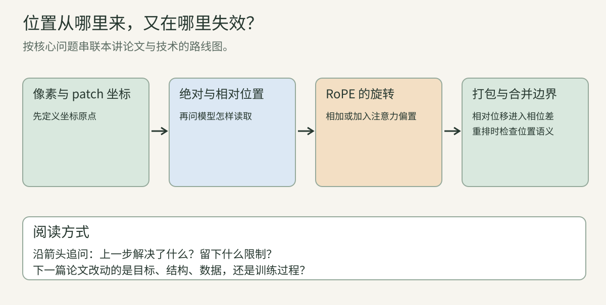
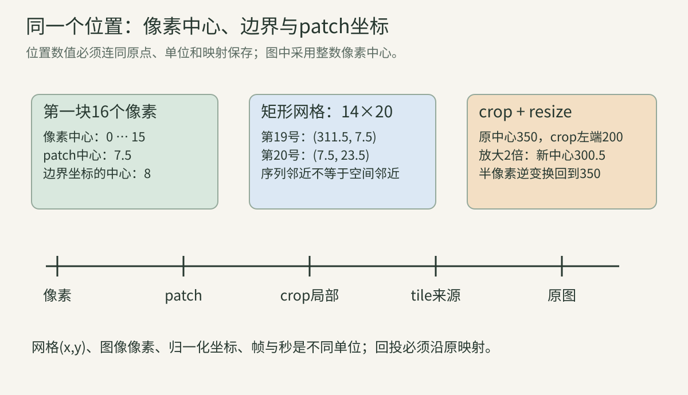
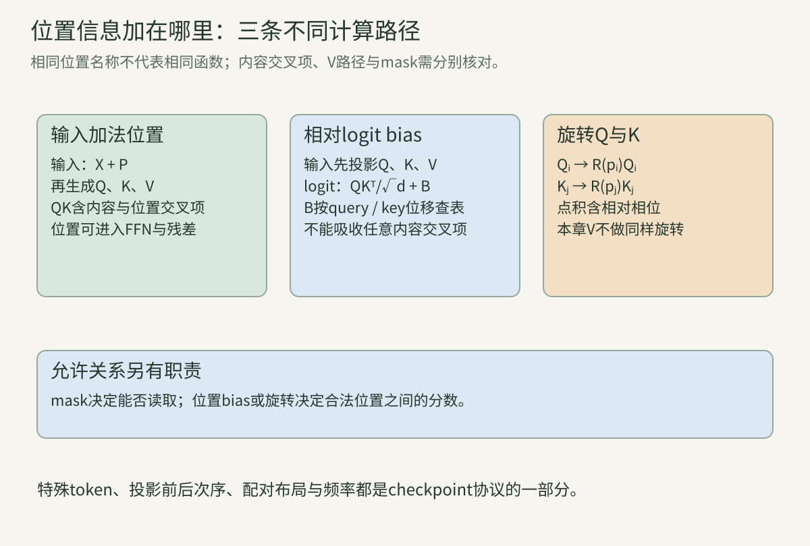
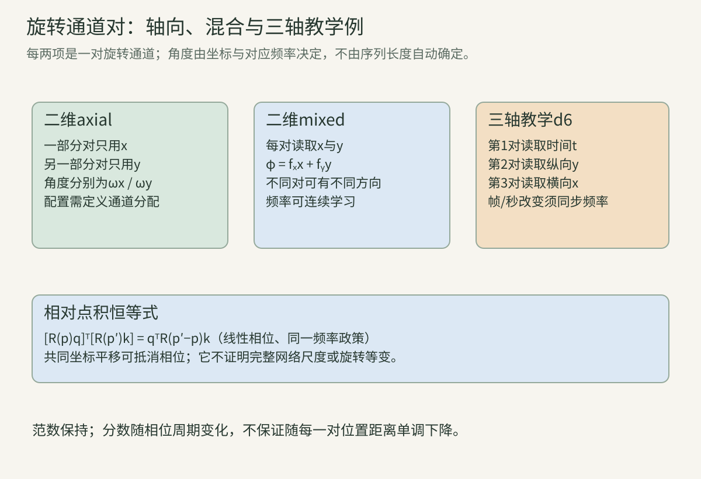
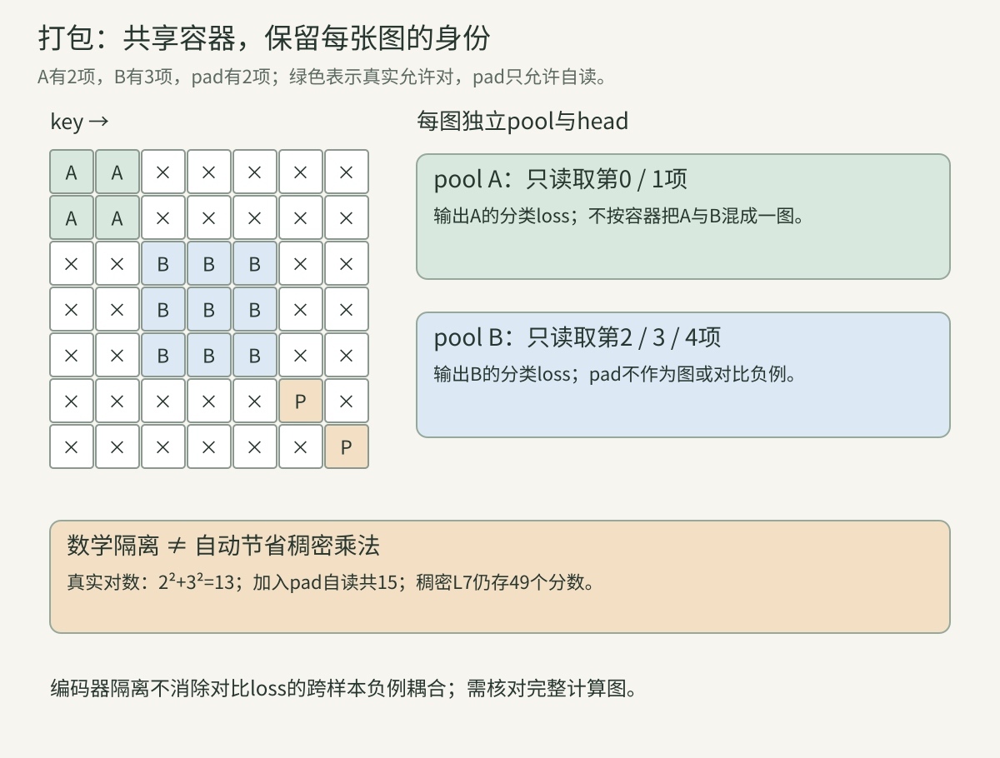
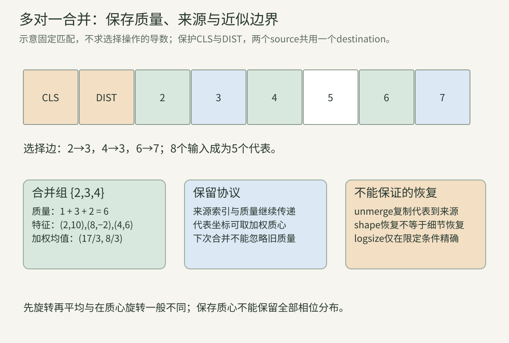

> 本讲把“token在哪、属于谁、包含多大区域、模型允许谁互相读取”连成一条完整链路。位置表、相对bias、旋转、打包和合并作用在不同对象上，不能只按shape或名字判断等价。前面的ViT/Swin公式会在新问题中就地解释；手算和四个标准库程序均为独立教学构造。

<!-- teaching-narrative-rewrite -->

给同一只猫裁图、缩放，再把两张图打包进一个batch：模型看到的token序号变了，猫在画面中的真实相对关系却有一部分应该保留。本讲沿这件事追问“位置”是像素坐标、patch索引、相对距离还是视频时间；每种写法进入注意力的地方不同。

## 一、先给坐标、身份和表示分别命名

**空间位置不是token的全部身份。** 一个图像token有特征向量$x_i\in\mathbb R^D$，还可能带图像ID、空间坐标$(y_i,x_i^{\rm coord})$、时间、有效性、原图区域和代表的token数量。这里特征$x_i$与横坐标$x_i^{\rm coord}$刻意分开，避免同一个x造成误读。

特征可以被attention、MLP和归一化改变；坐标决定如何生成位置项、分组或映回原图。图像ID决定哪些token属于同一训练样本；它不是类别标签，也不是横坐标。序列索引只是当前数组行号，不必等于原空间位置。

特殊token如CLS没有普通patch的矩形支持区域；合并token可能代表一组不相邻patch。若只保存一个$N\times D$数组，这些元信息容易丢失。后续坐标输出、packing mask和多帧对齐往往需要它们，不能让特征维度替代全部协议。

**像素中心、图像边界与索引的三种数。** 长度W的离散图像，数组索引为0到W−1。可把像素中心坐标定义为这些整数，此时图像边界在−0.5到W−0.5；也可使用边界坐标0到W，此时像素中心在0.5到W−0.5。

两者横坐标相差0.5，描述的是同一几何位置。框通常更适合使用边界/半开区间，关键点、插值采样可能使用中心约定。输入库采用哪个约定，必须从具体变换中确认，不能在两个阶段无声混用。

“第0个像素”是离散身份，“中心0.5”是某种坐标值，“最左边界0”是区域边界。把三者混成一个0，会在resize、crop和特征上采样时留下半像素误差；它不会总触发shape或类型错误。

**Patch中心与卷积stride怎么计算。** 不补边的P×P非重叠patch，第$r$行、第$c$列从整数中心索引$rP,cP$开始。其中心是$(rP+(P-1)/2,cP+(P-1)/2)$；若用边界坐标，中心为$((r+1/2)P,(c+1/2)P)$。

卷积kernel k、padding p、stride s下，第j个输出的初始输入中心为$js-p+(k-1)/2$，这里输入中心采用整数坐标。多层还要累计各层的jump和center offset，不能只把最后一个stride相乘就认为所有坐标确定。

位置编码常使用**patch网格索引**而非原图像素中心，这也是合法协议。两者分别表达“第几个patch”和“原图哪一点”；若多尺度token要共享位置函数，坐标单位需要统一或显式区分。

**跟着算：行号相邻，却隔着整条图像宽度。** 224×320、P16得到14×20网格。行优先$i=20r+c$，第19行token数组项对应网格$(0,19)$，第20项对应$(1,0)$；它们的一维索引差1，二维差$(1,-19)$。

像素整数中心坐标分别为$(7.5,311.5)$和$(23.5,7.5)$。它们并不是两个相邻的横向patch。如果对展平索引直接使用一维相对距离，会把这种跨行“相邻”与真正横向相邻混淆。

同一垂直邻居的索引差等于网格宽20；换到宽14时变成14。二维位置明确记录$(r,c)$，可以避免距离与当前长宽比被一维行号绑在一起。

**Crop、resize与tile必须留下逆映射。** 原图裁剪左边界位置a，缩放倍数s。若原中心使用整数坐标，且resize采用半像素中心映射，前向与逆向是：

$$
x'=(x-a+0.5)s-0.5,\qquad
x=(x'+0.5)/s-0.5+a.
$$

若使用边界坐标，常见几何映射则是$x'_{\rm edge}=s(x_{\rm edge}-a)$。哪个公式正确取决于坐标定义，不是两者互相矛盾。裁剪原点、纵横缩放、padding与旋转都应保存。

tile中的局部坐标还需加回tile原点。tile可以重叠，所以相同原图区域可能对应不同输入token；若后续融合，要记录来源和重复区域。局部位置从0重置，并不自动告诉模型这个tile在整图左上还是右下。

**跟着算：半像素约定下的crop/resize。** 原中心横坐标350、crop左边界200、s2：$x'=(350-200+0.5)\times2-0.5=300.5$。代入逆公式得到350。

若把350当边界坐标，映射结果为300。差0.5来自协议，不应擅自取整让两者看起来相同。预测关键点、框边界和位置表各有自己的坐标语义；一个案例中证明逆变换正确，不意味着所有库都用同一半像素规则。

**三类位置机制插在三个不同地方。** **输入相加**：$z_i=x_i+p_i$，位置表或位置函数输出D维向量。**分数相加**：$s_{ij}=q_i^\top k_j/\sqrt d+b_{ij}$，bias直接改变query/key对的分数。**Q/K变换**：$\widetilde q_i=R_iq_i,\widetilde k_j=R_jk_j$，RoPE属于这类。

还可以把位置作为独立输入送入网络、在value中加入关系表示，或通过卷积/窗口/边界组织提供空间偏置。本讲先精讲前三种；已有Swin相对表和PVT卷积的位置线索见[第14讲](../vision-14-swin-pvt/)。

不同插入点形成不同函数。相同D或相同attention矩阵尺寸不代表互换；先确定哪个变量被加、被旋转或参与哪一层，再讨论迁移和复杂度。

## 二、绝对位置、因子化与插值

先给每个槽位一个坐标向量最直观，但换分辨率会遇到新网格。插值只是把旧表搬到新位置，不能保证几何语义完全保留；先把坐标原点和像素中心约定写清。

**输入相加的梯度不是“只学习位置”。** 位置表$P\in\mathbb R^{N\times D}$按i取第i行，输入$Z=X+P$。对一个样本，$G_X=G_Z$、$G_P=G_Z$；跨batch使用同一表，则表梯度按样本累加。

后续投影Q会同时接收内容与位置：$Q=(X+P)W_Q$。位置不是额外的类别标签；通过loss学习的位置表是否有利，取决于目标和数据。一个表项D个参数，也不能自动当作网络可解码的真实$(x,y)$坐标。

如果随机打乱patch内容而位置不动，模型看到的是内容移到新位置；如果把特征与对应位置行一起重排，只是改变存储顺序。二者的实验含义相反，做位置消融时应明确改了哪一个对象。

**置换等变与空间理解的关系。** 无位置的self-attention与逐位置MLP对序列置换通常等变：输入重新排序，输出同样重排；全局平均可能进一步不变。它能比较内容，却无法仅从数组顺序确认两个相同内容块位于上方还是下方。

加入固定位置行以后，内容单独置换会改变函数；同时重排内容与位置、mask和所有元信息，则仍可保持同一物理输入的表示语义。模型不应因为合法的内存顺序改变而把图像几何也改变。

严格空间旋转/平移等变则是另一组变换关系，需要规定位置函数、采样和输出怎样变换。知道坐标不等于对几何变换满足精确等式；训练的旋转鲁棒性也不同于结构保证。

**完整二维表与行列因子化的参数。** 完整表$P_{r,c}\in\mathbb R^D$，参数$G_hG_wD$。因子化相加用$P_{r,c}=U_r+V_c$，参数$(G_h+G_w)D$。14×20/D768，完整215,040参数，因子化26,112。

因子化可以给未同时出现过的行列组合提供表示，但表行/列本身仍有最大范围和训练覆盖问题。它不会自动支持无限坐标；fractional函数、插值或其他参数化需要另行定义。

相加因子化还存在参数不唯一：给全部U加同一D维向量a、全部V减a，P不变。这种“规范自由度”解释为什么不能单独根据U数值大小断言垂直位置更重要。输出由两者共同决定。

**因子化相加牺牲了什么表达。** 任意$P_{r,c}=U_r+V_c$都满足二维交叉差：

$$
P_{r_1,c_1}+P_{r_2,c_2}-P_{r_1,c_2}-P_{r_2,c_1}=0.
$$

因此它不能任意指定每个格独有的初始向量。这个约束在D个分量上分别成立；它是表达结构的事实，不直接给出分类性能的优劣。

后续非线性网络可混合行列内容，形成更复杂依赖，所以“输入表可加分离”不等于整网永远无法表示行列交互。用因子化、拼接、乘积或MLP会产生不同参数与约束，不能只统称为“二维编码”。

**跟着算：一个无法写成行向量加列向量的表。** 标量表$\begin{bmatrix}0&0\\0&1\end{bmatrix}$交叉差为1，而任何$u_r+v_c$的交叉差均为0，因此无法精确表示。

相反$\begin{bmatrix}0&2\\3&5\end{bmatrix}$可以由$u=(0,3)$、$v=(0,2)$产生。加一个公共常数到u再从v减去，仍生成同一表。比较两种结构时要锁定D、预算和训练目标，不能仅根据能否拟合这个四数教学表推断自然图像效果。

**Absolute index与fractional coordinate。** 绝对patch索引用$c,r$，相邻位置差1；fractional坐标可用$c/G_w,r/G_h$，范围与图像尺寸归一化。NaViT论文讨论的是后一种比例，另一个常用**中心比例**$(c+1/2)/G_w$是不同约定，应单独命名。

14列和28列网格的中部位置，可有相近fractional值而绝对索引不同。比例表达“在图内大约哪一部分”，绝对索引表达“第几个patch”。前者弱化原尺寸信息，后者让距离随分辨率改变。

只把两轴各自归一到0到1，会使4×8与8×4网格覆盖同一坐标范围；长宽比仍可隐含在token分布，也可显式输入H/W或原像素坐标。选择要与任务匹配，不能认定尺寸信息丢失后总能被特征自然恢复。

**Fourier特征中的单位与频率。** 坐标p可以映射成$(\sin(\omega_1p),\cos(\omega_1p),\ldots)$。频率$\omega$单位是每坐标单位的弧度；p从pixel换成patch索引或0到1比例，而频率不变，就改变了位置函数。

若$p'=ap$且希望相位保持，应令$\omega'=\omega/a$。二维可使用$\omega_xx+\omega_yy$，也可分别给每轴分量。学习频率与固定频率是不同训练对象，仍须声明初始化和范围。

周期函数可以在远处重复：单一频率p与$p+2\pi/\omega$给相同sin/cos。多频率减少某些重复，但不等于对任意浮点范围无碰撞、无误差；这对后面的RoPE外推同样重要。

**位置表插值先确定坐标映射。** 把学习表从$G_h\times G_w$改成$G'_h\times G'_w$，常对D通道分别二维插值。位置表不是图片本身，resize图像和resize位置表应作为两个独立步骤记录。

单轴align-corners坐标为$i(G-1)/(G'-1)$（$G'>1$）；half-pixel坐标为$(i+1/2)G/G'-1/2$，再按边界政策处理。目标长度为1时不能除以0，本章教学程序的align-corners特例取源坐标0，half-pixel取$(G-1)/2$；实际库与版本应另核对。双线性权重来自两轴相邻格的乘积。

插值是对学习表在新坐标求近似值，不是增加新的独立训练信息。它也不保证大分辨率预测一定好：内容分布、attention范围、norm和训练尺度同时改变。bicubic、antialias和不同库的边界实现不能无声当成双线性。

**跟着算：同一位置表的两种resize。** 标量一维表$(0,6)$，长度2→4。align-corners源坐标依次为$0,\frac13,\frac23,1$，输出$(0,2,4,6)$。

half-pixel源坐标$-\frac14,\frac14,\frac34,\frac54$，采用边界clamp后为$0,\frac14,\frac34,1$，输出$(0,1.5,4.5,6)$。首尾相同，中间不同，shape测试发现不了这种差异。

若改的是含CLS/DIST的序列，必须先拿出特殊行再reshape空间部分；不得把特殊token位置插入图像网格后“顺便插值”。

**双线性插值的反传就是加权scatter。** 向量形式$\widetilde P=AP$，A由坐标和边界规则确定，行是新格对旧格的权重，通常每行和1。上游$G_{\widetilde P}$给出：

$$
G_P=A^\top G_{\widetilde P}.
$$

一枚旧格被多枚新格引用，梯度要累加；边界clamp可能让两权重落到同一格，也需相加。不能只把大表梯度resize回小表，这一般不是插值算子的转置。

若坐标本身可学习，A也依赖参数，还需对坐标和边界分段规则求导。本章实验一固定坐标，验证矩形2×3→4×5表的6个值；没有把离散clamp切换点当光滑可微函数。

**改分辨率时的metadata与cache。** 保留原$G_h,G_w$、行列顺序、特殊行数、目标网格、插值模式/align/边界，以及D维和dtype。相同token数可能来自不同长宽比，因此不能只用N作为位置cache key。

矩形网格恢复须按明确H/W，不能对$\sqrt N$取整猜边长。不同batch中的图片也可能有不同网格，打包以后行号不再连续对应一张完整矩形，需要分别追踪图像范围与坐标。

图像内容预处理改变以后，旧cache特征或位置未必可复用。模型revision、预处理、输入尺度/原点、选用stage和位置规则应进入复用条件；否则缓存可以很快地返回一个语义错误的结果。

**改patch大小是改投影核，不只是改位置表。** P×P/RGB展平长度$3P^2$，投影权重$E\in\mathbb R^{3P^2\times D}$。P16→P8以后，输入维度768→192；位置表也随网格改变，但这两个变换各自处理。

[FlexiViT](https://arxiv.org/abs/2212.08013)通过训练时改变patch大小并变换patch投影等机制研究单模型多patch预算。本节推导其中线性变换的基本问题，而非把它简化成“把任意checkpoint的卷积核直接resize就一定兼容”。

图像patch的resize把输入数映到新空间；投影核应如何变换，取决于希望保持哪一个线性函数。像素与位置向量都能插值，但**插值对象相同shape操作不意味着目标相同**。

**推导投影核的伪逆变换。** 用列向量旧patch$x\in\mathbb R^n$，新patch$x'=Bx\in\mathbb R^m$。旧标量投影$w^\top x$，希望新权重$w'$满足$w'^\top Bx=w^\top x$对所有x成立，因此：

$$
B^\top w'=w.
$$

最小范数候选是$w'=(B^\top)^+w$，上标+表示Moore–Penrose伪逆。若B列满rank，$w'=B(B^\top B)^{-1}w$，可精确保留这个理想resize子空间内的投影。

若降采样丢掉的方向恰被w使用，方程没有精确解，伪逆只是最小二乘近似。真实新patch未必是旧patch的精确B映射，还含新采样内容，所以这个线性恒等式不等于整网迁移性能保证。

**跟着算：2值到3值，以及无法保留的对比方向。** $B=\begin{bmatrix}1&0\\1/2&1/2\\0&1\end{bmatrix}$，旧$w=(2,4)$。$B^\top B=\begin{bmatrix}1.25&0.25\\0.25&1.25\end{bmatrix}$，按公式得到$w'=(1,2,3)$，确实$B^\top w'=(2,4)$。

直接把旧权重线性插值成$(2,3,4)$，有效旧权重却为$(3.5,5.5)$，不是原投影。对$x=(1,3)$，原14，正确新$(1,2,3)\cdot(1,2,3)=14$；naive新输出20。

如果B只取均值$[1/2,1/2]$，旧对比输入$(1,-1)$变成0，但旧投影为−2。任何新标量权重乘0仍0，无法精确保留它。知道信息已经丢掉，比靠更复杂公式承诺“无损改patch”更关键。

## 三、相对关系与位置函数的插入点

**相对bias只依赖差值，但方向有约定。** 二维相对表常令$b_{ij}=f(y_i-y_j,x_i-x_j)$，Swin离散索引已在第14讲逐项推导。位移是query−key还是key−query、单位是patch还是pixel，需要写清。

同一位移对应共享参数，可以减少依赖绝对网格位置。形状变大时，需要新的位移范围、bucket/函数或插值政策；不意味着一张有限表无需任何修改就支持任意图像。

连续坐标MLP、距离惩罚、位置bucket都是不同f。距离标量$\sqrt{\Delta x^2+\Delta y^2}$不含方向，二维差保留方向；任务若要求左右/上下关系，选用前者可能引入额外对称性。

**输入加位置与分数加bias不能一般互换。** 输入位置相加后，省略缩放：

$$
((x_i+p_i)W_Q)((x_j+p_j)W_K)^\top.
$$

展开包含内容×内容、内容×位置、位置×内容、位置×位置四项。除最后一项外，额外项通常还依赖输入内容；一个固定$b_{ij}$无法对所有X自动表示它们。

分数bias则不直接改变Q/K/V投影输入；如果位置也加入V，会影响被读出的值。评价一种机制替代另一种，要训练/迁移并看结果，不能根据“都给attention提供位置”当成严格代数等价。

**跟着算：标量反例证明插入点改变函数。** 取标量、投影权重1，$p_i=p_j=1$。额外分数为$(x_i+1)(x_j+1)-x_ix_j=x_i+x_j+1$。

$x_i=x_j=0$时额外1；$x_i=2,x_j=0$时额外3。不存在一个固定的位置bias同时对两种内容取1和3。这个反例不说明某机制更强或更好，只说明“仅换插入点而不改其余函数”通常不等价。

**关系偏置、mask与边界不是同一件事。** bias是可见位置对的相对偏好；mask定义哪些位置对根本允许读取。一个很低的learned bias不构成严格禁止，同一相对bias也不自动知道两个位置是否跨越不同图像身份。

窗口、padding、特殊token和pack中的图像ID都参与允许关系。把空间位移和身份关系分开，可以避免两个不同图像里相同坐标的token被误认为同一个区域，或让图像边缘绕回。

对于位置差形成的平移不变分数，如果同时平移所有坐标且内容不变，相对项保持；整网仍可能因窗口分区、crop和采样相位失去严格平移等变。局部代数性质不要扩大为整网无条件性质。

**为位置实验定义一个可复查的对照。** 比较绝对表、相对bias和RoPE，先锁定骨干、训练/验证数据、输入分辨率、增强、预算和输出接口。随后分别检查原尺寸、新长宽比、新分辨率、平移/旋转与坐标任务，而不是只报告一组分类top-1。

还要保存位置范围、unit、外推政策、特殊token处理、dtype与频率。测试图像resize可能改变对象可见细节，因此“分辨率变大表现提升”不能只归因于位置外推。

下面的RoPE手算先固定内容向量，仅改变坐标，隔离位置机制本身。这类小数学对照证明函数性质，真实视觉任务的消融再检查它是否带来有用能力。

## 四、RoPE：从二维旋转到完整梯度

相对bias直接改注意力分数；RoPE则旋转Q和K，使点积与两位置的相位差相关。下面从二维旋转入手，再增加二维图像和三维视频轴。

**先认识一个二维旋转矩阵。** 将每对通道看成二维列向量$q=(q_0,q_1)^\top$，定义：

$$
R(\theta)=\begin{bmatrix}\cos\theta&-\sin\theta\\
\sin\theta&\cos\theta\end{bmatrix}.
$$

相乘得到$(q_0\cos\theta-q_1\sin\theta,\ q_0\sin\theta+q_1\cos\theta)$。这旋转的是**两个特征分量**，不是真把图像像素旋转一个角度。坐标通过角度进入变换，图像内容的采样位置在此步骤没有移动。

由三角恒等式，$R^\top R=I$，$R(\theta)^{-1}=R(-\theta)$，$\det R=1$，所以精确算术下长度不变。多对通道分别旋转形成分块对角矩阵；输入特征维数不变，没有因为“旋转”新增token。

**跟着算：长度保持的具体旋转。** $q=(3,4)$，角$\pi/2$，结果$(-4,3)$。原平方范数$3^2+4^2=25$，旋转后$(-4)^2+3^2=25$；再旋转$-\pi/2$恢复$(3,4)$。

若错误把矩阵写成$\begin{bmatrix}\cos&-\sin\\-\sin&\cos\end{bmatrix}$，在一般角度就不再是正确旋转。检查范数、逆变换和手算小角度，比仅检查输出shape更容易发现符号错。

**位置怎样变成每对通道的相位。** 一维位置m，第t对通道角度$\theta_t(m)=m\omega_t$，频率$\omega_t$决定该对通道随位置变化有多快。常见一维频率序列可写$\omega_t=b^{-2t/d_{\rm rot}}$，b为base；这是具体构造，不是所有二维实现都直接套这个指数。

RoPE作用在Q/K：$\widetilde q_{m,t}=R(m\omega_t)q_{m,t}$，$\widetilde k_{n,t}=R(n\omega_t)k_{n,t}$。它通常不新增独立的位置表行，但需要频率、坐标及sin/cos缓存或计算。

频率可以固定，也可以学；不同head、layer可共享或不共享。部分旋转只处理$d_{\rm rot}\le d$通道，其余不变。$d_{\rm rot}$必须满足通道配对条件，不能只按整个hidden width有偶数就认为每头合法。

**为什么点积只留下相对位置？** 对一对通道：

$$
\widetilde q_m^\top\widetilde k_n
=q_m^\top R(m\omega)^\top R(n\omega)k_n
=q_m^\top R((n-m)\omega)k_n.
$$

用到$R(a)R(b)=R(a+b)$及$R(a)^\top=R(-a)$。位置通过n−m的差进入该点积；内容$q_m,k_n$仍随各位置的输入而不同，因此不能把整项说成“只看距离、不看内容”。

Q/K同时坐标平移c，角度各加cω，差不变，固定内容下点积相同。这是RoPE点积的共同平移性质；窗口/图像采样/特殊token等整网条件另看，不自动构成完整视觉模型的平移等变。

**跟着算：绝对旋转与相对旋转算出同一分数。** $q=(1,2)$、$k=(3,4)$，q角$\pi/2$、k角$\pi$。分别旋转为$(-2,1)$与$(-3,-4)$，点积$6-4=2$。

相对角$\pi-\pi/2=\pi/2$，只旋转k成$(-4,3)$，与未旋转q点积$-4+6=2$。原未加位置点积11，被坐标相关旋转改变成2，范数却没有变。

这个2是未做$1/\sqrt d$缩放的单pair点积；放回多头attention时还需按整个head宽d缩放、加mask或bias、softmax，再读取V，不能把2直接称作注意力概率。

**“相对位置”不保证每个分数随距离单调衰减。** 取$q=k=(1,0)$、单频率1，相对距离δ的点积为$\cos\delta$。δ0/π/2π得到1/−1/1。距离更远可以重新变大，反证单项严格单调衰减。

多频率、内容分布和训练可能形成某种平均距离偏好，原RoFormer也分析相关性质；这类分析要保留假设，不能当每个样本、每对通道的保证。RoPE也不替代causal mask：过去/未来是否可见由任务规定。

外推到远坐标虽然公式有定义，phase可能出现未见频率组合、周期混淆和数值误差。可计算并不等于学过或准确；新的尺度/坐标政策需要实证验证。

**投影前后旋转与旋转V的不同函数。** 常规先$Q=XW_Q$，再按位置旋转Q。为核对维度，把单个输入写成列向量$x_i\in\mathbb R^D$，投影$W_Q\in\mathbb R^{D\times d}$：先投影再旋转为$R_i^{(d)}W_Q^\top x_i$；先在输入维度旋转再投影为$W_Q^\top R_i^{(D)}x_i$。两种矩阵乘积一般不同，甚至旋转所在维度都不同，所以不是免费等价。

对V也旋转，会改变被读取的向量值：$U_i=\sum_jA_{ij}R_jV_j$，而通常是$\sum_jA_{ij}V_j$。一个query最终收到多个不同位置旋转后的值，语义和输出投影都不同。

因此介绍具体模型时，应写明RoPE放在Q/K的哪几维、是否包含special token、投影前后和V政策。本章程序遵循Q/K旋转、V不参与的基本点积机制。

**相邻配对与split-half：同一公式也会错接通道。** 相邻配对是$(0,1),(2,3),\ldots$；split-half可以把前半与后半配成$(0,d/2),(1,d/2+1),\ldots$。d4时分别是(0,1)/(2,3)和(0,2)/(1,3)。

两种布局可用一个一致的通道置换建立等价：同时置换Q/K表示、频率布局及相关投影权重。只换rotate函数而不换checkpoint的通道解释，会改变相位作用对象。

二维轴向分配又增加x/y频率的排列问题。很多bug的cos/sin张量和Q/K都具有正确shape，却在这一步错配。先用各通道不同的值和不同角度，比全1向量更能发现问题。

**跟着算：d4布局的可检查置换。** 原$q=(1,2,3,4)$，相邻两对分别旋转a、b。改为split-half表示$(1,3,2,4)$，第一对取第0/2项，即原1/2；第二对取第1/3项，即原3/4。

输出按同一置换重排就应一致。若仍把原$(1,2,3,4)$直接交给split-half，第一对变1/3，第二变2/4，通常不一致。实验二用a0.2、b0.7核对正确置换，并assert未置换路径产生差异。

**旋转特征的反传为什么用逆旋转。** 固定角度，$\widetilde q=R(\theta)q$，所以$G_q=R(\theta)^\top G_{\widetilde q}=R(-\theta)G_{\widetilde q}$，K同理。若只旋转部分通道，未旋转部分的梯度原样传回。

attention反传先通过$AV$、softmax、$QK^\top$得到$G_{\widetilde Q},G_{\widetilde K}$，再按各自位置逆转，最后回到投影矩阵与原输入。不能在前向加RoPE以后仍用未旋转Q/K直接算输入梯度。

这一步是确定线性变换的转置，不需要近似数值导数。实验中的有限差分用来验证手写链式法则，不能把慢差分当实际神经网络训练方法。

**学习频率需要对相位反传。** 令$J=\begin{bmatrix}0&-1\\1&0\end{bmatrix}$，$\partial R(\theta)q/\partial\theta=JR(\theta)q$。一维$\theta=m\omega$时：

$$
G_\omega=\sum_i m_i\,G_{\widetilde q_i}^\top JR(m_i\omega)q_i
+\sum_j n_j\,G_{\widetilde k_j}^\top JR(n_j\omega)k_j.
$$

同一频率在多个位置、Q与K里都被引用，梯度必须相加。二维mixed时，$\theta=x\omega_x+y\omega_y$，对$\omega_x$分别乘各位置x，对$\omega_y$乘y。

通常位置是数据而非可训练参数；若输入坐标来自可学习模块，还需要对它求梯度。离散gather/取整/匹配本身不会因为phase可微就变成光滑操作，这个边界在token合并时也重要。

**跟着算：单频率梯度手算。** $q=k=(1,0)$，位置差2，分数$s=\cos(2\omega)$。取$\omega=\pi/6$，s1/2，loss$L=s^2/2=1/8$。

$$
\frac{\partial L}{\partial\omega}
=s[-2\sin(2\omega)]
=-\sqrt3/2\approx-0.866025.
$$

若漏掉位置差系数2，梯度缩半；如果q和k频率共享，却只加一条支路贡献，也可能错。实验二进一步检查两个mixed频率向量及8个Q/K特征，总12个标量。

## 五、二维、三维与特殊token

**轴向二维RoPE怎么分配通道对。** 把一部分pair分给x轴，角$x\omega_t$；另一部分分给y轴，角$y\omega_t$。若旋转宽$d_{\rm rot}$两轴等分，各轴$d_{\rm rot}/2$通道、$d_{\rm rot}/4$个pair，因此通常要求$d_{\rm rot}$能整除4。

每个pair的位置依赖只含一个轴，整个点积是这些pair项的和。这明确保存二维位移的两个分量，不再依赖flatten宽度；但单pair不能直接用斜向混合phase。

频率数、指数、base及轴布局要按具体实现核对。视觉RoPE作者代码区分axial与mixed初始构造，不能把语言模型某个base10000参数自动安到所有视觉配置上。

**一维行号RoPE与二维坐标的差别。** 一维行号$i=yG_w+x$，相对phase依赖$\Delta yG_w+\Delta x$。垂直位移的phase因此随G_w改变；跨行的行号差1还可对应$(1,1-G_w)$。

二维轴向phase分别用$\Delta x,\Delta y$，在换宽时不必把同一垂直相对位置乘上新宽度。它解决一种编码混淆，仍不保证模型对换宽后的内容采样和统计完全鲁棒。

二维坐标可表示矩形网格、缺失patch、tiles等，不必先填成连续一维“时间”。不过如果空间邻接算子需要完整grid，打乱/丢弃以后还要同步修改其接口，不能只说attention灵活就忽略卷积模块。

**跟着算：d4的轴向phase。** 教学设第一pair分给x、第二pair分给y，频率均为$\pi/2$。位置$(x,y)=(1,0)$角$(\pi/2,0)$；$(0,1)$角$(0,\pi/2)$，对特征$(1,0,1,0)$分别得到$(0,1,1,0)$与$(1,0,0,1)$。

而使用flatten索引，在宽4时两位置索引1和4，在宽8时变1和8；垂直位置phase发生额外变化。这个例子隔离编码单位，不涉及整图resize之后patch内容怎样改变。

**Mixed二维RoPE：每个pair同时看两轴。** 为每个pair定义频率向量$\omega_t=(\omega_{x,t},\omega_{y,t})$，角度：

$$
\theta_t(x,y)=\omega_{x,t}x+\omega_{y,t}y.
$$

Q/K点积的相对角为$\omega_t^\top(p_j-p_i)$。令某轴频率0，就得到轴向特例；两个都非零，可以直接表达沿某个方向的phase变化。

[视觉RoPE论文](https://arxiv.org/abs/2403.13298)研究轴向与mixed可学习频率。若每层每头独立学习，每个pair两参数，总频率参数为$d_{\rm rot}$每head每层，不计其他模块；共享策略不同则另计。新增的是频率参数，不是每个位置单独一行表。

**坐标旋转与频率旋转的代数，不是视觉等变证明。** 给坐标施加正交矩阵A，若频率也变成$A\omega$，则$(A\omega)^\top(Ap)=\omega^\top p$，phase保持。一般可逆线性变换$p'=Ap$时，相应频率为$A^{-\top}\omega$。

这说明位置函数如何在坐标系变更下保持数值。若只旋转图像坐标而保留learned frequency不动，phase一般改变；模型没有自动同时旋转所有已学频率的操作。

完整图像旋转还改变patch内容、采样和窗口，以及输出任务的变换，所以不能凭这个点积恒等式宣称整网严格旋转等变。可以用它检查坐标系统转换和解释mixed frequency方向，但实际鲁棒性仍须评价。

**三轴RoPE分的是时间、高度、宽度。** 一种三轴方式把pair分给t/y/x，各自用对应坐标乘频率。每轴分配的旋转通道数都应为偶数，总和等于$d_{\rm rot}$；三轴不必平均分配，d也不必机械要求6的倍数，只要所选分块能配对。

也可定义每pair三维频率，phase为$\omega_tt+\omega_yy+\omega_xx$。轴向与mixed再次是不同设计，具体模型未必采用同一种。本章用d6每轴一pair作为教学模型。

[Qwen2-VL](https://arxiv.org/abs/2409.12191)的M-RoPE是时空多轴位置的一条具体路线；完整图文/视频序列组织和后续版本将在对应VLM章节逐模型说明。本节完成基本数学，不把所有名字都当成同一3D实现。

**帧索引、秒与真实三维空间必须区分。** 视频坐标$(t,y,x)$里t可能是第几帧、采样序号或物理时间。3D点云坐标$(X,Y,Z)$是空间位置，可能用米；它们都能生成三轴phase，但含义、尺度和变换完全不同。

同一事件在不同fps下，帧差变化而秒差可能相同。若$t_{\rm sec}=t_{\rm frame}/f$，保持相位需$\omega_{\rm sec}=f\omega_{\rm frame}$。时间戳不连续、抽帧不均匀或可变fps时，连续秒坐标和连续帧索引也不等价。

真实空间坐标还依赖相机/世界坐标系、尺度和姿态。仅有image-grid RoPE不能自动赋予相机几何和米制距离理解；空间建模主线会继续讲这些条件。

**跟着算：同一时间，频率单位不同。** 30fps，第3帧相对第0帧时间0.1秒。每帧频率0.2弧度，phase0.6；换秒坐标需每秒6弧度，$0.1\times6=0.6$。

若错误仍用每秒0.2，phase变0.02，缩小30倍。三轴教学坐标$p=(2,3,4)$，t/y/x频率0.5/0.25/0.125，角为1/0.75/0.5；不同轴数字不能不声明单位就直接比较“谁距离更大”。

**CLS、DIST和文本token没有唯一的空间phase。** CLS不对应某个patch，常见政策是不给它旋转，只旋转patch Q/K；视觉RoPE作者ViT路径采用这一方式。也可给special token设特定坐标或单独频率，但必须具体说明。

不旋转CLS意味着CLS到patch的点积不一定具有两个空间位置共同平移的同样性质。不能把patch-patch相对恒等式无条件推广到包含未旋转特殊位置的所有分数。

图文混合序列中的文本有语言顺序，图像有二维空间，多图/视频还含身份与时间。先定义这些坐标怎样分配，再谈统一的位置机制；把全部token只编号0到L−1是一种协议，不自动保留全部几何语义。

**插值、频率缩放与外推，是三种动作。** 位置表插值改变有限表采样；RoPE位置缩放$p'=p/a$改变phase；增大可输入坐标但保持原频率，是直接外推。它们都有可能支持更长/更大输入，却不是一个公式的不同名字。

缩放可压回训练坐标范围，同时也压小相邻patch的phase差，改变局部距离刻度。频率分量可能需要不同策略，而非一个全局倍数。每种修改应保持清楚的原点、单位和分辨率条件。

相位计算的精度也重要：大坐标乘频率后，低精度舍入可能抹去相邻位置差，再求sin/cos不能补回。作者视觉实现将相关phase计算放在较高精度路径；具体部署还需核查export与kernel，不能只看权重dtype。

## 六、NaViT与多图打包：空间协议之外还有样本边界

一张图内的位置正确还不够。把多张不同尺寸图放进同一token容器时，要阻止A图读B图；合并token时，还要知道新token代表哪些旧位置。

**可变分辨率不是“无需任何预处理”。** ViT主要处理token序列，可以让不同图像产生不同数量的patch；但是patch大小、通道、像素normalize、最大预算、尺寸取整和采样政策仍要定义。原图过大时也可能缩放，非整除边界可能crop或pad。

[NaViT](https://arxiv.org/abs/2307.06304)将不同长宽比/分辨率图片的patch打包，结合图像隔离mask、按图池化、因子化/比例位置及训练采样等机制。它让预处理与模型预算更灵活，不能仅由名字“Native”推断所有输入都逐像素原尺寸不变。

一张图变成$G_hG_w$个token以后，保存图像身份与局部坐标。若随机丢掉一些patch，其余位置不能按保留顺序重新当作紧密网格；坐标仍来自原patch位置，除非明确设计了新的位置政策。

**Packing把多个独立样本放进一个计算容器。** 两图长度2与3，可以拼成5行特征，再补齐到L7。容器一行元信息为$(\text{imageID},y,x,\text{valid})$，例如身份$(A,A,B,B,B,\bot,\bot)$，$\bot$表示padding。

这并非把两张图拼成一张大图，也不是将五个patch统一赋0到4的空间横坐标。图A/B各有自己的坐标域，属于不同训练样本；数组行号只是打包后的存储地址。

一个pack里图像数量可变，普通“batch维就是图片数”的假设失效。任务头、loss、采样统计、日志和distributed归约都要按真实图片重新整理，否则看似训练正常，实际上权重和曝光已经改变。

**Same-image mask产生块对角允许关系。** 对有效query i，允许key j的条件是$\operatorname{ID}_i=\operatorname{ID}_j$且j有效。空间self-attention通常双向可见；这与语言causal mask的三角形不同。若任务需要两者，可以合取条件。

投影、MLP、逐token LN和残差没有跨行统计；用块对角attention后，独立图像的编码器前向可以分离。若某模块跨整个pack做BN或global pooling，仍会重新引入跨样本依赖。

padding query的全空行需处理，可让它仅看自身然后将对应输出丢弃，或使用kernel支持的安全空行策略。关键是有效query不能读取padding，任务头也不能将padding当真实图像。

**跟着算：两图加两个padding的允许矩阵。** 身份A/A/B/B/B/空/空，图像部分的允许块是2×2全1与3×3全1，其他跨图项为0。两个pad query各只看自身，是避免NaN的教学规则，不属于真实图像证据。

完整L7分数矩阵有49项，有效图像允许项$2^2+3^2=13$；加两个pad自读是15项。有效允许项少，不表示一个dense kernel只算13项，计算实现将在第44节分开说明。

把图B内容大幅改变，图A编码结果应相同，前提是全部处理都是按图隔离、没有跨图目标或随机路径差异。实验三用完整block与按图pooling验证这个条件。

**为什么打包前后结果可以一样，何时不能保证？** 固定权重、确定性逐token操作、同坐标和正确mask时，图A的每一行Q/K/V与独立运行相同；softmax分母只含图A的key，所以attention结果相同。残差和FFN继续保持相同，按层递推即可证明。

有dropout/DropPath时，要区分同一随机样本的逐位一致和分布一致。打包改变随机数消费顺序、sample轴或drop-path掩码广播，可能让数值不再逐位相同；本章教学验证明确关闭随机模块。

不同长度kernel、精度或矩阵归约顺序也可能产生细小浮点差异。测试允许适当容差，并记录位置/mask/归一化协议，不能把任意差异一律归为“packing必然有噪声”而忽略真实跨图泄漏。

**Masked pooling必须给每张图各一个表示。** 一整个pack平均会把A/B混成一个向量。按图平均只读取对应有效行；学习query pooling则可令共享查询$g\in\mathbb R^D$对图a的行集合$I_a$计算：

$$
\alpha_i=\frac{\exp(g^\top z_i/\sqrt D)}
{\sum_{j\in I_a}\exp(g^\top z_j/\sqrt D)},\qquad
f_a=\sum_{i\in I_a}\alpha_i z_i.
$$

输出每图$f_a$，再接head。这里g共享但候选集合不同，依然没有编码器跨图信息；g不是图A专有CLS，也不需要变成输入图像patch。实际pooling可以另有Q/K/V投影和多头，本式是本章的简化可微模型。

反传时$G_{\alpha_i}=G_f^\top z_i$，softmax给分数梯度$G_s$，每个$z_i$同时收到value路径$\alpha_iG_f$与key分数路径$G_{s_i}g/\sqrt D$；g梯度对各图各位置累加。只按mean pooling反传会漏掉这条分数路径。

**按图loss、按token加权与对比负样本。** 分类常按真实图片平均：$L=\sum_aL_a/B_{\rm img}$。若将一图的loss复制给其每个patch再平均，相当于$\sum_aN_aL_a/\sum_aN_a$，大图因token更多而权重更大，目标已经改变。

pack数也不同于图片数。不同pack包含不同图片数时，先每pack平均再对pack平均，通常又不是全图片等权。分布式训练应明确真实有效图片总数和梯度缩放。

图文对比loss还通过其他样本作负例，**即使编码器隔离，loss也可跨样本耦合**。固定形状的fake pooled examples必须从有效targets及负例分母排除；只屏蔽其自己的loss行仍可能让它们进入其他样本的负例。后续CLIP章节完整展开。

**跟着算：填满pack不保证每项运算都最少。** 图长度$(4,3,3,2)$，容量6，按长度降序first-fit得到$[4,2]$、$[3,3]$，12个有效槽全用满。独立padding到4需要$4\times4=16$槽，token线性操作有所减少。

但dense attention：独立padding是$4\times4^2=64$分数项；两pack是$2\times6^2=72$，反而多。真正按图块计算只需$4^2+3^2+3^2+2^2=38$允许项。

这说明packing的槽位利用率、允许图和实际kernel预算是三张账本。另一组长度分布、不同L或varlen实现会有不同结论；不能把“没有padding”直接等价于全模型attention最省。

**跟着算：同样两张图，两种经验风险。** 图A长度2、loss1；图B长度3、loss3。按图平均$(1+3)/2=2$；按token加权$(2\times1+3\times3)/5=2.2$。

若尺寸与某类困难样本相关，这个无声加权会改变优化偏好。实验三的两图CE按真实图片平均，独立CE分别约1.051008和1.073925，打包平均约1.062467，与独立平均一致；这些是固定教学权重的输出，不是视觉训练准确率。

**贪心装箱、容量与样本顺序。** 装箱可以按输入顺序first-fit，也可以先降序排列再first-fit；这不是相同算法。NaViT材料讨论贪心装箱及长度分布控制，本章程序采用明确标注的first-fit-decreasing教学变体。

一图长度超过容量时，必须缩分辨率、丢token、切分或拒绝该输入，不能默默截断却沿用原图标签和原预算日志。容量固定也不保证每个pack图像数量固定，pooling头的最大example槽可能需要额外padding和有效mask。

排序/分桶可能改变sample接触顺序与负例组成。训练按token预算定step时，每步图片数也变化；记录图片曝光、unique image、token、更新步数与实际计算，避免把不同预算实验只比较epoch名字。

**Dense mask、块稀疏与varlen实际算什么。** 将L×L分数全部计算，再加块对角mask，语义等价于隔离，但已经付出L²的QK/AV矩阵预算。kernel若真正按每图长度运行，可接近$\sum_aN_a^2$的交互；块稀疏实现可能按tile计算，仍有碎片和边界开销。

两者投影/FFN主要按处理的token槽数计算；padding是否跳过也另看。显存是否保存完整矩阵、是否flash融合又是另一层实现选择，不由mask图自动决定。

测加速应固定设备、batch、长度分布、dtype、模型、warmup、同步与端到端范围。允许项数和理论MAC可以解释趋势，不能代替实测p50/p95、吞吐和峰值显存。

**丢patch时保留坐标，随机率改变预算分布。** 删除输入token可以减少后续序列，但保留token仍使用原网格坐标。将原位置0/2/5重新编号0/1/2会改变几何；如果模型依赖连续grid卷积，还需为缺失位置设计接口。

保留数量K随机时，attention期望与$\mathbb E[K^2]$相关，而不是只看$(\mathbb E[K])^2$。$\mathbb E[K^2]=\operatorname{Var}(K)+(\mathbb E[K])^2$；两种采样平均token一样，预算可不同。

例如K等概率2或8，均值5，但平方期望34；固定K5为25。连续token dropping、resolution sampling与schedule同时改变每次输入及预算，比较时应记录分布、重要区域损失和验证时完整图差异。

**多图VLM可有意跨图读取，任务决定mask。** 独立图像分类packing需要样本隔离；多图比较、视频身份跟踪或“这两张图片有何不同”的同一任务，可能需要图像间交互。这时不能把不同imageID一律禁止，或者需要先独立视觉编码、再在LLM里融合。

应区分训练sample ID、图像ID、frame/tile ID。一个sample可包含多图，各图有局部坐标但共同参与问题；另一个sample的图则不能泄漏。仅按imageID或仅按pack ID生成mask都可能不符合真实语义。

本章“跨图梯度为零”的程序结论限定在隔离编码器加按图CE，不能扩展到对比loss、联合多图任务或共享memory。允许信息流必须从任务定义出发。

## 七、ToMe与token合并：少一些行，代表多少信息？

**合并、删除与学习查询压缩的不同操作。** 删除(pruning)移除某些行，其他行可原样保留；合并(merging)把多行特征聚合成一行，需要更新代表数量与来源；学习query压缩则用少量查询读取输入，输出可能是全局摘要而非明确空间块。

三者都可减少下游token，却对空间对应、信息保留和梯度造成不同影响。patch merging还是规则空间分组+学习降维，与内容驱动ToMe不是同一算法。

[ToMe](https://arxiv.org/abs/2210.09461)用特征相似关系合并ViT token。本讲精讲其匹配、加权均值与数量修正的基本机制；广泛的压缩系统、质量/速度比较和后续方法在第78讲展开，不能把它们都算作已写。

**Bipartite soft matching为何允许多对一。** 将token按偶数/奇数索引分成source A和destination B，归一化相似度向量后，计算$S_{ab}=\widehat m_a^\top\widehat m_b$。每个source选择它最相似的destination，再按各source的最佳分数挑r条边。

不同source可以选同一个destination，因此不是匈牙利一对一匹配。选中的source被合入destination，未选source和全部destination继续保留；总行数减少r。

作者ViT路径采用attention中跨head平均的K作为metric，在attention残差后、FFN前合并。匹配索引在no-grad中离散选择，但聚合特征仍可反传。CLS/DIST等特殊位置需保护，r也受可移除数量限制。

**跟着算：两个source选择同一个destination。** source特征方向a1/a2都为$(1,0)$，destination b1方向$(1,0)$、b2方向$(-1,0)$。两个source最佳候选都b1，分数1。

若挑r2，合并两条$a_1\to b_1$、$a_2\to b_1$，没有强制把第二source送给b2。这与全局一对一最优分配的约束不同；后者在两个destination下可能不得不接一条较差边。

程序的8token例保护CLS0/DIST1，r最多3；r2选2→3和4→3，展示多对一。tie-breaking在本章明确按索引稳定选择，真实GPU排序和并列处理需另行记录。

**Size加权均值防止反复合并改变原质量权重。** 每个token保存代表数量$s_i>0$，初始普通patch通常为1。组G合并：

$$
s_G=\sum_{i\in G}s_i,\qquad
x_G=\frac{\sum_{i\in G}s_ix_i}{s_G}.
$$

这样再次合并时，一个代表10个原token的摘要不会与一个单patch都只算一次。保存$s_G$是算法状态，不是可学习类别置信度，也不必等于区域面积；若初始patch面积不同，需要另外定义mass语义。

固定分组下，总质量和质量加权特征和保持：$\sum_Gs_G=\sum_is_i$，$\sum_Gs_Gx_G=\sum_is_ix_i$。这只保留一阶摘要，不保证后续attention、GELU或任务输出完全不变。

**跟着算：平均的平均为什么可能错。** 三个初始标量10/20/100，质量各1。先合前两个，得15、质量2；再与100合并，正确$(2\times15+100)/3=130/3\approx43.333333$。

若忘记质量，把15和100等权平均，得57.5，原第三项被加了更高权重。程序另用不等初质量、多对一分组验证守恒，第三组代表2/3/4号token，质量6，特征$(17/3,8/3)$。

**加权聚合的梯度与离散匹配边界。** 固定分组，输出$y=\sum_is_ix_i/S$，$S=\sum_is_i$。上游向量g给：

$$
G_{x_i}=\frac{s_i}{S}g,\qquad
G_{s_i}=\frac{g^\top(x_i-y)}{S}.
$$

质量通常作为计数而不训练，第二式仍能帮助核对一般加权函数。本章实验四检查输入特征与正质量共24标量，索引固定，避免把argmax切换点误当可微。

metric改变导致匹配边跳变，离散选择本身没有常规连续梯度；no-grad只切断选择路径，不切断被聚合feature的梯度。若同一destination接受多个source，反向分配要包含所有成员，不能只给最后一个写入项。

**Proportional attention为什么在分数上加log size。** 若s个原key/value完全相同，query对每个分数都是a，分母里它们合计$s\exp(a)$，分子同样累计s次。用一个代表token，令新分数$a+\log s$，指数恰为$s\exp(a)$。

因此在这些严格条件下，读取这一组的总质量和输出可精确保留。作者ToMe的proportional attention在key轴加入$\log s_j$，不在query轴相加同一个常数；后者对softmax可能根本不起作用。

当被合并的key/value不同，均值与softmax一般不交换，logsize只能补偿代表数量，无法无条件恢复全部分布。合并改变以后的LN、FFN和query也可能进一步造成差异。

**跟着算：完全重复key的精确修正与反例。** 三个同分数$\log2$、V4，另一个分数0、V10，原输出$(3\times2\times4+10)/(3\times2+1)=34/7\approx4.857143$。合并前三项，分数$\log2+\log3=\log6$，V4，结果相同。

不加log3，输出$(2\times4+10)/3=6$，数量权重错了。若只剩两个不同key，分数1/−1、V1/3，原输出约1.238406；合成均值key0/V2，只有一个摘要时输出2。增加log2也无法让单项softmax变回原两项加权。

**合并位置的质心不能保存全部几何。** 可以为合并组保存质量加权坐标$p_G=\sum s_ip_i/S$，以及全部来源索引。这让任务知道摘要大约在哪，但多个不同空间分布可有相同质心；一个点不保存形状、覆盖范围和多峰结构。

ToMe按特征相似度选择，不要求空间相邻。因此一个摘要可能混合远处重复纹理，无法直接当成一个规则patch。稠密头、box/point输出和空间关系任务需要显式决定如何使用来源、mask或恢复映射。

对于已经带RoPE的特征，先旋转再合并与先合并内容再在质心旋转一般不同。线性投影可与固定加权均值交换，坐标相关旋转和softmax则不能自动交换。

**跟着算：平均旋转与质心旋转不交换。** 两特征都$(1,0)$，位置角0和π。分别旋转后平均为$(0,0)$；内容平均仍$(1,0)$，质心角π/2旋转得到$(0,1)$。结果不同，且范数也不同。

这说明一个质心不携带全部phase分布。若压缩方案重新为代表token生成RoPE，需要把它当新的近似政策并评价，不能只说保留坐标就认为旧attention函数保持。

**Unmerge恢复的是位置槽位，不是原特征。** 合并后每组有一个代表，unmerge可把它复制给全部原成员，恢复原序列长度和来源位置。组内原先不同的特征已经压成一个均值，复制不能找回那些差异。

因此$\operatorname{unmerge}(\operatorname{merge}(X))=X$一般不成立；可以成立的是某些聚合的一致性、位置数量和来源映射。若稠密输出依赖精细边界，恢复shape不等于恢复细节。

有特殊token时还要保证输出排序。CLS继续第0行、DIST继续指定行，是下游head依赖的接口；r变化、保护政策和concat顺序都不能让head无声读到普通patch。

**减少token的收益从哪一层开始。** 如果合并放在一个block的attention残差之后，那么**本block的attention已经完成**，其QK/AV不会被这一次合并省掉；之后的FFN和后续block才处理较短序列。

全局attention交互按$N_l^2$，投影/FFN按$N_l$，每层长度$N_l$不同应逐层计。若K保留而Q少了，或仅压缩LLM输入，公式又不同；不要把最后token减少比例套到所有前层。

匹配metric、相似度矩阵、gather/scatter、来源追踪和新坐标也有开销。FLOPs少但实际不快，可能是这些操作或kernel粒度导致。第78讲将做更完整的资源/能力框架，这里先确定计算路径。

**把位置与压缩记录成一个明确协议。** 一次实验保存输入长宽比、crop/tile原点、resize坐标、patch kernel/stride/padding、每token身份/时间/坐标/有效性/来源/质量、位置机制插入点、频率与配对、特殊token政策、packing隔离规则、pool/head/loss归一化和合并位置。

动态输入与缓存还要保存model/config revision、dtype、大小范围、插值/外推和允许关系。两个结果都叫“256视觉token”，可能分别是16×16完整网格、多个crop、时间摘要或学习query，能力与代价不可自动对齐。

下游LLM若需要时间和空间关系，压缩接口必须说明保留什么证据，怎样从语言输出回到原图。为节省预算而减少token是一个具体取舍，不是“token越少越先进”的总原则。

**位置能力的消融与边界测试。** 先在数学层检查索引、单位、位置恒等式、插值和梯度；再在任务层分开测内容识别与坐标关系。设计相同内容不同位置、相同相对关系不同尺寸、跨图干扰和远处重复细节等对照。

改变位置机制以后，保持训练数据/预算，检查原尺寸与新尺度；改变packing还要对齐真实图片数量和负例集合；改变merging要记录N的逐层曲线、来源与任务分层。

不把单张attention图当几何理解证明，也不把恢复shape当信息恢复。可报告哪类关系被保留、哪些条件下失效，以及对应反例和成本；这比用一个总名称概括所有视觉token更可复查。

**跟着算：一个尺寸/身份/压缩的受控验证设计。** 先对固定图分别独立编码与隔离打包，核对特征、loss和梯度；将另一图换成高幅噪声，检查原图不受影响。再保持图像内容来源、改变patch网格和位置政策，区分采样变化与位置变化。

压缩阶段比较等数量的删除、规则空间合并、内容合并和学习query，使用分类与小目标/空间关系任务，记录来源、预算和真实速度。对相同质心、不同区域分布设计反事实输入，检查摘要是否掩盖关系。

这些是待执行的真实模型实验方案，本章只运行下面四组数学程序；不能把设计中预期的改进写成已测结果。课程后续实验册将把这些核查连接到模型训练与评估。

## 八、四组可运行的独立核查

**实验一：坐标、插值转置与patch投影。** 程序计算14×20网格的像素中心与跨行索引，核对半像素crop逆映射；比较两种长度2→4插值，对矩形位置表求解析转置梯度并差分检查。最后验证2→3伪逆投影与降采样不能保留对比信息的反例。

~~~python
import math

def close(a,b,tol=1e-9):
    assert len(a)==len(b)
    assert max(abs(x-y) for x,y in zip(a,b))<tol,(a,b)
# Integer pixel centers, patch centers, and a crop/resize mapping.
H,W,P=224,320,16
centers=[(r*P+(P-1)/2,c*P+(P-1)/2) for r in range(H//P) for c in range(W//P)]
assert len(centers)==280 and centers[0]==(7.5,7.5)
assert centers[-1]==(215.5,311.5)
assert (1*20+0)-(0*20+19)==1  # Flattened neighbors, spatially distant.
x_old=350.; crop_left=200.; resize=2.
x_new=(x_old-crop_left+0.5)*resize-0.5
assert x_new==300.5
assert (x_new+0.5)/resize-0.5+crop_left==x_old
print('crop_resize_integer_center',x_new)

def axis_weights(source_size,target_size,index,align_corners):
    if align_corners:
        p=index*(source_size-1)/(target_size-1) if target_size>1 else 0.
    else:
        p=(index+0.5)*source_size/target_size-0.5
    p=max(0.,min(source_size-1,p))
    lo=math.floor(p); hi=min(lo+1,source_size-1); frac=p-lo
    # Add at same index if clamping made the two endpoints identical.
    out={lo:1-frac}
    out[hi]=out.get(hi,0.)+frac
    return out

def interpolate(grid,oh,ow,align_corners):
    ih,iw=len(grid),len(grid[0]); output=[]; maps=[]
    for y in range(oh):
        row=[]
        for x in range(ow):
            weight={}
            for i,a in axis_weights(ih,oh,y,align_corners).items():
                for j,b in axis_weights(iw,ow,x,align_corners).items():
                    weight[(i,j)]=weight.get((i,j),0.)+a*b
            row.append(sum(grid[i][j]*w for (i,j),w in weight.items()))
            maps.append(weight)
        output.append(row)
    return output,maps

source=[[0.,6.]]
y_true,_=interpolate(source,1,4,True)
y_false,_=interpolate(source,1,4,False)
close(y_true[0],[0,2,4,6]); close(y_false[0],[0,1.5,4.5,6])
print('align_corners',y_true[0],'half_pixel',y_false[0])
# Adjoint scatter-add for a rectangular grid, not a square-root guess.
grid=[[0.2,0.5,-0.3],[0.7,-0.1,0.4]]
def objective():
    y,_=interpolate(grid,4,5,False)
    return sum(v*v/2 for row in y for v in row)
y,maps=interpolate(grid,4,5,False)
grad=[[0.]*3 for _ in range(2)]
for value,weights in zip([v for row in y for v in row],maps):
    for (i,j),w in weights.items(): grad[i][j]+=value*w
maxerr=0.; step=1e-5
for i in range(2):
    for j in range(3):
        old=grid[i][j]
        grid[i][j]=old+step; plus=objective()
        grid[i][j]=old-step; minus=objective()
        grid[i][j]=old
        maxerr=max(maxerr,abs((plus-minus)/(2*step)-grad[i][j]))
assert maxerr<1e-8
print('rectangular_position_gradient_error',maxerr)
# Min-norm resized patch weight: B^T w_new = w_old.
# B maps a two-value old patch to three interpolated values.
B=[[1.,0.],[0.5,0.5],[0.,1.]]
w_old=[2.,4.]; inv_gram=[[1.25/1.5,-0.25/1.5],[-0.25/1.5,1.25/1.5]]
z=[sum(a*b for a,b in zip(row,w_old)) for row in inv_gram]
w_new=[sum(a*b for a,b in zip(row,z)) for row in B]
close(w_new,[1,2,3])
close([sum(B[i][j]*w_new[i] for i in range(3)) for j in range(2)],w_old)
for patch in [[1.,3.],[2.,-1.],[-0.2,0.7]]:
    enlarged=[sum(a*b for a,b in zip(row,patch)) for row in B]
    close([sum(a*b for a,b in zip(w_new,enlarged))],[sum(a*b for a,b in zip(w_old,patch))])
naive=[2.,3.,4.]
assert [sum(B[i][j]*naive[i] for i in range(3)) for j in range(2)]==[3.5,5.5]
# A downsampling B=[.5,.5] cannot preserve contrast (1,-1).
assert 2*1+4*(-1)==-2 and (1+(-1))/2==0
print('min_norm_patch_weight',w_new,'naive_effective_weight',[3.5,5.5])
# A factorized additive table has zero mixed second difference.
p=[[0.,0.],[0.,1.]]
assert p[0][0]+p[1][1]-p[0][1]-p[1][0]==1
print('coordinate, resize adjoint and patch projection checks passed')
~~~

本机6个位置表标量的最大绝对误差约$1.07\times10^{-11}$。这里的B矩阵是明确的教学resize，不假装是所有实际库的bicubic/antialias核；真实配置要使用实际变换。

**实验二：二维旋转、mixed频率与三轴单位。** 程序核对范数、相对点积、共同坐标平移、布局置换、坐标/频率同步转换，以及三轴教学RoPE。对mixed二维Q/K的8个特征与4个频率，共12标量求完整解析梯度，再做中心差分。

~~~python
import math

def dot(a,b): return sum(x*y for x,y in zip(a,b))
def rotate(pair,angle):
    c,s=math.cos(angle),math.sin(angle); x,y=pair
    return [c*x-s*y,s*x+c*y]
def rotate_prime(pair,angle):
    x,y=rotate(pair,angle)
    return [-y,x]
def phases(freqs,coord): return [dot(freq,coord) for freq in freqs]
def apply(v,angles):
    return [z for pair,angle in zip([v[i:i+2] for i in range(0,len(v),2)],angles)
            for z in rotate(pair,angle)]
def close(a,b,tol=1e-10): assert abs(a-b)<tol,(a,b)

q=[0.4,-0.3,0.2,0.7]; k=[0.5,0.1,-0.6,0.3]
freqs=[[0.3,0.5],[-0.2,0.4]]
pq=[1.5,-0.7]; pk=[-2.0,1.2]
D=len(q)
def objective():
    qr=apply(q,phases(freqs,pq)); kr=apply(k,phases(freqs,pk))
    score=dot(qr,kr)/math.sqrt(D)
    return score*score/2

def gradients():
    aq,ak=phases(freqs,pq),phases(freqs,pk)
    qr,kr=apply(q,aq),apply(k,ak)
    score=dot(qr,kr)/math.sqrt(D)
    gq=[]; gk=[]; gf=[]
    for t,(mq,mk) in enumerate(zip(aq,ak)):
        qa=q[2*t:2*t+2]; ka=k[2*t:2*t+2]
        qra=qr[2*t:2*t+2]; kra=kr[2*t:2*t+2]
        gq.extend([score*v/math.sqrt(D) for v in rotate(kra,-mq)])
        gk.extend([score*v/math.sqrt(D) for v in rotate(qra,-mk)])
        dq=dot(rotate_prime(qa,mq),kra)
        dk=dot(qra,rotate_prime(ka,mk))
        gf.append([score*(dq*pq[a]+dk*pk[a])/math.sqrt(D) for a in range(2)])
    return gq,gk,gf

qr,kr=apply(q,phases(freqs,pq)),apply(k,phases(freqs,pk))
close(dot(q,q),dot(qr,qr)); close(dot(k,k),dot(kr,kr))
relative=[a-b for a,b in zip(pk,pq)]
close(dot(qr,kr),dot(q,apply(k,phases(freqs,relative))))
shift=[3.,-2.]
qshift=[a+b for a,b in zip(pq,shift)]
kshift=[a+b for a,b in zip(pk,shift)]
close(dot(qr,kr),dot(apply(q,phases(freqs,qshift)),apply(k,phases(freqs,kshift))))
gq,gk,gf=gradients()
objects=[[q],[k],freqs]; analytic=[[gq],[gk],gf]
step=1e-5; maxerr=0.; count=0
for matrix,grad in zip(objects,analytic):
    for i,row in enumerate(matrix):
        for j,old in enumerate(row):
            row[j]=old+step; plus=objective()
            row[j]=old-step; minus=objective()
            row[j]=old
            maxerr=max(maxerr,abs((plus-minus)/(2*step)-grad[i][j])); count+=1
assert maxerr<1e-8
print('mixed2D_loss',objective(),'checked_scalars',count,'max_gradient_error',maxerr)
print('frequency_gradients',gf)
# Concrete relative-position identity.
hand_q,hand_k=[1.,2.],[3.,4.]
close(dot(rotate(hand_q,math.pi/2),rotate(hand_k,math.pi)),2.)
close(dot(hand_q,rotate(hand_k,math.pi/2)),2.)
print('hand_relative_score',2.)
# Single frequency does not imply monotonic distance decay.
period=[dot([1.,0.],rotate([1.,0.],angle)) for angle in [0,math.pi,2*math.pi]]
close(period[0],1); close(period[1],-1); close(period[2],1)
print('distance_0_pi_2pi_scores',period)
# Change adjacent pairs into split-half layout with the same permutation.
a=[1.,2.,3.,4.]; angles=[0.2,0.7]
perm=[0,2,1,3]; adjacent=apply(a,angles)
split=[a[i] for i in perm]
split_rot=[math.cos(angles[0])*split[0]-math.sin(angles[0])*split[2],
           math.cos(angles[1])*split[1]-math.sin(angles[1])*split[3],
           math.sin(angles[0])*split[0]+math.cos(angles[0])*split[2],
           math.sin(angles[1])*split[1]+math.cos(angles[1])*split[3]]
for actual,expected in zip(split_rot,[adjacent[i] for i in perm]): close(actual,expected)
# Wrong layout with unpermuted features changes the result.
wrong_first=math.cos(angles[0])*a[0]-math.sin(angles[0])*a[2]
assert abs(wrong_first-adjacent[0])>0.1
# Coordinate and frequency rotation together preserves their phase.
rot90=lambda c:[-c[1],c[0]]
for f in freqs: close(dot(f,pq),dot(rot90(f),rot90(pq)))
# A teaching 3-axis split, D6: one pair for time, one y, one x.
p=[2.,3.,4.]; p2=[5.,1.,6.]
f3=[[0.5,0.,0.],[0.,0.25,0.],[0.,0.,0.125]]
u=[1.,2.,3.,4.,5.,6.]; v=[-1.,0.5,2.,1.,-0.3,0.8]
close(dot(apply(u,phases(f3,p)),apply(v,phases(f3,p2))),
      dot(u,apply(v,phases(f3,[b-a for a,b in zip(p,p2)]))))
# Same physical timestamp encoded in frames vs seconds needs inverse frequency scaling.
frame_time=3.; fps=30.; omega_frame=0.2
close(frame_time*omega_frame,(frame_time/fps)*(omega_frame*fps))
print('rotary norm, layout, translation, mixed frequency and 3-axis checks passed')
~~~

本机最大绝对误差约$4.29\times10^{-11}$。位置固定、频率连续可训练；程序没有将离散坐标索引当可导模块，也没有训练真实视觉模型来证明分辨率泛化。

**实验三：完整打包block、学习池化与175项反传。** 两图长度2/3，补齐L7、宽4、单头、FFN宽8、3类CE。一个Pre-LN block加按图学习query pooling，检查输入、Q/K/V/输出、两FFN矩阵、pool query、分类head/bias共175个标量。

教学block省略learned LN affine、block线性bias与随机正则，保持确定性。分类head有bias，pad query自读但不参与pool/loss。它验证独立前向/CE等价，隔离样本和padding输入梯度为0；同时演示去掉隔离mask会泄漏。

~~~python
import math

def tr(a): return [list(row) for row in zip(*a)]
def mm(a,b):
    return [[sum(x*y for x,y in zip(row,col)) for col in zip(*b)] for row in a]
def zeros(rows,cols): return [[0.]*cols for _ in range(rows)]
def add(a,b): return [[x+y for x,y in zip(ar,br)] for ar,br in zip(a,b)]
def scale(a,s): return [[v*s for v in row] for row in a]
def init(rows,cols,phase):
    return [[0.35*math.sin(0.41*(i*cols+j+1)+phase) for j in range(cols)] for i in range(rows)]
def softmax(row):
    top=max(row); ex=[math.exp(v-top) for v in row]; total=sum(ex)
    return [v/total for v in ex]
def max_error(objects, grads, objective):
    error=0.; count=0; step=1e-5
    for array,gradient in zip(objects,grads):
        for i,row in enumerate(array):
            for j,value in enumerate(row):
                array[i][j]=value+step; plus=objective()
                array[i][j]=value-step; minus=objective()
                array[i][j]=value
                error=max(error,abs((plus-minus)/(2*step)-gradient[i][j]))
                count+=1
    return error,count

def attention(q,k,v,bias=None,allowed=None):
    scores=scale(mm(q,tr(k)),1/math.sqrt(len(q[0])))
    if bias is not None: scores=add(scores,bias)
    if allowed is not None:
        scores=[[s if allowed[i][j] else -math.inf for j,s in enumerate(row)]
                for i,row in enumerate(scores)]
    a=[softmax(row) for row in scores]
    return mm(a,v),(q,k,v,a)

def attention_back(g,cache):
    q,k,v,a=cache
    gv=mm(tr(a),g); ga=mm(g,tr(v)); gs=[]
    for ar,gr in zip(a,ga):
        avg=sum(x*y for x,y in zip(ar,gr))
        gs.append([x*(y-avg) for x,y in zip(ar,gr)])
    gq=scale(mm(gs,k),1/math.sqrt(len(q[0])))
    gk=scale(mm(tr(gs),q),1/math.sqrt(len(q[0])))
    return gq,gk,gv,gs

def ln(a):
    out, sigmas = [], []
    for row in a:
        mu = sum(row)/len(row)
        sig = math.sqrt(sum((x-mu)**2 for x in row)/len(row)+1e-4)
        out.append([(x-mu)/sig for x in row])
        sigmas.append(sig)
    return out, (out, sigmas)

def ln_back(g, cache):
    z, sigmas = cache
    out = []
    for gr, zr, sig in zip(g, z, sigmas):
        avg = sum(gr)/len(gr)
        avg_gz = sum(x*y for x, y in zip(gr, zr))/len(gr)
        out.append([(x-avg-y*avg_gz)/sig for x, y in zip(gr, zr)])
    return out

def gelu(x):
    return 0.5*x*(1+math.erf(x/math.sqrt(2)))

def gelu_deriv(x):
    return 0.5*(1+math.erf(x/math.sqrt(2)))+x*math.exp(-x*x/2)/math.sqrt(2*math.pi)

def softmax(row):
    m = max(row)
    ex = [math.exp(x-m) for x in row]
    return [x/sum(ex) for x in ex]

# One deterministic Pre-LN block + per-image learned-query pooling + CE.
# No learned LN affine, linear block biases, or dropout in this toy only.
D,M,K=4,8,3
wq,wk,wv,wo=[init(D,D,p) for p in (0.1,0.4,0.8,1.2)]
w1,w2=init(D,M,0.3),init(M,D,0.6)
pool_query=[[0.2,-0.1,0.3,0.15]]
head=init(D,K,0.7); bias=[[0.02,-0.01,0.03]]
x=init(5,D,0.2)+[[0.]*D,[0.]*D]
ids=[0,0,1,1,1,None,None]
labels={0:0,1:2}

def forward(rows,identity,supervised=None,isolate=True):
    n=len(rows)
    allowed=[]
    for i,g in enumerate(identity):
        allowed.append([((g==identity[j] if isolate else identity[j] is not None)
                         if g is not None else i==j) for j in range(n)])
    zx,cx=ln(rows)
    q,k,v=mm(zx,wq),mm(zx,wk),mm(zx,wv)
    u,ac=attention(q,k,v,allowed=allowed)
    z=add(rows,mm(u,wo))
    zz,cz=ln(z)
    hid=mm(zz,w1); act=[[gelu(v) for v in row] for row in hid]
    y=add(z,mm(act,w2))
    group_list=sorted(set(g for g in identity if g is not None))
    if supervised is None: supervised=group_list
    loss=0.; pools=[]; probs=[]; features=[]
    for g in group_list:
        indices=[i for i,v in enumerate(identity) if v==g]
        scores=[sum(a*b for a,b in zip(y[i],pool_query[0]))/math.sqrt(D) for i in indices]
        a=softmax(scores)
        feature=[sum(weight*y[i][j] for weight,i in zip(a,indices)) for j in range(D)]
        logits=[v+b for v,b in zip(mm([feature],head)[0],bias[0])]
        p=softmax(logits)
        if g in supervised: loss-=math.log(p[labels[g]])/len(supervised)
        pools.append((g,indices,a,feature,p)); probs.append(p); features.append(feature)
    cache=(rows,zx,cx,u,ac,zz,cz,hid,act,y,pools,supervised)
    return loss,probs,cache

def backward(cache):
    rows,zx,cx,u,ac,zz,cz,hid,act,y,pools,supervised=cache
    gy=zeros(len(rows),D); gh=zeros(D,K); gb=zeros(1,K); gpool=zeros(1,D)
    for group,indices,a,feature,p in pools:
        gl=[v/len(supervised) if group in supervised else 0. for v in p]
        if group in supervised: gl[labels[group]]-=1/len(supervised)
        gh=add(gh,mm(tr([feature]),[gl])); gb=add(gb,[gl])
        gf=mm([gl],tr(head))[0]
        ga=[sum(g*v for g,v in zip(gf,y[i])) for i in indices]
        avg=sum(v*w for v,w in zip(ga,a))
        gs=[w*(v-avg) for v,w in zip(ga,a)]
        for i,weight,score_grad in zip(indices,a,gs):
            for j in range(D):
                gy[i][j]+=weight*gf[j]+score_grad*pool_query[0][j]/math.sqrt(D)
                gpool[0][j]+=score_grad*y[i][j]/math.sqrt(D)
    gw2=mm(tr(act),gy)
    gact=mm(gy,tr(w2))
    ghid=[[g*gelu_deriv(v) for g,v in zip(gr,hr)] for gr,hr in zip(gact,hid)]
    gw1=mm(tr(zz),ghid)
    gz=add(gy,ln_back(mm(ghid,tr(w1)),cz))
    gwo=mm(tr(u),gz)
    gq,gk,gv,_=attention_back(mm(gz,tr(wo)),ac)
    gwq,gwk,gwv=[mm(tr(zx),g) for g in (gq,gk,gv)]
    gzx=add(add(mm(gq,tr(wq)),mm(gk,tr(wk))),mm(gv,tr(wv)))
    gx=add(gz,ln_back(gzx,cx))
    return [gx,gwq,gwk,gwv,gwo,gw1,gw2,gpool,gh,gb]

loss,probs,cache=forward(x,ids)
separate=[]
for group in [0,1]:
    rows=[row for row,g in zip(x,ids) if g==group]
    ll,pp,_=forward(rows,[group]*len(rows))
    separate.append(ll)
    assert max(abs(a-b) for a,b in zip(pp[0],probs[group]))<1e-12
assert abs(loss-sum(separate)/2)<1e-12
objects=[x,wq,wk,wv,wo,w1,w2,pool_query,head,bias]
error,count=max_error(objects,backward(cache),lambda:forward(x,ids)[0])
assert error<1e-6
_,_,single_cache=forward(x,ids,supervised=[0])
single_grad=backward(single_cache)[0]
assert all(v==0. for row,g in zip(single_grad,ids) if g!=0 for v in row)
assert all(v==0. for row,g in zip(backward(cache)[0],ids) if g is None for v in row)
# Changing only image1 cannot change the output/loss for image0 when isolated.
changed=[row[:] for row in x]
for i,g in enumerate(ids):
    if g==1: changed[i]=[10.+j for j in range(D)]
l0,p0,_=forward(x,ids,supervised=[0])
l1,p1,_=forward(changed,ids,supervised=[0])
assert abs(l0-l1)<1e-12
_,leak0,_=forward(x,ids,isolate=False)
_,leak1,_=forward(changed,ids,isolate=False)
assert max(abs(a-b) for a,b in zip(leak0[0],leak1[0]))>1e-6
print('packed_CE',loss,'separate_CEs',separate)
print('checked_scalars',count,'max_gradient_error',error)
print('cross_image_and_padding_input_gradients_zero',True)
print('same_image_mask_required_for_isolation',True)
# Per-image averaging and token-count weighting are different empirical risks.
image_losses=[1.,3.]; lengths=[2,3]
per_image=sum(image_losses)/2
per_token=sum(n*l for n,l in zip(lengths,image_losses))/sum(lengths)
assert per_image==2. and per_token==2.2
print('per_image_loss',per_image,'token_weighted_loss',per_token)
# Greedy first-fit decreasing is a teaching bin-packing variant.
def pack(lengths,capacity):
    bins=[]
    for index,length in sorted(enumerate(lengths),key=lambda x:(-x[1],x[0])):
        assert 0<length<=capacity
        for bucket in bins:
            if sum(lengths[i] for i in bucket)+length<=capacity:
                bucket.append(index); break
        else: bins.append([index])
    return bins
lengths=[4,3,3,2]; bins=pack(lengths,6)
assert bins==[[0,3],[1,2]]
print('bins',bins,'valid_pairs',sum(n*n for n in lengths),'dense_pack_pairs',len(bins)*6**2)
print('packed block, learned masked pooling, gradients and budget checks passed')
~~~

最大差分误差约$6.22\times10^{-10}$，独立图CE平均与打包CE相同。代码中的零跨图梯度只针对按图分类loss；真实图文对比目标的负例耦合仍按第42节解释。

**实验四：多对一、质量梯度与近似边界。** 八token、保护CLS/DIST，固定metric匹配，验证r上限、两个source同去一个destination、加权质量守恒、24项特征/质量梯度与provenance。还演算精确重复key的logsize修正、非重复key反例、unmerge信息损失与旋转/均值不交换。

~~~python
import math

def dot(a,b): return sum(x*y for x,y in zip(a,b))
def normalized(v):
    norm=math.sqrt(dot(v,v)); assert norm>0
    return [x/norm for x in v]
# Eight tokens: CLS0, DIST1, six patches. Metric is held fixed here.
metric=[[1,0],[0,1],[1,0],[1,0],[2,0],[-1,0],[0,1],[0,1]]

def matching(r):
    r=max(0,min(r,(len(metric)-2)//2))
    if r==0: return []
    src=[2,4,6]; dst=[3,5,7]  # Protect CLS as a source and DIST as a destination.
    edges=[]
    for i in src:
        scores=[dot(normalized(metric[i]),normalized(metric[j])) for j in dst]
        best=max(range(len(dst)),key=lambda k:(scores[k],-dst[k]))
        edges.append((scores[best],i,dst[best]))
    chosen=sorted(edges,key=lambda e:(-e[0],e[1]))[:r]
    return [(i,j) for _,i,j in chosen]

assert matching(2)==[(2,3),(4,3)]  # Many-to-one, not one-to-one assignment.
pairs=matching(99)
assert pairs==[(2,3),(4,3),(6,7)]
families=[[0],[1],[2,3,4],[5],[6,7]]
x=[[0.2,-0.1],[0.5,0.3],[2.,10.],[8.,-2.],[4.,6.],[-3.,2.],[1.,-4.],[3.,8.]]
size=[1.,1.,1.,3.,2.,1.,2.,4.]

def merge():
    totals=[sum(size[i] for i in group) for group in families]
    out=[[sum(size[i]*x[i][c] for i in group)/mass for c in range(2)]
         for group,mass in zip(families,totals)]
    return out,totals

def objective():
    y,_=merge()
    return sum(v*v/2 for row in y for v in row)

def gradients():
    y,mass=merge(); gx=[[0.]*2 for _ in x]; gs=[0.]*len(x)
    for group,row,total in zip(families,y,mass):
        for i in group:
            gx[i]=[size[i]*v/total for v in row]
            gs[i]=dot(row,[a-b for a,b in zip(x[i],row)])/total
    return gx,gs

y,mass=merge(); gx,gs=gradients()
assert mass==[1.,1.,6.,1.,6.] and sum(mass)==sum(size)
for c in range(2):
    assert abs(sum(s*r[c] for s,r in zip(mass,y))-sum(s*r[c] for s,r in zip(size,x)))<1e-12
step=1e-5; maxerr=0.; count=0
for i,row in enumerate(x):
    for c,old in enumerate(row):
        row[c]=old+step; plus=objective()
        row[c]=old-step; minus=objective(); row[c]=old
        maxerr=max(maxerr,abs((plus-minus)/(2*step)-gx[i][c])); count+=1
for i,old in enumerate(size):
    size[i]=old+step; plus=objective()
    size[i]=old-step; minus=objective(); size[i]=old
    maxerr=max(maxerr,abs((plus-minus)/(2*step)-gs[i])); count+=1
assert maxerr<1e-7
print('matching_r2',matching(2),'matching_capped',pairs)
print('merged_features',y,'masses',mass)
print('checked_scalars',count,'max_gradient_error',maxerr)
# Unmerge copies each representative, does not restore its original members.
restored=[[None,None] for _ in x]
for group,row in zip(families,y):
    for i in group: restored[i]=row[:]
assert restored!=x and restored[2]==restored[3]==restored[4]
# Provenance and centroid for the third output.
coords=[(i//4,i%4) for i in range(8)]
group=families[2]
centroid=[sum(size[i]*coords[i][axis] for i in group)/sum(size[i] for i in group) for axis in range(2)]
print('third_group_provenance',group,'weighted_grid_centroid',centroid)
# Repeated average must retain the number of original tokens represented.
first=(10+20)/2
correct=(first*2+100)/3; naive=(first+100)/2
assert abs(correct-130/3)<1e-12 and naive==57.5
print('repeated_weighted_average',correct,'naive_average',naive)

def softmax(row):
    m=max(row); ex=[math.exp(v-m) for v in row]
    return [v/sum(ex) for v in ex]
# Three identical keys/values merge exactly when log-size is added.
full_a=softmax([math.log(2)]*3+[0.])
full=dot(full_a,[4.,4.,4.,10.])
coarse=dot(softmax([math.log(2)+math.log(3),0.]),[4.,10.])
wrong=dot(softmax([math.log(2),0.]),[4.,10.])
assert abs(full-coarse)<1e-12 and abs(full-34/7)<1e-12
assert abs(wrong-full)>1.
print('proportional_attention_exact',full,'no_size_correction',wrong)
# Nonidentical keys/values: averaging does not commute with softmax.
full_nonidentical=dot(softmax([1.,-1.]),[1.,3.])
merged_nonidentical=2.
assert abs(full_nonidentical-merged_nonidentical)>0.5
print('nonidentical_original',full_nonidentical,'coarse',merged_nonidentical)
# Averaging rotated values vs rotating an average at the centroid.
def rotate(v,p):
    return [math.cos(p)*v[0]-math.sin(p)*v[1],math.sin(p)*v[0]+math.cos(p)*v[1]]
a,b=rotate([1.,0.],0.),rotate([1.,0.],math.pi)
mean_rot=[(x+y)/2 for x,y in zip(a,b)]
centroid_rot=rotate([1.,0.],math.pi/2)
assert max(abs(a-b) for a,b in zip(mean_rot,centroid_rot))>0.9
print('mean_of_rotations',mean_rot,'rotation_at_centroid',centroid_rot)
print('matching, weighted gradients, source tracking and approximation checks passed')
~~~

固定匹配下最大梯度误差约$4.03\times10^{-10}$；argmax/sort选择不是本次差分目标。按来源复制后长度正确但原特征不恢复，这个限制通过明确assert核查。

## 九、二十八道练习与逐步解析

**练习1：图像宽320、patch16，第19与20号patch的距离是多少？**

**解析：** 每行20块，按行展平。第19号是第0行第19列，中心$(311.5,7.5)$；第20号是第1行第0列，中心$(7.5,23.5)$。坐标差$(-304,16)$，欧氏距离$\sqrt{304^2+16^2}\approx304.421$像素。序列编号差1只说明存储顺序相邻，不能据此得出空间邻近。

**练习2：整数中心与边界坐标的patch中心为什么相差0.5？**

**解析：** 第一块含中心0到15，中心平均是7.5。若把同一图像左边界定义为0，则像素中心为0.5到15.5，块中心是8。二者描述同一位置，坐标原点差0.5。逆crop/resize必须沿用一套约定；模型张量中的整数位置不自动等于物理边界坐标。

**练习3：crop左端200、横向放大2倍，原中心350映射到哪里？**

**解析：** 整数中心、半像素resize约定给出$u'=2(u-200+0.5)-0.5$，代入350得到300.5。逆变换$u=(u'+0.5)/2-0.5+200=350$。直接写$2(350-200)=300$使用了不同坐标政策，会造成半像素误差。纵向须使用自己的crop原点与缩放系数。

**练习4：14×20网格、D768的完整表与因子表分别有多少参数？**

**解析：** 完整表$14\times20\times768=215040$；加法因子表$(14+20)\times768=26112$，差188928。这里只计patch位置表，CLS等特殊行另计。较少参数带来共享约束：每个通道的行列交叉差必须为0，不能表达任意二维表。

**练习5：四个位置值0、0、0、1能写成行表加列表吗？**

**解析：** 按2×2排列，若$P_{yx}=A_y+B_x$，则$P_{00}+P_{11}-P_{01}-P_{10}=0$。本题为1，不满足必要条件，所以不能。更高维D时这个条件逐通道成立。乘法因子、拼接后非线性和完整二维表是不同函数族，不能都当成同一个加法因子机制。

**练习6：将表(0,6)插值到四项，为什么可能得到两个答案？**

**解析：** align-corners源位置为$0,1/3,2/3,1$，输出$(0,2,4,6)$；半像素为$-1/4,1/4,3/4,5/4$，边缘clamp到原范围后输出$(0,1.5,4.5,6)$。相同输出shape不足以确定数值；还需插值核、坐标政策、边缘处理和antialias配置。

**练习7：半像素2→4插值的上游梯度为(1,2,3,4)，原表梯度是什么？**

**解析：** 四行权重为$(1,0),(3/4,1/4),(1/4,3/4),(0,1)$。反传用转置把贡献累加，第一项$1+2\times3/4+3\times1/4=3.25$，第二项$2\times1/4+3\times3/4+4=6.75$。总和10等于上游总和；不能反向再resize一次当转置，因为那通常使用另一组权重。

**练习8：patch向量2→3的B，如何保留原线性输出？**

**解析：** 本章$B=\begin{pmatrix}1&0\\1/2&1/2\\0&1\end{pmatrix}$。新输入$Bx$，需要$B^Tw'=w$，而非$w'=Bw$。取$w=(2,4)$，最小范数解$w'=(1,2,3)$，转置还原$(1+1,1+3)=(2,4)$。直接resize得$(2,3,4)$，对应旧有效权重$(3.5,5.5)$，已经改变函数。

**练习9：降采样平均成一个值能保留权重(1,−1)吗？**

**解析：** $B=(1/2,1/2)$，新标量权重a对应旧权重$(a/2,a/2)$，无法等于$(1,-1)$。从线性代数看，目标不在$B^T$的列空间。伪逆只能给最小二乘近似，不能恢复B零空间里丢失的对比信号；插值到更多项也不会创造丢失的信息。

**练习10：输入加位置与给attention加bias能通过改名字互换吗？**

**解析：** 输入方式展开为$(x_i+p_i)W_QW_K^T(x_j+p_j)^T$，有内容—内容、内容—位置、位置—内容、位置—位置四项。独立bias方式只有内容项加$b_{ij}$。中间两项通常随内容改变，固定位置bias无法吸收；同时输入位置可能经过V和FFN，影响路径也不同。

**练习11：将(3,4)旋转π/2，范数与反传怎样计算？**

**解析：** $R(\pi/2)(3,4)=(-4,3)$，前后平方范数都是25。若输出上游梯度$(1,2)$，输入梯度$R^T(1,2)=(2,-1)$。输出坐标改变而长度保持；梯度要逆向旋转，不能把前向矩阵再乘一次。

**练习12：q=(1,2)、k=(3,4)，q角0、k角π/2时点积是多少？**

**解析：** k旋转后$(-4,3)$，点积$-4+6=2$。相对形式$q^TR(\pi/2-0)k$同样得2。若Q/K维度d2而attention需缩放，logit应再除$\sqrt2$；点积恒等式与缩放政策是两个层次。

**练习13：单频率RoPE能保证远处注意力更小吗？**

**解析：** 取$q=k=(1,0)$，分数$\cos(\omega\Delta)$。相对角0、π、2π得到1、−1、1；距离增加可以从低分回到高分。多频率和训练可能产生有用的距离规律，但“每一对内容都严格单调衰减”不从旋转恒等式推出。softmax还受同一query的其他key影响。

**练习14：把相邻配对改为split-half，怎样保持同一旋转？**

**解析：** 相邻配对$(a,b),(c,d)$，先置换成$(a,c,b,d)$；split-half配对第0与2、第1与3项，完成同两对旋转，再逆置换。频率所属对也必须一致。仅改rotate-half函数却保留旧投影通道顺序，会更换函数；相同权重shape不表示checkpoint数值等价。

**练习15：二维mixed频率对坐标的量纲要求是什么？**

**解析：** 相位$\phi=f_xx+f_yy$必须无量纲，若坐标单位为像素，频率单位为弧度/像素。改$x'=2x,y'=2y$，需$f'_x=f_x/2,f'_y=f_y/2$才能保留相位。只改坐标会改变旋转；把坐标和频率一起旋转90°可保内积，但整个网络仍受内容采样、patch等因素影响，不能据此宣称网络旋转等变。

**练习16：三轴RoPE把时间从frame改为秒，频率应怎样改？**

**解析：** fps30，$t_{sec}=t_{frame}/30$；保相位需$\omega_{sec}=30\omega_{frame}$。例如frame3、频率0.2，相位0.6；秒0.1、频率6，相位也0.6。不同fps视频若只按frame编号，等编号未必等真实时间。图像网格位置也不是相机坐标或世界坐标。

**练习17：CLS可以随便使用第0个patch的二维坐标吗？**

**解析：** 可以设计这个政策，但它赋予CLS一个具体局部位置，必须与训练和checkpoint一致。也可让CLS不旋转、使用专门位置或特殊位置通道；本章核对的作者视觉实现排除CLS旋转。不能在推理时任意改变，因为它会改变CLS读取patch的相位差。多个特殊token需分别说明。

**练习18：A两项、B三项、padding两项，合法attention对有多少？**

**解析：** 真实位置对$2^2+3^2=13$，不是$(2+3)^2=25$。若pad query各自允许自读避免全空softmax行，执行mask有额外2对，总15；它们仍不参与真实图pool与loss。L7的稠密分数矩阵存49项，mask并不会自动少做这些矩阵乘法。

**练习19：隔离attention就能保证整个训练loss的跨图梯度为零吗？**

**解析：** 对本章确定性、逐图pool、独立分类CE，单图loss不能经encoder读取另一图，故另一图输入梯度0。但图文对比loss常将其他图的分数放入softmax分母，它们作为负例参与loss；encoder隔离仍可有跨样本loss耦合。BN的跨样本统计或错误pool也会破坏分类路径隔离，须核对完整计算图。

**练习20：长度4、3、3、2打包到容量6，稠密计算必然更少吗？**

**解析：** 一种first-fit降序组合是$(4,2),(3,3)$，占两个容器。容器稠密attention项$2\times6^2=72$；分开batch按最大长度4补齐有$4\times4^2=64$，反而少。真实允许项$4^2+3^2+3^2+2^2=38$，只有支持分段计算的实现才有望利用该数。比较还要锁定图片曝光量与投影/FFN的padding成本。

**练习21：两图loss为1与3、token数2与3，两个平均各是多少？**

**解析：** 逐图平均$(1+3)/2=2$；按token数加权$(2\times1+3\times3)/(2+3)=2.2$。后者给第二图更大权重，改变目标而非仅改变实现。若任务本来逐像素监督，需要再决定按有效像素总平均还是每图先平均，两者也可能不同。

**练习22：随机保留token时，只用平均长度估计attention对数可靠吗？**

**解析：** 若每个N项独立以p保留，$K\sim\operatorname{Binomial}(N,p)$，$E[K^2]=(Np)^2+Np(1-p)$。取N10、p0.5，均值5，平方25；真实期望27.5。波动项不能忽略。若固定保留恰好5项，则25成立；含特殊token时应将固定数一起加入K再平方。

**练习23：两个source都指向同一destination，还是合法二分图匹配吗？**

**解析：** 本章ToMe式操作为每个source选最佳destination，再选前r条边；允许$(2\to3),(4\to3)$同时出现。destination不做全局唯一分配，因此它不是一对一匈牙利匹配。合并组成为$\{2,3,4\}$；输出长度仍少2，因为两source各移除一项，destination保留一次。

**练习24：三项特征2、8、4，质量1、3、2，均值和梯度是多少？**

**解析：** 总质量6，输出$(2+24+8)/6=17/3$。若上游g1，特征梯度$(1/6,1/2,1/3)$。对质量梯度为$(x_i-17/3)/6$，依次$-11/18,7/18,-5/18$。这里匹配固定、质量连续可导；若实际质量是整数来源计数buffer，它通常不作为可训练变量，但这个导数仍能核查加权公式。

**练习25：先合并10与20，再与100合并，结果一定是57.5吗？**

**解析：** 先得到代表15、质量2，再与100、质量1合并，$(2\times15+100)/3=130/3\approx43.3333$，等于三项原平均。若第二次忽略质量，$(15+100)/2=57.5$，第一组两个来源被低估。多层merge必须带质量，不能每层都把一个代表当一个原token。

**练习26：为什么质量修正放在key轴，给query加logsize无效？**

**解析：** 完全重复的s个key贡献总指数权重$s e^a=e^{a+\log s}$，所以应提高那个key代表在各query行中的logit。给某query行全部列同加$\log s_i$，softmax分子分母同时乘$s_i$，抵消。key内容不同时，logsize不保存原指数分布和value相关性，精确等价条件不再成立。

**练习27：将两个不同原特征的均值复制回两行，信息恢复了吗？**

**解析：** 原$(1,3)$合并为2，复制成$(2,2)$，长度恢复但差异丢失。两组$(0,4)$与$(1,3)$都平均2，无法从代表唯一确定来源值。来源索引能说明原位置，质心能说明平均位置；二者不等于完整形状或原特征。若任务依赖边界，应单独评价unmerge后的细节。

**练习28：第一个block在attention之后删一半token，整网attention省75%吗？**

**解析：** 该block的attention已经按原N算完，省不了这一项；其后FFN可能从N变成N/2，后续全局attention的交互项可能按$(N/2)^2$。若L层仅第一次合并、以后都N/2，交互总量比例为$[N^2+(L-1)N^2/4]/(LN^2)=(L+3)/(4L)$。L4时是7/16，省56.25%而非75%；完整网络还要加投影、FFN、匹配、内存与真实kernel开销。

## 十、阅读顺序、记录与完整复现边界

复现首先保存坐标约定与单位、网格长宽、特殊token、位置插入点、插值核/边缘/antialias、频率配对与dtype、源图身份、packing mask/有效性、pool和loss归一化、每层长度、merge metric/r/位置/质量/provenance。动态cache应包含会改变位置表或mask的尺寸与策略，不能只按token总数复用。

按“固定小矩阵与逆变换 → 全梯度 → 独立/打包等价 → 来源守恒与反例 → 真实任务和速度”核查。本文四组代码是标准库数学实验，已经运行；它们没有复现NaViT、Vision RoPE或ToMe的完整训练成绩，没有测GPU端到端速度。论文实验的配置、训练数据、checkpoint、硬件、评价协议和版本仍需分别锁定。

主线下一章[第16讲](../vision-16-contrastive/)进入CPC、MoCo与SimCLR：解释正负样本、InfoNCE、温度、队列/动量、增强与投影头。回到[课程总览](../vision-00-overview/)查看已写和待写；[第11讲](../vision-11-attention-transformer/)提供attention反传，[第12讲](../vision-12-vit/)提供patch与基础位置迁移，[第14讲](../vision-14-swin-pvt/)提供窗口bias和多尺度结构。本章不把所有模型“视觉token数量相同”当成证据粒度相同。

## 原始论文与作者实现

- [Su等：RoFormer](https://arxiv.org/abs/2104.09864)：RoPE的旋转构造与相对位置关系。本讲重新用二维实矩阵推导相位、范数和梯度，并给出非单调反例。
- [Heo等：Rotary Position Embedding for Vision Transformer](https://arxiv.org/abs/2403.13298)，ECCV2024；[本次核对的作者模型代码](https://github.com/naver-ai/rope-vit/blob/48d8df50250056a837672609bf764d80fb545869/models/vit_rope.py)。核对axial/mixed二维相位、通道配对、频率学习与CLS政策。
- [Dehghani等：Patch n' Pack / NaViT](https://arxiv.org/abs/2307.06304)：打包、按图隔离、factorized位置、masked pooling和动态输入的原始来源。本文first-fit和block程序用于独立核查，不冒充作者训练实现。
- [Beyer等：FlexiViT](https://arxiv.org/abs/2212.08013)，CVPR2023：可变patch大小与投影权重变换的来源。本讲用明确线性resize矩阵推导伪逆条件，不把教学矩阵当实际bicubic核。
- [Bolya等：Token Merging / ToMe](https://arxiv.org/abs/2210.09461)，ICLR2023；[匹配与合并代码](https://github.com/facebookresearch/ToMe/blob/af95e4b1befa172dadccd8c81e223b10090f9579/tome/merge.py)、[attention与block改造代码](https://github.com/facebookresearch/ToMe/blob/af95e4b1befa172dadccd8c81e223b10090f9579/tome/patch/timm.py)。核对多对一选择、特殊token保护、质量加权、logsize和执行位置。
- [Wang等：Qwen2-VL](https://arxiv.org/abs/2409.12191)：多模态时间/空间位置通道的一个实例；这里讲三轴概念和单位，完整模型训练、MRoPE配置及后续版本在VLM章节展开，不计为本章已完成精读。

资料核对日期：2026-10-08。两套作者代码链接固定到本次读取且逐字核对的commit；完整复现还应锁定配置、数据和依赖。章节中的数值是本文可运行程序的教学结果，与论文报告成绩分开。
