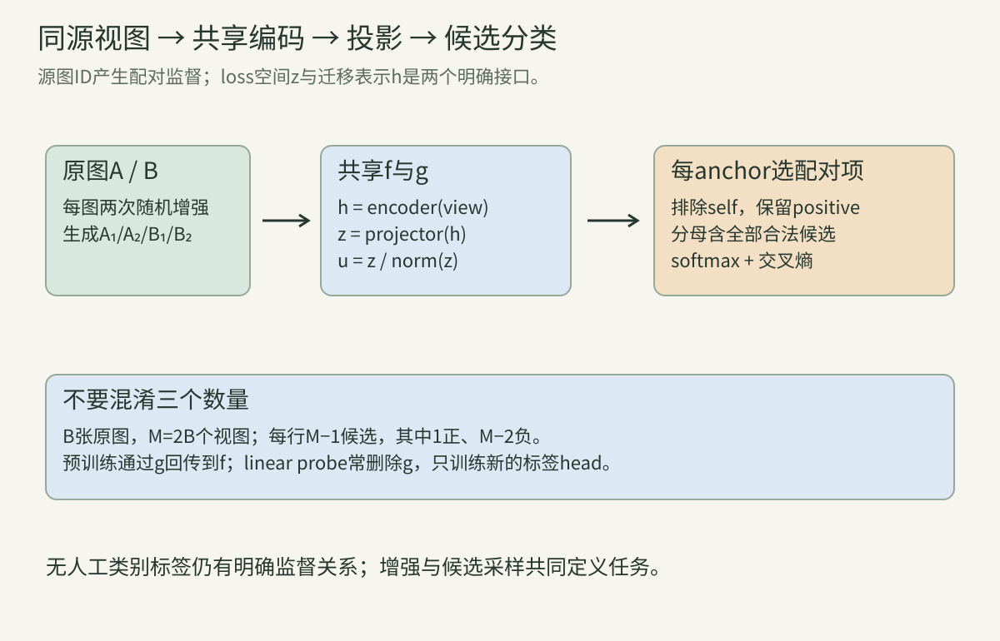
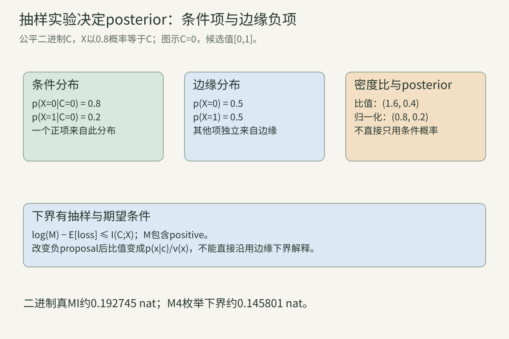
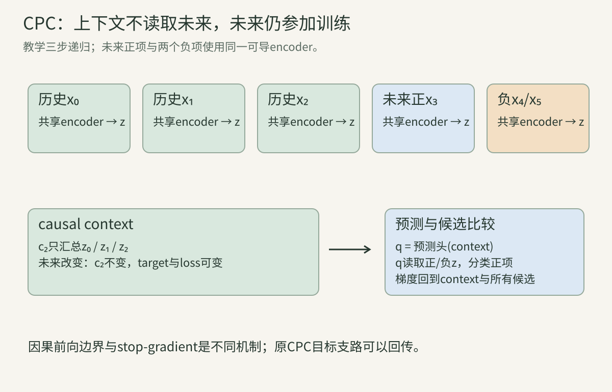
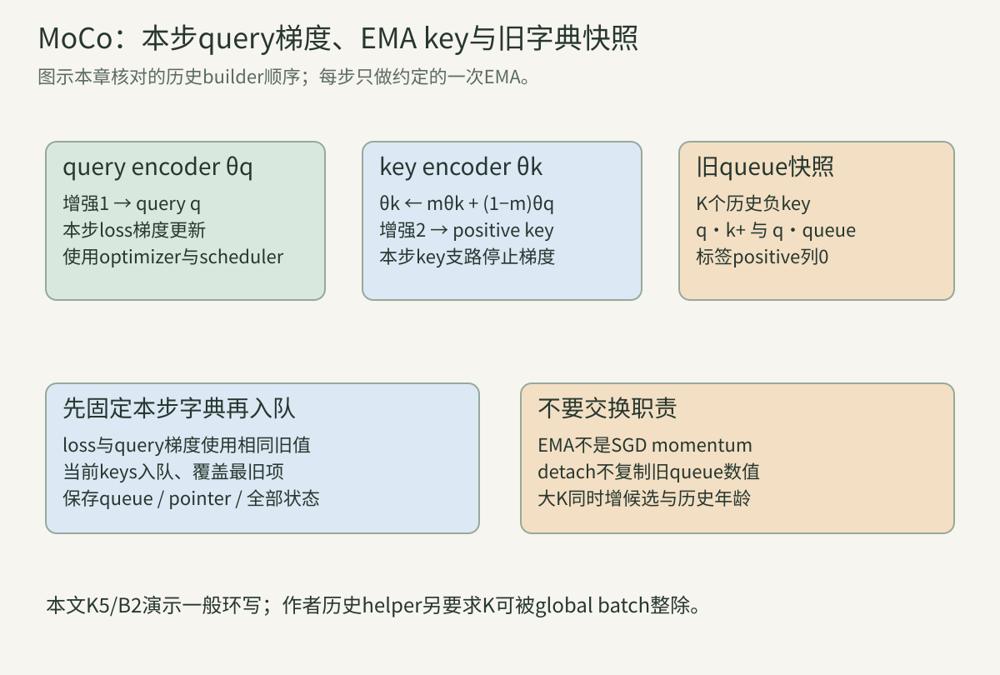

> 没有人工类别标签，仍需要明确的训练信号。本讲从“一组候选里找到配对项”出发，把采样、概率、梯度、编码器、队列、增强和评估连起来。所有教学矩阵都给具体含义；四份程序核对数学与状态，不冒充论文完整训练或精度复现。

## 一、训练信号从哪里来？

### 1. 自监督并非没有监督

监督分类输入图片x及人工标签y，用网络预测y；自监督用数据自己的结构构造目标。例如同一图两次随机增强属于同一实例，视频中前一段与后一段具有时间关系，遮住的区域可以由其他区域预测。

这些关系仍形成监督，区别在于不必逐图片标注类别。算法设计者决定什么关系值得保留、什么变化应忽略；训练数据、预处理与采样也定义目标。模型不会仅因看到大量无标签图而自动获得所有语义。

本章聚焦对比目标：让预定正配对比其他候选更容易匹配。第17讲讲无显式负样本，第18讲讲掩码重建；这些训练目标不按“有没有标签”就变成同一个公式。

### 2. 编码器、表征与投影头分别负责什么？

输入$x\in\mathbb R^{H\times W\times C}$，编码器$f_\theta$输出$h\in\mathbb R^{D_h}$；投影头$g_\phi$将h映到$z\in\mathbb R^{D_z}$。对比空间常再归一化成$u=z/\|z\|_2$，用u比较相似度。

h可以是CNN全局池化、ViT的CLS或其他明确定义的接口；g可以是线性或MLP。图像encoder内部位置、patch与attention仍依前面章节计算，对比损失不取代骨干结构。

预训练只在z/u计算loss，梯度仍经g传到f。迁移时常取h并移除g，所以投影头不是“无用的额外层”：它参与预训练，可承接对增强特定的不变性。是否保留哪个层，需按任务评价。

### 3. Anchor、positive和negative是角色，不是类别名称

anchor是发起一次比较的向量；positive是按训练规则与它相关的候选；negative是分母中其余候选。图像实例学习常把同源图两视图设正，其余来源设负。

一张图可在一行做anchor，在别人的行做negative。角色由当前损失行与来源决定，不是这张图永远“负面”。负候选不必语义不同；同类不同照片也会被实例规则当负。

CPC的正项来自未来观测与上下文的联合关系，和“同一图片两增强”不同。对比学习名称只说明比较机制，正配对的具体含义仍须分别定义。

### 4. 一个batch含多少原图、视图和候选？

设B张原图，每图两视图，得到M=2B个向量。一次anchor排除自己的行，候选数M−1，其中正项1、负项M−2。分母包含positive；“负样本数”与“候选总数”相差1。

MoCo另取K个历史负key，加当前正key，候选数K+1；K可以远大于本步原图数B。CPC通用公式中的M也指包含正项的候选总数，不机械等于batch。

同字母N在不同论文里可能指原图数、负项数或候选总数。读公式先写轴语义，本章尽量用B/M/K区分，避免把$\log M$下界里的M误换为只计负项的K。

### 算例A：两图双视图的完整角色表

两原图A/B，交错排列$[A_1,A_2,B_1,B_2]$。四行正配对分别1、0、3、2；每行候选3项、负项2项。第0行排除自己，只看$A_2,B_1,B_2$。

第0行里$B_1$是负项；第2行里$B_1$自身是anchor，需要排除self，正项为$B_2$。所以不能全矩阵删除“负样本行”。若换成分组排列$[A_1,B_1,A_2,B_2]$，正索引变2、3、0、1，需要同步修改。

### 5. 相似度是可学习表示上的比较规则

点积$z_i^Tz_j$同时受方向与长度影响；余弦相似度$u_i^Tu_j$仅比较归一化方向。单位向量余弦范围[−1,1]，其数值不是概率，需经过候选集合上的softmax。

距离也可作为分数，如$-\|u_i-u_j\|^2$。单位向量有$\|u_i-u_j\|^2=2-2u_i^Tu_j$，固定一行的常数−2可在softmax抵消，但系数2会改变有效温度。

不同score不一定相同目标。带学习bilinear矩阵$q^TWk$可改变方向比较；不归一化时无限扩大向量长度可能放大logit。报告目标时保存score、norm、温度、维度与候选集合。

## 二、InfoNCE的概率解释与完整梯度

### 6. 从候选分类写出InfoNCE

一行有正项索引p、候选j=0到M−1，原始分数$s_j$，温度$\tau>0$。定义logit$a_j=s_j/\tau$，概率与loss：

$$
P_j=\frac{e^{a_j}}{\sum_r e^{a_r}},\qquad
\ell=-\log P_p=-\frac{s_p}{\tau}+\log\sum_j e^{s_j/\tau}.
$$

它是M类交叉熵，只是“类”是本次候选位置，不是固定猫/狗类别。候选集合随batch/队列改变，位置标签p也随序列排列改变；保存labels不能只存语义类ID。

positive同时在分子与分母。删掉分母positive会形成另一目标，loss可能为负，也不再是这里的分类负对数概率。很多“InfoNCE公式”错误从这一步开始。

### 7. 稳定log-sum-exp与精度

取$m=\max_j a_j$，$\log\sum_j e^{a_j}=m+\log\sum_j e^{a_j-m}$。所有指数参数不大于0，避免大正数overflow；概率也由减max后的指数归一化。

应直接用log-sum-exp算loss，不先得到可能下溢为0的概率再取log。低精度下−∞和有限大负mask的行为不同；无合法候选行须明确处理，不能让全−∞行产生NaN。

减max只是数值方法，不改变softmax概率。程序有限差分也需合适步长与浮点精度，不能用float16微小差分误差宣称解析梯度错误。

### 算例B：一正两负的手算

分数$(1,0,-1)$、正项第0、τ1，指数比例$e:1:e^{-1}$，概率约$(0.665241,0.244728,0.090031)$，loss约0.407606。

τ0.5时logits$(2,0,-2)$，正概率约0.866813、loss0.142932。这里正项最高，低温更确定；若某负项分数更高，低温也会更确定地选错，温度小不保证loss下降。

### 8. 对分数的梯度怎样产生吸引与排斥？

交叉熵对logit为$P_j-\mathbf1[j=p]$，再乘$\partial a_j/\partial s_j=1/\tau$：

$$
\frac{\partial\ell}{\partial s_j}
=\frac{P_j-\mathbf1[j=p]}{\tau}.
$$

正项梯度负或0，下降方向提高其分数；负项梯度正，下降方向降低其分数。一个负项当前概率越大，对该分数的梯度通常越大，因此softmax自然强调高分负项。

“吸引/排斥”在这里首先是分数变化意图。实际参数共享、归一化、多个loss行相互作用，更新之后不保证每个距离都同时按该意图变化；不能把分数导数当独立拉动每个样本的物理力。

### 算例C：梯度总和与平移不变

算例Bτ1，分数梯度约$(−0.334759,0.244728,0.090031)$，总和0。给所有分数加同一个常数，概率不变，对那个公共偏移的梯度也0。

τ0.5时先用新概率，再除0.5，不能仅将τ1的旧梯度乘2。因为温度同时改变概率分布与链式系数，两方面都要算。

### 9. 对query/key的梯度与字典是否可导

令$s_j=q^Tk_j$，则$G_q=\sum_j(P_j-\mathbf1[j=p])k_j/\tau$；若key可导，$G_{k_j}=(P_j-\mathbf1[j=p])q/\tau$。

SimCLR双方都由共享encoder生成，query路径和被别人读取的candidate路径都回传。MoCo当步key/队列stop-gradient，仅query路径回传到可训练queryencoder；score仍依赖key数值，冻结不等于删除它们。

对可导keys漏掉candidate梯度会更换优化过程。给MoCo的旧队列特征强行回传则不存在原历史计算图，不能靠一个requires_grad标记自动恢复几百步前的encoder激活。

### 10. L2归一化的梯度保留什么方向？

非零z，$u=z/r,r=\|z\|$，上游$G_u$：

$$
G_z=\frac{1}{r}(I-uu^T)G_u
=\frac{G_u-u(u^TG_u)}{r}.
$$

$u^TG_z=0$，梯度在单位球面的切向；改变纯长度不会改变余弦。较小r会放大该导数，因此零向量、epsilon和低精度需处理。实际实现通常对norm下界或平方和加epsilon，导数应按具体函数分段核对。

本章程序所有r严格非零，核查上式；它不覆盖零点。单位向量仍可整体坍塌到同一方向，norm1不保证跨样本信息丰富。

### 算例D：归一化反传手算

z=(3,4)，r5，u=(0.6,0.8)，上游g=(1,0)。$u^Tg=0.6$，去径向后$(1,0)-(0.36,0.48)=(0.64,-0.48)$，除5得$(0.128,-0.096)$。

与u点积$0.0768-0.0768=0$；若忘记$uu^Tg$，直接g/5=(0.2,0)会错误地产生径向梯度。两条路径同shape不说明导数正确。

### 11. 温度的梯度与困难样本

若τ可训练，固定分数下：

$$
\frac{\partial\ell}{\partial\tau}
=\frac{s_p-\sum_jP_js_j}{\tau^2}.
$$

τ控制分布集中程度。正项高于概率加权平均时，该导数正，梯度下降倾向降低τ；正项低于平均时可能反向。约束τ正可使用$\tau=e^\alpha$，对α的梯度再乘τ，并考虑尺度上限。

经典配方通常把τ设超参数，不按这个导数训练。解释原方法时不能把可学习温度无声加进去；本章差分τ只是核查函数。低温可能强化假负样本和异常高分的影响。

### 算例E：低温放大一个假负项

分数$[0.8,0.9,0]$，第0项正，第1项语义相近却被规则当负。τ1/0.5/0.1的正概率约0.3915/0.4127/0.2689，假负分数梯度约0.4326/1.0080/7.3099。

中间温度的正概率可以先上升再下降，不是简单单调规律；最后更小温度把0.9误负高度放大。程序二输出这些数，说明应连采样与温度一起分析。

### 12. 多个positive不能只用“除以正项数”含糊处理

有正集合$P_i$，一种目标是逐正项平均$-\frac1{|P_i|}\sum_{p\in P_i}\log\frac{e^{a_{ip}}}{\sum_{j\ne i}e^{a_{ij}}}$；另一种是$-\log\frac{\sum_{p\in P_i}e^{a_{ip}}}{\sum_{j\ne i}e^{a_{ij}}}$。

第一种要求每个positive都在分布中得到权重，目标均匀分配在正项上；第二种只要求正集合总质量大，可能集中在一个容易positive。两者的梯度不同，不能统称“多正InfoNCE”而省略定义。

监督对比可用类别构造多个正项，但此时使用了类别监督，不能与无人工标签实例对比当成同样信息预算。多模态重复caption/同内容视频也会出现多正关系，需要明确标注政策。

## 三、密度比、互信息与可以证明的边界

### 13. 候选抽样实验先于loss名字

给定上下文C=c，随机均匀选择正索引D∈{0,…,M−1}。正项$X_D\sim p(x|c)$，其他候选独立从边缘$p(x)$抽取。这里条件独立、边缘分布及D均匀是明确假设。

这构造“哪个候选来自与c有关的分布”的分类任务。真负项来自p(x)，不需要语义一定错；它可能偶然与positive相同。若改为同视频采负、困难采样或按类别过滤，采样实验已经改变。

CPC使这个分类问题与未来潜变量预测连接。下面先推一般抽样数学，再讲实际模型；理论边缘负项不能与任意历史队列直接画等号。

### 14. 用贝叶斯公式推最优posterior

给候选$x_0,…,x_{M-1}$，D=i的联合权重为$p(x_i|c)\prod_{j\ne i}p(x_j)$。所有i共享的$\prod_jp(x_j)$约去，得到：

$$
p(D=i|c,X)=\frac{\rho(x_i,c)}{\sum_j\rho(x_j,c)},\qquad
\rho(x,c)=\frac{p(x|c)}{p(x)}.
$$

最优positive score应表达密度比，或logit表达$\log\rho$加一行共同常数；softmax只识别相对比例。模型函数族有限、数据有限、优化不完全时，不保证学到真密度比。

密度比不等于$p(x|c)$本身。常见但对c无信息的x可能条件概率高，却边缘也高；除以边缘才能表达“相对平常来说因c更可能多少”。

### 算例F：平衡二进制的posterior

C为公平0/1，X以0.8概率等于C，所以边缘$p(X=0)=p(X=1)=0.5$。c0时两个候选[0,1]密度比[1.6,0.4]，posterior[0.8,0.2]。

如果两个候选都0，密度比相同，只能各0.5；来源身份无法由相同观测区分。模型并非看到一个“同语义负项”就一定能把它推开，同时保持完全相同特征。

### 15. 负项改从proposal抽，最优比值也改

若负项来自$\nu(x)$，同样推导得到$p(x|c)/\nu(x)$。只有$\nu=p(x)$时才恢复边缘密度比。困难负采样、去重、队列与当前encoder分布都影响这个条件。

若proposal还依c，例如从同场景或邻帧采负，需重新写条件抽样分布。一个保持InfoNCE外形的loss不自动具有完全相同的互信息解释；损失可用于训练，但理论结论要保留原假设。

为纠正偏采样有时用importance weighting，不过权重与方差、安全下界等另有条件。不能把某个经验过滤规则称作“无偏互信息估计”而不推导新的实验。

### 算例G：同一候选，proposal变化导致最优答案不同

沿算例F的c0，改负proposal$\nu(0)=0.8,\nu(1)=0.2$，条件与proposal相同。候选[0,1]比值变[1,1]，posterior各0.5。

若仍错用边缘比[1.6,0.4]，会预测[0.8,0.2]，并非这个抽样实验的最优分类器。样本值没有变，改变的是候选生成机制。

### 16. 互信息是什么，单位是什么？

互信息$I(C;X)=D_{KL}(p(c,x)\|p(c)p(x))=E_{p(c,x)}\log[p(x|c)/p(x)]$，衡量知道C后X的分布与原边缘有多少差异。自然对数用nat，除$\log2$变bit。

独立时密度比1、MI0；共享信息可来自语义，也可来自背景、颜色、相机标记、样本ID和泄漏。最大化某个MI下界不等于自动最大化“人类想要的语义”。

学到的feature也不是对原始图全部信息的无损保存。通过确定函数的表示通常不能增加关于原变量的真实信息；对比目标选择哪些可比较结构容易被保留，增强决定被要求忽略哪些变化。

### 17. 严格推导InfoNCE的互信息下界

沿第13节抽样，定义实际联合分布P(D,C,X)，参考分布$P_0(D,C,X)=M^{-1}p(c)\prod_jp(x_j)$。参考分布中D与候选/上下文独立，所有X独立于C。

由于实际分布只有正项依C，按期望直接展开：$D_{KL}(P\|P_0)=I(C;X_{\rm pos})$。再按D的条件分布分解同一个KL：

$$
I(C;X_{\rm pos})=I(D;C,X)
+D_{KL}(P(C,X)\|p(c)\prod_jp(x_j))
\ge I(D;C,X).
$$

D均匀，故$I(D;C,X)=\log M-H(D|C,X)$。任意模型posterior的期望交叉熵$L\ge H(D|C,X)$，因为两者差是平均条件KL，于是：

$$
\log M-L\le I(D;C,X)\le I(C;X_{\rm pos}).
$$

这是包含抽样假设与期望的证明，不把一个mini-batch的loss数值当真实MI。经验损失波动、过拟合或改变proposal都需另外考虑。

### 18. 下界为何受候选数限制？

非负loss给$\log M-L\le\log M$。例如M4，最大只能1.386294nat；变量真实MI可远大于这个值，估计器仍饱和。扩大候选可以提高上限，却同时增加计算与假负机会。

当表示已经足以找到positive，继续减少loss未必对应语义线性可分性同步提高。下界数值还随M改变，不同M的raw loss不可直接排序表示质量。

小样本经验$\log M-\hat L$可能为负，只是弱下界，无需把负值解释为“负互信息”；真实MI非负。训练loss很低也可能靠泄漏或样本记忆，验证需要独立数据与迁移任务。

### 算例H：枚举抽样而非只看一次batch

二进制例真实MI$0.8\log1.6+0.2\log0.4\approx0.192745$nat。最优score下枚举全部抽样，M2的期望loss0.596775，下界0.096372；M4期望loss1.240493，下界0.145801。

M增加后raw loss反而上升，但下界更接近真MI。这说明候选越多的目标不该仅按loss绝对数判断更差。程序一还计算剩余KL，逐项核对上述分解，M6下界约0.161855。

### 19. 坍塌是丢失样本差异，不等于只有loss零

若所有单位向量相同，每行所有候选分数相同，M−1候选的SimCLR loss为$\log(M-1)$。它不是优良匹配，但在完全对称配置下梯度可恰好为0。

“有负样本就从数学上排除任何坍塌驻点”过强。负对比使非坍塌解通常有更好的区分目标，但具体优化、网络、增强与对称性还影响能否逃离。检查loss之外还需表示方差、协方差谱、近邻与下游表现。

也可有部分坍塌：只剩很低维、部分通道常数、特征靠背景捷径。单位范数与非零feature不能排除这些情形。第17讲将进一步推导方差/协方差正则和stop-gradient机制。

### 20. 对齐与分散可解释，但不能替代完整目标

对齐表示positive趋近；分散表示不同实例在表示空间中区分开。若只对齐，所有样本同向可满足；若只分散，配对语义可能丢失。softmax对比同时受到两者约束。

这个几何描述依赖score与归一化。不能由二维可视化中几个点分开就证明高维均匀、任务有效或鲁棒性；降维算法也会改变距离。

评价应将真实表示统计、近邻语义、任务分层和负样本关系结合。密度比与几何直觉是理解工具，最终目标由完整采样与loss定义。

## 四、CPC：上下文预测未来潜变量

### 21. CPC的三个模块与时间方向

[原始CPC论文](https://arxiv.org/abs/1807.03748)连接编码$z_t=g_{enc}(x_t)$、自回归上下文$c_t=g_{ar}(z_{\le t})$与未来潜变量对比。上下文只能读取到t，未来正项来自t+k。

这里“预测未来”不必生成原始像素波形；模型根据上下文给未来候选打分。对视觉可把图像行序列当预测顺序，但这个空间顺序是任务设计，不表示静态图片有真实时间。

编码器提取局部特征，上下文汇集已见结构，score区分与上下文相关的未来候选。若上下文已经含未来目标，网络可以走复制捷径，学习信号含义就改变。

### 22. Bilinear预测头为何按步长区分？

常用正值score$F_k(z_{t+k},c_t)=\exp(z_{t+k}^TW_kc_t)$，$W_k\in\mathbb R^{D_z\times D_c}$。它先把context映到目标特征空间，再点积候选；exp保证密度比score正，实际实现可直接用其logit。

不同k可有不同W，因为近一步与远多步的可预测结构不同。维度相同不代表内容关系相同；共享W是另一设计。损失通常对多个有效时间/空间位置和预测步长求平均，需定义边界与reduction。

程序四用单步的简化线性预测与三步tanh递归上下文，完整反传；不伪装为论文原PixelCNN、ResNet和训练配置。

### 23. 自回归约束要覆盖整个计算图

causal不仅是最后attention有三角mask。若encoder本身在时间上使用未来卷积、双向token混合或跨整序列归一化，上下文输入z可能已包含未来。

空间预测同样需要审计感受野、crop重叠和padding。局部patch重叠会使上下文和target共享像素，这不必使任务毫无意义，但可增加低级匹配线索，必须识别其监督结构。

对因果模型，改变未来观测应不改变当前context；target特征和loss仍可变。这个前向隔离不等于targetencoder没有梯度，原CPC目标与MoCo的EMA停止支路不同。

### 算例I：重叠patch与图像行预测

256宽图用64宽crop、stride32，位置数$\lfloor(256-64)/32\rfloor+1=7$，二维49块。相邻块横向共享32像素，即一半宽度，不是ViT的非重叠P16切块。

假设context读前3行，预测第4行，那么第4行不能经上下文自回归模块提前混进c。重叠区域仍可能带共同纹理，归纳偏置与任务难度都应如实记录。

### 24. 原视觉CPC路线与迁移接口

原视觉实验用7×7重叠局部crop网格，经ResNet-v2-101得到每块1024维表示，再用自回归空间模块从上到下预测后续行；线性评价取全网格池化表示。此路线不同于全图ViT一次生成patch。

读这一架构应分开局部encoder、context与评价feature：预训练存在context，不表示下游一定使用context最后状态；参数量、pool与监督head也影响线性评价可比性。

本章聚焦其核心预测/对比机制，详细层数和原实验数值以论文配置为准，不用今天别的CPC实现替代原版本。核心历史作用是把潜空间预测、负采样与密度比解释连接起来。

### 25. CPC梯度同时到context和targetencoder

对一个logit$a_j=z_j^TWc$，先由交叉熵得$e_j=P_j-\mathbf1[j=p]$。有$G_c=\sum_j e_jW^Tz_j$，$G_{z_j}=e_jWc$，$G_W=\sum_j e_jz_jc^T$；若另加τ缩放，三者再除τ。

context的梯度经自回归网络传回历史z，target/negative的梯度各经encoder传回对应x。共享encoder参数接收全部支路之和；不能只训练预测头而误称encoder自监督预训练已完成。

若人为detach target，就形成不同计算图；如果实践使用那种变体，应明确写出，不能由“target”这个名字默认停止梯度。程序四对三段历史、正项和两负项全部回传。

### 26. 递归上下文的逐时间反传

教学上下文$c_t=\tanh(U^Tc_{t-1}+V^Tz_t+b)$。tanh输出梯度乘$1-c_t^2$得到preactivation梯度δ；参数梯度分别累加$c_{t-1}\delta^T,z_t\delta^T,\delta$，历史context梯度$U\delta$。

必须从最后使用的context向前递推，多个预测loss使用同一context时先汇总贡献；共享U/V在每个时间位置都被引用，所以梯度跨时间求和。截断反传、detach缓存会限制范围，是不同训练策略。

这里列向量参数布局与程序行向量矩阵一致，只是转置表示。实际GRU/PixelCNN有门和卷积，需按其真实结构反传；教学递归用于理解因果与共享链式法则。

### 算例J：未来不进context，仍收到训练梯度

程序四的三个历史输入产生context约$(0.122582,-0.013715)$，loss1.085786。改变未来正输入，context不变而loss变化；正输入梯度约$(−0.009904,−0.012278)$，两负输入也有非零梯度。

因此“不被过去读取”与“不参加反传”不同。32个输入/参数标量差分检查将两种职责同时核对，防止只测context数值却漏掉共享encoder支路。

## 五、MoCo：大字典、队列与缓慢变化的key

### 27. 负候选来自本步还是历史？

直接本步对比的负数量受batch影响；存储过去的特征可以扩展候选，同时不用保存全部历史encoder激活。存储特征的字典不等于存所有原图，更不等于一个可自动反传的长期计算图。

如果每张数据按ID保留最近一次feature，是一种memory bank；按顺序保存最近若干batch、淘汰最旧项，是queue。二者覆盖分布、年龄、更新频率和重复ID行为不同。

[MoCo](https://arxiv.org/abs/1911.05722)采用队列与动量keyencoder搭配。队列解决数量与batch解绑，动量解决历史keys由变化encoder产生的一致性问题；两个机制作用不同。

### 28. Queryencoder与keyencoder的更新规则

query参数$\theta_q$由loss反向和优化器更新；key参数以指数移动平均更新：

$$
\theta_k\leftarrow m\theta_k+(1-m)\theta_q,\qquad0\le m<1.
$$

这里m是参数EMA系数，不是SGD momentum，也不与学习率互换。m大使key变慢，缓解队列新旧表示差异，但也会延迟追随query；不能认定越接近1越好，m1甚至永久冻结。

query/key通常初始参数相同；key不通过本步loss梯度更新。BN运行统计等buffer是否也EMA，应看代码，不从参数公式推断全部状态自动平均。

### 29. 展开EMA与有效记忆长度

连续更新$\theta_{k,t}=m\theta_{k,t-1}+(1-m)\theta_{q,t}$，展开为$m^t\theta_{k,0}+(1-m)\sum_{r=1}^tm^{t-r}\theta_{q,r}$。初始值和过去query的权重都明确。

历史权重每步乘m，半衰期$h=\log(1/2)/\log m$；常用$1/(1-m)$只是数量级记忆时间，不等于全部权重恰好集中在这个长度。m0.999半衰期约692.8步。

大EMA也不能消除feature staleness。参数差影响feature的程度依网络局部Jacobian、输入和norm，旧feature还用旧数据视图；一致性是设计动机与经验性质，不是所有key绝对相同。

### 算例K：参数EMA与速度

旧key参数2、当前query参数4，m0.9得到2.2，不是3.8。固定query1、key初始0，更新10次得到$1-0.9^{10}\approx0.651322$，半衰期约6.5788步。

如果每一步query大幅跳变，相同m会有不同实际feature延迟；单个标量例子解释权重，不替代神经网络一致性测量。程序三核对上述展开与数值。

### 30. 一步loss读取当前positive与旧队列

本步两增强产生query$q_i$和positive $k_i$。每行正分数$q_i^Tk_i$，历史负分数$q_i^TQ_{:,j}$，拼成$B\times(K+1)$矩阵、除τ、标签全0，按本步B行平均CE。

队列轴通常为D×K以方便矩阵乘；batch当前key是B×D。keyencoder、positive与队列停止本步梯度，query仍通过所有分数受到它们的影响。

负key来自过去，不需要与本步某个negative新鲜生成一一对应。原MoCo式本步positive在第0列，本步其他key并未自动加入此行负集合；先算旧字典loss再入队是重要次序。

### 31. 论文伪代码与作者实现的时间索引

论文示意写本步query更新后再EMA；本次核对的历史builder在前向生成key之前EMA，使用当时query参数，计算logits以后入队，随后训练循环做backward/optimizer。这可以用跨步时间索引解释，但不能将二者机械混排成额外一次EMA。

一个明确实现约定是：步t开始有$\theta_{q,t}$与key状态，先用它做一次EMA，生成本步keys；用旧队列快照算loss，再写队列；优化器将query变成$\theta_{q,t+1}$。每步应只有约定次数的更新。

若先把当前positive入队再算分数，当前正项可能作为负项再次出现；若同一步先后两次EMA，时间常数也改变。保存checkpoint要连key、队列、pointer、optimizer与step一起保存，不能只保存query就称精确恢复。

### 32. 环形队列、指针与跨步年龄

容量K固定，用指针ptr记录下一次写入槽。入队B个key覆盖最旧B项，指针变$(ptr+B)\bmod K$；物理内存排列不一定是按年龄排序，正确年龄可由指针与写入时间恢复。

本次作者helper为简化要求K可被全局入队batch整除，然后连续切片写入；一般K/B不整除时需显式分两段跨末尾写或逐项环写。本章程序用一般K5/B2，不冒充那个限定helper。

启动期队列可填随机归一化keys；这些不是实际历史图片。另一政策只让已填槽参与loss，则早期候选数变化。记录启动方式与valid count，不能忽略warmup就假设队列第一步全部代表真实样本。

### 算例L：五槽队列四步入队

K5，每步两个ID：[0,1]、[2,3]、[4,5]、[6,7]。最后物理存储$[5,6,7,3,4]$，下一写ptr3；按时间最旧到最新$[3,4,5,6,7]$。

在第3步刚写入后，五项年龄为0、0、1、1、2步。不同槽顺序不会改变作为无位置负字典的集合，却影响后续淘汰。若保存了特征但丢pointer，恢复后会覆盖错误年龄的项。

### 33. 大队列与陈旧程度怎样一起算？

稳定、K被全局B整除，K/B批keys留在队列。生成本步loss时旧队列来自前1到K/B步，每批B项，平均年龄约$(1+K/B)/2$；刚入队后年龄约0到K/B−1，统计时间点不同。

K65536、全局B256，覆盖256批，loss前平均约128.5步。增大K扩展候选，同时更陈旧；提高m缓解表示变化，也延长key参数响应。三者不能只按一个“负样本数”描述。

特征一致性可测固定样本用当前与历史encoder的余弦、队列年龄分层loss和false negatives，但这需要真实实验。本文只演算年龄，不把EMA动机当已测一致性提升。

### 34. 为什么queue要clone并detach？

detach阻止向字典回传，但某些算子为计算query梯度仍保存key数值。若在backward前原地更新同一queue内存，保存的值可能被覆盖或触发版本检查，即使queue本身不需梯度。

作者builder用queue的独立快照作为负分数key，再更新原queue。需要的是本步loss与其反传一致地使用旧字典，而不是loss前旧值、梯度时新值。clone与detach职责不同。

本章程序用固定数据与明确快照验证，不借自动微分偶然没报错判断顺序正确。真实框架还需核对in-place语义、checkpoint重计算与分布式并发。

### 35. BN捷径与shuffle/unshuffle

BN训练态让同设备样本共享统计。若一对query/key总共享特定local batch统计，模型可能利用统计线索解决配对，而非学习迁移表示。这是跨样本信息路径，不能只看encoder权重是否共享。

MoCo的shuffle将key图跨设备重新分组，编码后unshuffle恢复与query的正确配对。它打乱的是统计分组，不改变最终positive身份。只shuffle不逆排，labels仍全0却可能接错positive。

此机制针对具体BN/分布式路径，不是所有归一化都必须shuffle。LN逐token/样本通常不同；改变norm也是改变配方，需训练对照。BN的running buffers不因no_grad自动停止更新。

### 算例M：shuffle恢复正确来源

原顺序[A,B,C,D]，排列[2,0,3,1]变[C,A,D,B]。逆排列[1,3,0,2]将编码结果恢复[A,B,C,D]，第0个query继续配A。

多设备gather需让所有rank使用同一排列，并按全局索引分发/恢复。各rank自行随机不同排列、或本地逆排代替全局逆排，shape可完全正确而语义配对错误。

### 36. MoCo v1与v2改变哪些部分？

v2保留queue/EMA路线，研究加入非线性投影头、更强增强与cosine schedule；这些改动作用于表示、数据与优化，不把MoCo变成“没有队列的SimCLR”。作者历史代码以mlp/aug-plus/cos分别开关。

读消融要看组合顺序、温度搜索、训练时长和评价任务。MLP效果可能与τ有关，延长epoch不是同预算；线性分类和检测迁移也可能给不同排序。不能把一张综合结果只归功于队列或MLP一个因素。

本章不将v2成绩复制成当前复现保证；完整来源见[原始改进说明](https://arxiv.org/abs/2003.04297)。MoCo v3及无显式负学习的后续联系在对应章节展开，不因本章提到名字就算精读完。

### 37. 只对query求梯度，不是训练两个独立优化器

对query输入和参数按第9/10节回传，key参数只在EMA步骤更新。若把key也加入同一个optimizer并接受CE梯度，改变了算法；即使初始化相同，两边更新也不再是指定慢字典。

本章程序三先生成EMA keys并固定，再对query输入/权重/bias/τ共11项做差分。差分时不能每次扰动query参数都重新生成EMA key，否则测到的函数与stop-gradient图不同。

停止梯度定义本步导数，不宣称参数在所有后续时间都与query无关。EMA是显式跨步状态更新；训练系统和数学计算图的边界要一起说明。

## 六、SimCLR：双视图、投影头与全可导候选

### 38. 一条共享encoder流水线处理两视图

每张原图独立采两次增强，得到$\tilde x_i,\tilde x'_i$，两者都经过同一f与g。共享是参数相同，不是缓存同一个前向输出；视图内容不同，表示和激活不同。

[SimCLR](https://arxiv.org/abs/2002.05709)用本步双方视图作候选，通过NT-Xent训练，迁移常取投影前h。没有MoCo式历史队列与EMA keyencoder，不应将“共享encoder”误写成教师EMA。

两视图的正关系来自源图片身份。类别标签不参与预训练positive构造；下游线性评价会使用类别标签，这是另一个阶段，需要把监督预算分开。

### 39. NT-Xent的self排除与positive索引

M=2B，单位向量$u_i$，正索引p(i)，每行：

$$
\ell_i=-\log\frac{\exp(u_i^Tu_{p(i)}/\tau)}
{\sum_{j\ne i}\exp(u_i^Tu_j/\tau)},\qquad
L=\frac1M\sum_i\ell_i.
$$

self必须排除，positive必须保留。排除对角不是排除所有同源视图；如果同时删positive，再用旧labels，任务要么无效、要么接错列。

交错排列可用p(i)=i xor1；分组排列可用$p(i)=(i+B)\bmod2B$。distributed gather后还需global offset。用源图ID、viewID检查配对比仅assert矩阵M×M更有效。

### 算例N：四单位向量的手算目标

取$A_1=A_2=(1,0)$，$B_1=B_2=(0,1)$。τ1，每行正分数1、两负分数0，正概率$e/(e+2)$，loss$\log(e+2)-1\approx0.551445$。

若错误包含self，候选出现两个分数1和两个0，正概率$e/(2e+2)$，loss約1.006409。self重复提供一个不可区分高分竞争项，目标已改变；不能认为只是多一个无害候选。

### 40. 一个embedding同时收anchor与candidate梯度

记对logit矩阵$E_{ij}=(P_{ij}-\mathbf1[j=p(i)])/M$，对角E0；$a_{ij}=u_i^Tu_j/\tau$。由于u_i在行i和列i都使用：

$$
G_{u_i}=\frac1\tau\sum_{j\ne i}(E_{ij}+E_{ji})u_j.
$$

一般$E_{ij}\ne E_{ji}$，因为两行softmax分母不同。仅保留$E_{ij}$会漏掉它被别人读取的梯度；“双向loss已平均”不自动补回一条被detach的candidate计算路径。

然后对norm、projector、encoder链式反传，共享参数将M个视图贡献相加。程序二检查全部52项，明确断言只算anchor路径与完整梯度不同。

### 41. 投影头为何不必和迁移feature同维同功能？

编码器h可能需保存下游有用的细节，而对比目标要求z在若干增强下相似。g提供额外映射自由度，可以让loss空间处理这种要求，h保持更丰富可迁移信息；这是理解动机，性能仍需对照。

线性头不能表达任意非线性关系；MLP的隐藏宽、激活、BN、层数与bias都影响计算和优化。删除g以后encoder仍已受预训练梯度影响，不等于从没用过g。

例如一个明确的教学头2048→2048 ReLU→128、两层都带bias且无BN，有$2048^2+2048+2048\times128+128=4458624$个参数；只计矩阵每视图$4456448$ MAC。线性2048→128仅262272个参数。原实现的BN/bias和投影层选择需另核对，不能把这个教学计数冒充每个SimCLR版本的精确账本。

比较h、z或中间层时保持probe容量、norm、训练数据和选择规则一致。不应看到某任务h优于z就宣布z没有任何价值，也不应将projection输出直接命名成唯一的“语义表征”。

### 42. 原配方里的大batch与长训练

原SimCLR使用双增强、ResNet骨干、MLP、归一化温度目标，并研究较大batch；大batch提供更多本步负项，也改变更新频率、梯度噪声与优化器配方。它与单纯积累小batch梯度不同。

论文主要配方包含LARS、warmup/cosine与global BN。这些属于明确实验环境，不能只复制loss到任意batch/增强/训练100步，就期待相同迁移效果。

LARS是layer-wise adaptive rate scaling。一个常见变体对一层权重w和梯度g先取$\tilde g=g+\lambda w$，用trust ratio $r=\eta\|w\|/(\|g\|+\lambda\|w\|+\epsilon)$，再令速度$v\leftarrow\mu v+\gamma r\tilde g$、更新$w\leftarrow w-v$。γ是全局学习率，η是局部信任系数，μ是优化器momentum，λ是这个变体的耦合衰减；它们与MoCo的EMA系数m分别定义。这样按参数/梯度尺度调整层步长，动机是大batch优化，不是给候选分数加权。

实际LARS还需约定零范数fallback、哪些bias/归一化参数排除adaptation或衰减、epsilon、trust ratio裁剪与momentum次序，不同代码可不同。举一个无衰减教学值：$\|w\|=10,\|g\|=2,\eta=0.001$，r约0.005；若γ0.3且无旧速度，本步梯度缩放0.0015。不能直接将原论文4.8全局学习率搬到普通SGD而忽略LARS。

后续改进和不同模型可降低对大batch的依赖。“原论文在大batch下表现好”不等于任何数据任务都必须8192；报告结论时保存版本、预算与实际实验。

### 43. 梯度累积不能自动补全跨microbatch负项

将两个microbatch分别算contrast loss再累加梯度，各自分母仅含本microbatch候选；真正大batchloss分母包含两者全部视图。log-sum-exp使二者不等价。

要保持大batch目标，可先收集全部embeddings构建联合loss，并保留或重算可导前向；这会涉及激活、缓存和共享BN状态。单纯把optimizer.step间隔拉长不能补回缺失交互。

对监督CE独立样本的常见累积等价条件，不可无条件搬到有样本间交互的目标。第15讲的编码器pack隔离同样不使对比loss变为逐图独立。

### 算例O：分开两个原图时为什么没有负例？

每个microbatch仅1张原图两视图，排self后只剩positive，概率1、loss0，无对比分散梯度。将两microbatch的0平均仍0。

真正B2联合计算有两负项，沿算例Nloss0.551445，梯度通常非零。训练脚本可正常输出loss0与参数更新步骤，但没有得到预期大batch目标。

### 44. 分布式gather要处理身份、梯度和归约

若每rank B_local，global B为全部有效原图，candidate集合与positive索引须对应global顺序。不同rank batch数量不等时，还要valid mask与正确样本权重。

可导gather必须将candidate路径的上游梯度回到生成该feature的rank；普通no-grad all_gather只传数值，会漏掉远端candidate贡献。MoCo的停止key gather与SimCLR的全可导需求不同。

DDP平均参数梯度与loss归一化需共同核对，避免多除或少除world size。最稳妥是固定小输入，比单进程联合目标与多rank得到的参数梯度；“训练曲线看起来正常”不足以确认等价。

### 45. Global BN与运行状态不能只看loss公式

BN在训练态依batch统计，改变设备分组、两视图合并方式或microbatch会改变feature。即使loss联合重建，BN前向未必等价于真实大batch。

原SimCLR使用跨设备统计缓解local BN捷径。对ViT常见LN，不一定同样依赖这条路线；但换骨干、norm和投影head一起改变多个因素，需要分别标注。

评价冻结encoder时要设eval/使用对应运行统计。如果仅requires_grad=False、仍training模式，BNbuffer会被probe数据改写，所谓冻结表征已改变。作者linear protocol的状态检查有助发现这一问题。

### 46. Loss reduction差一个系数也值得记录

本章L是M个anchor平均。作者SimCLR objective将两组视图的B行CE各自平均，然后相加，返回值是本章平均的2倍；方向比例相同，但梯度尺度与日志不同。

实际训练还加weight decay，LARS等优化对缩放不一定等价于简单学习率反倍；梯度裁剪、混合精度loss scale、Adamepsilon等也会影响解释。复现应记录reduction，而不是为对齐数值任意乘除。

程序二采用全M平均，所有正文数值与之匹配。对照作者实现时把两个平均/相加的位置写清，防止将不同尺度raw loss当成更好或更差表示。

## 七、增强、假负项、成本与评估

### 47. 增强定义哪些信息应该保持

随机crop、flip、颜色扰动、灰度与blur会生成两视图。对比目标要求同源图在这些变化下仍容易配对，实质上选择了训练不变性的范围。

如果类别依颜色、文字方向、精细纹理或左右手关系，过强颜色去除、flip/blur可能毁掉任务证据。图像级实例正配对也可能把互不重叠crop视为相同，但crop分别含不同对象。

增强不是总强度越大越好；必须保存操作次序、概率、参数分布、尺寸与随机种子。对医学/工业/文字/空间任务，应依据真实标签语义设计，并用单因素与组合消融检查。

### 48. 共同低级线索为何能成为捷径？

两crop共享同一图的背景颜色、相机噪声或水印时，模型可通过这些线索匹配实例，不必识别前景对象。强颜色/blur等可削弱某些捷径，同时可能损失任务信息。

训练目标只奖励positive比候选好，没有“必须先理解对象”的额外命令。数据去重、来源均衡、增强和迁移评价共同约束捷径；不应由loss低就推断语义能力高。

对照可改变背景但保持前景，或移除水印、跨来源评价、分层小目标任务。这些是实际能力实验，不是本文数学程序的已测结果。

### 算例P：crop同源不意味着内容相同

一图左边狗、右边路牌，视图1只裁狗、视图2只裁路牌。实例规则仍将二者positive，但局部对象语义不同；模型可能依背景或图来源完成匹配。

若下游是整图场景分类，这种关联可能有用；若是局部开放词汇检测，不一定合适。目标的合理性取决于任务接口，不能统一把不重叠crop判成“必然错误”或“必然语义学习”。

### 49. 假负样本、重复数据与语义碰撞

实例negative只是不同源ID，可能同类、同对象其他视角、重复照片或相邻视频帧。它们对下游语义是相近的，却被分数梯度要求分离，称语义假负项。

有K个独立负项，每项以概率p发生指定碰撞，至少一个概率$1-(1-p)^K$；这只是简化采样模型，真实重复与相关数据不独立。大候选扩大覆盖，也增加某类碰撞机会。

去重、多个positive、类别信息或去偏loss可缓解，但同时改变数据/监督预算与proposal。困难负挖掘可能特别放大假负，须评价有用hard negatives与语义collision各占多少。

### 算例Q：数量增加与碰撞概率

每负项独立collision概率1%，K100，至少一个约$1-0.99^{100}\approx0.633968$。K1000约0.999957。这个例子解释规模效应，不表示任意真实数据恰好1%。

完全同特征的r个负项与positive同分数且压倒其他候选时，positive概率最多约1/(r+1)，loss约$\log(r+1)$。把同一照片复制更多份不会创造新的区分信息。

### 50. 完整计算账本：encoder之外还有相似度

SimCLR M=2B、宽D，完整pairwise矩阵M×M，矩阵乘约$M^2D$ MAC；self mask不会让普通dense matmul免费跳过对角。保存float32分数需$4M^2$字节，softmax与反传还需额外空间。

MoCo每rank query B_local、K历史负项，交互约$B_{local}KD$ MAC，队列$4KD$字节；本步keyencoder仍需一次前向，query训练需前向/反传，不能只比较loss矩阵大小宣称整体速度。

分块log-sum-exp可减少保存完整矩阵，但反传需重算或保存摘要并继续读取keys。第11讲的在线softmax思想可迁移到这种候选分类，完整梯度与框架实现另需验证。

### 算例R：相似度矩阵与队列内存

SimCLR B4096、M8192、D128，矩阵67,108,864项，float32为256MiB，乘法8,589,934,592 MAC。仅这块矩阵不是整网训练显存。

MoCo K65536、D128，队列8,388,608项=32MiB；B256完整global logits256×65537约64.001MiB。分布式rank各B_local时每ranklogits更小，queue常每rank复制；通信和encoder成本仍须算。

### 51. Linear probe、fine-tuning与kNN回答不同问题

linear probe冻结encoder，用有标签训练集拟合线性head，检验指定接口的线性可分性。全量fine-tuning允许表示继续变，评估可迁移初始化和训练适应能力。kNN不学head，用有标签reference特征的近邻投票。

三者数据、优化和监督预算不同。probe表现弱不证明fine-tuning一定弱，kNN简单也不自动公平；reference数量、norm、k、投票温度与标签质量影响结果。

预训练可无类别标签，评价可有标签，两阶段需透明区分。不能把probe监督训练写成“完全无监督分类成绩”，也不能用测试集调k/温度/最佳checkpoint。

### 52. 冻结表示还需冻结运行状态与输入协议

requires_grad=False只控制参数导数；BNbuffers、dropout与随机增强仍可能改变前向。线性评价通常固定encoder为eval，head训练；head输入是h还是z、normalize与pool也要记录。

训练probe的有标签split不能混入测试标签。预训练无标签数据若含测试图片，须注明transductive设置与数据重叠，不能说无人工标签就不存在泄漏。

原图去重、near-duplicate、视频邻帧与来源泄漏会让probe成绩过于乐观。记录预训练数据来源与下游split交集，独立域迁移有助发现样本记忆。

### 算例S：kNN温度投票的手算

三近邻余弦0.9/0.8/0.7，标签A/B/B，投票温度0.1。为稳定减最大分数后权重分别为$1,e^{-1},e^{-2}$，A总1，B总约0.503215，预测A。

若用无权多数投票，B两票、A一票，预测B。二者规则不同；不能只说“kNN精度”不记录k、归一化和权重。调投票温度应使用验证集，不用测试答案。

### 53. Loss、rank与迁移分层共同诊断

监控positive/negative分数分布、候选top1、false negative、norm、各维方差和协方差特征值。训练配对top1只说明当前候选规则上的辨别，不等于下游分类top1。

在相同骨干和预算下比较linear/fine-tune/kNN，并分层评价小目标、背景改变、文字、颜色和空间关系。表示不是只有一个“好”的维度，增强可能在一个任务获益、另一个受损。

异常情况可逐步定位：配对索引错、self未mask、norm0、所有样本constant、queue刚启动、远端梯度漏、probeencoder仍train。先查机制，再做训练时长和模型规模扩展。

### 54. 公平消融需要控制候选、曝光与更新

改变batch同时改变负数量、每epoch更新步、BN统计与学习率；改变queue同时改变历史年龄。公平比较需要写明训练图片曝光、unique image、更新数、候选数、硬件时间和总计算。

若改变一个因素带来多项连带变化，设置补充对照分别隔离。增强组合有交互，MLP/温度也有交互；一个逐步添加表不能证明所有因素在任意基线上独立有效。

报告均值/波动和一致评价协议，把论文报告、复现已测、教学预测分开。本文没有执行真实预训练，所以不声称某组合达到论文ImageNet或迁移成绩。

### 案例T：一套可执行的机制验证顺序

先在固定四视图上核对positive索引、self排除、所有embedding/τ梯度；再比较单进程global目标与分布式gather参数梯度。MoCo先检查初始化、EMA次数、old queue快照、入队pointer及恢复。

随后用小真实数据查两视图是否保留任务证据，验证冻结probe状态，最后扩展训练规模与候选预算。对背景/颜色/重复数据做任务分层，不只看raw loss下降。

这是待执行真实训练流程；本章完成下面数学程序，不把这份设计写成已测模型精度。实验册会进一步连接实际数据、训练脚本与评价。

### 55. 三条路线的接口对照

| 项目 | CPC | MoCo | SimCLR |
| --- | --- | --- | --- |
| positive来源 | context与未来观测 | 同图两增强 | 同图两增强 |
| 主要比较形式 | 预测步长bilinear潜空间 | 当前query读positive/历史queue | 双视图相互读本步集合 |
| key梯度 | 原路线targetencoder可回传 | key/queue本步停止 | 所有视图candidate可回传 |
| 状态重点 | 因果context、步长与边界 | EMA、队列、pointer、BN | 全局batch、gather与BN |
| 理论审计 | 边缘负抽样与密度比 | 陈旧字典不无条件等于理论抽样 | 双视图及实际负分布 |

表格概括本讲讨论版本，不抹平后续变体。框架、数据、优化、encoder和评估都需同时核对；它们不是仅替换一个loss名字的三份同模型。

### 56. 从对比学习衔接后续视觉基础模型

下一章讨论BYOL/SimSiam等如何在没有显式负字典的情况下训练，以及方差/协方差约束。然后进入掩码建模、自蒸馏和大规模稠密表示；图文双塔还会把positive扩展为跨模态配对。

本章已完成正负采样、score、梯度与三条核心机制，不把后续名字出现当成其正文完成。阅读新的方法时沿“目标关系 → 候选集合 → 更新支路 → 数据与评估”逐项追踪即可。

特别保留本章三个边界：InfoNCE下界有抽样假设，EMA并非梯度训练keyencoder，batch大不等于只增加负样本。它们在后续论文中仍是有效的审计入口。

## 八、四组完整可运行核查

### 57. 实验一：枚举密度比与互信息下界

二进制context/observation、相关概率0.8，枚举M2/3/4/6候选的所有组合。计算最优posterior、期望loss、下界和剩余KL，核对第17节分解；再改变proposal说明posterior必须改变。

~~~python
import math,itertools

# Binary context and observation: a balanced bit copied with probability 0.8.
def conditional(x,c): return .8 if x==c else .2
def rho(x,c): return conditional(x,c)/.5
MI=.8*math.log(1.6)+.2*math.log(.4)
print('binary_true_MI_nats',MI)
for M in [2,3,4,6]:
    loss=0.; index_information=0.; reference_kl=0.
    for c in [0,1]:
        for xs in itertools.product([0,1],repeat=M):
            # Positive at index0 for loss: symmetry gives the uniform-index expectation.
            p0=.5*conditional(xs[0],c)*(.5**(M-1))
            weights=[rho(x,c) for x in xs]; total=sum(weights)
            loss+=p0*(-math.log(weights[0]/total))
            # Full experiment marginal after summing a uniform latent positive index D.
            base=.5*(.5**M)
            marg=base*total/M
            reference_kl+=marg*math.log(marg/base)
            for d in range(M):
                p_joint=base*weights[d]/M
                post=weights[d]/total
                index_information+=p_joint*math.log(post*M)
    bound=math.log(M)-loss
    assert abs(bound-index_information)<1e-12
    assert abs(MI-bound-reference_kl)<1e-12
    assert -1e-12<=bound<=MI+1e-12
    print('M',M,'expected_loss',loss,'bound',bound,'residual_KL',reference_kl)
# General proposal ν differs from marginal: posterior requires conditional/ν.
c=0; xs=[0,1]; proposal={0:.8,1:.2}
right=[conditional(x,c)/proposal[x] for x in xs]
wrong=[rho(x,c) for x in xs]
assert abs(right[0]/sum(right)-.5)<1e-12
assert abs(wrong[0]/sum(wrong)-.8)<1e-12
print('proposal_correct_posterior',.5,'incorrect_marginal_posterior',.8)
# A repeated negative with the same semantic content may be indistinguishable.
for duplicates in [1,3,7]:
    tied_loss=math.log(duplicates+1)
    print('positive_plus_identical_negatives',duplicates+1,'loss',tied_loss)
print('posterior, exact expected MI-bound and proposal checks passed')
~~~

这是真实离散分布上的精确枚举，无需训练模型估MI。重复负项例子核查分类歧义；不能由这个理想分布把任意真实queue loss宣称无偏MI估计。

### 58. 实验二：SimCLR完整共享encoder与投影反传

四个3维输入视图，encoder为3→4的tanh层，projector为4→3 ReLU→2，最后L2归一化。按交错来源配对、self排除，平均四行NT-Xent；对输入、三矩阵、三bias与τ共52标量核对。

~~~python
import math

def dot(a,b): return sum(x*y for x,y in zip(a,b))
def zeros(n,d): return [[0.]*d for _ in range(n)]
def affine(x,w,b): return [[dot(row,[w[k][j] for k in range(len(w))])+b[j] for j in range(len(b))] for row in x]
def back_affine(x,w,g):
    gx=[[dot(rowg,w[k]) for k in range(len(w))] for rowg in g]
    gw=[[sum(x[i][k]*g[i][j] for i in range(len(x))) for j in range(len(w[0]))] for k in range(len(w))]
    gb=[sum(row[j] for row in g) for j in range(len(w[0]))]
    return gx,gw,gb

def contrast(u,tau):
    M=len(u); partner=[1,0,3,2]; E=zeros(M,M); loss=0.; gtau=0.
    for i in range(M):
        ids=[j for j in range(M) if j!=i]
        logits=[dot(u[i],u[j])/tau for j in ids]; mx=max(logits)
        logden=mx+math.log(sum(math.exp(v-mx) for v in logits))
        loss+=(logden-dot(u[i],u[partner[i]])/tau)/M
        for j,v in zip(ids,logits):
            e=(math.exp(v-logden)-(j==partner[i]))/M
            E[i][j]=e; gtau-=e*dot(u[i],u[j])/tau**2
    gu=zeros(M,len(u[0])); anchor_only=zeros(M,len(u[0]))
    for i in range(M):
        for j in range(M):
            for d in range(len(u[0])):
                gu[i][d]+=(E[i][j]+E[j][i])*u[j][d]/tau
                anchor_only[i][d]+=E[i][j]*u[j][d]/tau
    return loss,gu,gtau,anchor_only

x=[[.4,-.2,.7],[.5,-.1,.6],[-.3,.8,.2],[-.2,.7,.1]]
w1=[[.2,-.3,.1,.4],[-.1,.2,.3,-.2],[.3,.1,-.4,.2]]; b1=[.1,-.1,.05,.2]
w2=[[.2,-.1,.3],[.1,.2,-.2],[-.3,.1,.2],[.2,.3,.1]]; b2=[.7,.8,.6]
w3=[[.4,-.2],[-.1,.3],[.2,.5]]; b3=[.1,-.2]; tau=[.6]
def network():
    a=affine(x,w1,b1); h=[[math.tanh(v) for v in row] for row in a]
    b=affine(h,w2,b2); r=[[max(0.,v) for v in row] for row in b]
    assert min(abs(v) for row in b for v in row)>.1 # Away from a ReLU kink.
    z=affine(r,w3,b3); norms=[math.sqrt(dot(row,row)) for row in z]
    u=[[v/n for v in row] for row,n in zip(z,norms)]
    return h,b,r,z,norms,u

def objective(): return contrast(network()[-1],tau[0])[0]
h,b,r,z,norms,u=network(); loss,gu,gtau,anchor_only=contrast(u,tau[0])
gz=[[(g[d]-ui[d]*dot(ui,g))/n for d in range(2)] for ui,g,n in zip(u,gu,norms)]
gr,gw3,gb3=back_affine(r,w3,gz)
gb=[[v*(bj>0) for v,bj in zip(row,br)] for row,br in zip(gr,b)]
gh,gw2,gb2=back_affine(h,w2,gb)
ga=[[g*(1-v*v) for g,v in zip(row,hr)] for row,hr in zip(gh,h)]
gx,gw1,gb1=back_affine(x,w1,ga)
checks=[]
for array,grad in [(x,gx),(w1,gw1),(w2,gw2),(w3,gw3)]:
    checks.extend((row,j,g[j]) for row,g in zip(array,grad) for j in range(len(row)))
for vec,grad in [(b1,gb1),(b2,gb2),(b3,gb3),(tau,[gtau])]:
    checks.extend((vec,j,g) for j,g in enumerate(grad))
errors=[];eps=1e-5
for a,j,g in checks:
    old=a[j];a[j]=old+eps;plus=objective();a[j]=old-eps;minus=objective();a[j]=old
    errors.append(abs((plus-minus)/(2*eps)-g))
assert max(errors)<1e-7
assert max(abs(a-b) for r1,r2 in zip(gu,anchor_only) for a,b in zip(r1,r2))>1e-4
print('NT_Xent',loss,'checked_scalars',len(checks),'max_gradient_error',max(errors),'temperature_gradient',gtau)
print('candidate_path_required',True)
# Constant normalized embeddings: value log(M-1), gradient0 for this symmetric objective.
collapsed=[[1.,0.]]*4;lc,gc,tc,_=contrast(collapsed,.5)
assert abs(lc-math.log(3))<1e-12 and max(abs(v) for row in gc for v in row)<1e-12
assert abs(tc)<1e-12
print('collapsed_loss',lc,'collapsed_unit_gradient_zero',True)
# Query with one high false-negative score: lowering tau concentrates repulsion.
for t in [1.,.5,.1]:
    scores=[.8,.9,0.]; vals=[math.exp(s/t) for s in scores]; probs=[v/sum(vals) for v in vals]
    print('tau',t,'positive_probability',probs[0],'false_negative_gradient',probs[1]/t)
print('shared encoder, projector, normalization and temperature checks passed')
~~~

本机loss约1.095852，最大梯度误差约$4.74\times10^{-11}$。程序包含anchor/candidate双支路、norm与τ导数，另验证对称坍塌驻点和假负温度例子；教学MLP省略BN，不是原ResNet训练。

### 59. 实验三：MoCo停止字典、EMA与一般环形队列

两query、宽2，先EMA一次生成固定positive，历史keys四项；差分11项query输入/参数/τ，检查一次query SGD下降而key状态未由梯度改变。然后以K5/B2演示跨末尾环写，核查来源年龄与shuffle逆序。

~~~python
import math,copy

def dot(a,b): return sum(x*y for x,y in zip(a,b))
def norm(x): return math.sqrt(dot(x,x))
def normalize(x): return [v/norm(x) for v in x]
def affine(row,w,b): return [sum(row[k]*w[k][j] for k in range(2))+b[j] for j in range(2)]
def encode(rows,w,b): return [normalize(affine(row,w,b)) for row in rows]
# Apply EMA once outside the loss graph; current key features are stop-gradient data.
wq=[[.4,.2],[-.1,.5]];bq=[.1,-.2];wk=[[.3,.1],[.2,.4]];bk=[.05,-.1]
m=.9;wk=[[m*a+(1-m)*b for a,b in zip(ra,rb)] for ra,rb in zip(wk,wq)];bk=[m*a+(1-m)*b for a,b in zip(bk,bq)]
x=[[1.,.3],[-.2,.8]];xkey=[[.9,.4],[-.1,.7]]
kpos=encode(xkey,wk,bk);neg=[normalize(v) for v in [[1.,0.],[0.,1.],[-1.,0.],[0.,-1.]]];tau=[.5]
def objective(back=False):
    raw=[affine(row,wq,bq) for row in x];q=[normalize(v) for v in raw]
    graw=[];loss=0.;gt=0.
    for i,row in enumerate(q):
        keys=[kpos[i]]+neg; s=[dot(row,k)/tau[0] for k in keys];mx=max(s)
        den=mx+math.log(sum(math.exp(v-mx) for v in s));loss+=(den-s[0])/2
        e=[(math.exp(v-den)-(j==0))/2 for j,v in enumerate(s)]
        g=[sum(ej*kj[d] for ej,kj in zip(e,keys))/tau[0] for d in range(2)]
        graw.append([(g[d]-row[d]*dot(row,g))/norm(raw[i]) for d in range(2)])
        gt-=sum(ej*dot(row,kj) for ej,kj in zip(e,keys))/tau[0]**2
    if not back:return loss
    gx=[[sum(gr[j]*wq[d][j] for j in range(2)) for d in range(2)] for gr in graw]
    gw=[[sum(x[i][d]*graw[i][j] for i in range(2)) for j in range(2)] for d in range(2)]
    gb=[sum(gr[j] for gr in graw) for j in range(2)]
    return loss,gx,gw,gb,gt
oldloss,gx,gw,gb,gt=objective(True);checks=[]
for a,g in [(x,gx),(wq,gw)]:checks.extend((row,j,rg[j]) for row,rg in zip(a,g) for j in range(2))
for a,g in [(bq,gb),(tau,[gt])]:checks.extend((a,j,v) for j,v in enumerate(g))
eps=1e-5;errors=[]
for a,j,g in checks:
    v=a[j];a[j]=v+eps;pl=objective();a[j]=v-eps;mi=objective();a[j]=v;errors.append(abs((pl-mi)/(2*eps)-g))
assert max(errors)<1e-7
key_snapshot=copy.deepcopy((wk,bk,kpos,neg))
for i in range(2):
    for j in range(2):wq[i][j]-=.05*gw[i][j]
for j in range(2):bq[j]-=.05*gb[j]
assert objective()<oldloss and key_snapshot==(wk,bk,kpos,neg)
print('fixed_dictionary_loss',oldloss,'after_query_SGD',objective(),'checked_scalars',len(checks),'max_gradient_error',max(errors))
# A GENERAL teaching ring supporting split writes, unlike the official K%B==0 helper.
class Ring:
    def __init__(self,K):self.items=[None]*K;self.steps=[None]*K;self.ptr=0
    def enqueue(self,ids,step):
        for item in ids:
            self.items[self.ptr]=item;self.steps[self.ptr]=step;self.ptr=(self.ptr+1)%len(self.items)
    def chronological(self):
        return [self.items[(self.ptr+i)%len(self.items)] for i in range(len(self.items)) if self.items[(self.ptr+i)%len(self.items)] is not None]
r=Ring(5)
for step,ids in enumerate([[0,1],[2,3],[4,5],[6,7]]):r.enqueue(ids,step)
assert r.ptr==3 and r.chronological()==[3,4,5,6,7]
assert sorted(3-step for step in r.steps)==[0,0,1,1,2]
print('queue_storage',r.items,'next_pointer',r.ptr,'chronological',r.chronological(),'ages',sorted(3-t for t in r.steps))
perm=[2,0,3,1];old=['A','B','C','D'];shuffled=[old[i] for i in perm]
inv=[perm.index(i) for i in range(4)];assert [shuffled[i] for i in inv]==old
# EMA response to a constant1, initial0, and memory time.
ema=0.
for _ in range(10):ema=m*ema+(1-m)*1.
assert abs(ema-(1-m**10))<1e-12
print('EMA_after10',ema,'half_life_steps',math.log(.5)/math.log(m))
print('stop-gradient dictionary, EMA, queue and shuffle checks passed')
~~~

本机固定字典loss1.159977，一次query更新变0.795149，最大差分误差约$4.97\times10^{-9}$。此环形helper刻意支持一般长度，作者历史helper另要求K被global batch整除；不据此宣称完整MoCo训练脚本可以开箱运行。

### 60. 实验四：CPC因果context、预测头与共享encoder

六个2维观测，前三项递归生成context，第4项positive、后两项negative；所有观测经共享tanhencoder。对encoder、递归、bilinear预测与输入共32项完整反传，核查未来不改变context但target与negatives仍有梯度。

~~~python
import math

def dot(a,b):return sum(x*y for x,y in zip(a,b))
def mat(v,w):return [sum(v[i]*w[i][j] for i in range(2)) for j in range(2)]
def plus(a,b):return [x+y for x,y in zip(a,b)]
def outer_add(out,a,b):
    for i in range(2):
        for j in range(2):out[i][j]+=a[i]*b[j]
def zero():return [[0.,0.],[0.,0.]]
x=[[.1,.4],[.3,-.2],[.5,.1],[.4,.3],[-.6,.2],[.2,-.7]]
E=[[.3,-.2],[.1,.4]];be=[.05,-.1];U=[[.5,.1],[-.2,.4]];V=[[.2,-.3],[.4,.1]];bc=[.1,.05];W=[[.4,.2],[-.1,.3]]
def forward():
    z=[[math.tanh(v) for v in plus(mat(row,E),be)] for row in x]
    ctx=[[0.,0.]]
    for t in range(3):ctx.append([math.tanh(v) for v in plus(plus(mat(ctx[-1],U),mat(z[t],V)),bc)])
    q=mat(ctx[-1],W);keys=z[3:];logits=[dot(q,k)/.7 for k in keys];mx=max(logits)
    den=mx+math.log(sum(math.exp(s-mx) for s in logits));loss=den-logits[0]
    return loss,z,ctx,q,keys,logits,den
loss,z,ctx,q,keys,s,den=forward();e=[math.exp(v-den)-(j==0) for j,v in enumerate(s)]
gq=[sum(ej*kj[d] for ej,kj in zip(e,keys))/.7 for d in range(2)]
gz=[[0.,0.] for _ in x]
for j in range(3):gz[3+j]=[e[j]*v/.7 for v in q]
gW=zero();outer_add(gW,ctx[-1],gq);gc=[dot(gq,row) for row in W]
gU=zero();gV=zero();gbc=[0.,0.]
for t in reversed(range(3)):
    ga=[gc[d]*(1-ctx[t+1][d]**2) for d in range(2)]
    outer_add(gU,ctx[t],ga);outer_add(gV,z[t],ga)
    gbc=plus(gbc,ga);gz[t]=plus(gz[t],[dot(ga,row) for row in V]);gc=[dot(ga,row) for row in U]
gE=zero();gbe=[0.,0.];gx=[]
for i in range(6):
    ga=[gz[i][d]*(1-z[i][d]**2) for d in range(2)]
    outer_add(gE,x[i],ga);gbe=plus(gbe,ga);gx.append([dot(ga,row) for row in E])
checks=[]
for a,g in [(x,gx),(E,gE),(U,gU),(V,gV),(W,gW)]:checks.extend((row,j,rg[j]) for row,rg in zip(a,g) for j in range(2))
for a,g in [(be,gbe),(bc,gbc)]:checks.extend((a,j,v) for j,v in enumerate(g))
errors=[];eps=1e-5
for a,j,g in checks:
    v=a[j];a[j]=v+eps;pl=forward()[0];a[j]=v-eps;mi=forward()[0];a[j]=v;errors.append(abs((pl-mi)/(2*eps)-g))
assert max(errors)<1e-7
saved=ctx[-1][:];x[3][0]+=10;changed=forward();x[3][0]-=10
assert max(abs(a-b) for a,b in zip(saved,changed[2][-1]))<1e-12
assert abs(changed[0]-loss)>1e-5
assert sum(abs(v) for row in gx[:3] for v in row)>0 and sum(abs(v) for row in gx[3:] for v in row)>0
print('CPC_toy_loss',loss,'checked_scalars',len(checks),'max_gradient_error',max(errors))
print('context',saved,'positive_input_gradient',gx[3],'negative_input_gradients',gx[4:])
print('future_excluded_from_context',True,'future_target_has_encoder_gradient',True)
print('causal recurrent context, bilinear score and shared encoder BPTT passed')
~~~

本机loss1.085786，最大误差约$3.50\times10^{-11}$。模型是明确的教学递归，未运行真实图像CPC的PixelCNN/ResNet；因果前向与多支路反传通过数学小例共同确认。

## 九、二十八道练习与完整解析

### 练习1：B256的双视图SimCLR，每行有多少positive、negative与候选？

**解析：** M512个视图，self排除后511候选，其中positive1、negative510。共有512个anchor行；不能将“256张原图”当256个候选，也不能把511全称为负项。若每图更多视图，positive政策与分母又须重写。

### 练习2：分组排列[A₁,B₁,C₁,A₂,B₂,C₂]的positive索引是多少？

**解析：** 第0/1/2行配3/4/5，第3/4/5行配0/1/2，即$(i+3)\bmod6$。使用i xor1会错配A₁与B₁、C₁与A₂等，shape和CE都可能合法但训练关系错误。全局gather后还需在对应rank范围加入offset。

### 练习3：余弦分数等于0.8，positive概率就等于0.8吗？

**解析：** 不能。若候选分数[0.8,0.9,0]、τ1，正概率为$e^{0.8}/(e^{0.8}+e^{0.9}+1)\approx0.391466$。概率依分母其他候选与τ，余弦是方向相似度。增加一个候选会改变概率，即使原向量与score没变。

### 练习4：为什么positive要同时留在分母？

**解析：** 分类概率需对全部M个候选归一化，positive也是其中一个。若只有一个positive且无negative，正确prob1、loss0；删除positive后分母空，表达式无定义。多候选只对negative求和可能得到大于1的“比值”，不能当本章posterior与MI下界。

### 练习5：logits[1000,999,998]怎样稳定算loss？

**解析：** 减最大1000，指数为$[1,e^{-1},e^{-2}]$，其和约1.503215。第0项loss$\log(1+e^{-1}+e^{-2})\approx0.407606$。共同大常数抵消，不直接算$e^{1000}$；若positive第2项，则loss2.407606。输入大正值不意味着类别概率自动overflow。

### 练习6：分数[1,0,−1]、τ1，对三项的梯度是多少？

**解析：** 正项第0，概率约[0.665241,0.244728,0.090031]，梯度[−0.334759,0.244728,0.090031]。总和0表示公共偏移不影响softmax。若τ改0.5，要先重算概率再除0.5，不能只将这一组旧数乘2。

### 练习7：低温一定让loss更小吗？

**解析：** 若positive不是最高分，τ→0使错误最高negative几乎吃掉全部质量，positive概率趋0、loss发散。即使positive最高，低温也可能降低训练loss却加剧假负梯度或泛化问题。沿算例E，第0项0.8低于负0.9，τ0.1正概率比τ0.5更小，构成具体反例。

### 练习8：归一化z=(3,4)、上游(1,0)，原梯度为什么不是(0.2,0)？

**解析：** norm导数也参加链式法则。u=(0.6,0.8)，先减径向$u(u^Tg)=(0.36,0.48)$，再除5，得到(0.128,−0.096)。与u点积0。g/5忽略了分母依z的变化；对于norm下界与零点还需按实现特殊处理。

### 练习9：单位向量的负平方距离目标与余弦目标怎样对齐？

**解析：** $-\|u-v\|^2=-2+2u^Tv$。一行共同−2/τ在softmax抵消，剩余$2u^Tv/\tau$，对应余弦温度τ/2。保持同一个τ会更换有效尺度；不归一化时$\|v\|^2$并非公共常数，不能这样简单等价。

### 练习10：两个positive的逐项平均与总质量目标哪个更低？

**解析：** 给全部候选prob[0.8,0.1,0.1]，前两项positive。逐正平均loss$-[\log0.8+\log0.1]/2\approx1.262864$；总正质量loss$-\log0.9\approx0.105361$。前者要求第二正项也占质量，后者可以主要靠第一个容易正项。loss不同是目标不同，不能直接认为后一种表示必然更好。

### 练习11：条件概率0.8、边缘0.5，密度比与logit是什么？

**解析：** 密度比1.6，理想logit可取$\log1.6$加公共行偏移。如果另一观测条件概率0.2、边缘0.5，比值0.4，两候选posterior为1.6/(1.6+0.4)=0.8。密度比不是已经归一化的候选概率；需要再对本次集合求和。

### 练习12：改负proposal为条件分布本身，候选分类还容易吗？

**解析：** 给定c，positive和negative都来自同一个分布$p(x|c)$，每项比值$p(x|c)/\nu(x)=1$。均匀正索引下，观测无法辨哪个位置来自positive，posterior1/M、loss$\log M$。C与X仍可有互信息，但这个不同采样实验无法用原下界解释。

### 练习13：InfoNCE下界中为什么是log(M)，而不是log(K)？

**解析：** D在M个包含positive的候选位置中均匀，熵$H(D)=\log M$；K若表示negative数，则M=K+1。把二者混用直接改了熵项。理论另要求正条件抽样、独立边缘负项与期望loss，不能只见同型CE就自动适用。

### 练习14：M4、期望loss2，下界为负意味着MI负吗？

**解析：** $\log4-2\approx-0.613706$，说明这个下界弱，真实MI仍≥0。下界不要求所有模型posterior都好；可将0作为另一个已知下界，但不能宣称估到了负互信息。若使用单batchloss，连期望值都尚未精确计算。

### 练习15：为什么M增加可能让raw loss变大但MI下界更好？

**解析：** 增加候选使分类分母增大，同时$\log M$增加。程序一M2loss0.596775、下界0.096372；M4loss1.240493、下界0.145801。对最优posterior与这个固定理想分布，后者更接近真实0.192745。不同M下仅比较raw loss没有统一意义。

### 练习16：四个embedding全相同且norm1，训练目标一定没有坍塌吗？

**解析：** 每行三候选同分数，loss$\log3$，已经无法区分来源。对本章对称全可导NT-Xent，所有吸引/排斥在这个配置可以相抵，梯度0；程序二明确核查。norm1只避免零向量，不避免全部同向。需要表示差异与任务评价诊断。

### 练习17：CPC上下文不能读取未来，未来encoder是否应停止梯度？

**解析：** 两件事不同。因果前向限制c不依未来，但score还含未来z；原CPC式共享encoder可从target与negative支路回传。程序四改变future不改变c，同时future输入梯度非零。若使用EMA或detach变体，必须明确改图，不能从“未来目标”名称推停止梯度。

### 练习18：256图、64crop、32stride形成多少块？

**解析：** 每轴$\lfloor(256-64)/32\rfloor+1=7$，共49块。相邻块重叠32像素；总输入crop像素计数大于原图，但不是新增独立证据。CPC局部crop协议与ViT无重叠patch不同，坐标、共享像素及计算预算需分别记录。

### 练习19：m0.9是学习率0.9还是SGD momentum0.9？

**解析：** 都不是，这里是key参数EMA系数。旧key2、当前query4，新key$0.9\times2+0.1\times4=2.2$。SGD momentum平均的是梯度/速度，学习率控制更新步长；一个训练配方可以同时有这三个独立参数。

### 练习20：m0.999意味着key只记最近1000步吗？

**解析：** 不严格。展开权重呈指数衰减，超过1000步仍有非零权重；半衰期$\log0.5/\log0.999\approx692.8$步。$1/(1-m)=1000$只是一个记忆尺度。网络feature变化还依输入与Jacobian，不能由参数时间常数直接得到每个feature一致性。

### 练习21：为什么MoCo在loss前把当前positive放进queue可能有问题？

**解析：** 若当前positive又进入negative集合，该query将看到两个同key：一个标签positive，一个被当negative。即使其他负项低，它也难把positive概率提高超过约1/2。原路线用旧queue算本步loss，然后入队；并以独立快照让backward继续读取旧keys。

### 练习22：queue不需要梯度，为何backward前仍不能随意覆盖？

**解析：** $a=q^Tk$对q的梯度含k；autograd可能为query反传保存k。覆盖queue使保存值变化，可能报in-place版本错或得到错误梯度。detach只断key导数，不复制数值；clone提供旧值快照。二者职责不同。

### 练习23：K65536、global B256，loss时最旧key多老？

**解析：** 稳态、整除且每步入队一次，queue含之前256批，最旧约256步，最新约1步，平均128.5步。刚入队后变0到255步，平均127.5。年龄统计必须说明在更新前还是后；增大K同时增加候选与陈旧范围。

### 练习24：SimCLR每个embedding为什么有两条梯度路径？

**解析：** u_i作为自己的anchor出现在行i，也作为其他anchor的候选出现在列i。矩阵导数给$G_{u_i}=\sum_j(E_{ij}+E_{ji})u_j/\tau$。两行概率一般不同，不能仅用对称score假设E也对称。detach候选会漏掉第二项，分布式no-grad gather也可能造成同类问题。

### 练习25：两个B1 microbatch积累能模拟一个B2对比batch吗？

**解析：** B1时两视图、每行只有positive，self排除后prob1、loss0。累积两份0仍无负对比；B2联合目标有两个negative，每行分母不同，算例Nloss0.551445。想构成联合目标，需要全部embeddings及其可导计算，而非只延后optimizer.step。

### 练习26：作者代码两方向CE相加与本章全视图平均差多少？

**解析：** 两方向各有B行。作者返回$L_A+L_B$，本章$(L_A+L_B)/2$，故作者返回值和对应裸梯度是两倍。权重衰减、优化器与归约也需核对，不能只改日志倍率就断言训练数值完全等价。所有本章程序使用本章平均约定。

### 练习27：有1%独立collision概率，100个negative至少一个碰撞概率是多少？

**解析：** 无碰撞概率$0.99^{100}$，至少一个$1-0.99^{100}\approx0.633968$。独立与p固定是教学假设；真实同视频/重复数据有相关性。增加候选并非增加100个保证语义不同的样本，假负问题需结合数据政策评价。

### 练习28：冻结参数以后，linear probe可以让encoder保持train吗？

**解析：** 不宜将它当固定表征。BNbuffer仍可能更新、dropout仍随机，输出feature随probe训练改变；requires_grad=False不冻结这些状态。常规冻结评价将encoder设eval、只训练head，并保存feature层/pool/norm与数据协议。测试标签不能用于调probe或挑最佳checkpoint。

## 十、复现记录、版本与下一讲

保存原图/视图/global batch、来源ID与positive索引、self/invalid mask、negative分布及重复规则、score/温度/normepsilon、feature与projection接口、encoder/BN运行状态、loss reduction、所有可导/停止支路、gather与DDP缩放、EMA次数与时间索引、queue容量/启动/年龄/pointer、optimizer/scheduler、图片曝光与更新预算、checkpoint全部状态、probe/kNN/fine-tune的标签与split。

本文四组程序已经运行，证明的是明确教学函数与状态的核查；没有完成原模型预训练、ImageNet精度复现、真实多rank测试或GPU速度测量。对于代码版本，算法核心可读并不等于历史训练入口能在当前环境直接运行。

下一讲[第17讲](../vision-17-noncontrastive/)继续无显式负样本路线：BYOL、SimSiam、Barlow Twins和VICReg，解释stop-gradient、预测器、教师EMA与方差/协方差约束。返回[课程总览](../vision-00-overview/)查看完整进度，[第03讲](../vision-03-probability/)补概率/KL基础，[第05讲](../vision-05-training/)补优化/BN/LN，[第15讲](../vision-15-position-tokens/)补packing与对比loss耦合。

## 原始论文与作者代码

- [van den Oord等：Representation Learning with Contrastive Predictive Coding](https://arxiv.org/abs/1807.03748)。原论文的潜空间未来预测与InfoNCE抽样是本章历史起点；正文以独立离散实验重新推导posterior与下界。
- [He等：Momentum Contrast](https://arxiv.org/abs/1911.05722)，CVPR2020；[作者历史builder代码](https://github.com/facebookresearch/moco/blob/132aea9da9bb995a411c915c0420be3db62052f3/moco/builder.py)。核对EMA、key停止、旧queue快照、shuffle/恢复和入队；[历史loader](https://github.com/facebookresearch/moco/blob/132aea9da9bb995a411c915c0420be3db62052f3/moco/loader.py)核对双视图。
- [Chen等：A Simple Framework for Contrastive Learning of Visual Representations](https://arxiv.org/abs/2002.05709)，ICML2020；[作者objective代码](https://github.com/google-research/simclr/blob/383d4143fd8cf7879ae10f1046a9baeb753ff438/objective.py)。核对self排除、跨设备候选、labels与两组CE相加；[数据增强代码](https://github.com/google-research/simclr/blob/383d4143fd8cf7879ae10f1046a9baeb753ff438/data_util.py)、[模型接口](https://github.com/google-research/simclr/blob/383d4143fd8cf7879ae10f1046a9baeb753ff438/model.py)用于区分encoder/projection与训练评价状态。
- [Chen等：Improved Baselines with Momentum Contrastive Learning](https://arxiv.org/abs/2003.04297)：MoCo v2的原始改进说明。历史训练入口有[mlp/aug-plus/cos选项](https://github.com/facebookresearch/moco/blob/132aea9da9bb995a411c915c0420be3db62052f3/main_moco.py)，本章只读核对，不声称这个历史入口当前可直接运行。

资料核对日期：2026-10-08。MoCo仓库当前main为删除代码的commit；本文固定到删除前的132aea9历史快照，已将raw下载与Git对象逐字比对。SimCLR链接也固定到本次下载的commit。完整复现另需选择可运行版本、依赖和数据，不把原论文伪代码、某次历史实现与当前环境混为同一事实。
