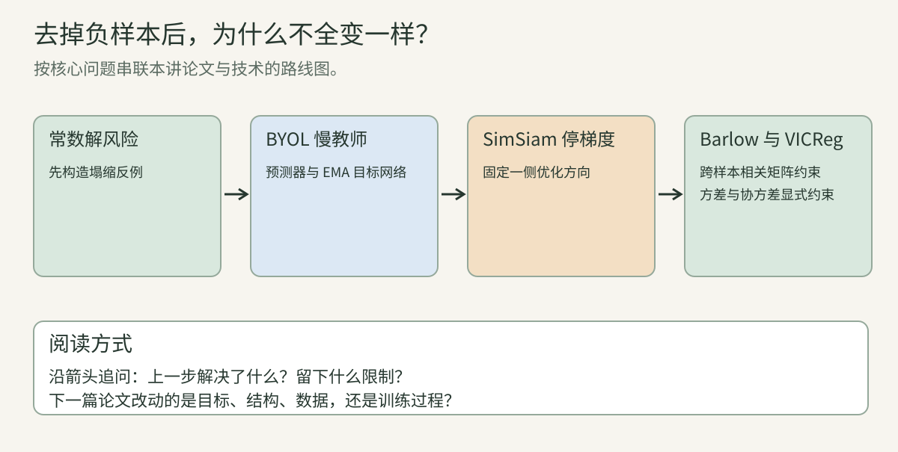
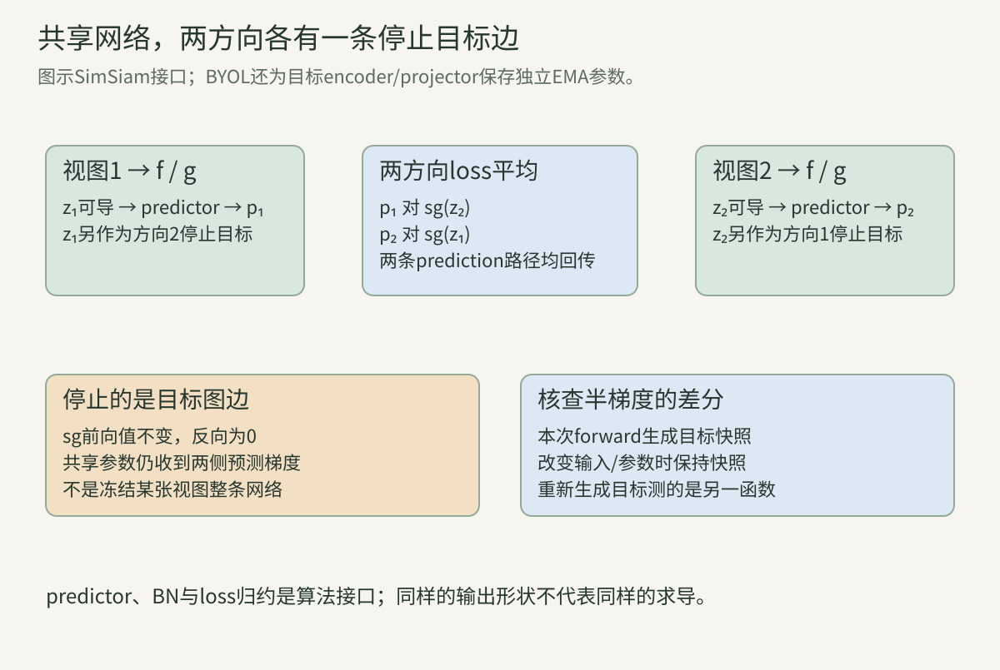
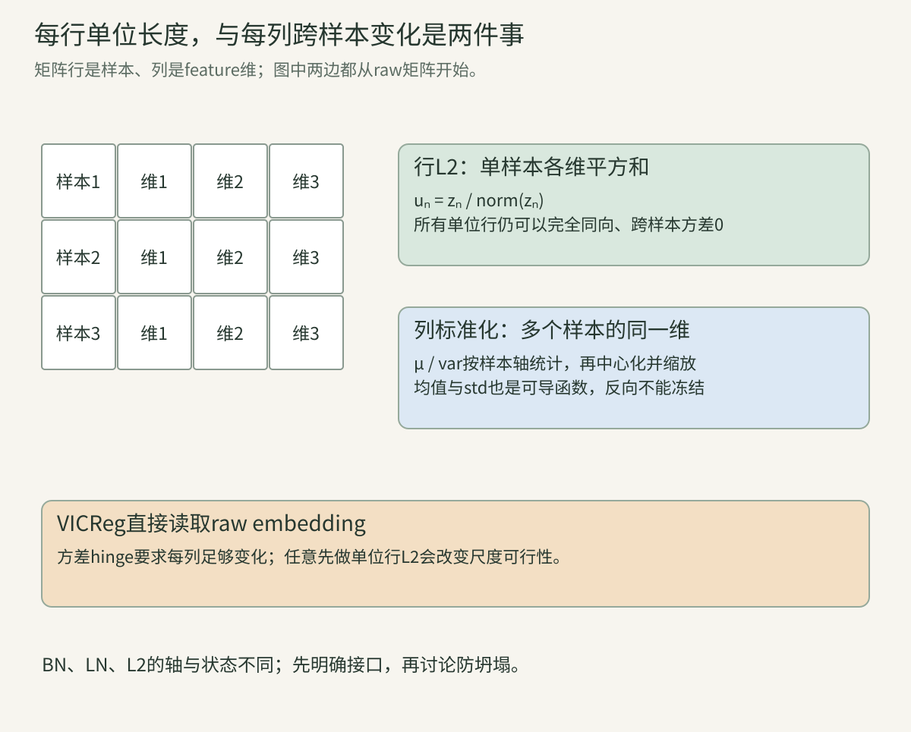
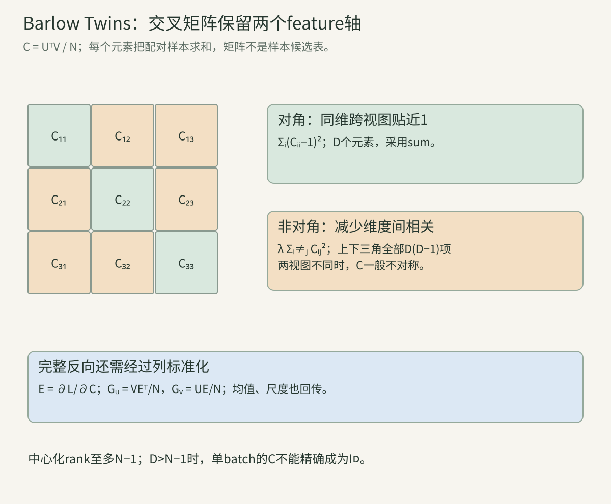
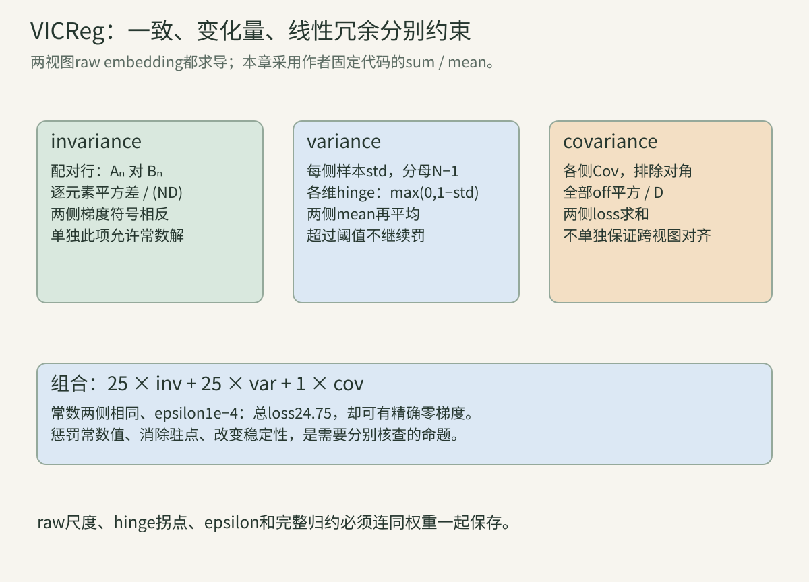
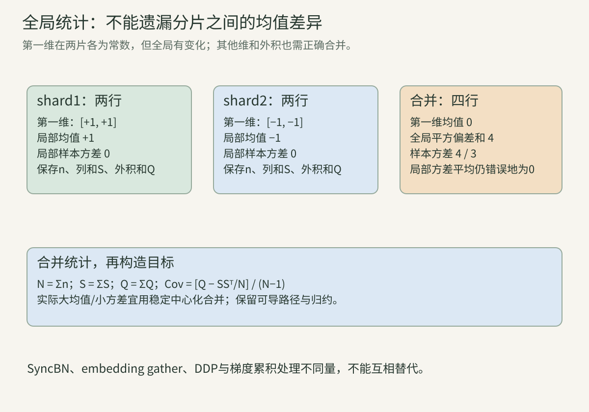

> 本讲沿“训练关系 → 前向值 → 指定导数 → 跨步状态 → 表征统计 → 真实评价”拆解四条路线。没有负字典仍有监督和跨样本统计；把positive拉近不是全部问题。手算与程序会明确哪些是数学恒等式、有限batch限制、论文经验结果或待检验机制解释。

本讲常用英文接口：encoder是把图像变成表示的编码器；projector是把表示投影到预训练loss空间的头；predictor是预测另一侧目标的头；online是接收本步梯度的网络，target/teacher是目标/教师；collapse是表示坍塌；raw是归一化前的原始数值。BN是按batch统计的归一化，EMA是指数移动平均，std是标准差，rank是秩。读到新公式时，先确定这些量在哪个接口、沿哪条轴计算。

<!-- teaching-narrative-rewrite -->

如果不显式拿别的图当负例，最容易的解会不会是“所有照片都输出同一个向量”？这讲沿着塌缩问题读四个方案：BYOL和SimSiam改变更新路径，Barlow Twins和VICReg直接约束批内统计。它们都能用两张增强图训练，却不能混成同一个机制。

## 一、没有negative以后，难点是什么？

**两视图仍提供正关系监督。** 同源图两增强$x_1,x_2$经网络产生表示。无显式负样本方法不把别的图逐项放入negative分类分母，但仍要求对应视图一致，还可能要求跨batch的各维变化与去相关。

BYOL/SimSiam用预测一侧去匹配另一侧的停止目标；Barlow Twins约束两视图间维度相关矩阵；VICReg把一致、变化量和协方差分别写为loss。它们没有同一份“删掉负项的InfoNCE”。

自监督来自增强配对及人为定义的统计目标，仍需数据/架构/优化/评价。标签没用在预训练，不代表所有特征天然有语义，也不代表batch之间从此毫无耦合。

**只有配对MSE时，常数解为什么好得过头。** 若$L=E\|z(x_1)-z(x_2)\|^2$，令所有输入都映到同一常数向量c，则$L=0$，达到非负目标最小值。它保留了配对一致，却失去区分任意图片的信息。

这是坍塌解的明确构造，不需要假设优化必定到达它。目标存在坍塌全局最小值、某个训练过程经常坍塌、某种机制改变稳定性，是三个不同命题。

加predictor、stop-gradient或EMA可能改变训练动力学而非删去所有常数最优值。显式方差/相关约束可以给常数较高loss，仍需检查导数和驻点。

**跟着算：每张图不同，loss仍可等于0。** 三张完全不同图，encoder都输出$(2,-1)$，两视图均如此，逐配对MSE0。若下游分类标签不同，任何只读取该常数的head无法区分它们。

loss为0只说明满足这个配对目标，不说明信息丰富。让全部输出为0不是唯一坍塌，任意同一个非零常数也可做到，所以norm非零检查不能代替跨样本变化检查。

**L2归一化不等于防止跨样本坍塌。** 单位归一化让每行向量长度为1，但所有样本可以同向。负余弦匹配达到−1、归一化MSE达到0，照样无法区分输入。

跨batch标准差回答“同一维在不同样本间变了多少”；行L2 norm回答“单个样本所有维总长度多少”。轴不同，意义不同，不能把“做了normalize”当完整机制。

本讲的raw表示、projection、prediction及标准化表示分别命名；判断坍塌要指定在哪个接口，不让投影头的统计替代所有backbone能力。

**跟着算：单位向量也能全部相同。** 四个样本均$(1,0)$，每个norm1，但第一维跨样本std0，第二维std0。协方差全0、表示rank0（中心化以后）。两视图负余弦−1，目标看起来“很好”。

相反每个样本norm很大也不表示信息多，公共常数偏置可让norm大而中心化变化仍0。统计必须按正确轴去中心化。

**完全坍塌、维度坍塌与秩。** 完全坍塌是所有样本同一向量；维度坍塌可指部分通道恒定，或样本变化只占低维子空间。每维std非零也可能所有列高度相关，实际rank很低。

B×D表示矩阵去均值后rank至多min(B−1,D)，这是有限batch的代数限制。不能看到D8192、batch256时rank不满8192就认定训练失败；应与可达上限和更大评价样本一起看。

协方差谱、有效rank、每维std、近邻及下游任务互补。一个谱指标无法单独证明所有语义保留，但能发现只靠总norm检查遗漏的冗余。

**Stop-gradient的前向值与指定导数。** 定义$\operatorname{sg}(z)=z$在前向返回相同数值，反传指定$\partial\operatorname{sg}(z)/\partial z=0$。它是计算图上的导数政策，不是把z置0，也不是删除这个目标。

普通实函数恒等映射导数应为I；sg故意采用另一导数语义。因此不能仅用前向表达式把sg符号约掉，再声称两算法相同。目标数值可相同，更新向量场不同。

no_grad、detach等是框架实现入口；参数冻结、eval模式和跨步EMA又分别负责导数、运行状态和状态更新。四者不自动互相替代。

**跟着算：一样的loss值，不一样的更新。** 标量$L=(a-\operatorname{sg}(b))^2/2$，a=2、b=1，L=0.5。指定梯度$G_a=1,G_b=0$；普通$(a-b)^2/2$则$G_a=1,G_b=-1$。

前向都0.5，不表示训练一样。若a和b由共享参数产生，还需把合法a路径的贡献传到共享参数；b路径停止并不冻结所有其他使用同参数的路径。

**为什么普通数值差分会“反对”stop-gradient？** 若每次扰动参数都重算两侧表示，普通差分测的是两个前向都变化的标量函数。sg的更新故意只计在线路径变化，所以二者可以不同，这不是反传bug。

核查指定半梯度时，先在原参数生成target快照，差分期间固定它，只扰动在线计算。这样差分测试对应本步实际导数政策；下一真实优化步再生成新目标。

这类似带固定标签的一步回归，不把目标的生成函数也求导。完整跨步训练动力学另分析，不能用一个本步半梯度核查当无限时间收敛证明。

**共享参数不意味着两条target路径都求导。** 对称预测损失可有$p_1\to\operatorname{sg}(z_2)$及$p_2\to\operatorname{sg}(z_1)$。同一个encoder在两视图的预测源各有梯度，而在两项target角色各停止。

参数梯度把两条在线预测支路累加。不能只写“target无梯度”就把第二视图整个encoder输出冻结；它在另一方向仍作为可导源。

program一固定两目标快照，检查两个源方向和共享三层参数。漏一条源支路、或取消target停止，会产生不同梯度，虽然前向loss可能完全相同。

**无显式negative不等于无跨样本作用。** 训练BN的均值/方差、Barlow跨batch相关、VICReg跨batch标准差/协方差都让一个样本影响其他样本的loss或表示。这里没有逐对negative标签，仍有样本统计耦合。

因此按每图独立训练再平均、局部batch统计直接平均、随意microbatch累积都未必复现global batch目标。第16讲的候选耦合在这里变成统计耦合。

为判断机制应定位具体函数和轴，而不是用“隐式负样本”一句话掩盖全部差别。BN、去相关与negative CE不是可自动互换的三个名字。

## 二、BYOL：预测缓慢变化的教师投影

先保留“同图两视图应相近”的目标，同时把一侧当作缓慢变化的教师。更新时要区分online梯度、stop-gradient和EMA状态，才能知道网络为什么没有把两边一起推向同一常数。

**在线与target的模块接口。** 在线有encoder f、projector g、predictor q：$h_1=f_\theta(x_1),z_1=g_\theta(h_1),p_1=q_\theta(z_1)$。target提供$z'_2=g_\xi(f_\xi(x_2))$，不需要在目标定义中再预测一次。

[BYOL论文](https://arxiv.org/abs/2006.07733)用在线预测匹配另一视图target，并以在线参数的EMA更新target。ξ与θ是不同状态，在线参数接受loss梯度、target不接受本步回归梯度。

实现可共享一个forward结构而分开参数树，所以target实例也可能分配未用于回归的predictor或在线诊断head。模型逻辑接口与代码对象分配需分别核对，不能只看模块名字数目。

**归一化MSE与余弦的恒等式。** 非零prediction p与target z，令$a=p/\|p\|,b=z/\|z\|$。单位范数下：

$$
\ell_{1\to2}=\|a-b\|^2
=\|a\|^2+\|b\|^2-2a^Tb=2-2a^Tb.
$$

loss范围[0,4]，相同方向0、反方向4。它匹配方向而非raw长度；仅将rawMSE的公式照搬到归一化输出会漏norm导数。

target b本步固定，prediction a仍可导；teacher特征数值决定更新方向。eps下单位norm可能不精确为1，恒等式与实现边界需说明；本章程序所有输入norm严格非零。

**跟着算：同方向但长度不同。** p=(3,4)、z=(6,8)，raw平方距离25；归一化均为(0.6,0.8)，归一化MSE0。若p=(−3,−4)，与z反向，归一化MSE4。

loss选择了方向不变性。对于需要尺度信息的下游，方向匹配不说明backbone必须舍弃全部尺度，因为loss空间与迁移接口可不同。

**Prediction梯度逐步展开。** 由$\ell=2-2a^Tb$，$G_a=-2b$。再用norm Jacobian：

$$
G_p=-\frac2{\|p\|}(I-aa^T)b
=-\frac2{\|p\|}[b-a(a^Tb)].
$$

这个向量去除径向，只推动方向；target梯度由sg为0。随后经predictor、projector、encoder回传，不能省略predictor参数或把target的norm梯度传到教师。

两方向及batch reduction带额外系数，式子是单方向单样本。数值核查先固定target，再检测norm、矩阵与共享支路，每步都使用同一组旧参数算梯度。

**对称两方向的sum与mean。** BYOL常将1→2及2→1两个归一化MSE相加，再按batch平均；另一实现可能对方向再平均。两者相差2倍，需要和优化配方一起记录。

SimSiam使用两方向负余弦平均。若记$D=-\tfrac12(\cos_{12}+\cos_{21})$，同一组向量的BYOL式两方向MSE sum为$4+4D$。只有向量/目标/归约相同，才有这个数值关系。

这不表示BYOL与SimSiam相同算法，因为target状态、encoder、head和导数政策不同；也不能据loss数值更小认定表征更好。

**Target EMA是跨步状态更新。** 一次在线优化后可按明确时间索引更新$\xi\leftarrow m\xi+(1-m)\theta$，ξ不通过回归梯度。EMA作用于对应参数；predictor若只在在线存在，需定义参数对应范围。

m是target衰减，不是InfoNCE温度，本章特意不用论文τ符号混淆。大m使目标缓慢变化，在线追一个随训练变化的目标，而非永远回归固定随机编码器。

EMA只说明参数平均，不能独自证明常数解不存在或训练必然稳定。BN/预测器/增强/优化共同形成系统；机制解释与原论文消融分开。

**跟着算：更新顺序与teacher值。** 旧teacher(0.2,−0.1)、更新后online(0.5,0.4)、m0.9，新teacher(0.23,−0.05)。如果误用更新前online，数值会不同；如果同一步EMA两次，有效衰减变$m^2$。

恢复训练必须保存teacher、online、optimizer、step与运行buffers。只保存online再重新初始化target不能声称续训轨迹精确相同。

**随训练变化的EMA schedule。** 一种cosine衰减系数政策是$m_t=1-(1-m_0)[1+\cos(\pi t/T)]/2$，从m0逐渐到1。它让后期target响应更慢；t按step还是epoch、T总预算及终点是否实际到达都要说明。

m0=0.996在中点变0.998，末点1。实际训练最后一次t可能T−1，系数未恰好1。恢复checkpoint后重置t会改整条响应曲线，不能只保存“cosine EMA”这个名字。

这一schedule不是通用最优定理，也不等于lr schedule；在线learning rate与teacher decay分别定义，可有不同变化方向。

**跟着算：m的半衰期在变化。** 固定m0.996时历史权重半衰期约172.94步；m0.998时约346.23步。变化schedule里不能直接套一个固定半衰期表示全程，权重是各步m的乘积。

从t0到t1的初始teacher权重$\prod_{r=t_0+1}^{t_1}m_r$；如果后期更接近1，早期状态继续保留更久。数值含义明确后再分析训练稳定性。

**初始化和运行state需要按实现核对。** 概念演示常把online/target初始化相同，但本次核对的DeepMind代码用不同rng初始化两套树，注释说明其试验未见明显差别。不能将“必须同初始化”写成BYOL数学前提。

target forward的BN等state仍更新，EMA参数树与target running state更新是两条操作。无梯度不等于eval，也不等于teacher所有buffers直接复制online。

同一源码还含停止backbone梯度的在线分类诊断，它不把类别监督自动传回预训练encoder。解释完整训练loss应辨认各head的梯度边界，不能只看到分类loss就误判encoder用了标签。

**跟着算：初始差异会随EMA衰减。** 若online保持固定θ，两target初始差为δ，t步后差$m^t\delta$。m0.9、t10，剩0.348678δ；并不会第一步完全相同。

真实online变化、两套BNstate与随机增强还影响feature，所以参数差衰减恒等式不证明两个完整训练轨迹相同。是否需要相同初始化是复现政策，而非可由此直接保证的性能结论。

**Predictor增加什么非对称性。** 在线p=q(z)匹配target z'，目标侧不使用同一个q做配对预测；两侧前向与导数角色因此不对称。q可以吸收在线表征与慢target空间的差异，影响优化轨迹。

预测器通常是MLP，隐藏宽、BN、激活、最后bias/norm需明确。把q去掉或强制恒等，不仅减少参数，也改损失对encoder的有效梯度；需要单因素训练消融。

不能称q为一个“保证防坍塌的开关”。常数z/p仍可匹配，函数空间中坍塌解还在；防止训练走向它的解释必须依具体动态和实验条件。

**条件期望解释是分析工具，有假设。** 对固定target和普通平方误差，无限容量predictor的最优输出是给定在线输入的target条件期望。推导：将target减条件均值，交叉项条件期望0，MSE分为条件方差与到条件均值的平方误差。

这解释预测器可能保留跨视图可预测结构；归一化、有限MLP、teacher变化和并非每步最优的predictor会让实际过程更复杂。不能把固定回归最优解当完整BYOL无条件收敛定理。

同样，target本身坍塌时条件期望也常数，所以这个分解单独不足以排除坍塌。学习动力学的论据需结合架构和训练实验。

**BN统计是一条实际交互路径。** BN让一图representation受同batch其他图影响，online/target的batch组合与跨设备统计政策会改变目标。即使没有negative字典，也不是逐图完全独立匹配。

换成LN/GN、移除BN或修改predictor normalization都改变多个计算节点，不应只按一个标签“无负样本”预期同效果。论文与后续研究的解释可能依这些条件，引用时保留范围。

目标向量的L2 normalize、head内BN、encoder BN不是同一操作。记录每个位置及训练/eval状态，定位失败比笼统说“缺少归一化”更有用。

**跟着算：均值由同伴决定。** 单维两样本[1,3]，population均值2、std1，标准化[−1,1]。把第二样本改为5，均值3、std2，第一项仍−1；若增第三样本100，第一项值又按新全batch变化。

这说明标准化是整集合函数，不是给每个样本独立除自己的norm。极小batch时统计约束很强，也可能不能表达预期维度变化。

**常数解、驻点与经验不坍塌要分开。** 所有online/target输出同方向、predictor也匹配时，归一化配对loss可为0。这个构造证明目标允许坍塌；并不反驳论文中正确配置训练得到有用表示的实验。

“机制避免坍塌”通常指在实验条件下训练轨迹或局部稳定性，而非任何初始状态都没有坍塌驻点。若要更强数学主张，需要假设与证明；本文不把消融现象扩成普遍保证。

诊断看encoder/projection/prediction各接口方差与rank、teacher/online差异、loss与下游。仅看teacher慢、loss低或norm非零都可能漏问题。

**BYOL复现的最小状态清单。** 保存online/teacher全部参数、running state、predictor与projection配置、输入增强两方向、normepsilon、loss sum/mean、EMA对应参数与schedule、optimizer/lr、global batch/BN与step。

评价指定使用online或teacher、h或z、pool与冻结模式，不能把checkpoint里任意一套参数混选。论文linear probe用的接口、后续实现接口和本章教学函数分别标注。

以下SimSiam去掉EMA但保留角色非对称，Barlow/VICReg转向显式统计约束。这些变化作用在不同层次，不能仅以target名字判断算法相同。

## 三、SimSiam：没有EMA的停止目标

若连EMA教师也拿掉，只靠预测头和stop-gradient，梯度路径会怎样变？比较BYOL与SimSiam时不要把“目标分支本步不求导”误写成“目标参数永远冻结”。

**两支共享参数，角色仍不对称。** SimSiam使用同一个encoder $f_\theta$、projector $g_\theta$处理两视图。记$z_1=g(f(x_1)),z_2=g(f(x_2))$，predictor $q_\psi$得到$p_1=q(z_1),p_2=q(z_2)$。两支参数共享，并没有第二套EMA教师参数。

第一方向比较$p_1$与$\operatorname{sg}(z_2)$；第二方向比较$p_2$与$\operatorname{sg}(z_1)$。一个方向中只在prediction侧继续求导，并不意味着某一张视图永远没有梯度。第二方向会交换它们的职责。

把“两个encoder形状相同”解释成“完全对称训练”，会忽略predictor、stop-gradient和BN所在接口。共享的是参数，不是每条边的求导政策。下图把停止发生的边画出来，参数共享线不等于所有输出均可导。

图中绿色为可导预测路径，橙色为本方向目标快照。两方向相加以后，两视图都能通过自己的predictor回到共享encoder；橙色边仍停止。

**负余弦loss可以为负。** 定义$D(p,z)=-\frac{p^Tz}{\|p\|_2\|z\|_2}$。非零向量的值在$[-1,1]$，同向为−1、正交为0、反向为1。负loss不是计算错误，绝对值不应与交叉熵直接比较。

本讲使用作者训练代码的归约：

$$
L_{\rm SS}=\frac12\left[\frac1N\sum_{n=1}^N D(p_{1n},\operatorname{sg}(z_{2n}))+\frac1N\sum_{n=1}^N D(p_{2n},\operatorname{sg}(z_{1n}))\right].
$$

这里$N$是原图数，$2N$个prediction参与。均值分母是$2N$。记$a=p/\|p\|,b=z/\|z\|$，每一未加权项的导数为$G_p=-(I-aa^T)b/\|p\|$，随后乘$1/(2N)$。target导数按sg定义为0，即使普通负余弦函数对z有非零导数。

**跟着算：两方向如何回到共享参数。** 只为说明计算图，用标量encoder $z_i=\theta x_i$、predictor恒等和非归一化平方loss。$x_1=1,x_2=2,\theta=1$。第一方向$(\theta-\operatorname{sg}(2\theta))^2$在固定目标2处的梯度是−2；第二方向$(2\theta-\operatorname{sg}(\theta))^2$在固定目标1处的梯度是4。平均后梯度1。

若把两个目标重新当可导函数，平均loss变成$\theta^2$，普通导数2。若误把第二张视图整支冻结，则丢掉第二方向的4。这三个导数不同；本例使用平方loss而非原SimSiam负余弦，目的是单独暴露sg与共享参数的关系。

**原始projector与predictor的BN放在哪里。** 核对本章固定作者版本，ResNet50末端fc改成三层projector。前两层是Linear→BN→ReLU，最后Linear→BN；末端BN为`affine=False`，没有可学习缩放和偏置。最后Linear的bias仍是注册参数，但被冻结，不能误记成“这一层根本不存在bias”。

作者默认projection宽度2048，predictor是2048→512→2048：第一Linear无bias，然后BN、ReLU，再带bias的输出Linear，末端没有BN或ReLU。三层projector与两层predictor承担不同职责；不是每个Linear都搭同一种BN。

本文程序一用很小的tanh/Linear头说明求导，不含BN，不能当作上述架构的完整复现。做消融应同时记录层数、隐藏宽度、激活、bias、BN affine/running state，而不是只写“MLP两层”。

**同一个z既能作为目标，又能给predictor求导。** 计算$z_1$后，$p_1=q(z_1)$使用原可导值，目标返回$\operatorname{sg}(z_1)$。detach一个返回接口不等于把此前生成p的路径也剪掉。在自动微分里，它们可以共享数值存储却有不同图边。

作者builder返回$p_1,p_2,z_1.\mathrm{detach}(),z_2.\mathrm{detach}()$。训练入口将p1与z2、p2与z1配对。若先把z整体detach再调用predictor，则encoder失去prediction侧学习信号，是不同算法。

detach不保证复制底层数据；原地覆盖共享存储仍可能破坏反传保存值。程序一使用复制出的目标列表明确冻结一次forward的快照，数值差分也对这同一份快照求导。

**predictor固定学习率是一种配方选项。** 作者训练入口提供`fix_pred_lr`选项：encoder/projector组随cosine schedule改变学习率，predictor组保留初始化的学习率。固定学习率指该组lr，不是冻结predictor参数；它依然每步按梯度更新。

使用选项时，两组的权重衰减和momentum仍需按代码核对。不开选项时，不应在文档里宣称所有SimSiam都固定predictor lr。不同optimizer、batch与总step又会改变等效更新，不能从“同一个loss”推训练轨迹相同。

以初始lr0.05、encoder schedule衰减到0.005为例，开启固定predictor后，predictor仍用0.05。这不是predictor每个元素更新量必然十倍：梯度、momentum和权重衰减也参加更新。

**交替目标解释怎样帮助理解，怎样不能过度解释。** 把每张图的潜表示记作辅助变量$\eta_x$，可想象交替做两件事：固定$\eta$学习从增强图预测它；固定网络，用新输出刷新目标。stop-gradient让当前步按第一件事求导，target前向更新则像第二件事。

这是SimSiam论文讨论的理解路线。真实训练是minibatch、共享网络、两方向、BN和非线性优化，不是显式求解每个$\eta_x$的全数据最优值。它不自动满足概率模型EM的条件，也不提供完整网络必然收敛或不会坍塌的定理。

理解机制时问：当前步谁固定？跨步谁变化？目标值、梯度和状态更新能否分别写出？这样的拆分有用；把类比本身当证明则会漏掉初始化、预测头和统计细节。

**跟着算：条件均值预测器为何会平均不可预测信息。** 固定target T，某个online表示h下，T以相同概率为$(1,1)$和$(1,-1)$。平方风险的最优预测是条件均值$(1,0)$，残余风险为1。

因为$E\|T-q\|^2=E\|T-E[T|h]\|^2+\|q-E[T|h]\|^2$，第一项不依q。target第二维的信息若从h完全无法判断，平方预测器会平均掉它。该结论针对固定target和平方风险；归一化余弦、同步更新target和有限容量改变问题，不能直接推出所有最终语义内容。

**驻点为零梯度，不代表稳定或会被训练访问。** 若所有z与p同向，负余弦导数中的$(I-aa^T)b=0$，可出现常数驻点。讨论稳定性需要考察小扰动以后参数/状态更新是否把系统拉回原点，涉及Jacobian、optimizer和BN状态。

普通光滑标量目标的Hessian特征值可以帮助判断极小、极大或鞍点；含stop-gradient的更新向量场一般不等于将前向所有依赖普通求导的那个标量目标。因此不能无条件套用其普通Hessian来证明半梯度训练稳定性。

实验观测“移除sg坍塌、加入sg不坍塌”是明确消融证据，适用于该架构、数据和配方。要升级为普遍命题，需要给出相应数学条件或更广证据。日志必须同时观察方差、rank、loss与迁移表现。

**做消融时一次只改一个求导接口。** 比较有/无sg，应保持增强、网络输出值、归约、optimizer、BN和预算可比，再单独改target边。比较有/无predictor要记录参数量与归一化位置的变化；删除模块往往同时改了容量与统计，不只是删一个名字。

BN、L2、EMA和predictor都可改变动力学，但不是所有算法必需的同一套组件。BYOL/SimSiam的经验与Barlow/VICReg显式统计约束不同。不要把某条路线的消融当另一条路线的结构要求。

失败实验也保存seed、实际接口、前几十步方差曲线和异常值。把已坍塌checkpoint只报告为“loss很低”，会把训练失败误判为优秀拟合。

## 四、Barlow Twins：维度间交叉相关

另一条路不依靠教师：看整个batch两路输出的交叉相关矩阵。对角要接近1，非对角要接近0，既保留对应信息也限制维度冗余。

**从N×D矩阵的每一列开始标准化。** 令两视图projection为$A,B\in\mathbb R^{N\times D}$。行是样本，列是feature维。对A第d列定义$\mu_d=\frac1N\sum_n A_{nd}$，$v_d=\frac1N\sum_n(A_{nd}-\mu_d)^2$，$s_d=\sqrt{v_d+\epsilon}$，$U_{nd}=(A_{nd}-\mu_d)/s_d$；B同理得到V。

这里使用总体方差分母N，符合BN当前batch归一化语义；不是VICReg的样本方差N−1。$\epsilon>0$防止除0，使标准化后列总体方差$v/(v+\epsilon)$一般略小于1。不能把所有对角相关强行当精确1。

BN running variance保存政策与forward归一化方差也可能不同。本节讨论loss读取的当前batch列标准化；evaluation使用running state属于另一个接口。

图中每行L2处理一个样本，列标准化读取多张图的同一feature维。常数单位行依然可能列方差0；理解这一点才能读下面的相关矩阵。

**C是D×D交叉矩阵，不是N×N相似度。** 定义$C=U^TV/N$，即$C_{ij}=\frac1N\sum_n U_{ni}V_{nj}$。i是视图A的feature维，j是视图B的feature维；n必须配对同一原图。不是拿样本A_i和样本B_j互相比较的候选分类矩阵。

当$A=B$，C是对称的自身相关矩阵；一般$A\ne B$时，$C_{ij}$不一定等于$C_{ji}$。交换视图得到$C^T$，而不是保持每一个元素不变。loss中的对角和全部非对角平方求和对转置不变，所以整体损失可保持对称。

N决定统计精度和中心化rank上界，D决定矩阵大小和希望去冗余的维度。把这两个轴弄反，会同时算错loss、参数预算和batch需求。

**跟着算：完整计算一个2×2交叉相关矩阵。** 取已标准化的两列矩阵：$U=[(1,1),(1,-1),(-1,1),(-1,-1)]$，$V=[(1,1),(1,-1),(-1,-1),(-1,1)]$，N4。每列均值0、总体方差1，这个算例暂设epsilon0且方差非零。

依次点积：第一列U与第一列V为4、与第二列V为0；第二列U与第一列V为0、与第二列V为0。除4得到$C=\begin{pmatrix}1&0\\0&0\end{pmatrix}$。两维都在各自视图变化，但第二维对应关系失效；仅看各自方差不能发现这种失配。

**对角贴近1，所有非对角贴近0。** Barlow Twins目标写为：

$$
L_{\rm BT}=\sum_{i=1}^D(C_{ii}-1)^2+\lambda_{\rm BT}\sum_{i\ne j}C_{ij}^2.
$$

第一项要求同一feature在两视图之间一致；第二项惩罚A某维与B其他维的线性相关。原作者默认配置的$\lambda_{\rm BT}=0.0051$。本章小矩阵程序使用0.05以便观察两项，不冒称原预训练配方。

这里对角不除D，非对角也不除$D(D-1)$。改成mean会改变维度扩大时两个项的比例，不能沿用同一个lambda而称完全等价。非对角包括上、下三角全部$D(D-1)$项。

图中每格对应维度对，绿色对角不是“positive样本位置”。橙色上下三角都参与惩罚；输入两视图不同时，它们的值可以不同。

**跟着算：非对角不能只数一半。** $C=\begin{pmatrix}0.8&0.3\\-0.2&0.9\end{pmatrix}$，lambda0.05。对角loss为$0.2^2+0.1^2=0.05$；非对角原和$0.3^2+(-0.2)^2=0.13$，加权0.0065；总0.0565。

只取上三角会得0.0545，漏掉0.002。这里C不对称，连“上三角乘2”也错。两个view交换后C转置，原目标仍为0.0565，支持算法两视图对称但不支持元素强制对称。

**loss到C，再到U与V的完整导数。** 记$E=\partial L/\partial C\in\mathbb R^{D\times D}$。对角$E_{ii}=2(C_{ii}-1)$，非对角$E_{ij}=2\lambda_{\rm BT}C_{ij}$。因为$dC=(dU)^TV/N+U^T(dV)/N$，取矩阵内积可得：

$$
G_U=VE^T/N,\qquad G_V=UE/N.
$$

核对形状：V为N×D，E转置D×D，结果N×D。两支均可导，不用sg或EMA。本目标还要通过列标准化回到raw A/B，不能止于这两个矩阵乘法。

一个样本的$G_U$包含E，E从全batch生成，因此即使不显式逐样本negative分类，样本梯度仍由其他样本统计影响。“没有负样本”不等于“每个样本独立训练”。

**列标准化反向：减均值与投影项。** 对某一列省略下标，$u_n=(a_n-\mu)/s$，上游导数为$g_n$。记$\overline g=\frac1N\sum_n g_n$、$\overline{gu}=\frac1N\sum_n g_nu_n$。逐项使用$\partial\mu/\partial a_n=1/N$和$\partial v/\partial a_n=2(a_n-\mu)/N$，得：

$$
\frac{\partial L}{\partial a_n}=\frac1s\left(g_n-\overline g-u_n\overline{gu}\right).
$$

epsilon已经进入s与u，此式仍成立；不要求$\frac1N\sum u_n^2=1$。减均值项让共同平移不改标准化输出。最后一项来自分母随a变化，不可把s冻结后漏掉。

若BN有affine参数，还需先把g乘gamma并给gamma/beta求导。本节与作者loss用的末端非affine标准化一致。program二对24个raw输入求差分，验证两支统计梯度，而非只验证C层。

**跟着算：epsilon与非affine不是同一回事。** 列a为$(1,-1)$，均值0、总体方差1。epsilon0.01时，u为$\pm1/\sqrt{1.01}$，方差为1/1.01，而不是精确1。两视图相同，C对角也为1/1.01。

`affine=False`表示没有额外gamma/beta，不表示epsilon0，不表示不用batch统计。若只凭“BN标准化”把C对角在代码里写死成1，就删掉了真实目标的一个可导量。

**中心化让rank上界降到N−1。** 中心化矩阵每列样本和为0，所有列位于N维样本空间的一个N−1维子空间。因此$\operatorname{rank}(U),\operatorname{rank}(V)\le\min(D,N-1)$，$\operatorname{rank}(C)\le\min(D,N-1)$。

当D>N−1，有限batch不可能使C恰好等于满rank的$I_D$。理想目标是一种训练压力，不是每个batch都可以逐格精确达成的承诺。epsilon又让有限方差标准化略小于单位方差。

这个限制不表示训练不能使用大D，也不表示跨整个数据集一定同rank；它说明单batch几何可行性和loss下界有条件。局部小batch统计与全局大batch统计的约束不同，不能直接移植一个数值阈值。

**跟着算：两样本无法给两维生成单位相关矩阵。** N2时，每一中心化列均形如$(a,-a)$。非零标准化列只能沿同一个样本方向，忽略epsilon后等于$(1,-1)$或其反号。

D2且两视图一样、两列同号，则C全为1，对角loss0，但两个非对角总平方2。选不同号只把非对角变−1，平方仍2。rank至多1，无法得到$I_2$。增加feature维不会创造新的样本方向。

**零相关不等于概率独立。** 相关/协方差为0只排除指定尺度下的线性二阶关系。独立要求联合分布因子化，通常比二阶统计强。高阶、非线性依赖仍可以存在。

例如X均匀取−1、0、1，Y=X²。$E[X]=0,E[XY]=E[X^3]=0$，所以Cov(X,Y)=0；但给定X就确定Y，它们显然不独立。高维embedding中“decorrelation”也不能无条件改写成所有语义因素独立。

高斯等特殊分布中零协方差可推出独立，但视觉网络输出没有自动满足该假设。Barlow/VICReg的冗余减少是一类统计约束，不是普遍无损分解或因果解耦证明。

**大projector与相关矩阵的计算账本。** 作者典型projector为2048→8192→8192→8192，hidden层Linear→BN→ReLU，末层Linear不加输出ReLU；loss随后做非affine列BN。三层无bias Linear的权重共$2048\cdot8192+2\cdot8192^2=150994944$，约1.51亿，另有hidden BN affine参数。

单个D8192的float32 C有67108864元素，约256MiB。矩阵乘$U^TV$约$ND^2$ MAC，两视图projection还需另计；可导中间量、optimizer和分布式缓冲会增加峰值。这里是数学计数，不是实际GPU显存或速度测量。

large projector可以让loss空间与迁移encoder接口分工，但是否有效需评价。把8192个projection维直接当backbone输出宽度，或忽略训练时MLP预算，会算错模型规模。

## 五、VICReg：把三个要求分开写

把防塌缩拆成三个可见要求：两视图一致、每个维度有足够变化、不同维度不过度重复。这样每个项为何存在就能由失败例解释。

**保留raw embedding，不先做每行单位L2。** VICReg仍从两视图得到$A,B\in\mathbb R^{N\times D}$，但三项目标直接读取raw projection，不先用对比学习常见的行L2单位化。其标准差约束需要维度可以达到足够尺度。

作者网络内部可有BN，不能从“loss不要求BN或负样本”推“任何位置绝无BN”。核对固定版本projector，hidden层使用BN/ReLU，末层无输出BN；目标本身用显式方差和协方差计算。

若raw单位行，则每行平方和1。零均值时各维样本方差总和至多约N/(N−1)，D很多时不可能每维标准差都≥1。随手加一个L2 normalize会改变方差目标的可行性，不是无害美化。

**invariance：对应样本逐元素接近。** 一致项是对应矩阵的均方误差：

$$
L_{\rm inv}=\frac1{ND}\sum_{n,d}(A_{nd}-B_{nd})^2,\quad G_A^{\rm inv}=\frac{2(A-B)}{ND},\quad G_B^{\rm inv}=-G_A^{\rm inv}.
$$

它按所有ND元素平均。N、D扩大时，裸梯度的尺度变化；不能把sum版loss直接沿用作者系数。两支都求导，没有sg。这个项单独允许常数最小值，其他项提供额外约束。

**跟着算：MSE分母包括样本和维度。** A两行$(1,2),(3,4)$，B两行$(2,2),(3,2)$。差值为$(-1,0),(0,2)$，平方和5，ND4，所以一致项1.25。A梯度为$(-0.5,0),(0,1)$，B梯度取反。

若误只除N，loss变2.5、梯度变两倍。加权lambda25后，本例一致贡献31.25。权重25与“有25个样本”没有关系，它是三个目标之间的系数。

**variance：各维标准差至少达到阈值。** 令$X=A-\mathbf1\mu_A^T$为中心化矩阵，$v_d=\sum_n X_{nd}^2/(N-1)$，$s_d=\sqrt{v_d+\epsilon}$。一侧方差损失定义$V(A)=\frac1D\sum_d\max(0,\gamma-s_d)$。本章取作者实现的gamma1、epsilon0.0001。

hinge意思是只惩罚未达阈值的维度。s大于1后此项为0，不额外要求每维严格等于1；s恰等于1是不可微拐点，自动微分需选定次梯度政策。本章差分输入远离拐点。

两视图损失取$L_{\rm var}=[V(A)+V(B)]/2$。variance这个名称下实际惩罚标准差的缺额，而非直接把方差与1做平方差。目标名称不能替代公式。

**为什么这里分母N−1？** 样本均值由同一N个观测估计，平方偏差和除N−1给通常的无偏样本方差；中心化损失一个自由度。BN当前forward常用分母N，两者不同。VICReg作者固定代码用`var(dim=0)`默认样本方差语义，并用global batch减1构造协方差。

无偏性需要独立同分布等条件，增强与数据相关性未必满足；这里首先是算法的明确分母政策。N必须大于1。空batch或N1不是把分母悄悄改1就能保留原算法。

真实混合精度统计宜使用足够精度的累加，记录实际epsilon、方差correction、valid样本数与gather后N。如果有pad或重复图，这些项如何统计也必须明确。

**跟着算：同一列两种标准差。** 列$(1,3)$，均值2，平方偏差和2。总体方差1、样本方差2；忽略epsilon的标准差分别1和$\sqrt2$。若阈值1.2，总体版hinge0.2，样本版0。

作者阈值1时，本例两版都不罚，却不意味着两个统计相同。较小变化或不同阈值会显露差别；代码对齐应核对分母，不能只拿一个巧合都为0的测试验证。

**方差项的梯度：为什么是中心化值。** 当$s_d<\gamma$，$\partial V/\partial s_d=-1/D$，且$\partial s_d/\partial A_{nd}=X_{nd}/[(N-1)s_d]$，所以一侧导数$-X_{nd}/[D(N-1)s_d]$；未激活维度导数0。

乘两支平均的1/2和整体系数mu，得到A的一侧贡献：

$$
G_{A,nd}^{\rm var}=-\frac{\mu\,\mathbf1[s_d<\gamma]}{2D(N-1)s_d}X_{nd}.
$$

负梯度沿中心化偏差把高于均值的样本推得更高、低于均值的推得更低，直观增加变化。所有样本同值时X0，epsilon使分母非零，但导数也全0。这解释了高方差penalty与常数驻点可以共存。

**covariance：同一视图内部去线性冗余。** 每侧$\Sigma_A=X^TX/(N-1)\in\mathbb R^{D\times D}$。对角是样本方差，非对角是不同维度的协方差。定义$C(A)=\frac1D\sum_{i\ne j}(\Sigma_{A,ij})^2$，两支$L_{\rm cov}=C(A)+C(B)$。

此处除D，不除$D(D-1)$；两支相加，不像方差项再除2。对角从协方差惩罚中排除，由方差项负责尺度下限。两视图各自的协方差都是对称矩阵，但它们一般不同。

与Barlow交叉相关不同，VICReg这里没有在$A^TB$里罚非对角。同源跨视图配对由invariance项提供；在同一视图内解相关由covariance项提供，职责拆开。

图中一致项连对应行，方差读每列变化，协方差读同侧维度对。只保留其中一项通常不能约束全部要求；目标系数和归约必须连公式记录。

**对称协方差的梯度为什么出现4。** 令$O=\Sigma_A-\operatorname{diag}(\Sigma_A)$，即只保留非对角。对$C(A)=\|O\|_F^2/D$，有$G_\Sigma=2O/D$。$\Sigma=X^TX/(N-1)$的微分包含$(dX)^TX$与$X^T(dX)$两项。

由于O对称，两项贡献相同，得$G_X=4XO/[D(N-1)]$。X列和0，$G_X$列和也0，经过中心化的反传不会再改变它。因此乘系数nu后：

$$
G_A^{\rm cov}=\frac{4\nu}{D(N-1)}XO.
$$

这里4来自平方导数的2与对称两路径的2，不是“两个视图各2”混在一起。B使用自己的中心化矩阵和协方差同样计算；若只罚上三角，公式与系数会改变。

**跟着算：手算一个协方差梯度。** N3、D2，中心化行X为$(-1,-1),(0,0),(1,1)$。$\Sigma=X^TX/2=\begin{pmatrix}1&1\\1&1\end{pmatrix}$，O对角0、非对角1。$C(A)=(1^2+1^2)/2=1$。

nu1时$G_A^{\rm cov}=4XO/(2\cdot2)=XO$，三行仍为$(-1,-1),(0,0),(1,1)$。梯度下降减去这些偏差，会缩小两个维度的共同变化。方差项则可能反向推动尺度，三个目标需要一起平衡，不能单独把协方差下降解释成完全改善。

**三项目标与全部raw梯度合在一起。** 本章对齐所核对作者代码的约定：

$$
L=\lambda L_{\rm inv}+\mu L_{\rm var}+\nu L_{\rm cov},\qquad (\lambda,\mu,\nu)=(25,25,1).
$$

于是$G_A=2\lambda(A-B)/(ND)+G_A^{\rm var}+G_A^{\rm cov}$；B的一致项符号相反，其余用B的自身统计。两个矩阵都经projector回到共享encoder。

必须注明：方差两侧取平均，协方差两侧取和；有的论文公式或实现给两侧同样sum，再调整权重。只说“VICReg权重25/25/1”不足以对齐，完整归约决定真实梯度。原代码的一致项在gather前算局部mean，方差和协方差在gather后算；等大小DDP的参数梯度平均可对应全局一致项，大小不等时要重新加权。

**非零方差与零非对角仍有rank限制。** 中心化样本协方差rank至多N−1。当D>N−1且所有维方差严格正，零非对角会形成满rank正对角矩阵，违反该上界。因此单batch无法同时精确满足全部维度的正方差和完全零协方差。

常用大D、小于D的N仍能训练，只是目标之间有有限batch折中。跨数据总体统计、跨步变化、有限weight与实际下游质量，需要分别观察。方差目标没有“凭空增加样本自由度”的能力。

program四用N4、D5矩阵展示rank3；三维例可以构造非零对角协方差，五维扩展则不可能满rank。不要将多余重复维的非零方差误报成五个独立信息方向。

**epsilon、常数驻点和扰动必须一起解释。** 若A/B每行都为同一常数且两侧相同，一致项0、协方差项0，标准差$\sqrt\epsilon=0.01$；每侧方差hinge0.99，平均后仍0.99，总loss24.75。它明显不是理想0目标。

但X0使方差与协方差梯度0，一致梯度也0；这是本章光滑epsilon实现的精确常数驻点。附近扰动能降低方差项，是否逃离和走向有用表示依赖网络、数值扰动、其他项与优化。高loss和零梯度没有逻辑矛盾。

若epsilon0且方差0，sqrt在0的导数不可直接沿用，本章不会把epsilon正数的驻点结论偷换到不可微、可能数值未定义的版本。实际训练应报告epsilon和精度。

**跟着算：各自去相关不能保证跨视图维度对齐。** N4、D3，A行是$(1,1,1),(1,-1,-1),(-1,1,-1),(-1,-1,1)$。列均值0，总体方差1，样本协方差$(4/3)I_3$。令B把A前两列交换。

A/B各自协方差一样，非对角惩罚均0，但跨视图C为$\begin{pmatrix}0&1&0\\1&0&0\\0&0&1\end{pmatrix}$。Barlow lambda0.05得到两个对角误差加两个非对角罚，总2.1。VICReg一致项为16/12=4/3，能发现错位。两个目标不能仅凭“去相关”互换。

## 六、全局统计、实现与评价

**四条路线的约束放在不同地方。** | 方法 | 配对目标 | 目标参数/导数 | 额外约束的位置 |
| --- | --- | --- | --- |
| BYOL | 两方向归一化预测平方差 | target不求本步梯度，参数EMA | predictor、慢目标、架构与统计共同影响动力学 |
| SimSiam | 两方向负余弦预测平均 | 共享参数，target边sg，无EMA | predictor、停止政策与架构/统计 |
| Barlow Twins | 交叉相关对角贴近1 | 两支可导，无sg要求 | 列标准化与交叉非对角惩罚 |
| VICReg | raw embedding逐元素MSE | 两支可导，无sg要求 | 每侧标准差hinge、每侧非对角协方差 |

表中“无sg要求”是原目标定义，不禁止研究变体加教师；那会是需要另行说明的变体。loss小、方差非零、rank较高和下游强也不是彼此充分条件。

**global statistics、SyncBN与可导gather不是同一个操作。** SyncBN同步归一化层的当前统计；embedding gather把样本矩阵拼成全局矩阵，以便计算loss统计；DDP汇总共享参数梯度。它们发生在不同接口，不能任选一个就声称整个系统都“全局”。

Barlow固定代码先SyncBN归一化，计算当地交叉乘和并除global N，再all-reduce合计C。VICReg固定代码用FullGatherLayer收集embeddings，其backward汇总所有rank给本地embedding的梯度。普通无梯度all_gather不自动实现同一求导。

若每rank重复算global loss，则gather backward与DDP平均如何抵消重复因子需要明算；若只某rank算loss，需要相应广播/反向政策。本文不实际运行多rank，程序验证的是全局矩阵函数与统计合并，不能当真实DDP梯度测试。

**统计可以合并，但不能随意平均局部协方差。** 每个shard保存样本数$n_r$、列和$S_r=\sum x$、外积和$Q_r=\sum xx^T$。合并$N=\sum n_r,S=\sum S_r,Q=\sum Q_r$，得到均值S/N和样本协方差$[Q-SS^T/N]/(N-1)$。

这保留了组间均值差异。局部协方差均值通常遗漏它；局部std均值也不等于全局std。非线性hinge以后再平均损失，进一步不同于先求全局统计再hinge。

数值上Q−SS/N可能在均值大、方差小时严重消减，应使用中心化分组合并或Welford类稳定更新。矩阵C还需配对外积统计，不仅每侧Q。跨多个microbatch合并要保留可导路径和同一参数快照；optimizer已经更新后旧embedding不是当前全batch函数。

图中第一维在每个局部shard里为常数，局部方差都0，合并后却有变化。BN/gather/梯度累积各自处理的量要写清。

**跟着算：局部协方差平均漏掉第一维变化。** 将算例R的A按前两行/后两行分成两片。局部第一列分别恒1和恒−1，局部样本方差都0；第二、三列各自局部样本方差2。两片协方差平均为diag(0,2,2)，两片非对角相互抵消。

全局样本协方差却为diag(4/3,4/3,4/3)。第一维的变化全来自组间均值，不能靠平均局部方差恢复。以统计量N/S/Q正确合并可精确得到全局矩阵；program四逐元素断言。

**padding、batch大小与归一化位置的协议。** padding项必须不进入真实样本统计，或者明确有效权重/计数；将pad向量0当普通样本会改变均值、方差、C与pair MSE。packing只解决容器排列，不能替loss决定有效样本身份。

统计batch、optimizer有效batch、每GPU microbatch和augmentation views数分别报告。梯度累积可以扩大有效optimizer batch，但每次局部BN/方差loss可能仍按小batch计算；它们不自动变成大统计batch。

在模型末端加BN、L2或LN应核对轴与目标兼容性。LN对每个样本的维度归一化，BN对样本集合的每维归一化；VICReg的raw尺度下限不能随意移到已单位化接口。

**训练资源不仅是encoder权重。** 大projector有时比backbone增加更多参数；optimizer若有动量与二阶状态，要计每个可训练参数对应状态。BYOL target参数、running buffers与EMA操作也需计；它没有反传，不代表没有forward成本或没有内存。

Barlow/VICReg相关矩阵和协方差D²增长；分布式embedding gather按ND增长。C、Cov的保存、临时乘积、两支激活、optimizer与通信可能决定峰值。不能只用最终encoder参数量比较预训练成本。

报告图像曝光量、crop数/大小、encoder forwards、optimizer updates、总时长与设备时，应区分理论计数与实测。本文尚未运行原模型训练或GPU测量。

**增强规定了保留与舍弃什么。** 要求颜色扰动前后表示一致，可能帮助忽略光照，也可能丢掉对某些疾病/材质有用的颜色线索；大裁剪可以保留类别，也可能删掉细小目标。自监督目标的视图不变性是一种任务假设。

global分类强不保证dense边界、位置回归、OCR或细粒度属性都强。至少记录crop交叠、尺寸、颜色/模糊/翻转政策、两支是否同分布以及任务是否允许这些变化。

把相邻视频帧当正对可能引入新时间假设，不能仅因同视频就保证同物体。可视化强正对与失败正对，检查增强是否制造捷径或不可完成的目标，再谈数据扩展。

**encoder、projector与predictor分开评价。** 预训练loss在z或p上计算，迁移常使用encoder h。分别保存三者接口的均值、逐维std、谱/rank和下游能力，避免projection坍塌诊断被错误套到所有中间层，或反过来只看h忽略loss支路失效。

linear probe冻结encoder参数和运行状态，单独训练标签head；fine-tune更新encoder，是不同协议。BYOL还要指明online还是target权重。BN train/eval、pooling、输入分辨率和特征L2政策都影响评价。

同数据/增强/预算比较时，也需对齐标签使用范围、验证集选超参数政策和seed。预训练没用标签不表示模型选择阶段没用标签，更不允许用测试标签挑checkpoint。

**何种证据支持何种机制结论。** 本讲有三类证据。数学推导证明指定矩阵函数的导数或rank限制；标准库程序证明选定有限例的计算与反例；论文消融/下游实验支持其训练条件下方法有效。三者相互帮助，但不能互相取代。

比如24项梯度核查通过不证明ImageNet训练精度；常数驻点反例不证明实际训练必然坍塌；有限batchrank上界不证明整数据表示无用；论文某配置稳定不证明所有分辨率、架构与数据稳定。

讲原理时先界定命题，再问可证条件、实验对照和失败边界。把“一个可能解释”明确写成机制假设，比把经验现象硬写为无条件定理更有助于下一步研究。

**跟着算：高loss也可以是零梯度。** program三令A=B，每行都为$(2,2,2)$。inv0、每侧cov0、std0.01、mean hinge0.99，weights25/25/1给总24.75；全部raw梯度为0。

这证明“VICReg常数有惩罚”与“这个epsilon实现存在常数驻点”同时成立。若初始化/网络输出加入变化，方差支路能推动偏差扩大；是否稳定得到语义要靠训练轨迹与评价，不能由这个单点独立判定。

**复现时要保存loss分项和状态。** 记录每侧invariance/variance/covariance或diag/off原值及加权值；raw/normalized feature、active hinge比例、方差最小/中位数、有效rank与奇异值、norm、mean、梯度范数、EMA差值、BN运行状态。仅保存一个总loss无法定位尺度错或分项漏算。

checkpoint包含encoder/projector/predictor、teacher、optimizer、scheduler、EMA step与BNbuffers；恢复后核对第一步的状态时间索引。随机增强与多rank sampler状态影响继续训练是否重复图片。

测试用小矩阵完整梯度、常数和rank边界、交换view、局部/全局统计反例、真实多rank与单rank同批对照。小标准库程序负责第一组；真实模型与分布式部分需另行实验，不在这里虚报完成。

**到掩码学习：从预测配对表示转向缺失内容。** 本讲配对增强引入一致性、停止目标或统计约束。下一讲BEiT/MAE会把一张图的部分patch遮住，让可见上下文预测缺失目标：可以是离散视觉token，也可以是连续像素。

这将引入另一组问题：mask比例与采样、visible encoder与全序列decoder、目标tokenizer/像素归一化、位置恢复、只在masked处归约。它们与EMA或negative不是同一个开关。

先掌握本讲的接口/归约/状态/梯度，再读masked prediction，可以分辨“预测器”是在匹配另一视图、预测token类别，还是重建像素。目标空间与监督位置不同，loss数值不能直接排序。

## 七、四个完整程序：核对求导与统计

四段程序只用Python标准库。它们完整给出输入、函数、解析反向、断言和输出；前三段对所有指定标量做中心差分，第四段检查统计恒等式与反例。使用float64的普通Python浮点，未安装或运行原作者训练依赖。

**程序一：共享网络、停止目标与半梯度。** 程序构造两图双视图，交错配对索引1/0/3/2。encoder为3→2 tanh，projection与predictor均2→2 Linear。目标由本次forward产生然后固定；对12个输入加20个参数，共32项求差分。这个小网络没有BN，不是原作者完整架构。

正确差分必须固定target快照，否则测到的是重新生成目标后的另一函数。程序同时比较两种差分，显示不冻结目标时最大差异约1.14；指定半梯度本身误差约1.27e−9。负余弦平均loss约−0.901353，同对归一化MSE两方向sum约0.394590，满足第12节的$4+4D$关系。

~~~python
import math,copy

def dot(a,b):return sum(x*y for x,y in zip(a,b))
def affine(x,w,b):return [[sum(row[k]*w[k][j] for k in range(len(w)))+b[j] for j in range(len(b))] for row in x]
def linear_back(x,w,g):
 gx=[[dot(gi,row) for row in w] for gi in g]
 gw=[[sum(x[i][k]*g[i][j] for i in range(len(x))) for j in range(len(w[0]))] for k in range(len(w))]
 gb=[sum(gi[j] for gi in g) for j in range(len(w[0]))]
 return gx,gw,gb
x=[[.3,-.2,.5],[.4,-.1,.6],[-.5,.7,.2],[-.4,.6,.1]]
we=[[.3,-.2],[.1,.4],[-.2,.3]];be=[.2,-.1];wg=[[.4,.1],[-.2,.3]];bg=[.1,.2];wp=[[.5,-.3],[.2,.4]];bp=[-.1,.15]
partner=[1,0,3,2]
def forward():
 h=[[math.tanh(v) for v in row] for row in affine(x,we,be)]
 z=affine(h,wg,bg);p=affine(z,wp,bp)
 return h,z,p
# Target snapshot is held fixed while checking a stop-gradient update.
targets=copy.deepcopy(forward()[1]);M=4

def loss_and_grad(frozen=True,back=False):
 h,z,p=forward();ts=targets if frozen else z;loss=0.;gp=[]
 for i,pi in enumerate(p):
  t=ts[partner[i]];r=math.sqrt(dot(pi,pi));rt=math.sqrt(dot(t,t));a=[v/r for v in pi];b=[v/rt for v in t]
  score=dot(a,b);loss-=score/M
  gp.append([-(b[d]-a[d]*score)/(M*r) for d in range(2)])
 if not back:return loss
 gz,gwp,gbp=linear_back(z,wp,gp);gh,gwg,gbg=linear_back(h,wg,gz)
 ga=[[g*(1-v*v) for g,v in zip(row,hi)] for row,hi in zip(gh,h)]
 gx,gwe,gbe=linear_back(x,we,ga)
 return loss,[(x,gx),(we,gwe),(wg,gwg),(wp,gwp)],[(be,gbe),(bg,gbg),(bp,gbp)]
loss,matrices,vectors=loss_and_grad(back=True);checks=[]
for a,g in matrices:checks.extend((r,j,rg[j]) for r,rg in zip(a,g) for j in range(len(r)))
for a,g in vectors:checks.extend((a,j,v) for j,v in enumerate(g))
eps=1e-5;errors=[];wrong_errors=[]
for a,j,g in checks:
 v=a[j];a[j]=v+eps;pl=loss_and_grad();wrongpl=loss_and_grad(False)
 a[j]=v-eps;mi=loss_and_grad();wrongmi=loss_and_grad(False);a[j]=v
 errors.append(abs((pl-mi)/(2*eps)-g));wrong_errors.append(abs((wrongpl-wrongmi)/(2*eps)-g))
assert max(errors)<1e-7 and max(wrong_errors)>.01
print('SimSiam_toy_negative_cosine',loss,'checked_scalars',len(checks),'frozen_target_gradient_error',max(errors),'recomputed_target_mismatch',max(wrong_errors))
# For unit vectors, normalized MSE=2-2cos. Symmetric BYOL SUM is 4+4L here.
byol_sum=4+4*loss
assert abs(byol_sum-sum(sum((a/math.sqrt(dot(pi,pi))-b/math.sqrt(dot(t,t)))**2 for a,b in zip(pi,t)) for pi,t in zip(forward()[2],[targets[partner[i]] for i in range(M)]))/2)<1e-12
print('BYOL_two_direction_sum_same_pairs',byol_sum)
# Constant nonzero predictions matching targets yield a collapsed optimum of pair-only loss.
p=[1.,0.];t=[1.,0.];assert -dot(p,t)==-1. and sum((a-b)**2 for a,b in zip(p,t))==0
# Illustrate separate state EMA, not a loss derivative.
old_teacher=[.2,-.1];updated_online=[.5,.4];m=.9
teacher=[m*a+(1-m)*b for a,b in zip(old_teacher,updated_online)]
assert max(abs(a-b) for a,b in zip(teacher,[.23,-.05]))<1e-12
print('teacher_state_after_EMA',teacher,'constant_solution_pair_MSE',0.)
print('shared prediction paths, custom stop-gradient checks and EMA state passed')
~~~

**程序二：交叉相关与列标准化完整反向。** A/B各4×3，列标准化采用总体方差和epsilon1e−5。程序依次生成C、对角/非对角loss、E、U/V梯度、标准化反向、raw A/B梯度。每个输入元素差分时均值和标准差都重新计算，不能冻结它们。

输出loss约0.045208694，对角和约0.004678366，非对角原和约0.810606556，再乘lambda0.05。24项差分最大误差约3.56e−11；C确实不对称。常数A2、B3归一化后均为0，C0，lossD3、梯度0，展示另一种常数驻点边界。

~~~python
import math

a=[[.3,-.2,.7],[.8,.5,-.4],[-.6,.9,.2],[.1,-.7,-.3]]
b=[[.4,-.1,.5],[.7,.3,-.5],[-.5,.8,.4],[.2,-.6,-.2]]
N=4;D=3;eps=1e-5;lam=.05

def standardize(x):
 mean=[sum(row[j] for row in x)/N for j in range(D)]
 centered=[[row[j]-mean[j] for j in range(D)] for row in x]
 std=[math.sqrt(sum(row[j]**2 for row in centered)/N+eps) for j in range(D)]
 u=[[row[j]/std[j] for j in range(D)] for row in centered]
 return u,std

def objective(back=False):
 u,su=standardize(a);v,sv=standardize(b)
 C=[[sum(u[n][i]*v[n][j] for n in range(N))/N for j in range(D)] for i in range(D)]
 diag=sum((C[i][i]-1)**2 for i in range(D));off=sum(C[i][j]**2 for i in range(D) for j in range(D) if i!=j)
 loss=diag+lam*off
 if not back:return loss
 E=[[2*(C[i][j]-1) if i==j else 2*lam*C[i][j] for j in range(D)] for i in range(D)]
 gu=[[sum(v[n][j]*E[i][j] for j in range(D))/N for i in range(D)] for n in range(N)]
 gv=[[sum(u[n][i]*E[i][j] for i in range(D))/N for j in range(D)] for n in range(N)]
 def normback(u,std,g):
  mean=[sum(row[j] for row in g)/N for j in range(D)]
  mean_gu=[sum(g[n][j]*u[n][j] for n in range(N))/N for j in range(D)]
  return [[(g[n][j]-mean[j]-u[n][j]*mean_gu[j])/std[j] for j in range(D)] for n in range(N)]
 return loss,C,diag,off,normback(u,su,gu),normback(v,sv,gv)
loss,C,diag,off,ga,gb=objective(True);errors=[];step=1e-5
for x,g in [(a,ga),(b,gb)]:
 for i in range(N):
  for j in range(D):
   old=x[i][j];x[i][j]=old+step;pl=objective();x[i][j]=old-step;mi=objective();x[i][j]=old;errors.append(abs((pl-mi)/(2*step)-g[i][j]))
assert max(errors)<1e-7
assert max(abs(sum(row[j] for row in ga)) for j in range(D))<1e-12
assert max(abs(C[i][j]-C[j][i]) for i in range(D) for j in range(D))>.001
print('Barlow_loss',loss,'on_diagonal_sum',diag,'off_diagonal_sum',off,'checked_scalars',len(errors),'max_gradient_error',max(errors))
print('cross_correlation',C,'cross_matrix_not_symmetric',True)
# Constant embeddings normalize to zero with epsilon: C0, diagonal lossD, derivative0.
old_a=[row[:] for row in a];old_b=[row[:] for row in b]
a[:]=[[2.,2.,2.] for _ in range(N)];b[:]=[[3.,3.,3.] for _ in range(N)]
lc,cc,_,_,gc,gdc=objective(True)
assert lc==D and all(v==0 for row in gc+gdc for v in row)
a[:]=old_a;b[:]=old_b
print('collapsed_cross_loss',lc,'collapsed_gradient_zero',True)
# Off diagonal excludes all3 diagonal entries and counts BOTH directions6 entries.
assert len([C[i][j] for i in range(D) for j in range(D) if i!=j])==D*(D-1)
print('cross-correlation, feature-wise normalization and collapse checks passed')
~~~

**程序三：VICReg三项及全部raw梯度。** 两侧4×3，有一维std高于阈值、两维低于阈值，覆盖hinge激活/未激活分支。统计使用N−1，方差两侧平均，协方差两侧求和。side函数合并一致、方差和协方差三个贡献。

输出inv0.0175、mean var约0.284243216、cov sum约0.448061111，按25/25/1得总约7.991641520。24项差分最大误差约1.29e−10，数据远离hinge拐点；随后替换为完全常数，检查loss24.75与全部导数0。

~~~python
import math

a=[[.3,-.2,.7],[2.8,.5,-.4],[-1.6,.9,.2],[.1,-.7,-.3]]
b=[[.4,-.1,.5],[2.7,.3,-.5],[-1.5,.8,.4],[.2,-.6,-.2]]
N=4;D=3;eps=1e-4;gamma=1.;lamb=25.;mu=25.;nu=1.
def stats(x):
 mean=[sum(row[j] for row in x)/N for j in range(D)]
 c=[[row[j]-mean[j] for j in range(D)] for row in x]
 C=[[sum(row[i]*row[j] for row in c)/(N-1) for j in range(D)] for i in range(D)]
 std=[math.sqrt(C[j][j]+eps) for j in range(D)]
 var=sum(max(0.,gamma-s) for s in std)/D
 cov=sum(C[i][j]**2 for i in range(D) for j in range(D) if i!=j)/D
 return c,C,std,var,cov

def objective(back=False):
 sa=stats(a);sb=stats(b)
 inv=sum((a[i][j]-b[i][j])**2 for i in range(N) for j in range(D))/(N*D)
 var=(sa[3]+sb[3])/2;cov=sa[4]+sb[4];loss=lamb*inv+mu*var+nu*cov
 if not back:return loss
 def side(x,y,s):
  c,C,std,_,_=s;g=[[2*lamb*(x[i][j]-y[i][j])/(N*D) for j in range(D)] for i in range(N)]
  for i in range(N):
   for j in range(D):
    if std[j]<gamma:g[i][j]-=mu*c[i][j]/(2*D*(N-1)*std[j])
    g[i][j]+=4*nu*sum(c[i][k]*C[k][j] for k in range(D) if k!=j)/(D*(N-1))
  return g
 return loss,inv,var,cov,side(a,b,sa),side(b,a,sb),sa[2],sb[2]
loss,inv,var,cov,ga,gb,sx,sy=objective(True)
assert min(abs(s-gamma) for s in sx+sy)>.05
errors=[];step=1e-5
for x,g in [(a,ga),(b,gb)]:
 for i in range(N):
  for j in range(D):
   old=x[i][j];x[i][j]=old+step;pl=objective();x[i][j]=old-step;mi=objective();x[i][j]=old;errors.append(abs((pl-mi)/(2*step)-g[i][j]))
assert max(errors)<1e-7
print('VICReg_loss',loss,'invariance',inv,'mean_variance_penalty',var,'covariance_sum',cov,'std_A',sx,'std_B',sy)
print('checked_scalars',len(errors),'max_gradient_error',max(errors))
# Collapsed values have a positive variance penalty, but a zero derivative at exact collapse.
a[:]=[[2.,2.,2.] for _ in range(N)];b[:]=[[2.,2.,2.] for _ in range(N)]
lc,ic,vc,cc,gc,gdc,_,_=objective(True)
assert ic==0 and cc==0 and abs(vc-(gamma-math.sqrt(eps)))<1e-12
assert all(v==0 for row in gc+gdc for v in row)
print('collapsed_loss',lc,'collapsed_variance_penalty',vc,'collapsed_gradient_zero',True)
print('unbiased variance, covariance, all gradients and collapse boundary passed')
~~~

**程序四：全局统计、rank与独立性反例。** 程序用同一4×3正交列例，验证N/S/Q合并与完整样本协方差相等；局部协方差平均明显不同。然后交换两列，得到各自Cov相同、cross C错位，Barlow2.1、VIC inv4/3。

追加两个依赖列形成4×5矩阵，通过高斯消元核对中心化与Cov的rank均3。最后用Y=X²验证零协方差和确定性依赖可以并存。这一程序是代数断言，不做未定义的独立性自动判别，也不声称覆盖实际多rank通信。

~~~python
import math

def center(x):
 N=len(x);D=len(x[0]);m=[sum(row[j] for row in x)/N for j in range(D)]
 return [[row[j]-m[j] for j in range(D)] for row in x],m

def covariance(x):
 c,m=center(x);N=len(x);D=len(x[0]);return [[sum(row[i]*row[j] for row in c)/(N-1) for j in range(D)] for i in range(D)]
def sufficient(x):
 N=len(x);D=len(x[0]);S=[sum(row[j] for row in x) for j in range(D)];Q=[[sum(row[i]*row[j] for row in x) for j in range(D)] for i in range(D)]
 return N,S,Q

def merge_stats(s1,s2):
 n1,S1,Q1=s1;n2,S2,Q2=s2;D=len(S1)
 return n1+n2,[a+b for a,b in zip(S1,S2)],[[Q1[i][j]+Q2[i][j] for j in range(D)] for i in range(D)]
def reconstruct(s):
 N,S,Q=s;D=len(S);return [[(Q[i][j]-S[i]*S[j]/N)/(N-1) for j in range(D)] for i in range(D)]

x=[[1.,1.,1.],[1.,-1.,-1.],[-1.,1.,-1.],[-1.,-1.,1.]]
global_cov=covariance(x);combined=reconstruct(merge_stats(sufficient(x[:2]),sufficient(x[2:])))
assert max(abs(global_cov[i][j]-combined[i][j]) for i in range(3) for j in range(3))<1e-12
localavg=[[(covariance(x[:2])[i][j]+covariance(x[2:])[i][j])/2 for j in range(3)] for i in range(3)]
assert global_cov!=localavg
print('global_covariance',global_cov,'incorrect_local_covariance_average',localavg)
# Each local shard has constant first column. Global variation lies in their mean differences.
assert localavg[0][0]==0 and abs(global_cov[0][0]-4/3)<1e-12
# Both branches may be decorrelated alone but their matching dimensions are permuted.
y=[[row[1],row[0],row[2]] for row in x]
C=[[sum(x[n][i]*y[n][j] for n in range(4))/4 for j in range(3)] for i in range(3)]
lam=.05;barlow=sum((C[i][i]-1)**2 for i in range(3))+lam*sum(C[i][j]**2 for i in range(3) for j in range(3) if i!=j)
inv=sum((a-b)**2 for ra,rb in zip(x,y) for a,b in zip(ra,rb))/12
assert covariance(x)==covariance(y) and abs(barlow-2.1)<1e-12 and abs(inv-4/3)<1e-12
print('permuted_cross_matrix',C,'Barlow_loss',barlow,'VICReg_invariance',inv)
# Centering4 observations limits matrix rank to3, regardless of embedding width5.
wide=[row+[row[0]+row[1],2*row[2]] for row in x]
def rank(matrix,tol=1e-10):
 a=[row[:] for row in matrix];r=0
 for j in range(len(a[0])):
  pivot=next((i for i in range(r,len(a)) if abs(a[i][j])>tol),None)
  if pivot is None:continue
  a[r],a[pivot]=a[pivot],a[r];v=a[r][j];a[r]=[u/v for u in a[r]]
  for i in range(len(a)):
   if i!=r:
    f=a[i][j];a[i]=[u-f*v for u,v in zip(a[i],a[r])]
  r+=1
  if r==len(a):break
 return r
assert rank(center(wide)[0])==3 and rank(covariance(wide))==3
print('N4_D5_centered_rank',3,'identity5_not_exactly_possible',True)
# Uncorrelated is not independent: Y is a deterministic function of X.
xs=[-1.,0.,1.];ys=[v*v for v in xs];toy=[list(t) for t in zip(xs,ys)];cov=covariance(toy)
assert cov[0][1]==0 and ys==[1.,0.,1.]
print('X_Y_squared_covariance',cov[0][1],'Y_deterministic_given_X',True)
print('global moments, redundancy, finite-batch rank and independence checks passed')
~~~

## 八、二十八道练习与完整解析

**练习1：所有embedding都是(3,4)，行L2会阻止坍塌吗？**

**解析：** 每行归一化成(0.6,0.8)，长度1，但所有图一样；各维跨样本方差仍0。配对负余弦可到−1、归一化MSE可到0。norm非零是数值与尺度检查，不是信息量或跨样本区分能力的充分条件。

**练习2：配对平方loss有常数全局最小值，是否证明实际训练必然坍塌？**

**解析：** 不能。常数令每对差0，证明非负目标允许该全局最小值；是否到达它依更新向量场、初始化、归一化、predictor、EMA、数据和优化。目标可行解、驻点、局部稳定性和实际轨迹是不同命题，需要各自证据。

**练习3：sg(x)的值等于x，为何导数不等于1？**

**解析：** sg是自定义求导操作：前向恒等，反向指定0。若$x=\theta$，$(\theta-\operatorname{sg}(2\theta))^2$在theta1，固定目标2时梯度−2；将目标也作为普通可导函数则为$\theta^2$，梯度2。训练实际使用前一种政策，差分必须冻结目标。

**练习4：SimSiam中z1作为目标detach后，x1还能更新encoder吗？**

**解析：** 能通过$p_1=q(z_1)$匹配sg(z2)的prediction支路回传；z1作为第二方向目标那条边才停止。共享参数汇总两prediction侧梯度。若先detach整个z1再给predictor，则把需要的路径也切断，成为不同训练图。

**练习5：BYOL与SimSiam同对loss为何不能直接比数值？**

**解析：** 对单位向量，每方向MSE为2−2cos=2+2D。BYOL两方向均值各取后相加，SimSiam两方向取平均，故同对$L_{\rm BYOL}=4+4L_{\rm SS}$。本章toy负余弦−0.90135256对应平方sum0.39458976。这只对同向量/相同归约成立，不表示网络与EMA训练相同。

**练习6：teacher是(0.2,−0.1)，online更新成(0.5,0.4)，m0.9会怎样？**

**解析：** teacher参数$0.9(0.2,-0.1)+0.1(0.5,0.4)=(0.23,-0.05)$。这是跨step状态更新，不是对teacher求本步loss梯度。要指明online采用optimizer前还是后值、每步EMA几次和schedule索引；BNrunning state另核对。

**练习7：固定m0.996的半衰期是多少？**

**解析：** 历史权重每步乘m，半衰步数满足$m^h=1/2$，$h=\log(1/2)/\log(0.996)\approx172.94$。m0.998约346.23步。变动cosine m需要累积乘积，不可把单个时刻半衰期当整训练固定记忆窗。

**练习8：teacher不同随机初始化是否违反EMA定义？**

**解析：** 不违反，EMA只规定后续状态递推。相同online轨迹、两初始teacher差delta时，固定m下差异为$m^t\delta$；原始BYOL作者所核对代码使用不同rng初始化online/target。复制初始化是其他实现可能采用的政策，应明确版本。

**练习9：SimSiam的fixed predictor lr意味着冻结predictor吗？**

**解析：** 不意味着。它仍有梯度并由SGD更新，只是不随encoder/projector的cosine lr降低。固定作者代码用`fix_lr`参数组标记；不开`fix_pred_lr`则不应声称启用这个配方。冻结参数的更新为0，是另一操作。

**练习10：N4、D3的Barlow矩阵多大？**

**解析：** U/V为4×3，$C=U^TV/4$为3×3，不是4×4候选分类矩阵；对角3项、非对角6项。样本n在乘法中被求和，保留的是两视图feature轴。N控制统计、D控制相关矩阵维度与D²资源。

**练习11：交换Barlow两视图，loss是否相同？**

**解析：** C转成C转置，对角不变，全部非对角平方和不变，因此此目标相同。一般C自身不对称，不能强行用一半矩阵。只有A=B等特殊条件才有自身相关矩阵对称。

**练习12：C=[[0.8,0.3],[−0.2,0.9]]，lambda0.05，loss多少？**

**解析：** 对角0.04+0.01=0.05；非对角0.09+0.04=0.13，乘0.05为0.0065；总0.0565。只取上三角为0.0545，错误；上三角乘2得到0.059，也错，因为两个元素值不同。

**练习13：对C的梯度如何生成U/V梯度？**

**解析：** E对角$2(C_{ii}-1)$、非对角$2\lambda C_{ij}$。矩阵微分给$G_U=VE^T/N,G_V=UE/N$；形状均N×D。还需通过均值、方差和epsilon标准化反向，不能仅把U/V当raw A/B。

**练习14：为什么列标准化反向不能只除std？**

**解析：** mean和std也依赖该列所有样本。完整导数$(g_n-\overline g-u_n\overline{gu})/s$，第二项由均值变化、第三项由尺度变化。只除s相当于冻结两个统计，违反原函数；program二对全部raw元素差分验证。

**练习15：N2、D2可以让中心化C精确为I2吗？**

**解析：** 不可以。中心化矩阵列和0，样本空间只有N−1=1个方向，C的rank≤1，I2 rank2。非零标准化列都成(1,−1)的正/负倍，非对角幅值无法全部0。epsilon还会让归一化后有限列方差略小于1。

**练习16：X与X²协方差0是否意味着独立？**

**解析：** X均匀−1/0/1时$E[X]=0,E[X^3]=0$，所以Cov(X,X²)=0。给定X即确定平方，例如X0时平方必0，条件分布不同于边缘，因此不独立。去线性相关不等于普遍独立、因果因素分解或互信息0。

**练习17：D8192的单个float32相关矩阵多大？**

**解析：** $8192^2=67108864$元素，每个4byte，共268435456byte=256MiB。两矩阵、梯度、临时量、MLP激活、optimizer和通信另计。该值是元素容量，不是实测峰值显存，更不是速度结果。

**练习18：VICReg一致项为什么必须除ND？**

**解析：** 作者式MSE对全部元素取mean，N样本、D维共ND项。算例O平方和5、ND4，loss1.25，raw A梯度差值乘2/4。只除N就增大D倍；更换sum/mean需重算系数与优化，不能只改日志。

**练习19：列(1,3)的总体方差、样本方差分别多少？**

**解析：** 均值2，偏差−1/+1，平方和2。除N2得1，除N−1=1得2。BN当前标准化与VICReg样本统计约定不同。无偏估计的概率条件与算法采用何种分母也应分开，不从名字直接判断代码。

**练习20：VICReg std已超过1，会继续拉到恰好1吗？**

**解析：** 方差hinge$\max(0,1-s)$在s>1处为0、导数0，不继续拉回1。cov/inv或优化可另行改变它。s恰等于1为拐点，差分应避开或按次梯度政策讨论。它不是$(s-1)^2$。

**练习21：VICReg variance与covariance的两支归约一样吗？**

**解析：** 本章对齐固定作者实现，var为两支hinge mean的平均，cov为两支off平方/D相加。weights25/25/1以这个归约为条件；将两支var改sum而不改mu，会让方差梯度翻倍。方法名称/系数不足以说明完整实现。

**练习22：协方差梯度的4来自哪里？**

**解析：** off平方导数给2O/D；$X^TX$对X有左右两条路径，O对称使两项相等，再给2，结果$4XO/[D(N-1)]$。不是把两个视图重复算入一个侧梯度。中心化列和0使最后均值反传项为0。

**练习23：A=B常数2，epsilon1e−4，VICReg值与梯度是什么？**

**解析：** inv0、cov0、std0.01、mean var0.99，总25×0.99=24.75。中心化X0，一致差0，三项raw导数全0。正惩罚并不排除常数驻点；训练稳定性和扰动后行为是后续问题。本结论指定epsilon正数，不偷换到sqrt0不可微版本。

**练习24：给D128单位行，再要求每维std≥1是否合理？**

**解析：** 行norm1限制平方能量和。零均值时样本方差之和至多N/(N−1)，非零均值时更少；而128维各样本方差约≥1要求总约128，无法满足。epsilon1e−4不改变这个数量级冲突。VICReg loss读raw尺度，不应任意先行L2。

**练习25：各视图Cov对角，是否足够跨视图对齐？**

**解析：** 不够。算例R交换前两列仍各自Cov=(4/3)I，但cross C前两维错位。Barlow对角/非对角会罚，VICReg invariant也会罚，值分别2.1和4/3。单独within-view协方差不建立同源同维关系。

**练习26：两个局部协方差取平均等于全局协方差吗？**

**解析：** 一般不等，局部统计不含组间均值变化。算例S局部均值第一维+1/−1，局部方差0，全局样本方差4/3。用样本数N、列和S、外积和Q合并再中心化可重建全局Cov；实际高均值低方差应改用稳定中心化合并避免消减。

**练习27：gradient accumulation是否自动等价全局方差loss？**

**解析：** 不等价。各microbatch局部std经过sqrt/hinge后loss再累积，与拼接后全局std不同；BN也可能按局部运行。需要同一参数快照上的全局可导embeddings或正确可导统计合并，并核对归约/DDP。普通延后optimizer.step不改变已计算的统计函数。

**练习28：程序差分全部通过后，能写“复现原论文精度”吗？**

**解析：** 不能。程序验证的是明确小网络/矩阵的求导、EMA数值与统计反例，没有ImageNet预训练、真实多rank、完整作者架构或下游精度实验。论文机制、教学数学、实际复现与实测性能分开报告；这能让读者准确判断哪些结论已被验证。

## 九、复现记录、原始来源与下一讲

保存原图/增强/配对ID、raw/normalized接口、encoder/projector/predictor配置与参数量、sg边、teacher初始化/EMA/时间索引、BN affine/running state与统计范围、N/D/epsilon/variance correction、hinge阈值与拐点政策、每项sum/mean及权重、gather可导性/DDP因子、sampler/seed、optimizer/lr组、数据曝光与更新预算、checkpoint全部状态和评价接口。

本文四个完整程序已运行。前三个解析梯度的最大差分误差分别约1.27e−9、3.56e−11、1.29e−10，第四个统计恒等式与反例断言通过。这些是教学函数验证；原模型训练、论文精度复现、真实多rank和GPU性能尚未在本章执行。

下一讲[第18讲](../vision-18-masked-modeling/)继续BEiT/MAE掩码图像建模，逐步讲离散token监督、像素重建、mask采样与恢复、encoder/decoder分工。返回[课程总览](../vision-00-overview/)查看完整目录；[第02讲](../vision-02-math/)补矩阵微分/秩，[第05讲](../vision-05-training/)补BN和优化，[第16讲](../vision-16-contrastive/)比较有负候选路线。

### 原论文与固定版本作者实现

- [Grill等：Bootstrap Your Own Latent](https://arxiv.org/abs/2006.07733)，NeurIPS2020。教师参数与运行状态核对[作者训练实现](https://github.com/google-deepmind/deepmind-research/blob/f5de0ede8430809180254ee957abf36ed62579ef/byol/byol_experiment.py)及[网络接口](https://github.com/google-deepmind/deepmind-research/blob/f5de0ede8430809180254ee957abf36ed62579ef/byol/utils/networks.py)；本章明确不同rng初始化与跨stepEMA，教学toy未包含完整原模型。
- [Chen与He：Exploring Simple Siamese Representation Learning](https://arxiv.org/abs/2011.10566)，CVPR2021。[固定builder](https://github.com/facebookresearch/simsiam/blob/a7bc1772896d0dad0806c51f0bb6f3b16d290468/simsiam/builder.py)核对projector/predictor及detach接口；[训练入口](https://github.com/facebookresearch/simsiam/blob/a7bc1772896d0dad0806c51f0bb6f3b16d290468/main_simsiam.py)核对两方向平均与predictor学习率选项。交替解释按论文机制假设理解。
- [Zbontar等：Barlow Twins](https://arxiv.org/abs/2103.03230)，ICML2021。[固定作者实现](https://github.com/facebookresearch/barlowtwins/blob/8e8d284ca0bc02f88b92328e53f9b901e86b4a3c/main.py)核对末端非affine BN、global交叉矩阵与全部非对角sum。本章导数、有限rank反例与小矩阵输入独立展开，不照抄论文实验表。
- [Bardes等：VICReg](https://arxiv.org/abs/2105.04906)，ICLR2022。[固定作者实现](https://github.com/facebookresearch/vicreg/blob/4e12602fd495af83efd1631fbe82523e6db092e0/main_vicreg.py)核对sample variance、方差两侧平均/协方差两侧sum、权重与可导gather。常数驻点分析明确指定本章epsilon与归约，不扩展成所有实现必然训练失败。

资料核对日期：2026-10-08。链接固定到本次阅读的commit，避免用未来main变化替代这里的实现事实。没有运行下载的训练入口；真实复现另需依赖、数据、设备、完整配置与评价实验。
