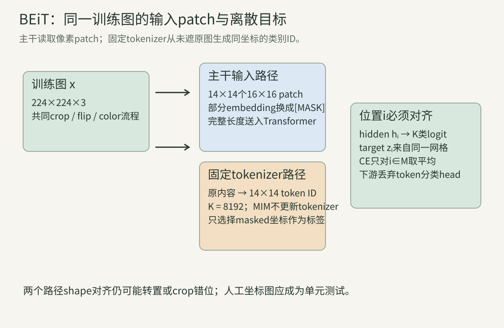
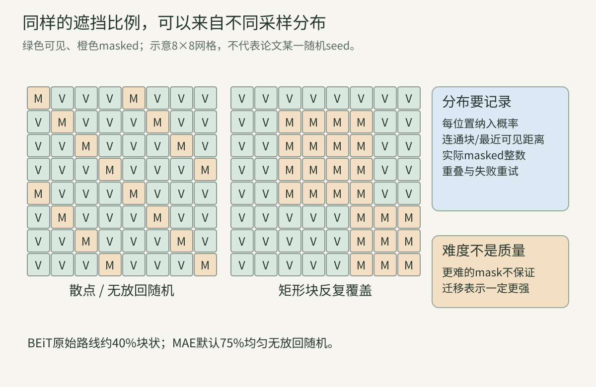
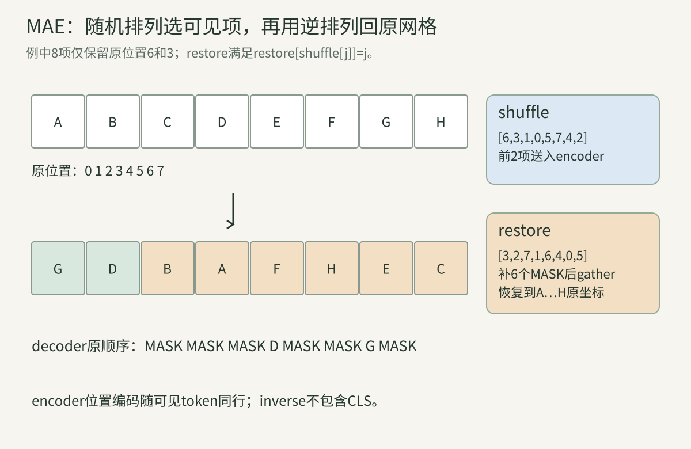
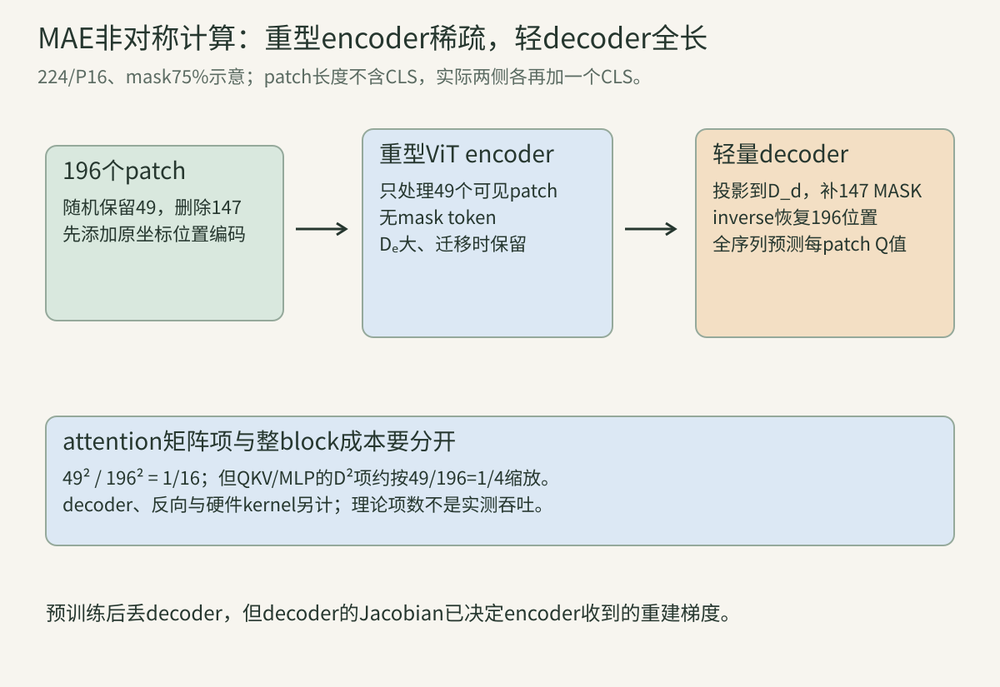
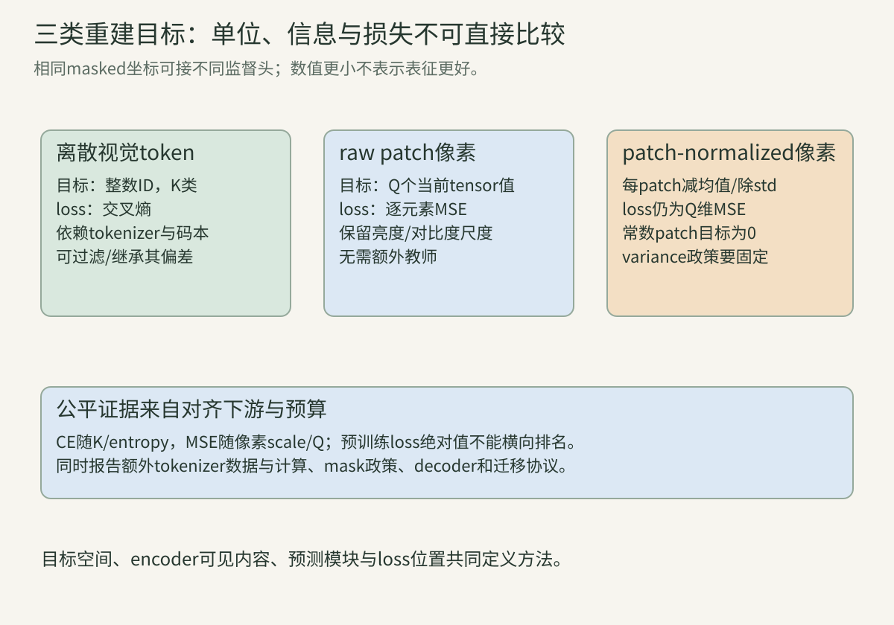

> 掩码图像建模不是“把图片涂黑再做分类”的一个固定算法。必须同时回答：哪些patch被隐藏、encoder实际看见什么、目标是像素还是离散token、预测在哪些位置计分、索引怎样回到原空间、预训练后保留哪些模块。本讲把这些接口逐项写成可计算对象。

常用符号：输入图像$x\in\mathbb R^{H\times W\times C}$，patch边长P，网格$h=H/P,w=W/P$，patch数$L=hw$；$\mathcal M$是被遮位置集合，遮挡比例$r=|\mathcal M|/L$，可见集合$\mathcal V$是其补集。D是Transformer宽度，K是离散词表大小，Q=$P^2C$是一个patch的像素标量数。下标i始终表示原始网格位置。

## 一、先把“遮住再预测”写完整

### 1. 掩码任务的监督来自原图自身

先从原图产生完整目标，再把一部分输入信息隐藏，模型用可见上下文预测缺失位置。标签不是人工类别，而是由原图像素、tokenizer或教师网络生成的目标。

这叫自监督，不表示没有目标，也不表示预测一定有唯一语义答案。草地中被遮的一小块可能有许多合理纹理；训练loss仍拿实际原图中的那一块作为监督样本。

与第16讲对比学习不同，单图内部空间位置直接定义监督关系；与第17讲跨增强表示匹配不同，目标常保留局部内容。三者可以组合，但不能从“都不用类别标签”推为同一目标。

### 2. Patch索引同时承担内容与坐标协议

按行优先编号时，位置$i=yw+x$，反向为$y=\lfloor i/w\rfloor,x=i\bmod w$。patchify把$P\times P\times C$内容展平成Q维向量，不能丢掉它原来的i。

若224×224、P16，则h=w=14、L196、Q=768。位置37对应$y=2,x=9$，覆盖像素行32—47、列144—159；这里端点按整数像素闭区间书写。

patch排列、通道次序、像素normalize和位置编码共同形成协议。目标按另一种排列生成，即使shape相同也会把内容监督到错误位置。

### 算例A：4×4图怎样变成四个2×2 patch？

令第y行第x列像素为$10y+x$，则四行是[0,1,2,3]、[10,11,12,13]、[20,21,22,23]、[30,31,32,33]。P2、行优先patchify得到：

$$
[0,1,10,11],\ [2,3,12,13],\ [20,21,30,31],\ [22,23,32,33].
$$

unpatchify不是简单reshape列表；它要按网格与patch内坐标的轴顺序还原。程序一逐元素验证往返等于原图。

### 3. Mask有替换与删除两种主要语义

替换式：序列仍有L个patch位置，被遮位置输入一个共享的可学习mask向量。BEiT采用此路线，重型encoder仍处理完整序列，位置由位置编码区分。

删除式：被遮patch根本不进入重型encoder，只把可见子集送入；稍后在轻量decoder前补回mask token。MAE采用此路线。两者同样可称mask 75%，encoder长度与计算却完全不同。

把像素涂成0再正常patch embedding是第三种行为：0可能对应归一化后的真实颜色，还会经过投影bias。它不自动等于共享mask embedding，也不等于删除token。

### 4. 二值mask必须规定0和1各代表什么

本讲MAE式mask用$m_i=1$表示删除/计入重建loss，0表示保留。于是$\sum_i m_i=|\mathcal M|$。有些库用True表示可见，读取代码时不能凭变量名猜。

若每图遮挡数固定，batch矩阵$M\in\{0,1\}^{B\times L}$每行和相同；可变比例时总分母应按真实masked数，不能固定写$BrL$后忽略取整与无效pad。

mask还应跟随几何变换后的patch网格。先对原图生成mask再crop，却不变换mask坐标，会造成目标错位或比例变化。

### 5. 只在masked位置计分改变了训练问题

设每位置损失$\ell_i$，常用目标为$L=\sum_i m_i\ell_i/\sum_i m_i$。可见位置可以产生中间特征并帮助预测，但它们的输出不直接承担重建误差。

若改为全位置平均，模型可以花容量复制已见输入，且在高mask率时可见与缺失的权重比例改变。两种目标都合法，却不是日志缩放差异。

分母为0时目标未定义，所以采样器必须保证至少一个masked位置；全遮挡时虽有目标，却可能只学数据先验，完全没有该图可见条件。

### 算例B：为什么全位置loss会稀释缺失误差？

四个位置逐项loss为[0,2,4,0]，mask[0,1,1,0]。masked mean为$(2+4)/2=3$；全位置mean为6/4=1.5。后者还允许位置0和3产生直接监督。

若可见位置复制得极好，增加可见数量会继续压低全位置平均，即使masked预测完全没改善。比较实验必须对齐监督集合和分母。

### 6. 预测目标决定模型被要求保留什么

像素MSE要求数值接近，容易重视颜色、边缘和纹理；离散token交叉熵要求选中tokenizer的码本索引，目标先经过有损量化；教师feature回归又会继承教师的抽象与偏差。

“离散更语义”“像素只低级”都不是无条件定理。tokenizer由什么数据和loss训练、码本使用是否均衡、patch多大、像素是否patch内标准化，都会改变目标信息。

目标越难也不自动越好。无条件噪声或不可预测细节可提高预训练loss，却不一定改善下游；需要消融和迁移评价。

### 7. 先生成target，避免把遮挡泄漏给目标分支

BEiT的视觉token来自原始图像的固定tokenizer，再遮挡patch输入主干。若把已经遮挡的图送入tokenizer，标签会描述mask而非原内容。

MAE像素target直接patchify原始训练张量，mask只选择计分位置。若实现原地把输入patch写成0，再从同一被修改buffer取target，就发生监督泄漏。

几何增强通常先得到本次训练图，再由同一图生成patch和target；颜色增强是否同时作用于target取决于定义。保存流水线顺序比只写“用了crop和mask”更重要。

### 8. 固定数量均匀采样的masked mean是无偏估计

给定一张图的L个固定逐位置损失，从所有大小m的子集均匀采样。每位置被选概率m/L，所以：

$$
E_{\mathcal M}\left[\frac1m\sum_{i\in\mathcal M}\ell_i\right]
=\frac1m\sum_i\frac mL\ell_i=\frac1L\sum_i\ell_i.
$$

这是对固定loss向量的抽样恒等式，不表示梯度方差小，不表示block mask同样均匀，也不表示训练时预测不依mask。程序四对六位置全部组合枚举验证。

## 二、BEiT：预测固定tokenizer的离散视觉token

### 9. 同一张图提供两种表示视图

BEiT将224×224图分成14×14个16×16输入patch，同时用图像tokenizer得到14×14个离散视觉token。二者位置数同为196，内容空间不同。

主干输入是像素patch的线性投影；监督标签是整数token ID。不能把“visual token”理解成主干输入embedding本身，也不能把8192类softmax输出当RGB值。

原论文把这类BERT式任务称Masked Image Modeling。名称类比语言MLM，但图像patch连续、空间冗余高，目标tokenizer与遮挡策略是视觉特有设计选择。

### 10. Image tokenizer是预先训练的独立模型

记$q_\phi(z|x)$将图像映射成离散网格，码本$\mathcal V=\{1,\ldots,K\}$。BEiT原论文直接借用DALL-E路线的dVAE tokenizer，K8192，并在MIM阶段固定它。

固定意味着主干交叉熵不反传更新phi，也不反传到tokenizer decoder。训练标签可离线预计算或在线无梯度产生；两种工程方案要对齐crop、版本和存储成本。

token ID的数值大小没有距离语义：类别17不比类别16“多1像素”。交叉熵把它们作为名义类别；码本embedding距离是tokenizer内部的另一对象。

### 11. dVAE为何需要离散化技巧？

dVAE encoder输出每空间位置对K个码的分布，硬argmax/抽样得到离散z，decoder由z重建图。硬选择不可普通求导，tokenizer训练可用Gumbel-softmax等连续松弛。

这个困难属于tokenizer的第一阶段。BEiT第二阶段把最可能token当固定类别标签，用普通softmax交叉熵训练主干，不需要在MIM反向中再次穿过Gumbel-softmax。

把两个阶段混写成“一次端到端训练”会算错状态、梯度和数据。若研究联合训练变体，应明确它已离开原始两阶段协议。

### 算例C：8192类需要多少输出logit？

B2、每图75个masked位置，分类头输入150个D维hidden，输出shape150×8192，共1,228,800个logit。float32仅该输出约4.69MiB，反向与softmax临时量另计。

若错误地为全部196位置都保留logit，则B2输出3,211,264项，约12.25MiB。作者固定实现先取masked hidden再由head输出或等价选择，具体中间保存依实现图而定。

### 12. 14×14对齐是监督成立的前提

第i个主干patch必须预测第i个视觉token。即使tokenizer内部下采样机制不同，只要最终网格14×14，仍要确认方向、行列顺序和增强后的图相同。

若主干用224输入而tokenizer错误使用未同步的原图或另一crop，标签位置会语义错配。若tokenizer网格7×7，则不能直接把一个标签复制给四个patch而声称复现原目标。

对齐测试可用人工坐标图：每块填不同值，检查patch ID、token网格坐标和mask位置。只比较shape会漏转置与水平翻转错误。

### 13. 码本是有损瓶颈，也是一套监督词汇

K有限时，不同图块可映到同一token；同一视觉模式也可能因上下文或tokenizer误差分到不同token。码本压缩掉什么，由第一阶段重建目标、架构、数据和先验决定。

码本使用不均会造成类别先验偏斜。若某些token极常见，模型靠局部先验就能得到不差的CE；应看token频率、perplexity、空间混淆和下游，而非只看top-1 token准确率。

离散目标限制了每位置监督为$\log K$量级的类别不确定性，却不保证它是语义类别。视觉token与文字token都叫token，不代表共享词表或可直接互译。

### 14. Patch embedding、CLS与位置编码仍是ViT接口

未遮patch先展平并乘$E\in\mathbb R^{Q\times D}$。序列前加CLS/Special token，再加可学习位置编码。BEiT-Base沿ViT-Base使用12层、D768、12头、MLP中间3072、P16。

位置编码要包含CLS和196个网格位置，共197项。mask token替换的是patch内容embedding；位置embedding仍告诉网络“缺的是哪一格”。

预训练分类头输出K8192，微调分类时换成任务head；不能保留视觉token head并把其8192输出误当ImageNet类别。

### 15. BEiT把mask token放进重型encoder

固定作者实现先得到196个patch embedding，用$w_i\in\{0,1\}$计算$x_i(1-w_i)+e_{[M]}w_i$，再拼CLS并处理全197长度。

因此40%遮挡不会把attention长度降到60%；所有mask位置仍参与每层attention，彼此可读同一个共享内容向量和不同位置编码。计算节省不是BEiT原设计的主要来源。

共享mask token不含原内容，但模型可能利用邻域、全局形状与位置先验预测。给每个位置不同可学习mask内容会引入位置捷径，与共享token+位置编码的职责不同。

### 算例D：替换式与删除式的attention分数数目

L196且忽略CLS，BEiT替换式每层每头仍有$196^2=38416$个query-key分数。MAE删75%后encoder只见49个patch，为$49^2=2401$，即1/16。

这只是attention矩阵项比；QKV/MLP大致按token线性缩放，MAE还有全序列decoder。不能据1/16宣称整训练恰快16倍。

### 16. 原论文使用块状遮挡约40%

BEiT不是独立Bernoulli逐格mask。算法反复采样矩形块，原论文最小面积16个patch、长宽比在0.3到1/0.3附近对数范围采样，直到接近40%。

相邻大块被隐藏，降低仅复制最近纹理的机会；但块状分布也改变中心/边界位置被遮概率和任务难度。它不是均匀固定子集，所以第8节无偏证明不能直接照搬。

14×14共196，40%为78.4；论文训练设置写最多75个patch，约38.3%。文字“约40%”与整数生成器配置应同时记录。

### 算例E：75个masked patch对应什么比例？

$75/196\approx0.382653$，可见121个。若直接`int(196*0.4)`得到78，比作者默认75多3个；若round得到78也不同。

“40%”不足以复现实验，需保存网格、精确数量、取整、最小/最大block、长宽比和失败重试策略。

### 17. 实际block生成器可能提前停止

固定代码每次最多尝试10个矩形，只接受新增面积大于0且不超剩余额度；若某轮找不到合法新增块，返回delta0，外层直接停止。因此在极端网格/配置下，实际masked数可能小于请求值。

训练不应假定mask行和永远等于配置而不检查。日志记录实际最小/最大/均值；loss分母按真实选择位置。旧代码中的`np.int`还依赖NumPy版本，历史源码可读不代表当前环境直接运行。

算法伪码中的“直到超过0.4N”和实现中“不超过剩余精确填充”也有细节差异；复现结论应固定到具体版本。

### 18. 每个masked位置做K类交叉熵

主干最后hidden $h_i\in\mathbb R^D$，分类头$W_c\in\mathbb R^{K\times D},b_c\in\mathbb R^K$，logit $a_i=W_ch_i+b_c$。标签是tokenizer给出的$z_i$。

$$
L_{\rm BEiT}=-\frac1{|\mathcal M|}\sum_{i\in\mathcal M}\log\frac{e^{a_{i,z_i}}}{\sum_{k=1}^K e^{a_{ik}}}.
$$

稳定实现先减该行最大logit。平均还是求和会按masked数量缩放梯度；原论文目标写log-likelihood求和，训练实现常由CE默认mean归约，复现要核对代码。

### 19. CE梯度只在被选输出位置非零

对一个masked位置，概率$p_{ik}=\operatorname{softmax}(a_i)_k$，平均归约后：

$$
\frac{\partial L}{\partial a_{ik}}=\frac{p_{ik}-\mathbf1[k=z_i]}{|\mathcal M|}.
$$

再有$G_{h_i}=W_c^TG_{a_i}$。可见位置没有直接分类head梯度，但它们作为attention的key/value影响masked hidden，仍可从masked loss间接收到梯度。

程序二用四位置三类toy检查全部12个logit；两个可见位置的输出梯度精确0，masked位置经上下文回到早期网络的间接路径不在这个孤立head程序中。

### 算例F：手算一个三类masked位置

logit(0.2,1.1,−0.3)，标签1。减最大1.1后指数约(0.4066,1,0.2466)，概率约(0.2460,0.6049,0.1491)，单位置CE约0.5026。

若本图共两个masked位置取平均，该行logit梯度约(0.1230,−0.1976,0.0746)。三项和0，表示共同平移全部logit不改softmax。

### 20. 只预测masked token，避免抄写可见输入

固定作者模型默认返回`lm_head(x[bool_masked_pos])`，训练标签也只选masked位置。若返回all tokens用于分析，调用方仍需决定loss集合。

对可见位置预测token可能成为容易的局部编码任务，改变目标权重；原论文消融也观察恢复全部视觉token会伤害迁移表现。该经验只支持其设置，不能升级为所有重建任务的普遍定理。

mask token位置的hidden仍可相互注意，分类head每位置独立共享参数。空间信息已在Transformer上下文融合，不表示softmax head本身有卷积邻域。

### 21. K类head的参数与计算不能漏算

W为8192×768，共6,291,456个weight，bias8192，总6,299,648个参数。float32权重约24.03MiB；optimizer状态与gradient另计。

每个masked位置做约$DK$个乘加，75位置约4.72亿MAC/图，仅为分类投影的数量级账本；具体融合kernel与硬件耗时需要实测。减少输出位置能明显降低head计算，即使主干仍处理全序列。

下游丢弃head后，这些参数不进入部署encoder。预训练成本和最终模型参数量应分别报告。

### 22. 变分视角解释两阶段怎样拼起来

令原图x、遮挡图$\tilde x$、离散潜变量z。论文将恢复原图的下界拆为tokenizer重建项与预测潜token的项：

$$
\log p(x|\tilde x)\ge E_{q_\phi(z|x)}[\log p_\psi(x|z)]-D_{KL}[q_\phi(z|x)\|p_\theta(z|\tilde x)].
$$

第一阶段训练$q_\phi,p_\psi$；第二阶段固定它们，并用argmax token近似单点分布，学习$p_\theta$预测token。于是第二项化为正确token log-likelihood。

这是论文的建模解释，实际CE代码仍要按具体mask和归约读取。固定argmax丢掉tokenizer不确定性；若改为软分布蒸馏，目标和梯度都不同。

### 算例G：硬token隐藏了teacher不确定性

tokenizer在某位置给三个码概率(0.45,0.44,0.11)，argmax标签为第0类；另一个位置概率(0.99,0.005,0.005)也给第0类。硬CE把两者视作同样确定的标签。

软交叉熵会保留分布差异，但不是原始BEiT的硬token目标。比较两者时应报告温度、是否stop-gradient以及tokenizer概率校准，不能只称“同一个tokenizer”。

### 23. 固定tokenizer既提供稳定目标，也封住上限

固定目标不会随着主干训练漂移，便于CE优化；也意味着码本合并的细节、训练数据偏差和错误持续作为监督。主干无法通过本阶段梯度修正tokenizer。

tokenizer重建好不等于其token最利于识别；像素似然、感知质量、码本利用与下游语义并非同一指标。原论文消融是该tokenizer/数据下的证据。

新数据域若与tokenizer训练域差异大，token分布可能退化。先测码本覆盖、频率、重建与空间稳定，再解释MIM主干失败。

### 24. Token accuracy与表征质量不能互相替代

高token top-1可能来自局部纹理捷径或类别先验；低top-1也可能因多个码近似等价而不伤语义。CE、top-k、码本embedding距离、重建图和下游指标回答不同问题。

遮挡比例、block大小会改变token准确率难度。不同K的随机基线与entropy不同，不能直接比裸CE。至少同时报告K、token频率与归约。

线性probe和fine-tune又读取encoder不同适应能力。一个checkpoint可fine-tune强但冻结probe一般，不能只凭一项宣布所有表示更好。

### 25. 预训练架构与下游接口

BEiT预训练保留ViT encoder的CLS与patch tokens。分类可接CLS head；语义分割需要空间patch特征和任务decoder。视觉token分类head在迁移时删除。

微调无mask原图时，不再向patch位置放mask token。位置分辨率改变需按第12/15讲的插值协议；预训练有mask不代表推理也随机遮挡。

LayerNorm、相对/绝对位置版本和stochastic depth等实现细节会影响checkpoint兼容。仅匹配“BEiT-Base”名称不足以加载任意实现。

### 26. 下游提升不能单独归因于某一个组件

原论文同时采用离散token目标、块状mask、ViT训练配方与特定数据预算。像素目标/随机初始化消融能隔离部分因素，但结论受配置范围限制。

将BEiT与MAE比较时，还同时改变发表时间、训练轮数、增强、mask率、encoder是否稀疏、decoder和目标归约。公平机制实验应在同代码基线逐项替换。

论文报告的历史ImageNet数值用于理解影响，不是本站当前复现结果；本讲没有运行大规模预训练。

### 27. 原论文消融说明什么边界？

论文设置中，预测视觉token优于其像素回归对照，block mask与只恢复masked位置有益。这支持设计选择在该基线有效。

它不证明所有离散token都优于所有像素目标。MAE随后展示patch归一化像素目标在自身架构中很强，正说明目标与架构/训练配方交互。

引用消融要同时给对照改变内容。若像素baseline的decoder容量、normalization或encoder可见长度不同，就不能只用“target类型”解释全部差异。

### 28. BEiT复现最小清单

保存tokenizer权重与hash、输入归一化/resize/crop顺序、token网格/K/argmax政策、patch网格与方向、mask生成器全部参数及实际数量、mask token位置、位置编码、主干/head形状、只选masked标签的索引、CE归约、optimizer/schedule/seed和下游接口。

做三个单元测试：人工坐标图验证patch-token-mask对齐；固定logit验证CE/梯度；同图同mask在恢复checkpoint前后逐位标签与loss一致。再做真实单卡/多卡归约对照。

作者仓库是历史代码，依赖可能老化。本讲固定源码用于核对逻辑，没有把“能下载”写成“当前环境已经训练通过”。

## 三、MAE：重型encoder只处理可见patch

### 29. 每张图独立做均匀无放回随机遮挡

MAE为每图L个token生成独立均匀噪声，按噪声排序，保留最小的$L_{keep}=\lfloor L(1-r)\rfloor$项。连续随机数几乎不会相等，所以得到均匀随机排列。

它等价于从L位置无放回选固定大小的可见子集。不是每位置独立Bernoulli：masked总数固定，位置事件之间负相关。

默认r0.75，L196，keep49、mask147，恰好整数。若L不是4的倍数，取整会使实际比例不同；记录整数比只写0.75更精确。

### 算例H：L10、r0.75实际留下几个？

$\lfloor10(1-0.75)\rfloor=2$，实际mask8、比例0.8，而不是7.5个。若round keep得到2仍相同，若按masked数floor得到7则keep3；实现政策决定任务。

固定作者代码按keep取int截断。变分辨率或非方形网格时要重新计算，不能假设比例永远精确。

### 30. 排序索引同时编码采样与临时顺序

`ids_shuffle`列出原位置按随机噪声从小到大的排列；前keep项是可见原位置。encoder输入因此处在随机排列顺序，但每个token在采样前已经加了其原位置编码。

Transformer对输入排列本身是置换等变的；位置向量随token同行，故语义坐标仍保留。不能在shuffle后按新序号重新加位置编码，那会把随机排列误当空间坐标。

mask先在shuffle顺序造[0…0,1…1]，再用inverse index恢复到原位置，最终$m_i$才能与target第i项对齐。

### 31. ids_restore是逆排列，不是可见索引本身

若`ids_shuffle[j]=i`表示shuffle第j项来自原位置i，则逆排列满足`ids_restore[i]=j`。所以对shuffle序列按`ids_restore` gather可回到原顺序。

程序一的8项例得到shuffle[6,3,1,0,5,7,4,2]，restore[3,2,7,1,6,4,0,5]；逐项验证`restore[shuffle[j]]=j`。

保存可见token后，在其后追加6个共享MASK得到shuffle顺序，再按restore恢复：原位置3、6保留D/G，其余为MASK。用shuffle直接“恢复”会再次置换，通常错。

### 算例I：三项排列的逆怎样求？

原序列[A,B,C]，shuffle[2,0,1]得到[C,A,B]。原位置0位于shuffle位置1、原1位于2、原2位于0，所以restore[1,2,0]。

用[C,A,B]按restore gather得[A,B,C]。shuffle与restore恰巧可能相同，但本例不是；写通用测试不能只选自逆排列。

### 32. Encoder中完全没有mask token

MAE先做patch embedding并加encoder位置编码，然后删除masked token，再拼CLS。重型ViT只处理49个可见patch+CLS，不接收147个mask向量。

这同时减少主干计算并避免训练时encoder输入被大量同质mask token占据。下游无mask图时encoder处理完整196 patch，存在序列密度变化；原论文消融支持其设置有效。

“没有mask token”只指encoder。decoder明确需要mask token补齐全序列；把两个阶段混说会形成表面矛盾。

### 33. CLS不参加随机patch采样

随机mask只作用196个patch token。encoder在采样后把CLS+其位置编码放回序列头，因此长度50而非49。

decoder先投影全部encoder输出，单独取CLS；恢复patch序列后再把CLS拼回。`ids_restore`长度196，不包含CLS索引。

若将CLS混入mask排序，可能随机删除它或错位decoder恢复。shape测试应分别记录patch长度L和含CLS长度L+1。

### 34. Decoder先降维，再补全序列

encoder输出宽度$D_e$先经Linear变为decoder宽度$D_d$。可见patch latent与$L-L_{keep}$个共享mask token拼接、按restore回原网格，拼CLS，再加decoder位置编码。

默认decoder宽512、深8、16头；ViT-Base encoder宽768深12。最后Linear将每个patch token投影到Q=$P^2C=768$个像素值。

decoder处理全197长度，却更窄、更浅；它在预训练后被丢弃。轻量是相对encoder逐token成本与最终用途，不表示其计算为0。

### 35. Mask token必须有位置，否则所有缺口初值相同且无坐标

共享mask向量给“这里缺内容”的标记，decoder位置编码给“这是哪个位置”。两者相加后，不同缺失格有相同内容先验、不同空间坐标。

可见latent也需要decoder位置编码，因为encoder位置已被非线性融合且投影到另一宽度；固定实现为decoder维护独立的2D sin-cos位置表。

删除位置编码并不保证模型完全不知道位置：边界、可见内容可能泄漏部分坐标，但目标对齐会更困难。机制解释应基于消融，而非只凭直觉。

### 36. patchify的轴排列决定像素向量顺序

固定实现从N×3×H×W reshape为N×3×h×P×w×P，再用einsum变成N×h×w×P×P×3，最后成N×L×Q。

所以每patch向量次序是patch内行、列、通道，RGB在最内层。程序一为了可读使用单通道；真实Q768的通道顺序需与decoder输出完全一致。

unpatchify反向轴置换。可视化重建正确是有用检查，却不能替代逐元素round-trip，因为某些转置图仍“看起来像图”。

### 算例J：P16、RGB时decoder最后一层多宽？

$Q=16^2\times3=768$。decoder宽512到输出768的Linear有512×768+768=393,984参数。

若P14，则Q588；直接加载P16 decoder head会shape不匹配。patch大小改变还会改变L、位置编码和mask整数，不只是最后一层。

### 37. Raw像素MSE的完整归约

预测$\hat y_i\in\mathbb R^Q$，target patch$y_i$。先对patch内Q项平均：$\ell_i=\frac1Q\|\hat y_i-y_i\|^2$，再只对masked patch平均：

$$
L_{\rm MAE}=\frac1{|\mathcal M|Q}\sum_{i\in\mathcal M}\sum_{q=1}^Q(\hat y_{iq}-y_{iq})^2.
$$

batch实现再汇总每图，若每图masked数相同，所有masked项mean等价。可变数量或pad时需按真实权重说明是图均值还是全元素均值。

图像进入模型前通常做数据集mean/std normalize；代码中的“unnormalized pixels target”指相对于patch内normalize选项，target仍是当前训练tensor的数值。不能据术语假设必为0—255原始整数。

### 38. Patch内normalized pixel target去掉亮度与对比度尺度

对每个patch独立算均值$\mu_i$与方差$v_i$，目标$y'_{iq}=(y_{iq}-\mu_i)/\sqrt{v_i+\epsilon}$。固定代码用`torch.var`默认政策；其具体分母受所固定框架语义影响，历史常为Q−1。

每patch常数时中心化全0，目标向量0。标准化使不同亮度/对比度patch落到相似形状目标，可能更强调局部结构；同时不要求decoder还原绝对patch亮度。

论文报告normalized pixels改善其表示质量，代码默认开关却是False，训练命令/recipe可另行开启。读取模型构造默认值不等于论文某张表的最终配置。

### 算例K：四像素patch的样本标准化

patch[1,2,3,4]，均值2.5，平方偏差和5，样本方差5/3，忽略epsilon的std约1.2910，目标约[−1.1619,−0.3873,0.3873,1.1619]。

若除Q得到方差1.25、目标[−1.3416,−0.4472,0.4472,1.3416]。两者shape相同但数值不同；本章程序三明确采用Q−1以对齐所核对代码的历史默认语义。

### 39. Masked-only MSE让可见输出head梯度为0

对mask位置：

$$
\frac{\partial L}{\partial \hat y_{iq}}=\frac{2(\hat y_{iq}-y_{iq})}{|\mathcal M|Q};
$$

可见位置该直接导数为0。decoder仍同时处理所有token，可见输出不是监督终点，但可见latent通过attention帮助masked输出。

目标y或y'由输入构造，通常视作固定监督，不需要通过target normalization反传回图像。若做输入梯度分析，要明确是否detach target；训练参数梯度不受输入是否requires-grad影响。

### 40. Masked数改变会缩放单项梯度

同一误差d，masked数从49增至147，单项梯度系数减为1/3，但监督位置变3倍；总梯度统计、任务难度与上下文也同时变化。

若使用sum而非mean，高mask率会仅因项数增大loss/梯度。比较比例时应固定归约，记录lr与global batch，再解释最优点。

程序三有3个patch、mask[1,0,1]、Q4，检查12项预测差分；可见patch四项梯度精确0。normalized target MSE与raw MSE数值不同，不表示前者在任意预测下总更小。

### 41. 为什么视觉能使用很高的mask比例？

自然图像在空间上高度冗余：邻近像素相关、物体结构跨patch延续。低mask率时模型可能靠局部插值解决，未必学习长程结构；提高到75%减少这种捷径并扩大每图监督位置。

比例过高又会让可见条件不足，目标趋向多解，可能主要预测平均纹理。原论文在其随机采样/架构中观察75%良好、40—80%有较宽可用区间；这是经验曲线，不是所有数据的常数。

医学小病灶、文字细节、遥感微目标或极小图像的冗余结构不同。mask比例应按目标尺度、patch大小和下游验证重新研究。

### 算例L：75%与80%各保留多少patch？

L196，75%保留49；代码按keep int，80%计算`int(39.2)=39`，实际mask157、比例80.102%。论文图中“80%留下39”与此一致。

若展示时说留下40，可能采用round或按mask floor。可视化文字、训练代码和成本表必须使用同一整数政策。

### 42. Encoder attention项随可见长度平方下降

忽略CLS，比例r时可见$L_v\approx(1-r)L$，attention score矩阵相对全序列约$(1-r)^2$。r0.75得0.0625，r0.8约0.04。

但QKV投影、输出投影和MLP按$L_vD^2$线性于token数；高D时这些项可能占主导。一个Transformer block粗略MAC可写$12LD^2+2L^2D$（QKV+attention输出+ratio4 MLP，忽略bias/norm），代入新的L而非只看L²。

decoder仍处理全L、patch embedding先为全patch生成token，数据与重建head也有成本。论文历史报告3×以上训练加速属于特定实现/硬件，不由单一公式自动保证。

### 43. 用ViT-Base粗算一个block的主项

全L196、D768：线性主项$12LD^2\approx1.387$G MAC，attention乘法$2L^2D\approx0.059$G，总约1.446G。可见L49时约0.347G+0.0037G=0.351G，约24.3%。

它接近token比例1/4而非attention矩阵的1/16，因为D²线性项占主导。加CLS、反向、激活、kernel效率和decoder会改实测。

这个算例也解释为何只说“self-attention是平方复杂度，所以75% mask快16倍”会夸大整体收益。

### 44. 非对称架构把重建专用容量放在可丢弃模块

encoder需学可迁移表示，decoder负责把latent和位置变成像素。把decoder做得相对轻，可减少主干被低级重建细节占用的压力，并让昂贵encoder只处理可见子集。

decoder太弱可能无法在mask token之间传播上下文；论文指出至少一个Transformer block能做这种传播。decoder更深可降低重建难度，但下游提升不一定单调。

“decoder被丢弃”不表示它对encoder训练无影响；其Jacobian决定重建梯度怎样回到encoder。更换decoder会改变预训练表示。

### 45. Decoder宽度与深度是训练超参数

默认宽512深8是原论文折中，并非MAE定义的唯一值。encoder ViT-B/L/H均可配相同默认decoder规格，最后输出维Q按patch大小变化。

参数数和每token FLOPs可算，实际吞吐还依全长度、显存和kernel。较窄decoder要用Linear从encoder宽映射，不能直接拼不同宽mask token。

复现实验保存decoder位置编码是否固定、head bias、LayerNorm、深度/头数/MLP ratio。只保存encoder checkpoint不能从中恢复预训练loss轨迹。

### 46. Raw、normalized pixel与dVAE token是三类目标

Raw pixel MSE保留当前训练tensor的绝对数值；patch-normalized pixel MSE去掉每patch均值/尺度；dVAE token用K类CE量化为离散索引。目标维度、loss单位和不可预测性都不同。

MAE论文在自身比较中，dVAE token优于unnormalized pixels，却与normalized pixels统计相近，并且dVAE需要额外tokenizer训练。这个结论不等于tokenizer永远无价值；后来方法会用更强教师feature。

比较训练loss绝对值没有意义：MSE单位随像素scale，CE随K和entropy。应在相同下游协议下评价，并报告额外预训练数据/模型。

### 算例M：常数patch的normalized目标是什么？

[3,3,3,3]均值3、方差0，加epsilon后每个分子仍0，所以target[0,0,0,0]。decoder预测0即可在该patch达到0 loss，绝对亮度3不会被目标要求恢复。

若可视化normalized预测，必须反标准化才能与原图亮度比较；但masked patch真实均值/std在推理重建时并非模型已知。论文的可视化与训练target政策需分别核对。

### 47. MAE默认随机mask与BEiT块状mask不等价

随机无放回会把可见patch散布全图，75%仍可能让许多缺失位置靠近可见点；大块遮挡产生连续空洞，在同率下通常更难局部插值。

MAE论文实验中简单随机采样最适合其默认高比例；block mask在50%可工作、75%下降。难度更高不必然带来更好表示。

公平比较mask政策时，应匹配实际masked数、每位置覆盖概率、连通块分布和训练预算。只展示一张好看的mask图不能描述采样分布。

### 48. 为什么只在masked位置算loss？

可见patch的像素已经直接输入encoder。若其输出也重建，decoder可学近似复制通路，且75% mask下仍有25%的容易项影响目标。

masked-only把有限梯度预算集中在需要上下文推断的位置。MAE论文报告全像素loss略降精度，是其设置的经验依据。

这不表示所有autoencoder都必须masked-only；普通去噪、自编码压缩或生成任务目标不同。论文脚注的差异要保留任务范围。

### 49. Linear probing与fine-tuning会给不同排序

linear probe冻结encoder，只测试现有表示的线性可分性；fine-tune允许所有层适配任务。MAE历史实验显示其冻结线性表现与微调优势并非完全一致。

部分微调、最后若干block或MLP微调介于两者之间。报告“迁移强”需指明协议、层、epoch、增强和超参搜索。

重建表示可能包含可用但未在线性头下直接排列的信息。不能用单个linear分数否定所有迁移，也不能用full fine-tune掩盖预训练初始化差异。

### 50. MAE复现的最小状态清单

保存patch/grid、输入normalize、每图随机noise/seed、mask ratio和keep取整、shuffle/restore/visible索引、encoder/decoder位置表、CLS政策、decoder结构、patchify轴、raw或normalized target及variance correction/epsilon、masked-only归约、optimizer/schedule/epoch、分布式sampler和下游协议。

单测必须含非自逆排列、非方形或明确拒绝非方形、P变化、r0/r1边界、每图不同mask和patchify往返。训练时记录实际可见数与loss分母。

固定作者代码只支持方形图的unpatchify断言与固定2D sin-cos表；扩展矩形应明确重写，而不是删assert后假定正确。

## 四、把BEiT与MAE放在同一坐标系比较

### 51. 比较表先对齐五个接口

| 接口 | BEiT原始路线 | MAE原始路线 |
| --- | --- | --- |
| encoder输入 | 完整长度，masked处换共享token | 只保留可见patch，无mask token |
| 默认遮挡 | 约40%，块状 | 75%，均匀无放回随机 |
| 目标 | 固定dVAE的8192类token | patch像素，可选patch内normalize |
| 预测模块 | encoder后K类共享head | 轻量全序列Transformer decoder+Q维head |
| 预训练后保留 | encoder，丢token head/tokenizer | encoder，丢decoder |

这五项共同决定任务；不能用“BEiT=分类、MAE=回归”两个词替代计算图。两者都只在masked位置计主要监督，也都依位置对齐。

### 52. 语义目标与像素目标没有脱离架构的胜负

离散token可过滤部分高频细节，但受tokenizer质量和额外数据影响；normalized pixels简单、无需教师，却让decoder承担从上下文生成局部结构的任务。

目标抽象程度越高，主干可能更靠近语义，也可能继承教师盲点；目标越低级，训练信号密集，也可能把容量用于不可迁移细节。真实结果依mask、decoder和预算。

后续章节会看到HOG/教师feature/多尺度目标等中间路线。这里建立的是分析轴，不提前把技术史压成单一路线。

### 53. Mask比例同时改变信息、监督数与计算

提高r减少encoder条件、增加masked监督位置；删除式还降低encoder token数，替换式则不降长度。三种作用纠缠。

要研究“任务难度”可保持encoder长度并换token；研究“计算稀疏”可固定目标数量再采样可见；研究“监督密度”需控制归约。否则一个ratio消融同时改变多件事。

论文最佳比例是系统最优点，不是单一因果变量的自然常数。跨分辨率时L变化，固定比例还改变绝对上下文数量。

### 算例N：同为75% mask，为何成本不同？

L196，替换式encoder处理196个patch；删除式处理49个。两者masked监督均147，但BEiT式K类head与MAE式Q回归head/decoder又不同。

若只写“两个方法都是75%”，无法推断计算或难度。至少给encoder长度、decoder长度、D/K/Q和block层数。

### 54. 重建图好看不是表征评价

MSE倾向平均多解，可能模糊但encoder迁移强；生成锐利纹理可能来自decoder先验，未必意味着encoder包含更好类别信息。重建可视化适合查错与理解，不是唯一排名指标。

同理token准确率衡量对tokenizer标签拟合，不直接衡量检测/分割。需要冻结probe、full fine-tune、dense迁移和不同数据域。

展示图应注明mask、颜色反归一化和是否把可见原图直接贴回。把可见patch原样拼回会让整体图更漂亮，却没有评价这些位置预测。

### 55. 数据泄漏与位置捷径的专项检查

检查target是否来自未遮输入、mask是否意外编码内容、文件重复是否跨train/test、增强随机数是否让两分支不同步。对mask用固定图案时，模型可能学位置先验。

随机替换patch若从同图其他位置取值，可能泄露颜色/对象；压缩图的block artifact也可能揭示被遮内容。自监督不自动免疫数据泄漏。

反事实测试：保持可见patch不变、替换masked真值，预测应不在前向中读取真值；打乱target索引应显著破坏学习；可见位置target修改不应改变masked-only当前loss。

### 56. 下一阶段：从重建目标走向教师特征

BEiT证明离散视觉token可做BERT式目标，MAE证明简单像素与稀疏encoder可扩展。后续iBOT、data2vec、MaskFeat、BEiT v2等会改变教师、目标层或局部/全局联合方式。

阅读任何新MIM先填本讲五栏：mask分布、encoder可见内容、target生成器、预测模块、loss位置/归约；再看教师是否EMA、是否多尺度、是否用CLS全局目标。

这样能分辨论文真正改变了什么，也能避免把“用了mask”当全部创新。

## 五、四个完整程序：索引、目标与梯度核查

四段程序只用Python标准库，已在本站环境运行。它们验证教学函数，不安装PyTorch、不执行作者训练入口，也不声称复现ImageNet结果。

### 57. 程序一：patch往返、随机mask与inverse restore

4×4单通道图以P2切成四块，逐元素round-trip。随后8个字母token按固定seed生成随机排列，保留25%，构造inverse并补MASK。断言每个可见字母回到原位置、每个masked位置一致。

~~~python
import random

def patchify(image, patch):
    h, w = len(image), len(image[0])
    assert h % patch == 0 and w % patch == 0
    out = []
    for gy in range(h // patch):
        for gx in range(w // patch):
            out.append([image[gy*patch+dy][gx*patch+dx]
                        for dy in range(patch) for dx in range(patch)])
    return out

def unpatchify(tokens, grid_h, grid_w, patch):
    image = [[0] * (grid_w * patch) for _ in range(grid_h * patch)]
    for k, token in enumerate(tokens):
        gy, gx = divmod(k, grid_w)
        for t, value in enumerate(token):
            dy, dx = divmod(t, patch)
            image[gy*patch+dy][gx*patch+dx] = value
    return image

image = [[10*y+x for x in range(4)] for y in range(4)]
patches = patchify(image, 2)
assert patches == [[0,1,10,11],[2,3,12,13],[20,21,30,31],[22,23,32,33]]
assert unpatchify(patches, 2, 2, 2) == image

def random_mask(tokens, ratio, seed):
    rng = random.Random(seed)
    length = len(tokens)
    keep = int(length * (1-ratio))
    noise = [rng.random() for _ in tokens]
    ids_shuffle = sorted(range(length), key=noise.__getitem__)
    ids_restore = [0] * length
    for shuffled_pos, original_pos in enumerate(ids_shuffle):
        ids_restore[original_pos] = shuffled_pos
    visible = [tokens[i] for i in ids_shuffle[:keep]]
    mask_shuffled = [0] * keep + [1] * (length-keep)
    mask_original = [mask_shuffled[ids_restore[i]] for i in range(length)]
    return visible, mask_original, ids_shuffle, ids_restore

visible, mask, shuffle, restore = random_mask(list('ABCDEFGH'), .75, 7)
assert len(visible) == 2 and sum(mask) == 6
assert all(restore[shuffle[j]] == j for j in range(8))
decoder_shuffled = visible + ['MASK'] * 6
decoder_original = [decoder_shuffled[restore[i]] for i in range(8)]
assert all((decoder_original[i] == 'MASK') == bool(mask[i]) for i in range(8))
assert [decoder_original[i] for i in range(8) if not mask[i]] == [chr(65+i) for i in range(8) if not mask[i]]
print('patches', patches)
print('shuffle', shuffle, 'restore', restore)
print('visible', visible, 'mask_original', mask)
print('decoder_original', decoder_original)
print('patch round-trip and MAE restore-index checks passed')
~~~

### 58. 程序二：BEiT masked-only交叉熵完整梯度

四位置、三类，只监督位置1和2。稳定softmax、CE与解析logit梯度全部实现，对12项中心差分；最大误差约2.69e−12。程序另算all-token CE0.556664，与masked CE0.443367不同。

~~~python
import math

logits = [[2., .5, -1.], [.2, 1.1, -.3], [-.5, .4, 1.5], [1., 1., 1.]]
labels = [0, 1, 2, 1]
mask = [0, 1, 1, 0]

def objective(back=False):
    chosen = [i for i, m in enumerate(mask) if m]
    loss, grad = 0., [[0.]*3 for _ in logits]
    for i in chosen:
        row = logits[i]; mx = max(row)
        exp = [math.exp(x-mx) for x in row]; den = sum(exp)
        prob = [x/den for x in exp]
        loss -= math.log(prob[labels[i]]) / len(chosen)
        for k in range(3):
            grad[i][k] = (prob[k] - (k == labels[i])) / len(chosen)
    return (loss, grad) if back else loss

loss, grad = objective(True)
step=1e-5; errors=[]
for i in range(4):
    for k in range(3):
        old=logits[i][k]
        logits[i][k]=old+step; plus=objective()
        logits[i][k]=old-step; minus=objective()
        logits[i][k]=old
        errors.append(abs((plus-minus)/(2*step)-grad[i][k]))
assert max(errors) < 1e-9
assert all(v == 0 for i in (0,3) for v in grad[i])

def all_token_loss():
    total=0.
    for row,y in zip(logits,labels):
        mx=max(row); den=sum(math.exp(x-mx) for x in row)
        total += math.log(den) - (row[y]-mx)
    return total/len(logits)

print('masked_CE', loss, 'all_token_CE_different_objective', all_token_loss())
print('masked_logits_gradients', [grad[i] for i in range(4) if mask[i]])
print('visible_position_gradient_zero', True, 'checked_scalars',12,'max_error',max(errors))
print('BEiT masked-only cross-entropy checks passed')
~~~

### 59. 程序三：patch normalized pixel MSE与梯度

三patch×四值，mask[1,0,1]。每patch以Q−1样本方差标准化target，loss先patch内mean再masked mean；12项prediction差分最大误差约8.43e−11。中间可见patch直接梯度全0，常数patch标准化target全0。

~~~python
import math

target = [[1.,2.,3.,4.], [3.,3.,3.,3.], [2.,4.,6.,8.]]
pred = [[1.5,1.5,3.5,3.5], [2.,4.,2.,4.], [1.,5.,5.,9.]]
mask = [1,0,1]

def normalize_patch(row, eps=1e-6):
    mean=sum(row)/len(row)
    var=sum((x-mean)**2 for x in row)/(len(row)-1)
    return [(x-mean)/math.sqrt(var+eps) for x in row], mean, var

normalized=[]
for row in target:
    z,_,_=normalize_patch(row); normalized.append(z)

def objective(back=False, norm_target=True):
    ref=normalized if norm_target else target
    selected=sum(mask); width=len(pred[0])
    loss=0.; grad=[[0.]*width for _ in pred]
    for i in range(len(pred)):
        for j in range(width):
            d=pred[i][j]-ref[i][j]
            loss += mask[i]*d*d/(selected*width)
            grad[i][j]=mask[i]*2*d/(selected*width)
    return (loss,grad) if back else loss

loss,grad=objective(True); step=1e-5; errors=[]
for i in range(3):
    for j in range(4):
        old=pred[i][j]
        pred[i][j]=old+step; plus=objective()
        pred[i][j]=old-step; minus=objective()
        pred[i][j]=old
        errors.append(abs((plus-minus)/(2*step)-grad[i][j]))
assert max(errors)<1e-9 and grad[1]==[0.]*4
assert normalized[1]==[0.]*4
raw_loss=objective(norm_target=False)
print('normalized_targets', normalized)
print('masked_normalized_pixel_MSE',loss,'masked_raw_pixel_MSE',raw_loss)
print('visible_patch_gradient_zero',True,'checked_scalars',12,'max_error',max(errors))
print('per-patch normalization and masked-only MSE checks passed')
~~~

### 60. 程序四：均匀mask期望、block反例与attention账本

六位置中枚举所有遮三个的20个子集，masked mean期望精确等于全位置mean1.0，每位置纳入概率0.5。只取长度3连续block的期望1.075，说明另一采样分布不再共享该例的均匀覆盖。最后列出L196在0/40/75/80%时可见整数和L²比例。

~~~python
import itertools

losses=[.2,1.0,.5,2.1,.7,1.5]
length=len(losses); masked=3
means=[]
for subset in itertools.combinations(range(length),masked):
    means.append(sum(losses[i] for i in subset)/masked)
expected=sum(means)/len(means)
full=sum(losses)/length
assert abs(expected-full)<1e-12

counts=[0]*length
for subset in itertools.combinations(range(length),masked):
    for i in subset: counts[i]+=1
assert len(set(counts))==1 and counts[0]/len(means)==masked/length

def attention_scores(tokens): return tokens*tokens
L=196
ratios=[0,.4,.75,.8]
ledger=[]
for ratio in ratios:
    visible=L-int(L*ratio)
    ledger.append((ratio,visible,attention_scores(visible),attention_scores(visible)/attention_scores(L)))

blocks=[tuple(range(start,start+masked)) for start in range(length-masked+1)]
block_expected=sum(sum(losses[i] for i in s)/masked for s in blocks)/len(blocks)
assert block_expected != full
print('uniform_subset_expected_masked_mean',expected,'full_mean',full,'inclusion_probability',counts[0]/len(means))
print('encoder_attention_score_ledger_ratio_visible_scores_relative',ledger)
print('contiguous_block_expected_mean',block_expected,'different_sampling_distribution',True)
print('sampling expectation and quadratic attention ledger checks passed')
~~~

### 算例O：固定大小均匀mask的纳入概率

L6、每次mask3，共$\binom63=20$种子集。固定位置0与另外5个位置选2个组合，共$\binom52=10$次出现，概率10/20=1/2=m/L。

若只允许连续长度3的四个block，边缘位置0只出现1/4，中间位置2出现3/4；masked mean不再是对所有位置等权的估计。采样政策本身定义位置权重。

### 算例P：masked MSE的一项预测梯度

两个masked patch、每patch Q4；某预测值2、目标−1，误差3。该项梯度$2\times3/(2\times4)=0.75$。若错误只除masked数，梯度3，放大Q4倍。

可见patch同样误差的直接梯度0；但它的latent若影响masked输出，网络早期参数仍可能收到间接梯度。

### 算例Q：encoder与decoder长度账本

MAE ViT-B、L196、r0.75：encoder输入为1个CLS+49可见patch=50；decoder输入为1+196=197。decoder补147个mask token。

将encoder也错误补全会把长度从50变197，破坏稀疏计算；将decoder只留50则没有147个目标位置对应的query，无法按原目标逐格输出。

### 算例R：一种target泄漏

假设mask位置像素先被写成常数0，然后target也从修改后tensor patchify。模型对所有masked位置预测0即可loss0，不需要读取可见图。

这不是“模型太强”，而是target流水线错误。用原图copy生成target、再构造遮挡输入，并加入改变masked原值应改变标签但不改变前向可见输入的测试，可以发现泄漏。

### 算例S：同形状不代表同目标单位

两套decoder都输出B×196×768。一套target是数据集标准化后的raw patch，另一套再做patch内样本标准化。shape相同，第一项可能是−2.1到2.6，第二套每patch均值0且平方统计受epsilon/分母约束。

直接加载同一head可运行，却不表示checkpoint目标兼容。配置、target代码和loss曲线单位都要一起保存。

### 算例T：每图mask数不同的两种batch平均

图A只有1个masked loss2，图B有3个masked loss全0。先每图平均再平均得$(2+0)/2=1$；对全batch四个masked项直接平均得0.5。

两者分别给每图等权和每masked位置等权。固定mask数时相同；可变mask、padding或多尺度时必须选择并记录，不能笼统写mean。

## 六、二十八道练习与完整解析

### 练习1：224×224、P16一共有多少patch？第37项坐标是什么？

**解析：** 每轴14，共196。行优先0起始时$y=\lfloor37/14\rfloor=2,x=37\bmod14=9$，覆盖像素行32—47、列144—159。若用1起始编号答案会变，代码索引政策必须先声明。

### 练习2：mask token替换与把像素置0相同吗？

**解析：** 不同。替换发生在D维patch embedding处，使用共享可学习向量；置0发生在像素输入，经过Linear及bias后可能不是同一向量，0还可能是合法归一化颜色。删除token又是第三种行为，会改变encoder长度。

### 练习3：mask=[0,1,1,0]，逐项loss[0,2,4,0]，masked mean多少？

**解析：** 分子6、mask和2，结果3。全位置mean1.5是另一目标。若mask全0分母0，采样器应禁止或显式跳过，不能靠NaN后处理假装有效step。

### 练习4：为什么先生成完整target再遮输入？

**解析：** 目标应描述被隐藏的原内容。若tokenizer或patchify读取已遮tensor，标签会变成mask/0；模型预测遮挡常数即可作弊。几何增强可先作用于本次图，但主干patch、tokenizer目标和mask坐标必须来自同一增强结果。

### 练习5：固定大小均匀mask的masked mean为何无偏？

**解析：** 每位置纳入概率m/L，期望$E[m^{-1}\sum_{i\in M}\ell_i]=m^{-1}\sum_i(m/L)\ell_i=L^{-1}\sum_i\ell_i$。该证明固定逐项loss；训练预测会随mask变化，block分布也未必每位置等概率。

### 练习6：BEiT的“两个视图”是两次随机crop吗？

**解析：** 此处指同一训练图的连续像素patch输入与离散tokenizer标签两种表示，不等同对比学习的两次增强view。数据管线仍可有随机crop，但主干patch和token目标必须空间对齐。

### 练习7：BEiT视觉token 17与18的距离是1吗？

**解析：** token ID是类别编号，没有有序数值距离。CE只区分正确类别与其余类别。码本embedding可有几何距离，但那是另一个对象；把ID做MSE会人为引入编号顺序。

### 练习8：K8192、D768的分类weight有多少参数？

**解析：** $8192\times768=6,291,456$；加bias8192为6,299,648。float32参数约24.03MiB，gradient/optimizer状态另计。迁移时通常丢弃这个head。

### 练习9：为什么BEiT的40% mask不会让主干attention长度降40%？

**解析：** 它用mask embedding替换被遮patch，196个位置都进入encoder，CLS后197。隐藏内容不等于删除token。MAE才把masked patch从重型encoder移除，再由轻decoder补回。

### 练习10：75/196是多少，能直接写40%吗？

**解析：** 约0.382653，可称“约40%”作概述，复现配置应写75、14×14及生成器参数。直接int(196×0.4)=78不是同一数量，取整与block重叠还影响实际值。

### 练习11：三类logit共同加100，softmax和CE会变吗？

**解析：** 不变，因为分子分母共同乘$e^{100}$；稳定实现先减最大值。梯度三项和0也反映共同平移方向为零。直接exp大logit可能溢出，即使数学概率不变。

### 练习12：可见BEiT位置的head梯度0，表示它不学习吗？

**解析：** 只表示该位置没有直接token CE输出项。它作为attention的key/value影响masked hidden，故早期可见表示与共享参数会收到间接梯度。孤立head梯度与完整Transformer参数梯度不能混同。

### 练习13：硬argmax token丢掉什么信息？

**解析：** 丢掉tokenizer对其他码的概率与置信度。(0.45,0.44,0.11)和(0.99,0.005,0.005)都变标签0。软目标可保留不确定性，但它是新目标，需记录温度和归约。

### 练习14：ids_shuffle=[2,0,1]的inverse是什么？

**解析：** restore=[1,2,0]，因为原0在shuffle位置1、原1在2、原2在0。验证`restore[shuffle[j]]=j`。用shuffle本身回排只有在自逆排列上偶然正确。

### 练习15：MAE r0.75、L196，encoder与decoder各有多少patch token？

**解析：** encoder49个可见patch，decoder恢复为196个patch，其中147个由mask token占位；各自再加CLS后长度50和197。mask随机只对patch做，不含CLS。

### 练习16：为什么encoder位置编码要在shuffle前加入？

**解析：** token需携带原网格坐标进入随机排列。若shuffle后按0—48新次序加位置，坐标会变成随机顺序位置。Transformer虽然处理集合，位置向量定义空间含义，必须跟内容token同行。

### 练习17：P16 RGB的每patch输出维是多少？

**解析：** $16^2\times3=768$。这是像素head宽，恰与ViT-B encoder D768相等只是数值巧合；ViT-L D1024仍可输出768，P14则输出588。

### 练习18：raw target是否一定是0—255整数？

**解析：** 不一定。训练tensor通常先转float并做数据集mean/std normalize。“unnormalized pixels”常指未再做patch内normalize。必须检查数据transform顺序，不能从论文简称推数值单位。

### 练习19：[1,2,3,4]按Q−1方差标准化结果是什么？

**解析：** 均值2.5、样本方差5/3、std约1.2910，忽略epsilon后约[−1.1619,−0.3873,0.3873,1.1619]。除Q会得到另一组数；框架variance correction属于复现协议。

### 练习20：常数patch normalized target为何是0？

**解析：** 每项减均值后分子0，epsilon只让分母有限，0除有限数仍0。该目标不要求还原绝对亮度。若想可视化原亮度，需额外策略，不能假装模型从此target直接输出3。

### 练习21：75% mask后encoder attention矩阵为何是1/16？

**解析：** patch长度从L到L/4，score项从L²到$(L/4)^2=L^2/16$。整block的D²线性投影/MLP只降到约1/4，decoder仍全长，所以不能写整训练快16倍。

### 练习22：一个MAE ViT-B block粗算为何更接近1/4成本？

**解析：** 粗式$12LD^2+2L^2D$，D768时线性D²项远大于L²D项。L196约1.446G MAC，L49约0.351G，比例24.3%。这不是实测，忽略CLS、反向与kernel。

### 练习23：decoder预训练后丢弃，是否对encoder无影响？

**解析：** 有影响。重建loss经decoder Jacobian回传到encoder；深度、宽度、attention决定梯度映射与任务难度。丢弃只说明下游推理不用其参数，不说明训练可随意换而完全等价。

### 练习24：随机mask一定比block mask容易吗？

**解析：** 在相同比例下，散布可见patch常让缺口靠近上下文，block连续空洞往往更难，但图像与策略可能有例外。难度可从loss看一部分，却不自动等于迁移质量。MAE论文中的优劣是其设置的实验结论。

### 练习25：为什么不能比较BEiT CE0.8与MAE MSE0.4判定谁更好？

**解析：** CE单位依K/类别entropy，MSE依像素scale、Q和normalize，目标空间完全不同。比较应使用对齐下游、数据、encoder、预算和多seed；预训练loss只在各自协议内诊断。

### 练习26：每图mask数可变时，图均值与位置均值是否相同？

**解析：** 不一定。算例T中图A一项loss2、图B三项0，先图均值再平均为1，全四项平均0.5。固定每图相同masked数时才一致。多尺度/pad训练应明确权重单位。

### 练习27：重建图很清楚能证明encoder分类强吗？

**解析：** 不能。清晰度可能主要来自decoder先验或可见patch直接拼回；MSE模糊也可能有强迁移表示。重建图用于查索引、颜色与直觉，表征需linear/fine-tune/dense迁移等独立评价。

### 练习28：本章程序通过后，哪些仍未验证？

**解析：** 尚未验证原模型ImageNet训练、论文精度、GPU吞吐、真实分布式归约、tokenizer质量与多数据域迁移。程序只验证patch/索引、toy CE/MSE梯度、抽样期望和理论账本；证据边界要保留。

## 七、复现记录、原始来源与下一讲

本文四个程序已运行：patch与inverse索引断言通过；BEiT 12项logit差分最大误差约2.69e−12；MAE 12项预测差分最大误差约8.43e−11；20个均匀子集的期望与位置纳入概率精确匹配，连续block反例不同。它们不构成大型预训练或性能实测。

继续阅读[第19讲：DINO自蒸馏与涌现特征](../vision-19-dino/)，逐步推导多裁剪配对、teacher EMA、centering/sharpening与注意力证据边界。返回[课程总览](../vision-00-overview/)查看完整进度；[第12讲](../vision-12-vit/)补ViT，[第15讲](../vision-15-position-tokens/)补位置/packing，[第17讲](../vision-17-noncontrastive/)补EMA和防坍塌。

### 原论文与固定作者实现

- [Bao等：BEiT: BERT Pre-Training of Image Transformers](https://arxiv.org/abs/2106.08254)，ICLR2022；[固定主干/MIM实现](https://github.com/microsoft/unilm/blob/31c5b904ca1bf2afb4c234a6675c683a4e5fc7cd/beit/modeling_pretrain.py)核对mask替换与只返回masked logits，[固定mask生成器](https://github.com/microsoft/unilm/blob/31c5b904ca1bf2afb4c234a6675c683a4e5fc7cd/beit/masking_generator.py)核对矩形采样和提前停止，[训练入口](https://github.com/microsoft/unilm/blob/31c5b904ca1bf2afb4c234a6675c683a4e5fc7cd/beit/run_beit_pretraining.py)核对75个patch配置。
- [He等：Masked Autoencoders Are Scalable Vision Learners](https://arxiv.org/abs/2111.06377)，CVPR2022；[固定作者模型](https://github.com/facebookresearch/mae/blob/efb2a8062c206524e35e47d04501ed4f544c0ae8/models_mae.py)核对patchify、随机排序、inverse restore、可见encoder、全序列decoder及masked-only MSE，[训练入口](https://github.com/facebookresearch/mae/blob/efb2a8062c206524e35e47d04501ed4f544c0ae8/main_pretrain.py)核对默认mask ratio与像素target开关。

资料核对日期：2026-10-08。源码链接固定到本次读取的commit；仓库当前状态、历史依赖可运行性与论文发布时环境不是同一事实。本章没有执行作者训练代码或下载模型权重。
