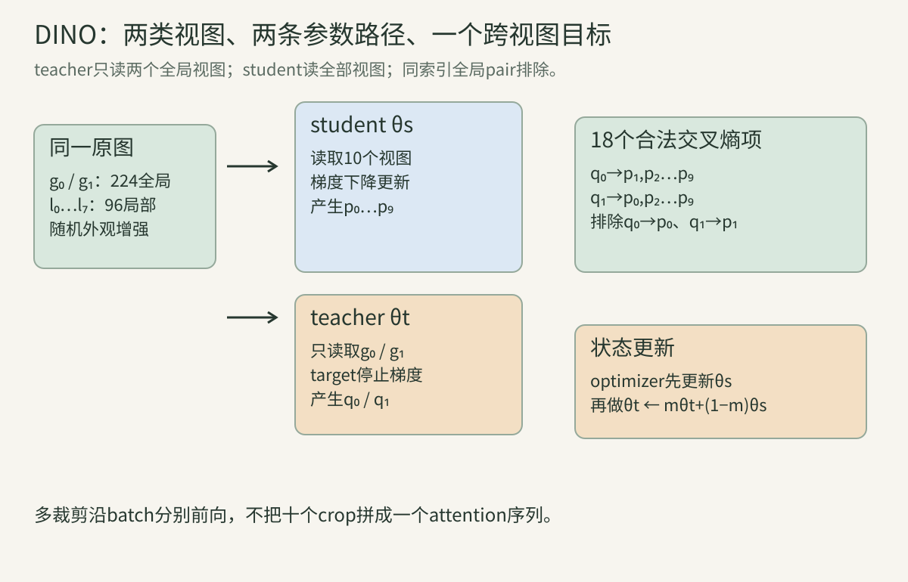
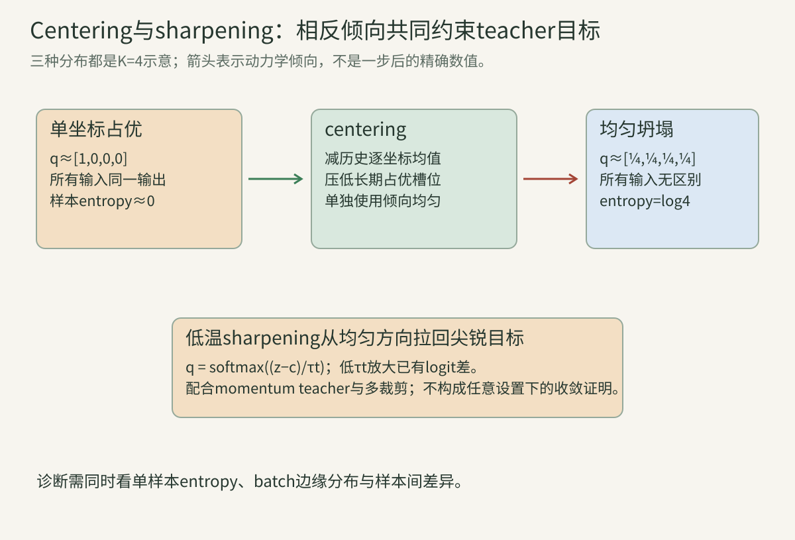
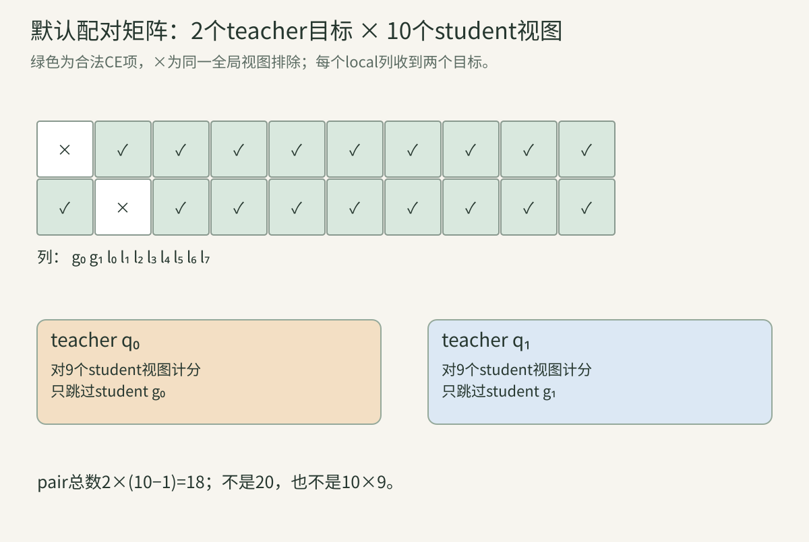
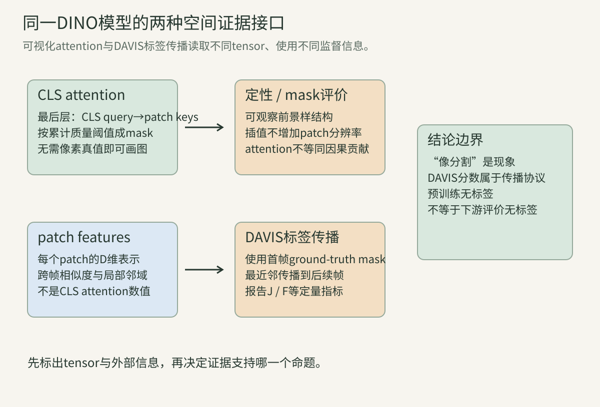
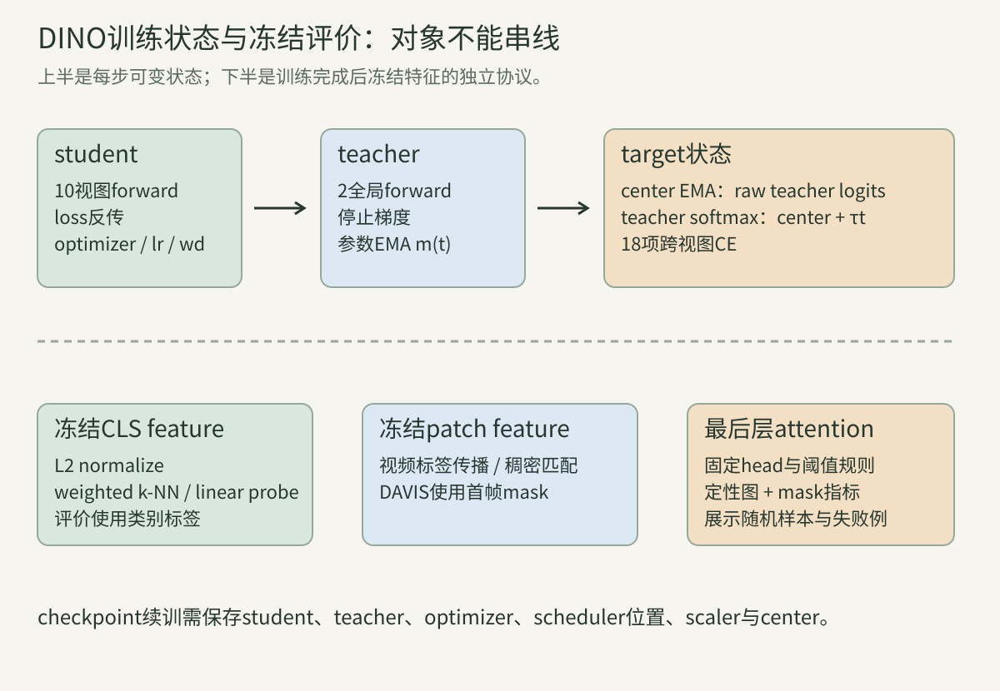

> DINO并不是“teacher给student伪类别”这一句话。它是一套带状态的训练协议：同一图像产生多种视图；teacher只看两个全局视图，student看全部视图；teacher目标先减center、再用低温softmax锐化；student只收梯度，teacher由student参数的指数滑动平均更新。漏掉任何一个轴、分母或更新顺序，都可能得到形状正确却训练含义不同的程序。

常用符号：一批有B张原图；每图有两个全局视图$g_0,g_1$和$N_l$个局部视图，student总视图数$V=2+N_l$。网络输出K维logit，student/teacher温度为$\tau_s,\tau_t$；teacher center为$c\in\mathbb R^K$，teacher参数EMA动量为$m$，center动量为$\mu$。下文的“类别”只指K个输出坐标，不是ImageNet人工标签。

## 一、DINO究竟在学习什么

### 1. 名字中的自蒸馏没有预训练教师

DINO全称Self-Distillation with No Labels。student与teacher采用相同骨干和投影头结构，训练开始时teacher复制student参数；teacher并非外部监督模型，也没有先在人工标签上训练。

student通过梯度下降学习，teacher不接收反向梯度，而由student历史参数的EMA形成。teacher因此是一个时间平滑目标生成器。把它叫“更强模型”只描述训练中观察到的评价现象，不表示结构更大或获得额外标签。

第17讲BYOL也有EMA目标网络，但DINO匹配的是K维softmax分布并显式做center与temperature；不能只因都有teacher就认为两者损失和防坍塌机制相同。

### 2. 输出K维是原型坐标而非人工类别

作者实现默认`out_dim=65536`。网络最后输出$z\in\mathbb R^K$，经softmax成为分布。训练数据没有告诉坐标1729代表“狗”或“车”，坐标语义由共同训练动态产生。

可以把这些坐标理解成高维可学习原型槽位，但原版DINO代码没有一张“槽位到类别名”的字典，也没有要求每个槽位只对应一个真实类别。K大是容量设计，不等于发现了K个物体类别。

迁移时通常读取backbone的CLS表示，而不是拿65536维head坐标直接当有标签分类器。预训练目标空间与下游输出空间必须分开。

### 3. 同一原图提供跨视图监督关系

对同一原图做随机裁剪、颜色扰动、模糊和翻转，便得到多个视图。teacher对一个全局视图给出目标分布，student在另一个全局或局部视图上预测它。

监督关系来自“这些视图由同一图产生”，所以没有类别标签仍有明确配对。局部裁剪可能只包含物体的一部分；让它匹配全局目标，推动表示在尺度与视野变化下保持一致。

若两个裁剪几乎不重叠，目标可能要求student从局部纹理猜整图语义。它既可能促成语义不变性，也可能引入不可判定目标；效果是数据与增强分布下的实验结论，不是几何恒等式。

### 算例A：一张图的十个视图如何分工？

默认$N_l=8$，student输入$[g_0,g_1,l_0,\ldots,l_7]$共10个视图；teacher只输入$[g_0,g_1]$。teacher目标$q_0$与除$g_0$外的9个student输出匹配，$q_1$与除$g_1$外的9个匹配，共18项。

同索引全局视图被排除：不计算$q_0$对student $g_0$，也不计算$q_1$对student $g_1$。局部视图没有teacher输出，却各自同时接收$q_0$与$q_1$两个目标。

### 4. 全局视图与局部视图的面积和分辨率是两层概念

作者默认全局RandomResizedCrop的原图面积比例为0.4—1.0，输出224×224；局部比例为0.05—0.4，输出96×96。面积比例描述从原图选多大区域，输出分辨率描述送入网络的像素网格。

一个占原图5%的区域仍会被缩放到96×96；这不表示它保留了原图96×96的原生像素。插值会改变频率内容，增强参数属于任务定义。

全局/局部的边界0.4有重合端点，实际随机变量连续时恰好取端点概率可忽略。名字表达范围和用途，不保证任意局部裁剪一定被某个全局裁剪空间包含。

### 5. teacher只看全局视图形成方向性目标

teacher承担目标端，只处理两个较大视野。student必须从全局或局部输入去预测teacher的全局分布。这是一种global-to-local方向性，而非所有视图两两完全对称。

如果teacher也看8个局部视图，目标项、计算量与语义都会改变；如果student只看两全局视图，就失去多裁剪的局部约束。两者不是性能开关，而是目标图结构。

同一骨干可处理224和96，是因为ViT能接受不同patch数并插值位置编码；同一batch内不同分辨率则由MultiCropWrapper按相同尺寸分组前向，再拼接输出。

### 6. 排除相同视图防止最直接的复制捷径

损失循环遇到student视图索引$v$等于teacher全局索引$i_q$时跳过。于是每项至少跨一次随机视图变换。

这不保证两个输入没有共同像素，也不保证不存在颜色或背景捷径；它只排除“完全同一增强张量对自己”的目标项。增强随机性和数据偏差仍需单独审计。

即使teacher与student参数不同，同视图匹配仍较容易。排除规则让主要问题变为跨视图一致性，并固定默认配对数为$2(V-1)$。

### 7. 多裁剪不是把十张图拼成一个token序列

每个裁剪独立通过backbone，得到独立CLS表示与head输出。它们在loss中按原图身份配对，不在自注意力里互相读取token。

作者MultiCropWrapper按连续的相同分辨率裁剪分组，以减少重复forward调用；拼batch轴不会让样本发生attention交互。只有BN之类跨batch统计会耦合样本，而默认ViT head不使用BN。

把视图沿token轴拼接再加一份CLS，会允许跨视图attention，形成另一模型。相同输出shape不能证明语义相同。

### 8. DINO目标是分布交叉熵而不是硬argmax

teacher分布$q$通常非one-hot。对student分布$p$的单项损失为：

$$H(q,p)=-\sum_{k=1}^Kq_k\log p_k.$$

它等于$H(q)+D_{KL}(q\|p)$。对固定且停止梯度的$q$，最小化交叉熵等价于最小化前向KL；但日志loss包含teacher自身熵$H(q)$，不能把0当作一般可达下界。

若先对teacher取argmax，就丢失次高坐标和不确定性，变成硬伪标签算法。原版DINO不是这样做的。

## 二、温度、center与损失的完整推导

### 9. student温度作用在logits而非loss外层

student概率为：

$$p_s^{(v)}(k)=\frac{\exp(z_{s,k}^{(v)}/\tau_s)}{\sum_j\exp(z_{s,j}^{(v)}/\tau_s)}.$$

作者实现默认$\tau_s=0.1$。小温度放大logit差异，使分布更尖，也把对原始logit的梯度放大$1/\tau_s$。

把交叉熵最终数值除以0.1并不等价：softmax概率会不同，梯度方向也会变。稳定实现应使用`log_softmax(z/tau)`，不能先裸算巨大指数。

### 10. teacher先减center再用低温softmax

teacher目标为：

$$q_t^{(u)}(k)=\frac{\exp((z_{t,k}^{(u)}-c_k)/\tau_t)}{\sum_j\exp((z_{t,j}^{(u)}-c_j)/\tau_t)}.$$

center是K维历史均值，不是每个样本减自己的logit均值。每样本共同减标量不会改变softmax；逐坐标center才会修正长期偏置坐标。

原论文常用teacher温度0.04；部分300 epoch设置从0.04线性升到0.07、前30 epoch预热。固定仓库CLI默认值实际上是0.04到0.04且`warmup_teacher_temp_epochs=0`；论文实验配置与入口默认必须分别记录。

### 11. sharpening指低温目标更尖锐

当$\tau_t<1$时，相同logit差被放大。若两维centered logits为[0.2,0]，$\tau_t=1$给概率约[0.550,0.450]；$\tau_t=0.1$给[0.881,0.119]。

$\tau_t\to0$时趋近argmax one-hot；它不会创造新排序，只强化已有差异。极端低温会让早期随机优势变得过度确信，因此温度预热是稳定性协议。

“锐化避免均匀坍塌”描述动力学作用，不表示温度越低越好。论文附录中0温度近似硬目标的k-NN结果反而很差。

### 12. centering压制长期占优输出坐标

若某坐标在各样本teacher logits中长期偏高，batch均值和center也会升高；下次减center便降低其相对优势。这有助于避免所有样本都集中到同一坐标。

但centering本身倾向让不同坐标整体被均衡使用，可能把每个样本目标推向均匀。论文明确把它与sharpening的相反倾向配合，而非宣称单项足够。

center作用于teacher logits，不是student feature做均值中心化，也不是BatchNorm。它是一项需要checkpoint保存的训练状态。

### 算例B：center怎样改掉固定优势？

teacher raw logits为[3,2,1]。无center、$\tau_t=1$时softmax约[0.6652,0.2447,0.0900]。若历史center=[2,0,0]，centered logits变[1,2,1]，概率约[0.2119,0.5761,0.2119]。

减center并非把概率减去某数；它在softmax前改变相对logit。若误在softmax后减center，会产生负数且不再是概率分布。

### 13. 合法配对集合决定分母

记teacher视图集合$T=\{0,1\}$，student集合$S=\{0,\ldots,V-1\}$，合法集合：

$$\mathcal P=\{(u,v):u\in T,v\in S,v\ne u\}.$$

于是$|\mathcal P|=2(V-1)$，默认V10得18。总损失为：

$$L=\frac1{|\mathcal P|}\sum_{(u,v)\in\mathcal P}\frac1B\sum_{b=1}^BH(q_{b}^{(u)},p_b^{(v)}).$$

作者先对每项batch mean，再对18项平均。固定B时等价于对所有合法样本—视图项平均；变长或缺失视图时必须重算真实分母。

### 14. student logit梯度是概率误差再除温度

对一个合法pair，若$q$停止梯度，student logit梯度为：

$$\frac{\partial H(q,p)}{\partial z_{s,k}}=\frac{p_k-q_k}{\tau_s}.$$

总目标还要除B和pair数，并对同一个student视图收到的多个teacher目标相加。全局student视图0只接$q_1$；局部student视图接$q_0$与$q_1$。

梯度各坐标和为0，因为$p,q$都归一化。若手算和不为0，常见错误是漏类别、漏温度或teacher目标未归一化。

### 算例C：四个student视图为何只有六项？

若教学例只有两个全局加两个局部，V4，合法pairs为$(0,1),(0,2),(0,3),(1,0),(1,2),(1,3)$，共$2(4-1)=6$。

程序一取K3、$\tau_s=0.2,\tau_t=0.1$，算得loss 3.8964039021，12个student logit的中心差分与解析梯度最大误差约$3.73\times10^{-10}$。teacher目标在本次loss中detach，所以直接梯度为0。

### 15. stop-gradient冻结的是本次teacher计算图

`teacher_out.detach()`保留数值，切断loss到teacher logits/参数的反向边。它不让teacher参数永远不变，因为稍后还有EMA状态更新。

teacher通常还将`requires_grad=False`，避免构建其参数梯度并节省内存。二者共同表达本步目标端不由optimizer更新。

stop-gradient不切断student。teacher与student结构相同、初始数值相同，也仍是两个参数对象；训练后状态不同。

### 16. teacher target和center更新使用同一次raw output

本步先用旧center构造$q=\operatorname{softmax}((z_t-c_{old})/\tau_t)$并计算loss，随后用本步raw teacher logits更新center。

若先更新center再计算本步target，就引入当前batch的即时反馈，目标与作者顺序不同。若用softmax概率更新center，也改变center的单位。

因此checkpoint要保存DINOLoss模块状态，其中包含center；只存student/teacher权重会使恢复后的目标分布突变。

### 17. 分布式center要用全局样本均值

每卡先对teacher_output按样本求和，all-reduce求全局和，再除以`local_rows × world_size`。原实现假设各rank的teacher输出行数相同。

若最后一批每卡样本不等或使用不规则采样，必须同时all-reduce计数；直接平均各卡均值会让小batch卡权重过大。DDP并不会自动同步自定义buffer的这次统计语义。

teacher有两个全局视图，所以本地teacher_output行数通常是2B。误只除B会把center放大两倍。

### 18. center的EMA平滑历史而非参与反向传播

更新式为：

$$c\leftarrow\mu c+(1-\mu)\bar z_t,$$

默认$\mu=0.9$。旧center权重随年龄d按$\mu^d$衰减，近似时间尺度约$1/(1-\mu)=10$步。

center在`no_grad`中更新，没有通过历史序列做反向传播。它影响下一步teacher target，却不是可学习参数。

若$\mu$过高，center追不上分布漂移；论文附录在其设置中0.999发生坍塌。这个阈值不应脱离batch、温度和训练长度推广为普遍定律。

## 三、teacher EMA与训练状态机

### 19. teacher由student参数的指数滑动平均更新

每个优化步后：

$$\theta_t\leftarrow m\theta_t+(1-m)\theta_s.$$

这里$\theta_s$使用刚完成optimizer.step后的student参数。若用更新前student，teacher会额外滞后一拍；程序二给出数值差异。

EMA不是梯度下降，没有teacher optimizer、学习率或weight decay。它也不是optimizer内部对student梯度的momentum；两者状态和对象不同。

### 20. EMA展开成带时间权重的student历史

若m固定，递推得到：

$$\theta_t^{(n)}=m^n\theta_t^{(0)}+(1-m)\sum_{j=1}^{n}m^{n-j}\theta_s^{(j)}.$$

它是参数坐标逐项平均，不等于对多个student输出概率做算术平均，因为神经网络关于参数非线性。

有效历史长度随m增大而增大。m0.996的粗时间尺度约250步；但实际DINO使用变动m，不能用单一长度描述全程。

### 算例D：一步EMA为何要读更新后的student？

旧teacher=[0,4]，旧student=[2,-2]，optimizer后student=[1.5,-1]，m0.996。正确新teacher=[0.006,3.98]；若误读旧student则[0.008,3.976]。

差值很小，却会逐步累积。更新顺序必须和loss使用的teacher快照一起写入算法，而不是只记录公式。

### 21. teacher动量用余弦计划从0.996趋近1

作者实现对每个iteration预先生成：

$$m(t)=1-(1-m_0)\frac{1+\cos(\pi t/T)}2.$$

t从0取到T−1，所以最后一个离散值非常接近但不严格等于1。训练初期teacher能较快跟随student，后期更平滑。

小batch时作者建议更高初始动量，例如0.9995，因为每步student噪声较大。这是经验建议，不能只改m而忽略学习率、总batch与训练步数。

### 22. teacher在本步先前向，后EMA

完整顺序是：读取旧student与旧teacher前向；用旧center形成target并算loss；反传并更新student；EMA更新teacher；center在loss模块forward末尾由本步旧teacher输出更新。

代码中center更新发生在loss forward内部，而teacher EMA在optimizer之后。两者先后对本步数值互不依赖，因为center读取已经保存的teacher_output，teacher EMA改参数而不改该tensor。

把teacher先EMA再前向，相当于目标看到了本步student更新，改变因果顺序。做断点恢复时还要保证iteration scheduler位置一致。

### 23. teacher与student开始时必须参数对齐

构建两个网络后，作者用`teacher.load_state_dict(student.state_dict())`复制全部状态，再关闭teacher梯度。若独立随机初始化，早期teacher目标近似无关随机映射，锐化后尤其不稳定。

“同一个随机seed”也不保证两个依次构建的网络参数相同，因为随机数状态已推进；应显式复制state dict。

若结构中含running statistics，还要确认它们是否由EMA、前向统计或同步BN更新。默认ViT无BN，简化了这部分。

### 24. checkpoint不是只保存最终backbone

可恢复训练至少要保存student、teacher、optimizer、epoch/iteration、学习率/weight-decay/momentum计划位置、混合精度scaler，以及包含center的DINOLoss状态。

只加载teacher做下游推理是另一目的，此时无需optimizer与center；但不能把“推理所需状态”当成“无缝续训所需状态”。

随机增强可重复还涉及Python、NumPy、框架和sampler随机状态；作者历史checkpoint并未承诺逐bit复现下一batch。

### 25. student与teacher谁用于下游是实证选择

论文观察到momentum teacher在训练过程中持续优于student，并用teacher权重做主要评价。原因可理解为参数平均带来的平滑，但不是由EMA公式直接保证的定理。

若student快速进入更好解而teacher严重滞后，某个时刻student也可能更优。应在固定评价协议下比较，不按“teacher”名称预设胜者。

发布checkpoint时要标注是哪一支、是否包含projection head。仅写ViT-S/16不足以复现实验。

### 算例E：center与teacher是两套EMA

center对teacher raw logits做EMA，动量默认0.9；teacher对student参数做EMA，初始动量0.996并升高。它们更新对象、时间尺度、计划都不同。

程序二的两rank logits全局均值[4,6]，旧center[1,-1]经0.9更新成[1.3,-0.3]；这与teacher参数例[0,4]更新成[0.006,3.98]没有可交换关系。

### 26. 坍塌至少有两种不同形态

形态一：所有输入集中到同一个输出坐标，teacher分布熵接近0；形态二：所有输入都给近似均匀分布，单样本熵接近$\log K$。两者都不含输入区分能力。

只监控平均边缘坐标使用率可能漏掉均匀逐样本坍塌；只监控单样本熵又可能把“各样本各自尖锐但全都同坐标”误判良好。

需同时观察逐样本entropy、batch平均分布entropy、样本间KL/方差和下游冻结特征。loss稳定不等于表示未坍塌。

### 27. centering与sharpening是动态平衡而非证明

论文消融显示：centering抑制单坐标占优但倾向均匀，sharpening抵抗均匀但可能强化单坐标；配合momentum teacher在其实验中避免坍塌。

这是特定架构、增强、优化和温度下的经验机制。它没有证明所有初始化、数据和K都全局收敛，也不能替代运行监控。

第17讲VICReg用显式方差/协方差项，Barlow Twins约束交叉矩阵；DINO没有把这些项写进loss，而依赖teacher、center、温度和多裁剪共同动力学。

### 28. 冻结last layer梯度是早期稳定措施

作者默认首个epoch将名称含`last_layer`的student参数梯度置空，再optimizer.step；这不同于永久冻结weight norm的尺度参数。

冻结输出层时，早期loss仍可更新backbone和head前几层。若错误地把整个head冻结，训练问题会变化。

混合精度时必须先unscale再裁剪/取消梯度；否则读取的是缩放梯度。作者代码分别处理FP32和scaler路径。

### 29. 学习率、weight decay和teacher momentum各有计划

学习率线性warmup后余弦下降，weight decay从0.04余弦升到0.4，teacher momentum从0.996余弦升到1。三条schedule方向不同。

参数组中bias与一维参数通常不做weight decay；只报告“AdamW 0.04”不足以重现。学习率还按全局batch相对256线性缩放。

优化稳定来自整个状态机。单独抄loss却使用静态weight decay、不同batch或错误EMA顺序，不能称精确复现。

### 30. DINOHead把backbone表示映射到大输出空间

固定作者实现默认三层MLP：输入embed_dim，经hidden 2048、GELU，再到bottleneck 256；bottleneck向量做L2归一化，最后接无bias、weight-normalized的K维线性层。

默认head不含BN。`nlayers=1`时则直接线性到bottleneck；所以“DINO head”不是永远三层的数学定义。

head为预训练目标服务；下游常丢弃。若直接在head输出做linear probe，与在backbone CLS做probe评价的是不同表示。

### 31. bottleneck L2归一化与weight normalization作用在不同轴

对每个样本bottleneck向量$h\in\mathbb R^{256}$做$u=h/\|h\|_2$，这是沿feature轴的样本内归一化。最后一层每个输出坐标的weight vector又由weight normalization拆成方向和尺度。

两者不能互相替代：输入单位长度控制进入最后层的尺度，weight norm参数化每个输出行的权重。softmax temperature再控制输出logit差的有效尺度。

若$h=0$，纯数学归一化未定义；框架实现含epsilon保护。监控接近零范数比假设永不发生更稳妥。

### 32. norm_last_layer固定的是weight_g而非整层

作者DINOHead先将weight-norm层的`weight_g`初始化为1；若`norm_last_layer=True`，只把`weight_g.requires_grad=False`，方向参数`weight_v`仍可学习。

因此“归一化最后层”不等于整个最后层冻结。另一个`freeze_last_layer=1`则在首epoch取消last_layer所有梯度，是时间有限的优化措施。

这两个相似名字控制不同机制。复现表必须分别记录，否则无法解释稳定性差异。

### 33. 65536维输出带来可观参数与通信成本

最后层从256到65536，无bias，参数数为$256\times65536=16,777,216$。FP32权重本身64MiB；student梯度、Adam一二阶状态和teacher副本会进一步放大内存。

K还影响每个视图的logit、softmax、center buffer和分布式center求和。它不影响backbone token attention长度，却可能成为head算力与通信负担。

减小K能省资源，但同时改变目标容量和坍塌动力学，不能视为无语义压缩。

### 算例F：最后层训练状态约占多少？

只粗算该weight：student FP32参数64MiB、梯度64MiB、Adam两份状态128MiB、teacher FP32副本64MiB，共约320MiB，尚未计混合精度主副本、激活和weight-norm参数化细节。

这说明“大K只是一个整数超参数”会遗漏实际系统成本。不同框架/精度的真实内存应测量，粗账本不替代峰值显存。

## 四、多裁剪的数据增强与计算账本

### 34. 两个全局裁剪故意使用不同强增强

共同部分包括随机水平翻转、以0.8概率颜色抖动、以0.2概率灰度。全局1以概率1做Gaussian blur；全局2以0.1概率blur、以0.2概率solarization。

这让两个teacher全局视图不只是空间crop不同，也可能有不同外观扰动。solarization是像素强度变换，不是几何变换。

增强顺序会影响分布：先crop再blur与先整图blur再crop边界不同。精确实现应保存Compose顺序与插值方法BICUBIC。

### 35. 局部裁剪有自己的模糊概率

8个局部裁剪共享同一transformation对象：输出96、面积比例0.05—0.4，并以0.5概率Gaussian blur。每次调用重新采样随机参数，并非八份完全相同区域。

“共享transform”指同一配置和代码对象，不是共享随机结果。若错误地生成一张局部crop再复制八次，pair数仍是18但信息量显著下降。

每张原图的10个视图构成相关样本，数据加载器batch size仍计原图数B，而非10B个独立标签样本。

### 36. patch token数量揭示多裁剪为何可承受

ViT-S/16时224视图有$14^2=196$个patch，96视图有$6^2=36$。student处理$2\times196+8\times36=680$个patch token，teacher处理392个，总计1072。

若12次forward全部用224，则总计2352个patch token；实际线性token项粗比0.4558。CLS会稍改比例。

这只按token数算QKV/MLP的线性部分，不含head、数据增强、kernel利用率与反向路径；teacher虽无反向仍有前向。

### 37. attention score项按序列长度平方缩放

粗略只算每层每头的$L^2$分数：4个全局前向和8个局部前向给$4\times196^2+8\times36^2$，相对12个全局为约0.3558。

为什么是4个全局？student两个加teacher两个。局部只有student八个。若遗漏teacher前向，账本就不完整。

整block还有约随$LD^2$缩放的投影/MLP，训练又只有student反向，所以不能把0.3558称为总训练耗时比例。

### 算例G：P8为何远不只是token翻倍？

224/P16有196个patch；P8有784个，是4倍。attention score矩阵从196²变784²，是16倍；线性投影/MLP项约4倍，activation和位置插值也改变。

论文观察小patch提高特征与注意力质量，但其计算代价必须连同精度报告。P5甚至不能整除224，具体输入/patch配置需查实验实现，不能只套整数公式。

### 38. MultiCropWrapper按分辨率分组只优化执行

作者wrapper依据输入最后一维尺寸的连续变化找边界，将相同分辨率裁剪cat到batch轴后一起过backbone，再拼输出送head。

它假设同尺寸输入在列表中连续；默认列表先两全局、后八局部满足。乱序仍可能产生正确值但更多forward组，也可能破坏随后按视图chunk的语义。

执行批处理优化不改变每张crop的独立attention图。验证可比较逐crop前向与分组前向在eval模式下的数值。

### 39. crop列表顺序是loss协议的一部分

teacher输出按两个全局视图拼接，student输出按十视图拼接；`chunk(2)`和`chunk(ncrops)`假设每个视图块batch大小相等且顺序一致。

若先按样本交错`[图1所有视图,图2所有视图]`却仍直接chunk，就会把不同样本/视图误配。shape完全合法，loss也有限，属于危险的静默错误。

最小人工batch应给每个样本—视图唯一ID，验证chunk后索引，而不是仅检查tensor尺寸。

### 40. 原图身份不能跨卡或跨增强丢失

DINO的正关系在单个loader样本内生成，多卡DDP通常各卡独立处理本地原图，不需要像SimCLR那样把远端样本放入softmax候选。

center却必须跨卡汇总teacher logits。参数梯度由DDP all-reduce，center统计由显式all-reduce；两条通信路径职责不同。

若使用梯度累积，student每microbatch都更新center却若干microbatch后才optimizer/teacher EMA一次，会改变时间尺度。应明确center和teacher以microstep还是optimizer-step更新。

### 算例H：十视图为何是18项而不是90项？

不是student十视图两两配对，也不是两个teacher目标与十student全做20项。teacher只有2个视图，每个排除同索引student视图，故$2\times(10-1)=18$。

程序三列出teacher0对应[1…9]，teacher1对应[0,2…9]，并核对token与attention score粗账本。

## 五、为什么ViT中出现“物体样”的注意力图

### 41. ViT最后层self-attention仍是一张token到token的矩阵

每个head有$A=\operatorname{softmax}(QK^T/\sqrt{d_h})$，行对应query token，列对应key token。包含CLS和L个patch时，shape为$(L+1)\times(L+1)$。

可视化常取最后block中CLS query那一行、去掉CLS key后的L个权重，再排成patch网格。这是“CLS读取各patch的权重”，不是patch分类概率。

如果误取某个patch query行，或把列/行颠倒，仍能画出热图却回答不同问题。接口必须写成索引。

### 42. 每个attention head可关注不同区域

多头attention返回H张CLS-to-patch图。论文图中不同head有时聚焦物体不同部件或前景，不能默认先平均所有head仍保留同样结构。

某head看背景不代表模型失败；某head像前景也不代表所有表示都已分割。应报告head选择规则，避免看完结果再挑最漂亮的head。

定量协议可以固定所有head、选最大连通区或使用最佳head，但“最佳”若用真值选择就引入监督，应明确。

### 43. attention权重是归一化读取强度，不是因果贡献

一行attention和为1，只说明该head在当前layer的值向量混合权重。输出还经过value投影、多头拼接、残差、MLP和后续层。

高attention patch的value可能很小或与其他方向抵消；低attention也可经残差保留。故attention map可解释网络读取模式的一部分，不能直接等同“对最终类别最重要”。

因果重要性需遮挡、干预、梯度或反事实评价，并各有假设。DINO论文的涌现图首先是可视化观察。

### 44. 从patch权重到像素热图需要坐标恢复

将L个权重按训练时patch顺序reshape为$h\times w$，再插值到输入裁剪分辨率。若输入经过crop/resize/flip，想叠回原图还需逆几何变换。

patch边界决定最低空间粒度；P16在224图上只有14×14格，双线性插值平滑外观但不会创造真实16倍定位信息。

若输入尺寸不能被P整除或模型做padding，必须去除pad区域。热图与原图肉眼对齐前先做人工坐标测试。

### 45. “保留60%质量”不是阈值0.6

论文可视化将attention值从大到小排序，选择最少patch使累计和达到总attention质量的60%，再形成二值mask。它不是选择每个$a_i>0.6$。

若权重[0.30,0.25,0.20,0.10,0.10,0.05]，排序累计0.30、0.55、0.75，所以需前三项，实际保留质量0.75，超过0.60是离散格子造成。

并列权重的tie-breaking会改变边界patch；必须固定规则。不同head的分布尖锐程度也会改变mask面积。

### 算例I：60%质量mask手算

程序四对attention [0.05,0.30,0.10,0.25,0.20,0.10]排序，索引[1,3,4,2,5,0]。前两项累计0.55不足，加入索引4后0.75，mask为[0,1,0,1,1,0]。

因此“60%”约束的是累计权重，不是保留60%的patch。这里保留3/6=50% patch，却包含75%离散质量。

### 46. 平滑热图可能来自插值与低分辨率

14×14或28×28网格放大到224×224时，双线性插值自然产生平滑区域；颜色映射又会增强边界直觉。

应同时展示原始patch格、插值图和二值阈值mask，记录colormap范围。每图自动min-max与全数据固定范围会产生不同视觉对比。

图像好看是发现线索，不能替代IoU、边界质量、跨图稳定性和基线比较。

### 47. “涌现”指没有像素mask监督仍出现空间结构

DINO只用图像级跨视图分布匹配，没有像素级前景标签；ViT注意力中却常出现与物体轮廓相近的区域，论文称之为emerging property。

这不表示网络无任何空间归纳：patch网格、位置编码、crop增强和self-attention都提供结构；ImageNet数据本身也有主体中心偏差。

更准确的说法是“未直接用分割标注训练，却观察到可用于空间任务的注意力/patch特征”，而不是“从完全无先验中自动发现真实物体”。

### 48. 注意力图与patch特征是两种评价接口

最后层CLS attention可直接画前景样式；patch token feature则可做最近邻传播、聚类、分割头或稠密匹配。二者同源但不是同一个tensor。

论文DAVIS视频分割的主要定量协议使用输出patch tokens在视频帧间做最近邻标签传播，而不是把单帧60% attention mask直接当最终视频实例分割结果。

因此从“attention图看起来像mask”跳到“DAVIS分数证明attention就是分割器”是证据错配。

### 49. DAVIS 2017评价需要首帧标注传播

半监督视频目标分割给首帧ground-truth mask，模型需把标签传播到后续帧。DINO冻结特征，用局部邻域内patch相似度在前帧/历史帧做最近邻式传播。

这不是完全无监督分割，因为评价时使用首帧mask；“自监督”描述预训练不使用人工标签，不代表所有下游协议无标签。

DAVIS常报告区域相似度$\mathcal J$、轮廓准确度$\mathcal F$及均值。必须同时说明输入分辨率、邻域、历史帧数和后处理。

### 算例J：attention可视化与DAVIS传播的输入不同

一张静态图的CLS attention只需要模型和当前图；DAVIS标签传播还需要首帧mask、多个帧的patch feature及时间/空间邻域匹配。

两者都显示空间结构，但监督信息和计算图不同。把首帧mask删掉，原协议就无法产生实例ID标签。

## 六、冻结特征如何定量评价

### 50. k-NN评价不训练分类器但使用训练集标签

先冻结encoder，为ImageNet训练集与验证集抽取特征并L2归一化。每个验证query与带标签训练feature bank算余弦相似度，取前k邻居，用标签投票。

它不更新backbone或拟合线性权重，所以能快速检查局部几何；但训练集标签参与投票，不能称“无标签分类”。预训练无标签与评价有标签是不同阶段。

feature提取要固定teacher/student、CLS/patch pooling、是否多尺度以及归一化，否则k-NN数字不可比较。

### 51. weighted k-NN让更相似邻居票更重

作者常用权重$w_i=\exp(s_i/\tau_{knn})$，其中$s_i$是归一化特征点积，温度常取0.07。类别得分为同类邻居权重和。

这不同于softmax训练温度，虽数学形式相似却属于评价超参数。k、温度和feature bank大小都会影响结果。

为数值稳定可先从相似度减最大值；所有类别共同缩放不改argmax。程序四给出k3加权投票。

### 算例K：高相似邻居为何压过远邻？

程序四前三个相似度约0.993884、0.970143、0.6，标签分别0、0、1。温度0.07后类别0总权重约2,511,062，类别1约5,279，预测0。

大指数绝对值没有概率意义；只要相对得分稳定即可。实现中应减最大相似度避免overflow。

### 52. linear evaluation测线性可分性而非所有能力

冻结backbone，只训练一个线性分类层。它比k-NN多一个有监督优化过程，需学习率、epoch、增强和weight decay等协议。

linear高说明所选feature接口对该标签近似线性可分，不证明空间定位、鲁棒性或微调后上限。k-NN接近linear是DINO论文强调的特征几何现象之一。

比较论文数字要对齐训练长度、patch size、分辨率与多尺度测试。仅写“ViT-S”会混合P16/P8结果。

### 53. 注意力质量不能由分类top-1代替

两个模型可有相同ImageNet top-1，却在patch correspondence、边界和小物体定位上不同；反之，漂亮attention也可能分类一般。

应建立多接口评价：CLS做k-NN/linear，patch feature做DAVIS/检索/稠密任务，attention做固定协议可视化或mask指标。

这也是视觉基础模型评估的核心习惯：一个下游分数只支持对应接口与数据分布下的结论。

### 54. 论文对ViT与卷积网络的结论有实验边界

论文在对齐的DINO框架中发现ViT自监督特征具有很强k-NN表现和显著attention结构，并比较了ResNet-50。它不证明所有Transformer必然优于所有CNN。

架构、参数量、训练epoch、patch size、优化器和计算量都影响比较。历史表格中的top-1是该协议结果，不应当作2026年所有方法的实时排行榜。

本讲使用原论文解释机制，下一讲才讨论DINOv2、iBOT、register与DINOv3，避免把后续改进倒灌给2021 DINO。

## 七、复现、诊断与边界

### 55. 最小复现先验证索引与状态，不先追论文精度

第一阶段用小K、小batch和固定logits验证18对配对、温度位置、CE梯度、center单位与更新顺序；第二阶段看真实网络短跑的entropy、loss和参数EMA；最后才扩大数据与预算。

这种toy程序不能验证ImageNet精度，却能排除最危险的静默语义错误。大规模跑崩后再猜索引，成本更高且难定位。

每个阶段都保存配置、commit、数据划分、seed与完整状态，区分“代码能跑”“目标正确”“特征有效”三个命题。

### 56. 训练日志至少同时监控五类量

监控总loss与18项分布；teacher逐样本entropy；batch平均分布entropy/坐标使用；student-teacher同视图或跨视图KL；参数/梯度范数、center范数与EMA差距。

再定期抽取冻结feature做小型k-NN，因loss正常仍可能表示退化。attention图可做质检，但需固定样本和colormap，避免只挑成功案例。

分布式还需核对各rank batch数、center一致性、NaN和有效吞吐。单卡日志不能自动证明全局统计正确。

### 算例L：熵为何需两种？

模型A对所有样本都输出同一个one-hot：平均单样本熵0，batch平均分布熵0。模型B每个样本均匀：两种熵都$\log K$。模型C每样本one-hot但均匀覆盖K个槽：单样本熵0、batch平均熵$\log K$。

只有C表现出跨样本槽位多样性，但仍需确认槽位随语义稳定。两个熵联合比单一数值更能区分坍塌形态。

### 57. 程序一验证损失配对与student梯度

下面只用Python标准库实现K3、2个teacher全局视图和4个student视图。它显式列出6个合法pair，并对12个student logits做中心差分。

~~~python
import math

def softmax(xs):
    m = max(xs); es = [math.exp(x - m) for x in xs]
    return [e / sum(es) for e in es]

def log_softmax(xs):
    m = max(xs); z = m + math.log(sum(math.exp(x - m) for x in xs))
    return [x - z for x in xs]

student_logits = [[1,0,-1],[0,1,-.5],[.5,-.5,0],[-.5,.25,.75]]
teacher_logits = [[.30,.10,-.20],[-.10,.40,0]]
center = [.05,0,-.05]
tau_s, tau_t = .2, .1

def dino_loss(student):
    qs = [softmax([(z-c)/tau_t for z,c in zip(row,center)])
          for row in teacher_logits]
    total, pairs = 0., []
    for iq,q in enumerate(qs):
        for v,row in enumerate(student):
            if v == iq: continue
            lp = log_softmax([z/tau_s for z in row])
            ce = -sum(a*b for a,b in zip(q,lp))
            total += ce; pairs.append((iq,v,ce))
    return total/len(pairs), pairs, qs

loss,pairs,qs = dino_loss(student_logits)
print('pairs:', [(q,v) for q,v,_ in pairs])
print('pair_count:',len(pairs),'loss:',round(loss,10))
print('teacher_probs:',[[round(x,6) for x in q] for q in qs])
analytic=[]
for v,row in enumerate(student_logits):
    p=softmax([z/tau_s for z in row])
    targets=[qs[iq] for iq in range(2) if v != iq]
    analytic.append([sum((p[k]-q[k])/tau_s for q in targets)/len(pairs)
                     for k in range(3)])
eps=1e-6; max_err=0.
for v in range(4):
    for k in range(3):
        plus=[r[:] for r in student_logits]; minus=[r[:] for r in student_logits]
        plus[v][k]+=eps; minus[v][k]-=eps
        num=(dino_loss(plus)[0]-dino_loss(minus)[0])/(2*eps)
        max_err=max(max_err,abs(num-analytic[v][k]))
print('student_gradient_max_error:',f'{max_err:.3e}')
print('teacher_direct_gradient: 0 (target is detached)')
~~~

输出loss 3.8964039021，最大梯度误差约3.73e−10。程序固定teacher logits来验证半梯度；若每次差分都重算并更新teacher/center，测到的是另一函数。

### 58. 程序二验证center与teacher两套EMA

~~~python
import math
rank0=[[1.,3.],[3.,5.]]; rank1=[[5.,7.],[7.,9.]]
rows=rank0+rank1
batch_center=[sum(r[k] for r in rows)/len(rows) for k in range(2)]
old=[1.,-1.]; mu=.9
new=[mu*c+(1-mu)*b for c,b in zip(old,batch_center)]
print('global_batch_center:',batch_center)
print('new_center:',[round(x,6) for x in new])

def momentum(base,step,total):
    return 1-(1-base)*(math.cos(math.pi*step/total)+1)/2

student_before=[2.,-2.]; teacher_before=[0.,4.]; student_after=[1.5,-1.]
for step in [0,50,99]:
    m=momentum(.996,step,100)
    teacher=[m*t+(1-m)*s for t,s in zip(teacher_before,student_after)]
    print('step',step,'m',round(m,8),'teacher',[round(x,8) for x in teacher])
wrong=[.996*t+.004*s for t,s in zip(teacher_before,student_before)]
right=[.996*t+.004*s for t,s in zip(teacher_before,student_after)]
print('ema_with_pre_update_student:',wrong)
print('ema_with_post_update_student:',right)
~~~

输出全局均值[4,6]、新center[1.3,-0.3]；m从0.996升到约0.999999。程序把错误的旧student EMA与正确顺序并列。

### 59. 程序三验证18对与多分辨率账本

~~~python
teacher_views=range(2); student_views=range(10)
pairs=[(q,v) for q in teacher_views for v in student_views if q != v]
print('pair_count:',len(pairs))
print('teacher0_students:',[v for q,v in pairs if q==0])
print('teacher1_students:',[v for q,v in pairs if q==1])
G=(224//16)**2; L=(96//16)**2
student=2*G+8*L; teacher=2*G
actual=student+teacher; all224=12*G
print('global/local patches:',G,L)
print('student/teacher patch tokens:',student,teacher)
print('forward patch-token ratio vs all-224:',round(actual/all224,6))
scores=4*G**2+8*L**2
print('attention-score ratio vs all-224:',round(scores/(12*G**2),6))
~~~

结果为18对、global/local patch 196/36、student/teacher patch token 680/392；线性token比0.455782，score项比0.355824。它们是理论项数，不是GPU测速。

### 60. 程序四验证60%质量mask与weighted k-NN

~~~python
import math
attention=[.05,.30,.10,.25,.20,.10]
order=sorted(range(len(attention)),key=lambda i:(-attention[i],i))
chosen=[]; mass=0.
for i in order:
    if mass >= .60: break
    chosen.append(i); mass += attention[i]
mask=[int(i in chosen) for i in range(len(attention))]
print('sorted_indices:',order)
print('60pct_mass_mask:',mask,'kept_mass:',round(mass,6))

def unit(v):
    n=math.sqrt(sum(x*x for x in v)); return [x/n for x in v]
q=unit([1.,0.])
bank=[([.9,.1],0),([.8,.2],0),([.6,.8],1),([-1.,0.],1)]
neighbors=[]
for feat,label in bank:
    sim=sum(a*b for a,b in zip(q,unit(feat)))
    neighbors.append((sim,label))
neighbors.sort(reverse=True); votes={0:0.,1:0.}; temp=.07
for sim,label in neighbors[:3]: votes[label]+=math.exp(sim/temp)
print('top3:',[(round(s,6),y) for s,y in neighbors[:3]])
print('weighted_votes:',{y:round(v,3) for y,v in votes.items()})
print('prediction:',max(votes,key=votes.get))
~~~

输出mask [0,1,0,1,1,0]、累计质量0.75；k-NN预测类别0。真实大库实现应对相似度减最大值并分块计算，避免指数溢出与$N_{query}\times N_{bank}$显存爆炸。

## 八、八个综合排错案例

### 算例M：把teacher温度放到softmax之后会怎样？

错误写法`softmax(z-c)/tau_t`的各项和为$1/\tau_t$，不再是概率。若再送入交叉熵，目标总质量被放大25倍（tau0.04），loss和梯度尺度都错。

正确写法是`softmax((z-c)/tau_t)`。温度改变相对概率；它不是目标权重系数。单元测试应断言teacher每行非负且和为1。

### 算例N：只在rank0更新center为何会分叉？

若各卡forward使用各自不同center，teacher target不同，DDP虽平均student梯度，也是在平均不同目标函数的梯度。下步差异继续累积。

正确做法是所有rank对同一全局sum做all-reduce并执行相同EMA，或由rank0算完broadcast新center。还应在日志中比较各rank center校验和。

### 算例O：梯度累积四次时EMA做几次？

若每个microbatch都EMA而student参数前三次未更新，teacher会重复向同一student靠近；center却读取四批新logits。若只在optimizer.step后EMA一次，则m的时间单位是optimizer step。

两种可定义但不等价。要复现原版“一batch一optimizer step”语义，可聚合有效batch后一次student更新、一次teacher EMA，并重新设计center统计的聚合方式。

### 算例P：为什么同视图项可能给出很小loss却没学到不变性？

teacher和student初始参数相同，同一输入的输出也接近；若保留$q_0\to p_0$，模型可主要复制当前映射。跨裁剪项才迫使局部/外观变化后的输入预测共同目标。

低loss只表明目标容易拟合。评价增强不变性需比较同图跨视图与异图feature分布，并排除坍塌。

### 算例Q：background捷径也能产生稳定分布吗？

若数据中鸟类常伴天空、水鸟常伴水面，两个全局与局部crop可能重复背景。student可用背景预测teacher目标，k-NN在同分布也可能很好。

可用前景/背景替换、裁剪覆盖率分层、跨域集和反事实合成图测试。attention看向物体的成功例不能排除其余样本依赖背景。

### 算例R：选择“最好看的head”会产生什么偏差？

假设12个head中随机也可能有一个与物体轮廓较像。观察真值后挑head再展示，等于用隐式监督做模型选择，却不计选择成本。

应预先固定head聚合、对所有head报告分布，或用独立验证集选择后在测试集冻结规则。定性图需展示随机样本与失败例。

### 算例S：k-NN温度很小为何数值溢出？

若相似度0.99、tau0.01，$e^{99}$虽在double仍大；更小温度或低精度会overflow。对所有top-k相似度减最大值，类别argmax不变，因为权重共同乘常数。

若要输出校准概率，还需再归一化类别分数；weighted vote的原始和不是概率。

### 算例T：恢复训练只加载student会发生什么？

若重新从student复制teacher，原本平滑的历史teacher被瞬间重置；center若归零，teacher logits又失去历史偏置校正；optimizer与schedule归零则参数更新也跳变。

程序仍可继续、loss甚至有限，却不是原轨迹续训。恢复测试应比较中断前后第一个batch的teacher输出、center、m、lr和wd。

## 九、练习与完整解析

### 练习1：无标签是否表示DINO没有监督信号？

**解析：** 不是。监督关系来自同一原图的视图身份，teacher分布提供目标。没有人工类别标签只说明目标来源不同；crop生成器、teacher状态和pair规则都在定义训练任务。

### 练习2：默认每图2全局+8局部，teacher和student各前向多少裁剪？

**解析：** teacher 2个全局，student全部10个，共12个crop forward。实现可按分辨率合并batch，但语义上仍是12个独立视图输出。

### 练习3：为什么合法损失项是18而不是20？

**解析：** 两个teacher目标各可配十个student视图，但排除相同全局视图$(0,0)$和$(1,1)$，故20−2=18。

### 练习4：局部student视图接收几个teacher目标？

**解析：** 两个，分别来自两个全局teacher视图。局部索引永远不等于teacher索引0或1，所以都合法。

### 练习5：teacher输出65536维等于发现65536个类别吗？

**解析：** 不等于。这只是可学习输出坐标数，无人工语义名称或一对一类别约束。真实类别可跨多个槽，同一槽也可能承载多种视觉模式。

### 练习6：对每个样本logits减它自己的均值能实现DINO center吗？

**解析：** 不能。softmax对共同平移不变，减样本标量均值完全不改变分布。DINO center是跨batch/历史的逐坐标K维向量。

### 练习7：center为何存raw teacher logits而不是概率均值？

**解析：** 原算法在softmax前减center，单位必须是logit。用概率均值会将[0,1]量叠加到任意尺度logit，形成另一目标。

### 练习8：tau越小，teacher目标一定越正确吗？

**解析：** 不一定。低温只强化当前最大logit，早期随机或错误优势也会被放大。温度需与center、EMA和训练阶段配合，以评价结果选择。

### 练习9：若$q=p$，交叉熵一定为0吗？

**解析：** 不一定，$H(q,p)=H(q)$。只有q为one-hot时熵0；软分布匹配完美仍有正loss。诊断可同时看KL与target entropy。

### 练习10：student单pair梯度为何含$1/\tau_s$？

**解析：** softmax输入是$z/\tau_s$，链式法则给$\partial(z/\tau_s)/\partial z=1/\tau_s$，因此为$(p-q)/\tau_s$。

### 练习11：teacher没有梯度为何仍会改变？

**解析：** 它不由loss反传/optimizer改变，却在每个student更新后执行参数EMA。stop-gradient与状态更新是两条不同机制。

### 练习12：m0.996表示每步复制0.4%的什么？

**解析：** 复制更新后student参数坐标：新teacher=99.6%旧teacher+0.4%新student。不是复制student输出概率，也不是把teacher梯度乘0.004。

### 练习13：teacher EMA最后一步的m是否严格为1？

**解析：** 作者离散scheduler通常取step 0到T−1，代入余弦式最后值极接近1但不等于1。文中“increase to 1”是连续端点描述。

### 练习14：center momentum0.9与teacher momentum0.996能互换吗？

**解析：** 不能。前者平滑K维teacher logit均值，后者平滑全部模型参数，且teacher m还随训练变化。对象和时间尺度都不同。

### 练习15：`norm_last_layer=True`会冻结整个last layer吗？

**解析：** 不会。固定作者实现只冻结weight normalization的尺度`weight_g`，方向`weight_v`仍学；首epoch梯度取消是另一个配置`freeze_last_layer`。

### 练习16：ViT-S/16的96局部crop有多少patch？

**解析：** 每边96/16=6，共36个patch，另加一个CLS。224全局有196个patch。

### 练习17：把8个局部裁剪复制同一张，pair数会暴露错误吗？

**解析：** 不会，仍有18项且shape正确。需检查随机crop坐标、像素hash或视图差异分布，防止配置共享误成样本共享。

### 练习18：为什么DDP梯度同步不能替代center all-reduce？

**解析：** DDP同步可学习student参数的梯度；center是无梯度buffer，由teacher raw logits统计更新。它需显式聚合数值。

### 练习19：CLS attention去掉哪个元素后reshape？

**解析：** 取CLS query行后去掉CLS key列，保留L个patch key权重，再按patch顺序reshape为h×w。若还有额外token，必须按架构逐个处理。

### 练习20：“保留60%attention”是否保留60%patch？

**解析：** 否。按权重降序选最少patch使累计质量达到60%。权重不均且格子离散时，patch比例与实际累计质量都不恰为60%。

### 练习21：插值后的光滑边界证明patch级定位精细吗？

**解析：** 不能。双线性插值从粗网格制造视觉平滑，不增加真实空间自由度。应展示原始格并做像素/边界定量评价。

### 练习22：attention权重能直接当最终预测因果贡献吗？

**解析：** 不能。还存在value、输出投影、残差与MLP，attention只是一部分读取权重。因果结论需专门干预协议。

### 练习23：DAVIS半监督视频分割为何不是完全无标签评价？

**解析：** 它使用首帧ground-truth mask给出目标实例标签，再将其传播到后续帧。backbone预训练无标签，不等于下游协议无标签。

### 练习24：k-NN评价为何也使用标签？

**解析：** feature bank来自带类别标签的训练集，邻居标签用于投票。它只是不训练参数化分类器，并非没有监督信息。

### 练习25：weighted k-NN中feature为何先L2归一化？

**解析：** 归一化后点积等于余弦相似度，避免feature范数直接主导邻居。若不归一化，评价的是不同几何，温度意义也变。

### 练习26：teacher在训练中优于student是数学保证吗？

**解析：** 不是，是论文协议下的观察。EMA常平滑噪声，但滞后、分布漂移或不同设置都可改变相对表现，应实际评价两支。

### 练习27：DINO attention像物体，能否证明学到“物体概念”？

**解析：** 只能说明固定可视化中出现与物体区域相关的空间结构。要支持物体概念，还需随机样本、失败例、定量mask/对应评价、背景反事实与基线。

### 练习28：四个教学程序通过后还没有验证什么？

**解析：** 尚未训练真实ViT、复现ImageNet k-NN/linear、测DAVIS、检查GPU/多卡数值、实际增强分布、显存吞吐和跨域稳健性。程序验证的是公式、配对、状态顺序与toy评价接口，证据不能越界。

## 十、原始来源、版本边界与下一讲

本文四个标准库程序已运行：6项教学loss与12个student logits梯度通过；分布式center手算与两套EMA顺序通过；默认18对和多分辨率理论账本通过；60%质量mask与weighted k-NN通过。它们不构成ImageNet预训练或论文分数复现。

继续阅读[第20讲：从iBOT到DINOv3](../vision-20-dinov2-dinov3/)，精读在线tokenizer、数据策展、Registers与Gram anchoring。返回[课程总览](../vision-00-overview/)；[第12讲](../vision-12-vit/)补ViT张量，[第16讲](../vision-16-contrastive/)补InfoNCE，[第17讲](../vision-17-noncontrastive/)补BYOL/防坍塌，[第18讲](../vision-18-masked-modeling/)补MIM。

### 原论文与固定作者实现

- [Caron等：Emerging Properties in Self-Supervised Vision Transformers](https://arxiv.org/abs/2104.14294)，ICCV 2021。本文关于算法、centering/sharpening消融、attention可视化、k-NN和DAVIS结论均以原论文为主。
- [固定作者训练入口：facebookresearch/dino `main_dino.py` @ 7c446df](https://github.com/facebookresearch/dino/blob/7c446df5b9f45747937fb0d72314eb9f7b66930a/main_dino.py)，核对默认参数、18项loss、center all-reduce、student后teacher EMA与增强顺序。
- [固定作者ViT与DINOHead实现](https://github.com/facebookresearch/dino/blob/7c446df5b9f45747937fb0d72314eb9f7b66930a/vision_transformer.py)，核对三层head、bottleneck L2、weight normalization与attention接口；[固定工具实现](https://github.com/facebookresearch/dino/blob/7c446df5b9f45747937fb0d72314eb9f7b66930a/utils.py)核对MultiCropWrapper、余弦计划与last-layer梯度取消。

资料核对日期：2026-10-08。源码链接固定到本次读取的commit；仓库已归档且历史依赖环境可能与当前框架不同。本章没有运行作者训练代码、下载模型权重或声称复现论文精度。
