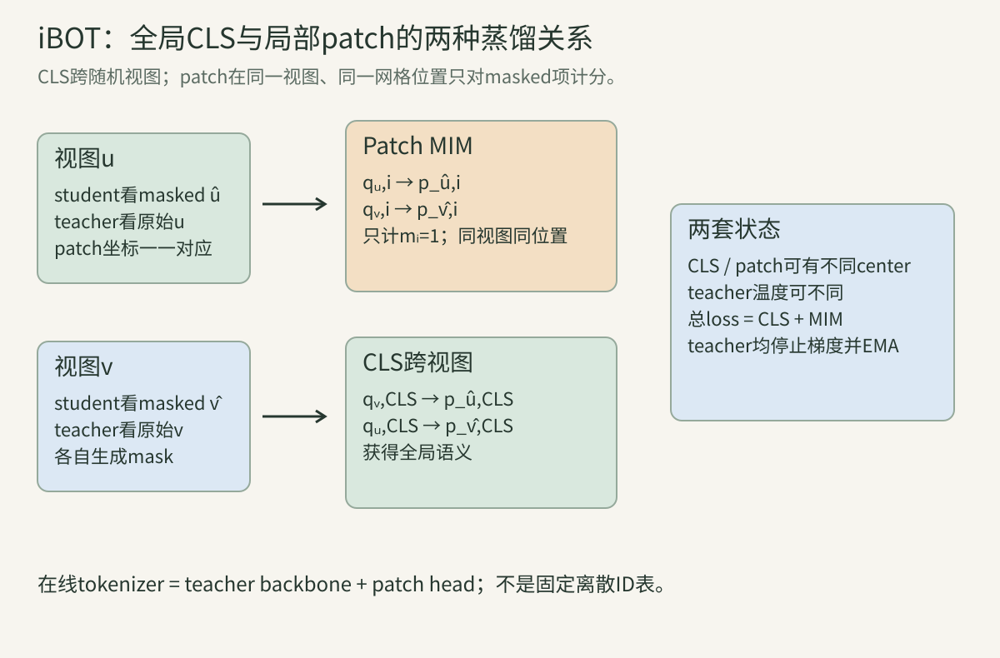
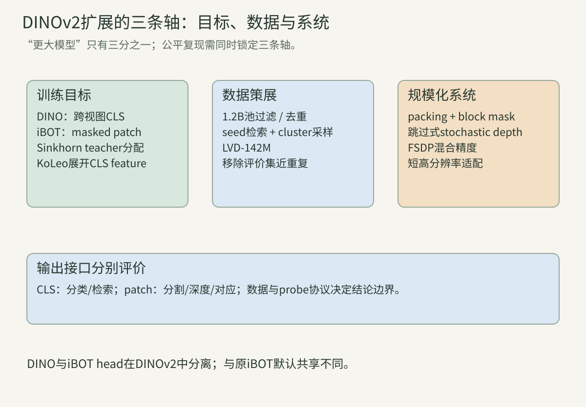
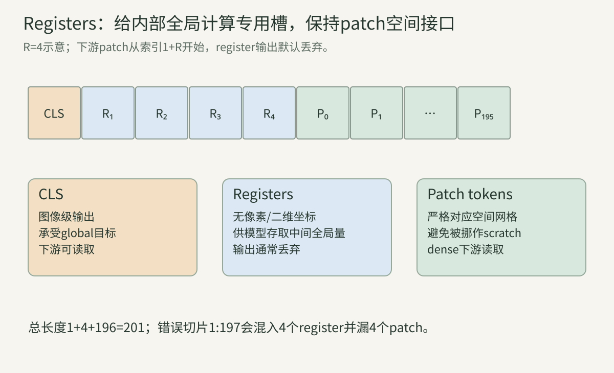
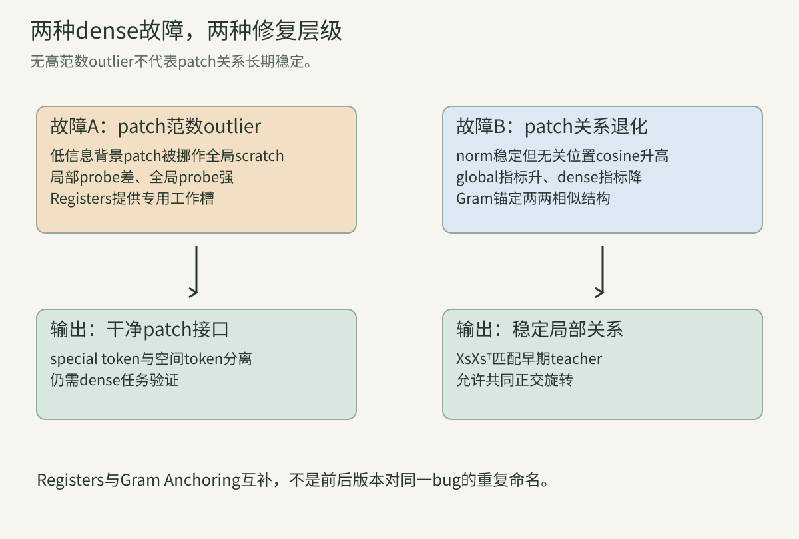
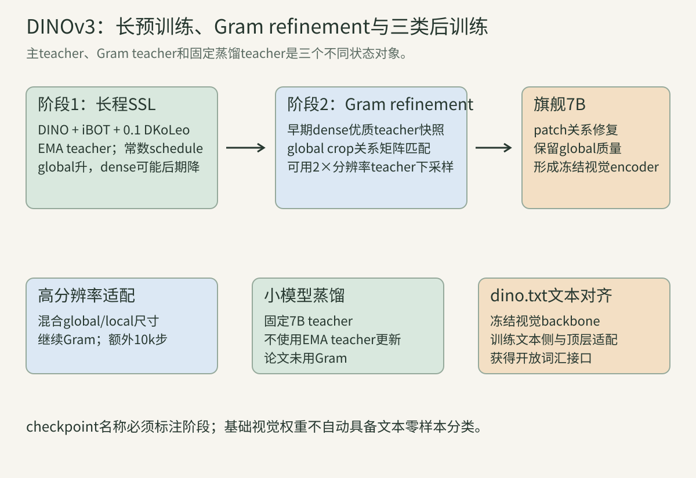

> 这条演进链不只是“模型越来越大”。iBOT把DINO的在线teacher从图像级CLS目标扩展到同位置patch目标；DINOv2把图像级、patch级与特征分散目标组合，并把数据策展和系统效率纳入算法；Registers发现大模型会挪用背景patch存全局信息；DINOv3进一步面对长训练中稠密相似结构退化，用早期模型的Gram矩阵锚定局部关系。本讲按原论文时间和张量接口拆开。

记每图patch数P、feature宽d、prototype数K。student/teacher分别为$s,t$；CLS输出描述全图，patch输出保留空间位置。mask向量$m_i=1$表示student位置i被替换并计入patch loss。所有“teacher目标”均停止梯度；但EMA teacher、center、Sinkhorn分配和Gram teacher是不同状态。

## 一、iBOT：把在线teacher变成视觉tokenizer

### 1. BEiT的离线tokenizer留下了两阶段依赖

第18讲BEiT先训练dVAE，再用固定离散ID监督MIM。tokenizer的数据、码本和量化误差会被主干继承，且预训练需两阶段。

iBOT问：能否用正在学习的teacher直接为每个patch产生软分布？这样tokenizer随当前数据共同演化，不需外部码本。代价是目标本身会漂移，必须继续处理坍塌和时间稳定性。

### 2. 在线tokenizer输出软分布而非永久token ID

teacher对未遮视图的patch $x_i$输出K维logit，经center与低温softmax得到$q_i$；student对同一视图被遮后的对应位置输出$p_i$。

$q_i$是当前teacher状态下的连续概率，不是写入磁盘后永远不变的词表ID。论文消融显示软目标优于hardmax，但这是其实验结果，不是所有数据的定理。

### 3. student看masked图，teacher看原视图

对增强视图u生成块状mask，student输入$\hat u$，被遮patch embedding换成可学习[MASK]；teacher输入未遮u。两支patch网格必须同位置对齐。

若teacher也看被遮图，目标会描述mask污染后的内容；若student看未遮原图，任务可直接复制。接口与第18讲BEiT相似，但目标网络在线变化。

### 算例A：四个patch中只监督哪两个？

mask=[0,1,1,0]时，student四位置均产生hidden，patch CE只对位置1、2求平均。teacher四位置都生成目标并用于center统计；位置0、3不直接进入本图MIM分子。

### 4. patch级MIM损失只匹配同一视图同一位置

单视图patch目标为：

$$L_{MIM}(u)=-\frac1{\sum_i m_i}\sum_i m_i\sum_k q_{u,i,k}\log p_{\hat u,i,k}.$$

这是in-view、same-position匹配；与CLS跨视图目标不同。两个增强视图u、v各自计算patch loss再平均。

### 5. CLS级目标继续做跨视图自蒸馏

student masked视图$\hat u$的CLS预测teacher未遮另一视图v的CLS，反向方向亦然：

$$L_{CLS}=\tfrac12H(q_t(v),p_s(\hat u))+\tfrac12H(q_t(u),p_s(\hat v)).$$

跨视图CLS提供全局语义，in-view patch恢复局部内容。两者相加，不应把patch目标也误配到另一个随机crop的同整数索引。

### 6. 随机crop后的整数索引不代表同一原图坐标

视图u的patch5和视图v的patch5只表示各自网格第五格；随机crop、resize后通常对应原图不同区域。iBOT原始MIM因此用u-teacher对$\hat u$-student。

跨视图patch匹配需要原图坐标重映射或feature correspondence，是另一目标。论文比较后没有把它作为默认。

### 7. teacher网络就是在线tokenizer

tokenizer不只是projection head：$h_t^{patch}\circ f_t$包含teacher backbone与patch head。teacher由student EMA得到，patch分布随训练逐步获得语义。

“在线”不等于本batch反向更新teacher；本步teacher仍stop-gradient，随后才EMA。它表示目标生成器随训练在线演化。

### 8. CLS与patch各有温度和center状态

iBOT伪代码维护$c_{CLS}\in\mathbb R^K$与$c_{patch}\in\mathbb R^{K'}$，并可使用不同teacher温度。patch center对所有teacher视图、样本和空间位置取均值。

把两者共用同一个buffer只有在维数相同且有意定义时才可能；即便K相同，CLS与patch分布统计也不同。

### 算例B：patch center分母漏P会怎样？

B2、两视图、P196时共有784个patch向量。若只除2B=4，center放大196倍；下步减center会使softmax极端失真。正确统计需除全局teacher patch行数。

### 9. blockwise mask提高空间缺失难度

散点mask常能从相邻像素插值；连续块迫使模型利用更远上下文。iBOT默认预测比例约0.3±0.2，并在多裁剪设置中可随机选择0或该范围，缓解masked全局与未masked局部的分布错配。

比例是采样分布，不能只记录均值0.3。块重叠、取整和无mask概率共同决定实际监督数。

### 10. mask替换保留完整encoder长度

原iBOT像BEiT一样用mask embedding替换patch，重型ViT仍处理完整网格。它不是MAE删除75%token的稀疏encoder路线。

因此MIM增加patch head输出与teacher前向，并不自动节省attention。比较预训练成本要对齐mask语义。

### 11. 共享head把CLS语义传给patch

原论文默认CLS与patch共享整个三层projection head，K8192。作者解释共享有助于把CLS跨视图获得的语义带给patch。

但student patch head只见masked token，输入分布与CLS不同；论文也测试半共享/分离。DINOv2在大规模训练中反而采用两个独立head，说明最佳选择随规模改变。

### 12. iBOT总目标是两种不同归约之和

$$L=L_{CLS}+L_{MIM}.$$

CLS项按合法视图pair与batch平均；MIM先对每图实际masked位置平均，再按视图和batch平均。直接相加权重1:1是原论文默认结论，不能忽略两个分母后再谈权重。

### 算例C：图均值和patch均值何时不同？

图A mask1个且loss2，图B mask3个且loss0。先每图masked mean再平均得1；全部4个masked patch平均得0.5。原伪代码先按每图mask数归一。

### 13. 软patch目标保留teacher不确定性

teacher分布[0.45,0.44,0.11]与[0.99,0.005,0.005]若hardmax都变类别0；软CE会给student不同梯度。低温能锐化但不完全丢掉次高信息。

连续目标仍依赖prototype坐标，不等于RGB或语义标签。它表达teacher当前的相似性分解。

### 14. patch target也需防坍塌

若所有patch都输出同一分布，MIM可以失去局部区分。iBOT对patch teacher同样使用centering和sharpening，但论文发现patch centering作用弱于CLS，温度更关键。

应分别监控patch逐位置entropy、跨位置方差和prototype边缘使用率；只看总loss会混合CLS与patch问题。

### 15. MIM只在mask位置直接产生head梯度

可见位置patch head不直接计分，但其backbone token可通过self-attention帮助masked位置，所以共享backbone仍收到间接梯度。

teacher所有位置不收本步反向梯度，却参与patch center与后续EMA。直接梯度、间接梯度和状态更新需分开。

### 16. multi-crop引入masked与unmasked分布选择

teacher只看全局未遮视图；student全局可能masked，局部通常未masked。若全局永远mask、局部永远不mask，CLS head输入分布不一致。

iBOT附录采用随机不mask部分全局视图缓解。不能从“multi-crop与DINO相同”推断所有student输入都同样处理。

### 17. iBOT的局部语义证据来自多种下游

论文展示patch pattern、attention、线性语义分割、检测/分割和遮挡鲁棒性。单张可视化是现象，dense benchmark才是定量证据；两者都依特定数据与协议。

更强局部特征不表示每个prototype对应一个可命名部件。prototype分布与backbone patch feature也不是同一接口。

### 18. iBOT与DINO的关系是添加patch级目标

DINO主要在CLS跨视图做分布匹配；iBOT保留该目标，并在masked patch上加同视图在线token恢复。它不是用MIM取代全局蒸馏。

只实现patch loss而去掉CLS，会失去论文用来使在线tokenizer获得全局语义的机制。

### 算例D：两视图、P4、各mask2项共有多少CE？

CLS有两个跨视图CE；patch端u与v各2个位置，共4个位置CE。总目标不是简单六项等权：CLS两项先均值，patch每图两项先均值，再将两种loss相加。

## 二、DINOv2：把目标、数据和系统一起扩展

### 19. DINOv2的核心目标组合DINO与iBOT

DINOv2同时使用图像级CLS自蒸馏$L_{DINO}$、masked patch自蒸馏$L_{iBOT}$和KoLeo特征分散正则。它仍是无文本自监督视觉encoder。

“v2”不表示只改一个loss；论文贡献横跨数据筛选、架构、训练稳定、效率、蒸馏和高分辨率适配。

### 20. 图像级与patch级head在规模化时解耦

原iBOT发现共享head较好；DINOv2在大规模实验观察相反，使用独立DINO head和iBOT head。独立head允许全局/局部目标在投影空间先专门化，共享backbone仍同时受两者约束。

这提醒我们：小规模消融的最佳配置不能无条件外推到1B模型和142M数据。

### 21. Sinkhorn-Knopp替代teacher的移动center归一

DINOv2用SwAV式Sinkhorn-Knopp在batch上平衡teacher prototype分配，论文实现迭代3次；student端仍做普通softmax。

SK交替缩放分配矩阵的行/列边缘，目标是防止少数prototype长期占满。它读取batch共同统计，和逐坐标EMA center不是同一算法。

### 算例E：2×2分配怎样被双向缩放？

正矩阵[[4,1],[1,1]]先归一总和，再交替把列和调为1/2、行和调为1/2；多轮后得到近似双随机分配。有限三轮通常只是近似，不应断言边缘精确。

### 22. SK的轴语义必须随矩阵定义核对

若Q shape为K×B，行是prototype、列是样本；转置成B×K后目标边缘对应轴也交换。代码中all-reduce的总和与world size还会影响全局平衡。

只抄“row normalize/column normalize”而不写shape，极易把样本和prototype反转。

### 23. KoLeo直接约束归一化CLS feature的最近邻距离

对batch单位向量$x_i$，令$d_i=\min_{j\ne i}\|x_i-x_j\|_2$：

$$L_{KoLeo}=-\frac1B\sum_i\log d_i.$$

最小化会增大最近邻距离，鼓励feature在单位球面展开。它不是InfoNCE：没有指定positive，也没有softmax候选分类。

### 24. KoLeo对重复feature会发散

若两样本feature完全相同，$d_i=0$，$-\log d_i=+\infty$；实现需epsilon/数值保护。最近邻索引是分段选择，距离相等处不可微或用框架子梯度。

它约束batch局部拥挤，不保证全数据均匀，也不直接约束patch feature。

### 算例F：三个单位点的KoLeo

$x_1=(1,0),x_2=(0,1),x_3=(-1,0)$。最近邻距离分别$\sqrt2,\sqrt2,\sqrt2$，loss为$-\log\sqrt2\approx-0.3466$。loss可为负，不代表错误。

### 25. DINOv2预训练目标是三项共同作用

可概括为$L=L_{DINO}+L_{iBOT}+\lambda L_{KoLeo}$，但实际还包含global/local各项权重、mask采样与teacher归一策略。

公式简写不能替代配置。复现应保存每项raw loss、乘权后贡献和有效样本数。

### 26. LVD-142M不是把1.2B网页图随机取142M

流程先做URL安全限制、PCA hash去重、NSFW过滤与可识别人脸模糊，得到约1.2B唯一图；再移除与评价集近重复，使用自监督embedding做检索式策展。

seed来源含ImageNet-22k/1k、Google Landmarks和细粒度集。由seed引导会提高下游相关性，也会引入选择偏置；“无标签训练”不等于数据选择无人工设计。

### 27. 检索式策展同时追求相关性与多样性

大seed集每query常取4个近邻；小seed集从对应cluster采样。取更多近邻会增加多个query命中同一图的碰撞，故N4是实验权衡。

Faiss和预训练ViT-H/16 embedding决定相似度几何。策展模型的偏差可传递到数据分布。

### 28. 去除评价集近重复是证据有效性要求

若预训练池含验证图或其近复制，冻结feature评价会被污染。DINOv2明确从uncurated池去除所用benchmark test/validation近重复。

哈希/embedding阈值不可能证明零泄漏；报告算法、阈值和漏检风险比一句“已去重”更可靠。

### 算例G：每query取4不等于最终大小4Q

若两个query共享同一近邻，去重后联合集少于8；同一图被多个curated源检索也会碰撞。最终142M由并集、过滤与采样共同决定，不可由query数简单相乘。

### 29. 短时高分辨率适配提升dense接口

大部分训练用224，末尾短阶段升到518；论文小规模消融显示全程高分辨率约3倍计算，而末尾10k步接近其效果。

高分辨率增加patch数并改变位置编码插值，既影响稠密特征也可能影响CLS。应区分适配前后checkpoint。

### 30. 模型蒸馏与自蒸馏teacher不是同一状态

训练小模型时，DINOv2使用已训练ViT-g作固定teacher，另保留student EMA作为最终模型，移除mask和stochastic depth，并在两个全局crop应用iBOT loss。

固定大teacher不再由当前student EMA得到。把“teacher”一词统一解释为同一更新式会写错。

### 31. sequence packing保持样本隔离但提高kernel利用率

全局与局部crop token长度不同。DINOv2将多个序列拼进长容器，用block-diagonal attention mask禁止跨序列读取；在正确mask下数学等价于分别前向。

packing改变执行布局，不改变样本身份。漏掉block mask会让不同图泄漏，pad/offset错误会静默污染目标。

### 32. 高效stochastic depth真正跳过被丢分支

普通实现先计算残差再乘0，省不了主计算。DINOv2打乱batch并只对保留的$(1-d)B$样本计算分支，再scatter回去；高drop rate时节省算力。

训练随机语义需与标准drop-path一致，且分布式seed不能让所有层/卡意外共享同一mask。

### 33. FSDP解决四份大状态的显存与通信

AdamW训练需student、teacher、optimizer一阶和二阶状态，1B参数FP32粗计16GB。FSDP把这些分片到多GPU，并用混合精度通信。

这是系统实现贡献，不改变loss公式，却决定1B模型能否训练。算法复现若OOM，不能据此否定目标本身。

### 算例H：1B参数为何四份FP32约16GB？

每份$10^9\times4$ byte约4GB，四份约16GB，未计gradient、activation、临时buffer和单位GB/GiB差异。峰值显存需实测。

### 34. 1B ViT-g按硬件友好维度重设

DINOv2 ViT-g宽1536、24头，每头64维，便于高效attention kernel；不同于早期ViT-g宽1408/16头。模型名称相近不保证结构一致。

架构、patch14、SwiGLU、LayerScale与stochastic depth共同定义backbone，不能只按参数量比较。

### 35. 冻结feature的多任务评价才支撑“通用”

论文覆盖分类、检索、分割、深度和动作等global/dense任务，并多用冻结backbone加轻量头。某一ImageNet线性分数不足以证明通用。

数据策展含与下游相似的seed概念，报告跨域与替代测试集有助于检验泛化。

### 算例I：线性分类高而深度差是否矛盾？

不矛盾。CLS全局可分性与patch几何/尺度信息是不同接口。DINOv3正是因长训练global继续升而dense下降，才提出新约束。

## 三、Registers：给模型合法的内部工作槽

### 36. artifact首先由patch feature范数异常暴露

Registers论文在DINOv2等ViT输出发现少量patch token范数约比普通token高一个数量级，常落在低信息背景。对DINOv2-g，论文用norm>150作分析阈值并测得约2.37%，这是特定模型经验阈值。

绝对150不能移植到任意LayerNorm、宽度或checkpoint。更稳妥是看分布双峰、分位数和任务相关性。

### 37. 高范数patch丢局部信息却携带全局信息

局部像素/位置probe显示outlier比普通patch差；拿单个outlier做图像分类却显著更强。证据支持它被挪作全局计算槽，而非简单数值噪声。

高范数本身不等于有害；问题是patch接口承诺空间位置，却被部分位置改作无关全局存储。

### 38. artifact在足够大、训练足够久的模型中出现

论文沿训练和模型规模观察：outlier约在训练三分之一后出现，较大模型更明显，原DINO小模型未见同样现象。

这是相关证据，不是唯一因果解释。监督方式、位置插值、架构和数据都可能参与。

### 算例J：背景位置高范数能否证明模型“关注背景”？

不能。该token可能被用作全局scratch space，空间内容反而被丢弃。需联合局部probe、全局probe与attention/value路径分析。

### 39. register token是额外可学习输入

在patch embedding后加入R个可学习token，类似CLS参与所有Transformer层。输出时丢弃register，只保留CLS和patch给常规下游。

register不携带外部信息，也不直接作为预测输出；它提供模型存取全局中间量的显式位置。

### 40. register与CLS职责并不相同

CLS输出被下游作为图像表示并承受全局目标；register的输出默认不用。模型可自由分工，论文观察不同register attention自然多样，但没有显式语义约束。

把register均值拼进下游feature是新接口，需独立验证。

### 41. patch索引要跳过CLS与全部register

序列常为`[CLS, REG_1...REG_R, patch_1...patch_P]`，patch起点是1+R。若仍从索引1取patch，会把register reshape进空间图并丢尾部真实patch。

这类错误shape可能仍是P×d，最需坐标单元测试。

### 算例K：P196、R4时各切片是什么？

总长度201。CLS是0，register为1:5，patch为5:201。误用1:197会混入4个register并漏最后4个patch。

### 42. register把高范数行为从patch移到专用槽

训练后patch范数outlier消失，高范数集中于register；说明模型仍需要某种全局工作空间，只是空间patch不再被挪用。

这支持“提供合法槽位”解释，但不表示register内部每个维度可解释。

### 43. 一个register已去artifact，论文常用四个

消融0/1/2/4/8/16显示至少1个即可让可视artifact消失，dense任务存在最优区间，分类可随更多register提升；论文多数实验用4。

R是容量超参而非越多越好。常用4时FLOP增加低于2%，但高分辨率下精确成本仍随序列长度变化。

### 44. register不是训练后随意插入零token

论文方案从训练阶段加入可学习register，让网络学会使用。给无register checkpoint在推理时硬插token会改变位置和attention，原论文没有保证等价。

后续“test-time registers”是另一项2025研究，应单独评价，不能倒写为2023原方法。

### 45. 位置编码策略必须明确register是否占空间坐标

register不对应图像格，不应像patch一样赋二维网格位置。常见实现为CLS/register独立token参数，patch位置编码只加在patch部分。

若插值位置表时把register算入方形网格，坐标会错。动态尺寸接口需先分special tokens与patch tokens。

### 46. artifact与插值条纹是两个问题

论文附录发现DINOv2位置编码从16×16插到7×7若无antialias会产生垂直条纹；加antialias去条纹，但背景高范数outlier机制仍需register处理。

视觉上都像噪点/条纹，修复层级不同。要分别做插值对照与register对照。

### 算例L：为何不能删掉所有高范数patch？

阈值依模型，删token改变后续层attention，且outlier含全局信息。正确方案在训练中提供register并保留完整patch接口；后处理删除只是另一算法。

### 47. dense性能提升来自更干净的patch接口

论文在冻结feature的ADE20k、NYUd及object discovery中比较有/无register，DINOv2+reg在其实验改善；分类未退化。

这比只展示平滑PCA图更强，但结论仍限于其训练和评价。不能推为任意ViT加4个token必提升。

### 48. Registers解决范数outlier，不解决全部长期退化

DINOv3发现即便有4个register、patch norm稳定，长训练中patch间cosine结构仍变差、CLS与patch越来越相似，dense指标下降。

因此“无高范数点”不是“局部结构永久健康”。下一节的Gram anchoring针对另一故障。

## 四、DINOv3：长训练、稠密退化与Gram Anchoring

### 49. DINOv3扩大数据与模型但保留双层自监督核心

旗舰teacher为ViT-7B约6.7B参数、40 blocks、宽4096、32头、patch16、4 registers和RoPE；DINO/iBOT分别有独立head，并加distributed KoLeo。

预训练初始目标为：
$$L_{pre}=L_{DINO}+L_{iBOT}+0.1L_{DKoLeo}.$$

### 50. 数据从17B池策展到LVD-1689M并混合多部分

第一部分以DINOv2 embedding做5级层次k-means和平衡采样，得到约1.689B图；第二部分由seed检索强调任务相关概念；第三部分加入公开CV数据。

训练以10%概率取ImageNet1k同质batch，其余取混合数据。无文本loss不表示数据无平台审核、seed或采样先验。

### 51. RoPE-box jitter提高尺度与长宽比鲁棒性

patch坐标先归一到[-1,1]盒，再随机把盒缩放为[-s,s]，$s\in[0.5,2]$。这改变相对相位尺度，使模型不把固定训练分辨率当唯一坐标制式。

它不是随机裁剪本身；crop改变像素内容，box jitter改变位置编码坐标。

### 52. 常数超参数让训练时长可继续扩展

DINOv3 warmup后使用常数学习率、weight decay和teacher EMA momentum，避免预先绑定总训练步数；teacher温度仍有线性warmup。

“可无限继续”是工程目标，不代表表示质量所有维度单调。dense退化正说明必须持续多任务监控。

### 算例M：P16、global256为何与DINOv2 P14/global224同patch数？

$256/16=16$，$224/14=16$，两者都是16×16=256 patch。local112/P16与98/P14也都是7×7=49，所以每图有效序列长度近似保持。

### 53. 长训练出现global升、dense降的分叉

论文观察ImageNet线性分类持续提高，VOC线性分割约200k后下降；patch cosine map从局部平滑变为许多无关位置高相似。

该问题不是register论文的高范数outlier：patch norm可稳定，却逐渐丢局部差异，CLS与patch相似度上升。

### 54. Gram矩阵保存patch两两关系

对每行L2归一化的patch feature $X\in\mathbb R^{P\times d}$，Gram矩阵$G=XX^T\in\mathbb R^{P\times P}$，$G_{ij}$是patch i/j余弦相似度。

它不保存坐标的绝对feature方向，却保存所有两两角度。对dense任务，邻域与远处patch的关系结构比单patch向量坐标更直接。

### 55. Gram anchoring匹配student与早期teacher的关系结构

$$L_{Gram}=\|X_sX_s^T-X_gX_g^T\|_F^2.$$

$X_g$来自dense性质较好的早期Gram teacher，均停止梯度。student可整体旋转feature空间，只要patch关系保持；直接feature MSE则会固定坐标方向。

### 算例N：共同正交旋转为何Gram不变？

若$Y=XQ$且$QQ^T=I$，则$YY^T=XQQ^TX^T=XX^T$。所以Gram loss对共同正交基变换不敏感，这就是“约束关系而非绝对feature”的数学含义。

### 56. Gram loss的尺寸与成本是$P^2$

每个global crop产生P×P相似矩阵；高分辨率使P按面积增大，Gram存储/计算按P²快速增长。论文只在global crops使用，并在1M步后进入refinement以省成本。

归约必须记录是sum还是mean。原论文公式写Frobenius平方，实际代码的MSE归约会影响数值权重。

### 57. Gram teacher是早期快照并周期刷新

初始选100k/200k附近、dense较好的teacher；refinement中每10k步将Gram teacher更新为当前EMA teacher。太晚的1M快照自身局部一致性较差，消融结果较弱。

它不是每步EMA teacher，也不是固定到训练结束完全不变。主teacher与Gram teacher要分别checkpoint。

### 58. 高分辨率Gram teacher先细化再下采样

teacher输入2倍分辨率，产生更密patch map，再用bicubic将feature map下采样2倍，与student网格对齐后构造Gram。论文认为这兼得高分辨率细节与平滑关系，并额外改善dense任务。

应先下采样feature再算目标Gram；直接把高分辨率P'×P' Gram resize到P×P是另一操作。

### 算例O：512/P16到256/P16的网格怎样对齐？

teacher为32×32=1024 patch，feature map按空间双三次下采样到16×16=256行，再L2归一化并算256×256 Gram，与student一致。

### 59. refinement目标增加Gram而非替换DINO/iBOT

$$L_{ref}=w_D L_{DINO}+L_{iBOT}+w_{DK}L_{DKoLeo}+w_G L_{Gram}.$$

论文观察Gram加入后iBOT loss下降更快、DINO global loss影响较小，支持它主要修复局部结构。仍需用dense指标验证，不从loss相关性直接推因果全部机制。

### 60. 后训练还包含高分辨率适配、蒸馏与文本对齐

高分辨率阶段额外10k步，global尺寸从{512,768}、local从{112,168,224,336}采样并继续Gram；小模型用固定7B teacher蒸馏，此时未观察同类退化而不加Gram；dino.txt则冻结视觉encoder，以对比目标训练文本侧与两层视觉适配器。

这些是三个不同产品接口。纯DINOv3视觉feature本身没有天然文本零样本类别名；开放词汇能力来自后续对齐。

### 算例P：Gram低是否证明dense任务必高？

不能。Gram只匹配选定teacher的相似结构；若teacher局部结构有偏或下游需绝对方向，低loss不保证高mIoU/低RMSE。它是正则目标，效果由消融和多任务评价支持。

### 算例Q：Registers与Gram Anchoring分别修什么？

Registers给全局计算专用槽，消除patch范数outlier；Gram anchoring在norm稳定后仍约束patch两两cosine结构，修长训练局部一致性退化。二者互补。

### 算例R：固定7B蒸馏为何不必使用Gram teacher？

小student的外部teacher固定且质量高，不发生teacher随student长程共同漂移；论文未观察同类patch一致性问题，故省去Gram。不是因为小模型理论上永不退化。

### 算例S：DINOv3有文本零样本能力吗？

基础视觉backbone输出无文本语义坐标。dino.txt后训练冻结视觉侧、训练文本encoder并加入视觉顶层，使图文对齐；应标注checkpoint是否经过文本对齐。

### 算例T：如何证明长训练dense退化而非probe噪声？

冻结多个时间checkpoint，用同一数据、同一linear probe超参和多seed；同时看VOC/ADE/深度、patch cosine map与norm分布。若global升、多个dense指标一致降且Gram消融恢复，证据才更强。

## 五、四个可运行核对程序

下面程序只用Python标准库，验证目标的轴、归约与不变量；不训练真实ViT。

### 程序一：iBOT masked patch软交叉熵

~~~python
import math
def softmax(z):
    m=max(z); e=[math.exp(x-m) for x in z]; return [x/sum(e) for x in e]
teacher=[[.4,.1,-.2],[.1,.3,0],[-.2,.2,.4],[.3,-.1,.1]]
student=[[.2,0,-.1],[0,.2,.1],[.1,-.2,.3],[.4,0,-.2]]
center=[.05,.10,-.05]; mask=[0,1,1,0]; ts,tt=.2,.1
qs=[softmax([(x-c)/tt for x,c in zip(row,center)]) for row in teacher]
ps=[softmax([x/ts for x in row]) for row in student]
losses=[-sum(q*math.log(p) for q,p in zip(qs[i],ps[i])) for i in range(4)]
loss=sum(m*l for m,l in zip(mask,losses))/sum(mask)
print('per_patch_ce:',[round(x,6) for x in losses])
print('masked_mean:',round(loss,10),'used_positions:',[i for i,m in enumerate(mask) if m])
# 一个视图B1P4的patch center：按P而非只按B除。
patch_center=[sum(row[k] for row in teacher)/len(teacher) for k in range(3)]
print('raw_patch_center:',[round(x,6) for x in patch_center])
~~~

输出只使用位置1、2；patch center按4个raw teacher logits平均。真实iBOT还对两个视图、batch与多卡汇总。

### 程序二：Sinkhorn交替平衡与KoLeo

~~~python
import math
q=[[4.,1.],[1.,1.]]
q=[[x/sum(map(sum,q)) for x in row] for row in q]
for _ in range(20):
    # prototype行边缘各1/2
    for i in range(2):
        s=sum(q[i]); q[i]=[x*(.5/s) for x in q[i]]
    # sample列边缘各1/2
    for j in range(2):
        s=sum(q[i][j] for i in range(2))
        for i in range(2): q[i][j]*=.5/s
print('sinkhorn:',[[round(x,6) for x in row] for row in q])
print('row_sums:',[round(sum(r),6) for r in q])
print('col_sums:',[round(sum(q[i][j] for i in range(2)),6) for j in range(2)])
xs=[(1.,0.),(0.,1.),(-1.,0.)]
ds=[]
for i,x in enumerate(xs):
    ds.append(min(math.dist(x,y) for j,y in enumerate(xs) if i!=j))
koleo=-sum(math.log(d) for d in ds)/len(ds)
print('nearest_distances:',[round(d,6) for d in ds],'koleo:',round(koleo,10))
~~~

20轮教学迭代得到近似双随机边缘；三单位点KoLeo约−0.3465735903。

### 程序三：register切片与attention成本

~~~python
P,R=196,4
tokens=['CLS']+[f'REG{i}' for i in range(R)]+[f'P{i}' for i in range(P)]
cls=tokens[0]; regs=tokens[1:1+R]; patches=tokens[1+R:]
print('length:',len(tokens),'cls:',cls,'regs:',regs,'patch_ends:',patches[0],patches[-1])
base=(P+1)**2; with_reg=(P+R+1)**2
print('score_item_increase_percent:',round(100*(with_reg/base-1),6))
wrong=tokens[1:1+P]
print('wrong_patch_slice_head_tail:',wrong[:4],wrong[-4:])
assert len(patches)==P and patches[0]=='P0' and patches[-1]=='P195'
~~~

R4时序列201，纯attention score项约增4.10%；论文整模型FLOP测算低于2%，因为其他项与具体配置不同。错误切片会把4个register当patch。

### 程序四：Gram旋转不变性与差分梯度

~~~python
import math
X=[[1.,0.],[0.,1.],[2**-.5,2**-.5]]
Q=[[0.,-1.],[1.,0.]]             # 90度正交旋转
Y=[[sum(x[k]*Q[k][j] for k in range(2)) for j in range(2)] for x in X]
def gram(a): return [[sum(x*y for x,y in zip(r,s)) for s in a] for r in a]
GX,GY=gram(X),gram(Y)
print('max_rotation_gram_error:',max(abs(GX[i][j]-GY[i][j]) for i in range(3) for j in range(3)))
T=[[1.,0.],[.2,.98],[.6,.8]]
def loss(a):
    g,t=gram(a),gram(T)
    return sum((g[i][j]-t[i][j])**2 for i in range(3) for j in range(3))/9
def grad(a):
    # L=mean((XX^T-Gt)^2), dL/dX=4(EX)/P^2，E对称。
    g,t=gram(a),gram(T); E=[[g[i][j]-t[i][j] for j in range(3)] for i in range(3)]
    return [[4*sum(E[i][j]*a[j][k] for j in range(3))/9 for k in range(2)] for i in range(3)]
G=grad(X); eps=1e-6; err=0.
for i in range(3):
  for k in range(2):
    a=[r[:] for r in X]; b=[r[:] for r in X]; a[i][k]+=eps; b[i][k]-=eps
    err=max(err,abs((loss(a)-loss(b))/(2*eps)-G[i][k]))
print('loss:',round(loss(X),10),'gradient_max_error:',f'{err:.3e}')
~~~

正交旋转Gram误差为0；未含L2-normalize Jacobian的toy Gram MSE解析梯度通过差分。真实DINOv3先归一化feature，反向还要经过归一化。

## 六、练习与完整解析

### 练习1：iBOT的online tokenizer是否由student当前梯度直接更新？
**解析：** teacher本步stop-gradient，参数在student optimizer后由EMA更新；“online”指随训练演化，不指接收当前loss反向。

### 练习2：iBOT patch loss为何不能跨随机crop用同整数索引？
**解析：** 两个crop的网格坐标系不同，同索引通常不是原图同区域。原目标在同一视图的masked student与unmasked teacher间匹配。

### 练习3：mask位置以外的patch完全没有学习信号吗？
**解析：** head无直接patch CE，但可见token通过attention影响masked token；共享backbone还受CLS目标。

### 练习4：teacher patch center应对哪些轴平均？
**解析：** 对teacher全局视图、batch、空间patch轴平均，保留prototype轴；多卡再做全局sum/count。

### 练习5：soft patch target与hard ID的区别？
**解析：** 软分布保留次高概率与不确定性；hardmax只保留最大坐标。两者梯度和信息量不同。

### 练习6：iBOT为何还需要CLS loss？
**解析：** CLS跨视图提供全局语义/不变性，并帮助在线patch tokenizer形成语义；原iBOT不是纯MIM。

### 练习7：共享head是DINOv2默认吗？
**解析：** 不是。原iBOT默认共享较好，DINOv2在规模化时用独立DINO/iBOT heads。

### 练习8：Sinkhorn和center EMA是否同一归一化？
**解析：** 不是。SK在当前全局batch交替平衡样本/prototype边缘；center是历史logit逐坐标EMA后在softmax前相减。

### 练习9：KoLeo需要人工正负样本吗？
**解析：** 不需要指定positive；它寻找每个feature最近的其他点并增大距离，防局部拥挤。

### 练习10：KoLeo为负表示训练失败吗？
**解析：** 不表示。单位球上距离可大于1，$-\log d$可为负；比较需用同一归约和epsilon。

### 练习11：LVD-142M为何仍有策展偏差？
**解析：** seed数据、embedding、相似度、聚类与过滤规则决定保留概念。无类别loss不等于数据选择中性。

### 练习12：去重为何要对benchmark验证/测试集做？
**解析：** 防预训练看到评价图近复制导致泄漏；训练集是否作为seed是另一政策，必须区分。

### 练习13：sequence packing怎样保持数学隔离？
**解析：** block-diagonal attention mask禁止不同序列互读，且loss/位置offset保留各样本身份。

### 练习14：短高分辨率适配为何省计算？
**解析：** token数随面积增大、attention随其平方增大；只在末尾少量步支付高分辨率成本。

### 练习15：Register是否是额外patch？
**解析：** 不是。它无二维图像位置和像素内容，是可学习special token，输出默认丢弃。

### 练习16：R4时patch从哪个序列索引开始？
**解析：** `[CLS,4 REG,patches]`中从索引5开始；长度为1+4+P。

### 练习17：高范数token一定是重要前景吗？
**解析：** 不是。论文outlier常在冗余背景，被模型挪作全局存储；需联合局部/全局probe判断。

### 练习18：为什么一个register能去artifact却常用四个？
**解析：** 一个已提供工作槽；更多可给内部计算容量，论文下游消融常在4附近表现好。不是数学必需数。

### 练习19：推理时给旧模型硬插四个零token等价吗？
**解析：** 不等价。原方法从训练开始学习register及其交互；未经训练插入会改变attention和位置接口。

### 练习20：Registers能保证dense性能永不退化吗？
**解析：** 不能。它处理范数outlier；DINOv3在norm稳定时仍观察patch cosine关系随长训练退化。

### 练习21：Gram矩阵的每项是什么？
**解析：** 行归一化后$G_{ij}=x_i^Tx_j$，即patch i/j余弦相似度；shape P×P。

### 练习22：Gram相同是否表示feature逐元素相同？
**解析：** 不表示。共同正交旋转保持Gram不变；Gram约束两两关系而非绝对坐标。

### 练习23：为何用早期Gram teacher？
**解析：** 早期checkpoint在论文监控中dense局部一致性较好；过晚teacher自身已退化，锚定价值下降。

### 练习24：高分辨率teacher应先算Gram再resize吗？
**解析：** 论文先把高分辨率feature map下采样到student网格，再算Gram；直接resize Gram不是同一运算。

### 练习25：Gram loss只用于global crop的原因之一？
**解析：** 关系矩阵为P²成本，global提供较完整结构；论文据此限定接口并控制成本。

### 练习26：DINOv3为何warmup后用常数schedule？
**解析：** 便于未知终点的持续训练，减少依赖总步数的超参；但dense指标仍需监控，不能盲目延长。

### 练习27：DINOv3视觉checkpoint是否天然开放词汇？
**解析：** 不天然。dino.txt后训练冻结视觉encoder并训练文本对齐组件，才获得图文零样本接口。

### 练习28：四个程序通过后还未证明什么？
**解析：** 未复现大规模训练、SK分布式实现、LVD策展、真实artifact、dense退化、Gram修复幅度或论文指标；程序只核对toy轴、归约、不变量和梯度。

## 七、来源、版本与下一讲

本文程序已运行核对iBOT mask归约、Sinkhorn边缘、KoLeo、register切片/成本和Gram旋转不变量/差分梯度。它们不构成模型训练或论文数值复现。

下一讲[第21讲](../vision-21-rcnn-fpn-yolo/)进入R-CNN、Fast/Faster R-CNN、FPN和YOLO，建立检测框、proposal、anchor、RoIAlign、NMS与单/双阶段路线。返回[课程总览](../vision-00-overview/)；[第18讲](../vision-18-masked-modeling/)补MIM，[第19讲](../vision-19-dino/)补原版DINO。

### 原论文与固定作者实现

- [Zhou等：iBOT](https://arxiv.org/abs/2111.07832)，ICLR 2022；[作者实现@da316d8](https://github.com/bytedance/ibot/tree/da316d82636a7a7356835ef224b13d5f3ace0489)核对双目标、两套center/温度、mask归约和head配置。
- [Oquab等：DINOv2](https://arxiv.org/abs/2304.07193)，TMLR 2024；[作者实现@7764ea0](https://github.com/facebookresearch/dinov2/tree/7764ea0f912e53c92e82eb78a2a1631e92725fc8)核对iBOT/KoLeo、packing、register接口和模型实现。
- [Darcet等：Vision Transformers Need Registers](https://arxiv.org/abs/2309.16588)，ICLR 2024，核对高范数artifact的probe证据、register切片和数量消融。
- [Siméoni等：DINOv3](https://arxiv.org/abs/2508.10104)，2025；[作者实现@6876159](https://github.com/facebookresearch/dinov3/tree/6876159a11b4df116f30f667f8c9888617df0751)核对Gram loss、训练配置与模型接口。

资料核对日期：2026-10-08。DINOv3属于持续更新的前沿项目，本章把论文结论、固定commit代码与后续推论分开；没有下载受许可约束的权重或运行作者训练入口。
